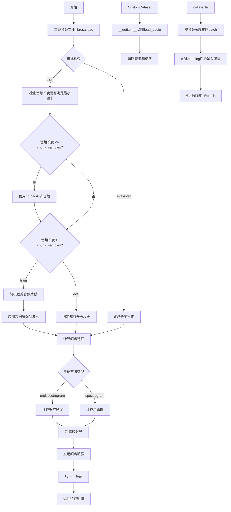
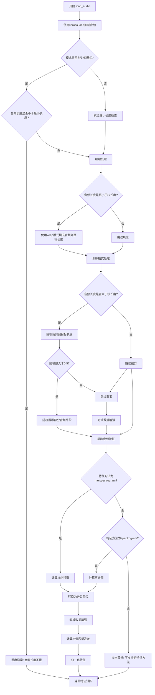
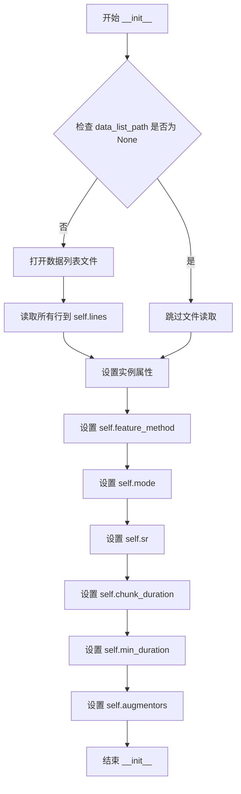
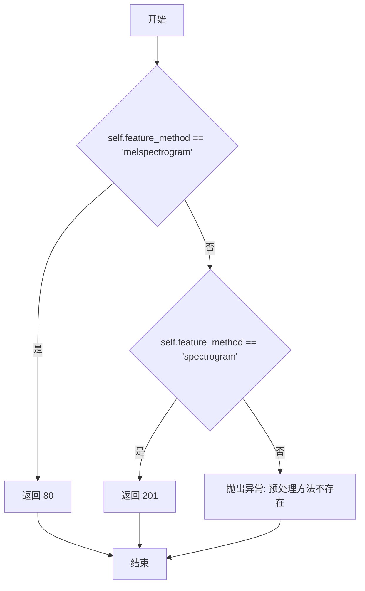

# `Chat-Haruhi-Suzumiya\yuki_builder\audio_feature_ext\data_utils\reader.py` 详细设计文档

该模块是一个音频数据处理和加载框架，专注于将原始音频文件转换为深度学习模型可用的梅尔频谱或声谱图特征，支持训练、评估和推理三种模式，并提供数据增强和批量数据处理功能，主要用于语音识别或音频分类任务。

## 整体流程



## 类结构

```
Global Functions
├── load_audio (音频加载与特征提取)
└── collate_fn (batch数据整理)
CustomDataset (PyTorch数据集类)
├── __init__ (初始化)
├── __getitem__ (获取样本)
├── __len__ (数据集长度)
└── input_size (输入尺寸属性)
```

## 全局变量及字段


### `wav`
    
原始音频波形数据

类型：`np.ndarray`
    


### `sr_ret`
    
返回的采样率

类型：`int`
    


### `num_wav_samples`
    
音频样本数

类型：`int`
    


### `num_chunk_samples`
    
目标片段样本数

类型：`int`
    


### `features`
    
提取的音频特征

类型：`np.ndarray`
    


### `mean`
    
特征均值

类型：`np.ndarray`
    


### `std`
    
特征标准差

类型：`np.ndarray`
    


### `batch`
    
一个batch的数据

类型：`list`
    


### `inputs`
    
padding后的输入张量

类型：`np.ndarray`
    


### `input_lens`
    
各样本长度比例

类型：`list`
    


### `labels`
    
样本标签

类型：`list`
    


### `CustomDataset.lines`
    
音频文件路径和标签列表

类型：`list`
    


### `CustomDataset.feature_method`
    
特征提取方法

类型：`str`
    


### `CustomDataset.mode`
    
运行模式(train/eval/infer)

类型：`str`
    


### `CustomDataset.sr`
    
采样率

类型：`int`
    


### `CustomDataset.chunk_duration`
    
音频片段时长

类型：`float`
    


### `CustomDataset.min_duration`
    
最小音频时长

类型：`float`
    


### `CustomDataset.augmentors`
    
数据增强器

类型：`dict`
    
    

## 全局函数及方法


### `load_audio`

该函数是音频数据加载和预处理的核心函数，负责读取音频文件、根据不同模式（训练/评估/推理）进行长度处理和增强、提取音频特征（梅尔频谱或声谱图），最后进行归一化处理。

参数：

- `audio_path`：`str`，音频文件的路径
- `feature_method`：`str`，特征提取方法，默认为'melspectrogram'，可选'spectrogram'
- `mode`：`str`，数据处理模式，包括'train'、'eval'、'infer'
- `sr`：`int`，采样率，默认为16000 Hz
- `chunk_duration`：`float`，训练或评估时使用的音频长度（秒），默认为3秒
- `min_duration`：`float`，最小音频长度（秒），低于此长度的音频将抛出异常，默认为0.5秒
- `augmentors`：`dict`，数据增强方法字典，包含时域增强和频域增强方法

返回值：`numpy.ndarray`，归一化后的音频特征矩阵

#### 流程图



#### 带注释源码

```python
def load_audio(audio_path,
               feature_method='melspectrogram',
               mode='train',
               sr=16000,
               chunk_duration=3,
               min_duration=0.5,
               augmentors=None):
    """
    加载并预处理音频
    :param audio_path: 音频路径
    :param feature_method: 预处理方法
    :param mode: 对数据处理的方式，包括train，eval，infer
    :param sr: 采样率
    :param chunk_duration: 训练或者评估使用的音频长度
    :param min_duration: 最小训练或者评估的音频长度
    :param augmentors: 数据增强方法
    :return: 归一化后的音频特征矩阵
    """
    # 读取音频数据，使用librosa加载并重采样到指定采样率
    wav, sr_ret = librosa.load(audio_path, sr=sr)
    num_wav_samples = wav.shape[0]
    
    # 训练模式下检查音频长度是否满足最小要求
    if mode == 'train':
        if num_wav_samples < int(min_duration * sr):
            raise Exception(f'音频长度小于{min_duration}s，实际长度为：{(num_wav_samples/sr):.2f}s')
    
    # 计算目标块所需的样本数
    num_chunk_samples = int(chunk_duration * sr)
    
    # 如果音频长度小于目标块长度，使用wrap模式填充
    if num_wav_samples <= num_chunk_samples:
        shortage = num_chunk_samples - num_wav_samples
        wav = np.pad(wav, (0, shortage), 'wrap')
    
    # 训练模式下的数据处理
    if mode == 'train':
        # 随机裁剪音频到目标长度
        num_wav_samples = wav.shape[0]
        num_chunk_samples = int(chunk_duration * sr)
        if num_wav_samples > num_chunk_samples + 1:
            start = random.randint(0, num_wav_samples - num_chunk_samples - 1)
            stop = start + num_chunk_samples
            wav = wav[start:stop]
            
            # 50%概率进行随机切断增强（将开始和结束部分置零）
            if random.random() > 0.5:
                wav[:random.randint(1, sr // 4)] = 0
                wav = wav[:-random.randint(1, sr // 4)]
        
        # 执行时域数据增强（排除specaug）
        if augmentors is not None:
            for key, augmentor in augmentors.items():
                if key == 'specaug':  # specaug是频域增强，稍后处理
                    continue
                wav = augmentor(wav)
    
    # 评估模式下裁剪音频避免显存溢出
    elif mode == 'eval':
        num_wav_samples = wav.shape[0]
        num_chunk_samples = int(chunk_duration * sr)
        if num_wav_samples > num_chunk_samples + 1:
            wav = wav[:num_chunk_samples]
    
    # 根据指定方法提取音频特征
    if feature_method == 'melspectrogram':
        # 计算梅尔频谱：80个梅尔滤波器bank，400点FFT，160 hop长度，400窗口长度
        features = librosa.feature.melspectrogram(y=wav, sr=sr, n_fft=400, n_mels=80, hop_length=160, win_length=400)
    elif feature_method == 'spectrogram':
        # 计算短时傅里叶变换获取声谱图
        linear = librosa.stft(wav, n_fft=400, win_length=400, hop_length=160)
        features, _ = librosa.magphase(linear)
    else:
        raise Exception(f'预处理方法 {feature_method} 不存在！')
    
    # 将功率谱转换为分贝单位
    features = librosa.power_to_db(features, ref=1.0, amin=1e-10, top_db=None)
    
    # 训练模式下执行频域数据增强（specaug）
    if mode == 'train' and augmentors is not None:
        for key, augmentor in augmentors.items():
            if key == 'specaug':
                features = augmentor(features)
    
    # 对特征进行归一化处理（减均值除标准差）
    mean = np.mean(features, 0, keepdims=True)
    std = np.std(features, 0, keepdims=True)
    features = (features - mean) / (std + 1e-5)
    
    return features
```


### `collate_fn`

该函数是PyTorch DataLoader的回调函数，负责对一个batch的音频数据进行后处理，主要完成变长序列的padding对齐操作，按音频长度降序排序batch数据，计算每个样本的长度比例，并返回适合模型训练的Tensor格式。

参数：

-  `batch`：`list`，从DataLoader获取的批次数据，每个元素为元组 (features, label)，其中features为numpy.ndarray音频特征，label为int64类型的标签

返回值：`tuple`，包含三个torch.Tensor：
  - `inputs`：`torch.Tensor`，形状为(batch_size, freq_size, max_audio_length)，float32类型，已padding的音频特征张量
  - `labels`：`torch.Tensor`，形状为(batch_size,)，int64类型，对应音频的标签
  - `input_lens`：`torch.Tensor`，形状为(batch_size,)，float32类型，每个样本长度占最大长度的比例

#### 流程图

```mermaid
flowchart TD
    A[接收batch数据] --> B[按音频长度降序排序]
    B --> C[获取频谱维度freq_size和最大音频长度max_audio_length]
    C --> D[获取batch_size]
    D --> E[创建零张量inputs shape=(batch_size, freq_size, max_audio_length)]
    E --> F[遍历batch中的每个样本]
    F --> G[提取特征tensor和标签label]
    G --> H[计算当前样本序列长度seq_length]
    H --> I[将特征填充到零张量对应位置]
    I --> J[计算长度比例 seq_length/max_audio_length]
    J --> K[累加到input_lens列表]
    K --> L{是否遍历完所有样本?}
    L -->|否| F
    L -->|是| M[转换为numpy数组]
    M --> N[转换为torch.Tensor]
    N --> O[返回inputs, labels, input_lens]
```

#### 带注释源码

```python
# 对一个batch的数据处理
def collate_fn(batch):
    # 步骤1: 找出音频长度最长的样本，并按长度降序排序
    # 这有助于模型处理变长输入，通常将长样本排在前面
    batch = sorted(batch, key=lambda sample: sample[0].shape[1], reverse=True)
    
    # 获取频谱维度（特征维度），即梅尔频谱的频带数
    freq_size = batch[0][0].shape[0]
    # 获取当前batch中最大音频长度（帧数）
    max_audio_length = batch[0][0].shape[1]
    # 获取batch大小
    batch_size = len(batch)
    
    # 步骤2: 以最大长度创建零张量，用于padding对齐
    # 形状: (batch_size, freq_size, max_audio_length)
    # dtype='float32' 确保与模型计算精度一致
    inputs = np.zeros((batch_size, freq_size, max_audio_length), dtype='float32')
    
    # 初始化存储列表
    input_lens = []  # 存储每个样本的长度比例
    labels = []      # 存储每个样本的标签
    
    # 步骤3: 遍历batch中的每个样本
    for x in range(batch_size):
        # 获取当前样本（特征，标签）
        sample = batch[x]
        # 提取特征tensor
        tensor = sample[0]
        # 提取标签
        labels.append(sample[1])
        
        # 计算当前样本的序列长度（帧数）
        seq_length = tensor.shape[1]
        
        # 步骤4: 将数据插入到零张量中，实现padding
        # 将特征填充到对应位置，超出部分保持为0
        inputs[x, :, :seq_length] = tensor[:, :]
        
        # 步骤5: 计算当前样本长度占最大长度的比例
        # 这在CTCLoss等变长输出场景中非常重要
        input_lens.append(seq_length/max_audio_length)
    
    # 步骤6: 转换为numpy数组
    input_lens = np.array(input_lens, dtype='float32')
    labels = np.array(labels, dtype='int64')
    
    # 步骤7: 转换为torch.Tensor
    # 返回值顺序: (inputs, labels, input_lens)
    # 注意: 标签被放在第二个位置，与某些框架不同
    return torch.tensor(inputs), torch.tensor(labels), torch.tensor(input_lens)
```


### `CustomDataset.__init__`

初始化音频数据集，加载数据列表文件并设置音频处理相关参数

参数：

-  `data_list_path`：`str` 或 `None`，数据列表文件路径，每行包含音频路径和标签，用制表符分隔
-  `feature_method`：`str`，音频特征提取方法，默认为'melspectrogram'（梅尔频谱）
-  `mode`：`str`，数据处理模式，包括'train'、'eval'、'infer'，默认为'train'
-  `sr`：`int`，音频采样率，默认为16000
-  `chunk_duration`：`float`，训练或评估使用的音频长度（秒），默认为3
-  `min_duration`：`float`，最小训练或评估的音频长度（秒），默认为0.5
-  `augmentors`：`dict` 或 `None`，数据增强方法字典，默认为None

返回值：`None`，该方法为初始化方法，不返回任何值

#### 流程图



#### 带注释源码

```python
def __init__(self, data_list_path,
             feature_method='melspectrogram',
             mode='train',
             sr=16000,
             chunk_duration=3,
             min_duration=0.5,
             augmentors=None):
    """
    初始化音频数据集
    :param data_list_path: 数据列表文件路径
    :param feature_method: 预处理方法
    :param mode: 对数据处理的方式，包括train，eval，infer
    :param sr: 采样率
    :param chunk_duration: 训练或者评估使用的音频长度
    :param min_duration: 最小训练或者评估的音频长度
    :param augmentors: 数据增强方法
    """
    # 调用父类 data.Dataset 的初始化方法
    super(CustomDataset, self).__init__()
    # 当预测时不需要获取数据（data_list_path 为 None）
    if data_list_path is not None:
        # 打开数据列表文件并读取所有行
        with open(data_list_path, 'r') as f:
            self.lines = f.readlines()
    # 设置音频特征提取方法
    self.feature_method = feature_method
    # 设置数据处理模式
    self.mode = mode
    # 设置采样率
    self.sr = sr
    # 设置训练或评估使用的音频长度
    self.chunk_duration = chunk_duration
    # 设置最小训练或评估的音频长度
    self.min_duration = min_duration
    # 设置数据增强方法
    self.augmentors = augmentors
```


### `CustomDataset.__getitem__`

根据索引获取数据集中的单个样本，包括解析音频路径、调用 `load_audio` 加载并预处理音频、返回特征和标签。如果处理过程中发生异常，则打印错误信息并递归获取随机索引的样本。

参数：

- `self`：隐式参数，`CustomDataset` 实例本身
- `idx`：`int`，要获取的样本索引

返回值：`(numpy.ndarray, numpy.int64)`，元组包含音频特征矩阵和对应的标签

#### 流程图

```mermaid
flowchart TD
    A[开始 __getitem__] --> B[获取 self.lines[idx]]
    B --> C[解析 audio_path 和 label<br/>用制表符分割]
    D[调用 load_audio 函数]
    C --> D
    D --> E[加载并预处理音频<br/>返回特征矩阵]
    E --> F[返回 features 和标签]
    F --> G[结束]
    
    C --> H{解析异常?}
    H -->|是| I[打印错误信息到stderr]
    I --> J[生成随机索引 rnd_idx]
    J --> K[递归调用 __getitem__(rnd_idx)]
    K --> A
    
    H -->|否| D
```

#### 带注释源码

```python
def __getitem__(self, idx):
    """
    根据索引获取数据集中的单个样本
    :param idx: 样本索引
    :return: (features, label) 元组，包含音频特征和标签
    """
    try:
        # 读取第 idx 行数据，格式为 "音频路径\t标签"
        # 去除换行符并用制表符分割获取音频路径和标签
        audio_path, label = self.lines[idx].replace('\n', '').split('\t')
        
        # 调用 load_audio 函数加载并预处理音频
        # 参数包括：音频路径、特征提取方法、模式、采样率、音频块时长、最小时长、数据增强器
        features = load_audio(
            audio_path, 
            feature_method=self.feature_method, 
            mode=self.mode, 
            sr=self.sr,
            chunk_duration=self.chunk_duration, 
            min_duration=self.min_duration,
            augmentors=self.augmentors
        )
        
        # 将标签转换为 int64 类型的 numpy 数组并返回特征与标签
        return features, np.array(int(label), dtype=np.int64)
    
    except Exception as ex:
        # 捕获异常并打印错误信息，包含时间戳和出错的行数据
        print(f"[{datetime.now()}] 数据: {self.lines[idx]} 出错，错误信息: {ex}", file=sys.stderr)
        
        # 生成随机索引，递归调用自身获取另一个样本
        # 这种处理方式可能导致无限递归风险（如果所有样本都出错）
        rnd_idx = np.random.randint(self.__len__())
        return self.__getitem__(rnd_idx)
```


### `CustomDataset.__len__`

返回数据集中样本的数量，即数据列表的长度。

参数：无（`self` 为隐含的实例参数）

返回值：`int`，返回数据集包含的样本数量

#### 流程图

```mermaid
flowchart TD
    A[__len__ 被调用] --> B{检查 self.lines 是否存在}
    B -->|存在| C[返回 len(self.lines)]
    B -->|不存在| D[返回 0]
```

#### 带注释源码

```python
def __len__(self):
    """
    返回数据集的长度
    :return: 数据列表中样本的数量
    """
    return len(self.lines)  # 返回列表中元素的数量
```

#### 说明

此方法是 PyTorch `Dataset` 类的必需方法之一，用于让 `DataLoader` 知道数据集的大小。`self.lines` 是在 `__init__` 方法中从数据列表文件读取的音频路径和标签对，每一行代表一个样本。当 `data_list_path` 为 `None` 时（如推理模式），`self.lines` 不存在，此方法会返回 0 或导致错误，但在实际使用中，推理模式通常不会调用 `__len__` 方法。


### `CustomDataset.input_size`

该属性方法根据数据集配置的音频特征提取方法（`feature_method`），返回对应的输入特征维度大小，用于模型输入层的配置。

参数：无显式参数（隐式接收 `self` 实例）

返回值：`int`，返回输入特征的维度大小（melspectrogram 方法对应 80 维，spectrogram 方法对应 201 维）

#### 流程图



#### 带注释源码

```python
@property
def input_size(self):
    """
    获取输入特征维度大小
    :return: int 输入特征的维度（频域维度）
    """
    # 判断当前使用的特征提取方法
    if self.feature_method == 'melspectrogram':
        # 梅尔频谱返回固定的80维（n_mels=80）
        return 80
    elif self.feature_method == 'spectrogram':
        # 声谱图返回201维（由n_fft=400计算得出：400/2 + 1 = 201）
        return 201
    else:
        # 其他未支持的预处理方法抛出异常
        raise Exception(f'预处理方法 {self.feature_method} 不存在！')
```

## 关键组件


### 音频加载与预处理模块 (load_audio)

负责加载音频文件并进行预处理，包括音频长度处理、梅尔频谱/声谱图特征提取、数据增强和归一化。

### 数据集类 (CustomDataset)

PyTorch数据集实现，支持训练/评估/推理模式，管理数据列表读取、音频加载调用和错误处理。

### 批处理整理函数 (collate_fn)

对batch数据进行排序和padding处理，将不同长度的音频统一为相同维度，并计算相对长度比例。

### 梅尔频谱特征提取

使用librosa.feature.melspectrogram提取80维梅尔频谱特征，参数配置为n_fft=400, n_mels=80, hop_length=160。

### 声谱图特征提取

使用librosa.stft提取线性频谱图，参数配置为n_fft=400, win_length=400, hop_length=160。

### 音频长度处理机制

包含padding补齐（wrap模式）和随机裁剪逻辑，确保训练音频符合chunk_duration指定长度。

### 数据增强框架

支持通过augmentors字典注入多种增强方法，区分时域增强（wav层面）和频域增强（specaug）。

### 错误处理与重试机制

在__getitem__中捕获异常并递归重新随机选取样本，避免单点错误导致训练中断。

### 输入长度归一化

在collate_fn中计算input_lens为相对长度比例（seq_length/max_audio_length），用于变长序列建模。


## 问题及建议


### 已知问题

- **异常处理风险**：`__getitem__` 方法中捕获异常后递归调用自身，当所有数据都出错时会导致无限递归风险
- **数据增强逻辑混乱**：augmentors 字典的遍历逻辑在 audio 和 spectrogram 处理之间分离，容易导致配置错误和维护困难
- **Padding 方式不当**：使用 `'wrap'` 模式对音频进行 padding 可能产生语义不连贯的边界效应，应使用 `'constant'` 或 `'reflect'`
- **硬编码参数过多**：梅尔频谱参数（n_fft=400, n_mels=80, hop_length=160, win_length=400）硬编码在函数内，缺乏灵活性和可配置性
- **统计量计算低效**：每个样本独立计算 mean/std 进行归一化，未使用全局统计量，导致训练时分布不一致
- **Collate 函数性能**：每次调用都进行排序操作，可在外层预先处理
- **Magic Number 缺乏注释**：大量魔数（如 sr//4, 0.5）缺乏解释，可读性差
- **类型标注缺失**：缺乏类型注解，影响代码可维护性和 IDE 支持
- **边界条件处理**：eval 模式下直接裁剪可能丢失关键信息，应考虑多段推理取平均
- **数据一致性**：`wrap` padding 对短音频复制可能导致训练时听到重复模式

### 优化建议

- 将核心音频参数抽取为配置类或 dataclass，提高可维护性
- 使用全局统计量进行归一化（训练时计算均值，推理时复用）
- 将 padding 模式改为 `'constant'` 并用 0 值填充，更符合物理意义
- 异常处理改为返回 None 或跳过该样本，设置最大重试次数防止无限递归
- 对 augmentors 的处理逻辑进行重构，采用策略模式或分类处理
- 在 collate_fn 中添加 batch_size 为 0 的边界检查
- 添加类型注解和完整的文档字符串
- 考虑在 eval/infer 模式下使用滑动窗口多段预测并聚合结果

## 其它


### 设计目标与约束

本代码的核心目标是将原始音频文件转换为深度学习模型可用的特征向量，支持训练、评估和推理三种模式，并提供数据增强能力。约束条件包括：采样率固定为16000Hz，音频分块时长为3秒，最小有效时长为0.5秒，支持梅尔频谱和声谱图两种特征提取方法。

### 错误处理与异常设计

代码采用分层异常处理策略。在`load_audio`函数中，对音频时长不足、特征方法不支持等情况抛出Exception；在`CustomDataset.__getitem__`方法中捕获所有异常并打印错误日志，同时递归获取随机索引的样本作为降级方案。当前实现缺少细粒度的异常分类，建议增加自定义异常类区分音频加载失败、特征提取失败、标签解析失败等场景。

### 数据流与状态机

数据流遵循以下路径：音频文件路径 → librosa音频加载 → 时长校验与填充 → 随机裁剪（训练模式）或固定裁剪（评估模式）→ 特征提取 → 数据增强 → 归一化 → Dataset返回 → DataLoader的collate_fn进行批处理填充。状态机主要体现在mode参数控制的三个状态：train（随机裁剪+数据增强）、eval（固定裁剪）、infer（仅特征提取）。

### 外部依赖与接口契约

主要依赖包括：librosa（音频加载与特征提取）、torch（张量操作）、numpy（数值计算）、random（随机裁剪）。接口契约方面，`load_audio`函数接受audio_path、feature_method、mode、sr等参数，返回numpy数组类型的特征；`CustomDataset`类实现PyTorch Dataset接口，`__getitem__`返回(features, label)元组；`collate_fn`返回(batch_inputs, batch_labels, input_lens)三元组供模型使用。

### 性能考虑与优化空间

当前实现存在以下性能瓶颈：每次调用`__getitem__`都重新加载和解码音频文件，建议增加音频缓存机制；特征提取计算密集，可考虑预先计算并存储特征到磁盘；归一化参数在每次调用时重新计算，应预计算并保存均值和标准差；数据增强在CPU执行，可考虑使用GPU加速或异步处理。内存方面，批处理填充机制存在空间浪费，可考虑动态批长度或打包技术。

### 安全性考虑

代码当前未包含输入路径合法性校验、文件访问权限控制、恶意文件检测等安全机制。建议增加：音频文件格式白名单校验、文件大小上限检查、路径遍历攻击防护、音频内容有效性验证（如检测静音或异常波形）。

### 可扩展性设计

特征提取方法采用字典映射方式，支持快速添加新特征类型；数据增强通过augmentors字典配置，便于扩展新的增强方法；Dataset类支持传入自定义数据增强器。当前设计缺陷是特征维度硬编码（80或201），建议改为从特征提取结果动态获取或通过参数传入。

### 配置管理与超参数

关键超参数包括：采样率sr=16000、分块时长chunk_duration=3秒、最小时长min_duration=0.5秒、FFT窗口n_fft=400、窗口长度win_length=400、跳跃长度hop_length=160、梅尔通道数n_mels=80。建议将超参数统一封装为配置类或配置文件管理，便于调优和实验对比。

### 日志与监控

当前仅在数据加载异常时打印错误日志到stderr，缺少运行时的详细日志。建议增加：各处理阶段的耗时统计、特征维度验证日志、数据增强执行记录、批处理统计信息（最大/最小/平均音频长度）。可集成Python标准logging模块实现分级日志输出。

    