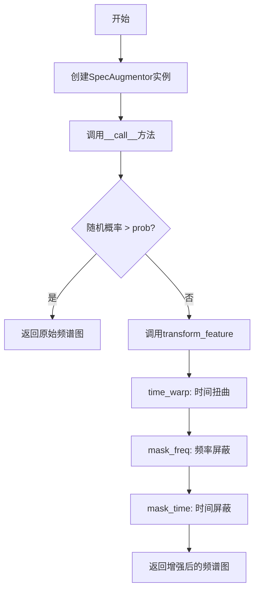
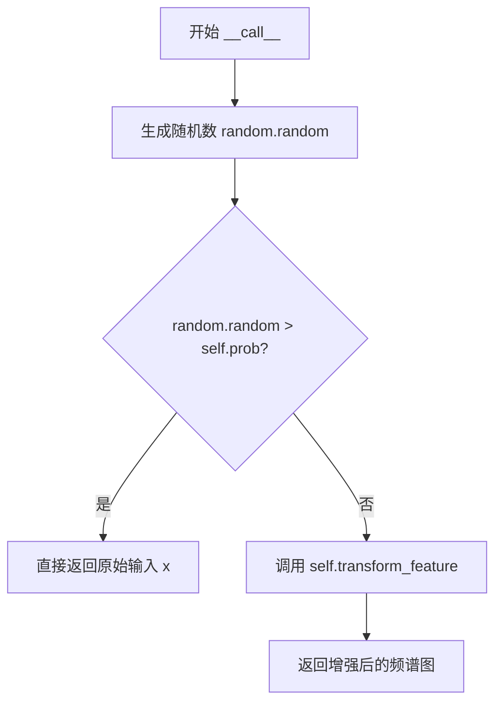
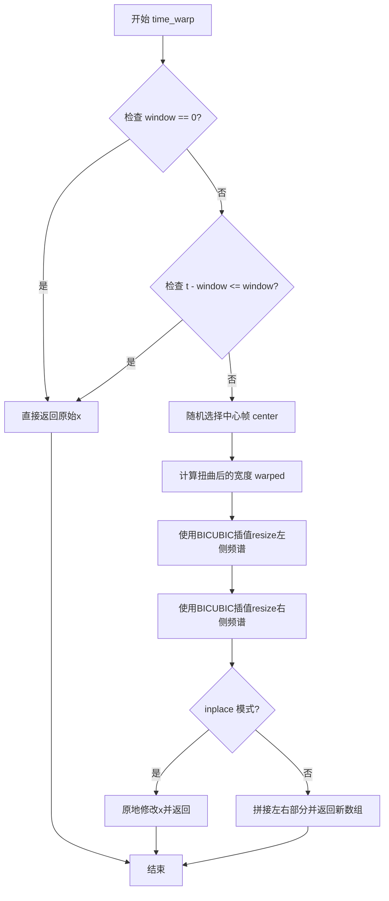
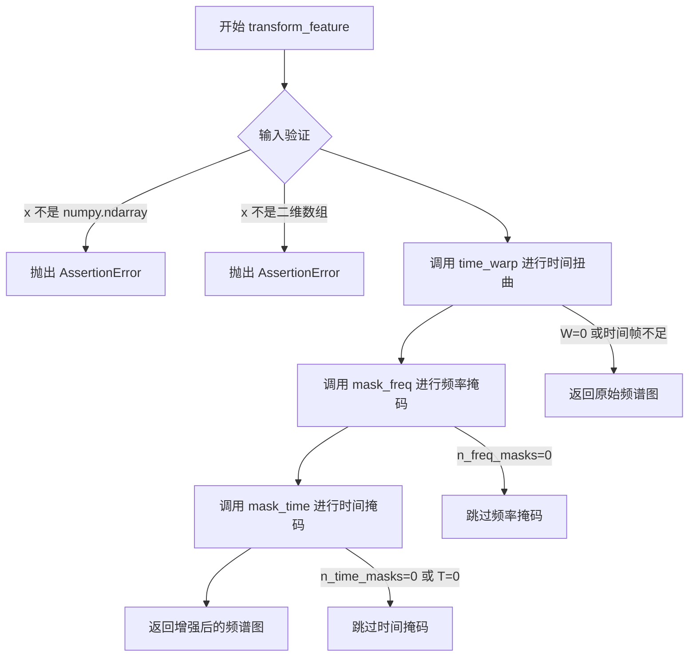

# `Chat-Haruhi-Suzumiya\yuki_builder\audio_feature_ext\data_utils\spec_augment.py` 详细设计文档

这是一个用于自动语音识别（ASR）的音频频谱图数据增强库，实现了SpecAugment算法，包括时间扭曲（Time Warping）、频率屏蔽（Frequency Masking）和时间屏蔽（Time Masking）三种数据增强方法，可对频谱图进行随机变形和遮蔽以提升模型鲁棒性。

## 整体流程



## 类结构

```
SpecAugmentor (数据增强类)
├── __init__ (初始化方法)
├── freq_mask (属性)
├── time_mask (属性)
├── __repr__ (字符串表示)
├── __call__ (可调用接口)
├── time_warp (时间扭曲)
├── mask_freq (频率屏蔽)
├── mask_time (时间屏蔽)
└── transform_feature (转换特征)
```

## 全局变量及字段


### `random`
    
Python标准库的随机数生成模块，用于生成随机数和控制随机性

类型：`module`
    


### `np`
    
NumPy库，提供高效的多维数组和矩阵运算功能

类型：`module`
    


### `Image`
    
PIL库中的图像处理模块，用于打开、操作和保存图像

类型：`module`
    


### `BICUBIC`
    
PIL图像插值方法常量，表示双三次插值算法

类型：`int`
    


### `SpecAugmentor.inplace`
    
是否原地修改数组

类型：`bool`
    


### `SpecAugmentor.replace_with_zero`
    
遮蔽时用0还是均值填充

类型：`bool`
    


### `SpecAugmentor.prob`
    
数据增强的概率

类型：`float`
    


### `SpecAugmentor.W`
    
时间扭曲窗口大小

类型：`int`
    


### `SpecAugmentor.F`
    
频率屏蔽参数

类型：`int`
    


### `SpecAugmentor.T`
    
时间屏蔽参数

类型：`int`
    


### `SpecAugmentor.n_freq_masks`
    
频率屏蔽数量

类型：`int`
    


### `SpecAugmentor.n_time_masks`
    
时间屏蔽数量

类型：`int`
    


### `SpecAugmentor.p`
    
时间屏蔽上限参数

类型：`float`
    


### `SpecAugmentor.adaptive_number_ratio`
    
自适应时间屏蔽数量比

类型：`float`
    


### `SpecAugmentor.adaptive_size_ratio`
    
自适应时间屏蔽大小比

类型：`float`
    


### `SpecAugmentor.max_n_time_masks`
    
时间屏蔽最大数目

类型：`int`
    


### `SpecAugmentor._freq_mask`
    
当前频率屏蔽范围

类型：`tuple`
    


### `SpecAugmentor._time_mask`
    
当前时间屏蔽范围

类型：`tuple`
    
    

## 全局函数及方法


### `SpecAugmentor.__init__`

这是 SpecAugmentor 类的构造函数，负责初始化音频频谱数据增强的所有参数，包括频率掩码、时间掩码、时间扭曲等增强操作的配置参数，以及自适应增强的开关和阈值。

参数：

- `self`：隐式参数，对象实例本身
- `F`：`int`，频率屏蔽参数，用于指定频率掩码的最大宽度
- `T`：`int`，时间屏蔽参数，用于指定时间掩码的最大宽度
- `n_freq_masks`：`int`，频率屏蔽数量，每次增强时应用的频率掩码个数
- `n_time_masks`：`int`，时间屏蔽数量，每次增强时应用的时间掩码个数
- `p`：`float`，时间屏蔽上限参数，限制时间掩码占整体时间的比例上限
- `W`：`int`，时间变形参数，控制时间扭曲的窗口大小
- `adaptive_number_ratio`：`float`，时间屏蔽的自适应多重比，用于动态计算掩码数量
- `adaptive_size_ratio`：`float`，时间屏蔽的自适应大小比，用于动态计算掩码宽度
- `max_n_time_masks`：`int`，时间屏蔽的最大数目，限制自适应模式下的掩码数量上限
- `replace_with_zero`：`bool`，如果为真则用零填充掩码区域，否则使用频谱均值填充
- `prob`：`float`，数据增强的概率，控制是否执行增强操作

返回值：`None`，构造函数不返回任何值

#### 流程图

```mermaid
flowchart TD
    A[开始 __init__] --> B[调用父类 super().__init__]
    B --> C[设置 inplace=True]
    C --> D[设置 replace_with_zero 参数]
    D --> E[设置 prob 概率参数]
    E --> F[设置 W 时间变形参数]
    F --> G[设置 F 频率屏蔽参数]
    G --> H[设置 T 时间屏蔽参数]
    H --> I[设置 n_freq_masks 频率屏蔽数量]
    I --> J[设置 n_time_masks 时间屏蔽数量]
    J --> K[设置 p 时间屏蔽上限参数]
    K --> L[设置自适应增强参数]
    L --> M{adaptive_number_ratio > 0?}
    M -->|是| N[将 n_time_masks 设为 0]
    M -->|否| O{adaptive_size_ratio > 0?}
    N --> O
    O -->|是| P[将 T 设为 0]
    O -->|否| Q[初始化 _freq_mask 和 _time_mask 为 None]
    P --> Q
    Q --> R[结束 __init__]
```

#### 带注释源码

```python
def __init__(self,
             F=10,
             T=50,
             n_freq_masks=2,
             n_time_masks=2,
             p=1.0,
             W=40,
             adaptive_number_ratio=0,
             adaptive_size_ratio=0,
             max_n_time_masks=20,
             replace_with_zero=True,
             prob=0.5):
    """SpecAugment class.
    Args:
        :param F: 频率屏蔽参数
        :type F: int
        :param T: 时间屏蔽参数
        :type T: int
        :param n_freq_masks: 频率屏蔽数量
        :type n_freq_masks: int
        :param n_time_masks: 时间屏蔽数量
        :type n_time_masks: int
        :param p: 时间屏蔽上限参数
        :type p: float
        :param W: 时间变形参数
        :type W: int
        :param adaptive_number_ratio: 时间屏蔽的自适应多重比
        :type adaptive_number_ratio: float
        :param adaptive_size_ratio: 时间屏蔽的自适应大小比
        :type adaptive_size_ratio: float
        :param max_n_time_masks: 时间屏蔽的最大数目
        :type max_n_time_masks: int
        :param replace_with_zero: 如果真的话，在pad补0，否则使用平均值
        :type replace_with_zero: bool
        :param prob: 数据增强的概率
        :type prob: float
    """
    # 调用父类object的初始化方法
    super().__init__()
    # 设置是否原地修改标志位
    self.inplace = True
    # 设置掩码填充方式：True用零填充，False用均值填充
    self.replace_with_zero = replace_with_zero

    # 设置数据增强的应用概率
    self.prob = prob
    # 设置时间变形窗口大小
    self.W = W
    # 设置频率掩码的最大宽度
    self.F = F
    # 设置时间掩码的最大宽度
    self.T = T
    # 设置频率掩码的应用数量
    self.n_freq_masks = n_freq_masks
    # 设置时间掩码的应用数量
    self.n_time_masks = n_time_masks
    # 设置时间掩码占整体时间的比例上限
    self.p = p

    # adaptive SpecAugment自适应增强参数
    # 自适应多重比：动态计算时间掩码数量
    self.adaptive_number_ratio = adaptive_number_ratio
    # 自适应大小比：动态计算时间掩码宽度
    self.adaptive_size_ratio = adaptive_size_ratio
    # 时间掩码的最大数目上限
    self.max_n_time_masks = max_n_time_masks

    # 如果启用自适应数量，则覆盖静态设置的时间掩码数量
    if adaptive_number_ratio > 0:
        self.n_time_masks = 0
    # 如果启用自适应大小，则覆盖静态设置的时间掩码宽度
    if adaptive_size_ratio > 0:
        self.T = 0

    # 初始化频率掩码和时间掩码的记录变量
    self._freq_mask = None
    self._time_mask = None
```


### `SpecAugmentor.freq_mask`

该属性是 `SpecAugmentor` 类中的频率屏蔽参数访问器，返回最近一次频率屏蔽操作所覆盖的频谱区间 `(f_0, f_0 + f)`，其中 `f_0` 是屏蔽起始频率索引，`f` 是屏蔽宽度。如果尚未执行频率屏蔽操作，则返回 `None`。

参数：无（属性访问器不接受显式参数）

返回值：`tuple` 或 `None`，返回最近一次频率屏蔽的区间信息，格式为 `(起始频率索引, 结束频率索引)`，若未执行过频率屏蔽则返回 `None`

#### 流程图

```mermaid
graph TD
    A[访问 freq_mask 属性] --> B{self._freq_mask 是否为 None}
    B -->|是| C[返回 None]
    B -->|否| D[返回 self._freq_mask 元组]
    
    E[mask_freq 执行流程] --> E1[随机生成屏蔽宽度 f]
    E1 --> E2[随机生成起始位置 f_0]
    E2 --> E3[执行频率屏蔽]
    E3 --> E4[设置 self._freq_mask = (f_0, f_0 + f)]
```

#### 带注释源码

```python
@property
def freq_mask(self):
    """频率屏蔽参数访问器
    
    该属性返回最近一次调用 mask_freq 方法时设置的频率屏蔽区间。
    返回值为一个元组 (f_0, f_0 + f)，其中：
    - f_0: 频率屏蔽的起始索引
    - f_0 + f: 频率屏蔽的结束索引（不包含）
    
    Returns:
        tuple 或 None: 频率屏蔽区间，若未执行过频率屏蔽则为 None
    """
    return self._freq_mask
```


### `SpecAugmentor.mask_time`

该方法用于对频谱图的时间维度进行遮罩（Time Masking），通过在时间轴上随机遮罩一段连续帧来增强模型的鲁棒性，支持自适应遮罩数量和遮罩大小的配置。

参数：

- `x`：`np.ndarray`，频谱图，形状为 (时间帧数, 频率_bins)
- `replace_with_zero`：`bool`，可选参数，默认为 False。指定遮罩区域是用零填充还是用频谱图的均值填充

返回值：`np.ndarray`，经过时间遮罩处理后的频谱图，形状保持为 (时间帧数, 频率_bins)

#### 流程图

```mermaid
flowchart TD
    A[开始 mask_time] --> B[获取输入频谱图 x]
    B --> C[计算总帧数 n_frames]
    C --> D{检查 adaptive_number_ratio > 0?}
    D -->|是| E[计算自适应遮罩数量<br/>n_masks = n_frames * adaptive_number_ratio<br/>并与 max_n_time_masks 取最小值]
    D -->|否| F[使用默认遮罩数量 n_time_masks]
    E --> G
    F --> G{检查 adaptive_size_ratio > 0?}
    G -->|是| H[计算自适应遮罩大小<br/>T = adaptive_size_ratio * n_frames]
    G -->|否| I[使用默认遮罩大小参数 T]
    H --> J
    I --> J[循环执行 n_masks 次遮罩]
    J --> K[随机生成遮罩宽度 t<br/>t = random.uniform(0, T)]
    K --> L[限制遮罩宽度<br/>t = min(t, n_frames * p)]
    L --> M[随机生成遮罩起始位置 t_0<br/>t_0 = random.uniform(0, n_frames - t)]
    M --> N{replace_with_zero?}
    N -->|是| O[将 x[t_0:t_0 + t, :] 设为 0]
    N -->|否| P[将 x[t_0:t_0 + t, :] 设为频谱图均值]
    O --> Q[记录遮罩位置 self._time_mask = (t_0, t_0 + t)]
    P --> Q
    Q --> R{是否完成所有遮罩?}
    R -->|否| J
    R -->|是| S[返回处理后的频谱图 x]
    S --> T[结束 mask_time]
```

#### 带注释源码

```python
def mask_time(self, x, replace_with_zero=False):
    """time mask
    对频谱图的时间维度进行遮罩处理
    
    Args:
        x (np.ndarray): spectrogram (time, freq) 频谱图，形状为(时间帧数, 频率维度)
        replace_with_zero (bool, optional): 是否用零填充遮罩区域，默认为False(用均值填充)

    Returns:
        np.ndarray: time mask spectrogram (time, freq) 处理后的频谱图
    """
    # 获取输入频谱图的时间维度帧数
    n_frames = x.shape[0]

    # 根据adaptive_number_ratio计算自适应遮罩数量
    # 如果配置了自适应比例，则动态计算遮罩数量
    if self.adaptive_number_ratio > 0:
        n_masks = int(n_frames * self.adaptive_number_ratio)  # 按比例计算遮罩数
        n_masks = min(n_masks, self.max_n_time_masks)  # 不超过最大遮罩数限制
    else:
        n_masks = self.n_time_masks  # 使用配置的固定遮罩数量

    # 根据adaptive_size_ratio计算自适应遮罩大小
    # 如果配置了自适应比例，则动态计算遮罩宽度
    if self.adaptive_size_ratio > 0:
        T = self.adaptive_size_ratio * n_frames  # 按比例计算遮罩宽度
    else:
        T = self.T  # 使用配置的固定遮罩宽度参数

    # 循环执行多次时间遮罩
    for i in range(n_masks):
        # 随机生成遮罩的宽度t，在[0, T]范围内均匀分布
        t = int(random.uniform(a=0, b=T))
        # 根据概率参数p限制遮罩宽度，确保不会覆盖过多帧
        t = min(t, int(n_frames * self.p))
        # 随机生成遮罩的起始位置t_0，确保遮罩在频谱图范围内
        t_0 = int(random.uniform(a=0, b=n_frames - t))
        # 断言验证起始位置和结束位置的合法性
        assert t_0 <= t_0 + t
        
        # 根据replace_with_zero参数选择填充方式
        if replace_with_zero:
            # 用零填充遮罩区域
            x[t_0:t_0 + t, :] = 0
        else:
            # 用频谱图的均值填充遮罩区域
            x[t_0:t_0 + t, :] = x.mean()
        
        # 记录最后一次遮罩的位置信息到实例变量
        self._time_mask = (t_0, t_0 + t)
    
    # 返回处理后的频谱图
    return x
```


### `SpecAugmentor.__repr__`

该方法返回SpecAugmentor对象的字符串表示形式，包含频率屏蔽参数F、时间屏蔽参数T、频率屏蔽数量n_freq_masks和时间屏蔽数量n_time_masks，用于调试和日志输出。

参数：

- `self`：`SpecAugmentor`，SpecAugmentor类的实例对象

返回值：`str`，返回格式为`"specaug: F-{F值}, T-{T值}, F-n-{频率屏蔽数}, T-n-{时间屏蔽数}"`的字符串，描述当前SpecAugmentor的关键配置参数

#### 流程图

```mermaid
flowchart TD
    A[开始 __repr__] --> B[获取self.F]
    B --> C[获取self.T]
    C --> D[获取self.n_freq_masks]
    D --> E[获取self.n_time_masks]
    E --> F[格式化字符串: specaug: F-{F}, T-{T}, F-n-{n_freq_masks}, T-n-{n_time_masks}]
    F --> G[返回格式化后的字符串]
    G --> H[结束]
```

#### 带注释源码

```python
def __repr__(self):
    """返回对象的字符串表示
    
    Returns:
        str: 包含SpecAugmentor关键配置参数的字符串，格式为:
             'specaug: F-{F值}, T-{T值}, F-n-{频率屏蔽数}, T-n-{时间屏蔽数}'
             例如: 'specaug: F-10, T-50, F-n-2, T-n-2'
    """
    return f"specaug: F-{self.F}, T-{self.T}, F-n-{self.n_freq_masks}, T-n-{self.n_time_masks}"
```


### `SpecAugmentor.__call__`

该方法是 SpecAugmentor 类的调用接口，用于对频谱图进行数据增强处理。根据预设的概率参数决定是否对输入的频谱图进行 Time Warping、Frequency Masking 和 Time Masking 三种增强操作，如果随机数大于增强概率则直接返回原始输入，否则调用 transform_feature 方法执行增强变换。

参数：

- `self`：SpecAugmentor 实例本身
- `x`：`ndarray`，经过预处理的音频数据（频谱图），形状为 `[T, F]`，其中 T 为时间帧数，F 为频率 bins 数

返回值：`ndarray`，增强后的频谱图，形状与输入相同为 `[T, F]`。如果未执行增强则返回原始输入。

#### 流程图



#### 带注释源码

```python
def __call__(self, x):
    """
    SpecAugmentor 的调用接口，对频谱图进行数据增强
    
    参数:
        x: 经过预处理的音频数据，类型为 ndarray，形状为 [时间帧数, 频率bins数]
    
    返回:
        增强后的频谱图，类型为 ndarray，形状与输入相同
    """
    
    # 生成一个 [0, 1) 范围内的随机数
    # 如果随机数大于预设的概率阈值，则跳过数据增强
    # 这种设计使得每次调用时有一定概率不进行增强，增加数据多样性
    if random.random() > self.prob: 
        return x  # 直接返回原始输入，不做任何变换
    
    # 当随机数小于等于概率阈值时，执行数据增强流程
    # transform_feature 方法会依次执行：时间扭曲、频率掩码、时间掩码
    return self.transform_feature(x)
```


### `SpecAugmentor.time_warp`

对频谱图进行时间维度上的扭曲变形，通过选择一个随机中心帧并根据随机宽度对中心帧两侧的频谱进行非均匀resize来实现时间轴上的warping效果。

参数：

- `x`：`np.ndarray`，输入的频谱图，形状为 (时间帧数, 频率维度)

返回值：`np.ndarray`，时间扭曲后的频谱图，形状为 (时间帧数, 频率维度)

#### 流程图



#### 带注释源码

```python
def time_warp(self, x):
    """time warp for spec augment
    move random center frame by the random width ~ uniform(-window, window)

    Args:
        x (np.ndarray): spectrogram (time, freq)

    Raises:
        NotImplementedError: [description]
        NotImplementedError: [description]

    Returns:
        np.ndarray: time warped spectrogram (time, freq)
    """
    # 从配置中获取时间扭曲窗口大小W
    window = self.W
    # 如果窗口大小为0，表示不进行时间扭曲，直接返回原输入
    if window == 0:
        return x
    
    # 获取频谱图的时间维度（帧数）
    t = x.shape[0]
    # 如果有效帧数不足以进行扭曲操作（至少需要2*window帧），直接返回
    if t - window <= window:
        return x
    
    # 随机选择一个中心帧位置，范围在[window, t-window)之间
    # NOTE: randrange(a, b) emits a, a + 1, ..., b - 1
    center = random.randrange(window, t - window)
    
    # 计算扭曲后的新时间长度，范围在[center-window+1, center+window-1]
    # +1确保 warped 至少为1，避免空数组问题
    warped = random.randrange(center - window, center + window) + 1  # 1 ... t - 1
    
    # 分离中心帧前后的频谱数据
    # 使用PIL Image的resize方法进行BICUBIC插值来实现时间维度的扭曲
    # 左侧部分从帧0到center，resize到新的时间维度warped
    left = Image.fromarray(x[:center]).resize((x.shape[1], warped), BICUBIC)
    # 右侧部分从帧center到末尾，resize到剩余时间维度t-warped
    right = Image.fromarray(x[center:]).resize((x.shape[1], t - warped), BICUBIC)
    
    # 根据inplace标志决定是修改原数组还是返回新数组
    if self.inplace:
        # 原地修改：将扭曲后的左右部分写回原数组
        x[:warped] = left
        x[warped:] = right
        return x
    # 非原地模式：返回拼接后的新数组
    return np.concatenate((left, right), 0)
```


### `SpecAugmentor.mask_freq`

该方法对输入的频谱图（spectrogram）进行频率掩码（Frequency Masking）处理，通过随机选择若干个频率区间并将对应频率范围的特征值置零或替换为均值，以实现SpecAugment数据增强策略中的频率遮蔽功能。

参数：

- `x`：`np.ndarray`，输入的频谱图，形状为 (time, freq)，其中 time 表示时间帧数，freq 表示频率 bins 数量
- `replace_with_zero`：`bool`，可选参数，默认为 False，指定掩码时是使用 0 还是使用频谱图的均值进行填充

返回值：`np.ndarray`，经过频率掩码处理后的频谱图，形状保持为 (time, freq)

#### 流程图

```mermaid
flowchart TD
    A[开始 mask_freq] --> B[获取频谱图的频率维度大小 n_bins = x.shape[1]]
    C[循环 i from 0 to n_freq_masks - 1] --> D[随机生成掩码宽度 f = random.uniform0, F)
    E[随机生成掩码起始位置 f_0 = random.uniform0, n_bins - f)
    D --> E
    E --> F{replace_with_zero?}
    F -->|True| G[将x[:, f_0:f_0 + f]置为0]
    F -->|False| H[将x[:, f_0:f_0 + f]替换为均值x.mean]
    G --> I[记录当前掩码区间到_freq_mask = f_0, f_0 + f)
    H --> I
    I --> J{循环是否结束?}
    J -->|No| C
    J -->|Yes| K[返回处理后的频谱图 x]
```

#### 带注释源码

```python
def mask_freq(self, x, replace_with_zero=False):
    """freq mask
    
    对频谱图进行频率掩码处理，随机遮蔽若干个频率区间
    
    Args:
        x (np.ndarray): spectrogram (time, freq)，输入的频谱图，形状为时间帧数x频率维度
        replace_with_zero (bool, optional): Defaults to False. 
            是否用0替换掩码区域，False时使用频谱图的均值替换
    
    Returns:
        np.ndarray: freq mask spectrogram (time, freq)，返回经过频率掩码处理后的频谱图
    """
    # 获取频谱图的频率维度（频率bins的数量）
    n_bins = x.shape[1]
    
    # 根据配置的频率掩码数量进行循环处理
    for i in range(0, self.n_freq_masks):
        # 随机生成掩码的宽度 f，在 [0, F] 范围内均匀分布
        # F 是初始化时传入的参数，表示最大频率掩码宽度
        f = int(random.uniform(a=0, b=self.F))
        
        # 随机生成掩码的起始位置 f_0，确保掩码不超出频率维度范围
        # 有效范围是 [0, n_bins - f]
        f_0 = int(random.uniform(a=0, b=n_bins - f))
        
        # 断言验证：起始位置应小于等于结束位置（防御性编程）
        assert f_0 <= f_0 + f
        
        # 根据 replace_with_zero 参数决定填充方式
        if replace_with_zero:
            # 将选中频率区间 [f_0, f_0 + f) 的所有时间帧置为 0
            x[:, f_0:f_0 + f] = 0
        else:
            # 将选中频率区间替换为频谱图的全局均值（保留部分信息）
            x[:, f_0:f_0 + f] = x.mean()
        
        # 记录最后一次掩码的区间位置，供外部查询或调试使用
        self._freq_mask = (f_0, f_0 + f)
    
    # 返回处理后的频谱图（可能进行就地修改或返回新数组）
    return x
```


### SpecAugmentor.mask_time

该方法实现时间维度上的随机掩码（Time Masking）操作，通过在频谱图的时间轴上随机遮盖若干帧来增强模型的鲁棒性，支持自适应和固定两种掩码策略。

参数：

- `self`：`SpecAugmentor`，SpecAugmentor 类实例本身，包含掩码配置参数
- `x`：`np.ndarray`，频谱图数据，形状为 (time, freq)，即时间帧数 × 频率 bins 数
- `replace_with_zero`：`bool`，可选参数，默认值为 False。指定掩码区域是用零填充还是用频谱图的均值填充

返回值：`np.ndarray`，经过时间掩码处理后的频谱图，形状保持为 (time, freq)

#### 流程图

```mermaid
flowchart TD
    A[开始 mask_time] --> B[获取频谱图时间帧数 n_frames]
    B --> C{adaptive_number_ratio > 0?}
    C -->|是| D[计算自适应掩码数<br/>n_masks = n_frames * adaptive_number_ratio<br/>n_masks = min(n_masks, max_n_time_masks)]
    C -->|否| E[使用固定掩码数<br/>n_masks = n_time_masks]
    D --> F{adaptive_size_ratio > 0?}
    E --> F
    F -->|是| G[计算自适应掩码宽度<br/>T = n_frames * adaptive_size_ratio]
    F -->|否| H[使用固定掩码宽度<br/>T = self.T]
    G --> I[循环遍历 n_masks 次]
    H --> I
    I --> J[随机生成掩码宽度 t<br/>t = uniform(0, T)]
    J --> K[限制掩码宽度上限<br/>t = min(t, n_frames * p)]
    K --> L[随机生成掩码起始位置 t_0<br/>t_0 = uniform(0, n_frames - t)]
    L --> M{replace_with_zero?}
    M -->|是| N[将掩码区域置零<br/>x[t_0:t_0 + t, :] = 0]
    M -->|否| O[将掩码区域替换为均值<br/>x[t_0:t_0 + t, :] = x.mean()]
    N --> P[记录当前掩码位置到 _time_mask]
    O --> P
    P --> Q{循环未结束?}
    Q -->|是| J
    Q -->|否| R[返回处理后的频谱图]
```

#### 带注释源码

```python
def mask_time(self, x, replace_with_zero=False):
    """time mask
    
    对频谱图的时间维度进行随机掩码，这是 SpecAugment 增强策略的重要组成部分。
    通过随机遮挡时间序列中的若干帧，使模型能够更好地处理不完整的语音信息，
    从而提升模型对时序信息缺失的鲁棒性。
    
    Args:
        x (np.ndarray): 频谱图，形状为 (时间帧数, 频率bins数)
        replace_with_zero (bool, optional): 是否用零填充掩码区域。
            若为 False，则使用频谱图的均值进行填充。默认为 False。
    
    Returns:
        np.ndarray: 经过时间掩码处理后的频谱图，形状保持不变为 (时间帧数, 频率bins数)
    """
    # 获取频谱图的时间维度（帧数）
    n_frames = x.shape[0]
    
    # ---------- 计算掩码数量 ----------
    # 支持自适应 SpecAugment：若启用了自适应数量比例，则动态计算掩码数量
    if self.adaptive_number_ratio > 0:
        # 根据帧数比例计算掩码数量
        n_masks = int(n_frames * self.adaptive_number_ratio)
        # 限制掩码数量的最大值，防止过度掩码
        n_masks = min(n_masks, self.max_n_time_masks)
    else:
        # 使用配置中指定的固定掩码数量
        n_masks = self.n_time_masks
    
    # ---------- 计算掩码宽度 ----------
    # 支持自适应 SpecAugment：若启用了自适应大小比例，则动态计算掩码宽度
    if self.adaptive_size_ratio > 0:
        # 根据帧数比例计算单个掩码的宽度
        T = self.adaptive_size_ratio * n_frames
    else:
        # 使用配置中指定的固定掩码宽度参数 T
        T = self.T
    
    # ---------- 执行掩码操作 ----------
    # 对每个掩码进行随机生成和 应用
    for i in range(n_masks):
        # 随机生成当前掩码的宽度 t，在 [0, T) 范围内
        t = int(random.uniform(a=0, b=T))
        # 根据比例参数 p 限制掩码宽度的上限，防止掩码覆盖过多帧
        t = min(t, int(n_frames * self.p))
        # 随机生成掩码的起始位置 t_0，确保掩码不超出频谱图范围
        t_0 = int(random.uniform(a=0, b=n_frames - t))
        # 断言验证：起始位置 + 掩码宽度不应超过总帧数（防御性编程）
        assert t_0 <= t_0 + t
        
        # 根据参数选择填充方式：用零填充 或 用均值填充
        if replace_with_zero:
            # 将掩码区域的所有频率维度置零
            x[t_0:t_0 + t, :] = 0
        else:
            # 将掩码区域替换为频谱图的全局均值
            x[t_0:t_0 + t, :] = x.mean()
        
        # 记录最后一次掩码的位置信息，供外部查询或可视化使用
        self._time_mask = (t_0, t_0 + t)
    
    # 返回处理后的频谱图
    return x
```


### `SpecAugmentor.transform_feature`

该方法是 SpecAugment 数据增强的核心实现，接收二维频谱图矩阵 [T, F]，依次通过时间扭曲、频率掩码和时间掩码三种增强手段进行处理后返回增强后的频谱图。

参数：

- `x`：`np.ndarray`，输入的频谱图，形状为 `[T, F]`，其中 T 表示时间帧数，F 表示频率维度

返回值：`np.ndarray`，增强后的频谱图，形状为 `[T, F]`

#### 流程图



#### 带注释源码

```python
def transform_feature(self, x: np.ndarray):
    """
    对输入的频谱图进行 SpecAugment 数据增强处理
    
    Args:
        x (np.ndarray): 输入的频谱图，形状为 [T, F]，T 为时间帧数，F 为频率维度
        
    Returns:
        x (np.ndarray): 增强后的频谱图，形状为 [T, F]
        
    Raises:
        AssertionError: 当输入不是 numpy.ndarray 或不是二维数组时抛出
    """
    # 验证输入是否为 numpy.ndarray 类型
    assert isinstance(x, np.ndarray)
    # 验证输入是否为二维数组（频谱图应为 2D 矩阵）
    assert x.ndim == 2
    
    # 第一步：时间扭曲（Time Warping）
    # 通过随机移动中心帧来扭曲时间轴，增加时序变化
    x = self.time_warp(x)
    
    # 第二步：频率掩码（Frequency Masking）
    # 随机屏蔽若干频率通道，模拟麦克风频率响应变化
    x = self.mask_freq(x, self.replace_with_zero)
    
    # 第三步：时间掩码（Time Masking）
    # 随机屏蔽若干时间帧，模拟说话中断或背景噪声
    x = self.mask_time(x, self.replace_with_zero)
    
    # 返回经过三种增强处理后的频谱图
    return x
```

## 关键组件


### 时间扭曲 (Time Warping)

通过在时间轴上随机选择中心帧，并使用PIL的BICUBIC插值resize左右两部分来实现时间维度的扭曲，增强频谱图的时间不变性。

### 频率掩码 (Frequency Masking)

在频谱图的频率维度上随机遮盖连续的几个频率 bin，支持零填充或均值填充两种模式，用于模拟频率信道缺失的情况。

### 时间掩码 (Time Masking)

在频谱图的时间维度上随机遮盖连续的几帧，支持自适应数量（adaptive_number_ratio）和自适应大小（adaptive_size_ratio），用于模拟时间轴上的遮挡。

### 自适应增强策略

支持基于频谱图尺寸动态计算掩码数量和大小的自适应模式，可根据 n_frames * adaptive_number_ratio 自动调整掩码数量，适用于不同长度的音频数据。

### 概率控制机制

通过 prob 参数控制数据增强的执行概率，每次调用时随机决定是否进行增强，在训练时实现随机丢弃增强的效果。

### 原地修改优化

通过 inplace 参数控制是否原地修改输入数组，避免额外的内存分配，提高内存效率。

### 填充策略选择

支持 replace_with_zero 参数选择填充值：使用零填充或使用频谱图均值填充两种策略，提供不同的增强效果。

### 懒加载属性

_freq_mask 和 _time_mask 属性采用延迟计算模式，仅在实际执行掩码操作时更新，避免不必要的计算开销。


## 问题及建议


### 已知问题

-   **mask方法参数忽略bug**：`mask_freq`和`mask_time`方法接收`replace_with_zero`参数但实际未使用，始终使用类属性`self.replace_with_zero`，导致传入的参数被忽略
-   **私有属性覆盖问题**：`_freq_mask`和`_time_mask`在循环中被反复赋值，最终只保存最后一次mask的信息，而不是所有mask的记录
-   **自适应参数逻辑冗余**：在`__init__`中根据`adaptive_number_ratio`和`adaptive_size_ratio`将`n_time_masks`和`T`设为0，但在`mask_time`方法中又根据这些比例重新计算，逻辑重复且容易混淆
-   **time_warp的inplace模式缺陷**：当`self.inplace=True`时，方法先修改`x[:warped]`再修改`x[warped:]`，但`right`部分使用`x[center:]`的数据已被修改，影响最终结果
-   **time_warp返回值不一致**：当`window==0`或`t-window<=window`时直接返回原始`x`引用而非副本，可能导致意外修改
-   **参数命名缺乏描述性**：参数名如`W`、`F`、`T`、`p`、`n_freq_masks`、`n_time_masks`缺乏描述性，影响代码可读性
-   **缺少输入验证**：`transform_feature`中仅验证`x`是否为numpy数组和维度，未验证数值范围、NaN/Inf值等
-   **概率逻辑与直觉相反**：`prob`参数表示不增强的概率（`random.random() > self.prob`时返回原始数据），通常概率参数表示增强的概率

### 优化建议

-   **修复mask方法参数使用**：在`mask_freq`和`mask_time`中使用传入的`replace_with_zero`参数，优先级高于类属性
-   **修复私有属性存储**：将`_freq_mask`和`_time_mask`改为列表类型，存储所有mask的位置信息
-   **简化自适应参数逻辑**：移除`__init__`中对`n_time_masks`和`T`的预设置，统一在`mask_time`中计算
-   **修复time_warp的inplace逻辑**：在inplace模式下先保存右侧数据，或使用临时副本
-   **统一返回值**：无论何种情况都返回副本，或在文档中明确说明inplace模式下可能修改原数组
-   **添加类型注解**：为所有方法和属性添加完整的类型注解
-   **重构参数配置**：考虑使用dataclass或配置字典封装过多参数，提高可维护性
-   **添加输入验证**：检查输入数组的数值范围，处理NaN/Inf等异常值
-   **调整概率逻辑**：将`prob`改为表示增强的概率，使逻辑更直观
-   **考虑性能优化**：使用numpy的插值函数替代PIL Image进行time warping，减少对象创建开销

## 其它


### 设计目标与约束

本模块的设计目标是实现SpecAugment论文中提出的数据增强方法，用于对语音频谱图进行时间扭曲、频率屏蔽和时间屏蔽操作，以提高自动语音识别模型的鲁棒性和泛化能力。设计约束包括：1）输入必须是二维numpy数组，形状为[T, F]，其中T为时间帧数，F为频率 bins数；2）时间扭曲参数W必须小于输入的时间维度；3）屏蔽参数F和T不能超过输入的频率和时间维度；4）自适应增强参数与固定参数不能同时使用。

### 错误处理与异常设计

代码中的错误处理主要包括：1）assert语句验证输入类型和维度，确保输入是numpy.ndarray且为二维；2）时间扭曲函数中检查window参数和输入时间维度，防止数组越界；3）频率和时间屏蔽中使用assert确保屏蔽范围有效；4）自适应参数检查，确保adaptive_number_ratio和adaptive_size_ratio在合理范围内。当输入不满足要求时，代码会抛出AssertionError或返回原始输入。潜在改进：可添加更友好的自定义异常类，提供更清晰的错误信息。

### 数据流与状态机

数据流处理流程如下：1）初始化阶段——设置各类增强参数（频率屏蔽参数F、时间屏蔽参数T、屏蔽数量、概率等）；2）调用阶段——通过__call__方法触发，首先根据prob概率决定是否进行增强；3）变换阶段——依次执行time_warp、mask_freq、mask_time三个操作，每个操作都直接修改输入数组（inplace=True）或返回新数组；4）输出阶段——返回增强后的频谱图。状态机包含两个主要状态：原始状态（未增强）和增强状态（已应用变换），每次调用都是独立操作，不保存中间状态。

### 外部依赖与接口契约

主要外部依赖包括：1）random模块——用于生成随机数决定是否增强、随机选择屏蔽参数等；2）numpy模块——用于数组操作和计算均值；3）PIL.Image模块——用于图像resize操作实现时间扭曲。接口契约：1）构造函数接收多个可选参数配置增强策略；2）可调用对象接口__call__(x)，输入二维numpy数组，输出增强后的数组；3）transform_feature(x)方法执行实际的增强变换；4）freq_mask和time_mask属性提供最后一次屏蔽的位置信息。输入验证由调用方负责，确保输入符合[T, F]形状的二维numpy数组。

### 性能考虑

当前实现的主要性能瓶颈：1）时间扭曲使用PIL.Image进行resize操作，引入较大的计算开销；2）mask_freq和mask_time方法中的循环操作可向量化优化；3）每次调用都重新创建Image对象，可缓存复用；4）使用inplace修改可减少内存分配但影响函数纯活性。优化建议：1）使用scipy.ndimage或torch实现时间扭曲以提升性能；2）将屏蔽操作向量化处理；3）对于批量处理场景，可考虑预分配缓冲区；4）添加@njit装饰器加速数值计算。

### 配置参数详解

| 参数名 | 类型 | 默认值 | 说明 |
|--------|------|--------|------|
| F | int | 10 | 频率屏蔽的宽度参数 |
| T | int | 50 | 时间屏蔽的宽度参数 |
| n_freq_masks | int | 2 | 频率屏蔽的数量 |
| n_time_masks | int | 2 | 时间屏蔽的数量 |
| p | float | 1.0 | 时间屏蔽上限参数，限制单次屏蔽的最大比例 |
| W | int | 40 | 时间变形窗口大小 |
| adaptive_number_ratio | float | 0 | 自适应时间屏蔽数量比率 |
| adaptive_size_ratio | float | 0 | 自适应时间屏蔽大小比率 |
| max_n_time_masks | int | 20 | 时间屏蔽的最大数量 |
| replace_with_zero | bool | True | 是否用0填充屏蔽区域，否则使用均值 |
| prob | float | 0.5 | 执行数据增强的概率 |

### 使用示例

```python
# 基础用法
augmentor = SpecAugmentor(F=10, T=50, n_freq_masks=2, n_time_masks=2)
spectrogram = np.random.randn(100, 80)  # [time, freq]
augmented = augmentor(spectrogram)

# 自适应增强用法
augmentor = SpecAugmentor(
    adaptive_number_ratio=0.04,
    adaptive_size_ratio=0.1,
    max_n_time_masks=20
)
augmented = augmentor(spectrogram)

# 获取屏蔽位置
augmentor.mask_freq  # 返回最后屏蔽的频率范围
augmentor.mask_time  # 返回最后屏蔽的时间范围
```

### 参考文献

1. Park, D.S., Chan, W., Zhang, Y., et al. "SpecAugment: A Simple Data Augmentation Method for Automatic Speech Recognition." arXiv:1904.08779, 2019.
2. Ng, R.W., Zhang, Y., Li, S., et al. "SpecAugment on Large Scale Datasets." arXiv:1912.05533, 2019.

    