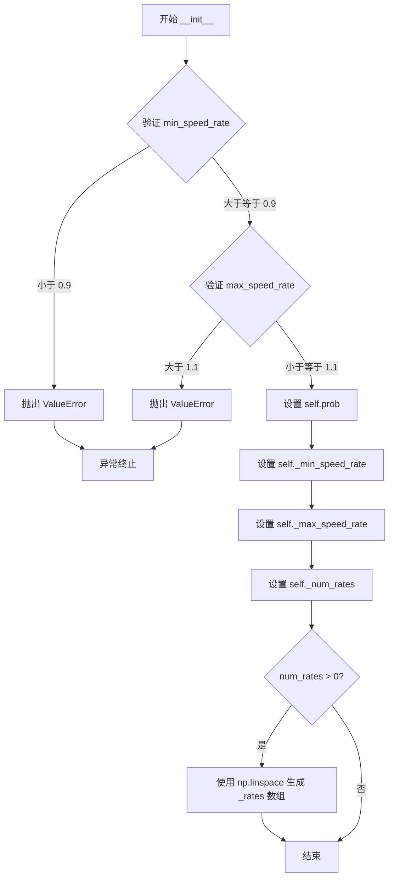
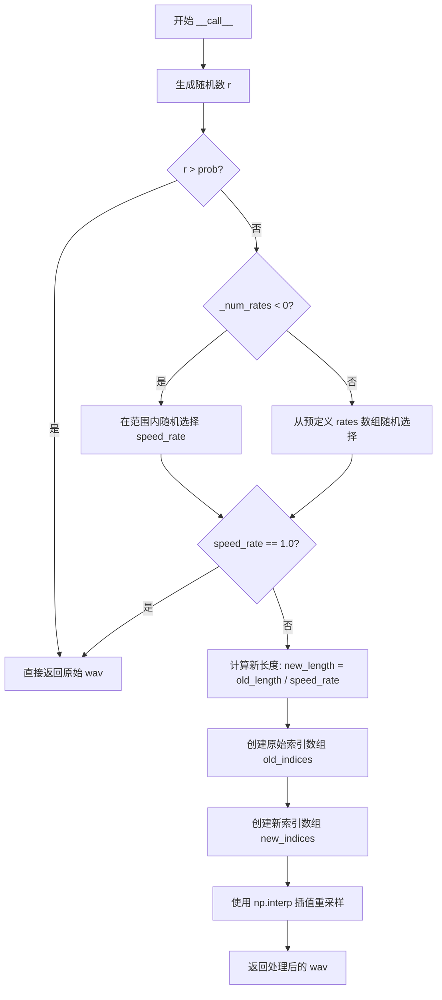

# `Chat-Haruhi-Suzumiya\yuki_builder\audio_feature_ext\data_utils\speed_perturb.py` 详细设计文档

这是一个音频语速增强器，通过随机改变音频的采样率来实现语速变化的数据增强效果，支持自定义语速范围、预计算语速档位和增强概率控制。

## 整体流程

```mermaid
graph TD
    A[开始] --> B{调用 __call__ 方法}
    B --> C{random.random() > prob?}
C -- 是 --> D[返回原始音频]
C -- 否 --> E{_num_rates < 0?}
E -- 是 --> F[随机生成语速比率]
E -- 否 --> G[从预计算数组中选择语速比率]
F --> H
G --> H{speed_rate == 1.0?}
H -- 是 --> I[返回原始音频]
H -- 否 --> J[计算新长度并插值]
J --> K[返回增强后的音频]
```

## 类结构

```
SpeedPerturbAugmentor (语速增强器类)
```

## 全局变量及字段


### `random`
    
Python标准库随机数生成模块，用于随机决定是否进行语速增强

类型：`module`
    


### `np`
    
NumPy库，用于数值计算和数组操作

类型：`module`
    


### `SpeedPerturbAugmentor.prob`
    
数据增强的概率，控制是否对音频进行语速变换

类型：`float`
    


### `SpeedPerturbAugmentor._min_speed_rate`
    
最小语速比率，用于限制语速增强的下界

类型：`float`
    


### `SpeedPerturbAugmentor._max_speed_rate`
    
最大语速比率，用于限制语速增强的上界

类型：`float`
    


### `SpeedPerturbAugmentor._num_rates`
    
预计算的语速档位数量，决定离散语速选项的个数

类型：`int`
    


### `SpeedPerturbAugmentor._rates`
    
预计算的语速比率数组，包含从最小到最大语速的离散采样值

类型：`ndarray`
    
    

## 全局函数及方法


### `SpeedPerturbAugmentor.__init__`

构造函数，初始化语速增强器参数，包括采样速率范围、增强概率和预定义的语速列表。

参数：

- `min_speed_rate`：`float`，新采样速率下限不应小于0.9（默认值为0.9）
- `max_speed_rate`：`float`，新采样速率的上界不应大于1.1（默认值为1.1）
- `num_rates`：`int`，预定义的语速速率数量，用于生成离散的速率候选列表（默认值为3）
- `prob`：`float`，数据增强的概率，即以多大比例对音频进行语速增强（默认值为0.5）

返回值：`None`，构造函数不返回任何值

#### 流程图



#### 带注释源码

```python
def __init__(self, min_speed_rate=0.9, max_speed_rate=1.1, num_rates=3, prob=0.5):
    """构造函数，初始化语速增强器参数
    
    参数:
        min_speed_rate: 新采样速率下限不应小于0.9
        max_speed_rate: 新采样速率的上界不应大于1.1
        num_rates: 预定义的语速速率数量
        prob: 数据增强的概率
    """
    # 验证下限参数：如果语速低于0.9会导致不自然的效果
    if min_speed_rate < 0.9:
        raise ValueError("Sampling speed below 0.9 can cause unnatural effects")
    
    # 验证上限参数：如果语速高于1.1会导致不自然的效果
    if max_speed_rate > 1.1:
        raise ValueError("Sampling speed above 1.1 can cause unnatural effects")
    
    # 设置增强概率，用于控制__call__中是否执行语速变换
    self.prob = prob
    
    # 存储最小语速速率（私有属性）
    self._min_speed_rate = min_speed_rate
    
    # 存储最大语速速率（私有属性）
    self._max_speed_rate = max_speed_rate
    
    # 存储预定义的语速速率数量（私有属性）
    self._num_rates = num_rates
    
    # 如果num_rates大于0，则在[min_speed_rate, max_speed_rate]区间内
    # 均匀生成num_rates个离散的语速速率值
    if num_rates > 0:
        self._rates = np.linspace(self._min_speed_rate, self._max_speed_rate, self._num_rates, endpoint=True)
```


### `SpeedPerturbAugmentor.__call__`

该方法是 `SpeedPerturbAugmentor` 类的可调用接口，通过随机概率决定是否对音频进行语速增强，若执行则使用线性插值技术在时域上拉伸或压缩音频波形。

参数：

-  `wav`：`ndarray`，librosa 读取的音频数据

返回值：`ndarray`，处理后的音频数据

#### 流程图



#### 带注释源码

```python
def __call__(self, wav):
    """改变音频语速

    :param wav: librosa 读取的数据
    :type wav: ndarray
    """
    # 步骤1: 概率检查 - 根据 prob 决定是否进行语速增强
    if random.random() > self.prob: 
        return wav  # 跳过增强，直接返回原始音频
    
    # 步骤2: 确定语速因子
    if self._num_rates < 0:
        # 连续模式: 在 [min_speed_rate, max_speed_rate] 范围内均匀随机选择
        speed_rate = random.uniform(self._min_speed_rate, self._max_speed_rate)
    else:
        # 离散模式: 从预定义的离散速率数组中随机选择一个
        speed_rate = random.choice(self._rates)
    
    # 步骤3: 如果语速因子为 1.0，表示无需变化，直接返回原始音频
    if speed_rate == 1.0: 
        return wav

    # 步骤4: 计算新音频长度（长度与语速成反比）
    old_length = wav.shape[0]  # 获取原始音频样本数
    new_length = int(old_length / speed_rate)  # 计算目标长度

    # 步骤5: 创建索引数组用于插值
    old_indices = np.arange(old_length)  # 原始音频的等间距索引 [0, 1, 2, ..., old_length-1]
    new_indices = np.linspace(start=0, stop=old_length, num=new_length)  # 新音频的采样点位置

    # 步骤6: 使用线性插值重采样音频，实现语速改变
    # 当 speed_rate > 1.0 时音频变短（语速加快）
    # 当 speed_rate < 1.0 时音频变长（语速减慢）
    wav = np.interp(new_indices, old_indices, wav)
    return wav
```

## 关键组件


### 语速范围约束

限制语速变化在0.9至1.1之间，防止因过大语速变化导致音频出现不自然的听感

### 概率性增强机制

通过prob参数控制数据增强的触发概率，实现随机性的语速扰动

### 离散速率集合

基于num_rates参数生成等间距的候选语速列表，供随机选择使用

### 连续速率随机

当num_rates为负时，在指定范围内使用均匀分布随机生成连续语速值

### 线性插值重采样

使用numpy的interp函数和linspace生成新索引，通过线性插值实现音频的时长调整从而改变语速


## 问题及建议


### 已知问题

-   当 `num_rates` 为 0 时，`__call__` 方法中会因 `self._rates` 未定义而导致 `NameError`
-   输入音频 `wav` 仅支持一维数组，不支持多通道立体声等二维数组
-   缺少对 `prob` 参数是否在 [0,1] 范围内的验证
-   缺少对 `num_rates` 参数非负性的验证
-   类文档字符串未包含 `num_rates` 参数说明
-   变量命名风格不一致（`prob` 没有下划线，而其他私有属性有下划线）
-   当 `speed_rate` 为 1.0 时，仍会进行随机选择，但最终返回原音频，可能效率不高

### 优化建议

-   在 `__init__` 中添加对 `prob` 参数范围（0到1）的检查，以及 `num_rates` 为非负整数的检查
-   在 `__call__` 方法中处理 `num_rates` 为 0 的情况，直接使用均匀分布或抛出警告
-   添加对输入 `wav` 维度的检查，或支持多通道音频的重采样（例如对每个通道分别处理）
-   完善类文档字符串，包含 `num_rates` 参数描述
-   考虑使用专门的音频重采样库（如 `resampy`）以提高性能和重采样质量
-   统一变量命名，将 `prob` 改为 `_prob` 或保持一致
-   可以在 `__call__` 方法中先判断 `speed_rate` 是否为 1.0，若为 1.0 则直接返回，避免不必要的随机选择
-   添加随机种子设置选项，以便结果可复现


## 其它


### 设计目标与约束

该模块的设计目标是实现音频语速的数据增强功能，通过随机改变音频的播放速度来增加训练数据的多样性，从而提升模型的鲁棒性。核心约束包括：采样速率必须在0.9到1.1之间（避免产生不自然的语音效果），增强操作以指定概率（prob）触发，支持离散速率列表或连续速率范围两种模式。

### 错误处理与异常设计

代码在初始化阶段进行参数校验：当min_speed_rate小于0.9时抛出ValueError并提示"Sampling speed below 0.9 can cause unnatural effects"；当max_speed_rate大于1.1时抛出ValueError并提示"Sampling speed above 1.1 can cause unnatural effects"。在__call__方法中未进行显式的异常处理，但假设输入的wav参数为有效的numpy数组。潜在的改进方向包括：添加输入类型检查（验证wav为numpy.ndarray）、添加空数组检查、添加数组维度验证（应为一维数组）、处理可能的NaN或Inf值。

### 数据流与状态机

该模块的数据流相对简单：输入为 librosa 读取的音频波形数据（numpy.ndarray），输出为经过变速处理后的音频波形数据。模块内部维护状态：self._min_speed_rate、self._max_speed_rate、self._num_rates、self._rates（预计算的速率列表）、self.prob（增强概率）。状态转换逻辑：初始化时根据num_rates参数决定使用离散速率列表还是连续速率范围；调用时根据prob决定是否执行增强；增强时根据速率模式选择具体的变速系数。

### 外部依赖与接口契约

外部依赖包括：random（Python标准库，用于生成随机数）、numpy（数值计算库，用于数组操作和插值）。接口契约：__init__方法接受四个可选参数（min_speed_rate、max_speed_rate、num_rates、prob），返回None；__call__方法接受wav参数（numpy.ndarray类型的一维数组），返回处理后的numpy.ndarray。调用方需要使用librosa或类似库读取音频文件得到numpy数组后传入，且需自行处理输出数组的保存（如使用librosa输出）。

### 性能考虑

当前实现的主要性能瓶颈在于np.interp插值操作，时间复杂度为O(new_length)。优化方向包括：对于大规模数据处理，可考虑使用scipy.signal.resample或更高效的插值方法；当num_rates较大时，预计算的self._rates列表可以避免重复调用np.linspace；可以添加缓存机制避免重复处理相同音频。若需要更高效的变速实现，可考虑使用sox、libsamplerate等专门的音频处理库。

### 线程安全性

该类在多线程环境下使用需要谨慎。虽然__init__方法创建的速率列表（self._rates）是线程安全的（只读），但random模块的全局状态在多线程并发调用__call__方法时可能导致随机数序列竞争。建议在多线程场景下为每个线程创建独立的SpeedPerturbAugmentor实例，或者使用random.Random实例而非全局random模块。

### 边界条件处理

代码对以下边界条件进行了处理：prob参数为0或1时分别表示不增强或始终增强；当选择的speed_rate等于1.0时直接返回原始音频（避免不必要的计算）。未充分处理的边界条件包括：wav为空数组时会导致new_length为0，可能引发后续操作异常；wav.shape[0]为1时无法进行有效的插值运算；num_rates为负数时使用连续速率模式（代码逻辑），但这与参数名语义不符（负数速率数量无实际意义）。

### 使用示例与集成建议

典型使用场景为语音数据增强管道，示例代码：
```python
import librosa
augmentor = SpeedPerturbAugmentor(min_speed_rate=0.9, max_speed_rate=1.1, num_rates=5, prob=0.5)
wav, sr = librosa.load('audio.wav')
augmented_wav = augmentor(wav)
librosa.output.write_wav('augmented_audio.wav', augmented_wav, sr)
```
建议与现有数据增强框架（如torchaudio、specaugment）集成时保持一致的接口风格，可考虑实现更丰富的增强参数（如选择保留音高还是改变音高）。

### 单元测试策略

建议的测试用例包括：初始化参数校验测试（验证ValueError抛出条件）、prob参数边界测试（0和1）、num_rates不同取值场景测试、空数组输入测试、单元素数组输入测试、speed_rate=1.0时直接返回原数组的验证、输出数组长度与预期是否匹配的验证。建议使用pytest框架编写测试，并可添加property-based testing（如使用hypothesis库）验证插值后音频的数学性质。

### 版本兼容性与配置管理

该代码仅使用Python标准库和numpy，未引入版本兼容性问题。建议的配置文件格式（YAML或JSON）：
```yaml
speed_perturbation:
  min_speed_rate: 0.9
  max_speed_rate: 1.1
  num_rates: 3
  prob: 0.5
```
配置应支持从环境变量或配置文件加载，以便在不修改代码的情况下调整增强参数。

### 日志与监控

当前代码不包含日志输出。建议添加日志功能以便于调试和生产环境监控：初始化时记录配置参数、调用时记录实际使用的speed_rate值、处理音频的数量统计。可以集成Python标准日志模块或使用结构化日志（如json-logging）以便日志聚合系统分析。


    