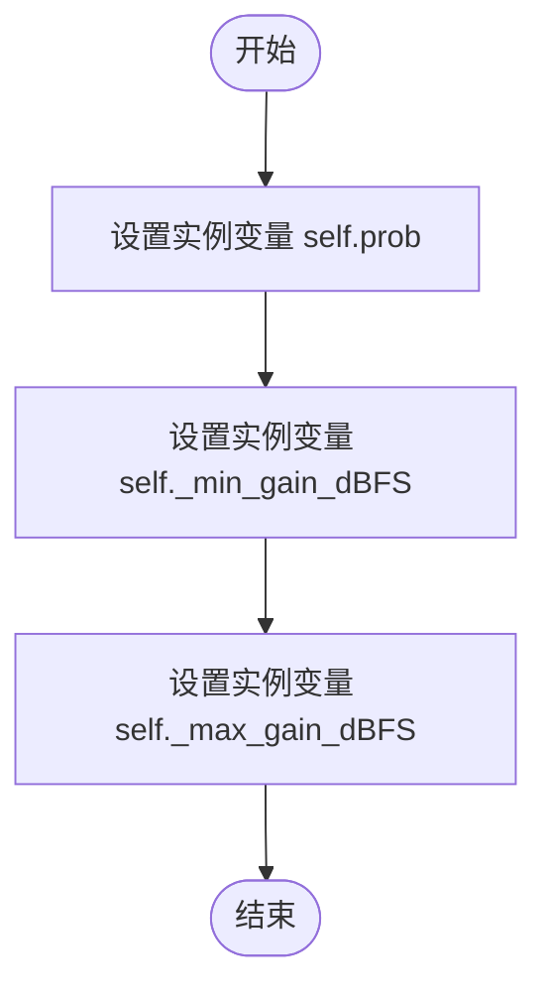

# `Chat-Haruhi-Suzumiya\yuki_builder\audio_feature_ext\data_utils\volume_perturb.py` 详细设计文档

一个音频数据增强工具类，通过随机调整音量增益来实现数据增强功能。该类继承自object，支持按指定概率对输入的音频波形进行音量扰动，可用于语音识别或音频处理模型的训练数据增强。

## 整体流程

```mermaid
graph TD
    A[开始] --> B{随机数 > prob?}
    B -- 是 --> C[返回原始音频]
    B -- 否 --> D[生成随机增益dBFS]
    D --> E[计算线性增益: 10^(gain/20)]
    E --> F[将增益应用到音频波形]
    F --> G[返回增强后的音频]
```

## 类结构

```
object (Python内置基类)
└── VolumePerturbAugmentor (音量扰动增强器)
    ├── __init__ (构造函数)
    └── __call__ (可调用接口)
```

## 全局变量及字段


### `VolumePerturbAugmentor.prob`
    
数据增强的概率

类型：`float`
    


### `VolumePerturbAugmentor._min_gain_dBFS`
    
最小增益值(分贝)

类型：`int`
    


### `VolumePerturbAugmentor._max_gain_dBFS`
    
最大增益值(分贝)

类型：`int`
    
    

## 全局函数及方法


### `VolumePerturbAugmentor.__init__`

构造函数，初始化音量增益范围（dBFS）和数据增强概率，并保存为实例变量。

参数：

-  `self`：`object`，隐式参数，代表类的实例对象
-  `min_gain_dBFS`：`int`，最小增益（单位dBFS），默认值为 -15
-  `max_gain_dBFS`：`int`，最大增益（单位dBFS），默认值为 15
-  `prob`：`float`，数据增强的概率，值范围 [0, 1]，默认值为 0.5

返回值：`None`，构造函数不返回值（Python 中 `__init__` 方法自动返回 `None`）

#### 流程图



#### 带注释源码

```python
def __init__(self, min_gain_dBFS=-15, max_gain_dBFS=15, prob=0.5):
    """构造函数，初始化音量增益范围和增强概率

    :param min_gain_dBFS: 最小增益（单位dBFS），默认-15
    :type min_gain_dBFS: int
    :param max_gain_dBFS: 最大增益（单位dBFS），默认15
    :type max_gain_dBFS: int
    :param prob: 数据增强的概率，默认0.5
    :type prob: float
    """
    # 保存数据增强概率到实例变量
    self.prob = prob
    # 保存最小增益到实例变量（私有变量）
    self._min_gain_dBFS = min_gain_dBFS
    # 保存最大增益到实例变量（私有变量）
    self._max_gain_dBFS = max_gain_dBFS
```


### `VolumePerturbAugmentor.__call__`

执行音量扰动增强的核心方法，根据预设概率决定是否对输入音频进行音量增益调整，实现音频数据的随机增强。

参数：

- `wav`：`ndarray`，librosa 读取的音频波形数据

返回值：`ndarray`，处理后的音频波形数据（若未触发增强则返回原数据）

#### 流程图

```mermaid
flowchart TD
    A[开始 __call__] --> B{随机数 > prob?}
    B -->|是| C[直接返回原始 wav]
    B -->|否| D[生成随机增益 gain]
    D --> E[计算增益因子: 10^(gain/20)]
    E --> F[将增益应用到音频: wav × 增益因子]
    F --> C
    C --> G[结束]
```

#### 带注释源码

```python
def __call__(self, wav):
    """改变音量大小

    :param wav: librosa 读取的数据
    :type wav: ndarray
    """
    # 生成 0~1 之间的随机数，判断是否执行增强
    if random.random() > self.prob: 
        return wav  # 概率不触发，直接返回原始音频
    
    # 在 [min_gain_dBFS, max_gain_dBFS] 范围内生成随机增益（单位：dB）
    gain = random.uniform(self._min_gain_dBFS, self._max_gain_dBFS)
    
    # 将增益（dB）转换为线性增益系数：线性 = 10^(dB/20)
    # 这是因为分贝是对数刻度，需要转换为线性缩放
    wav *= 10.**(gain / 20.)
    
    return wav  # 返回音量调整后的音频
```

## 关键组件


### VolumePerturbAugmentor 类

用于音频数据增强的音量扰动类，通过随机调整音频音量来增加数据多样性。

### 音量增益参数

包含最小增益（min_gain_dBFS）和最大增益（max_gain_dBFS）两个参数，控制音量变化的范围，单位为分贝（dBFS）。

### 概率控制机制

prob 参数控制数据增强的执行概率，每次调用时随机决定是否进行音量扰动。

### 分贝转线性增益转换

使用公式 10^(gain/20) 将分贝单位的增益转换为线性增益，应用到音频波形上。

### 随机均匀分布增益生成

使用 random.uniform 在指定范围内生成均匀分布的随机增益值。

### 音频数据增强流程

通过 __call__ 方法实现增强逻辑：随机决定是否执行增强 → 生成随机增益 → 应用增益变换 → 返回增强后的音频。


## 问题及建议


### 已知问题

-   文档字符串描述错误：max_gain_dBFS 参数的描述误写为“最小增益大”，应为“最大增益”
-   缺少类型注解（Type Hints）：方法参数和返回值均无类型声明，降低代码可读性和静态分析工具的效能
-   魔法数字问题：增益计算公式中的 `20.` 缺乏注释说明，应提取为有意义的常量或使用科学常量的数学表达
-   数值溢出风险：增益值过大时（如 15dB），乘以 `10.**(gain / 20.)` 可能导致浮点数溢出或数值不稳定
-   随机种子不可控：直接使用 `random.random()` 和 `random.uniform()`，无法在实验中复现结果，妨碍调试和可重复性
-   输入验证缺失：未对输入 `wav` 的类型和数值范围进行校验，可能导致运行时错误
-   类设计冗余：可通过显式继承 `collections.abc.Callable` 明确其可调用特性

### 优化建议

-   修正文档字符串中的描述错误，确保参数说明准确
-   为所有方法添加类型注解（`wav: np.ndarray -> np.ndarray`），提升代码可维护性
-   将增益计算中的常数提取为类常量（如 `self._增益计算分母 = 20.`）并添加注释说明
-   添加随机种子设置接口（如 `set_seed` 方法），或在构造函数中接受随机种子参数
-   在 `__call__` 方法入口添加输入验证：检查 `wav` 是否为 `np.ndarray`、是否为有限值、形状是否符合预期
-   考虑添加增益范围合法性检查（确保 `min_gain_dBFS <= max_gain_dBFS`）
-   考虑使用 `numpy.random` 替代 `random` 模块，以支持批量向量化的音频处理，提高效率

## 其它


### 设计目标与约束
该类的设计目标是实现音频数据增强中的音量随机调整功能，通过在指定范围内随机改变音频音量，增加训练数据的多样性，提升模型的鲁棒性。约束条件包括：增益范围限制在 min_gain_dBFS 到 max_gain_dBFS 之间，增强概率由 prob 参数控制，仅对 numpy 数组类型的音频数据生效。

### 错误处理与异常设计
代码目前缺少显式的错误处理机制。潜在的异常情况包括：输入 wav 参数为 None 时会导致计算错误；wav 不是 numpy 数组类型时可能导致运算失败；随机生成的 gain 值为非数值类型时会导致异常。建议添加类型检查和异常捕获机制：当 wav 为 None 或空数组时返回原始数据；当类型不匹配时抛出 TypeError；当数值异常时捕获并返回原始数据。

### 外部依赖与接口契约
主要外部依赖包括：random 模块用于生成随机数和随机增益值；numpy 模块用于数组运算。接口契约规定：输入参数 wav 必须是 numpy.ndarray 类型的一维或二维数组；输出返回值类型与输入类型一致；当 prob 条件不满足时返回原始输入的引用而非副本。

### 性能考虑与优化空间
当前实现每次调用都会生成新的随机数，计算复杂度为 O(n)，其中 n 为音频样本数。优化空间包括：可以添加缓存机制避免重复计算；可以预先计算 10^(gain/20) 的值；可以支持批量处理多个音频片段；对于大规模数据处理可以考虑使用向量化操作替代逐元素乘法。

### 使用示例与典型场景
典型使用场景包括语音识别模型的数据增强、音频分类任务的数据预处理、说话人识别系统的训练数据扩充。使用示例：augmentor = VolumePerturbAugmentor(min_gain_dBFS=-10, max_gain_dBFS=10, prob=0.3)，然后在数据预处理管道中通过 augmentor(wav) 调用对音频进行增强处理。

### 测试考虑
建议添加以下测试用例：测试 prob=0 时始终返回原始音频；测试 prob=1 时始终进行音量调整；测试边界值 min_gain_dBFS 和 max_gain_dBFS；测试输入为空数组或单样本音频的情况；测试不同形状的输入数组；测试增益值的分布是否符合均匀分布；测试输出音频的数值范围是否在合理区间内。

### 版本兼容性说明
当前代码使用 Python 3 语法，兼容 Python 3.6 及以上版本。代码未使用任何弃用特性，未来 Python 版本升级时预计保持兼容。numpy 依赖建议使用 1.15.0 及以上版本以确保最佳的数组操作性能。

    