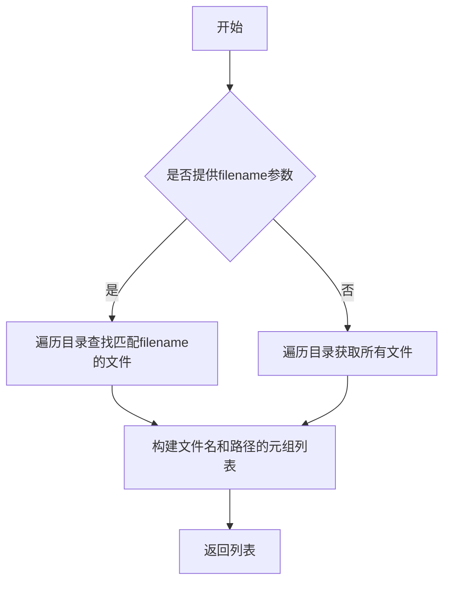
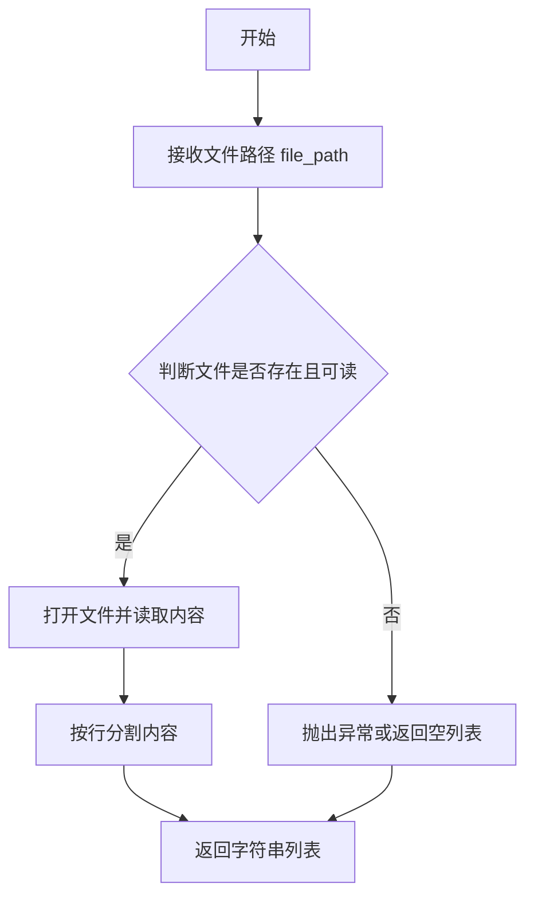
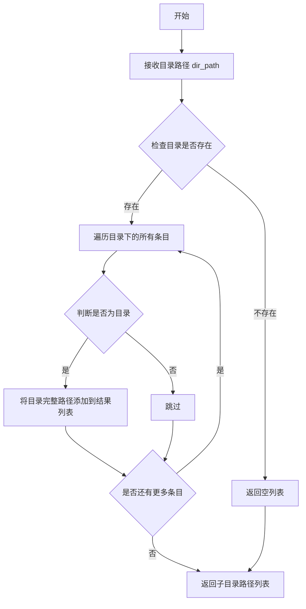
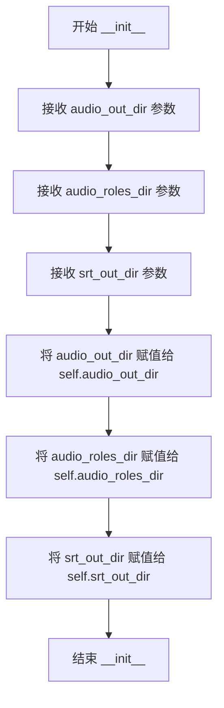
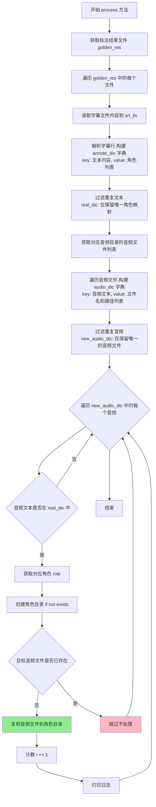

# `Chat-Haruhi-Suzumiya\yuki_builder\audio_feature_ext\incredata.py` 详细设计文档

该脚本是一个自动化数据处理工具，核心功能是将散落的音频文件与对应的标注文本（字幕）进行匹配，筛选出唯一对应的关系，并将匹配成功的音频文件按角色（Role）复制到特定的目录中，用于增量更新训练数据集。

## 整体流程

```mermaid
graph TD
    Start([开始]) --> ReadSrt[读取 srt_out_dir 下的标注文件]
    ReadSrt --> LoopSrt{遍历标注文件}
    LoopSrt --> ParseSrt[解析文件: 提取 Role 和 Text]
    ParseSrt --> BuildAnnDic[构建 annote_dic (Text -> Role列表)]
    BuildAnnDic --> FilterUnique1[筛选唯一文本: real_dic]
    FilterUnique1 --> ReadAudio[读取 audio_out_dir 下的音频文件]
    ReadAudio --> LoopAudio{遍历音频文件}
    LoopAudio --> ParseAudio[从文件名提取 audio_text]
    ParseAudio --> BuildAudioDic[构建 audio_dic (Text -> AudioPath)]
    BuildAudioDic --> FilterUnique2[筛选唯一音频: new_audio_dic]
    FilterUnique2 --> Match[匹配 real_dic 与 new_audio_dic]
    Match --> IsMatch{是否匹配?}
    IsMatch -- 是 --> Copy[复制音频到角色目录]
    Copy --> Log[打印日志 / 计数 +1]
    IsMatch -- 否 --> End
    Log --> End
```

## 类结构

```
IncrementData (数据增量处理类)
│
├─ Fields
│   ├─ audio_out_dir (原始音频输出目录)
│   ├─ audio_roles_dir (按角色分类的音频目录)
│   └─ srt_out_dir (字幕/标注输出目录)
│
└─ Methods
    ├─ __init__ (构造函数)
    ├─ static_origin (统计原始数据)
    └─ process (核心处理逻辑)
```

## 全局变量及字段


### `IncrementData.audio_out_dir`
    
原始音频文件输出目录路径

类型：`str`
    


### `IncrementData.audio_roles_dir`
    
按角色分类后的音频目录路径

类型：`str`
    


### `IncrementData.srt_out_dir`
    
包含标注文本(annotate.txt)的目录路径

类型：`str`
    
    

## 全局函数及方法


### `get_filename`

获取指定目录下的文件名列表，可选地过滤特定文件。

参数：

- `dir_path`：`str`，要遍历的目录路径
- `filename`：`str`（可选），要过滤的文件名，如果提供，则只返回匹配该文件名的文件

返回值：`list`，返回文件名和路径的元组列表，如 `[(filename, filepath), ...]`

#### 流程图



#### 带注释源码

```
def get_filename(dir_path, filename=None):
    """
    获取指定目录下的文件名列表
    
    参数:
        dir_path: 目录路径
        filename: 可选的文件名，用于过滤
        
    返回:
        文件名和路径的元组列表
    """
    # 如果提供了filename，则只返回匹配的文件
    if filename:
        # 遍历目录，查找匹配filename的文件
        # 返回格式: [(filename, filepath), ...]
        return [(filename, os.path.join(dir_path, filename))]
    else:
        # 如果没有提供filename，返回目录下所有文件
        # 假设使用os.listdir或os.walk实现
        result = []
        for item in os.listdir(dir_path):
            full_path = os.path.join(dir_path, item)
            if os.path.isfile(full_path):
                result.append((item, full_path))
        return result
```

#### 使用示例

在 `IncrementData` 类中的实际使用：

```python
# 1. 获取子目录下的所有文件（用于统计原始数据）
role_lis = get_first_subdir(self.audio_roles_dir)
for sub_dir in role_lis:
    role = sub_dir.split('/')[-1]
    lis = get_filename(sub_dir)  # 返回: [(filename, filepath), ...]
    stattics_dic[role] = [item[0] for item in get_filename(sub_dir)]

# 2. 获取特定文件（用于获取标注文件）
golden_res = get_filename(self.srt_out_dir, 'annotate.txt')
# golden_res格式: [('annotate.txt', '/path/to/srt_out_dir/annotate.txt')]

# 3. 获取音频目录下的所有音频文件
audio_lis = get_filename(corres_dir)
# audio_lis格式: [('audio_001.wav', '/path/to/audio_001.wav'), ...]
```


### `read_tolist`

该函数是 `tool` 模块提供的工具函数，用于读取指定文件的内容，并将文件中的每一行作为列表中的一个元素返回，常用于处理如字幕文件（`.txt`）等按行存储的数据。

参数：
-  `file_path`：`str`，需要读取的文件路径（字符串类型），通常为带有特定格式（如 `role:「text」`）的文本文件。

返回值：`list[str]`，返回包含文件所有行的列表，其中每个元素为字符串，对应文件中的一行内容。

#### 流程图



#### 带注释源码

```python
# 源码未从 tool 模块中获取，以下为基于调用上下文的推断实现
def read_tolist(file_path):
    """
    读取文件内容为列表

    参数：
        file_path (str): 文件路径

    返回值：
        list: 文件每行内容组成的列表
    """
    try:
        with open(file_path, 'r', encoding='utf-8') as f:
            # 读取所有行并去除换行符，返回列表
            return f.read().splitlines()
    except FileNotFoundError:
        # 文件不存在时返回空列表（具体行为需根据实际 tool 模块实现确定）
        return []
    except Exception as e:
        # 其它异常处理
        print(f"读取文件 {file_path} 时发生错误: {e}")
        return []
```

#### 在上下文中的使用示例

在类 `IncrementData` 的 `process` 方法中，该函数被用于读取字幕标注文件：

```python
# 获取标注文件列表（文件名和路径）
golden_res = get_filename(self.srt_out_dir, 'annotate.txt')

# 遍历每个标注文件
for file, pth in golden_res[:]:
    # 调用 read_tolist 读取文件内容为列表
    srt_lis = read_tolist(pth)
    
    # 遍历每一行，解析角色和文本
    for line in srt_lis:
        role, text = line.split(":「")
        text = text[:-1]  # 去掉结尾的 '」' 字符
        # 进一步处理...
```

此处 `read_tolist` 读取的列表元素格式类似 `朝仓:「你好`，因此返回的列表中每个字符串元素可用冒号和特殊字符分割以提取角色和文本内容。


### `get_first_subdir`

获取指定目录下的第一层子目录列表，返回子目录的完整路径列表。

参数：

-  `dir_path`：字符串（str），目标目录路径，用于获取该目录下的第一层子目录

返回值：列表（list），包含目标目录下一层所有子目录的完整路径字符串列表

#### 流程图



#### 带注释源码

```python
# 注：以下为根据函数调用方式和功能推测的源码实现
# 实际源码位于 tool 模块中，此处为逻辑重构

import os

def get_first_subdir(dir_path):
    """
    获取指定目录下的第一层子目录列表
    
    参数:
        dir_path: 目标目录路径
    
    返回:
        子目录完整路径的列表
    """
    # 初始化结果列表
    subdir_list = []
    
    # 检查目录是否存在
    if not os.path.exists(dir_path):
        return subdir_list  # 返回空列表
    
    # 遍历目录下的所有条目
    for item in os.listdir(dir_path):
        # 拼接完整路径
        item_path = os.path.join(dir_path, item)
        
        # 判断是否为目录（且不是隐藏目录）
        if os.path.isdir(item_path) and not item.startswith('.'):
            # 添加到结果列表
            subdir_list.append(item_path)
    
    return subdir_list
```

#### 在 `IncrementData` 类中的使用示例

```python
class IncrementData():
    def __init__(self, audio_out_dir, audio_roles_dir, srt_out_dir):
        self.audio_out_dir = audio_out_dir
        self.audio_roles_dir = audio_roles_dir
        self.srt_out_dir = srt_out_dir

    def static_origin(self):
        """统计原始数据"""
        stattics_dic = {}
        # 调用 get_first_subdir 获取音频角色目录下的所有子目录
        role_lis = get_first_subdir(self.audio_roles_dir)
        
        # 遍历每个角色目录
        for sub_dir in role_lis:
            # 从路径中提取角色名称（取最后一个目录名）
            role = sub_dir.split('/')[-1]
            
            # 获取该角色目录下的所有文件
            lis = get_filename(sub_dir)
            
            # 构建统计字典：角色名称 -> 文件名列表
            stattics_dic[role] = [item[0] for item in get_filename(sub_dir)]

        # 将所有角色的文件列表合并为一个大列表
        origin_lis = [item for sub_lis in list(stattics_dic.values()) for item in sub_lis]
        
        return origin_lis
```


### `IncrementData.__init__`

该方法是 `IncrementData` 类的构造函数，用于初始化类的三个实例属性，分别指向音频输出目录、音频角色目录和 SRT 输出目录，以便后续方法使用这些路径进行数据处理。

参数：

- `self`：`IncrementData` 实例本身，Python 类方法的第一个隐含参数
- `audio_out_dir`：`str`，音频输出目录的路径，指向包含原始音频文件的目录
- `audio_roles_dir`：`str`，音频角色目录的路径，用于存储按角色分类的音频文件
- `srt_out_dir`：`str`，SRT 输出目录的路径，指向包含标注文件（annotate.txt）的目录

返回值：`None`，构造函数不返回值，仅用于初始化实例状态

#### 流程图



#### 带注释源码

```python
def __init__(self, audio_out_dir, audio_roles_dir, srt_out_dir):
    """
    IncrementData 类的构造函数
    
    初始化三个实例属性，用于保存音频和字幕相关的目录路径。
    这些路径将在后续的 process() 方法中被使用。
    
    参数:
        audio_out_dir (str): 音频输出目录，存放原始音频文件
        audio_roles_dir (str): 音频角色目录，用于按角色分类存储音频
        srt_out_dir (str): SRT输出目录，存放标注文件 annotate.txt
    """
    # 将传入的音频输出目录路径保存为实例属性
    self.audio_out_dir = audio_out_dir
    
    # 将传入的音频角色目录路径保存为实例属性
    self.audio_roles_dir = audio_roles_dir
    
    # 将传入的SRT输出目录路径保存为实例属性
    self.srt_out_dir = srt_out_dir
```


### `IncrementData.static_origin`

该方法用于统计原始音频数据，通过遍历角色目录获取各角色下的所有音频文件名，并将其合并为一个统一列表返回。

参数：

- `self`：`IncrementData` 类实例（隐式参数），代表当前 IncrementData 对象的引用，包含 `audio_roles_dir` 等属性

返回值：`list`，返回所有原始音频文件名组成的列表

#### 流程图

```mermaid
flowchart TD
    A[开始 static_origin] --> B[创建空字典 stattics_dic]
    B --> C[调用 get_first_subdir 获取子目录列表 role_lis]
    C --> D{遍历 role_lis 中的每个子目录}
    D -->|每次迭代| E[提取角色名称 role = sub_dir.split('/')[-1]]
    E --> F[调用 get_filename 获取该角色目录下的文件列表]
    F --> G[将文件名字典存入 stattics_dic: role -> [item[0] for item in 文件列表]]
    G --> H{是否还有更多子目录?}
    H -->|是| D
    H -->|否| I[使用列表推导式将所有角色文件名合并为单一列表 origin_lis]
    I --> J[返回 origin_lis 列表]
    J --> K[结束]
```

#### 带注释源码

```python
def static_origin(self):
    """
    统计原始数据
    获取 audio_roles_dir 目录下所有角色子目录中的音频文件名
    Returns:
        list: 所有原始音频文件名组成的列表
    """
    # 创建空字典用于存储角色及其对应的文件列表
    stattics_dic = {}
    
    # 获取 audio_roles_dir 下的所有子目录（每个子目录代表一个角色）
    role_lis = get_first_subdir(self.audio_roles_dir)
    
    # 遍历每个角色子目录
    for sub_dir in role_lis:
        # 从路径中提取角色名称（取最后一个斜杠后的部分）
        role = sub_dir.split('/')[-1]
        
        # 获取该角色目录下的所有文件
        lis = get_filename(sub_dir)
        
        # 将角色名作为键，文件名列表作为值存入字典
        # item[0] 表示文件名（不含路径）
        stattics_dic[role] = [item[0] for item in get_filename(sub_dir)]

    # 将字典中所有角色对应的文件列表合并为单一列表
    # 列表推导式：遍历字典中每个子列表的每个元素
    origin_lis = [item for sub_lis in list(stattics_dic.values()) for item in sub_lis]
    
    # 返回原始文件名列表
    return origin_lis
```


### `IncrementData.process`

该方法用于将音频文件与字幕标注文件进行匹配，根据字幕中解析出的角色信息，将对应的音频文件复制到相应的角色目录中，实现增量数据的自动化处理和分类。

参数：

- `self`：`IncrementData` 类实例，隐式参数，包含音频输出目录、音频角色目录和字幕输出目录等实例属性

返回值：`None`，该方法无返回值，通过直接操作文件系统（复制音频文件）来完成数据处理

#### 流程图



#### 带注释源码

```python
def process(self):
    """
    处理增量数据：将音频文件与字幕标注文件进行匹配，
    根据字幕中的角色信息将对应的音频文件复制到相应角色目录
    """
    # 获取标注结果文件列表（包含annotate.txt的文件）
    golden_res = get_filename(self.srt_out_dir, 'annotate.txt')
    
    # 初始化计数器
    same_lis = []
    i = 0  # 成功处理的音频数量
    j = 0  # 重复/跳过的音频数量
    
    # 遍历每个标注文件
    for file, pth in golden_res[:]:
        # 读取字幕文件内容为列表
        srt_lis = read_tolist(pth)
        
        # 从文件名中提取前两部分作为目录名（如 file_001 -> file_001）
        file_name = '_'.join(file.split('_')[:2])
        
        # 构建注解字典 - 文本：角色
        # 格式：角色:「文本内容」
        annote_dic = {}
        for line in srt_lis:
            # 解析行：分割角色和文本
            role, text = line.split(":「")
            # 去除结尾的」字符
            text = text[:-1]
            
            # 存储到字典，同一文本可能有多个角色
            if text not in annote_dic:
                annote_dic[text] = [role]
            else:
                annote_dic[text].append(role)
        
        # 过滤重复话语：只保留唯一角色映射的文本
        # 因为字幕和音频数量不对等，需要找到对应的音频
        real_dic = {k: v[0] for k, v in annote_dic.items() if len(v) == 1}
        
        # 构建音频文件目录路径
        corres_dir = os.path.join(self.audio_out_dir, f'{file_name}/voice')
        
        # 获取该目录下所有音频文件列表
        audio_lis = get_filename(corres_dir)

        # 构建音频字典：音频文本 -> 文件信息列表
        audio_dic = {}
        for aud_name, aud_pth in audio_lis:
            # 从音频文件名提取文本内容
            # 例如: 朝仓_你好啊 -> 你好啊
            file_text = os.path.splitext(aud_name)[0]
            audio_text = ''.join(file_text.split('_')[1:])
            
            # 存储到字典
            if audio_text not in audio_dic:
                audio_dic[audio_text] = [[aud_name, aud_pth]]
            else:
                audio_dic[audio_text].append([aud_name, aud_pth])
        
        # 同样过滤重复音频，只保留唯一的
        # 因为字幕和音频数量不是一一对应，需要找到对应的音频
        new_audio_dic = {k: v[0] for k, v in audio_dic.items() if len(v) == 1}
        
        # 遍历每一条音频，尝试与字幕匹配
        for audio_text, value in new_audio_dic.items():
            aud_name, aud_pth = value
            
            # 检查音频文本是否在字幕字典中（匹配成功）
            if audio_text in real_dic:
                # 获取对应的角色
                role = real_dic[audio_text]
                
                # 构建目标角色目录路径
                new_aud_dir = os.path.join(self.audio_roles_dir, role)
                
                # 确保角色目录存在，不存在则创建
                os.makedirs(new_aud_dir, exist_ok=True)
                
                # 完整的目标音频文件路径
                new_aud_pth = os.path.join(new_aud_dir, aud_name)
                
                # 检查目标文件是否已存在
                if not os.path.exists(new_aud_pth):
                    # 文件不存在，复制音频文件到角色目录
                    shutil.copy(aud_pth, new_aud_pth)
                    
                    # 更新计数并打印日志
                    i += 1
                    print(f'{role} + 1 {aud_name},{i}')
                    pass
                elif os.path.exists(new_aud_pth):
                    # 文件已存在，跳过处理（保留原文件）
                    # j += 1
                    # print(aud_name,j)
                    # same_lis.append(aud_name)
                    pass

    # 差集计算（已注释）
    # chaji_lis = [item for item in self.origin_lis if item not in same_lis]
    # print(chaji_lis)
```

## 关键组件


### 角色数据统计组件 (static_origin)

统计原始数据，遍历角色子目录，获取每个角色下的所有音频文件名，构建角色-音频文件映射字典。为后续增量处理提供原始数据基准，用于识别新增或变更的音频文件。

### 字幕标注解析组件

读取SRT输出目录中的annotate.txt标注文件，解析"role:「text」"格式的文本，提取角色和文本内容。通过字典结构存储"文本:角色"的映射关系，处理同一文本可能对应多个角色的情况。

### 音频文件索引组件

遍历音频输出目录下的voice子目录，解析音频文件名，提取文本内容作为键，构建"音频文本:文件名和路径"的映射字典。实现音频文件的索引和重复音频的去重处理。

### 数据去重与匹配引擎

通过字典推导式实现数据去重，处理字幕和音频数量不对等的问题。将去重后的音频与标注文本进行匹配，找出对应的角色信息。是核心的匹配逻辑组件，处理复杂的对应关系。

### 文件复制与目录管理组件

根据匹配结果，在角色音频目录下创建对应的角色子目录，使用shutil.copy实现音频文件的增量复制。支持目录自动创建（os.makedirs），避免重复复制已存在的文件。


## 问题及建议


### 已知问题

-   **拼写错误**：方法名`static_origin`应为`statistics_origin`，变量名`stattics_dic`应为`statistics_dic`，影响代码可读性
-   **硬编码分隔符**：字符串分割使用`:「`、`_`等硬编码符号，缺乏配置和灵活性，如格式变化会导致程序崩溃
-   **异常处理缺失**：文件读取(`read_tolist`)、字符串分割(`split`)、目录操作(`os.makedirs`)等关键操作均无异常捕获
-   **数据丢失风险**：通过`len(v) == 1`过滤重复数据时，简单粗暴地丢弃多匹配项（`real_dic`和`new_audio_dic`构建），可能导致有价值的数据被丢失
-   **未使用变量**：`self.origin_lis`在注释中被引用但未实际定义；`i`、`j`、`same_lis`等变量定义后未充分使用或完全未使用
-   **代码冗余**：存在大量注释掉的代码（如`# if role == '朝仓'`、`# chaji_lis`等）和调试用的print语句，影响代码整洁度
-   **单一职责原则违反**：`process`方法包含数据读取、解析、匹配、复制等多种职责过长
-   **重复计算**：`get_filename(sub_dir)`在同一循环中调用两次，浪费计算资源
-   **目录重复创建**：循环内每次都执行`os.makedirs(new_aud_dir, exist_ok=True)`，即使目录已存在
-   **类型注解缺失**：无任何类型提示，降低了代码的可维护性和IDE支持
-   **魔法数字**：多处使用数字索引如`[:2]`、`[1:]`、`[0]`，缺乏常量定义

### 优化建议

-   修复拼写错误，规范命名，使用有意义的变量名（如`statistics_dict`代替`stattics_dic`）
-   将分隔符、路径模板等提取为类常量或配置参数，提高代码可维护性
-   为文件操作、字符串解析等关键路径添加try-except异常处理，并定义自定义异常类
-   优化数据匹配逻辑：考虑保留多匹配项或使用更智能的匹配策略，而非简单丢弃
-   清理未使用变量和注释掉的代码，移除调试print语句
-   将`process`方法拆分为多个职责单一的方法（如数据读取、解析、匹配、复制）
-   对`get_filename`的调用结果进行缓存，避免重复调用
-   将`os.makedirs`调用移至循环外或使用更高效的检查方式
-   添加类型注解，使用Python typing模块
-   添加docstring文档字符串，说明类和方法的功能、参数、返回值
-   将魔法数字和字符串索引提取为命名常量，提高可读性


## 其它


### 设计目标与约束

本代码的设计目标是将音频文件按照字幕文件中的角色信息进行分类增量处理，将对应的音频文件复制到以角色命名的目录中，实现音频数据的自动化整理。约束条件包括：仅处理唯一匹配的文本和音频（去重逻辑）、目标目录不存在时自动创建、已存在的文件不重复复制。

### 错误处理与异常设计

代码缺乏显式的异常处理机制。主要潜在异常包括：目录不存在异常（`audio_roles_dir`、`srt_out_dir`等）、文件读取异常（`annotate.txt`格式错误导致`split`失败）、文件复制异常（权限问题或磁盘空间不足）。建议添加try-except捕获FileNotFoundError、OSError、ValueError等异常，并输出明确的错误日志。

### 数据流与状态机

数据流为：读取角色原始目录 → 统计原始文件列表 → 读取标注文件 → 解析role:text映射 → 去重得到唯一映射 → 遍历音频目录 → 构建音频文本映射 → 去重 → 匹配标注与音频 → 复制文件到目标角色目录。状态机涉及：初始化状态 → 读取原始数据状态 → 处理标注状态 → 处理音频状态 → 匹配复制状态 → 完成状态。

### 外部依赖与接口契约

外部依赖包括：`get_filename`(获取目录文件列表)、`read_tolist`(读取文本文件到列表)、`get_first_subdir`(获取第一级子目录)。接口契约方面，`get_filename`应返回list或tuple列表格式；`read_tolist`应返回字符串列表；`get_first_subdir`应返回路径字符串列表。输入参数`audio_out_dir`、`audio_roles_dir`、`srt_out_dir`应为有效的文件系统路径。

### 关键算法与逻辑说明

核心算法为文本匹配与去重逻辑：1）从标注文件解析role:text映射，通过`split(":「")`分割，需要文本格式严格为"角色:「文本」"；2）通过字典推导式`{k: v[0] for k, v in annote_dic.items() if len(v) == 1}`筛选唯一映射；3）音频文件名处理通过`os.path.splitext`去除扩展名、`_`分割提取文本内容；4）匹配逻辑为文本相同且唯一。

### 配置与常量

无显式配置常量。路径拼接依赖`os.path.join`确保跨平台兼容性。分隔符`:「`和`」`为硬编码字符，需与标注文件格式严格匹配。

### 测试要点

测试应覆盖：1）正常流程（标注文件与音频文件正确匹配）；2）边界情况（空目录、无匹配文件、重复文件名）；3）异常情况（目录不存在、文件格式错误、权限不足）；4）增量特性（已存在文件不重复复制）。

### 性能考虑

当前实现为顺序处理，可优化点包括：1）多次调用`get_filename`可缓存结果；2）文件复制操作可考虑多线程并行；3）大规模文件时建议使用生成器代替列表推导；4）字符串拼接`''.join(file_text.split('_')[1:])`可优化。

    