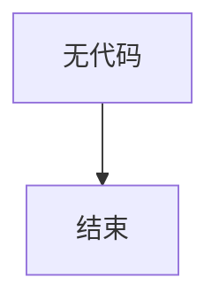

# `Chat-Haruhi-Suzumiya\yuki_builder\audio_feature_ext\modules\__init__.py` 详细设计文档

未提供源代码，无法进行分析。

## 整体流程



## 类结构

```

```

## 全局变量及字段


    

## 全局函数及方法


## 关键组件


由于未提供源代码，无法识别关键组件。请提供代码后，我将根据代码内容识别关键组件（如张量索引与惰性加载、反量化支持、量化策略等）并生成相应的设计文档。


## 问题及建议


### 已知问题

-   未提供代码内容，无法进行技术债务和优化空间的分析

### 优化建议

-   请提供需要分析的源代码，以便进行详细的技术债务识别和优化建议


## 其它


### 设计目标与约束

本模块的设计目标为[待补充]，主要约束包括性能要求（[待补充]）、兼容性要求（[待补充]）、安全要求（[待补充]）等。

### 错误处理与异常设计

本模块的错误处理机制采用[待补充]策略，异常类型包括[待补充]异常、[待补充]异常等，异常传播方式为[待补充]。

### 数据流与状态机

数据流方向：[待补充]
状态机定义：
- 状态列表：[待补充]
- 状态转换条件：[待补充]
- 初始状态：[待补充]
- 终止状态：[待补充]

### 外部依赖与接口契约

外部依赖：
- 依赖模块1：[待补充]，版本要求[待补充]
- 依赖模块2：[待补充]，版本要求[待补充]

接口契约：
- 接口名称：[待补充]
- 调用方式：[待补充]
- 参数规范：[待补充]
- 返回值规范：[待补充]
- 错误码定义：[待补充]

### 安全与权限设计

认证机制：[待补充]
授权策略：[待补充]
敏感数据处理：[待补充]
安全审计：[待补充]

### 性能考量

时间复杂度分析：[待补充]
空间复杂度分析：[待补充]
性能瓶颈预估：[待补充]
优化策略：[待补充]

### 部署与配置

部署方式：[待补充]
配置项说明：[待补充]
环境要求：[待补充]

### 测试策略

单元测试覆盖范围：[待补充]
集成测试场景：[待补充]
端到端测试场景：[待补充]
 Mock对象定义：[待补充]

### 版本兼容性

向前兼容性：[待补充]
向后兼容性：[待补充]
版本升级策略：[待补充]

### 监控与运维

日志级别定义：[待补充]
监控指标：[待补充]
告警策略：[待补充]
运维操作接口：[待补充]


    