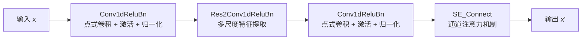
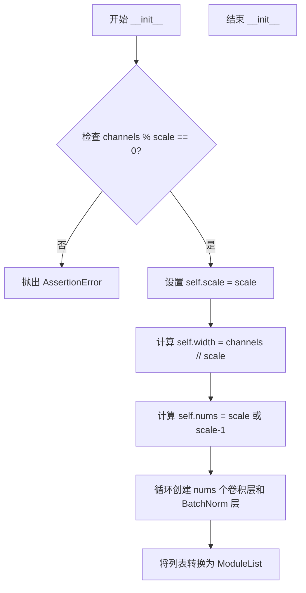
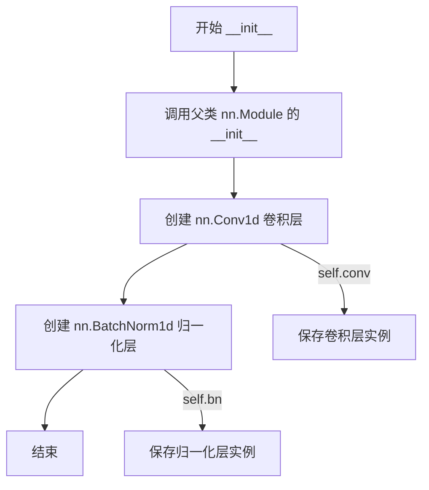
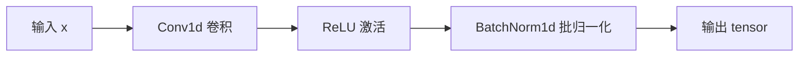
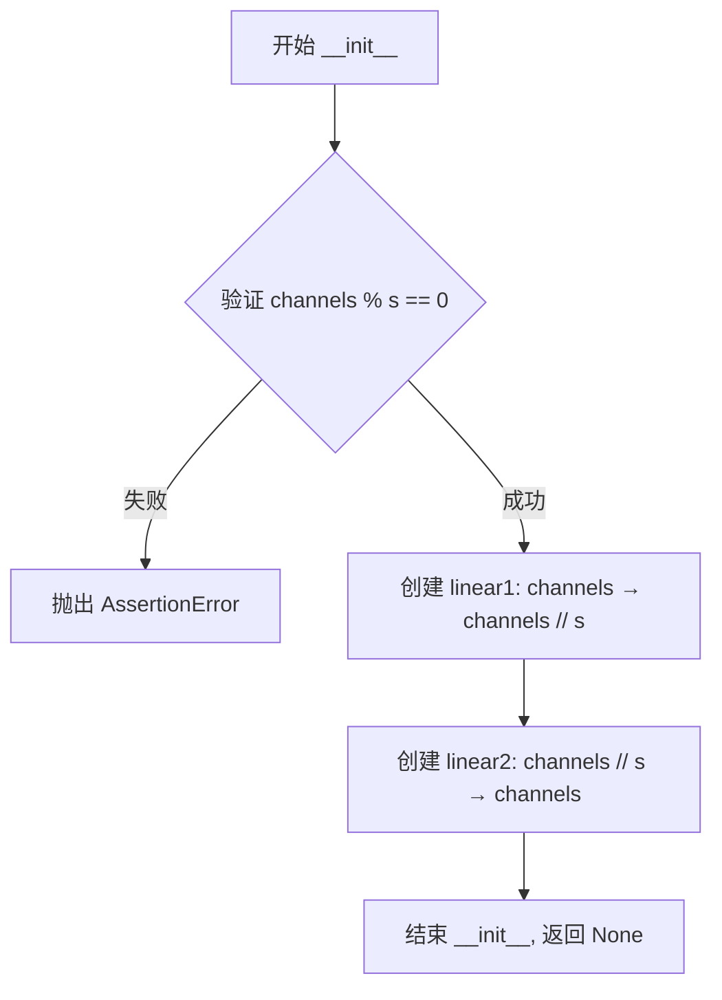
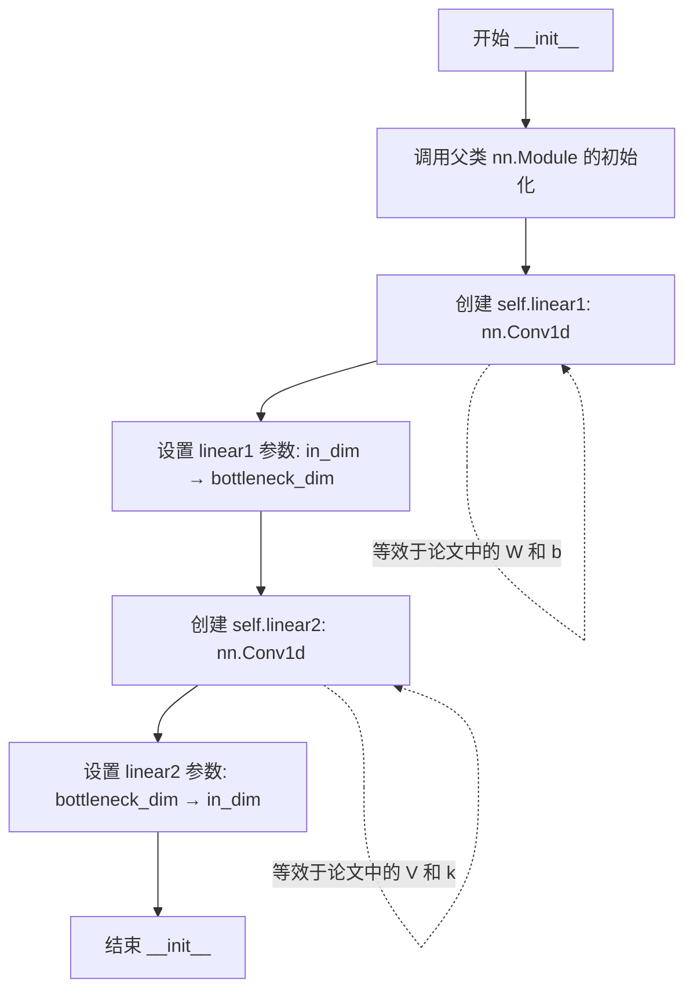
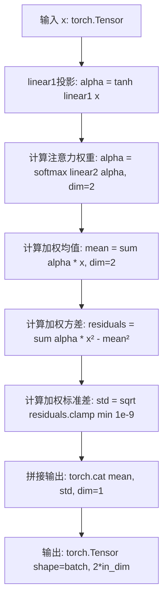
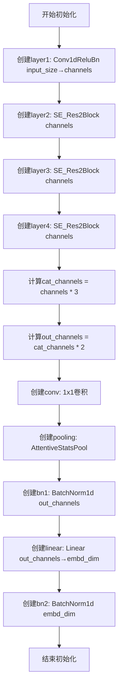
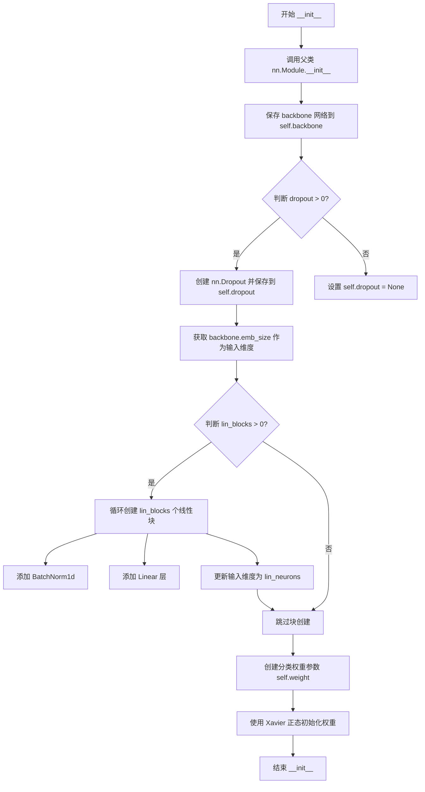

# `Chat-Haruhi-Suzumiya\yuki_builder\audio_feature_ext\modules\ecapa_tdnn.py` 详细设计文档

该代码实现了一个基于ECAPA-TDNN架构的深度神经网络，用于说话人识别任务。模型通过多尺度SE-Res2Block提取音频特征，结合注意力统计池化生成固定维度的说话人嵌入向量（Embedding），最终通过归一化线性层输出分类Logits。

## 整体流程

```mermaid
graph TD
    Input[输入: (Batch, Freq, Time)] --> Backbone[SpeakerIdetification]
    Backbone --> Ecapa[EcapaTdnn Backbone]
    Ecapa --> C1[Conv1dReluBn (Layer1)]
    C1 --> R2[SE_Res2Block (Layer2)]
    R2 --> R3[SE_Res2Block (Layer3)]
    R3 --> R4[SE_Res2Block (Layer4)]
    R2 --> Add2[残差连接]
    R3 --> Add3[残差连接]
    R4 --> Add4[残差连接]
    R4 --> Cat[Concat(out2, out3, out4)]
    Cat --> Conv[Conv1d + ReLU]
    Conv --> Pool[AttentiveStatsPool]
    Pool --> Linear[Linear + BatchNorm]
    Linear --> Embed[Embedding Output]
    Embed --> Drop[Dropout (可选)]
    Drop --> Blocks[Linear Blocks]
    Blocks --> Norm[Weight Normalization]
    Norm --> Logits[Logits Output]
```

## 类结构

```
torch.nn.Module
├── Res2Conv1dReluBn (多尺度残差卷积块)
│   └── 实现思路：将通道分为多份，每份独立卷积后拼接
├── Conv1dReluBn (基础卷积块)
│   └── 组合 Conv + ReLU + BatchNorm
├── SE_Connect (Squeeze-and-Excitation 注意力模块)
│   └── 用于通道注意力机制
├── AttentiveStatsPool (注意力统计池化层)
│   └── 计算加权均值和标准差
├── EcapaTdnn (核心骨干网络)
│   └── 包含多层SE-Res2Block和池化层
└── SpeakerIdetification (顶层模型)
    └── 封装Backbone + 分类头
```

## 全局变量及字段


### `SE_Res2Block`
    
构建SE-Res2块的工厂函数，返回包含Conv1dReluBn、Res2Conv1dReluBn和SE_Connect的顺序网络

类型：`function`
    


### `Res2Conv1dReluBn.scale`
    
通道分割比例

类型：`int`
    


### `Res2Conv1dReluBn.width`
    
分割后单份通道数

类型：`int`
    


### `Res2Conv1dReluBn.nums`
    
卷积核数量

类型：`int`
    


### `Res2Conv1dReluBn.convs`
    
1D卷积列表

类型：`nn.ModuleList`
    


### `Res2Conv1dReluBn.bns`
    
批归一化列表

类型：`nn.ModuleList`
    


### `Res2Conv1dReluBn.__init__`
    
初始化卷积核BatchNorm参数

类型：`method`
    


### `Res2Conv1dReluBn.forward`
    
执行多尺度卷积与残差连接

类型：`method`
    


### `Conv1dReluBn.conv`
    
输入卷积层

类型：`nn.Conv1d`
    


### `Conv1dReluBn.bn`
    
批归一化层

类型：`nn.BatchNorm1d`
    


### `Conv1dReluBn.__init__`
    
初始化卷积和归一化

类型：`method`
    


### `Conv1dReluBn.forward`
    
执行卷积 -> ReLU -> BN

类型：`method`
    


### `SE_Connect.linear1`
    
降维全连接层

类型：`nn.Linear`
    


### `SE_Connect.linear2`
    
升维全连接层

类型：`nn.Linear`
    


### `SE_Connect.__init__`
    
初始化SE模块权重

类型：`method`
    


### `SE_Connect.forward`
    
执行全局平均池化 -> 降维 -> ReLU -> 升维 -> Sigmoid -> 加权

类型：`method`
    


### `AttentiveStatsPool.linear1`
    
计算注意力权重(alpha)

类型：`nn.Conv1d`
    


### `AttentiveStatsPool.linear2`
    
计算注意力权重分布

类型：`nn.Conv1d`
    


### `AttentiveStatsPool.__init__`
    
初始化注意力权重参数

类型：`method`
    


### `AttentiveStatsPool.forward`
    
计算加权均值(Mean)和加权标准差(Std)并拼接

类型：`method`
    


### `EcapaTdnn.layer1`
    
初始特征提取

类型：`Conv1dReluBn`
    


### `EcapaTdnn.layer2`
    
SE-Res2块

类型：`nn.Sequential`
    


### `EcapaTdnn.layer3`
    
SE-Res2块

类型：`nn.Sequential`
    


### `EcapaTdnn.layer4`
    
SE-Res2块

类型：`nn.Sequential`
    


### `EcapaTdnn.conv`
    
通道融合

类型：`nn.Conv1d`
    


### `EcapaTdnn.pooling`
    
池化

类型：`AttentiveStatsPool`
    


### `EcapaTdnn.bn1`
    
融合后归一化

类型：`nn.BatchNorm1d`
    


### `EcapaTdnn.linear`
    
嵌入层投影

类型：`nn.Linear`
    


### `EcapaTdnn.bn2`
    
嵌入层归一化

类型：`nn.BatchNorm1d`
    


### `EcapaTdnn.emb_size`
    
嵌入向量维度

类型：`int`
    


### `EcapaTdnn.__init__`
    
构建ECAPA-TDNN网络结构

类型：`method`
    


### `EcapaTdnn.forward`
    
多层特征提取 -> 残差融合 -> 池化 -> 嵌入输出

类型：`method`
    


### `SpeakerIdetification.backbone`
    
说话人嵌入提取网络

类型：`EcapaTdnn`
    


### `SpeakerIdetification.dropout`
    
随机失活层(可选)

类型：`nn.Dropout`
    


### `SpeakerIdetification.blocks`
    
线性变换块列表

类型：`nn.ModuleList`
    


### `SpeakerIdetification.weight`
    
分类器权重(可学习)

类型：`nn.Parameter`
    


### `SpeakerIdetification.__init__`
    
初始化Backbone和分类器

类型：`method`
    


### `SpeakerIdetification.forward`
    
提取Embedding -> Dropout -> 线性变换 -> 归一化权重计算Logits

类型：`method`
    
    

## 全局函数及方法


### `SE_Res2Block`

这是一个工厂函数，用于构建 ECAPA-TDNN 模型中的核心残差块（SE_Res2Block）。它接收通道数、卷积核大小、步长、填充、膨胀率及尺度因子作为参数，并返回一个由“卷积预处理、多尺度特征提取（Res2Conv）、卷积后处理和通道注意力机制（SE）”四个子模块顺序组成的 `nn.Sequential` 网络。

参数：

- `channels`：`int`，输入和输出特征图的通道数。
- `kernel_size`：`int`，内部 Res2 卷积层的卷积核大小。
- `stride`：`int`，卷积步长。
- `padding`：`int`，卷积填充大小。
- `dilation`：`int`，卷积膨胀率。
- `scale`：`int`，Res2Net 结构中的尺度因子（将通道分割的份数）。

返回值：`torch.nn.Sequential`，返回一个包含 Conv1dReluBn、Res2Conv1dReluBn、Conv1dReluBn 和 SE_Connect 四个模块的顺序容器。

#### 流程图



#### 带注释源码

```python
def SE_Res2Block(channels, kernel_size, stride, padding, dilation, scale):
    """
    工厂函数：构建 SE_Res2Block。
    
    参数:
        channels (int): 输入输出的通道数。
        kernel_size (int): Res2 卷积核大小。
        stride (int): 步长。
        padding (int): 填充。
        dilation (int): 膨胀率。
        scale (int): 缩放因子，决定 Res2Net 的分支数量。
        
    返回:
        nn.Sequential: 包含四个子模块的顺序网络。
    """
    return nn.Sequential(
        # 模块1：通道映射与初步特征提取 (1x1 卷积)
        Conv1dReluBn(channels, channels, kernel_size=1, stride=1, padding=0),
        
        # 模块2：多尺度特征提取核心 (Res2Net 思想)
        # 该层将通道分为 scale 份，进行分层卷积融合
        Res2Conv1dReluBn(channels, kernel_size, stride, padding, dilation, scale=scale),
        
        # 模块3：通道映射与特征融合 (1x1 卷积)
        Conv1dReluBn(channels, channels, kernel_size=1, stride=1, padding=0),
        
        # 模块4：Squeeze-and-Excitation (SE) 通道注意力
        # 重新校准通道间的特征响应
        SE_Connect(channels)
    )
```


### `Res2Conv1dReluBn.__init__`

该方法是 `Res2Conv1dReluBn` 类的构造函数，用于初始化 Res2 卷积结构的核心参数和子层（卷积层和 BatchNorm 层），实现多尺度特征提取的残差连接结构。

参数：

- `channels`：`int`，输入通道数，必须能被 scale 整除
- `kernel_size`：`int`，卷积核大小，默认为 1
- `stride`：`int`，卷积步长，默认为 1
- `padding`：`int`，填充大小，默认为 0
- `dilation`：`int`，膨胀率，默认为 1
- `bias`：`bool`，是否使用偏置，默认为 False
- `scale`：`int`，缩放因子（分割通道数的倍数），默认为 4

返回值：`None`，该方法为初始化方法，不返回任何值

#### 流程图



#### 带注释源码

```python
def __init__(self, channels, kernel_size=1, stride=1, padding=0, dilation=1, bias=False, scale=4):
    """
    初始化 Res2Conv1dReluBn 层的参数和子结构
    
    参数:
        channels: int, 输入通道数，必须能被 scale 整除
        kernel_size: int, 卷积核大小
        stride: int, 卷积步长
        padding: int, 填充大小
        dilation: int, 膨胀率
        bias: bool, 是否使用偏置
        scale: int, 缩放因子，用于将通道分割为多个子通道
    """
    # 调用父类 nn.Module 的初始化方法
    super().__init__()
    
    # 断言检查：channels 必须能被 scale 整除
    # 这是因为通道会被分割成 scale 份，每份宽度为 channels // scale
    assert channels % scale == 0, "{} % {} != 0".format(channels, scale)
    
    # 保存缩放因子
    self.scale = scale
    
    # 计算每个子通道的宽度（分割后的通道数）
    self.width = channels // scale
    
    # 计算创建的卷积/BN 对的数量
    # 如果 scale == 1，则只有 1 个；否则有 scale - 1 个（保留一个残差连接）
    self.nums = scale if scale == 1 else scale - 1
    
    # 初始化卷积层和 BatchNorm 层的列表容器
    self.convs = []
    self.bns = []
    
    # 循环创建 nums 个卷积层和 BatchNorm 层
    # 每个子通道都使用相同的卷积核大小、步长、填充、膨胀率和偏置设置
    for i in range(self.nums):
        # 创建一维卷积层：输入和输出通道数都是子通道宽度
        self.convs.append(nn.Conv1d(
            self.width, 
            self.width, 
            kernel_size, 
            stride, 
            padding, 
            dilation, 
            bias=bias
        ))
        # 创建一维批归一化层：归一化子通道的输出
        self.bns.append(nn.BatchNorm1d(self.width))
    
    # 将 Python 列表转换为 nn.ModuleList，以便 PyTorch 正确注册参数
    # 这是必须的，否则卷积层的参数不会被添加到模型中
    self.convs = nn.ModuleList(self.convs)
    self.bns = nn.ModuleList(self.bns)
```


### `Res2Conv1dReluBn.forward`

执行多尺度卷积与残差连接，将输入通道按比例分割为多个子通道，对每个子通道分别进行卷积、ReLU激活和批归一化操作，最后将所有子通道的输出与未处理的残差块进行拼接，形成多尺度特征融合的输出。

参数：

- `x`：`torch.Tensor`，输入张量，形状为 `[batch, channels, time]`，其中 `channels` 必须能被 `scale` 整除

返回值：`torch.Tensor`，输出张量，形状为 `[batch, channels, time]`，包含多尺度卷积融合后的特征

#### 流程图

```mermaid
flowchart TD
    A[输入 x: [batch, channels, time]] --> B[torch.split 按宽度分割]
    B --> C[遍历 0 到 nums-1]
    C --> D{i==0?}
    D -->|是| E[sp = spx[i]]
    D -->|否| F[sp = sp + spx[i] 残差连接]
    E --> G[卷积: conv[i]]
    F --> G
    G --> H[激活: ReLU]
    H --> I[批归一化: bn[i]]
    I --> J[添加到输出列表]
    J --> C
    C --> K{scale != 1?}
    K -->|是| L[添加最后一个残差块 spx[nums]]
    K -->|否| M[torch.cat 拼接所有输出]
    L --> M
    M --> N[输出: [batch, channels, time]]
```

#### 带注释源码

```python
def forward(self, x):
    """
    多尺度卷积前向传播
    
    该方法实现了一种多尺度特征提取机制：
    1. 将输入沿通道维度分割为多个子通道
    2. 对每个子通道进行累积式的卷积处理（带有残差连接）
    3. 最后将所有处理后的特征拼接输出
    """
    out = []
    # 将输入 x 按宽度 self.width 在维度 1（通道维度）分割
    # spx 是一个长度为 scale 的列表，每个元素形状为 [batch, width, time]
    spx = torch.split(x, self.width, 1)
    
    # 遍历每个子通道（除最后一个保留的块外）
    for i in range(self.nums):
        if i == 0:
            # 第一个子块直接使用，不加残差
            sp = spx[i]
        else:
            # 后续子块与前一个子块相加，实现残差连接
            sp = sp + spx[i]
        
        # 顺序执行: 卷积 -> ReLU激活 -> 批归一化
        sp = self.convs[i](sp)       # 1D卷积处理
        sp = self.bns[i](F.relu(sp)) # ReLU激活后接BatchNorm
        out.append(sp)               # 保存处理后的结果
    
    # 如果 scale > 1，将最后一个未处理的子块直接添加（作为残差）
    if self.scale != 1:
        out.append(spx[self.nums])
    
    # 在通道维度（dim=1）拼接所有输出
    # 最终输出通道数仍为 channels = scale * self.width
    out = torch.cat(out, dim=1)
    return out
```


### `Conv1dReluBn.__init__`

初始化卷积和归一化模块，用于构建包含1D卷积、ReLU激活和批归一化的基础卷积块。

参数：

- `in_channels`：`int`，输入特征图的通道数
- `out_channels`：`int`，输出特征图的通道数
- `kernel_size`：`int`，卷积核大小，默认为1
- `stride`：`int`，卷积步长，默认为1
- `padding`：`int`，输入特征图填充大小，默认为0
- `dilation`：`int`，卷积核膨胀系数，默认为1
- `bias`：`bool`，是否使用偏置，默认为False

返回值：`None`，该方法为初始化方法，不返回任何值

#### 流程图



#### 带注释源码

```python
def __init__(self, in_channels, out_channels, kernel_size=1, stride=1, padding=0, dilation=1, bias=False):
    """
    初始化 Conv1dReluBn 模块
    
    Args:
        in_channels (int): 输入特征图的通道数
        out_channels (int): 输出特征图的通道数
        kernel_size (int): 卷积核大小，默认为1
        stride (int): 卷积步长，默认为1
        padding (int): 输入特征图填充大小，默认为0
        dilation (int): 卷积核膨胀系数，默认为1
        bias (bool): 是否使用偏置，默认为False
    """
    # 调用父类 nn.Module 的初始化方法
    super().__init__()
    
    # 创建1D卷积层: 将 in_channels 通道的输入转换为 out_channels 通道的输出
    self.conv = nn.Conv1d(in_channels, out_channels, kernel_size, stride, padding, dilation, bias=bias)
    
    # 创建1D批归一化层: 对 out_channels 通道的特征进行归一化
    self.bn = nn.BatchNorm1d(out_channels)
```

#### 完整类信息

**Conv1dReluBn** 类

- `self.conv`：`nn.Conv1d`，1D卷积层
- `self.bn`：`nn.BatchNorm1d`，1D批归一化层

**forward 方法**

```python
def forward(self, x):
    return self.bn(F.relu(self.conv(x)))
```

该方法执行卷积 -> ReLU激活 -> 批归一化的前向传播流程。

#### 关键组件信息

- **Conv1d**：PyTorch的1维卷积层，用于处理时序数据
- **BatchNorm1d**：PyTorch的1维批归一化层，用于加速训练和稳定模型
- **F.relu**：PyTorch的ReLU激活函数

#### 潜在的技术债务或优化空间

1. **缺少激活函数配置**：当前实现固定使用ReLU，可以考虑将激活函数作为可选参数传入
2. **默认参数可优化**：kernel_size默认为1可能不适合某些场景，建议根据实际使用场景调整
3. **缺少权重初始化**：卷积层和归一化层使用默认初始化，可以考虑自定义初始化策略以提升收敛速度

#### 其它项目

**设计目标**：提供轻量级的卷积+归一化组合块，用于构建ECAPA-TDNN speaker embedding模型的基础组件

**错误处理**：未显式处理参数合法性检查（如in_channels/out_channels为非正数、kernel_size与padding不匹配等情况）

**外部依赖**：PyTorch框架的torch.nn和torch.nn.functional模块


### `Conv1dReluBn.forward`

执行卷积、ReLU激活和批归一化操作，对输入特征进行一维卷积变换后激活并归一化。

参数：

- `x`：`torch.Tensor`，输入张量，形状为 [batch, in_channels, length]，需要进行卷积处理的特征数据

返回值：`torch.Tensor`，经过卷积、ReLU激活和批归一化后的输出张量，形状为 [batch, out_channels, length]

#### 流程图



#### 带注释源码

```python
def forward(self, x):
    """
    执行前向传播：卷积 -> ReLU -> BatchNorm
    
    Args:
        x: 输入张量，形状为 [batch, in_channels, length]
    
    Returns:
        输出张量，形状为 [batch, out_channels, length']
    """
    # 步骤1: 执行1D卷积操作，将输入通道数从 in_channels 变换到 out_channels
    conv_out = self.conv(x)  # torch.nn.Conv1d
    
    # 步骤2: 应用ReLU激活函数，将负值置零，引入非线性
    relu_out = F.relu(conv_out)  # torch.nn.functional.relu
    
    # 步骤3: 应用批归一化，对每个通道进行标准化处理，稳定训练
    output = self.bn(relu_out)  # torch.nn.BatchNorm1d
    
    return output
```


### SE_Connect.__init__

初始化SE（Squeeze-and-Excitation）模块，创建两个线性层用于通道注意力机制的特征重新校准。

参数：

- `self`：`SE_Connect`，隐式参数，表示类实例本身
- `channels`：`int`，输入特征的通道数，必须能被 `s` 整除
- `s`：`int`，压缩比，用于将通道数从 `channels` 压缩到 `channels // s`，默认为2

返回值：`None`，构造函数无返回值，仅初始化实例属性

#### 流程图



#### 带注释源码

```python
def __init__(self, channels, s=2):
    """初始化SE_Connect模块，构建Squeeze-and-Excitation结构
    
    Args:
        channels (int): 输入特征的通道数，必须能被s整除
        s (int): 压缩比，用于降低通道维度以减少计算量，默认为2
    
    Returns:
        None
    """
    # 调用父类nn.Module的初始化方法
    super().__init__()
    
    # 断言验证：确保channels能被s整除，否则无法均匀分组
    assert channels % s == 0, "{} % {} != 0".format(channels, s)
    
    # 第一个线性层：压缩阶段
    # 将channels维压缩到channels//s维，捕获通道间的依赖关系
    self.linear1 = nn.Linear(channels, channels // s)
    
    # 第二个线性层：激励阶段
    # 将channels//s维扩展回channels维，学习通道权重
    self.linear2 = nn.Linear(channels // s, channels)
```


### `SE_Connect.forward`

执行全局平均池化 -> 降维 -> ReLU -> 升维 -> Sigmoid -> 加权操作，通过 SE（Squeeze-and-Excitation）模块对特征进行通道重标定，增强有用特征并抑制无用特征。

参数：

- `self`：隐式参数，SE_Connect 模块实例本身
- `x`：`torch.Tensor`，输入张量，形状为 [batch, channels, time]，其中 channels 为通道数，time 为时间步数

返回值：`torch.Tensor`，经过通道注意力加权后的输出，形状与输入相同 [batch, channels, time]

#### 流程图

```mermaid
flowchart TD
    A[输入 x: (batch, channels, time)] --> B[全局平均池化<br/>x.mean(dim=2)]
    B --> C[降维<br/>linear1: channels -> channels//s]
    C --> D[ReLU 激活<br/>F.relu]
    D --> E[升维<br/>linear2: channels//s -> channels]
    E --> F[Sigmoid 激活<br/>torch.sigmoid]
    F --> G[维度扩展<br/>unsqueeze(2)]
    G --> H[加权相乘<br/>x * out]
    H --> I[输出: (batch, channels, time)]
    
    style A fill:#f9f,color:#333
    style I fill:#9f9,color:#333
```

#### 带注释源码

```python
def forward(self, x):
    """
    SE_Connect 模块的前向传播
    实现通道注意力机制（SE Block）

    参数:
        x: 输入张量，形状为 (batch, channels, time)
           - batch: 批量大小
           - channels: 通道数
           - time: 时间步数

    返回:
        加权后的输出张量，形状为 (batch, channels, time)
    """
    # Step 1: 全局平均池化 (Global Average Pooling)
    # 将时序维度的特征聚合为单一值，得到全局统计信息
    # 输入: (batch, channels, time) -> 输出: (batch, channels)
    out = x.mean(dim=2)

    # Step 2: 降维 (Reduction)
    # 通过第一个全连接层将通道数从 channels 降至 channels//s
    # s 为压缩比，这里默认 s=2，实现通道数的压缩
    # 输入: (batch, channels) -> 输出: (batch, channels//s)
    out = F.relu(self.linear1(out))

    # Step 3: 升维 (Excitation)
    # 通过第二个全连接层将通道数从 channels//s 恢复至 channels
    # 输入: (batch, channels//s) -> 输出: (batch, channels)
    out = torch.sigmoid(self.linear2(out))

    # Step 4: 维度扩展
    # 将 (batch, channels) 扩展为 (batch, channels, 1)
    # 以便与输入 x 进行逐元素乘法
    out = x * out.unsqueeze(2)

    # Step 5: 加权输出
    # 将学习到的通道注意力权重与原始特征相乘
    # 实现特征重标定：增强重要特征，抑制不重要特征
    # 输出: (batch, channels, time)
    return out
```


### `AttentiveStatsPool.__init__`

初始化注意力统计池模块，创建用于计算注意力权重的两个线性变换层（通过 1D 卷积实现）。

参数：

- `self`：`AttentiveStatsPool`，类的实例自身
- `in_dim`：`int`，输入特征的维度，对应输入张量的通道数
- `bottleneck_dim`：`int`，注意力机制中的瓶颈层维度，用于降低计算复杂度

返回值：无（`None`），`__init__` 方法不返回任何值，仅初始化类的属性

#### 流程图



#### 带注释源码

```python
def __init__(self, in_dim, bottleneck_dim):
    """
    初始化注意力统计池模块
    
    参数:
        in_dim: 输入特征的通道数维度
        bottleneck_dim: 注意力机制的瓶颈层维度
    """
    # 调用父类 nn.Module 的构造函数，完成 PyTorch 模块的基础初始化
    super().__init__()
    
    # 使用 Conv1d 代替 Linear 层，这样可以直接处理 [batch, channels, time] 形状的输入
    # 而无需对输入进行转置操作
    # 对应论文中的 W 和 b 权重矩阵，实现第一次线性变换
    self.linear1 = nn.Conv1d(in_dim, bottleneck_dim, kernel_size=1)
    
    # 对应论文中的 V 和 k 权重矩阵，实现第二次线性变换
    # 输出与输入维度相同的注意力权重，用于加权求和
    self.linear2 = nn.Conv1d(bottleneck_dim, in_dim, kernel_size=1)
```


### `AttentiveStatsPool.forward`

该方法是注意力统计池化层的核心前向传播逻辑，通过计算注意力权重对输入特征进行加权，计算加权均值(Mean)和加权标准差(Std)，并将两者拼接输出，用于提取说话人嵌入特征。

参数：

- `x`：`torch.Tensor`，输入张量，形状为 [batch, in_dim, time]，其中 in_dim 是特征维度，time 是时间步数

返回值：`torch.Tensor`，返回拼接后的加权均值和加权标准差，形状为 [batch, 2*in_dim]

#### 流程图



#### 带注释源码

```python
def forward(self, x):
    """
    AttentiveStatsPool 的前向传播方法
    
    参数:
        x (torch.Tensor): 输入张量，形状为 [batch, in_dim, time]
                        in_dim: 输入特征维度
                        time: 时间步数或序列长度
    
    返回:
        torch.Tensor: 拼接的加权均值和加权标准差，形状为 [batch, 2*in_dim]
    """
    # 第一层卷积投影 + tanh激活 (对应论文中的 W 和 b)
    # alpha 形状: [batch, bottleneck_dim, time]
    alpha = torch.tanh(self.linear1(x))
    
    # 第二层卷积投影 + softmax归一化 (对应论文中的 V 和 k)
    # 在时间维度(dim=2)上计算softmax，得到注意力权重
    # alpha 形状: [batch, in_dim, time] -> softmax -> [batch, in_dim, time]
    alpha = torch.softmax(self.linear2(alpha), dim=2)
    
    # 计算加权均值 (weighted mean)
    # alpha * x: [batch, in_dim, time] * [batch, in_dim, time] -> [batch, in_dim, time]
    # sum(..., dim=2): 在时间维度求和 -> [batch, in_dim]
    mean = torch.sum(alpha * x, dim=2)
    
    # 计算加权二阶中心矩 (weighted second moment)
    # sum(alpha * x^2, dim=2): 加权平方和 -> [batch, in_dim]
    # mean^2: 均值的平方 -> [batch, in_dim]
    # residuals: 加权方差 (未开方)
    residuals = torch.sum(alpha * x ** 2, dim=2) - mean ** 2
    
    # 计算加权标准差 (weighted standard deviation)
    # clamp(min=1e-9) 防止数值不稳定导致开方出错
    std = torch.sqrt(residuals.clamp(min=1e-9))
    
    # 拼接加权均值和加权标准差作为输出
    # 在dim=1上拼接: [batch, in_dim] + [batch, in_dim] -> [batch, 2*in_dim]
    return torch.cat([mean, std], dim=1)
```


### EcapaTdnn.__init__

构建ECAPA-TDNN（Emphasized Channel Attention, Propagation and Aggregation in Time Delay Neural Network）speaker embedding网络结构，通过多尺度残差卷积块和注意力统计池化层提取说话人特征表示。

参数：

- `input_size`：`int`，输入特征的维度（默认为80，对应FBank特征维度）
- `channels`：`int`，内部通道数（默认为512）
- `embd_dim`：`int`，输出嵌入向量维度（默认为192）

返回值：`None`，构造函数无返回值

#### 流程图



#### 带注释源码

```python
def __init__(self, input_size=80, channels=512, embd_dim=192):
    """
    初始化ECAPA-TDNN说话人嵌入网络
    
    Args:
        input_size (int): 输入特征维度，默认80（FBank特征）
        channels (int): 内部通道数，默认512
        embd_dim (int): 输出嵌入向量维度，默认192
    """
    super().__init__()
    
    # Layer 1: 初始卷积层，将输入特征维度映射到channels维度
    # kernel_size=5, padding=2 保持时间维度不变
    # 激活函数：ReLU + BatchNorm
    self.layer1 = Conv1dReluBn(input_size, channels, kernel_size=5, padding=2, dilation=1)
    
    # Layer 2-4: 三个SE_Res2Block堆叠，使用不同的dilation捕获多尺度上下文
    # scale=8 表示将通道分成8份进行残差卷积
    self.layer2 = SE_Res2Block(channels, kernel_size=3, stride=1, padding=2, dilation=2, scale=8)
    self.layer3 = SE_Res2Block(channels, kernel_size=3, stride=1, padding=3, dilation=3, scale=8)
    self.layer4 = SE_Res2Block(channels, kernel_size=3, stride=1, padding=4, dilation=4, scale=8)
    
    # 聚合层：拼接layer2、layer3、layer4的输出
    # cat_channels = 512 * 3 = 1536
    cat_channels = channels * 3
    
    # 输出通道数：聚合后通道数的2倍，用于后续统计池化
    # out_channels = 1536 * 2 = 3072
    out_channels = cat_channels * 2
    
    # 保存嵌入维度供外部访问
    self.emb_size = embd_dim
    
    # 1x1卷积层：聚合特征维度上的信息
    self.conv = nn.Conv1d(cat_channels, cat_channels, kernel_size=1)
    
    # 注意力统计池化层：计算加权均值和标准差
    # bottleneck_dim=128 用于计算注意力权重
    self.pooling = AttentiveStatsPool(cat_channels, 128)
    
    # 批归一化层1：对池化后的特征进行归一化
    self.bn1 = nn.BatchNorm1d(out_channels)
    
    # 全连接层：将高维特征映射到低维嵌入空间
    self.linear = nn.Linear(out_channels, embd_dim)
    
    # 批归一化层2：对嵌入向量进行归一化
    self.bn2 = nn.BatchNorm1d(embd_dim)
```


### EcapaTdnn.forward

该方法实现了 ECAPA-TDNN（Emphasized Channel Attention, Propagation and Aggregation in Time Delay Neural Network）模型的前向传播过程，通过多层卷积块进行多层特征提取，采用残差连接融合不同层级的特征，最后通过注意力统计池化层将时序特征聚合为固定维度的说话人嵌入向量。

参数：

- `self`：`EcapaTdnn`，ECAPA-TDNN 模型实例，包含模型的层结构和参数
- `x`：`torch.Tensor`，输入音频特征，shape=[batch, input_size, time]，其中 batch 为批次大小，input_size 为特征维度（默认 80），time 为时间步数

返回值：`torch.Tensor`，说话人嵌入向量，shape=[batch, embd_dim]，其中 batch 为批次大小，embd_dim 为嵌入维度（默认 192）

#### 流程图

```mermaid
flowchart TD
    A[输入特征 x<br/>shape: [batch, 80, time]] --> B[layer1: Conv1dReluBn<br/>卷积降维到512通道]
    B --> C[out1: 第一层输出]
    C --> D[layer2: SE_Res2Block<br/>残差连接: out2 = layer2(out1) + out1]
    D --> E[out2: 第二层输出]
    E --> F[layer3: SE_Res2Block<br/>残差连接: out3 = layer3(out1+out2) + out1+out2]
    F --> G[out3: 第三层输出]
    G --> H[layer4: SE_Res2Block<br/>残差连接: out4 = layer4(out1+out2+out3) + out1+out2+out3]
    H --> I[out4: 第四层输出]
    
    I --> J[torch.cat合并<br/>[out2, out3, out4]<br/>shape: [batch, 1536, time]]
    J --> K[conv: 1x1卷积 + ReLU激活]
    K --> L[bn1: 批量归一化]
    L --> M[pooling: AttentiveStatsPool<br/>注意力统计池化]
    M --> N[linear: 线性变换到嵌入维度]
    N --> O[bn2: 批量归一化]
    O --> P[输出嵌入向量<br/>shape: [batch, 192]]
```

#### 带注释源码

```python
def forward(self, x):
    """
    ECAPA-TDNN 模型前向传播
    
    处理流程：
    1. 多层特征提取：通过四个层级逐步提取语音特征
    2. 残差融合：每层都接收前面所有层的输出进行残差连接
    3. 池化：通过注意力统计池化将变长输入转换为固定维度
    4. 嵌入输出：生成说话人嵌入向量
    """
    
    # ==================== 第1步：初始卷积层 ====================
    # 将输入特征（80维）转换为512维通道表示
    # 输入: [batch, 80, time] -> 输出: [batch, 512, time]
    out1 = self.layer1(x)
    
    # ==================== 第2步：多层残差特征提取 ====================
    # 第2层：SE_Res2Block + 残差连接
    # 接收layer1的输出，进行特征提取后与输入相加
    # 输出: [batch, 512, time]
    out2 = self.layer2(out1) + out1
    
    # 第3层：SE_Res2Block + 残差连接
    # 接收layer1和layer2的输出融合后进行特征提取
    # 输出: [batch, 512, time]
    out3 = self.layer3(out1 + out2) + out1 + out2
    
    # 第4层：SE_Res2Block + 残差连接
    # 接收前三层的输出融合后进行特征提取
    # 输出: [batch, 512, time]
    out4 = self.layer4(out1 + out2 + out3) + out1 + out2 + out3
    
    # ==================== 第3步：特征融合与变换 ====================
    # 拼接第2、3、4层的输出，形成多尺度特征表示
    # 拼接维度: [batch, 512*3, time] = [batch, 1536, time]
    out = torch.cat([out2, out3, out4], dim=1)
    
    # 1x1卷积进行通道融合 + ReLU激活
    # 保持维度: [batch, 1536, time]
    out = F.relu(self.conv(out))
    
    # ==================== 第4步：注意力池化 ====================
    # 使用注意力机制对时序特征进行加权聚合
    # 将 [batch, 1536, time] 转换为 [batch, 3072]
    # 输出包含均值和标准差: mean + std = 1536 * 2 = 3072
    out = self.bn1(self.pooling(out))
    
    # ==================== 第5步：嵌入输出 ====================
    # 线性变换到目标嵌入维度 + 批量归一化
    # 输入: [batch, 3072] -> 输出: [batch, 192]
    out = self.bn2(self.linear(out))
    
    return out  # 返回说话人嵌入向量 [batch, 192]
```


### `SpeakerIdetification.__init__`

该方法为说话人识别模型的初始化函数，接收backbone网络和分类器相关参数，构造embedding特征提取的backbone、dropout层、以及用于说话人分类的线性变换块和最终分类权重矩阵。

参数：

- `self`：实例对象，Python类方法的标准第一个参数
- `backbone`：`nn.Module`（PyTorch模块），说话人识别的主干网络（embedding特征提取器）
- `num_class`：`int`，训练数据集中说话人的类别数量，默认为1
- `lin_blocks`：`int`，embedding与最终线性层之间的线性变换块数量，默认为0
- `lin_neurons`：`int`，最终线性层的输出维度，默认为192
- `dropout`：`float`，embedding特征上的dropout比例，默认为0.1

返回值：`None`，`__init__`方法不返回任何值，仅完成对象属性初始化

#### 流程图



#### 带注释源码

```python
def __init__(
        self,
        backbone,
        num_class=1,
        lin_blocks=0,
        lin_neurons=192,
        dropout=0.1, ):
    """The speaker identification model, which includes the speaker backbone network
       and the a linear transform to speaker class num in training

    Args:
        backbone (Paddle.nn.Layer class): the speaker identification backbone network model
        num_class (_type_): the speaker class num in the training dataset
        lin_blocks (int, optional): the linear layer transform between the embedding and the final linear layer. Defaults to 0.
        lin_neurons (int, optional): the output dimension of final linear layer. Defaults to 192.
        dropout (float, optional): the dropout factor on the embedding. Defaults to 0.1.
    """
    # 调用父类 nn.Module 的初始化方法，完成 PyTorch 模型的基类初始化
    super(SpeakerIdetification, self).__init__()
    
    # -----------------------------------------------------------------
    # 第一部分：保存 backbone 网络（speaker embedding 特征提取器）
    # -----------------------------------------------------------------
    # speaker idenfication backbone network model
    # the output of the backbond network is the target embedding
    self.backbone = backbone
    
    # -----------------------------------------------------------------
    # 第二部分：可选的 dropout 正则化层
    # -----------------------------------------------------------------
    if dropout > 0:
        # 当 dropout 比例大于 0 时，创建 Dropout 层用于防止过拟合
        self.dropout = nn.Dropout(dropout)
    else:
        # 当 dropout 比例为 0 时，不创建 Dropout 层
        self.dropout = None

    # -----------------------------------------------------------------
    # 第三部分：构建线性变换块（可选的多层全连接网络）
    # -----------------------------------------------------------------
    # construct the speaker classifer
    # 获取 backbone 网络输出的 embedding 维度作为分类器的输入维度
    input_size = self.backbone.emb_size
    
    # 初始化空列表用于存储线性变换块
    self.blocks = list()
    
    # 循环创建 lin_blocks 个线性块（每个块包含 BatchNorm + Linear）
    for i in range(lin_blocks):
        self.blocks.extend([
            # 批量归一化层，用于稳定训练和加速收敛
            nn.BatchNorm1d(input_size),
            # 线性变换层，将特征维度从 input_size 变换到 lin_neurons
            nn.Linear(in_features=input_size, out_features=lin_neurons),
        ])
        # 更新输入维度为当前线性层的输出维度，供下一层使用
        input_size = lin_neurons

    # -----------------------------------------------------------------
    # 第四部分：创建最终的分类权重矩阵
    # -----------------------------------------------------------------
    # the final layer
    # 创建形状为 [num_class, input_size] 的可学习权重参数
    # num_class: 说话人类别数量
    # input_size: 最终线性块的输出维度（或 backbone 的 emb_size）
    self.weight = Parameter(torch.FloatTensor(num_class, input_size), requires_grad=True)
    # 使用 Xavier 正态分布初始化权重，gain=1 控制初始化幅度
    nn.init.xavier_normal_(self.weight, gain=1)
```


### `SpeakerIdetification.forward`

该方法执行说话人识别模型的前向传播，首先通过骨干网络提取说话人嵌入特征，然后经过 Dropout 层防止过拟合，接着通过若干线性变换块（包含批归一化层和线性层），最后使用归一化后的权重进行线性变换计算分类 Logits，输出说话人分类得分。

参数：

- `x`：`torch.Tensor`，输入音频特征，形状为 [batch, dimension, times]

返回值：`torch.Tensor`，返回输入特征对应的 Logits，形状为 [batch, num_class]

#### 流程图

```mermaid
flowchart TD
    A[输入特征 x: (batch, dimension, times)] --> B[backbone(x) 提取Embedding]
    B --> C{self.dropout 是否存在}
    C -->|是| D[dropout(x) 随机丢弃]
    C -->|否| E[跳过Dropout]
    D --> F[遍历 self.blocks 线性变换块]
    E --> F
    F --> G[对输入 x 进行归一化: F.normalize(x)]
    G --> H[对权重 weight 进行归一化: F.normalize(self.weight, dim=-1)]
    H --> I[F.linear 计算 Logits]
    I --> J[输出 Logits: (batch, num_class)]
```

#### 带注释源码

```python
def forward(self, x):
    """Do the speaker identification model forwrd,
       including the speaker embedding model and the classifier model network

    Args:
        x (paddle.Tensor): input audio feats,
                           shape=[batch, dimension, times]
        lengths (paddle.Tensor, optional): input audio length.
                                    shape=[batch, times]
                                    Defaults to None.

    Returns:
        paddle.Tensor: return the logits of the feats
    """
    # x.shape: (N, C, L)
    # 通过骨干网络提取说话人嵌入向量，输出形状: (N, emb_size)
    x = self.backbone(x)
    
    # 如果存在 dropout 层，则对嵌入向量进行随机丢弃以防止过拟合
    if self.dropout is not None:
        x = self.dropout(x)

    # 依次通过多个线性变换块（包含批归一化和线性层）
    for fc in self.blocks:
        x = fc(x)

    # 使用归一化后的嵌入向量和归一化后的权重计算分类 Logits
    # 这里的归一化操作相当于余弦相似度的计算
    logits = F.linear(F.normalize(x), F.normalize(self.weight, dim=-1))

    # 返回分类 Logits，形状为 (batch, num_class)
    return logits
```

## 关键组件


### Res2Conv1dReluBn

实现Res2Net风格的分组卷积块，将输入通道分割成多个组进行卷积处理，最后拼接输出，用于捕获多尺度特征

### Conv1dReluBn

基础的1D卷积模块，包含卷积、ReLU激活和BatchNorm，用于特征提取和维度变换

### SE_Connect

Squeeze-and-Excitation通道注意力模块，通过全局平均池化和两个全连接层学习通道权重，实现特征重标定

### SE_Res2Block

结合SE注意力机制的Res2Block，由三个Conv1dReluBn和Res2Conv1dReluBn组成，添加残差连接以增强特征表达能力

### AttentiveStatsPool

注意力统计池化层，通过可学习的注意力权重计算加权均值和标准差，聚合时序特征为固定维度表示

### EcapaTdnn

ECAPA-TDNN骨架网络，包含多层SE_Res2Block和注意力池化，将输入声学特征映射为说话人嵌入向量

### SpeakerIdetification

完整的说话人识别模型，由EcapaTdnn骨架网络和线性分类头组成，支持多分类和特征嵌入输出

## 问题及建议


### 已知问题

- **Res2Conv1dReluBn中的索引bug**：在forward方法中，当`self.scale != 1`时，代码使用`spx[self.nums]`获取残差连接，但`self.nums = scale - 1`（当scale > 1时），正确索引应为`spx[-1]`
- **EcapaTdnn中残差连接逻辑错误**：`out3`和`out4`的输入计算不符合标准残差连接规范，`out3`应为`self.layer3(out2) + out2`而非`out1 + out2`
- **SE_Res2Block返回值未使用SE注意力**：SE_Connect返回的结果未与主路径相加，SE模块的输出被直接丢弃
- **类型提示缺失**：所有函数和类方法均无类型注解，影响代码可维护性和IDE支持
- **AttentiveStatsPool中数值稳定性**：标准差计算使用`residuals.clamp(min=1e-9)`，但直接sqrt可能产生nan，建议先做clamp再开方
- **SpeakerIdetification权重初始化不规范**：仅对`self.weight`使用xavier初始化，线性块的权重未显式初始化
- **模型配置硬编码**：EcapaTdnn的channels、scale等参数固定，无法灵活调整网络宽度
- **dropout位置可能不当**：dropout在所有全连接层之后一次性应用，多层全连接块应考虑在每层后添加dropout

### 优化建议

- 修复Res2Conv1dReluBn和EcapaTdnn中的残差连接逻辑，确保特征传递正确
- 为SE_Res2Block添加残差连接，将SE_Connect的输出与主路径相加
- 添加完整的类型注解（输入输出shape、参数类型、返回值类型）
- 将硬编码的超参数提取为配置文件或构造函数可传入的参数
- 在AttentiveStatsPool中使用更安全的方差计算：`std = torch.sqrt(residuals + 1e-9)`
- 考虑使用`torch.nn.init`对所有可学习参数进行统一初始化
- 添加模型梯度监控和训练日志记录
- 将dropout层插入到每个线性块内部，而非仅在最后应用一次
- 添加`__repr__`方法提升模型可调试性

## 其它


### 设计目标与约束

本代码实现基于ECAPA-TDNN架构的说话人识别模型，旨在从音频特征中提取说话人嵌入向量（embedding），并将其映射到说话人类别。设计目标包括：1）支持可变长度音频输入；2）通过SE_Res2Block和注意力统计池化机制捕获多尺度说话人特征；3）输出固定维度的说话人嵌入向量（默认192维）。约束条件包括：输入特征维度固定为80（如MFCC或FBank特征），通道数默认512，计算图需支持梯度反向传播以满足训练需求。

### 错误处理与异常设计

代码中主要通过assert语句进行参数校验，包括通道数必须能被scale整除、squeeze维度必须为2等。在模型初始化阶段，若dropout值大于0则创建Dropout层，否则设为None。forward方法中未显式处理异常，建议在实际调用时确保输入tensor维度正确（应为[batch, 80, time_steps]）。模型输出为[batch, emb_dim]的tensor，若输入维度不匹配将导致维度运算错误。

### 数据流与状态机

数据流经过以下路径：输入特征x → layer1(Conv1dReluBn) → SE_Res2Block堆叠(out2/out3/out4，每层包含残差连接) → 特征拼接 → conv + relu → AttentiveStatsPool(注意力加权统计) → 全连接映射 → BatchNorm → 输出嵌入向量。状态机主要体现在SE_Res2Block内部：Conv1dReluBn → Res2Conv1dReluBn(多尺度特征提取) → Conv1dReluBn → SE_Connect(通道注意力)。AttentiveStatsPool内部计算alpha注意力权重，对输入进行加权求和得到mean和std统计量。

### 外部依赖与接口契约

核心依赖包括：PyTorch (torch>=1.0)、torch.nn模块、torch.nn.functional、torch.nn.Parameter。模型接口契约：EcapaTdnn接受(input_size=80, channels=512, embd_dim=192)参数，forward接受shape为[batch, input_size, time_steps]的3D张量，返回shape为[batch, emb_dim]的嵌入向量。SpeakerIdetification接受backbone网络和分类参数，forward返回shape为[batch, num_class]的logits。输入张量需为torch.float32类型且requires_grad=False（或在训练时支持梯度）。

### 配置参数说明

EcapaTdnn: input_size=80（输入特征维度，如MFCC/FBank）, channels=512（主干通道数）, embd_dim=192（输出嵌入维度）。SE_Res2Block: channels=512, kernel_size=3, stride=1, padding根据dilation计算, dilation分别为2/3/4, scale=8（多尺度分支数）。AttentiveStatsPool: in_dim=cat_channels*2（1536）, bottleneck_dim=128（注意力中间层维度）。SpeakerIdetification: backbone（预训练ECAPA模型）, num_class=分类数, lin_blocks=0（额外线性层数）, lin_neurons=192（线性层维度）, dropout=0.1。

### 训练与推理流程

训练流程：输入音频 → 特征提取（MFCC/FBank，80维） → EcapaTdnn编码 → 输出192维嵌入 → Dropout(可选) → 线性层堆叠 → 输出分类logits → 交叉熵损失反向传播。推理流程：输入音频特征 → EcapaTdnn编码 → 嵌入向量归一化 → 与注册Embedding计算余弦相似度进行验证。SpeakerIdetification.forward中使用了F.linear结合F.normalize实现cosine similarity计算。

### 性能考虑

模型计算瓶颈主要在SE_Res2Block的多分支卷积和AttentiveStatsPool的注意力计算。建议：1）使用torch.cuda.amp进行混合精度训练；2）Res2Conv1dReluBn中可考虑使用分组卷积优化；3）推理时可通过torch.jit.script进行模型导出加速；4）AttentiveStatsPool中避免使用ReLU以加速收敛。模型参数量约600万（channels=512, emb_dim=192时）。

### 安全性考虑

代码中self.weight使用Parameter定义且requires_grad=True，通过Xavier_normal初始化。建议：1）生产环境中对输入进行验证，防止NaN/Inf传播；2）模型部署时设置eval模式以禁用Dropout；3）若用于身份验证，需设置相似度阈值防止误识别。

### 版本兼容性

代码基于PyTorch设计，兼容torch>=1.0版本。nn.Parameter用法在旧版本中需注意device placement。F.linear等API在PyTorch 1.x中稳定。代码中使用的tensor操作（torch.split, torch.cat, torch.sigmoid, torch.softmax）均为基础API，兼容性良好。

### 参考资料

ECAPA-TDNN论文: "ECAPA-TDNN: Emphasized Channel Attention, Propagation and Aggregation in TDNN Based Speaker Verification" (Desplanques et al., 2020)。代码参考了PaddleSpeech实现框架。Res2Block结构来源于Res2Net: "Res2Net: A New Multi-Scale Backbone Architecture"。SE_Connect参考Squeeze-and-Excitation Networks (Hu et al., 2018)。

    