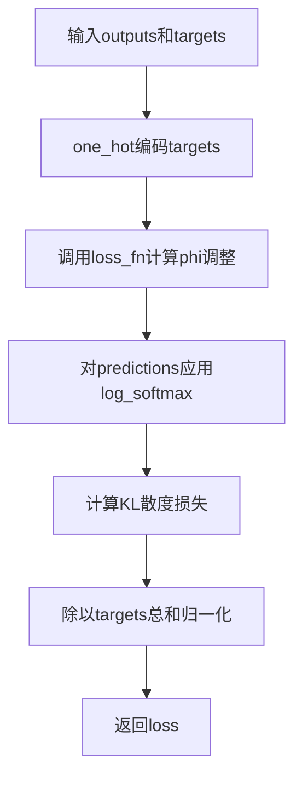

# `Chat-Haruhi-Suzumiya\yuki_builder\audio_feature_ext\modules\loss.py` 详细设计文档

该代码实现了一个用于说话人识别的Additive Angular Margin (AAM)损失函数，通过在余弦相似度上添加角度裕度来增强深度神经网络嵌入的判别性。

## 整体流程

```mermaid
graph TD
    A[开始] --> B[输入: outputs (模型输出), targets (目标标签)]
    B --> C{进入哪个类?}
    C --> D[AdditiveAngularMargin]
    C --> E[AAMLoss]
    D --> D1[计算 cosine = outputs]
    D1 --> D2[计算 sine = sqrt(1 - cosine²)]
    D2 --> D3[计算 phi = cosine * cos_m - sine * sin_m]
    D3 --> D4{easy_margin?}
    D4 -- True --> D5[phi = where(cosine > 0, phi, cosine)]
    D4 -- False --> D6[phi = where(cosine > th, phi, cosine - mm)]
    D5 --> D7[outputs = targets * phi + (1-targets) * cosine]
    D6 --> D7
    D7 --> D8[返回 scale * outputs]
    E --> E1[targets 转为 one-hot 编码]
    E1 --> E2[调用 loss_fn 计算 predictions]
    E2 --> E3[对 predictions 做 log_softmax]
    E3 --> E4[计算 KLDivLoss]
    E4 --> E5[返回 loss / targets.sum()]
```

## 类结构

```
nn.Module (PyTorch基类)
├── AdditiveAngularMargin (AAM Softmax实现)
└── AAMLoss (AAM损失函数)
```

## 全局变量及字段


### `math`
    
Python标准数学库，用于数学运算如cos、sin等

类型：`module`
    


### `torch`
    
PyTorch深度学习框架主模块

类型：`module`
    


### `torch.nn`
    
PyTorch神经网络模块，提供层和容器

类型：`module`
    


### `torch.nn.functional`
    
PyTorch函数式API，提供激活函数等操作

类型：`module`
    


### `AdditiveAngularMargin.margin`
    
角度裕度因子

类型：`float`
    


### `AdditiveAngularMargin.scale`
    
缩放因子

类型：`float`
    


### `AdditiveAngularMargin.easy_margin`
    
简易裕度标志

类型：`bool`
    


### `AdditiveAngularMargin.cos_m`
    
margin的余弦值

类型：`float`
    


### `AdditiveAngularMargin.sin_m`
    
margin的正弦值

类型：`float`
    


### `AdditiveAngularMargin.th`
    
阈值 (cos(π - margin))

类型：`float`
    


### `AdditiveAngularMargin.mm`
    
裕度乘数 (sin(π - margin) * margin)

类型：`float`
    


### `AAMLoss.loss_fn`
    
AAM Softmax实例

类型：`AdditiveAngularMargin`
    


### `AAMLoss.criterion`
    
KL散度损失函数

类型：`torch.nn.KLDivLoss`
    
    

## 全局函数及方法


### `AdditiveAngularMargin.__init__`

该方法是 `AdditiveAngularMargin` 类的构造函数，用于初始化 Additive Angular Margin (AAM) 损失函数的参数。AAM 是用于说话人识别的判别性深度神经网络嵌入的margin损失函数，可以增强类间分离性和类内紧凑性。

参数：

- `margin`：`float`，可选，margin因子，用于控制角度margin的大小，默认值为 0.0
- `scale`：`float`，可选，缩放因子，用于控制输出的缩放比例，默认值为 1.0
- `easy_margin`：`bool`，可选，easy_margin标志，用于控制是否使用简化的margin策略，默认值为 False

返回值：`None`，该方法为构造函数，不返回任何值

#### 流程图

```mermaid
flowchart TD
    A[开始 __init__] --> B[调用 super().__init__ 初始化 nn.Module]
    B --> C[保存 margin 参数]
    C --> D[保存 scale 参数]
    D --> E[保存 easy_margin 参数]
    E --> F[计算 cos_m = cos(margin)]
    F --> G[计算 sin_m = sin(margin)]
    G --> H[计算 th = cos(π - margin)]
    H --> I[计算 mm = sin(π - margin) × margin]
    I --> J[结束 __init__]
    
    style A fill:#e1f5fe
    style J fill:#e1f5fe
    style B fill:#fff3e0
    style C fill:#e8f5e9
    style D fill:#e8f5e9
    style E fill:#e8f5e9
    style F fill:#fce4ec
    style G fill:#fce4ec
    style H fill:#fce4ec
    style I fill:#fce4ec
```

#### 带注释源码

```python
def __init__(self, margin=0.0, scale=1.0, easy_margin=False):
    """The Implementation of Additive Angular Margin (AAM) proposed
    in the following paper: '''Margin Matters: Towards More Discriminative Deep Neural Network Embeddings for Speaker Recognition'''
    (https://arxiv.org/abs/1906.07317)

    Args:
        margin (float, optional): margin factor. Defaults to 0.0.
        scale (float, optional): scale factor. Defaults to 1.0.
        easy_margin (bool, optional): easy_margin flag. Defaults to False.
    """
    # 调用父类 nn.Module 的初始化方法，注册该模块为 PyTorch 模块
    super(AdditiveAngularMargin, self).__init__()
    
    # 保存 margin 参数，用于控制角度margin的大小
    # margin 越大，不同类别之间的角度分离度越大
    self.margin = margin
    
    # 保存 scale 参数，用于缩放输出logits
    # 较大的 scale 可以使 softmax 更加尖锐
    self.scale = scale
    
    # 保存 easy_margin 标志
    # 当设为 True 时，使用简化的 margin 计算方式，避免边缘情况
    self.easy_margin = easy_margin

    # 预计算 cos(margin)，在前向传播时直接使用，避免重复计算
    self.cos_m = math.cos(self.margin)
    
    # 预计算 sin(margin)，在前向传播时直接使用，避免重复计算
    self.sin_m = math.sin(self.margin)
    
    # 计算角度阈值 th = cos(π - margin)
    # 用于在非 easy_margin 模式下确定何时应用 margin
    self.th = math.cos(math.pi - self.margin)
    
    # 计算 mm = sin(π - margin) × margin
    # 用于在非 easy_margin 模式下对边界情况进行补偿
    self.mm = math.sin(math.pi - self.margin) * self.margin
```


### AdditiveAngularMargin.forward

该方法实现了Additive Angular Margin (AAM) 的前向传播，通过对余弦相似度添加角度余量来增强模型在特征空间中的区分度，支持轻松余量模式。

参数：
- `outputs`：`torch.Tensor`，模型输出的 logits，通常为余弦相似度值，形状为 [batch_size, num_classes]
- `targets`：`torch.Tensor`，目标标签，形状与 outputs 相同，通常为 one-hot 编码形式，对应类别位置为1，其余为0

返回值：`torch.Tensor`，经过余量调整和缩放后的输出，形状与 inputs 相同

#### 流程图

```mermaid
graph TD
    A[开始] --> B[cosine = outputs.float]
    B --> C[sine = torch.sqrt(1.0 - torch.pow(cosine, 2))]
    C --> D[phi = cosine * self.cos_m - sine * self.sin_m]
    D --> E{self.easy_margin?}
    E -->|True| F[phi = torch.where(cosine > 0, phi, cosine)]
    E -->|False| G[phi = torch.where(cosine > self.th, phi, cosine - self.mm)]
    F --> H[outputs = (targets * phi) + ((1.0 - targets) * cosine)]
    G --> H
    H --> I[返回 self.scale * outputs]
```

#### 带注释源码

```python
def forward(self, outputs, targets):
    """
    AdditiveAngularMargin 的前向传播方法，计算带角度余量的 logits。

    Args:
        outputs (torch.Tensor): 模型输出的 logits，通常是余弦相似度。
        targets (torch.Tensor): 目标标签，one-hot 编码形式。

    Returns:
        torch.Tensor: 经过余量调整和缩放后的 logits。
    """
    # 将 outputs 转换为 float 类型，确保计算精度
    cosine = outputs.float()
    
    # 计算 sine 值，基于三角恒等式 sin^2(theta) = 1 - cos^2(theta)
    sine = torch.sqrt(1.0 - torch.pow(cosine, 2))
    
    # 计算 phi，基于角度余量公式：cos(theta + m) = cos(theta)cos(m) - sin(theta)sin(m)
    phi = cosine * self.cos_m - sine * self.sin_m
    
    # 根据 easy_margin 标志选择不同的阈值处理方式
    if self.easy_margin:
        # 简单余量模式：当 cosine > 0 时保留 phi，否则保持原始 cosine
        phi = torch.where(cosine > 0, phi, cosine)
    else:
        # 标准余量模式：当 cosine > th 时保留 phi，否则使用 cosine - mm
        # th = cos(pi - margin)，mm = sin(pi - margin) * margin
        phi = torch.where(cosine > self.th, phi, cosine - self.mm)
    
    # 结合 targets 和 phi：对于目标类别使用 phi，对于非目标类别使用原始 cosine
    outputs = (targets * phi) + ((1.0 - targets) * cosine)
    
    # 返回缩放后的结果，增加 logits 的锐度
    return self.scale * outputs
```


### `AAMLoss.__init__`

该方法是 AAMLoss（Additive Angular Margin Loss）损失函数类的构造函数，用于初始化损失函数的margin参数、scale参数、easy_margin标志以及内部的AdditiveAngularMargin损失函数和KLDivLoss损失函数。

参数：

- `margin`：`float`，margin因子，用于控制角度margin的大小，默认为0.2
- `scale`：`int`，缩放因子，用于控制损失值的缩放，默认为30
- `easy_margin`：`bool`，是否使用easy margin模式，默认为False

返回值：`None`，无返回值，仅初始化对象属性

#### 流程图

```mermaid
graph TD
    A[开始初始化AAMLoss] --> B[调用super().__init__初始化nn.Module]
    B --> C[创建AdditiveAngularMargin损失函数实例]
    C --> D[创建KLDivLoss损失函数实例]
    D --> E[结束初始化]
```

#### 带注释源码

```
def __init__(self, margin=0.2, scale=30, easy_margin=False):
    """AAMLoss 损失函数类的初始化方法
    
    Args:
        margin (float): margin因子，控制角度margin的大小，默认为0.2
        scale (int): 缩放因子，控制损失值的缩放，默认为30
        easy_margin (bool): 是否使用easy margin模式，默认为False
    """
    # 调用父类nn.Module的初始化方法，建立PyTorch模块结构
    super(AAMLoss, self).__init__()
    
    # 创建AdditiveAngularMargin损失函数实例，用于计算带有角度margin的logits
    # 该函数实现了Additive Angular Margin (AAM) 损失的核心计算逻辑
    self.loss_fn = AdditiveAngularMargin(margin=margin, scale=scale, easy_margin=easy_margin)
    
    # 创建KLDivLoss损失函数实例，用于计算KL散度损失
    # reduction="sum" 表示对所有样本的损失求和
    self.criterion = torch.nn.KLDivLoss(reduction="sum")
```


### AAMLoss.forward

该方法实现了Additive Angular Margin (AAM) softmax损失函数的前向传播，将模型输出转换为对数概率后与目标标签计算KL散度损失，用于训练具有角度间隔的说话人识别深度神经网络嵌入。

参数：

- `outputs`：`torch.Tensor`，模型输出的logits张量，形状为(batch_size, num_classes)，包含每个类别的原始分数
- `targets`：`torch.Tensor`，目标类别索引张量，形状为(batch_size,)，包含每个样本的真实类别索引

返回值：`torch.Tensor`，标量张量，计算得到的KL散度损失值，已通过目标标签总数归一化

#### 流程图

```mermaid
flowchart TD
    A[开始 forward] --> B[接收 outputs 和 targets]
    B --> C[将 targets 转换为 one-hot 编码]
    C --> D[调用 AdditiveAngularMargin 计算 phi]
    D --> E[计算 sine = sqrt(1 - cosine²]
    E --> F[计算 phi = cosine * cos_m - sine * sin_m]
    F --> G{easy_margin?}
    G -->|True| H[phi = where(cosine > 0, phi, cosine)]
    G -->|False| I[phi = where(cosine > th, phi, cosine - mm)]
    H --> J[outputs = targets * phi + (1-targets) * cosine]
    I --> J
    J --> K[乘以 scale 缩放输出]
    K --> L[对 predictions 应用 log_softmax]
    L --> M[计算 KLDivLoss]
    M --> N[除以 targets.sum 进行归一化]
    N --> O[返回 loss]
```

#### 带注释源码

```python
def forward(self, outputs, targets):
    """
    AAMLoss的前向传播计算过程
    
    参数:
        outputs: 模型输出的logits，形状为(batch_size, num_classes)
        targets: 目标类别索引，形状为(batch_size,)，值为0到num_classes-1的整数
    
    返回:
        loss: 标量张量，归一化后的KL散度损失
    """
    # Step 1: 将整数类型的目标标签转换为one-hot编码
    # outputs.shape[1]获取类别数量，生成形状为(batch_size, num_classes)的one-hot张量
    targets = F.one_hot(targets, outputs.shape[1]).float()
    
    # Step 2: 调用AdditiveAngularMargin模块计算角度间隔后的logits
    # 该模块实现了AAM-Softmax，将角度间隔添加到余弦相似度中
    predictions = self.loss_fn(outputs, targets)
    
    # Step 3: 对预测结果应用log_softmax
    # dim=1表示在类别维度上进行softmax，确保概率和为1
    predictions = F.log_softmax(predictions, dim=1)
    
    # Step 4: 计算KL散度损失
    # reduction="sum"表示对所有样本的损失求和
    loss = self.criterion(predictions, targets)
    
    # Step 5: 归一化损失
    # targets.sum()计算one-hot编码中1的总数（即batch_size）
    # 这种归一化使得损失值与batch大小无关
    return loss / targets.sum()
```

#### 关键组件信息

| 组件名称 | 一句话描述 |
|---------|-----------|
| AdditiveAngularMargin | 实现Additive Angular Margin (AAM) softmax的模块，为余弦相似度添加角度间隔以增强类别区分度 |
| KLDivLoss | PyTorch内置的KL散度损失函数，用于衡量预测分布与目标分布的差异 |
| one_hot | PyTorch函数，将整数标签转换为one-hot编码的二进制张量 |
| log_softmax | 对数 softmax 函数，将logits转换为对数概率分布 |

#### 潜在的技术债务或优化空间

1. **梯度计算效率**：在`AdditiveAngularMargin.forward`中使用`torch.sqrt(1.0 - torch.pow(cosine, 2))`计算sine时，当输入值超出[-1, 1]范围时会产生NaN值，建议添加安全检查或使用`torch.clamp`限制输入范围。

2. **数值稳定性**：计算`phi = cosine * self.cos_m - sine * self.sin_m`时，当角度接近π时可能出现数值不稳定，建议使用三角函数的恒等变换或高精度计算方法。

3. **batch依赖的归一化**：当前使用`targets.sum()`进行归一化，这在训练时是合理的，但在推理时需要特别注意不要对单个样本使用相同的归一化因子。

4. **内存占用**：`F.one_hot`会创建一个完整的one-hot张量，对于类别数较多的场景会占用大量内存，可以考虑使用稀疏矩阵或其他优化方法。

#### 其它项目

**设计目标与约束**：
- 该实现遵循论文"Margin Matters: Towards More Discriminative Deep Neural Network Embeddings for Speaker Recognition"中提出的AAM-Softmax损失函数设计
- 目标是在说话人识别任务中学习具有更大类间间距和更小类内方差的嵌入向量
- 支持easy_margin模式以简化训练过程

**错误处理与异常设计**：
- 未显式检查outputs和targets的形状兼容性，可能在维度不匹配时产生难以追踪的错误
- 假设targets中的值在[0, num_classes-1]范围内，未进行边界验证
- 未处理空batch的情况，可能导致除零错误

**数据流与状态机**：
- 数据流：outputs (logits) → one_hot(targets) → AAM变换 → log_softmax → KL散度 → 归一化 → loss
- 该方法是无状态的前向计算，不涉及内部状态维护
- 梯度流发生在训练阶段的backward调用中

**外部依赖与接口契约**：
- 依赖PyTorch核心库：torch, torch.nn, torch.nn.functional
- 依赖math库进行三角函数预计算
- 接口遵循nn.Module的标准forward约定：接收张量输入，返回张量输出
- 与训练循环的集成方式：直接作为损失函数模块使用，outputs通常来自模型的特征层输出


## 关键组件


### 一段话描述

该代码实现了用于说话人识别（Speaker Recognition）的Additive Angular Margin (AAM)损失函数，通过在余弦相似度上添加角度边际来增强深度神经网络嵌入向量的区分性，使同类样本的嵌入更加紧凑，不同类样本的嵌入更加分离。

### 文件的整体运行流程

1. 初始化阶段：AAMLoss创建AdditiveAngularMargin实例和KLDivLoss损失函数
2. 前向传播阶段：
   - 将整数标签targets转换为one-hot编码
   - 调用AdditiveAngularMargin计算角度边际调整后的预测值
   - 对调整后的预测值应用log_softmax
   - 计算KL散度损失并归一化

### 类的详细信息

#### AdditiveAngularMargin类

**类字段：**
- margin (float): 角度边际参数，控制类间分离程度
- scale (float): 缩放因子，用于调整输出 logits 的尺度
- easy_margin (bool): 是否使用简单边际模式
- cos_m (float): margin的余弦值，预计算用于前向传播
- sin_m (float): margin的正弦值，预计算用于前向传播
- th (float): 阈值，用于非easy_margin模式下的边界判断
- mm (float): 修正项，用于非easy_margin模式下的边界修正

**类方法：**

**__init__**
- 参数：margin (float, optional): 边际因子，默认0.0
- 参数：scale (float, optional): 缩放因子，默认1.0
- 参数：easy_margin (bool, optional): 简单边际标志，默认False
- 返回值：无
- 描述：初始化AAM模块，预计算三角函数值

**forward**
- 参数：outputs (Tensor): 预测的余弦相似度矩阵
- 参数：targets (Tensor): one-hot编码的目标标签
- 返回值：Tensor - 经过角度边际调整后的logits
- 描述：执行角度边际计算，根据easy_margin标志选择不同的边际策略

mermaid流程图:
```mermaid
graph TD
    A[输入cosine和targets] --> B[计算sine = sqrt(1-cosine²)]
    B --> C[计算phi = cosine*cos_m - sine*sin_m]
    C --> D{easy_margin?}
    D -->|True| E[phi = where(cosine>0, phi, cosine)]
    D -->|False| F[phi = where(cosine>th, phi, cosine-mm)]
    E --> G[outputs = targets*phi + (1-targets)*cosine]
    F --> G
    G --> H[return scale * outputs]
```

源码:
```python
def forward(self, outputs, targets):
    cosine = outputs.float()
    sine = torch.sqrt(1.0 - torch.pow(cosine, 2))
    phi = cosine * self.cos_m - sine * self.sin_m
    if self.easy_margin:
        phi = torch.where(cosine > 0, phi, cosine)
    else:
        phi = torch.where(cosine > self.th, phi, cosine - self.mm)
    outputs = (targets * phi) + ((1.0 - targets) * cosine)
    return self.scale * outputs
```

#### AAMLoss类

**类字段：**
- loss_fn (AdditiveAngularMargin): AAM损失函数实例
- criterion (nn.KLDivLoss): KL散度损失函数，用于计算分布差异

**类方法：**

**__init__**
- 参数：margin (float, optional): 角度边际参数，默认0.2
- 参数：scale (float, optional): 缩放因子，默认30
- 参数：easy_margin (bool, optional): 简单边际标志，默认False
- 返回值：无
- 描述：初始化AAM损失函数

**forward**
- 参数：outputs (Tensor): 模型的原始输出logits
- 参数：targets (Tensor): 整数类型的类别标签
- 返回值：Tensor - 标量损失值
- 描述：执行完整的AAM损失计算流程

mermaid流程图:


源码:
```python
def forward(self, outputs, targets):
    targets = F.one_hot(targets, outputs.shape[1]).float()
    predictions = self.loss_fn(outputs, targets)
    predictions = F.log_softmax(predictions, dim=1)
    loss = self.criterion(predictions, targets) / targets.sum()
    return loss
```

### 关键组件信息

#### 角度边际计算 (Additive Angular Margin)

通过在余弦相似度上添加角度边际，使决策边界更加严格，增强模型对不同说话人的区分能力。

#### 预计算三角函数值

在__init__中预先计算cos_m、sin_m、th、mm等三角函数值，避免在前向传播中重复计算，提高推理效率。

#### Easy Margin机制

通过easy_margin标志提供两种边际策略：简单边际（只保护正半轴）和标准边际（更复杂的边界保护），增加模型适应性。

#### KL散度损失

使用Kullback-Leibler散度衡量预测分布与目标分布的差异，适合分类任务的概率分布优化。

### 潜在的技术债务或优化空间

1. **类型注解缺失**：缺少类型提示（type hints），不利于静态分析和IDE支持
2. **硬编码数值**：margin和scale的默认值（0.2和30）缺乏说明，可配置性不足
3. **数值稳定性**：使用torch.sqrt(1.0 - torch.pow(cosine, 2))可能在边界情况下产生数值问题
4. **设备迁移支持**：未考虑.to(device)等设备迁移方法，限制了在GPU/TPU上的部署
5. **梯度检查点**：大规模batch训练时可考虑使用gradient checkpointing节省显存

### 其它项目

**设计目标与约束：**
- 目标：提升说话人识别系统中深度神经网络嵌入向量的区分性
- 约束：保持与标准交叉熵损失相似的计算复杂度

**错误处理与异常设计：**
- 未实现输入验证（如targets值范围检查）
- 未处理NaN/Inf数值异常

**数据流与状态机：**
- 数据流：整数标签 → one-hot编码 → 角度边际调整 → log_softmax → KL散度
- 状态：模型为无状态模块，状态信息存储在margin/scale等参数中

**外部依赖与接口契约：**
- 依赖：torch, torch.nn, torch.nn.functional, math
- 输入约束：outputs应为batch_size × num_classes的logits，targets应为batch_size的整数标签
- 输出约束：返回标量损失值


## 问题及建议


### 已知问题

- **数值稳定性风险**：`AdditiveAngularMargin.forward` 中 `torch.sqrt(1.0 - torch.pow(cosine, 2))` 可能因浮点精度问题导致负值，应添加 `clamp` 操作确保非负。
- **预计算值无法动态更新**：`self.cos_m`、`self.sin_m`、`self.th`、`self.mm` 在 `__init__` 中计算，若训练中动态修改 `self.margin`，这些值不会同步更新。
- **one-hot编码假设未验证**：`AAMLoss.forward` 中直接使用 `outputs.shape[1]` 作为类别数，未对输入维度进行校验，可能在维度不匹配时产生错误。
- **除零风险**：`loss = self.criterion(predictions, targets) / targets.sum()` 中 `targets.sum()` 可能接近0，导致除零错误。
- **梯度传播不一致**：在 `torch.where(cosine > self.th, phi, cosine - self.mm)` 分支处，梯度传播可能不连续，影响训练稳定性。

### 优化建议

- 在 `sine` 计算前添加 `cosine = torch.clamp(cosine, -1.0, 1.0)` 确保输入在合法范围。
- 提供 `@property` 方法动态计算 `cos_m`、`sin_m` 等值，或在 `forward` 中根据当前 `self.margin` 重新计算。
- 添加输入验证逻辑，检查 `targets` 的维度是否与 `outputs.shape[1]` 匹配。
- 使用 `targets.sum().clamp(min=1e-8)` 或 `reduction="mean"` 避免除零问题。
- 考虑使用软边界近似或平滑函数替代 `torch.where` 的硬分支，改善梯度流。
- 添加类型注解和详细的文档字符串，提升代码可维护性。

## 其它


### 设计目标与约束

本代码的设计目标是实现Additive Angular Margin (AAM)损失函数，用于说话人识别任务中的深度神经网络嵌入训练。该实现遵循论文"Margin Matters"的提出的AAM机制，通过在角度空间中引入额外的margin来增强模型对说话人特征的区分能力。设计约束包括：1) 必须与PyTorch框架兼容；2) 需要支持easy_margin模式以简化训练过程；3) 损失值需要通过KL散度计算；4) 必须支持批量处理。

### 错误处理与异常设计

1. **输入维度不匹配**：当`outputs`的第二维与`targets`的最大值+1不匹配时，可能导致one_hot编码越界。当前代码未对此进行显式检查。
2. **数值稳定性**：在计算`sine = torch.sqrt(1.0 - torch.pow(cosine, 2))`时，若`cosine`值超出[-1,1]范围，可能产生NaN值。代码依赖PyTorch的自动微分机制处理此类数值问题。
3. **梯度消失**：当`easy_margin=False`且margin较大时，`phi = torch.where(cosine > self.th, phi, cosine - self.mm)`可能导致梯度较小。
4. **空批次处理**：当批次大小为0时，`targets.sum()`将为0，导致除零错误。

### 数据流与状态机

```
输入数据流：
┌─────────────┐     ┌──────────────────┐     ┌─────────────────┐
│ outputs     │────▶│ AdditiveAngular  │────▶│ 角度Margin计算  │
│ (batch, C)  │     │ Margin.forward() │     │  phi计算        │
└─────────────┘     └──────────────────┘     └────────┬────────┘
                                                      │
┌─────────────┐     ┌──────────────────┐            ▼
│ targets     │────▶│ F.one_hot()       │     ┌─────────────────┐
│ (batch,)    │     │ (batch, C)        │────▶│ 加权融合         │
└─────────────┘     └──────────────────┘     │ targets*phi +   │
                                            │ (1-targets)*cos  │
                                            └────────┬────────┘
                                                     │
                    ┌──────────────────┐            ▼
                    │ F.log_softmax()  │◀────────────────────┐
                    └────────┬─────────┘                    │
                             │                              │
                    ┌────────▼─────────┐                    │
                    │ KLDivLoss()     │────────────────────┘
                    │ / targets.sum() │
                    └─────────────────┘

状态转换：
1. 初始状态：接收logits输出和类别标签
2. One-hot编码状态：将类别标签转换为one-hot向量
3. Margin应用状态：计算带角度margin的预测值
4. LogSoftmax状态：计算对数Softmax
5. 损失计算状态：计算KL散度并归一化
```

### 外部依赖与接口契约

1. **PyTorch框架**：依赖torch>=1.0版本
2. **torch.nn模块**：AdditiveAngularMargin和AAMLoss需继承nn.Module
3. **torch.nn.functional模块**：使用F.one_hot和F.log_softmax
4. **math模块**：用于计算三角函数常量(cos_m, sin_m, th, mm)
5. **接口契约**：
   - `AdditiveAngularMargin.forward(outputs, targets)`：outputs需为(batch, num_classes)的logits，targets需为(batch,)的类别索引
   - `AAMLoss.forward(outputs, targets)`：输入要求同上，返回标量损失值
   - 所有输入张量需在同一设备上(CPU/GPU)

### 版本兼容性说明

该代码设计为兼容PyTorch 1.x版本。在PyTorch 2.0+中，可考虑使用`torch.compile`加速。在XPU(Intel GPU)或MPS(Apple Silicon)上应能正常工作，但未进行专门优化。


    