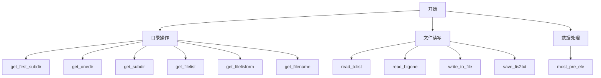
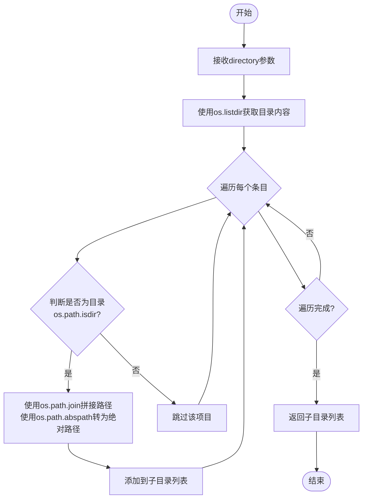
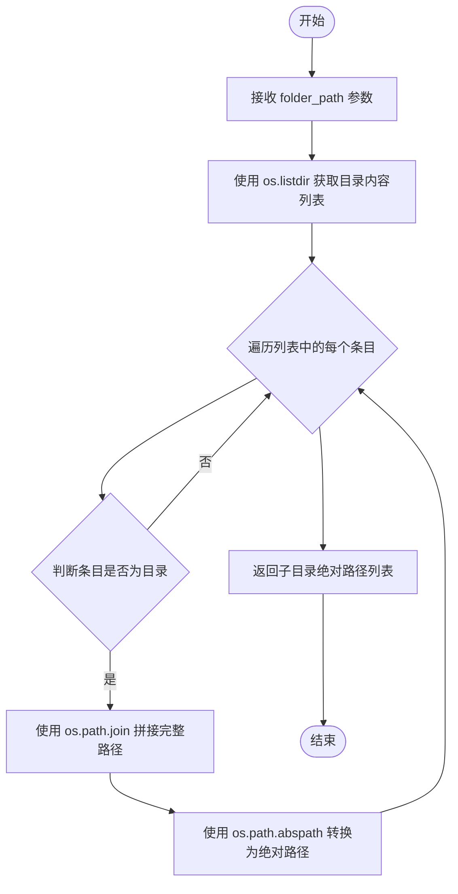
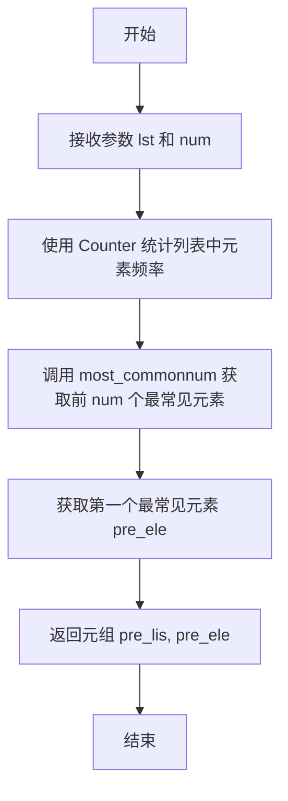
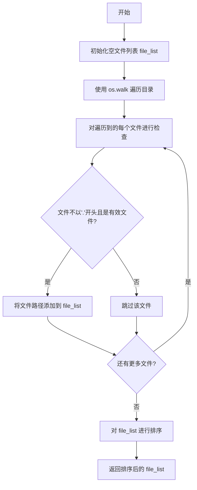
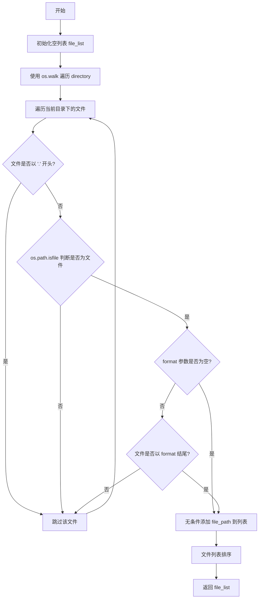
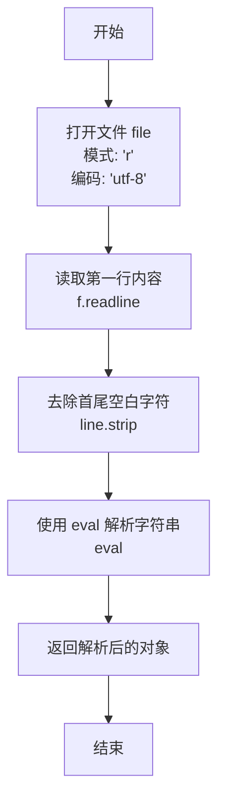
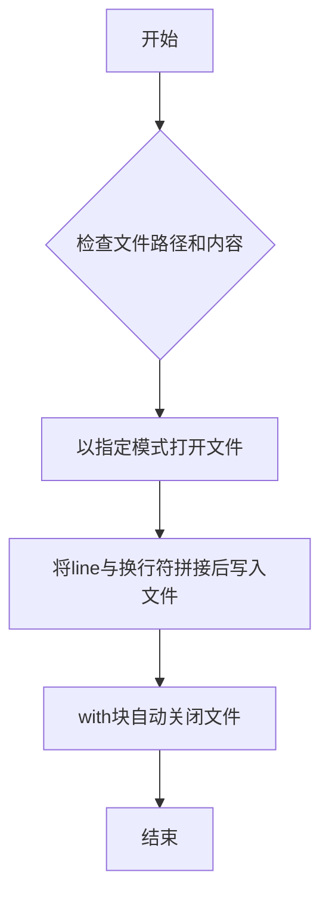
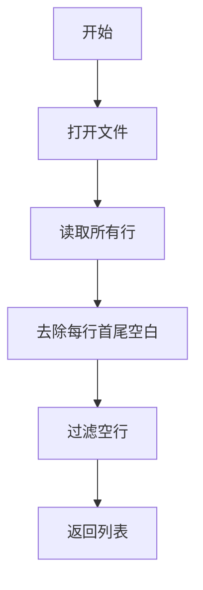
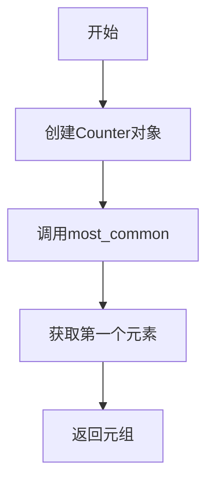

# `Chat-Haruhi-Suzumiya\yuki_builder\audio_feature_ext\tool.py` 详细设计文档

这是一个文件管理和数据处理的工具模块，提供了目录遍历、文件读写、列表操作等常用工具函数，用于简化文件和数据的处理流程。

## 整体流程



## 类结构

```
无类层次结构（纯函数模块）
```

## 全局变量及字段


### `file`
    
要读取或写入的文件路径

类型：`str`
    


### `encoding`
    
文本文件的编码格式，默认为utf-8

类型：`str`
    


### `directory`
    
要操作的目录路径

类型：`str`
    


### `folder_path`
    
文件夹路径，用于获取子目录

类型：`str`
    


### `name`
    
目录或文件名

类型：`str`
    


### `lst`
    
要统计元素的列表

类型：`list`
    


### `num`
    
返回最常见元素的个数，默认为1

类型：`int`
    


### `format`
    
文件格式后缀，如'.txt'

类型：`str`
    


### `line`
    
要写入文件的文本行

类型：`str`
    


### `mode`
    
文件打开模式，默认为'w'（写入）

类型：`str`
    


### `lines`
    
要写入文件的多行文本列表

类型：`list`
    


### `root`
    
os.walk遍历时的当前根目录

类型：`str`
    


### `dirs`
    
os.walk遍历时的子目录列表

类型：`list`
    


### `files`
    
os.walk遍历时的文件列表

类型：`list`
    


### `file_path`
    
完整的文件路径

类型：`str`
    


### `subdirectories`
    
子目录路径列表

类型：`list`
    


### `file_list`
    
文件路径列表

类型：`list`
    


### `counter`
    
collections.Counter对象，用于统计元素出现次数

类型：`Counter`
    


### `pre_lis`
    
最常见元素及其计数的列表

类型：`list`
    


### `pre_ele`
    
出现最频繁的元素

类型：`任意类型`
    


    

## 全局函数及方法


### `read_tolist`

描述：读取指定文本文件，去除每行首尾空白并过滤空行，返回非空行列表。

参数：

- `file`：`str`，待读取的文件路径（可以是相对或绝对路径）。
- `encoding`：`str`，文件编码，默认为 `'utf-8'`。

返回值：`list[str]`，返回文件中所有非空且已去除首尾空白的行组成的列表。

#### 流程图


#### 带注释源码

```python
def read_tolist(file, encoding='utf-8'):
    """
    读取文本文件并返回去除空行后的行列表。

    参数:
        file (str): 要读取的文件路径。
        encoding (str, optional): 文件编码，默认为 utf-8。

    返回:
        list[str]: 文件中非空且已去除首尾空白的行列表。
    """
    # 使用 with 语句确保文件在读取完毕后自动关闭
    with open(file, 'r', encoding=encoding) as f:
        # 读取文件所有行（包括换行符）
        lines = f.readlines()
        # 对每一行去除首尾空白，并过滤掉去除后为空的行
        lines = [item.strip() for item in lines if item.strip()]
    # 返回处理后的非空行列表
    return lines
```


### `get_first_subdir`

获取指定目录下的所有一级子目录（直接子目录），并返回它们的绝对路径列表。该函数通过遍历目标目录的内容，筛选出其中的子目录项，然后将其转换为绝对路径形式返回。

参数：

- `directory`：`str`，要查询的一级子目录所在的父目录路径

返回值：`List[str]`，返回一级子目录的绝对路径列表，如果目录不存在或没有子目录则返回空列表

#### 流程图



#### 带注释源码

```python
def get_first_subdir(directory):
    """
    获取指定目录下的所有一级子目录（直接子目录），返回绝对路径列表
    
    参数:
        directory: 目标目录路径
    
    返回:
        包含所有一级子目录绝对路径的列表
    """
    # 使用列表推导式遍历目录下的所有条目
    # os.listdir(directory) 返回目录中所有文件和目录的名称（不含路径）
    # os.path.isdir() 判断每个条目是否为目录
    # os.path.join() 将父目录与子目录名拼接成完整路径
    # os.path.abspath() 将相对路径转换为绝对路径
    subdirectories = [
        os.path.abspath(os.path.join(directory, name)) 
        for name in os.listdir(directory) 
        if os.path.isdir(os.path.join(directory, name))
    ]
    return subdirectories
```


### `get_onedir`

获取指定目录下的所有一级子目录名称，并按字母顺序排序后返回。

参数：

- `directory`：`str`，需要获取一级子目录的父目录路径

返回值：`list`，排序后的一级子目录名称列表

#### 流程图

```mermaid
flowchart TD
    A[开始] --> B[接收directory参数]
    B --> C[调用os.walk获取目录迭代器]
    C --> D[使用next获取第一层元组]
    D --> E[提取元组中的子目录列表[1]]
    E --> F[对子目录列表进行sort排序]
    F --> G[返回排序后的子目录列表]
    G --> H[结束]
```

#### 带注释源码

```python
def get_onedir(directory):
    """
    获取指定目录下的所有一级子目录名称
    
    参数:
        directory: 目录路径
        
    返回:
        排序后的一级子目录名称列表
    """
    # 使用os.walk遍历目录，next获取第一层（顶层）的结果
    # os.walk返回生成器，每项为(root, dirs, files)的元组
    # [1]表示获取dirs列表，即当前目录下的所有子目录名
    subdirectories = next(os.walk(directory))[1]
    
    # 对子目录名称列表进行字母排序
    subdirectories.sort()
    
    # 返回排序后的子目录列表
    return subdirectories
```


### `get_subdir`

该函数用于获取指定目录下的所有一级子目录，并返回这些子目录的绝对路径列表。

参数：

- `folder_path`：`str`，需要查询的目录路径

返回值：`list[str]`，返回该目录下所有一级子目录的绝对路径列表

#### 流程图



#### 带注释源码

```python
def get_subdir(folder_path):
    """
    获取指定目录下的所有一级子目录
    
    参数:
        folder_path: 需要查询的目录路径
        
    返回值:
        list: 包含所有一级子目录绝对路径的列表
    """
    # 使用列表推导式遍历目录下的所有条目
    # os.listdir(folder_path): 获取指定目录下的所有文件和目录名称
    # os.path.isdir(os.path.join(folder_path, name)): 判断当前条目是否为目录
    # os.path.join(folder_path, name): 拼接完整路径
    # os.path.abspath(...): 将相对路径转换为绝对路径
    subdirectories = [
        os.path.abspath(os.path.join(folder_path, name)) 
        for name in os.listdir(folder_path) 
        if os.path.isdir(os.path.join(folder_path, name))
    ]
    
    # 返回子目录的绝对路径列表
    return subdirectories
```


### `most_pre_ele`

该函数接收一个列表和一个数字，使用 Python 的 Counter 统计列表中各元素的出现频率，返回出现频率最高的元素及其计数信息。

参数：

- `lst`：`list`，输入的列表，用于统计元素出现频率
- `num`：`int`，返回前几个最常见的元素，默认为 1

返回值：`tuple`，返回一个元组，包含两个元素：
- 第一个元素：列表，表示前 num 个最常见的元素及其出现次数的列表
- 第二个元素：列表中的第一个元素，即出现频率最高的元素

#### 流程图



#### 带注释源码

```python
def most_pre_ele(lst, num=1):
    """
    统计列表中出现频率最高的元素
    
    参数:
        lst: 输入的列表，用于统计元素出现频率
        num: 返回前几个最常见的元素，默认为 1
    
    返回:
        tuple: (前num个最常见元素及其计数的列表, 出现频率最高的元素)
    """
    # 使用 collections.Counter 统计列表中各元素的出现次数
    counter = Counter(lst)
    
    # 获取出现频率最高的 num 个元素及其计数，格式为 [(元素, 次数), ...]
    pre_lis = counter.most_common(num)
    
    # 获取出现频率最高的第一个元素
    pre_ele = counter.most_common(num)[0][0]
    
    # 返回元组：(所有结果列表, 最高频元素)
    return pre_lis, pre_ele
```


### `get_filelist`

该函数用于递归获取指定目录下的所有文件路径（排除隐藏文件），并返回排序后的文件路径列表。

参数：

- `directory`：`str`，要遍历的目录路径

返回值：`list[str]`，返回排序后的文件路径列表

#### 流程图



#### 带注释源码

```
def get_filelist(directory):
    """
    递归获取指定目录下的所有文件路径列表（排除隐藏文件）
    
    参数:
        directory: str, 要遍历的目录路径
        
    返回:
        list: 排序后的文件路径列表
    """
    # 初始化一个空列表用于存储文件路径
    file_list = []
    
    # 使用 os.walk 递归遍历目录
    # root: 当前遍历到的目录路径
    # dirs: 当前目录下的子目录列表
    # files: 当前目录下的文件列表
    for root, dirs, files in os.walk(directory):
        
        # 遍历当前目录下的所有文件
        for file in files:
            # 拼接完整的文件路径
            file_path = os.path.join(root, file)
            
            # 检查文件不以'.'开头（排除隐藏文件）
            # 且路径是有效的文件（排除目录等）
            if not file.startswith('.') and os.path.isfile(file_path):
                # 将符合条件的文件路径添加到列表
                file_list.append(file_path)
    
    # 对文件路径列表进行排序
    file_list.sort()
    
    # 返回排序后的文件路径列表
    return file_list
```


### `get_filelisform`

该函数用于递归遍历指定目录，获取所有符合条件（非隐藏文件）的文件路径列表，并可选地按文件格式（后缀名）进行过滤，返回排序后的文件路径列表。

参数：

- `directory`：`str`，目标目录路径，表示需要遍历的根目录
- `format`：`str | None`，可选的文件格式过滤条件，默认为 None，表示不限制格式

返回值：`list[str]`，符合条件的文件绝对路径列表，按字母顺序排序

#### 流程图



#### 带注释源码

```python
def get_filelisform(directory, format=None):
    """
    获取指定目录下所有符合条件（可按格式过滤）的文件路径列表
    
    参数:
        directory: str, 目标目录路径
        format: str or None, 可选的文件格式后缀（如 '.txt', '.py'）
    
    返回:
        list: 排序后的文件绝对路径列表
    """
    # 1. 初始化用于存储文件路径的空列表
    file_list = []
    
    # 2. 使用 os.walk 递归遍历目录树
    #    root: 当前目录路径, dirs: 子目录列表, files: 文件列表
    for root, dirs, files in os.walk(directory):
        
        # 3. 遍历当前目录下的所有文件
        for file in files:
            
            # 4. 拼接完整的文件绝对路径
            file_path = os.path.join(root, file)
            
            # 5. 过滤条件1: 跳过隐藏文件（以 '.' 开头的文件）
            if not file.startswith('.') and os.path.isfile(file_path):
                
                # 6. 过滤条件2: 如果指定了 format，则按格式过滤
                if format:
                    # 检查文件后缀是否匹配目标格式
                    if file.endswith(format):
                        file_list.append(file_path)
                else:
                    # 未指定 format 时，添加所有文件
                    file_list.append(file_path)
    
    # 7. 对结果列表进行字母排序，保证返回顺序一致
    file_list.sort()
    
    # 8. 返回符合条件的文件路径列表
    return file_list
```


### `read_bigone`

该函数用于从文本文件中读取第一行内容，并使用 eval() 将其转换为 Python 对象（通常为字典）返回。

参数：

-  `file`：`str`，要读取的文件路径

返回值：`object`，从文件第一行解析出来的 Python 对象（通常为字典）

#### 流程图



#### 带注释源码

```python
# 把一个字典当作文本文件读取（注意：原注释有误，写的是"写入"但实际是读取）
def read_bigone(file):
    # 以只读模式打开文件，指定 UTF-8 编码
    with open(file, 'r', encoding='utf-8') as f:
        # 读取文件的第一行
        line = f.readline()
        # 去除首尾空白字符，并将字符串内容作为 Python 表达式进行求值
        # 注意：eval() 存在安全风险，如果文件内容来自不可信来源则不应使用
        line = eval(line.strip())

    # 返回解析后的对象（通常为字典）
    return line
```


### `get_filename`

该函数用于遍历指定目录及其所有子目录，获取符合条件（可选按文件格式过滤）的文件列表，返回包含文件名和完整路径的二维列表，并按文件名排序。

参数：
- `directory`：`str`，要遍历的目录路径
- `format`：`str` 或 `None`，可选参数，用于过滤文件格式（如 ".txt"），仅返回以该后缀结尾的文件

返回值：`list`，返回由 `[filename, filepath]` 组成的二维列表，按文件名升序排序

#### 流程图

```mermaid
flowchart TD
    A[开始 get_filename] --> B[初始化空列表 file_list]
    B --> C[使用 os.walk 遍历目录]
    C --> D{遍历每个文件}
    D --> E{文件不以 '.' 开头且是文件}
    E -->|否| D
    E -->|是| F{format 参数是否提供}
    F -->|是| G{文件以 format 结尾}
    G -->|是| H[添加 [file, file_path] 到列表]
    G -->|否| D
    F -->|否| H
    H --> I[文件列表排序]
    I --> J[返回 file_list]
    J --> K[结束]
```

#### 带注释源码

```python
def get_filename(directory, format=None):
    """
    获取指定目录下的文件列表
    
    参数:
        directory: str, 要遍历的目录路径
        format: str or None, 可选的文件格式过滤（如 '.txt'）
    
    返回:
        list: [[filename, filepath], ...] 格式的二维列表
    """
    # 初始化空列表用于存储文件信息
    file_list = []
    
    # 使用 os.walk 递归遍历目录树
    for root, dirs, files in os.walk(directory):
        # 遍历当前目录下的所有文件
        for file in files:
            # 拼接完整的文件路径
            file_path = os.path.join(root, file)
            
            # 过滤条件：文件名不以 '.' 开头（隐藏文件）且是真实文件
            if not file.startswith('.') and os.path.isfile(file_path):
                # 如果指定了文件格式过滤
                if format:
                    # 检查文件是否以指定格式结尾
                    if file.endswith(format):
                        # 将 [文件名, 完整路径] 添加到列表
                        file_list.append([file, file_path])
                else:
                    # 未指定格式时，添加所有文件
                    file_list.append([file, file_path])
    
    # 按文件名升序排序
    file_list.sort()
    
    # 返回排序后的文件列表
    return file_list
```


### `write_to_file`

将一行文本内容写入到指定的文件中，支持不同的写入模式。

参数：

- `file`：`str`，要写入的目标文件路径
- `line`：`str`，要写入的文本内容
- `mode`：`str`，文件打开模式，默认为 `'w'`（写入模式）

返回值：`None`，无返回值（该函数执行写入操作后直接结束）

#### 流程图



#### 带注释源码

```python
def write_to_file(file, line, mode='w'):
    """
    将一行文本写入到指定的文件中
    
    参数:
        file: str, 要写入的目标文件路径
        line: str, 要写入的文本内容
        mode: str, 文件打开模式, 默认为'w'（写入模式）
    
    返回:
        None: 无返回值，执行写入操作后直接结束
    """
    # 使用 with 语句打开文件，确保文件正确关闭
    # mode 参数支持: 'w'（写入）, 'a'（追加）等模式
    with open(file, mode=mode, encoding='utf-8') as f:
        # 写入内容并在末尾添加换行符
        f.write(line + '\n')
```


### `save_lis2txt`

将列表中的所有元素逐行写入到指定的文本文件中，每个元素转换为字符串后添加换行符。

参数：

-  `file`：`str`，要写入的目标文件路径
-  `lines`：`list`，要写入的列表数据

返回值：`None`，该函数直接操作文件，不返回任何值

#### 流程图


#### 带注释源码

```python
# 把一个列表写入到文本文件
def save_lis2txt(file, lines):
    # 使用 with 语句打开文件，确保文件正确关闭
    # 写入模式 'w'，编码为 'utf-8'
    with open(file, 'w', encoding='utf-8') as f:
        # 遍历列表中的每一个元素
        for line in lines:
            # 将元素转换为字符串并添加换行符后写入文件
            f.write(str(line) + '\n')
```


## 关键组件


### 概述

该代码是一个Python工具模块，提供文件和目录操作的常用功能，包括文本文件读取与写入、目录遍历与子目录获取、文件列表筛选、简单频次统计等工具函数，封装了OS文件操作接口以简化文件处理流程。

### 文件运行流程

该模块为工具函数集合，不包含主执行流程，无自动运行逻辑。导入后可直接调用各函数：
1. 调用`read_tolist`或`read_bigone`读取文件内容
2. 调用`get_first_subdir`/`get_onedir`/`get_subdir`获取目录结构
3. 调用`get_filelist`/`get_filelisform`/`get_filename`获取文件列表
4. 调用`most_pre_ele`进行频次统计
5. 调用`write_to_file`/`save_lis2txt`写入文件

### 全局函数详情

#### read_tolist

| 参数名称 | 参数类型 | 参数描述 |
|---------|---------|---------|
| file | str | 要读取的文件路径 |
| encoding | str | 文件编码格式，默认为'utf-8' |

| 返回值类型 | 返回值描述 |
|-----------|-----------|
| list | 去除空行和首尾空白后的行列表 |

**带注释源码：**
```python
def read_tolist(file,encoding='utf-8'):
    # 使用with语句打开文件，确保资源正确释放
    with open(file,'r',encoding=encoding) as f:
        # 读取所有行
        lines = f.readlines()
        # 列表推导式：去除每行首尾空白并过滤空行
        lines = [item.strip() for item in lines if item.strip()]
    return lines
```

#### get_first_subdir

| 参数名称 | 参数类型 | 参数描述 |
|---------|---------|---------|
| directory | str | 目标目录路径 |

| 返回值类型 | 返回值描述 |
|-----------|-----------|
| list | 一级子目录的绝对路径列表 |

**带注释源码：**
```python
def get_first_subdir(directory):
    # 列表推导式：获取一级子目录的绝对路径
    subdirectories = [os.path.abspath(os.path.join(directory, name)) for name in os.listdir(directory) if
                      os.path.isdir(os.path.join(directory, name))]
    return subdirectories
```

#### get_onedir

| 参数名称 | 参数类型 | 参数描述 |
|---------|---------|---------|
| directory | str | 目标目录路径 |

| 返回值类型 | 返回值描述 |
|-----------|-----------|
| list | 一级子目录名称列表（相对路径，已排序） |

**带注释源码：**
```python
def get_onedir(directory):
    # 使用os.walk获取一级子目录名称
    subdirectories = next(os.walk(directory))[1]
    # 排序后返回
    subdirectories.sort()
    return subdirectories
```

#### get_subdir

| 参数名称 | 参数类型 | 参数描述 |
|---------|---------|---------|
| folder_path | str | 目标文件夹路径 |

| 返回值类型 | 返回值描述 |
|-----------|-----------|
| list | 所有子目录的绝对路径列表 |

**带注释源码：**
```python
def get_subdir(folder_path):
    subdirectories = [os.path.abspath(os.path.join(folder_path, name)) for name in os.listdir(folder_path) if os.path.isdir(os.path.join(folder_path, name))]
    return subdirectories
```

#### most_pre_ele

| 参数名称 | 参数类型 | 参数描述 |
|---------|---------|---------|
| lst | list | 输入列表 |
| num | int | 返回前N个最常见元素，默认为1 |

| 返回值类型 | 返回值描述 |
|-----------|-----------|
| tuple | (前N个最常见元素及其频次的列表, 频次最高的元素) |

**带注释源码：**
```python
def most_pre_ele(lst,num=1):
    # 使用Counter进行频次统计
    counter = Counter(lst)
    # 获取前N个最常见元素
    pre_lis = counter.most_common(num)
    # 获取频次最高的单个元素
    pre_ele = counter.most_common(num)[0][0]
    return pre_lis,pre_ele
```

#### get_filelist

| 参数名称 | 参数类型 | 参数描述 |
|---------|---------|---------|
| directory | str | 目标目录路径 |

| 返回值类型 | 返回值描述 |
|-----------|-----------|
| list | 所有文件的绝对路径列表（排除隐藏文件，已排序） |

**带注释源码：**
```python
def get_filelist(directory):
    file_list = []
    # 使用os.walk递归遍历目录
    for root, dirs, files in os.walk(directory):
        for file in files:
            file_path = os.path.join(root, file)
            # 过滤隐藏文件（以.开头）和非文件路径
            if not file.startswith('.') and os.path.isfile(file_path):
                file_list.append(file_path)
    # 排序后返回
    file_list.sort()
    return file_list
```

#### get_filelisform

| 参数名称 | 参数类型 | 参数描述 |
|---------|---------|---------|
| directory | str | 目标目录路径 |
| format | str | 文件扩展名过滤条件，如'.txt'，默认为None |

| 返回值类型 | 返回值描述 |
|-----------|-----------|
| list | 符合条件文件的绝对路径列表（排除隐藏文件，已排序） |

**带注释源码：**
```python
def get_filelisform(directory,format=None):
    file_list = []
    for root, dirs, files in os.walk(directory):
        for file in files:
            file_path = os.path.join(root, file)
            if not file.startswith('.') and os.path.isfile(file_path):
                # 如果指定了format，则按扩展名过滤
                if format:
                    if file.endswith(format):
                        file_list.append(file_path)
                else:
                    file_list.append(file_path)
    file_list.sort()
    return file_list
```

#### read_bigone

| 参数名称 | 参数类型 | 参数描述 |
|---------|---------|---------|
| file | str | 要读取的文件路径 |

| 返回值类型 | 返回值描述 |
|-----------|-----------|
| dict/list | 将文件内容作为Python对象（字典或列表）解析后返回 |

**带注释源码：**
```python
def read_bigone(file):
    with open(file,'r',encoding='utf-8') as f:
        # 读取第一行
        line = f.readline()
        # 使用eval将字符串转换为Python对象
        line = eval(line.strip())
    return line
```

#### get_filename

| 参数名称 | 参数类型 | 参数描述 |
|---------|---------|---------|
| directory | str | 目标目录路径 |
| format | str | 文件扩展名过滤条件，默认为None |

| 返回值类型 | 返回值描述 |
|-----------|-----------|
| list | 元素为[文件名, 文件完整路径]的列表（排除隐藏文件，已排序） |

**带注释源码：**
```python
def get_filename(directory,format=None):
    file_list = []
    for root, dirs, files in os.walk(directory):
        for file in files:
            file_path = os.path.join(root, file)
            if not file.startswith('.') and os.path.isfile(file_path):
                if format:
                    if file.endswith(format):
                        file_list.append([file,file_path])
                else:
                    file_list.append([file, file_path])
    file_list.sort()
    return file_list
```

#### write_to_file

| 参数名称 | 参数类型 | 参数描述 |
|---------|---------|---------|
| file | str | 目标文件路径 |
| line | str | 要写入的内容 |
| mode | str | 写入模式，默认为'w'（覆盖写入） |

| 返回值类型 | 返回值描述 |
|-----------|-----------|
| None | 无返回值，写入后自动关闭文件 |

**带注释源码：**
```python
def write_to_file(file,line,mode='w'):
    with open(file,mode=mode,encoding='utf-8') as f:
        # 写入内容并自动换行
        f.write(line+'\n')
```

#### save_lis2txt

| 参数名称 | 参数类型 | 参数描述 |
|---------|---------|---------|
| file | str | 目标文件路径 |
| lines | list | 要写入的列表 |

| 返回值类型 | 返回值描述 |
|-----------|-----------|
| None | 无返回值，写入后自动关闭文件 |

**带注释源码：**
```python
def save_lis2txt(file,lines):
    with open(file,'w',encoding='utf-8') as f:
        for line in lines:
            # 将每个元素转换为字符串后写入
            f.write(str(line)+'\n')
```

### 关键组件信息

| 组件名称 | 一句话描述 |
|---------|-----------|
| 文件读取模块 | 包含read_tolist和read_bigone两个函数，分别用于读取多行文本和解析单行Python对象 |
| 目录遍历模块 | 提供get_first_subdir、get_onedir、get_subdir三个函数获取不同粒度的目录结构 |
| 文件列表模块 | 提供get_filelist、get_filelisform、get_filename三个函数，支持递归遍历和格式过滤 |
| 统计分析模块 | most_pre_ele函数使用Counter实现列表元素频次统计 |
| 文件写入模块 | write_to_file和save_lis2txt函数支持单行和列表形式的文件写入 |

### 潜在技术债务与优化空间

1. **安全性问题**：`read_bigone`函数使用`eval()`存在严重安全风险，建议使用`json.loads()`或`ast.literal_eval()`替代
2. **重复代码**：get_filelist、get_filelisform、get_filename三个函数有大量重复逻辑，可重构为通用函数
3. **异常处理缺失**：所有文件操作均未捕获IOException、FileNotFoundError等异常
4. **类型注解缺失**：建议添加Python类型提示以提高代码可维护性
5. **参数验证不足**：未对directory参数进行有效性校验（如路径是否存在）

### 其它项目

**设计目标与约束：**
- 提供简洁的文件/目录操作封装
- 默认使用UTF-8编码
- 隐藏文件（以.开头）默认排除
- 返回列表默认排序以保证结果一致性

**错误处理与异常设计：**
- 当前未实现异常捕获机制
- 文件不存在或路径权限问题将直接抛出原生异常

**数据流与状态机：**
- 纯函数式设计，无内部状态
- 数据流为：输入路径/列表 → 处理 → 返回结果

**外部依赖与接口契约：**
- 依赖标准库：os、collections.Counter
- 无第三方依赖
- 函数参数简单，接口契约清晰


## 问题及建议


### 已知问题

-   **功能重复严重**：存在多个功能相似的函数，如 `get_first_subdir`、`get_onedir`、`get_subdir` 三个函数获取子目录的功能几乎相同；`get_filelist`、`get_filelisform`、`get_filename` 三个函数获取文件列表的功能存在重叠。
-   **安全风险**：`read_bigone` 函数使用 `eval()` 解析数据，存在代码执行安全漏洞，容易受到恶意输入攻击。
-   **错误处理缺失**：所有文件操作函数均未做异常处理，如文件不存在、权限不足、编码错误等情况会导致程序直接崩溃。
-   **编码硬编码**：多个函数中 `encoding='utf-8'` 硬编码，如需支持其他编码需要逐个修改，缺乏灵活性。
-   **命名不一致**：函数命名风格不统一，如 `get_filelisform`（疑似拼写错误，应为 get_filelist_from）、`read_bigone`、`save_lis2txt` 等命名不规范。
-   **类型提示缺失**：所有函数均无类型注解（type hints），降低了代码的可读性和可维护性。
-   **文档缺失**：没有任何 docstring 文档注释，难以理解函数用途、参数含义和返回值格式。
-   **代码冗余**：`read_tolist` 函数中 `lines = [item.strip() for item in lines if item.strip()]` 遍历列表两次，可以合并优化。
-   **参数设计不合理**：`get_filelisform` 和 `get_filename` 的 `format` 参数默认值为 `None`，但逻辑中使用 `if format:` 判断，当传入空字符串时会被当作无格式处理，逻辑不够清晰。
-   **无面向对象设计**：全部采用散列函数式编程，缺乏类封装，函数间缺乏组织结构，不利于大型项目维护。

### 优化建议

-   **消除重复代码**：合并功能相似的函数，如将获取子目录的函数统一为 `get_subdirectories(level=1)` 的形式；将获取文件列表的函数统一为 `get_files(directory, extension=None)` 的形式。
-   **安全修复**：将 `read_bigone` 中的 `eval()` 替换为 `json.loads()` 或 `ast.literal_eval()`，并添加异常处理。
-   **添加错误处理**：为所有文件操作函数添加 `try-except` 异常捕获，并合理抛出自定义异常或返回错误信息。
-   **配置化管理**：将编码格式等配置提取为常量或配置文件，避免硬编码。
-   **统一命名规范**：修正拼写错误，统一使用 snake_case 命名风格，函数名应清晰表达功能。
-   **添加类型提示**：为所有函数添加参数和返回值的类型注解，提升代码可读性。
-   **添加文档注释**：为每个函数添加 docstring，说明功能、参数、返回值和可能的异常。
-   **代码优化**：合并 `read_tolist` 中的列表推导式，减少不必要的遍历。
-   **重构参数逻辑**：明确 `format` 参数的含义，使用 `if format is not None:` 进行判断，或改为 `extension: str = ""` 形式。
-   **考虑面向对象设计**：将相关函数封装为工具类，如 `FileUtils`，提高代码组织性和可测试性。


## 其它


### 一段话描述

该代码是一个Python工具模块，提供了文件和目录操作的常用功能，包括读取文件内容、获取子目录、列出文件列表、统计列表中出现最频繁的元素、以及文件的读写操作等。

### 文件的整体运行流程

该文件为工具模块，不包含主执行流程。各个函数独立工作，可被其他模块导入调用。典型的调用流程为：
1. 调用get_filelist或get_subdir获取文件或目录列表
2. 对文件进行读取(read_tolist/read_bigone)或写入(write_to_file/save_lis2txt)操作
3. 可选使用most_pre_ele进行数据分析

### 全局函数详细信息

#### read_tolist

- 参数：file (str, 文件路径), encoding (str, 编码格式，默认'utf-8')
- 返回值：list (去除空行后的行列表)
- 描述：读取文本文件并返回非空行组成的列表
- mermaid流程图：

- 源码：
```python
def read_tolist(file,encoding='utf-8'):
    with open(file,'r',encoding=encoding) as f:
        lines = f.readlines()
        lines = [item.strip() for item in lines if item.strip()]
    return lines
```

#### get_first_subdir

- 参数：directory (str, 目录路径)
- 返回值：list (一级子目录的绝对路径列表)
- 描述：获取指定目录下的所有一级子目录，返回绝对路径
- mermaid流程图：

- 源码：
```python
def get_first_subdir(directory):
    subdirectories = [os.path.abspath(os.path.join(directory, name)) for name in os.listdir(directory) if
                      os.path.isdir(os.path.join(directory, name))]
    return subdirectories
```

#### get_onedir

- 参数：directory (str, 目录路径)
- 返回值：list (一级子目录名称列表，已排序)
- 描述：使用os.walk获取一级子目录名称列表并排序返回
- 源码：
```python
def get_onedir(directory):
    subdirectories = next(os.walk(directory))[1]
    subdirectories.sort()
    return subdirectories
```

#### get_subdir

- 参数：folder_path (str, 文件夹路径)
- 返回值：list (子目录的绝对路径列表)
- 描述：获取指定文件夹下的所有子目录（递归），返回绝对路径
- 源码：
```python
def get_subdir(folder_path):
    subdirectories = [os.path.abspath(os.path.join(folder_path, name)) for name in os.listdir(folder_path) if os.path.isdir(os.path.join(folder_path, name))]
    return subdirectories
```

#### most_pre_ele

- 参数：lst (list, 输入列表), num (int, 返回数量，默认1)
- 返回值：tuple (元素计数的列表，最频繁的元素)
- 描述：统计列表中元素出现频率，返回最频繁的元素及其计数
- mermaid流程图：

- 源码：
```python
def most_pre_ele(lst,num=1):
    counter = Counter(lst)
    pre_lis = counter.most_common(num)
    pre_ele = counter.most_common(num)[0][0]
    return pre_lis,pre_ele
```

#### get_filelist

- 参数：directory (str, 目录路径)
- 返回值：list (文件绝对路径列表，已排序)
- 描述：递归获取目录下的所有文件，过滤隐藏文件，返回排序后的列表
- 源码：
```python
def get_filelist(directory):
    file_list = []
    for root, dirs, files in os.walk(directory):
        for file in files:
            file_path = os.path.join(root, file)
            if not file.startswith('.') and os.path.isfile(file_path):
                file_list.append(file_path)
    file_list.sort()
    return file_list
```

#### get_filelisform

- 参数：directory (str, 目录路径), format (str, 文件格式后缀，如'.txt')
- 返回值：list (符合格式要求的文件路径列表，已排序)
- 描述：根据文件后缀筛选文件，若format为None则返回所有文件
- 源码：
```python
def get_filelisform(directory,format=None):
    file_list = []
    for root, dirs, files in os.walk(directory):
        for file in files:
            file_path = os.path.join(root, file)
            if not file.startswith('.') and os.path.isfile(file_path):
                if format:
                    if file.endswith(format):
                        file_list.append(file_path)
                else:
                    file_list.append(file_path)
    file_list.sort()
    return file_list
```

#### read_bigone

- 参数：file (str, 文件路径)
- 返回值：dict (从文件读取的字典对象)
- 描述：读取包含字典的文本文件，将第一行内容转换为字典对象
- 源码：
```python
def read_bigone(file):
    with open(file,'r',encoding='utf-8') as f:
        line = f.readline()
        line = eval(line.strip())
    return line
```

#### get_filename

- 参数：directory (str, 目录路径), format (str, 文件格式后缀)
- 返回值：list (包含文件名和路径的二元组列表，已排序)
- 描述：获取文件列表，每个元素为[文件名, 文件路径]的列表
- 源码：
```python
def get_filename(directory,format=None):
    file_list = []
    for root, dirs, files in os.walk(directory):
        for file in files:
            file_path = os.path.join(root, file)
            if not file.startswith('.') and os.path.isfile(file_path):
                if format:
                    if file.endswith(format):
                        file_list.append([file,file_path])
                else:
                    file_list.append([file, file_path])
    file_list.sort()
    return file_list
```

#### write_to_file

- 参数：file (str, 文件路径), line (str, 写入内容), mode (str, 写入模式，默认'w')
- 返回值：None
- 描述：将单行文本写入文件，支持追加模式
- 源码：
```python
def write_to_file(file,line,mode='w'):
    with open(file,mode=mode,encoding='utf-8') as f:
        f.write(line+'\n')
```

#### save_lis2txt

- 参数：file (str, 文件路径), lines (list, 行列表)
- 返回值：None
- 描述：将列表中的每个元素逐行写入文本文件
- 源码：
```python
def save_lis2txt(file,lines):
    with open(file,'w',encoding='utf-8') as f:
        for line in lines:
            f.write(str(line)+'\n')
```

### 关键组件信息

- **文件读写模块**：read_tolist、read_bigone、write_to_file、save_lis2txt 负责基本的文件IO操作
- **目录遍历模块**：get_first_subdir、get_onedir、get_subdir 提供不同粒度的目录获取功能
- **文件列表模块**：get_filelist、get_filelisform、get_filename 提供多种文件检索方式
- **数据分析模块**：most_pre_ele 提供频次统计功能

### 设计目标与约束

- **设计目标**：提供简洁的文件和目录操作工具函数，支持常见的文件读取、写入、列表获取和基础数据分析需求
- **约束条件**：
  - 仅支持Python 3.x
  - 依赖标准库os、collections
  - 默认编码为UTF-8
  - 不处理特殊字符和二进制文件

### 错误处理与异常设计

- **当前问题**：代码未包含任何异常处理机制
- **建议改进**：
  - 文件操作应捕获FileNotFoundError、PermissionError、OSError等异常
  - 目录操作应处理路径不存在的情况
  - read_bigone中的eval()存在安全风险，应使用ast.literal_eval替代
  - get_filelisform和get_filename的format参数判断逻辑可简化

### 数据流与状态机

- **数据流**：
  - 输入：文件路径、目录路径、字符串、列表
  - 处理：文件读写、字符串处理、列表遍历、排序、统计
  - 输出：文件内容、目录列表、文件列表、统计结果
- **状态机**：无复杂状态机设计，属于 stateless 工具函数集合

### 外部依赖与接口契约

- **外部依赖**：
  - os模块：文件系统操作
  - collections.Counter：频次统计
  - 无第三方依赖
- **接口契约**：
  - 所有路径参数均为字符串类型
  - 编码参数默认'utf-8'
  - format参数为文件后缀字符串（如'.txt'）
  - 返回值类型在函数文档中明确说明

### 性能考量

- **潜在性能问题**：
  - get_filelist、get_filelisform、get_filename存在代码重复，可合并
  - os.walk已自带排序功能，可减少额外sort()调用
  - 文件读取未使用缓冲，对大文件效率较低
- **优化建议**：使用生成器替代列表返回，考虑上下文管理器优化

### 安全性考虑

- **安全风险**：
  - read_bigone使用eval()存在代码注入风险
  - 未验证文件路径合法性
  - 未处理符号链接
- **建议**：使用ast.literal_eval替代eval，添加路径安全检查

### 测试建议

- 单元测试覆盖所有函数
- 边界测试：空目录、不存在的文件、权限受限场景
- 性能测试：大文件处理、大量文件列表场景
- 安全测试：恶意文件路径、特殊字符文件名

### 维护建议

- 代码重复度高，建议重构整合
- 添加类型注解(Type Hints)提高可维护性
- 添加详细的docstring文档
- 考虑使用pathlib替代os.path

### 潜在的技术债务或优化空间

1. **代码重复**：get_filelist、get_filelisform、get_filename三个函数逻辑高度相似，可重构为统一函数
2. **异常处理缺失**：所有文件操作均无异常处理
3. **安全隐患**：read_bigone使用eval存在安全风险
4. **函数命名不一致**：部分使用get_前缀，部分使用动词命名
5. **功能冗余**：get_first_subdir和get_onedir功能部分重叠
6. **缺乏类型注解**：Python 3.5+应添加类型提示
7. **未使用pathlib**：Python 3.4+推荐使用pathlib替代os.path


    