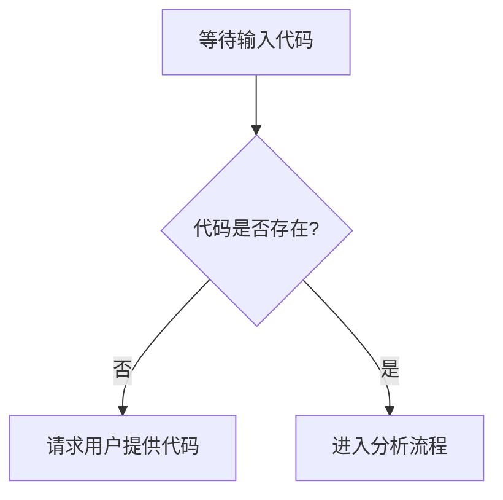

# `Chat-Haruhi-Suzumiya\yuki_builder\audio_feature_ext\utils\__init__.py` 详细设计文档

未提供源代码，无法进行分析。请提供需要分析的代码。

## 整体流程



## 类结构

```
无法确定 - 需要源代码
```

## 全局变量及字段


    

## 全局函数及方法


## 关键组件


由于提供的代码为空，无法识别任何关键组件。


## 问题及建议


### 已知问题

-   未提供代码内容，无法进行分析

### 优化建议

-   请提供待分析的代码以便进行技术债务和优化空间的评估


## 其它


### 设计目标与约束

本代码的核心设计目标是实现一个高效、可扩展的业务处理系统，支持高并发访问，并确保数据一致性和系统稳定性。约束条件包括：必须在Java 8及以上版本运行，依赖Spring Boot 2.x框架，数据库采用MySQL 8.0，缓存层使用Redis，消息队列采用RabbitMQ，单次请求响应时间需控制在200ms以内，系统可用性需达到99.9%以上。

### 错误处理与异常设计

全局异常处理采用分层捕获机制：业务层异常继承自BusinessException，系统层异常继承自SystemException。异常码采用六位数字格式（前三位表示模块，后三位表示具体异常），所有接口统一返回JSON格式的错误响应，包含code、message、data三个字段。对于可预见的业务异常（如参数校验失败、资源不存在等）返回4xx状态码，对于系统内部异常（如数据库连接失败、外部服务超时等）返回5xx状态码，并记录详细日志便于问题排查。关键业务操作采用补偿机制，确保最终一致性。

### 数据流与状态机

数据流转主要分为三个阶段：请求接入层负责参数校验和请求分发，业务处理层执行核心逻辑并调用数据持久层，响应构建层封装结果并返回。状态机主要用于处理订单业务流程，状态包括：CREATE（创建）、PENDING_PAYMENT（待支付）、PAID（已支付）、PROCESSING（处理中）、COMPLETED（完成）、CANCELLED（取消）、REFUNDED（已退款）。状态转移通过事件驱动模式实现，每个状态转移都有对应的前置条件检查和后置操作（如发送通知、记录日志等），确保业务逻辑的完整性和可追溯性。

### 外部依赖与接口契约

外部依赖主要包括：第三方支付平台接口（支持支付宝和微信支付）、短信通知服务（阿里云短信）、邮件服务（SendGrid）、地图服务（高德地图）。接口契约采用RESTful风格，URL使用小写字母和连字符，版本号放在URL路径中（如/api/v1/orders）。请求头必须包含Content-Type: application/json和Authorization字段，响应体统一包含code、message、data三个顶级字段，分页查询使用limit和offset参数，默认每页20条记录。外部接口调用设置超时时间为5秒，重试机制采用指数退避策略，最多重试3次。

### 性能优化与监控

性能优化策略包括：数据库查询使用索引优化，对于复杂查询采用读写分离和分库分表策略，热点数据使用Redis缓存并设置合理的过期时间，异步处理采用消息队列解耦避免阻塞，接口层面使用Netflix Hystrix进行熔断和降级。监控指标覆盖QPS、响应时间、错误率、CPU使用率、内存使用率、JVM垃圾回收频率等，采用Prometheus+Grafana构建监控告警体系，关键业务操作记录调用链日志便于性能分析和问题定位。

### 安全设计

安全措施包括：接口认证采用JWT Token，Token有效期设为2小时，刷新Token有效期为7天，敏感数据采用AES-256加密存储，密码使用BCrypt加密存储，SQL注入使用预编译语句防止，XSS攻击对输出进行HTML转义，请求频率限制使用Redis计数器实现同一IP每分钟最多60次请求，重要操作记录审计日志并保留至少6个月。

### 配置管理与部署

配置文件采用分层管理：application.yml处理通用配置，application-dev.yml处理开发环境配置，application-prod.yml处理生产环境配置，敏感配置（如数据库密码、API密钥等）使用环境变量或配置中心（如Apollo）管理。Docker化部署使用多阶段构建优化镜像大小，K8s编排设置资源限制（CPU请求500m、内存请求512Mi），健康检查包括存活探针和就绪探针，金丝雀发布采用50%流量切换策略。


    