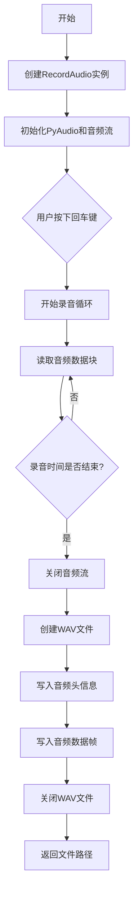
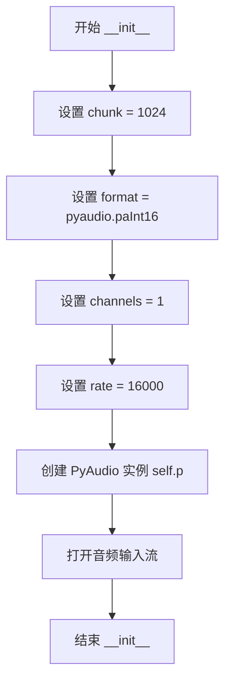

# `Chat-Haruhi-Suzumiya\yuki_builder\audio_feature_ext\utils\record.py` 详细设计文档

这是一个基于PyAudio和Wave库的实时音频录制模块，通过调用系统麦克风采集音频数据，并将其保存为标准WAV格式的音频文件，支持自定义录音时长和保存路径。

## 整体流程



## 类结构

```
RecordAudio (音频录制类)
└── __init__ (构造函数)
└── record (录音方法)
```

## 全局变量及字段


### `RecordAudio.self.chunk`
    
音频缓冲区大小

类型：`int`
    


### `RecordAudio.self.format`
    
音频采样格式(pyaudio.paInt16)

类型：`int`
    


### `RecordAudio.self.channels`
    
音频声道数(单声道)

类型：`int`
    


### `RecordAudio.self.rate`
    
音频采样率(16000Hz)

类型：`int`
    


### `RecordAudio.self.p`
    
PyAudio实例对象

类型：`PyAudio`
    


### `RecordAudio.self.stream`
    
音频输入流对象

类型：`pyaudio.Stream`
    
    

## 全局函数及方法


### `RecordAudio.__init__`

构造函数，初始化录音参数（采样率、声道数、采样格式等）并打开音频输入流，为后续录音操作做好准备。

参数：

- 该方法无显式参数（`self` 为实例本身，不计入）

返回值：`None`，无返回值，仅进行实例属性的初始化和音频流的打开操作

#### 流程图



#### 带注释源码

```python
def __init__(self):
    # 录音参数：每次读取的音频帧大小
    self.chunk = 1024
    # 录音参数：采样格式为16位整数
    self.format = pyaudio.paInt16
    # 录音参数：单声道录音
    self.channels = 1
    # 录音参数：采样率为16000 Hz
    self.rate = 16000

    # 打开录音：创建PyAudio对象
    self.p = pyaudio.PyAudio()
    # 打开音频输入流，准备录制
    self.stream = self.p.open(format=self.format,
                              channels=self.channels,
                              rate=self.rate,
                              input=True,
                              frames_per_buffer=self.chunk)
```


### `RecordAudio.record`

这是一个录音方法，执行实际的音频采集和保存操作。方法接收输出路径和录音时长参数，启动录音后循环读取音频数据并保存为 WAV 格式文件，最后返回保存的文件路径。

参数：

- `output_path`：`str`，录音保存的路径，后缀名为 wav，默认值为 "audio/temp.wav"
- `record_seconds`：`int`，录音时间，默认 3 秒

返回值：`str`，返回录音保存的文件路径

#### 流程图

```mermaid
flowchart TD
    A([开始]) --> B[提示用户按下回车键开始录音]
    B --> C[读取用户输入 input()]
    C --> D{用户按下回车}
    D -->|确认| E[打印 "开始录音......"]
    E --> F[初始化空列表 frames]
    F --> G{循环 i < rate/chunk * record_seconds}
    G -->|是| H[读取音频数据 stream.read]
    H --> I[将数据添加到 frames]
    I --> G
    G -->|否| J[打印 "录音已结束!"]
    J --> K[打开 WAV 文件写入]
    K --> L[设置通道数 setnchannels]
    L --> M[设置采样宽度 setsampwidth]
    M --> N[设置采样率 setframerate]
    N --> O[写入音频帧 writeframes]
    O --> P[关闭 WAV 文件 close]
    P --> Q[返回 output_path]
    Q --> R([结束])
```

#### 带注释源码

```python
def record(self, output_path="audio/temp.wav", record_seconds=3):
    """
    录音
    :param output_path: 录音保存的路径，后缀名为wav
    :param record_seconds: 录音时间，默认3秒
    :return: 录音的文件路径
    """
    # 提示用户按下回车键开始录音，阻塞等待用户输入
    i = input("按下回车键开机录音，录音3秒中：")
    # 提示用户录音已开始
    print("开始录音......")
    # 用于存储录音数据的列表
    frames = []
    # 计算需要读取的音频块数量：采样率 * 录音秒数 / 每个块的样本数
    for i in range(0, int(self.rate / self.chunk * record_seconds)):
        # 从音频流中读取一个块的数据
        data = self.stream.read(self.chunk)
        # 将读取的音频数据添加到列表中
        frames.append(data)

    # 录音完成，提示用户
    print("录音已结束!")
    # 以二进制写入模式打开 WAV 文件
    wf = wave.open(output_path, 'wb')
    # 设置声道数（单声道）
    wf.setnchannels(self.channels)
    # 设置采样宽度（16位）
    wf.setsampwidth(self.p.get_sample_size(self.format))
    # 设置采样率
    wf.setframerate(self.rate)
    # 将所有音频帧数据写入文件
    wf.writeframes(b''.join(frames))
    # 关闭 WAV 文件
    wf.close()
    # 返回录音保存的文件路径
    return output_path
```

## 关键组件


### 音频录制核心类 (RecordAudio)

封装PyAudio和wave库的录音功能，提供初始化音频流和录制音频到WAV文件的完整能力。

### 录音参数配置

定义音频采集的关键参数，包括chunk大小、采样格式、声道数和采样率，用于控制音频录制的质量和性能。

### PyAudio流对象

使用pyaudio.PyAudio()创建的音频流对象，负责与音频设备的底层交互，支持实时音频数据采集。

### 录音方法 (record)

实现录音逻辑的核心方法，通过循环读取音频数据块并写入WAV文件，支持自定义录音时长和输出路径。

### 音频数据块处理

使用frames列表收集录音过程中的音频数据块，通过read方法逐块获取音频数据。

### WAV文件写入模块

利用wave模块将采集的音频数据写入WAV格式文件，设置声道数、采样宽度和采样率等文件头信息。


## 问题及建议


### 已知问题

- **资源未正确释放**：pyaudio.PyAudio() 实例和 stream 未在使用完毕后关闭，可能导致资源泄漏
- **缺少异常处理**：文件写入（wave.open）和音频流读取（self.stream.read）均未捕获异常，若发生错误程序会直接崩溃
- **变量名重用**：input() 的返回值变量 `i` 与 for 循环中的循环变量 `i` 重名，导致 input 返回值被覆盖
- **硬编码参数**：录音参数（chunk、format、channels、rate）均为硬编码，缺乏灵活性
- **阻塞式输入**：input() 调用会阻塞程序执行，且不适合非命令行环境（GUI/Web应用）
- **无类型注解**：缺少参数和返回值的类型提示，影响代码可读性和IDE支持
- **不支持上下文管理器**：未实现 `__enter__` 和 `__exit__` 方法，无法使用 `with` 语句
- **录音时长计算可能不准确**：使用固定循环次数估算时间，在高负载系统上可能导致录音时长不足
- **无路径验证**：output_path 未做有效性检查，可能导致写入失败
- **缺少类文档字符串**：RecordAudio 类和 `__init__` 方法均无文档说明

### 优化建议

- 使用 try-finally 确保资源释放，或实现上下文管理器协议
- 添加 try-except 捕获 IOError、OSError 等异常，并给出友好错误提示
- 重命名循环变量为 `j` 或 `frame_index`，避免与 input 变量冲突
- 将录音参数改为构造函数可选参数，支持自定义配置
- 考虑移除 input() 调用，改为参数控制或回调函数实现非阻塞录音
- 添加类型注解，如 `def record(self, output_path: str = "audio/temp.wav", record_seconds: int = 3) -> str:`
- 实现上下文管理器：`def __enter__(self): return self` 和 `def __exit__(self, exc_type, exc_val, exc_tb): self.close()`
- 使用线程或异步方式实现可中断的录音机制
- 在写入文件前检查目录是否存在，必要时创建目录
- 为类添加文档字符串，说明用途和使用方法


## 其它


### 设计目标与约束

本代码的设计目标是实现一个简单易用的音频录制工具，能够录制指定时长的音频并保存为 WAV 格式文件。约束包括：仅支持单声道（Mono）录音、采样率为16000Hz、采样格式为16位整数、每次录音时长通过参数可配置、输出文件格式固定为WAV。

### 错误处理与异常设计

代码中缺少完善的错误处理机制。需要添加的错误处理包括：PyAudio 初始化失败时的异常捕获、音频流打开失败的异常处理、文件写入失败（如目录不存在、磁盘空间不足）的异常捕获、音频数据读取超时或中断的处理。建议添加自定义异常类 AudioRecordException，并在关键操作点添加 try-except 块以提供友好的错误信息和恢复机制。

### 外部依赖与接口契约

本代码依赖两个外部库：wave（Python 标准库）和 pyaudio（第三方库）。pyaudio 依赖 PortAudio 库，在某些系统上需要单独安装。接口契约包括：record() 方法接收 output_path（字符串，WAV文件路径）和 record_seconds（浮点数，录音时长）两个参数，返回录音保存的文件路径（字符串）。调用方需要确保 output_path 指定的目录存在且有写入权限。

### 性能考虑

当前实现使用同步阻塞方式录制音频，在录制过程中无法响应其他事件。性能优化方向包括：使用后台线程进行录音以避免阻塞主线程、考虑使用缓冲区预分配减少内存分配开销、对于长时间录音可以考虑分片写入文件。当前实现适用于短时录音场景（通常<60秒）。

### 安全性考虑

代码未对用户输入进行验证，存在潜在的安全风险。需要考虑的安全性改进：验证 output_path 路径安全性（防止路径遍历攻击）、对 record_seconds 参数设置合理范围限制（建议最大60秒）、在异常情况下确保音频流和PyAudio对象正确关闭以防止资源泄漏。

### 资源管理

当前代码在正常流程下可以正确关闭文件句柄，但在异常情况下可能存在资源泄漏风险。建议使用上下文管理器（with 语句）或 try-finally 块确保资源释放。此外，PyAudio 对象（self.p）在整个对象生命周期内保持打开，建议添加 close() 方法或实现 __del__ 析构方法来显式释放资源。

### 平台兼容性

pyaudio 库在 Windows、macOS 和 Linux 上均可使用，但在不同平台上可能需要安装额外的依赖库（如 PortAudio）。在树莓派等嵌入式平台上可能需要从源码编译 pyaudio。代码中使用的参数（16000Hz采样率、16位采样）在所有平台上均被广泛支持。

### 配置说明

录音参数通过类属性公开可配置：chunk（缓冲区大小，默认1024）、format（采样格式，默认pyaudio.paInt16）、channels（声道数，默认1单声道）、rate（采样率，默认16000Hz）。如需更高音质可调整 rate 为44100Hz或48000Hz，如需立体声可调整 channels 为2。

### 使用示例

```python
# 创建录音对象
recorder = RecordAudio()

# 使用默认参数录音3秒
audio_file = recorder.record()

# 指定录音5秒
audio_file = recorder.record(record_seconds=5)

# 指定输出路径和录音时长
audio_file = recorder.record(output_path="my_recording.wav", record_seconds=10)
```

### 测试策略建议

单元测试应覆盖：各种有效和无效的 output_path、record_seconds 的边界值（0、负数、超大数）、目录不存在的情况。集成测试应验证：录制的 WAV 文件是否可正常播放、音频参数（采样率、声道数、位深）是否正确、音频时长是否符合预期。由于需要实际录音，测试中可能需要使用虚拟音频设备或mock PyAudio。

    