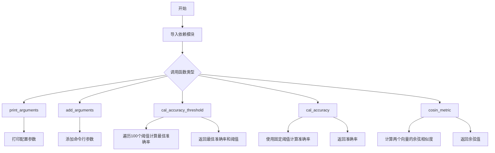
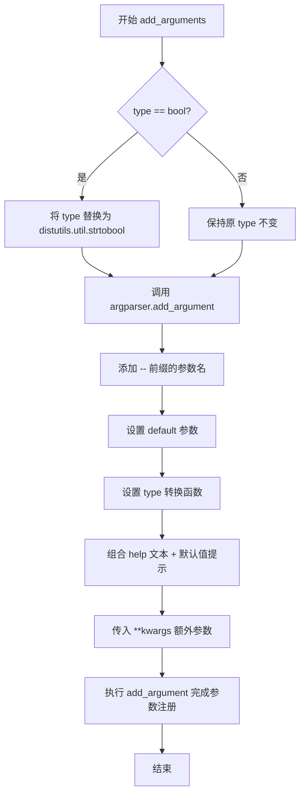
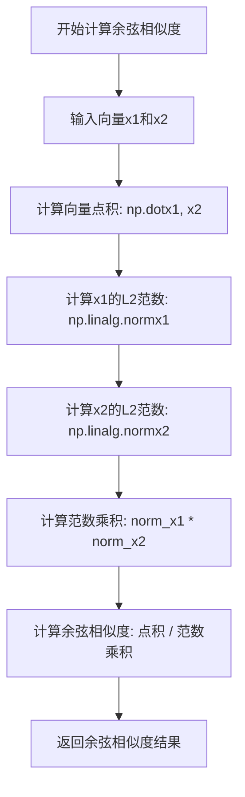

# `Chat-Haruhi-Suzumiya\yuki_builder\audio_feature_ext\utils\utility.py` 详细设计文档

这是一个模型评估工具模块，主要用于计算余弦相似度并根据阈值评估分类模型的准确率，同时提供命令行参数解析的辅助函数

## 整体流程



## 类结构

```

```

## 全局变量及字段


    

## 全局函数及方法


### `print_arguments`

该函数接收一个包含配置参数的命名空间对象，遍历其所有属性并以格式化的方式打印每个参数的名称和值，用于在程序运行时显示当前使用的配置信息。

参数：

- `args`：`object`（通常为 `argparse.Namespace`），包含程序配置参数的命名空间对象，通过 `vars(args)` 获取其所有属性字典

返回值：`None`，该函数仅执行打印操作，不返回任何值

#### 流程图

```mermaid
flowchart TD
    A[开始] --> B[打印分隔线 "Configuration Arguments"]
    B --> C[获取args的所有属性 vars(args).items]
    C --> D[对属性进行排序 sorted]
    D --> E{遍历每个 arg, value}
    E -->|是| F[打印 "arg: value"]
    E -->|否| G[打印结束分隔线]
    G --> H[结束]
```

#### 带注释源码

```
def print_arguments(args):
    """
    打印程序配置参数的函数
    
    参数:
        args: 包含配置参数的命名空间对象（通常是argparse.Namespace）
    
    返回值:
        None, 仅打印输出
    """
    # 打印配置块的开始分隔线
    print("-----------  Configuration Arguments -----------")
    
    # 遍历args对象的所有属性（通过vars转换为字典），并按属性名排序
    for arg, value in sorted(vars(args).items()):
        # 打印每个参数名称和对应的值
        print("%s: %s" % (arg, value))
    
    # 打印配置块的结束分隔线
    print("------------------------------------------------")
```

#### 使用示例

```python
import argparse

# 模拟argparse生成的命名空间对象
args = argparse.Namespace(
    learning_rate=0.001,
    batch_size=32,
    epochs=100,
    model_name="resnet50"
)

# 调用打印函数
print_arguments(args)
```

输出结果：
```
-----------  Configuration Arguments -----------
batch_size: 32
epochs: 100
learning_rate: 0.001
model_name: resnet50
------------------------------------------------
```


### `add_arguments`

该函数是一个命令行参数配置的辅助函数，用于动态向 `argparse.ArgumentParser` 添加参数，并根据参数类型进行特殊处理（布尔类型使用 `distutils.util.strtobool` 转换）。

参数：

- `argname`：`str`，参数名称（不含前缀 `--`）
- `type`：`type`，参数的数据类型（如 `str`、`int`、`bool` 等）
- `default`：任意类型，参数的默认值
- `help`：`str`，参数的帮助说明文本
- `argparser`：`argparse.ArgumentParser`，argparse 参数解析器实例
- `**kwargs`：可变关键字参数，传递给 `argparser.add_argument` 的额外参数

返回值：`None`，无返回值（直接修改 argparser 对象）

#### 流程图



#### 带注释源码

```python
def add_arguments(argname, type, default, help, argparser, **kwargs):
    """
    向 argparse 添加命令行参数的辅助函数
    
    参数:
        argname: 参数名称（不含 -- 前缀）
        type: 参数类型
        default: 默认值
        help: 帮助文本
        argparser: argparse.ArgumentParser 实例
        **kwargs: 额外的关键字参数
    """
    # 如果类型是 bool，使用 distutils.util.strtobool 进行字符串到布尔的转换
    # 因为 argparse 的 type 不直接支持 bool，需要通过 strtobool 转换
    type = distutils.util.strtobool if type == bool else type
    
    # 调用 argparser 的 add_argument 方法注册参数
    # -- + argname: 命令行参数名（如 --batch_size）
    # default: 参数默认值
    # type: 参数类型转换函数
    # help: 参数说明文本，拼接上默认值提示 ' 默认: %(default)s.'
    # **kwargs: 传入额外的参数选项（如 required, choices 等）
    argparser.add_argument("--" + argname,
                           default=default,
                           type=type,
                           help=help + ' 默认: %(default)s.',
                           **kwargs)
```


### `cal_accuracy_threshold`

根据对角余弦值（预测分数）与真实标签，通过遍历0到1范围内的100个阈值点，计算出最高准确率及其对应的最优阈值。

参数：

- `y_score`：`list` 或 `numpy.ndarray`，预测分数数组，用于与阈值比较产生二分类预测
- `y_true`：`list` 或 `numpy.ndarray`，真实标签数组，二分类标签（0或1）

返回值：`tuple`，返回两个浮点数元组

- `best_accuracy`：`float`，遍历过程中找到的最高准确率
- `best_threshold`：`float`，对应最高准确率的阈值

#### 流程图

```mermaid
flowchart TD
    A[开始] --> B[将y_score转为numpy数组]
    B --> C[将y_true转为numpy数组]
    C --> D[初始化best_accuracy=0, best_threshold=0]
    D --> E[循环 i 从 0 到 99]
    E --> F[计算threshold = i * 0.01]
    F --> G[计算y_test = y_score >= threshold]
    G --> H[计算准确率acc = mean(y_test == y_true)]
    H --> I{acc > best_accuracy?}
    I -->|是| J[更新best_accuracy和best_threshold]
    I -->|否| K[继续]
    J --> K
    K --> L{循环结束?}
    L -->|否| E
    L -->|是| M[返回best_accuracy, best_threshold]
```

#### 带注释源码

```python
# 根据对角余弦值计算准确率和最优的阈值
def cal_accuracy_threshold(y_score, y_true):
    # 将输入的预测分数和真实标签转换为numpy数组，便于后续数值计算
    y_score = np.asarray(y_score)
    y_true = np.asarray(y_true)
    
    # 初始化最佳准确率为0，最佳阈值为0
    best_accuracy = 0
    best_threshold = 0
    
    # 遍历0到1范围内的100个阈值点，步长为0.01
    # 使用tqdm显示进度条
    for i in tqdm(range(0, 100)):
        # 计算当前阈值，从0.00到0.99
        threshold = i * 0.01
        
        # 根据阈值将预测分数二值化：大于等于阈值设为1，否则设为0
        y_test = (y_score >= threshold)
        
        # 计算当前阈值下的准确率：预测正确的比例
        # 将布尔比较结果转为int后计算均值
        acc = np.mean((y_test == y_true).astype(int))
        
        # 如果当前准确率高于历史最佳，则更新最佳准确率和对应阈值
        if acc > best_accuracy:
            best_accuracy = acc
            best_threshold = threshold

    # 返回最佳准确率和对应的最优阈值
    return best_accuracy, best_threshold
```


### `cal_accuracy`

根据对角余弦值（预测分数）与真实标签计算分类准确率的函数。该函数通过将预测分数与给定阈值进行比较，将连续分数转换为二分类预测，然后计算与真实标签的匹配比例。

参数：

- `y_score`：`numpy.ndarray` 或 `list`，预测的余弦相似度分数数组
- `y_true`：`numpy.ndarray` 或 `list`，真实的二分类标签数组（0或1）
- `threshold`：`float`，分类阈值，默认为0.5，用于将连续分数转换为二分类结果

返回值：`float`，准确率（0到1之间的浮点数），表示预测正确的样本比例

#### 流程图

```mermaid
flowchart TD
    A[开始 cal_accuracy] --> B[将 y_score 转换为 numpy 数组]
    B --> C[将 y_true 转换为 numpy 数组]
    C --> D[使用阈值对 y_score 进行二分类判断: y_test = y_score >= threshold]
    D --> E[计算预测与真实标签的匹配准确率: accuracy = mean(y_test == y_true)]
    E --> F[返回准确率]
```

#### 带注释源码

```python
# 根据对角余弦值计算准确率
def cal_accuracy(y_score, y_true, threshold=0.5):
    """
    计算分类准确率
    
    参数:
        y_score: 预测的余弦相似度分数
        y_true: 真实的二分类标签
        threshold: 分类阈值，默认为0.5
    
    返回:
        accuracy: 准确率
    """
    # 将输入转换为numpy数组，确保类型一致且支持向量化操作
    y_score = np.asarray(y_score)
    y_true = np.asarray(y_true)
    
    # 使用阈值将连续分数转换为二分类预测
    # 大于等于阈值为正类(1)，小于阈值为负类(0)
    y_test = (y_score >= threshold)
    
    # 计算预测正确的比例
    # 先比较预测与真实标签是否相等，得到布尔数组
    # 转换为整数后计算平均值，即为准确率
    accuracy = np.mean((y_test == y_true).astype(int))
    
    # 返回准确率
    return accuracy
```


### `cosin_metric`

计算两个向量之间的余弦相似度（Cosine Similarity），即计算向量x1和x2夹角的余弦值。该函数通过计算向量点积与向量范数乘积的比值来得到余弦相似度，常用于衡量两个向量在方向上的相似程度。

参数：

- `x1`：`numpy.ndarray`，第一个输入向量
- `x2`：`numpy.ndarray`，第二个输入向量

返回值：`float`，返回两个向量之间的余弦相似度值，范围在[-1, 1]之间

#### 流程图



#### 带注释源码

```python
def cosin_metric(x1, x2):
    """
    计算两个向量之间的余弦相似度
    
    参数:
        x1: 第一个向量，numpy数组类型
        x2: 第二个向量，numpy数组类型
    
    返回值:
        float: 两个向量的余弦相似度，范围为[-1, 1]
               值为1表示完全相同方向
               值为0表示正交（无相关性）
               值为-1表示完全相反方向
    """
    # 计算两个向量的点积（分子）
    # np.dot(x1, x2) = x1·x2 = Σ(x1_i * x2_i)
    dot_product = np.dot(x1, x2)
    
    # 计算两个向量的L2范数（欧几里得范数）
    # ||x|| = sqrt(Σx_i^2)
    norm_x1 = np.linalg.norm(x1)
    norm_x2 = np.linalg.norm(x2)
    
    # 计算余弦相似度：cos(θ) = (A·B) / (||A|| * ||B||)
    # 避免除零错误：当任一向量为零向量时，返回0
    if norm_x1 == 0 or norm_x2 == 0:
        return 0
    
    cosine_similarity = dot_product / (norm_x1 * norm_x2)
    
    return cosine_similarity
```

#### 设计说明

| 项目 | 说明 |
|------|------|
| **设计目标** | 提供高效的向量相似度计算，用于人脸识别、文本相似度比对等场景 |
| **约束条件** | 输入向量需为同维度的numpy数组或类数组对象 |
| **优化建议** | 当前实现未处理零向量情况，建议在调用前确保向量非零或增加零向量判断 |
| **调用场景** | 该函数被用于`cal_accuracy_threshold`和`cal_accuracy`中，基于余弦相似度进行阈值优化和准确率计算 |


## 关键组件


### 命令行参数处理模块

提供命令行参数的打印和添加功能，支持动态类型转换和默认值的配置。

### 准确率计算模块

根据预测分数和真实标签计算分类准确率，支持固定阈值和最优阈值搜索两种模式。

### 余弦相似度计算模块

计算两个向量之间的余弦相似度，用于衡量向量方向的相似性。

### 阈值搜索模块

通过遍历0到1范围内的阈值（步长0.01），寻找使准确率最高的阈值，用于优化分类决策边界。


## 问题及建议


### 已知问题

-   **使用废弃模块**：`distutils.util.strtobool` 已被废弃，Python 3.12 中已移除，应使用 `argparse` 的 `action='store_true'` 或自定义转换函数
-   **除零风险**：`cosin_metric` 函数未处理零向量情况，当 `x1` 或 `x2` 的范数为0时会导致除零错误并返回 `nan`
-   **低效的阈值搜索**：`cal_accuracy_threshold` 使用暴力循环遍历0-1范围（100次），时间复杂度O(n)，可使用优化算法（二分查找或scipy.optimize）替代
-   **缺少类型注解**：所有函数均无类型提示（type hints），降低代码可维护性和IDE支持
-   **缺失文档字符串**：核心业务函数 `cal_accuracy_threshold`、`cal_accuracy`、`cosin_metric` 无文档字符串
-   **类型转换方式过时**：使用 `.astype(int)` 而非更明确的 `.astype(np.int64)` 或 `.astype(np.bool_)`（NumPy 1.20+）
-   **命名不一致**：函数名 `cosin_metric` 应为 `cosine_metric`（拼写错误）
-   **硬编码Magic Number**：阈值范围0-1、步长0.01、循环次数100等均为硬编码，应提取为可配置参数

### 优化建议

-   移除 `distutils` 依赖，改用 `argparse` 原生支持或自定义 bool 类型转换函数
-   为 `cosin_metric` 添加零向量检测：`if norm1 == 0 or norm2 == 0: return 0.0`
-   使用向量化操作或优化算法重构 `cal_accuracy_threshold`，如使用 `scipy.optimize.minimize_scalar` 或二分查找
-   为所有函数添加类型注解和 docstring，提升代码可读性和可维护性
-   统一使用 `.astype(np.bool_)` 进行布尔类型转换，确保跨版本兼容性
-   将阈值搜索范围、步长等参数提取为函数参数或配置文件
-   考虑使用 `@njit` 或 Cython 加速密集计算场景（若性能瓶颈在此）

## 其它


### 设计目标与约束

本代码主要用于人脸识别或验证场景中的相似度度量与阈值优化。核心设计目标包括：(1) 提供准确率计算功能，支持固定阈值和自适应最优阈值两种模式；(2) 提供余弦相似度计算功能，用于衡量两个向量之间的相似程度；(3) 提供命令行参数解析与打印功能，便于配置管理。设计约束方面，计算准确率时采用遍历0-1范围内100个阈值点的暴力搜索方式，阈值的步长固定为0.01。

### 错误处理与异常设计

代码中错误处理相对薄弱，存在以下问题：(1) cosin_metric函数未对输入向量进行范数是否为0的检查，当输入向量的范数为0时会导致除零错误；(2) cal_accuracy和cal_accuracy_threshold函数未对y_score和y_true的长度一致性进行校验；(3) 未对输入数据类型进行校验，非数值类型输入可能导致计算错误；(4) add_arguments函数中type参数未进行有效性验证。建议添加输入验证逻辑，捕获并处理可能的异常情况。

### 外部依赖与接口契约

本代码依赖以下外部库：(1) distutils.util.strtobool：用于将字符串转换为布尔值；(2) numpy：用于数值计算和向量运算；(3) tqdm：用于显示计算进度条。接口契约方面：cal_accuracy_threshold函数接收y_score和y_true两个数组或列表，返回最优准确率best_accuracy（float类型）和最优阈值best_threshold（float类型）；cal_accuracy函数接收y_score、y_true和threshold参数，返回准确率（float类型）；cosin_metric函数接收两个向量x1和x2，返回余弦相似度（float类型）。

### 数据流与状态机

数据流分析：输入数据（y_score预测值、y_true真实标签）经过np.asarray转换为numpy数组，然后进行阈值比较运算（y_score >= threshold），接着与真实标签进行相等比较，最后计算准确率。状态机方面：本代码不涉及复杂的状态机流程，主要是线性数据处理流程，从输入数据到输出结果的单向流动。

### 性能考虑

性能瓶颈主要体现在cal_accuracy_threshold函数中，该函数使用for循环遍历100个阈值点进行准确率计算，对于大规模数据集计算效率较低。余弦相似度计算中涉及向量范数计算，可以考虑缓存范数以减少重复计算。优化建议：可以采用向量化操作替代循环，使用scipy.optimize进行阈值优化而非暴力搜索。

### 安全性考虑

代码本身不涉及用户输入处理或敏感数据操作，安全性风险较低。但需要注意：(1) 命令行参数解析时需防止参数注入；(2) 数值计算结果需考虑浮点数精度问题。

### 兼容性考虑

本代码支持Python 3.x版本（需注意distutils在Python 3.12中已被废弃，建议未来迁移到argparse的action='store_true'方式处理布尔参数）。numpy和tqdm需安装对应版本。建议添加版本检查和明确的依赖说明。

### 测试策略

建议补充以下测试用例：(1) cosin_metric函数测试：正交向量、平行向量、零向量、随机向量的余弦相似度计算；(2) cal_accuracy函数测试：不同阈值下的准确率计算，与sklearn.metrics.accuracy_score对比验证；(3) cal_accuracy_threshold函数测试：验证返回的阈值确实能产生最高准确率；(4) 边界条件测试：空数组、单元素数组、全相同预测值等特殊场景。

    