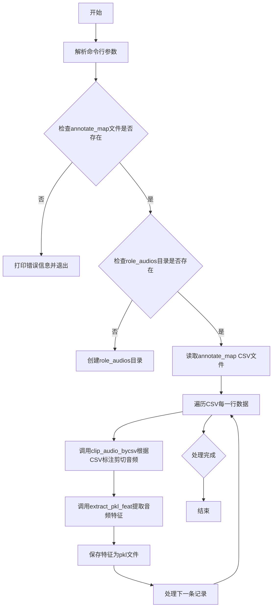

# `Chat-Haruhi-Suzumiya\yuki_builder\crop.py` 详细设计文档

该代码是一个视频音频提取与特征处理工具，通过读取CSV或SRT/ASS字幕文件，根据时间戳使用FFmpeg从视频中提取音频片段，并使用预训练模型提取音频特征并保存为pickle格式。主要用于角色音频分析和语音特征提取任务。

## 整体流程



## 类结构

```
全局函数
├── detect_encoding (文件编码检测)
├── most_common_element (最常见元素查找)
└── make_filename_safe (文件名安全化处理)

video_Segmentation 类
├── __init__ (构造函数)
├── ffmpeg_extract_audio (FFmpeg音频提取)
├── extract_pkl_feat (音频特征提取-目录遍历)
├── extract_new_pkl_feat (音频特征提取-单文件)
├── clip_audio_bycsv (按CSV标注剪切音频)
├── srt_format_timestamp (时间戳格式化)
└── clip_video_bysrt (按SRT/ASS字幕剪切)

主流程函数
└── crop (主处理函数)
```

## 全局变量及字段


### `detect_encoding`
    
检测文件编码格式

类型：`function`
    


### `most_common_element`
    
获取列表中出现最频繁的元素

类型：`function`
    


### `make_filename_safe`
    
将文件名中的非法字符替换为下划线并清理空格

类型：`function`
    


### `crop`
    
主函数，根据标注文件批量提取视频音频并提取特征

类型：`function`
    


### `video_Segmentation.annotate_csv`
    
CSV标注文件路径

类型：`str`
    


### `video_Segmentation.video_pth`
    
视频文件路径

类型：`str`
    


### `video_Segmentation.role_audios`
    
角色音频输出目录

类型：`str`
    


### `video_Segmentation.__init__`
    
初始化方法

类型：`method`
    


### `video_Segmentation.ffmpeg_extract_audio`
    
使用FFmpeg从视频中提取指定时间范围的音频

类型：`method`
    


### `video_Segmentation.extract_pkl_feat`
    
批量提取音频特征并保存为pkl文件

类型：`method`
    


### `video_Segmentation.extract_new_pkl_feat`
    
从指定视频文件夹中提取音频特征并保存为pkl文件

类型：`method`
    


### `video_Segmentation.clip_audio_bycsv`
    
根据CSV标注文件时间戳切割视频音频

类型：`method`
    


### `video_Segmentation.srt_format_timestamp`
    
将秒数转换为SRT格式的时间戳字符串

类型：`method`
    


### `video_Segmentation.clip_video_bysrt`
    
根据SRT或ASS字幕文件时间戳切割视频音频

类型：`method`
    
    

## 全局函数及方法


### detect_encoding

该函数是文件处理模块中的核心工具函数，专注于自动识别未知编码的文本文件。它接收一个文件路径作为输入，以二进制模式读取文件以避免初始解码错误，随后利用 `chardet` 库的统计模型分析字节流特征，最终推断并返回文件所使用的字符编码格式（如 UTF-8、GBK 等）。

参数：
-  `file_name`：`str`，需要检测编码的文件的完整路径。

返回值：`str` 或 `None`，文件内容所采用的字符编码名称。如果 `chardet` 无法识别编码，可能返回 `None` 或 `ascii`。

#### 流程图


#### 带注释源码

```python
def detect_encoding(file_name):
    """
    检测给定文件的字符编码。

    参数:
        file_name (str): 需要检测编码的文件的路径。

    返回:
        str or None: 检测到的编码名称，如果未检测到则返回 None。
    """
    # 以二进制读取模式 ('rb') 打开文件。
    # 这样做是为了读取原始字节流，防止 Python 在读取时尝试使用错误编码进行解码导致报错。
    with open(file_name, 'rb') as file:
        # 读取文件的全部内容
        raw_data = file.read()
        # 使用 chardet 库的 detect 方法分析字节流并预测编码
        # result 是一个字典，格式为 {'encoding': '...', 'confidence': 0.99, ...}
        result = chardet.detect(raw_data)
    
    # 返回检测到的编码字符串
    return result['encoding']
```


### `most_common_element`

该函数接收一个列表和一个整数参数，使用 Python 的 Counter 类统计列表中各元素出现的次数，并返回出现次数最多的前 n 个元素及其计数，常用于分析字幕样式分布或统计数据中频率最高的元素。

参数：

- `lst`：`list`，输入的列表，包含需要统计的元素
- `num`：`int`，返回最常见元素的数量，默认为 1

返回值：`list`，返回包含元组的列表，每个元组为 (元素, 计数)，按出现次数从高到低排序

#### 流程图


#### 带注释源码

```python
def most_common_element(lst, num=1):
    """
    统计列表中最常见的元素
    
    参数:
        lst: 输入的列表
        num: 要返回的最常见元素的数量，默认为1
    
    返回:
        包含(元素, 计数)元组的列表，按出现次数降序排列
    """
    # 使用 collections.Counter 统计列表中每个元素的出现次数
    counter = Counter(lst)
    # 调用 most_common 方法获取出现次数最多的 num 个元素
    most = counter.most_common(num)
    # 返回结果
    return most
```


### `make_filename_safe`

该函数用于将文件名中的非法字符移除，并将多余的空格处理为单个空格，同时去除首尾空格，生成符合文件系统要求的安全文件名。

参数：

- `filename`：`str`，需要处理的文件名字符串

返回值：`str`，处理后的安全文件名

#### 流程图

```mermaid
flowchart TD
    A[开始: 输入filename] --> B{检查输入是否为字符串}
    B -->|是| C[使用正则表达式 r'[\\/:*?"<>|_]' 替换非法字符为空]
    C --> D[使用正则表达式 r'\s+' 替换多余空格为单个空格]
    D --> E[使用 strip 方法去除首尾空格]
    E --> F[返回处理后的filename]
    B -->|否| G[直接返回原filename]
```

#### 带注释源码

```python
def make_filename_safe(filename):
    # 将非法字符替换为下划线
    # 匹配字符：\ / : * ? " < > | _
    # 这些字符在Windows文件系统中是非法的，需要移除
    filename = re.sub(r'[\\/:*?"<>|_]', '', filename)
    
    # 去除多余的空格
    # 将一个或多个连续空格替换为单个空格
    # 例如："Hello   World" -> "Hello World"
    filename = re.sub(r'\s+', ' ', filename)
    
    # 去除开头和结尾的空格
    # 清理字符串前后可能存在的空白字符
    filename = filename.strip()
    
    # 返回处理后的安全文件名
    return filename
```


### crop

该函数是音频特征提取流程的入口函数，接收命令行参数，验证输入文件路径，遍历CSV映射文件中的视频和字幕对，调用视频分割类进行音频切片，并提取音频特征保存为pkl格式。

参数：

- `args`：命名空间对象，包含以下属性：
  - `verbose`：`bool`，是否显示详细输出信息
  - `annotate_map`：`str`，CSV格式的字幕和视频路径映射文件路径
  - `role_audios`：`str`，角色音频输出目录路径

返回值：`None`，该函数无返回值，执行完成后直接结束

#### 流程图


#### 带注释源码

```python
def crop(args):
    """
    音频特征提取的主入口函数
    
    该函数执行以下步骤：
    1. 检查并验证输入参数
    2. 读取CSV映射文件获取视频和字幕路径
    3. 对每个视频-字幕对进行音频切割和特征提取
    """
    
    # 如果verbose为True，打印运行提示信息
    if args.verbose:
        print('runing crop')

    # ========== 参数校验阶段 ==========
    
    # 检查annotate_map是否为有效文件
    if not os.path.isfile(args.annotate_map):
        print(f'annotate_map {args.annotate_map} is not exist')
        return  # 文件不存在则直接返回

    # 检查role_audios是否为有效目录
    if not os.path.isdir(args.role_audios):
        print(f'role_audios {args.role_audios} is not exist')
        # 如果目录不存在，则创建该目录
        os.mkdir(args.role_audios)

    # ========== 初始化阶段 ==========
    
    # 读取CSV映射文件，获取视频路径和字幕路径的对应关系
    # CSV文件应包含两列：annotate_csv（字幕文件路径）和video_pth（视频文件路径）
    data = pd.read_csv(args.annotate_map)
    
    # 创建视频分割工具类实例，用于切割音频和提取特征
    video_pth_segmentor = video_Segmentation()
    
    # 创建音频特征提取器实例，用于将wav音频转换为pkl特征向量
    audio_feature_extractor = AudioFeatureExtraction()

    # ========== 核心处理循环 ==========
    
    # 遍历CSV中的每一行数据，每行包含一个字幕文件和对应的视频文件
    for index, (annotate_csv, video_pth) in data.iterrows():
        """
        循环处理每个视频-字幕对：
        1. 根据字幕文件中的时间戳信息，使用FFmpeg切割视频中的音频片段
        2. 输出为wav格式文件，按角色分类保存到role_audios/voice/{角色名}/目录下
        """
        
        # clip audio segement according to the subtile file timestamp
        # output: *.wav
        # the subtile file has been labeled by role, here is a .csv format file
        # 根据字幕时间戳切割音频片段，输出wav文件
        video_pth_segmentor.clip_audio_bycsv(annotate_csv, video_pth, args.role_audios)

        # audio feature extract wav→pkl
        # 将上一步生成的wav音频文件提取特征，保存为pkl格式
        video_pth_segmentor.extract_pkl_feat(audio_feature_extractor, args.role_audios)
```


### video_Segmentation.__init__

这是 `video_Segmentation` 类的构造函数，用于初始化该类的实例。由于当前实现中仅包含 `pass` 语句，该构造函数暂未执行任何实质性的初始化操作，但作为类的入口方法，为后续扩展提供了基础框架。

参数：

- `self`：`video_Segmentation` 类型，代表类的实例本身

返回值：`None`，无返回值

#### 流程图


#### 带注释源码

```python
def __init__(self):
    """
    video_Segmentation 类的初始化方法（构造函数）
    
    用途：
        初始化 video_Segmentation 类的实例。
        当前实现为占位符（pass），未执行任何实际初始化操作。
        
    参数：
        self: video_Segmentation 类的实例对象
    
    返回值：
        None
    
    注意：
        - 此处可扩展以添加类级别的属性初始化
        - 如需在实例化时接收参数，可在此方法中添加参数定义
    """
    pass  # 空操作，暂未实现任何初始化逻辑
```

---

### 补充说明

#### 潜在的技术债务或优化空间

1. **未初始化的实例属性**：该类的其他方法（如 `clip_audio_bycsv`、`extract_pkl_feat` 等）使用了 `self.annotate_csv`、`self.video_pth`、`self.role_audios` 等实例属性，但这些属性并未在 `__init__` 中声明和初始化。建议在构造函数中预先定义这些属性并赋予合理的默认值（如 `None`），以提高代码的可读性和可维护性。

2. **缺少参数化构造函数**：当前的 `__init__` 方法不支持传入参数。如果需要一次性配置视频路径、输出路径等，可以考虑将常用参数在此处接收，避免在后续方法调用中重复传递。

3. **缺乏错误处理**：构造函数中未包含任何错误处理机制，建议添加必要的异常捕获逻辑，以提高鲁棒性。


### `video_Segmentation.ffmpeg_extract_audio`

该方法是一个用于从视频文件中提取指定时间段音频的函数，通过调用 FFmpeg 命令行工具实现，支持从 `start_time` 到 `end_time` 的时间范围裁剪，并输出为 PCM S16LE 编码的 WAV 格式音频文件。

参数：

- `self`：`video_Segmentation` 类实例本身，表示调用该方法的对象
- `video_input`：`str`，输入视频文件的路径，指定要从中提取音频的视频源
- `audio_output`：`str`，输出音频文件的路径，指定提取后音频的保存位置
- `start_time`：`int` 或 `float`，音频提取的起始时间点，单位为秒
- `end_time`：`int` 或 `float`，音频提取的结束时间点，单位为秒

返回值：`None`，该方法无返回值，通过副作用（生成音频文件）完成功能

#### 流程图

```mermaid
flowchart TD
    A[开始 ffmpeg_extract_audio] --> B[构建 FFmpeg 命令列表]
    B --> C[将 start_time 转换为字符串]
    B --> D[将 end_time 转换为字符串]
    C --> E[组装命令: ffmpeg -ss {start_time} -to {end_time} -i {video_input} -vn -c:a pcm_s16le -y {audio_output} -loglevel quiet]
    E --> F[使用 subprocess.run 执行命令]
    F --> G[结束]
```

#### 带注释源码

```python
def ffmpeg_extract_audio(self, video_input, audio_output, start_time, end_time):
    """
    从视频文件中提取指定时间段的音频

    参数:
        video_input: 输入视频文件路径
        audio_output: 输出音频文件路径
        start_time: 音频提取起始时间（秒）
        end_time: 音频提取结束时间（秒）
    """
    # 构建 FFmpeg 命令列表，各参数含义如下：
    # -ss: 指定开始时间
    # -to: 指定结束时间
    # -i: 指定输入文件
    # -vn: 禁用视频输出（只处理音频）
    # -c:a pcm_s16le: 使用 PCM S16LE 编码输出音频
    # -y: 覆盖输出文件而不询问
    # -loglevel quiet: 静默模式，不输出日志信息
    command = [
        'ffmpeg',
        '-ss', str(start_time),
        '-to', str(end_time),
        '-i', f'{video_input}',
        "-vn",
        '-c:a', 'pcm_s16le',
        '-y',
        audio_output,
        '-loglevel', 'quiet'
    ]

    # 使用 subprocess.run 执行 FFmpeg 命令
    # 该方法会阻塞直到命令执行完成
    subprocess.run(command)
```


### `video_Segmentation.extract_pkl_feat`

该方法用于从角色音频文件中提取音频特征，并将其保存为 pickle 格式。它遍历指定角色音频目录下的所有语音文件，调用音频特征提取器对每个 .wav 文件进行特征提取，最后将提取到的特征数据存储到对应的 .pkl 文件中。

参数：

- `self`：隐式参数，表示类的实例本身
- `audio_extractor`：`AudioFeatureExtraction`，音频特征提取器实例，用于对音频文件进行特征提取
- `role_audios`：`str`，角色音频的根目录路径，该目录下应包含 `voice` 子目录

返回值：`None`，该方法无返回值，执行完成后直接结束

#### 流程图


#### 带注释源码

```python
def extract_pkl_feat(self, audio_extractor, role_audios):
    # 获取role_audios目录下的voice子目录列表
    sub_dirs = get_subdir(f'{role_audios}/voice')

    # 遍历每个子目录（每个子目录代表一个角色）
    for dir in sub_dirs[:]:
        # 获取当前子目录下的所有语音文件
        voice_files = get_filename(dir)
        # 获取子目录名称作为角色名
        name = os.path.basename(os.path.normpath(dir))
        
        # 遍历每个语音文件，使用tqdm显示进度
        for file, pth in tqdm(voice_files, f'extract {name} audio features ,convert .wav to .pkl'):
            # 创建特征存储目录：role_audios/feature/角色名
            new_dir = os.path.join(role_audios, 'feature',name)
            os.makedirs(new_dir, exist_ok=True)
            
            try:
                # 使用音频提取器的infer方法提取特征，返回特征数组的第一个元素
                feature = audio_extractor.infer(pth)[0]
                
                # 将特征保存为pickle文件
                with open(f"{new_dir}/{file}.pkl", "wb") as f:
                    pickle.dump(feature, f)
            except:
                # 如果发生异常（如文件损坏或格式不支持），跳过该文件继续处理下一个
                continue
    
    # 所有特征提取完成后打印提示信息
    print('音频特征提取完成')
```


### `video_Segmentation.extract_new_pkl_feat`

该方法用于从已分割的音频文件（.wav）中提取音频特征，并将特征保存为pickle格式（.pkl）。它首先根据输入视频文件名定位对应的音频文件夹，然后遍历该文件夹下的所有wav文件，使用提供的音频特征提取器进行特征提取，最后将提取的特征保存到同级目录的feature子文件夹中。

参数：

- `self`：`video_Segmentation`，类实例本身
- `audio_extractor`：`AudioFeatureExtraction`，音频特征提取器对象，用于对wav文件进行特征提取
- `input_video`：`str`，输入视频文件的完整路径，用于提取文件名以定位对应的音频文件夹
- `temp_folder`：`str`，临时文件夹根目录路径，包含按视频名分割的音频子文件夹

返回值：`None`，该方法无返回值，执行完成后直接打印"音频特征提取完成"提示信息

#### 流程图


#### 带注释源码

```python
def extract_new_pkl_feat(self, audio_extractor,input_video, temp_folder):
    """
    从已分割的音频文件中提取特征并保存为pkl格式
    
    参数:
        audio_extractor: 音频特征提取器对象
        input_video: 输入视频文件路径
        temp_folder: 临时文件夹根目录
    """
    # 从完整视频路径中提取文件名
    file = os.path.basename(input_video)
    # 分离文件名和格式扩展名（如 'haruhi_01' 和 '.mkv'）
    filename, format = os.path.splitext(file)

    # 找到对应的音频文件夹路径
    sub_dir = f'{temp_folder}/{filename}'

    # 获取voice子目录下的所有音频文件
    voice_files = get_filename(f'{sub_dir}/voice')
    
    # 遍历每个音频文件并提取特征
    for file, pth in tqdm(voice_files, f'extract {filename} audio features ,convert .wav to .pkl'):
        # 创建feature目录用于保存特征文件
        new_dir = os.path.join(sub_dir, 'feature')
        os.makedirs(new_dir, exist_ok=True)
        
        try:
            # 使用音频提取器的infer方法提取特征
            # infer方法返回特征数组，取第一个元素
            feature = audio_extractor.infer(pth)[0]
            
            # 将特征保存为pickle文件
            with open(f"{new_dir}/{file}.pkl", "wb") as f:
                pickle.dump(feature, f)
        except:
            # 遇到异常时跳过当前文件，继续处理下一个
            continue
    
    # 打印特征提取完成提示信息
    print('音频特征提取完成')
```


### `video_Segmentation.clip_audio_bycsv`

该方法根据CSV标注文件中的时间戳信息，使用FFmpeg从完整视频中提取音频片段，并将每个音频片段保存为WAV文件，文件命名包含索引、时间戳和清理后的字幕文本。

参数：

- `annotate_csv`：`str`，CSV格式的标注文件路径，包含角色名称、字幕文本、开始时间和结束时间
- `video_pth`：`str`，原始视频文件的路径
- `role_audios`：`str`，输出音频文件的根目录，按角色名称组织子目录

返回值：`None`，该方法直接操作文件系统保存音频文件，无返回值

#### 流程图


#### 带注释源码

```python
def clip_audio_bycsv(self, annotate_csv, video_pth, role_audios):
    """
    根据CSV标注文件从视频中提取音频片段
    
    参数:
        annotate_csv: str, CSV格式的标注文件路径
        video_pth: str, 原始视频文件路径
        role_audios: str, 输出音频文件的根目录
    """
    # 将参数保存为实例变量，供后续方法使用
    self.annotate_csv = annotate_csv
    self.video_pth = video_pth
    self.role_audios = role_audios
    
    # 使用pandas读取CSV文件，只取前4列数据（角色、字幕、开始时间、结束时间）
    srt_data = pd.read_csv(self.annotate_csv).iloc[:, :4]
    
    # 删除包含空值的行
    srt_data = srt_data.dropna()
    
    # 将数据转换为列表形式，每行是一个列表元素
    srt_list = srt_data.values.tolist()
    
    # 遍历所有标注记录，使用tqdm显示进度
    for index, (person, subtitle, start_time, end_time) in enumerate(tqdm(srt_list[:], 'video clip by csv file start')):
        # 构建当前角色的音频输出目录路径
        audio_output = f'{self.role_audios}/voice/{person}'
        
        # 如果目录不存在则创建，支持多级目录
        os.makedirs(audio_output, exist_ok=True)
        
        # 将索引格式化为4位数字，不足前面补0
        index = str(index).zfill(4)
        
        # 清理字幕文本，移除文件名非法的字符
        text = make_filename_safe(subtitle)
        
        # 格式化开始时间：补齐到12位，不足后面补0
        ss = start_time.zfill(11).ljust(12, '0')[:12]
        
        # 格式化结束时间：补齐到12位，不足后面补0
        ee = end_time.zfill(11).ljust(12, '0')[:12]
        
        # 组合文件名：索引_开始时间_结束时间_文本，将冒号替换为点
        name = f'{index}_{ss}_{ee}_{text}'.replace(':', '.')
        
        # 构建完整的音频输出文件路径
        audio_output = f'{audio_output}/{name}.wav'
        
        # 调用ffmpeg_extract_audio方法提取音频片段
        self.ffmpeg_extract_audio(self.video_pth, audio_output, start_time, end_time)
```


### `video_Segmentation.srt_format_timestamp`

该方法用于将传入的秒数（seconds）转换为 SRT 字幕文件所需的时间戳格式（HH:MM:SS,mmm），常用于处理视频字幕时间轴的格式化输出。

参数：
- `seconds`：`float` 或 `number`，需要转换的秒数时间值

返回值：`str`，返回格式化后的 SRT 时间戳字符串，格式为 "HH:MM:SS,mmm"（例如 "01:23:45,678"）

#### 流程图


#### 带注释源码

```python
def srt_format_timestamp(self, seconds):
    """
    将秒数转换为 SRT 字幕格式的时间戳
    
    SRT 格式要求时间戳为 HH:MM:SS,mmm（例如 01:23:45,678）
    
    参数:
        seconds: 浮点数，表示要转换的秒数时间值
    
    返回:
        字符串，格式化的 SRT 时间戳
    """
    # 断言确保输入的时间戳为非负数
    assert seconds >= 0, "non-negative timestamp expected"
    
    # 将秒数转换为毫秒，并四舍五入取整
    milliseconds = round(seconds * 1000.0)
    
    # 计算小时数（1小时 = 3,600,000毫秒）
    hours = milliseconds // 3_600_000
    # 减去已计算的小时对应的毫秒数
    milliseconds -= hours * 3_600_000
    
    # 计算分钟数（1分钟 = 60,000毫秒）
    minutes = milliseconds // 60_000
    # 减去已计算的分钟对应的毫秒数
    milliseconds -= minutes * 60_000
    
    # 计算秒数（1秒 = 1,000毫秒）
    seconds = milliseconds // 1_000
    # 减去已计算的秒数对应的毫秒数
    milliseconds -= seconds * 1_000
    
    # 格式化输出：小时:分钟.秒.毫秒
    # 使用02d和03d确保输出固定位数（小时分钟2位，毫秒3位）
    return (f"{hours:02d}:") + f"{minutes:02d}:{seconds:02d}.{milliseconds:03d}"
```


### video_Segmentation.clip_video_bysrt

该方法根据SRT或ASS格式的字幕文件，从输入视频中按字幕时间戳切割提取音频片段。它通过检测字幕编码、解析字幕时间信息、格式化输出文件名，最后调用FFmpeg工具将视频中对应时间段的音频提取为WAV格式文件。

参数：

- `self`：`video_Segmentation`，类实例本身
- `input_video`：`str`，输入视频文件路径
- `input_srt`：`str`，输入字幕文件路径，支持SRT或ASS格式
- `temp_folder`：`str`，临时文件夹路径，用于存放提取的音频文件

返回值：`None`，该方法无返回值，直接将音频文件写入磁盘

#### 流程图


#### 带注释源码

```python
def clip_video_bysrt(self, input_video, input_srt, temp_folder):
    """
    根据字幕文件（SRT/ASS）从视频中提取音频片段
    
    参数:
        input_video: 输入视频文件路径
        input_srt: 字幕文件路径，支持SRT和ASS格式
        temp_folder: 临时文件夹路径，用于存放提取的音频
    """
    style = ''  # 用于ASS格式字幕的样式筛选
    sub_format = input_srt.split('.')[-1]  # 获取字幕文件格式扩展名
    voice_dir = 'voice'  # 音频输出子目录名称
    
    # 获取视频文件名（不含路径和扩展名）
    file = os.path.basename(input_video)
    filename, format = os.path.splitext(file)  # 例如: haruhi_01 .mkv
    
    print(filename)
    print(voice_dir)
    
    # 创建对应的音频文件夹: temp_folder/filename/voice/
    os.makedirs(f'{temp_folder}/{filename}/{voice_dir}', exist_ok=True)
    print(f'{temp_folder}/{filename}/{voice_dir}')
    
    # 检测字幕文件编码
    encoding = detect_encoding(input_srt)

    # 根据字幕格式分别处理
    if sub_format == 'srt':
        # ---------- SRT格式处理 ----------
        srt_file = pysrt.open(input_srt, encoding=encoding)
        
        # 遍历所有字幕条目
        for index, subtitle in enumerate(tqdm(srt_file[:], 'video clip by srt file start')):
            # 获取开始和结束时间（pysrt的SubRipTime对象）
            start_time = subtitle.start
            end_time = subtitle.end
            
            # 转换为time对象
            start_time = start_time.to_time()
            end_time = end_time.to_time()
            
            # 清理字幕文本，移除非法文件名字符
            text = make_filename_safe(subtitle.text)
            
            if text:  # 只处理非空字幕
                index = str(index).zfill(4)  # 补零到4位序号

                # 格式化时间戳为字符串
                ss = str(start_time)
                if len(ss) == 8:  # 如果是 HH:MM:SS 格式，添加毫秒
                    ss += '.000'
                ee = str(end_time)
                if len(ee) == 8:
                    ee += '.000'
                
                # 补齐到12位并截取
                ss = ss.ljust(12, '0')[:12]
                ee = ee.ljust(12, '0')[:12]

                # 生成输出文件名: 序号_开始时间_结束时间_文本
                name = f'{index}_{ss}_{ee}_{text}'.replace(':', '.')

                # 构建输出路径并调用FFmpeg提取音频
                audio_output = f'{temp_folder}/{filename}/{voice_dir}/{name}.wav'
                self.ffmpeg_extract_audio(input_video, audio_output, start_time, end_time)

    elif sub_format == 'ass':
        # ---------- ASS格式处理 ----------
        subs = pysubs2.load(input_srt, encoding=encoding)
        
        if not style:
            # 统计所有字幕样式，选出最常用的样式
            style_lis = [sub.style for sub in subs]
            most_1 = most_common_element(style_lis)
            style = most_1[0][0]  # 获取最常见样式的名称
        
        # 筛选出匹配样式的字幕
        new_subs = [sub for sub in subs if sub.style == style]
        
        for index, subtitle in enumerate(new_subs[:]):
            if subtitle.style == style:
                text = make_filename_safe(subtitle.text)
                if text:
                    # ASS时间戳单位是毫秒，需要转换为秒
                    start_time = subtitle.start
                    end_time = subtitle.end
                    start_time = start_time / 1000
                    end_time = end_time / 1000

                    # 使用工具方法格式化时间戳
                    ss = self.srt_format_timestamp(start_time)
                    ee = self.srt_format_timestamp(end_time)
                    
                    index = str(index).zfill(4)
                    name = f'{index}_{ss}_{ee}_{text}'.replace(':', '.')
                    
                    # 重新格式化序号（代码中重复操作）
                    index = str(index).zfill(4)

                    audio_output = f'{temp_folder}/{filename}/{voice_dir}/{name}.wav'
                    print(audio_output)
                    self.ffmpeg_extract_audio(input_video, audio_output, start_time, end_time)
```

## 关键组件


### 视频音频分割模块 (video_Segmentation)

负责根据字幕时间戳切割视频音频，支持SRT和ASS两种字幕格式，输出WAV音频文件。

### 字幕解析与编码检测

自动检测字幕文件编码（detect_encoding），支持SRT（pysrt）和ASS（pysubs2）格式解析，提取文本和时间戳信息。

### 音频特征提取

调用AudioFeatureExtraction模块将WAV音频转换为特征向量，并序列化为PKL文件存储。

### 时间戳格式化 (srt_format_timestamp)

将秒数转换为SRT格式的时间戳字符串（HH:MM:SS.mmm），用于音频切割和文件命名。

### 文件名安全处理 (make_filename_safe)

移除文件名中的非法字符（\\/:*?"<>|_）和多余空格，确保生成的文件名在不同操作系统中合法。

### 命令行参数解析 (crop)

通过argparse解析annotate_map CSV文件和role_audios目录路径，批量处理视频音频切割与特征提取任务。

### 音频切割引擎 (ffmpeg_extract_audio)

调用ffmpeg命令行工具，使用PCM S16LE编码从视频中提取指定时间范围的音频，输出WAV文件。


## 问题及建议


### 已知问题

- **异常处理过于宽泛**：多处使用裸 `except: continue`，会静默捕获所有异常（包括 KeyboardInterrupt、SystemExit），导致错误被隐藏，难以调试
- **类设计不合理**：`video_Segmentation` 类的 `__init__` 为空，但 `clip_audio_bycsv` 方法使用 `self.annotate_csv` 等实例变量存储临时状态，违反类设计原则，应改为方法参数传递
- **argparse 使用错误**：`parser.add_argument("verbose", type=bool, action="store")` 中 `type=bool` 无效，传入任何值都会转为 bool，且 positional argument 不应使用 `action="store"`
- **资源未正确释放**：音频特征提取使用 `audio_extractor.infer(pth)[0]` 存在潜在资源泄漏风险，无显式资源清理
- **路径处理不一致**：代码中混合使用 f-string 和 `os.path.join`，如 `f'{role_audios}/voice'` 与 `os.path.join(role_audios, 'feature', name)`
- **魔法数字和硬编码**：多处硬编码字符串如 `'voice'`, `'feature'`, `'loglevel'`, `'quiet'`，时间处理中存在 `11`, `12`, `3_600_000` 等魔法数字
- **重复代码**：`extract_pkl_feat` 和 `extract_new_pkl_feat` 方法逻辑高度相似，存在代码重复
- **函数返回值缺失**：`ffmpeg_extract_audio` 方法无返回值，无法判断执行成功与否
- **注释代码未清理**：代码中存在 `# exit()`, `# print(...)` 等注释掉的调试代码
- **缺少类型注解**：所有方法均无类型提示（type hints），降低代码可维护性

### 优化建议

- 将裸 `except` 改为具体异常类型捕获（如 `Exception`），并记录日志或输出错误信息
- 重构类设计：将 `clip_audio_bycsv` 的实例变量改为方法参数，或使用 dataclass/namedtuple 传递配置
- 修正 argparse：`parser.add_argument('--verbose', action='store_true')` 改为可选参数，并移除 positional argument
- 统一路径处理：全面使用 `os.path.join` 或 `pathlib.Path` 处理路径，提高跨平台兼容性
- 提取魔法数字：定义常量类或枚举，如 `VOICE_DIR = 'voice'`, `FEATURE_DIR = 'feature'`
- 重构重复代码：提取公共逻辑为私有方法 `_extract_pkl_feat_core`
- 为关键方法添加返回值或抛出异常，便于调用方处理错误
- 移除所有调试用的注释代码，保持代码整洁
- 添加类型注解，提升代码可读性和 IDE 支持

## 其它


### 设计目标与约束

本代码的核心目标是从视频文件中根据字幕文件（CSV、SRT、ASS格式）标注的时间戳信息，提取对应角色的音频片段，并将这些音频片段转换为特征向量（PKL格式）保存。设计约束包括：1）仅支持视频格式输入；2）依赖FFmpeg进行音频提取；3）音频特征提取依赖AudioFeatureExtraction模型；4）输出目录结构固定为role_audios/voice/{person}/{index}_{time}_{text}.wav和role_audios/feature/{person}/{file}.pkl；5）字幕编码自动检测，支持UTF-8、GBK等常见编码。

### 错误处理与异常设计

代码采用粗粒度异常处理策略，主要体现在：1）extract_pkl_feat和extract_new_pkl_feat方法中使用空的try-except捕获所有异常并continue跳过失败文件，不记录错误日志；2）clip_audio_bycsv方法无任何异常处理，文件读写错误会导致程序中断；3）srt_format_timestamp方法对负数时间戳抛出AssertionError；4）ffmpeg_extract_audio方法依赖subprocess.run的返回码但未检查。改进建议：引入日志记录机制（logging模块），对不同类型异常进行区分处理（如文件不存在、编码错误、FFmpeg执行失败等），并提供重试机制。

### 数据流与状态机

数据处理流程为线性Pipeline状态机：状态1-输入验证（检查annotate_map文件存在性、role_audios目录创建）；状态2-读取标注（从CSV读取video_pth和annotate_csv对应关系）；状态3-音频切片（遍历CSV/SRT/ASS字幕，按时间戳调用ffmpeg_extract_audio）；状态4-特征提取（遍历wav文件，调用audio_extractor.infer生成pkl）；状态5-输出完成。各状态间无回退机制，状态3和状态4可独立运行（通过extract_new_pkl_feat支持增量处理）。

### 外部依赖与接口契约

核心外部依赖包括：1）ffmpeg系统命令（需安装并加入PATH），接口为命令行参数；2）pysrt库（版本未指定），接口为pysrt.open()和Subtitle对象；3）pysubs2库，接口为pysubs2.load()和Subtitle对象；4）chardet库，接口为chardet.detect()返回编码检测结果；5）audio_feature_ext.tool模块（get_filename, get_subdir）和AudioFeatureExtraction类，需确保模型文件存在于默认路径。CSV格式约定：必须包含annotate_csv、video_pth两列，annotate_csv文件需包含person、subtitle、start_time、end_time四列。

### 配置与参数说明

命令行参数配置：1）verbose（bool型，必需位置参数），控制是否输出运行提示；2）annotate_map（字符串，必要），指向包含video_pth和annotate_csv映射关系的CSV文件路径；3）role_audios（字符串，必要），指定输出音频和特征文件的根目录。内部配置常量：音频编码格式pcm_s16le（16位有符号PCM）、时间戳格式转换规则（11位零填充左对齐）、文件名安全化规则（移除\/:*?"<>|等非法字符）。

### 性能考虑与优化空间

当前性能特征：1）串行处理音频切片和特征提取，无并行化；2）使用tqdm显示进度，交互友好；3）音频提取使用ffmpeg的-ss和-to参数实现seek优化。优化方向：1）音频切片阶段可引入多进程并行（multiprocessing.Pool）；2）特征提取阶段可使用线程池（concurrent.futures.ThreadPoolExecutor）加速；3）批量文件操作可使用生成器模式减少内存占用；4）extract_pkl_feat中每次循环都创建新目录检查，可优化为预先创建。

### 安全性考虑

安全风险点：1）make_filename_safe函数仅处理部分非法字符，未处理Windows保留名（CON、PRN、AUX等）；2）文件名拼接存在路径注入风险（虽然已有os.path.join但未验证path traversal）；3）命令行参数未做输入校验（file path未检查symlink攻击）；4）subprocess调用ffmpeg直接拼接参数存在shell注入风险（当前使用列表传参避免此问题）。建议增加输入路径规范化、权限检查、文件名黑名单过滤等安全措施。

### 测试策略建议

测试应覆盖：1）单元测试（detect_encoding对不同编码文件检测准确性；make_filename_safe对各类非法字符处理；srt_format_timestamp时间戳格式转换）；2）集成测试（完整Pipeline：视频+字幕→音频切片→特征提取的端到端测试）；3）边界条件测试（空字幕文件、超长时间戳、特殊字符角色名、无音频视频）；4）性能测试（大批量视频处理耗时、内存占用曲线）。建议使用pytest框架，构造测试数据集包括不同编码的SRT/ASS文件、不同分辨率视频文件。

### 部署与运行环境

运行环境要求：1）Python 3.7+；2）系统安装FFmpeg并配置环境变量；3）依赖库安装（pip install pysrt pysubs2 chardet pandas tqdm pickle）；4）AudioFeatureExtraction模型文件预下载。部署方式：当前为命令行脚本形式，可打包为CLI工具或集成到更大系统中作为子模块调用。建议提供Dockerfile统一环境，避免因FFmpeg版本或Python版本差异导致的问题。

### 使用示例与扩展指南

基础使用示例已在代码注释中给出（python verbose=True --annotate_map ./input_folder/haruhi_EP3_annotate_map.csv --role_audios ./input_folder/role_audios）。扩展方向：1）支持更多字幕格式（SSA、WebVTT）；2）添加音频质量检测（过滤静音或噪声过大的片段）；3）支持GPU加速特征提取（batch infer）；4）集成音频分割算法（替代字幕时间戳）；5）添加输出格式选项（支持MP3/FLAC等）；6）支持增量更新（仅处理新增字幕）。代码模块化较好，video_Segmentation类可独立复用，extract_new_pkl_feat方法已支持增量处理场景。

    