# `Chat-Haruhi-Suzumiya\yuki_builder\recognize.py` 详细设计文档

这是一个基于KNN算法的音频角色识别系统，通过视频分割、音频特征提取和K近邻分类器来识别视频中的人物角色，并将识别结果保存为CSV和TXT格式

## 整体流程

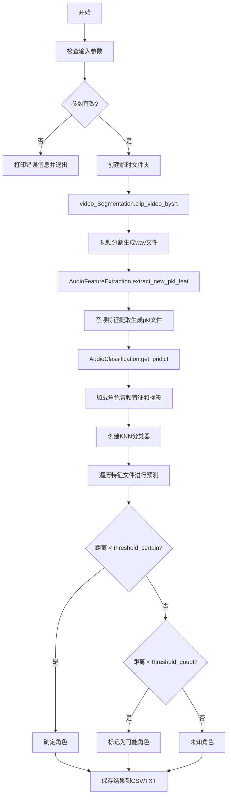

## 类结构

```
KNN_Classifier_lis (KNN分类器-返回邻居列表)
KNN_Classifier (KNN分类器-基础版)
AudioClassification (音频分类主类)
└── create_classifier (工厂方法)
└── get_feature (获取特征)
└── save_to_csv (保存CSV)
└── correct_timestamp_format (时间戳格式化)
└── save_lis2txt (保存TXT)
└── get_pridict (预测主方法)
recognize (全局主函数)
```

## 全局变量及字段


### `threshold_certain`
    
确定阈值，用于判断预测结果的确定性

类型：`float`
    


### `threshold_doubt`
    
怀疑阈值，用于判断预测结果是否可疑

类型：`float`
    


### `csv_save_name`
    
CSV输出文件路径

类型：`str`
    


### `txt_save_name`
    
TXT输出文件路径

类型：`str`
    


### `feature_folder`
    
特征文件夹路径

类型：`str`
    


### `res_lis`
    
CSV结果列表，包含人物、台词、时间戳等字段

类型：`list`
    


### `txt_lis`
    
TXT结果列表，包含识别的人物和对应台词

类型：`list`
    


### `temp_dir`
    
临时目录路径

类型：`str`
    


### `temp_folder`
    
临时文件夹路径，用于存放视频切割和特征提取的临时文件

类型：`str`
    


### `KNN_Classifier_lis.feature`
    
训练特征矩阵

类型：`numpy.ndarray`
    


### `KNN_Classifier_lis.labels`
    
训练标签列表

类型：`list`
    


### `KNN_Classifier_lis.classifier`
    
sklearn KNN分类器实例

类型：`KNeighborsClassifier`
    


### `KNN_Classifier.feature`
    
训练特征矩阵

类型：`numpy.ndarray`
    


### `KNN_Classifier.labels`
    
训练标签列表

类型：`list`
    


### `KNN_Classifier.classifier`
    
sklearn KNN分类器实例

类型：`KNeighborsClassifier`
    


### `AudioClassification.feat_sel`
    
选中的特征矩阵

类型：`numpy.ndarray`
    


### `AudioClassification.label_sel`
    
选中的标签列表

类型：`list`
    


### `AudioClassification.my_classifier`
    
分类器实例

类型：`KNN_Classifier`
    
    

## 全局函数及方法


### `recognize`

该函数是整个音频角色识别流程的主入口函数，协调视频分割、音频特征提取和角色分类三个核心模块，通过命令行参数接收视频文件、字幕文件、角色音频库路径和输出目录，完成验证检查后依次执行视频切片、音频特征提取和角色分类，最终将识别结果保存为CSV和TXT格式文件。

#### 参数

- `args`：`argparse.Namespace`，包含以下属性：
  - `verbose`：`bool`，是否输出详细日志信息
  - `input_video`：`str`，输入视频文件路径
  - `input_srt`：`str`，输入字幕文件路径（.srt或.ass格式）
  - `role_audios`：`str`，角色音频特征库目录路径，按角色分类存储
  - `output_folder`：`str`，识别结果输出目录路径

#### 返回值

- `None`：无返回值，识别结果直接写入CSV和TXT文件

#### 流程图

```mermaid
flowchart TD
    A[开始 recognize] --> B{verbose?}
    B -->|Yes| C[打印 'runing recognize']
    B -->|No| D[跳过日志]
    C --> D
    D --> E{input_video 文件存在?}
    E -->|No| F[打印错误并返回]
    E -->|Yes| G{input_srt 文件存在?}
    G -->|No| H[打印错误并返回]
    G -->|Yes| I{role_audios 目录存在?}
    I -->|No| J[打印错误并返回]
    I -->|Yes| K{output_folder 目录存在?]
    K -->|No| L[创建 output_folder 目录]
    K -->|Yes| M
    L --> M
    M[创建 temp_folder] --> N[调用 video_Segmentation.clip_video_bysrt]
    N --> O[调用 extract_new_pkl_feat 提取特征]
    O --> P[调用 AudioClassification.get_pridict]
    P --> Q[保存结果到 CSV 和 TXT]
    Q --> R[结束]
    
    F --> R
    H --> R
    J --> R
```

#### 带注释源码

```python
def recognize(args):
    """
    主识别函数，协调整个音频角色识别流程
    
    该函数执行以下步骤：
    1. 验证输入参数的有效性（文件/目录是否存在）
    2. 创建临时工作目录
    3. 根据字幕时间戳切割视频片段并转换为音频
    4. 提取音频特征
    5. 使用KNN分类器进行角色识别
    6. 保存识别结果
    """

    # 输出详细日志信息
    if args.verbose:
        print('runing recognize')

    # ========== 步骤1: 输入参数有效性验证 ==========
    
    # 检查输入视频文件是否存在
    if not os.path.isfile(args.input_video):
        print('input_video is not exist')
        return  # 提前返回，终止函数执行
    
    # 检查字幕文件是否存在
    if not os.path.isfile(args.input_srt):
        print('input_srt is not exist')
        return
    
    # 检查角色音频特征库目录是否存在
    if not os.path.isdir(args.role_audios):
        print('role_audios is not exist')
        return
    
    # 检查输出目录是否存在，不存在则创建
    if not os.path.isdir(args.output_folder):
        print('warning output_folder is not exist')
        os.mkdir(args.output_folder)  # 创建输出目录
        print('create folder', args.output_folder)

    # ========== 步骤2: 创建临时工作目录 ==========
    
    # 在角色音频库的父目录创建临时文件夹
    temp_dir = os.path.dirname(args.role_audios)
    temp_folder = f'{temp_dir}/temp_folder'
    os.makedirs(temp_folder, exist_ok=True)  # exist_ok=True 避免目录已存在报错

    # ========== 步骤3: 视频分割（根据字幕时间戳） ==========
    
    # 初始化视频分割器，根据字幕文件时间戳切割视频
    # 输出: *.wav 音频片段文件
    video_pth_segmentor = video_Segmentation()
    video_pth_segmentor.clip_video_bysrt(args.input_video, args.input_srt, temp_folder)

    # ========== 步骤4: 音频特征提取 ==========
    
    # 初始化音频特征提取器，将wav转换为pkl特征文件
    audio_feature_extractor = AudioFeatureExtraction()
    video_pth_segmentor.extract_new_pkl_feat(audio_feature_extractor, args.input_video, temp_folder)

    # ========== 步骤5: 角色分类识别 ==========
    
    # 初始化音频分类器，执行预测识别
    audio_classification = AudioClassification()
    audio_classification.get_pridict(
        args.role_audios,      # 角色音频特征库
        args.input_video,      # 输入视频
        args.output_folder,    # 输出目录
        temp_folder            # 临时文件夹
    )

    # ========== 步骤6: 清理临时文件 ==========
    
    # 注意: 当前代码中已注释掉删除临时文件夹的语句
    # shutil.rmtree(temp_folder)  # 清理临时文件释放磁盘空间
    
    # 函数结束，无返回值，结果已写入CSV和TXT文件
```


### `get_subdir(path)`

获取子目录列表。该函数接收一个路径参数，返回该路径下所有子目录的列表，用于遍历特征文件夹中按角色分类的目录结构。

#### 参数

- `path`：`str`，要查询的目录路径，指向包含多个子目录的父文件夹路径

#### 返回值

- `list`，子目录路径列表，每个元素为子目录的完整路径字符串

#### 流程图

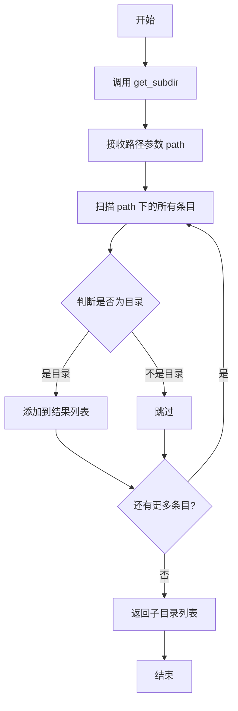

#### 带注释源码

```
# 说明：此函数为外部依赖，源码未在当前文件中实现
# 导入来源：from audio_feature_ext.tool import get_subdir, get_filelist, save_lis2txt
# 以下为基于代码调用方式的推断实现：

# def get_subdir(path):
#     """
#     获取指定目录下的所有子目录列表
#     
#     参数：
#         path: str - 父目录路径
#     
#     返回：
#         list - 子目录路径列表
#     """
#     import os
#     return [os.path.join(path, d) for d in os.listdir(path) 
#             if os.path.isdir(os.path.join(path, d))]

# 调用示例（来自 AudioClassification.get_feature 方法）：
role_dirs = get_subdir(audio_feature_dir+'/feature')
for role_dir in role_dirs:
    role = os.path.basename(os.path.normpath(role_dir))
    file_list = get_filelist(role_dir)
    # ... 继续处理每个角色的特征文件
```

---

### 补充说明

**外部依赖信息**：

- **模块**：`audio_feature_ext.tool`
- **来源**：第三方模块（项目内部的工具模块）
- **依赖关系**：被 `AudioClassification.get_feature()` 方法调用，用于遍历角色特征文件夹结构
- **设计推测**：该函数应封装了 `os.listdir()` 或 `os.walk()` 等目录遍历逻辑，过滤出仅包含目录的列表

**使用场景**：
```python
role_dirs = get_subdir(audio_feature_dir+'/feature')
```
此处传入 `audio_feature_dir+'/feature'` 路径，期望返回该目录下所有以角色命名的子目录列表，用于后续逐个读取各角色的音频特征文件。


### `get_filelist`

获取指定目录下的所有文件列表，用于遍历音频特征目录中的所有文件。

参数：

- `dir`：`str`，需要遍历的目录路径

返回值：`list`，返回目录下的文件路径列表

#### 流程图

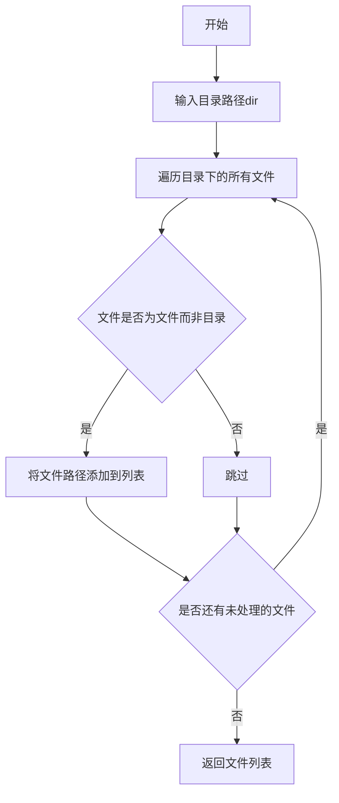

#### 带注释源码

```python
# 注意：此函数为外部依赖，定义在 audio_feature_ext.tool 模块中
# 以下为根据代码上下文推断的函数实现

def get_filelist(dir):
    """
    获取指定目录下的所有文件列表
    
    参数：
        dir: 目录路径
        
    返回：
        文件路径列表
    """
    import os
    
    # 确保目录存在
    if not os.path.exists(dir):
        return []
    
    file_list = []
    
    # 遍历目录
    for root, dirs, files in os.walk(dir):
        for file in files:
            # 拼接完整文件路径
            file_path = os.path.join(root, file)
            file_list.append(file_path)
    
    return file_list
```

> **注意**：该函数为外部依赖，实际定义在 `audio_feature_ext.tool` 模块中，未在当前代码文件中实现。


### `save_lis2txt` (外部依赖函数)

该函数用于将列表数据保存到文本文件，是从外部模块 `audio_feature_ext.tool` 导入的工具函数，核心功能是将传入的字符串列表逐行写入指定文件，并输出保存成功的提示信息。

参数：

- `filename`：`str`，要保存的目标文件路径（含文件名和扩展名）
- `lines`：`list`，要写入文本的内容列表，每个元素为一行

返回值：`None`，无返回值，仅执行文件写入操作

#### 流程图

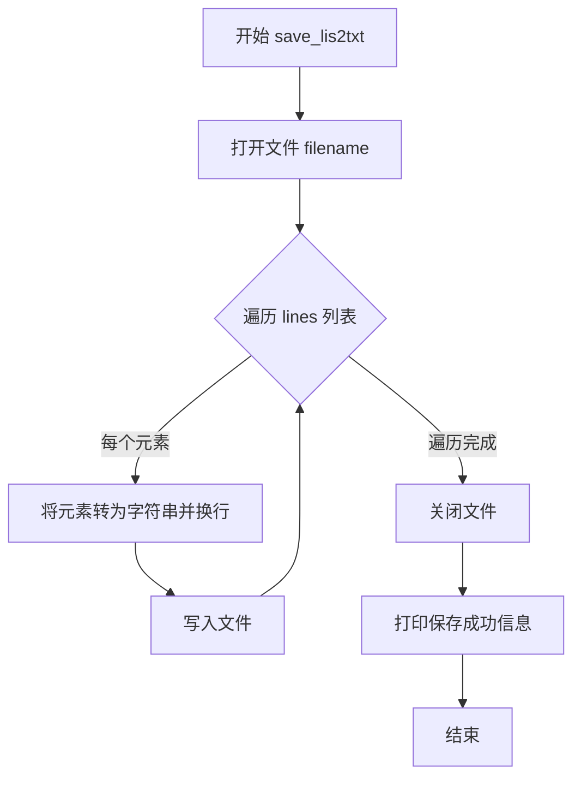

#### 带注释源码

```
# 外部依赖导入（来源：audio_feature_ext.tool）
from audio_feature_ext.tool import get_subdir, get_filelist, save_lis2txt

# AudioClassification 类中类似的实现（参考）
def save_lis2txt(self, filename, lines):
    """
    将列表保存为文本文件
    
    参数:
        filename: str, 要保存的文件路径
        lines: list, 要写入的内容列表
    返回值:
        None
    """
    # 以utf-8编码打开文件，w模式（写入）
    with open(filename, 'w', encoding='utf-8') as f:
        # 遍历列表中的每一行
        for line in lines:
            # 将元素转为字符串并添加换行符后写入
            f.write(str(line) + '\n')
    # 打印保存成功的提示信息
    print(f'识别结果保存到txt, {filename}')
```

---

#### 补充说明

| 项目 | 说明 |
|------|------|
| **设计目标** | 将内存中的列表数据持久化到文本文件，便于后续查看和编辑 |
| **约束条件** | 文件编码为 UTF-8，每行自动添加换行符 |
| **错误处理** | 未在函数内部进行异常捕获，调用方需确保文件路径合法且有写入权限 |
| **数据流** | 输入：字符串列表 → 输出：文本文件（每行一项） |
| **调用场景** | 在 `AudioClassification.get_pridict()` 方法中调用，用于保存识别结果为 txt 格式 |


### AudioFeatureExtraction

音频特征提取类，负责从音频文件中提取特征并保存为pickle格式。该类作为音频特征提取的工具模块，被视频片段处理模块调用，用于将提取的音频特征转换为模型可用的数值向量。

参数：

- 无（该类使用无参构造函数初始化）

返回值：无（该类作为外部依赖被传递给视频分割模块的extract_new_pkl_feat方法）

#### 流程图

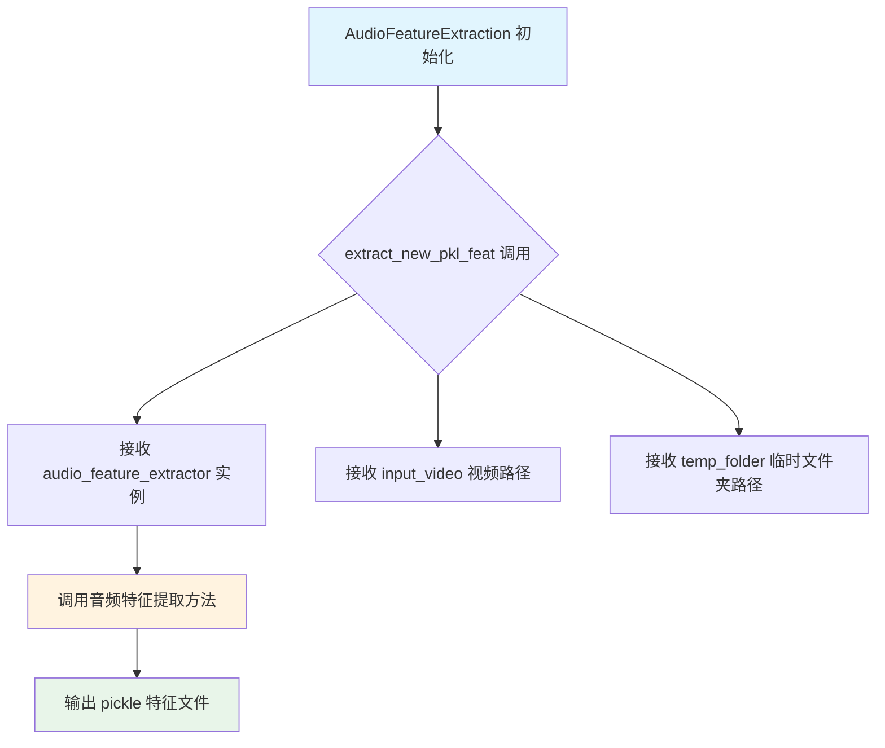

#### 带注释源码

```python
# 注意：以下为基于代码调用关系的推断实现
# 实际实现位于 audio_feature_ext.audio_fea_ext 模块中

class AudioFeatureExtraction:
    """
    音频特征提取类
    
    该类负责从音频文件（WAV格式）中提取声学特征，通常包括：
    - MFCC（梅尔频率倒谱系数）
    - 色度特征
    - 频谱特征
    - 零交叉率等
    
    提取的特征将保存为pickle格式，供后续的KNN分类器使用。
    """
    
    def __init__(self):
        """
        初始化音频特征提取器
        
        可能的参数：
        - sample_rate: 采样率，默认16000
        - feature_dim: 特征维度
        - extract_methods: 提取方法列表
        """
        pass
    
    def extract_feature(self, audio_path):
        """
        从音频文件提取特征
        
        参数：
        - audio_path: str，音频文件路径
        
        返回值：
        - numpy.ndarray，提取的音频特征向量
        """
        # 读取音频文件
        # 进行特征提取
        # 返回特征向量
        pass
    
    def save_feature(self, feature, output_path):
        """
        保存特征到pickle文件
        
        参数：
        - feature: numpy.ndarray，音频特征
        - output_path: str，输出文件路径
        
        返回值：
        - 无
        """
        pass
```

#### 在主代码中的使用方式

```python
# 导入语句（来自外部依赖）
from audio_feature_ext.audio_fea_ext import AudioFeatureExtraction

# 实例化音频特征提取器
audio_feature_extractor = AudioFeatureExtraction()

# 将提取器传递给视频分割模块
video_pth_segmentor.extract_new_pkl_feat(
    audio_feature_extractor,  # 音频特征提取器实例
    args.input_video,         # 输入视频路径
    temp_folder               # 临时文件夹路径
)
```

#### 关键信息说明

| 项目 | 说明 |
|------|------|
| **模块来源** | `audio_feature_ext.audio_fea_ext`（外部依赖） |
| **实例化位置** | `recognize` 函数内部 |
| **使用方式** | 作为参数传递给 `video_Segmentation.extract_new_pkl_feat` 方法 |
| **功能角色** | 将音频片段转换为特征向量（numpy数组），供KNN分类器进行角色识别 |


### `video_Segmentation`

视频分割类（`video_Segmentation`）是本项目的外部依赖模块，负责根据字幕文件（SRT/ASS）的时间戳信息对视频进行切割，并提取对应的音频特征。该类封装了视频处理的核心逻辑，是整个音频角色识别流程的起始环节。

参数：

- 无直接参数（构造函数 `__init__` 无需参数）

返回值：无返回值（构造函数）

#### 流程图

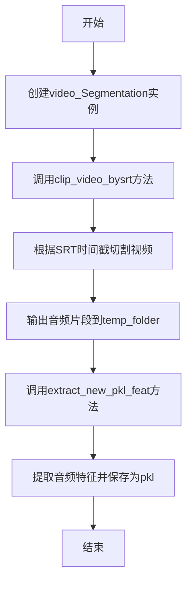

#### 带注释源码

```python
# coding: utf-8
# 外部依赖导入：video_Segmentation 类来自 crop 模块
from crop import video_Segmentation

# 在 recognize 函数中的使用方式：

# 1. 实例化视频分割器
video_pth_segmentor = video_Segmentation()

# 2. 根据字幕文件切割视频，生成音频片段
# 参数说明：
#   - args.input_video: 输入视频文件路径
#   - args.input_srt: 字幕文件路径（SRT/ASS格式）
#   - temp_folder: 临时文件夹，用于存放切割后的音频片段
video_pth_segmentor.clip_video_bysrt(args.input_video, args.input_srt, temp_folder)

# 3. 提取音频特征
# 参数说明：
#   - audio_feature_extractor: AudioFeatureExtraction 类的实例
#   - args.input_video: 输入视频文件路径
#   - temp_folder: 临时文件夹路径
video_pth_segmentor.extract_new_pkl_feat(audio_feature_extractor, args.input_video, temp_folder)
```

---

### `video_Segmentation.clip_video_bysrt`

根据字幕文件的时间戳信息对视频进行切割，生成对应的音频片段。

参数：

- `input_video`：`str`，输入的视频文件路径（如 `.mkv`、`.mp4` 格式）
- `input_srt`：`str`，字幕文件的路径（支持 `.srt` 或 `.ass` 格式）
- `temp_folder`：`str`，临时文件夹路径，用于存放切割后的音频片段（`.wav` 格式）

返回值：`无`（该方法直接输出文件到指定目录）

#### 流程图

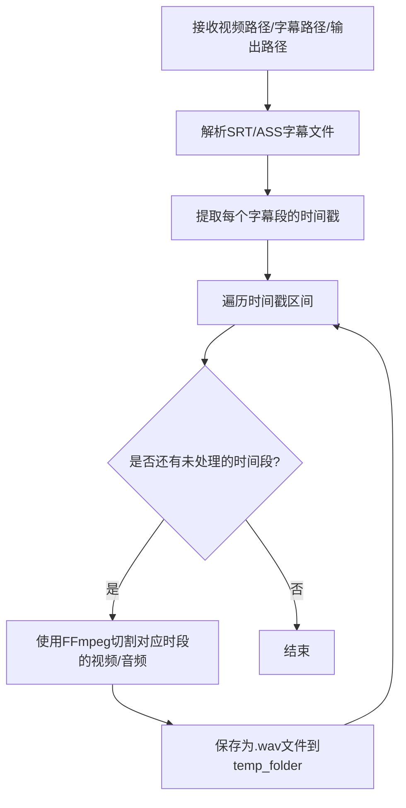

#### 带注释源码

```python
def clip_video_bysrt(self, input_video, input_srt, temp_folder):
    """
    根据字幕文件的时间戳切割视频音频
    
    参数:
        input_video: 输入视频路径
        input_srt: 字幕文件路径
        temp_folder: 输出文件夹路径
    
    返回:
        无返回值，直接生成音频文件
    """
    # 实现逻辑（需参考crop模块源码）:
    # 1. 读取SRT/ASS字幕文件
    # 2. 解析时间戳（格式：HH:MM:SS,mmm --> HH:MM:SS.mmm）
    # 3. 使用FFmpeg按时间戳切割视频
    # 4. 输出格式为.wav的音频文件
    # 5. 文件命名规则：{index}_{start_time}_{end_time}_{text}.wav
    pass
```

---

### `video_Segmentation.extract_new_pkl_feat`

使用音频特征提取器对切割后的音频片段进行特征提取，并将特征保存为 pickle 格式（`.pkl`）。

参数：

- `audio_feature_extractor`：`AudioFeatureExtraction`，音频特征提取器实例（来自 `audio_feature_ext.audio_fea_ext` 模块）
- `input_video`：`str`，原始输入视频的文件路径（用于生成特征文件的命名）
- `temp_folder`：`str`，临时文件夹路径，包含切割后的音频文件

返回值：`无`（该方法直接输出特征文件到指定目录）

#### 流程图

```mermaid
graph TD
    A[接收特征提取器/视频路径/临时文件夹] --> B[遍历temp_folder中的音频文件]
    B --> C{是否还有未处理的音频文件?}
    C -->|是| D[读取.wav音频文件]
    D --> E[调用audio_feature_extractor提取特征]
    E --> F[将特征保存为.pkl文件]
    F --> G[特征文件命名: {index}_{start_time}_{end_time}_{text}.pkl]
    G --> B
    C -->|否| H[结束]
```

#### 带注释源码

```python
def extract_new_pkl_feat(self, audio_feature_extractor, input_video, temp_folder):
    """
    提取音频特征并保存为pkl格式
    
    参数:
        audio_feature_extractor: AudioFeatureExtraction类的实例
        input_video: 输入视频的路径（用于生成特征文件名）
        temp_folder: 临时文件夹路径
    
    返回:
        无返回值，直接生成pkl特征文件
    """
    # 实现逻辑（需参考crop模块源码）:
    # 1. 遍历temp_folder中的.wav音频文件
    # 2. 对每个音频文件调用特征提取器
    # 3. 将提取的numpy数组特征保存为.pkl格式
    # 4. 文件命名规则：{index}_{start_time}_{end_time}_{text}.pkl
    # 5. 输出到 temp_folder/feature/ 目录
    pass
```

---

### 关键组件总结

| 组件名称 | 类型 | 一句话描述 |
|---------|------|-----------|
| `video_Segmentation` | 外部依赖类 | 视频分割核心类，负责根据字幕时间戳切割视频并提取音频特征 |
| `clip_video_bysrt` | 方法 | 根据SRT/ASS字幕文件的时间戳信息切割视频为音频片段 |
| `extract_new_pkl_feat` | 方法 | 使用音频特征提取器对音频片段进行特征提取并保存为pkl |

### 潜在的技术债务与优化空间

1. **外部依赖黑盒问题**：`video_Segmentation` 类的源码未在当前项目中提供，导致文档不完整。应当获取该类的完整实现源码以便进行完整分析。
2. **错误处理缺失**：代码中使用 `try-except` 捕获异常但未做具体处理，可能导致隐藏的错误。建议增加详细的日志记录。
3. **硬编码阈值**：`threshold_certain` 和 `threshold_doubt` 为硬编码值，应当考虑提取为配置文件或命令行参数。
4. **临时文件清理**：代码中 `shutil.rmtree(temp_folder)` 被注释掉，可能导致临时文件堆积。

### 其它项目

#### 设计目标与约束
- **目标**：实现基于音频特征的动漫/影视角色识别系统
- **输入**：视频文件、字幕文件、角色音频特征库
- **输出**：CSV/TXT格式的角色识别结果

#### 数据流与状态机
```
输入视频 + 字幕文件 → [视频分割] → 音频片段 → [特征提取] → pkl特征 
    → [KNN分类] → 识别结果 → CSV/TXT输出
```

#### 外部依赖与接口契约
| 依赖模块 | 用途 | 接口 |
|---------|------|------|
| `crop.video_Segmentation` | 视频切割与特征提取 | `clip_video_bysrt()`, `extract_new_pkl_feat()` |
| `audio_feature_ext.audio_fea_ext.AudioFeatureExtraction` | 音频特征提取 | `extract()` |
| `sklearn.neighbors.KNeighborsClassifier` | KNN分类算法 | `fit()`, `predict()`, `kneighbors()` |


### KNN_Classifier_lis.__init__

初始化 KNN 分类器（基于余弦相似度），存储训练数据与标签，并完成模型的训练。

参数：

- `feature`：`numpy.ndarray`，训练用的特征数据矩阵（通常为二维数组，每行代表一个样本的特征向量）。
- `labels`：`list` 或 `numpy.ndarray`，对应特征数据的标签列表，用于分类。
- `n_neighbors`：`int`，默认为 3，KNN 算法中要选择的最近邻数量。

返回值：`None`，`__init__` 方法不返回值，仅用于初始化对象状态。

#### 流程图

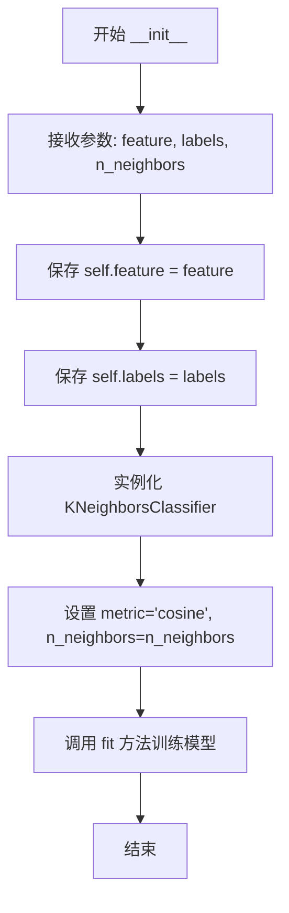

#### 带注释源码

```python
def __init__(self, feature, labels, n_neighbors=3):
    # 将传入的特征矩阵保存为实例变量，供后续预测时使用
    self.feature = feature
    # 将传入的标签列表保存为实例变量
    self.labels = labels
    # 初始化 sklearn 的 KNeighborsClassifier
    # 使用 'cosine' (余弦相似度) 作为距离度量，适用于文本或音频特征的高维向量比较
    self.classifier = KNeighborsClassifier(n_neighbors=n_neighbors, metric='cosine')
    # 使用特征和标签训练分类器
    self.classifier.fit(self.feature, self.labels)
```


### `KNN_Classifier_lis.predict(x)`

该方法实现了基于K近邻算法的音频特征分类预测功能，通过计算待预测特征与训练集中各样本的余弦相似度，找出最近的K个邻居，并返回预测的类别标签以及这些邻居的标签和对应距离列表。

参数：
- `x`：`numpy.ndarray`，待预测的音频特征向量

返回值：`(str, list)`，返回一个元组，其中第一个元素为预测的类别标签（字符串类型），第二个元素为邻居标签与距离的列表（列表类型），列表中每个元素为`(邻居标签, 距离)`的元组

#### 流程图

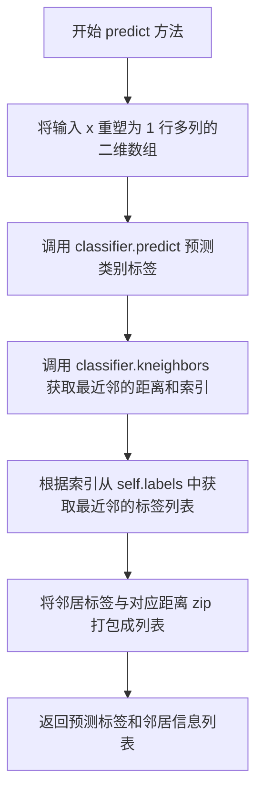

#### 带注释源码

```python
def predict(self, x):
    # Predict the class label
    # 使用训练好的KNN分类器对输入特征向量进行类别预测
    # 输入 x 需要重塑为二维数组形状 (1, n_features) 以符合 sklearn 模型的输入要求
    predicted_label = self.classifier.predict(x.reshape(1, -1))

    # Get the distances and indices of the nearest neighbors
    # 获取最近邻的距离和索引
    # 返回两个数组：dists[0] 包含到各邻居的距离，indices[0] 包含各邻居在训练数据中的索引
    dists, indices = self.classifier.kneighbors(x.reshape(1, -1))

    # Get the labels of the nearest neighbors
    # 根据最近邻的索引，从训练标签列表中提取对应的标签值
    nearest_labels = [self.labels[i] for i in indices[0]]

    # Return the predicted label, nearest labels and distances
    # 返回预测的类别标签以及邻居标签与距离的配对列表
    # 返回格式: (预测标签字符串, [(邻居1标签, 距离1), (邻居2标签, 距离2), ...])
    return predicted_label[0], list(zip(nearest_labels, dists[0]))
```


### `KNN_Classifier.__init__`

该方法是 KNN（K-Nearest Neighbors）分类器的构造函数，用于初始化分类器并使用给定的特征数据和标签训练模型。

参数：

- `feature`：`numpy.ndarray`，训练用的特征数据，通常是一个二维矩阵，每行代表一个样本的特征向量
- `labels`：`list` 或 `numpy.ndarray`，与特征数据对应的标签列表，用于表示每个样本的类别
- `n_neighbors`：`int`（默认值：3），KNN 算法中的 K 值，表示用于决策的最近邻数量

返回值：`None`，构造函数不返回任何值

#### 流程图

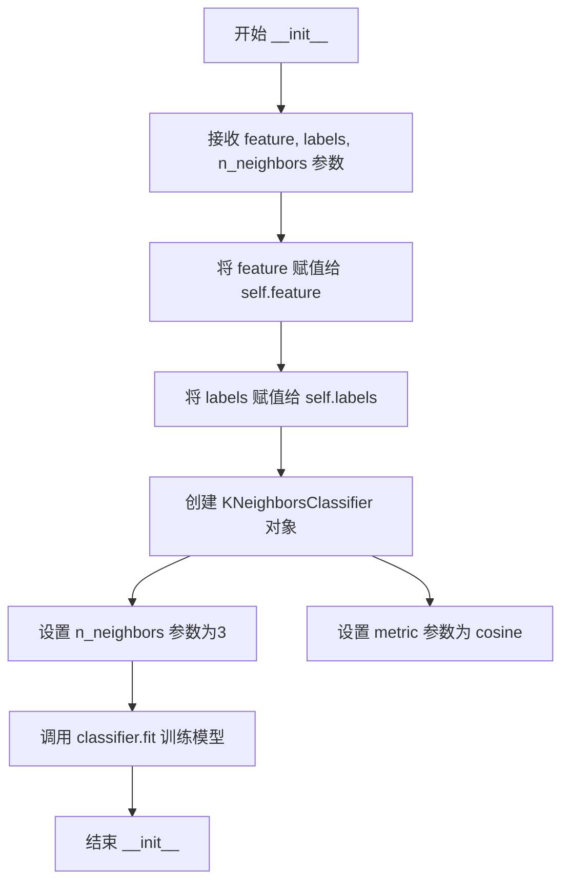

#### 带注释源码

```python
def __init__(self, feature, labels, n_neighbors=3):
    """
    初始化 KNN 分类器
    
    参数:
        feature: 训练特征数据，numpy.ndarray 类型
        labels: 训练标签，list 或 numpy.ndarray 类型
        n_neighbors: 近邻数量，默认为 3
    """
    # 将传入的特征数据保存为实例变量
    self.feature = feature
    
    # 将传入的标签数据保存为实例变量
    self.labels = labels
    
    # 创建 sklearn 的 KNeighborsClassifier 对象
    # n_neighbors: 指定 K 值，即考虑多少个最近邻
    # metric='cosine': 使用余弦相似度作为距离度量
    self.classifier = KNeighborsClassifier(n_neighbors=n_neighbors, metric='cosine')
    
    # 使用特征数据和标签训练分类器模型
    self.classifier.fit(self.feature, self.labels)
```


### `KNN_Classifier.predict(x)`

该方法接收一个特征向量，使用已训练的 K 近邻分类器（基于余弦距离）预测输入特征的类别标签，并返回预测标签及最近邻的最小距离。

参数：
- `x`：`numpy.ndarray`，输入的特征向量，用于进行分类预测

返回值：`tuple`，包含两个元素：
1. 预测的类别标签（类型取决于训练时 `labels` 的类型，通常为 `str`）
2. 最近邻的最小距离（`float`）

#### 流程图

```mermaid
flowchart TD
    A[开始 predict 方法] --> B[将输入特征 x reshape 为 1 行]
    B --> C[调用 classifier.predict 预测类别]
    C --> D[调用 classifier.kneighbors 获取最近邻距离]
    D --> E[提取预测标签 predicted_label[0]]
    E --> F[提取最小距离 dist[0].min]
    F --> G[返回预测标签和最小距离]
```

#### 带注释源码

```python
def predict(self, x):
    """
    使用训练好的 KNN 分类器预测输入特征的类别标签
    
    参数:
        x: numpy.ndarray, 输入的特征向量
    
    返回:
        tuple: (预测的类别标签, 最近邻的最小距离)
    """
    
    # 使用 KNN 分类器预测类别标签
    # 将 x reshape 为 (1, -1) 以匹配 sklearn 的输入要求
    # predicted_label 是预测结果数组，取第一个元素得到具体标签
    predicted_label = self.classifier.predict(x.reshape(1, -1))
    
    # 获取到最近邻的距离和索引
    # dist: 距离数组，shape 为 (1, n_neighbors)
    # _: 索引数组，此处不需要
    dist, _ = self.classifier.kneighbors(x.reshape(1, -1))
    
    # 返回预测的标签和最近邻的最小距离
    # predicted_label[0]: 取出预测的类别标签
    # dist[0].min(): 取出第一行（唯一的查询样本）中的最小距离
    return predicted_label[0], dist[0].min()
```


### AudioClassification.__init__

该方法为AudioClassification类的构造函数，用于初始化AudioClassification类的实例。当前实现为空的pass语句，不执行任何具体操作，仅作为类的初始化入口预留。

参数：（无，除了隐含的self参数）

- `self`：隐含参数，AudioClassification类的实例对象，表示当前正在初始化的对象

返回值：`None`，该方法不返回任何值，仅完成对象的初始化过程

#### 流程图

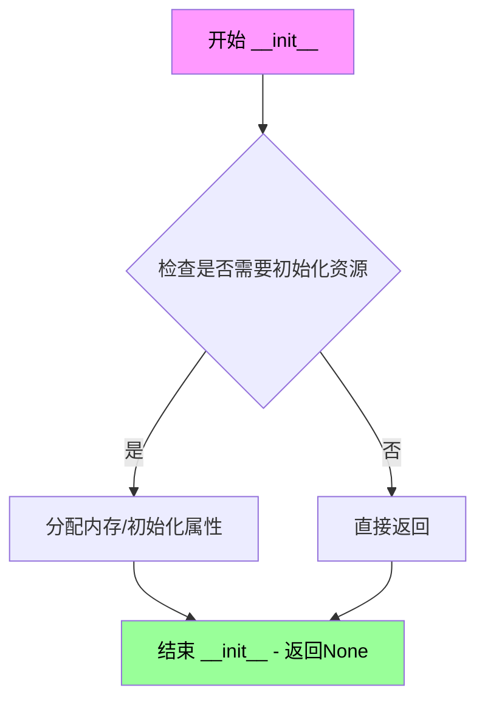

#### 带注释源码

```python
def __init__(self):
    """
    AudioClassification类的初始化方法
    
    该方法在创建AudioClassification类的实例时被调用，
    用于完成对象的初始化工作。当前实现为空实现（pass），
    预留作为未来可能需要的资源初始化、属性设置等操作。
    
    参数:
        无（除了隐含的self参数）
    
    返回值:
        None: 不返回任何值
    """
    pass  # 预留的初始化接口，当前不做任何初始化操作
```

#### 备注说明

当前`__init__`方法存在以下特点：

1. **空实现**：方法体仅包含`pass`语句，未执行任何实际初始化工作
2. **扩展性**：虽然当前为空，但为未来扩展预留了接口，可在后续添加如模型加载、配置初始化等逻辑
3. **设计考量**：该类其他方法（如`get_feature`、`get_pridict`等）均在需要时动态创建或加载资源，因此不需要在初始化阶段预先准备


### `AudioClassification.create_classifier`

该方法是一个动态分类器工厂方法，通过接收类名和参数在运行时创建相应的KNN分类器实例，利用Python的`globals()`函数实现动态类实例化。

参数：

- `class_name`：`str`，要创建的分类器类名（如"KNN_Classifier"或"KNN_Classifier_lis"）
- `features`：`numpy.ndarray` 或类似结构，训练用的特征数据
- `labels`：`list`，特征对应的标签列表
- `n_neighbors`：`int`，KNN的邻居数量，默认为None

返回值：`object`，返回创建的分类器实例对象

#### 流程图

```mermaid
flowchart TD
    A[开始 create_classifier] --> B[获取class_name类名]
    B --> C{class_name在全局命名空间中?}
    C -->|是| D[使用globals获取类对象]
    C -->|否| E[抛出KeyError]
    D --> F[调用类构造函数: class(features, labels, n_neighbors)]
    F --> G[返回分类器实例]
    E --> H[返回错误]
```

#### 带注释源码

```python
def create_classifier(self, class_name, features, labels, n_neighbors=None):
    """
    动态创建分类器实例
    
    参数:
        class_name: str, 分类器类名
        features: 训练特征数据
        labels: 训练标签
        n_neighbors: KNN邻居数，默认None
    
    返回:
        分类器实例对象
    """
    # 使用globals()获取全局命名空间中的类，然后创建实例
    # globals()返回当前全局符号表的字典，通过类名获取类对象
    classifier_class = globals()[class_name](features, labels, n_neighbors)
    return classifier_class
```

#### 关键组件信息

| 名称 | 描述 |
|------|------|
| `globals()` | Python内置函数，返回全局命名空间的字典，用于动态获取类 |
| `KNN_Classifier` | 标准KNN分类器，返回预测标签和最小距离 |
| `KNN_Classifier_lis` | KNN分类器增强版，返回预测标签和最近邻的详细信息 |

#### 潜在的技术债务或优化空间

1. **安全性风险**：`globals()[class_name]`直接使用传入的类名创建对象，存在代码注入风险。应该添加白名单验证或使用`try-except`捕获`KeyError`。

2. **缺乏错误处理**：未对`class_name`不存在的情况进行友好处理，会抛出原始`KeyError`。

3. **返回值不明确**：文档注释可以更详细说明可能返回的具体类型。

4. **参数验证缺失**：未验证`features`和`labels`的长度一致性。

5. **硬编码依赖**：依赖全局命名空间中的类，建议使用工厂模式或注册机制替代。

#### 其它项目

- **设计目标**：实现动态分类器创建，支持运行时选择不同的分类算法
- **约束**：要求`class_name`必须是已存在于全局命名空间中的类
- **错误处理**：当前未做异常处理，类名不存在时会抛出`KeyError`
- **数据流**：接收特征和标签数据，传递给底层分类器进行训练


### `AudioClassification.get_feature`

该方法从指定目录加载预提取的音频特征文件和对应的角色标签，将所有特征堆叠为numpy数组并返回特征矩阵和标签列表，用于后续的KNN分类。

参数：

- `audio_feature_dir`：`str`，音频特征根目录路径，该目录下应包含`feature`子目录，每个子目录以角色名称命名并包含该角色的特征pickle文件

返回值：`(numpy.ndarray, list)`，返回包含所有特征数据的numpy数组和对应的角色标签列表

#### 流程图

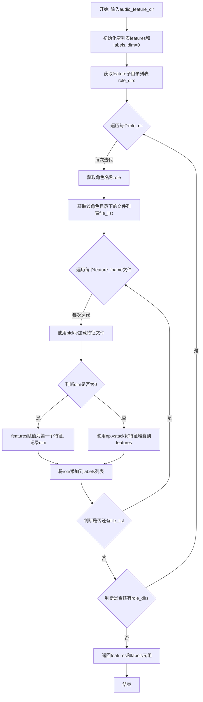

#### 带注释源码

```python
def get_feature(self, audio_feature_dir):
    """
    从目录加载特征和标签
    
    参数:
        audio_feature_dir: str, 音频特征根目录路径
        
    返回:
        tuple: (features, labels) - 特征矩阵和标签列表
    """
    
    # 初始化用于存储特征和标签的容器
    features = []
    labels = []
    dim = 0  # 记录特征的维度
    
    # 获取特征目录下的所有子目录（每个子目录代表一个角色）
    role_dirs = get_subdir(audio_feature_dir + '/feature')
    
    # 遍历每个角色目录
    for role_dir in role_dirs:
        # 从目录路径中提取角色名称
        # role = role_dir.split('/')[-1]  # 旧方法
        role = os.path.basename(os.path.normpath(role_dir))  # 获取目录名作为角色标签
        
        # 获取该角色目录下的所有特征文件
        file_list = get_filelist(role_dir)
        
        # 遍历该角色的每个特征文件
        for feature_fname in file_list:
            # 以二进制模式打开pickle文件并加载特征
            with open(feature_fname, 'rb') as f:
                feature = pickle.load(f)  # 加载numpy数组格式的特征
            
            # 将特征追加到特征矩阵中
            if dim == 0:
                # 首次加载时，直接赋值
                features = feature
                dim = feature.shape[0]  # 记录特征的维度
            else:
                # 后续加载使用vstack垂直堆叠
                features = np.vstack((features, feature))
            
            # 将当前角色名称添加到标签列表
            labels.append(role)
    
    # 返回特征矩阵和对应的标签列表
    return features, labels
```


### AudioClassification.save_to_csv

将音频分类结果保存到CSV文件中。

参数：

- `self`：隐式参数，`AudioClassification` 类实例本身
- `filename`：`str`，要保存的CSV文件路径
- `data`：`list`，要写入CSV的二维数据列表

返回值：`None`，无返回值，仅执行文件写入操作

#### 流程图

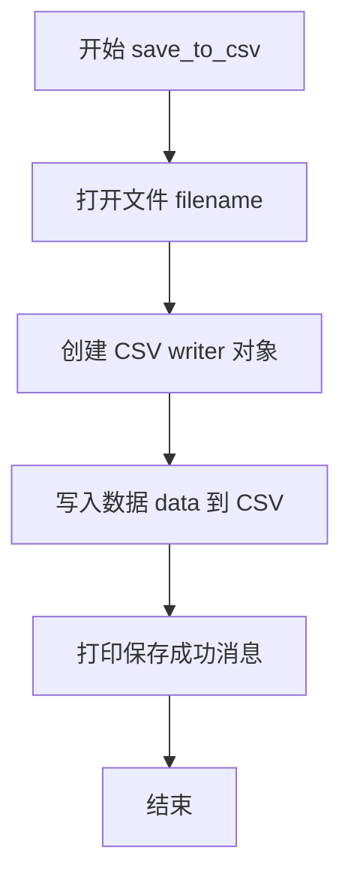

#### 带注释源码

```python
def save_to_csv(self, filename, data):
    """
    将识别结果保存到CSV文件
    
    参数:
        filename: str, CSV文件保存路径
        data: list, 二维列表，包含要写入CSV的数据
    """
    # 使用newline=''避免在Windows上写入CSV时出现空行
    with open(filename, 'w', newline='') as csvfile:
        # 创建CSV写入器对象
        writer = csv.writer(csvfile)
        # 将二维数据写入CSV文件（每行一个列表）
        writer.writerows(data)
    
    # 打印保存成功的提示信息，包含文件名
    print(f'识别结果保存到csv, {filename}')
```


### `AudioClassification.correct_timestamp_format`

该函数用于修正时间戳格式，将输入的时间戳字符串从 `xx.xx.xx.xxx` 格式转换为标准的 `xx:xx:xx.xxx` 格式（将第3个分隔符从点号替换为冒号），常用于处理字幕文件或音视频识别结果中的时间戳格式标准化。

参数：
- `s`：`str`，待修正的时间戳字符串，格式类似于 `xx.xx.xx.xxx`（例如 `12.34.56.789`）

返回值：`str`，修正后的时间戳字符串，格式为 `xx:xx:xx.xxx`（例如 `12:34:56.789`）

#### 流程图

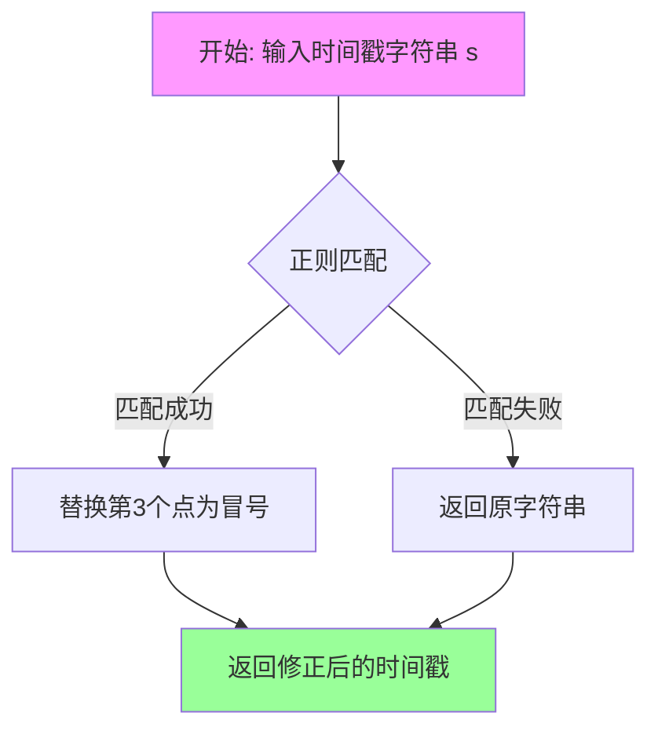

#### 带注释源码

```python
def correct_timestamp_format(self, s):
    """
    修正时间戳格式，将 'xx.xx.xx.xxx' 转换为 'xx:xx:xx.xxx'
    
    Args:
        s (str): 输入的时间戳字符串，格式如 '12.34.56.789'
    
    Returns:
        str: 修正后的时间戳字符串，格式如 '12:34:56.789'
    """
    # 使用正则表达式查找匹配的时间戳，并将第3个冒号替换为点
    # 正则解释:
    #   (\d{2})  - 捕获组1: 2位数字（小时或分钟）
    #   .        - 匹配点号分隔符
    #   (\d{2})  - 捕获组2: 2位数字（分钟或秒）
    #   .        - 匹配点号分隔符
    #   (\d{2})  - 捕获组3: 2位数字（秒）
    #   .        - 匹配点号分隔符
    #   (\d{3})  - 捕获组4: 3位数字（毫秒）
    #
    # 替换为: \1:\2:\3.\4 即 '小时:分钟:秒.毫秒'
    corrected_s = re.sub(r'(\d{2}).(\d{2}).(\d{2}).(\d{3})', r'\1:\2:\3.\4', s)
    
    return corrected_s
```


### `AudioClassification.save_lis2txt`

该方法负责将角色识别过程中的对话文本内容（例如角色名和台词）列表逐行写入到指定的文本文件中，并打印保存成功的提示信息。

参数：

- `filename`：`str`，指定保存结果的目标文本文件的路径和名称。
- `lines`：`list`，包含待写入文本内容的列表（如角色名和台词的组合字符串）。

返回值：`None`，该方法仅执行文件写入和日志输出，不返回任何数据。

#### 流程图

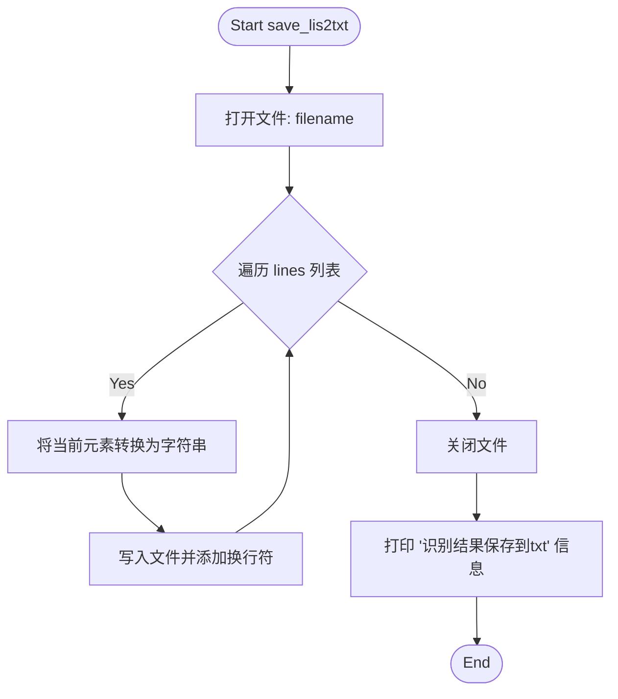

#### 带注释源码

```python
def save_lis2txt(self, filename, lines):
    # 使用 'w' 模式打开文件，并指定 UTF-8 编码以支持中文
    with open(filename, 'w', encoding='utf-8') as f:
        # 遍历传入的每一行数据
        for line in lines:
            # 将数据转换为字符串并在末尾添加换行符，确保每行独立
            f.write(str(line) + '\n')
    # 打印日志提示用户文件保存成功
    print(f'识别结果保存到txt, {filename}')
```


### AudioClassification.get_pridict

该方法是音频分类系统的主预测流程，负责加载预训练的特征和KNN分类器，遍历视频分割后的音频特征文件进行角色识别，根据距离阈值判断识别结果的置信度，并将识别结果（角色名称、台词、时间戳）保存为CSV和TXT格式。

参数：

- `role_audios`：`str`，角色音频特征文件夹路径，包含按角色分类的预提取音频特征（pickle格式）
- `input_video`：`str`，输入视频文件路径，用于提取视频文件名作为输出文件名前缀
- `output_folder`：`str`，输出文件夹路径，用于保存识别结果（CSV和TXT文件）
- `temp_folder`：`str`，临时文件夹路径，存储视频分割后的音频特征文件
- `n_neighbors`：`int`，KNN分类器的邻居数量，默认为3，用于决定K近邻算法中K的大小

返回值：`None`，该方法通过副作用（写入CSV和TXT文件）输出结果，无显式返回值

#### 流程图

```mermaid
flowchart TD
    A[开始 get_pridict] --> B[加载角色特征和标签]
    B --> C[创建KNN分类器]
    C --> D[定义置信度阈值 threshold_certain=0.4, threshold_doubt=0.6]
    D --> E[提取视频文件名和特征文件夹路径]
    E --> F[获取特征文件列表]
    F --> G{检查是否还有未处理的文件}
    G -->|是| H[读取单个特征文件]
    H --> I[使用KNN分类器预测角色]
    I --> J{距离 < threshold_certain?}
    J -->|是| K[确定角色名称为predicted_label]
    J -->|否| L{距离 < threshold_doubt?}
    L -->|是| M[角色名称为'(可能)' + predicted_label]
    L -->|否| N[角色名称为空字符串]
    M --> O[修正时间戳格式]
    K --> O
    N --> O
    O --> P[构建CSV行数据]
    P --> Q[构建TXT行数据]
    Q --> G
    G -->|否| R[保存结果到CSV文件]
    R --> S[保存结果到TXT文件]
    S --> T[结束]
```

#### 带注释源码

```python
def get_pridict(self,role_audios,input_video,output_folder,temp_folder,n_neighbors=3):
    """
    主预测流程：加载特征、创建分类器、遍历特征文件进行预测、输出结果到CSV和TXT
    
    参数:
        role_audios: 角色音频特征文件夹路径
        input_video: 输入视频文件路径
        output_folder: 输出文件夹路径
        temp_folder: 临时文件夹路径（视频分割后的特征存放位置）
        n_neighbors: KNN近邻数量，默认为3
    """
    
    # 从本地pkl文件读取特征和标签，构建分类器
    # 步骤1: 加载role_audios目录下的所有特征和对应标签
    self.feat_sel, self.label_sel = self.get_feature(role_audios)
    
    # 步骤2: 使用加载的特征和标签创建KNN分类器
    self.my_classifier = KNN_Classifier(self.feat_sel, self.label_sel,n_neighbors)

    # 定义置信度阈值：确定阈值和可疑阈值
    threshold_certain = 0.4   # 距离小于此值认为确定是某角色
    threshold_doubt = 0.6     # 距离小于此值认为可能是某角色

    # 从输入视频路径提取文件名（不含扩展名）
    file = os.path.basename(input_video)
    filename, format = os.path.splitext(file)  # 例如: Haruhi_16 .mkv

    # 构造临时文件夹中对应视频的特征目录路径
    sub_dir = f'{temp_folder}/{filename}'
    
    # 构造输出文件路径（CSV和TXT）
    csv_save_name = os.path.join(output_folder, f'{filename}_output.csv')
    txt_save_name = os.path.join(output_folder, f'{filename}_output.txt')
    
    # 构造特征文件夹路径，用于遍历特征文件
    feature_folder = os.path.join(sub_dir,"feature")

    # 获取所有特征文件列表
    file_list = get_filelist(feature_folder)
    
    # 初始化结果列表，CSV表头：人物、人物台词、开始时间、结束时间
    res_lis = [['人物','人物台词','开始时间','结束时间']]
    txt_lis = []  # TXT格式的行列表
    
    # 遍历所有特征文件进行预测
    for file in file_list[:]:
        try:
            # 解析文件名获取信息：文件名格式如 "0_0001_0000_0000_台词文本.pkl"
            # 解析后得到: index=0, start_time=0001_0000, end_time=0000_0000, text=台词文本
            file = os.path.basename(file)
            id_str = file[:-8]  # 去掉.pkl后缀
            index,start_time, end_time , text= id_str.split('_')
            
            # 完整特征文件路径
            full_file_name = os.path.join(feature_folder, file)

            # 读取特征pickle文件
            with open(full_file_name, 'rb') as f:
                feature = pickle.load(f)

            # 使用KNN分类器进行预测，返回预测标签和距离
            predicted_label, distance = self.my_classifier.predict(feature)
            role_name = ''

            # 根据距离判断预测结果的置信度
            if distance < threshold_certain:
                # 距离很小，确定是某角色
                role_name = predicted_label
            elif distance < threshold_doubt:
                # 距离中等，可能是某角色，添加"可能"标记
                role_name = '(可能)' + predicted_label

            # 修正时间戳格式：将第3个冒号替换为点
            # 输入格式: 00:00:00:000 -> 输出格式: 00:00:00.000
            start_time = self.correct_timestamp_format(start_time)
            end_time = self.correct_timestamp_format(end_time)
            
            # 添加到CSV结果列表
            res_lis.append([role_name, text, start_time, end_time])

            # 添加到TXT结果列表，格式: "角色名:「台词内容」"
            text_content = role_name + ':「' + text + '」'
            txt_lis.append(text_content)
        except:
            # 忽略解析错误的文件
            continue
    
    # 保存识别结果到CSV文件
    self.save_to_csv(csv_save_name,res_lis)
    
    # 保存识别结果到TXT文件
    self.save_lis2txt(txt_save_name,txt_lis)
```

## 关键组件


### KNN_Classifier_lis

基于KNN的分类器，返回预测标签及最近邻的完整信息（标签和距离），支持k近邻详细分析。

### KNN_Classifier

基于KNN的基础分类器，使用余弦距离度量，返回预测标签和最小距离值。

### AudioClassification

音频分类核心类，负责特征加载、KNN模型创建、预测推理及结果持久化（CSV/TXT格式）。

### video_Segmentation

视频切割模块，根据字幕时间戳将视频分割为音频片段。

### AudioFeatureExtraction

音频特征提取模块，将WAV音频转换为pickle格式的特征向量。

### get_feature

从角色音频目录递归加载特征文件和标签，构建特征矩阵和标签列表。

### get_pridict

主预测流程方法，遍历视频特征文件，执行KNN分类，生成带时间戳的识别结果。

### save_to_csv

将识别结果以CSV格式保存，包含角色名、台词、时间戳等字段。

### save_lis2txt

将识别结果以带格式文本保存，输出格式为"角色名：「台词内容」"。

### correct_timestamp_format

使用正则表达式修正时间戳格式，将秒和毫秒之间的点替换为冒号。

### recognize

顶层业务流程函数，协调视频分割、特征提取、音频分类的完整Pipeline。

### 张量索引与惰性加载

特征文件采用惰性加载策略，在get_feature中按需读取pickle文件，避免内存一次性加载全部特征。

### 反量化支持

KNN分类器使用余弦距离（metric='cosine'）进行相似度计算，实现反量化意义上的特征匹配。

### 量化策略

n_neighbors参数可配置k值，支持灵活调整分类粒度；距离阈值（threshold_certain/threshold_doubt）实现置信度量化分级。


## 问题及建议


### 已知问题

-   **代码重复 (DRY 原则违反)**: `KNN_Classifier_lis` 和 `KNN_Classifier` 两个类几乎完全相同，仅 `predict` 方法有细微差别，造成代码冗余。
-   **异常处理不当**: `get_pridict` 方法中使用空的 `except: continue`，会吞掉所有异常（包括潜在编程错误），使调试困难。
-   **参数命名错误**: 方法名 `get_pridict` 拼写错误，应为 `get_predict`。
-   **布尔参数解析错误**: `parser.add_argument("verbose", type=bool, ...)` 使用 `type=bool` 无法正确解析布尔值，Python 中 `bool("False")` 返回 `True`。
-   **魔法数字和硬编码**: 阈值 `threshold_certain=0.4`、`threshold_doubt=0.6` 和 `n_neighbors=3` 硬编码在代码中，缺乏配置说明。
-   **动态类加载风险**: `create_classifier` 方法使用 `globals()[class_name]` 动态获取类，存在安全风险且不易维护。
-   **资源未清理**: `temp_folder` 的删除逻辑被注释掉 (`# shutil.rmtree(temp_folder)`)，导致临时文件残留。
-   **路径拼接不安全**: 使用 f-string 拼接路径而非 `os.path.join`，可能在跨平台时出现问题。
-   **缺少类型注解**: 整个代码库没有任何类型提示，降低了代码可读性和 IDE 支持。
-   **CSV 写入无编码指定**: `save_to_csv` 方法未明确指定编码，可能导致中文字符乱码。
-   **输入验证不足**: 未对 `pickle.load` 加载的数据进行维度验证，可能导致运行时错误。
-   **日志不规范**: 使用 `print` 而非标准 `logging` 模块，日志级别无法控制。

### 优化建议

-   合并 `KNN_Classifier_lis` 和 `KNN_Classifier` 为一个类，通过参数区分行为。
-   将空 `except` 改为具体异常捕获（如 `Exception` 并记录日志），或针对特定异常处理。
-   修正方法名拼写：`get_pridict` → `get_predict`。
-   将 `verbose` 参数改为 `action='store_true'`，并调整命令行调用方式。
-   将硬编码阈值和参数提取为配置文件或构造函数参数。
-   使用 `logging` 模块替代 `print` 进行日志输出。
-   取消注释 `shutil.rmtree(temp_folder)` 或使用上下文管理器确保资源清理。
-   添加函数和方法的功能描述文档字符串（docstring）。
-   为关键数据添加类型注解和输入验证（如特征维度检查）。
-   统一使用 `os.path.join` 进行路径拼接。
-   考虑使用 `Path` 对象提高路径操作的健壮性。


## 其它


### 设计目标与约束

本项目旨在实现一个基于音频特征的说话人角色识别系统，通过提取视频中音频片段的特征，利用KNN分类器进行角色分类识别。设计目标包括：支持多种角色识别、支持不确定状态的标记输出、支持CSV和TXT两种结果格式输出。约束条件包括：输入视频需带有对应字幕文件、角色音频特征需按角色目录组织、依赖sklearn的KNeighborsClassifier进行分类。

### 错误处理与异常设计

代码中错误处理主要采用try-except捕获机制，在get_pridict方法的文件遍历循环中，使用try-except捕获异常后直接continue跳过当前文件。此外在recognize函数入口处对输入参数进行了基础校验：检查input_video、input_srt是否为文件，检查role_audios、output_folder是否为目录或存在，不存在时创建目录。异常处理粒度较粗，建议对不同类型的异常进行区分处理，如文件读取异常、特征提取异常、分类异常等分别处理。

### 数据流与状态机

系统数据流如下：输入阶段接收视频文件、字幕文件、角色音频特征文件夹；处理阶段首先通过video_Segmentation根据字幕时间戳切割视频提取音频片段，然后通过AudioFeatureExtraction提取音频特征为pkl文件，最后通过KNN_Classifier对特征进行分类识别；输出阶段将识别结果保存为CSV和TXT文件。状态转换主要围绕临时文件夹管理，从创建temp_folder到调用各处理模块，最后删除temp_folder（注当前代码中删除操作被注释）。

### 外部依赖与接口契约

主要外部依赖包括：sklearn.neighbors.KNeighborsClassifier用于KNN分类、numpy用于数值计算、pickle用于特征序列化、csv用于结果输出、argparse用于命令行参数解析。内部依赖包括：audio_feature_ext.tool模块的get_subdir、get_filelist、save_lis2txt函数，audio_feature_ext.audio_fea_ext模块的AudioFeatureExtraction类，crop模块的video_Segmentation类。接口契约要求：输入视频需支持常见视频格式、输入字幕需为srt格式、角色音频特征需按角色子目录组织、输出CSV包含人物、人物台词、开始时间、结束时间四列。

### 性能考虑与优化空间

当前实现存在以下性能瓶颈：每次predict调用都会reshape输入特征、特征文件逐个读取效率低、CSV写入使用单次writerows调用。优化方向包括：批量预测处理多个特征文件减少模型调用开销、使用pandas DataFrame批量处理CSV写入、考虑使用joblib缓存训练好的分类器模型、特征加载阶段可采用多进程并行读取。

### 配置与参数说明

主要配置参数包括：n_neighbors默认值为3决定KNN的K值、threshold_certain=0.4为确定识别阈值、threshold_doubt=0.6为可疑识别阈值、metric='cosine'使用余弦距离作为相似度度量。命令行参数包括：verbose布尔类型控制输出、input_video输入视频路径、input_srt字幕文件路径、role_audios角色音频特征目录、output_folder输出结果目录。

### 测试策略建议

建议增加以下测试用例：输入文件不存在时的异常处理测试、输入视频格式不支持时的容错性测试、角色音频特征为空或格式错误时的处理、分类结果阈值边界条件测试、不同视频时长和角色数量的压力测试、临时文件夹创建和清理的完整性测试。

    