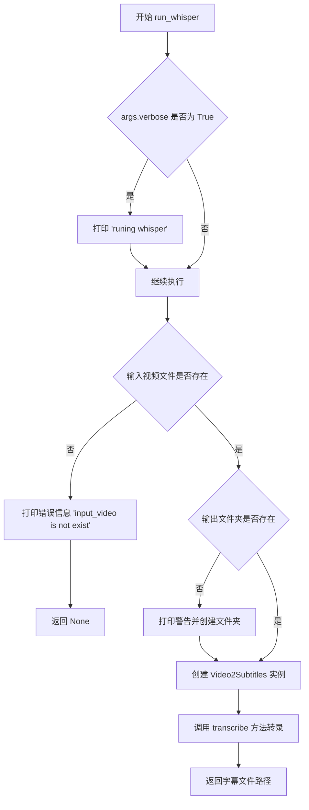
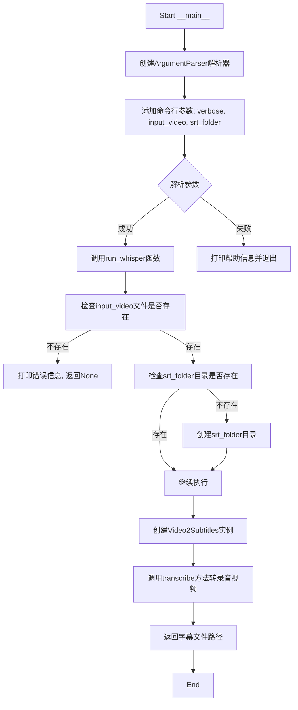
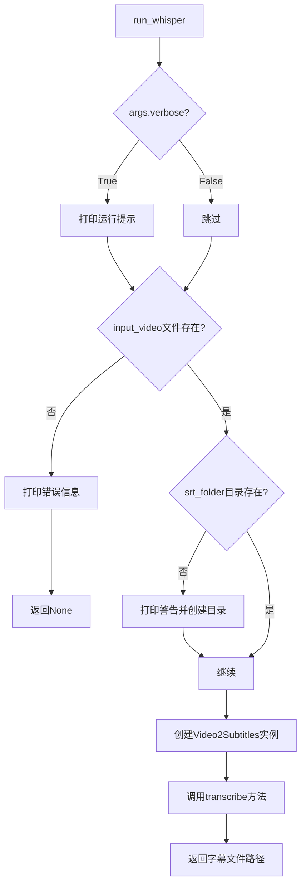
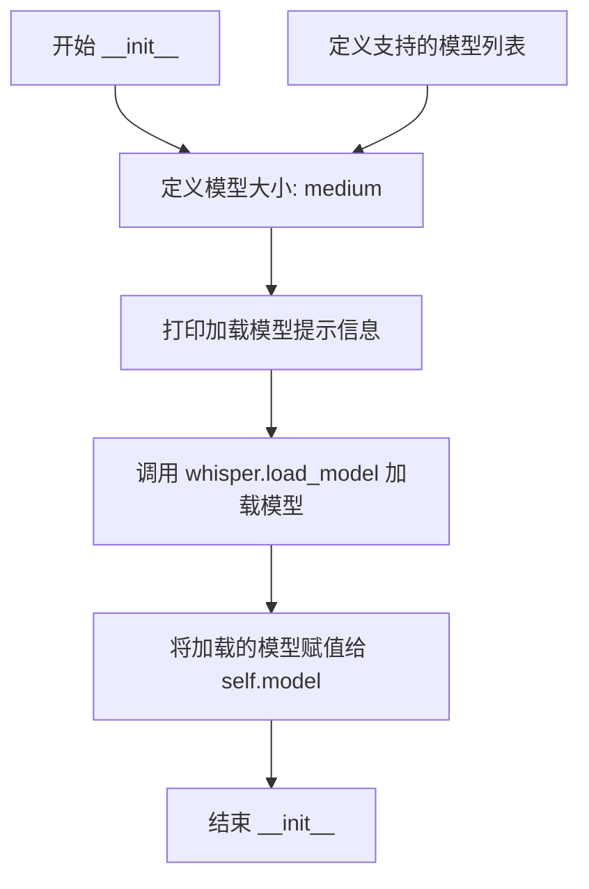
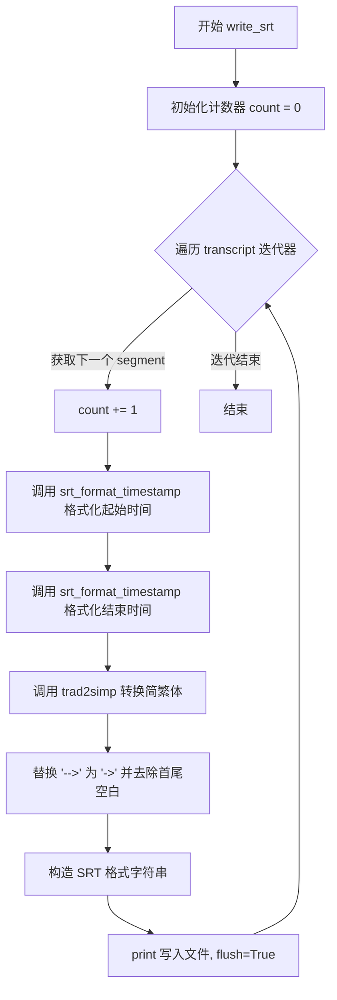
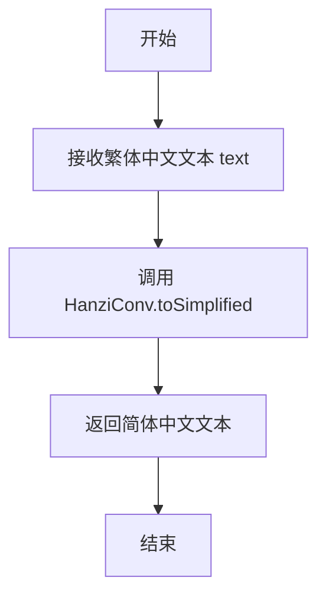
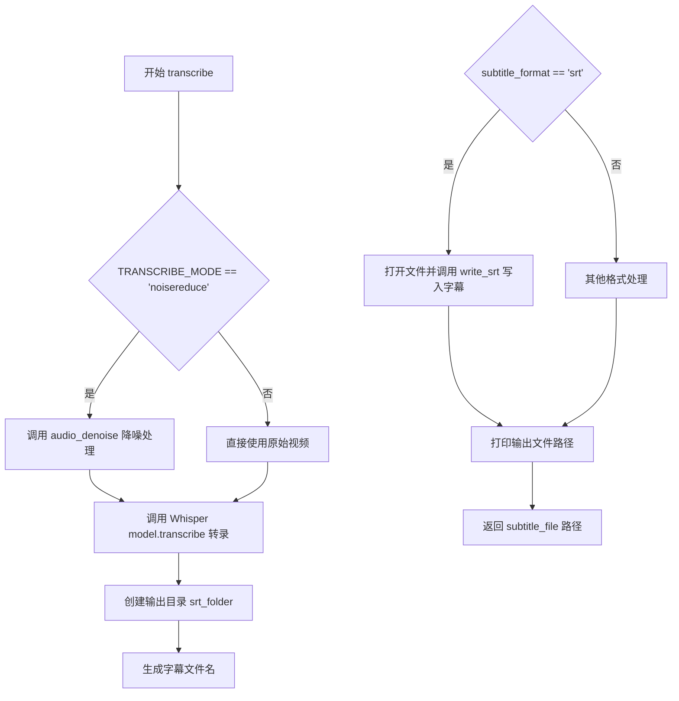
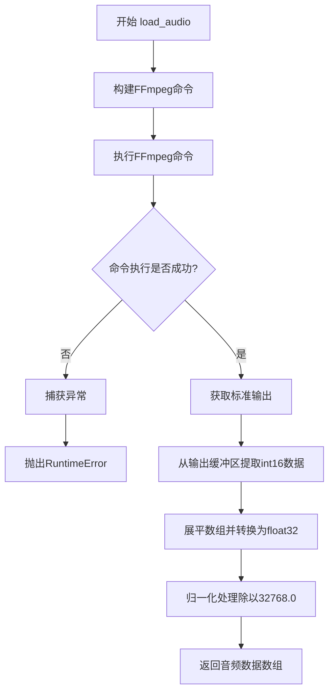
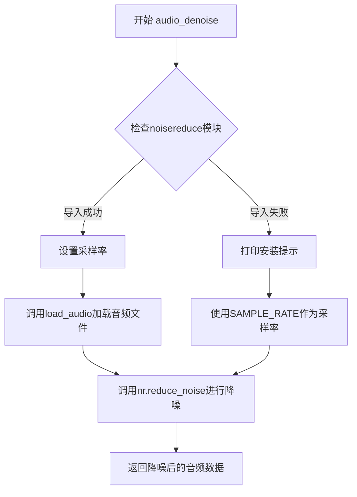

# `Chat-Haruhi-Suzumiya\yuki_builder\run_whisper.py` 详细设计文档

该脚本利用 OpenAI 的 Whisper 模型将视频文件转录为中文字幕文件（SRT格式），集成了简繁体转换功能，并支持基于 noisereduce 的音频降噪处理。

## 整体流程

```mermaid
graph TD
    A[Start: main] --> B[run_whisper]
    B --> C{检查 input_video 是否存在}
    C -- 否 --> D[打印错误并退出]
    C -- 是 --> E{检查 srt_folder 是否存在}
    E -- 否 --> F[创建 srt_folder]
    E -- 是 --> G[实例化 Video2Subtitles]
    G --> H[调用 transcribe(input_video, srt_folder)]
    H --> I{TRANSCRIBE_MODE == 'noisereduce'}
    I -- 是 --> J[调用 audio_denoise (加载音频并降噪)]
    I -- 否 --> K[直接使用 input_video 作为音频源]
    J --> L[调用 Whisper Model.transcribe]
    K --> L
    L --> M[遍历 result['segments']]
    M --> N[调用 trad2simp 转换简繁体]
    N --> O[调用 write_srt 写入文件]
    O --> P[End: 返回 subtitle_file 路径]
```

## 类结构

```
Global Scope (全局作用域)
├── run_whisper (全局函数)
└── Video2Subtitles (类)
    ├── __init__ (加载模型)
    ├── transcribe (主逻辑)
    ├── load_audio (音频处理)
    ├── audio_denoise (降噪)
    ├── write_srt (文件IO)
    ├── srt_format_timestamp (格式转换)
    └── trad2simp (中文简繁转换)
```

## 全局变量及字段


### `DEVICE`
    
CUDA设备或CPU，取决于cuda是否可用

类型：`torch.device`
    


### `SAMPLE_RATE`
    
音频采样率，默认16000

类型：`int`
    


### `TRANSCRIBE_MODE`
    
转录模式，' ' 表示普通转录，'noisereduce' 表示降噪转录

类型：`str`
    


### `MODEL_WHISPER`
    
Whisper模型名称，默认为'medium'

类型：`str`
    


### `WHISPER_MODELS`
    
支持的Whisper模型列表['tiny', 'base', 'small', 'medium', 'large-v1', 'large-v2']

类型：`list`
    


### `subtitle_format`
    
字幕格式，默认为'srt'

类型：`str`
    


### `lang`
    
转录语言，默认为'zh'（中文）

类型：`str`
    


### `verbose`
    
是否输出详细转录信息

类型：`bool`
    


### `input_video_`
    
输入视频路径

类型：`str`
    


### `audio`
    
音频数据或视频路径

类型：`str or np.ndarray`
    


### `result`
    
Whisper转录结果，包含segments等信息

类型：`dict`
    


### `subtitle_file`
    
生成的字幕文件完整路径

类型：`str`
    


### `cmd`
    
ffmpeg命令列表，用于音频提取

类型：`list`
    


### `out`
    
ffmpeg命令输出的二进制数据

类型：`bytes`
    


### `data`
    
音频数据，float32格式

类型：`np.ndarray`
    


### `rate`
    
音频采样率

类型：`int`
    


### `reduced_audio`
    
降噪处理后的音频数据

类型：`np.ndarray`
    


### `args`
    
命令行参数解析结果

类型：`argparse.Namespace`
    


### `input_file`
    
输入视频文件路径

类型：`str`
    


### `srt_folder`
    
输出字幕文件夹路径

类型：`str`
    


### `Video2Subtitles.model`
    
加载后的Whisper模型实例

类型：`whisper.Whisper`
    
    

## 全局函数及方法


### `run_whisper`

该函数是程序的入口函数，负责接收命令行参数，验证输入文件和输出目录，并调用 `Video2Subtitles` 类将视频文件转录为中文字幕文件（SRT 格式）。

参数：

- `args`：`argparse.Namespace`，命令行参数对象，包含以下属性：
  - `verbose`：`bool`，是否打印详细运行信息
  - `input_video`：`str`，输入视频文件的路径
  - `srt_folder`：`str`，输出 SRT 字幕文件的目录路径

返回值：`str` 或 `None`，成功时返回生成的字幕文件路径，失败时返回 `None`（如输入视频不存在）

#### 流程图



#### 带注释源码

```python
def run_whisper(args):
    """
    程序入口函数，负责将视频转录为中文字幕
    
    参数:
        args: 命令行参数对象，包含 verbose, input_video, srt_folder
    返回:
        字幕文件路径或 None
    """
    
    # 如果 verbose 为 True，打印运行提示信息
    if args.verbose:
        print('runing whisper')

    # 检查输入视频文件是否存在
    if not os.path.isfile(args.input_video):
        print('input_video is not exist')
        return
    
    # 检查输出字幕文件夹是否存在
    if not os.path.isdir(args.srt_folder):
        print('warning srt_folder is not exist')
        # 如果不存在则创建输出目录
        os.mkdir(args.srt_folder)
        print('create folder', args.srt_folder)

    # 获取输入视频路径和输出文件夹路径
    input_file = args.input_video
    srt_folder = args.srt_folder
    
    # 创建 Video2Subtitles 实例并调用转录方法
    result = Video2Subtitles().transcribe(input_file, srt_folder)
    return result
```


### `__main__` (隐式主函数)

该脚本为视频转字幕工具，通过OpenAI Whisper模型将视频文件转录为简体中文SRT字幕文件，支持音频降噪功能。

参数：

-  `verbose`：`bool`，是否显示详细运行信息
-  `input_video`：`str`，输入视频文件路径（必需）
-  `srt_folder`：`str`，输出SRT字幕文件的文件夹路径（必需）

返回值：`str`，生成的字幕文件路径，若失败则返回`None`

#### 流程图



#### 带注释源码

```python
# 主入口点 - 当脚本直接运行时执行
if __name__ == '__main__':
    # 创建命令行参数解析器
    # description: 工具描述，说明视频转中文SRT字幕
    # epilog: 作者信息
    parser = argparse.ArgumentParser(
        description='video to chinese srt with medium ',
        epilog='author:Aria(https://github.com/ariafyy)'
    )
    
    # 添加命令行参数
    # verbose: 布尔类型，控制是否输出详细运行信息
    parser.add_argument("verbose", type=bool, action="store")
    
    # input_video: 必选参数，指定输入视频文件路径
    parser.add_argument('--input_video', default='input_file', type=str, required=True, help="video path")
    
    # srt_folder: 必选参数，指定输出字幕文件的目标文件夹
    parser.add_argument('--srt_folder', default='out_folder', type=str, required=True, help="srt path")
    
    # 解析命令行参数
    args = parser.parse_args()
    
    # 打印帮助信息
    parser.print_help()
    
    # 调用核心转录函数，传入解析后的参数
    # 返回值: 生成的字幕文件路径，失败返回None
    run_whisper(args)
```

---

### `run_whisper`

该函数是核心业务逻辑入口，负责参数校验、目录创建以及调用Video2Subtitles类完成转录流程。

参数：

-  `args`：命令行参数对象，包含`verbose`、`input_video`、`srt_folder`属性

返回值：`str`或`None`，成功返回字幕文件路径，失败返回None

#### 流程图



#### 带注释源码

```python
def run_whisper(args):
    """
    核心转录函数
    负责参数校验、目录创建和转录流程调用
    
    参数:
        args: 包含verbose, input_video, srt_folder的命名空间对象
    
    返回:
        str: 成功返回字幕文件路径
        None: 失败返回None
    """
    # 根据verbose参数决定是否打印详细运行信息
    if args.verbose:
        print('runing whisper')

    # 检查输入视频文件是否存在
    if not os.path.isfile(args.input_video):
        print('input_video is not exist')
        return  # 文件不存在，直接返回None
    
    # 检查输出文件夹是否存在
    if not os.path.isdir(args.srt_folder):
        print('warning srt_folder is not exist')
        # 目录不存在则创建
        os.mkdir(args.srt_folder)
        print('create folder', args.srt_folder)

    # 获取输入文件和输出目录
    input_file = args.input_video
    srt_folder = args.srt_folder
    
    # 创建Video2Subtitles实例并调用transcribe方法进行转录
    # 返回生成的字幕文件路径
    result = Video2Subtitles().transcribe(input_file, srt_folder)
    return result
```

---

### `Video2Subtitles`

视频转字幕核心类，封装了Whisper模型加载、音频处理、转录和字幕文件生成功能。

#### 类字段

-  `model`：加载的Whisper模型实例
-  `srt_format_timestamp`：内部方法，用于格式化时间戳
-  `write_srt`：内部方法，用于写入SRT文件
-  `trad2simp`：内部方法，用于繁简转换

#### 类方法

##### `__init__`

构造函数，初始化并加载Whisper模型。

参数：无

返回值：无

```python
def __init__(self):
    MODEL_WHISPER = "medium"  # 使用medium模型，可配置为本地模型路径
    WHISPER_MODELS = ["tiny", "base", "small", "medium", "large-v1", "large-v2"]
    print("---loading model in your local path or downloading now---")
    self.model = whisper.load_model(MODEL_WHISPER)
```

##### `transcribe`

执行视频到字幕的转录核心方法。

参数：

-  `input_video`：`str`，输入视频文件路径
-  `srt_folder`：`str`，输出字幕文件夹路径

返回值：`str`，生成的SRT字幕文件路径

```python
def transcribe(self, input_video: str, srt_folder: str):
    subtitle_format = "srt"
    lang = "zh"
    verbose = True
    DEVICE = torch.cuda.is_available()
    model = self.model
    input_video_ = input_video if isinstance(input_video, str) else input_video.name
    if TRANSCRIBE_MODE == 'noisereduce':
        audio = self.audio_denoise(input_video_)
    else:
        audio = input_video_
    result = model.transcribe(
        audio=audio,
        task="transcribe",
        language=lang,
        verbose=verbose,
        initial_prompt=None,
        word_timestamps=True,
        no_speech_threshold=0.95,
        fp16=DEVICE
    )
    os.makedirs(srt_folder, exist_ok=True)
    subtitle_file = srt_folder + "/" + pathlib.Path(input_video).stem + "." + subtitle_format
    if subtitle_format == "srt":
        with open(subtitle_file, "w") as srt:
            self.write_srt(result["segments"], file=srt)
    print("\nsubtitle_file:", subtitle_file, "\n")
    return subtitle_file
```

---

## 整体设计文档

### 1. 核心功能概述

该代码实现了一个视频转字幕工具，通过OpenAI Whisper模型将视频文件转录为简体中文SRT格式字幕文件，支持可选的音频降噪功能。

### 2. 文件运行流程

```
1. 脚本入口 (__main__)
   ↓
2. ArgumentParser解析命令行参数
   ↓
3. run_whisper函数
   ├─ 检查输入文件存在性
   ├─ 确保输出目录存在
   └─ 创建Video2Subtitles实例
   ↓
4. Video2Subtitles.transcribe方法
   ├─ 加载音频/降噪处理
   ├─ 调用Whisper模型转录
   └─ 生成SRT字幕文件
   ↓
5. 返回字幕文件路径
```

### 3. 全局变量与配置

| 名称 | 类型 | 描述 |
|------|------|------|
| `DEVICE` | `torch.device` | 计算设备，优先使用CUDA |
| `SAMPLE_RATE` | `int` | 音频采样率，默认16000 |
| `TRANSCRIBE_MODE` | `str` | 转录模式，''或'noisereduce' |

### 4. 关键组件信息

- **Video2Subtitles类**：核心转录类，封装Whisper模型和字幕生成逻辑
- **run_whisper函数**：命令行入口的桥接函数，负责参数校验
- **load_audio方法**：使用ffmpeg提取视频音频
- **audio_denoise方法**：使用noisereduce库进行降噪
- **trad2simp方法**：繁体中文转简体中文

### 5. 技术债务与优化空间

1. **硬编码模型名称**：`MODEL_WHISPER = "medium"` 应改为可配置参数
2. **全局变量滥用**：TRANSCRIBE_MODE、SAMPLE_RATE应为类或函数参数
3. **异常处理不完善**：load_audio和audio_denoise的错误处理可以更详细
4. **路径拼接**：`srt_folder + "/" +` 应使用`os.path.join()`以提高跨平台兼容性
5. **GPU内存优化**：未设置batch size和内存清理机制
6. **类型提示不完整**：部分方法缺少返回类型注解

### 6. 外部依赖与接口

- ** whisper**：OpenAI Whisper模型
- ** torch**：深度学习框架
- ** noisereduce**：音频降噪库
- ** hanziconv**：繁简转换
- ** ffmpeg**：音频提取（需系统安装）

### 7. 错误处理设计

- 输入文件不存在：打印错误信息并返回None
- 输出目录不存在：自动创建目录
- ffmpeg调用失败：抛出RuntimeError
- 依赖库未安装：提示安装命令
- 模型加载失败：whisper库内部处理


### `Video2Subtitles.__init__`

该方法是`Video2Subtitles`类的构造函数，负责初始化实例并加载Whisper语音识别模型。在实例化时自动加载指定大小的Whisper模型（默认为medium模型），为后续的视频转字幕功能提供模型支持。

参数：

- `self`：隐式参数，当前实例对象

返回值：`None`，构造函数不返回任何值

#### 流程图



#### 带注释源码

```python
def __init__(self):
    """
    构造函数，初始化Video2Subtitles实例并加载Whisper模型
    """
    # 定义要加载的Whisper模型大小，可选值为: tiny, base, small, medium, large-v1, large-v2
    # 当前设置为中等大小模型，在精度和速度之间取得平衡
    MODEL_WHISPER = "medium"  # or your local model_path
    
    # 定义Whisper支持的所有模型规格列表
    WHISPER_MODELS = ["tiny", "base", "small", "medium", "large-v1", "large-v2"]
    
    # 打印提示信息，告知用户模型正在加载或下载
    print("---loading model in your local path or downloading now---")
    
    # 调用whisper库的load_model方法加载指定大小的模型
    # 模型会被加载到self.model属性中，供后续transcribe方法使用
    self.model = whisper.load_model(MODEL_WHISPER)
```


### Video2Subtitles.srt_format_timestamp

将给定的秒数转换为SRT字幕格式的时间戳字符串（格式：HH:MM:SS,mmm），用于生成符合SRT字幕规范的时间轴标记。

参数：

- `seconds`：`float`，表示要转换的秒数，必须为非负数

返回值：`str`，返回符合SRT格式的时间戳字符串，格式为 "小时:分钟:秒,毫秒"（例如 "00:01:23,456"）

#### 流程图

```mermaid
flowchart TD
    A[开始 srt_format_timestamp] --> B{seconds >= 0?}
    B -->|否| C[抛出 AssertionError]
    B -->|是| D[将秒转换为毫秒: milliseconds = round(seconds * 1000)]
    D --> E[计算小时: hours = milliseconds // 3_600_000]
    E --> F[计算剩余毫秒并赋值回 milliseconds]
    F --> G[计算分钟: minutes = milliseconds // 60_000]
    G --> H[计算剩余毫秒并赋值回 milliseconds]
    H --> I[计算秒: seconds = milliseconds // 1_000]
    I --> J[计算剩余毫秒: milliseconds -= seconds * 1_000]
    J --> K[格式化输出字符串: hours:minutes:seconds,milliseconds]
    K --> L[结束, 返回字符串]
```

#### 带注释源码

```python
def srt_format_timestamp(self, seconds: float):
    """
    将秒数转换为SRT字幕格式的时间戳
    
    SRT时间戳格式: HH:MM:SS,mmm
    例如: 01:23:45,678 表示1小时23分45秒678毫秒
    
    Args:
        seconds: float, 输入的秒数（可以为浮点数）
        
    Returns:
        str: 格式化后的SRT时间戳字符串
    """
    # 断言检查：确保输入的秒数为非负数
    # SRT格式不支持负时间戳
    assert seconds >= 0, "non-negative timestamp expected"
    
    # 将秒数转换为毫秒（乘以1000并四舍五入）
    # SRT格式需要精确到毫秒级别
    milliseconds = round(seconds * 1000.0)
    
    # 计算小时数
    # 1小时 = 3,600,000 毫秒
    hours = milliseconds // 3_600_000
    
    # 从总毫秒数中减去已计算的小时部分
    milliseconds -= hours * 3_600_000
    
    # 计算分钟数
    # 1分钟 = 60,000 毫秒
    minutes = milliseconds // 60_000
    
    # 从剩余毫秒数中减去已计算的分钟部分
    milliseconds -= minutes * 60_000
    
    # 计算秒数
    # 1秒 = 1,000 毫秒
    seconds = milliseconds // 1_000
    
    # 从剩余毫秒数中减去已计算的秒部分，得到最终的毫秒数
    milliseconds -= seconds * 1_000
    
    # 格式化输出为SRT标准时间戳格式
    # :02d 表示至少2位数字，不足前面补0
    # :03d 表示至少3位数字，不足前面补0
    return (f"{hours}:") + f"{minutes:02d}:{seconds:02d},{milliseconds:03d}"
```


### `Video2Subtitles.write_srt`

该方法负责将Whisper模型转录得到的段落迭代器转换为标准SRT字幕格式，写入目标文件。方法内部调用时间戳格式化方法将秒数转换为SRT时间格式（时:分:秒,毫秒），同时将繁体中文转换为简体中文，并处理特殊字符替换。

参数：

- `transcript`：`Iterator[dict]`，转录段落迭代器，每个元素为包含`start`（起始时间秒）、`end`（结束时间秒）、`text`（转录文本）键的字典
- `file`：`TextIO`，已打开的SRT格式输出文件对象

返回值：`None`，该方法直接向文件写入内容，无返回值

#### 流程图



#### 带注释源码

```python
def write_srt(self, transcript: Iterator[dict], file: TextIO):
    """
    将转录结果迭代器写入 SRT 格式文件
    
    参数:
        transcript: Iterator[dict], 包含多个段落的迭代器,
                    每个段落字典需包含 'start', 'end', 'text' 键
        file: TextIO, 已打开待写入的文件对象
    
    返回:
        None, 直接写入文件不返回任何值
    """
    count = 0  # 段落计数器,用于记录SRT字幕序号(当前未被使用)
    
    # 遍历转录段落迭代器
    for segment in transcript:
        count += 1  # 序号累加
        
        # 格式化时间戳: 将秒数转换为 SRT 格式 "HH:MM:SS,mmm"
        start_time = self.srt_format_timestamp(segment['start'])
        end_time = self.srt_format_timestamp(segment['end'])
        
        # 将繁体中文转换为简体中文
        text_content = self.trad2simp(segment['text'])
        
        # SRT格式: 时间戳行 + 文本行 + 空行
        # 替换 '-->' 为 '->' 防止SRT解析问题,并去除首尾空白
        print(
            f"{start_time} --> {end_time}\n"
            f"{text_content.replace('-->', '->').strip()}\n",
            file=file,      # 写入目标文件对象
            flush=True,     # 立即刷新缓冲区确保写入
        )
```


### `Video2Subtitles.trad2simp`

该方法用于将繁体中文文本转换为简体中文文本，通过调用 `HanziConv.toSimplified` 函数实现简繁体转换功能。

参数：

- `text`：`str`，需要转换的繁体中文文本

返回值：`str`，转换后的简体中文文本

#### 流程图



#### 带注释源码

```python
def trad2simp(self,text):
    """
    # traditional chinese into simplified chinese
    :param text: 传入的繁体中文文本
    :return: 转换后的简体中文文本
    """
    # 使用 HanziConv 库将繁体中文转换为简体中文
    simp = HanziConv.toSimplified(text)
    # 返回转换后的简体中文结果
    return simp
```


### Video2Subtitles.transcribe

该方法是`Video2Subtitles`类的核心方法，负责将视频文件转录为中文字幕文件（SRT格式），通过调用OpenAI Whisper模型进行语音识别，并支持可选的降噪处理。

参数：

- `input_video`：`str`，输入视频文件的路径或文件对象
- `srt_folder`：`str`，输出SRT字幕文件的存储目录

返回值：`str`，生成的字幕文件路径

#### 流程图



#### 带注释源码

```python
def transcribe(self, input_video: str, srt_folder: str):
    """
    将视频转录为中文字幕文件（SRT格式）
    :param input_video: 输入视频文件路径或文件对象
    :param srt_folder: 输出字幕文件的目录
    :return: 生成的字幕文件完整路径
    """
    # 字幕格式固定为SRT
    subtitle_format = "srt"
    # 设置语言为简体中文
    lang = "zh"
    # 是否输出详细信息
    verbose = True
    # 检测CUDA是否可用
    DEVICE = torch.cuda.is_available()
    # 获取已加载的Whisper模型
    model = self.model
    
    # 统一处理输入：如果是文件对象则获取其name属性，否则直接使用字符串路径
    input_video_ = input_video if isinstance(input_video, str) else input_video.name
    
    # 根据TRANSCRIBE_MODE决定是否进行降噪处理
    if TRANSCRIBE_MODE == 'noisereduce':
        # 调用音频降噪方法处理
        audio = self.audio_denoise(input_video_)
    else:
        # 直接使用原始视频文件路径
        audio = input_video_
    
    # 调用Whisper模型进行语音识别转录
    result = model.transcribe(
        audio=audio,              # 音频数据（降噪后或原始路径）
        task="transcribe",        # 任务类型：转录而非翻译
        language=lang,            # 语言：中文
        verbose=verbose,          # 是否打印详细进度信息
        initial_prompt=None,      # 初始提示词（无）
        word_timestamps=True,     # 启用词级时间戳
        no_speech_threshold=0.95,# 无语音判定阈值
        fp16=DEVICE               # 是否使用FP16加速
    )
    
    # 确保输出目录存在，不存在则创建
    os.makedirs(srt_folder, exist_ok=True)
    
    # 构建输出字幕文件的完整路径：目录/文件名+时间戳.srt
    subtitle_file = srt_folder + "/" + pathlib.Path(input_video).stem + "." + subtitle_format
    
    # 判断字幕格式并写入文件
    if subtitle_format == "srt":
        # 打开文件并写入字幕内容
        with open(subtitle_file, "w") as srt:
            # 调用write_srt方法将转录结果写入SRT文件
            self.write_srt(result["segments"], file=srt)
    
    # 打印生成的字幕文件路径供用户确认
    print("\nsubtitle_file:", subtitle_file, "\n")
    
    # 返回生成的字幕文件路径
    return subtitle_file
```


### `Video2Subtitles.load_audio`

该方法使用FFmpeg命令行工具将视频或音频文件转换为PCM格式的原始音频数据，并将其转换为NumPy float32数组格式返回，供后续 Whisper 模型进行语音识别处理。

参数：

- `file`：`str`，输入的音视频文件路径
- `sr`：`int`，采样率，默认为 `SAMPLE_RATE`（16000 Hz）

返回值：`numpy.ndarray`，返回归一化的float32类型音频数据数组，值域范围为[-1.0, 1.0]

#### 流程图



#### 带注释源码

```python
def load_audio(self, file: str, sr: int = SAMPLE_RATE):
    """
    Requires the ffmpeg CLI in PATH.
    fmt: off
    """
    # 构建FFmpeg命令参数列表
    # -nostdin: 禁用交互式输入
    # -threads 0: 自动选择线程数
    # -i file: 输入文件路径
    # -f s16le: 输出格式为16位有符号小端整型
    # -ac 1: 单声道
    # -acodec pcm_s16le: 使用PCM 16位有符号小端编码
    # -ar str(sr): 设置采样率
    # -: 输出到标准输出
    cmd = [
        "ffmpeg",
        "-nostdin",
        "-threads", "0",
        "-i", file,
        "-f", "s16le",
        "-ac", "1",
        "-acodec", "pcm_s16le",
        "-ar", str(sr),
        "-"
    ]
    # fmt: on
    
    # 使用subprocess.run执行FFmpeg命令
    # capture_output=True: 捕获stdout和stderr
    # check=True: 如果返回码非零则抛出CalledProcessError
    try:
        out = run(cmd, capture_output=True, check=True).stdout
    except CalledProcessError as e:
        # FFmpeg执行失败时抛出RuntimeError，包含错误信息
        raise RuntimeError(f"Failed to load audio: {e.stderr.decode()}") from e
    
    # 从二进制输出构建NumPy数组
    # np.int16: 解析16位有符号整数
    # flatten(): 将数据展平为一维数组
    # astype(np.float32): 转换为32位浮点数
    # /32768.0: 归一化到[-1.0, 1.0]范围
    data = np.frombuffer(out, np.int16).flatten().astype(np.float32) / 32768.0
    return data
```


### `Video2Subtitles.audio_denoise`

该方法用于对输入的音频文件进行降噪处理，通过调用noisereduce库减少音频中的背景噪音，提高语音识别的准确性。

参数：

- `input_audio`：`str`，输入的音频文件路径

返回值：`numpy.ndarray`，降噪处理后的音频数据

#### 流程图



#### 带注释源码

```python
def audio_denoise(self, input_audio: str, ):
    """
    # reduce noise
    # 对音频进行降噪处理
    """
    # 尝试导入降噪库，如果未安装则提示用户
    try:
        import noisereduce as nr
    except ImportError:
        # 打印安装提示，指导用户安装依赖
        print("pip install noisereduce")
    
    # 设置音频采样率，使用全局常量16000
    rate = SAMPLE_RATE
    
    # 调用类内部的load_audio方法加载音频文件
    data = self.load_audio(input_audio)
    
    # 使用noisereduce库的reduce_noise函数进行降噪处理
    # y: 输入音频数据, sr: 采样率
    reduced_audio = nr.reduce_noise(y=data, sr=rate)
    
    # 返回降噪处理后的音频数据
    return reduced_audio
```

## 关键组件


### Video2Subtitles 类

核心转录类，封装视频到字幕的完整转换流程，包含模型加载、音频处理、繁简转换和时间戳格式化功能。

### Whisper 模型加载

使用 whisper.load_model() 加载 medium 规模的 Whisper 模型，用于语音识别任务。

### transcribe 方法

将输入视频文件转录为字幕文本，调用 Whisper 模型进行语音识别，支持中文字识别和词级时间戳输出。

### write_srt 方法

将转录结果写入 SRT 格式字幕文件，包含时间戳格式化、繁简转换和文本清洗。

### srt_format_timestamp 方法

将秒数转换为 SRT 格式的时间戳（HH:MM:SS,mmm），用于字幕文件的时间轴。

### trad2simp 方法

使用 HanziConv 库将繁体中文转换为简体中文，实现中文简繁转换功能。

### load_audio 方法

通过 ffmpeg 命令行工具从视频中提取音频，转换为 16kHz 采样率的单声道 PCM 数据。

### audio_denoise 方法

使用 noisereduce 库对音频进行降噪处理，减少背景噪声对语音识别的影响。

### run_whisper 函数

主入口函数，负责命令行参数解析、输入输出路径验证和流程编排。

### 命令行参数解析

使用 argparse 模块解析 --input_video 和 --srt_folder 参数，支持verbose模式控制。

### 全局配置变量

包含 DEVICE（CUDA设备）、SAMPLE_RATE（16000Hz）、TRANSCRIBE_MODE（转录模式）和 WHISPER_MODELS（支持的模型列表）等配置。


## 问题及建议


### 已知问题

-   **全局变量TRANSCRIBE_MODE配置错误**：全局变量TRANSCRIBE_MODE = ' '（空格字符串），而非预期的'noisereduce'，导致降噪功能永远不会执行，代码中的条件判断`if TRANSCRIBE_MODE == 'noisereduce'`永远为False
-   **DEVICE变量重复定义与不一致**：全局定义了`DEVICE = torch.device("cuda" if torch.cuda.is_available() else "cpu")`，但在transcribe方法内部又重新定义`DEVICE = torch.cuda.is_available()`（布尔值），导致fp16参数接收到的是布尔值而非设备对象
-   **bool类型参数解析错误**：使用`parser.add_argument("verbose", type=bool, action="store")`无法正确解析布尔值，action="store"会将其作为字符串处理，且bool("False")仍返回True
-   **硬编码模型配置**：MODEL_WHISPER = "medium"硬编码在类中，无法通过命令行参数指定模型大小
-   **路径拼接方式不规范**：使用字符串拼接`subtitle_file = srt_folder + "/" + pathlib.Path(input_video).stem + "." + subtitle_format`，应使用os.path.join确保跨平台兼容性
-   **降噪模块异常处理不完善**：audio_denoise方法中import noisereduce失败仅打印警告，未抛出异常或返回原始音频，导致后续处理可能失败
-   **缺少日志模块**：使用print进行输出，未使用标准的logging模块，不利于生产环境日志管理
-   **资源未正确释放**：Video2Subtitles类实例化后模型一直加载在内存中，未提供显式的模型卸载方法

### 优化建议

-   **修正TRANSCRIBE_MODE配置**：根据需求将TRANSCRIBE_MODE设置为'noisereduce'或通过命令行参数传入
-   **统一DEVICE变量使用**：移除transcribe方法内的局部DEVICE定义，直接使用全局DEVICE变量，或传入设备参数
-   **修复bool参数解析**：将`action="store"`改为`action="store_true"`，并调整参数顺序到可选参数中
-   **添加模型参数选项**：通过argparser添加--model参数，允许用户指定Whisper模型大小
-   **使用os.path.join拼接路径**：将`subtitle_file = srt_folder + "/" + ...`改为`subtitle_file = os.path.join(srt_folder, pathlib.Path(input_video).stem + "." + subtitle_format)`
-   **完善降噪异常处理**：在audio_denoise中添加异常处理逻辑，import失败时打印警告并返回原始音频或抛出明确异常
-   **引入日志记录**：使用logging模块替代print，设置不同日志级别便于调试和生产环境切换
-   **添加模型管理接口**：提供load_model和unload_model方法，支持模型热加载和卸载以释放资源
-   **添加类型注解**：为缺少类型注解的变量添加类型提示，提高代码可读性和IDE支持

## 其它


### 设计目标与约束

本项目旨在将视频文件通过OpenAI Whisper模型自动转录为中文字幕文件(.srt格式)，支持繁体中文转简体中文、音频降噪等功能。约束条件包括：1) 依赖FFmpeg进行音频提取；2) 需要足够的GPU显存运行Whisper medium模型；3) 仅支持Python 3.8+环境。

### 错误处理与异常设计

代码中包含以下错误处理机制：1) `load_audio`方法捕获`CalledProcessError`并抛出`RuntimeError`；2) 入口函数`run_whisper`检查输入文件存在性和输出目录有效性；3) 音频降噪模块捕获`ImportError`并提示安装。但存在改进空间：模型加载失败、Whisper转录异常、文件读写异常等场景缺乏异常捕获。

### 数据流与状态机

数据流：输入视频 → FFmpeg音频提取 → (可选)降噪处理 → Whisper模型转录 → 字幕格式化 → SRT文件输出。状态机涉及：文件验证态 → 音频加载态 → 模型推理态 → 结果写入态。

### 外部依赖与接口契约

核心依赖：1) `whisper` - 语音识别模型；2) `torch` - 深度学习框架；3) `ffmpeg` - 音视频处理(需系统安装)；4) `hanziconv` - 繁简转换；5) `noisereduce` - 降噪(可选)。接口契约：命令行参数`input_video`(必填)和`srt_folder`(必填)，返回生成的字幕文件路径。

### 配置与参数说明

关键配置项：1) `MODEL_WHISPER = "medium"` - Whisper模型大小；2) `TRANSCRIBE_MODE` - 转录模式(' '或'noisereduce')；3) `SAMPLE_RATE = 16000` - 音频采样率；4) `lang = "zh"` - 识别语言；5) `no_speech_threshold=0.95` - 无语音阈值。

### 性能考虑

1) 模型加载耗时较长，建议全局单例复用`Video2Subtitles`实例；2) GPU转录比CPU快数倍，通过`DEVICE`变量自动检测；3) 音频降噪会显著增加处理时间；4) 大视频文件需要足够内存存储中间音频数据。

### 安全性考量

1) 命令行参数未做严格校验，可能存在路径遍历风险；2) 生成的字幕文件覆盖时无确认机制；3) 使用`subprocess`调用FFmpeg需注意命令注入防护。

### 测试建议

建议补充：1) 单元测试覆盖`srt_format_timestamp`和`trad2simp`方法；2) 集成测试验证完整转录流程；3) 边界测试(空文件、无声视频、超长视频)；4) 异常场景测试(FFmpeg不可用、模型加载失败)。

    