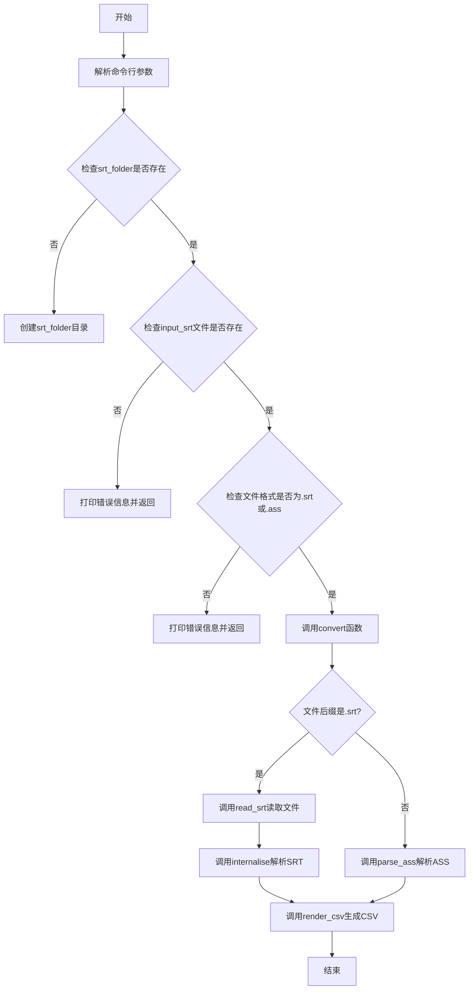
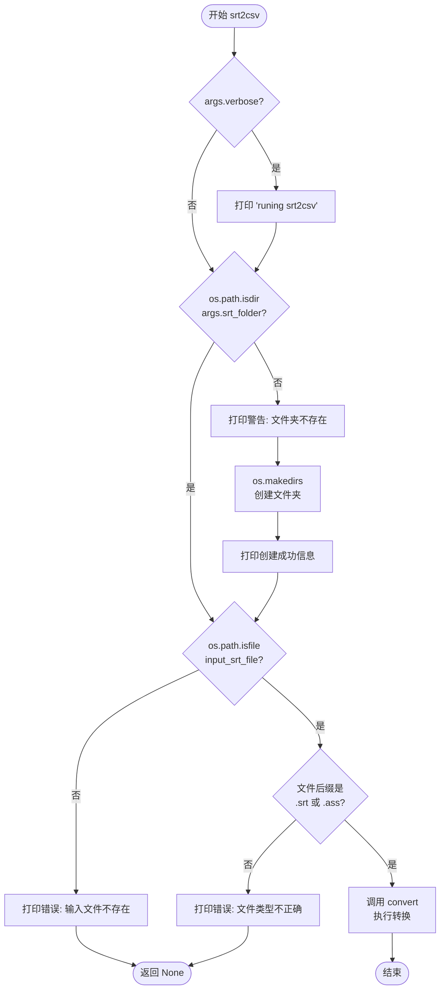
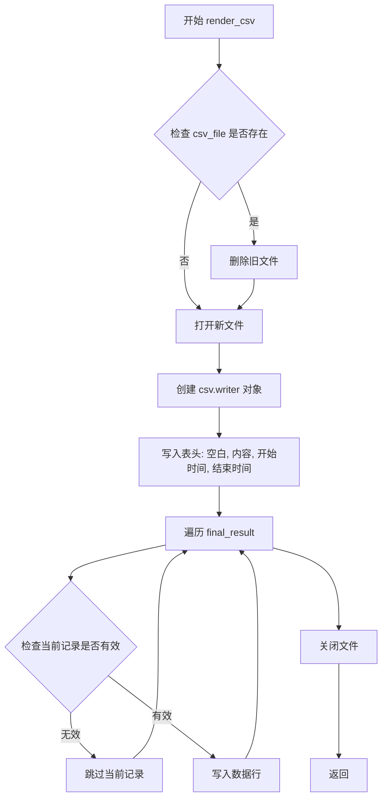
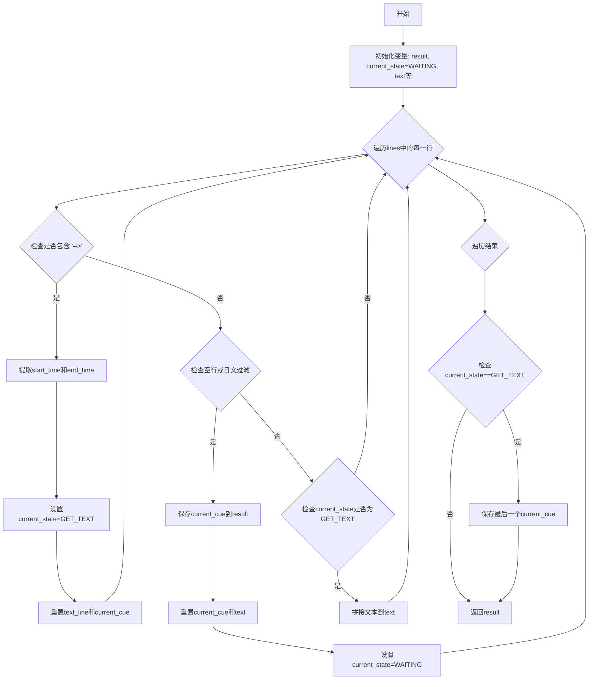
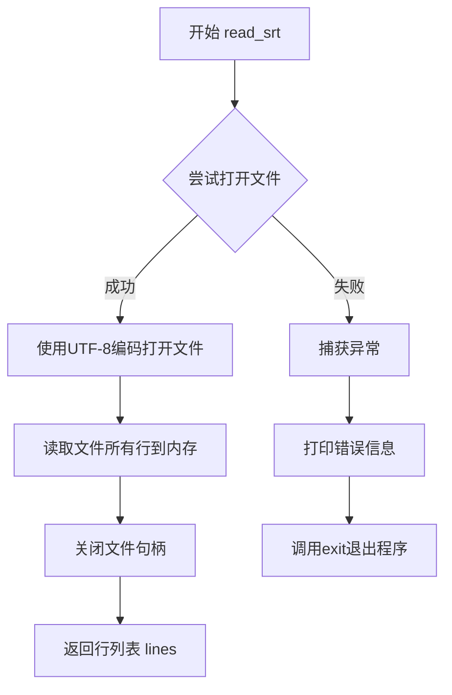
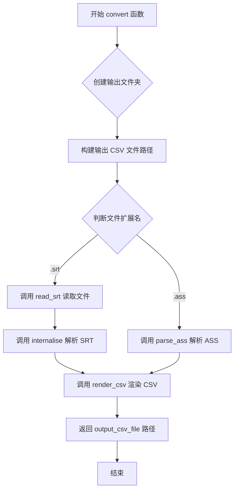

# `Chat-Haruhi-Suzumiya\yuki_builder\srt2csv.py` 详细设计文档

该脚本用于将 .srt 或 .ass 格式的字幕文件转换为4列CSV文件（空白、内容、开始时间、结束时间），支持日文字符过滤功能。

## 整体流程



## 类结构

```
无类定义（脚本为主）
全局函数: srt2csv, render_csv, is_japenese, internalise, read_srt, parse_ass, convert
```

## 全局变量及字段


### `HAS_CHINESE`
    
全局标志变量，当前未使用

类型：`bool`
    


    

## 全局函数及方法


### `srt2csv(args)`

`srt2csv` 是整个程序的主入口函数，负责接收命令行参数、验证输入输出路径的有效性、检查文件类型是否为支持的 `.srt` 或 `.ass` 格式，并在所有检查通过后调用 `convert` 函数执行实际的字幕到 CSV 的转换操作。

参数：

-  `args`：`argparse.Namespace`，包含从命令行解析的所有参数对象，其中 `args.verbose` 控制是否输出详细日志，`args.srt_folder` 指定输出 CSV 文件的目标文件夹路径，`args.input_srt` 指定输入的字幕文件路径

返回值：`None`，该函数没有显式返回值（隐式返回 `None`），若输入文件不存在或格式不正确则直接返回

#### 流程图



#### 带注释源码

```python
def srt2csv(args):
    """
    主入口函数，处理命令行参数并进行转换前的检查
    
    参数:
        args: 包含以下属性的argparse.Namespace对象
            - verbose: bool, 是否输出详细日志
            - srt_folder: str, 输出CSV文件的目录路径
            - input_srt: str, 输入的.srt或.ass字幕文件路径
    """
    # 根据verbose参数决定是否输出运行日志
    if args.verbose:
        print('runing srt2csv')

    # 检查输出文件夹是否存在
    # 如果不存在则创建该文件夹
    if not os.path.isdir(args.srt_folder):
        print('warning: the folder{} is not exist'.format(args.srt_folder))
        # create srt_folder
        os.makedirs(args.srt_folder)
        print('create folder', args.srt_folder)

    # 获取输入文件和输出文件夹的路径
    input_srt_file = args.input_srt
    output_folder = args.srt_folder
    
    # 检查输入文件是否存在
    if not os.path.isfile(input_srt_file):
        print('Error: The input file {} is not exist'.format(input_srt_file))
        # 输入文件不存在，直接返回，不继续执行
        return
    
    # 检查输入文件是否为支持的格式(.srt或.ass)
    # 使用pathlib获取文件后缀进行判断
    if not (pathlib.Path(input_srt_file).suffix == '.srt' or pathlib.Path(input_srt_file).suffix == '.ass'):
        print('Error: The input file {} must be a .srt or .ass file'.format(input_srt_file))
        # 文件格式不支持，直接返回
        return
    
    # 所有检查通过后，调用convert函数执行转换
    # 第三个参数True表示保留日文字幕
    convert(input_srt_file, output_folder, True)
```


### `render_csv`

将解析后的字幕数据写入CSV文件，如果目标文件已存在则先删除再创建新文件，确保输出格式为4列（空白、内容、开始时间、结束时间）。

参数：

- `final_result`：`List[Dict]`，解析后的字幕结果列表，每个字典包含 "Text"、"TimecodeIn"、"TimecodeOut" 字段
- `csv_file`：`str`，输出CSV文件的路径

返回值：`None`，该函数没有返回值

#### 流程图



#### 带注释源码

```python
def render_csv(final_result, csv_file):
    # 检查目标CSV文件是否已存在，若存在则删除旧文件
    if os.path.exists(csv_file):
        os.remove(csv_file)
    
    # 打开文件并创建csv写入器，使用UTF-8编码，newline=''防止空行
    with open(csv_file, 'w', newline='', encoding='utf-8') as file:
        writer = csv.writer(file)
        # 写入CSV表头：空白、内容、开始时间、结束时间
        writer.writerow(["空白", "内容", "开始时间", "结束时间"])
        
        # 遍历每一条字幕记录
        for i in final_result:
            # 检查记录是否完整（必须包含Text、TimecodeIn、TimecodeOut）
            if not (i["Text"] and i["TimecodeIn"] and i["TimecodeOut"]):
                # 如果缺少必要字段，跳过该记录
                continue
            # 写入一行数据：空白列留空，内容为字幕文本，开始结束时间为时间码
            writer.writerow(['', i["Text"], i["TimecodeIn"], i["TimecodeOut"]])
    
    # 函数执行完毕返回（默认返回None）
    return
```


### `is_japenese`

该函数用于检测输入的文本行是否包含日文字符（平假名或片假名），通过Unicode正则表达式匹配日文字符范围来判断。

参数：
-  `line`：`str`，需要检测的文本行

返回值：`bool`，如果输入行包含日文平假名或片假名返回True，否则返回False

#### 流程图

```mermaid
flowchart TD
    A[开始 is_japenese] --> B[编译片假名正则 u"\u30a0-\u30ff"]
    B --> C[编译平假名正则 u"\u3040-\u309f"]
    C --> D[在line中搜索片假名]
    D --> E{找到片假名?}
    E -->|是| I[返回True]
    E -->|否| F[在line中搜索平假名]
    F --> G{找到平假名?}
    G -->|是| I
    G -->|否| H[返回False]
    I --> J[结束]
    H --> J
```

#### 带注释源码

```python
def is_japenese(line):
    """
    检测给定行是否包含日文字符（平假名或片假名）
    
    参数:
        line: str, 需要检测的文本行
        
    返回值:
        bool, 如果包含日文返回True，否则返回False
    """
    #unicode japanese katakana (片假名范围: \u30a0-\u30ff)
    re_words_1 = re.compile(u"[\u30a0-\u30ff]+") 
    #unicode japanese hiragana (平假名范围: \u3040-\u309f)
    re_words_2 = re.compile(u"[\u3040-\u309f]+") 
    # 在输入行中搜索片假名
    m_1 = re_words_1.search(line, 0) 
    # 在输入行中搜索平假名
    m_2 = re_words_2.search(line, 0) 
    # 如果找到片假名或平假名任意一种，则返回True
    if m_1 or m_2:
        # print(line)
        return True
    return False
```


### `internalise`

该函数用于解析SRT字幕文件内容，通过逐行处理提取时间码和对应的文本内容，支持根据参数过滤日文字符，最终返回包含时间码和文本的字典列表。

参数：

- `lines`：`list[str]`，SRT文件的行内容列表，每行是一个字符串
- `keep_japanese`：`bool`，是否保留日文字符；为True时保留日文，为False时过滤掉包含日文的行

返回值：`list[dict]`，返回字典列表，每个字典包含`TimecodeIn`（开始时间）、`TimecodeOut`（结束时间）和`Text`（文本内容）三个键

#### 流程图



#### 带注释源码

```python
def internalise(lines, keep_japanese):
    """
    解析SRT文件内容，提取时间码和文本
    
    参数:
        lines: SRT文件的行列表
        keep_japanese: 是否保留日文字符，True保留，False过滤
    
    返回:
        包含TimecodeIn、TimecodeOut、Text的字典列表
    """
    result = []                           # 存储最终结果的列表
    GET_TEXT = 1                         # 获取文本内容的状态码
    WAITING = 2                          # 等待时间码的状态码
    cue = 0                              # 字幕序号计数器
    current_state = WAITING              # 初始状态为等待
    start_time = ""                      # 当前字幕开始时间
    prev_start_time = ""                 # 上一条字幕开始时间（已注释）
    prev_end_time = ""                   # 上一条字幕结束时间（已注释）
    end_time = ""                        # 当前字幕结束时间
    text = ""                            # 当前字幕的文本内容
    text_line = 0                        # 文本行计数
    current_cue = {}                     # 当前字幕条目字典
    
    # 遍历SRT文件的每一行
    for line in lines:
        line = line.strip()              # 去除行首尾空格
        
        # 检测时间码行（格式：00:00:00,000 --> 00:00:00,000）
        if "-->" in line:
            cue += 1                     # 字幕序号加1
            # 提取开始时间
            start_time = line.split('-->')[0].strip()
            # 提取结束时间
            end_time = line.split('-->')[1].strip()
            
            # 注释：去重逻辑（已注释）
            # if start_time == prev_start_time and end_time == prev_end_time:
            #     continue
            # prev_start_time = start_time
            # prev_end_time = end_time
            
            # 状态切换为获取文本
            current_state = GET_TEXT
            text_line = 0                # 重置文本行计数
            
            # 保存时间码到当前字幕条目
            current_cue["TimecodeIn"] = start_time
            current_cue["TimecodeOut"] = end_time
            continue
        
        # 检测空行或需要过滤的日文行
        if line == "" or (is_japenese(line) and not keep_japanese):
            # 保存当前文本到字幕条目
            current_cue["Text"] = text
            result.append(current_cue)   # 添加到结果列表
            
            # 重置变量，准备处理下一条字幕
            current_cue = {}
            text = ""
            current_state = WAITING
            continue
        
        # 当前状态为获取文本时，拼接文本内容
        if current_state == GET_TEXT:
            if text_line == 0:           # 第一行文本
                text += line
                text_line += 1
            else:                        # 后续文本行，用空格连接
                text += " " + line
    
    # 文件结束后，若还有未保存的文本（如最后一条字幕）
    if current_state == GET_TEXT:
        current_cue["Text"] = text
        result.append(current_cue)
    
    return result                        # 返回解析结果列表
```


### `read_srt`

该函数用于读取SRT字幕文件的内容，将文件中的所有行以列表形式返回，支持UTF-8编码格式，并包含基本的异常处理机制。

参数：

- `input_file`：`str`，输入的SRT文件路径

返回值：`list`，返回文件的所有行列表，每行为字符串格式

#### 流程图



#### 带注释源码

```python
#read srt file
def read_srt(input_file):
    """
    读取SRT字幕文件的内容
    
    参数:
        input_file: SRT文件的路径
    
    返回:
        list: 包含文件所有行的列表
    """
    try:
        # 以只读模式打开文件，指定UTF-8编码以支持多语言字符
        file1 = open(input_file, 'r',encoding='utf-8')
        # 读取文件的所有行，返回包含每行内容的列表
        lines = file1.readlines()
        # 关闭文件句柄以释放系统资源
        file1.close()
    except Exception as error:
        # 捕获所有异常并打印错误信息
        print(error)
        # 终止程序执行
        exit()	
    # 返回文件内容行列表
    return lines
```


### `parse_ass`

该函数用于解析ASS字幕文件，通过使用`ass`库读取文件内容，提取每条字幕的时间码（开始时间和结束时间）以及文本内容，最终返回一个包含所有字幕信息的字典列表。

参数：

- `input_file`：`str`，需要解析的ASS格式字幕文件的路径

返回值：`list`，返回包含字典的列表，每个字典包含键`TimecodeIn`（开始时间）、`TimecodeOut`（结束时间）和`Text`（文本内容）

#### 流程图

```mermaid
flowchart TD
    A[开始 parse_ass] --> B[打开input_file文件<br/>使用utf-8-sig编码]
    C[使用ass.parse解析文件] --> D[初始化空结果列表result]
    D --> E{遍历s.events中的每条事件}
    E -->|每条事件| F[提取line.start作为TimecodeIn]
    F --> G[提取line.end作为TimecodeOut]
    G --> H[提取line.fields['Text']作为Text]
    H --> I[构建字典并添加到result列表]
    I --> E
    E -->|遍历完成| J[返回result列表]
    J --> K[结束 parse_ass]
```

#### 带注释源码

```python
def parse_ass(input_file):     
    # 使用utf-8-sig编码打开ASS文件
    # utf-8-sig能处理带BOM的UTF-8文件
    with open(input_file, encoding='utf-8-sig') as f:
        # 调用ass库的parse函数解析ASS文件
        # 返回一个Document对象，包含events等属性
        s = ass.parse(f)
    
    # 初始化结果列表，用于存储所有字幕条目
    result = []
    
    # 遍历解析后的所有事件（字幕条目）
    for line in s.events:
        # 为每条字幕构建字典，包含：
        # - TimecodeIn: 字幕开始时间（格式为HH:MM:SS.cs）
        # - TimecodeOut: 字幕结束时间（格式为HH:MM:SS.cs）
        # - Text: 字幕文本内容
        result.append({
        'TimecodeIn': line.start,
        'TimecodeOut': line.end,
        'Text': line.fields['Text']
        })
    
    # 返回解析后的字幕列表
    return result
```

---

## 完整设计文档

### 一段话描述

该代码是一个字幕格式转换工具，能够将ASS或SRT格式的字幕文件解析并转换为包含"空白"、"内容"、"开始时间"、"结束时间"四列的CSV文件，支持选择性保留或过滤日文字幕。

### 文件的整体运行流程

1. **入口**：`if __name__ == '__main__'` 块解析命令行参数
2. **参数验证**：检查输入文件是否为有效的SRT或ASS文件，检查输出文件夹是否存在
3. **格式判断**：根据文件后缀判断是SRT还是ASS格式
4. **解析处理**：
   - SRT文件：调用`read_srt`读取文件内容，然后通过`internalise`解析
   - ASS文件：直接调用`parse_ass`解析
5. **CSV生成**：调用`render_csv`将解析结果写入CSV文件

### 全局变量和全局函数详细信息

#### 全局变量

- `HAS_CHINESE`：`bool`，全局标志变量（代码中未实际使用）

#### 全局函数

| 函数名 | 参数 | 返回值 | 功能描述 |
|--------|------|--------|----------|
| `srt2csv` | `args` (Namespace) | None | 主转换函数，协调整个转换流程 |
| `render_csv` | `final_result` (list), `csv_file` (str) | None | 将解析结果写入CSV文件 |
| `is_japenese` | `line` (str) | bool | 检测文本是否包含日文字符（平假名或片假名） |
| `internalise` | `lines` (list), `keep_japanese` (bool) | list | 解析SRT格式字幕文件 |
| `read_srt` | `input_file` (str) | list | 读取SRT文件内容并返回行列表 |
| `parse_ass` | `input_file` (str) | list | 解析ASS格式字幕文件 |
| `convert` | `input_srt_file` (str), `output_folder` (str), `keep_japanese` (bool) | str | 统一的转换入口，根据文件类型调用不同解析器 |

### 关键组件信息

1. **ass库**：用于解析ASS格式字幕文件的第三方库
2. **CSV写入模块**：使用Python内置csv库进行CSV文件生成
3. **正则表达式**：用于日文字符检测
4. **pathlib**：用于处理文件路径和后缀名判断

### 潜在的技术债务或优化空间

1. **未使用的全局变量**：`HAS_CHINESE`变量定义但未使用
2. **函数命名拼写错误**：`is_japenese`应为`is_japanese`（日文拼写错误）
3. **硬编码列名**：CSV列名"空白"、"内容"等中英文混杂，不够规范
4. **错误处理不足**：
   - `parse_ass`函数没有异常处理，如果文件格式错误会直接崩溃
   - `render_csv`没有处理写入权限问题
5. **参数冗余**：`keep_japanese`参数在处理ASS文件时未被使用
6. **代码复用性**：SRT和ASS解析逻辑应该整合到同一套接口中
7. **命令行参数设计**：`verbose`参数使用`type=bool`不符合argparse的bool解析最佳实践

### 其它项目

#### 设计目标与约束

- **输入格式**：仅支持.srt和.ass两种字幕格式
- **输出格式**：固定为4列CSV文件（空白、内容、开始时间、结束时间）
- **编码处理**：SRT使用UTF-8，ASS使用UTF-8-sig（带BOM）

#### 错误处理与异常设计

- 输入文件不存在时创建目录或提示错误
- 文件格式不正确时打印错误信息并返回
- 解析异常时直接exit()，不够优雅

#### 数据流与状态机

- **SRT解析**使用状态机模式（WAITING/GET_TEXT状态）
- **ASS解析**依赖第三方库的状态机

#### 外部依赖与接口契约

- 依赖`ass`库（PyPI包名：ass）
- 依赖标准库：argparse, os, pathlib, csv, re


### `convert`

该函数是字幕转换的核心函数，根据输入文件的扩展名（.srt 或 .ass）调用相应的解析器进行解析，并将解析结果渲染为 4 列 CSV 文件（空白列、内容列、开始时间列、结束时间列），最终返回生成的 CSV 文件路径。

参数：

- `input_srt_file`：`str`，输入的字幕文件路径，支持 .srt 或 .ass 格式
- `output_folder`：`str`，输出 CSV 文件的目标文件夹路径
- `keep_japanese`：`bool`，是否保留日文字符，True 表示保留，False 表示过滤掉日文字符行

返回值：`str`，生成的 CSV 文件的完整路径

#### 流程图



#### 带注释源码

```python
def convert(input_srt_file, output_folder, keep_japanese):
    """
    转换 .srt 或 .ass 字幕文件为 4 列 CSV 文件
    
    参数:
        input_srt_file: 输入的字幕文件路径 (.srt 或 .ass)
        output_folder: 输出文件夹路径
        keep_japanese: 是否保留日文字符
    
    返回:
        生成的 CSV 文件路径
    """
    # 确保输出文件夹存在，如不存在则创建
    os.makedirs(output_folder, exist_ok=True)
    
    # 构建输出 CSV 文件路径：输出文件夹 + 文件名（不含扩展名） + .csv
    output_csv_file = output_folder + "/" + pathlib.Path(input_srt_file).stem + "." + 'csv'
    
    # 初始化结果变量
    result = None
    
    # 根据文件扩展名选择相应的解析器
    if pathlib.Path(input_srt_file).suffix == '.srt':
        # 读取 SRT 文件内容
        lines = read_srt(input_srt_file)
        # 解析 SRT 内容，keep_japanese 参数控制是否保留日文字符
        result = internalise(lines, keep_japanese)     
    elif pathlib.Path(input_srt_file).suffix == '.ass':
        # 使用 ass 库解析 ASS 字幕文件
        result = parse_ass(input_srt_file)
    
    # 将解析结果渲染为 CSV 文件
    render_csv(result, output_csv_file)
    
    # 返回生成的 CSV 文件路径
    return output_csv_file
```

## 关键组件


### SRT转CSV转换器

主入口函数，负责接收命令行参数、验证输入输出路径有效性、创建输出目录，并调用转换函数完成整个转换流程。

### CSV渲染器

负责将解析后的字幕数据写入CSV文件，包含表头"空白、内容、开始时间、结束时间"，并过滤无效数据行。

### 日文字符检测器

使用正则表达式检测文本中是否包含日文平假名（\u3040-\u309f）或片假名（\u30a0-\u30ff），用于过滤日文字幕行。

### SRT解析器

核心解析模块，将SRT格式的字幕文件按行解析为包含TimecodeIn、TimecodeOut和Text的字典列表，使用状态机模式处理字幕块。

### SRT文件读取器

以UTF-8编码读取SRT文件所有行，返回行列表供解析器使用，包含异常处理机制。

### ASS解析器

使用ass库解析ASS格式字幕文件，直接提取events中的start、end时间和Text字段，转换为统一的数据结构。

### 转换主函数

统一转换入口，根据输入文件后缀名判断类型，调用相应解析器处理，最后调用CSV渲染器输出结果。

### 命令行参数解析器

使用argparse构建命令行接口，定义verbose、srt_folder和input_srt三个参数，支持用户通过命令行指定输出文件夹和输入文件。


## 问题及建议


### 已知问题

-   **全局变量未使用**: `HAS_CHINESE` 变量被定义但从未在任何地方使用，属于冗余代码。
-   **命令行参数设计缺陷**: `parser.add_argument("verbose", type=bool, action="store")` 使用方式错误，`type=bool` 会将任何非空字符串转为 True，且位置参数的 `action="store"` 无效，应使用 `action="store_true"` 或将 verbose 改为可选参数。
-   **路径拼接方式不当**: 代码中多次使用字符串拼接构建路径（如 `output_folder + "/" + ...`），应统一使用 `os.path.join()` 或 `pathlib.Path` 以确保跨平台兼容性。
-   **函数命名拼写错误**: `is_japenese` 函数名中 "japenese" 应为 "japanese"，影响代码可读性和维护性。
-   **异常处理不完善**: `read_srt` 函数捕获异常后直接 `exit()` 退出程序，没有提供错误码也没有让上层调用者处理异常，导致调用者无法感知错误。
-   **目录创建逻辑重复**: `srt2csv` 函数中先检查目录不存在后创建，而 `convert` 函数内部又调用 `os.makedirs(output_folder, exist_ok=True)`，造成冗余操作。
-   **未使用变量堆积**: `internalise` 函数中定义了 `prev_start_time`、`prev_end_time`、`text_line` 等变量但未实际使用（或注释掉的代码），增加代码理解负担。
-   **日文检测不完整**: `is_japenese` 函数仅检测平假名和片假名 Unicode 范围，未覆盖日文汉字，可能导致部分日文字幕被误判。
-   **CSV 列名含义模糊**: `render_csv` 函数中写入的列名 ["空白","内容","开始时间","结束时间"]，第一列"空白"标题含义不明确，且该列始终为空值。
-   **编码处理不一致**: SRT 文件读取使用 `'utf-8'`，而 ASS 文件使用 `'utf-8-sig'`，没有统一策略，可能导致某些带 BOM 的 SRT 文件读取失败。
-   **缺少依赖说明**: 代码依赖 `ass` 库但未提供 `requirements.txt` 或安装说明。

### 优化建议

-   移除未使用的全局变量 `HAS_CHINESE`。
-   修复命令行参数：使用 `parser.add_argument('--verbose', action='store_true')` 替代，并调整示例命令。
-   统一使用 `pathlib.Path` 或 `os.path.join` 处理路径操作。
-   修正函数名 `is_japenese` 为 `is_japanese`，并扩展日文检测逻辑以覆盖汉字。
-   改进异常处理：用日志记录替代 `print`，让异常向上传播或返回错误码，而非直接 `exit()`。
-   统一目录创建逻辑，移除 `srt2csv` 函数中重复的目录创建代码。
-   清理 `internalise` 函数中未使用的变量。
-   明确 CSV 列名含义，考虑将"空白"列改为有实际意义的名称或直接移除。
-   统一编码处理策略，或让用户通过参数指定编码。
-   添加 `requirements.txt` 文件列出依赖。

## 其它


### 设计目标与约束

将.srt和.ass格式的字幕文件转换为四列CSV文件（空白、内容、开始时间、结束时间），支持过滤日文字符。命令行参数包括verbose开关、输出文件夹路径和输入文件路径。输出CSV文件编码为UTF-8。

### 错误处理与异常设计

使用try-except捕获文件读取异常并打印错误信息后调用exit()退出。检查输入文件是否存在、是否为有效目录、检查文件扩展名是否为.srt或.ass。对于不存在的输入文件打印错误信息并返回，不继续执行转换流程。

### 数据流与状态机

srt解析使用有限状态机，包含WAITING和GET_TEXT两种状态。WAITING状态等待时间轴行(-->)，GET_TEXT状态收集文本内容。遇到空行或符合过滤条件的日文时保存当前cue并重置状态。

### 外部依赖与接口契约

依赖ass库解析.ass文件（通过ass.parse()），依赖Python标准库：argparse、os、pathlib、csv、re。使用argparse解析命令行参数，接收--srt_folder和--input_srt两个必需参数，以及verbose布尔参数。

### 性能考虑

文件读取使用utf-8编码一次性加载全部内容。正则表达式预编译用于日文检测（片假名和平假名范围）。CSV写入使用newline=''避免Windows下的换行问题。

### 安全性考虑

输出CSV文件前先检查是否存在，存在则删除。路径处理使用pathlib确保跨平台兼容性。文件操作使用with语句确保资源正确关闭。

### 使用示例

```bash
python srt2csv.py True --srt_folder srt_result --input_srt ./test_data/bad_case.srt
python srt2csv.py False --srt_folder output_dir --input_srt subtitle.ass
```


    