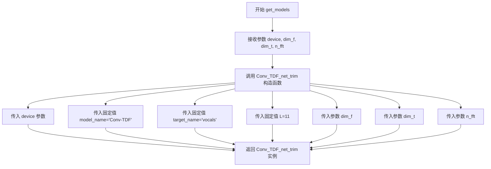
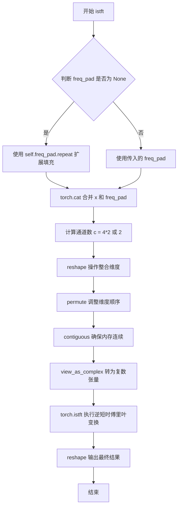
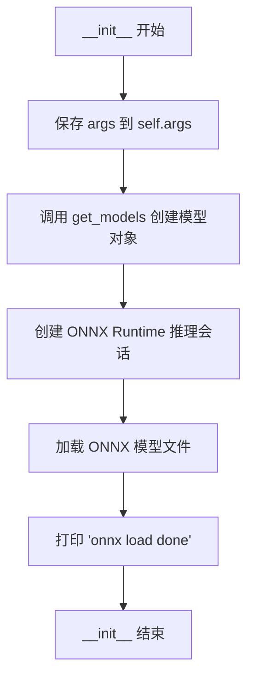

# `Chat-Haruhi-Suzumiya\yuki_builder\video_preprocessing\uvr5\MDXNet.py` 详细设计文档

这是一个基于ONNX Runtime推理的音频源分离工具，通过神经网络模型将混合音频文件分离为人声(vocals)和伴奏(others)两个音轨，支持分块处理和多种音频格式输出。

## 整体流程

```mermaid
graph TD
A[开始] --> B[初始化设备(CPU/CUDA/MPS)]
B --> C[创建Conv_TDF_net_trim模型实例]
C --> D[加载ONNX推理会话]
D --> E[调用prediction方法]
E --> F[使用librosa加载音频文件]
F --> G[调用demix方法进行分离]
G --> H[分块处理音频数据]
H --> I[对每块进行STFT变换]
I --> J[ONNX Runtime推理]
J --> K[ISTFT逆变换]
K --> L[拼接各块结果]
L --> M[保存为音频文件]
```

## 类结构

```
Conv_TDF_net_trim (神经网络模型类)
├── __init__ (初始化方法)
├── stft (短时傅里叶变换)
└── istft (逆短时傅里叶变换)
Predictor (推理预测器类)
├── __init__ (初始化方法)
├── demix (音频分离主方法)
├── demix_base (分块分离核心逻辑)
└── prediction (预测并保存结果)
MDXNetDereverb (主处理类)
├── __init__ (初始化方法)
└── _path_audio_ (音频处理入口)
```

## 全局变量及字段


### `dim_c`
    
通道维度常量(值为4)

类型：`int`
    


### `cpu`
    
CPU设备

类型：`torch.device`
    


### `device`
    
当前计算设备(CPU/CUDA/MPS)

类型：`torch.device`
    


### `Conv_TDF_net_trim.dim_f`
    
频率维度

类型：`int`
    


### `Conv_TDF_net_trim.dim_t`
    
时间维度(2的幂)

类型：`int`
    


### `Conv_TDF_net_trim.n_fft`
    
FFT点数

类型：`int`
    


### `Conv_TDF_net_trim.hop`
    
帧移

类型：`int`
    


### `Conv_TDF_net_trim.n_bins`
    
频率_bins数量

类型：`int`
    


### `Conv_TDF_net_trim.chunk_size`
    
音频块大小

类型：`int`
    


### `Conv_TDF_net_trim.window`
    
Hann窗函数

类型：`torch.Tensor`
    


### `Conv_TDF_net_trim.target_name`
    
目标名称

类型：`str`
    


### `Conv_TDF_net_trim.blender`
    
是否使用blender

类型：`bool`
    


### `Conv_TDF_net_trim.freq_pad`
    
频率填充张量

类型：`torch.Tensor`
    


### `Conv_TDF_net_trim.n`
    
循环因子L的一半

类型：`int`
    


### `Predictor.args`
    
命令行参数

类型：`argparse.Namespace`
    


### `Predictor.model_`
    
神经网络模型实例

类型：`Conv_TDF_net_trim`
    


### `Predictor.model`
    
ONNX推理会话

类型：`ort.InferenceSession`
    


### `MDXNetDereverb.onnx`
    
ONNX模型路径

类型：`str`
    


### `MDXNetDereverb.shifts`
    
等变稳定化随机移位次数

类型：`int`
    


### `MDXNetDereverb.mixing`
    
混合模式

类型：`str`
    


### `MDXNetDereverb.chunks`
    
分块数量

类型：`int`
    


### `MDXNetDereverb.margin`
    
边距大小

类型：`int`
    


### `MDXNetDereverb.dim_t`
    
时间维度

类型：`int`
    


### `MDXNetDereverb.dim_f`
    
频率维度

类型：`int`
    


### `MDXNetDereverb.n_fft`
    
FFT点数

类型：`int`
    


### `MDXNetDereverb.denoise`
    
是否去噪

类型：`bool`
    


### `MDXNetDereverb.pred`
    
预测器实例

类型：`Predictor`
    
    

## 全局函数及方法


### `get_models`

这是一个工厂函数，用于创建并返回`Conv_TDF_net_trim`模型实例。该函数将传入的设备信息和音频处理参数封装到模型构造函数中，固定了模型名称为"Conv-TDF"、目标源为"vocals"（人声）以及L值为11，从而实现音乐源分离中的人声提取模型初始化。

参数：

- `device`：`torch.device`，指定模型运行的设备（CPU、CUDA或MPS）
- `dim_f`：`int`，频率维度参数，控制频谱图的频率分辨率
- `dim_t`：`int`，时间维度参数，用于计算时间方向的窗口大小（实际大小为2^dim_t）
- `n_fft`：`int`，FFT大小，决定频谱分析的频率分辨率

返回值：`Conv_TDF_net_trim`，返回一个人声分离神经网络模型实例

#### 流程图



#### 带注释源码

```python
def get_models(device, dim_f, dim_t, n_fft):
    """
    创建并返回Conv_TDF_net_trim模型实例的工厂函数
    
    参数:
        device: torch.device, 模型运行设备
        dim_f: int, 频率维度
        dim_t: int, 时间维度
        n_fft: int, FFT大小
    
    返回:
        Conv_TDF_net_trim: 模型实例
    """
    # 使用固定参数创建模型实例
    # model_name固定为"Conv-TDF"，表示卷积时域滤波网络
    # target_name固定为"vocals"，表示该模型用于提取人声
    # L=11是网络层数参数
    return Conv_TDF_net_trim(
        device=device,
        model_name="Conv-TDF",
        target_name="vocals",
        L=11,
        dim_f=dim_f,
        dim_t=dim_t,
        n_fft=n_fft,
    )
```


### `Conv_TDF_net_trim.__init__`

该方法是 `Conv_TDF_net_trim` 类的构造函数，负责初始化音频源分离模型的各项参数和资源，包括频率/时间维度、STFT/ISTFT 窗口配置、目标通道数计算以及频率填充零张量的创建，为后续的频谱变换和信号重构奠定基础。

参数：

- `device`：`torch.device`，执行设备（CPU/CUDA/MPS），用于将张量放置到指定设备上
- `model_name`：`str`，模型名称，用于判断是否包含 "blender" 关键字
- `target_name`：`str`，目标音轨名称（如 "vocals" 或 "*"），决定输出通道数
- `L`：`int`，卷积核尺寸参数，用于计算填充大小
- `dim_f`：`int`，频率维度参数，限制 STFT 输出的频率 bins 数量
- `dim_t`：`int`，时间维度指数，用于计算时间方向的块大小（2^dim_t）
- `n_fft`：`int`，FFT 窗口大小，决定频率分辨率
- `hop`：`int`，STFT 跳跃长度（默认 1024），影响时间分辨率和块大小

返回值：`None`（`__init__` 方法无返回值）

#### 流程图

```mermaid
flowchart TD
    A[开始 __init__] --> B[调用父类初始化 super().__init__]
    B --> C[设置实例属性: dim_f, dim_t=2**dim_t, n_fft, hop]
    C --> D[计算n_bins = n_fft // 2 + 1]
    D --> E[计算chunk_size = hop * (dim_t - 1)]
    E --> F[创建Hann窗口并移到device]
    F --> G[保存target_name, 判断blender标志]
    G --> H[根据target_name计算输出通道数 out_c]
    H --> I[创建freq_pad零张量]
    I --> J[计算n = L // 2]
    J --> K[结束]
```

#### 带注释源码

```python
def __init__(
    self, device, model_name, target_name, L, dim_f, dim_t, n_fft, hop=1024
):
    """
    初始化Conv_TDF_net_trim模型
    
    参数:
        device: torch设备对象 (cpu/cuda/mps)
        model_name: 模型名称字符串
        target_name: 目标音轨名称 ('vocals' 或 '*')
        L: 卷积核尺寸参数
        dim_f: 频率维度
        dim_t: 时间维度指数
        n_fft: FFT大小
        hop: STFT跳跃长度，默认1024
    """
    # 调用父类 nn.Module 的初始化方法
    super(Conv_TDF_net_trim, self).__init__()

    # ========== 维度参数初始化 ==========
    self.dim_f = dim_f  # 保留的频率 bins 数量
    self.dim_t = 2**dim_t  # 时间块大小 (2的dim_t次方)
    self.n_fft = n_fft  # FFT 窗口大小
    self.hop = hop  # STFT 跳跃长度
    
    # 计算频率分辨率: n_fft//2 + 1 个频率 bins
    self.n_bins = self.n_fft // 2 + 1
    
    # 计算音频分块大小: hop * (时间维度 - 1)
    # 这是用于每次处理的音频样本数量
    self.chunk_size = hop * (self.dim_t - 1)
    
    # ========== 窗口函数 ==========
    # 创建 Hann 窗函数用于 STFT/ISTFT
    # periodic=True 表示窗函数周期为 n_fft+1 (用于信号处理)
    self.window = torch.hann_window(window_length=self.n_fft, periodic=True).to(
        device
    )
    
    # ========== 模型配置 ==========
    self.target_name = target_name  # 保存目标名称用于 ONNX 模型加载
    # 判断是否为 blender 模型 (影响处理逻辑)
    self.blender = "blender" in model_name

    # ========== 输出通道计算 ==========
    # 如果 target_name 为 '*' (多目标), 输出通道为 dim_c * 4
    # 否则为单目标，输出通道为 dim_c (dim_c = 4)
    out_c = dim_c * 4 if target_name == "*" else dim_c
    
    # ========== 频率填充张量 ==========
    # 创建一个频率方向的填充张量
    # 形状: [1, out_c, n_bins - dim_f, dim_t]
    # 用于在 ISTFT 时将受限的频率bins填充回完整的n_bins
    self.freq_pad = torch.zeros(
        [1, out_c, self.n_bins - self.dim_f, self.dim_t]
    ).to(device)

    # ========== 卷积填充参数 ==========
    # 计算卷积核有效填充大小 (L//2)
    self.n = L // 2
```


### `Conv_TDF_net_trim.stft`

该方法是Conv_TDF_net_trim类的核心成员，负责将时域音频信号转换为频域表示，并进行维度重塑以适配神经网络输入格式。通过STFT变换将原始音频切分为频谱块，再经由view_as_real和permute操作将复数频谱转换为双通道实数表示，最后reshape为(batch, dim_c, n_bins, dim_t)的四维张量，并截取前dim_f个频率bin作为输出。

参数：

- `x`：`torch.Tensor`，输入的时域音频信号张量，形状为(batch, chunk_size)，其中chunk_size由hop*(dim_t-1)计算得出

返回值：`torch.Tensor`，输出的频域表示张量，形状为(batch, dim_c, dim_f, dim_t)，其中dim_c=4，dim_f为频率维度截断后的值，dim_t为时间帧数

#### 流程图

```mermaid
flowchart TD
    A[输入音频张量 x<br/>shape: (batch, chunk_size)] --> B[reshape到固定chunk大小<br/>x.reshape([-1, chunk_size])]
    B --> C[STFT短时傅里叶变换<br/>torch.stft with n_fft, hop, window]
    C --> D[复数转实数视图<br/>torch.view_as_real]
    D --> E[维度置换<br/>permute [0, 3, 1, 2]]
    E --> F[多步reshape<br/>先reshape到5维再reshape到4维]
    F --> G[截取前dim_f频率bin<br/>x[:, :, :dim_f]]
    G --> H[输出频域张量<br/>shape: (batch, dim_c, dim_f, dim_t)]
    
    style A fill:#e1f5fe
    style H fill:#e8f5e8
```

#### 带注释源码

```python
def stft(self, x):
    """
    短时傅里叶变换 (STFT) 方法
    将时域音频信号转换为频域表示，并重塑为神经网络输入格式
    
    参数:
        x: 输入的时域音频张量，形状为 (batch, chunk_size)
    
    返回:
        频域表示张量，形状为 (batch, dim_c, dim_f, dim_t)
    """
    # 步骤1: 将输入reshape为固定大小的chunk
    # chunk_size = hop * (dim_t - 1)，确保能完整覆盖所有时间帧
    x = x.reshape([-1, self.chunk_size])
    
    # 步骤2: 执行STFT变换
    # n_fft: FFT窗口大小，决定频率分辨率
    # hop_length: 相邻帧之间的采样点数，影响时间分辨率
    # window: 汉宁窗，用于减少频谱泄漏
    # center: 假设信号以零为中心
    # return_complex: 返回复数形式的STFT结果
    x = torch.stft(
        x,
        n_fft=self.n_fft,
        hop_length=self.hop,
        window=self.window,
        center=True,
        return_complex=True,
    )
    
    # 步骤3: 将复数张量转换为实数视图
    # 复数 (real, imag) 被转换为 (..., 2) 的实数张量
    x = torch.view_as_real(x)
    
    # 步骤4: 调整维度顺序
    # 从 (batch, freq, time, real/imag) 转换为 (batch, real/imag, freq, time)
    x = x.permute([0, 3, 1, 2])
    
    # 步骤5: 多步reshape操作
    # 先reshape为 (batch, 2, 2, n_bins, dim_t) - 2表示实部/虚部，2可能与立体声或多通道有关
    # 再reshape为 (batch, dim_c, n_bins, dim_t) - dim_c=4 (2*2)
    x = x.reshape([-1, 2, 2, self.n_bins, self.dim_t]).reshape(
        [-1, dim_c, self.n_bins, self.dim_t]
    )
    
    # 步骤6: 截取前dim_f个频率bin
    # 只保留低频部分，减少计算量并聚焦于主要频率成分
    return x[:, :, : self.dim_f]
```


### `Conv_TDF_net_trim.istft`

该方法执行短时傅里叶逆变换（ISTFT），将频域张量转换回时域波形，支持带通填充和多种目标类型（单声道/多声道）的逆变换。

参数：

- `x`：`torch.Tensor`，输入的频域张量，形状为 [batch, channels, freq_bins, time_frames]
- `freq_pad`：`torch.Tensor` 或 `None`，频率填充张量，如果为 None 则使用类的 freq_pad 属性

返回值：`torch.Tensor`，逆变换后的时域波形，形状为 [batch, channels, chunk_size]

#### 流程图



#### 带注释源码

```python
def istft(self, x, freq_pad=None):
    """
    执行短时傅里叶逆变换 (ISTFT)
    
    参数:
        x: 输入频域张量 [batch, channels, freq_bins, time_frames]
        freq_pad: 可选的频率填充张量，如果为None则使用类属性
    
    返回:
        时域波形张量 [batch, channels, chunk_size]
    """
    # 如果没有提供freq_pad，则使用类的freq_pad属性并按batch维度重复
    freq_pad = (
        self.freq_pad.repeat([x.shape[0], 1, 1, 1])
        if freq_pad is None
        else freq_pad
    )
    
    # 在频率维度（-2）拼接输入和填充
    x = torch.cat([x, freq_pad], -2)
    
    # 根据目标类型确定通道数：多目标为8（4*2），单目标为2
    c = 4 * 2 if self.target_name == "*" else 2
    
    # 重塑张量以整合通道维度
    x = x.reshape([-1, c, 2, self.n_bins, self.dim_t]).reshape(
        [-1, 2, self.n_bins, self.dim_t]
    )
    
    # 调整维度顺序：[batch, channels, freq, time] -> [batch, freq, time, channels]
    x = x.permute([0, 2, 3, 1])
    
    # 确保张量在内存中连续存储
    x = x.contiguous()
    
    # 将实部和虚部视图转换为复数张量
    x = torch.view_as_complex(x)
    
    # 执行逆短时傅里叶变换
    x = torch.istft(
        x, n_fft=self.n_fft, hop_length=self.hop, window=self.window, center=True
    )
    
    # 重塑为最终输出形状 [batch, channels, chunk_size]
    return x.reshape([-1, c, self.chunk_size])
```


### `Predictor.__init__`

该方法是 `Predictor` 类的构造函数，负责初始化音频源分离模型的推理环境。它接收配置参数，加载 PyTorch 模型（Conv-TDF_net_trim）用于音频处理，并初始化 ONNX Runtime 会话以执行模型推理。

参数：

- `args`：`Namespace` 或类似配置对象，包含以下关键属性：
  - `dim_f`：int，频率维度参数
  - `dim_t`：int，时间维度参数（用于计算 chunk_size）
  - `n_fft`：int，FFT 窗口大小
  - `onnx`：str，ONNX 模型文件所在目录路径

返回值：`None`，构造函数无返回值

#### 流程图



#### 带注释源码

```python
def __init__(self, args):
    """
    Predictor 类的构造函数
    
    参数:
        args: 配置对象，包含模型参数和路径信息
    """
    # 保存传入的配置参数到实例变量
    self.args = args
    
    # 初始化基础模型 (Conv_TDF_net_trim)
    # 使用 CPU 设备，从 args 中提取 dim_f, dim_t, n_fft 参数
    self.model_ = get_models(
        device=cpu, 
        dim_f=args.dim_f, 
        dim_t=args.dim_t, 
        n_fft=args.n_fft
    )
    
    # 创建 ONNX Runtime 推理会话
    # 加载指定路径下的 ONNX 模型
    # providers 列表指定了优先使用 CUDA，备选 CPU
    self.model = ort.InferenceSession(
        os.path.join(args.onnx, self.model_.target_name + ".onnx"),
        providers=["CUDAExecutionProvider", "CPUExecutionProvider"],
    )
    
    # 打印加载完成信息
    print("onnx load done")
```


### `Predictor.demix(mix)`

该方法是音频源分离的核心入口，接收混合音频信号，通过分块处理策略将长音频分割为多个重叠的小片段，再调用底层的`demix_base`方法进行频域分离，最后将分离结果拼接整合为完整的分离音频。

参数：

- `mix`：`numpy.ndarray`，混合音频信号，形状为`(2, samples)`，即2通道（立体声）的音频样本

返回值：`numpy.ndarray`，分离后的音频源，形状为`(1, 2, samples)`，包含分离出的目标源（如人声）

#### 流程图

```mermaid
flowchart TD
    A[开始 demix] --> B[获取音频样本数 samples]
    B --> C[获取 margin 和 chunk_size]
    C --> D{chunk_size 是否为0<br>或 samples < chunk_size?}
    D -->|是| E[设置 chunk_size = samples]
    D -->|否| F[保持 chunk_size 不变]
    E --> G[初始化分段字典 segmented_mix]
    F --> G
    G --> H[循环遍历: for skip in range(0, samples, chunk_size)]
    H --> I[计算分段起止位置]
    I --> J[处理边界: 首尾段不使用 margin]
    J --> K[提取分段音频: mix[:, start:end]]
    K --> L{是否到达音频末尾?}
    L -->|是| M[调用 demix_base 处理分段]
    L -->|否| H
    M --> N[合并所有分段的分离结果]
    N --> O[返回分离后的音频 sources]
```

#### 带注释源码

```python
def demix(self, mix):
    """
    音频源分离的主入口方法
    
    该方法实现了一个分块处理的策略，将长音频分割为多个重叠的片段，
    分别进行分离后再拼接。这样可以处理超出内存限制的长音频文件。
    
    参数:
        mix: 混合音频，numpy数组，形状为(2, samples)，即立体声信号
    
    返回:
        sources: 分离后的音频源，numpy数组
    """
    # 获取音频的样本数量（取最后一个维度，即时间轴长度）
    samples = mix.shape[-1]
    
    # 从参数中获取边界处理margin值，用于分段之间的重叠处理
    margin = self.args.margin
    
    # 计算每个分块的大小：chunks参数 * 44100（标准采样率）
    # 默认情况下chunks可能为0，此时会在后面处理为整个音频作为一个块
    chunk_size = self.args.chunks * 44100
    
    # 断言：margin不能为0，否则无法进行边界处理
    assert not margin == 0, "margin cannot be zero!"
    
    # 如果margin大于chunk_size，则将其限制在chunk_size范围内
    # 避免处理过大的边界重叠区域
    if margin > chunk_size:
        margin = chunk_size

    # 初始化分段字典，用于存储每个音频分块
    # 字典的键是分块的起始位置（skip），值是对应的音频数据
    segmented_mix = {}

    # 特殊处理：如果chunks为0，或者音频样本数小于分块大小
    # 则将整个音频作为一个完整的块处理
    if self.args.chunks == 0 or samples < chunk_size:
        chunk_size = samples

    # 初始化计数器，用于跟踪当前处理的块
    counter = -1
    
    # 遍历音频，按照chunk_size步长分割
    # 每次循环处理一个音频片段
    for skip in range(0, samples, chunk_size):
        counter += 1

        # 计算边界margin
        # 第一个块（counter==0）不需要前向margin
        s_margin = 0 if counter == 0 else margin
        
        # 计算当前块的结束位置，加上margin边界
        end = min(skip + chunk_size + margin, samples)

        # 计算起始位置，减去前向margin
        start = skip - s_margin

        # 提取当前段的音频数据
        # 注意：这里使用copy()创建副本，避免修改原始数据
        segmented_mix[skip] = mix[:, start:end].copy()
        
        # 如果已经处理到音频末尾，跳出循环
        if end == samples:
            break

    # 调用底层的demix_base方法进行实际的音频分离
    # 传入分段后的音频字典和margin大小
    sources = self.demix_base(segmented_mix, margin_size=margin)
    
    """
    注释说明数据形状:
    - mix: (2, big_sample) 原始混合音频
    - segmented_mix: offset -> (2, small_sample) 分段后的音频
    - sources: (1, 2, big_sample) 分离后的音频
    """
    
    # 返回分离后的音频源
    return sources
```


### `Predictor.demix_base`

该函数是音频源分离的核心推理方法，负责将分块的混合音频通过STFT变换、ONNX模型推理、ISTFT逆变换处理，最终重新拼接成完整的分离后音频信号。支持去噪模式下的双向推理平均，并处理边界裁剪以消除分块拼接处的伪影。

参数：

- `mixes`：`dict`，键为分块起始位置（offset），值为对应的音频数据块（numpy数组，形状为(2, samples)）
- `margin_size`：`int`，分块重叠/边界 margin 大小，用于处理分块边缘的连续性

返回值：`numpy.ndarray`，拼接后的分离音频，形状为(2, total_samples)

#### 流程图

```mermaid
flowchart TD
    A[开始 demix_base] --> B[初始化空列表 chunked_sources]
    B --> C[创建 tqdm 进度条]
    C --> D{遍历 mixes 中的每个 chunk}
    D -->|遍历| E[获取当前分块 cmix = mixes[mix]]
    E --> F[计算填充参数: trim, gen_size, pad]
    F --> G[对音频进行填充和分帧]
    G --> H[转换为 torch tensor 并移至 CPU]
    H --> I[使用 STFT 转换到频域]
    I --> J{denoise 开关是否开启?}
    J -->|是| K[双向推理取平均: -input 和 +input]
    J -->|否| L[单次推理]
    K --> M[执行 ONNX 推理]
    L --> M
    M --> N[使用 ISTFT 转换回时域]
    N --> O[裁剪 trim 边界并拼接]
    O --> P[根据 margin_size 裁剪首尾边界]
    P --> Q[将当前 chunk 结果添加到 sources]
    Q --> R[更新进度条]
    R --> D
    D -->|遍历完成| S[拼接所有 chunk 结果]
    S --> T[关闭进度条]
    T --> U[返回最终分离音频]
```

#### 带注释源码

```python
def demix_base(self, mixes, margin_size):
    """
    核心分离推理函数
    
    参数:
        mixes: dict类型，键为分块起始位置，值为(2, n_sample)的numpy数组
        margin_size: int类型，分块重叠区域大小
    返回:
        numpy.ndarray: 分离后的音频数据，形状为(2, total_samples)
    """
    chunked_sources = []  # 存储每个分块的分离结果
    progress_bar = tqdm(total=len(mixes))  # 初始化进度条
    progress_bar.set_description("Processing")
    
    # 遍历每个音频分块
    for mix in mixes:
        cmix = mixes[mix]  # 获取当前分块的音频数据 (2, n_sample)
        sources = []
        n_sample = cmix.shape[1]  # 当前分块的样本数
        
        model = self.model_  # 获取 Conv_TDF_net_trim 模型实例
        trim = model.n_fft // 2  # STFT 边界裁剪量
        gen_size = model.chunk_size - 2 * trim  # 有效生成窗口大小
        
        # 计算需要填充的样本数，使总长度能被 gen_size 整除
        pad = gen_size - n_sample % gen_size
        
        # 对音频进行填充：前后各加 trim 零，中间加 audio 和 pad 零
        # 形状: (2, trim + n_sample + pad + trim)
        mix_p = np.concatenate(
            (np.zeros((2, trim)), cmix, np.zeros((2, pad)), np.zeros((2, trim))), 1
        )
        
        # 将填充后的音频切分成多个 chunk_size 大小的块
        mix_waves = []
        i = 0
        while i < n_sample + pad:
            waves = np.array(mix_p[:, i : i + model.chunk_size])
            mix_waves.append(waves)
            i += gen_size  # 步长为有效生成大小，实现重叠滑动
        
        # 转换为 torch tensor 并移至 CPU
        mix_waves = torch.tensor(mix_waves, dtype=torch.float32).to(cpu)
        
        # 禁用梯度计算，进行推理
        with torch.no_grad():
            _ort = self.model  # ONNX Runtime 推理会话
            
            # 短时傅里叶变换 (STFT)：时域 -> 频域
            spek = model.stft(mix_waves)
            
            if self.args.denoise:
                # 去噪模式：分别对正负输入推理，结果取平均
                # 这种双向推理可以减少模型偏差
                spec_pred = (
                    -_ort.run(None, {"input": -spek.cpu().numpy()})[0] * 0.5
                    + _ort.run(None, {"input": spek.cpu().numpy()})[0] * 0.5
                )
                # 逆 STFT：频域 -> 时域
                tar_waves = model.istft(torch.tensor(spec_pred))
            else:
                # 普通模式：单次推理
                tar_waves = model.istft(
                    torch.tensor(_ort.run(None, {"input": spek.cpu().numpy()})[0])
                )
            
            # 提取有效音频部分（去除前后 trim 边界）
            # 转置并 reshape 为 (2, -1) 形状，去除最后的 pad
            tar_signal = (
                tar_waves[:, :, trim:-trim]
                .transpose(0, 1)
                .reshape(2, -1)
                .numpy()[:, :-pad]
            )
            
            # 根据 margin_size 和分块位置进行边界裁剪
            # 第一个分块从0开始，最后一个分块不裁剪结尾
            start = 0 if mix == 0 else margin_size
            end = None if mix == list(mixes.keys())[::-1][0] else -margin_size
            if margin_size == 0:
                end = None
            
            # 将裁剪后的信号添加到当前分块结果
            sources.append(tar_signal[:, start:end])
            
            progress_bar.update(1)
        
        # 将当前分块的sources添加到结果列表
        chunked_sources.append(sources)
    
    # 沿最后一维拼接所有分块的结果
    _sources = np.concatenate(chunked_sources, axis=-1)
    
    # 关闭进度条
    progress_bar.close()
    
    return _sources
```


### `Predictor.prediction`

该方法实现音频分离的核心功能，根据输入的音频文件路径、输出目录和格式，将音频分离为人声（vocal）和伴奏/其他（others）两个部分，并将结果保存为指定格式的音频文件。

参数：

- `m`：`str`，输入的混合音频文件路径（包含文件名）
- `vocal_root`：`str`，输出的人声音频文件的保存目录路径
- `others_root`：`str`，输出的伴奏/其他音频文件的保存目录路径
- `format`：`str`，输出音频文件的格式（如"wav"、"flac"、"mp3"等）

返回值：`tuple`，返回两个字符串组成的元组，分别是生成的人声文件路径和伴奏/其他文件路径

#### 流程图

```mermaid
flowchart TD
    A[开始 prediction] --> B[创建输出目录]
    B --> C[获取输入文件名basename]
    C --> D[使用librosa加载音频<br/>librosa.load mono=False sr=44100]
    D --> E{检查mix维度}
    E -->|一维mono| F[转换为双声道 stereo]
    E -->|已是stereo| G[直接使用]
    F --> G
    G --> H[转置mix矩阵]
    H --> I[调用demix分离音频<br/>sources = self.demix]
    I --> J[获取分离后的伴奏/其他轨道<br/>opt = sources[0].T]
    J --> K{format in [wav, flac]?}
    K -->|是| L[构建wav/flac路径]
    K -->|否| M[先保存为wav再转格式]
    L --> N[写入人声文件: mix - opt]
    M --> N
    N --> O[写入伴奏/其他文件: opt]
    O --> P{format不是wav/flac?}
    P -->|是| Q[使用ffmpeg转换格式]
    P -->|否| R[返回路径元组]
    Q --> R
```

#### 带注释源码

```python
def prediction(self, m, vocal_root, others_root, format):
    """
    预测并分离音频文件中的人声和伴奏/其他部分
    
    参数:
        m: 输入的混合音频文件路径
        vocal_root: 人声输出目录
        others_root: 伴奏/其他输出目录
        format: 输出音频格式
    """
    # 创建输出目录（如果不存在）
    os.makedirs(vocal_root, exist_ok=True)
    os.makedirs(others_root, exist_ok=True)
    
    # 从完整路径中提取文件名（不含扩展名）作为basename
    basename = os.path.basename(m)
    
    # 使用librosa加载音频文件
    # mono=False: 保持立体声（如果原音频是立体声）
    # sr=44100: 重采样到44100Hz
    mix, rate = librosa.load(m, mono=False, sr=44100)
    
    # 如果音频是单声道的，将其复制为双声道
    if mix.ndim == 1:
        mix = np.asfortranarray([mix, mix])
    
    # 转置以符合预期形状 (channels, samples) -> (samples, channels)
    mix = mix.T
    
    # 调用demix方法进行音频分离，返回分离后的音源
    sources = self.demix(mix.T)
    
    # 获取第一个分离出的音源（这里是伴奏/其他部分）
    opt = sources[0].T
    
    # 初始化路径变量
    vocal_path = None
    others_path = None
    
    # 根据format选择处理方式
    if format in ["wav", "flac"]:
        # 直接使用指定格式
        vocal_path = "%s/%s_main_vocal.%s" % (vocal_root, basename, format)
        others_path = "%s/%s_others.%s" % (others_root, basename, format)
        # 写入人声：混合音频 - 伴奏 = 人声
        sf.write(vocal_path, mix - opt, rate)
        # 写入伴奏/其他
        sf.write(others_path, opt, rate)
    else:
        # 其他格式（如mp3）先保存为wav，再用ffmpeg转换
        vocal_path = "%s/%s_main_vocal.wav" % (vocal_root, basename)
        others_path = "%s/%s_others.wav" % (others_root, basename)
        sf.write(vocal_path, mix - opt, rate)
        sf.write(others_path, opt, rate)
        
        # 如果人声文件存在，使用ffmpeg转换为目标格式
        if os.path.exists(vocal_path):
            os.system(
                "ffmpeg -i %s -vn %s -q:a 2 -y"
                % (vocal_path, vocal_path[:-4] + ".%s" % format)
            )
        
        # 如果伴奏文件存在，使用ffmpeg转换为目标格式
        if os.path.exists(others_path):
            os.system(
                "ffmpeg -i %s -vn %s -q:a 2 -y"
                % (others_path, others_path[:-4] + ".%s" % format)
            )
    
    # 返回生成的文件路径元组
    return vocal_path, others_path
```


### `MDXNetDereverb.__init__`

该方法是 `MDXNetDereverb` 类的构造函数，负责初始化去混响模型的核心参数和内部预测器组件。

参数：

- `onnx`：`str` 或 `int`，ONNX 模型路径或配置参数（代码中存在 bug，main 函数传入整数 15 但实际应为路径字符串）
- `chunks`：`int`，音频分块大小，控制处理音频时的分块策略

返回值：`None`，无显式返回值，仅初始化实例属性

#### 流程图

```mermaid
flowchart TD
    A[开始 __init__] --> B[接收 onnx 和 chunks 参数]
    B --> C[设置 self.onnx = onnx]
    C --> D[设置 self.shifts = 10]
    D --> E[设置 self.mixing = 'min_mag']
    E --> F[设置 self.chunks = chunks]
    F --> G[设置 self.margin = 44100]
    G --> H[设置 self.dim_t = 9]
    H --> I[设置 self.dim_f = 3072]
    I --> J[设置 self.n_fft = 6144]
    J --> K[设置 self.denoise = True]
    K --> L[创建 Predictor 实例: self.pred = Predictor(self)]
    L --> M[结束 __init__]
```

#### 带注释源码

```python
def __init__(self, onnx, chunks):
    """
    初始化 MDXNetDereverb 去混响模型
    
    参数:
        onnx: ONNX模型路径或配置参数
        chunks: 音频分块大小
    """
    # 存储ONNX模型路径/配置
    self.onnx = onnx
    
    # 随机等变稳定化预测次数，用于增强模型鲁棒性
    self.shifts = 10  #'Predict with randomised equivariant stabilisation'
    
    # 混合模式：['default','min_mag','max_mag']
    # min_mag 模式选择最小幅度进行混合
    self.mixing = "min_mag"  # ['default','min_mag','max_mag']
    
    # 音频分块大小，控制每次处理的样本数
    self.chunks = chunks
    
    # 边距大小，用于处理音频分块时的重叠区域
    # 44100 对应 1 秒音频（44.1kHz采样率）
    self.margin = 44100
    
    # 时间维度参数，控制STFT的时间分辨率
    # dim_t=9 表示 2^9 = 512 个时间帧
    self.dim_t = 9
    
    # 频率维度参数，控制STFT的频率分辨率
    # dim_f=3072 对应频率 bins 数量
    self.dim_f = 3072
    
    # FFT点数，影响频谱分辨率
    # n_fft=6144 对应 6144 点 FFT
    self.n_fft = 6144
    
    # 是否启用去噪模式
    # True 时会结合正负输入进行降噪处理
    self.denoise = True
    
    # 创建 Predictor 预测器实例
    # 传入 self 作为 args，Predictor 会提取所需配置
    self.pred = Predictor(self)
```


### `MDXNetDereverb._path_audio_`

该方法是MDXNetDereverb类的核心音频处理方法，负责接收输入音频路径和输出目录，通过Predictor分离人声与伴奏，并根据指定格式保存分离后的音频文件，最终返回人声和伴奏的输出路径。

参数：

- `input`：`str`，输入音频文件路径，待处理的混合音频文件
- `vocal_root`：`str`，人声输出目录路径，用于保存分离出的人声部分
- `others_root`：`str`，伴奏输出目录路径，用于保存分离出的伴奏/其他声音部分
- `format`：`str`，输出音频格式，支持wav、flac、mp3等格式

返回值：`tuple[str, str]`，返回元组(vocal_path, others_path)，分别表示生成的人声文件路径和伴奏文件路径

#### 流程图

```mermaid
flowchart TD
    A[开始 _path_audio_] --> B[调用 pred.prediction 方法]
    B --> C[prediction 创建输出目录]
    C --> D[librosa.load 加载音频]
    D --> E[检查是否为单声道并转换]
    E --> F[demix 分离人声和伴奏]
    F --> G[根据format保存文件]
    G --> H{format in [wav, flac]?}
    H -->|Yes| I[直接写入对应格式]
    H -->|No| J[先保存wav再用ffmpeg转换]
    I --> K[返回 vocal_path, others_path]
    J --> K
```

#### 带注释源码

```python
def _path_audio_(self, input, vocal_root, others_root, format):
    """
    处理音频
    :param input: 输入音频文件路径
    :param vocal_root: 人声输出目录
    :param others_root: 伴奏输出目录
    :param format: 输出格式
    :return: (vocal_path, others_path) 人声和伴奏的文件路径
    """
    # 调用Predictor的prediction方法进行音频分离处理
    # 传入输入音频路径、输出目录和格式，返回分离后的人声和伴奏路径
    vocal_path, others_path = self.pred.prediction(input, vocal_root, others_root, format)
    # 返回生成的文件路径元组
    return vocal_path, others_path
```

## 关键组件


### Conv_TDF_net_trim (音频分离神经网络模型)

核心神经网络模型类，负责时频域转换和音频分离。支持STFT短时傅里叶变换和ISTFT逆变换，处理音频张量的分块、填充和频谱裁剪。

### Predictor (ONNX推理预测器)

负责加载ONNX模型并执行推理。实现了基于分块的音频分离算法，支持带边距( margin)的分段处理以减少拼接伪影，支持去噪模式。

### MDXNetDereverb (去混响主入口类)

整合所有组件的顶层类，配置模型参数(dim_t=9, dim_f=3072, n_fft=6144)，设置去混响参数(shifts=10, mixing="min_mag")，处理音频文件读写。

### STFT/ISTFT 变换模块

使用PyTorch实现的高效时频变换，通过Hann窗口进行频谱分析，支持复数谱处理和张量维度重塑以适配模型输入输出。

### 分块处理与边距机制

实现音频的智能分块处理，通过margin参数在块之间创建重叠区域，有效消除分离后的拼接 artifact，支持动态块大小调整。

### 张量索引与形状变换

使用PyTorch张量操作进行维度重排(permute)、视图变换(view_as_real/view_as_complex)和切片索引，实现(批次, 通道, 频率, 时间)四维张量的灵活转换。

### ONNX Runtime 推理接口

通过onnxruntime的InferenceSession加载模型，支持CUDA和CPU执行提供者，提供denoise模式的谱预测加权融合算法。

### 去噪模式 (Denoise Mode)

通过`-0.5 * pred(-x) + 0.5 * pred(x)`的谱估计策略实现去噪，增强分离效果的鲁棒性。


## 问题及建议


### 已知问题

-   **GPU利用严重不足（核心性能瓶颈）**：代码在初始化时检测并选择了CUDA设备，但在核心推理流程`demix_base`中，音频数据被强制转移至CPU（`.to(cpu)`），STFT/ISTFT计算及ONNX Runtime推理均运行在CPU上。这导致GPU资源完全闲置，推理速度极慢，与注释中提到的显存占用形成反差（显存占用可能来自PyTorch模型加载，但实际计算未使用）。
-   **未使用的依赖导入**：代码导入了`pdb`（调试库）和`scipy.io.wavfile.write`，但在后续逻辑中完全未使用，增加了导入时间和代码体积。
-   **ONNX模型输入名硬编码**：代码在调用`_ort.run`时直接使用字典键`{"input": ...}`，假设模型输入名称固定为"input"。如果ONNX模型内部定义的输入名称不同，运行时会直接报错，缺乏容错性。
-   **代码重复与结构冗余**：`demix_base`方法中，处理“降噪”（denoise）和普通推理的代码块高度相似（包含STFT、ISTFT的调用），未进行有效的函数封装。
-   **硬编码与魔法数字**：音频分块大小、margin值（44100）、FFT参数（dim_f, dim_t, n_fft）等被直接写死在代码逻辑中，降低了代码的可配置性和可维护性。
-   **特征参数未生效**：`MDXNetDereverb`类中定义了`self.shifts`（随机化增强）和`self.mixing`参数，但在核心推理代码中并未实现对应的多次推理和结果混合逻辑，导致这些属性形同虚设。
-   **音频转换安全隐患**：使用`os.system`调用ffmpeg进行格式转换，缺乏对文件名安全的严格校验（虽然使用了basename），且无法有效捕获和处理ffmpeg的执行错误。
-   **音频边界处理风险**：在计算`pad`（补齐长度）后，切片`[:, :-pad]`可能直接丢弃末尾数据，如果`pad`值计算存在偏差，可能导致音频末尾出现截断或静音。

### 优化建议

-   **重构设备管理**：移除`.to(cpu)`的强制转换，改为根据初始化时的`device`张量进行运算；将ONNX Runtime的Provider明确配置为`CUDAExecutionProvider`以启用GPU加速。
-   **提取公共逻辑**：将`stft` -> `model inference` -> `istft`的流程封装为私有方法，简化`denoise`分支的代码。
-   **动态获取模型信息**：利用`ort.InferenceSession`接口在初始化时获取模型的真实输入输出名称，避免硬编码。
-   **配置化管理**：将音频处理参数（采样率、chunk_size、margin等）归一化为类属性或外部配置，减少魔法数字。
-   **改进文件操作**：使用`subprocess`替代`os.system`调用ffmpeg，提高错误处理能力；移除未使用的库导入。
-   **增强推理质量**：若计划使用随机化增强（shifts），需在`demix_base`中实现对应的循环逻辑；否则移除相关无效属性。

## 其它


### 设计目标与约束

本项目旨在实现一个基于深度学习的音频源分离系统，能够将输入的音乐文件分离为人声（vocals）和伴奏（others）两个部分。设计目标是支持多种音频格式（wav、flac、mp3等）的输入输出，通过ONNX Runtime加速推理过程，实现高效的实时或批量处理。约束条件包括：1) 需要CUDA或MPS GPU加速，如无可用则回退到CPU；2) 音频采样率固定为44100Hz；3) 模型输入输出维度受限于dim_f=3072、dim_t=9、n_fft=6144的配置。

### 错误处理与异常设计

代码中的错误处理主要包括：1) 设备选择时的异常回退机制，当CUDA不可用时尝试MPS，MPS也不可用时使用CPU；2) margin参数不能为零的断言检查；3) 文件路径不存在时的异常捕获（通过os.system调用ffmpeg时的隐式处理）；4) 音频加载失败时的librosa异常传播；5) ONNX模型加载失败时的异常抛出。存在的问题是大部分错误处理不够完善，缺少对模型文件不存在、音频文件损坏、磁盘空间不足等情况的显式处理。

### 数据流与状态机

系统的工作流程可描述为以下状态机：1) 初始化状态：加载ONNX模型和初始化Conv_TDF_net_trim参数；2) 音频加载状态：使用librosa加载音频文件并转换为(2, samples)格式；3) 分块处理状态：将长音频分割为多个重叠的chunk，每个chunk包含margin大小的重叠区域；4) 推理状态：对每个chunk进行STFT变换、ONNX推理、ISTFT逆变换；5) 拼接状态：将分离后的chunk按原始位置拼接，移除重叠区域；6) 输出状态：将结果写入指定格式的音频文件。状态转换由Predictor类的demix方法控制。

### 外部依赖与接口契约

核心依赖包括：1) onnxruntime - ONNX模型推理引擎；2) torch - 音频时频变换(STFT/ISTFT)；3) librosa - 音频文件加载；4) soundfile - 音频文件写入；5) numpy - 数值计算；6) scipy - 辅助信号处理；7) tqdm - 进度条显示；8) ffmpeg - 音频格式转换（外部命令行工具）。接口契约方面：输入音频必须为44.1kHz采样率、任意时长；模型输入为(1, 4, 3072, 512)的复数STFT特征；输出为(2, samples)的分离音频；目录参数vocal_root和others_root必须可写。

### 性能特征与基准测试

根据代码末尾的测试数据：1) 15秒音频在RTX 15显卡上处理耗时约20-23秒；2) 内存占用从0.7GB增长到6.6GB（FP32模式）；3) half精度模式显存需求降低但速度略慢；4) chunks参数影响内存使用和批处理效率。性能瓶颈主要在于：1) STFT/ISTFT变换的计算开销；2) ONNX推理的内存拷贝（CPU-GPU数据传输）；3) 逐chunk串行处理未充分利用GPU并行能力；4) 频繁的torch tensor与numpy array转换。

### 配置与参数说明

主要配置参数：1) dim_f=3072 - 频率维度；2) dim_t=9 - 时间维度（实际为2^9=512）；3) n_fft=6144 - FFT窗口大小；4) hop=1024 - 帧移；5) margin=44100 - 重叠区域大小（1秒）；6) chunks - 每次处理的音频块大小（单位样本数）；7) denoise=True - 是否启用去噪模式；8) shifts=10 - 等变稳定化次数；9) mixing="min_mag" - 混合模式。参数通过arggs对象传递，可在Predictor初始化时配置。

### 安全性考虑

代码存在以下安全隐患：1) 使用os.system执行ffmpeg命令存在命令注入风险（虽然文件名来自用户输入但未做严格过滤）；2) 缺少对输入路径的合法性验证；3) 临时文件处理不当可能导致文件系统资源耗尽；4) 模型文件路径未做存在性检查；5) 未限制输出文件大小可能导致磁盘写满。建议增加输入验证、路径安全检查、磁盘空间预检查等安全措施。

### 已知限制

1) 仅支持44.1kHz采样率的音频输入；2) 模型设计为二类分离（人声vs伴奏），不支持多源分离；3) 对于极短音频（小于chunk_size）处理效率较低；4) 对非人声内容（如纯乐器）分离效果可能不理想；5) ONNX模型硬编码为"vocals.onnx"，不支持运行时切换目标；6) 内存占用较高，长音频可能触发内存问题；7) GPU加速依赖CUDA或MPS，AMD GPU无法使用CUDA加速。

    