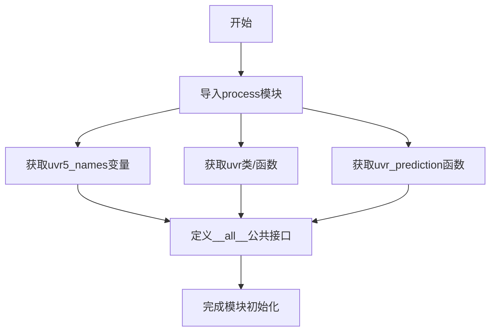
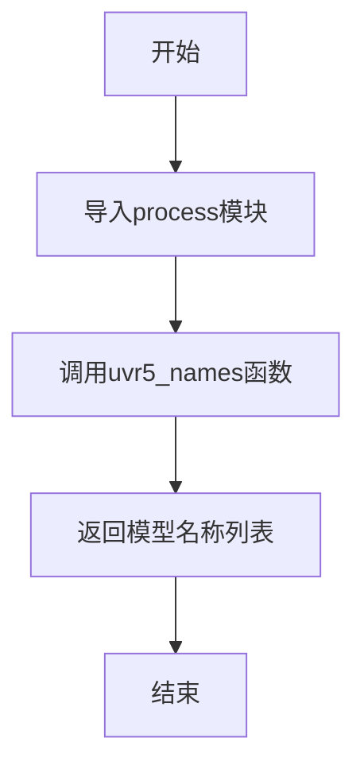
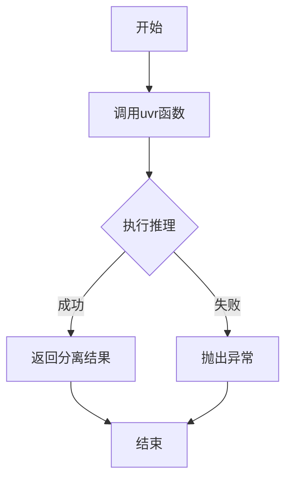
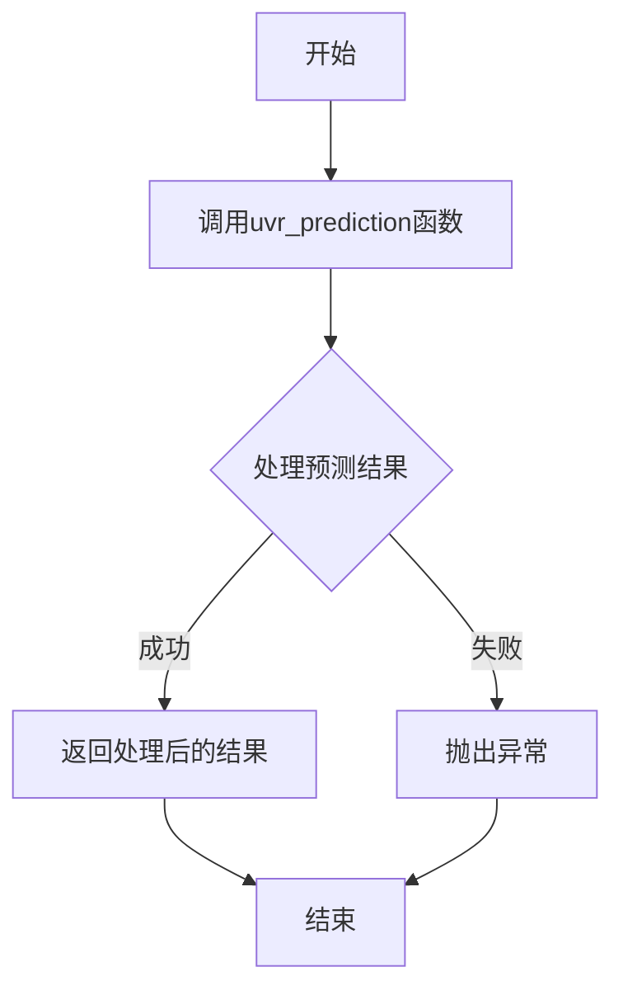

# `Chat-Haruhi-Suzumiya\yuki_builder\video_preprocessing\uvr5\__init__.py` 详细设计文档

这是一个UVR（Ultimate Vocal Remover）模块的入口文件，主要功能是从process子模块导入并重导出三个核心组件：uvr5_names（模型名称列表）、uvr（音频处理主类）和uvr_prediction（预测推理函数），供外部调用。

## 整体流程



## 类结构

```
当前文件为模块入口，无类层次结构
└── process子模块（被导入的模块）
    ├── uvr5_names（模型名称列表）
    ├── uvr（处理类/函数）
    └── uvr_prediction（预测函数）
```

## 全局变量及字段


### `uvr5_names`
    
存储UVR5模型相关名称的列表，用于定义可用的UVR5模型选项

类型：`List[str]`
    


    

## 全局函数及方法


# 设计文档

## 1. 一段话描述

该代码是一个Python包的初始化文件（`__init__.py`），负责从`process`子模块导入并导出UVR（Ultimate Vocal Remover）相关的核心功能函数，包括模型名称列表获取、推理主函数和预测处理函数，为上层调用提供统一的模块接口。

## 2. 文件的整体运行流程

```
┌─────────────────────────────────────────┐
│         __init__.py 加载阶段            │
└─────────────────┬───────────────────────┘
                  │
                  ▼
┌─────────────────────────────────────────┐
│     导入 process 模块中的三个函数        │
│  - uvr5_names                           │
│  - uvr                                  │
│  - uvr_prediction                       │
└─────────────────┬───────────────────────┘
                  │
                  ▼
┌─────────────────────────────────────────┐
│    定义 __all__ 列表控制导出接口         │
└─────────────────┬───────────────────────┘
                  │
                  ▼
┌─────────────────────────────────────────┐
│     供外部模块通过 from . import uvr     │
│              或直接导入                  │
└─────────────────────────────────────────┘
```

## 3. 关键组件信息

| 名称 | 描述 |
|------|------|
| `uvr5_names` | UVR5模型名称列表，用于获取可用的语音分离模型 |
| `uvr` | UVR推理主函数，负责执行音频的人声/伴奏分离 |
| `uvr_prediction` | 预测结果处理函数，对分离结果进行后处理 |

## 4. 函数详细信息

### `uvr5_names`

描述：获取UVR5支持的所有模型名称列表。

参数：无

返回值：`list[str]`，返回可用的语音分离模型名称列表

#### 流程图



#### 带注释源码

```python
from .process import (
    uvr5_names,  # 从process模块导入模型名称列表获取函数
    uvr,        # 从process模块导入推理主函数
    uvr_prediction  # 从process模块导入预测结果处理函数
)

# 定义公开导出的接口列表
__all__ = [
    "uvr5_names",      # 导出：获取UVR5模型名称列表
    "uvr",            # 导出：执行音频分离推理
    "uvr_prediction"  # 导出：处理分离结果
]
```

### `uvr`

描述：UVR推理主函数，执行音频文件的人声和伴奏分离任务。

参数：**（需要参考process.py中的实际定义）

- 无明确参数信息（需查看process.py实现）

返回值：类型未知（需查看process.py实现）

#### 流程图



### `uvr_prediction`

描述：预测结果后处理函数，对UVR模型的输出进行格式化和处理。

参数：**（需要参考process.py中的实际定义）

- 无明确参数信息（需查看process.py实现）

返回值：类型未知（需查看process.py实现）

#### 流程图



## 5. 潜在的技术债务或优化空间

1. **文档缺失**：该文件缺少模块级文档字符串（docstring），应添加模块功能说明
2. **类型注解缺失**：未使用类型提示（Type Hints），建议添加返回类型注解
3. **导入暴露实现细节**：直接从`.process`导入，如内部结构变化会导致导入失败
4. **__all__ 定义不完全**：如需严格控制导出接口，应检查是否遗漏其他应导出项

## 6. 其它项目

### 设计目标与约束
- 提供统一的模块导入接口
- 使用`__all__`控制公开API
- 遵循Python包的标准结构

### 错误处理与异常设计
- 异常处理依赖于`process.py`模块的实现
- 建议在导入时添加异常捕获以提供更友好的错误信息

### 外部依赖与接口契约
- 依赖同目录下的`process.py`模块
- 调用方通过本模块的`__all__`列表了解可用接口

### 注意事项
由于源代码仅包含导入语句，无法获取函数的具体参数、返回值和实现逻辑的完整信息。详细设计文档应结合`process.py`模块的实际实现进行补充完善。


```json
{
  "name": "uvr_prediction",
  "type": "function",
  "source_module": ".process",
  "import_statement": "from .process import uvr_prediction",
  "exported": true,
  "in_all": true,
  "analysis_notes": "这是一个从 process 模块导入的函数，但当前代码片段仅显示模块的导入和导出声明，未包含 uvr_prediction 的完整函数定义（参数列表、函数体等）。需要查看 process.py 文件以获取完整实现细节。"
}
```

## 关键组件


### uvr5_names

UVR5（Ultimate Vocal Remover 5）的模型名称列表或配置集合，用于指定可用的音频分离模型。

### uvr

核心的UVR音频处理模块，负责加载模型并执行音频分离任务的主入口函数或类。

### uvr_prediction

UVR预测推理函数，用于执行模型的前向推理，实现人声与伴奏分离的具体逻辑。


## 问题及建议


### 已知问题

-   **缺少模块文档字符串**：该 `__init__.py` 文件没有模块级别的文档字符串（docstring），无法快速了解模块的用途和功能。
-   **缺少版本控制**：没有定义 `__version__` 变量，无法追踪模块版本信息。
-   **未导出 `process` 模块本身**：仅导出了 `process` 模块中的三个特定函数/类，未导出 `process` 模块本身，可能限制直接导入 `from . import process` 的使用场景。
-   **缺乏类型注解**：导出的函数/类没有类型提示信息，不利于静态类型检查和IDE自动补全。
-   **导入路径硬编码**：直接从 `process` 模块导入，如果 `process` 模块内部结构变化，此文件也需要相应修改。

### 优化建议

-   **添加模块文档字符串**：在文件开头添加模块级docstring，描述该模块的核心功能（如：提供UVR5音频分离相关的接口封装）。
-   **定义版本信息**：添加 `__version__ = "x.x.x"` 用于版本管理。
-   **添加类型注解**：使用 `from __future__ import annotations` 或 `typing` 模块为导出项添加类型注解。
-   **考虑导出 `process` 模块**：如需支持 `from . import process` 的用法，可添加 `from . import process`。
-   **增加错误处理**：使用 try-except 包装导入语句，提供更友好的导入错误信息。
-   **完善 `__all__` 注释**：为 `__all__` 列表中的每个导出项添加注释说明其用途，增强可维护性。


## 其它


### 设计目标与约束

该模块作为uvr5音频处理库的入口文件，定义了公共API接口。通过`__all__`明确导出uvr5_names、uvr、uvr_prediction三个公共接口，实现模块间的清晰解耦和接口规范。设计约束包括：仅支持Python 3.x环境，需依赖.process子模块实现具体功能，遵循PEP 8命名规范。

### 错误处理与异常设计

由于该模块仅做接口转发，错误处理主要依赖.process子模块实现。导入时可能触发ImportError（如.process模块不存在或语法错误）；运行时异常由uvr5_names、uvr、uvr_prediction各自实现逻辑捕获。建议在调用方进行异常捕获，确保程序稳定性。

### 数据流与状态机

数据流遵循：调用方导入本模块 → 通过本模块转发至process子模块 → process子模块执行具体业务逻辑。状态机转换由uvr_prediction等函数内部管理，本模块不维护状态。仅存在模块加载态（未导入）和就绪态（已导入）两种状态。

### 外部依赖与接口契约

直接依赖：`from .process import` 导入的process子模块。间接依赖：process子模块内部可能依赖numpy、scipy、librosa等音频处理库。接口契约：uvr5_names应为返回模型名称列表的函数/类，uvr为主处理函数/类，uvr_prediction为预测推理函数/类。具体参数和返回值需参考process模块文档。

### 使用示例

```python
# 导入模块
from uvr5 import uvr5_names, uvr, uvr_prediction

# 获取可用模型名称
names = uvr5_names()
print(f"可用模型: {names}")

# 执行音频处理
result = uvr(audio_path="input.wav", model_name="vocals")

# 执行预测
prediction = uvr_prediction(audio_data, model)
```

### 版本历史和变更记录

当前版本：v1.0.0（初始版本）
- 初始版本，导出uvr5_names、uvr、uvr_prediction三个核心接口
- 遵循Python包规范，使用__all__定义公共API

    