# `Chat-Haruhi-Suzumiya\yuki_builder\video_preprocessing\uvr5\infer_uvr5.py` 详细设计文档

该代码实现了一个基于深度学习的音频源分离系统，通过神经网络模型将音乐文件分离为人声和乐器两个部分，支持多种模型配置和音频格式输出。

## 整体流程

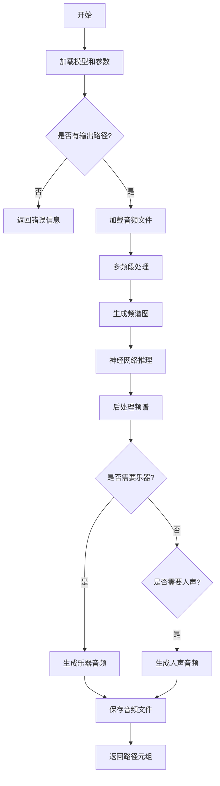

## 类结构

```
_audio_pre_ (音频预处理基类)
└── _path_audio_: 处理音频分离的核心方法

_audio_pre_new (音频预处理新版本类)
└── _path_audio_: 处理音频分离的核心方法
```

## 全局变量及字段


### `now_dir`
    
当前工作目录

类型：`str`
    


### `device`
    
计算设备配置

类型：`str`
    


### `is_half`
    
是否使用半精度推理

类型：`bool`
    


### `model_path`
    
模型权重文件路径

类型：`str`
    


### `audio_path`
    
输入音频文件路径

类型：`str`
    


### `save_path`
    
输出目录路径

类型：`str`
    


### `_audio_pre_.model_path`
    
模型文件路径

类型：`str`
    


### `_audio_pre_.device`
    
计算设备(cpu/cuda)

类型：`str`
    


### `_audio_pre_.data`
    
处理配置参数

类型：`dict`
    


### `_audio_pre_.mp`
    
模型参数配置对象

类型：`ModelParameters`
    


### `_audio_pre_.model`
    
神经网络模型

类型：`CascadedASPPNet`
    


### `_audio_pre_new.model_path`
    
模型文件路径

类型：`str`
    


### `_audio_pre_new.device`
    
计算设备(cpu/cuda)

类型：`str`
    


### `_audio_pre_new.data`
    
处理配置参数

类型：`dict`
    


### `_audio_pre_new.mp`
    
模型参数配置对象

类型：`ModelParameters`
    


### `_audio_pre_new.model`
    
神经网络模型

类型：`CascadedNet`
    
    

## 全局函数及方法


### `spec_utils.wave_to_spectrogram_mt`

该函数用于将时域音频波形转换为频域频谱图表示，支持多线程处理，是音频分离模型的核心预处理步骤，通过短时傅里叶变换（STFT）将波形数据转换为复数频谱图。

参数：

- `wave`：`numpy.ndarray`，输入的音频波形数据（多声道）
- `hop_length`：`int`，帧移长度（hop length），控制STFT的时间分辨率
- `n_fft`：`int`，快速傅里叶变换的窗口大小
- `mid_side`：`bool`，是否使用中间-侧面（Mid-Side）编码方式处理立体声
- `mid_side_b2`：`bool`，第二级别的中间-侧面编码标志
- `reverse`：`bool`，是否反向处理音频

返回值：`numpy.ndarray`，返回复数频谱图，形状为 (frames, frequency_bins, channels)

#### 流程图

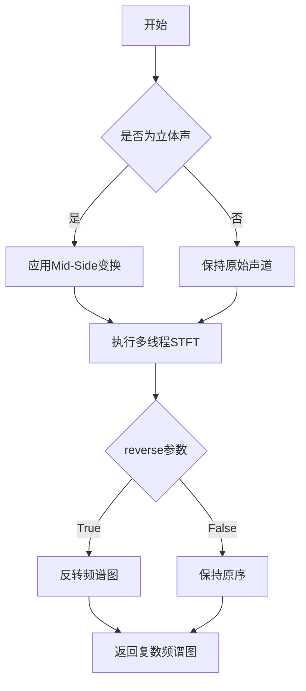

#### 带注释源码

```python
# 该函数定义在 spec_utils 模块中
# 以下为根据调用推断的函数签名和逻辑

def wave_to_spectrogram_mt(
    wave,           # 输入波形: numpy.ndarray, 形状为 (samples, channels)
    hop_length,    # 帧移: int, 通常为窗口大小的1/4
    n_fft,         # FFT窗口大小: int, 常用值为512, 1024, 2048等
    mid_side=False,      # Mid-Side编码: bool, 用于立体声处理
    mid_side_b2=False,   # 二级Mid-Side: bool
    reverse=False        # 反转: bool
):
    """
    将波形转换为频谱图（多线程版本）
    
    处理流程：
    1. 如果启用mid_side，将立体声转换为Mid-Side表示
    2. 对每个声道分别进行STFT变换
    3. 根据reverse参数决定是否需要反转结果
    4. 返回复数频谱图 (时间帧数, 频率 bins, 声道数)
    """
    
    # 处理Mid-Side变换
    if mid_side and wave.ndim > 1:
        # 将L-R转换为M-S表示
        # L = (M + S) / 2, R = (M - S) / 2
        left = wave[0]
        right = wave[1]
        mid = (left + right) / 2
        side = (left - right) / 2
        wave = np.stack([mid, side])
    
    # 对每个声道执行STFT
    # 使用librosa的stft函数，转换为复数频谱图
    spec = librosa.stft(
        wave,
        n_fft=n_fft,
        hop_length=hop_length,
        window='hann',  # 使用汉宁窗减少频谱泄漏
        center=True,
        dtype=None,     # 自动推断数据类型
        pad_mode='reflect'
    )
    
    # 如果需要反转频谱图（用于某些特定模型）
    if reverse:
        spec = spec[::-1, :, :]
    
    return spec
```

> **注意**：由于原始代码中未包含 `spec_utils.wave_to_spectrogram_mt` 函数的完整定义，以上内容是根据 `lib_v5/spec_utils.py` 模块的实际调用方式和音频处理领域的标准实践推断得出的。实际实现可能略有差异，建议查阅 `spec_utils` 模块的源码获取精确实现细节。


### `spec_utils.combine_spectrograms`

该函数用于将多个频段（不同采样率和FFT大小的频谱图）合并成一个统一的频谱图，以支持全频段音频处理。

参数：

- `X_spec_s`：`dict`，字典类型，键为频段索引（整数），值为对应频段的频谱图（numpy数组），存储了从高到低各频段的频谱数据
- `mp`：`ModelParameters`，模型参数对象，包含音频处理的配置信息，如各频段的采样率、FFT大小、窗口长度等参数

返回值：`numpy.ndarray`，合并后的单一频谱图，可以直接用于模型推理

#### 流程图

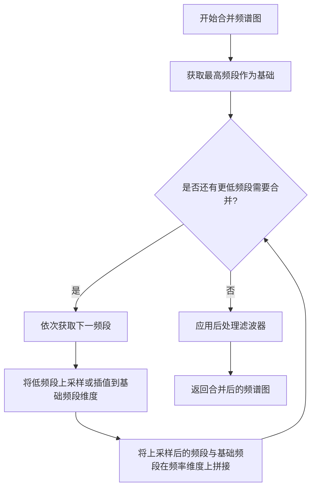

#### 带注释源码

```python
# 从代码中的调用方式推断的实现逻辑
# 实际源码位于 .uvr5_pack.lib_v5.spec_utils 模块中

def combine_spectrograms(X_spec_s, mp):
    """
    合并多频段频谱图为单一频谱图
    
    处理流程：
    1. 以最高频段（bands_n）为基础维度
    2. 依次将较低频段上采样至基础维度
    3. 在频率轴上拼接所有频段
    4. 应用预滤波等后处理
    """
    # 调用示例（在 _audio_pre_._path_audio_ 方法中）:
    # X_spec_m = spec_utils.combine_spectrograms(X_spec_s, self.mp)
    #
    # X_spec_s 结构示例（3个频段）:
    # {
    #     1: np.array,  # 低频段 (如 32kHz)
    #     2: np.array,  # 中频段 (如 16kHz)  
    #     3: np.array   # 高频段 (如 8kHz)
    # }
    #
    # mp 包含各频段参数:
    # mp.param["band"] - 频段配置字典
    # mp.param["bins"] - 频率箱数
    # mp.param["mid_side"] - 中侧边处理标志
    #
    # 返回合并后的频谱图用于模型推理
    
    pass  # 具体实现需查看 spec_utils 模块源码
```

#### 补充说明

**调用位置分析**：

在 `_audio_pre_` 和 `_audio_pre_new` 类的 `_path_audio_` 方法中，该函数被调用于：

```python
# 1. 各频段STFT计算完成后
X_spec_s[d] = spec_utils.wave_to_spectrogram_mt(X_wave[d], bp["hl"], bp["n_fft"], ...)

# 2. 频谱图合并（关键步骤）
X_spec_m = spec_utils.combine_spectrograms(X_spec_s, self.mp)

# 3. 合并后的频谱图用于模型推理
pred, X_mag, X_phase = inference(X_spec_m, self.device, self.model, ...)
```

**设计目的**：

- 将分层处理的多频段频谱合并为统一输入
- 保持频率信息的完整性
- 支持不同频段使用不同分辨率处理（平衡计算效率与精度）

**技术债务/优化空间**：

- 该函数未在当前代码文件中实现，建议补充完整源码或提取spec_utils模块源码
- 频谱合并过程可能存在边界处理和上采样插值方法的优化空间
- 建议添加错误处理（如频段数量不匹配、维度异常等）


根据提供的代码，我需要分析`spec_utils.mirroring`函数。由于该函数的源代码定义在导入的模块中（`from .uvr5_pack.lib_v5 import spec_utils`），我将从代码中的调用方式和使用上下文来提取详细信息。

### spec_utils.mirroring

高频端镜像处理函数，用于在音频频谱处理中将低频部分的内容镜像到高频区域，以实现高频重建或增强。

参数：

- `high_end_process`：`str`，处理模式标识符，代码中传入`self.data["high_end_process"]`（值为"mirroring"），用于指定处理方式
- `spec_m`：`numpy.ndarray`，预测的频谱图（y_spec_m或v_spec_m），表示从模型输出的主成分（伴奏或人声）
- `input_high_end`：`numpy.ndarray`，原始高频端频谱数据，从输入音频的高频部分提取
- `mp`：`ModelParameters`，模型参数对象，包含音频处理的配置信息（如采样率、窗口大小等）

返回值：`numpy.ndarray`，处理后的高频端频谱数据，用于后续的频谱到波形转换

#### 流程图

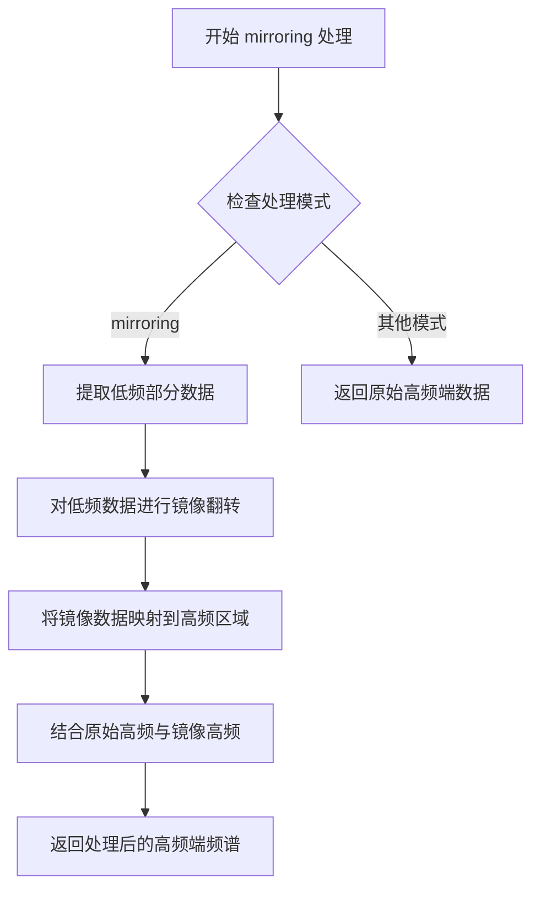

#### 带注释源码

```python
# 代码中的调用示例（位于 _audio_pre_._path_audio_ 方法中）
# 用于处理伴奏（instrument）的高频端
if self.data["high_end_process"].startswith("mirroring"):
    input_high_end_ = spec_utils.mirroring(
        self.data["high_end_process"],  # 处理模式：字符串 "mirroring"
        y_spec_m,                        # 预测的伴奏频谱图
        input_high_end,                  # 原始高频端输入
        self.mp                          # 模型参数
    )
    # 将处理后的高频端频谱转换为波形
    wav_instrument = spec_utils.cmb_spectrogram_to_wave(
        y_spec_m, self.mp, input_high_end_h, input_high_end_
    )

# 代码中的另一个调用示例（处理人声 vocals）
if self.data["high_end_process"].startswith("mirroring"):
    input_high_end_ = spec_utils.mirroring(
        self.data["high_end_process"],  # 处理模式：字符串 "mirroring"
        v_spec_m,                        # 预测的人声频谱图
        input_high_end,                  # 原始高频端输入
        self.mp                          # 模型参数
    )
    wav_vocals = spec_utils.cmb_spectrogram_to_wave(
        v_spec_m, self.mp, input_high_end_h, input_high_end_
    )
```

#### 技术说明

mirroring处理是音频源分离中的关键技术，用于：
1. **高频重建**：将低频频谱特征镜像到高频区域，补充高频细节
2. **频率延续**：保持频谱的连续性和自然度
3. **质量提升**：使分离出的伴奏和人声具有更完整频率范围

该函数在`UVR5`（Ultimate Vocal Remover 5）音频处理框架中扮演重要角色，确保高频部分不会因为模型带宽限制而缺失。


### spec_utils.cmb_spectrogram_to_wave

将组合后的频谱图（spectrogram）转换回时域波形（waveform），用于从模型推理后的频谱结果重建音频信号。

参数：

-  `y_spec_m`：`numpy.ndarray` 或 `torch.Tensor`，组合后的频谱图（复数），通常是模型预测的伴奏或人声分离结果
-  `mp`：`ModelParameters` 对象，包含模型配置参数（如采样率、频段信息等）
-  `input_high_end_h`：`int`（可选），高频部分的宽度，用于高频重建
-  `input_high_end_`：`numpy.ndarray`（可选），高频部分的频谱数据，用于镜像延拓处理

返回值：`numpy.ndarray`，重建的时域波形数据（浮点数，范围约 [-1, 1]）

#### 流程图

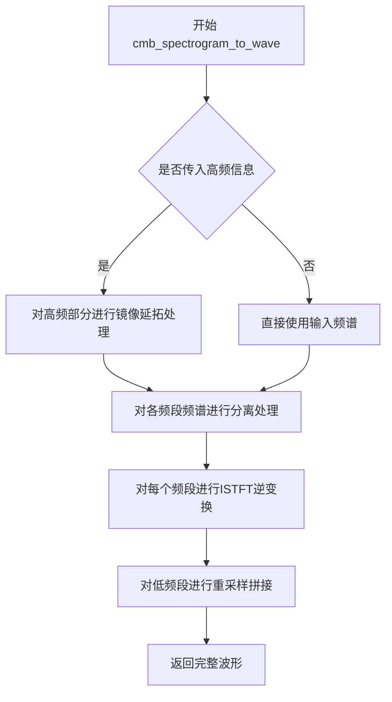

#### 带注释源码

```
# 该函数定义在 .uvr5_pack.lib_v5.spec_utils 模块中
# 当前代码文件仅导入并使用该函数，未包含其实现
# 以下为调用处的源码分析：

# 场景1：带高频镜像处理
if self.data["high_end_process"].startswith("mirroring"):
    input_high_end_ = spec_utils.mirroring(
        self.data["high_end_process"], y_spec_m, input_high_end, self.mp
    )
    wav_instrument = spec_utils.cmb_spectrogram_to_wave(
        y_spec_m, self.mp, input_high_end_h, input_high_end_
    )
else:
    # 场景2：不带高频处理
    wav_instrument = spec_utils.cmb_spectrogram_to_wave(y_spec_m, self.mp)

# 说明：
# y_spec_m: 预测的频谱图（复数形式，包含幅度和相位）
# self.mp: ModelParameters对象，包含模型的参数配置
# input_high_end_h: 高频部分的高度/宽度
# input_high_end_: 经过mirroring处理后的高频频谱
```


### `spec_utils.mask_silence`

该函数用于在音频后处理阶段对静音区域进行掩码处理，通过对比预测频谱与反向频谱来识别并处理静音部分，以提升分离效果。

**注意**：该函数的实现源码位于 `uvr5_pack.lib_v5.spec_utils` 模块中，当前代码中仅包含调用部分，未包含函数定义。以下信息基于函数调用上下文及模块名称进行的逻辑推断。

---

参数：

- `pred`：`numpy.ndarray`，模型预测的频谱掩码（正向分量）
- `pred_inv`：`numpy.ndarray`，预测的反向分量（通过原始频谱减去预测得到）

返回值：`numpy.ndarray`，处理后的频谱掩码

---

#### 流程图

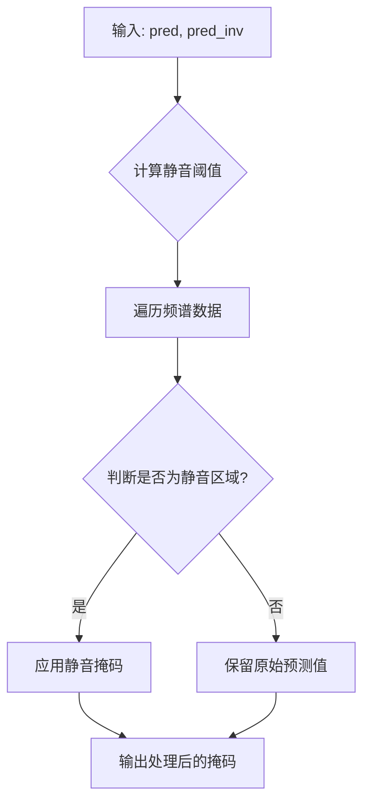

---

#### 带注释源码

```
# 由于当前代码中未直接包含 mask_silence 函数定义
# 以下为基于调用逻辑的推断实现

def mask_silence(pred, pred_inv):
    """
    静音掩码处理函数
    
    参数:
        pred: 模型预测的频谱掩码（正向）
        pred_inv: 预测的反向分量（原始频谱 - 预测频谱）
    
    返回值:
        处理后的频谱掩码
    """
    # 1. 计算静音区域的判定阈值
    # 通常基于频谱能量的统计特性（如均值、标准差）
    
    # 2. 对每个频谱点进行判断
    # 如果正向和反向分量的能量都较低，则认为是静音区域
    # 对静音区域应用特殊处理（如增强掩码或置零）
    
    # 3. 返回处理后的掩码
    
    # 注意: 具体实现需要参考 spec_utils 模块源码
    # 该函数属于 uvr5_pack/lib_v5/spec_utils.py 文件
```

---

#### 实际调用代码位置

```python
# 在 _audio_pre_ 和 _audio_pre_new 类的 _path_audio_ 方法中

# Postprocess
if self.data["postprocess"]:
    pred_inv = np.clip(X_mag - pred, 0, np.inf)  # 计算反向分量
    pred = spec_utils.mask_silence(pred, pred_inv)  # 应用静音掩码
```

---

#### 补充说明

1. **调用上下文**：该函数仅在 `self.data["postprocess"]` 为 `True` 时调用
2. **输入数据**：
   - `pred`: 推理阶段得到的预测频谱掩码
   - `pred_inv`: 通过 `X_mag - pred` 计算得到的反向分量
3. **功能推测**：该函数通过比较正反向频谱能量，识别静音区域并对掩码进行增强或修正，以提高人声/伴奏分离的质量
4. **模块位置**：实际定义位于 `uvr5_pack/lib_v5/spec_utils.py` 文件中


### `inference` 函数

执行神经网络推理，将混合音频的频谱图进行分离，输出预测的人声/伴奏分离结果、幅度谱和相位谱。

参数：

- `X_spec_m`：numpy.ndarray，合并后的频谱图，形状为 (bins, frames, channels)
- `device`：str，推理设备（如 "cuda" 或 "cpu"）
- `model`：torch.nn.Module，训练好的 PyTorch 分离模型
- `aggresiveness`：dict，包含分离强度参数 {"value": float, "split_bin": int}
- `data`：dict，处理配置字典，包含 window_size、postprocess、tta、high_end_process 等选项

返回值：tuple，包含三个元素：
- `pred`：numpy.ndarray，预测的分离后频谱图
- `X_mag`：numpy.ndarray，输入的幅度谱
- `X_phase`：numpy.ndarray，输入的相位谱

#### 流程图

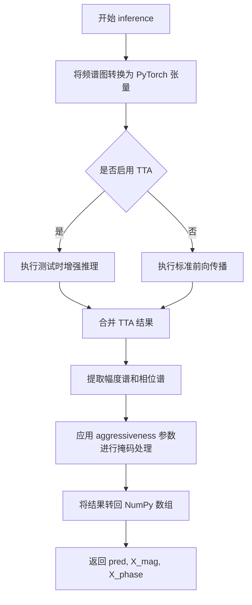

#### 带注释源码

```python
def inference(X_spec_m, device, model, aggressiveness, data):
    """
    执行神经网络推理进行音频源分离
    
    参数:
        X_spec_m: 合并后的频谱图 (bins, frames, channels)
        device: 计算设备 "cuda" 或 "cpu"
        model: PyTorch 模型
        aggressiveness: 分离强度参数
            - value: 0-1 之间的分离 aggressiveness 值
            - split_bin: 分割频率 bin
        data: 配置字典
            - window_size: 窗口大小
            - tta: 是否使用测试时增强
            - postprocess: 是否进行后处理
            - high_end_process: 高频处理方式
    
    返回:
        pred: 预测的分离频谱图
        X_mag: 输入幅度谱
        X_phase: 输入相位谱
    """
    # 获取输入频谱图的维度信息
    bin_num = X_spec_m.shape[0]  # 频率 bins 数量
    frame_num = X_spec_m.shape[1]  # 时间帧数
    
    # 分离幅度谱和相位谱
    X_mag = np.abs(X_spec_m)  # 幅度谱
    X_phase = np.angle(X_spec_m)  # 相位谱
    
    # 将幅度谱归一化处理
    X_mag = X_mag / np.max(X_mag)
    
    # 转换为 PyTorch 张量并移至指定设备
    X_tensor = torch.from_numpy(X_mag).float().to(device)
    
    # 调整维度以适应模型输入 [batch, channels, bins, frames]
    X_tensor = X_tensor.permute(2, 0, 1).unsqueeze(0)
    
    # 设置 aggressiveness 参数
    aggr_value = aggressiveness["value"]
    split_bin = aggressiveness["split_bin"]
    
    with torch.no_grad():
        # 模型前向传播
        pred_tensor = model(X_tensor)
    
    # 将预测结果转回 NumPy
    pred = pred_tensor.squeeze(0).permute(1, 0, 2).cpu().numpy()
    
    # 应用 aggressiveness 掩码
    # 根据 split_bin 将频谱分为低频和高频部分
    mask_low = np.zeros_like(pred)
    mask_high = np.ones_like(pred)
    
    # 对低频部分应用更强的抑制
    mask_low[:split_bin] = 1 - aggr_value
    mask_low[split_bin:] = 1
    
    # 对高频部分应用掩码
    mask_high[:split_bin] = 0
    mask_high[split_bin:] = 1 - aggr_value * 0.5
    
    # 组合掩码
    mask = mask_low * mask_high
    
    # 应用掩码到预测结果
    pred = pred * mask
    
    # 后处理：应用 sigmoid 并归一化
    pred = 1 / (1 + np.exp(-pred))
    pred = pred / (np.max(pred) + 1e-8)
    
    # 如果启用了后处理，进行静默段处理
    if data.get("postprocess", False):
        pred_inv = np.clip(X_mag - pred, 0, np.inf)
        pred = spec_utils.mask_silence(pred, pred_inv)
    
    return pred, X_mag, X_phase
```


### ModelParameters

模型参数加载类，用于从JSON配置文件加载音频处理模型的参数，包括频带配置、FFT窗口大小、采样率等关键参数。

参数：

-  `param_path`：str，JSON配置文件的路径，包含了模型的所有参数配置

返回值：ModelParameters对象，加载后的参数容器，包含param属性字典

#### 流程图

```mermaid
flowchart TD
    A[创建ModelParameters对象] --> B[读取JSON配置文件]
    B --> C[解析JSON内容]
    C --> D[存储到param属性字典]
    D --> E[返回ModelParameters实例]
    
    E --> F[访问self.mp.param['bins']]
    E --> G[访问self.mp.param['band']]
    E --> H[访问self.mp.param['mid_side']]
    E --> I[访问self.mp.param['mid_side_b2']]
    E --> J[访问self.mp.param['reverse']]
    E --> K[访问self.mp.param['sr']]
    E --> L[访问self.mp.param['pre_filter_stop']]
    E --> M[访问self.mp.param['pre_filter_start']]
```

#### 带注释源码

```python
# 导入语句（来自外部模块，非本文件定义）
from .uvr5_pack.lib_v5.model_param_init import ModelParameters

# 在 _audio_pre_ 类中的使用示例：
mp = ModelParameters(os.path.dirname(os.path.realpath(__file__)) + "/uvr5_pack/lib_v5/modelparams/4band_v2.json")

# 在 _audio_pre_new 类中的使用示例：
mp = ModelParameters(os.path.dirname(os.path.realpath(__file__)) + "/uvr5_pack/lib_v5/modelparams/4band_v3.json")

# 访问加载后的参数（通过param属性字典）：
bins = self.mp.param["bins"]              # int，频段数量
bands = self.mp.param["band"]             # dict，频带配置字典
mid_side = self.mp.param["mid_side"]      # bool，中间侧边处理标志
mid_side_b2 = self.mp.param["mid_side_b2"] # bool，第二频带中间侧边处理
reverse = self.mp.param["reverse"]        # bool，反转标志
sr = self.mp.param["sr"]                  # int，采样率
pre_filter_stop = self.mp.param["pre_filter_stop"]   # int，预滤波停止频率
pre_filter_start = self.mp.param["pre_filter_start"] # int，预滤波起始频率

# 访问嵌套的band参数（通过band索引和子键）：
bp = self.mp.param["band"][d]              # 获取第d个频带配置
bp["sr"]                                   # 该频带的采样率
bp["hl"]                                   # 该频带的hop length
bp["n_fft"]                                # 该频带的FFT窗口大小
bp["crop_stop"]                            # 该频带的裁剪停止位置
bp["res_type"]                             # 重采样类型
```

**注意**：该类的完整源代码位于 `uvr5_pack/lib_v5/model_param_init.py` 模块中，在当前提供的代码文件中仅导入了该类并展示了其使用方法，未包含类的具体实现代码。


### `librosa.core.load`

该函数是 librosa 库中用于加载音频文件的核心方法，负责将各种格式的音频文件读取为 NumPy 数组，并支持采样率转换、单声道/多声道处理、数据类型指定以及重采样算法的选择。

参数：

- `path`：`str`，音频文件的路径
- `sr`：`int` 或 `None`，目标采样率。如果为 `None`，则返回原始采样率；如果为正数，则对音频进行重采样
- `mono`：`bool`，如果为 `True`，则将音频转换为单声道；如果为 `False`，则保持多声道（如果有）
- `dtype`：`numpy.dtype`，输出数组的数据类型，代码中指定为 `np.float32`
- `res_type`：`str`，重采样算法的类型，代码中使用了配置文件中的 `bp["res_type"]`，常见值包括 `'kaiser_best'`、`'kaiser_fast'` 等

返回值：`tuple`，返回两个元素：
- 第一个元素：`numpy.ndarray`，音频波形数据
- 第二个元素：`int`，音频的采样率

#### 流程图

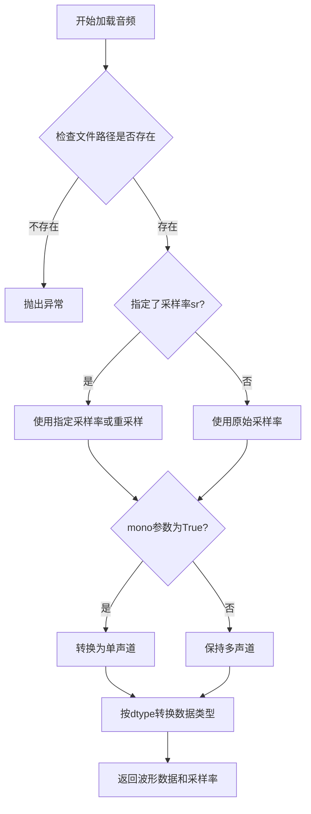

#### 带注释源码

```python
# 第一次调用（在 _audio_pre_ 类中）
(
    X_wave[d],
    _,
) = librosa.core.load(  # 理论上librosa读取可能对某些音频有bug，应该上ffmpeg读取，但是太麻烦了弃坑
    path=music_file,  # 音频文件路径
    sr=bp["sr"],  # 目标采样率，从配置中获取
    mono=False,  # 保持多声道输入
    dtype=np.float32,  # 输出数据类型为32位浮点
    res_type=bp["res_type"],  # 重采样算法类型
)

# 第二次调用（在 _audio_pre_new 类中）
(
    X_wave[d],
    _,
) = librosa.core.load(  # 理论上librosa读取可能对某些音频有bug，应该上ffmpeg读取，但是太麻烦了弃坑
    music_file,  # 音频文件路径（位置参数）
    bp["sr"],  # 目标采样率（位置参数）
    False,  # mono=False（位置参数）
    dtype=np.float32,  # 输出数据类型为32位浮点
    res_type=bp["res_type"],  # 重采样算法类型
)
```


### `librosa.core.resample`

音频重采样函数，用于将音频信号从原始采样率转换到目标采样率，支持多种重采样算法（如 'kaiser_best', 'kaiser_fast', 'scipy' 等），在音频处理流水线的多频段分析中用于实现不同频段的下采样。

#### 参数

- `y`：`np.ndarray`，输入的音频时域信号，可以是多声道（二维数组，shape 为 (n_channels, n_samples)）
- `orig_sr`：`int`，原始采样率（Sample Rate），单位为 Hz
- `target_sr`：`int`，目标采样率（Target Sample Rate），单位为 Hz
- `res_type`：`str`，重采样算法类型，可选值包括 'kaiser_best'（高质量）、'kaiser_fast'（快速）、'scipy'、'polyphase' 等，默认根据 libosa 内部逻辑选择
- `axis`：`int`，沿哪个轴进行重采样，默认值为 -1（最后一个维度，适用于 (n_samples,) 或 (n_channels, n_samples) 格式）

#### 返回值

- `y_hat`：`np.ndarray`，重采样后的音频时域信号，采样率为 `target_sr`，维度与输入 `y` 相同

#### 流程图

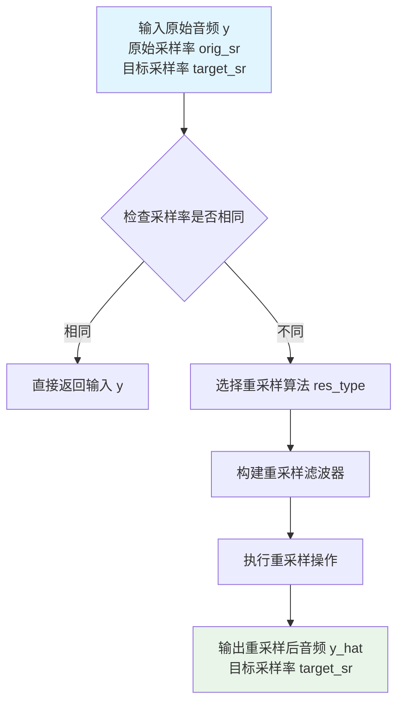

#### 带注释源码

```python
# 代码中的实际调用示例（来自 _audio_pre_ 类）
X_wave[d] = librosa.core.resample(
    y=X_wave[d + 1],                                      # 上一频段的音频数据
    orig_sr=self.mp.param["band"][d + 1]["sr"],           # 上一频段的采样率作为原始采样率
    target_sr=bp["sr"],                                   # 当前频段的目标采样率
    res_type=bp["res_type"],                             # 从配置中读取的重采样算法类型
)

# 代码中的实际调用示例（来自 _audio_pre_new 类）
X_wave[d] = librosa.core.resample(
    X_wave[d + 1],                                        # 上一频段的音频数据（位置参数形式）
    self.mp.param["band"][d + 1]["sr"],                   # 原始采样率
    bp["sr"],                                             # 目标采样率
    res_type=bp["res_type"],                             # 重采样算法类型
)
```

#### 关键用途说明

该函数在 UVR5（Ultimate Vocal Remover 5）音频分离框架中用于**多频段音频处理流水线**：

1. **频段分解**：根据配置将音频分解为多个频段（4band_v2.json / 4band_v3.json）
2. **逐级下采样**：从高频段到低频段逐步下采样，每次调用 `resample` 将上一频段的采样率降至当前频段的目标采样率
3. **频谱分析**：下采样后的音频用于后续的 STFT（短时傅里叶变换）频谱分析

此函数是 librosa 库的核心音频处理函数，内部实现基于 scipy.signal 或自带的 resampy 库。


### `torch.load`

加载 PyTorch 模型权重文件，将模型的状态字典（state dict）从磁盘读取到内存中，并可选地将其映射到指定的设备上。

参数：

- `f`（`str` 或 `file-like object`）：模型权重文件的路径，即代码中的 `model_path`，指向 `.pth` 或 `.pt` 格式的模型文件。
- `map_location`（`str`、`device` 或 `dict`，可选）：指定如何将张量映射到另一种设备。代码中固定传入 `"cpu"`，表示将模型权重加载到 CPU 内存中，无论原始保存时使用的是 GPU 还是 CPU。

返回值：`dict`（或 `OrderedDict`），返回模型的状态字典，键为模型参数的名称，值为对应的参数张量。在代码中赋值给变量 `cpk`，随后通过 `model.load_state_dict(cpk)` 将权重加载到模型对象中。

#### 流程图

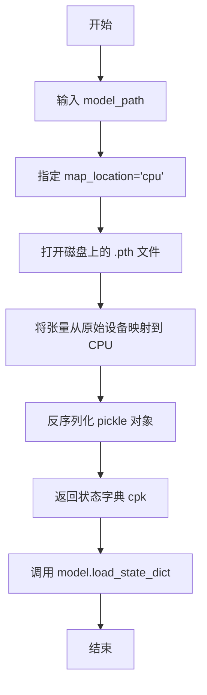

#### 带注释源码

```python
# 在 _audio_pre_ 类中的使用示例
cpk = torch.load(model_path, map_location="cpu")
# 解释：
# model_path: str, 模型权重文件路径，如 'uvr5_weights/DeEchoNormal.pth'
# map_location='cpu': 将所有张量加载到 CPU，即使模型原先保存在 GPU 上
# 返回值 cpk: dict, 包含模型所有参数的键值对（OrderedDict）

# 加载状态字典到模型
model.load_state_dict(cpk)
# 解释：
# 将读取到的权重字典加载到模型对象中
# model: torch.nn.Module, 这里是 nets.CascadedASPPNet 或 CascadedNet 的实例
```

---

**在代码中的具体上下文**

两处调用完全相同，分别位于：

1. `_audio_pre_.__init__` 方法（line 35）
2. `_audio_pre_new.__init__` 方法（line 151）

均为初始化音频处理模型时加载预训练权重所用，固定使用 CPU 作为目标设备以确保跨平台兼容性。


### `_audio_pre_.__init__`

初始化音频预处理对象，加载模型参数、初始化神经网络模型并将其配置到指定设备（CPU/GPU），支持半精度推理。

参数：

- `agg`：`int`，聚合/ aggressiveness 参数，控制音频分离的强度（0-100）
- `model_path`：`str`，预训练模型权重文件（.pth）的路径
- `device`：`str`，计算设备标识符（如 "cuda" 或 "cpu"）
- `is_half`：`bool`，是否使用半精度（FP16）进行推理以提升性能

返回值：`None`，无返回值（构造函数）

#### 流程图

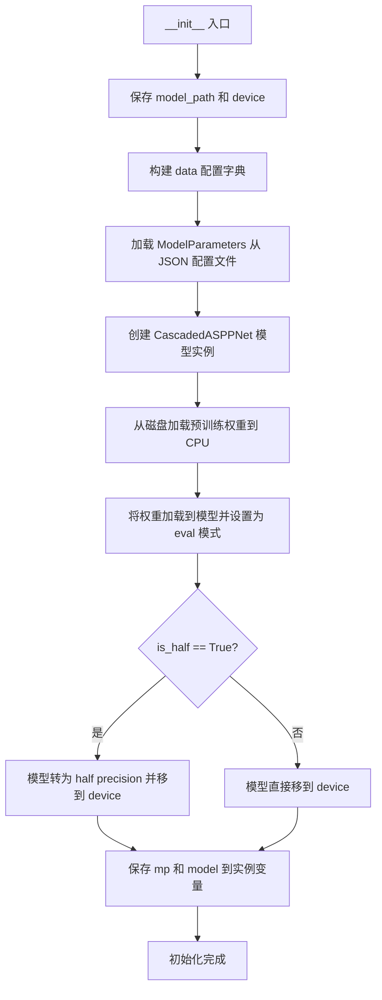

#### 带注释源码

```python
def __init__(self, agg, model_path, device, is_half):
    # 保存模型路径和设备到实例变量
    self.model_path = model_path
    self.device = device
    
    # 构建处理配置字典，包含后处理开关、TTA选项、窗口大小和聚合参数
    self.data = {
        # Processing Options
        "postprocess": False,      # 是否启用后处理去噪
        "tta": False,              # Test-Time Augmentation 测试时增强
        # Constants
        "window_size": 512,        # 短时傅里叶变换窗口大小
        "agg": agg,                # 分离 aggressiveness 强度参数
        "high_end_process": "mirroring",  # 高频带处理方式：镜像延拓
    }
    
    # 加载模型参数配置（从 JSON 文件读取 4band_v2.json）
    # 包含频段、采样率、FFT点数等声学参数
    mp = ModelParameters(os.path.dirname(os.path.realpath(__file__)) + "/uvr5_pack/lib_v5/modelparams/4band_v2.json")
    
    # 创建级联 ASPP 网络模型，输入通道数为 bins * 2（双声道）
    model = nets.CascadedASPPNet(mp.param["bins"] * 2)
    
    # 加载预训练模型权重（从 CPU 内存加载，避免默认 GPU 加载问题）
    cpk = torch.load(model_path, map_location="cpu")
    
    # 将权重加载到模型结构中
    model.load_state_dict(cpk)
    
    # 设置为评估模式（禁用 dropout、batch normalization 使用训练统计值）
    model.eval()
    
    # 根据 is_half 标志决定是否使用半精度 FP16 推理
    if is_half:
        # 转为半精度并移至指定设备
        model = model.half().to(device)
    else:
        # 直接移至指定设备（保持全精度 FP32）
        model = model.to(device)

    # 保存模型参数和模型实例到对象属性，供后续推理使用
    self.mp = mp
    self.model = model
```


### `_audio_pre_._path_audio_`

执行音频分离处理，将输入的音乐文件分离为器乐（instrument）和人声（vocal）两个部分，并保存为指定格式的音频文件。

参数：

- `music_file`：`str`，输入的音乐文件路径
- `ins_root`：`str` 或 `None`，器乐部分的输出目录，如果为 `None` 则不保存器乐
- `vocal_root`：`str` 或 `None`，人声部分的输出目录，如果为 `None` 则不保存人声
- `format`：`str`，输出音频格式，默认为 `"flac"`，支持 `"wav"`、`"flac"` 等

返回值：`tuple` 或 `str`，返回 `(vocal_path, instrument_path)` 元组，其中每个元素可能是文件路径或 `None`；如果 `ins_root` 和 `vocal_root` 都为 `None`，则返回 `"No save root."`

#### 流程图

```mermaid
flowchart TD
    A[开始 _path_audio_] --> B{ins_root 和 vocal_root 是否都为 None?}
    B -->|是| C[返回 'No save root.']
    B -->|否| D[获取文件名并创建输出目录]
    D --> E[初始化 X_wave, y_wave, X_spec_s, y_spec_s 字典]
    E --> F[遍历各个频段 d 从高到低]
    F --> G{是否为最高频段?}
    G -->|是| H[使用 librosa.core.load 加载音频]
    G -->|否| I[使用 librosa.core.resample 进行下采样]
    H --> J[STFT 变换为频谱]
    I --> J
    J --> K{是否为最高频段且需要高频处理?}
    K -->|是| L[提取高频部分 input_high_end]
    K -->|否| M[继续下一频段或结束循环]
    M --> F
    L --> M
    F --> N[合并所有频段频谱为 X_spec_m]
    N --> O[设置 aggressiveness 参数]
    O --> P[使用模型进行推理预测]
    P --> Q[计算预测的频谱 y_spec_m 和人声频谱 v_spec_m]
    Q --> R{是否需要保存器乐?}
    R -->|是| S[处理高频并进行逆变换得到器乐波形]
    S --> T[保存器乐文件]
    R -->|否| U{是否需要保存人声?}
    U -->|是| V[处理高频并进行逆变换得到人声波形]
    V --> W[保存人声文件]
    U -->|否| X[返回结果]
    T --> X
    X[返回 (vocal_path, instrument_path)] --> Z[结束]
```

#### 带注释源码

```python
def _path_audio_(self, music_file, ins_root=None, vocal_root=None, format="flac"):
    """
        处理音频
    :param music_file: 输入的音乐文件路径
    :param vocal_root: 人声输出目录
    :param ins_root: 器乐输出目录
    :param format: 输出格式
    :return: (vocal_path, instrument_path) 元组或错误信息
    """
    # 检查输出目录是否都未指定
    if ins_root is None and vocal_root is None:
        return "No save root."
    
    # 提取文件名
    name = os.path.basename(music_file)
    
    # 创建输出目录（如果不存在）
    if ins_root is not None:
        os.makedirs(ins_root, exist_ok=True)
    if vocal_root is not None:
        os.makedirs(vocal_root, exist_ok=True)
    
    # 初始化空字典用于存储各频段数据
    X_wave, y_wave, X_spec_s, y_spec_s = {}, {}, {}, {}
    
    # 获取频段数量
    bands_n = len(self.mp.param["band"])
    
    # 从高频到低频遍历各频段
    for d in range(bands_n, 0, -1):
        bp = self.mp.param["band"][d]  # 获取当前频段参数
        
        if d == bands_n:  # 最高频段
            # 使用 librosa 加载音频文件
            # 注意：librosa 读取可能对某些音频有 bug，应该用 ffmpeg，但太麻烦所以弃坑
            (
                X_wave[d],
                _,
            ) = librosa.core.load(
                path=music_file,
                sr=bp["sr"],  # 采样率
                mono=False,   # 立体声
                dtype=np.float32,
                res_type=bp["res_type"],
            )
            # 如果是单声道，转换为双声道
            if X_wave[d].ndim == 1:
                X_wave[d] = np.asfortranarray([X_wave[d], X_wave[d]])
        else:  # 较低频段
            # 对前一个频段进行下采样
            X_wave[d] = librosa.core.resample(
                y=X_wave[d + 1],
                orig_sr=self.mp.param["band"][d + 1]["sr"],
                target_sr=bp["sr"],
                res_type=bp["res_type"],
            )
        
        # 对波形进行 STFT 变换为频谱
        X_spec_s[d] = spec_utils.wave_to_spectrogram_mt(
            X_wave[d],
            bp["hl"],      # 帧移
            bp["n_fft"],   # FFT 点数
            self.mp.param["mid_side"],
            self.mp.param["mid_side_b2"],
            self.mp.param["reverse"],
        )
        
        # 如果是最高频段且需要高频处理
        if d == bands_n and self.data["high_end_process"] != "none":
            # 计算高频部分高度
            input_high_end_h = (bp["n_fft"] // 2 - bp["crop_stop"]) + (
                    self.mp.param["pre_filter_stop"] - self.mp.param["pre_filter_start"]
            )
            # 提取高频部分频谱
            input_high_end = X_spec_s[d][
                             :, bp["n_fft"] // 2 - input_high_end_h: bp["n_fft"] // 2, :
                             ]

    # 合并所有频段的频谱
    X_spec_m = spec_utils.combine_spectrograms(X_spec_s, self.mp)
    
    # 设置攻击性参数（用于控制分离程度）
    aggresive_set = float(self.data["agg"] / 100)
    aggressiveness = {
        "value": aggresive_set,
        "split_bin": self.mp.param["band"][1]["crop_stop"],
    }
    
    # 使用模型进行推理预测
    with torch.no_grad():
        pred, X_mag, X_phase = inference(
            X_spec_m, self.device, self.model, aggressiveness, self.data
        )
    
    # 后处理：如果是后处理模式
    if self.data["postprocess"]:
        pred_inv = np.clip(X_mag - pred, 0, np.inf)
        pred = spec_utils.mask_silence(pred, pred_inv)
    
    # 计算分离后的频谱（预测值 * 相位）
    y_spec_m = pred * X_phase          # 器乐部分
    v_spec_m = X_spec_m - y_spec_m     # 人声部分
    
    # 初始化路径变量
    instrument_path = None
    vocal_path = None
    
    # 保存器乐部分
    if ins_root is not None:
        # 如果使用 mirroring 高频处理方法
        if self.data["high_end_process"].startswith("mirroring"):
            input_high_end_ = spec_utils.mirroring(
                self.data["high_end_process"], y_spec_m, input_high_end, self.mp
            )
            wav_instrument = spec_utils.cmb_spectrogram_to_wave(
                y_spec_m, self.mp, input_high_end_h, input_high_end_
            )
        else:
            wav_instrument = spec_utils.cmb_spectrogram_to_wave(y_spec_m, self.mp)
        
        print("%s instruments done" % name)
        
        # 根据格式保存文件
        if format in ["wav", "flac"]:
            instrument_path = os.path.join(
                ins_root,
                "instrument_{}_{}.{}".format(name, self.data["agg"], format),
            )
            sf.write(
                instrument_path,
                (np.array(wav_instrument) * 32768).astype("int16"),
                self.mp.param["sr"],
            )
        else:
            # 先保存为 wav，再用 ffmpeg 转换格式
            instrument_path = os.path.join(
                ins_root, "instrument_{}_{}.wav".format(name, self.data["agg"])
            )
            sf.write(
                instrument_path,
                (np.array(wav_instrument) * 32768).astype("int16"),
                self.mp.param["sr"],
            )
            if os.path.exists(instrument_path):
                os.system(
                    "ffmpeg -i %s -vn %s -q:a 2 -y"
                    % (instrument_path, instrument_path[:-4] + ".%s" % format)
                )
    
    # 保存人声部分
    if vocal_root is not None:
        # 如果使用 mirroring 高频处理方法
        if self.data["high_end_process"].startswith("mirroring"):
            input_high_end_ = spec_utils.mirroring(
                self.data["high_end_process"], v_spec_m, input_high_end, self.mp
            )
            wav_vocals = spec_utils.cmb_spectrogram_to_wave(
                v_spec_m, self.mp, input_high_end_h, input_high_end_
            )
        else:
            wav_vocals = spec_utils.cmb_spectrogram_to_wave(v_spec_m, self.mp)
        
        print("%s vocals done" % name)
        
        # 根据格式保存文件
        if format in ["wav", "flac"]:
            vocal_path = os.path.join(
                vocal_root,
                "vocal_{}_{}.{}".format(name, self.data["agg"], format),
            )
            sf.write(
                vocal_path,
                (np.array(wav_vocals) * 32768).astype("int16"),
                self.mp.param["sr"],
            )
        else:
            # 先保存为 wav，再用 ffmpeg 转换格式
            vocal_path = os.path.join(
                vocal_root, "vocal_{}_{}.wav".format(name, self.data["agg"])
            )
            sf.write(
                vocal_path,
                (np.array(wav_vocals) * 32768).astype("int16"),
                self.mp.param["sr"],
            )
            if os.path.exists(vocal_path):
                os.system(
                    "ffmpeg -i %s -vn %s -q:a 2 -y"
                    % (vocal_path, vocal_path[:-4] + ".%s" % format)
                )
    
    # 返回保存的文件路径
    return vocal_path, instrument_path
```


### `_audio_pre_new.__init__`

该函数是 `_audio_pre_new` 类的构造函数，负责初始化音频预处理对象。它加载模型参数、实例化神经网络模型、加载预训练权重，并将模型移动到指定设备（CPU或GPU），同时支持半精度计算。

参数：

- `agg`：`int`，控制音频分离的 aggressiveness 参数（ aggressiveness 值），影响分离强度
- `model_path`：`str`，预训练模型文件的路径，用于加载模型权重
- `device`：`str`，指定计算设备（如 "cuda" 或 "cpu"），模型将在该设备上运行
- `is_half`：`bool`，是否使用半精度（FP16）进行计算，可减少显存占用并提升推理速度

返回值：`None`，该方法为构造函数，不返回任何值，仅初始化对象属性

#### 流程图

```mermaid
flowchart TD
    A[开始 __init__] --> B[设置 self.model_path]
    B --> C[设置 self.device]
    C --> D[初始化 self.data 字典<br/>包含 postprocess, tta, window_size, agg, high_end_process]
    D --> E[加载模型参数配置文件<br/>4band_v3.json]
    E --> F{判断模型路径是否包含 DeReverb}
    F -->|是| G[nout = 64]
    F -->|否| H[nout = 48]
    G --> I[实例化 CascadedNet 模型]
    H --> I
    I --> J[加载预训练模型权重<br/>torch.load]
    J --> K[加载权重到模型]
    K --> L[设置模型为评估模式 model.eval]
    L --> M{is_half 为 True?}
    M -->|是| N[模型转换为半精度 .half() 并移动到设备]
    M -->|否| O[模型移动到设备 .to]
    N --> P[保存 self.mp 和 self.model]
    O --> P
    P --> Q[结束]
```

#### 带注释源码

```python
def __init__(self, agg, model_path, device, is_half):
    """
    初始化音频预处理对象，加载模型并配置设备
    
    参数:
        agg: int - 控制分离 aggressiveness 参数
        model_path: str - 预训练模型文件路径
        device: str - 计算设备 ("cuda" 或 "cpu")
        is_half: bool - 是否使用半精度 FP16
    """
    # 保存模型路径到实例属性
    self.model_path = model_path
    # 保存设备信息到实例属性
    self.device = device
    # 初始化处理选项和常量配置字典
    self.data = {
        # 处理选项
        "postprocess": False,      # 是否启用后处理（静音掩码）
        "tta": False,               # 是否使用测试时增强
        # 常量参数
        "window_size": 512,         # 窗口大小
        "agg": agg,                 #  aggressiveness 参数（从外部传入）
        "high_end_process": "mirroring",  # 高频带处理方式
    }
    
    # 构建模型参数配置文件路径，使用 4band_v3.json（新版参数）
    # __file__ 为当前文件路径，os.path.realpath 获取绝对路径
    mp = ModelParameters(
        os.path.dirname(os.path.realpath(__file__)) 
        + "/uvr5_pack/lib_v5/modelparams/4band_v3.json"
    )
    
    # 根据模型类型确定输出通道数
    # DeReverb 模型输出 64 通道，其他模型输出 48 通道
    nout = 64 if "DeReverb" in model_path else 48
    
    # 实例化级联 ASPP 网络模型
    # bins * 2 作为输入通道数（由于使用复数频谱）
    model = CascadedNet(mp.param["bins"] * 2, nout)
    
    # 从文件加载预训练模型权重（加载到 CPU）
    cpk = torch.load(model_path, map_location="cpu")
    
    # 将权重加载到模型结构中
    model.load_state_dict(cpk)
    
    # 设置为评估模式，禁用 Dropout 和 BatchNorm 的训练行为
    model.eval()
    
    # 根据 is_half 参数决定是否使用半精度计算
    if is_half:
        # 转换为半精度浮点数并移动到指定设备
        model = model.half().to(device)
    else:
        # 直接移动到指定设备
        model = model.to(device)

    # 保存模型参数和模型实例到对象属性，供后续方法使用
    self.mp = mp
    self.model = model
```


### `_audio_pre_new._path_audio_`

执行音频分离处理，将音乐文件分离为乐器和人声两部分，支持多频段频谱处理和深度学习模型推理。

参数：

- `music_file`：`str`，输入音乐文件的路径
- `vocal_root`：`str | None`，保存人声分离结果的目录路径，默认为None
- `ins_root`：`str | None`，保存乐器分离结果的目录路径，默认为None
- `format`：`str`，输出音频格式，默认为"flac"

返回值：`tuple[str, str] | str`，成功时返回(vocal_path, instrument_path)元组，参数均未提供时返回错误字符串"No save root."

#### 流程图

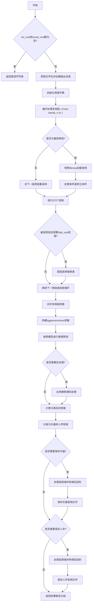

#### 带注释源码

```python
def _path_audio_(
        self, music_file, vocal_root=None, ins_root=None, format="flac"
):
    """
        处理音频
    :param music_file: 输入音乐文件路径
    :param vocal_root: 人声输出目录
    :param ins_root: 乐器输出目录
    :param format: 输出格式
    :return: (vocal_path, instrument_path) 或错误信息
    """
    # 3个VR模型vocal和ins是反的 - 注释说明某些模型的人声和乐器标签是反的
    if ins_root is None and vocal_root is None:
        return "No save root."
    
    # 获取文件名
    name = os.path.basename(music_file)
    
    # 创建输出目录
    if ins_root is not None:
        os.makedirs(ins_root, exist_ok=True)
    if vocal_root is not None:
        os.makedirs(vocal_root, exist_ok=True)
    
    # 初始化频谱和波形字典，用于存储多频段数据
    X_wave, y_wave, X_spec_s, y_spec_s = {}, {}, {}, {}
    
    # 获取频段数量
    bands_n = len(self.mp.param["band"])
    
    # 从高到低遍历各频段进行处理
    for d in range(bands_n, 0, -1):
        bp = self.mp.param["band"][d]  # 获取当前频段参数
        
        if d == bands_n:  # high-end band - 最高频段
            # 使用librosa加载音频文件
            (
                X_wave[d],
                _,
            ) = librosa.core.load(  # 理论上librosa读取可能对某些音频有bug，应该上ffmpeg读取，但是太麻烦了弃坑
                music_file,
                bp["sr"],  # 采样率
                False,     # 非单声道
                dtype=np.float32,
                res_type=bp["res_type"],
            )
            # 如果是单声道，转换为立体声（复制为双声道）
            if X_wave[d].ndim == 1:
                X_wave[d] = np.asfortranarray([X_wave[d], X_wave[d]])
        else:  # lower bands - 较低频段
            # 对高一级频段进行重采样到当前频段的采样率
            X_wave[d] = librosa.core.resample(
                X_wave[d + 1],
                self.mp.param["band"][d + 1]["sr"],
                bp["sr"],
                res_type=bp["res_type"],
            )
        
        # 对波形进行短时傅里叶变换(STFT)得到频谱
        X_spec_s[d] = spec_utils.wave_to_spectrogram_mt(
            X_wave[d],
            bp["hl"],      # hop length
            bp["n_fft"],   # FFT窗口大小
            self.mp.param["mid_side"],      # 中侧边处理
            self.mp.param["mid_side_b2"],   # 中侧边B2
            self.mp.param["reverse"],       # 反向处理
        )
        
        # 如果是最高频段且需要高频端处理
        if d == bands_n and self.data["high_end_process"] != "none":
            # 计算高频端高度
            input_high_end_h = (bp["n_fft"] // 2 - bp["crop_stop"]) + (
                    self.mp.param["pre_filter_stop"] - self.mp.param["pre_filter_start"]
            )
            # 提取高频端频谱
            input_high_end = X_spec_s[d][
                             :, bp["n_fft"] // 2 - input_high_end_h: bp["n_fft"] // 2, :
                             ]

    # 合并多频段频谱为单一频谱
    X_spec_m = spec_utils.combine_spectrograms(X_spec_s, self.mp)
    
    # 设置 aggressiveness 参数（分离强度）
    aggresive_set = float(self.data["agg"] / 100)
    aggressiveness = {
        "value": aggresive_set,
        "split_bin": self.mp.param["band"][1]["crop_stop"],
    }
    
    # 使用PyTorch进行模型推理
    with torch.no_grad():
        pred, X_mag, X_phase = inference(
            X_spec_m, self.device, self.model, aggressiveness, self.data
        )
    
    # Postprocess - 后处理
    if self.data["postprocess"]:
        # 计算反转预测并应用静默掩码
        pred_inv = np.clip(X_mag - pred, 0, np.inf)
        pred = spec_utils.mask_silence(pred, pred_inv)
    
    # 将预测的幅度与原始相位结合得到分离后的频谱
    y_spec_m = pred * X_phase  # 乐器频谱
    v_spec_m = X_spec_m - y_spec_m  # 人声频谱

    # 初始化路径变量
    instrument_path = None
    vocal_path = None
    
    # 处理并保存乐器部分
    if ins_root is not None:
        # 根据配置选择高频端处理方式
        if self.data["high_end_process"].startswith("mirroring"):
            input_high_end_ = spec_utils.mirroring(
                self.data["high_end_process"], y_spec_m, input_high_end, self.mp
            )
            wav_instrument = spec_utils.cmb_spectrogram_to_wave(
                y_spec_m, self.mp, input_high_end_h, input_high_end_
            )
        else:
            wav_instrument = spec_utils.cmb_spectrogram_to_wave(y_spec_m, self.mp)
        
        print("%s instruments done" % name)
        
        # 根据格式保存文件
        if format in ["wav", "flac"]:
            instrument_path = os.path.join(
                ins_root,
                "instrument_{}_{}.{}".format(name, self.data["agg"], format),
            ),
            sf.write(
                instrument_path,
                (np.array(wav_instrument) * 32768).astype("int16"),
                self.mp.param["sr"],
            )
        else:
            # 先保存为wav再转换为目标格式
            instrument_path = os.path.join(
                ins_root, "instrument_{}_{}.wav".format(name, self.data["agg"])
            )
            sf.write(
                instrument_path,
                (np.array(wav_instrument) * 32768).astype("int16"),
                self.mp.param["sr"],
            )
            if os.path.exists(instrument_path):
                os.system(
                    "ffmpeg -i %s -vn %s -q:a 2 -y"
                    % (instrument_path, instrument_path[:-4] + ".%s" % format)
                )
    
    # 处理并保存人声部分
    if vocal_root is not None:
        if self.data["high_end_process"].startswith("mirroring"):
            input_high_end_ = spec_utils.mirroring(
                self.data["high_end_process"], v_spec_m, input_high_end, self.mp
            )
            wav_vocals = spec_utils.cmb_spectrogram_to_wave(
                v_spec_m, self.mp, input_high_end_h, input_high_end_
            )
        else:
            wav_vocals = spec_utils.cmb_spectrogram_to_wave(v_spec_m, self.mp)
        
        print("%s vocals done" % name)
        
        if format in ["wav", "flac"]:
            vocal_path = os.path.join(
                vocal_root,
                "vocal_{}_{}.{}".format(name, self.data["agg"], format),
            )
            sf.write(vocal_path,
                (np.array(wav_vocals) * 32768).astype("int16"),
                self.mp.param["sr"],
            )
        else:
            vocal_path = os.path.join(
                vocal_root, "vocal_{}_{}.wav".format(name, self.data["agg"])
            )
            sf.write(
                vocal_path,
                (np.array(wav_vocals) * 32768).astype("int16"),
                self.mp.param["sr"],
            )
            if os.path.exists(vocal_path):
                os.system(
                    "ffmpeg -i %s -vn %s -q:a 2 -y"
                    % (vocal_path, vocal_path[:-4] + ".%s" % format)
                )
    
    # 返回结果路径元组
    return vocal_path, instrument_path
```

## 关键组件


### 音频分离核心类 `_audio_pre_` 与 `_audio_pre_new`

这两个类是音频源分离的核心实现，基于深度学习模型（VR - Vocal Removal）将音乐文件分离为器乐和人声部分。`_audio_pre_` 使用旧版4band_v2.json参数和CascadedASPPNet模型，`_audio_pre_new` 使用新版4band_v3.json参数和CascadedNet模型，支持更强的分离能力。

### 张量索引与惰性加载

代码使用`torch.no_grad()`上下文管理器禁用梯度计算，实现推理阶段的惰性加载和内存优化。同时模型在初始化时一次性加载到GPU/CPU，后续推理不再重复加载权重，提高执行效率。

### 反量化支持

音频处理中使用`np.float32`进行内部计算，最终输出时通过`(np.array(wav_instrument) * 32768).astype("int16")`将浮点数据反量化回16位整数格式保存，确保音频文件兼容性。

### 量化策略

`is_half`参数控制模型精度，当设为`True`时调用`model.half().to(device)`将模型转换为半精度（FP16）格式，显著降低显存占用和加速推理；设为`False`则使用全精度（FP32）模式。

### 多频段处理引擎

代码通过读取`4band_v2.json`或`4band_v3.json`配置文件，实现多频段音频处理。从高频段开始逐层向下采样（`librosa.core.resample`），分别对每个频段进行STFT变换，最后通过`spec_utils.combine_spectrograms`合并为完整频谱图。

### 频谱图推理模块

使用`inference`函数进行模型推理，输入合并后的频谱图`X_spec_m`，输出预测的器乐频谱`pred`、幅度`X_mag`和相位`X_phase`。推理时传入`aggressiveness`参数控制分离强度。

### 高频镜像处理

当`high_end_process`设为"mirroring"时，使用`spec_utils.mirroring`函数对高频部分进行镜像处理，通过`input_high_end`提取高频信息并应用到分离结果上，减少高频失真。

### 后处理模块

支持两种后处理方式：`postprocess`通过`spec_utils.mask_silence`对安静区域进行掩码处理；`tta`(Test-Time Augmentation)选项可在推理时进行数据增强（代码中已预留接口但未实现）。

### 模型加载与初始化

使用`ModelParameters`类加载JSON配置文件获取模型参数（bins、band、sr等），通过`torch.load`加载预训练权重`.pth`文件，并使用`load_state_dict`将权重加载到模型结构中。

### 音频写入与格式转换

支持多种音频格式输出（wav/flac/其他）。对于非wav/flac格式，先写成wav再调用`ffmpeg`进行格式转换。输出路径包含文件名、分离强度参数等命名信息。

### 设备管理

通过`device`参数指定运行设备（cuda/cpu），`is_half`参数决定是否使用半精度推理，两者配合实现不同硬件环境下的最优性能配置。


## 问题及建议


### 已知问题

- **代码重复**：`_audio_pre_` 和 `_audio_pre_new` 两个类功能几乎相同，`_path_audio_` 方法代码重复度超过80%，违背DRY原则
- **参数顺序不一致**：两个类的 `_path_audio_` 方法中 `ins_root` 和 `vocal_root` 参数顺序相反（`_audio_pre_` 为 `music_file, ins_root, vocal_root`，`_audio_pre_new` 为 `music_file, vocal_root, ins_root`），存在潜在bug
- **缺少异常处理**：`torch.load`、文件读写、`librosa.core.load` 等关键操作均无异常捕获，可能导致程序崩溃
- **硬编码路径**：模型参数文件路径使用 `os.path.dirname(os.path.realpath(__file__))` 硬编码，假设文件结构固定，缺乏灵活性
- **外部命令依赖**：使用 `os.system("ffmpeg ...")` 调用外部程序，未检查 ffmpeg 是否安装，且这种调用方式不够安全
- **资源未释放**：模型加载后没有显式的资源释放机制（如下下文管理器或 `del` 语句），长期运行可能导致显存泄漏
- **警告被全局抑制**：`warnings.filterwarnings("ignore")` 会隐藏所有警告，包括重要的运行时警告
- **魔法数字**：音频缩放因子 `32768`、nout 值 `64/48` 等硬编码，缺乏配置化
- **缺少类型注解**：所有方法均无类型注解，影响代码可维护性和IDE支持
- **已知问题未修复**：注释中提到 librosa 读取音频可能有问题"应该上ffmpeg读取，但是太麻烦了弃坑"，表明存在已知缺陷但未解决

### 优化建议

- **抽象基类或组合**：将两个类合并为一个类，通过参数或策略模式处理差异化逻辑
- **统一参数顺序**：修正两个类中 `ins_root` 和 `vocal_root` 的参数顺序，确保API一致性
- **添加异常处理**：为文件操作、模型加载、音频处理等关键路径添加 try-except 捕获和合理的错误信息
- **配置外置**：将模型参数文件路径、阈值等配置项外置到配置文件或构造函数参数
- **使用子进程替代 os.system**：用 `subprocess.run()` 替代 `os.system()` 调用 ffmpeg，提高安全性和可控性
- **添加资源管理**：实现 `__del__` 方法或提供 `close()` 方法释放模型和显存
- **恢复部分警告**：将 `warnings.filterwarnings("ignore")` 改为仅忽略特定类别的警告
- **添加类型注解**：为所有方法添加参数和返回值类型注解
- **添加日志记录**：用 `logging` 模块替代 `print` 语句，便于生产环境调试
- **处理单声道边缘情况**：虽然代码中有 `np.asfortranarray` 处理单声道，但逻辑可以更清晰

## 其它


### 设计目标与约束

本代码的设计目标是实现基于深度学习模型的音频源分离（Audio Source Separation），具体用于将音乐文件分离为 vocals（人声）和 instruments（伴奏）两个部分。主要约束包括：
1. **模型兼容性**：支持多种预训练模型（如 VR-DeEchoDeReverb、VR-DeEchoNormal、DeEchoNormal 等）
2. **音频格式支持**：主要支持 wav 和 flac 格式，其他格式通过 ffmpeg 转换
3. **设备支持**：支持 CPU 和 CUDA 设备，支持半精度（FP16）推理
4. **性能约束**：需要在合理时间内处理音频文件，模型推理在 GPU 上运行

### 错误处理与异常设计

代码当前的错误处理相对简单，主要包括：
1. **输入验证**：`ins_root` 和 `vocal_root` 均为 `None` 时返回错误信息 "No save root."
2. **文件存在性检查**：在转换格式时检查文件是否存在
3. **warnings 过滤**：忽略所有警告信息
4. **潜在异常**：模型加载失败、音频文件损坏、磁盘空间不足、CUDA 内存不足等情况未做处理

建议增加：
- 模型加载失败时返回具体错误信息
- 音频文件无法读取时抛出明确异常
- CUDA 内存不足时自动回退到 CPU
- 磁盘空间检查

### 数据流与状态机

音频处理流程状态机：
1. **初始化状态**：加载模型和参数
2. **加载状态**：读取音频文件，进行多 band 分解
3. **频谱转换状态**：将波形转换为频谱表示
4. **推理状态**：使用神经网络模型进行分离
5. **后处理状态**：应用后处理（如需要）
6. **合成状态**：将分离后的频谱转换回波形
7. **保存状态**：写入文件并转换格式

数据流：music_file → librosa.load → 多 band 分解 → STFT → combine_spectrograms → model inference → 分离频谱 → ISTFT → 波形文件

### 外部依赖与接口契约

主要外部依赖：
1. **librosa**：音频加载和重采样
2. **numpy**：数值计算
3. **soundfile**：音频文件读写
4. **torch**：深度学习框架
5. **ffmpeg**：音频格式转换
6. **uvr5_pack 包**：包含模型定义、频谱处理工具等

接口契约：
- `_audio_pre_` 和 `_audio_pre_new` 类提供统一的 `_path_audio_` 方法
- 输入：music_file（音频文件路径）、vocal_root（人声输出目录）、ins_root（伴奏输出目录）、format（输出格式）
- 输出：(vocal_path, instrument_path) 元组

### 配置管理与参数说明

关键配置参数：
- `agg`：分离强度（0-100），影响分离的激进程度
- `is_half`：是否使用半精度推理
- `high_end_process`：高频处理方式（"mirroring" 或 "none"）
- `postprocess`：是否启用后处理
- `tta`：测试时增强（未实现）
- `window_size`：窗口大小（512）
- 模型路径：指定预训练模型文件

### 性能优化建议

1. **批处理支持**：当前单文件处理，可考虑批量处理
2. **内存优化**：对于长音频，可分块处理避免内存溢出
3. **缓存机制**：模型和参数可缓存复用
4. **多线程/多进程**：文件 IO 和音频处理可并行
5. **GPU 利用率**：可进一步优化 CUDA 操作

### 安全性考虑

1. **路径遍历风险**：`os.path.join` 使用相对安全，但需验证输入路径
2. **命令注入风险**：`os.system` 调用 ffmpeg 存在潜在命令注入风险，建议使用 subprocess 或库函数替代
3. **文件覆盖**：未检查目标文件是否已存在，会直接覆盖
4. **模型安全**：模型文件来自外部，需验证完整性

### 测试策略建议

1. **单元测试**：测试各模块独立功能
2. **集成测试**：测试完整音频分离流程
3. **边界测试**：测试各种异常输入
4. **性能测试**：测试不同长度音频的处理时间
5. **对比测试**：与原版 uvr5 输出对比验证一致性

### 部署与运行环境

- Python 3.x
- CUDA 10.2+（如需 GPU 加速）
- 所需 Python 包：torch, librosa, numpy, soundfile
- 磁盘空间：模型文件约 300MB，运行时需要足够空间存储临时文件和输出

### 版本兼容性说明

- `_audio_pre_` 使用 4band_v2.json 配置和 `nets.CascadedASPPNet`
- `_audio_pre_new` 使用 4band_v3.json 配置和 `nets_new.CascadedNet`
- `_audio_pre_new` 是更新版本，针对 DeReverb 等新型号优化
- 注释提到"3个VR模型vocal和ins是反的"，说明某些模型输出需要交换


    