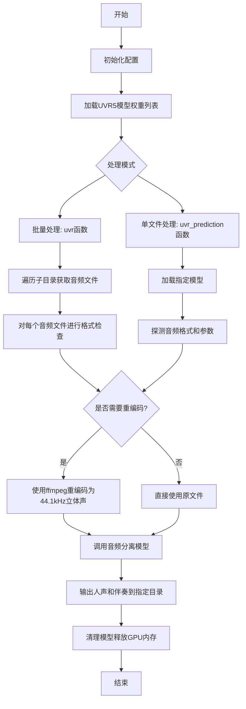
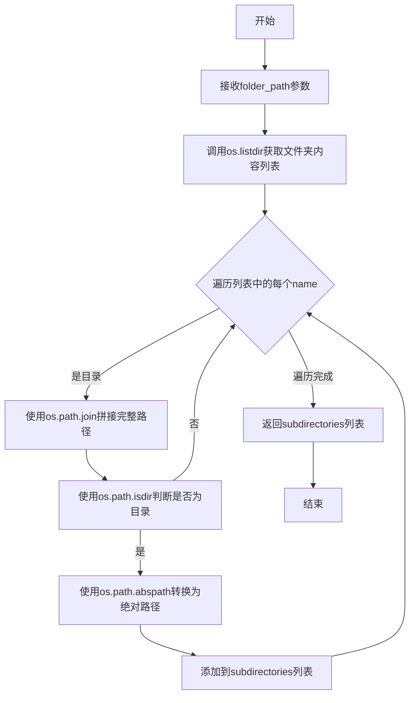
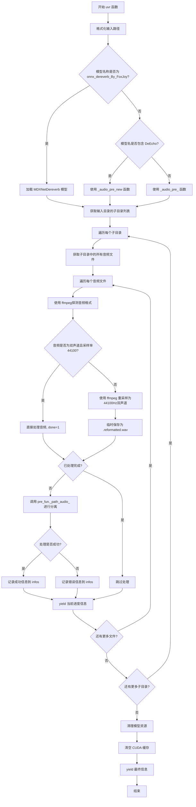
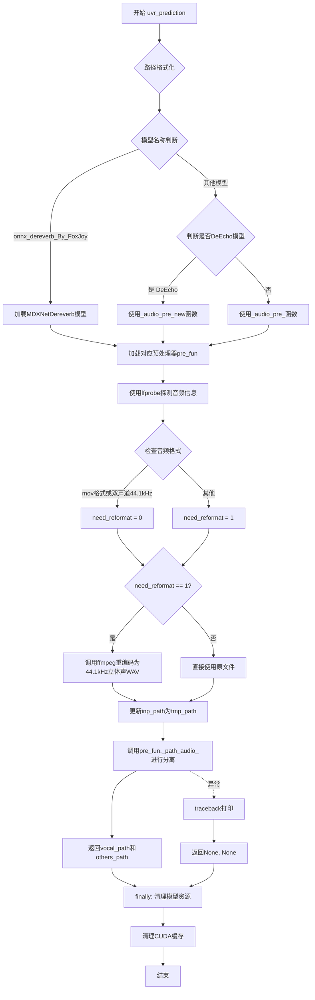
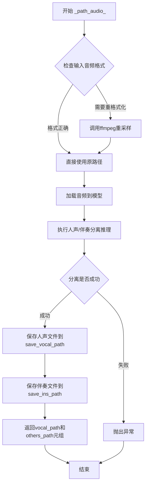
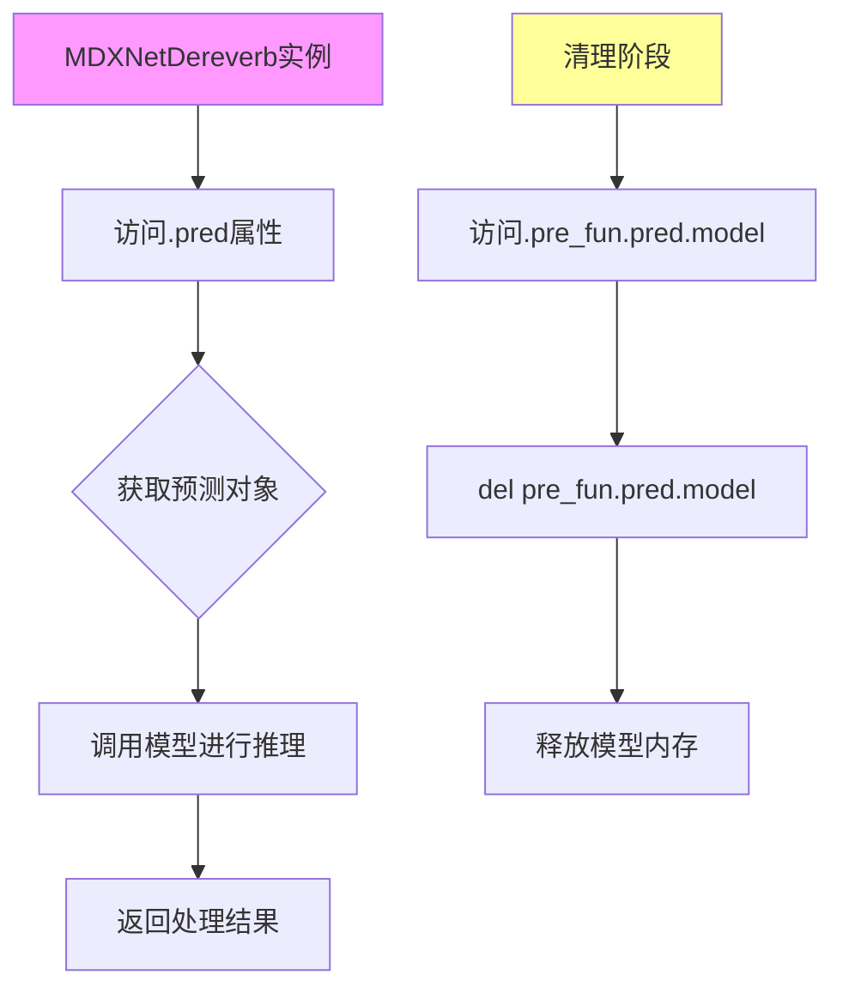
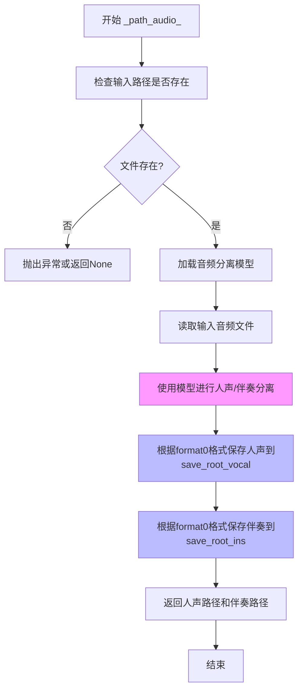

# `Chat-Haruhi-Suzumiya\yuki_builder\video_preprocessing\uvr5\process.py` 详细设计文档

这是一个基于深度学习的音频分离工具，通过加载UVR5（Ultimate Vocal Remover）预训练模型，实现将音频文件中的人声和伴奏（乐器）进行分离，支持批量处理和单文件处理两种模式，并利用ffmpeg进行音频格式检查与转换。

## 整体流程



## 类结构

```
模块根目录
├── uvr5.py (主入口模块)
├── MDXNet.py (MDXNetDereverb类)
│   └── MDXNetDereverb (去混响模型封装)
├── infer_uvr5.py (音频预处理模型)
│   ├── _audio_pre_ (DeEcho标准预处理)
│   └── _audio_pre_new (DeEcho新型预处理)
└── uvr5_weights/ (模型权重目录)
    ├── onnx_dereverb_By_FoxJoy.onnx
    ├── HP2_all_vocals.pth
    ├── HP3_all_vocals.pth
    └── ...
```

## 全局变量及字段


### `now_dir`
    
当前工作目录路径

类型：`str`
    


### `tmp`
    
临时文件目录路径

类型：`str`
    


### `config`
    
设备配置字典，包含device和is_half设置

类型：`dict`
    


### `weight_uvr5_root`
    
UVR5模型权重根目录路径

类型：`str`
    


### `uvr5_names`
    
可用UVR5模型名称列表

类型：`list`
    


### `MDXNetDereverb.model`
    
去混响深度学习模型

类型：`object`
    


### `MDXNetDereverb.chunks`
    
音频分块数，用于批处理

类型：`int`
    


### `MDXNetDereverb.pred`
    
预测对象，包含模型推理功能

类型：`object`
    


### `MDXNetDereverb._path_audio_`
    
音频处理入口方法

类型：`method`
    


### `_audio_pre_.model`
    
音频处理模型

类型：`object`
    


### `_audio_pre_.device`
    
计算设备（CPU或GPU）

类型：`torch.device`
    


### `_audio_pre_.is_half`
    
是否使用半精度计算

类型：`bool`
    


### `_audio_pre_.agg`
    
聚合参数，控制人声分离强度

类型：`int`
    


### `_audio_pre_._path_audio_`
    
音频处理入口方法

类型：`method`
    


### `_audio_pre_new.model`
    
音频处理模型

类型：`object`
    


### `_audio_pre_new.device`
    
计算设备（CPU或GPU）

类型：`torch.device`
    


### `_audio_pre_new.is_half`
    
是否使用半精度计算

类型：`bool`
    


### `_audio_pre_new.agg`
    
聚合参数，控制人声分离强度

类型：`int`
    


### `_audio_pre_new._path_audio_`
    
音频处理入口方法

类型：`method`
    
    

## 全局函数及方法


### `get_subdir`

该函数用于获取指定文件夹下的所有子目录路径，并返回包含所有子目录绝对路径的列表。它通过遍历目标文件夹的内容，过滤出其中的目录项，并将其转换为绝对路径形式返回。

参数：

- `folder_path`：`str`，要查询的文件夹路径

返回值：`list[str]`，返回包含所有子目录绝对路径的列表

#### 流程图



#### 带注释源码

```python
def get_subdir(folder_path):
    """
    获取指定文件夹下的所有子目录路径
    
    参数:
        folder_path: 要查询的文件夹路径
        
    返回:
        包含所有子目录绝对路径的列表
    """
    # 使用列表推导式遍历文件夹内容
    # os.listdir(folder_path): 获取folder_path下的所有文件名和目录名
    # os.path.isdir(os.path.join(folder_path, name)): 判断该路径是否为目录
    # os.path.abspath(): 将相对路径转换为绝对路径
    subdirectories = [
        os.path.abspath(os.path.join(folder_path, name)) 
        for name in os.listdir(folder_path) 
        if os.path.isdir(os.path.join(folder_path, name))
    ]
    return subdirectories
```

---

### 关键组件信息

| 组件名称 | 一句话描述 |
|---------|-----------|
| `os.listdir` | Python标准库函数，用于获取指定目录下的所有文件和目录名称 |
| `os.path.isdir` | Python标准库函数，用于判断给定路径是否为目录 |
| `os.path.abspath` | Python标准库函数，用于获取给定路径的绝对路径 |
| `os.path.join` | Python标准库函数，用于拼接路径 |

---

### 潜在的技术债务或优化空间

1. **缺少输入验证**：函数未对`folder_path`进行有效性检查，例如检查路径是否存在、是否为目录等，可能导致`FileNotFoundError`或`NotADirectoryError`。

2. **未处理权限异常**：如果文件夹存在但无读取权限，`os.listdir`可能抛出`PermissionError`，当前代码未做处理。

3. **性能考虑**：对于包含大量子目录的文件夹，可以考虑使用`os.scandir()`替代`os.listdir()`，因为`os.scandir()`在遍历目录时更高效，它返回一个迭代器直接包含文件类型信息，避免了额外的`os.path.isdir`调用。

4. **符号链接处理**：当前实现会将符号链接也当作目录处理（因为`os.path.isdir`对符号链接返回True），如果需要排除符号链接，应使用`os.path.isdir`配合额外检查或使用`os.path.islink`。

---

### 其它项目

#### 设计目标与约束
- **设计目标**：快速获取指定文件夹下的所有子目录路径
- **输入约束**：`folder_path`必须为有效的目录路径
- **输出约束**：返回的是绝对路径列表

#### 错误处理与异常设计
- 当`folder_path`不存在时，`os.listdir`会抛出`FileNotFoundError`
- 当`folder_path`不是目录时，会抛出`NotADirectoryError`
- 建议调用方进行try-except包装以处理这些异常情况

#### 数据流与状态机
该函数是一个纯同步函数，无状态机设计。输入folder_path，输出子目录路径列表，无副作用。

#### 外部依赖与接口契约
- 依赖Python标准库`os`模块
- 接口契约：输入有效目录路径，返回该路径下所有子目录的绝对路径列表（不包括隐藏目录和符号链接指向的目录，但包含符号链接本身如果它指向目录）


### `get_filename`

该函数是一个全局函数，用于递归遍历指定目录并获取所有音频文件，支持按文件扩展名进行过滤，返回包含文件名和完整路径的二维列表。

参数：

- `directory`：`str`，要遍历的目录路径
- `format`：`str`，可选参数，用于过滤文件的扩展名（如 "wav"、"mp3" 等），如果为 `None` 则返回所有文件

返回值：`List[List[str]]`，返回文件列表，其中每个元素是一个包含 `[文件名, 文件完整路径]` 的列表，列表按文件名排序

#### 流程图

```mermaid
flowchart TD
    A[开始 get_filename] --> B{传入 format 参数}
    B -->|有 format| C[遍历目录所有文件]
    B -->|无 format| C
    C --> D{文件不以 . 开头且是文件}
    D -->|否| E[跳过该文件]
    D -->|是| F{有 format 过滤条件}
    F -->|是| G{文件以指定 format 结尾}
    F -->|否| H[添加文件到列表]
    G -->|是| H
    G -->|否| E
    H --> I[文件列表添加 [文件名, 文件路径]]
    E --> J[继续遍历下一个文件]
    J --> C
    C --> K[所有文件遍历完成]
    K --> L[对文件列表排序]
    L --> M[返回排序后的文件列表]
    M --> N[结束]
```

#### 带注释源码

```python
def get_filename(directory, format=None):
    """
    递归获取目录下的所有音频文件
    
    参数:
        directory: str, 要遍历的目录路径
        format: str, 可选，文件扩展名过滤条件
    
    返回:
        List[List[str]]: 文件列表，每个元素为 [文件名, 文件完整路径]
    """
    # 初始化空列表用于存储符合条件文件
    file_list = []
    
    # 使用 os.walk 递归遍历目录
    # root: 当前遍历的目录路径
    # dirs: 当前目录下的子目录列表
    # files: 当前目录下的文件列表
    for root, dirs, files in os.walk(directory):
        # 遍历当前目录下的所有文件
        for file in files:
            # 拼接完整的文件路径
            file_path = os.path.join(root, file)
            
            # 检查文件是否有效：
            # 1. 文件名不以 . 开头（过滤隐藏文件）
            # 2. 确认路径是一个文件而非目录
            if not file.startswith('.') and os.path.isfile(file_path):
                # 如果指定了 format 过滤条件
                if format:
                    # 仅添加扩展名匹配的文件
                    if file.endswith(format):
                        file_list.append([file, file_path])
                else:
                    # 没有 format 条件，添加所有文件
                    file_list.append([file, file_path])
    
    # 对文件列表按文件名进行排序
    file_list.sort()
    
    # 返回排序后的文件列表
    return file_list
```


### `uvr`

`uvr` 函数是批量音频分离主函数，用于从输入目录中的所有音频文件里分离出人声（vocal）和伴奏（instrument）。该函数支持多种UVR5模型（如HP2、HP5、VR-DeEcho等），并通过 `MDXNetDereverb` 或 `_audio_pre_` 系列函数进行音频处理。它遍历输入目录的子目录，对每个音频文件进行格式检查和必要的重采样，然后调用模型进行分离，最终将结果保存到对应的人声和伴奏目录。函数设计为生成器模式，逐步 yield 处理进度信息。

参数：

- `model_name`：`str`，模型名称，用于指定使用的分离模型（如 "HP5_only_main_vocal"、"VR-DeEchoDeReverb" 等）
- `inp_root`：`str`，输入音频文件的根目录路径
- `save_root_vocal`：`str`，分离后人声（vocal）的保存根目录
- `save_root_ins`：`str`，分离后伴奏（instrument）的保存根目录
- `agg`：`int` 或 `str`，人声提取激进程度参数，影响分离强度
- `format0`：`str`，输出音频的格式（如 "wav"、"flac"、"mp3" 等）

返回值：`Generator[str, None, None]`，返回处理进度信息的生成器，每次 yield 一行包含已处理文件状态（成功或失败）的字符串

#### 流程图



#### 带注释源码

```python
def uvr(model_name, inp_root, save_root_vocal, save_root_ins, agg, format0):
    """
    批量音频分离主函数
    :param model_name: 模型名称
    :param inp_root: 输入目录根路径
    :param save_root_vocal: 人声输出根路径
    :param save_root_ins: 伴奏输出根路径
    :param agg: 人声提取激进程度
    :param format0: 输出音频格式
    :return: 生成器，返回处理进度信息
    """
    infos = []  # 存储处理结果信息的列表
    try:
        # 1. 路径格式化：去除首尾空格、引号、换行符
        inp_root = inp_root.strip(" ").strip('"').strip("\n").strip('"').strip(" ")
        save_root_vocal = (
            save_root_vocal.strip(" ").strip('"').strip("\n").strip('"').strip(" ")
        )
        save_root_ins = (
            save_root_ins.strip(" ").strip('"').strip("\n").strip('"').strip(" ")
        )
        
        # 2. 根据模型名称选择对应的预处理函数
        if model_name == "onnx_dereverb_By_FoxJoy":
            # 使用 ONNX 版本的去混响模型
            pre_fun = MDXNetDereverb(onnx=f"{weight_uvr5_root}/onnx_dereverb_By_FoxJoy", chunks=15)
        else:
            # 根据是否包含 DeEcho 选择不同的预处理函数
            # _audio_pre_ 用于普通模型，_audio_pre_new 用于 DeEcho 系列
            func = _audio_pre_ if "DeEcho" not in model_name else _audio_pre_new
            pre_fun = func(
                agg=int(agg),  # 激进程度参数
                model_path=os.path.join(weight_uvr5_root, model_name + ".pth"),  # 模型文件路径
                device=config['device'],  # 计算设备 (CUDA/CPU)
                is_half=config['is_half'],  # 是否使用半精度
            )
        
        # 3. 获取输入目录下的所有子目录（每个子目录视为一个独立的处理任务）
        sub_dirs = get_subdir(f'{inp_root}')
        
        # 4. 遍历每个子目录
        for dir in sub_dirs[:]:
            # 获取该子目录中的所有音频文件
            voice_files = get_filename(dir)
            # 获取子目录名称作为输出子目录名
            name = os.path.basename(os.path.normpath(dir))
            
            # 构建输出路径：伴奏保存到 instrument/子目录名，人声保存到 voice/子目录名
            save_ins_path = f'{save_root_ins}/instrument/{name}'
            save_vocal_path = f'{save_root_vocal}/voice/{name}'
            
            # 5. 遍历子目录中的每个音频文件
            for file, inp_path in tqdm(voice_files, f'extract {name} uvr ,convert .wav to .wav'):
                need_reformat = 1  # 标记是否需要重采样
                done = 0  # 标记是否已处理
                try:
                    # 使用 ffmpeg 探测音频文件信息
                    info = ffmpeg.probe(inp_path, cmd="ffprobe")
                    # 检查是否为双声道且采样率为44100Hz
                    if (
                            info["streams"][0]["channels"] == 2
                            and info["streams"][0]["sample_rate"] == "44100"
                    ):
                        need_reformat = 0  # 符合要求，无需重采样
                        # 直接进行音频分离
                        pre_fun._path_audio_(
                            inp_path, save_ins_path, save_vocal_path, format0
                        )
                        done = 1  # 标记已完成
                except:
                    # 探测失败，标记需要重采样
                    need_reformat = 1
                    traceback.print_exc()
                
                # 6. 如果需要重采样，使用 ffmpeg 转换为 44100Hz 双声道 PCM 格式
                if need_reformat == 1:
                    tmp_path = "%s/%s.reformatted.wav" % (tmp, os.path.basename(inp_path))
                    os.system(
                        "ffmpeg -i %s -vn -acodec pcm_s16le -ac 2 -ar 44100 %s -y -loglevel error"
                        % (inp_path, tmp_path)
                    )
                    inp_path = tmp_path  # 更新输入路径为重采样后的临时文件
                
                # 7. 执行音频分离
                try:
                    if done == 0:  # 如果之前未处理
                        pre_fun._path_audio_(
                            inp_path, save_ins_path, save_vocal_path, format0
                        )
                    # 记录成功信息
                    infos.append("%s->Success" % (os.path.basename(inp_path)))
                    # yield 当前进度信息
                    yield "\n".join(infos)
                except:
                    # 记录失败信息（包含异常详情）
                    infos.append(
                        "%s->%s" % (os.path.basename(inp_path), traceback.format_exc())
                    )
                    yield "\n".join(infos)

    except:
        # 捕获顶层异常
        infos.append(traceback.format_exc())
        yield "\n".join(infos)
    finally:
        # 8. 清理资源：删除模型对象并释放 CUDA 缓存
        try:
            if model_name == "onnx_dereverb_By_FoxJoy":
                del pre_fun.pred.model
                del pre_fun.pred.model_
            else:
                del pre_fun.model
                del pre_fun
        except:
            traceback.print_exc()
        print("clean_empty_cache")
        if torch.cuda.is_available():
            torch.cuda.empty_cache()
    # 9. 返回最终处理结果
    yield "\n".join(infos)
```


### `uvr_prediction`

单文件音频分离函数，用于将输入音频文件分离为 人声（vocal）和 伴奏/乐器（instrumental）两部分，支持多种UVR5模型和音频格式转换。

参数：

- `model_name`：`str`，模型名称，用于选择不同的音频分离模型（如"HP5_only_main_vocal"等）
- `inp_path`：`str`，输入音频文件的路径，支持多种格式（mp4, wav, flac, mp3, m4a等）
- `save_root_vocal`：`str`，分离后人声部分的输出保存根目录
- `save_root_ins`：`str`，分离后伴奏/乐器部分的输出保存根目录
- `agg`：`int`，人声提取激进程度，数值越大提取越激进
- `format0`：`str`，输出音频文件格式（如"wav", "flac", "mp3", "m4a"）

返回值：`Tuple[str, str]`，返回分离后的人声路径和伴奏路径；若处理失败则返回`(None, None)`

#### 流程图



#### 带注释源码

```python
def uvr_prediction(model_name, inp_path, save_root_vocal, save_root_ins, agg, format0):
    """
    分离音频
    :param model_name: 模型名称
    :param inp_path: 输入文件
    :param save_root_vocal: 说话人保存位置
    :param save_root_ins: 伴奏保存位置
    :param agg: 人声提取激进程度
    :param format0: 文件格式
    :return: (vocal_path, others_path) 或 (None, None)
    """
    try:
        # 1. 路径格式化：去除首尾空格、引号、换行符等
        save_root_vocal = (
            save_root_vocal.strip(" ").strip('"').strip("\n").strip('"').strip(" ")
        )
        save_root_ins = (
            save_root_ins.strip(" ").strip('"').strip("\n").strip('"').strip(" ")
        )

        # 2. 模型加载：根据模型名称选择不同的预处理函数
        if model_name == "onnx_dereverb_By_FoxJoy":
            # 加载ONNX去混响模型
            pre_fun = MDXNetDereverb(onnx=f"{weight_uvr5_root}/onnx_dereverb_By_FoxJoy", chunks=15)
        else:
            # 选择合适的音频预处理函数（DeEcho使用新版本）
            func = _audio_pre_ if "DeEcho" not in model_name else _audio_pre_new
            # 初始化预处理函数
            pre_fun = func(
                agg=int(agg),
                model_path=os.path.join(weight_uvr5_root, model_name + ".pth"),
                device=config['device'],
                is_half=config['is_half'],
            )
        
        # 3. 判断音频文件是否符合要求（双声道44.1kHz）
        need_reformat = 1  # 默认需要重编码
        info = ffmpeg.probe(inp_path, cmd="ffprobe")  # 探测音频信息

        # 检查是否需要重编码：mov格式或非标准格式
        if (
                'mov' in info["format"]['format_name'] or (
                    info["streams"][0]["channels"] == 2
                    and info["streams"][0]["sample_rate"] == "44100")
        ):
            need_reformat = 0  # 符合要求，无需重编码

        # 4. 如需重编码，使用ffmpeg转换为标准格式
        if need_reformat == 1:
            tmp_path = "%s/%s.reformatted.wav" % (tmp, os.path.basename(inp_path))
            os.system(
                "ffmpeg -i %s -vn -acodec pcm_s16le -ac 2 -ar 44100 %s -y -loglevel error"
                % (inp_path, tmp_path)
            )
            inp_path = tmp_path  # 更新路径为重编码后的文件

        # 5. 处理音频：调用预处理器进行分离
        vocal_path, others_path = pre_fun._path_audio_(
            inp_path, save_root_vocal, save_root_ins, format0
        )
        return vocal_path, others_path  # 返回分离后的人声和伴奏路径
    
    except:
        # 异常处理：打印错误并返回None
        traceback.print_exc()
        return None, None
    
    finally:
        # 6. 清理资源：删除模型对象并清理CUDA缓存
        try:
            if model_name == "onnx_dereverb_By_FoxJoy":
                del pre_fun.pred.model
                del pre_fun.pred.model_
            else:
                del pre_fun.model
                del pre_fun
        except:
            traceback.print_exc()
        print("clean_empty_cache")
        if torch.cuda.is_available():
            torch.cuda.empty_cache()
```


### `MDXNetDereverb._path_audio_`

该方法是 MDXNetDereverb 类的核心音频处理入口，负责将输入音频文件进行人声与伴奏分离处理，支持音频格式转换并输出分离后的人声和伴奏文件路径。

参数：

- `inp_path`：`str`，输入音频文件路径（支持原始路径或重格式化后的临时路径）
- `save_ins_path`：`str`，伴奏（instrumental）保存目录路径
- `save_vocal_path`：`str`，人声（vocal）保存目录路径
- `format0`：`str` 或 `list`，输出音频格式（如 "wav", "flac", "mp3", "m4a"）

返回值：`tuple[str, str]`，返回分离后的人声文件路径和伴奏文件路径组成的元组

#### 流程图



#### 带注释源码

```python
# 由于 MDXNetDereverb 类定义在 MDXNet 模块中（未在当前代码中展示）
# 以下是基于调用方式的推断和文档化

# 在 uvr 函数中的调用示例：
pre_fun._path_audio_(
    inp_path,           # 输入音频路径（可能已重格式化）
    save_ins_path,      # 伴奏输出目录
    save_vocal_path,    # 人声输出目录
    format0             # 输出格式
)

# 在 uvr_prediction 函数中的调用示例：
vocal_path, others_path = pre_fun._path_audio_(
    inp_path,           # 输入音频路径
    save_root_vocal,    # 人声保存根目录
    save_root_ins,      # 伴奏保存根目录
    format0             # 输出格式
)

# 注意：实际的 MDXNetDereverb 类定义需要查看 MDXNet.py 模块
# 该类的 _path_audio_ 方法通常会执行以下操作：
# 1. 使用 ffmpeg 或 torchAudio 加载音频文件
# 2. 将音频转换为模型输入所需的格式
# 3. 执行推理分离人声和伴奏
# 4. 将结果保存为指定格式的文件
# 5. 返回保存后的人声和伴奏文件路径
```

#### 补充说明

由于 `MDXNetDereverb` 类的实际定义在导入的 `MDXNet` 模块中，当前代码文件仅展示了调用方式。完整的类实现（包括 `_path_audio_` 方法的具体逻辑）需要查看同目录下的 `MDXNet.py` 文件。根据调用模式推断，该方法实现了 UVR（Ultimate Vocal Remover）框架的音频分离核心逻辑，支持 ONNX 模型和 PyTorch 模型的推理。


### MDXNetDereverb.pred

该属性是 `MDXNetDereverb` 类的预测对象，用于访问底层ONNX模型或PyTorch模型，进行音频去混响或分离处理。它在清理资源时被引用，用于释放模型内存。

参数：
- 无（这是一个属性访问，不是方法）

返回值：`pred` 对象，包含 `model` 和 `model_` 属性，分别对应主模型和辅助模型

#### 流程图



#### 带注释源码

```python
# 以下是代码中涉及 MDXNetDereverb.pred 的使用片段：

# 1. 创建MDXNetDereverb实例
pre_fun = MDXNetDereverb(
    onnx=f"{weight_uvr5_root}/onnx_dereverb_By_FoxJoy",  # ONNX模型路径
    chunks=15  # 音频分块数量
)

# 2. 使用实例处理音频（调用_path_audio_方法）
vocal_path, others_path = pre_fun._path_audio_(
    inp_path, save_root_vocal, save_root_ins, format0
)

# 3. 在清理阶段访问.pred属性释放资源
try:
    if model_name == "onnx_dereverb_By_FoxJoy":
        del pre_fun.pred.model    # 删除主模型
        del pre_fun.pred.model_   # 删除辅助模型
    else:
        del pre_fun.model
        del pre_fun
except:
    traceback.print_exc()

# 4. 清理CUDA缓存
print("clean_empty_cache")
if torch.cuda.is_available():
    torch.cuda.empty_cache()
```

#### 补充说明

- **设计目标**：通过ONNX Runtime或PyTorch实现高效的音频人声与伴奏分离、去混响处理
- **模型类型**：根据 `model_name` 选择加载ONNX模型（`onnx_dereverb_By_FoxJoy`）或PyTorch模型（其他VR模型）
- **资源管理**：通过 `.pred` 属性访问底层模型，在处理完成后显式释放内存，避免显存泄漏
- **技术债务**：
  1. 硬编码的模型路径和名称分散在代码中
  2. 错误处理使用通用`try-except`，缺乏具体异常分类
  3. 依赖外部模块`MDXNet`，但未在当前文件中定义其具体实现
  4. `chunks=15`参数固定，无法根据音频长度动态调整


### `_audio_pre_` 实例方法 `_path_audio_`

#### 描述

这是音频处理（人声与伴奏分离）的核心入口方法。该方法由 `_audio_pre_` 或 `_audio_pre_new` 实例调用，接收原始音频路径及输出路径，经过模型推理后，将音频分离为人声（Vocal）和非人声/伴奏（Instrumental）两部分，并分别保存到指定路径。

**注意**：由于该方法的实现源码位于外部模块 `infer_uvr5.py` 中，未直接包含在当前代码块内。以下信息是基于 `uvr_prediction` 函数中的调用上下文（Call Site）推断得出的接口规范。

#### 参数

- `input_path`：`str`，输入的音频文件路径（通常已预处理为 44.1kHz 立体声）。
- `save_root_vocal`：`str`，处理后人声（Vocal）部分的保存路径。
- `save_root_ins`：`str`，处理后伴奏（Instrumental）部分的保存路径。
- `format0`：`str`，输出音频的格式（如 "wav", "flac", "mp3"）。

#### 返回值

- `Tuple[str, str]`，返回一个人声路径和伴奏路径的元组 `(vocal_path, instrumental_path)`。

#### 流程图

```mermaid
graph TD
    A[开始: 输入音频文件] --> B{加载模型与推理};
    B --> C[音频分离模型处理];
    C --> D[输出结果];
    D --> E[保存文件: 人声 Vocal];
    D --> F[保存文件: 伴奏 Instrumental];
    E --> G[返回 Tuple[人声路径, 伴奏路径]];
    F --> G;
```

#### 带注释源码

由于 `_path_audio_` 方法的具体实现源码不在当前文件 `uvr.py` 中，以下为该方法在 `uvr_prediction` 函数中的调用上下文代码，作为该方法的“使用示例源码”：

```python
# -*- coding: utf-8 -*-
def uvr_prediction(model_name, inp_path, save_root_vocal, save_root_ins, agg, format0):
    """
    音频分离预测函数
    :param model_name: 模型名称
    :param inp_path: 输入文件路径
    :param save_root_vocal: 人声输出根目录
    :param save_root_ins: 伴奏输出根目录
    :param agg: 响度阈值/激进度
    :param format0: 输出格式
    """
    try:
        # ... [模型加载与音频预处理代码省略] ...

        # 调用核心方法 _path_audio_
        # 参数顺序对应: (输入路径, 人声输出路径, 伴奏输出路径, 格式)
        vocal_path, others_path = pre_fun._path_audio_(
            inp_path, 
            save_root_vocal, 
            save_root_ins, 
            format0
        )
        
        # 返回分离后的路径元组 (人声, 伴奏)
        return vocal_path, others_path
    
    except:
        # 异常处理逻辑...
        traceback.print_exc()
        return None, None
    finally:
        # 资源清理逻辑...
        pass
```

#### 技术债务与优化说明

1.  **参数顺序不一致（潜在风险）**：
    在 `uvr` 函数中，对 `_path_audio_` 的调用参数顺序为 `(inp_path, save_ins_path, save_vocal_path, format0)`，而在 `uvr_prediction` 中为 `(inp_path, save_root_vocal, save_root_ins, format0)`。
    根据 `uvr_prediction` 的返回值 `vocal_path, others_path` 推断，正确的签名应为 `(输入, 人声路径, 伴奏路径)`。`uvr` 函数中的调用可能存在参数顺序错误（将伴奏路径传给了人声参数位，反之亦然），这会导致输出文件命名或保存位置与预期相反。建议统一接口或修正 `uvr` 中的调用参数。

2.  **黑盒依赖**：
    该方法的具体实现（如模型推理细节、音频分块策略）封装在 `infer_uvr5` 模块中，外部无法直接看到其内部逻辑，建议补充单元测试以覆盖其行为。


### `_audio_pre_new._path_audio_`

音频处理入口方法，属于从 `infer_uvr5` 模块导入的 `_audio_pre_new` 类。该方法接收输入音频路径和输出路径，调用音频分离模型对人声和伴奏进行分离，并返回分离后的人声和伴奏文件路径。

参数：

-  `input_path`：`str`，输入的音频文件路径（可能是原始文件或重格式化后的文件）
-  `save_root_ins`：`str`，分离后的伴奏（乐器）保存根目录
-  `save_root_vocal`：`str`，分离后的人声保存根目录
-  `format0`：`str`，输出音频的格式（如 "wav", "flac", "mp3", "m4a"）

返回值：`(str, str)`，返回一个元组，第一个元素是人声文件路径，第二个元素是伴奏文件路径。如果处理失败则返回 `None, None`。

#### 流程图



#### 带注释源码

```python
# _audio_pre_new 是从 .infer_uvr5 模块导入的音频预处理类
# 以下展示其在 uvr_prediction 函数中的调用方式

def uvr_prediction(model_name, inp_path, save_root_vocal, save_root_ins, agg, format0):
    """
    分离音频的核心入口函数
    """
    try:
        # ... 路径格式化和模型加载代码 ...
        
        # 1. 加载音频分离模型
        # 根据model_name选择_audio_pre_或_audio_pre_new
        # _audio_pre_new 主要用于DeEcho相关的模型
        func = _audio_pre_ if "DeEcho" not in model_name else _audio_pre_new
        pre_fun = func(
            agg=int(agg),
            model_path=os.path.join(weight_uvr5_root, model_name + ".pth"),
            device=config['device'],
            is_half=config['is_half'],
        )
        
        # 2. 检查音频格式，必要时进行重格式化
        need_reformat = 1
        info = ffmpeg.probe(inp_path, cmd="ffprobe")
        
        if (
                'mov' in info["format"]['format_name'] or (
                    info["streams"][0]["channels"] == 2
                    and info["streams"][0]["sample_rate"] == "44100")
        ):
            need_reformat = 0
        
        # 如果需要重格式化，使用ffmpeg转换为标准格式
        if need_reformat == 1:
            tmp_path = "%s/%s.reformatted.wav" % (tmp, os.path.basename(inp_path))
            os.system(
                "ffmpeg -i %s -vn -acodec pcm_s16le -ac 2 -ar 44100 %s -y -loglevel error"
                % (inp_path, tmp_path)
            )
            inp_path = tmp_path
        
        # 3. 调用 _path_audio_ 方法进行音频分离
        # 这是核心的音频处理入口
        vocal_path, others_path = pre_fun._path_audio_(
            inp_path, save_root_vocal, save_root_ins, format0
        )
        
        # 4. 返回分离后的人声和伴奏路径
        return vocal_path, others_path
        
    except:
        traceback.print_exc()
        return None, None
    finally:
        # 5. 清理模型资源，释放GPU内存
        try:
            if model_name == "onnx_dereverb_By_FoxJoy":
                del pre_fun.pred.model
                del pre_fun.pred.model_
            else:
                del pre_fun.model
                del pre_fun
        except:
            traceback.print_exc()
        print("clean_empty_cache")
        if torch.cuda.is_available():
            torch.cuda.empty_cache()
```

#### 补充说明

由于 `_audio_pre_new` 类定义在 `infer_uvr5` 模块中（代码中未显示），根据调用方式可以推断：

- `_path_audio_` 是该类的成员方法
- 内部实现了基于深度学习模型的音频分离逻辑
- 支持多种输出格式（wav, flac, mp3, m4a）
- 使用 FFmpeg 进行音频格式探测和重格式化
- 处理完成后自动清理 GPU 内存资源

该方法是 UVR5（Ultimate Vocal Remover）音频处理流水线的核心执行点。


## 关键组件


### 张量索引与惰性加载

模型采用惰性加载策略，pre_fun对象在uvr和uvr_prediction函数中根据model_name动态加载，仅在需要推理时才初始化模型权重，实现按需加载以节省内存。

### 反量化支持

代码中未发现显式的反量化逻辑，但通过config字典的is_half参数控制推理精度，当is_half为True时使用半精度(FP16)进行GPU推理，可视为一种量化形式的推理加速。

### 量化策略

通过全局配置dict控制模型量化行为：device根据CUDA可用性自动选择CPU或GPU，is_half设为True强制使用FP16半精度推理以提升计算效率并降低显存占用。

## 问题及建议


### 已知问题

-   **魔法数字与硬编码**：多处使用硬编码值如 `114514` 作为随机种子、`agg=10`、`chunks=15`、`"44100"` 采样率等，缺乏配置化管理，分离逻辑与配置耦合紧密
-   **路径拼接不规范**：大量使用 f-string 拼接路径（如 `f'{save_root_ins}/instrument/{name}'`），应统一使用 `os.path.join` 增强跨平台兼容性
-   **异常处理过于宽泛**：大量使用 `except:` 捕获所有异常，仅 `traceback.print_exc()` 打印而不记录日志，无法有效追踪和恢复错误
-   **重复代码**：模型加载逻辑（`uvr` 和 `uvr_prediction` 函数中）、音频重格式化逻辑、清理逻辑多处重复，违反 DRY 原则
-   **使用 os.system 调用外部命令**：使用 `os.system("ffmpeg ...")` 调用 ffmpeg，无法捕获输出、错误码，且存在 shell 注入风险，应使用 `subprocess` 或 `ffmpeg-python` 库
-   **模型重复加载**：每次调用 `uvr_prediction` 都重新加载模型，未实现模型缓存机制，性能开销大
-   **函数参数过多**：`uvr` 和 `uvr_prediction` 均有 7 个参数，建议封装为配置类或字典
-   **资源清理不彻底**：模型删除使用 `del` 后仅在最后调用 `torch.cuda.empty_cache()`，中间过程未显式释放显存
-   **类型注解缺失**：整个代码无任何类型注解，影响可维护性和 IDE 支持
-   **TEMP 目录全局变量**：临时目录路径 `tmp` 作为全局变量，可能导致并发场景下的冲突

### 优化建议

-   **配置管理优化**：创建 `Config` 类或使用配置文件（YAML/JSON），集中管理设备、采样率、临时目录等参数，消除魔法数字
-   **路径处理统一**：全面使用 `os.path.join` 替换 f-string 路径拼接，必要时封装路径工具函数
-   **异常处理规范化**：使用具体异常类型（如 `FileNotFoundError`、`RuntimeError`），记录日志而非仅打印，考虑异常上抛或返回错误对象
-   **代码重构**：提取公共逻辑（模型加载、音频重格式化、资源清理）为独立函数或类，`uvr` 和 `uvr_prediction` 复用这些逻辑
-   **进程调用安全**：使用 `subprocess.run` 或 `ffmpeg` Python 库封装音视频处理，避免 shell 注入风险并获得更好的输出控制
-   **模型缓存**：实现单例模式或 LRU 缓存机制复用模型，避免重复加载
-   **类型注解**：为所有函数添加类型注解，提升代码可读性和静态检查能力
-   **资源管理**：使用上下文管理器（`with` 语句）或 `try-finally` 确保资源释放，考虑使用 `torch.cuda.memory_summary()` 辅助调试显存
-   **临时目录隔离**：使用 `tempfile.mkdtemp()` 或为每次任务生成唯一临时目录，避免并发冲突
-   **日志系统**：引入标准日志模块（`logging`）替代 `print` 和 `traceback.print_exc()`，支持分级日志和文件输出


## 其它


### 设计目标与约束

本项目旨在实现一个基于深度学习的音频人声与伴奏分离系统，支持批量处理和单文件处理两种模式。设计约束包括：仅支持CUDA或CPU设备运行；强制使用单精度（FP32）以兼容16系/10系显卡和P40；依赖FFmpeg进行音频格式转换和探测；输入音频需为44.1kHz采样率、2声道格式；模型权重存放于uvr5_weights目录；临时文件统一存放于TEMP目录。

### 错误处理与异常设计

代码采用try-except-finally结构进行异常处理。在uvr函数中，捕获FFmpeg探测异常、音频处理异常、模型推理异常，错误信息通过yield返回给调用方。在uvr_prediction函数中，异常时返回(None, None)。所有函数均在finally块中执行资源清理：删除模型对象、释放CUDA缓存。异常信息通过traceback模块完整记录并输出。

### 数据流与状态机

主流程为：输入路径格式化 → 模型加载（根据模型名称选择MDXNetDereverb或_audio_pre_/_audio_pre_new）→ 遍历输入目录/文件 → FFmpeg探测音频格式 → 格式校验与重采样（如需要） → 调用模型推理进行人声/伴奏分离 → 输出结果。状态包括：模型初始化态、音频验证态、格式转换态、推理处理态、资源释放态。

### 外部依赖与接口契约

主要依赖包括：torch（深度学习框架）、ffmpeg（音频处理）、shutil/os（文件系统操作）、tqdm（进度条）、pdb/traceback（调试）。核心接口为uvr（批量处理，生成器返回进度）和uvr_prediction（单文件处理，返回人声路径和伴奏路径）。模型权重通过weight_uvr5_root目录加载，支持.pth和.onnx格式。

### 性能考虑与优化空间

性能瓶颈包括：FFmpeg格式探测每次调用、串行处理音频文件、模型重复加载。建议优化：批量探测音频信息、添加多进程/多线程并行处理、缓存已加载模型、使用异步IO。GPU内存管理：使用torch.cuda.empty_cache()释放缓存，模型对象需显式删除以释放显存。

### 安全性考虑

路径处理使用os.path规范化和绝对路径转换，防止路径遍历攻击。外部命令执行使用os.system调用ffmpeg，建议替换为subprocess模块以更安全地控制参数。临时文件存放于TEMP目录，清理逻辑依赖shutil.rmtree，需注意并发场景下的文件冲突。

### 配置管理

配置通过全局config字典管理：device（计算设备）、is_half（是否使用半精度）。模型列表通过扫描uvr5_weights目录动态获取，支持.pth和onnx文件。输出格式format0支持wav、flac、mp3、m4a。聚合参数agg控制人声提取激进程度。

### 资源管理

临时资源：TEMP目录用于存放重采样后的音频文件，处理完成后通过shutter.rmtree清理。GPU资源：finally块中显式删除模型对象并调用torch.cuda.empty_cache()释放显存。内存资源：使用生成器模式避免一次性加载所有数据。

### 测试策略建议

单元测试针对get_subdir、get_filename等工具函数；集成测试针对uvr和uvr_prediction完整流程；Mock FFmpeg调用和模型推理以隔离外部依赖；边界测试包括空目录、无效音频格式、磁盘空间不足等场景；性能测试评估批量处理吞吐量和GPU利用率。

### 部署注意事项

部署环境需安装FFmpeg并配置至系统PATH；CUDA版本需与PyTorch兼容；uvr5_weights目录需包含有效的模型权重文件；TEMP目录需有写权限；如使用GPU推理，需确保CUDA驱动和cuDNN正确安装。生产环境建议使用虚拟环境隔离依赖。

### 使用示例

批量处理：调用uvr(model_name, inp_root, save_root_vocal, save_root_ins, agg, format0)，遍历inp_root下所有子目录，分别输出人声至save_root_vocal/voice/{子目录名}、伴奏至save_root_ins/instrument/{子目录名}。单文件处理：调用uvr_prediction(model_name, inp_path, save_root_vocal, save_root_ins, agg, format0)，返回(vocal_path, others_path)元组。

    