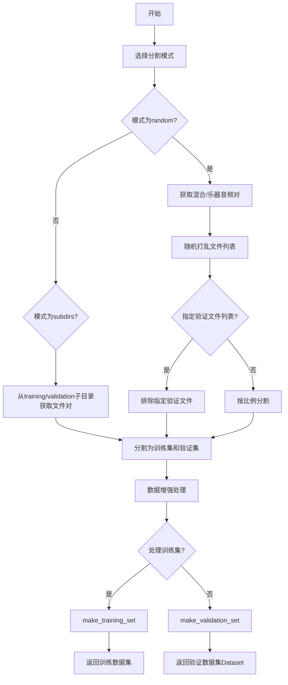
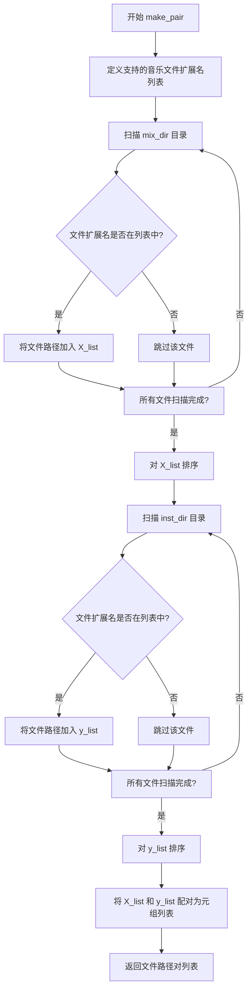
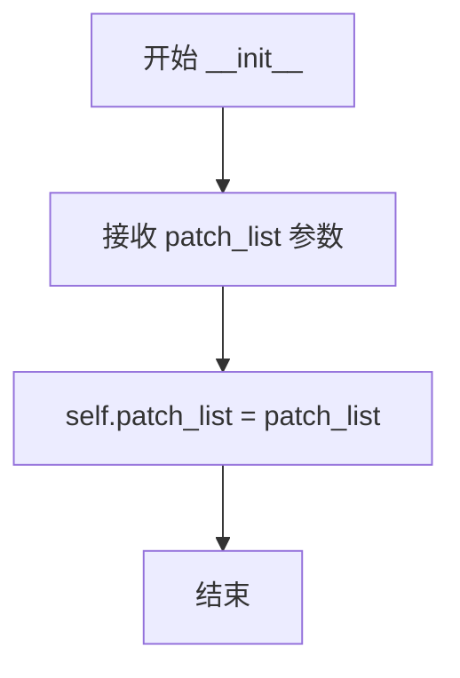

# `Chat-Haruhi-Suzumiya\yuki_builder\video_preprocessing\uvr5\uvr5_pack\lib_v5\dataset.py` 详细设计文档

该模块为人声分离模型训练提供数据准备功能，包括训练/验证集划分、数据增强、音频预处理和数据集构建，支持随机和子目录两种分割模式。

## 整体流程



## 类结构

```
torch.utils.data.Dataset (PyTorch基类)
└── VocalRemoverValidationSet (验证集数据集类)
```

## 全局变量及字段


### `make_pair`
    
将混合音频和乐器音频目录配对，生成文件路径元组列表

类型：`function`
    


### `train_val_split`
    
根据指定模式将数据集分割为训练集和验证集

类型：`function`
    


### `augment`
    
对训练数据进行数据增强，包括随机削减、通道交换、混音等操作

类型：`function`
    


### `make_padding`
    
计算音频频谱图的左右填充宽度，确保裁剪区域正确

类型：`function`
    


### `make_training_set`
    
从文件列表生成训练数据集，包含随机裁剪的频谱图块

类型：`function`
    


### `make_validation_set`
    
从文件列表生成验证集，将频谱图块保存为npz文件并返回Dataset对象

类型：`function`
    


### `input_exts`
    
支持的音频输入文件扩展名列表

类型：`list`
    


### `VocalRemoverValidationSet.patch_list`
    
验证集样本文件路径列表

类型：`list`
    
    

## 全局函数及方法


### `make_pair`

该函数用于扫描混合音频目录和乐器音频目录，匹配具有相同文件名的音频文件（支持wav、m4a、mp3、mp4、flac格式），并返回按文件名排序的文件路径对列表。

参数：

- `mix_dir`：`str`，混合音频（Mixture）所在的目录路径
- `inst_dir`：`str`，乐器音频（Instrument）所在的目录路径

返回值：`list`，返回由元组组成的列表，每个元组包含 `(混合音频文件路径, 对应的乐器音频文件路径)`，文件按文件名升序排列

#### 流程图



#### 带注释源码

```python
def make_pair(mix_dir, inst_dir):
    """
    扫描两个目录，匹配混合音频和对应乐器音频文件，返回文件路径对列表
    
    参数:
        mix_dir: 混合音频目录路径
        inst_dir: 乐器音频目录路径
    
    返回:
        包含(混合音频路径, 乐器音频路径)元组的列表
    """
    # 定义支持的音频文件扩展名
    input_exts = [".wav", ".m4a", ".mp3", ".mp4", ".flac"]

    # 从混合音频目录获取所有支持格式的文件路径，并按文件名排序
    X_list = sorted(
        [
            os.path.join(mix_dir, fname)  # 拼接完整文件路径
            for fname in os.listdir(mix_dir)  # 遍历目录下的所有文件
            if os.path.splitext(fname)[1] in input_exts  # 只保留支持格式的文件
        ]
    )
    
    # 从乐器音频目录获取所有支持格式的文件路径，并按文件名排序
    y_list = sorted(
        [
            os.path.join(inst_dir, fname)  # 拼接完整文件路径
            for fname in os.listdir(inst_dir)  # 遍历目录下的所有文件
            if os.path.splitext(fname)[1] in input_exts  # 只保留支持格式的文件
        ]
    )

    # 将两个列表按索引配对成元组列表
    # 假设 X_list 和 y_list 中的文件按相同顺序排列（通过sorted保证）
    filelist = list(zip(X_list, y_list))

    return filelist
```


### `train_val_split`

该函数是音频分离数据集的核心划分工具，根据指定模式将混合音轨和乐器音轨配对后划分为训练集和验证集，支持随机划分（按比例或排除指定文件）或基于子目录结构的划分方式。

参数：

- `dataset_dir`：`str`，数据集根目录路径，包含 mixtures 和 instruments 子文件夹，或 training/validation 子目录结构
- `split_mode`：`str`，划分模式，支持 `"random"`（随机划分）或 `"subdirs"`（按子目录划分）
- `val_rate`：`float`，验证集比例（0.0-1.0），仅在 `split_mode="random"` 且 `val_filelist` 为空时生效
- `val_filelist`：`list`，预定义的验证集文件列表（元素为列表形式），在 random 模式下用于排除指定文件，subdirs 模式下必须为空

返回值：`tuple`，返回 `(train_filelist, val_filelist)`，每个列表元素为 `(混合音轨路径, 乐器音轨路径)` 的元组

#### 流程图

```mermaid
flowchart TD
    A[开始 train_val_split] --> B{split_mode == 'random'?}
    B -->|Yes| C[调用 make_pair 获取所有文件对]
    C --> D[random.shuffle 打乱文件列表]
    D --> E{len(val_filelist) == 0?}
    E -->|Yes| F[根据 val_rate 计算验证集大小]
    F --> G[切分为训练集和验证集]
    E -->|No| H[从文件列表中排除 val_filelist 中的项]
    H --> I[生成训练集列表]
    B -->|No| J{split_mode == 'subdirs'?}
    J -->|Yes| K{len(val_filelist) != 0?}
    K -->|Yes| L[抛出 ValueError 异常]
    K -->|No| M[从 training/ 子目录获取训练集]
    M --> N[从 validation/ 子目录获取验证集]
    J -->|No| O[抛出 ValueError 异常]
    G --> P[返回 train_filelist, val_filelist]
    I --> P
    N --> P
    L --> P
    O --> P
```

#### 带注释源码

```python
def train_val_split(dataset_dir, split_mode, val_rate, val_filelist):
    """
    根据指定模式划分训练集和验证集
    
    Args:
        dataset_dir: 数据集根目录路径
        split_mode: 划分模式，"random" 或 "subdirs"
        val_rate: 验证集比例，仅 random 模式且 val_filelist 为空时使用
        val_filelist: 预定义的验证集文件列表
    
    Returns:
        (train_filelist, val_filelist): 训练集和验证集文件列表
    """
    # 模式1：随机划分模式
    if split_mode == "random":
        # 获取混合音轨和乐器音轨的配对文件列表
        # make_pair 会扫描 mixtures 和 instruments 目录，匹配同名文件
        filelist = make_pair(
            os.path.join(dataset_dir, "mixtures"),      # 混合音轨目录
            os.path.join(dataset_dir, "instruments"),   # 乐器音轨目录
        )

        # 随机打乱文件顺序，确保划分随机性
        random.shuffle(filelist)

        # 判断是否使用预定义的验证集文件列表
        if len(val_filelist) == 0:
            # 未提供验证集列表，按 val_rate 比例计算验证集大小
            val_size = int(len(filelist) * val_rate)
            # 前部分作为训练集，后部分作为验证集
            train_filelist = filelist[:-val_size]
            val_filelist = filelist[-val_size:]
        else:
            # 提供了验证集列表，从全部文件中排除验证集项
            # 使用列表比较过滤：pair 是元组，val_filelist 元素也是列表
            train_filelist = [
                pair for pair in filelist if list(pair) not in val_filelist
            ]
    
    # 模式2：子目录划分模式（训练集和验证集在不同目录）
    elif split_mode == "subdirs":
        # subdirs 模式下不接受预定义的 val_filelist
        if len(val_filelist) != 0:
            raise ValueError(
                "The `val_filelist` option is not available in `subdirs` mode"
            )

        # 从 training 子目录获取训练数据
        train_filelist = make_pair(
            os.path.join(dataset_dir, "training/mixtures"),
            os.path.join(dataset_dir, "training/instruments"),
        )

        # 从 validation 子目录获取验证数据
        val_filelist = make_pair(
            os.path.join(dataset_dir, "validation/mixtures"),
            os.path.join(dataset_dir, "validation/instruments"),
        )
    
    # 返回划分后的训练集和验证集
    return train_filelist, val_filelist
```

---

## 补充设计文档信息

### 1. 文件整体运行流程

该文件是 VocalRemover 项目的数**据集准备模块**，主要流程如下：

```
数据集目录
    │
    ├─→ train_val_split() ──────→ 划分训练/验证集
    │       │
    │       ├─→ make_pair() ────→ 配对混合音轨与乐器音轨
    │       │
    │       └─→ 返回文件路径元组列表
    │
    ├─→ make_training_set() ────→ 创建训练数据集
    │       │
    │       └─→ 返回 numpy 数组 (X_dataset, y_dataset)
    │
    ├─→ make_validation_set() ──→ 创建验证数据集
    │       │
    │       └─→ 返回 VocalRemoverValidationSet 对象
    │
    └─→ augment() ───────────────→ 数据增强
```

### 2. 关键组件信息

| 组件名称 | 类型 | 描述 |
|---------|------|------|
| `make_pair` | 全局函数 | 扫描两个目录，匹配同名音频文件并返回路径配对列表 |
| `VocalRemoverValidationSet` | 类 | PyTorch Dataset 实现，用于加载验证集 patches |
| `augment` | 全局函数 | 对训练数据进行随机增强（通道交换、混音、单声道转换等） |
| `make_padding` | 全局函数 | 计算音频频谱图的填充参数 |
| `make_training_set` | 全局函数 | 构建完整的训练数据集 numpy 数组 |
| `make_validation_set` | 全局函数 | 生成验证集 patches 并保存为 npz 文件 |

### 3. 全局变量

| 变量名称 | 类型 | 描述 |
|---------|------|------|
| `input_exts` | list | 支持的音频文件扩展名列表 [".wav", ".m4a", ".mp3", ".mp4", ".flac"] |

### 4. 类详细信息

#### `VocalRemoverValidationSet`

继承自 `torch.utils.data.Dataset`，用于 PyTorch DataLoader。

**字段：**
- `patch_list`：list，验证集 patch 文件路径列表

**方法：**
- `__init__(self, patch_list)`：初始化，存储 patch 列表
- `__len__(self)`：返回数据集大小
- `__getitem__(self, idx)`：加载指定索引的 patch，返回频谱幅度图 (X_mag, y_mag)

### 5. 潜在技术债务与优化空间

1. **文件过滤逻辑重复**：`make_pair` 和后续文件扫描使用相同的扩展名过滤逻辑，可提取为独立函数
2. **内存效率**：验证集采用预生成 npz 文件的方式，增加了磁盘 I/O，可考虑按需生成或使用内存缓存
3. **错误处理**：缺少文件不存在、格式错误、路径权限等异常处理
4. **类型注解**：全函数无类型注解，不利于静态分析和 IDE 支持
5. **硬编码路径**：`make_validation_set` 中 patch 目录名称直接拼接字符串，应统一管理

### 6. 外部依赖与接口契约

- **依赖库**：`os`, `random`, `numpy`, `torch.utils.data`, `tqdm`, `spec_utils`
- **输入约束**：
  - `dataset_dir` 必须存在且包含对应子目录
  - `split_mode` 必须是 `"random"` 或 `"subdirs"`
  - `val_rate` 应在 0.0-1.0 之间
  - random 模式下 mixtures 和 instruments 目录必须包含配对的音频文件
- **输出格式**：返回的 filelist 元素为 `(X_path, y_path)` 元组，X 为混合音轨，y 为乐器音轨


### `augment`

该函数对训练数据集进行多种数据增强操作，包括随机人声抑制 aggressive vocal reduction、通道交换 channel swap、单声道化 mono conversion、乐器替换 instrument replacement 以及 mixup 混合增强，旨在提升模型的泛化能力。

参数：

- `X`：`numpy.ndarray`，混合音频的频谱数据，形状为 (batch, channels, freq_bins, time_frames)
- `y`：`numpy.ndarray`，人声/乐器分离后的人声频谱数据，形状与 X 相同
- `reduction_rate`：`float`，执行人声抑制增强的概率，范围 [0, 1]
- `reduction_mask`：`numpy.ndarray`，用于人声抑制的掩码矩阵
- `mixup_rate`：`float`，执行 mixup 混合增强的概率，范围 [0, 1]
- `mixup_alpha`：`float`，Beta 分布的超参数，用于生成 mixup 的混合权重 λ

返回值：`tuple`，返回增强后的 (X, y) 元组，两者均为 numpy.ndarray 类型

#### 流程图

```mermaid
flowchart TD
    A[开始 augment] --> B[生成随机排列索引 perm]
    B --> C{遍历索引 i, idx}
    C --> D{随机 < reduction_rate?}
    D -->|是| E[调用 reduce_vocal_aggressively 抑制人声]
    D -->|否| F{随机 < 0.5?}
    E --> F
    F -->|是| G[交换 X[idx] 和 y[idx] 的通道]
    F -->|否| H{随机 < 0.02?}
    G --> H
    H -->|是| I[对 X[idx] 和 y[idx] 执行单声道化]
    H -->|否| J{随机 < 0.02?}
    I --> J
    J -->|是| K[用 y[idx] 替换 X[idx] 实现乐器替换]
    J -->|否| L{随机 < mixup_rate 且 i < len-1?}
    K --> L
    L -->|是| M[计算 beta 混合权重 lam]
    M --> N[执行 mixup: X[idx] = lam*X[idx] + (1-lam)*X[perm[i+1]]
    N --> O[执行 mixup: y[idx] = lam*y[idx] + (1-lam)*y[perm[i+1]]]
    L -->|否| P{是否还有未遍历的索引?}
    O --> P
    P -->|是| C
    P -->|否| Q[返回增强后的 X, y]
```

#### 带注释源码

```python
def augment(X, y, reduction_rate, reduction_mask, mixup_rate, mixup_alpha):
    """
    对训练数据进行多种数据增强操作
    
    增强操作包括:
    1. 人声抑制 (reduction): 随机将人声部分替换为更激进的人声抑制版本
    2. 通道交换 (channel swap): 随机交换左右声道
    3. 单声道化 (mono): 随机将立体声转换为单声道
    4. 乐器替换 (instrument): 随机用纯伴奏替换混合音频
    5. Mixup: 随机与下一个样本进行线性插值混合
    """
    # 生成随机排列的索引，用于打乱数据顺序
    perm = np.random.permutation(len(X))
    
    # 遍历打乱后的索引
    for i, idx in enumerate(tqdm(perm)):
        # 1. 人声抑制增强: 根据 reduction_rate 概率执行
        if np.random.uniform() < reduction_rate:
            # 调用 spec_utils 中的 aggressive vocal reduction 函数
            y[idx] = spec_utils.reduce_vocal_aggressively(
                X[idx], y[idx], reduction_mask
            )

        # 2. 通道交换: 50% 概率交换左右声道 (通过逆序实现)
        if np.random.uniform() < 0.5:
            # swap channel
            X[idx] = X[idx, ::-1]
            y[idx] = y[idx, ::-1]
        
        # 3. 单声道化: 2% 概率转换为单声道
        if np.random.uniform() < 0.02:
            # mono - 对通道维度求平均并保持维度
            X[idx] = X[idx].mean(axis=0, keepdims=True)
            y[idx] = y[idx].mean(axis=0, keepdims=True)
        
        # 4. 乐器替换: 2% 概率用纯人声替换混合音频
        if np.random.uniform() < 0.02:
            # inst - 用人声/伴奏分离后的人声部分替换原始混合
            X[idx] = y[idx]

        # 5. Mixup 混合增强: 根据 mixup_rate 概率与下一个样本混合
        # 条件: i < len(perm) - 1 确保有下一个样本可以混合
        if np.random.uniform() < mixup_rate and i < len(perm) - 1:
            # 从 Beta 分布采样混合系数 lam
            lam = np.random.beta(mixup_alpha, mixup_alpha)
            # 对混合音频 X 进行线性插值
            X[idx] = lam * X[idx] + (1 - lam) * X[perm[i + 1]]
            # 对人声标签 y 进行线性插值
            y[idx] = lam * y[idx] + (1 - lam) * y[perm[i + 1]]

    return X, y
```


# 设计文档：make_padding 函数

## 1. 核心功能概述

`make_padding` 函数用于计算音频频谱图（spectrogram）的 padding 参数，通过给定输入宽度、目标裁剪大小和偏移量，计算出左侧填充、右侧填充以及感兴趣区域（ROI）的尺寸，从而确保输出尺寸能够被裁剪大小整除，常用于深度学习音频分离任务中的数据预处理。

## 2. 文件整体运行流程

该文件（`train_utils.py` 或类似模块）主要服务于 Vocal Remover（人声消除）模型的训练流程：

```
数据集准备 → 训练/验证集划分 → 数据增强 → 裁剪与Padding → 最终数据集
     ↑                                                      ↓
  make_pair()                                       make_padding()
  train_val_split()                                 make_training_set()
  augment()                                          make_validation_set()
```

## 3. 函数详细信息

### 3.1 全局函数：`make_padding`

**描述**：计算频谱图在时间维度上的 padding 参数，确保输入宽度经过 padding 后可以均匀划分为多个裁剪区域。

**参数**：

- `width`：`int`，输入频谱图的宽度（时间帧数）
- `cropsize`：`int`，期望的裁剪大小（每个patch的时间维度长度）
- `offset`：`int`，左侧偏移量，用于控制 ROI 的起始位置

**返回值**：`tuple[int, int, int]`，包含三个整数的元组

- `left`：`int`，左侧 padding 的大小
- `right`：`int`，右侧 padding 的大小
- `roi_size`：`int`，感兴趣区域的大小（每个裁剪块的实际有效宽度）

#### 流程图

```mermaid
flowchart TD
    A[开始: make_padding] --> B[设置 left = offset]
    B --> C[计算 roi_size = cropsize - left * 2]
    C --> D{roi_size == 0?}
    D -->|是| E[roi_size = cropsize]
    D -->|否| F[继续]
    E --> G[计算 right = roi_size - (width % roi_size) + left]
    F --> G
    G --> H[返回 left, right, roi_size]
```

#### 带注释源码

```python
def make_padding(width, cropsize, offset):
    """
    计算音频频谱图的padding参数，用于保持输出尺寸。
    
    参数:
        width: 输入频谱图的宽度（时间维度）
        cropsize: 期望的裁剪大小
        offset: 左侧偏移量
        
    返回:
        (left, right, roi_size): 左侧填充、右侧填充、ROI大小
    """
    # 1. 左侧padding等于偏移量
    left = offset
    
    # 2. 计算感兴趣区域大小：裁剪大小减去左右两侧的偏移
    roi_size = cropsize - left * 2
    
    # 3. 边界情况处理：如果ROI大小为0，则使用完整的裁剪大小
    if roi_size == 0:
        roi_size = cropsize
    
    # 4. 计算右侧padding：
    #    - width % roi_size: 宽度除以ROI大小的余数
    #    - roi_size - 余数: 需要填充多少才能整除
    #    - + left: 加上左侧偏移量，保持对称性
    right = roi_size - (width % roi_size) + left

    # 5. 返回左侧填充、右侧填充、ROI大小
    return left, right, roi_size
```

## 4. 关键组件信息

| 组件名称 | 一句话描述 |
|---------|-----------|
| `make_padding` | 计算频谱图 padding 参数的核心函数，确保输出尺寸可整除 |
| `VocalRemoverValidationSet` | PyTorch Dataset 类，用于加载验证集 patch |
| `make_training_set` | 生成训练数据集的主函数，内部调用 make_padding |
| `make_validation_set` | 生成验证集并保存为 npz 文件 |
| `spec_utils.cache_or_load` | 外部依赖，用于加载或缓存频谱图数据 |

## 5. 潜在技术债务与优化空间

1. **硬编码的 padding 逻辑**：当前 padding 策略较为简单，仅支持对称 padding，可考虑支持更灵活的 padding 模式（如反射 padding、边界复制等）

2. **缺乏输入验证**：函数未对 `width`、`cropsize`、`offset` 的有效性进行校验，可能在极端参数下产生负数或异常值

3. **固定随机种子**：数据增强函数中使用了 `np.random`，未设置全局随机种子，不利于实验复现

4. **冗余计算**：在 `make_validation_set` 中，每次都重新计算 padding，可考虑缓存

## 6. 其它项目

### 6.1 设计目标与约束

- **目标**：确保频谱图在时间维度上可以被均匀裁剪，避免边缘截断
- **约束**：`offset` 必须小于 `cropsize / 2`，否则 `roi_size` 可能为负数或零

### 6.2 错误处理与异常设计

- 当前函数无显式异常处理，当 `cropsize < offset * 2` 时，`roi_size` 会变为负数，可能导致不可预期行为
- 建议添加参数校验：`assert cropsize > offset * 2, "offset 过大"`

### 6.3 数据流与状态机

```
原始频谱图 (W, F, T)
    ↓ make_padding
padding 参数 (left, right, roi_size)
    ↓ np.pad
填充后频谱图 (W, F, T + left + right)
    ↓ 随机裁剪
训练样本 (W, F, cropsize)
```

### 6.4 外部依赖与接口契约

- **依赖模块**：`spec_utils`（提供频谱图加载功能）
- **调用方**：`make_training_set`、`make_validation_set`
- **返回值约定**：返回值为三个整数的元组，调用方需解包使用


### `make_training_set`

该函数用于构建训练数据集，接收音频文件列表和预处理参数，循环遍历每个音频文件进行加载、归一化、填充和随机裁剪，最终返回包含所有训练样本的输入特征矩阵和目标标签矩阵。

#### 参数

- `filelist`：`list[tuple[str, str]]`，音频文件对列表，每个元素为 (混合音频路径, 乐器/伴奏音频路径) 的元组
- `cropsize`：`int`，裁剪窗口大小，定义了输出频谱图的宽度维度
- `patches`：`int`，每个音频文件生成的训练样本数量
- `sr`：`int`，音频采样率，用于加载音频文件
- `hop_length`：`int`，短时傅里叶变换的帧移长度
- `n_fft`：`int`，傅里叶变换的窗口长度
- `offset`：`int`，填充偏移量，用于计算感兴趣区域大小

#### 返回值

- `tuple[np.ndarray, np.ndarray]`，返回包含输入特征 X_dataset 和目标标签 y_dataset 的元组，两者均为形状为 (len_dataset, 2, n_fft//2+1, cropsize) 的复数型 numpy 数组

#### 流程图

```mermaid
flowchart TD
    A[开始 make_training_set] --> B[计算数据集总长度: len_dataset = patches × len<br/>filelist]
    B --> C[初始化 X_dataset 和 y_dataset 零数组]
    C --> D{遍历 filelist 中的每个音频文件对}
    D -->|第 i 个文件| E[调用 spec_utils.cache_or_load 加载并计算频谱]
    E --> F[计算归一化系数: coef = max<br/>abs(X).max, abs(y).max]
    F --> G[归一化: X = X/coef, y = y/coef]
    G --> H[调用 make_padding 计算填充参数]
    H --> I[对频谱图进行零填充]
    I --> J[随机生成 patches 个起始位置]
    J --> K{遍历每个 patch}
    K -->|第 j 个 patch| L[计算索引: idx = i × patches + j]
    L --> M[从填充后的频谱中裁剪对应区域]
    M --> N[存储到数据集数组]
    K --> O{所有 patch 遍历完毕}
    O --> D
    D --> P{所有文件遍历完毕}
    P --> Q[返回 X_dataset, y_dataset]
```

#### 带注释源码

```python
def make_training_set(filelist, cropsize, patches, sr, hop_length, n_fft, offset):
    """
    构建训练数据集，加载音频并进行预处理和增强
    
    参数:
        filelist: 音频文件对列表，每个元素为 (混合音频路径, 目标音频路径)
        cropsize: 裁剪窗口大小
        patches: 每个音频文件生成的样本数
        sr: 采样率
        hop_length: 帧移长度
        n_fft: FFT窗口长度
        offset: 填充偏移量
    
    返回:
        (X_dataset, y_dataset): 输入和目标频谱图数组
    """
    
    # 计算数据集总长度：每个音频文件生成 patches 个样本
    len_dataset = patches * len(filelist)

    # 初始化输入特征矩阵 X 和目标标签矩阵 y
    # 形状: (样本数, 通道数=2表示立体声, 频率 bins, 时间帧数)
    # 使用复数类型 complex64 存储完整频谱信息
    X_dataset = np.zeros((len_dataset, 2, n_fft // 2 + 1, cropsize), dtype=np.complex64)
    y_dataset = np.zeros((len_dataset, 2, n_fft // 2 + 1, cropsize), dtype=np.complex64)

    # 遍历每个音频文件对
    for i, (X_path, y_path) in enumerate(tqdm(filelist)):
        
        # 加载音频并计算STFT频谱图
        # cache_or_load 负责处理音频加载、STFT变换和可能的缓存
        X, y = spec_utils.cache_or_load(X_path, y_path, sr, hop_length, n_fft)
        
        # 计算归一化系数：取输入和目标频谱最大值
        # 确保训练过程中数值稳定性
        coef = np.max([np.abs(X).max(), np.abs(y).max()])
        
        # 归一化处理：将频谱值缩放到 [-1, 1] 范围
        X, y = X / coef, y / coef

        # 计算填充参数：处理边缘情况，确保可裁剪
        # left: 左侧填充, right: 右侧填充, roi_size: 有效区域大小
        l, r, roi_size = make_padding(X.shape[2], cropsize, offset)
        
        # 对频谱图进行零填充（第三维为时间维度）
        # 填充后长度确保可以被 roi_size 整除
        X_pad = np.pad(X, ((0, 0), (0, 0), (l, r)), mode="constant")
        y_pad = np.pad(y, ((0, 0), (0, 0), (l, r)), mode="constant")

        # 随机生成 patches 个不重叠的裁剪起始位置
        # 确保起始位置在有效范围内
        starts = np.random.randint(0, X_pad.shape[2] - cropsize, patches)
        ends = starts + cropsize

        # 遍历每个随机裁剪位置，提取训练样本
        for j in range(patches):
            # 计算全局索引：第 i 个文件 的第 j 个 patch
            idx = i * patches + j
            
            # 从填充后的频谱中裁剪对应区域
            # [:, :, starts[j]:ends[j]] 选取时间维度上的裁剪窗口
            X_dataset[idx] = X_pad[:, :, starts[j] : ends[j]]
            y_dataset[idx] = y_pad[:, :, starts[j] : ends[j]]

    # 返回完整的训练数据集
    return X_dataset, y_dataset
```

---

### 关键组件信息

| 组件名称 | 一句话描述 |
|---------|-----------|
| `spec_utils.cache_or_load` | 负责音频文件加载、STFT频谱计算及可能的缓存管理 |
| `make_padding` | 计算频谱图边缘填充参数，确保可裁剪到指定尺寸 |
| `np.complex64` | 使用复数类型存储完整频谱信息（幅度和相位） |
| `tqdm` | 进度条显示库，用于展示文件处理进度 |

---

### 潜在技术债务与优化空间

1. **内存预分配效率**：使用 `np.zeros` 预分配大型数组可能导致内存峰值过高（最大约 8GB+），可考虑分批处理或内存映射
2. **随机裁剪策略**：当前实现对所有音频文件使用相同的随机种子生成裁剪位置，无法复现训练过程
3. **缺少数据增强**：与 `augment` 函数相比，未在训练集构建时应用时域增强（如通道交换、混音）
4. **归一化粒度**：全局归一化系数基于整个音频最大值，可能导致不同音频间幅度差异较大
5. **硬编码维度**：频率维度 `n_fft // 2 + 1` 固定，缺少灵活性

---

### 其它项目

#### 设计目标与约束

- **目标**：高效生成大规模训练数据集，支持随机裁剪和数据增强
- **约束**：所有输入音频需具有相同采样率和FFT参数；输出为复数频谱（幅度和相位信息完整保留）

#### 错误处理与异常设计

- 未显式处理文件不存在或加载失败的情况（依赖 `spec_utils.cache_or_load` 内部处理）
- 未验证 `cropsize`、`patches` 等参数的有效性
- `filelist` 为空时返回空数组，不会抛出异常

#### 数据流与状态机

```
输入音频文件 → STFT变换 → 幅度归一化 → 零填充 → 随机裁剪 → 存储到数据集数组
```

#### 外部依赖与接口契约

- 依赖 `spec_utils.cache_or_load(X_path, y_path, sr, hop_length, n_fft)` 返回形状为 `(2, n_fft//2+1, T)` 的复数数组
- 依赖 `make_padding(width, cropsize, offset)` 返回填充参数 `(left, right, roi_size)`
- 返回值供 `torch.utils.data.DataLoader` 使用，形状需与模型输入兼容


### `make_validation_set`

构建验证数据集，将音频文件对（混合音轨和乐器音轨）进行STFT变换、归一化和裁剪，保存为npz文件，并返回包含这些补丁路径的`VocalRemoverValidationSet`数据集对象。

参数：

- `filelist`：List[Tuple[str, str]]，音频文件对列表，每个元素为(混合音轨路径, 乐器音轨路径)的元组
- `cropsize`：int，裁剪窗口大小，定义每个补丁的时间帧数
- `sr`：int，采样率，用于STFT变换
- `hop_length`：int，跳跃长度，STFT帧移
- `n_fft`：int，FFT点数，频域分辨率
- `offset`：int，偏移量，用于填充和ROI计算

返回值：`VocalRemoverValidationSet`，验证数据集对象，包含预处理的音频补丁路径列表

#### 流程图

```mermaid
flowchart TD
    A[开始] --> B[创建补丁目录命名<br/>cs{}_sr{}_hl{}_nf{}_of{}]
    B --> C[遍历filelist中的每个文件对]
    C --> D[获取基础文件名]
    D --> E[加载并处理音频<br/>cache_or_load]
    E --> F[计算归一化系数<br/>max/abs]
    F --> G[归一化X和y]
    G --> H[计算填充参数<br/>make_padding]
    H --> I[对音频进行填充]
    I --> J[计算该文件产生的补丁数量<br/>ceil/roi_size]
    J --> K{遍历每个补丁索引}
    K -->|j=0 to len_dataset-1| L[构建输出文件路径]
    L --> M{检查文件是否存在}
    M -->|不存在| N[保存npz文件<br/>X和y补丁数据]
    M -->|存在| O[跳过保存]
    N --> P[添加路径到patch_list]
    O --> P
    P --> Q{是否还有更多补丁}
    Q -->|是| K
    Q -->|否| R{是否还有更多文件}
    R -->|是| C
    R -->|否| S[返回VocalRemoverValidationSet对象]
    S --> T[结束]
```

#### 带注释源码

```python
def make_validation_set(filelist, cropsize, sr, hop_length, n_fft, offset):
    """
    构建验证数据集
    
    参数:
        filelist: 音频文件对列表 [(混合音轨路径, 乐器音轨路径), ...]
        cropsize: 裁剪窗口大小
        sr: 采样率
        hop_length: STFT跳跃长度
        n_fft: FFT点数
        offset: 偏移量
    
    返回:
        VocalRemoverValidationSet: 验证数据集对象
    """
    patch_list = []  # 存储所有补丁文件路径的列表
    
    # 根据参数生成补丁目录名称，便于识别和复用
    patch_dir = "cs{}_sr{}_hl{}_nf{}_of{}".format(
        cropsize, sr, hop_length, n_fft, offset
    )
    
    # 创建补丁目录，如果已存在则不报错
    os.makedirs(patch_dir, exist_ok=True)

    # 遍历每个音频文件对
    for i, (X_path, y_path) in enumerate(tqdm(filelist)):
        # 获取不带扩展名的文件名作为基础名
        basename = os.path.splitext(os.path.basename(X_path))[0]

        # 使用spec_utils模块加载音频并进行STFT变换
        # 返回的X和y为复数频谱，形状为(2, freq_bins, time_frames)
        X, y = spec_utils.cache_or_load(X_path, y_path, sr, hop_length, n_fft)
        
        # 计算归一化系数，取混合音轨和乐器音轨的最大绝对值
        coef = np.max([np.abs(X).max(), np.abs(y).max()])
        
        # 归一化处理，防止数值过大
        X, y = X / coef, y / coef

        # 计算填充参数：左填充、ROI大小、右填充
        l, r, roi_size = make_padding(X.shape[2], cropsize, offset)
        
        # 对频谱进行填充，使其能被ROI整除
        # 填充维度为(通道, 频率, 时间)，仅在时间维度填充
        X_pad = np.pad(X, ((0, 0), (0, 0), (l, r)), mode="constant")
        y_pad = np.pad(y, ((0, 0), (0, 0), (l, r)), mode="constant")

        # 计算该文件能产生的补丁数量（向上取整）
        len_dataset = int(np.ceil(X.shape[2] / roi_size))
        
        # 遍历每个补丁位置
        for j in range(len_dataset):
            # 构建输出文件路径，格式：{基础名}_p{索引}.npz
            outpath = os.path.join(patch_dir, "{}_p{}.npz".format(basename, j))
            
            # 计算当前补丁的起始位置
            start = j * roi_size
            
            # 如果文件不存在，则保存
            if not os.path.exists(outpath):
                np.savez(
                    outpath,
                    # 提取裁剪窗口大小的频谱数据
                    X=X_pad[:, :, start : start + cropsize],
                    y=y_pad[:, :, start : start + cropsize],
                )
            
            # 将路径添加到列表中
            patch_list.append(outpath)

    # 返回验证数据集对象
    return VocalRemoverValidationSet(patch_list)
```


### `VocalRemoverValidationSet.__init__`

初始化验证集对象，接收补丁文件路径列表并存储为实例变量，供后续数据加载使用。

参数：

- `self`：隐式参数，`VocalRemoverValidationSet` 实例自身
- `patch_list`：`List[str]`，补丁文件路径列表，每个元素为 `.npz` 格式文件的完整路径

返回值：`None`，无返回值，仅初始化实例变量

#### 流程图



#### 带注释源码

```python
def __init__(self, patch_list):
    """
    初始化 VocalRemoverValidationSet 验证集
    
    参数:
        patch_list: 补丁文件路径列表，包含预处理的验证集数据文件路径
    """
    # 将传入的补丁文件路径列表存储为实例变量
    # 后续 __getitem__ 方法将通过索引访问这些路径来加载数据
    self.patch_list = patch_list
```


### `VocalRemoverValidationSet.__len__`

该方法为PyTorch Dataset类的标准接口实现，用于返回验证集包含的样本（patch）数量，使DataLoader能够正确迭代整个数据集。

参数：

- `self`：`VocalRemoverValidationSet`，指向VocalRemoverValidationSet实例本身的引用，包含实例属性patch_list

返回值：`int`，返回验证集样本数量，即patch列表的长度

#### 流程图

```mermaid
flowchart TD
    A[开始 __len__] --> B[访问 self.patch_list]
    B --> C{获取列表长度}
    C --> D[return len(self.patch_list)]
    D --> E[结束]
```

#### 带注释源码

```python
def __len__(self):
    """
    返回验证集样本数量。
    
    这是PyTorch Dataset类的标准接口方法，使DataLoader能够
    获取数据集大小以便正确分批和迭代。
    
    Returns:
        int: 验证集中存储的patch文件路径列表的长度
    """
    return len(self.patch_list)
```


### `VocalRemoverValidationSet.__getitem__`

该方法通过指定索引加载预处理的验证数据集补丁文件，提取混合音频和乐器音频的幅度谱，供模型验证使用。

参数：

- `self`：`VocalRemoverValidationSet`，当前实例对象，包含 `patch_list` 属性存储补丁文件路径列表
- `idx`：`int`，要访问的样本索引，用于从 `patch_list` 中获取对应的补丁文件路径

返回值：`tuple`，返回两个 `numpy.ndarray` 类型的幅度谱数组，格式为 `(X_mag, y_mag)`，其中 `X_mag` 是混合音频的幅度谱，`y_mag` 是乐器音频的幅度谱

#### 流程图

```mermaid
flowchart TD
    A[开始 __getitem__] --> B[根据 idx 从 patch_list 获取文件路径]
    B --> C[使用 np.load 加载 .npz 文件]
    C --> D[从 data 中提取 X 和 y 频谱数据]
    D --> E[计算 X 的幅度谱: X_mag = np.abs(X)]
    E --> F[计算 y 的幅度谱: y_mag = np.abs(y)]
    F --> G[返回 (X_mag, y_mag) 元组]
    G --> H[结束]
```

#### 带注释源码

```python
def __getitem__(self, idx):
    """
    获取指定索引的验证样本，包括混合音频和乐器音频的幅度谱
    
    参数:
        idx: int - 样本索引，用于从 patch_list 中获取对应的文件路径
    
    返回:
        tuple: (X_mag, y_mag) - 混合音频和乐器音频的幅度谱
    """
    # 根据索引从补丁列表中获取对应的 .npz 文件路径
    path = self.patch_list[idx]
    
    # 使用 numpy 加载预处理的频谱数据文件
    # 文件包含 'X' (混合音频频谱) 和 'y' (乐器音频频谱) 两个数组
    data = np.load(path)
    
    # 从加载的数据中提取混合音频和乐器音频的复数频谱
    X, y = data["X"], data["y"]
    
    # 计算混合音频频谱的幅度（取绝对值）
    X_mag = np.abs(X)
    
    # 计算乐器音频频谱的幅度（取绝对值）
    y_mag = np.abs(y)
    
    # 返回幅度谱元组，供模型验证使用
    return X_mag, y_mag
```

## 关键组件


### VocalRemoverValidationSet

验证集数据集类，继承自torch.utils.data.Dataset，用于惰性加载预先分片的验证数据。通过npz文件按需加载音频频谱数据，避免一次性将所有验证数据加载到内存中。

### make_pair

文件配对函数，扫描指定目录下的音频文件（支持wav、m4a、mp3、mp4、flac格式），将混合音轨（mixtures）与对应乐器音轨（instruments）按文件名排序后配对为列表。

### train_val_split

训练验证集分割函数，支持两种模式："random"模式随机划分数据集，"subdirs"模式按子目录结构分别读取训练集和验证集。提供验证集文件列表过滤功能。

### augment

数据增强函数，实现多种音频频谱增强策略：激进人声抑制、通道交换、单声道转换、乐器替换以及Mixup数据混合。支持自定义增强概率和Mixup参数。

### make_padding

填充计算辅助函数，根据目标裁剪大小和偏移量计算左右两侧填充宽度，确保频谱能够完整覆盖所需的裁剪区域。

### make_training_set

训练集构建函数，将音频文件转换为复数频谱表示，进行归一化处理后，按照指定裁剪大小和补丁数量随机采样生成训练数据集。一次性加载所有数据到内存。

### make_validation_set

验证集构建函数，将长音频切分为固定大小的补丁并保存为npz文件，返回VocalRemoverValidationSet数据集实例以支持惰性加载。每个补丁包含频谱数据和对应的目标信号。

### spec_utils

外部依赖模块，提供音频加载、频谱转换、缓存管理和人声抑制等核心处理功能。


## 问题及建议


### 已知问题

-   **验证集数据加载效率低**：`VocalRemoverValidationSet.__getitem__`方法每次调用都从磁盘读取npz文件，没有使用内存映射或预加载机制，在数据量大时会导致I/O瓶颈
-   **数据增强函数存在副作用**：`augment`函数直接修改输入数组X和y（in-place modification），可能导致调用者持有的数据被意外修改
-   **内存占用过高**：`make_training_set`使用`np.zeros`预分配完整数据集内存，对于大规模训练数据可能导致内存溢出
-   **验证集Patch持久化到磁盘**：`make_validation_set`将所有patch保存到磁盘（当前工作目录），然后再加载，这种IO操作在验证阶段可能不必要
-   **硬编码的魔法数字**：增强函数中的概率值（0.5、0.02、0.02）被硬编码，降低了可配置性
-   **路径硬编码**：验证集patch保存路径为当前工作目录的硬编码子目录"cs{}_sr{}_hl{}_nf{}_of{}"
-   **缺少错误处理**：文件I/O操作（如`np.load`、`np.savez`）没有try-except包装，文件损坏或路径不存在时会直接崩溃
-   **单通道增强导致维度不匹配**：augment中的mono操作`X[idx].mean(axis=0, keepdims=True)`将shape从(2, freq, time)变为(1, freq, time)，可能导致后续处理维度错误

### 优化建议

-   **实现内存映射或预加载机制**：为验证集实现`__getitem__`的缓存或使用`np.load(mmap_mode='r')`减少磁盘IO
-   **修复数据增强的副作用**：在augment函数中先复制输入数据，或使用`X = X.copy()`避免修改原数据
-   **改用流式或分批处理**：将`make_training_set`改为生成器模式，或使用torch.utils.data.Dataset替代全量加载
-   **消除不必要的磁盘IO**：`make_validation_set`可考虑直接在内存中返回Dataset而非持久化到磁盘
-   **配置化增强参数**：将增强概率值提取为函数参数或配置文件
-   **添加验证集输出路径参数**：允许调用者指定patch保存目录，而非使用硬编码路径
-   **完善异常处理**：为文件读写操作添加try-except，捕获并处理FileNotFoundError、PermissionError等异常
-   **修复mono增强的维度问题**：确保mono操作后通过squeeze/expand维度保持一致，或在文档中明确说明此操作的限制


## 其它


### 设计目标与约束

本模块的核心设计目标是实现音乐源分离（Music Source Separation）中训练数据与验证数据的准备流程，具体包括：
- 将混合音轨（mixtures）与对应的乐器音轨（instruments）配对
- 支持随机划分和按子目录划分两种训练/验证集分割模式
- 提供丰富的数据增强功能以提升模型泛化能力
- 生成符合神经网络输入要求的频域（STFT）训练样本
约束条件包括：输入音频格式限定为常见的无损/有损音频格式（.wav, .m4a, .mp3, .mp4, .flac），训练样本必须进行归一化处理，验证集支持磁盘缓存以加速迭代

### 错误处理与异常设计

代码中的错误处理主要体现在以下几个方面：
1. **目录不存在或为空**：在 `make_pair` 函数中，如果指定目录不存在或为空，`os.listdir` 返回空列表，导致 `filelist` 为空列表，调用方需自行检查
2. **文件不匹配**：当 X_list 和 y_list 文件数量不一致时，`zip` 会自动截断为最短列表长度，可能导致数据对齐问题
3. **子目录模式冲突**：`train_val_split` 在 `subdirs` 模式下若传入 `val_filelist` 参数会抛出 `ValueError`
4. **验证集缓存**：`make_validation_set` 中使用 `os.path.exists` 检查缓存文件，避免重复生成

### 数据流与状态机

整体数据流程如下：
```
原始音频文件 
    ↓ (make_pair)
文件对列表 [(mix_path, inst_path), ...]
    ↓ (train_val_split)
训练集文件对列表 + 验证集文件对列表
    ↓ (make_training_set / make_validation_set)
训练集: np.ndarray (X_dataset, y_dataset)
验证集: VocalRemoverValidationSet Dataset 对象
    ↓ (augment - 仅训练集)
增强后的训练数据
    ↓
DataLoader → 模型训练
```

### 外部依赖与接口契约

本模块依赖以下外部模块：
- `spec_utils.cache_or_load`: 用于加载音频文件并进行STFT变换
- `spec_utils.reduce_vocal_aggressively`: 用于激进的人声消除（数据增强）
- `numpy`: 数值计算
- `torch.utils.data.Dataset`: PyTorch数据集抽象
- `tqdm`: 进度条显示

接口契约：
- `make_pair(mix_dir, inst_dir)`: 输入两个目录路径，返回 [(mix_path, inst_path), ...] 列表
- `train_val_split(dataset_dir, split_mode, val_rate, val_filelist)`: 返回 (train_filelist, val_filelist)
- `augment(X, y, ...)`: 原地修改 X 和 y，返回增强后的数组
- `make_training_set` 和 `make_validation_set`: 返回训练可直接使用的数据集

### 配置参数说明

| 参数名 | 作用 | 典型值 |
|--------|------|--------|
| cropsize | 训练样本的时域长度（帧数） | 128, 256, 512 |
| patches | 每个音频文件生成的训练patch数量 | 16, 32, 64 |
| sr | 音频采样率 | 44100 |
| hop_length | STFT跳跃长度 | 1024, 2048 |
| n_fft | FFT窗口大小 | 2048, 4096 |
| offset | 频谱偏移量，用于控制padding | 0 |
| val_rate | 验证集比例（random模式） | 0.1, 0.2 |
| reduction_rate | 人声消除增强的概率 | 0.1 |
| mixup_rate | Mixup增强的概率 | 0.5 |
| mixup_alpha | Beta分布参数 | 2.0 |

### 性能考虑与优化空间

1. **内存优化**：`make_training_set` 一次性加载所有数据到内存，当数据集很大时可能导致内存溢出。可考虑使用内存映射（memory mapping）或生成器模式
2. **I/O优化**：`make_validation_set` 已实现基于npz的磁盘缓存机制，但训练集未实现缓存，可考虑添加类似缓存
3. **并行处理**：`augment` 函数中的循环可使用NumPy向量化操作或并行处理加速
4. **随机数管理**：当前使用全局 `np.random`，建议使用明确的随机种子以保证实验可复现性
5. **进度条**：已使用 tqdm 显示进度，建议在多进程数据加载时正确配置迭代器

### 安全性考虑

1. **路径安全**：代码中直接使用 `os.path.join` 拼接路径，未进行路径遍历验证（如防止 ../../../etc/passwd 类型的攻击），建议添加路径验证
2. **文件覆盖**：`make_validation_set` 在缓存文件存在时跳过生成，但未提供强制重生成机制
3. **磁盘空间**：验证集缓存可能占用大量磁盘空间，建议添加清理机制或大小限制

### 潜在的测试策略

1. **单元测试**：
   - 测试 `make_pair` 对空目录、单一文件、多文件的行为
   - 测试 `train_val_split` 两种模式的各种边界情况
   - 测试 `make_padding` 的边界条件（width < cropsize 等）
2. **集成测试**：
   - 端到端测试完整的数据准备流程
   - 验证生成的数据维度正确性
   - 验证数据增强后的数值范围
3. **性能测试**：
   - 大规模数据集下的内存占用
   - 数据加载速度基准测试

    