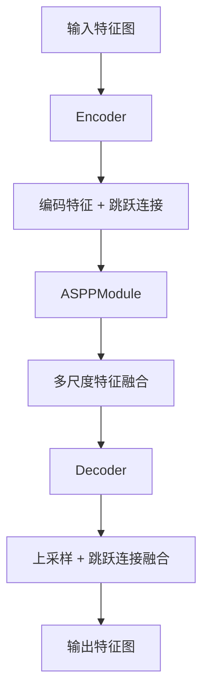
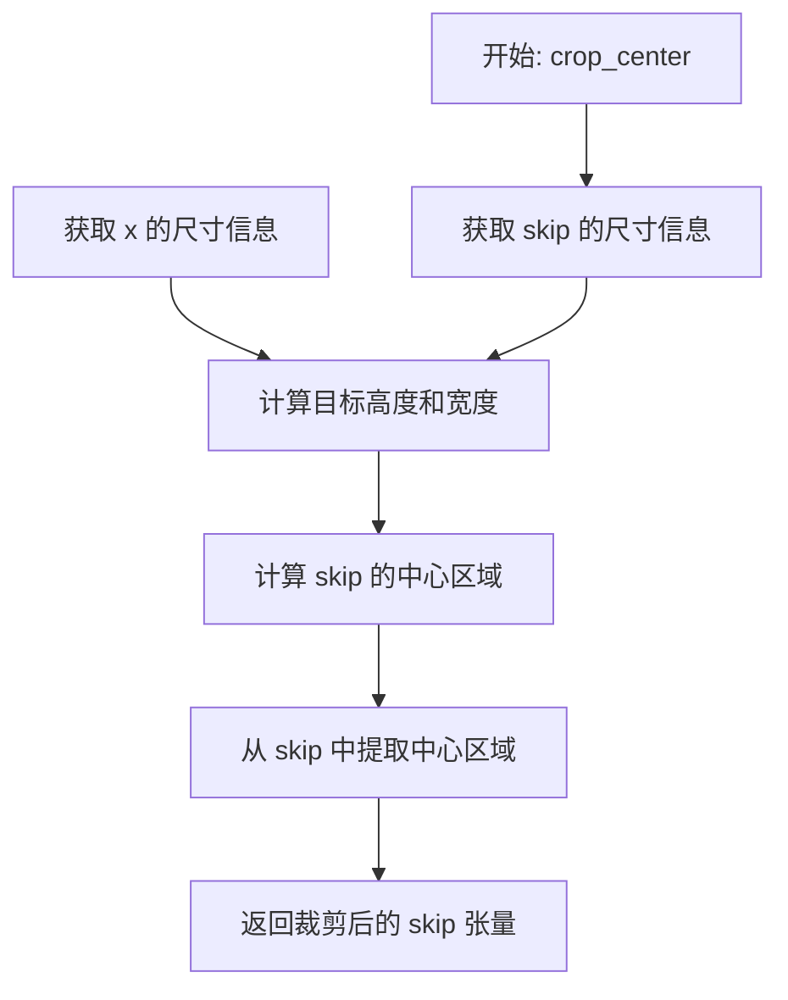
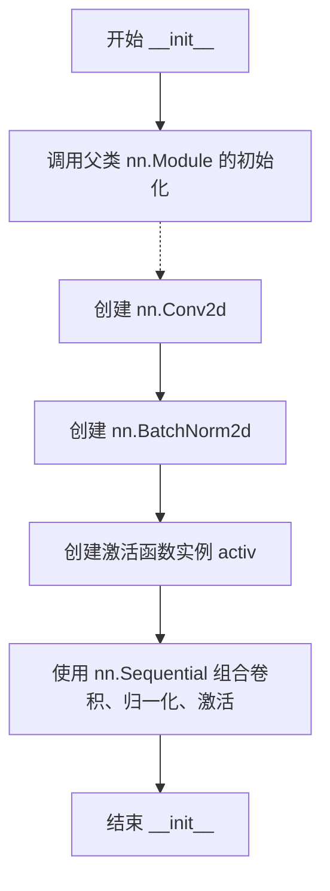
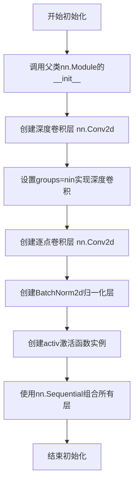
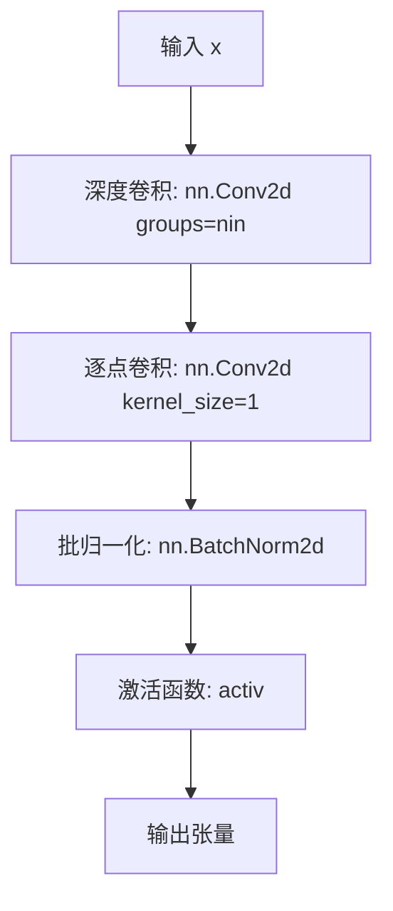
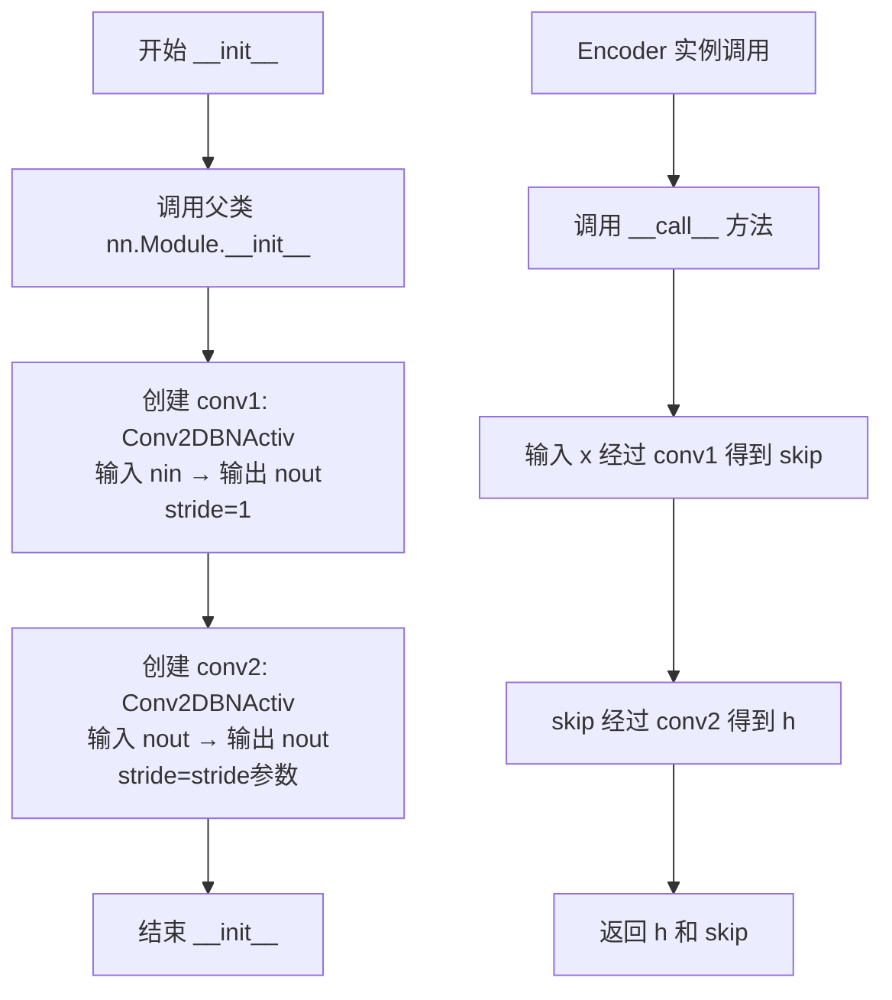
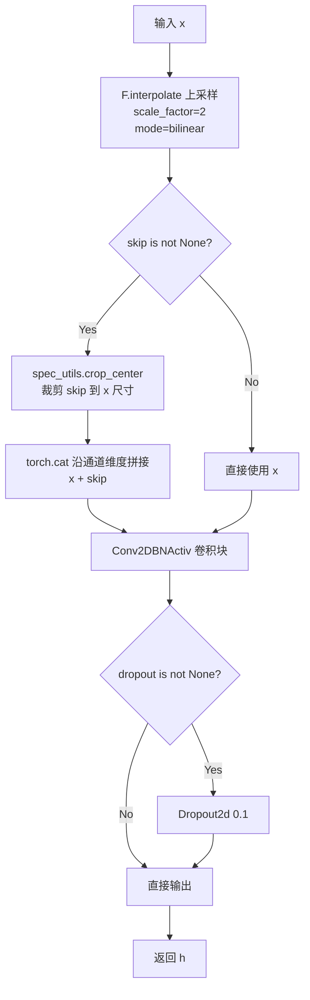
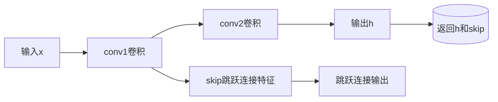
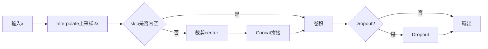
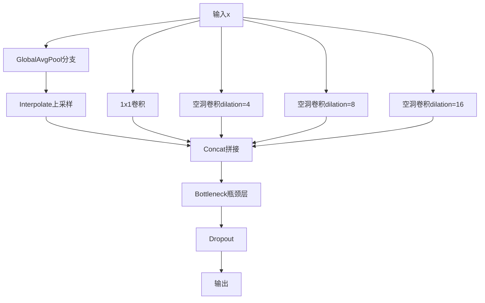

# `Chat-Haruhi-Suzumiya\yuki_builder\video_preprocessing\uvr5\uvr5_pack\lib_v5\layers.py` 详细设计文档

这是一个基于PyTorch的卷积神经网络模块集合，提供了构建编码器-解码器（Encoder-Decoder）架构的核心组件，包括标准卷积块、可分离卷积块、编码器模块、解码器模块以及空洞空间金字塔池化（ASPP）模块，主要用于图像分割等视觉任务。

## 整体流程



## 类结构

```
nn.Module (PyTorch基类)
├── Conv2DBNActiv (卷积+批归一化+激活函数)
├── SeperableConv2DBNActiv (可分离卷积+批归一化+激活函数)
├── Encoder (编码器模块)
├── Decoder (解码器模块)
└── ASPPModule (空洞空间金字塔池化模块)
```

## 全局变量及字段


### `nn`
    
PyTorch神经网络模块

类型：`module`
    


### `F`
    
PyTorch函数式接口模块

类型：`module`
    


### `torch`
    
PyTorch主模块

类型：`module`
    


### `spec_utils`
    
从当前包导入的工具模块，包含裁剪中心等辅助函数

类型：`module`
    


### `Conv2DBNActiv.conv`
    
卷积、批归一化、激活函数序列

类型：`nn.Sequential`
    


### `SeperableConv2DBNActiv.conv`
    
可分离卷积、1x1卷积、批归一化、激活函数序列

类型：`nn.Sequential`
    


### `Encoder.conv1`
    
第一个卷积块

类型：`Conv2DBNActiv`
    


### `Encoder.conv2`
    
第二个卷积块

类型：`Conv2DBNActiv`
    


### `Decoder.conv`
    
解码器卷积块

类型：`Conv2DBNActiv`
    


### `Decoder.dropout`
    
Dropout层

类型：`nn.Dropout2d or None`
    


### `ASPPModule.conv1`
    
全局平均池化分支

类型：`nn.Sequential`
    


### `ASPPModule.conv2`
    
1x1卷积分支

类型：`Conv2DBNActiv`
    


### `ASPPModule.conv3`
    
空洞率4的可分离卷积

类型：`SeperableConv2DBNActiv`
    


### `ASPPModule.conv4`
    
空洞率8的可分离卷积

类型：`SeperableConv2DBNActiv`
    


### `ASPPModule.conv5`
    
空洞率16的可分离卷积

类型：`SeperableConv2DBNActiv`
    


### `ASPPModule.bottleneck`
    
瓶颈层卷积+Dropout

类型：`nn.Sequential`
    
    

## 全局函数及方法


### `spec_utils.crop_center`

外部依赖函数，用于中心裁剪跳跃连接特征图（skip connection feature map），使其空间尺寸与目标特征图相匹配，以便在解码器中进行跳跃连接（skip connection）操作。该函数确保 Encoder 输出的特征图在空间维度上与上采样后的特征图一致，解决因上采样导致的尺寸不匹配问题。

参数：

- `skip`：`torch.Tensor`，来自编码器的跳跃连接特征图，通常具有较大的空间尺寸
- `x`：`torch.Tensor`，当前层的特征图（通常是上采样后的特征图），作为裁剪的目标尺寸参考

返回值：`torch.Tensor`，裁剪后的跳跃连接特征图，其空间尺寸与参数 `x` 一致

#### 流程图



#### 带注释源码

```python
# 该函数为外部依赖函数，具体实现位于 spec_utils 模块中
# 根据 Decoder 类中的调用方式推断其功能如下：

def crop_center(skip, x):
    """
    裁剪跳跃连接特征图到目标尺寸
    
    参数:
        skip: torch.Tensor - 编码器输出的跳跃连接特征图
        x: torch.Tensor - 目标特征图（上采样后的特征图）
    
    返回:
        torch.Tensor - 裁剪后的跳跃连接特征图
    """
    # 获取目标尺寸（基于 x 的空间维度）
    _, _, target_h, target_w = x.size()
    
    # 获取 skip 的尺寸
    _, _, skip_h, skip_w = skip.size()
    
    # 计算需要裁剪的偏移量（从中心裁剪）
    offset_h = (skip_h - target_h) // 2
    offset_w = (skip_w - target_w) // 2
    
    # 执行中心裁剪
    cropped_skip = skip[:, :,
                        offset_h:offset_h + target_h,
                        offset_w:offset_w + target_w]
    
    return cropped_skip
```

---

**注意**：该函数的具体实现代码未在当前项目中提供，属于外部依赖项（`spec_utils` 模块）。上述源码为基于调用上下文的合理推断，实际实现可能略有差异。建议查阅 `spec_utils` 模块的源代码以获取精确实现。


### `Conv2DBNActiv.__init__`

初始化卷积块参数，构建一个包含卷积层、批归一化层和激活函数的顺序容器，用于图像特征提取任务。

参数：

- `self`：隐式参数，Conv2DBNActiv 实例本身
- `nin`：`int`，输入特征图的通道数
- `nout`：`int`，输出特征图的通道数
- `ksize`：`int`，卷积核大小，默认为 3
- `stride`：`int`，卷积步长，默认为 1
- `pad`：`int`，卷积填充大小，默认为 1
- `dilation`：`int`，卷积膨胀系数，默认为 1
- `activ`：`nn.Module`，激活函数类型（如 nn.ReLU、nn.LeakyReLU），默认为 nn.ReLU

返回值：`None`，__init__ 方法不返回值，仅初始化对象状态

#### 流程图



#### 带注释源码

```python
def __init__(self, nin, nout, ksize=3, stride=1, pad=1, dilation=1, activ=nn.ReLU):
    """
    初始化卷积块参数
    
    参数:
        nin: 输入通道数
        nout: 输出通道数
        ksize: 卷积核大小
        stride: 步长
        pad: 填充
        dilation: 膨胀系数
        activ: 激活函数类型
    """
    # 调用父类 nn.Module 的构造方法，确保初始化完成
    super(Conv2DBNActiv, self).__init__()
    
    # 构建卷积块：Conv2d -> BatchNorm2d -> Activation
    self.conv = nn.Sequential(
        # 二维卷积层
        nn.Conv2d(
            nin,              # 输入通道数
            nout,             # 输出通道数
            kernel_size=ksize,   # 卷积核大小
            stride=stride,        # 步长
            padding=pad,         # 填充
            dilation=dilation,   # 膨胀卷积
            bias=False,          # 不使用偏置（配合 BatchNorm 使用）
        ),
        # 批归一化层，对通道维度进行标准化
        nn.BatchNorm2d(nout),
        # 激活函数实例（传入类对象，调用()创建实例）
        activ(),
    )
```


### Conv2DBNActiv.__call__

这是 `Conv2DBNActiv` 类的前向传播方法，负责将输入张量依次通过卷积层、批归一化层和激活函数层进行处理并输出结果。

参数：

- `x`：`torch.Tensor`，输入的特征张量，通常为 4 维张量（N, C, H, W），其中 N 为批量大小，C 为通道数，H 和 W 分别为高度和宽度

返回值：`torch.Tensor`，经过卷积、批归一化和激活函数处理后的特征张量，形状取决于卷积层的参数配置

#### 流程图

```mermaid
graph TD
    A[输入张量 x] --> B[卷积层 self.conv[0]]
    B --> C[批归一化层 self.conv[1]]
    C --> D[激活函数 self.conv[2]]
    D --> E[输出张量]
    
    B -.->|kernel_size=ksize<br>stride=stride<br>padding=pad<br>dilation=dilation| B
    C -.->|BatchNorm2d<br>对通道维度归一化| C
    D -.->|activ 指定的激活函数<br>如 ReLU/LeakyReLU| D
```

#### 带注释源码

```python
def __call__(self, x):
    """
    前向传播方法，实现卷积块的数据处理流程
    
    参数:
        x: 输入张量，形状为 (N, C_in, H, W)
    
    返回值:
        经过卷积、批归一化和激活函数处理后的张量
    """
    # self.conv 是一个 nn.Sequential 容器，包含三个子层：
    # 1. nn.Conv2d: 二维卷积层，用于提取特征
    # 2. nn.BatchNorm2d: 批归一化层，用于稳定训练过程
    # 3. activ(): 激活函数层（如 ReLU），用于引入非线性
    # 
    # nn.Sequential 会自动依次调用每个子层的 forward 方法
    return self.conv(x)
```

#### 相关类信息

**Conv2DBNActiv 类字段：**

- `conv`：`nn.Sequential`，包含卷积、批归一化和激活函数的顺序容器

**Conv2DBNActiv.__init__ 参数：**

- `nin`：`int`，输入通道数
- `nout`：`int`，输出通道数
- `ksize`：`int`，卷积核大小，默认为 3
- `stride`：`int`，卷积步长，默认为 1
- `pad`：`int`，填充大小，默认为 1
- `dilation`：`int`，膨胀系数，默认为 1
- `activ`：激活函数类型，默认为 `nn.ReLU`

#### 关键组件信息

- **卷积层** (`nn.Conv2d`)：负责对输入进行空间特征提取，使用 `bias=False` 因为后面跟着批归一化层
- **批归一化层** (`nn.BatchNorm2d`)：对每个通道进行归一化，加速训练并提高稳定性
- **激活函数**：根据初始化参数决定，通常为 ReLU 或 LeakyReLU

#### 潜在的技术债务或优化空间

1. **激活函数实例化时机**：当前在 `__init__` 中通过 `activ()` 创建激活函数实例，如果 `activ` 被传递为类而非实例，可能导致每次初始化都创建新实例
2. **缺少权重初始化**：没有显式设置卷积层和批归一化层的权重初始化策略，可能导致训练不稳定
3. **可分离卷积变体**：`SeperableConv2DBNActiv` 类名存在拼写错误（Seperable → Separable）

#### 其它项目

- **设计目标**：提供一个标准化的卷积块，包含卷积、归一化和激活，简化网络构建
- **错误处理**：未对输入张量的合法性进行验证，假设调用者传入正确格式的张量
- **数据流**：输入张量 → 卷积 → 批归一化 → 激活 → 输出张量
- **外部依赖**：PyTorch 核心库 (`torch`, `torch.nn`, `torch.nn.functional`)


### `SeperableConv2DBNActiv.__init__`

初始化可分离卷积块参数，构建包含深度卷积、逐点卷积、BatchNorm和激活函数的可分离卷积块。

参数：

- `self`：实例本身，PyTorch模型类隐含参数
- `nin`：`int`，输入通道数，指定输入特征图的通道维度
- `nout`：`int`，输出通道数，指定输出特征图的通道维度
- `ksize`：`int`，卷积核大小，默认为3，控制空间卷积的感知范围
- `stride`：`int`，卷积步长，默认为1，控制卷积核移动的步幅
- `pad`：`int`，填充大小，默认为1，控制输入边缘的零填充数量
- `dilation`：`int`，膨胀系数，默认为1，控制卷积核采样点的间隔
- `activ`：`nn.Module`，激活函数类型，默认为nn.ReLU，用于引入非线性

返回值：`None`，该方法为初始化方法，不返回任何值

#### 流程图



#### 带注释源码

```python
def __init__(self, nin, nout, ksize=3, stride=1, pad=1, dilation=1, activ=nn.ReLU):
    """
    初始化可分离卷积块
    
    参数:
        nin: 输入通道数
        nout: 输出通道数
        ksize: 卷积核大小，默认3x3
        stride: 步长，默认1
        pad: 填充，默认1
        dilation: 膨胀系数，默认1
        activ: 激活函数类型，默认nn.ReLU
    """
    # 调用父类nn.Module的初始化方法
    super(SeperableConv2DBNActiv, self).__init__()
    
    # 构建可分离卷积块序列：
    # 1. 深度卷积：每个输入通道单独卷积，groups=nin实现深度可分离
    # 2. 逐点卷积：1x1卷积，将nin通道映射到nout通道
    # 3. BatchNorm2d：通道维度的批归一化
    # 4. activ()：激活函数实例
    self.conv = nn.Sequential(
        # 深度卷积层：使用groups=nin将每个输入通道分开处理
        nn.Conv2d(
            nin,          # 输入通道数
            nin,          # 输出通道数（与输入相同）
            kernel_size=ksize,   # 卷积核大小
            stride=stride,        # 步长
            padding=pad,          # 填充
            dilation=dilation,    # 膨胀系数
            groups=nin,           # 关键：设为输入通道数实现深度卷积
            bias=False,           # 深度卷积不使用偏置
        ),
        # 逐点卷积：1x1卷积改变通道数
        nn.Conv2d(nin, nout, kernel_size=1, bias=False),
        # 批归一化层
        nn.BatchNorm2d(nout),
        # 激活函数实例
        activ(),
    )
```


### `SeperableConv2DBNActiv.__call__`

这是深度可分离卷积（Depthwise Separable Convolution）模块的前向传播调用接口，通过深度卷积（分组卷积）提取空间特征，然后使用逐点卷积改变通道数，最后经过批归一化和激活函数处理。

参数：

- `x`：`torch.Tensor`，输入张量，形状为 (batch_size, nin, height, width)，代表输入特征图

返回值：`torch.Tensor`，输出张量，形状为 (batch_size, nout, height, width)，代表经过深度可分离卷积、批归一化和激活处理后的特征图

#### 流程图



#### 带注释源码

```python
def __call__(self, x):
    """
    前向传播方法，执行深度可分离卷积操作
    
    流程说明：
    1. 深度卷积 (Depthwise Convolution): 使用 groups=nin 的分组卷积，
       允许每个输入通道有独立的卷积核，提取空间特征
    2. 逐点卷积 (Pointwise Convolution): 使用 1x1 卷积核，
       将通道数从 nin 映射到 nout，实现通道间的信息融合
    3. 批归一化 (Batch Normalization): 归一化特征图，加速训练稳定收敛
    4. 激活函数 (Activation): 根据传入的 activ 参数应用非线性激活
    """
    return self.conv(x)
    # self.conv 是 nn.Sequential，包含以下层：
    # 1. nn.Conv2d(nin, nin, kernel_size=ksize, stride=stride, 
    #              padding=pad, dilation=dilation, groups=nin, bias=False)
    # 2. nn.Conv2d(nin, nout, kernel_size=1, bias=False)
    # 3. nn.BatchNorm2d(nout)
    # 4. activ()
```


### `Encoder.__init__`

初始化Encoder编码器结构，用于对输入特征进行两次卷积操作以提取特征，并保留跳跃连接所需的中间特征。

参数：

- `nin`：`int`，输入通道数，指定输入特征图的通道数量
- `nout`：`int`，输出通道数，指定输出特征图的通道数量
- `ksize`：`int`，卷积核大小，默认为3，表示卷积核的空间维度
- `stride`：`int`，第二次卷积的步长，默认为1，控制特征图的采样步幅
- `pad`：`int`，填充大小，默认为1，用于维持特征图空间尺寸
- `activ`：`torch.nn.modules.activation`，激活函数类型，默认为nn.LeakyReLU

返回值：`None`，该方法为初始化方法，不返回任何值

#### 流程图



#### 带注释源码

```python
class Encoder(nn.Module):
    def __init__(self, nin, nout, ksize=3, stride=1, pad=1, activ=nn.LeakyReLU):
        """
        初始化Encoder编码器
        
        参数:
            nin: 输入通道数
            nout: 输出通道数  
            ksize: 卷积核大小，默认3
            stride: 第二次卷积的步长，默认1
            pad: 填充大小，默认1
            activ: 激活函数类型，默认nn.LeakyReLU
        """
        # 调用父类nn.Module的初始化方法，注册模块参数
        super(Encoder, self).__init__()
        
        # 第一次卷积: 将输入通道nin转换为输出通道nout
        # stride=1保持特征图尺寸，用于提取初步特征
        self.conv1 = Conv2DBNActiv(nin, nout, ksize, 1, pad, activ=activ)
        
        # 第二次卷积: 继续处理nout通道的特征
        # stride=stride参数用于控制输出特征图的尺寸（通常为2进行下采样）
        # 同时保留第一次卷积的输出skip用于跳跃连接
        self.conv2 = Conv2DBNActiv(nout, nout, ksize, stride, pad, activ=activ)

    def __call__(self, x):
        """
        前向传播
        
        参数:
            x: 输入特征图，形状为 [batch, nin, H, W]
            
        返回:
            h: 第二次卷积的输出，用于下一层
            skip: 第一次卷积的输出，用于解码器的跳跃连接
        """
        skip = self.conv1(x)  # 第一次卷积得到跳跃连接特征
        h = self.conv2(skip)  # 第二次卷积得到编码器输出
        
        return h, skip  # 返回编码结果和跳跃连接
```


### `Encoder.__call__`

该方法是Encoder类的前向传播函数，接收输入特征图，通过两个连续的卷积块（Conv2DBNActiv）进行特征提取，返回主干特征用于下一层处理，同时返回跳跃连接特征用于解码器的特征融合。

参数：

- `self`：`Encoder`，Encoder类的实例本身
- `x`：`torch.Tensor`，输入特征图，形状为 (batch, nin, H, W)

返回值：`Tuple[torch.Tensor, torch.Tensor]`，返回元组 (h, skip)，其中：

- `h`：`torch.Tensor`，经过两次卷积后的主干特征，形状为 (batch, nout, H//stride, W//stride)
- `skip`：`torch.Tensor`，第一次卷积后的特征，用于跳跃连接，形状为 (batch, nout, H, W)

#### 流程图

```mermaid
graph TD
    A[输入 x] --> B[conv1: 第一次卷积]
    B --> C[skip: 跳跃连接特征]
    B --> D[conv2: 第二次卷积]
    D --> E[h: 主干特征]
    C --> F[返回 (h, skip)]
    E --> F
```

#### 带注释源码

```python
def __call__(self, x):
    """
    Encoder的前向传播
    
    参数:
        x: 输入特征图，形状为 (batch, nin, H, W)
    
    返回:
        tuple: (h, skip)
            - h: 经过两次卷积的主干特征
            - skip: 第一次卷积的特征，用于跳跃连接
    """
    # 第一次卷积：通道数从nin变为nout，形状保持H×W
    # skip用于跳跃连接，将传递给Decoder
    skip = self.conv1(x)
    
    # 第二次卷积：在skip的基础上继续卷积，通道数保持nout
    # 根据stride参数进行下采样，默认stride=1时形状不变
    h = self.conv2(skip)
    
    # 返回主干特征h和跳跃连接特征skip
    return h, skip
```


### `Decoder.__init__`

初始化解码器结构，创建卷积层和可选的 Dropout 层，用于上采样特征图并与跳跃连接的特征图进行融合。

参数：

- `nin`：`int`，输入通道数，指定输入特征图的通道数量
- `nout`：`int`，输出通道数，指定输出特征图的通道数量
- `ksize`：`int`，卷积核大小，卷积操作使用的窗口尺寸，默认为 3
- `stride`：`int`，步长，卷积操作的步幅，默认为 1
- `pad`：`int`，填充，卷积操作前对输入特征图的边缘填充宽度，默认为 1
- `activ`：`torch.nn.modules.activation`，激活函数，卷积层后应用的非线性激活函数，默认为 `nn.ReLU`
- `dropout`：`bool`，是否使用 Dropout，是否在输出上应用 Dropout 正则化，默认为 `False`

返回值：`None`，该方法为初始化方法，不返回任何值

#### 流程图

```mermaid
flowchart TD
    A[开始 __init__] --> B[调用父类 nn.Module 的初始化]
    --> C[创建 Conv2DBNActiv 卷积层]
    --> D{参数 dropout 为 True?}
    -->|是| E[创建 nn.Dropout2d(0.1)]
    --> F[保存 dropout 层到 self.dropout]
    --> G[结束]
    -->|否| H[设置 self.dropout 为 None]
    --> G
```

#### 带注释源码

```python
def __init__(
    self, nin, nout, ksize=3, stride=1, pad=1, activ=nn.ReLU, dropout=False
):
    """
    初始化 Decoder 解码器
    
    参数:
        nin (int): 输入通道数
        nout (int): 输出通道数
        ksize (int): 卷积核大小
        stride (int): 卷积步长
        pad (int): 填充大小
        activ: 激活函数类型
        dropout (bool): 是否使用 dropout
    """
    # 调用父类 nn.Module 的初始化方法，完成 PyTorch 模块的基础初始化
    super(Decoder, self).__init__()
    
    # 创建 Conv2DBNActiv 卷积层组合（卷积 + 批归一化 + 激活）
    # 输入通道为 nin，输出通道为 nout，卷积核大小为 ksize
    # stride 固定为 1，pad 为指定的填充值，activ 为指定的激活函数
    self.conv = Conv2DBNActiv(nin, nout, ksize, 1, pad, activ=activ)
    
    # 根据 dropout 参数决定是否创建 Dropout 层
    # 如果 dropout 为 True，创建概率为 0.1 的 Dropout2d 层
    # 否则设置为 None，在前向传播中会跳过 Dropout 操作
    self.dropout = nn.Dropout2d(0.1) if dropout else None
```


### Decoder.__call__

该方法是 Decoder 类的前向传播函数，负责将输入特征图进行上采样（2倍放大），并可选地与跳跃连接的特征图进行裁剪融合，最后通过卷积块输出解码后的特征图。

参数：

- `x`：`torch.Tensor`，输入特征图，通常来自上一层的输出
- `skip`：`torch.Tensor | None`，可选的跳跃连接特征图，来自编码器对应层的输出，用于特征融合

返回值：`torch.Tensor`，解码后的特征图，经过上采样、融合卷积处理后的输出

#### 流程图



#### 带注释源码

```python
def __call__(self, x, skip=None):
    """
    Decoder 的前向传播方法，执行上采样和跳跃连接融合
    
    参数:
        x: 输入特征图张量
        skip: 可选的跳跃连接张量，来自编码器对应层
    
    返回:
        解码后的特征图张量
    """
    # Step 1: 上采样 - 将输入特征图放大2倍
    # 使用双线性插值进行上采样，align_corners=True 保持边界对齐
    x = F.interpolate(x, scale_factor=2, mode="bilinear", align_corners=True)
    
    # Step 2: 跳跃连接融合 - 如果提供了 skip 张量
    if skip is not None:
        # 裁剪 skip 特征图到与上采样后 x 相同的大小（中心裁剪）
        skip = spec_utils.crop_center(skip, x)
        # 沿通道维度(dim=1)拼接两个特征图
        x = torch.cat([x, skip], dim=1)
    
    # Step 3: 卷积处理 - 通过卷积块调整通道数和特征提取
    h = self.conv(x)

    # Step 4: Dropout 正则化 - 如果启用了 dropout
    if self.dropout is not None:
        h = self.dropout(h)

    # Step 5: 返回解码后的特征图
    return h
```


### ASPPModule.__init__

ASPPModule类的初始化方法，用于构建Atrous Spatial Pyramid Pooling（ASPP）结构，该结构通过多尺度空洞卷积并行提取不同感受野的特征，增强模型对多尺度目标的特征提取能力。

参数：

- `self`：`ASPPModule`实例对象，PyTorch模型实例本身
- `nin`：`int`，输入特征图的通道数（number of input channels）
- `nout`：`int`，输出特征图的通道数（number of output channels）
- `dilations`：`tuple`，空洞卷积的膨胀率元组，默认为(4, 8, 16)，用于控制三个并行分支的膨胀系数
- `activ`：`nn.Module`，激活函数类型，默认为nn.ReLU，用于卷积块中的非线性激活

返回值：`None`，__init__方法无返回值，仅初始化对象属性

#### 流程图

```mermaid
flowchart TD
    A[开始 ASPPModule.__init__] --> B[调用父类nn.Module初始化]
    --> C[创建conv1分支: 自适应全局平均池化 + 1x1卷积]
    --> D[创建conv2分支: 1x1标准卷积]
    --> E[创建conv3分支: 3x3空洞 separable conv, dilation=dilations[0]]
    --> F[创建conv4分支: 3x3空洞 separable conv, dilation=dilations[1]]
    --> G[创建conv5分支: 3x3空洞 separable conv, dilation=dilations[2]]
    --> H[创建bottleneck: 5*nin通道合并 + 1x1卷积到nout + Dropout]
    --> I[结束初始化]
    
    C --> |保存为self.conv1| C
    D --> |保存为self.conv2| D
    E --> |保存为self.conv3| E
    F --> |保存为self.conv4| F
    G --> |保存为self.conv5| G
    H --> |保存为self.bottleneck| H
```

#### 带注释源码

```python
def __init__(self, nin, nout, dilations=(4, 8, 16), activ=nn.ReLU):
    """
    初始化ASPP模块，构建多尺度空洞卷积结构
    
    参数:
        nin: 输入通道数
        nout: 输出通道数  
        dilations: 三个空洞卷积的膨胀率，默认(4,8,16)对应大中小感受野
        activ: 激活函数类型，默认ReLU
    """
    # 调用父类nn.Module的初始化方法，建立PyTorch模型基本结构
    super(ASPPModule, self).__init__()
    
    # conv1分支：全局平均池化分支
    # 作用：捕获全局上下文信息，将空间维度压缩为1xN然后插值回原尺寸
    # 结构：AdaptiveAvgPool2d(1, None) 将H维压缩为1，W维保持不变 + 1x1卷积
    self.conv1 = nn.Sequential(
        nn.AdaptiveAvgPool2d((1, None)),  # 自适应池化，只在高度维度池化，保留宽度
        Conv2DBNActiv(nin, nin, 1, 1, 0, activ=activ),  # 1x1卷积保持通道数
    )
    
    # conv2分支：标准1x1卷积分支
    # 作用：作为baseline特征提取，不改变感受野
    self.conv2 = Conv2DBNActiv(nin, nin, 1, 1, 0, activ=activ)
    
    # conv3分支：第一个空洞可分离卷积
    # 作用：小膨胀率，提取细粒度局部特征
    self.conv3 = SeperableConv2DBNActiv(
        nin, nin, 3, 1, dilations[0], dilations[0], activ=activ
    )
    
    # conv4分支：第二个空洞可分离卷积  
    # 作用：中等膨胀率，提取中等感受野特征
    self.conv4 = SeperableConv2DBNActiv(
        nin, nin, 3, 1, dilations[1], dilations[1], activ=activ
    )
    
    # conv5分支：第三个空洞可分离卷积
    # 作用：大膨胀率，提取大范围上下文信息
    self.conv5 = SeperableConv2DBNActiv(
        nin, nin, 3, 1, dilations[2], dilations[2], activ=activ
    )
    
    # bottleneck：通道融合与压缩
    # 作用：将5个分支的输出在通道维度拼接(5*nin通道)，通过1x1卷积压缩到nout通道
    # 添加Dropout(0.1)防止过拟合
    self.bottleneck = nn.Sequential(
        Conv2DBNActiv(nin * 5, nout, 1, 1, 0, activ=activ),  # 5*nin -> nout
        nn.Dropout2d(0.1)  # Dropout概率0.1
    )
```


### `ASPPModule.forward`

ASPPModule的forward方法实现了Atrous Spatial Pyramid Pooling（膨胀空间金字塔池化）的前向传播，通过多分支并行使用不同膨胀率的卷积核进行多尺度特征提取，最后将各分支特征拼接并通过瓶颈层融合，输出融合后的特征表示。

参数：

- `x`：`torch.Tensor`，输入的4D张量，形状为(batch_size, channels, height, width)，代表Encoder或骨干网络提取的中间特征图

返回值：`torch.Tensor`，经过多尺度特征提取与融合后的输出张量，形状为(batch_size, nout, height, width)，其中nout为ASPPModule输出的通道数

#### 流程图

```mermaid
flowchart TD
    A[输入特征图 x] --> B[获取特征图尺寸: _, _, h, w]
    B --> C1[分支1: AdaptiveAvgPool2d + 1x1卷积 + interpolate]
    B --> C2[分支2: 1x1卷积]
    B --> C3[分支3: 深度可分离卷积<br/>dilation=dilations[0]]
    B --> C4[分支4: 深度可分离卷积<br/>dilation=dilations[1]]
    B --> C5[分支5: 深度可分离卷积<br/>dilation=dilations[2]]
    C1 --> D[在通道维度dim=1拼接: torch.cat]
    C2 --> D
    C3 --> D
    C4 --> D
    C5 --> D
    D --> E[瓶颈层: 5*nin → nout 卷积 + BatchNorm + ReLU + Dropout]
    E --> F[输出融合后的特征 bottle]
```

#### 带注释源码

```python
def forward(self, x):
    """
    ASPP模块的前向传播方法
    
    实现多尺度特征提取与融合:
    1. 使用自适应平均池化捕获全局上下文信息
    2. 使用1x1卷积捕获低级特征
    3. 使用三个不同膨胀率的深度可分离卷积捕获多尺度空间信息
    4. 拼接所有分支特征
    5. 通过瓶颈层进行通道融合和降维
    """
    # 获取输入张量的尺寸信息
    # _ : batch_size, nin : 输入通道数, h : 高度, w : 宽度
    _, _, h, w = x.size()
    
    # ============ 分支1: 全局上下文分支 ============
    # AdaptiveAvgPool2d((1, None)) 将空间维度压缩为1xN
    # 然后通过1x1卷积，最后插值回原始尺寸(h, w)
    # 这样可以捕获全局语义信息，感受野覆盖整个输入
    feat1 = F.interpolate(
        self.conv1(x), size=(h, w), mode="bilinear", align_corners=True
    )
    
    # ============ 分支2: 局部特征分支 ============
    # 1x1卷积，保持空间分辨率不变，用于特征提取和通道变换
    # 捕获局部细节信息
    feat2 = self.conv2(x)
    
    # ============ 分支3-5: 多尺度空间分支 ============
    # 使用三个不同膨胀率(dilations)的深度可分离卷积
    # 膨胀卷积可以在不损失分辨率的情况下增大感受野
    # 捕获不同尺度的空间上下文信息
    feat3 = self.conv3(x)  # dilation = dilations[0] (默认4)
    feat4 = self.conv4(x)  # dilation = dilations[1] (默认8)
    feat5 = self.conv5(x)  # dilation = dilations[2] (默认16)
    
    # ============ 特征融合 ============
    # 在通道维度(dim=1)拼接所有分支的特征
    # 拼接后通道数 = nin * 5
    out = torch.cat((feat1, feat2, feat3, feat4, feat5), dim=1)
    
    # ============ 瓶颈层 ============
    # 通过瓶颈层进行:
    # 1. 通道降维: 5*nin → nout
    # 2. BatchNorm归一化
    # 3. ReLU激活
    # 4. Dropout正则化(防止过拟合)
    bottle = self.bottleneck(out)
    
    return bottle
```

#### 设计分析

| 维度 | 说明 |
|------|------|
| **设计目标** | 通过膨胀空间金字塔结构实现多尺度特征提取，增强模型对不同尺度目标的感知能力 |
| **多尺度策略** | 采用5个并行分支：1个全局池化分支 + 1个1x1卷积分支 + 3个不同膨胀率的卷积分支 |
| **感受野覆盖** | 通过膨胀率(4, 8, 16)的指数增长设计，覆盖从局部到全局的不同感受野范围 |
| **计算效率** | 使用SeperableConv2DBNActiv（深度可分离卷积）替代普通卷积，显著降低参数量和计算成本 |
| **特征融合** | 采用通道拼接方式保留各分支特征的完整性，随后通过1x1卷积进行通道融合 |
| **正则化** | 在瓶颈层使用Dropout2d(0.1)，在特征图层面进行dropout，有效防止过拟合 |


## 关键组件


### 代码核心功能概述

该代码实现了一套基于U-Net架构的神经网络组件，主要用于图像分割任务，包含标准卷积块、可分离卷积块、编码器、解码器以及ASPP（Atrous Spatial Pyramid Pooling）多尺度特征提取模块，通过编码器-解码器结构和跳跃连接实现图像特征的高效提取与重建。

---

### 文件整体运行流程

该文件定义了5个神经网络模块类，形成一个完整的图像分割编码器-解码器架构。运行流程如下：

1. **输入图像**进入Encoder模块，通过两个Conv2DBNActiv卷积块进行特征提取，产生高级特征表示和用于跳跃连接的中间特征
2. **编码器输出**进入Decoder模块进行上采样恢复分辨率，并与跳跃连接的特征进行融合
3. **ASPP模块**可用于捕获多尺度上下文信息，增强模型对不同尺度目标的感知能力
4. **可分离卷积**提供计算效率与参数量的优化，适用于资源受限场景

---

### 类详细信息

#### 1. Conv2DBNActiv 类

**描述**：标准卷积块，包含卷积层、批归一化层和激活函数，是网络的基础构建单元。

**类字段**：

| 字段名称 | 类型 | 描述 |
|---------|------|------|
| conv | nn.Sequential | 包含Conv2d、BatchNorm2d和激活函数的有序容器 |

**类方法**：

| 方法名称 | 参数 | 参数类型 | 参数描述 | 返回值类型 | 返回值描述 |
|---------|------|---------|---------|-----------|-----------|
| __init__ | nin | int | 输入通道数 | None | 初始化卷积块 |
| __init__ | nout | int | 输出通道数 | None | 初始化卷积块 |
| __init__ | ksize | int | 卷积核大小，默认3 | None | 初始化卷积块 |
| __init__ | stride | int | 步长，默认1 | None | 初始化卷积块 |
| __init__ | pad | int | 填充大小，默认1 | None | 初始化卷积块 |
| __init__ | dilation | int | 膨胀率，默认1 | None | 初始化卷积块 |
| __init__ | activ | type | 激活函数类型，默认nn.ReLU | None | 初始化卷积块 |
| __call__ | x | torch.Tensor | 输入张量 | torch.Tensor | 执行卷积块前向传播 |

**Mermaid流程图**：


**带注释源码**：
```python
class Conv2DBNActiv(nn.Module):
    """卷积+批归一化+激活函数的标准卷积块"""
    
    def __init__(self, nin, nout, ksize=3, stride=1, pad=1, dilation=1, activ=nn.ReLU):
        """
        初始化卷积块
        Args:
            nin: 输入通道数
            nout: 输出通道数
            ksize: 卷积核大小
            stride: 步长
            pad: 填充大小
            dilation: 膨胀率
            activ: 激活函数类型
        """
        super(Conv2DBNActiv, self).__init__()
        self.conv = nn.Sequential(
            nn.Conv2d(
                nin,
                nout,
                kernel_size=ksize,
                stride=stride,
                padding=pad,
                dilation=dilation,
                bias=False,  # 批归一化已包含偏置效果，无需卷积偏置
            ),
            nn.BatchNorm2d(nout),  # 批归一化，稳定训练
            activ(),  # 激活函数，增加非线性
        )

    def __call__(self, x):
        """执行前向传播"""
        return self.conv(x)
```

---

#### 2. SeperableConv2DBNActiv 类

**描述**：可分离卷积块，先进行通道级卷积再进行1x1卷积，有效减少参数量和计算成本。

**类字段**：

| 字段名称 | 类型 | 描述 |
|---------|------|------|
| conv | nn.Sequential | 包含深度卷积、逐点卷积、批归一化和激活函数的有序容器 |

**类方法**：

| 方法名称 | 参数 | 参数类型 | 参数描述 | 返回值类型 | 返回值描述 |
|---------|------|---------|---------|-----------|-----------|
| __init__ | nin | int | 输入通道数 | None | 初始化可分离卷积块 |
| __init__ | nout | int | 输出通道数 | None | 初始化可分离卷积块 |
| __init__ | ksize | int | 卷积核大小 | None | 初始化可分离卷积块 |
| __init__ | stride | int | 步长 | None | 初始化可分离卷积块 |
| __init__ | pad | int | 填充大小 | None | 初始化可分离卷积块 |
| __init__ | dilation | int | 膨胀率 | None | 初始化可分离卷积块 |
| __init__ | activ | type | 激活函数类型 | None | 初始化可分离卷积块 |
| __call__ | x | torch.Tensor | 输入张量 | torch.Tensor | 执行可分离卷积前向传播 |

**Mermaid流程图**：


**带注释源码**：
```python
class SeperableConv2DBNActiv(nn.Module):
    """可分离卷积块，减少参数量和计算量"""
    
    def __init__(self, nin, nout, ksize=3, stride=1, pad=1, dilation=1, activ=nn.ReLU):
        """
        初始化可分离卷积块
        Args:
            nin: 输入通道数
            nout: 输出通道数
            ksize: 卷积核大小
            stride: 步长
            pad: 填充大小
            dilation: 膨胀率
            activ: 激活函数类型
        """
        super(SeperableConv2DBNActiv, self).__init__()
        self.conv = nn.Sequential(
            nn.Conv2d(
                nin,
                nin,
                kernel_size=ksize,
                stride=stride,
                padding=pad,
                dilation=dilation,
                groups=nin,  # 深度卷积，每个通道独立卷积
                bias=False,
            ),
            nn.Conv2d(nin, nout, kernel_size=1, bias=False),  # 逐点卷积，融合通道信息
            nn.BatchNorm2d(nout),
            activ(),
        )

    def __call__(self, x):
        return self.conv(x)
```

---

#### 3. Encoder 类

**描述**：编码器模块，执行两次卷积操作，输出卷积结果和跳跃连接特征，用于U-Net架构的编码路径。

**类字段**：

| 字段名称 | 类型 | 描述 |
|---------|------|------|
| conv1 | Conv2DBNActiv | 第一次卷积块，用于特征提取 |
| conv2 | Conv2DBNActiv | 第二次卷积块，用于进一步特征提取 |

**类方法**：

| 方法名称 | 参数 | 参数类型 | 参数描述 | 返回值类型 | 返回值描述 |
|---------|------|---------|---------|-----------|-----------|
| __init__ | nin | int | 输入通道数 | None | 初始化编码器 |
| __init__ | nout | int | 输出通道数 | None | 初始化编码器 |
| __init__ | ksize | int | 卷积核大小 | None | 初始化编码器 |
| __init__ | stride | int | 步长 | None | 初始化编码器 |
| __init__ | pad | int | 填充大小 | None | 初始化编码器 |
| __init__ | activ | type | 激活函数类型 | None | 初始化编码器 |
| __call__ | x | torch.Tensor | 输入张量 | tuple[torch.Tensor, torch.Tensor] | 返回卷积结果和跳跃连接特征 |

**Mermaid流程图**：


**带注释源码**：
```python
class Encoder(nn.Module):
    """编码器模块，用于U-Net的编码路径"""
    
    def __init__(self, nin, nout, ksize=3, stride=1, pad=1, activ=nn.LeakyReLU):
        """
        初始化编码器
        Args:
            nin: 输入通道数
            nout: 输出通道数
            ksize: 卷积核大小
            stride: 步长，用于下采样
            pad: 填充大小
            activ: 激活函数类型，默认LeakyReLU
        """
        super(Encoder, self).__init__()
        self.conv1 = Conv2DBNActiv(nin, nout, ksize, 1, pad, activ=activ)  # 保持尺寸
        self.conv2 = Conv2DBNActiv(nout, nout, ksize, stride, pad, activ=activ)  # 可能下采样

    def __call__(self, x):
        """
        执行编码器前向传播
        Args:
            x: 输入张量
        Returns:
            h: 卷积后的特征图
            skip: 用于跳跃连接的中间特征
        """
        skip = self.conv1(x)  # 第一次卷积，保持分辨率
        h = self.conv2(skip)  # 第二次卷积，可能下采样

        return h, skip  # 返回特征和跳跃连接
```

---

#### 4. Decoder 类

**描述**：解码器模块，通过上采样恢复特征图分辨率，并与跳跃连接特征融合，用于U-Net的解码路径。

**类字段**：

| 字段名称 | 类型 | 描述 |
|---------|------|------|
| conv | Conv2DBNActiv | 卷积块，用于特征处理 |
| dropout | nn.Dropout2d or None | Dropout层，可选用于防止过拟合 |

**类方法**：

| 方法名称 | 参数 | 参数类型 | 参数描述 | 返回值类型 | 返回值描述 |
|---------|------|---------|---------|-----------|-----------|
| __init__ | nin | int | 输入通道数 | None | 初始化解码器 |
| __init__ | nout | int | 输出通道数 | None | 初始化解码器 |
| __init__ | ksize | int | 卷积核大小 | None | 初始化解码器 |
| __init__ | stride | int | 步长 | None | 初始化解码器 |
| __init__ | pad | int | 填充大小 | None | 初始化解码器 |
| __init__ | activ | type | 激活函数类型 | None | 初始化解码器 |
| __init__ | dropout | bool | 是否使用dropout | None | 初始化解码器 |
| __call__ | x | torch.Tensor | 输入张量 | torch.Tensor | 返回解码后的特征图 |
| __call__ | skip | torch.Tensor or None | 跳跃连接特征 | torch.Tensor | 返回解码后的特征图 |

**Mermaid流程图**：


**带注释源码**：
```python
class Decoder(nn.Module):
    """解码器模块，用于U-Net的解码路径"""
    
    def __init__(
        self, nin, nout, ksize=3, stride=1, pad=1, activ=nn.ReLU, dropout=False
    ):
        """
        初始化解码器
        Args:
            nin: 输入通道数
            nout: 输出通道数
            ksize: 卷积核大小
            stride: 步长
            pad: 填充大小
            activ: 激活函数类型，默认ReLU
            dropout: 是否使用dropout，默认False
        """
        super(Decoder, self).__init__()
        self.conv = Conv2DBNActiv(nin, nout, ksize, 1, pad, activ=activ)
        self.dropout = nn.Dropout2d(0.1) if dropout else None  # 可选dropout

    def __call__(self, x, skip=None):
        """
        执行解码器前向传播
        Args:
            x: 输入特征图
            skip: 编码器传来的跳跃连接特征，可选
        Returns:
            h: 解码后的特征图
        """
        x = F.interpolate(x, scale_factor=2, mode="bilinear", align_corners=True)  # 2x上采样
        if skip is not None:
            skip = spec_utils.crop_center(skip, x)  # 裁剪跳跃连接特征以匹配尺寸
            x = torch.cat([x, skip], dim=1)  # 通道维度拼接
        h = self.conv(x)

        if self.dropout is not None:
            h = self.dropout(h)  # 可选dropout

        return h
```

---

#### 5. ASPPModule 类

**描述**：Atrous Spatial Pyramid Pooling模块，通过多尺度空洞卷积捕获不同感受野的特征，增强上下文信息表示能力。

**类字段**：

| 字段名称 | 类型 | 描述 |
|---------|------|------|
| conv1 | nn.Sequential | 全局平均池化分支 |
| conv2 | Conv2DBNActiv | 1x1卷积分支 |
| conv3 | SeperableConv2DBNActiv | 第一个空洞卷积分支 |
| conv4 | SeperableConv2DBNActiv | 第二个空洞卷积分支 |
| conv5 | SeperableConv2DBNActiv | 第三个空洞卷积分支 |
| bottleneck | nn.Sequential | 瓶颈层，用于特征融合 |

**类方法**：

| 方法名称 | 参数 | 参数类型 | 参数描述 | 返回值类型 | 返回值描述 |
|---------|------|---------|---------|-----------|-----------|
| __init__ | nin | int | 输入通道数 | None | 初始化ASPP模块 |
| __init__ | nout | int | 输出通道数 | None | 初始化ASPP模块 |
| __init__ | dilations | tuple | 空洞率元组 | None | 初始化ASPP模块 |
| __init__ | activ | type | 激活函数类型 | None | 初始化ASPP模块 |
| forward | x | torch.Tensor | 输入张量 | torch.Tensor | 执行ASPP多尺度特征提取 |

**Mermaid流程图**：


**带注释源码**：
```python
class ASPPModule(nn.Module):
    """Atrous Spatial Pyramid Pooling多尺度特征提取模块"""
    
    def __init__(self, nin, nout, dilations=(4, 8, 16), activ=nn.ReLU):
        """
        初始化ASPP模块
        Args:
            nin: 输入通道数
            nout: 输出通道数
            dilations: 三个空洞卷积的膨胀率
            activ: 激活函数类型
        """
        super(ASPPModule, self).__init__()
        self.conv1 = nn.Sequential(
            nn.AdaptiveAvgPool2d((1, None)),  # 全局平均池化
            Conv2DBNActiv(nin, nin, 1, 1, 0, activ=activ),  # 1x1卷积
        )
        self.conv2 = Conv2DBNActiv(nin, nin, 1, 1, 0, activ=activ)  # 1x1标准卷积
        # 三个不同膨胀率的可分离空洞卷积
        self.conv3 = SeperableConv2DBNActiv(
            nin, nin, 3, 1, dilations[0], dilations[0], activ=activ
        )
        self.conv4 = SeperableConv2DBNActiv(
            nin, nin, 3, 1, dilations[1], dilations[1], activ=activ
        )
        self.conv5 = SeperableConv2DBNActiv(
            nin, nin, 3, 1, dilations[2], dilations[2], activ=activ
        )
        # 瓶颈层：5个分支拼接后通过1x1卷积降维
        self.bottleneck = nn.Sequential(
            Conv2DBNActiv(nin * 5, nout, 1, 1, 0, activ=activ), nn.Dropout2d(0.1)
        )

    def forward(self, x):
        """
        执行ASPP前向传播
        Args:
            x: 输入张量，形状为[B, C, H, W]
        Returns:
            bottle: 多尺度融合后的特征图
        """
        _, _, h, w = x.size()
        # 分支1：全局平均池化后上采样
        feat1 = F.interpolate(
            self.conv1(x), size=(h, w), mode="bilinear", align_corners=True
        )
        feat2 = self.conv2(x)  # 分支2：1x1卷积
        feat3 = self.conv3(x)  # 分支3：小膨胀率空洞卷积
        feat4 = self.conv4(x)  # 分支4：中等膨胀率空洞卷积
        feat5 = self.conv5(x)  # 分支5：大膨胀率空洞卷积
        # 通道维度拼接五个分支的特征
        out = torch.cat((feat1, feat2, feat3, feat4, feat5), dim=1)
        bottle = self.bottleneck(out)  # 瓶颈层降维和dropout
        return bottle
```

---

#### 6. 全局变量与函数

**全局变量**：

| 变量名称 | 类型 | 描述 |
|---------|------|------|
| spec_utils | module | 外部工具模块，提供crop_center等图像处理函数 |

**全局函数**：无独立全局函数定义。

---

### 关键组件信息

### Conv2DBNActiv

标准卷积块，是神经网络的基础构建单元，包含卷积、批归一化和激活函数，提供特征提取能力。

### SeperableConv2DBNActiv

可分离卷积块，通过深度卷积和逐点卷积的组合，有效减少参数量和计算复杂度，适用于移动端或资源受限场景。

### Encoder

编码器模块，采用双层卷积结构，输出卷积特征和跳跃连接特征，是U-Net架构中实现特征提取的核心组件。

### Decoder

解码器模块，通过双线性插值上采样和跳跃连接特征融合，逐步恢复空间分辨率，是U-Net架构中实现图像重建的关键组件。

### ASPPModule

Atrous Spatial Pyramid Pooling模块，通过多尺度空洞卷积和全局池化并行捕获不同感受野的特征，增强模型对多尺度目标的表达能力。

### spec_utils.crop_center

外部依赖函数，用于裁剪跳跃连接特征的空间尺寸，确保与上采样后的特征图尺寸匹配。

---

### 潜在的技术债务或优化空间

1. **拼写错误**：SeperableConv2DBNActiv类名中"Seperable"应为"Separable"，影响代码可读性和搜索性。

2. **方法命名不规范**：所有模块使用__call__方法而非标准的forward方法，虽然功能等价但不符合PyTorch社区惯例，可能影响与torch.nn.Module其他方法的兼容性。

3. **缺少类型注解**：代码未使用Python类型注解（Type Hints），降低代码的可维护性和IDE支持。

4. **硬编码参数**：dropout rate（0.1）和ASPP dilations等参数硬编码在类定义中，缺乏灵活的配置接口。

5. **外部依赖不明确**：依赖spec_utils模块但未在该文件中引入明确的版本要求或接口契约文档。

6. **缺少文档注释**：类和方法缺少详细的docstring，仅有简单的参数说明。

7. **未使用标准接口**：Decoder的__call__方法接受可选的skip参数，但未在__init__中定义默认行为的不确定性处理。

---

### 其它项目

#### 设计目标与约束

- **设计目标**：构建可用于图像分割的U-Net风格编码器-解码器架构
- **约束条件**：使用PyTorch框架，遵循nn.Module的子类化模式

#### 错误处理与异常设计

- spec_utils.crop_center调用时假设skip和x的空间尺寸不匹配时进行裁剪，但未处理尺寸兼容性的异常情况
- Decoder中skip为None时直接跳过拼接，缺乏警告机制

#### 数据流与状态机

- 数据流：输入图像 → Encoder（特征提取+跳跃连接）→ [可选ASPP] → Decoder（上采样+跳跃连接融合）→ 输出分割图
- 状态机：无显式状态管理，状态由模型参数决定

#### 外部依赖与接口契约

- **torch**：基础深度学习框架
- **torch.nn**：神经网络模块
- **torch.nn.functional**：函数式API（F.interpolate等）
- **spec_utils**：外部工具模块，需实现crop_center函数，接收两个张量返回裁剪后的张量


## 问题及建议


### 已知问题

- **拼写错误**：`SeperableConv2DBNActiv` 类名缺少字母 'a'，应为 `SeparableConv2DBNActiv`
- **方法命名不规范**：使用 `__call__` 方法而非 PyTorch 标准的 `forward` 方法
- **硬编码超参数**：Dropout 率 (0.1)、ASPP 模块的 dilations 等被写死，缺少可配置性
- **类型注解缺失**：所有类、方法、参数均无类型提示，影响代码可读性和 IDE 支持
- **文档字符串缺失**：所有类和模块均无 docstring，无法直接获取接口说明
- **Decoder 类设计不一致**：dropout 参数为布尔值而非概率值，无法灵活配置 dropout 强度

### 优化建议

- **统一方法命名**：将 `__call__` 重命名为 `forward`，遵循 PyTorch 最佳实践
- **添加类型注解**：为所有函数参数和返回值添加类型提示
- **参数化超参数**：将 dropout 率、dilations 等通过构造函数参数暴露，提高模块灵活性
- **修复拼写错误**：重命名 `SeperableConv2DBNActiv` 为 `SeparableConv2DBNActiv`
- **补充文档**：为每个类和关键方法添加 docstring，说明输入输出格式
- **统一接口设计**：考虑为 Decoder 的 dropout 添加概率参数，与 PyTorch 生态保持一致

## 其它


### 设计目标与约束

本代码实现了一个基于卷积神经网络的UNet-like编码器-解码器架构，主要用于图像分割任务。设计目标包括：1）提供可复用的卷积块（Conv2DBNActiv、SeperableConv2DBNActiv）以减少重复代码；2）实现Encoder-Decoder结构以捕获多尺度特征；3）集成ASPP模块以实现多尺度空洞卷积采样。约束条件：所有卷积层使用BatchNorm，激活函数可配置但默认为ReLU或LeakyReLU。

### 错误处理与异常设计

1. **参数校验**：在Encoder和Decoder中，若传入的skip连接维度与当前特征图维度不匹配，crop_center函数会进行中心裁剪，但仍需确保batch_size和通道数一致，否则会抛出torch RuntimeError。2. **空值处理**：Decoder中skip参数可为None，此时仅进行上采样而不进行特征融合。3. **维度异常**：ASPPModule中若输入x的h或w为0，会导致interpolate报错，需确保输入特征图尺寸大于0。4. **模块构建异常**：若nout为0或负数，BatchNorm2d会抛出ValueError。

### 数据流与状态机

**数据流**：
- 输入图像/特征图 → Encoder.conv1 → Encoder.conv2 → (h, skip)
- skip和上采样后的特征 → Decoder.interpolate → crop_center → torch.cat → conv → dropout → 输出
- 输入特征 → ASPPModule: 自适应池化分支 + 1x1卷积 + 3个空洞卷积 → concat → bottleneck → 输出

**状态机**：
- 模型无显式状态机，但每个模块的__call__方法定义了前向传播的确定性流程
- 训练/推理模式由PyTorch的nn.Module自动管理（train/eval模式影响BatchNorm和Dropout行为）

### 外部依赖与接口契约

**外部依赖**：
- torch >= 1.0（PyTorch框架）
- torch.nn（神经网络基础模块）
- torch.nn.functional（功能性操作如interpolate）
- .spec_utils（本地模块，提供crop_center函数）

**接口契约**：
- 所有Module子类需实现__call__方法或forward方法
- 输入张量需为4D tensor: (N, C, H, W)
- 输出张量维度: (N, out_channels, H', W')，其中H'和W'根据stride和上采样计算
- spec_utils.crop_center函数需接受两个4D张量，返回裁剪后的张量

### 配置参数说明

- **nin**: 输入通道数
- **nout**: 输出通道数
- **ksize**: 卷积核大小，默认3
- **stride**: 步长，默认1（Encoder中conv2使用stride=2进行下采样）
- **pad**: 填充大小，默认1
- **dilation**: 空洞率，用于ASPP中的空洞卷积
- **activ**: 激活函数类，默认nn.ReLU或nn.LeakyReLU
- **dropout**: 是否使用Dropout，默认False（Decoder中）
- **dilations**: ASPPModule的空洞率元组，默认(4, 8, 16)

### 模块协作关系

1. Conv2DBNActiv是最底层的基础模块，被Encoder、Decoder、ASPPModule直接调用
2. SeperableConv2DBNActiv继承自nn.Module，用于ASPPModule的空洞卷积分支
3. Encoder依赖Conv2DBNActiv实现双重卷积，返回(h, skip)元组
4. Decoder依赖Conv2DBNActiv和F.interpolate，实现上采样和特征融合
5. ASPPModule整合了Conv2DBNActiv和SeperableConv2DBNActiv，实现多尺度特征提取
6. spec_utils.crop_center用于解决Encoder-Decoder结构中的特征图尺寸不匹配问题

### 性能考虑

- **计算复杂度**：ASPPModule包含5个并行分支，计算量约为普通卷积的5倍
- **内存占用**：Decoder中torch.cat操作会临时增加内存，建议在资源受限场景下优化
- **参数量**：SeperableConv2DBNActiv使用group卷积，参数量约为普通卷积的1/ksize²
- **推理速度**：BatchNorm在推理时可融合到卷积中以加速（torch.jit优化）

### 兼容性考虑

- PyTorch 1.x版本兼容（代码使用了较老的API如nn.BatchNorm2d）
- CUDA支持：所有操作均支持GPU加速
- ONNX导出：F.interpolate的align_corners参数可能导致ONNX导出问题，需注意

### 使用示例

```python
# 基础卷积块使用
conv = Conv2DBNActiv(3, 64)
x = torch.randn(1, 3, 256, 256)
out = conv(x)  # (1, 64, 256, 256)

# Encoder使用
encoder = Encoder(64, 128)
h, skip = encoder(out)  # h: (1, 128, 128, 128), skip: (1, 128, 256, 256)

# Decoder使用
decoder = Decoder(128, 64)
decoded = decoder(h, skip)  # (1, 64, 256, 256)

# ASPPModule使用
aspp = ASPPModule(64, 256)
aspp_out = aspp(decoded)  # (1, 256, 256, 256)
```


    