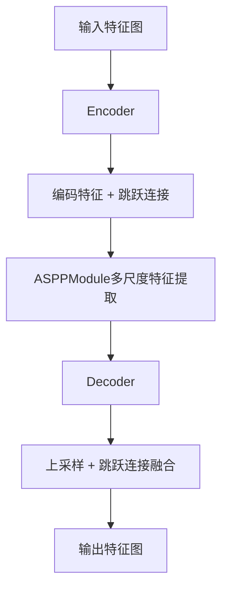
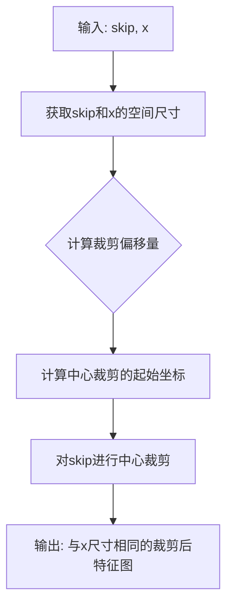
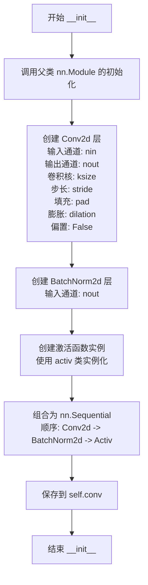
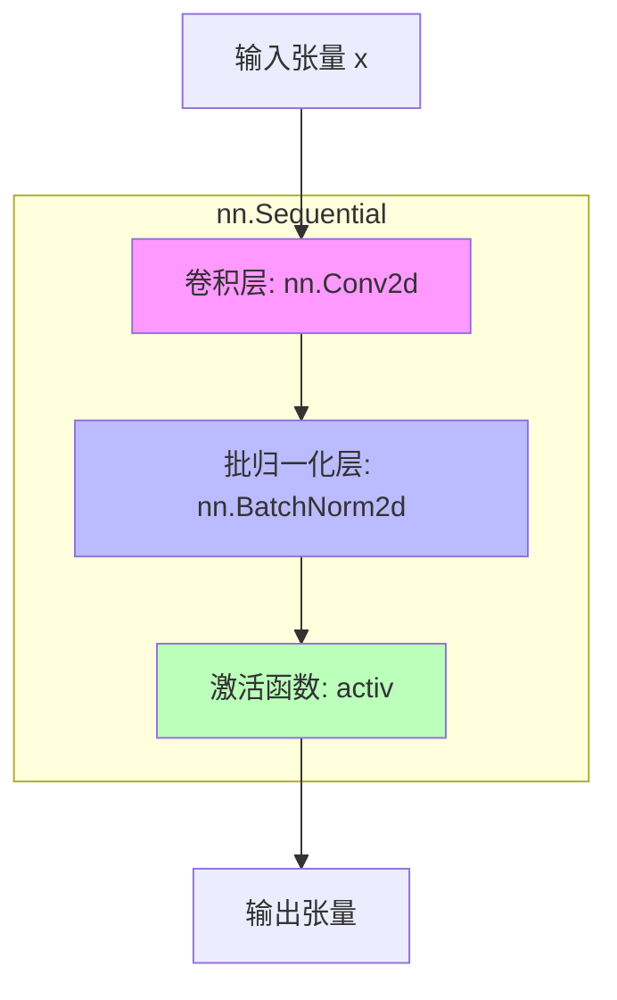
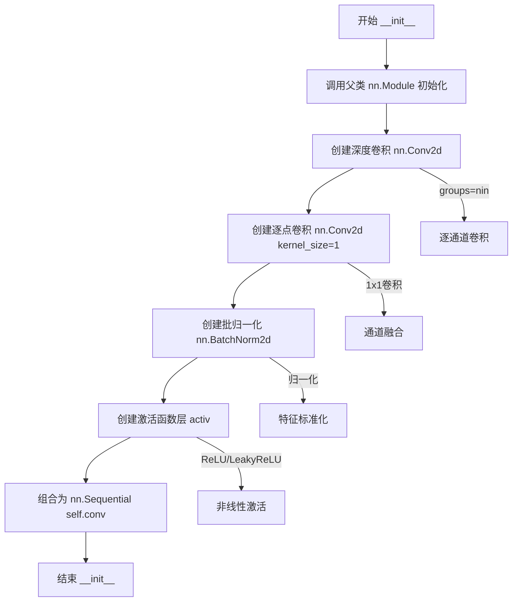
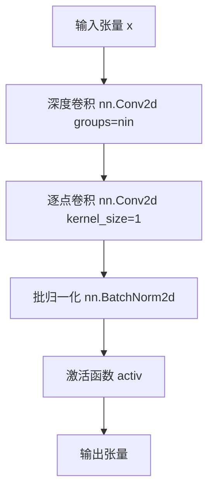
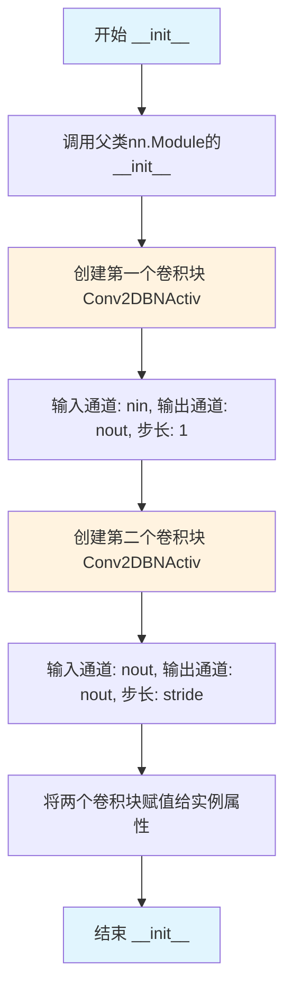
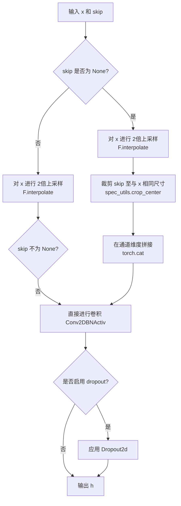
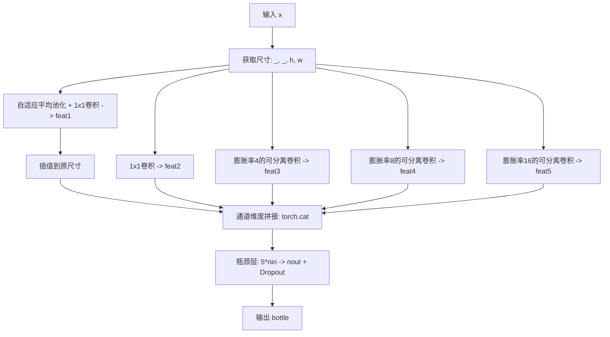

# `Chat-Haruhi-Suzumiya\yuki_builder\video_preprocessing\uvr5\uvr5_pack\lib_v5\layers_123812KB .py` 详细设计文档

这是一个PyTorch神经网络模块，实现了一个类似U-Net的音频/语音分离架构的编码器-解码器组件，包含标准卷积、深度可分离卷积、ASPP（空洞空间金字塔池化）等核心模块，用于特征提取和多尺度信息融合。

## 整体流程



## 类结构

```
Conv2DBNActiv (基础卷积块)
SeperableConv2DBNActiv (深度可分离卷积块)
Encoder (编码器)
Decoder (解码器)
ASPPModule (空洞空间金字塔池化)
```

## 全局变量及字段


### `spec_utils`
    
从.导入的模块，用于裁剪中心区域

类型：`module`
    


### `Conv2DBNActiv.conv`
    
卷积+BN+激活的组合

类型：`nn.Sequential`
    


### `SeperableConv2DBNActiv.conv`
    
深度可分离卷积+BN+激活的组合

类型：`nn.Sequential`
    


### `Encoder.conv1`
    
第一个卷积块

类型：`Conv2DBNActiv`
    


### `Encoder.conv2`
    
第二个卷积块

类型：`Conv2DBNActiv`
    


### `Decoder.conv`
    
解码卷积块

类型：`Conv2DBNActiv`
    


### `Decoder.dropout`
    
可选的Dropout层

类型：`nn.Dropout2d or None`
    


### `ASPPModule.conv1`
    
自适应池化分支

类型：`nn.Sequential`
    


### `ASPPModule.conv2`
    
1x1卷积分支

类型：`Conv2DBNActiv`
    


### `ASPPModule.conv3`
    
空洞率4的分支

类型：`SeperableConv2DBNActiv`
    


### `ASPPModule.conv4`
    
空洞率8的分支

类型：`SeperableConv2DBNActiv`
    


### `ASPPModule.conv5`
    
空洞率16的分支

类型：`SeperableConv2DBNActiv`
    


### `ASPPModule.bottleneck`
    
瓶颈层

类型：`nn.Sequential`
    
    

## 全局函数及方法


### `spec_utils.crop_center`

该函数用于在UNet类编码器-解码器结构中，将编码器的跳跃连接特征图（skip connection）裁剪至与解码器上采样后特征图相同的空间尺寸，以解决编码器下采样与解码器上采样带来的尺寸不匹配问题。

参数：

- `skip`：`torch.Tensor`，编码器侧的特征图（通常尺寸较大，需要被裁剪）
- `x`：`torch.Tensor`，解码器侧的目标特征图（经过上采样后的尺寸作为裁剪目标）

返回值：`torch.Tensor`，裁剪后的特征图，其空间尺寸与参数 `x` 一致

#### 流程图



#### 带注释源码

```
# 该函数定义在 spec_utils 模块中
# 功能：裁剪skip特征图至与x相同的空间尺寸

def crop_center(skip, x):
    # 获取skip特征图的尺寸信息
    # skip: [B, C, H_s, W_s] - 通常H_s >= H_x, W_s >= W_x
    _, _, h_skip, w_skip = skip.shape
    
    # 获取x特征图的尺寸信息  
    # x: [B, C, H_x, W_x]
    _, _, h_x, w_x = x.shape
    
    # 计算需要裁剪的偏移量
    # 中心对齐，所以偏移量为差值的一半
    offset_h = (h_skip - h_x) // 2
    offset_w = (w_skip - w_x) // 2
    
    # 使用切片操作进行中心裁剪
    # 从skip的中心区域裁剪出与x相同尺寸的特征图
    # 保留从offset_h开始、长度为h_x的区域
    return skip[:, :, offset_h:offset_h + h_x, offset_w:offset_w + w_x]
```

> **注**：由于 `crop_center` 函数的具体源码未在提供的代码片段中给出，上述源码为基于函数调用逻辑的推断实现。实际实现可能略有差异，但其核心逻辑是进行中心对齐的空间维度裁剪，确保编码器跳跃连接的特征图尺寸与解码器当前层特征图尺寸匹配，以便进行后续的通道维度拼接（`torch.cat([x, skip], dim=1)`）操作。


### `Conv2DBNActiv.__init__`

该方法用于初始化一个包含卷积层、批归一化层和激活函数的卷积块，是构建神经网络编码器和解码器的基础组件。

参数：

- `nin`：`int`，输入通道数，指定输入特征图的通道数
- `nout`：`int`，输出通道数，指定卷积输出特征图的通道数
- `ksize`：`int`，卷积核大小，默认值为3，表示卷积核的宽和高
- `stride`：`int`，卷积步长，默认值为1，控制卷积核滑动的步幅
- `pad`：`int`，填充大小，默认值为1，用于在输入特征图边缘填充零以保持尺寸
- `dilation`：`int`，膨胀率，默认值为1，控制卷积核内部采样点的间距
- `activ`：`nn.Module`，激活函数类型，默认值为`nn.ReLU`，指定卷积块末尾使用的激活函数类

返回值：`None`，该方法为初始化方法，不返回任何值

#### 流程图



#### 带注释源码

```python
def __init__(self, nin, nout, ksize=3, stride=1, pad=1, dilation=1, activ=nn.ReLU):
    """
    初始化卷积块，包含卷积、批归一化和激活函数
    
    参数:
        nin: 输入通道数
        nout: 输出通道数
        ksize: 卷积核大小
        stride: 卷积步长
        pad: 填充大小
        dilation: 膨胀率
        activ: 激活函数类（非实例）
    """
    # 调用父类 nn.Module 的初始化方法，完成 PyTorch 模块的基本初始化
    super(Conv2DBNActiv, self).__init__()
    
    # 构建卷积块：卷积层 -> 批归一化 -> 激活函数
    self.conv = nn.Sequential(
        # 2D 卷积层
        # nin: 输入通道数
        # nout: 输出通道数
        # kernel_size: 卷积核尺寸
        # stride: 滑动步长
        # padding: 边缘填充，保持特征图尺寸
        # dilation: 膨胀卷积参数
        # bias: 设为 False，因为后面有 BatchNorm 会进行归一化
        nn.Conv2d(
            nin,
            nout,
            kernel_size=ksize,
            stride=stride,
            padding=pad,
            dilation=dilation,
            bias=False,
        ),
        # 批归一化层，对特征图进行标准化，加速训练收敛
        nn.BatchNorm2d(nout),
        # 激活函数实例化（activ 是类而非实例，需要传入参数调用）
        activ(),
    )
```


### `Conv2DBNActiv.__call__`

该方法是 `Conv2DBNActiv` 类的前向传播函数，实现了一个基础的卷积块，包含卷积层、批归一化层和激活函数的顺序执行，用于对输入张量进行特征提取和变换。

参数：

- `x`：`torch.Tensor`，输入的 4D 张量，形状为 (batch_size, channels, height, width)

返回值：`torch.Tensor`，经过卷积、批归一化和激活函数处理后的输出张量，形状根据卷积参数而定

#### 流程图



#### 带注释源码

```python
def __call__(self, x):
    """
    前向传播函数，对输入应用卷积、批归一化和激活操作
    
    参数:
        x (torch.Tensor): 输入张量，形状为 (batch_size, nin, H, W)
    
    返回:
        torch.Tensor: 经过卷积块处理后的输出张量，形状为 (batch_size, nout, H', W')
    """
    # 调用 nn.Sequential 顺序执行卷积 -> 批归一化 -> 激活函数
    return self.conv(x)
    
    # 详细流程说明：
    # 1. nn.Conv2d: 二维卷积，从 nin 通道变换到 nout 通道
    #    - kernel_size=ksize, stride=stride, padding=pad, dilation=dilation
    #    - bias=False（因为后面有批归一化）
    # 2. nn.BatchNorm2d: 对卷积输出进行批归一化，加速训练和稳定模型
    # 3. activ(): 激活函数（默认 nn.ReLU），增加非线性表达能力
```


### `SeperableConv2DBNActiv.__init__`

初始化深度可分离卷积块，构造一个包含逐通道卷积、逐点卷积、批归一化和激活函数的顺序卷积模块，用于实现高效的深度可分离卷积操作。

参数：

- `nin`：`int`，输入通道数，指定输入特征图的通道维度
- `nout`：`int`，输出通道数，指定输出特征图的通道维度
- `ksize`：`int`，卷积核大小（默认为3），指定深度卷积的核尺寸
- `stride`：`int`，步长（默认为1），控制卷积滑动步幅
- `pad`：`int`，填充大小（默认为1），控制输入边缘的零填充数量
- `dilation`：`int`，膨胀率（默认为1），控制卷积核采样间距
- `activ`：`nn.Module`，激活函数类型（默认为nn.ReLU），用于构建激活层

返回值：`None`，该方法为初始化方法，不返回任何值

#### 流程图



#### 带注释源码

```
def __init__(self, nin, nout, ksize=3, stride=1, pad=1, dilation=1, activ=nn.ReLU):
    """
    初始化深度可分离卷积块
    
    参数:
        nin: 输入通道数
        nout: 输出通道数
        ksize: 卷积核大小，默认3
        stride: 步长，默认1
        pad: 填充，默认1
        dilation: 膨胀率，默认1
        activ: 激活函数类型，默认nn.ReLU
    """
    # 调用父类 nn.Module 的初始化方法
    super(SeperableConv2DBNActiv, self).__init__()
    
    # 构建顺序卷积模块，包含深度可分离卷积的完整流程
    self.conv = nn.Sequential(
        # 第一层：深度卷积 (Depthwise Convolution)
        # groups=nin 表示每个输入通道独立进行卷积，实现逐通道卷积
        nn.Conv2d(
            nin,                          # 输入通道数
            nin,                          # 输出通道数（与输入相同，因分组卷积）
            kernel_size=ksize,            # 卷积核大小
            stride=stride,                # 步长
            padding=pad,                  # 填充
            dilation=dilation,            # 膨胀率
            groups=nin,                   # 分组数=输入通道数，实现深度卷积
            bias=False,                   # 深度卷积不使用偏置
        ),
        
        # 第二层：逐点卷积 (Pointwise Convolution)
        # 1x1 卷积用于融合各通道特征
        nn.Conv2d(
            nin,                          # 输入通道数
            nout,                         # 输出通道数
            kernel_size=1,                # 1x1 卷积核
            bias=False,                   # 不使用偏置（由BatchNorm处理）
        ),
        
        # 第三层：批归一化
        # 对卷积输出进行标准化，加速训练收敛
        nn.BatchNorm2d(nout),
        
        # 第四层：激活函数
        # 注入非线性变换，由activ参数指定激活函数类型
        activ(),
    )
```

#### 关键组件说明

| 组件 | 类型 | 描述 |
|------|------|------|
| `self.conv` | `nn.Sequential` | 包含完整深度可分离卷积流程的顺序模块 |
| 深度卷积层 | `nn.Conv2d` | 使用 `groups=nin` 实现逐通道卷积 |
| 逐点卷积层 | `nn.Conv2d` | 1x1 卷积用于通道间特征融合 |
| 批归一化层 | `nn.BatchNorm2d` | 特征标准化，提升训练稳定性 |
| 激活层 | `nn.Module` | 非线性激活函数 |

#### 潜在技术债务与优化空间

1. **参数可配置性**：激活函数实例化方式（`activ()`）限制了传入参数配置的能力，可考虑使用 `functools.partial` 或工厂模式
2. **偏置处理**：虽然代码注释说明不使用偏置由 BatchNorm 处理，但在某些场景下可能需要显式偏置
3. **类型提示**：缺少类型注解，可添加 Python 类型提示提升代码可读性和 IDE 支持
4. **默认值优化**：`ksize=3, pad=1` 的组合是常用配置，但可根据实际场景提供更多预设组合


### `SeperableConv2DBNActiv.__call__`

这是可分离卷积块的前向传播方法，接收输入张量并依次通过深度卷积（groups=nin）、逐点卷积、批归一化和激活函数处理，输出特征张量。

参数：

- `x`：`torch.Tensor`，输入的4D张量，形状为 (batch_size, channels, height, width)

返回值：`torch.Tensor`，经过可分离卷积、批归一化和激活函数处理后的输出张量，形状为 (batch_size, nout, height, width)

#### 流程图



#### 带注释源码

```python
def __call__(self, x):
    """
    SeperableConv2DBNActiv 的前向传播方法
    
    该方法实现了可分离卷积块的前向传播，包括：
    1. 深度卷积（Depthwise Convolution）：对每个输入通道分别进行卷积
    2. 逐点卷积（Pointwise Convolution）：将深度卷积输出通道数映射到目标通道数
    3. 批归一化（Batch Normalization）：规范化特征分布
    4. 激活函数（Activation）：引入非线性变换
    
    参数:
        x: 输入张量，形状为 (batch_size, nin, height, width)
    
    返回:
        输出张量，形状为 (batch_size, nout, height, width)
    """
    return self.conv(x)
    # self.conv 是一个 nn.Sequential 模块，包含了：
    # 1. nn.Conv2d(nin, nin, kernel_size=ksize, stride=stride, padding=pad, 
    #              dilation=dilation, groups=nin, bias=False)  # 深度卷积
    # 2. nn.Conv2d(nin, nout, kernel_size=1, bias=False)       # 逐点卷积
    # 3. nn.BatchNorm2d(nout)                                  # 批归一化
    # 4. activ()                                                # 激活函数
```


### Encoder.__init__

初始化Encoder编码器模块，构建两个连续的卷积-BatchNorm-激活层，用于对输入特征进行下采样并保存跳跃连接特征。

参数：

- `self`：隐式参数，Encoder实例本身
- `nin`：`int`，输入特征图的通道数
- `nout`：`int`，输出特征图的通道数
- `ksize`：`int`，卷积核大小，默认为3
- `stride`：`int`，第二个卷积层的步长，默认为1
- `pad`：`int`，卷积填充大小，默认为1
- `activ`：`nn.Module`，激活函数类型，默认为`nn.LeakyReLU`

返回值：`None`，该方法为初始化方法，不返回任何值

#### 流程图



#### 带注释源码

```python
def __init__(self, nin, nout, ksize=3, stride=1, pad=1, activ=nn.LeakyReLU):
    """
    初始化Encoder编码器
    
    参数:
        nin: 输入通道数
        nout: 输出通道数
        ksize: 卷积核大小
        stride: 第二个卷积的步长（用于下采样）
        pad: 填充大小
        activ: 激活函数类型
    """
    # 调用父类nn.Module的初始化方法
    super(Encoder, self).__init__()
    
    # 第一个卷积块：不改变空间维度（stride=1）
    # 输入: (B, nin, H, W) -> 输出: (B, nout, H, W)
    self.conv1 = Conv2DBNActiv(nin, nout, ksize, 1, pad, activ=activ)
    
    # 第二个卷积块：可改变空间维度（stride=stride）
    # 输入: (B, nout, H, W) -> 输出: (B, nout, H/stride, W/stride)
    self.conv2 = Conv2DBNActiv(nout, nout, ksize, stride, pad, activ=activ)
```

#### 关键设计说明

| 设计要素 | 说明 |
|---------|------|
| **双层结构** | 采用两个连续的卷积块，第二个卷积块使用可配置的stride实现下采样 |
| **跳跃连接** | 在`__call__`方法中返回第一个卷积的输出作为skip特征，供Decoder使用 |
| **通道配置** | 第一个卷积扩展通道，第二个卷积保持通道数不变 |
| **默认激活** | 使用LeakyReLU，避免ReLU的"dying ReLU"问题 |


### `Encoder.__call__`

这是 Encoder 类的前向传播方法，接收输入张量并通过两个卷积块进行编码，返回编码后的特征和跳跃连接用于解码器。

参数：

- `x`：`torch.Tensor`，输入的张量，通常是前一层的输出或原始输入数据

返回值：`tuple[torch.Tensor, torch.Tensor]`

- `h`：`torch.Tensor`，经过两层卷积后的输出特征，用于后续解码
- `skip`：`torch.Tensor`，第一层卷积后的输出特征，用于跳跃连接

#### 流程图

```mermaid
flowchart TD
    A[输入 x] --> B[conv1: Conv2DBNActiv]
    B --> C[skip: 第一层卷积输出]
    C --> D[conv2: Conv2DBNActiv]
    D --> E[h: 第二层卷积输出]
    E --> F[返回 (h, skip)]
    C --> F
```

#### 带注释源码

```python
def __call__(self, x):
    """
    Encoder 的前向传播方法，执行卷积操作并返回编码特征与跳跃连接
    
    参数:
        x: 输入张量，形状为 [B, C, H, W]，其中 B 是批次大小，
           C 是通道数，H 和 W 分别是高度和宽度
    
    返回:
        tuple: (h, skip)
            - h: 经过两层卷积后的输出特征，用于后续解码器处理
            - skip: 第一层卷积的输出，用于跳跃连接（Skip Connection），
                    帮助解码器恢复空间细节
    """
    # 第一次卷积：提取初始特征，同时保存该输出作为跳跃连接
    # 输入 x -> conv1 -> skip
    skip = self.conv1(x)
    
    # 第二次卷积：在第一次特征的基础上进一步提取更深层的特征
    # skip -> conv2 -> h
    h = self.conv2(skip)
    
    # 返回编码后的特征 h 和跳跃连接 skip
    # h 用于传递给解码器进行上采样
    # skip 用于跳跃连接，帮助恢复空间信息
    return h, skip
```


### `Decoder.__init__`

该方法是Decoder类的构造函数，用于初始化解码器模块。它继承自nn.Module，创建卷积层和可选的dropout层，配置上采样和特征融合所需的参数。

参数：

- `nin`：`int`，输入特征图的通道数
- `nout`：`int`，输出特征图的通道数
- `ksize`：`int`，卷积核大小，默认为3
- `stride`：`int`，卷积步长，默认为1（实际未使用，固定为1）
- `pad`：`int`，卷积填充大小，默认为1
- `activ`：`nn.Module`，激活函数类型，默认为nn.ReLU
- `dropout`：`bool`，是否使用dropout层，默认为False

返回值：`None`，该方法为构造函数，不返回任何值

#### 流程图

```mermaid
flowchart TD
    A[开始 Decoder.__init__] --> B[调用 super().__init__ 初始化nn.Module]
    B --> C[创建Conv2DBNActiv卷积层]
    C --> D{检查dropout参数}
    D -->|dropout=True| E[创建nn.Dropout2d 0.1]
    D -->|dropout=False| F[设置self.dropout为None]
    E --> G[保存层到self.conv和self.dropout]
    F --> G
    G --> H[结束初始化]
```

#### 带注释源码

```python
def __init__(
    self, nin, nout, ksize=3, stride=1, pad=1, activ=nn.ReLU, dropout=False
):
    """
    初始化Decoder解码器模块
    
    参数:
        nin: int - 输入特征图的通道数
        nout: int - 输出特征图的通道数  
        ksize: int - 卷积核大小，默认3
        stride: int - 卷积步长，默认1（实际未使用）
        pad: int - 填充大小，默认1
        activ: nn.Module - 激活函数类型，默认nn.ReLU
        dropout: bool - 是否使用dropout，默认False
    """
    # 调用父类nn.Module的构造函数，完成基础初始化
    super(Decoder, self).__init__()
    
    # 创建卷积+BatchNorm+激活卷积层
    # 将输入通道nin转换为输出通道nout
    # 注意：虽然stride参数传入为1，但在Conv2DBNActiv中使用固定的stride值
    self.conv = Conv2DBNActiv(nin, nout, ksize, 1, pad, activ=activ)
    
    # 根据dropout参数决定是否创建dropout层
    # Dropout2d以0.1的概率随机丢弃特征图通道
    # 如果dropout为False，则不创建dropout层（设为None）
    self.dropout = nn.Dropout2d(0.1) if dropout else None
```


### Decoder.__call__

该方法是Decoder类的前向传播方法，负责执行上采样（2倍双线性插值）和跳跃连接融合操作。首先对输入特征图进行2倍上采样，若存在跳跃连接则将其裁剪至对应尺寸后与上采样结果在通道维度拼接，最后通过卷积块处理并可选应用Dropout。

参数：

- `self`：Decoder实例本身，隐式参数
- `x`：`torch.Tensor`，需要进行上采样的输入特征图，形状为 (B, C, H, W)
- `skip`：`torch.Tensor | None`，来自编码器的跳跃连接特征图，用于特征融合，若为 None 则跳过融合步骤

返回值：`torch.Tensor`，经过上采样、特征融合和卷积处理后的输出特征图，形状为 (B, nout, H*2, W*2)

#### 流程图



#### 带注释源码

```python
def __call__(self, x, skip=None):
    """
    Decoder 的前向传播方法，执行上采样和跳跃连接融合
    
    参数:
        x: 输入特征图，形状为 (B, C_in, H, W)
        skip: 来自编码器的跳跃连接特征，可选，形状为 (B, C_skip, H*2, W*2)
    
    返回:
        h: 输出特征图，形状为 (B, C_out, H*2, W*2)
    """
    # Step 1: 对输入特征图进行 2倍上采样，使用双线性插值
    x = F.interpolate(x, scale_factor=2, mode="bilinear", align_corners=True)
    
    # Step 2: 如果存在跳跃连接，则进行特征融合
    if skip is not None:
        # 将跳跃连接特征图裁剪至与上采样后特征图相同尺寸（中心裁剪）
        skip = spec_utils.crop_center(skip, x)
        # 在通道维度（dim=1）拼接特征图和跳跃连接
        x = torch.cat([x, skip], dim=1)
    
    # Step 3: 通过卷积块处理融合后的特征
    h = self.conv(x)
    
    # Step 4: 如果启用 dropout，则应用 Dropout2d
    if self.dropout is not None:
        h = self.dropout(h)
    
    return h
```


### ASPPModule.__init__

初始化ASPPModule（Atrous Spatial Pyramid Pooling）模块，用于多尺度特征提取和融合，通过不同膨胀率的卷积核捕获不同感受野的特征信息。

参数：

- `self`：隐式参数，ASPPModule实例本身
- `nin`：`int`，输入特征图的通道数
- `nout`：`int`，输出特征图的通道数
- `dilations`：`tuple`，膨胀率元组，默认为(4, 8, 16)，控制可分离卷积的感受野
- `activ`：`torch.nn.Module`，激活函数类型，默认为nn.ReLU

返回值：`None`，__init__方法不返回值，仅初始化模块结构

#### 流程图

```mermaid
flowchart TD
    A[开始初始化] --> B[调用父类nn.Module初始化]
    B --> C[创建conv1: AdaptiveAvgPool2d + Conv2DBNActiv]
    C --> D[创建conv2: 标准Conv2DBNActiv]
    D --> E[创建conv3: SeperableConv2DBNActiv with dilations[0]]
    E --> F[创建conv4: SeperableConv2DBNActiv with dilations[1]]
    F --> G[创建conv5: SeperableConv2DBNActiv with dilations[2]]
    G --> H[创建bottleneck: Conv2DBNActiv + Dropout2d]
    H --> I[结束初始化]
```

#### 带注释源码

```python
def __init__(self, nin, nout, dilations=(4, 8, 16), activ=nn.ReLU):
    """
    初始化ASPP模块
    
    参数:
        nin: int, 输入通道数
        nout: int, 输出通道数
        dilations: tuple, 膨胀率元组，用于控制可分离卷积的感受野
        activ: 激活函数类型，默认为nn.ReLU
    """
    # 调用父类nn.Module的初始化方法
    super(ASPPModule, self).__init__()
    
    # conv1: 全局平均池化分支
    # AdaptiveAvgPool2d将特征图池化到(1, None)即高度为1，宽度自适应
    # 然后通过1x1卷积进行通道压缩
    self.conv1 = nn.Sequential(
        nn.AdaptiveAvgPool2d((1, None)),  # 全局池化，获取全局上下文信息
        Conv2DBNActiv(nin, nin, 1, 1, 0, activ=activ),  # 1x1卷积保持通道数不变
    )
    
    # conv2: 标准1x1卷积分支
    # 用于捕获局部特征，不进行下采样
    self.conv2 = Conv2DBNActiv(nin, nin, 1, 1, 0, activ=activ)
    
    # conv3: 膨胀率为dilations[0]的可分离卷积
    # 使用可分离卷积减少参数量，膨胀率控制感受野
    self.conv3 = SeperableConv2DBNActiv(
        nin, nin, 3, 1, dilations[0], dilations[0], activ=activ
    )
    
    # conv4: 膨胀率为dilations[1]的可分离卷积
    # 更大的膨胀率捕获更大的感受野
    self.conv4 = SeperableConv2DBNActiv(
        nin, nin, 3, 1, dilations[1], dilations[1], activ=activ
    )
    
    # conv5: 膨胀率为dilations[2]的可分离卷积
    # 最大的膨胀率捕获最大范围的上下文信息
    self.conv5 = SeperableConv2DBNActiv(
        nin, nin, 3, 1, dilations[2], dilations[2], activ=activ
    )
    
    # bottleneck: 瓶颈层
    # 将5个分支的输出在通道维度拼接: nin * 5
    # 然后通过1x1卷积将通道数压缩到nout
    # 最后添加Dropout2d防止过拟合
    self.bottleneck = nn.Sequential(
        Conv2DBNActiv(nin * 5, nout, 1, 1, 0, activ=activ),  # 通道压缩
        nn.Dropout2d(0.1)  # Dropout正则化
    )
```


### ASPPModule.forward

该方法实现了多尺度特征融合，通过使用自适应池化、1x1卷积和带有不同膨胀率的可分离卷积提取多尺度信息，并经过瓶颈层输出融合后的特征。

参数：
- `x`：`torch.Tensor`，输入特征图，形状为 (batch_size, channels, height, width)

返回值：`torch.Tensor`，经过多尺度特征融合和瓶颈层处理后的输出特征图，形状为 (batch_size, nout, height, width)

#### 流程图



#### 带注释源码

```python
def forward(self, x):
    """
    ASPP模块的前向传播，执行多尺度特征融合
    
    参数:
        x: 输入特征图，形状为 (batch_size, channels, height, width)
    
    返回:
        经过多尺度特征融合后的特征图，形状为 (batch_size, nout, height, width)
    """
    # 获取输入特征图的尺寸信息
    _, _, h, w = x.size()
    
    # 分支1: 自适应平均池化分支
    # 将空间维度池化到 (1, None)，然后通过1x1卷积，最后插值回原尺寸
    # 这可以捕获全局上下文信息
    feat1 = F.interpolate(
        self.conv1(x), size=(h, w), mode="bilinear", align_corners=True
    )
    
    # 分支2: 1x1卷积分支
    # 保持分辨率不变，进行通道变换
    feat2 = self.conv2(x)
    
    # 分支3: 膨胀率为4的可分离卷积分支
    # 较大的感受野，捕获中等尺度的特征
    feat3 = self.conv3(x)
    
    # 分支4: 膨胀率为8的可分离卷积分支
    # 更大的感受野，捕获更大尺度的特征
    feat4 = self.conv4(x)
    
    # 分支5: 膨胀率为16的可分离卷积分支
    # 最大的感受野，捕获最大尺度的特征
    feat5 = self.conv5(x)
    
    # 在通道维度(dim=1)拼接所有分支的特征
    out = torch.cat((feat1, feat2, feat3, feat4, feat5), dim=1)
    
    # 通过瓶颈层: 将5倍的通道数压缩到目标输出通道数nout
    # 并应用Dropout防止过拟合
    bottle = self.bottleneck(out)
    
    return bottle
```

## 关键组件


### Conv2DBNActiv

卷积+批归一化+激活函数的组合模块，提供标准卷积块的封装

### SeperableConv2DBNActiv

深度可分离卷积块，先进行逐通道卷积再逐点卷积，减少参数量和计算量

### Encoder

编码器模块，包含两个连续的卷积块，用于提取特征并生成跳跃连接

### Decoder

解码器模块，支持上采样和跳跃连接，用于从编码特征恢复空间分辨率

### ASPPModule

空洞空间金字塔池化模块，通过多尺度空洞卷积捕获不同感受野的特征

### spec_utils.crop_center

裁剪中心区域的工具函数，用于对齐跳跃连接的尺寸


## 问题及建议


### 已知问题

-   **拼写错误**: 类名 `SeperableConv2DBNActiv` 中的 "Seperable" 应为 "Separable"（可分离的），这是明显的拼写错误，会影响代码可读性和搜索效率。
-   **硬编码值**: 多处使用硬编码值，如 `Decoder` 中的 dropout 概率 0.1、`ASPPModule` 中的 dropout 概率 0.1、上采样的 `scale_factor=2`，缺乏灵活的配置能力。
-   **接口不一致**: 部分模块使用 `__call__` 方法（如 `Conv2DBNActiv`、`SeperableConv2DBNActiv`、`Encoder`、`Decoder`），而 `ASPPModule` 使用标准的 `forward` 方法，造成接口不统一。
-   **激活函数传参方式不标准**: 传递 `nn.ReLU` 类而非实例（如 `activ=nn.ReLU`），这虽然可行但不是最佳实践，可能导致无法传递参数（如 inplace 属性）。
-   **缺乏残差连接**: `Encoder` 模块没有实现残差（residual）连接，这在深层网络中可能导致梯度消失问题。
-   **维度处理可能丢失信息**: `Decoder` 中使用 `crop_center` 裁剪 skip 连接来匹配上采样后的尺寸，可能导致边界信息丢失。
-   **ASPP模块池化尺寸处理**: `AdaptiveAvgPool2d((1, None))` 使用 `None` 而非确定的值，可能在某些输入尺寸下产生意外行为。

### 优化建议

-   **修复拼写错误**: 将 `SeperableConv2DBNActiv` 重命名为 `SeparableConv2DBNActiv`。
-   **统一接口规范**: 所有模块统一使用 `forward` 方法而非 `__call__`，遵循 PyTorch 的标准约定。
-   **参数化配置**: 将硬编码的超参数（如 dropout 概率、上采样因子）改为构造函数的可选参数，提供默认值以保持向后兼容。
-   **改进激活函数传参**: 改为传递激活函数实例（如 `activ=nn.ReLU()`）或允许传递可调用对象和参数字典。
-   **考虑残差连接**: 在 `Encoder` 中添加可选的残差连接，特别是在通道数不变的情况下。
-   **改进维度处理**: 考虑使用 padding 或其他方式保留边界信息，或者在文档中明确说明 crop_center 的行为和可能的边界裁剪。
-   **明确池化参数**: 将 `AdaptiveAvgPool2d` 的参数明确化，避免使用 `None` 带来的不确定性。
-   **添加类型注解**: 为类和方法添加类型注解，提高代码的可维护性和 IDE 支持。

## 其它


### 设计目标与约束

本模块旨在构建一个用于图像分割任务的卷积神经网络基础组件库，包含编码器-解码器结构、ASPP模块等核心组件。设计约束包括：使用PyTorch框架、依赖torch.nn和torch.nn.functional、保持与spec_utils模块的耦合（crop_center函数）。

### 错误处理与异常设计

主要异常场景包括：1) 输入张量维度不匹配时，torch操作可能抛出RuntimeError；2) 当skip张量与上采样后的x维度不一致时，crop_center函数应确保裁剪正确；3) 激活函数传入无效类（如非nn.Module子类）时可能导致初始化错误。建议在Decoder的__call__方法中添加skip与x的尺寸校验。

### 数据流与状态机

数据流遵循Encoder-Decoder架构：输入数据首先经过Encoder的conv1和conv2两层卷积，输出隐藏状态h和跳跃连接skip；Decoder接收编码器输出h和跳跃连接skip，通过F.interpolate进行2倍上采样，与skip拼接后经conv卷积，最后可选应用dropout。ASPP模块采用并行多分支结构，5个不同感受野的分支输出在通道维度拼接后经bottleneck压缩。

### 外部依赖与接口契约

本模块依赖：1) torch主库；2) torch.nn及torch.nn.functional；3) 同级目录spec_utils模块的crop_center函数。外部调用方需确保：nin、nout为正整数；ksize、stride、pad、dilation为正整数；activ传入nn.Module子类（如nn.ReLU、nn.LeakyReLU）。Decoder的forward方法接受x为4D张量(B,C,H,W)，skip可选为相同batch和channel维度的4D张量。

### 性能考虑与优化空间

潜在优化方向：1) SeperableConv2DBNActiv中groups=nin的实现对通道数较少层可能效率不高；2) Decoder中每次forward都执行F.interpolate，可考虑缓存；3) ASPPModule的5个分支可并行计算但当前为顺序执行；4) 可添加torch.jit.script支持以提升推理性能；5) BatchNorm2d在推理时可融合到卷积中减少计算量。

### 配置与超参数

关键超参数包括：Encoder默认ksize=3, stride=1；Decoder支持dropout=False默认，dropout_rate=0.1固定；ASPPModule dilations默认(4,8,16)，dropout_rate=0.1。这些超参数可通过构造函数覆盖，但默认值基于典型图像分割任务设置。

### 版本历史与变更记录

当前版本v1.0：初始实现包含Conv2DBNActiv、SeperableConv2DBNActiv、Encoder、Decoder、ASPPModule五个核心类。后续可考虑：添加更多激活函数支持、引入注意力机制、支持动态输入分辨率。

### 单元测试建议

建议覆盖：1) Conv2DBNActiv输出维度正确性；2) SeperableConv2DBNActiv分组卷积行为；3) Encoder返回h和skip的形状一致性；4) Decoder上采样和拼接维度匹配；5) ASPPModule多分支输出通道数为nout*5；6) 梯度流动性和可训练参数检查。

### 部署与导出说明

模型可通过torch.save保存完整状态字典，或使用torch.jit.trace生成推理优化版本。Decoder的crop_center依赖spec_utils模块，部署时需确保该模块可用或在Decoder中内联实现。输入张量建议格式为NCHW，batch维度可动态。

    