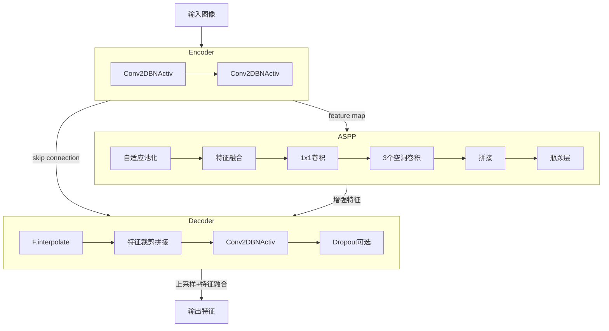
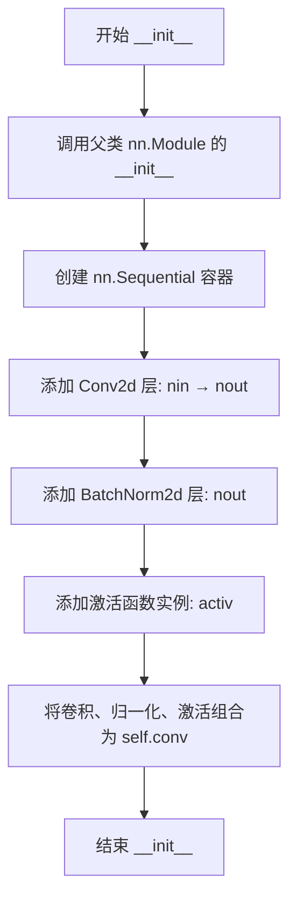
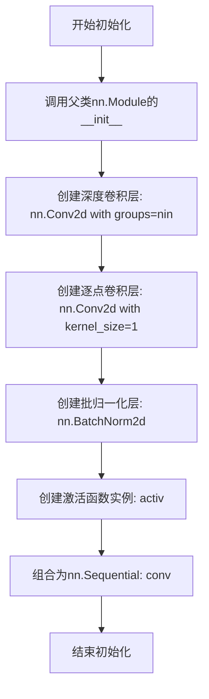
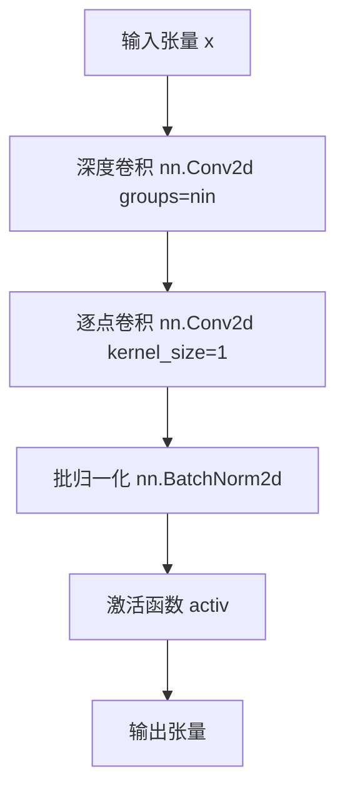
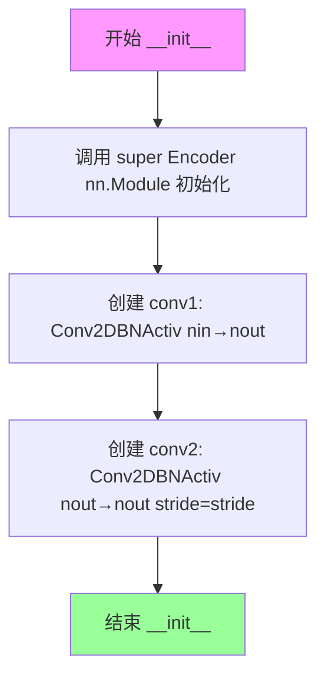
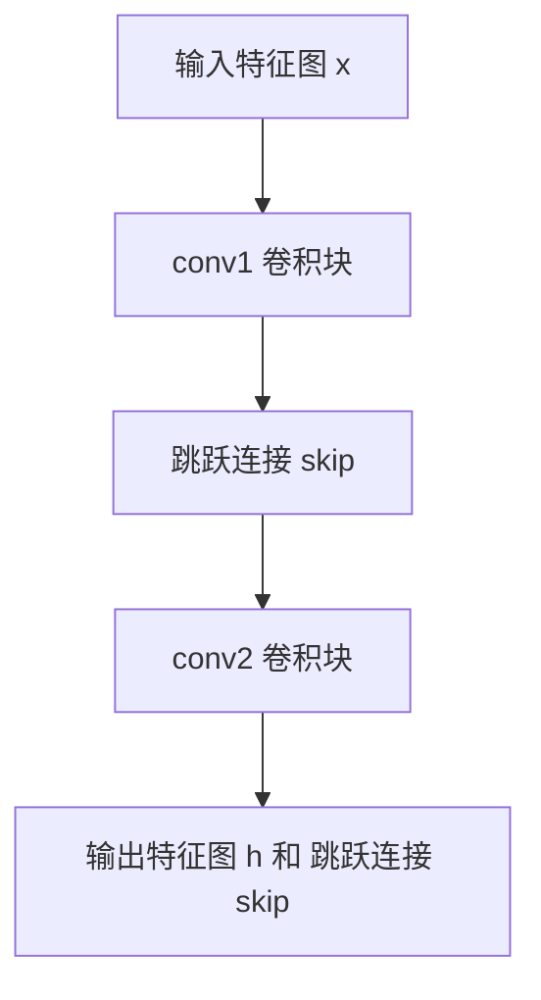
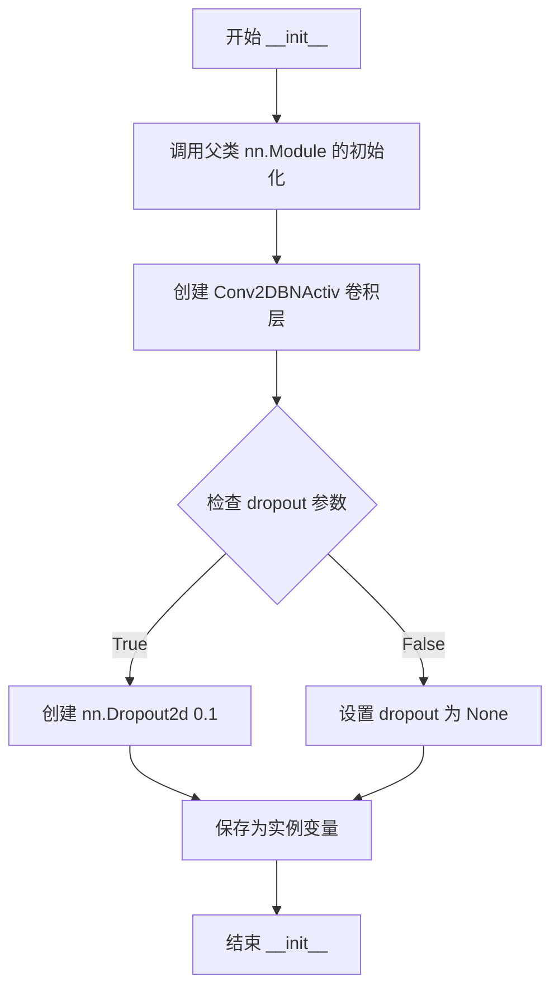

# `Chat-Haruhi-Suzumiya\yuki_builder\video_preprocessing\uvr5\uvr5_pack\lib_v5\layers_123821KB.py` 详细设计文档

这是一个PyTorch神经网络组件库，提供了用于图像分割任务的卷积模块，包括标准卷积+BN+激活、可分离卷积、编码器、解码器和ASPP（多尺度空洞卷积）模块，构成典型的UNet风格编码器-解码器架构。

## 整体流程



## 类结构

```
Conv2DBNActiv (卷积+BN+激活基类)
SeperableConv2DBNActiv (可分离卷积+BN+激活)
Encoder (编码器模块)
Decoder (解码器模块)
ASPPModule (空洞空间金字塔池化模块)
```

## 全局变量及字段


### `torch`
    
PyTorch主库，提供张量运算和神经网络基础功能

类型：`torch库`
    


### `nn`
    
PyTorch神经网络模块，包含层定义和容器

类型：`torch.nn模块`
    


### `F`
    
PyTorch功能性神经网络操作，提供激活函数、池化等函数接口

类型：`torch.nn.functional模块`
    


### `spec_utils`
    
从当前包导入的规格工具模块，提供辅助函数如crop_center

类型：`自定义规格工具模块`
    


### `Conv2DBNActiv.conv`
    
卷积、归一化、激活函数序列

类型：`nn.Sequential`
    


### `SeperableConv2DBNActiv.conv`
    
可分离卷积、逐点卷积、归一化、激活序列

类型：`nn.Sequential`
    


### `Encoder.conv1`
    
第一个卷积块

类型：`Conv2DBNActiv`
    


### `Encoder.conv2`
    
第二个卷积块

类型：`Conv2DBNActiv`
    


### `Decoder.conv`
    
解码卷积块

类型：`Conv2DBNActiv`
    


### `Decoder.dropout`
    
可选Dropout层

类型：`nn.Dropout2d或None`
    


### `ASPPModule.conv1`
    
自适应池化分支

类型：`nn.Sequential`
    


### `ASPPModule.conv2`
    
1x1卷积分支

类型：`Conv2DBNActiv`
    


### `ASPPModule.conv3`
    
第一个空洞卷积分支

类型：`SeperableConv2DBNActiv`
    


### `ASPPModule.conv4`
    
第二个空洞卷积分支

类型：`SeperableConv2DBNActiv`
    


### `ASPPModule.conv5`
    
第三个空洞卷积分支

类型：`SeperableConv2DBNActiv`
    


### `ASPPModule.bottleneck`
    
瓶颈层（特征压缩+Dropout）

类型：`nn.Sequential`
    
    

## 全局函数及方法


### Conv2DBNActiv.__init__

初始化一个包含卷积、批归一化和激活函数的卷积块，用于构建卷积神经网络的基础卷积单元。

参数：

- `self`：隐式参数，PyTorch模型实例本身
- `nin`：`int`，输入通道数（number of input channels）
- `nout`：`int`，输出通道数（number of output channels）
- `ksize`：`int`，卷积核大小，默认为3
- `stride`：`int`，卷积步长，默认为1
- `pad`：`int`，填充大小，默认为1
- `dilation`：`int`，膨胀系数，默认为1
- `activ`：`nn.Module`，激活函数类型，默认为`nn.ReLU`

返回值：`None`，无返回值（`__init__`方法）

#### 流程图



#### 带注释源码

```python
def __init__(self, nin, nout, ksize=3, stride=1, pad=1, dilation=1, activ=nn.ReLU):
    """
    初始化卷积块，包含卷积层、批归一化层和激活函数
    
    参数:
        nin: 输入通道数
        nout: 输出通道数
        ksize: 卷积核大小
        stride: 步长
        pad: 填充大小
        dilation: 膨胀系数（用于膨胀卷积）
        activ: 激活函数类（默认ReLU）
    """
    # 调用父类nn.Module的初始化方法
    super(Conv2DBNActiv, self).__init__()
    
    # 构建顺序卷积块: Conv2d -> BatchNorm2d -> Activ
    self.conv = nn.Sequential(
        # 二维卷积层
        nn.Conv2d(
            nin,                # 输入通道数
            nout,               # 输出通道数
            kernel_size=ksize,  # 卷积核大小
            stride=stride,      # 步长
            padding=pad,        # 填充
            dilation=dilation, # 膨胀系数
            bias=False,         # 不使用偏置（因为后面有BatchNorm）
        ),
        # 批归一化层，对特征进行归一化加速训练
        nn.BatchNorm2d(nout),
        # 激活函数实例（调用类创建实例）
        activ(),
    )
```


### `Conv2DBNActiv.__call__`

该方法是 Conv2DBNActiv 类的前向传播接口，通过调用内部组合的卷积、批归一化和激活函数层，对输入特征图进行卷积、归一化和非线性激活处理，并返回处理后的特征图。

参数：

- `x`：`torch.Tensor`，输入的 4 维张量，形状为 (batch_size, channels, height, width)，代表待处理的特征图

返回值：`torch.Tensor`，经过卷积、批归一化和激活函数处理后的输出特征图，形状根据卷积参数变化

#### 流程图


#### 带注释源码

```python
def __call__(self, x):
    """
    前向传播方法，执行卷积、批归一化和激活操作
    
    参数:
        x: 输入张量，形状为 (batch, cin, h, w)
    
    返回:
        经过 conv -> BN -> activ 处理后的张量
    """
    # 调用内部组合的卷积模块（包含 Conv2d、BatchNorm2d 和激活函数）
    return self.conv(x)
```


### `SeperableConv2DBNActiv.__init__`

该函数用于初始化一个可分离卷积块（Seperable Convolution），实现了深度可分离卷积（Depthwise Separable Convolution），包含深度卷积、逐点卷积、批归一化和激活函数的串联结构。

参数：

- `self`：隐式参数，类实例自身
- `nin`：`int`，输入通道数（number of input channels）
- `nout`：`int`，输出通道数（number of output channels）
- `ksize`：`int`，卷积核大小，默认为 3
- `stride`：`int`，卷积步长，默认为 1
- `pad`：`int`，填充大小，默认为 1
- `dilation`：`int`，膨胀系数，默认为 1
- `activ`：`nn.Module`，激活函数类型，默认为 `nn.ReLU`

返回值：`None`，该方法仅进行初始化操作，不返回任何值

#### 流程图



#### 带注释源码

```python
def __init__(self, nin, nout, ksize=3, stride=1, pad=1, dilation=1, activ=nn.ReLU):
    """
    初始化可分离卷积块
    
    参数:
        nin: 输入通道数
        nout: 输出通道数
        ksize: 卷积核大小
        stride: 卷积步长
        pad: 填充大小
        dilation: 膨胀系数
        activ: 激活函数类（如 nn.ReLU, nn.LeakyReLU）
    """
    # 调用父类 nn.Module 的初始化方法
    super(SeperableConv2DBNActiv, self).__init__()
    
    # 构建可分离卷积模块序列
    self.conv = nn.Sequential(
        # 深度卷积（Depthwise Convolution）
        # groups=nin 表示每个输入通道单独进行卷积，实现通道分离
        nn.Conv2d(
            nin,              # 输入通道数
            nin,              # 输出通道数（与输入相同，因采用分组卷积）
            kernel_size=ksize,
            stride=stride,
            padding=pad,
            dilation=dilation,
            groups=nin,       # 关键参数：启用深度卷积
            bias=False,       # 深度卷积不需要偏置
        ),
        # 逐点卷积（Pointwise Convolution）
        # 1x1 卷积，用于整合通道信息
        nn.Conv2d(nin, nout, kernel_size=1, bias=False),
        # 批归一化层，用于稳定训练和加速收敛
        nn.BatchNorm2d(nout),
        # 激活函数层
        activ(),
    )
```


### `SeperableConv2DBNActiv.__call__`

该方法是可分离卷积块的前向传播接口，接收输入特征张量并依次经过深度卷积（Depthwise Convolution）、逐点卷积（Pointwise Convolution）、批归一化和激活函数处理，输出变换后的特征张量。

参数：

- `x`：`torch.Tensor`，输入的四维张量，形状为 (batch_size, channels, height, width)

返回值：`torch.Tensor`，返回经过可分离卷积、批归一化及激活函数处理后的输出张量，形状为 (batch_size, nout, height, width)

#### 流程图



#### 带注释源码

```python
def __call__(self, x):
    """
    前向传播调用接口
    
    参数:
        x: 输入张量，形状为 (batch_size, nin, height, width)
    
    返回:
        经过可分离卷积、批归一化和激活函数处理后的张量，
        形状为 (batch_size, nout, height, width)
    """
    # 将输入传递给预定义的 nn.Sequential 容器
    # 顺序执行: 深度卷积 -> 逐点卷积 -> BatchNorm -> 激活函数
    return self.conv(x)
```


### `Encoder.__init__`

初始化编码器（Encoder）实例，设置输入输出通道数、卷积参数和激活函数，并构建由两个卷积块组成的编码器主体结构。

参数：

- `nin`：`int`，输入特征图的通道数
- `nout`：`int`，输出特征图的通道数
- `ksize`：`int`，卷积核大小，默认为 3
- `stride`：`int`，第二个卷积块的步长，默认为 1
- `pad`：`int`，卷积填充大小，默认为 1
- `activ`：`nn.LeakyReLU`，激活函数类型，默认为 nn.LeakyReLU

返回值：`None`，该方法为初始化方法，不返回任何值

#### 流程图



#### 带注释源码

```python
class Encoder(nn.Module):
    def __init__(self, nin, nout, ksize=3, stride=1, pad=1, activ=nn.LeakyReLU):
        """
        初始化编码器
        
        参数:
            nin: 输入通道数
            nout: 输出通道数
            ksize: 卷积核大小，默认3
            stride: 步长，默认1（仅用于第二个卷积块）
            pad: 填充大小，默认1
            activ: 激活函数类型，默认nn.LeakyReLU
        """
        # 调用父类 nn.Module 的初始化方法，完成 PyTorch 模块的基本初始化
        super(Encoder, self).__init__()
        
        # 第一个卷积块：将 nin 通道输入转换为 nout 通道输出
        # 使用步长1，保持空间分辨率，主要用于特征提取
        self.conv1 = Conv2DBNActiv(nin, nout, ksize, 1, pad, activ=activ)
        
        # 第二个卷积块：将 nout 通道映射到 nout 通道
        # 使用传入的 stride 参数，可能进行下采样
        # 同时保存第一个卷积块的输出作为跳跃连接（skip connection）
        self.conv2 = Conv2DBNActiv(nout, nout, ksize, stride, pad, activ=activ)
```


### `Encoder.__call__`

该方法是Encoder类的前向传播函数，接收输入特征图并依次通过两个卷积块（Conv2DBNActiv），输出经过下采样处理的特征图和用于跳跃连接的原始特征图，主要用于U-Net类编码器结构中提取多尺度特征。

参数：

- `x`：`torch.Tensor`，输入特征图，形状为 (batch_size, nin, H, W)
- `self`：Encoder 类实例本身，包含两个卷积块 conv1 和 conv2

返回值：`Tuple[torch.Tensor, torch.Tensor]`

- `h`：`torch.Tensor`，经过两次卷积处理后的输出特征图，形状为 (batch_size, nout, H', W')，其中 H' 和 W' 根据 stride 参数进行下采样
- `skip`：`torch.Tensor`，第一次卷积后的特征图，作为跳跃连接传递到解码器，形状为 (batch_size, nout, H, W)

#### 流程图



#### 带注释源码

```python
def __call__(self, x):
    """
    Encoder 前向传播
    
    参数:
        x: 输入特征图，形状为 (batch_size, nin, H, W)
    
    返回:
        h: 经过两次卷积的特征图，用于下一层或解码器
        skip: 第一次卷积后的特征图，用于跳跃连接
    """
    # 第一次卷积：不改变尺寸，提取初步特征
    # 输入: (batch_size, nin, H, W)
    # 输出: (batch_size, nout, H, W)
    skip = self.conv1(x)
    
    # 第二次卷积：可能进行下采样（stride > 1），提取更深层次特征
    # 输入: (batch_size, nout, H, W)
    # 输出: (batch_size, nout, H//stride, W//stride)
    h = self.conv2(skip)
    
    # 返回处理后的特征图和跳跃连接
    return h, skip
```


### `Decoder.__init__`

初始化解码器模块，设置卷积层和可选的Dropout层，用于上采样特征图并与编码器特征融合。

参数：

- `nin`：`int`，输入特征图的通道数
- `nout`：`int`，输出特征图的通道数
- `ksize`：`int`，卷积核大小（默认值为 3）
- `stride`：`int`，卷积步长（默认值为 1）
- `pad`：`int`，卷积填充大小（默认值为 1）
- `activ`：`nn.Module`，激活函数类型（默认值为 `nn.ReLU`）
- `dropout`：`bool`，是否启用 Dropout 正则化（默认值为 `False`）

返回值：`None`，该方法为初始化方法，不返回任何值

#### 流程图



#### 带注释源码

```python
def __init__(
    self, nin, nout, ksize=3, stride=1, pad=1, activ=nn.ReLU, dropout=False
):
    """
    初始化 Decoder 解码器模块
    
    参数:
        nin: 输入通道数
        nout: 输出通道数
        ksize: 卷积核大小，默认3
        stride: 步长，默认1（Decoder中固定为1，因为上采样由F.interpolate处理）
        pad: 填充，默认1
        activ: 激活函数类，默认nn.ReLU
        dropout: 是否启用dropout，默认False
    """
    # 调用父类 nn.Module 的初始化方法，注册所有子模块
    super(Decoder, self).__init__()
    
    # 创建卷积-BatchNorm-激活层组合
    # 输入通道nin，输出通道nout，步长固定为1
    self.conv = Conv2DBNActiv(nin, nout, ksize, 1, pad, activ=activ)
    
    # 根据dropout参数决定是否创建Dropout层
    # 如果启用，创建概率为0.1的Dropout2d层
    # 如果禁用，设置为None以节省计算资源
    self.dropout = nn.Dropout2d(0.1) if dropout else None
```


### `Decoder.__call__`

执行上采样、特征融合和解码操作，将输入特征图进行双线性插值上采样（2倍），若存在跳跃连接则先裁剪并拼接，然后通过卷积块输出解码后的特征图。

参数：

- `self`：Decoder 实例本身（隐式参数）
- `x`：`torch.Tensor`，输入的特征图，通常来自上一层的输出
- `skip`：`torch.Tensor | None`，可选的跳跃连接特征图，来自编码器对应层的输出，用于特征融合，默认为 None

返回值：`torch.Tensor`，经过上采样、特征融合和卷积处理后的解码特征图

#### 流程图

```mermaid
graph TD
    A[输入 x] --> B[上采样: F.interpolate]
    B --> C{skip 是否存在?}
    C -->|是| D[裁剪 skip: spec_utils.crop_center]
    C -->|否| F[卷积: self.conv]
    D --> E[拼接: torch.cat [x, skip]]
    E --> F
    F --> G{dropout 是否启用?}
    G -->|是| H[应用 Dropout]
    G -->|否| I[输出 h]
    H --> I
```

#### 带注释源码

```python
def __call__(self, x, skip=None):
    """
    Decoder 前向传播：上采样 + 特征融合 + 解码

    参数:
        x: 输入特征图 (Tensor)
        skip: 跳跃连接特征图，可选 (Tensor or None)

    返回:
        解码后的特征图 (Tensor)
    """
    # 1. 上采样：双线性插值将特征图放大 2 倍
    x = F.interpolate(x, scale_factor=2, mode="bilinear", align_corners=True)

    # 2. 特征融合：若存在跳跃连接
    if skip is not None:
        # 裁剪 skip 以匹配 x 的尺寸（处理尺寸不匹配情况）
        skip = spec_utils.crop_center(skip, x)
        # 在通道维度(dim=1)拼接特征图
        x = torch.cat([x, skip], dim=1)

    # 3. 卷积处理：调整通道数和进一步特征提取
    h = self.conv(x)

    # 4. 可选 Dropout 正则化
    if self.dropout is not None:
        h = self.dropout(h)

    return h
```


### `ASPPModule.__init__`

初始化ASPPModule类，构建Atrous Spatial Pyramid Pooling（ASPP）模块，该模块通过多尺度膨胀卷积和全局池化路径来捕获不同尺度的特征信息，增强模型对多尺度目标的感知能力。

参数：

- `self`：`nn.Module`，PyTorch模块实例本身，作为类方法的首个隐式参数
- `nin`：`int`，输入特征图的通道数
- `nout`：`int`，输出特征图的通道数
- `dilations`：`tuple`，膨胀卷积的膨胀率元组，默认为(4, 8, 16)，用于控制卷积核的感受野
- `activ`：`nn.Module`，激活函数类型，默认为nn.ReLU，用于引入非线性

返回值：`None`，__init__方法不返回值，仅完成对象的初始化

#### 流程图

```mermaid
graph TD
    A[开始 __init__] --> B[调用 super().__init__ 初始化基类]
    B --> C[创建 conv1: AdaptiveAvgPool2d + Conv2DBNActiv]
    C --> D[创建 conv2: 标准 Conv2DBNActiv]
    D --> E[创建 conv3: SeperableConv2DBNActiv with dilation[0]]
    E --> F[创建 conv4: SeperableConv2DBNActiv with dilation[1]]
    F --> G[创建 conv5: SeperableConv2DBNActiv with dilation[2]]
    G --> H[创建 bottleneck: 5*nin → nout 通道压缩 + Dropout]
    H --> I[结束 __init__]
```

#### 带注释源码

```python
def __init__(self, nin, nout, dilations=(4, 8, 16), activ=nn.ReLU):
    """
    初始化ASPP模块
    
    参数:
        nin: int, 输入通道数
        nout: int, 输出通道数  
        dilations: tuple, 膨胀卷积的膨胀率，默认为(4, 8, 16)
        activ: nn.Module, 激活函数类型，默认为nn.ReLU
    """
    # 调用nn.Module基类的初始化方法，建立PyTorch模块的内部结构
    super(ASPPModule, self).__init__()
    
    # ===== 多尺度路径1: 全局平均池化路径 =====
    # AdaptiveAvgPool2d((1, None)) 将特征图在高度维度压缩为1
    # 保持宽度维度不变，实现全局上下文信息的捕获
    # 后续通过1x1卷积将通道数恢复到nin
    self.conv1 = nn.Sequential(
        nn.AdaptiveAvgPool2d((1, None)),  # 自适应池化，获取全局信息
        Conv2DBNActiv(nin, nin, 1, 1, 0, activ=activ),  # 1x1卷积恢复通道维度
    )
    
    # ===== 多尺度路径2: 1x1卷积路径 =====
    # 保留原始分辨率的特征，提供基线特征表示
    self.conv2 = Conv2DBNActiv(nin, nin, 1, 1, 0, activ=activ)
    
    # ===== 多尺度路径3-5: 膨胀卷积路径 =====
    # 使用不同膨胀率的3x3可分离卷积捕获多尺度上下文
    # 可分离卷积相比标准卷积具有更少的参数量和计算成本
    self.conv3 = SeperableConv2DBNActiv(
        nin, nin, 3, 1, dilations[0], dilations[0], activ=activ
    )
    self.conv4 = SeperableConv2DBNActiv(
        nin, nin, 3, 1, dilations[1], dilations[1], activ=activ
    )
    self.conv5 = SeperableConv2DBNActiv(
        nin, nin, 3, 1, dilations[2], dilations[2], activ=activ
    )
    
    # ===== 瓶颈层: 通道融合与压缩 =====
    # 将5条路径的特征在通道维度拼接: nin*5
    # 通过1x1卷积压缩到目标输出通道数nout
    # Dropout2d(0.1) 用于防止过拟合
    self.bottleneck = nn.Sequential(
        Conv2DBNActiv(nin * 5, nout, 1, 1, 0, activ=activ),
        nn.Dropout2d(0.1)  # 10%的dropout比率
    )
```


### `ASPPModule.forward`

ASPPModule的forward方法实现了多尺度特征提取与融合，通过Atrous Spatial Pyramid Pooling结构，利用不同膨胀率的卷积核在多个尺度上捕获特征，并将这些特征进行通道维拼接后通过瓶颈层压缩，输出融合后的多尺度特征表示。

参数：

- `x`：`torch.Tensor`，输入特征图，形状为(N, C, H, W)，其中N为批量大小，C为通道数，H和W为特征图高度和宽度

返回值：`torch.Tensor`，经过ASPP模块多尺度融合后的输出特征图，形状为(N, nout, H, W)

#### 流程图

```mermaid
flowchart TD
    A[输入 x: (N, C, H, W)] --> B[获取尺寸: _, _, h, w = x.size]
    B --> C1[feat1: 全局池化分支]
    B --> C2[feat2: 1x1卷积分支]
    B --> C3[feat3: 膨胀卷积分支1]
    B --> C4[feat4: 膨胀卷积分支2]
    B --> C5[feat5: 膨胀卷积分支3]
    
    C1 --> D1[AdaptiveAvgPool2d: (1, None)]
    D1 --> E1[Conv2DBNActiv: 1x1卷积]
    E1 --> F1[interpolate到原尺寸: (h, w)]
    
    C2 --> G[Conv2DBNActiv: 1x1卷积]
    
    C3 --> H[SeperableConv2D: 膨胀率=dilations[0]]
    C4 --> I[SeperableConv2D: 膨胀率=dilations[1]]
    C5 --> J[SeperableConv2D: 膨胀率=dilations[2]]
    
    F1 --> K[torch.cat: 通道维拼接]
    G --> K
    H --> K
    I --> K
    J --> K
    
    K --> L[bottleneck: 5C -> nout 卷积 + Dropout]
    L --> M[输出 bottle: (N, nout, H, W)]
```

#### 带注释源码

```python
def forward(self, x):
    # 获取输入特征图的尺寸信息
    _, _, h, w = x.size()
    
    # 分支1: 全局感受野分支
    # 使用自适应平均池化将空间维度压缩到(1, None)，然后通过1x1卷积，
    # 最后插值回原始尺寸，获取全局上下文信息
    feat1 = F.interpolate(
        self.conv1(x), size=(h, w), mode="bilinear", align_corners=True
    )
    
    # 分支2: 1x1卷积分支，保持原始分辨率，提取基础特征
    feat2 = self.conv2(x)
    
    # 分支3-5: 三个不同膨胀率的分离卷积分支
    # 膨胀率分别为dilations[0], dilations[1], dilations[2]
    # 用于捕获不同尺度的多尺度特征
    feat3 = self.conv3(x)
    feat4 = self.conv4(x)
    feat5 = self.conv5(x)
    
    # 在通道维度(dim=1)拼接所有分支的特征
    # 拼接后维度为 N x (5*C) x H x W
    out = torch.cat((feat1, feat2, feat3, feat4, feat5), dim=1)
    
    # 通过瓶颈层: 将5C维特征压缩到nout维，并添加Dropout防止过拟合
    bottle = self.bottleneck(out)
    
    # 返回多尺度融合后的特征图
    return bottle
```

## 关键组件


### Conv2DBNActiv

卷积+批归一化+激活函数的组合模块，提供基础的特征提取能力

### SeperableConv2DBNActiv

深度可分离卷积块，通过分组卷积减少参数量和计算量

### Encoder

编码器模块，包含两个连续的卷积块，实现特征提取和下采样，保留跳跃连接用于解码器

### Decoder

解码器模块，实现上采样、特征融合和卷积操作，支持可选的dropout正则化

### ASPPModule

空洞空间金字塔池化模块，通过多尺度空洞卷积捕获不同感受野的特征，增强分割精度

### spec_utils

工具模块，提供中心裁剪等张量操作辅助函数（外部依赖）


## 问题及建议


### 已知问题

-   **拼写错误**：类名 `SeperableConv2DBNActiv` 中的 "Seperable" 应为 "Separable"，这会导致代码可读性和维护性问题
-   **硬编码的超参数**：Dropout 概率 0.1 在 Decoder 和 ASPPModule 中被硬编码，缺乏配置灵活性
-   **ASPP模块效率问题**：ASPPModule 中先使用 `AdaptiveAvgPool2d` 将特征压缩到 (1, None) 再通过 `interpolate` 还原尺寸的操作较为冗余，可考虑直接使用 AdaptiveAvgPool2d 输出全局特征
-   **Decoder上采样方式**：`F.interpolate` + 卷积的上采样方式不如转置卷积（ConvTranspose2d）可学习参数多，可能限制模型的表达能力
-   **缺少残差连接**：Decoder 类未提供残差连接（skip connection）的可选支持，在某些场景下可能影响梯度 flow
- **激活函数实例化方式**：默认激活函数参数 `activ=nn.ReLU` 传递的是类而非实例，虽然代码中通过 `activ()` 处理了，但这种API设计容易引起混淆
- **依赖外部模块**：`spec_utils.crop_center` 函数的存在增加了代码耦合度，且未在当前文件中定义

### 优化建议

-   **修复拼写**：将 `SeperableConv2DBNActiv` 重命名为 `SeparableConv2DBNActiv`
-   **超参数配置化**：将 dropout 概率改为构造函数参数，允许外部配置
- **优化ASPP模块**：可考虑使用 `AdaptiveAvgPool2d((1,1))` 并在拼接后直接使用 1x1 卷积处理，避免不必要的 interpolate 操作
- **改进Decoder**：可选使用 `nn.ConvTranspose2d` 替代 `F.interpolate` 以增加可学习参数
- **添加残差连接支持**：在 Decoder 中可选地添加残差连接路径
- **统一API设计**：明确激活函数应该传入实例（如 `nn.ReLU()`）还是类（如 `nn.ReLU`），并在文档中说明
- **模块化依赖**：考虑将 `crop_center` 功能内联或抽象为模块方法，减少对外部文件的强依赖

## 其它


### 设计目标与约束

本模块实现了一个基于卷积神经网络的编码器-解码器架构，主要用于图像分割或特征提取任务。设计目标包括：1）提供可复用的卷积基础组件；2）支持跳跃连接以保留空间信息；3）通过ASPP模块实现多尺度特征融合。约束条件包括：依赖PyTorch 1.0+环境，需使用nn.Module作为基类，不支持动态图外模式。

### 错误处理与异常设计

代码中主要依赖PyTorch内部的张量形状自动检查。当输入张量维度不为4D（B,C,H,W）时，torch.cat和F.interpolate会抛出RuntimeError。Decoder中crop_center函数需确保skip特征图尺寸不小于上采样后的x，否则会抛出索引越界异常。建议在调用前添加形状验证：assert x.dim() == 4 和 assert skip is None or (skip.size(2) >= x.size(2) and skip.size(3) >= x.size(3))。

### 数据流与状态机

数据流遵循 Encoder → Bottleneck → Decoder 的U-Net风格结构。输入图像经过Encoder进行下采样并提取特征，每层输出skip connection特征用于Decoder中的跳跃连接。ASPPModule在bottleneck阶段接受Encoder输出，通过5个并行分支（1个全局池化+1个1x1卷积+3个不同膨胀率的深度可分离卷积）提取多尺度语义信息，最后通过1x1卷积和dropout输出融合特征。Decoder接收ASPP特征和对应Encoder的skip特征，通过上采样和concatenation逐步恢复空间分辨率。

### 外部依赖与接口契约

本模块依赖torch、torch.nn和torch.nn.functional，需确保spec_utils模块中的crop_center函数可用。输入要求为4D张量（batch_size, channels, height, width），dtype为torch.float32。输出为与输入batch维度相同但空间维度可能变化的4D张量。关键接口契约：Conv2DBNActiv接受nin（输入通道）、nout（输出通道）、ksize（卷积核大小）、stride、pad、dilation、activ（激活函数类）等参数；Decoder的__call__方法第二个参数skip可选，当为None时执行普通上采样，当提供skip时执行裁剪后的特征拼接。

### 性能考虑

SeperableConv2DBNActiv使用分组卷积（groups=nin）显著减少参数量和计算量，适合资源受限场景。ASPPModule中 AdaptiveAvgPool2d 后接 interpolate 会引入额外的内存分配，建议在推理阶段使用torch.jit.script优化。Decoder中的dropout在训练时需启用，推理时应通过train()和eval()模式切换自动禁用。批量处理时建议使用torch.cuda.amp以加速混合精度训练。

### 使用示例

```python
import torch
from model import Encoder, Decoder, ASPPModule, Conv2DBNActiv

# 创建模型实例
encoder = Encoder(nin=3, nout=64, activ=nn.LeakyReLU)
aspp = ASPPModule(nin=64, nout=256, dilations=(4, 8, 16))
decoder = Decoder(nin=256, nout=64, dropout=True)

# 前向传播
x = torch.randn(1, 3, 256, 256)
h, skip = encoder(x)
bottleneck = aspp(h)
output = decoder(bottleneck, skip)
print(output.shape)  # torch.Size([1, 64, 256, 256])
```

### 扩展性设计

Conv2DBNActiv和SeperableConv2DBNActiv的activ参数接受任意nn.Module子类，可灵活替换为nn.PReLU、nn.GELU等。Decoder支持dropout开关控制，ASPPModule的dilations参数可自定义膨胀率以适应不同分辨率输入。继承nn.Module后可使用register_backward_hook、named_parameters等接口进行模型分析或自定义训练逻辑。


    