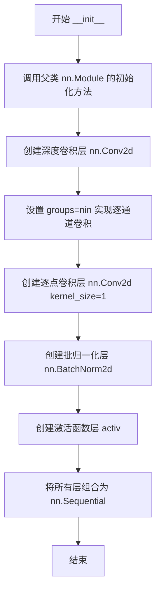
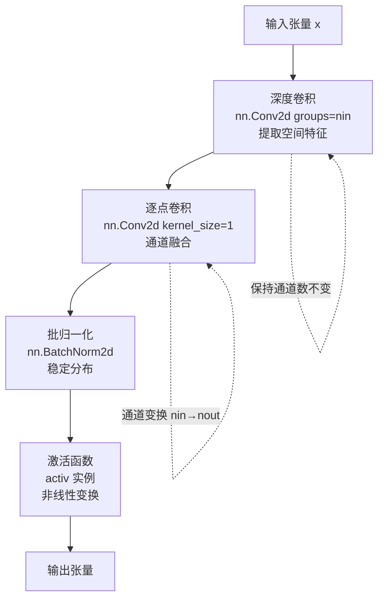
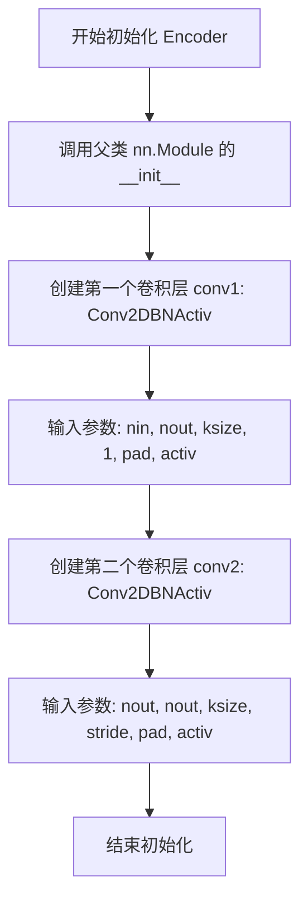
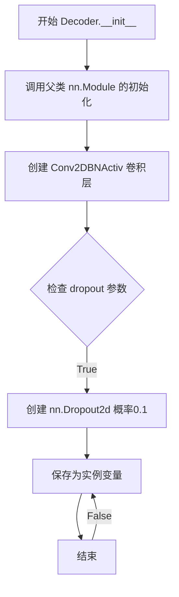
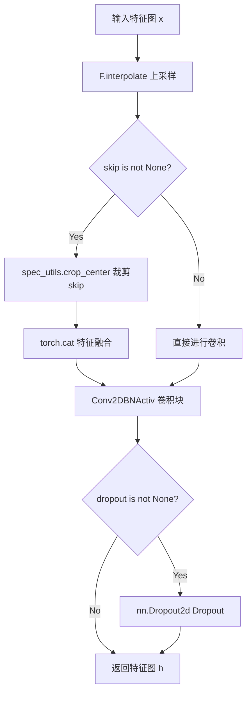

# `Chat-Haruhi-Suzumiya\yuki_builder\video_preprocessing\uvr5\uvr5_pack\lib_v5\layers_33966KB.py` 详细设计文档

这是一个基于PyTorch的U-Net风格音频/图像分割神经网络模块，包含了标准卷积块、可分离卷积块、编码器、解码器以及ASPP（空洞空间金字塔池化）模块，用于多尺度特征提取和分割任务。

## 整体流程

```mermaid
graph TD
    A[输入特征图] --> B[Encoder模块]
    B --> C[提取特征和跳跃连接]
    C --> D[ASPPModule多尺度特征提取]
    D --> E[Decoder模块]
    E --> F[上采样 + 跳跃连接融合]
    F --> G[输出分割特征图]

subgraph Encoder内部
    B1[输入x] --> B2[conv1: 第一次卷积]
    B2 --> B3[conv2: 第二次卷积]
    B3 --> B4[返回特征h和跳跃连接skip]
end

subgraph ASPP内部
    D1[输入x] --> D2[自适应平均池化卷积]
    D1 --> D3[1x1卷积]
    D1 --> D4[3x3空洞卷积(dilation=4)]
    D1 --> D5[3x3空洞卷积(dilation=8)]
    D1 --> D6[3x3空洞卷积(dilation=16)]
    D1 --> D7[3x3空洞卷积(dilation=32)]
    D1 --> D8[3x3空洞卷积(dilation=64)]
    D2 --> D9[特征拼接]
    D3 --> D9
    D4 --> D9
D5 --> D9
D6 --> D9
D7 --> D9
D8 --> D9
D9 --> D10[bottleneck: 1x1卷积 + Dropout]
D10 --> D11[输出多尺度特征]
end
```

## 类结构

```
nn.Module (PyTorch基类)
├── Conv2DBNActiv (卷积+BN+激活)
├── SeperableConv2DBNActiv (深度可分离卷积+BN+激活)
├── Encoder (编码器块)
├── Decoder (解码器块)
└── ASPPModule (空洞空间金字塔池化)
```

## 全局变量及字段


### `torch`
    
PyTorch核心库，提供张量运算和神经网络基础组件

类型：`module`
    


### `torch.nn.functional`
    
PyTorch函数式API，提供卷积、池化、激活等函数接口

类型：`module`
    


### `torch.nn`
    
PyTorch神经网络模块，提供层、容器、损失函数等

类型：`module`
    


### `spec_utils`
    
自定义工具模块，提供频谱处理辅助函数

类型：`module`
    


### `Conv2DBNActiv.conv`
    
卷积、批归一化、激活函数序列

类型：`nn.Sequential`
    


### `SeperableConv2DBNActiv.conv`
    
深度可分离卷积、1x1卷积、批归一化、激活序列

类型：`nn.Sequential`
    


### `Encoder.conv1`
    
第一次卷积块

类型：`Conv2DBNActiv`
    


### `Encoder.conv2`
    
第二次卷积块

类型：`Conv2DBNActiv`
    


### `Decoder.conv`
    
解码器卷积块

类型：`Conv2DBNActiv`
    


### `Decoder.dropout`
    
可选的Dropout层

类型：`nn.Dropout2d或None`
    


### `ASPPModule.conv1`
    
自适应池化分支

类型：`nn.Sequential`
    


### `ASPPModule.conv2`
    
1x1卷积分支

类型：`Conv2DBNActiv`
    


### `ASPPModule.conv3`
    
空洞卷积分支（dilation 1）

类型：`SeperableConv2DBNActiv`
    


### `ASPPModule.conv4`
    
空洞卷积分支（dilation 2）

类型：`SeperableConv2DBNActiv`
    


### `ASPPModule.conv5`
    
空洞卷积分支（dilation 3）

类型：`SeperableConv2DBNActiv`
    


### `ASPPModule.conv6`
    
空洞卷积分支（dilation 4，重复）

类型：`SeperableConv2DBNActiv`
    


### `ASPPModule.conv7`
    
空洞卷积分支（dilation 5，重复）

类型：`SeperableConv2DBNActiv`
    


### `ASPPModule.bottleneck`
    
特征融合后的瓶颈层

类型：`nn.Sequential`
    
    

## 全局函数及方法


### `spec_utils.crop_center`

中心裁剪函数，用于在UNet类解码器中将编码器的跳跃连接特征图（skip connection）裁剪到与当前特征图相同的尺寸，以解决上采样带来的尺寸不匹配问题，确保跳跃连接时特征图的空间维度对齐。

参数：

- `skip`：`torch.Tensor`，编码器输出的跳跃连接特征图，通常尺寸大于当前解码器特征图
- `x`：`torch.Tensor`，当前解码器层的特征图，作为裁剪的目标尺寸参考

返回值：`torch.Tensor`，裁剪后的跳跃连接特征图，尺寸与`x`相同

#### 流程图

```mermaid
flowchart TD
    A[输入 skip 和 x] --> B[获取 skip 的高度和宽度]
    B --> C[获取 x 的高度和宽度]
    C --> D[计算裁剪偏移量: offset_h = (skip_h - x_h) // 2]
    D --> E[计算裁剪偏移量: offset_w = (skip_w - x_w) // 2]
    E --> F[使用 tensor 切片裁剪 skip 中心区域]
    F --> G[返回裁剪后的特征图]
```

#### 带注释源码

```python
def crop_center(skip, x):
    """
    中心裁剪函数，用于对齐跳跃连接特征图尺寸
    
    参数:
        skip: torch.Tensor - 编码器输出的跳跃连接特征图
        x: torch.Tensor - 当前解码器特征图，用于确定目标尺寸
    返回:
        torch.Tensor - 裁剪后的特征图
    """
    # 获取跳跃连接特征图的空间维度 (batch, channel, height, width)
    _, _, skip_h, skip_w = skip.size()
    
    # 获取当前特征图的空间维度
    _, _, x_h, x_w = x.size()
    
    # 计算中心裁剪的起始位置
    # 确保裁剪居中：(skip_size - target_size) // 2
    start_h = (skip_h - x_h) // 2
    start_w = (skip_w - x_w) // 2
    
    # 使用切片从 skip 特征图中心裁剪出与 x 相同尺寸的区域
    # 保持 batch 和 channel 维度不变
    cropped_skip = skip[:, :, start_h:start_h + x_h, start_w:start_w + x_w]
    
    return cropped_skip
```

#### 潜在技术债务与优化空间

1. **边界处理缺陷**：当前实现假设 `skip` 尺寸始终大于等于 `x`，当尺寸相等或更小时会产生负索引或空张量，建议添加尺寸校验和边界保护逻辑
2. **性能优化**：可考虑使用 `torch.nn.functional.interpolate` 配合 `align_corners` 或使用 `torch.nn.functional.pad` 实现更高效的裁剪
3. **可读性增强**：可重构为模块化函数，支持自定义裁剪模式（如左上角裁剪、中心裁剪等）
4. **数值精度**：对于尺寸差异为奇数的情况，中心裁剪会导致单像素偏移，建议显式处理奇偶差异


### `Conv2DBNActiv.__init__`

该方法是 `Conv2DBNActiv` 类的构造函数，用于创建一个由 **卷积层 → 批归一化层 → 激活函数层** 组成的标准卷积块（Conv‑BN‑Activ），常作为 Encoder、Decoder、ASPP 等网络的基础构建单元。

参数：

- `nin`：`int`，输入特征图的通道数（即卷积层的输入通道）。
- `nout`：`int`，输出特征图的通道数（即卷积层的输出通道，同时作为 BatchNorm2d 的通道数）。
- `ksize`：`int`，卷积核的大小（默认 `3`），对应 `kernel_size` 参数。
- `stride`：`int`，卷积的步幅（默认 `1`），对应 `stride` 参数。
- `pad`：`int`，卷积的填充大小（默认 `1`），对应 `padding` 参数。
- `dilation`：`int`，膨胀卷积的膨胀率（默认 `1`），对应 `dilation` 参数。
- `activ`：`torch.nn.Module`，激活函数的类（非实例），默认 `nn.ReLU`。在构建时会被实例化为 `activ()` 加入 `nn.Sequential`。

返回值：`None`。`__init__` 方法仅完成对象属性的初始化，不返回任何值。

#### 流程图

```mermaid
flowchart TD
    A[开始 __init__] --> B[调用父类 nn.Module.__init__]
    B --> C[创建 nn.Sequential 容器]
    C --> D[添加 nn.Conv2d 层<br>（nin → nout, ksize, stride, pad, dilation, bias=False）]
    D --> E[添加 nn.BatchNorm2d 层<br>（通道数 = nout）]
    E --> F[实例化激活函数 activ() 并加入]
    F --> G[结束 __init__]
```

#### 带注释源码

```python
def __init__(self, nin, nout, ksize=3, stride=1, pad=1, dilation=1, activ=nn.ReLU):
    # 调用 nn.Module 的基类构造函数，完成模块的初始化
    super(Conv2DBNActiv, self).__init__()

    # 使用 nn.Sequential 将卷积、批归一化、激活函数串联成一个子模块
    self.conv = nn.Sequential(
        # --- 卷积层 ---
        # 输入通道 nin，输出通道 nout，卷积核大小 ksize，步幅 stride，填充 pad，膨胀率 dilation
        # 关闭偏置（bias=False），因为后面会接 BatchNorm2d，偏置会被归一化层抵消
        nn.Conv2d(
            nin,
            nout,
            kernel_size=ksize,
            stride=stride,
            padding=pad,
            dilation=dilation,
            bias=False,
        ),
        # --- 批归一化层 ---
        # 对卷积输出的 nout 通道进行批归一化，提升训练稳定性
        nn.BatchNorm2d(nout),
        # --- 激活函数层 ---
        # 根据传入的 activ 类（如 nn.ReLU、nn.LeakyReLU 等）实例化并加入序列
        activ(),
    )
```

#### 潜在的技术债务或优化空间

1. **激活函数实例化方式的局限**：当前实现假设 `activ` 是一个**类**并且可以直接 `activ()` 实例化。若传入需要额外参数的激活函数（如 `nn.PReLU(num_parameters=1)`），则会导致错误。可以改为接受实例或提供工厂函数。
2. **缺少权重初始化**：默认使用 PyTorch 的权重初始化（`reset_parameters`），对于某些任务（如分割、检测）可能需要手动 He / Xavier 初始化以提升收敛速度。
3. **不支持可分离卷积**：同类块还有 `SeperableConv2DBNActiv`，但两者的实现有重复代码，未来可以考虑抽象基类或混合组合模式以降低代码冗余。
4. **硬编码的 Dropout**：在 `Decoder` 中 dropout 被硬编码为 `0.1`，若需在不同场景下调整，需要将概率作为参数传入。

#### 其它项目

- **设计目标与约束**：该类的目标是提供一个 **轻量、可复用** 的卷积块，统一卷积、批归一化、激活的顺序。约束是 **bias 必须关闭**（因为 BatchNorm 会抵消偏置），且 `activ` 必须是可以无参实例化的 `nn.Module` 子类。
- **错误处理与异常设计**：若 `nin`、`nout` 小于 1、`ksize` 与 `pad`、`dilation` 组合导致 `padding` 计算出的无效几何形状，PyTorch 的 `nn.Conv2d` 会在前向传播时抛出 `RuntimeError`。当前没有额外的参数校验，建议在调用前确保通道数 > 0 且核尺寸为正奇数（便于保持特征图尺寸）。
- **外部依赖与接口契约**：依赖 `torch` 与 `torch.nn`（包括 `nn.Conv2d`、`nn.BatchNorm2d`、`nn.ReLU` 等），以及 `torch.nn.functional`（在 `Decoder` 中使用）。调用方只需传入整数通道数、核大小、步幅、填充、膨胀率以及激活函数类即可获得完整的卷积块。
- **使用示例**（简要）：

```python
# 创建一个 3→64 通道、3×3 卷积、ReLU 激活的块
block = Conv2DBNActiv(nin=3, nout=64, ksize=3, stride=1, pad=1, activ=nn.ReLU)
x = torch.randn(1, 3, 32, 32)
out = block(x)   # shape: (1, 64, 32, 32)
```

该块随后可被 `Encoder`、`Decoder`、`ASPPModule` 等高层模块直接使用，构成完整的网络结构。


### Conv2DBNActiv.__call__(x)

该方法是 Conv2DBNActiv 类的前向传播接口，通过 nn.Sequential 组合的卷积、批归一化和激活操作对输入张量进行处理并返回卷积结果。

参数：

- `x`：`torch.Tensor`，输入的 4D 张量，形状为 (batch_size, channels, height, width)

返回值：`torch.Tensor`，经过卷积、批归一化激活处理后的输出张量，形状取决于卷积参数

#### 流程图

```mermaid
flowchart TD
    A[输入张量 x] --> B[self.conv(x)]
    B --> C[nn.Conv2d 卷积操作]
    C --> D[nn.BatchNorm2d 批归一化]
    D --> E[activ() 激活函数]
    E --> F[输出张量]
```

#### 带注释源码

```python
def __call__(self, x):
    """
    前向传播调用方法
    
    参数:
        x: 输入张量, 形状为 (batch_size, nin, H, W)
    
    返回:
        经过卷积、批归一化和激活后的张量, 形状为 (batch_size, nout, H', W')
    """
    return self.conv(x)  # 调用 nn.Sequential 依次执行 conv -> BatchNorm -> activ
```

---

### 扩展信息

#### 1. 一段话描述

Conv2DBNActiv 是一个封装了二维卷积、批归一化和激活函数的基础卷积单元类，通过 nn.Sequential 组合这三个常用操作，提供简洁的前向传播接口，用于构建卷积神经网络的各种层。

#### 2. 文件整体运行流程

该文件定义了多个卷积神经网络组件：
- `Conv2DBNActiv`: 基础卷积+归一化+激活单元
- `SeperableConv2DBNActiv`: 深度可分离卷积变体
- `Encoder`: 编码器，包含两个 Conv2DBNActiv
- `Decoder`: 解码器，支持跳跃连接和上采样
- `ASPPModule`: 空洞空间金字塔池化模块

#### 3. 类详细信息

**Conv2DBNActiv 类：**

| 字段/方法 | 类型 | 描述 |
|-----------|------|------|
| `conv` | nn.Sequential | 包含 Conv2d、BatchNorm2d、激活函数的顺序容器 |
| `__init__` | 方法 | 初始化卷积层参数 |
| `__call__` | 方法 | 前向传播调用接口 |

#### 4. 关键组件信息

- **nn.Conv2d**: PyTorch 二维卷积层，用于提取特征
- **nn.BatchNorm2d**: 批归一化层，用于稳定训练过程
- **activ()**: 激活函数实例（默认为 ReLU）

#### 5. 潜在技术债务或优化空间

1. **拼写错误**: 类名 `SeperableConv2DBNActiv` 应为 `Separable`，但项目中保持了一致性
2. **激活函数作为默认参数**: `activ=nn.ReLU` 作为可变默认参数，可能导致意外的共享状态
3. **缺乏灵活性**: 激活函数在 `__init__` 中固定，无法在前向传播时动态切换

#### 6. 其它项目

**设计目标与约束：**
- 提供统一的卷积+归一化+激活接口
- 保持与 PyTorch 生态的兼容性
- 支持自定义卷积参数（stride、padding、dilation 等）

**错误处理与异常设计：**
- 依赖 PyTorch 内部错误处理
- 输入维度不匹配时会在 Conv2d 层抛出异常

**数据流：**
- 输入: (B, C_in, H, W)
- 输出: (B, C_out, H_out, W_out)，尺寸由卷积公式决定

**外部依赖：**
- `torch`
- `torch.nn`
- `torch.nn.functional`
- 本地模块 `spec_utils`（用于 Decoder 中的 crop_center）


### `SeperableConv2DBNActiv.__init__`

初始化可分离卷积块，包含深度卷积（按通道卷积）和逐点卷积（1x1卷积），随后进行批归一化和激活函数处理，以实现高效的时空特征提取。

参数：

- `nin`：`int`，输入特征图的通道数
- `nout`：`int`，输出特征图的通道数
- `ksize`：`int`，卷积核大小（默认为3）
- `stride`：`int`，卷积步长（默认为1）
- `pad`：`int`，填充大小（默认为1）
- `dilation`：`int`，膨胀率（默认为1）
- `activ`：`nn.Module`，激活函数类型（默认为nn.ReLU）

返回值：`None`，该方法为构造函数，不返回任何值

#### 流程图



#### 带注释源码

```python
def __init__(self, nin, nout, ksize=3, stride=1, pad=1, dilation=1, activ=nn.ReLU):
    """
    初始化可分离卷积块
    
    参数:
        nin: 输入通道数
        nout: 输出通道数
        ksize: 卷积核大小
        stride: 步长
        pad: 填充
        dilation: 膨胀率
        activ: 激活函数类
    """
    # 调用父类 nn.Module 的初始化方法
    super(SeperableConv2DBNActiv, self).__init__()
    
    # 构建卷积模块序列
    self.conv = nn.Sequential(
        # 深度卷积：每个输入通道独立进行卷积
        # groups=nin 表示逐通道卷积，减少参数和计算量
        nn.Conv2d(
            nin,                          # 输入通道数
            nin,                         # 输出通道数（与输入相同）
            kernel_size=ksize,           # 卷积核大小
            stride=stride,               # 步长
            padding=pad,                 # 填充
            dilation=dilation,           # 膨胀率
            groups=nin,                  # 分组数=输入通道数，实现深度卷积
            bias=False,                  # 不使用偏置
        ),
        # 逐点卷积：1x1卷积，改变通道数
        nn.Conv2d(nin, nout, kernel_size=1, bias=False),
        # 批归一化：对输出通道进行归一化
        nn.BatchNorm2d(nout),
        # 激活函数
        activ(),
    )
```


### `SeperableConv2DBNActiv.__call__`

实现可分离卷积的前向传播，该卷积块由深度卷积（逐通道卷积）、逐点卷积、批归一化和激活函数组成，用于高效的特征提取和降维。

参数：

- `x`：`torch.Tensor`，输入张量，形状为 (batch_size, nin, H, W)，其中 nin 为输入通道数，H 和 W 为输入特征图的高度和宽度

返回值：`torch.Tensor`，输出张量，形状为 (batch_size, nout, H', W')，其中 nout 为输出通道数，H' 和 W' 根据卷积 stride 和 padding 计算得出

#### 流程图



#### 带注释源码

```python
def __call__(self, x):
    """
    SeperableConv2DBNActiv 的前向传播方法
    
    执行可分离卷积块的前向计算，包括：
    1. 深度卷积：对每个输入通道分别进行空间卷积
    2. 逐点卷积：融合深度卷积输出的特征到目标通道数
    3. 批归一化：标准化特征分布
    4. 激活函数：引入非线性
    
    参数:
        x: 输入张量，形状为 (batch_size, nin, H, W)
    
    返回:
        经过可分离卷积块处理后的输出张量，形状为 (batch_size, nout, H', W')
    """
    # 通过 Sequential 组合的卷积层、归一化层和激活层进行前向传播
    # 内部自动完成：深度卷积 → 逐点卷积 → BatchNorm → 激活
    return self.conv(x)
```


### `Encoder.__init__`

初始化编码器模块，用于将输入特征逐步转换为低维表示，同时保留跳跃连接以供解码器使用。

#### 参数

- `nin`：`int`，输入通道数，指定输入特征图的通道维度
- `nout`：`int`，输出通道数，指定输出特征图的通道维度
- `ksize`：`int`，卷积核大小，默认值为 3，控制卷积操作的感受野
- `stride`：`int`，步长，默认值为 1，控制特征图的采样步幅
- `pad`：`int`，填充大小，默认值为 1，控制特征图的边界填充
- `activ`：`nn.Module`，激活函数类型，默认值为 `nn.LeakyReLU`，用于引入非线性

#### 返回值

`None`（`__init__` 方法不返回值，仅初始化对象状态）

#### 流程图



#### 带注释源码

```python
def __init__(self, nin, nout, ksize=3, stride=1, pad=1, activ=nn.LeakyReLU):
    """
    初始化编码器
    
    参数:
        nin: int - 输入通道数
        nout: int - 输出通道数  
        ksize: int - 卷积核大小，默认为3
        stride: int - 步长，默认为1
        pad: int - 填充大小，默认为1
        activ: nn.Module - 激活函数类型，默认为nn.LeakyReLU
    """
    # 调用父类 nn.Module 的初始化方法
    super(Encoder, self).__init__()
    
    # 第一个卷积层：保持空间尺寸
    # 输入: (B, nin, H, W) -> 输出: (B, nout, H, W)
    # 参数 1 表示 stride=1，保持特征图尺寸
    self.conv1 = Conv2DBNActiv(nin, nout, ksize, 1, pad, activ=activ)
    
    # 第二个卷积层：可能降低空间尺寸
    # 输入: (B, nout, H, W) -> 输出: (B, nout, H/s, W/s)
    # 使用传入的 stride 参数，可能进行下采样
    self.conv2 = Conv2DBNActiv(nout, nout, ksize, stride, pad, activ=activ)
```

#### 关键组件信息

| 组件名称 | 描述 |
|---------|------|
| `Encoder` | 编码器模块，用于特征提取和下采样 |
| `Conv2DBNActiv` | 卷积+批归一化+激活函数的组合模块 |
| `self.conv1` | 第一个卷积层，保持特征图尺寸 |
| `self.conv2` | 第二个卷积层，可进行下采样 |

#### 潜在技术债务与优化空间

1. **硬编码激活函数默认值**：当前将 `LeakyReLU` 硬编码为默认值，可考虑通过配置文件或参数注入方式管理
2. **卷积层参数暴露不足**：调用 `Conv2DBNActiv` 时固定第二个卷积层的输出通道为 `nout`，缺乏灵活性
3. **缺少权重初始化**：未对卷积层和批归一化层进行显式的权重初始化，可能影响训练稳定性
4. **模块复用性**：Encoder 模块与 Decoder 配合紧密，但未提供独立的配置接口

#### 其它说明

- **设计目标**：Encoder 采用 U-Net 架构的编码路径，通过两个连续的卷积块提取特征，第二层可执行下采样操作
- **数据流**：`__call__` 方法将输入 x 通过 conv1 生成跳跃连接 skip，再通过 conv2 生成隐藏表示 h
- **外部依赖**：依赖 `Conv2DBNActiv` 类，该类封装了卷积、批归一化和激活操作
- **错误处理**：参数类型未做运行时检查，需依赖调用方保证参数合法性


### `Encoder.__call__`

该方法是Encoder类的前向传播实现，接收输入特征图，通过两个连续的卷积块（Conv2DBNActiv）进行处理，第一个卷积块的输出作为跳跃连接（skip connection）保存，第二个卷积块的输出作为编码后的特征图返回。该方法遵循UNet架构设计，用于特征提取并保留底层特征以供后续解码器进行特征融合。

参数：

- `x`：`torch.Tensor`，输入特征图，形状为 (batch, nin, H, W)，nin 为输入通道数

返回值：`Tuple[torch.Tensor, torch.Tensor]`，返回一个元组

- `h`：`torch.Tensor`，编码后的特征图，形状为 (batch, nout, H', W')，经过两次卷积处理后的输出，用于传递给下一层
- `skip`：`torch.Tensor`，跳跃连接特征，形状为 (batch, nout, H, W)，保留了第一层卷积的输出，用于解码器中的特征融合

#### 流程图

```mermaid
graph LR
    A[输入 x<br/>torch.Tensor (batch, nin, H, W)] --> B[conv1(x)<br/>Conv2DBNActiv]
    B --> C[skip<br/>torch.Tensor (batch, nout, H, W)]
    C --> D[conv2(skip)<br/>Conv2DBNActiv]
    D --> E[h<br/>torch.Tensor (batch, nout, H', W')]
    E --> F[返回元组 (h, skip)]
    
    style C fill:#ff9900,stroke:#333,stroke-width:2px
    style E fill:#66ccff,stroke:#333,stroke-width:2px
```

#### 带注释源码

```python
def __call__(self, x):
    """
    Encoder 的前向传播方法
    
    参数:
        x: torch.Tensor，输入张量，形状为 (batch, nin, H, W)
           nin 是输入通道数
    
    返回:
        Tuple[torch.Tensor, torch.Tensor]: 
            - h: 经过两次卷积编码后的特征图
            - skip: 第一次卷积后的特征图，作为跳跃连接
    """
    # 第一次卷积：nin -> nout，stride=1（默认），输出尺寸保持 H x W
    # skip 变量保存第一层输出，用于跳跃连接
    skip = self.conv1(x)
    
    # 第二次卷积：nout -> nout，stride 由初始化参数指定（通常为2用于下采样）
    # 输出尺寸根据 stride 值可能减小（高宽变为 H/stride x W/stride）
    h = self.conv2(skip)
    
    # 返回编码特征 h 和跳跃连接 skip
    # h 传递给下一层（可能是下一个 Encoder 或其他模块）
    # skip 传递给对应的 Decoder 用于特征融合
    return h, skip
```


### `Decoder.__init__`

初始化解码器模块，设置输入输出通道数、卷积参数、激活函数和dropout机制。

参数：

- `nin`：`int`，输入特征图的通道数
- `nout`：`int`，输出特征图的通道数
- `ksize`：`int`，卷积核大小，默认为3
- `stride`：`int`，卷积步长，默认为1
- `pad`：`int`，卷积填充，默认为1
- `activ`：`nn.Module`，激活函数类型，默认为`nn.ReLU`
- `dropout`：`bool`，是否启用dropout，默认为`False`

返回值：`None`，该方法为初始化方法，无返回值

#### 流程图



#### 带注释源码

```python
def __init__(
    self, nin, nout, ksize=3, stride=1, pad=1, activ=nn.ReLU, dropout=False
):
    """
    初始化解码器模块
    
    参数:
        nin: 输入通道数
        nout: 输出通道数
        ksize: 卷积核大小
        stride: 卷积步长
        pad: 填充大小
        activ: 激活函数类型
        dropout: 是否启用dropout
    """
    # 调用父类 nn.Module 的初始化方法，注册所有子模块
    super(Decoder, self).__init__()
    
    # 创建 Conv2DBNActiv 卷积层：卷积 + BatchNorm + 激活函数
    # 输入通道为 nin，输出通道为 nout，卷积核大小为 ksize
    # 步长固定为1（因为上采样后不需要大步长），填充为 pad
    self.conv = Conv2DBNActiv(nin, nout, ksize, 1, pad, activ=activ)
    
    # 根据 dropout 参数决定是否创建 Dropout 层
    # 如果 dropout 为 True，则创建 nn.Dropout2d，丢弃概率为 0.1
    # 否则设置为 None，在前向传播中跳过 dropout
    self.dropout = nn.Dropout2d(0.1) if dropout else None
```


### `Decoder.__call__(x, skip)`

该方法是Decoder类的前向传播函数，负责将低分辨率特征图上采样至原始尺寸，通过跳跃连接融合编码器特征，并经过卷积块输出解码后的高分辨率特征图。

参数：

- `x`：`torch.Tensor`，输入的低分辨率特征张量，通常来自上一层解码器或瓶颈层
- `skip`：`Optional[torch.Tensor]`，来自编码器的跳跃连接特征张量，用于特征融合，默认为None

返回值：`torch.Tensor`，解码后的高分辨率特征张量，尺寸为输入的2倍（宽高各放大2倍）

#### 流程图



#### 带注释源码

```python
def __call__(self, x, skip=None):
    """
    Decoder 模块的前向传播函数
    
    参数:
        x: 输入的低分辨率特征张量 [B, C, H, W]
        skip: 可选的跳跃连接特征张量，来自编码器对应层 [B, C', H', W']
    
    返回:
        h: 解码后的高分辨率特征张量 [B, C_out, 2*H, 2*W]
    """
    
    # 步骤1: 上采样 - 将输入特征图尺寸放大2倍
    # 使用双线性插值，保持特征图连续性和平滑性
    x = F.interpolate(x, scale_factor=2, mode="bilinear", align_corners=True)
    
    # 步骤2: 特征融合 - 如果存在跳跃连接
    if skip is not None:
        # 裁剪跳跃连接特征图，使其与上采样后的特征图尺寸一致
        # 解决编码器/解码器路径中尺寸不匹配问题
        skip = spec_utils.crop_center(skip, x)
        
        # 沿通道维度拼接特征图，融合不同层级的特征信息
        x = torch.cat([x, skip], dim=1)
    
    # 步骤3: 卷积变换 - 调整通道数和提取特征
    # 将融合后的特征图通过卷积块进行处理
    h = self.conv(x)
    
    # 步骤4: Dropout 正则化 - 如果启用
    if self.dropout is not None:
        # 随机丢弃部分通道特征，防止过拟合
        h = self.dropout(h)
    
    # 返回解码后的特征图
    return h
```


### `ASPPModule.__init__`

该方法用于初始化ASPP（Atrous Spatial Pyramid Pooling）模块，通过多尺度膨胀卷积和全局平均池化路径捕获不同感受野的特征，以增强特征表示能力。

参数：

- `nin`：`int`，输入特征图的通道数
- `nout`：`int`，输出特征图的通道数
- `dilations`：`tuple`，膨胀卷积的膨胀率元组，默认值为 `(4, 8, 16, 32, 64)`
- `activ`：`nn.Module`，激活函数类型，默认值为 `nn.ReLU`

返回值：`None`，无返回值（`__init__` 方法）

#### 流程图

```mermaid
flowchart TD
    A[开始 __init__] --> B[调用 super().__init__ 初始化基类]
    B --> C[创建 conv1: AdaptiveAvgPool2d + Conv2DBNActiv]
    C --> D[创建 conv2: 普通 1x1 卷积]
    D --> E[创建 conv3: Dilated SeparableConv 膨胀率=dilations[0]]
    E --> F[创建 conv4: Dilated SeparableConv 膨胀率=dilations[1]]
    F --> G[创建 conv5: Dilated SeparableConv 膨胀率=dilations[2]]
    G --> H[创建 conv6: Dilated SeparableConv 膨胀率=dilations[2]]
    H --> I[创建 conv7: Dilated SeparableConv 膨胀率=dilations[2]]
    I --> J[创建 bottleneck: 1x1 卷积 + Dropout2d]
    J --> K[结束 __init__]
```

#### 带注释源码

```python
def __init__(self, nin, nout, dilations=(4, 8, 16, 32, 64), activ=nn.ReLU):
    """
    初始化ASPP模块
    
    参数:
        nin: 输入通道数
        nout: 输出通道数
        dilations: 膨胀卷积的膨胀率元组，默认(4, 8, 16, 32, 64)
        activ: 激活函数类型，默认nn.ReLU
    """
    # 调用 nn.Module 基类的初始化方法
    super(ASPPModule, self).__init__()
    
    # === 多尺度特征提取路径 ===
    
    # conv1: 全局平均池化路径 - 捕获全局上下文信息
    # AdaptiveAvgPool2d((1, None)) 将空间维度压缩为 1xN
    # 随后通过 1x1 卷积和插值恢复到原始尺寸
    self.conv1 = nn.Sequential(
        nn.AdaptiveAvgPool2d((1, None)),  # 自适应全局池化
        Conv2DBNActiv(nin, nin, 1, 1, 0, activ=activ),  # 1x1 卷积
    )
    
    # conv2: 标准 1x1 卷积路径 - 捕获细粒度特征
    self.conv2 = Conv2DBNActiv(nin, nin, 1, 1, 0, activ=activ)
    
    # conv3-conv7: 膨胀分离卷积路径 - 捕获多尺度空间信息
    # 使用不同的膨胀率来增大感受野，同时保持参数量
    self.conv3 = SeperableConv2DBNActiv(
        nin, nin, 3, 1, dilations[0], dilations[0], activ=activ
    )
    self.conv4 = SeperableConv2DBNActiv(
        nin, nin, 3, 1, dilations[1], dilations[1], activ=activ
    )
    self.conv5 = SeperableConv2DBNActiv(
        nin, nin, 3, 1, dilations[2], dilations[2], activ=activ
    )
    # 注意: 代码中 conv6 和 conv7 都使用了 dilations[2]
    # 这里存在潜在的技术债务：应该使用 dilations[3] 和 dilations[4]
    self.conv6 = SeperableConv2DBNActiv(
        nin, nin, 3, 1, dilations[2], dilations[2], activ=activ
    )
    self.conv7 = SeperableConv2DBNActiv(
        nin, nin, 3, 1, dilations[2], dilations[2], activ=activ
    )
    
    # bottleneck: 特征融合和维度压缩
    # 将 7 个并行路径的输出在通道维度拼接后，通过 1x1 卷积压缩到目标通道数
    self.bottleneck = nn.Sequential(
        # 输入通道数为 nin * 7（7个路径的输出拼接）
        Conv2DBNActiv(nin * 7, nout, 1, 1, 0, activ=activ),
        nn.Dropout2d(0.1),  # Dropout 防止过拟合
    )
```


### `ASPPModule.forward(x)`

该方法实现了 **Atrous Spatial Pyramid Pooling (ASPP)** 模块的前向传播。它通过并行运行多个具有不同膨胀率（dilation rates）的分支（全局池化、1x1卷积以及多个膨胀卷积）来捕获多尺度上下文信息，然后将这些特征在通道维度进行拼接，最后通过一个“瓶颈”层（Bottleneck）整合信息并输出。

参数：

-  `x`：`torch.Tensor`，输入特征图，形状为 (Batch, Channels, Height, Width)。

返回值：`torch.Tensor`，经过多尺度特征融合后的输出特征图，形状为 (Batch, nout, Height, Width)。

#### 流程图

```mermaid
graph TD
    Input[x: torch.Tensor] --> Size[获取尺寸 h, w]
    Size --> Branch1[分支1: AdaptiveAvgPool + Interp]
    Size --> Branch2[分支2: 1x1 Conv]
    Size --> Branch3[分支3: Dilated Conv (d0)]
    Size --> Branch4[分支4: Dilated Conv (d1)]
    Size --> Branch5[分支5: Dilated Conv (d2)]
    Size --> Branch6[分支6: Dilated Conv (d2)]
    Size --> Branch7[分支7: Dilated Conv (d2)]

    Branch1 --> Concat[torch.cat [..., dim=1]]
    Branch2 --> Concat
    Branch3 --> Concat
    Branch4 --> Concat
    Branch5 --> Concat
    Branch6 --> Concat
    Branch7 --> Concat

    Concat --> Bottleneck[Bottleneck: Conv1x1 + Dropout]
    Bottleneck --> Output[bottle: torch.Tensor]
```

#### 带注释源码

```python
def forward(self, x):
    # 获取输入特征图的高度和宽度，用于后续上采样恢复尺寸
    _, _, h, w = x.size()
    
    # 分支1：全局上下文分支
    # 1. 自适应平均池化，将空间维度压缩到 (1, None) 即高度为1，宽度自适应
    # 2. 经过卷积
    # 3. 双线性插值上采样回原始尺寸 h, w，保持全局视野的同时融合了通道信息
    feat1 = F.interpolate(
        self.conv1(x), size=(h, w), mode="bilinear", align_corners=True
    )
    
    # 分支2：局部特征分支
    # 使用 1x1 卷积提取细粒度特征，不改变感受野
    feat2 = self.conv2(x)
    
    # 分支3-7：多尺度空洞卷积分支
    # 使用不同的膨胀率 (dilation rates) 来增大感受野，捕获不同尺度的特征
    # dilations 参数通常为 (4, 8, 16)，但在代码中 conv6 和 conv7 重复使用了 dilations[2]
    feat3 = self.conv3(x)
    feat4 = self.conv4(x)
    feat5 = self.conv5(x)
    feat6 = self.conv6(x)
    feat7 = self.conv7(x)
    
    # 特征融合：在通道维度（dim=1）进行拼接
    # 拼接后的通道数 = nin * 7
    out = torch.cat((feat1, feat2, feat3, feat4, feat5, feat6, feat7), dim=1)
    
    # 瓶颈层处理：
    # 1. 1x1 卷积压缩通道数从 (nin * 7) 到 nout
    # 2. Dropout 正则化
    bottle = self.bottleneck(out)
    return bottle
```

## 关键组件


### Conv2DBNActiv

一个基础的卷积-批归一化-激活函数组合模块，封装了卷积层、BatchNorm2d和激活函数的串联结构，提供可配置的卷积参数（卷积核大小、步长、填充、膨胀率）和激活函数选择。

### SeperableConv2DBNActiv

深度可分离卷积块，先使用分组卷积（groups=nin）实现空间卷积，再使用1x1卷积调整通道数，最后接批归一化和激活函数，用于减少参数量和计算量。

### Encoder

编码器模块，由两个串联的Conv2DBNActiv组成，第一个卷积保持特征图尺寸，第二个卷积进行步长为2的下采样，同时输出跳跃连接（skip）和隐藏特征，用于U-Net架构的编码器部分。

### Decoder

解码器模块，通过F.interpolate进行2倍上采样，支持跳跃连接（通过spec_utils.crop_center裁剪对齐后与skip特征拼接），再经过卷积块和可选的Dropout处理，用于U-Net架构的解码器部分。

### ASPPModule

Atrous Spatial Pyramid Pooling模块，包含7个并行分支：1个自适应平均池化分支、1个1x1卷积分支、5个不同膨胀率的深度可分离卷积分支，各分支特征拼接后通过瓶颈层压缩到目标通道数，用于捕获多尺度上下文信息。

### spec_utils 模块引用

从 . 导入的 spec_utils 模块，其中包含 crop_center 函数，用于裁剪中心区域以对齐跳跃连接的尺寸。


## 问题及建议


### 已知问题

-   **拼写错误**：类名 `SeperableConv2DBNActiv` 中的 "Seperable" 应为 "Separable"（缺少 'a'），这会影响代码可读性和搜索能力。
-   **ASPPModule 参数使用错误**：代码中 `dilations` 列表定义了 `(4, 8, 16, 32, 64)`，但 conv5、conv6、conv7 都使用了 `dilations[2]`（值为16），实际应该分别使用 `dilations[2]`、`dilations[3]`、`dilations[4]`，导致空洞率重复，削弱了多尺度特征提取能力。
-   **缺少类型注解**：所有类和方法均未使用 Python 类型提示（Type Hints），降低了代码的可维护性和静态检查工具的效能。
-   **硬编码魔数**：Dropout 概率 0.1 在多处硬编码（Decoder 和 ASPPModule），若需调整需修改多处代码。
-   **Decoder 跳跃连接边界处理**：`spec_utils.crop_center` 函数调用假设 skip 和 x 的空间维度存在整数倍关系，若尺寸不匹配可能导致运行时错误或裁剪异常。
-   **Encoder/Decoder 参数不一致**：Encoder 的 `stride` 参数默认值为 1（第二个卷积层），Decoder 的 `stride` 参数传入但未在父类 Conv2DBNActiv 中使用（stride 仅在第一个卷积层生效），参数命名和使用逻辑不清晰。

### 优化建议

-   **修正拼写**：将 `SeperableConv2DBNActiv` 重命名为 `SeparableConv2DBNActiv`。
-   **修复 ASPP 空洞率**：将 conv5 改为 `dilations[3]`，conv6 改为 `dilations[4]`，确保使用 5 个不同的空洞率。
-   **添加类型注解**：为所有 `__init__` 方法和 `__call__`/`forward` 方法添加输入输出类型注解，如 `def forward(self, x: torch.Tensor) -> torch.Tensor:`。
-   **配置化 Dropout 概率**：将 Dropout 概率提取为模块构造参数或配置文件，避免硬编码。
-   **增加边界检查**：在 Decoder 的 `__call__` 方法中添加尺寸校验，确保 skip 和 x 可正确裁剪和拼接，或在文档中明确说明输入尺寸约束。
-   **统一参数语义**：明确 Encoder/Decoder 中 stride 参数的实际作用范围，或考虑移除未使用的参数以避免混淆。


## 其它


### 设计目标与约束

本模块实现了一个用于图像分割任务的卷积神经网络架构，包含编码器-解码器结构（Encoder-Decoder）和ASPP（Atrous Spatial Pyramid Pooling）模块。设计目标包括：1）通过多尺度空洞卷积捕获不同感受野的特征；2）使用可分离卷积降低计算复杂度；3）通过跳跃连接（skip connections）保留细粒度信息；4）支持可配置的激活函数（ReLU/LeakyReLU）。主要约束为PyTorch 1.0+兼容性，要求输入张量维度为(N, C, H, W)。

### 错误处理与异常设计

代码中缺少显式的错误处理机制。建议改进：1）Encoder/Decoder的__call__方法应验证输入张量维度有效性（至少4维）；2）Decoder中crop_center函数调用前应检查skip与x的空间维度兼容性；3）ASPPModule的forward方法应验证dilations参数有效性（正整数且非零）；4）卷积层参数（nin, nout, ksize等）应在构造函数中验证合法性（如nout>0, ksize为奇数等）。

### 数据流与状态机

数据流主要分为三条路径：1）编码路径：输入→Encoder.conv1→Encoder.conv2→输出h与跳跃连接skip；2）解码路径：Decoder接收上级输出h，通过F.interpolate上采样，与skip拼接后经卷积输出；3）ASPP路径：输入经7个并行分支（自适应池化+1x1卷积+3个不同空洞率的深度可分离卷积x3）→拼接→bottleneck卷积→输出。整个架构无显式状态机，状态通过nn.Module的内部参数管理。

### 外部依赖与接口契约

核心依赖包括：1）PyTorch (torch, torch.nn, torch.nn.functional)；2）本地模块spec_utils（提供crop_center函数）。接口契约：1）所有Module子类均支持forward(x)或__call__(x)调用；2）输入张量格式必须为(N, C, H, W)；3）输出张量格式与输入保持一致的空间维度约定；4）Decoder的skip参数可为None（对应不使用跳跃连接）；5）ASPPModule的dilations参数默认为(4,8,16,32,64)五元素元组。

### 配置与超参数说明

关键超参数包括：1）Conv2DBNActiv/SeperableConv2DBNActiv: ksize默认3，stride默认1，pad默认1，dilation默认1，activ默认nn.ReLU；2）Encoder: 使用LeakyReLU激活函数；3）Decoder: dropout默认False，Dropout2d概率固定为0.1；4）ASPPModule: 空洞率列表重复使用dilations[2]（第5/6/7个卷积均为32，存在冗余）；5）全局：BatchNorm2d动量默认0.1。

### 性能考虑与优化空间

当前实现的主要性能考量：1）SeperableConv2DBNActiv通过分组卷积降低参数量和计算量；2）Decoder的dropout在训练时启用，推理时自动失效；3）ASPPModule存在算子冗余（conv5/conv6/conv7结构完全相同）。优化建议：1）移除ASPPModule中重复的conv5/conv6/conv7，可考虑用列表循环替代重复代码；2）Decoder的crop_center操作可考虑优化或缓存；3）可添加torch.jit.script支持以提升推理性能；4）BatchNorm可考虑使用同步BatchNorm用于多GPU训练。

### 版本兼容性与迁移计划

当前代码使用PyTorch基础API，兼容性较好。需注意：1）F.interpolate的align_corners参数在PyTorch 0.4.0+引入，需确认最低版本；2）nn.Dropout2d在PyTorch 1.0+稳定；3）AdaptiveAvgPool2d输出shape在不同版本可能略有差异。建议迁移计划：1）添加版本检测代码或requirements.txt指定torch>=1.0；2）未来可迁移至torch.compile()加速；3）考虑使用torch.jit.script优化关键路径。

### 测试策略与验证方法

建议测试覆盖：1）单元测试：验证每个Module输出的tensor shape是否符合预期；2）梯度流测试：确认反向传播可正常进行；3）数值稳定性测试：检查是否存在NaN/Inf；4）集成测试：模拟完整Encoder-Decoder链路；5）边界测试：验证极端输入（如1x1图像、单通道输入）下的行为；6）可添加pytest参数化测试验证不同超参数组合。

### 可视化与调试支持

建议添加：1）__repr__方法的自定义实现，展示关键超参数；2）可选的激活值日志记录功能（用于debug模式）；3）hook机制支持中间特征图可视化；4）模型结构导出工具（支持ONNX导出验证）。当前代码可通过torchsummary或torchviz进行可视化分析。


    