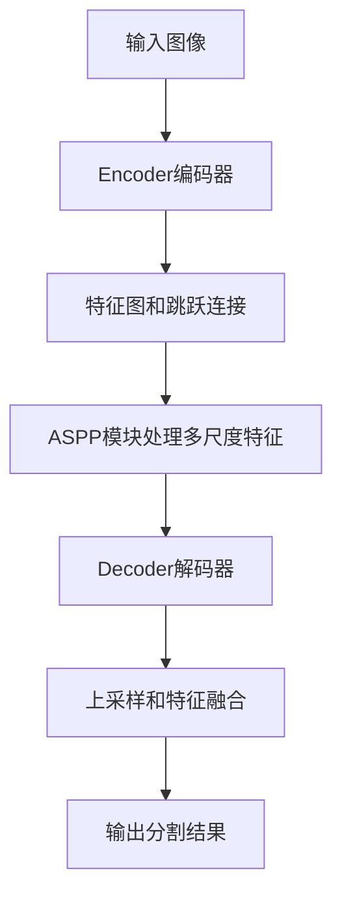
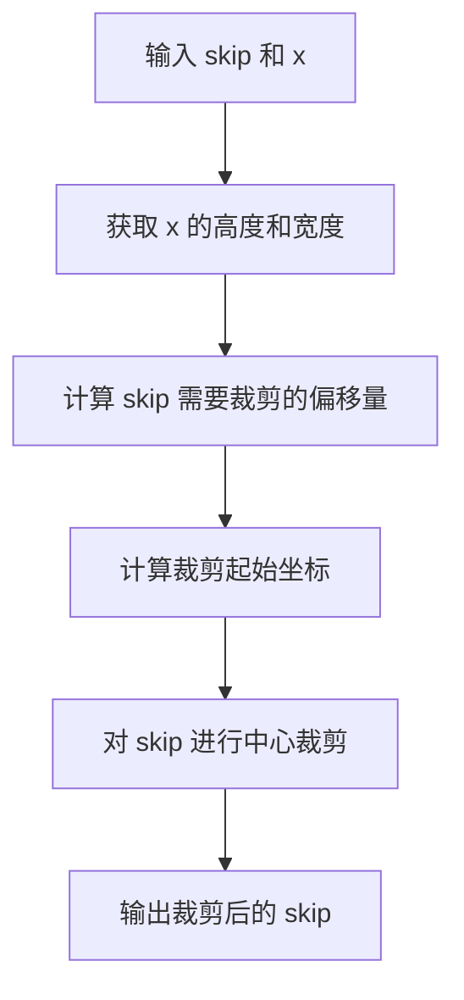
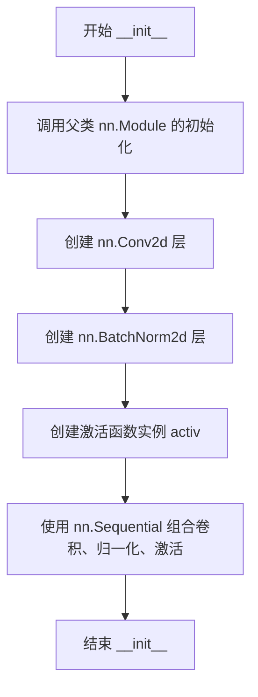
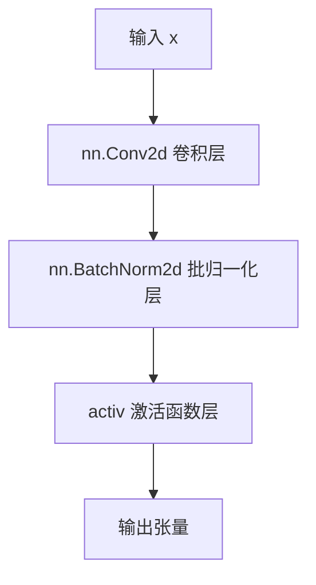
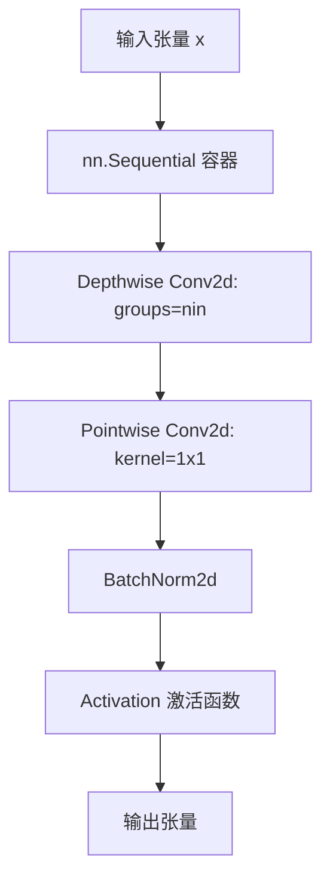
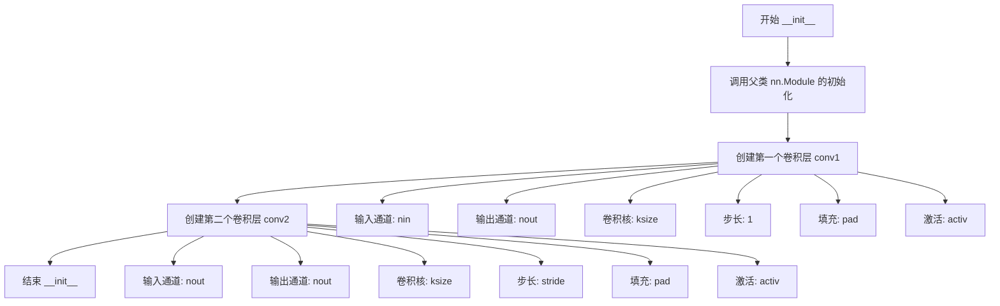
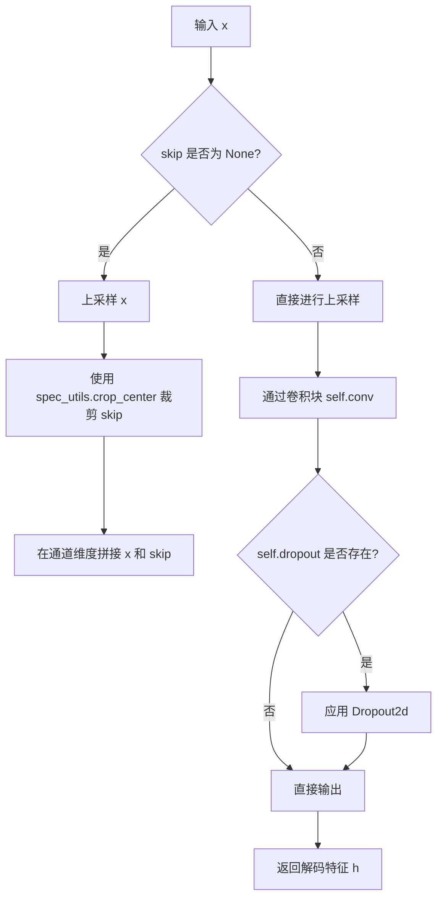
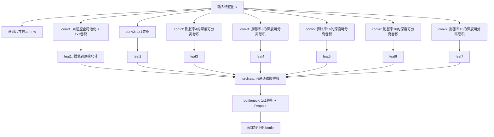

# `Chat-Haruhi-Suzumiya\yuki_builder\video_preprocessing\uvr5\uvr5_pack\lib_v5\layers_537227KB.py` 详细设计文档

这是一个基于PyTorch的神经网络构建模块，包含了卷积层、编码器、解码器和ASPP（Atrous Spatial Pyramid Pooling）模块等核心组件，用于构建图像分割或相关任务的深度学习模型。

## 整体流程



## 类结构

```
Conv2DBNActiv (基础卷积块)
SeperableConv2DBNActiv (可分离卷积块)
Encoder (编码器)
Decoder (解码器)
ASPPModule (ASPP多尺度模块)
```

## 全局变量及字段


### `Conv2DBNActiv.conv`
    
Sequential container holding Conv2d, BatchNorm2d, and activation layers

类型：`nn.Sequential`
    


### `SeperableConv2DBNActiv.conv`
    
Sequential container holding depthwise separable convolution, pointwise Conv2d, BatchNorm2d, and activation layers

类型：`nn.Sequential`
    


### `Encoder.conv1`
    
First convolutional block for encoding input features

类型：`Conv2DBNActiv`
    


### `Encoder.conv2`
    
Second convolutional block for encoding with striding

类型：`Conv2DBNActiv`
    


### `Decoder.conv`
    
Convolutional layer for decoding features

类型：`Conv2DBNActiv`
    


### `Decoder.dropout`
    
Optional dropout layer for regularization (probability 0.1)

类型：`nn.Dropout2d or None`
    


### `ASPPModule.conv1`
    
Adaptive average pooling followed by 1x1 convolution for global context

类型：`nn.Sequential`
    


### `ASPPModule.conv2`
    
Standard 1x1 convolution branch

类型：`Conv2DBNActiv`
    


### `ASPPModule.conv3`
    
Separable convolution with first dilation rate

类型：`SeperableConv2DBNActiv`
    


### `ASPPModule.conv4`
    
Separable convolution with second dilation rate

类型：`SeperableConv2DBNActiv`
    


### `ASPPModule.conv5`
    
Separable convolution with third dilation rate

类型：`SeperableConv2DBNActiv`
    


### `ASPPModule.conv6`
    
Additional separable convolution branch for feature extraction

类型：`SeperableConv2DBNActiv`
    


### `ASPPModule.conv7`
    
Additional separable convolution branch for feature extraction

类型：`SeperableConv2DBNActiv`
    


### `ASPPModule.bottleneck`
    
Bottleneck layer combining all ASPP branches with 1x1 convolution and dropout

类型：`nn.Sequential`
    
    

## 全局函数及方法


### `spec_utils.crop_center`

该函数用于在 U-Net 类架构的解码器中，将编码器的跳跃连接（skip connection）裁剪至与上采样后的特征图相同的空间尺寸，以确保跳跃连接与上采样特征图能够正确拼接。

参数：

- `skip`：`torch.Tensor`，编码器端的跳跃连接特征图，通常具有较大的空间尺寸
- `x`：`torch.Tensor`，解码器端上采样后的特征图，目标尺寸参考

返回值：`torch.Tensor`，裁剪后的跳跃连接特征图，其空间尺寸与 `x` 相同

#### 流程图



#### 带注释源码

```
# 该函数源码未在当前代码片段中提供
# 基于 Decoder 类中的调用方式进行推断
def crop_center(skip, x):
    """
    将 skip 连接裁剪至与 x 相同的空间尺寸
    
    参数:
        skip: 编码器端的跳跃连接张量 [B, C, H, W]
        x: 解码器端上采样后的张量 [B, C, h, w]
    
    返回:
        裁剪后的 skip 张量 [B, C, h, w]
    """
    # 获取目标尺寸
    _, _, h, w = x.size()
    
    # 计算裁剪起始位置（从中心裁剪）
    start_h = (skip.size(2) - h) // 2
    start_w = (skip.size(3) - w) // 2
    
    # 执行中心裁剪
    return skip[:, :, start_h:start_h + h, start_w:start_w + w]
```

> **注意**：该函数的具体实现位于 `spec_utils` 模块中，当前代码片段仅展示了其使用方式（见 `Decoder` 类中的调用）。该函数的作用是在 U-Net 解码器中确保编码器的跳跃连接与上采样后的特征图空间尺寸一致，以便进行拼接操作。


### `Conv2DBNActiv.__init__`

该方法是 `Conv2DBNActiv` 类的构造函数，用于初始化一个包含卷积层、批归一化层和激活函数的标准卷积块。

参数：

- `self`：`Conv2DBNActiv`，类实例本身
- `nin`：`int`，输入通道数（number of input channels）
- `nout`：`int`，输出通道数（number of output channels）
- `ksize`：`int`，卷积核大小，默认为3
- `stride`：`int`，卷积步长，默认为1
- `pad`：`int`，填充大小，默认为1
- `dilation`：`int`，膨胀系数，默认为1
- `activ`：`nn.Module`，激活函数类型（如 nn.ReLU），默认为 nn.ReLU

返回值：`None`，该方法为构造函数，不返回任何值

#### 流程图



#### 带注释源码

```python
def __init__(self, nin, nout, ksize=3, stride=1, pad=1, dilation=1, activ=nn.ReLU):
    """
    初始化 Conv2DBNActiv 卷积块
    
    参数:
        nin: 输入通道数
        nout: 输出通道数
        ksize: 卷积核大小，默认3
        stride: 步长，默认1
        pad: 填充，默认1
        dilation: 膨胀系数，默认1
        activ: 激活函数类型，默认 nn.ReLU
    """
    # 调用父类 nn.Module 的构造函数
    super(Conv2DBNActiv, self).__init__()
    
    # 构建卷积块序列：卷积 -> 批归一化 -> 激活函数
    self.conv = nn.Sequential(
        # 2D 卷积层
        nn.Conv2d(
            nin,              # 输入通道数
            nout,             # 输出通道数
            kernel_size=ksize,  # 卷积核大小
            stride=stride,    # 步长
            padding=pad,      # 填充
            dilation=dilation,  # 膨胀系数
            bias=False,       # 不使用偏置（因为后面有 BatchNorm）
        ),
        # 2D 批归一化层
        nn.BatchNorm2d(nout),
        # 激活函数实例
        activ(),
    )
```


### `Conv2DBNActiv.__call__`

该方法是 Conv2DBNActiv 类的可调用接口，接收一个输入张量 x，通过内部封装的卷积、批归一化和激活函数序列进行处理并返回结果。

参数：

- `x`：`torch.Tensor`，输入的4D张量，形状为 (batch_size, channels, height, width)

返回值：`torch.Tensor`，经过卷积、批归一化和激活函数处理后的输出张量，形状为 (batch_size, nout, output_height, output_width)

#### 流程图



#### 带注释源码

```python
def __call__(self, x):
    """
    前向传播调用接口
    
    参数:
        x: 输入张量，形状为 (batch_size, nin, height, width)
    
    返回:
        经过卷积、批归一化和激活函数处理后的张量，
        形状为 (batch_size, nout, height', width')
    """
    # 调用 nn.Sequential 容器依次执行：
    # 1. nn.Conv2d - 卷积操作
    # 2. nn.BatchNorm2d - 批归一化
    # 3. activ() - 激活函数（如 ReLU、LeakyReLU 等）
    return self.conv(x)
```


### 1. 一段话描述

`SeperableConv2DBNActiv` 类实现了一个基于深度可分离卷积（Depthwise Separable Convolution）的卷积块，包含一个逐通道卷积（Depthwise）、一个逐点卷积（Pointwise）、批归一化（BatchNorm）以及激活函数，主要用于在保证特征提取能力的同时大幅减少模型的参数量和计算量。

### 2. 文件的整体运行流程

该文件定义了一系列卷积神经网络的基础组件。
1.  **定义基础单元**：定义了标准卷积块 `Conv2DBNActiv` 和深度可分离卷积块 `SeperableConv2DBNActiv`。
2.  **构建编码器/解码器**：定义了 `Encoder`（编码器）用于下采样并提取特征，`Decoder`（解码器）用于上采样并融合跳跃连接（Skip Connections）。
3.  **构建特殊模块**：定义了 `ASPPModule`（Atrous Spatial Pyramid Pooling），利用多个不同膨胀率的 `SeperableConv2DBNActiv` 来获取多尺度上下文信息。
4.  **模型组装**：这些类通常会被外部的模型定义文件（如 `model.py`）实例化并组合成完整的 U-Net 或类似架构。

### 3. 类的详细信息

#### 类：`SeperableConv2DBNActiv`

**类字段：**
- `conv`：`nn.Sequential`，包含 Depthwise Conv -> Pointwise Conv -> BatchNorm -> Activation 的序列容器。

**类方法：**
- `__init__(...)`：构造函数，初始化卷积层、归一化层和激活层。
- `__call__(x)`：继承自 `nn.Module`，调用 `self.conv(x)` 进行前向传播。

---

### 4. `{函数名}` 详细信息

#### `SeperableConv2DBNActiv.__init__`

**描述：**
初始化深度可分离卷积块。该方法构建了一个顺序容器，依次包含：逐通道卷积层（对每个输入通道单独做卷积）、逐点卷积层（1x1卷积融合通道信息）、批归一化层以及激活函数层。

**参数：**

- `nin`：`int`，输入特征的通道数。
- `nout`：`int`，输出特征的通道数。
- `ksize`：`int`，卷积核的大小（默认 3），作用于逐通道卷积层。
- `stride`：`int`，卷积步长（默认 1）。
- `pad`：`int`，填充大小（默认 1），用于保持空间维度。
- `dilation`：`int`，膨胀率（默认 1），用于增大感受野。
- `activ`：`nn.Module`，激活函数类（默认 `nn.ReLU`），在实例化时会被调用（如 `activ()`）。

**返回值：** `None`（构造函数无返回值）。

#### 流程图

```mermaid
graph TD
    A([Start __init__]) --> B[调用父类初始化<br>super(SeperableConv2DBNActiv, self).__init__()]
    B --> C[创建逐通道卷积层<br>nn.Conv2d: nin→nin, groups=nin]
    C --> D[创建逐点卷积层<br>nn.Conv2d: nin→nout, kernel=1]
    D --> E[创建批归一化层<br>nn.BatchNorm2d: nout]
    E --> F[实例化激活函数<br>activ()]
    F --> G[组合为顺序容器<br>nn.Sequential([...])]
    G --> H([End __init__])
```

#### 带注释源码

```python
def __init__(self, nin, nout, ksize=3, stride=1, pad=1, dilation=1, activ=nn.ReLU):
    # 1. 调用 nn.Module 的初始化方法，注册内部参数
    super(SeperableConv2DBNActiv, self).__init__()
    
    # 2. 构建卷积块：逐通道卷积 -> 逐点卷积 -> BN -> 激活
    # 逐通道卷积：groups=nin 表示每个输入通道拥有自己的卷积核，互不共享，实现深度卷积
    self.conv = nn.Sequential(
        nn.Conv2d(
            nin,
            nin,
            kernel_size=ksize,
            stride=stride,
            padding=pad,
            dilation=dilation,
            groups=nin,  # 关键参数：指定为深度卷积
            bias=False, # 逐通道卷积通常不需要偏置
        ),
        # 逐点卷积：1x1 卷积，用于线性混合不同通道的特征，将nin通道映射到nout
        nn.Conv2d(nin, nout, kernel_size=1, bias=False),
        # 批归一化：对特征进行归一化，加速收敛
        nn.BatchNorm2d(nout),
        # 激活函数：通过参数传入的类（如 nn.ReLU）进行实例化
        activ(),
    )
```

### 5. 关键组件信息

- **Depthwise Convolution (逐通道卷积)**：通过 `groups=nin` 实现，卷积核数量等于输入通道数，极大减少了参数量。
- **Pointwise Convolution (逐点卷积)**：kernel size 为 1x1，用于在通道维度上进行线性组合，改变输出通道数。
- **BatchNorm2d**：在卷积后进行特征归一化，是现代 CNN 稳定训练的关键组件。

### 6. 潜在的技术债务或优化空间

1.  **类名拼写错误**：`Seperable` 应为 `Separable`（虽然代码中约定俗成，但在重构时应修正）。
2.  **Activation 参数类型约定松散**：`activ` 参数直接传入类名（如 `nn.ReLU`），在 `__init__` 中调用 `activ()`。如果传入字符串或已实例化的对象会导致错误。可以通过类型检查或类型注解（Type Hints）来增强鲁棒性。
3.  **bias 处理**：虽然常规做法是在 BatchNorm 前面使用 `bias=False`（因为 BN 会抵消偏置），但如果移除 BN，这个设计会导致错误，需要注意配置的一致性。

### 7. 其它项目

**设计目标与约束：**
- **轻量化**：使用 Separable Convolution 替代标准卷积，目标是减少参数量和计算量（FLOPs），常用于移动端或实时分割模型。
- **模块化**：设计为即插即用的块，封装了 Conv -> BN -> Activ 的标准流程。

**错误处理与异常设计：**
- 代码目前没有显式的参数校验（如 `nin` 或 `nout` 必须大于 0）。如果传入负数或 0，PyTorch 在前向传播时会抛出异常，但缺乏早期的参数有效性检查。
- 如果 `activ` 参数不是可调用对象，程序将在初始化时崩溃。

**数据流与状态机：**
- 该类本身是一个**无状态**的层级（除了存储权重），不涉及复杂的状态机。数据流为：`Input (B, C_in, H, W) -> Depthwise Conv -> Pointwise Conv -> BN -> Activ -> Output (B, C_out, H, W)`。

**外部依赖与接口契约：**
- 依赖 `torch` 和 `torch.nn`。
- 输入张量需为 4D (Batch, Channel, Height, Width)。
- 输出通道数由 `nout` 决定，空间维度由 `stride`, `pad`, `dilation` 决定（计算公式与标准卷积一致）。


### `SeperableConv2DBNActiv.__call__`

该方法实现了可分离卷积（Depthwise Separable Convolution），通过先进行深度卷积再进行逐点卷积的方式，在减少参数量的同时保持特征提取能力，并依次经过批归一化和激活函数处理。

参数：

- `self`：实例本身，隐式参数
- `x`：`torch.Tensor`，输入的四维张量，形状为 (batch_size, channels, height, width)

返回值：`torch.Tensor`，经过可分离卷积、批归一化和激活函数处理后的输出张量，形状为 (batch_size, nout, height', width')

#### 流程图



#### 带注释源码

```python
def __call__(self, x):
    """
    前向传播：应用可分离卷积块
    
    可分离卷积分为两步：
    1. Depthwise Convolution：对每个输入通道分别进行卷积
    2. Pointwise Convolution：使用1x1卷积融合通道信息
    
    完整的处理流程：
    Input -> Depthwise Conv -> Pointwise Conv -> BatchNorm -> Activation -> Output
    
    Args:
        x (torch.Tensor): 输入张量，形状为 (batch, nin, H, W)
        
    Returns:
        torch.Tensor: 输出张量，形状为 (batch, nout, H', W')
    """
    # self.conv 是 nn.Sequential 容器，包含：
    # 1. nn.Conv2d(nin, nin, groups=nin)  # 深度卷积
    # 2. nn.Conv2d(nin, nout)             # 逐点卷积
    # 3. nn.BatchNorm2d(nout)             # 批归一化
    # 4. activ()                           # 激活函数
    return self.conv(x)
```


### Encoder.__init__

初始化Encoder卷积神经网络模块，包含两个连续的卷积-批归一化-激活层，用于编码器部分的特征提取。

参数：

- `nin`：`int`，输入特征图的通道数
- `nout`：`int`，输出特征图的通道数
- `ksize`：`int`，卷积核大小（默认为3）
- `stride`：`int`，第二个卷积层的步长（默认为1）
- `pad`：`int`，卷积填充大小（默认为1）
- `activ`：`nn.Module`，激活函数类型（默认为nn.LeakyReLU）

返回值：`None`，构造函数无返回值

#### 流程图



#### 带注释源码

```python
def __init__(self, nin, nout, ksize=3, stride=1, pad=1, activ=nn.LeakyReLU):
    """
    初始化Encoder编码器模块
    
    参数:
        nin: 输入通道数
        nout: 输出通道数
        ksize: 卷积核大小
        stride: 第二个卷积层的步长
        pad: 填充大小
        activ: 激活函数类型
    """
    # 调用父类nn.Module的初始化方法，建立模块的基本结构
    super(Encoder, self).__init__()
    
    # 创建第一个卷积块: Conv2DBNActiv
    # 输入通道nin，输出通道nout，步长固定为1，保持空间分辨率
    # 参数: nin, nout, ksize, 1, pad, activ=activ
    self.conv1 = Conv2DBNActiv(nin, nout, ksize, 1, pad, activ=activ)
    
    # 创建第二个卷积块: Conv2DBNActiv
    # 输入通道nout，输出通道nout，步长由参数stride决定（用于下采样）
    # 参数: nout, nout, ksize, stride, pad, activ=activ
    self.conv2 = Conv2DBNActiv(nout, nout, ksize, stride, pad, activ=activ)
```


### `Encoder.__call__`

这是编码器的前向传播方法，接收输入特征图，通过两个连续的卷积-批归一化-激活模块，第一个模块提取特征并保持尺寸，第二个模块进行下采样，同时保留第一个模块的输出作为跳跃连接（skip connection）传递给解码器。

参数：

-  `x`：`torch.Tensor`，输入特征图，形状为 (batch_size, nin, H, W)，nin 为输入通道数

返回值：`Tuple[torch.Tensor, torch.Tensor]`，返回一个元组

-  `h`：`torch.Tensor`，经过两个卷积块处理后的输出特征图，形状为 (batch_size, nout, H//stride, W//stride)，用于传递给下一层
-  `skip`：`torch.Tensor`，第一个卷积块的输出特征图，形状为 (batch_size, nout, H, W)，用于解码器的跳跃连接

#### 流程图

```mermaid
flowchart TD
    A[输入 x] --> B[conv1: Conv2DBNActiv]
    B --> C[skip: 第一个卷积输出]
    C --> D[conv2: Conv2DBNActiv]
    D --> E[h: 第二个卷积输出]
    E --> F[返回元组 (h, skip)]
```

#### 带注释源码

```python
def __call__(self, x):
    """
    编码器的前向传播方法
    
    参数:
        x: 输入特征图，形状为 (batch_size, nin, H, W)
    
    返回:
        Tuple[torch.Tensor, torch.Tensor]:
            h: 经过两个卷积块处理后的输出特征图，用于下一层
            skip: 第一个卷积块的输出特征图，用于解码器的跳跃连接
    """
    # 第一个卷积块：对输入进行特征提取，保持空间分辨率
    # 输入: (batch, nin, H, W) -> 输出: (batch, nout, H, W)
    skip = self.conv1(x)
    
    # 第二个卷积块：对特征进行进一步处理并执行下采样
    # 输入: (batch, nout, H, W) -> 输出: (batch, nout, H//stride, W//stride)
    h = self.conv2(skip)
    
    # 返回: (h 为下采样后的特征, skip 为跳跃连接特征)
    return h, skip
```


### `Decoder.__init__`

这是 Decoder 类的构造函数，用于初始化解码器模块。该方法接收输入输出通道数、卷积核参数、激活函数和 dropout 标志，创建卷积层和可选的 Dropout 层。

#### 参数

- `nin`：`int`，输入特征图的通道数
- `nout`：`int`，输出特征图的通道数
- `ksize`：`int`，卷积核大小，默认为 3
- `stride`：`int`，卷积步长，默认为 1
- `pad`：`int`，卷积填充，默认为 1
- `activ`：激活函数类型（如 `nn.ReLU`），默认为 `nn.ReLU`
- `dropout`：`bool`，是否启用 Dropout，默认为 `False`

返回值：`None`，构造函数无返回值

#### 流程图

```mermaid
flowchart TD
    A[开始 __init__] --> B[调用 super().__init__ 初始化 nn.Module]
    B --> C[创建 Conv2DBNActiv 卷积层]
    C --> D{ dropout 是否为 True?}
    D -->|是| E[创建 nn.Dropout2d 概率0.1]
    D -->|否| F[设置 self.dropout 为 None]
    E --> G[结束]
    F --> G
```

#### 带注释源码

```python
def __init__(
    self, nin, nout, ksize=3, stride=1, pad=1, activ=nn.ReLU, dropout=False
):
    """
    解码器初始化函数
    
    参数:
        nin: 输入通道数
        nout: 输出通道数
        ksize: 卷积核大小
        stride: 步长
        pad: 填充
        activ: 激活函数
        dropout: 是否使用dropout
    """
    # 调用父类 nn.Module 的初始化方法
    super(Decoder, self).__init__()
    
    # 创建卷积+BatchNorm+激活序列层
    # 输入通道nin，输出通道nout，卷积核ksize，步长1（不改变分辨率），填充pad
    self.conv = Conv2DBNActiv(nin, nout, ksize, 1, pad, activ=activ)
    
    # 如果 dropout 为 True，创建 Dropout2d 层，否则设为 None
    # Dropout 概率固定为 0.1，用于防止过拟合
    self.dropout = nn.Dropout2d(0.1) if dropout else None
```


### `Decoder.__call__`

该方法是Decoder类的核心前向传播方法，实现特征图的解码与上采样操作。通过双线性插值将输入特征图放大2倍，若存在跳跃连接（skip）则先进行中心裁剪后与上采样结果拼接，最后通过卷积块输出解码特征，可选加入Dropout正则化。

参数：

- `self`：Decoder 类实例，隐式参数，表示当前 Decoder 对象
- `x`：`torch.Tensor`，输入的特征图张量，通常来自上一层的输出或编码器的特征
- `skip`：`Optional[torch.Tensor]`，可选的跳跃连接特征图，来自编码器对应层的输出，用于特征融合

返回值：`torch.Tensor`，解码后的特征图张量，尺寸为输入的2倍（宽高维度）

#### 流程图



#### 带注释源码

```python
def __call__(self, x, skip=None):
    """
    Decoder 的前向传播方法，实现特征解码与上采样
    
    参数:
        x: 输入特征图 tensor，形状为 [B, C, H, W]
        skip: 可选的跳跃连接特征图，来自编码器对应层
    
    返回:
        解码后的特征图 tensor，形状为 [B, C', 2H, 2W]
    """
    # Step 1: 使用双线性插值将特征图放大2倍
    x = F.interpolate(x, scale_factor=2, mode="bilinear", align_corners=True)
    
    # Step 2: 如果存在跳跃连接，进行特征融合
    if skip is not None:
        # 将 skip 裁剪到与上采样后的 x 相同尺寸（中心裁剪）
        skip = spec_utils.crop_center(skip, x)
        # 在通道维度（dim=1）拼接特征图
        x = torch.cat([x, skip], dim=1)
    
    # Step 3: 通过卷积块进行特征变换
    h = self.conv(x)
    
    # Step 4: 可选应用 Dropout 正则化
    if self.dropout is not None:
        h = self.dropout(h)
    
    # Step 5: 返回解码后的特征图
    return h
```


### `ASPPModule.__init__`

这是 ASPP（Atrous Spatial Pyramid Pooling）模块的初始化方法，用于构建一个多尺度特征提取模块，包含一个全局平均池化分支、1x1卷积分支和多个空洞卷积分支，以捕获不同感受野的特征。

参数：

- `self`：隐式参数，ASPPModule 实例本身
- `nin`：`int`，输入特征图的通道数
- `nout`：`int`，输出特征图的通道数
- `dilations`：`tuple`，空洞卷积的膨胀率元组，默认为 (4, 8, 16, 32, 64)
- `activ`：`nn.Module`，激活函数类型，默认为 nn.ReLU

返回值：无（`__init__` 方法返回 None）

#### 流程图

```mermaid
flowchart TD
    A[__init__ 调用] --> B[调用父类 nn.Module 初始化]
    B --> C[构建 ASPP 多分支结构]
    
    C --> C1[创建分支1: 全局平均池化 + 1x1卷积]
    C --> C2[创建分支2: 1x1卷积]
    C --> C3[创建分支3: 空洞卷积 dilation[0]]
    C --> C4[创建分支4: 空洞卷积 dilation[1]]
    C --> C5[创建分支5: 空洞卷积 dilation[2]]
    C --> C6[创建分支6: 空洞卷积 dilation[2]]
    C --> C7[创建分支7: 空洞卷积 dilation[2]]
    
    C1 --> D[创建瓶颈层: 7*nin -> nout + Dropout]
    C2 --> D
    C3 --> D
    C4 --> D
    C5 --> D
    C6 --> D
    C7 --> D
    
    D --> E[初始化完成]
```

#### 带注释源码

```python
def __init__(self, nin, nout, dilations=(4, 8, 16, 32, 64), activ=nn.ReLU):
    """
    初始化 ASPP 模块，构建多尺度特征提取结构
    
    参数:
        nin: int, 输入特征图的通道数
        nout: int, 输出特征图的通道数
        dilations: tuple, 空洞卷积的膨胀率，默认 (4, 8, 16, 32, 64)
        activ: nn.Module, 激活函数类型，默认 nn.ReLU
    """
    # 调用父类 nn.Module 的初始化方法
    super(ASPPModule, self).__init__()
    
    # 分支1: 全局平均池化分支
    # 将空间维度全局池化到 (1, None)，然后通过 1x1 卷积
    # 用于捕获全局上下文信息
    self.conv1 = nn.Sequential(
        nn.AdaptiveAvgPool2d((1, None)),  # 自适应平均池化
        Conv2DBNActiv(nin, nin, 1, 1, 0, activ=activ),  # 1x1 卷积 + BN + 激活
    )
    
    # 分支2: 1x1 卷积分支
    # 用于捕获局部特征，保持分辨率
    self.conv2 = Conv2DBNActiv(nin, nin, 1, 1, 0, activ=activ)
    
    # 分支3-5: 三个不同空洞率的空洞卷积分支
    # 使用可分离卷积减少参数量，捕获多尺度信息
    self.conv3 = SeperableConv2DBNActiv(
        nin, nin, 3, 1, dilations[0], dilations[0], activ=activ
    )
    self.conv4 = SeperableConv2DBNActiv(
        nin, nin, 3, 1, dilations[1], dilations[1], activ=activ
    )
    self.conv5 = SeperableConv2DBNActiv(
        nin, nin, 3, 1, dilations[2], dilations[2], activ=activ
    )
    
    # 分支6-7: 额外的两个空洞卷积分支（使用与分支5相同的膨胀率）
    # 注: 这里 dilations[2] 被重复使用三次，可能是技术债务
    self.conv6 = SeperableConv2DBNActiv(
        nin, nin, 3, 1, dilations[2], dilations[2], activ=activ
    )
    self.conv7 = SeperableConv2DBNActiv(
        nin, nin, 3, 1, dilations[2], dilations[2], activ=activ
    )
    
    # 瓶颈层: 将 7 个分支的特征在通道维度拼接后，通过 1x1 卷积压缩到目标通道数
    # 使用 Dropout(0.1) 防止过拟合
    self.bottleneck = nn.Sequential(
        Conv2DBNActiv(nin * 7, nout, 1, 1, 0, activ=activ),  # 7*nin -> nout
        nn.Dropout2d(0.1)  # Dropout 层
    )
```


### `ASPPModule.forward`

该方法是ASPP（Atrous Spatial Pyramid Pooling）模块的前向传播函数，通过多分支膨胀卷积和全局池化捕获不同尺度的特征信息，实现多尺度特征融合，最后通过瓶颈层压缩通道数，输出富含多尺度上下文信息的特征图。

参数：

- `self`：`ASPPModule`，ASPP模块实例本身
- `x`：`torch.Tensor`，输入的4D张量，形状为 (batch_size, channels, height, width)

返回值：`torch.Tensor`，经过多尺度特征融合和通道压缩后的输出特征图，形状为 (batch_size, nout, height, width)

#### 流程图



#### 带注释源码

```python
def forward(self, x):
    """
    ASPP模块的前向传播方法
    
    该方法实现多尺度特征提取，通过以下步骤：
    1. 使用自适应全局平均池化捕获全局上下文信息
    2. 使用1x1卷积捕获低级特征
    3. 使用多个不同膨胀率的深度可分离卷积捕获多尺度空间信息
    4. 融合所有分支的特征
    5. 通过瓶颈层压缩通道数
    
    参数:
        x: 输入特征图，形状为 (batch_size, nin, height, width)
    
    返回:
        经过多尺度特征融合后的特征图，形状为 (batch_size, nout, height, width)
    """
    # 获取输入特征图的尺寸信息
    # _ 表示忽略batch_size通道，h和w分别表示高度和宽度
    _, _, h, w = x.size()
    
    # 分支1: 全局上下文分支
    # 使用自适应平均池化将空间维度池化到 (1, None)
    # 然后通过1x1卷积，最后插值回原始尺寸
    # 这可以捕获全局语义信息
    feat1 = F.interpolate(
        self.conv1(x), size=(h, w), mode="bilinear", align_corners=True
    )
    
    # 分支2: 1x1卷积分支
    # 使用1x1卷积捕获局部细节特征
    feat2 = self.conv2(x)
    
    # 分支3-7: 膨胀卷积分支
    # 使用不同膨胀率的深度可分离卷积捕获多尺度空间信息
    # 膨胀率分别为 (4, 8, 16, 16, 16)
    feat3 = self.conv3(x)  # 膨胀率4
    feat4 = self.conv4(x)  # 膨胀率8
    feat5 = self.conv5(x)  # 膨胀率16
    feat6 = self.conv6(x)  # 膨胀率16
    feat7 = self.conv7(x)  # 膨胀率16
    
    # 特征融合: 沿通道维度拼接所有分支的特征
    # 拼接后通道数为 nin * 7
    out = torch.cat((feat1, feat2, feat3, feat4, feat5, feat6, feat7), dim=1)
    
    # 瓶颈层: 1x1卷积将通道数从 nin * 7 压缩到 nout
    # 并应用Dropout防止过拟合
    bottle = self.bottleneck(out)
    
    return bottle
```


## 关键组件


### Conv2DBNActiv

卷积+批归一化+激活函数的组合模块，提供标准卷积块封装。

### SeperableConv2DBNActiv

深度可分离卷积+批归一化+激活函数的组合模块，提供高效的深度卷积块封装。

### Encoder

编码器模块，包含两个连续的卷积块，用于特征提取和下采样，同时保留跳跃连接特征。

### Decoder

解码器模块，包含上采样（双线性插值）、跳跃连接融合和卷积操作，支持可选dropout。

### ASPPModule

空洞空间金字塔池化模块，通过多尺度空洞卷积和自适应池化捕获不同感受野的特征。


## 问题及建议


### 已知问题

-   **类名拼写错误**：`SeperableConv2DBNActiv` 类名中 "Seperable" 应为 "Separable"（少了 'a'），这会导致代码可读性和搜索性问题
-   **方法命名不一致**：部分类（`Conv2DBNActiv`、`SeperableConv2DBNActiv`、`Encoder`、`Decoder`）使用 `__call__` 方法而非标准的 `forward` 方法，不符合 PyTorch 惯例
-   **ASPP模块冗余**：`ASPPModule` 中 `conv5`、`conv6`、`conv7` 使用相同的 dilation 参数 `dilations[2]`，导致三个并行的可分离卷积功能完全重复，增加了计算开销但未提供额外特征
-   **dropout 推理时未禁用**：`Decoder` 类中 dropout 仅通过条件判断使用，但在 `eval` 模式下仍可能保留（虽然 PyTorch 的 Dropout2d 默认会在评估时关闭，但当前写法不够明确）
-   **硬编码magic number**：多处使用硬编码值如 `dropout=0.1`、`scale_factor=2`、`align_corners=True`，缺乏配置灵活性
-   **模块导入依赖不明确**：`spec_utils.crop_center` 函数依赖外部模块但代码中无注释说明其用途和契约

### 优化建议

-   **修复拼写错误**：将 `SeperableConv2DBNActiv` 重命名为 `SeparableConv2DBNActiv`
-   **统一方法命名**：将 `__call__` 方法统一改为 `forward` 方法，遵循 PyTorch 规范
-   **移除冗余卷积**：删除 `ASPPModule` 中的重复卷积（conv5/conv6/conv7），或为它们分配不同的 dilation 参数以真正实现多尺度特征提取
-   **提取超参数**：将硬编码的超参数（如 dropout rate、scale factor 等）提取为类或模块的初始化参数，提高可配置性
-   **添加文档字符串**：为所有类和关键方法添加 docstring，说明功能、输入输出格式
-   **显式处理 dropout**：在 `Decoder` 的 `forward` 方法中根据 `self.training` 状态显式控制 dropout 的应用

## 其它


### 设计目标与约束

本模块旨在为图像分割任务（如音源分离、医学影像分割等）提供高效的卷积神经网络构建块。设计目标包括：(1) 通过可分离卷积减少参数量和计算成本；(2) 采用跳跃连接（Skip Connection）保留空间细节信息；(3) 使用ASPP（Atrous Spatial Pyramid Pooling）模块捕获多尺度上下文特征。约束条件包括：输入必须是4D张量（Batch, Channel, Height, Width），通道数必须与各层配置的nin/nout匹配，且所有卷积操作暂不支持动态更换激活函数（需在实例化时指定）。

### 错误处理与异常设计

本模块未显式实现错误处理机制，主要依赖PyTorch框架的自动类型检查和设备兼容性验证。潜在错误场景包括：(1) 输入维度不匹配时，PyTorch会抛出RuntimeError，建议在调用前进行形状验证；(2) 通道数配置错误会导致卷积层初始化失败；(3) ASPPModule中dilations参数必须为可迭代对象且长度≥3；(4) Decoder的crop_center函数（来自spec_utils）假设skip和x的空间维度可被2整除。优化建议：添加形状预检查断言，封装自定义异常类（如DimensionMismatchError），并在docstring中明确标注输入输出形状约束。

### 数据流与状态机

数据流遵循标准的Encoder-Decoder架构：输入图像 → Encoder(Conv1→Conv2生成特征和跳跃连接) → 中间层处理 → Decoder(上采样→特征融合→卷积) → 输出。ASPPModule内部采用并行多分支结构：输入分支x被同时送入7个并行路径（全局平均池化分支+1x1卷积+5个不同膨胀率的深度可分离卷积），各分支输出在通道维度拼接后经1x1卷积压缩。Decoder中dropout为可选操作，训练时启用，推理时自动禁用（因Dropout的train/eval模式切换）。状态转移依赖nn.Module的train()和eval()模式，需在训练和推理阶段正确切换。

### 外部依赖与接口契约

本模块直接依赖PyTorch（≥1.0）和torch.nn.functional，间接依赖spec_utils模块中的crop_center函数。接口契约如下：
- Conv2DBNActiv：输入任意4D张量，输出形状为(B, nout, H, W)的张量（当stride=1时）
- SeperableConv2DBNActiv：同Conv2DBNActiv，但计算效率更高
- Encoder：输入(B, nin, H, W)，输出元组(h, skip)，其中h形状为(B, nout, H/stride, W/stride)，skip形状为(B, nout, H, W)
- Decoder：输入(B, nin, H, W)和可选的skip张量，输出(B, nout, H*2, W*2)
- ASPPModule：输入(B, nin, H, W)，输出(B, nout, H, W)，内部dilations默认(4,8,16,32,64)适配较大输入尺寸

### 配置与超参数说明

关键超参数包括：Conv2DBNActiv/SeperableConv2DBNActiv的ksize（默认3）、stride（默认1）、pad（默认1）、dilation（默认1）、activ（默认ReLU/LeakyReLU）；Encoder的stride控制下采样倍率；Decoder的dropout概率固定为0.1；ASPPModule的dilations元组决定膨胀卷积采样间距。设计决策：卷积核大小固定为3x1或1x1以平衡感受野和计算量；BatchNorm使用默认参数（momentum=0.1, eps=1e-5）；ASPP模块的7个并行分支数量是在精度和效率间的折中。

### 性能考虑与基准测试

性能特征：SeperableConv2DBNActiv相比标准卷积减少约30%参数量；ASPPModule因多分支并行计算，推理时间约等于单分支的1.5-2倍；Decoder的上采样操作使用align_corners=True的双线性插值。内存占用：每层输出张量需保留用于反向传播，Encoder的skip连接在Decoder中用于特征融合，需确保GPU显存足够。建议使用torch.cuda.synchronize()进行精确时间测量，并针对目标硬件（CPU/GPU）进行算子融合优化。

### 术语表

- BatchNorm2d：对4D输入（批次x通道x高度x宽度）执行批归一化
- Atrous/Dilated Convolution：膨胀卷积，通过dilation参数控制采样间隔，扩大感受野
- Skip Connection：跳跃连接，将 Encoder 层的特征传递到 Decoder 层对应位置
- Depthwise Separable Convolution：深度可分离卷积，分离空间卷积和逐点卷积以降低计算量
- ASPP：Atrous Spatial Pyramid Pooling，膨胀空间金字塔池化，用于多尺度特征提取
- Bilinear Interpolation with align_corners：双线性插值，align_corners=True时保留角点对齐
</think>
    