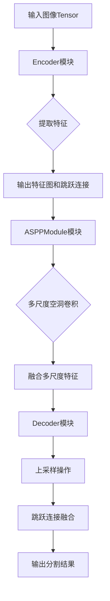
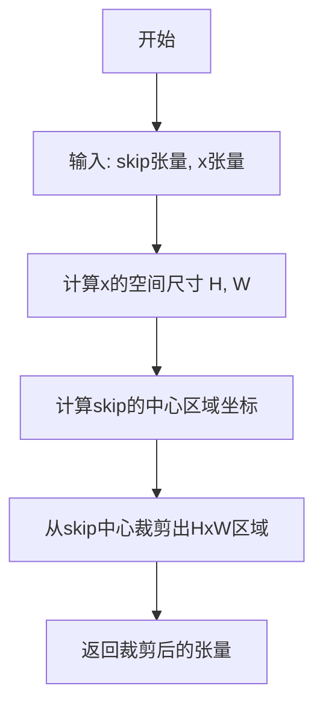
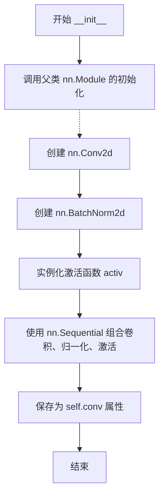
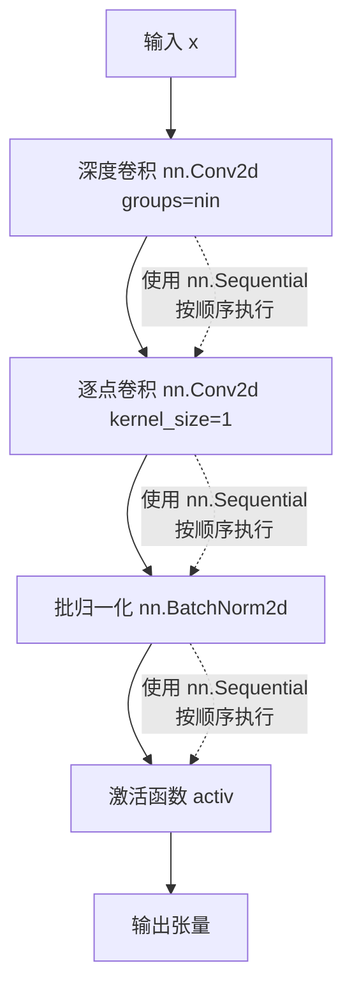
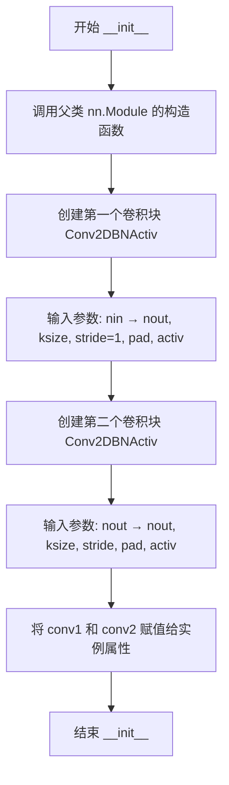
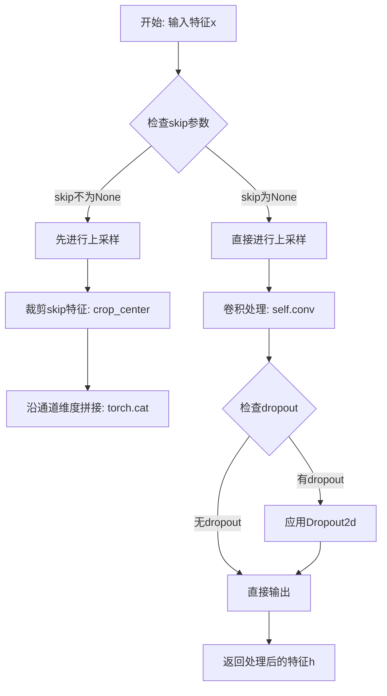
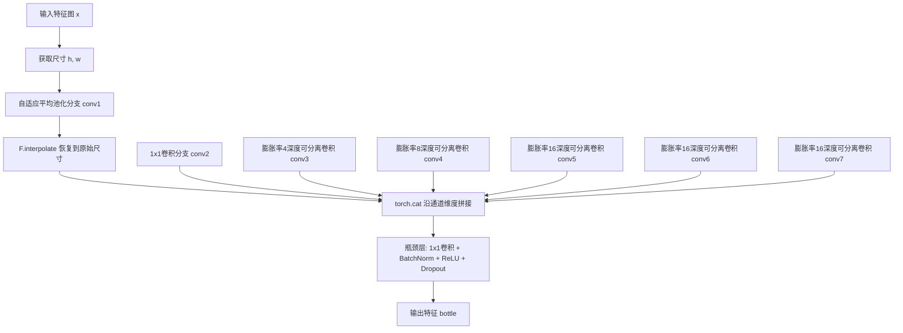
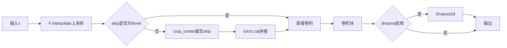
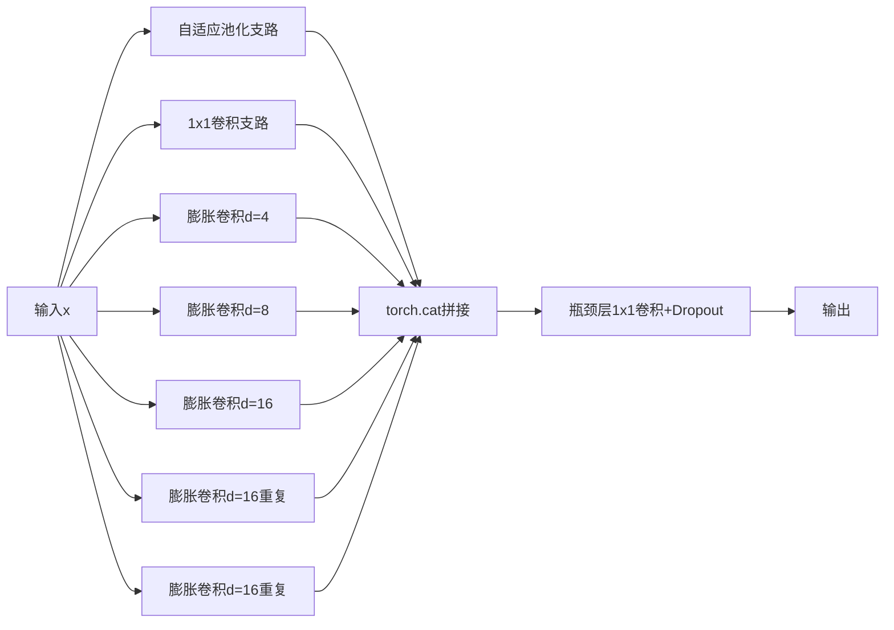

# `Chat-Haruhi-Suzumiya\yuki_builder\video_preprocessing\uvr5\uvr5_pack\lib_v5\layers_537238KB.py` 详细设计文档

该代码定义了一系列用于图像分割任务的PyTorch卷积神经网络组件，包括标准卷积块、可分离卷积块、编码器-解码器结构以及ASPP多尺度特征提取模块，用于构建完整的分割网络。

## 整体流程



## 类结构

```
Conv2DBNActiv (卷积+BN+激活基类)
SeperableConv2DBNActiv (可分离卷积变体)
Encoder (编码器)
Decoder (解码器)
ASPPModule (空洞空间金字塔池化)
```

## 全局变量及字段


### `torch`
    
PyTorch深度学习框架主模块

类型：`module`
    


### `nn`
    
PyTorch神经网络模块

类型：`module`
    


### `F`
    
PyTorch函数式API模块

类型：`module`
    


### `spec_utils`
    
自定义工具模块，用于图像中心裁剪等操作

类型：`module`
    


### `Conv2DBNActiv.conv`
    
卷积、归一化、激活序列

类型：`nn.Sequential`
    


### `SeperableConv2DBNActiv.conv`
    
可分离卷积序列

类型：`nn.Sequential`
    


### `Encoder.conv1`
    
第一个卷积块

类型：`Conv2DBNActiv`
    


### `Encoder.conv2`
    
第二个卷积块

类型：`Conv2DBNActiv`
    


### `Decoder.conv`
    
解码卷积块

类型：`Conv2DBNActiv`
    


### `Decoder.dropout`
    
可选dropout层

类型：`nn.Dropout2d or None`
    


### `ASPPModule.conv1`
    
自适应池化分支

类型：`nn.Sequential`
    


### `ASPPModule.conv2`
    
标准卷积分支

类型：`Conv2DBNActiv`
    


### `ASPPModule.conv3`
    
空洞卷积分支1

类型：`SeperableConv2DBNActiv`
    


### `ASPPModule.conv4`
    
空洞卷积分支2

类型：`SeperableConv2DBNActiv`
    


### `ASPPModule.conv5`
    
空洞卷积分支3

类型：`SeperableConv2DBNActiv`
    


### `ASPPModule.conv6`
    
空洞卷积分支4

类型：`SeperableConv2DBNActiv`
    


### `ASPPModule.conv7`
    
空洞卷积分支5

类型：`SeperableConv2DBNActiv`
    


### `ASPPModule.bottleneck`
    
瓶颈层

类型：`nn.Sequential`
    
    

## 全局函数及方法


### `spec_utils.crop_center`

该函数用于在解码器的上采样过程中，将跳跃连接（skip connection）的空间尺寸裁剪到与目标张量相同的尺寸，确保跳跃连接与上采样后的特征图能够正确拼接。

参数：

- `skip`：`torch.Tensor`，需要进行中心裁剪的跳跃连接张量，通常来自编码器，尺寸大于目标张量
- `x`：`torch.Tensor`，目标张量，通常是上采样后的特征图，裁剪后的跳跃连接将与此张量尺寸一致

返回值：`torch.Tensor`，返回裁剪后的跳跃连接张量，其空间尺寸（H, W）与目标张量 `x` 相同

#### 流程图



#### 带注释源码

```python
# 由于源码中未直接提供crop_center的实现
# 以下为基于使用方式的推断实现

def crop_center(skip, x):
    """
    对skip张量进行中心裁剪，使其空间尺寸与x张量匹配
    
    参数:
        skip: torch.Tensor, 需要裁剪的张量（跳跃连接）
        x: torch.Tensor, 目标尺寸张量（解码器特征图）
    
    返回:
        torch.Tensor, 裁剪后的skip张量
    """
    # 获取目标张量的空间维度
    _, _, h, w = x.size()
    
    # 获取skip张量的尺寸
    _, _, sh, sw = skip.size()
    
    # 计算需要裁剪的偏移量
    # 确保中心对齐，计算左上角起始位置
    offset_h = (sh - h) // 2
    offset_w = (sw - w) // 2
    
    # 使用切片进行中心裁剪
    # 保留从offset_h开始、长度为h的行
    # 保留从offset_w开始、长度为w的列
    return skip[:, :, offset_h:offset_h + h, offset_w:offset_w + w]
```

> **注意**：实际实现可能位于 `spec_utils` 模块中，但该代码片段中未包含其完整实现。上述源码为基于 `Decoder` 类中使用方式的合理推断。


### `Conv2DBNActiv.__init__`

该方法是一个卷积神经网络层的初始化方法，用于创建包含卷积层、批归一化层和激活函数的标准卷积块。该类是整个模型的基础构建模块，被Encoder、Decoder、ASPPModule等多个类复用。

参数：

- `self`：Conv2DBNActiv，类的实例本身
- `nin`：`int`，输入特征图的通道数
- `nout`：`int`，输出特征图的通道数
- `ksize`：`int`，卷积核大小，默认为 3
- `stride`：`int`，卷积步长，默认为 1
- `pad`：`int`，卷积填充大小，默认为 1
- `dilation`：`int`，卷积膨胀系数，默认为 1
- `activ`：`nn.Module`，激活函数类（而非实例），默认为 nn.ReLU

返回值：`None`，构造函数无返回值

#### 流程图



#### 带注释源码

```
def __init__(self, nin, nout, ksize=3, stride=1, pad=1, dilation=1, activ=nn.ReLU):
    """
    初始化 Conv2DBNActiv 卷积块
    
    参数:
        nin: 输入通道数
        nout: 输出通道数
        ksize: 卷积核大小
        stride: 卷积步长
        pad: 填充大小
        dilation: 膨胀卷积系数
        activ: 激活函数类 (必须是可调用的类，如 nn.ReLU)
    """
    # 调用父类 nn.Module 的初始化方法，完成 PyTorch 模块的注册
    super(Conv2DBNActiv, self).__init__()
    
    # 构建顺序卷积块: Conv2d -> BatchNorm2d -> Activation
    self.conv = nn.Sequential(
        # 二维卷积层
        nn.Conv2d(
            nin,           # 输入通道数
            nout,          # 输出通道数
            kernel_size=ksize,  # 卷积核尺寸
            stride=stride,       # 步长
            padding=pad,         # 填充
            dilation=dilation,  # 膨胀系数
            bias=False,          # 批归一化已包含偏移，此处设为 False 避免冗余参数
        ),
        # 批归一化层，对通道维度进行归一化，加速训练稳定收敛
        nn.BatchNorm2d(nout),
        # 实例化激活函数 (activ 是类不是实例，需调用 () 进行实例化)
        activ(),
    )
```


### `Conv2DBNActiv.__call__`

该方法是Conv2DBNActiv类的调用接口，接收输入张量并依次通过卷积层、批归一化层和激活函数层进行处理，最终返回处理后的特征张量。

参数：

- `x`：`torch.Tensor`，输入的2D特征张量，形状通常为(batch_size, channels, height, width)

返回值：`torch.Tensor`，经过卷积、批归一化和激活函数处理后的输出张量，形状取决于卷积参数

#### 流程图

```mermaid
graph TD
    A[输入张量 x] --> B[调用 self.conv(x)]
    B --> C[卷积层: nn.Conv2d]
    C --> D[批归一化层: nn.BatchNorm2d]
    D --> E[激活函数层: activ]
    E --> F[输出张量]
```

#### 带注释源码

```python
def __call__(self, x):
    """
    前向传播调用接口
    
    参数:
        x: 输入的2D特征张量，形状为 (batch_size, channels, height, width)
    
    返回:
        经过卷积、批归一化和激活函数处理后的张量
    """
    return self.conv(x)  # 调用模块的卷积序列进行处理
```

---

## 完整类设计文档

### `Conv2DBNActiv`

Conv2DBNActiv是一个卷积神经网络基础组件类，封装了二维卷积、批归一化和激活函数的组合，用于构建Encoder-Decoder架构中的卷积块。

#### 类字段

- `conv`：`nn.Sequential`，卷积、批归一化、激活函数的顺序组合

#### 类方法

##### `__init__`

参数：

- `nin`：`int`，输入通道数
- `nout`：`int`，输出通道数
- `ksize`：`int`，卷积核大小，默认为3
- `stride`：`int`，卷积步长，默认为1
- `pad`：`int`，填充大小，默认为1
- `dilation`：`int`，膨胀系数，默认为1
- `activ`：`nn.Module`，激活函数类型，默认为nn.ReLU

返回值：`None`，构造函数无返回值

```python
def __init__(self, nin, nout, ksize=3, stride=1, pad=1, dilation=1, activ=nn.ReLU):
    super(Conv2DBNActiv, self).__init__()
    self.conv = nn.Sequential(
        nn.Conv2d(
            nin,
            nout,
            kernel_size=ksize,
            stride=stride,
            padding=pad,
            dilation=dilation,
            bias=False,
        ),
        nn.BatchNorm2d(nout),
        activ(),
    )
```

##### `__call__`

（见上文）

#### 关键组件信息

- **卷积层**：使用nn.Conv2d进行二维卷积，bias设为False（由BatchNorm替代）
- **批归一化**：使用nn.BatchNorm2d进行特征标准化
- **激活函数**：可配置的激活函数，默认ReLU

#### 潜在技术债务与优化空间

1. **激活函数实例化时机**：每次调用__init__都会实例化激活函数，可能导致不同实例共享状态问题
2. **SeperableConv2DBNActiv类名拼写错误**：应为SeparableConv2DBNActiv
3. **缺少权重初始化**：未显式设置卷积和BatchNorm的权重初始化策略
4. **ASPP模块中的重复代码**：多个SeperableConv2DBNActiv创建可以循环简化

#### 其他设计考量

- **设计目标**：提供统一的卷积块接口，简化Encoder-Decoder架构构建
- **错误处理**：依赖PyTorch内部错误处理，输入维度不匹配时抛出RuntimeError
- **数据流**：输入张量 → 卷积 → BatchNorm → 激活 → 输出
- **外部依赖**：torch, torch.nn, torch.nn.functional


### `SeperableConv2DBNActiv.__init__`

该方法是可分离卷积（Depthwise Separable Convolution）模块的初始化方法，通过深度卷积（逐通道卷积）结合逐点卷积实现高效的卷积操作，并在卷积后依次执行批归一化和激活函数，适用于需要减少参数量和计算量的场景。

参数：

- `nin`：`int`，输入特征图的通道数
- `nout`：`int`，输出特征图的通道数
- `ksize`：`int`，卷积核大小（默认为3）
- `stride`：`int`，卷积步长（默认为1）
- `pad`：`int`，卷积填充大小（默认为1）
- `dilation`：`int`，卷积膨胀系数（默认为1）
- `activ`：`nn.Module`，激活函数类型（默认为`nn.ReLU`）

返回值：`None`，该方法仅完成模块内部结构的初始化，不返回任何值

#### 流程图

```mermaid
flowchart TD
    A[开始 __init__] --> B[调用父类 nn.Module 的初始化]
    C[创建深度卷积层: nn.Conv2d<br/>nin → nin<br/>groups=nin<br/>使用ksize/pad/stride/dilation] --> D[创建逐点卷积层: nn.Conv2d<br/>nin → nout<br/>kernel_size=1]
    E[创建批归一化层: nn.BatchNorm2d nout] --> F[创建激活函数实例: activ()]
    B --> G[使用 nn.Sequential 组装卷积模块<br/>顺序: 深度卷积 → 逐点卷积 → BN → 激活]
    D --> G
    F --> G
    G --> H[结束 __init__]
```

#### 带注释源码

```python
def __init__(self, nin, nout, ksize=3, stride=1, pad=1, dilation=1, activ=nn.ReLU):
    """
    初始化可分离卷积模块
    
    参数:
        nin: 输入通道数
        nout: 输出通道数
        ksize: 卷积核大小，默认3
        stride: 步长，默认1
        pad: 填充，默认1
        dilation: 膨胀系数，默认1
        activ: 激活函数类型，默认nn.ReLU
    """
    # 调用父类 nn.Module 的初始化方法
    super(SeperableConv2DBNActiv, self).__init__()
    
    # 构建可分离卷积序列:
    # 1. 深度卷积 (Depthwise Convolution): 每个输入通道独立进行卷积
    #    - groups=nin 表示分组数等于输入通道数，实现逐通道卷积
    #    - bias=False 因为后面跟着 BatchNorm
    self.conv = nn.Sequential(
        nn.Conv2d(
            nin,          # 输入通道数
            nin,          # 输出通道数（与输入相同，实现逐通道处理）
            kernel_size=ksize,
            stride=stride,
            padding=pad,
            dilation=dilation,
            groups=nin,   # 关键参数：分组卷积，实现深度卷积
            bias=False,   # 配合 BatchNorm 使用
        ),
        # 2. 逐点卷积 (Pointwise Convolution): 1x1 卷积改变通道数
        nn.Conv2d(nin, nout, kernel_size=1, bias=False),
        # 3. 批归一化：标准化输出
        nn.BatchNorm2d(nout),
        # 4. 激活函数：根据传入的 activ 类型实例化
        activ(),
    )
```


### `SeperableConv2DBNActiv.__call__`

这是深度可分离卷积（Depthwise Separable Convolution）模块的前向传播方法，继承自 `nn.Module` 的 `__call__` 魔术方法。该方法接收一个 4D 输入张量，通过深度卷积、逐点卷积、批归一化和激活函数组成的序列结构进行处理，并返回处理后的 4D 输出张量。

参数：

- `x`：`torch.Tensor`，输入的 4D 张量，形状为 (batch, channels, height, width)

返回值：`torch.Tensor`，经过深度可分离卷积、批归一化和激活函数处理后的 4D 张量，形状为 (batch, nout, height', width')

#### 流程图



#### 带注释源码

```python
def __call__(self, x):
    """
    前向传播方法，通过可分离卷积块处理输入张量
    
    参数:
        x: 输入的4D张量，形状为 (batch, nin, height, width)
    
    返回:
        经过深度可分离卷积、批归一化和激活函数处理的4D张量
    """
    # 使用 nn.Sequential 组合的卷积块进行处理
    # 流程：深度卷积 -> 逐点卷积 -> 批归一化 -> 激活函数
    return self.conv(x)
```


### `Encoder.__init__`

这是 `Encoder` 类的构造函数，负责初始化编码器模块。该模块是 U-Net 架构中的核心组件，用于对输入特征进行下采样并提取层级特征，同时保存跳跃连接所需的特征图供解码器使用。

参数：

- `nin`：`int`，输入通道数，指定输入特征图的通道维度
- `nout`：`int`，输出通道数，指定输出特征图的通道维度
- `ksize`：`int`，卷积核大小，默认为3，用于指定卷积操作的感受野
- `stride`：`int`，卷积步长，默认为1，用于控制特征图的降采样比例
- `pad`：`int`，填充大小，默认为1，用于维持特征图的空间维度
- `activ`：`nn.Module`，激活函数类型，默认为 `nn.LeakyReLU`，用于引入非线性变换

返回值：`None`，构造函数不返回任何值，仅初始化对象状态

#### 流程图



#### 带注释源码

```python
def __init__(self, nin, nout, ksize=3, stride=1, pad=1, activ=nn.LeakyReLU):
    """
    初始化 Encoder 编码器模块
    
    参数:
        nin: 输入通道数
        nout: 输出通道数
        ksize: 卷积核大小，默认3
        stride: 步长，默认1（第二层卷积使用该参数进行下采样）
        pad: 填充大小，默认1
        activ: 激活函数类型，默认 nn.LeakyReLU
    """
    # 调用父类 nn.Module 的构造函数，完成 PyTorch 模块的初始化
    # 这会自动注册所有子模块和参数，使模型能够被正确追踪和管理
    super(Encoder, self).__init__()
    
    # 创建第一个卷积块：保持空间维度不变，仅进行通道数变换
    # 输入: nin 通道 -> 输出: nout 通道
    # 使用 stride=1 确保输出与输入空间维度相同
    self.conv1 = Conv2DBNActiv(nin, nout, ksize, 1, pad, activ=activ)
    
    # 创建第二个卷积块：进行下采样和特征提取
    # 输入: nout 通道 -> 输出: nout 通道（通道数保持不变）
    # 使用传入的 stride 参数实现空间维度的下采样（如 stride=2 则尺寸减半）
    # 同时保存 skip 连接所需的特征图，供解码器进行上采样时使用
    self.conv2 = Conv2DBNActiv(nout, nout, ksize, stride, pad, activ=activ)
```


### `Encoder.__call__`

该方法是 Encoder 类的可调用接口，实现了编码器的前向传播逻辑。通过两层卷积块对输入特征进行编码，同时保留第一层的输出作为跳跃连接（skip connection）供解码器使用，实现编码-解码架构中的特征传递。

参数：

- `x`：`torch.Tensor`，输入张量，通常为前一层的特征图，形状为 (batch_size, channels, height, width)

返回值：`Tuple[torch.Tensor, torch.Tensor]`，返回一个元组：

- `h`：`torch.Tensor`，经过两层卷积编码后的特征图，用于解码器的主路径
- `skip`：`torch.Tensor`，第一层卷积的输出，用于解码器的跳跃连接，帮助恢复空间细节

#### 流程图

```mermaid
flowchart TD
    A[输入 x] --> B[conv1: Conv2DBNActiv]
    B --> C[skip = conv1(x)]
    C --> D[conv2: Conv2DBNActiv]
    D --> E[h = conv2(skip)]
    E --> F[返回 (h, skip)]
    
    style A fill:#f9f,color:#000
    style F fill:#9f9,color:#000
```

#### 带注释源码

```
def __call__(self, x):
    """
    Encoder 的前向传播方法，通过卷积块对输入进行编码
    
    参数:
        x: 输入张量，形状为 (batch, cin, h, w)
    
    返回:
        tuple: (h, skip) - 编码后的特征图和跳跃连接
    """
    # 第一层卷积：对输入进行通道数变换，生成跳跃连接特征
    # 输入 x: (batch, nin, h, w) -> skip: (batch, nout, h, w)
    skip = self.conv1(x)
    
    # 第二层卷积：在第一层输出基础上进行下采样（stride>1时）和特征提取
    # skip: (batch, nout, h, w) -> h: (batch, nout, h/stride, w/stride)
    h = self.conv2(skip)
    
    # 返回编码特征 h（主路径）和 skip（跳跃连接）
    # skip 将传递给 Decoder 用于恢复细节
    return h, skip
```


### `Decoder.__init__`

该方法为 Decoder 类（解码器）的初始化方法，负责构建解码器的基本网络结构。它接受输入通道数、输出通道数、卷积核大小、步长、填充、激活函数类型和是否使用 dropout 等参数，创建一个卷积层（Conv2DBNActiv），并根据 dropout 参数条件性地创建 Dropout 层。

参数：

- `self`：`Decoder`，Decoder 类的实例对象，代表当前初始化的解码器模块本身
- `nin`：`int`，输入特征图的通道数（number of input channels）
- `nout`：`int`，输出特征图的通道数（number of output channels）
- `ksize`：`int`，卷积核大小，默认为 3
- `stride`：`int`，卷积步长，默认为 1
- `pad`：`int`，卷积填充大小，默认为 1
- `activ`：`nn.Module`，激活函数类型，默认为 `nn.ReLU`
- `dropout`：`bool`，是否使用 dropout，默认为 `False`

返回值：`None`，`__init__` 方法不返回任何值

#### 流程图

```mermaid
flowchart TD
    A[开始 __init__] --> B[调用 super().__init__ 初始化父类 nn.Module]
    C[创建 Conv2DBNActiv 卷积层] --> D[参数: nin, nout, ksize, stride=1, pad, activ]
    D --> E{参数 dropout == True?}
    E -->|是| F[创建 nn.Dropout2d p=0.1]
    E -->|否| G[设置 self.dropout = None]
    F --> H[结束初始化]
    G --> H
    B --> C
```

#### 带注释源码

```python
def __init__(
    self, nin, nout, ksize=3, stride=1, pad=1, activ=nn.ReLU, dropout=False
):
    """
    初始化 Decoder 解码器模块

    参数:
        nin: 输入通道数
        nout: 输出通道数
        ksize: 卷积核大小，默认为 3
        stride: 卷积步长，默认为 1
        pad: 卷积填充大小，默认为 1
        activ: 激活函数类型，默认为 nn.ReLU
        dropout: 是否使用 dropout，默认为 False
    """
    # 调用父类 nn.Module 的初始化方法，注册所有子模块
    super(Decoder, self).__init__()
    
    # 创建 Conv2DBNActiv 卷积层：
    # - nin -> nout：输入通道到输出通道的映射
    # - ksize：卷积核大小
    # - stride=1：保持空间分辨率（因为上采样由 F.interpolate 处理）
    # - pad：填充大小
    # - activ：激活函数
    self.conv = Conv2DBNActiv(nin, nout, ksize, 1, pad, activ=activ)
    
    # 根据 dropout 参数条件性地创建 Dropout 层
    # 如果 dropout=True，则创建 nn.Dropout2d(0.1)，否则为 None
    self.dropout = nn.Dropout2d(0.1) if dropout else None
```


### `Decoder.__call__`

该方法是Decoder类的核心调用接口，负责将编码器产生的特征图进行上采样并与跳跃连接的特征进行融合，以恢复空间分辨率并重构输出特征。

参数：

- `x`：`torch.Tensor`，输入的特征张量，通常来自上一层的输出或编码器的特征
- `skip`：`Optional[torch.Tensor]`，可选的跳跃连接特征张量，来自编码器的对应层，用于特征融合

返回值：`torch.Tensor`，经过上采样、特征融合和卷积处理后的输出特征张量

#### 流程图



#### 带注释源码

```python
def __call__(self, x, skip=None):
    """
    Decoder的前向传播方法，执行上采样、特征融合和卷积操作
    
    参数:
        x: 输入特征张量
        skip: 可选的跳跃连接特征张量，用于特征融合
    
    返回:
        处理后的特征张量
    """
    # 步骤1: 使用双线性插值进行2倍上采样，将特征图的空间尺寸放大
    x = F.interpolate(x, scale_factor=2, mode="bilinear", align_corners=True)
    
    # 步骤2: 检查是否存在跳跃连接特征
    if skip is not None:
        # 对跳跃连接特征进行中心裁剪，使其与上采样后的特征图尺寸匹配
        skip = spec_utils.crop_center(skip, x)
        # 沿通道维度(dim=1)拼接两个特征图，实现特征融合
        x = torch.cat([x, skip], dim=1)
    
    # 步骤3: 通过卷积块处理融合后的特征，调整通道数
    h = self.conv(x)

    # 步骤4: 如果启用了dropout，则应用Dropout2d进行正则化
    if self.dropout is not None:
        h = self.dropout(h)

    # 步骤5: 返回解码后的特征张量
    return h
```


### `ASPPModule.__init__`

ASPPModule类的初始化方法，用于构建空洞空间金字塔池化（Atrous Spatial Pyramid Pooling）模块，该模块通过多尺度空洞卷积捕获不同感受野的特征，并通过自适应池化和1x1卷积提取全局上下文信息，最后通过瓶颈层融合并压缩特征。

参数：

- `self`：隐式参数，ASPPModule实例本身
- `nin`：`int`，输入特征图的通道数
- `nout`：`int`，输出特征图的通道数
- `dilations`：`tuple`，空洞卷积的膨胀率元组，默认为(4, 8, 16, 32, 64)，用于控制不同分支的采样间隔
- `activ`：`nn.Module`，激活函数类型，默认为nn.ReLU

返回值：无（`__init__`方法返回None）

#### 流程图

```mermaid
flowchart TD
    A[开始 __init__] --> B[调用父类 nn.Module 的 __init__]
    B --> C[创建 conv1: AdaptiveAvgPool2d + Conv2DBNActiv]
    C --> D[创建 conv2: 标准 Conv2DBNActiv 1x1卷积]
    D --> E[创建 conv3: SeperableConv2DBNActiv 膨胀率dilations[0]]
    E --> F[创建 conv4: SeperableConv2DBNActiv 膨胀率dilations[1]]
    F --> G[创建 conv5: SeperableConv2DBNActiv 膨胀率dilations[2]]
    G --> H[创建 conv6: SeperableConv2DBNActiv 膨胀率dilations[2]]
    H --> I[创建 conv7: SeperableConv2DBNActiv 膨胀率dilations[2]]
    I --> J[创建 bottleneck: Conv2DBNActiv + Dropout2d]
    J --> K[结束 __init__]
```

#### 带注释源码

```
def __init__(self, nin, nout, dilations=(4, 8, 16, 32, 64), activ=nn.ReLU):
    # 调用父类nn.Module的初始化方法，完成PyTorch模块的基本初始化
    super(ASPPModule, self).__init__()
    
    # 第一个分支：自适应平均池化分支
    # 使用AdaptiveAvgPool2d将特征图在高度维度压缩为1，保留宽度维度
    # 然后通过1x1卷积进行通道压缩
    self.conv1 = nn.Sequential(
        nn.AdaptiveAvgPool2d((1, None)),  # 自适应池化，将h维度压缩为1
        Conv2DBNActiv(nin, nin, 1, 1, 0, activ=activ),  # 1x1卷积，保持通道数不变
    )
    
    # 第二个分支：标准1x1卷积，直接对输入进行通道变换
    self.conv2 = Conv2DBNActiv(nin, nin, 1, 1, 0, activ=activ)
    
    # 第三到七个分支：空洞可分离卷积，使用不同的膨胀率捕获多尺度信息
    # conv3使用dilations[0]的膨胀率（默认4）
    self.conv3 = SeperableConv2DBNActiv(
        nin, nin, 3, 1, dilations[0], dilations[0], activ=activ
    )
    
    # conv4使用dilations[1]的膨胀率（默认8）
    self.conv4 = SeperableConv2DBNActiv(
        nin, nin, 3, 1, dilations[1], dilations[1], activ=activ
    )
    
    # conv5使用dilations[2]的膨胀率（默认16）
    self.conv5 = SeperableConv2DBNActiv(
        nin, nin, 3, 1, dilations[2], dilations[2], activ=activ
    )
    
    # conv6同样使用dilations[2]的膨胀率（默认16），重复分支增加特征多样性
    self.conv6 = SeperableConv2DBNActiv(
        nin, nin, 3, 1, dilations[2], dilations[2], activ=activ
    )
    
    # conv7同样使用dilations[2]的膨胀率（默认16），再次重复
    self.conv7 = SeperableConv2DBNActiv(
        nin, nin, 3, 1, dilations[2], dilations[2], activ=activ
    )
    
    # 瓶颈层：将7个分支拼接后的特征（nin*7通道）压缩到目标输出通道数nout
    # 并添加Dropout防止过拟合
    self.bottleneck = nn.Sequential(
        Conv2DBNActiv(nin * 7, nout, 1, 1, 0, activ=activ),  # 1x1卷积进行通道压缩
        nn.Dropout2d(0.1)  # 10%的dropout比率
    )
```


### ASPPModule.forward

该方法实现了Atrous Spatial Pyramid Pooling（ASPP）模块的前向传播，通过多分支并行处理输入特征图，包括自适应平均池化分支、1x1卷积分支和多个不同膨胀率的深度可分离卷积分支，以捕获多尺度语义信息，最后通过通道级联和瓶颈层输出融合后的特征表示。

参数：

- `self`：`ASPPModule`，ASPP模块实例本身，包含多个卷积分支和瓶颈层
- `x`：`torch.Tensor`，输入的四维张量，形状为 (batch_size, channels, height, width)，代表上一层的特征图

返回值：`torch.Tensor`，经过ASPP多尺度特征融合和瓶颈层处理后的输出张量，形状为 (batch_size, nout, height, width)，其中 nout 是输出通道数

#### 流程图



#### 带注释源码

```python
def forward(self, x):
    """
    ASPP模块的前向传播方法
    
    实现多尺度特征提取和融合的Atrous Spatial Pyramid Pooling结构
    
    参数:
        x: 输入特征图，形状为 (batch_size, channels, height, width)
    
    返回值:
        经过多尺度融合和瓶颈层处理后的特征图
    """
    # 获取输入特征图的spatial尺寸（高和宽）
    _, _, h, w = x.size()
    
    # 分支1: 自适应平均池化分支
    # 先通过自适应平均池化将特征图压缩到 (1, None) 形状，
    # 即在高度维度压缩为1，宽度方向保留，然后在通道维度应用1x1卷积，
    # 最后通过插值恢复到原始尺寸h*w
    # 这种设计可以捕获全局上下文信息
    feat1 = F.interpolate(
        self.conv1(x), size=(h, w), mode="bilinear", align_corners=True
    )
    
    # 分支2: 1x1卷积分支
    # 捕获最基础的局部特征，不进行下采样
    feat2 = self.conv2(x)
    
    # 分支3-5: 不同膨胀率的深度可分离卷积分支
    # 使用较大的膨胀率(4, 8, 16)来扩大感受野，捕获多尺度语义信息
    # 深度可分离卷积可以显著减少参数量和计算量
    feat3 = self.conv3(x)
    feat4 = self.conv4(x)
    feat5 = self.conv5(x)
    
    # 分支6-7: 额外的膨胀率为16的深度可分离卷积分支
    # 重复使用相同的膨胀率，可能是为了增加模型容量或特征复用
    feat6 = self.conv6(x)
    feat7 = self.conv7(x)
    
    # 通道级联: 将7个分支的特征在通道维度(dim=1)拼接
    # 拼接后通道数变为原来的7倍
    out = torch.cat((feat1, feat2, feat3, feat4, feat5, feat6, feat7), dim=1)
    
    # 瓶颈层: 1x1卷积将通道数压缩到目标输出通道数nout
    # 同时进行BatchNorm归一化和ReLU激活
    # Dropout(0.1)用于防止过拟合
    bottle = self.bottleneck(out)
    
    # 返回处理后的特征图
    return bottle
```

## 关键组件


### 一段话描述

该代码定义了一套基于PyTorch的卷积神经网络模块，包含标准卷积块、可分离卷积块、编码器、解码器以及ASPP（Atrous Spatial Pyramid Pooling）模块，主要用于图像分割任务的特征提取与重建，采用了残差连接和多种膨胀卷积来获取多尺度上下文信息。

### 文件的整体运行流程

该文件定义了5个神经网络类，整体构成了一个Encoder-Decoder架构。Encoder负责提取特征并保存skip connection；Decoder通过上采样和skip connection恢复空间分辨率；ASPP模块通过多个膨胀率的可分离卷积捕获多尺度特征。数据流从Encoder输入，经过ASPP处理后送入Decoder输出，最终得到分割结果。

### 类的详细信息

#### Conv2DBNActiv 类

**类字段：**

| 名称 | 类型 | 描述 |
|------|------|------|
| conv | nn.Sequential | 包含Conv2d、BatchNorm2d和激活函数的顺序容器 |

**类方法：**

**__init__方法**

| 参数名称 | 参数类型 | 参数描述 |
|----------|----------|----------|
| nin | int | 输入通道数 |
| nout | 输出通道数 |
| ksize | int | 卷积核大小，默认为3 |
| stride | int | 步长，默认为1 |
| pad | int | 填充大小，默认为1 |
| dilation | int | 膨胀系数，默认为1 |
| activ | nn.Module | 激活函数类，默认为nn.ReLU |

返回值类型: None

返回值描述: 初始化卷积块各层

**__call__方法**

| 参数名称 | 参数类型 | 参数描述 |
|----------|----------|----------|
| x | torch.Tensor | 输入张量 |

返回值类型: torch.Tensor

返回值描述: 经过卷积、归一化、激活处理后的输出张量

**mermaid流程图：**


**带注释源码：**

```python
def __init__(self, nin, nout, ksize=3, stride=1, pad=1, dilation=1, activ=nn.ReLU):
    super(Conv2DBNActiv, self).__init__()
    # 构建顺序卷积块：卷积层 -> 批归一化 -> 激活函数
    self.conv = nn.Sequential(
        nn.Conv2d(
            nin,
            nout,
            kernel_size=ksize,
            stride=stride,
            padding=pad,
            dilation=dilation,
            bias=False,  # 使用BatchNorm时不需要偏置
        ),
        nn.BatchNorm2d(nout),
        activ(),
    )

def __call__(self, x):
    return self.conv(x)
```

---

#### SeperableConv2DBNActiv 类

**类字段：**

| 名称 | 类型 | 描述 |
|------|------|------|
| conv | nn.Sequential | 包含深度卷积、逐点卷积、批归一化和激活函数的顺序容器 |

**类方法：**

**__init__方法**

| 参数名称 | 参数类型 | 参数描述 |
|----------|----------|----------|
| nin | int | 输入通道数 |
| nout | 输出通道数 |
| ksize | int | 卷积核大小 |
| stride | int | 步长 |
| pad | int | 填充大小 |
| dilation | int | 膨胀系数 |
| activ | nn.Module | 激活函数类 |

返回值类型: None

返回值描述: 初始化可分离卷积块

**__call__方法**

| 参数名称 | 参数类型 | 参数描述 |
|----------|----------|----------|
| x | torch.Tensor | 输入张量 |

返回值类型: torch.Tensor

返回值描述: 经过可分离卷积处理后的输出张量

**mermaid流程图：**


**带注释源码：**

```python
def __init__(self, nin, nout, ksize=3, stride=1, pad=1, dilation=1, activ=nn.ReLU):
    super(SeperableConv2DBNActiv, self).__init__()
    # 可分离卷积：先进行分组深度卷积，再用1x1卷积融合通道
    self.conv = nn.Sequential(
        nn.Conv2d(
            nin,
            nin,
            kernel_size=ksize,
            stride=stride,
            padding=pad,
            dilation=dilation,
            groups=nin,  # 深度卷积：每个输入通道独立卷积
            bias=False,
        ),
        nn.Conv2d(nin, nout, kernel_size=1, bias=False),  # 逐点卷积融合通道
        nn.BatchNorm2d(nout),
        activ(),
    )

def __call__(self, x):
    return self.conv(x)
```

---

#### Encoder 类

**类字段：**

| 名称 | 类型 | 描述 |
|------|------|------|
| conv1 | Conv2DBNActiv | 第一个卷积块 |
| conv2 | Conv2DBNActiv | 第二个卷积块 |

**类方法：**

**__init__方法**

| 参数名称 | 参数类型 | 参数描述 |
|----------|----------|----------|
| nin | int | 输入通道数 |
| nout | 输出通道数 |
| ksize | int | 卷积核大小 |
| stride | int | 步长 |
| pad | int | 填充大小 |
| activ | nn.Module | 激活函数类 |

返回值类型: None

返回值描述: 初始化编码器

**__call__方法**

| 参数名称 | 参数类型 | 参数描述 |
|----------|----------|----------|
| x | torch.Tensor | 输入张量 |

返回值类型: Tuple[torch.Tensor, torch.Tensor]

返回值描述: 返回主特征h和跳跃连接skip

**mermaid流程图：**


**带注释源码：**

```python
class Encoder(nn.Module):
    def __init__(self, nin, nout, ksize=3, stride=1, pad=1, activ=nn.LeakyReLU):
        super(Encoder, self).__init__()
        # 第一个卷积保持空间分辨率
        self.conv1 = Conv2DBNActiv(nin, nout, ksize, 1, pad, activ=activ)
        # 第二个卷积可能改变空间分辨率（stride>1时）
        self.conv2 = Conv2DBNActiv(nout, nout, ksize, stride, pad, activ=activ)

    def __call__(self, x):
        skip = self.conv1(x)  # 保存第一层输出用于跳跃连接
        h = self.conv2(skip)  # 第二层卷积输出

        return h, skip
```

---

#### Decoder 类

**类字段：**

| 名称 | 类型 | 描述 |
|------|------|------|
| conv | Conv2DBNActiv | 卷积块 |
| dropout | nn.Dropout2d 或 None | 可选dropout层 |

**类方法：**

**__init__方法**

| 参数名称 | 参数类型 | 参数描述 |
|----------|----------|----------|
| nin | int | 输入通道数 |
| nout | 输出通道数 |
| ksize | int | 卷积核大小 |
| stride | int | 步长 |
| pad | int | 填充大小 |
| activ | nn.Module | 激活函数类 |
| dropout | bool | 是否使用dropout |

返回值类型: None

返回值描述: 初始化解码器

**__call__方法**

| 参数名称 | 参数类型 | 参数描述 |
|----------|----------|----------|
| x | torch.Tensor | 输入张量 |
| skip | torch.Tensor 或 None | 跳跃连接张量 |

返回值类型: torch.Tensor

返回值描述: 解码后的特征张量

**mermaid流程图：**



**带注释源码：**

```python
class Decoder(nn.Module):
    def __init__(
        self, nin, nout, ksize=3, stride=1, pad=1, activ=nn.ReLU, dropout=False
    ):
        super(Decoder, self).__init__()
        self.conv = Conv2DBNActiv(nin, nout, ksize, 1, pad, activ=activ)
        # 可选dropout，概率固定为0.1
        self.dropout = nn.Dropout2d(0.1) if dropout else None

    def __call__(self, x, skip=None):
        # 双线性插值上采样2倍
        x = F.interpolate(x, scale_factor=2, mode="bilinear", align_corners=True)
        if skip is not None:
            # 裁剪skip特征图以匹配当前尺寸
            skip = spec_utils.crop_center(skip, x)
            # 沿通道维度拼接
            x = torch.cat([x, skip], dim=1)
        h = self.conv(x)

        if self.dropout is not None:
            h = self.dropout(h)

        return h
```

---

#### ASPPModule 类

**类字段：**

| 名称 | 类型 | 描述 |
|------|------|------|
| conv1 | nn.Sequential | 自适应池化支路 |
| conv2 | Conv2DBNActiv | 1x1卷积支路 |
| conv3-7 | SeperableConv2DBNActiv | 5个不同膨胀率的可分离卷积支路 |
| bottleneck | nn.Sequential | 瓶颈层 |

**类方法：**

**__init__方法**

| 参数名称 | 参数类型 | 参数描述 |
|----------|----------|----------|
| nin | int | 输入通道数 |
| nout | 输出通道数 |
| dilations | tuple | 膨胀率元组，默认(4,8,16,32,64) |
| activ | nn.Module | 激活函数类 |

返回值类型: None

返回值描述: 初始化ASPP模块

**forward方法**

| 参数名称 | 参数类型 | 参数描述 |
|----------|----------|----------|
| x | torch.Tensor | 输入张量 |

返回值类型: torch.Tensor

返回值描述: 多尺度特征融合后的输出

**mermaid流程图：**



**带注释源码：**

```python
class ASPPModule(nn.Module):
    def __init__(self, nin, nout, dilations=(4, 8, 16, 32, 64), activ=nn.ReLU):
        super(ASPPModule, self).__init__()
        # 支路1：自适应平均池化，将空间维度池化到(1, None)然后插值回原尺寸
        self.conv1 = nn.Sequential(
            nn.AdaptiveAvgPool2d((1, None)),
            Conv2DBNActiv(nin, nin, 1, 1, 0, activ=activ),
        )
        # 支路2：1x1卷积
        self.conv2 = Conv2DBNActiv(nin, nin, 1, 1, 0, activ=activ)
        # 支路3-7：不同膨胀率的可分离卷积
        self.conv3 = SeperableConv2DBNActiv(
            nin, nin, 3, 1, dilations[0], dilations[0], activ=activ
        )
        self.conv4 = SeperableConv2DBNActiv(
            nin, nin, 3, 1, dilations[1], dilations[1], activ=activ
        )
        self.conv5 = SeperableConv2DBNActiv(
            nin, nin, 3, 1, dilations[2], dilations[2], activ=activ
        )
        self.conv6 = SeperableConv2DBNActiv(
            nin, nin, 3, 1, dilations[2], dilations[2], activ=activ
        )
        self.conv7 = SeperableConv2DBNActiv(
            nin, nin, 3, 1, dilations[2], dilations[2], activ=activ
        )
        # 瓶颈层：将7个支路的特征拼接后压缩
        self.bottleneck = nn.Sequential(
            Conv2DBNActiv(nin * 7, nout, 1, 1, 0, activ=activ), nn.Dropout2d(0.1)
        )

    def forward(self, x):
        _, _, h, w = x.size()
        # 自适应池化支路需要插值回原尺寸
        feat1 = F.interpolate(
            self.conv1(x), size=(h, w), mode="bilinear", align_corners=True
        )
        feat2 = self.conv2(x)
        feat3 = self.conv3(x)
        feat4 = self.conv4(x)
        feat5 = self.conv5(x)
        feat6 = self.conv6(x)
        feat7 = self.conv7(x)
        # 沿通道维度拼接7个支路的特征
        out = torch.cat((feat1, feat2, feat3, feat4, feat5, feat6, feat7), dim=1)
        bottle = self.bottleneck(out)
        return bottle
```

---

### 关键组件信息

#### Conv2DBNActiv - 标准卷积归一化激活块

卷积+批归一化+激活函数的组合块，是网络的基础构建单元。

#### SeperableConv2DBNActiv - 可分离卷积块

深度可分离卷积实现，通过分组卷积减少参数量和计算量。

#### Encoder - 编码器模块

采用双层卷积结构并输出skip connection，用于特征提取和多尺度信息保存。

#### Decoder - 解码器模块

通过上采样和skip connection恢复空间分辨率，支持可选dropout正则化。

#### ASPPModule - 多尺度空洞卷积模块

通过多个膨胀率的可分离卷积捕获不同感受野的多尺度上下文信息。

---

### 潜在的技术债务或优化空间

1. **类名拼写错误**：Seperable应为Separable，影响代码可读性

2. **ASPP模块重复代码**：conv5、conv6、conv7使用相同的膨胀率(dilations[2])，存在代码冗余

3. **硬编码的dropout概率**：Decoder和ASPP中dropout概率固定为0.1，应考虑参数化

4. **缺少权重初始化**：各卷积层未显式指定权重初始化方法，依赖PyTorch默认初始化

5. **外部依赖未抽象**：spec_utils.crop_center函数直接调用，未做异常处理

6. **ASPP模块池化支路效率**：自适应池化后插值可能引入插值误差，可考虑其他方式

---

### 其它项目

#### 设计目标与约束

- 采用残差连接（skip connection）保留细节信息
- 使用可分离卷积降低计算复杂度
- ASPP模块提供多尺度感受野
- 激活函数可配置，支持LeakyReLU和ReLU

#### 错误处理与异常设计

- 依赖外部spec_utils模块的crop_center函数，未做异常捕获
- 缺少输入尺寸验证
- 未对dilations参数进行有效性检查

#### 数据流与状态机

- Encoder: 输入 → conv1 → skip → conv2 → (主特征, skip)
- Decoder: 输入 → 上采样 → (拼接skip) → 卷积 → (可选dropout) → 输出
- ASPP: 输入 → 7个并行支路 → 拼接 → 瓶颈压缩 → 输出

#### 外部依赖与接口契约

- 依赖torch.nn和torch.nn.functional
- 依赖spec_utils模块的crop_center函数
- Decoder的__call__方法接受可选的skip参数
- ASPP使用双线性插值需指定align_corners=True

## 问题及建议


### 已知问题

-   **拼写错误**：类名 `SeperableConv2DBNActiv` 中的 "Seperable" 应为 "Separable"，这是一个技术债务，会影响代码可读性。
-   **ASPPModule 参数复用错误**：代码中 `conv5`、`conv6`、`conv7` 均使用了 `dilations[2]`，而参数列表定义了5个膨胀率 `(4, 8, 16, 32, 64)`，但实际只使用了前三个（4, 8, 16），这是复制粘贴导致的逻辑错误，导致多孔空间金字塔池化未完全实现。
-   **硬编码的超参数**：`Decoder` 和 `ASPPModule` 中的 dropout 概率（0.1）硬编码在类定义中，降低了灵活性和可配置性。
-   **混合使用 old-style 前向传播**：部分类使用 `__call__` 实现前向传播（如 `Conv2DBNActiv`、`Encoder`、`Decoder`），而 `ASPPModule` 使用标准的 `forward` 方法，风格不统一。
-   **激活函数实例化方式不当**：`activ=nn.ReLU` 传递的是类而非实例，导致每次调用都会创建新的激活函数对象，建议改为 `activ=nn.ReLU`（可调用类）或 `activ=nn.ReLU()`（已实例化）。
-   **缺少类型注解**：所有方法均缺少参数和返回值的类型提示（Type Hints），影响代码可维护性和 IDE 支持。
-   **nout 类型不一致潜在风险**：`Decoder` 中 `torch.cat([x, skip], dim=1)` 假设 skip 维度正确，未进行维度校验，可能在输入尺寸不匹配时产生难以追踪的错误。

### 优化建议

-   修正 `SeperableConv2DBNActiv` 拼写为 `SeparableConv2DBNActiv`，并同步修改所有引用。
-   修正 ASPPModule 中 `conv5/6/7` 的 dilation 参数，应分别使用 `dilations[3]`, `dilations[4]`，或根据实际需求调整。
-   将 dropout 概率改为构造函数参数，支持运行时配置。
-   统一使用 `forward` 方法实现前向传播，移除 `__call__` 重写。
-   统一激活函数的使用方式，建议在 `Conv2DBNActiv` 内部使用 `activ()` 或接收已实例化的激活函数对象。
-   为所有类方法添加类型注解（PEP 484），提高代码可读性和可维护性。
-   在 `Decoder` 的 `forward` 方法中添加维度兼容性检查，确保 skip 与 x 在拼接前尺寸匹配。
-   考虑将 `spec_utils.crop_center` 的调用包装在异常处理中，提供更友好的错误信息。


## 其它


### 设计目标与约束

本模块旨在构建一个用于图像分割任务的U-Net风格编码器-解码器架构，支持多尺度特征提取和跳跃连接。设计目标包括：1）实现高效的卷积块复用，通过Conv2DBNActiv和SeperableConv2DBNActiv提供可配置的卷积、归一化和激活组合；2）支持多尺度特征融合，通过ASPPModule实现不同膨胀率的空洞卷积；3）通过Encoder-Decoder结构配合跳跃连接实现细粒度分割。约束条件包括：仅支持PyTorch 1.x版本，需使用nn.Module作为基类，输入张量需为4D (N,C,H,W) 格式。

### 错误处理与异常设计

代码本身未实现显式的错误处理机制，但通过PyTorch自动求导系统进行梯度检查。主要异常场景包括：1）输入维度不匹配时，PyTorch会抛出RuntimeError；2）卷积参数（ksize, stride, pad, dilation）组合导致计算出的特征图尺寸为负数时，会触发torch.nn.Conv2d的AssertionError；3）ASPPModule中dilations参数过长可能导致内存溢出。建议在调用前进行输入尺寸验证，确保 (H - ksize + 2*pad)/stride + 1 > 0，并添加维度检查断言。

### 数据流与状态机

数据流主要分为三条路径：1）编码路径：输入图像 → Encoder.conv1 → Encoder.conv2 → 输出特征与跳跃连接；2）解码路径：编码器输出 → F.interpolate上采样 → crop_center裁剪跳跃连接 → torch.cat拼接 → Decoder.conv → 输出；3）ASPP路径：输入特征 → 7个并行分支（1个自适应池化+6个不同膨胀率卷积） → torch.cat融合 → bottleneck卷积 → 输出。状态机转换主要体现在Decoder的迭代上采样过程，每层Decoder接收上一层的输出和对应跳跃连接，输出新的特征表示。

### 外部依赖与接口契约

主要依赖包括：1）torch (PyTorch核心库)；2）torch.nn (神经网络基础模块)；3）torch.nn.functional (函数式接口，主要用于F.interpolate和F.dropout)；4）spec_utils (项目内部模块，提供crop_center函数)。接口契约方面：所有Module子类均实现__call__方法使其可调用；Encoder返回(h, skip)元组；Decoder接收(x, skip)参数，skip可为None；ASPPModule使用forward而非__call__实现；所有卷积层输入输出均为4D张量 (N,C,H,W)。

### 性能考量与优化建议

1）内存优化：Decoder中的dropout和ASPPModule中的Dropout2d可减少过拟合，但会增加内存消耗；2）计算优化：SeperableConv2DBNActiv使用深度可分离卷积减少参数量，适用于移动端部署；3）推理速度：ASPPModule的6个SeperableConv2DBNActiv可考虑并行化或渐进式计算；4）数值精度：默认使用float32，可通过torch.set_default_dtype调整为float16以加速推理。建议在生产环境中使用torch.jit.script编译关键模块，并考虑使用quantization进行模型压缩。

### 版本兼容性说明

本代码基于PyTorch 1.x设计，未使用torch 2.0+的新特性如torch.compile。F.interpolate的align_corners参数在PyTorch 0.4.1+可用，crop_center函数依赖spec_utils模块需确保版本兼容。ASPPModule中的dilations参数使用了5个值但实际使用了6个卷积分支（dilations[2]重复使用3次），这可能是设计遗留问题。nn.Dropout2d在PyTorch 1.0+版本中已废弃warnings，建议替换为nn.functional.dropout2d并指定training参数。

### 测试与验证要点

关键测试场景包括：1）维度传播测试：验证Encoder-Decoder链式调用输出尺寸正确；2）梯度流测试：确保反向传播可到达所有参数；3）ASPP输出测试：验证7个分支输出尺寸一致；4）裁剪对齐测试：验证Decoder中skip和x尺寸匹配；5）模型加载测试：验证torch.save/load周期正常工作。建议使用torch.no_grad()进行推理测试，并使用torch.inference_mode()（PyTorch 1.8+）进一步优化。

    