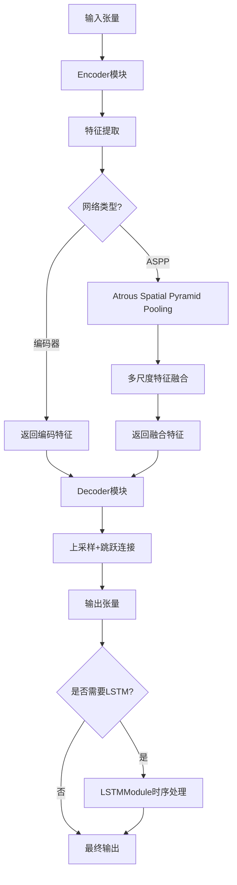
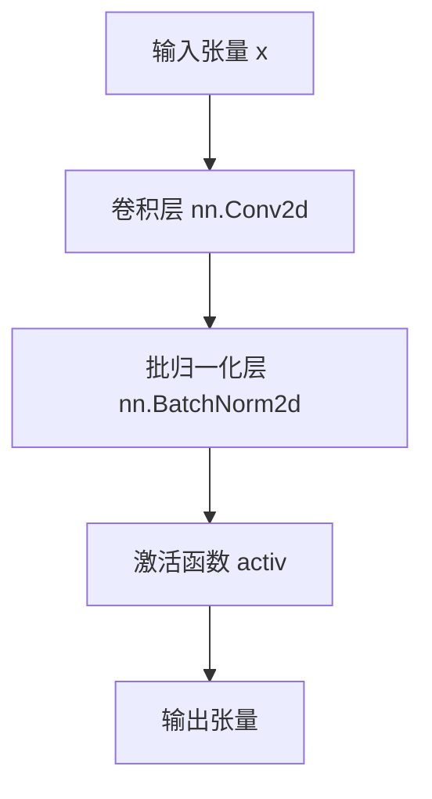
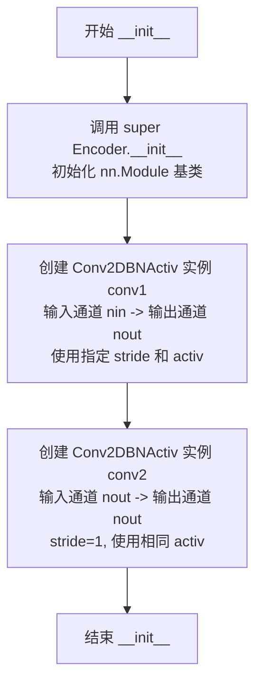
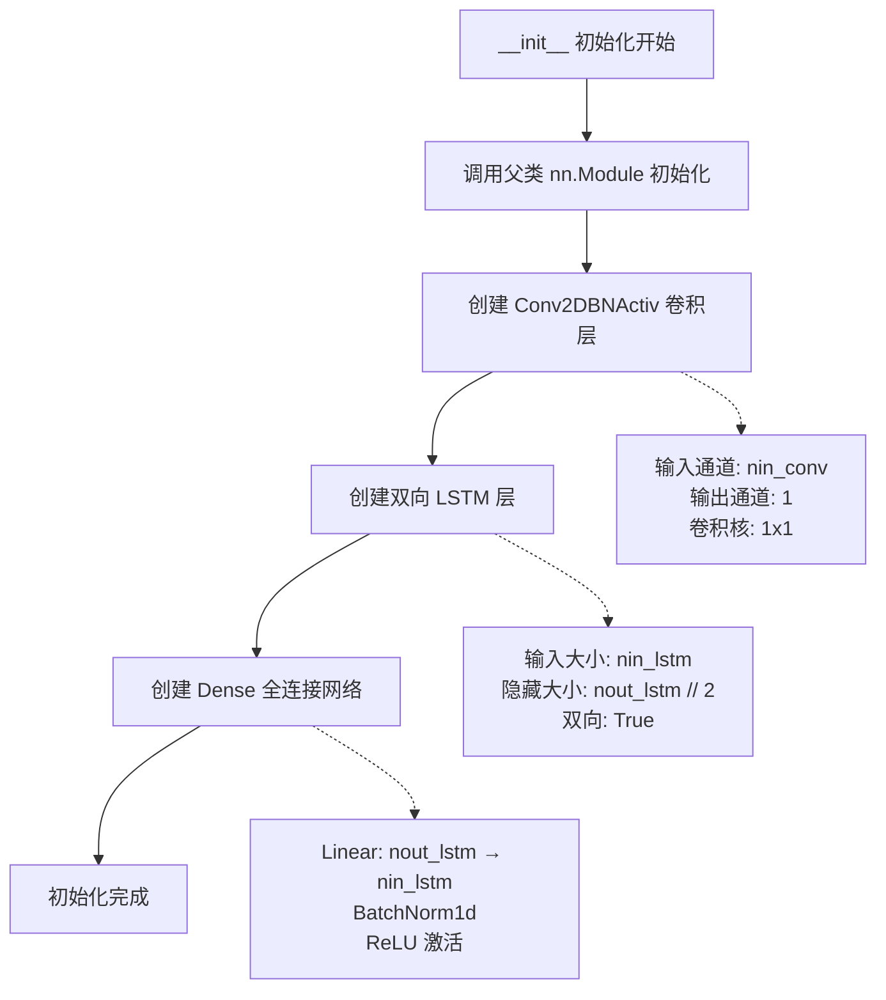

# `Chat-Haruhi-Suzumiya\yuki_builder\video_preprocessing\uvr5\uvr5_pack\lib_v5\layers_new.py` 详细设计文档

这是一个基于PyTorch的神经网络模块集合，主要用于音频信号处理（包括编码器-解码器架构、ASPP空洞空间金字塔池化和LSTM时序建模），采用卷积归一化激活的组合模块构建深度学习模型。

## 整体流程



## 类结构

```
Conv2DBNActiv (卷积+归一化+激活基类)
Encoder (编码器类)
Decoder (解码器类)
ASPPModule (空洞空间金字塔池化类)
LSTMModule (长短期记忆网络类)
```

## 全局变量及字段


### `torch`
    
PyTorch main library, provides tensor operations and neural network modules.

类型：`module`
    


### `nn`
    
torch.nn subpackage, contains neural network layers and base classes.

类型：`module`
    


### `F`
    
torch.nn.functional, provides functional API for neural network operations.

类型：`module`
    


### `spec_utils`
    
Local utility module for spectral processing, contains helper functions such as crop_center.

类型：`module`
    


### `Conv2DBNActiv.conv`
    
卷积、批归一化、激活函数序列

类型：`nn.Sequential`
    


### `Encoder.conv1`
    
第一次卷积块

类型：`Conv2DBNActiv`
    


### `Encoder.conv2`
    
第二次卷积块

类型：`Conv2DBNActiv`
    


### `Decoder.conv1`
    
解码卷积块

类型：`Conv2DBNActiv`
    


### `Decoder.dropout`
    
可选dropout层

类型：`nn.Dropout2d`
    


### `ASPPModule.conv1`
    
自适应池化分支

类型：`nn.Sequential`
    


### `ASPPModule.conv2`
    
1x1卷积分支

类型：`Conv2DBNActiv`
    


### `ASPPModule.conv3`
    
3x3空洞卷积(dilation=4)

类型：`Conv2DBNActiv`
    


### `ASPPModule.conv4`
    
3x3空洞卷积(dilation=8)

类型：`Conv2DBNActiv`
    


### `ASPPModule.conv5`
    
3x3空洞卷积(dilation=12)

类型：`Conv2DBNActiv`
    


### `ASPPModule.bottleneck`
    
瓶颈层融合

类型：`Conv2DBNActiv`
    


### `ASPPModule.dropout`
    
可选dropout层

类型：`nn.Dropout2d`
    


### `LSTMModule.conv`
    
通道降维卷积

类型：`Conv2DBNActiv`
    


### `LSTMModule.lstm`
    
双向LSTM层

类型：`nn.LSTM`
    


### `LSTMModule.dense`
    
全连接层+归一化+激活

类型：`nn.Sequential`
    
    

## 全局函数及方法


### `Conv2DBNActiv.__init__`

初始化卷积块参数，创建包含卷积层、批归一化层和激活函数的顺序卷积模块，用于构建神经网络中的卷积块。

参数：

- `nin`：`int`，输入通道数，指定输入特征图的通道数
- `nout`：`int`，输出通道数，指定输出特征图的通道数
- `ksize`：`int`，卷积核大小，默认为3，表示卷积核的尺寸
- `stride`：`int`，卷积步长，默认为1，控制卷积核滑动的步长
- `pad`：`int`，填充大小，默认为1，控制输入特征图的边缘填充
- `dilation`：`int`，膨胀系数，默认为1，控制卷积核的感受野
- `activ`：`nn.Module`，激活函数类型，默认为 nn.ReLU，用于非线性激活

返回值：`None`，该方法仅初始化对象属性，不返回任何值

#### 流程图

```mermaid
flowchart TD
    A[开始 __init__] --> B[调用父类 nn.Module 的 __init__]
    B --> C[创建 nn.Sequential 容器]
    C --> D[添加 Conv2d 层: nin -> nout, kernel=ksize, stride=stride, padding=pad, dilation=dilation, bias=False]
    D --> E[添加 BatchNorm2d 层: nout]
    E --> F[添加激活函数: activ()]
    F --> G[结束 __init__]
```

#### 带注释源码

```python
def __init__(self, nin, nout, ksize=3, stride=1, pad=1, dilation=1, activ=nn.ReLU):
    """
    初始化卷积块参数
    
    Args:
        nin: 输入通道数
        nout: 输出通道数
        ksize: 卷积核大小
        stride: 步长
        pad: 填充
        dilation: 膨胀系数
        activ: 激活函数类型
    """
    # 调用父类 nn.Module 的初始化方法
    super(Conv2DBNActiv, self).__init__()
    
    # 构建顺序卷积模块：卷积 -> 批归一化 -> 激活
    self.conv = nn.Sequential(
        # 2D 卷积层：nin 通道 -> nout 通道
        nn.Conv2d(
            nin,              # 输入通道数
            nout,             # 输出通道数
            kernel_size=ksize,   # 卷积核大小
            stride=stride,        # 步长
            padding=pad,          # 填充
            dilation=dilation,   # 膨胀系数
            bias=False,           # 不使用偏置（因为后面有批归一化）
        ),
        # 2D 批归一化层：对 nout 通道进行归一化
        nn.BatchNorm2d(nout),
        # 激活函数实例：默认使用 ReLU
        activ(),
    )
```


### `Conv2DBNActiv.__call__`

这是 `Conv2DBNActiv` 类的前向传播方法，用于执行卷积、批归一化和激活操作。

参数：

- `x`：`torch.Tensor`，输入的四维张量，形状为 (N, C, H, W)，其中 N 是批次大小，C 是通道数，H 和 W 分别是高度和宽度

返回值：`torch.Tensor`，经过卷积、批归一化和激活函数处理后的输出张量

#### 流程图



#### 带注释源码

```python
def __call__(self, x):
    """
    前向传播方法，处理输入张量
    
    参数:
        x: 输入张量，形状为 (N, C_in, H, W)
    
    返回:
        经过卷积、批归一化和激活处理后的张量，形状为 (N, C_out, H', W')
    """
    return self.conv(x)  # 将输入传递给 nn.Sequential 组合层
```

---

### 补充信息

#### 核心功能描述

`Conv2DBNActiv` 是一个卷积神经网络的基本构建块，封装了卷积层、批归一化层和激活函数，用于构建Encoder和Decoder网络。

#### 类的详细信息

| 字段/方法 | 类型 | 描述 |
|-----------|------|------|
| `nin` | int | 输入通道数 |
| `nout` | int | 输出通道数 |
| `ksize` | int | 卷积核大小，默认3 |
| `stride` | int | 步长，默认1 |
| `pad` | int | 填充大小，默认1 |
| `dilation` | int | 膨胀系数，默认1 |
| `activ` | nn.Module | 激活函数类型，默认nn.ReLU |
| `self.conv` | nn.Sequential | 包含Conv2d、BatchNorm2d和activ的顺序容器 |

#### 潜在的技术债务或优化空间

1. **激活函数实例化时机**：当前在 `__init__` 中通过 `activ()` 每次创建新实例，如果传入自定义激活函数类可能导致不一致
2. **缺少权重初始化**：没有显式的权重初始化策略，可能影响训练稳定性
3. **bias参数硬编码**：`bias=False` 固定，可能不够灵活

#### 其它项目

- **设计目标**：提供一个可配置的卷积块，用于构建U-Net风格的编解码器网络
- **错误处理**：未实现输入形状验证，传入不匹配的张量可能导致运行时错误
- **外部依赖**：PyTorch、torch.nn、torch.nn.functional


### Encoder.__init__

该方法用于初始化Encoder（编码器）类的实例，主要完成父类nn.Module的初始化，并创建两个连续的卷积-批归一化-激活层（Conv2DBNActiv），用于对输入特征进行特征提取和维度映射。

参数：

- `nin`：`int`，输入通道数（number of input channels），指定输入特征图的通道维度
- `nout`：`int`，输出通道数（number of output channels），指定输出特征图的通道维度
- `ksize`：`int`，卷积核大小（kernel size），默认为3，表示卷积核的空间尺寸
- `stride`：`int`，卷积步长（stride），默认为1，控制卷积核滑动的步幅
- `pad`：`int`，填充尺寸（padding），默认为1，控制输入特征图边缘的零填充宽度
- `activ`：`torch.nn.Module`，激活函数类型（activation function），默认为`nn.LeakyReLU`，用于引入非线性变换

返回值：`None`，该方法为初始化方法，不返回任何值，仅完成对象属性的初始化

#### 流程图



#### 带注释源码

```python
def __init__(self, nin, nout, ksize=3, stride=1, pad=1, activ=nn.LeakyReLU):
    """
    初始化编码器结构
    
    参数:
        nin: 输入通道数
        nout: 输出通道数
        ksize: 卷积核大小，默认3
        stride: 步长，默认1
        pad: 填充，默认1
        activ: 激活函数，默认LeakyReLU
    """
    # 调用父类 nn.Module 的初始化方法，完成 PyTorch 模块的基类初始化
    # 这会注册所有子模块并初始化 PyTorch 内部状态
    super(Encoder, self).__init__()
    
    # 创建第一个卷积-批归一化-激活层
    # 该层将输入特征从 nin 通道映射到 nout 通道
    # 参数 stride 控制特征图的空间下采样程度
    self.conv1 = Conv2DBNActiv(nin, nout, ksize, stride, pad, activ=activ)
    
    # 创建第二个卷积-批归一化-激活层
    # 该层保持通道数不变（nout -> nout），步长设为1不进行下采样
    # 与 conv1 配合形成典型的编码器残差块结构
    self.conv2 = Conv2DBNActiv(nout, nout, ksize, 1, pad, activ=activ)
```


### `Encoder.__call__`

这是 Encoder 类的前向传播方法，实现双层卷积特征编码。输入特征图依次通过两个卷积块（Conv2DBNActiv），每个卷积块包含卷积、批归一化和激活函数，最终输出编码后的特征表示。

参数：
- `x`：`torch.Tensor`，输入张量，形状为 (N, nin, H, W)，其中 N 是批量大小，nin 是输入通道数，H 和 W 分别是特征图的高度和宽度

返回值：`torch.Tensor`，输出张量，形状为 (N, nout, H', W')，其中 nout 是输出通道数，H' 和 W' 是经过步长调整后的特征图尺寸

#### 流程图

```mermaid
graph LR
    A[输入 x<br/>torch.Tensor<br/>(N, nin, H, W)] --> B[conv1(x)<br/>第一层卷积]
    B --> C[conv2(h)<br/>第二层卷积]
    C --> D[返回 h<br/>torch.Tensor<br/>(N, nout, H', W')]
    
    style A fill:#e1f5fe
    style B fill:#fff3e0
    style C fill:#fff3e0
    style D fill:#e8f5e9
```

#### 带注释源码

```python
def __call__(self, x):
    """
    Encoder 的前向传播方法，实现双层卷积特征编码
    
    参数:
        x (torch.Tensor): 输入张量，形状为 (batch_size, nin, height, width)
            - batch_size: 批量大小
            - nin: 输入通道数
            - height: 输入特征图高度
            - width: 输入特征图宽度
    
    返回:
        torch.Tensor: 输出张量，形状为 (batch_size, nout, height', width')
            - nout: 输出通道数
            - height': 输出特征图高度，取决于 stride 和 padding
            - width': 输出特征图宽度，取决于 stride 和 padding
    """
    # 第一层卷积：对输入进行第一次卷积、批归一化和激活处理
    # 输入: (N, nin, H, W) -> 输出: (N, nout, H', W')
    h = self.conv1(x)
    
    # 第二层卷积：对第一层输出进行第二次卷积、批归一化和激活处理
    # 输入: (N, nout, H', W') -> 输出: (N, nout, H'', W'')
    h = self.conv2(h)
    
    # 返回双层卷积编码后的特征表示
    return h
```


### `Decoder.__init__`

该方法用于初始化解码器（Decoder）模块的结构，包括卷积层和可选的 Dropout 层。Decoder 在 U-Net 架构中负责上采样特征图并通过跳跃连接与编码器特征进行融合。

参数：

- `nin`：`int`，输入特征图的通道数
- `nout`：`int`，输出特征图的通道数
- `ksize`：`int`，卷积核大小，默认为 3
- `stride`：`int`，卷积步长，默认为 1
- `pad`：`int`，卷积填充大小，默认为 1
- `activ`：激活函数类型（如 `nn.ReLU`、`nn.LeakyReLU` 等），默认为 `nn.ReLU`
- `dropout`：`bool`，是否启用 Dropout 正则化，默认为 `False`

返回值：`None`，该方法为初始化方法，不返回任何值，仅完成对象属性的初始化

#### 流程图

```mermaid
flowchart TD
    A[开始 Decoder.__init__] --> B[接收 nin, nout, ksize, stride, pad, activ, dropout 参数]
    B --> C[调用 super().__init__ 初始化 nn.Module]
    D[创建 self.conv1: Conv2DBNActiv<br/>输入通道: nin<br/>输出通道: nout<br/>卷积核: ksize<br/>步长: 1<br/>填充: pad<br/>激活: activ]
    C --> D
    D --> E{dropout == True?}
    E -->|是| F[创建 self.dropout = nn.Dropout2d(0.1)]
    E -->|否| G[创建 self.dropout = None]
    F --> H[结束初始化]
    G --> H
```

#### 带注释源码

```python
def __init__(
    self, nin, nout, ksize=3, stride=1, pad=1, activ=nn.ReLU, dropout=False
):
    """
    初始化 Decoder 解码器模块
    
    参数:
        nin (int): 输入特征图的通道数
        nout (int): 输出特征图的通道数
        ksize (int): 卷积核大小，默认为 3
        stride (int): 卷积步长，默认为 1（解码器中固定为1）
        pad (int): 卷积填充大小，默认为 1
        activ: 激活函数类型，默认为 nn.ReLU
        dropout (bool): 是否启用 Dropout，默认为 False
    """
    # 调用父类 nn.Module 的初始化方法
    super(Decoder, self).__init__()
    
    # 第一个卷积块：将 nin 通道转换为 nout 通道
    # 使用固定步长 1，保持特征图尺寸
    self.conv1 = Conv2DBNActiv(nin, nout, ksize, 1, pad, activ=activ)
    
    # 第二个卷积块被注释掉，原本用于进一步处理特征
    # self.conv2 = Conv2DBNActiv(nout, nout, ksize, 1, pad, activ=activ)
    
    # 条件创建 Dropout 层：如果 dropout 为 True，则创建 nn.Dropout2d(0.1)
    # 否则设为 None，在前向传播中会跳过 Dropout 操作
    self.dropout = nn.Dropout2d(0.1) if dropout else None
```


### `Decoder.__call__`

该方法是U-Net解码器的前向传播核心，实现上采样与跳跃连接的特征融合。首先通过双线性插值将输入特征图尺寸放大2倍，若存在跳跃连接则与编码器特征进行裁剪对齐后沿通道维度拼接，最后通过卷积块输出融合后的特征图。

参数：

- `x`：`torch.Tensor`，输入的张量，通常来自上一层的特征图
- `skip`：`torch.Tensor | None`，可选的跳跃连接特征图，来自编码器对应层的输出

返回值：`torch.Tensor`，经过上采样、跳跃连接融合和卷积处理后的输出特征图

#### 流程图

```mermaid
flowchart TD
    A[输入 x] --> B[F.interpolate 上采样<br/>scale_factor=2, bilinear]
    B --> C{skip 是否存在?}
    C -->|是 D[裁剪 skip 与 x 尺寸对齐]
    C -->|否 E[跳过裁剪]
    D --> F[torch.cat 沿通道维度拼接]
    E --> F
    F --> G[conv1 卷积块]
    G --> H{dropout 是否启用?}
    H -->|是 I[Dropout2d 正则化]
    H -->|否 J[跳过 Dropout]
    I --> K[输出 h]
    J --> K
```

#### 带注释源码

```python
def __call__(self, x, skip=None):
    """
    Decoder 前向传播：上采样 + 跳跃连接
    
    参数:
        x: 输入张量，来自上一解码层或瓶颈层
        skip: 可选的跳跃连接张量，来自编码器对应层
    
    返回:
        h: 融合上采样特征与跳跃连接后的输出张量
    """
    
    # Step 1: 上采样 - 将特征图尺寸放大2倍
    # 使用双线性插值，保持特征图连续性
    x = F.interpolate(x, scale_factor=2, mode="bilinear", align_corners=True)

    # Step 2: 跳跃连接处理
    if skip is not None:
        # 裁剪跳跃连接特征图，使其与上采样后的 x 尺寸一致
        # 处理编码器与解码器特征图尺寸不匹配的情况
        skip = spec_utils.crop_center(skip, x)
        
        # 沿通道维度(dim=1)拼接上采样特征与跳跃连接特征
        # 通道数相加，实现特征融合
        x = torch.cat([x, skip], dim=1)

    # Step 3: 卷积处理 - 整合融合后的特征
    h = self.conv1(x)
    # 原代码中 conv2 被注释掉，若启用可进一步提取特征

    # Step 4: Dropout 正则化（可选）
    # 防止解码器过拟合，增强泛化能力
    if self.dropout is not None:
        h = self.dropout(h)

    return h
```


### `ASPPModule.__init__`

初始化ASPPModule类，构建Atrous Spatial Pyramid Pooling (ASPP)多分支结构，包含一个自适应平均池化分支、1x1卷积和三个不同膨胀率的3x3卷积分支，最后通过瓶颈层融合各分支特征。

参数：

- `self`：隐式参数，ASPPModule实例本身
- `nin`：`int`，输入特征图的通道数
- `nout`：`int`，输出特征图的通道数
- `dilations`：`tuple`，卷积核膨胀率元组，默认为(4, 8, 12)，控制三个分支的感受野
- `activ`：`nn.Module`，激活函数类型，默认为nn.ReLU
- `dropout`：`bool`，是否启用Dropout正则化，默认为False

返回值：`None`，__init__方法无返回值，仅初始化对象状态

#### 流程图

```mermaid
flowchart TD
    A[开始初始化] --> B[创建conv1分支: AdaptiveAvgPool2d + Conv2DBNActiv]
    B --> C[创建conv2分支: 1x1卷积]
    C --> D[创建conv3分支: 3x3卷积<br/>dilation=dilations[0]]
    D --> E[创建conv4分支: 3x3卷积<br/>dilation=dilations[1]]
    E --> F[创建conv5分支: 3x3卷积<br/>dilation=dilations[2]]
    F --> G[创建bottleneck瓶颈层: 5*nout -> nout]
    G --> H{dropout=True?}
    H -->|是| I[创建Dropout2d层<br/>p=0.1]
    H -->|否| J[dropout=None]
    I --> K[结束初始化]
    J --> K
```

#### 带注释源码

```python
def __init__(self, nin, nout, dilations=(4, 8, 12), activ=nn.ReLU, dropout=False):
    # 调用父类nn.Module的初始化方法
    super(ASPPModule, self).__init__()
    
    # 分支1: 自适应平均池化分支
    # 使用AdaptiveAvgPool2d将特征图在高度维度压缩为1，保留宽度维度
    # 然后通过1x1卷积调整通道数至nout
    self.conv1 = nn.Sequential(
        nn.AdaptiveAvgPool2d((1, None)),  # 输出形状: (N, C, 1, W)
        Conv2DBNActiv(nin, nout, 1, 1, 0, activ=activ),
    )
    
    # 分支2: 1x1卷积分支，用于捕获低层次特征
    self.conv2 = Conv2DBNActiv(nin, nout, 1, 1, 0, activ=activ)
    
    # 分支3: 3x3卷积，膨胀率为dilations[0]
    # 在保持参数量的同时增大感受野
    self.conv3 = Conv2DBNActiv(
        nin, nout, 3, 1, dilations[0], dilations[0], activ=activ
    )
    
    # 分支4: 3x3卷积，膨胀率为dilations[1]
    self.conv4 = Conv2DBNActiv(
        nin, nout, 3, 1, dilations[1], dilations[1], activ=activ
    )
    
    # 分支5: 3x3卷积，膨胀率为dilations[2]
    self.conv5 = Conv2DBNActiv(
        nin, nout, 3, 1, dilations[2], dilations[2], activ=activ
    )
    
    # 瓶颈层: 融合5个分支的特征，通道数从5*nout压缩至nout
    # 实现多尺度特征的压缩与融合
    self.bottleneck = Conv2DBNActiv(nout * 5, nout, 1, 1, 0, activ=activ)
    
    # Dropout正则化层，可选启用以防止过拟合
    self.dropout = nn.Dropout2d(0.1) if dropout else None
```


### `ASPPModule.forward`

ASPPModule的forward方法实现了多尺度特征提取与融合，通过并行使用不同膨胀率的卷积核（1x1卷积、3x3膨胀卷积 with dilation=4/8/12）以及全局池化分支，对输入特征图进行五个不同尺度的特征提取，最后在通道维度拼接并通过1x1卷积瓶颈层进行特征融合，输出融合后的特征图。

参数：

- `x`：`torch.Tensor`，输入张量，形状为(N, C, H, W)，其中N为batch size，C为通道数，H和W为特征图的高和宽

返回值：`torch.Tensor`，经过多尺度特征提取与融合后的输出张量，形状为(N, nout, H, W)

#### 流程图

```mermaid
flowchart TD
    A[输入x: (N, C, H, W)] --> B[获取尺寸: h, w]
    A --> C[AdaptiveAvgPool2d + 1x1 Conv: feat1]
    C --> C1[F.interpolate恢复到h, w]
    A --> D[1x1 Conv: feat2]
    A --> E[3x3 Dilation=4 Conv: feat3]
    A --> F[3x3 Dilation=8 Conv: feat4]
    A --> G[3x3 Dilation=12 Conv: feat5]
    C1 --> H[Channel concat: torch.cat [..., dim=1]]
    D --> H
    E --> H
    F --> H
    G --> H
    H --> I[Bottleneck 1x1 Conv: (N, nout*5, H, W) → (N, nout, H, W)]
    I --> J{dropout?}
    J -->|是| K[Dropout2d]
    J -->|否| L[输出out: (N, nout, H, W)]
    K --> L
```

#### 带注释源码

```python
def forward(self, x):
    """
    ASPP模块的前向传播函数，实现多尺度特征提取与融合
    
    参数:
        x: 输入张量，形状为(N, C, H, W)
    
    返回:
        out: 经过多尺度特征提取与融合后的输出张量，形状为(N, nout, H, W)
    """
    # 获取输入特征图的尺寸信息
    _, _, h, w = x.size()
    
    # 分支1: 全局上下文分支
    # 使用自适应平均池化将特征图压缩到(1, None)即(1, W)形状
    # 然后通过1x1卷积变换通道数，最后插值回原始尺寸(h, w)
    # 这样可以捕获全局上下文信息
    feat1 = F.interpolate(
        self.conv1(x), size=(h, w), mode="bilinear", align_corners=True
    )
    
    # 分支2: 1x1卷积分支
    # 使用1x1卷积捕获局部特征，不改变特征图空间尺寸
    feat2 = self.conv2(x)
    
    # 分支3: 3x3膨胀卷积分支，dilation=4
    # 膨胀卷积可以扩大感受野而不损失分辨率
    feat3 = self.conv3(x)
    
    # 分支4: 3x3膨胀卷积分支，dilation=8
    # 更大的膨胀率提供更大的感受野
    feat4 = self.conv4(x)
    
    # 分支5: 3x3膨胀卷积分支，dilation=12
    # 最大的膨胀率捕获最广泛的上下文信息
    feat5 = self.conv5(x)
    
    # 通道维度拼接: 将五个不同尺度的特征图在通道维度上拼接
    # 拼接后形状: (N, nout*5, H, W)
    out = torch.cat((feat1, feat2, feat3, feat4, feat5), dim=1)
    
    # 瓶颈层: 1x1卷积将通道数从nout*5压缩到nout
    # 实现特征融合和维度压缩
    out = self.bottleneck(out)
    
    # 可选的dropout，用于正则化防止过拟合
    if self.dropout is not None:
        out = self.dropout(out)
    
    return out
```


### LSTMModule.__init__

初始化LSTM模块，构建包含卷积层、双向LSTM和全连接层的混合神经网络结构，用于处理音频频谱图的时序特征。

参数：

- `self`：隐式参数，实例对象本身
- `nin_conv`：`int`，卷积层输入通道数，指定输入特征图的通道维度
- `nin_lstm`：`int`，LSTM输入特征维度，指定每个时间步的输入特征大小
- `nout_lstm`：`int`，LSTM输出特征维度（双向合并后的总维度），决定LSTM隐藏层大小

返回值：`None`，构造函数无返回值，仅完成对象属性初始化

#### 流程图



#### 带注释源码

```python
def __init__(self, nin_conv, nin_lstm, nout_lstm):
    """
    初始化 LSTM 模块
    
    参数:
        nin_conv (int): 卷积层输入通道数
        nin_lstm (int): LSTM 输入特征维度
        nout_lstm (int): LSTM 输出特征维度（双向总维度）
    """
    # 调用父类 nn.Module 的初始化方法，注册所有子模块
    super(LSTMModule, self).__init__()
    
    # --- 1. 卷积层：将多通道特征图压缩为单通道 ---
    # 参数: 输入通道=nin_conv, 输出通道=1, 卷积核=1x1, 步长=1, 填充=0
    self.conv = Conv2DBNActiv(nin_conv, 1, 1, 1, 0)
    
    # --- 2. 双向 LSTM 层：处理时序特征 ---
    # 输入大小: nin_lstm（每个时间步的特征维度）
    # 隐藏大小: nout_lstm // 2（因为双向，每个方向隐藏大小为总输出的一半）
    # bidirectional=True: 双向 LSTM，正反向分别输出，合并后总维度为 nout_lstm
    self.lstm = nn.LSTM(
        input_size=nin_lstm, 
        hidden_size=nout_lstm // 2, 
        bidirectional=True
    )
    
    # --- 3. 全连接层：特征变换与归一化 ---
    # 顺序容器: Linear -> BatchNorm1d -> ReLU
    # 作用: 将 LSTM 输出的 nout_lstm 维度映射回 nin_lstm 维度
    self.dense = nn.Sequential(
        nn.Linear(nout_lstm, nin_lstm),  # 维度变换: nout_lstm -> nin_lstm
        nn.BatchNorm1d(nin_lstm),        # 批归一化，稳定训练
        nn.ReLU()                        # ReLU 激活函数，引入非线性
    )
```


### LSTMModule.forward

该方法是LSTMModule类的核心前向传播方法，负责从卷积特征中提取时序信息并进行处理。通过1x1卷积将多通道特征压缩为单通道，然后使用双向LSTM捕获时序依赖关系，最后通过全连接层进行特征变换和维度恢复，实现时序特征的提取与处理。

参数：

- `self`：LSTMModule实例本身（隐式参数）
- `x`：`torch.Tensor`，形状为(N, C, nbins, nframes)，其中N为批量大小，C为输入通道数，nbins为频率 bins 数量，nframes为时间帧数。表示输入的频谱特征张量

返回值：`torch.Tensor`，形状为(N, 1, nbins, nframes)，其中N为批量大小，nbins为频率 bins 数量，nframes为时间帧数。表示经过时序特征提取和处理后的输出特征张量

#### 流程图

```mermaid
flowchart TD
    A[输入 x: N×C×nbins×nframes] --> B[获取输入维度信息]
    B --> C[self.conv x 卷积操作]
    C --> D[[:, 0] 提取第一个通道]
    D --> E[结果形状: N×nbins×nframes]
    E --> F[permute 维度重排]
    F --> G[结果形状: nframes×N×nbins]
    G --> H[self.lstm h 双向LSTM处理]
    H --> I[结果形状: nframes×N×nout_lstm]
    J[输入 h: nframes×N×nout_lstm] --> K[reshape 展平操作]
    K --> L[结果形状: nframes×N×nout_lstm]
    L --> M[self.dense 全连接层处理]
    M --> N[结果形状: nframes×N×nin_lstm]
    N --> O[reshape 恢复形状]
    O --> P[结果形状: nframes×N×1×nbins]
    P --> Q[permute 维度重排]
    Q --> R[输出: N×1×nbins×nframes]
```

#### 带注释源码

```python
def forward(self, x):
    """
    LSTMModule的前向传播方法
    
    处理流程：
    1. 使用1x1卷积将多通道特征压缩为单通道
    2. 调整维度顺序以适应LSTM输入要求
    3. 使用双向LSTM提取时序特征
    4. 通过全连接层进行特征变换
    5. 恢复输出维度顺序
    
    参数:
        x: torch.Tensor, 形状为(N, C, nbins, nframes)
           - N: 批量大小
           - C: 输入通道数
           - nbins: 频率bins数量
           - nframes: 时间帧数
    
    返回:
        torch.Tensor, 形状为(N, 1, nbins, nframes)
           - N: 批量大小
           - 1: 输出通道数（压缩后）
           - nbins: 频率bins数量
           - nframes: 时间帧数
    """
    # 获取输入张量的维度信息
    # N: 批量大小, C: 通道数, nbins: 频率bins, nframes: 时间帧数
    N, _, nbins, nframes = x.size()
    
    # Step 1: 卷积压缩通道
    # 使用1x1卷积将C个通道压缩为1个通道
    # 输入: (N, C, nbins, nframes) -> 输出: (N, 1, nbins, nframes)
    h = self.conv(x)[:, 0]  # N, nbins, nframes
    
    # Step 2: 维度重排以适应LSTM输入
    # LSTM期望输入形状为 (seq_len, batch, input_size)
    # 当前形状: (N, nbins, nframes) -> 目标形状: (nframes, N, nbins)
    h = h.permute(2, 0, 1)  # nframes, N, nbins
    
    # Step 3: 双向LSTM处理时序特征
    # LSTM输出形状: (nframes, N, hidden_size * 2) 因为是双向
    # hidden_size = nout_lstm // 2
    h, _ = self.lstm(h)
    
    # Step 4: 全连接层特征变换
    # 先将三维张量展平为二维: (nframes * N, nout_lstm)
    # 然后通过全连接层: (nframes * N, nin_lstm)
    h = self.dense(h.reshape(-1, h.size()[-1]))  # nframes * N, nbins
    
    # Step 5: 恢复形状并调整维度顺序
    # 从 (nframes * N, nbins) 恢复到 (nframes, N, 1, nbins)
    h = h.reshape(nframes, N, 1, nbins)
    
    # 最终维度重排: (nframes, N, 1, nbins) -> (N, 1, nbins, nframes)
    h = h.permute(1, 2, 3, 0)
    
    return h
```

## 关键组件


### Conv2DBNActiv

卷积+批归一化+激活函数的组合模块，是网络的基础构建块，提供标准化的卷积操作流程。

### Encoder

编码器模块，通过两层连续的Conv2DBNActiv进行特征提取和压缩，用于捕获输入信号的层级特征表示。

### Decoder

解码器模块，包含上采样、跳跃连接和卷积操作，通过双线性插值进行2倍上采样，并与编码器特征进行中心裁剪对齐后拼接。

### ASPPModule

空洞卷积金字塔模块（Atrous Spatial Pyramid Pooling），通过多尺度空洞卷积（1x1和3x3 with dilation 4/8/12）和全局池化分支捕获多尺度上下文信息。

### LSTMModule

时序建模模块，结合卷积和双向LSTM进行时序特征提取，将空间特征压缩后通过LSTM建模帧间依赖关系。


## 问题及建议


### 已知问题

- `Decoder`类中使用了`spec_utils.crop_center`函数，但`spec_utils`模块仅作为导入，未在该文件中定义或验证该函数的存在，可能导致运行时错误
- `ASPPModule`中使用`nn.AdaptiveAvgPool2d((1, None))`创建非方形池化，这种用法非常规，可能导致不可预测的空间尺寸计算问题
- `LSTMModule`的`forward`方法中混用了`reshape`和`view`，且使用`reshape(-1, ...)`可能导致意外的内存复制，应使用`view()`或显式指定维度
- `Conv2DBNActiv`将激活函数类直接作为参数传递（如`activ=nn.ReLU`），但内部使用`activ()`实例化，这要求传入的是类而非实例，接口语义不清晰且容易误用
- `Decoder`类和`ASPPModule`类中的dropout被硬编码为`0.1`，且位置在最后，这种设计缺乏灵活性，无法适应不同任务需求
- 多个类（`Encoder`、`Decoder`、`ASPPModule`）都接受`activ`参数，但默认值不同（`Encoder`默认`LeakyReLU`，`Decoder`和`ASPPModule`默认`ReLU`），这种不一致性可能导致混淆
- `Decoder`类中有一行被注释掉的`self.conv2 = Conv2DBNActiv(nout, nout, ksize, 1, pad, activ=activ)`，表明代码可能处于未完成状态或存在技术债务
- 缺少类型注解（type hints），降低了代码的可读性和可维护性
- 所有类都缺少文档字符串（docstrings），无法了解各模块的设计意图和使用方式
- `LSTMModule`中变量命名`nbins`和`nframes`不够直观，且与常见的音频处理术语对应关系不明确
- `Encoder`类的`conv2`层stride被硬编码为1，无法通过参数调整，限制了模型的灵活性

### 优化建议

- 将`spec_utils.crop_center`函数内联到`Decoder`类中，或添加明确的依赖说明和错误处理
- 统一激活函数接口，建议使用`functools.partial`或工厂函数模式，避免直接传递类
- 将dropout概率和位置设计为可配置参数，而不是硬编码
- 为所有类和重要方法添加文档字符串，说明输入输出格式和设计意图
- 添加类型注解以提高代码可读性和IDE支持
- 移除或完成被注释掉的代码，如`Decoder`中的`conv2`，保持代码整洁
- 将`reshape`替换为`view`或在确保连续内存的情况下使用`reshape`
- 统一各模块的默认激活函数配置，建议在文档中明确说明设计决策
- 重构`ASPPModule`以减少卷积分支的代码重复，可以使用循环或更高级的抽象
- 为`LSTMModule`添加更清晰的变量命名和注释，说明各维度的含义（如batch、frequency、time）

## 其它


### 设计目标与约束

本代码实现了一个基于UNet架构的音频源分离神经网络的骨干部分，设计目标是通过编码器-解码器结构结合多尺度特征提取（ASPP）和时序建模（LSTM）来实现高质量的音频分离。主要约束包括：使用PyTorch框架、需支持GPU加速训练与推理、模型需保持适当的计算复杂度以平衡分离效果与实时性。

### 错误处理与异常设计

代码层面的显式错误处理较少，主要依赖PyTorch框架的自动异常处理。潜在的异常情况包括：输入张量维度不匹配（Encoder/Decoder期望4D张量N,C,H,W）、spec_utils模块缺失或函数接口变更、ASPP模块空洞卷积参数不当导致索引越界、LSTM模块输入序列长度不支持等。建议在调用前对输入维度进行显式校验，并对spec_utils依赖添加版本兼容检查。

### 数据流与状态机

数据流为：输入特征图 → Encoder（特征提取） → ASPPModule（多尺度空洞卷积） → LSTMModule（时序建模） → Decoder（上采样与特征融合） → 输出特征图。模型包含两种状态：训练状态（self.training=True）启用Dropout和BatchNorm训练模式；推理状态（self.training=False）禁用Dropout并使用BatchNorm推理模式，通过model.train()和model.eval()切换。

### 外部依赖与接口契约

核心依赖包括：PyTorch主框架（torch>=1.0）、torch.nn模块、torch.nn.functional模块。本地依赖spec_utils模块中的crop_center函数，用于解码器中skip连接的中心裁剪对齐。接口契约方面，所有Module子类需实现forward方法并返回torch.Tensor；输入输出均为4D张量(N,C,H,W)，其中N为batch size，C为通道数，H为频率 bins，W为时间帧数；Decoder的forward方法支持可选的skip参数用于特征融合。

### 性能考虑与优化空间

当前实现存在以下优化空间：Decoder中包含注释掉的self.conv2，可考虑恢复以增加模型容量；ASPP模块的5个分支可并行计算以提高GPU利用率；LSTM模块中dense层的BatchNorm1d适用于固定长度序列；dropout设置为固定值0.1，缺乏可配置性；可考虑使用torch.jit.script进行模型编译加速；Encoder-Decoder的skip连接可尝试更多融合方式（如attention机制）以提升分离效果。

### 输入输出规格

Encoder输入：4D张量(N, nin, H, W)，nin为输入通道数；输出：4D张量(N, nout, H, W)，nout为输出通道数。Decoder输入：主路径4D张量(N, nin, H, W)及可选skip连接4D张量；输出：4D张量(N, nout, H*2, W*2)经上采样后。ASPPModule输入：4D张量(N, nin, H, W)；输出：4D张量(N, nout, H, W)。LSTMModule输入：4D张量(N, nin_conv+nin_lstm, nbins, nframes)；输出：4D张量(N, 1, nbins, nframes)。

### 配置与超参数

Conv2DBNActiv默认：ksize=3, stride=1, pad=1, dilation=1, activ=nn.ReLU；Encoder默认：ksize=3, stride=1, pad=1, activ=nn.LeakyReLU；Decoder默认：ksize=3, stride=1, pad=1, activ=nn.ReLU, dropout=False；ASPPModule默认：dilations=(4,8,12), dropout=False；LSTMModule参数：nin_conv输入卷积通道数，nin_lstm为LSTM输入维度，nout_lstm为隐藏层维度（输出为nout_lstm）。

### 模型变体与扩展

通过修改activ参数可替换激活函数（如ReLU、LeakyReLU、PReLU、ELU等）；通过dropout参数控制Dropout2d的启用状态；Decoder可扩展更多skip连接层或添加attention机制；ASPP可调整dilations参数或增加/减少分支数量；LSTM可替换为GRU或引入注意力机制的Transformer结构；可在Encoder-Decoder间插入更多ASPP或LSTM模块以增加模型深度。

    