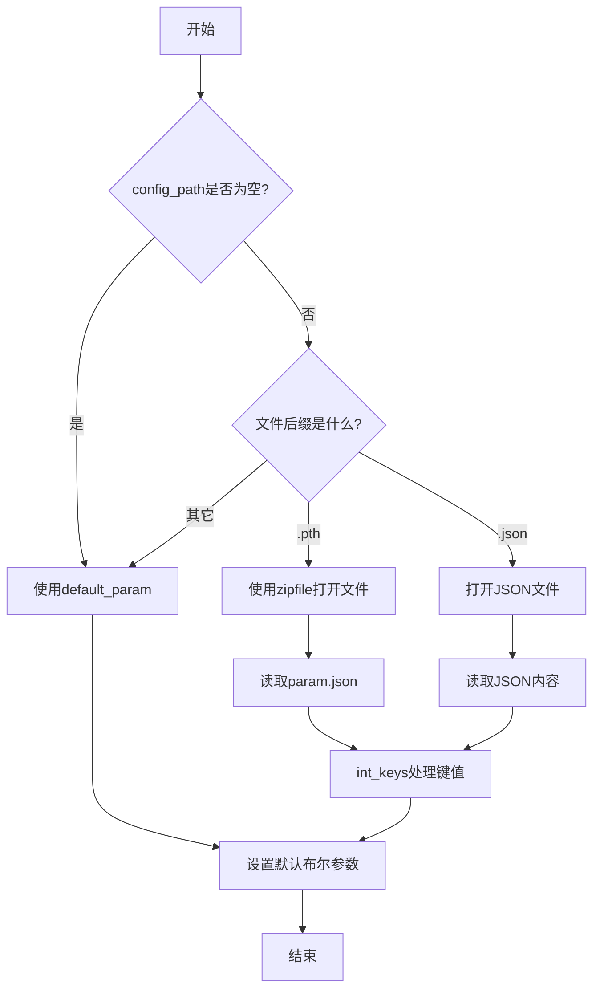
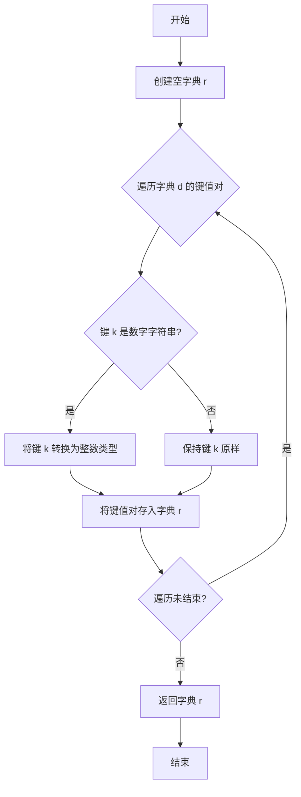
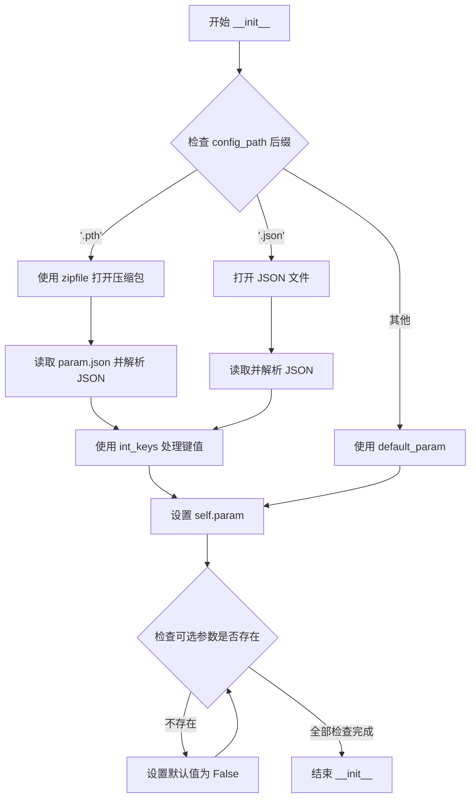

# `Chat-Haruhi-Suzumiya\yuki_builder\video_preprocessing\uvr5\uvr5_pack\lib_v5\model_param_init.py` 详细设计文档

该代码实现了一个音频模型参数配置管理模块，通过ModelParameters类根据配置文件类型（.pth压缩包或.json文件）加载音频处理参数，并提供默认参数 fallback 机制，同时包含将JSON键转换为整数类型的工具函数。

## 整体流程



## 类结构

```
ModelParameters (参数配置类)
  └── __init__ (初始化方法)
```

## 全局变量及字段


### `default_param`
    
默认音频处理参数，包含采样率、FFT大小、频段配置等

类型：`dict`
    


### `int_keys`
    
将字典的键转换为整数类型，如果是数字字符串则转为int

类型：`function`
    


### `ModelParameters.param`
    
存储模型参数字典，包含音频处理的各种参数配置

类型：`dict`
    
    

## 全局函数及方法


### `int_keys`

将字典中数字字符串键转换为整数类型的辅助函数，主要用于JSON解析时将字符串形式的数字键（如"1"、"2"）转换为整数类型（1、2），以便于后续的数值索引和操作。

参数：

- `d`：`dict`，需要处理键值对的字典对象

返回值：`dict`，返回键已转换（数字字符串转为整数）的新字典

#### 流程图



#### 带注释源码

```python
def int_keys(d):
    """
    将字典中数字字符串键转换为整数类型
    
    参数:
        d: 需要处理的字典对象
        
    返回:
        键已转换的新字典
    """
    r = {}  # 创建结果字典
    for k, v in d:  # 遍历输入字典的键值对
        if k.isdigit():  # 检查键是否为数字字符串
            k = int(k)  # 转换为整数类型
        r[k] = v  # 将键值对存入结果字典
    return r  # 返回处理后的字典
```


### `ModelParameters.__init__`

这是 `ModelParameters` 类的构造函数，用于初始化模型参数。根据传入的配置文件路径（`.pth` 或 `.json` 文件），从压缩包或 JSON 文件中加载参数；若路径无效或未提供，则使用预定义的默认参数。此外，该方法还会为一些可选参数设置默认值（如 `mid_side`、`stereo_w` 等布尔选项）。

参数：

- `config_path`：`str`，配置文件路径，支持 `.pth`（压缩包格式，内含 `param.json`）或 `.json` 文件路径，默认为空字符串

返回值：`None`，该方法为构造函数，不返回任何值

#### 流程图



#### 带注释源码

```python
class ModelParameters(object):
    def __init__(self, config_path=""):
        """
        初始化 ModelParameters 实例，根据配置文件加载参数或使用默认参数。
        
        参数:
            config_path (str): 配置文件路径，支持 .pth 或 .json 格式，默认为空字符串
        """
        # 判断配置文件路径的后缀是否为 .pth（通常为模型权重文件，内部包含 param.json）
        if ".pth" == pathlib.Path(config_path).suffix:
            import zipfile  # 导入 zipfile 模块用于读取 .pth 压缩包

            # 以只读模式打开压缩包文件
            with zipfile.ZipFile(config_path, "r") as zip:
                # 读取压缩包内的 param.json 文件并解析为 Python 对象
                # 使用 object_pairs_hook=int_keys 将字符串数字键转换为整数键
                self.param = json.loads(
                    zip.read("param.json"), object_pairs_hook=int_keys
                )
        # 判断配置文件路径的后缀是否为 .json
        elif ".json" == pathlib.Path(config_path).suffix:
            # 以只读模式打开 JSON 配置文件
            with open(config_path, "r") as f:
                # 读取文件内容并解析 JSON，同样使用 int_keys 处理键值
                self.param = json.loads(f.read(), object_pairs_hook=int_keys)
        else:
            # 若后缀既不是 .pth 也不是 .json，则使用预定义的默认参数
            self.param = default_param

        # 遍历所有可选参数键名，检查是否存在于当前参数中
        # 若不存在，则将其默认值设为 False
        for k in [
            "mid_side",      # 中侧声道混合模式
            "mid_side_b",   # 中侧声道混合模式 B
            "mid_side_b2",  # 中侧声道混合模式 B2
            "stereo_w",     # 立体声宽度
            "stereo_n",     # 立体声归一化
            "reverse",      # 反转模式
        ]:
            # 检查键是否不存在于 self.param 字典中
            if not k in self.param:
                # 将不存在的键设置为 False
                self.param[k] = False
```

## 关键组件


### 默认参数配置 (default_param)

一个包含音频处理各参数的全局字典，定义了模型训练和推理所需的默认配置，包括bin数量、采样率、频带参数、滤波器配置等。

### 整数键转换函数 (int_keys)

一个全局函数，用于将JSON解析后的数字字符串键转换为整数类型，确保配置中的数值键正确处理。

### 模型参数类 (ModelParameters)

一个配置加载类，支持从.pth压缩文件或.json文件加载模型参数，并提供默认参数回退机制，包含参数存储和初始化逻辑。


## 问题及建议


### 已知问题

-   **可变默认参数陷阱**：`default_param` 使用可变对象作为默认参数，可能导致所有实例共享同一引用，造成状态污染
-   **`int_keys` 函数逻辑错误**：函数签名 `for k, v in d` 期望迭代键值对，但 `object_pairs_hook` 实际接收的是键值对列表（list of tuples），且未递归处理嵌套字典
-   **字典直接迭代问题**：对字典 `d` 使用 `for k, v in d` 会导致 `ValueError`，因为字典默认迭代的是键而非键值对
-   **配置路径未校验**：构造函数未对空字符串 `config_path=""` 进行显式处理，可能导致意外行为
-   **异常处理缺失**：文件读取、JSON 解析、ZIP 文件操作均未捕获异常，程序可能直接崩溃
-   **类型注解缺失**：缺乏参数和返回值类型声明，影响代码可维护性和 IDE 辅助
-   **魔法数字问题**：多个硬编码数值（如 `768`、`9`、`762`）散落各处，缺乏常量定义
-   **代码风格不一致**：空 格 使 用 不 统 一（如 `if not k in` vs `if k not in`）

### 优化建议

-   将 `default_param` 改为函数内创建或使用 `None` 配合条件赋值
-   修正 `int_keys` 函数以正确处理键值对列表，并递归处理嵌套字典值
-   添加配置路径的有效性校验和异常捕获（`try/except`）
-   引入类型注解（`typing` 模块）以提升代码清晰度
-   提取硬编码数值为模块级常量或配置文件
-   为类和关键方法添加文档字符串（docstring）
-   统一代码风格，遵循 PEP8 规范
-   考虑使用数据类（`dataclass`）或 `pydantic` 替代字典存储参数，增强类型安全

## 其它


### 设计目标与约束

该模块旨在为音频处理模型提供灵活的配置管理机制，支持从文件加载参数或使用默认配置。设计约束包括：仅支持 .pth 和 .json 两种配置文件格式；必须保持向后兼容性，当配置文件中缺少必要字段时使用默认值；配置参数分为训练参数（unstable_bins、reduction_bins）和推理参数（lpf_start、hpf_start），两者应明确区分。

### 错误处理与异常设计

代码中的错误处理机制如下：文件不存在时使用默认参数而非抛出异常；JSON解析错误会被传播至上层调用者；不支持的文件格式（既不是.pth也不是.json）时静默使用默认参数。建议改进：添加文件存在性检查并记录日志；对不支持格式给出明确警告；捕获json.JSONDecodeError并提供更有意义的错误信息。

### 数据流与状态机

参数加载的数据流如下：入口为ModelParameters构造函数 → 判断文件后缀 → 根据后缀选择加载方式（.pth用zipfile读取.json，.json直接读取） → 使用int_keys hook将字符串数字键转换为整数 → 合并默认参数（设置mid_side等布尔字段） → 最终self.param包含完整配置。状态转换：初始状态（空param） → 加载状态（从文件读取）→ 合并状态（补充默认值） → 就绪状态（可供外部使用）。

### 外部依赖与接口契约

主要依赖包括：json（JSON解析）、os（路径操作）、pathlib（路径对象处理）、zipfile（.pth文件读取）。接口契约：ModelParameters构造函数接受config_path字符串参数，返回ModelParameters实例；通过self.param字典属性访问配置；默认参数可通过default_param全局变量修改。建议将default_param设为类属性或私有变量以更好地封装。

### 配置参数语义说明

配置参数分为多个层次：全局参数（bins、sr、pre_filter等）适用于整个模型；band参数包含多个频段配置，每个频段有独立的采样率(sr)、帧长(hl)、FFT点数(n_fft)、裁剪范围(crop_start/crop_stop)等；训练专用参数（unstable_bins、reduction_bins）在推理时应被忽略；推理专用参数（lpf_start、hpf_start）在训练时应使用默认值。正确理解这些参数的语义对正确使用该配置类至关重要。

### 扩展性考虑

当前实现可从以下方面扩展：支持更多配置文件格式（如.yaml、.toml）；支持配置验证和默认值自动生成；支持配置合并和覆盖机制；支持配置版本管理。建议在ModelParameters类中添加validate()方法检查必需参数是否存在，以及add_band()方法动态添加频段配置。

### 安全性考虑

当前代码存在潜在安全隐患：未验证config_path路径是否安全（路径遍历攻击）；未检查.zip文件中的param.json是否存在；未限制.pth文件大小可能导致内存问题。建议添加路径安全检查（使用pathlib解析并验证路径范围）、添加文件大小限制、添加配置参数范围验证。

    