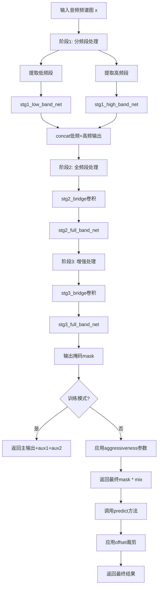
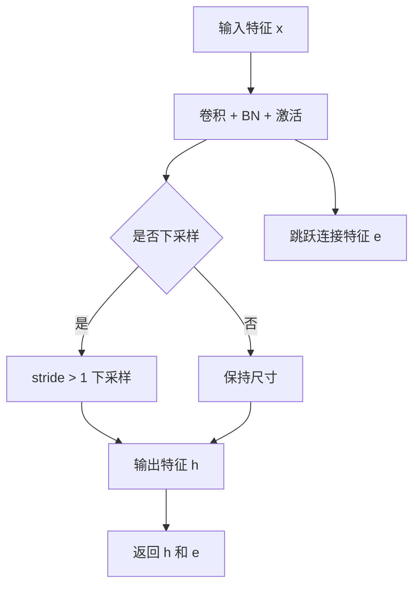
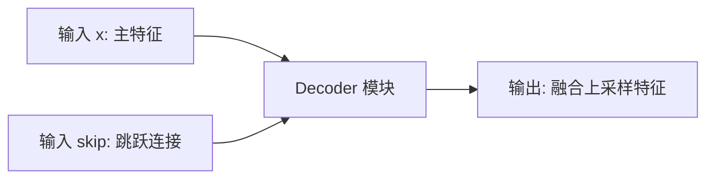
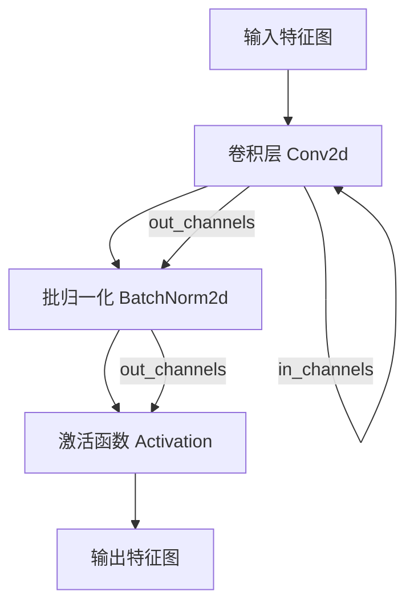
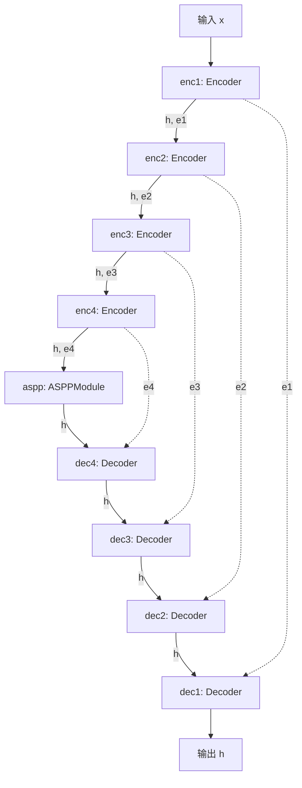
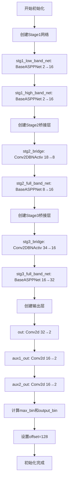

# `Chat-Haruhi-Suzumiya\yuki_builder\video_preprocessing\uvr5\uvr5_pack\lib_v5\nets.py` 详细设计文档

该代码实现了一个基于ASPP（空洞空间金字塔池化）的级联卷积神经网络，用于音频频谱图的处理和增强。该模型采用三阶段级联结构，分别处理低频段、高频段和全频段音频，并通过注意力机制和辅助输出提升语音分离和降噪效果。

## 整体流程



## 类结构

```
nn.Module (PyTorch基类)
├── BaseASPPNet (基础ASPP网络)
│   ├── enc1-4 (Encoder层)
│   ├── aspp (ASPPModule)
│   └── dec1-4 (Decoder层)
└── CascadedASPPNet (级联ASPP网络)
    ├── stg1_low_band_net (BaseASPPNet)
    ├── stg1_high_band_net (BaseASPPNet)
    ├── stg2_bridge (Conv2DBNActiv)
    ├── stg2_full_band_net (BaseASPPNet)
    ├── stg3_bridge (Conv2DBNActiv)
    ├── stg3_full_band_net (BaseASPPNet)
    ├── out (输出卷积)
    ├── aux1_out (辅助输出1)
    └── aux2_out (辅助输出2)
```

## 全局变量及字段


### `nin`
    
输入通道数

类型：`int`
    


### `ch`
    
基础通道数

类型：`int`
    


### `dilations`
    
ASPP空洞卷积膨胀率

类型：`tuple`
    


### `n_fft`
    
FFT窗口大小

类型：`int`
    


### `mix`
    
分离后的输入副本

类型：`torch.Tensor`
    


### `bandw`
    
频段宽度

类型：`int`
    


### `aux1`
    
阶段1辅助输出

类型：`torch.Tensor`
    


### `aux2`
    
阶段2辅助输出

类型：`torch.Tensor`
    


### `h`
    
中间隐藏状态

类型：`torch.Tensor`
    


### `mask`
    
生成的频谱掩码

类型：`torch.Tensor`
    


### `aggressiveness`
    
aggressiveness参数，控制掩码强度

类型：`dict`
    


### `BaseASPPNet.enc1`
    
第一级编码器

类型：`Encoder`
    


### `BaseASPPNet.enc2`
    
第二级编码器

类型：`Encoder`
    


### `BaseASPPNet.enc3`
    
第三级编码器

类型：`Encoder`
    


### `BaseASPPNet.enc4`
    
第四级编码器

类型：`Encoder`
    


### `BaseASPPNet.aspp`
    
ASPP模块

类型：`ASPPModule`
    


### `BaseASPPNet.dec4`
    
第四级解码器

类型：`Decoder`
    


### `BaseASPPNet.dec3`
    
第三级解码器

类型：`Decoder`
    


### `BaseASPPNet.dec2`
    
第二级解码器

类型：`Decoder`
    


### `BaseASPPNet.dec1`
    
第一级解码器

类型：`Decoder`
    


### `CascadedASPPNet.stg1_low_band_net`
    
低频段处理网络

类型：`BaseASPPNet`
    


### `CascadedASPPNet.stg1_high_band_net`
    
高频段处理网络

类型：`BaseASPPNet`
    


### `CascadedASPPNet.stg2_bridge`
    
阶段2桥接卷积

类型：`Conv2DBNActiv`
    


### `CascadedASPPNet.stg2_full_band_net`
    
阶段2全频段网络

类型：`BaseASPPNet`
    


### `CascadedASPPNet.stg3_bridge`
    
阶段3桥接卷积

类型：`Conv2DBNActiv`
    


### `CascadedASPPNet.stg3_full_band_net`
    
阶段3全频段网络

类型：`BaseASPPNet`
    


### `CascadedASPPNet.out`
    
最终输出卷积层

类型：`nn.Conv2d`
    


### `CascadedASPPNet.aux1_out`
    
辅助输出1卷积层

类型：`nn.Conv2d`
    


### `CascadedASPPNet.aux2_out`
    
辅助输出2卷积层

类型：`nn.Conv2d`
    


### `CascadedASPPNet.max_bin`
    
最大频率bin数

类型：`int`
    


### `CascadedASPPNet.output_bin`
    
输出频率bin数

类型：`int`
    


### `CascadedASPPNet.offset`
    
输出裁剪偏移量

类型：`int`
    
    

## 全局函数及方法


根据您提供的代码，我注意到 `Encoder` 类是从 `layers` 模块导入的，但该模块的具体实现代码并未包含在您提供的代码片段中。

不过，我可以根据代码中对 `Encoder` 的使用方式来推断其接口和功能：

### `layers.Encoder`

编码器模块，用于对输入特征进行下采样并提取多层特征，通常包含卷积、批量归一化和激活操作。

#### 参数

- `nin`：`int`，输入通道数（number of input channels）
- `nout`：`int`，输出通道数（number of output channels）
- `ksize`：`int`，卷积核大小（kernel size）
- `stride`：`int`，步长（stride），控制下采样程度
- `pad`：`int`，填充大小（padding）

#### 返回值

- `h`：`torch.Tensor`，下采样后的特征张量
- `e`：`torch.Tensor`，用于解码器跳跃连接的特征张量

#### 流程图

由于 `Encoder` 的具体实现代码未提供，我无法直接生成其内部的 Mermaid 流程图。但根据调用模式 `h, e = self.enc1(x)`，其功能可描述为：



#### 带注释源码

由于 `layers` 模块的源码未在代码片段中提供，无法提供具体的带注释源码。根据 `BaseASPPNet` 类中的调用方式 `self.enc1 = layers.Encoder(nin, ch, 3, 2, 1)` 和 `h, e1 = self.enc1(x)`，我推断其实现可能类似于：

```
# layers.Encoder 推断实现（未包含在提供代码中）
class Encoder(nn.Module):
    def __init__(self, nin, nout, ksize, stride, pad):
        super(Encoder, self).__init__()
        # 卷积层：改变通道数和尺寸
        self.conv = nn.Conv2d(nin, nout, ksize, stride, pad)
        # 批量归一化：加速训练稳定
        self.bn = nn.BatchNorm2d(nout)
        # 激活函数：引入非线性
        self.activ = nn.ReLU(inplace=True)

    def forward(self, x):
        h = self.activ(self.bn(self.conv(x)))
        # 返回下采样后的特征和跳跃连接特征
        return h, h
```

如果您能提供 `layers` 模块的具体代码，我可以为您生成更详细和准确的文档。


根据提供的代码片段，`Decoder` 类定义在 `layers` 模块中，但该模块的具体实现代码未在此处给出。因此，以下信息基于 `Decoder` 在 `BaseASPPNet` 类中的使用方式推断得出。

### `layers.Decoder`

描述：`Decoder` 是解码器模块，用于在 ASPPNet 架构中对特征进行上采样，并与编码器阶段的跳跃连接（skip connections）进行融合，以恢复空间分辨率。

参数：

- `in_channels`：`int`，输入通道数，对应 `BaseASPPNet` 中构造函数传递的第一个参数（例如 `ch * (8 + 16)`）。
- `out_channels`：`int`，输出通道数，对应构造函数传递的第二个参数（例如 `ch * 8`）。
- `kernel_size`：`int`，卷积核大小，构造函数传递的第三个参数（通常为 3）。
- `stride`：`int`，步长，构造函数传递的第四个参数（通常为 1）。
- `padding`：`int`，填充，构造函数传递的第五个参数（通常为 1）。

#### 前向方法参数

- `x`：`torch.Tensor`，主输入张量，来自网络前一层（例如 ASPP 模块的输出）。
- `skip`：`torch.Tensor`，跳跃连接张量，来自编码器对应层的输出（例如 `enc4` 的输出）。

返回值：`torch.Tensor`，融合上采样后的特征张量，空间分辨率通常大于输入 `x`。

#### 流程图



#### 带注释源码

由于 `Decoder` 类定义在 `layers` 模块中，未包含在当前代码片段里，因此无法提供其源码。以下为 `Decoder` 在 `BaseASPPNet` 中的调用示例：

```python
# 在 BaseASPPNet.__call__ 方法中
h = self.dec4(h, e4)  # h 来自 ASPP 模块输出，e4 来自 enc4 跳跃连接
```

#### 关键组件信息

- **名称**：`layers.Decoder`
- **一句话描述**：用于特征上采样和跳跃连接融合的解码器块。

#### 潜在的技术债务或优化空间

- 由于 `Decoder` 的具体实现未知，无法直接评估其性能。常见优化可能包括：减少特征图通道数、引入残差连接、使用更高效的上采样方法（如转置卷积替代双线性插值）等。

#### 其它项目

- **设计目标与约束**：`Decoder` 需要支持与 `Encoder` 对应的跳跃连接维度匹配，确保特征融合正确。
- **错误处理与异常设计**：若输入张量维度不匹配（例如 `x` 与 `skip` 的通道数不符），应抛出异常。
- **数据流与状态机**：在 `BaseASPPNet` 中，数据流经过编码器、ASPP 模块、解码器，`Decoder` 负责逐步上采样并融合编码器特征。
- **外部依赖与接口契约**：`Decoder` 需接受两个张量输入并返回一个张量，接口应与 `Encoder` 对称。


### ASPPModule (来自layers模块)

ASPPModule（Atrous Spatial Pyramid Pooling Module）是一种用于语义分割的空洞空间金字塔池化模块，通过使用不同膨胀率的空洞卷积并行捕获多尺度上下文信息，增强特征表示能力。

参数：

- `in_channels`：`int`，输入特征图的通道数
- `out_channels`：`int`，输出特征图的通道数  
- `dilations`：`tuple` 或 `list`，空洞卷积的膨胀率序列，用于捕获不同尺度的特征

返回值：`torch.Tensor`，经过多尺度空洞空间金字塔池化后的特征图

#### 流程图

```mermaid
graph TD
    A[输入特征图] --> B[1x1卷积分支]
    A --> C[3x3空洞卷积<br/>dilation=dilations[0]]
    A --> D[3x3空洞卷积<br/>dilation=dilations[1]]
    A --> E[3x3空洞卷积<br/>dilation=dilations[2]]
    A --> F[全局平均池化分支]
    
    B --> G[特征拼接]
    C --> G
    D --> G
    E --> G
    F --> G
    
    G --> H[1x1卷积+BN+ReLU]
    H --> I[输出特征图]
```

#### 带注释源码

```python
# 注意：以下为基于代码调用推断的ASPPModule接口实现
# 实际实现需要参考layers模块的源码

class ASPPModule(nn.Module):
    """
    ASPP空洞空间金字塔池化模块
    
    通过并行的空洞卷积分支捕获多尺度语义信息：
    - 1x1卷积：捕获低级特征
    - 多个3x3空洞卷积：使用不同膨胀率捕获多尺度上下文
    - 全局池化：捕获全局上下文
    """
    
    def __init__(self, in_channels, out_channels, dilations=(4, 8, 16)):
        super(ASPPModule, self).__init__()
        
        # 1x1卷积分支
        self.conv1 = nn.Sequential(
            nn.Conv2d(in_channels, out_channels // 4, kernel_size=1, bias=False),
            nn.BatchNorm2d(out_channels // 4),
            nn.ReLU(inplace=True)
        )
        
        # 3x3空洞卷积分支（使用不同膨胀率）
        self.conv2 = nn.Sequential(
            nn.Conv2d(in_channels, out_channels // 4, kernel_size=3, 
                     padding=dilations[0], dilation=dilations[0], bias=False),
            nn.BatchNorm2d(out_channels // 4),
            nn.ReLU(inplace=True)
        )
        
        self.conv3 = nn.Sequential(
            nn.Conv2d(in_channels, out_channels // 4, kernel_size=3,
                     padding=dilations[1], dilation=dilations[1], bias=False),
            nn.BatchNorm2d(out_channels // 4),
            nn.ReLU(inplace=True)
        )
        
        self.conv4 = nn.Sequential(
            nn.Conv2d(in_channels, out_channels // 4, kernel_size=3,
                     padding=dilations[2], dilation=dilations[2], bias=False),
            nn.BatchNorm2d(out_channels // 4),
            nn.ReLU(inplace=True)
        )
        
        # 全局平均池化分支
        self.global_pool = nn.Sequential(
            nn.AdaptiveAvgPool2d(1),
            nn.Conv2d(in_channels, out_channels // 4, kernel_size=1, bias=False),
            nn.BatchNorm2d(out_channels // 4),
            nn.ReLU(inplace=True)
        )
        
        # 最终融合卷积
        self.project = nn.Sequential(
            nn.Conv2d(out_channels, out_channels, kernel_size=1, bias=False),
            nn.BatchNorm2d(out_channels),
            nn.ReLU(inplace=True)
        )
    
    def forward(self, x):
        # 并行计算各个分支
        feat1 = self.conv1(x)
        feat2 = self.conv2(x)
        feat3 = self.conv3(x)
        feat4 = self.conv4(x)
        
        # 全局池化需要上采样到原始尺寸
        global_feat = self.global_pool(x)
        global_feat = F.interpolate(global_feat, size=x.size()[2:], 
                                   mode='bilinear', align_corners=True)
        
        # 拼接所有特征
        out = torch.cat([feat1, feat2, feat3, global_feat], dim=1)
        
        # 最终投影
        out = self.project(out)
        
        return out
```

#### 使用示例（来自BaseASPPNet）

```python
# 在BaseASPPNet中的调用方式
self.aspp = layers.ASPPModule(ch * 8, ch * 16, dilations)
# 输入：ch*8通道的特征图
# 输出：ch*16通道的特征图
# 膨胀率：(4, 8, 16)
```

#### 关键组件信息

| 组件名称 | 一句话描述 |
|---------|-----------|
| ASPPModule | 空洞空间金字塔池化模块，通过多尺度空洞卷积捕获上下文信息 |
| BaseASPPNet | 包含编码器-ASPP-解码器结构的基类网络 |
| CascadedASPPNet | 多级联ASPPNet，用于音频频谱处理 |

#### 技术债务与优化空间

1. **ASPP模块源码缺失**：当前提供的代码中仅展示了ASPPModule的调用方式，但未包含layers模块中ASPPModule的实际实现代码
2. **硬编码的膨胀率**：BaseASPPNet中使用的dilations=(4, 8, 16)为硬编码，可考虑作为可配置参数
3. **Decoder通道数计算**：通道数拼接 (如 ch * (8 + 16)) 较难阅读，建议使用更清晰的变量命名
4. **F.pad的使用**：多处使用F.pad进行填充，可考虑封装为工具函数

#### 补充说明

- ASPPModule主要用于语义分割任务，通过膨胀卷积在不损失分辨率的情况下扩大感受野
- 在该代码中，ASPPModule用于音频频谱图的特征提取和增强
- BaseASPPNet采用了类似U-Net的编解码器结构，结合ASPP进行多尺度特征融合


我需要分析 `Conv2DBNActiv` 函数，但该函数的实际定义并未在提供的代码中显示。该函数是在 `layers` 模块中定义的，但从代码的使用方式可以看出其接口。让我基于代码中的使用模式来推断和描述这个函数。


### `layers.Conv2DBNActiv`

卷积+BatchNorm+激活函数组合模块，用于在卷积操作后依次执行批归一化和激活函数，提供一体化的特征提取和非线性变换。

#### 参数

- `in_channels`：`int`，输入特征图的通道数
- `out_channels`：`int`，输出特征图的通道数  
- `kernel_size`：`int`，卷积核的大小（通常为1或3）
- `stride`：`int`，卷积操作的步长
- `padding`：`int`，输入特征图的填充大小
- `activation`（可选）：`str`或`nn.Module`，激活函数类型，默认为ReLU

#### 返回值

`nn.Module`，返回一个包含卷积、批归一化和激活函数的顺序模块

#### 流程图



#### 带注释源码

```python
# 注意：以下为基于代码使用模式推断的实现，并非原始源码
# 代码中的使用示例：
# self.stg2_bridge = layers.Conv2DBNActiv(18, 8, 1, 1, 0)
# self.stg3_bridge = layers.Conv2DBNActiv(34, 16, 1, 1, 0)

class Conv2DBNActiv(nn.Module):
    """
    卷积 + 批归一化 + 激活函数组合模块
    
    该模块将卷积层、批归一化层和激活函数组合在一起，
    形成一个完整的特征提取块，简化网络构建流程。
    """
    
    def __init__(self, in_channels, out_channels, kernel_size, stride, padding, activation='relu'):
        super(Conv2DBNActiv, self).__init__()
        
        # 卷积层：执行特征提取
        self.conv = nn.Conv2d(
            in_channels=in_channels,
            out_channels=out_channels,
            kernel_size=kernel_size,
            stride=stride,
            padding=padding,
            bias=False  # 批归一化会抵消偏置，因此不需要偏置
        )
        
        # 批归一化层：标准化特征，提高训练稳定性
        self.bn = nn.BatchNorm2d(num_features=out_channels)
        
        # 激活函数：引入非线性变换
        if activation == 'relu':
            self.activation = nn.ReLU(inplace=True)
        elif activation == 'leaky_relu':
            self.activation = nn.LeakyReLU(negative_slope=0.2, inplace=True)
        else:
            self.activation = nn.Identity()
    
    def forward(self, x):
        """
        前向传播
        
        参数:
            x: 输入特征图，形状为 [batch, channels, height, width]
        
        返回:
            经过卷积、归一化和激活处理后的特征图
        """
        x = self.conv(x)
        x = self.bn(x)
        x = self.activation(x)
        return x
```

#### 使用示例分析

从代码中的两处调用可以推断参数含义：

```python
# 第一次使用：Stage 2 的桥接层
self.stg2_bridge = layers.Conv2DBNActiv(18, 8, 1, 1, 0)
# 输入18通道 -> 输出8通道，卷积核1x1，步长1，填充0

# 第二次使用：Stage 3 的桥接层  
self.stg3_bridge = layers.Conv2DBNActiv(34, 16, 1, 1, 0)
# 输入34通道 -> 输出16通道，卷积核1x1，步长1，填充0
```

#### 关键组件信息

- **卷积层 (Conv2d)**：执行空间特征提取，改变通道数
- **批归一化层 (BatchNorm2d)**：加速训练收敛，提高模型稳定性
- **激活函数 (ReLU)**：引入非线性，增强模型表达能力

#### 潜在技术债务/优化空间

1. **缺少源码定义**：原始 `layers` 模块的实现未提供，难以进行精确分析
2. **激活函数硬编码**：当前实现假设使用ReLU，可扩展性有限
3. **1x1卷积使用场景**：代码中两次使用都是1x1卷积，可能可以考虑使用更高效的逐点卷积实现

#### 补充说明

由于 `Conv2DBNActiv` 的实际定义未在提供的代码中显示，以上分析基于：
1. 常见的深度学习框架模块设计模式
2. 代码中的使用上下文和参数传递方式
3. 函数名称的语义推断（Conv2D + BN + Activ）


### BaseASPPNet.__init__

该方法是 BaseASPPNet 类的构造函数，用于初始化一个基于 ASPP（空洞空间金字塔池化）的编解码器网络结构，包含4个编码器阶段、ASPP模块和4个解码器阶段，用于音频频谱图的处理和特征提取。

参数：

- `self`：隐式参数，BaseASPPNet 实例本身
- `nin`：`int`，输入通道数，指定输入特征图的通道维度
- `ch`：`int`，基础通道数，用于计算各层通道数的基础值
- `dilations`：`tuple`，ASPP模块的空洞率，默认为 (4, 8, 16)，用于多尺度特征提取

返回值：`None`，该方法为初始化方法，不返回任何值，仅初始化网络层结构

#### 流程图

```mermaid
flowchart TD
    A[开始 __init__] --> B[调用父类 nn.Module 初始化]
    B --> C[创建编码器 enc1: 输入 nin → 输出 ch]
    C --> D[创建编码器 enc2: 输入 ch → 输出 ch*2]
    D --> E[创建编码器 enc3: 输入 ch*2 → 输出 ch*4]
    E --> F[创建编码器 enc4: 输入 ch*4 → 输出 ch*8]
    F --> G[创建 ASPPModule: 输入 ch*8 → 输出 ch*16]
    G --> H[创建解码器 dec4: 通道 ch*(8+16) → ch*8]
    H --> I[创建解码器 dec3: 通道 ch*(4+8) → ch*4]
    I --> J[创建解码器 dec2: 通道 ch*(2+4) → ch*2]
    J --> K[创建解码器 dec1: 通道 ch*(1+2) → ch]
    K --> L[结束 __init__]
```

#### 带注释源码

```python
def __init__(self, nin, ch, dilations=(4, 8, 16)):
    """
    初始化 BaseASPPNet 网络结构
    
    参数:
        nin (int): 输入通道数，指定输入特征图的通道维度
        ch (int): 基础通道数，用于计算各层通道数的基础值
        dilations (tuple): ASPP模块的空洞率，默认为 (4, 8, 16)
    """
    # 调用 nn.Module 的父类构造函数，完成 PyTorch 模块的初始化
    # 这会初始化 _modules, _parameters, _buffers 等属性
    super(BaseASPPNet, self).__init__()
    
    # ===== 编码器部分 (Encoder) =====
    # 4个级联的编码器，逐步提取特征并降低空间分辨率
    # 参数: (in_channels, out_channels, kernel_size, stride, padding)
    
    # 编码器1: nin -> ch，空间分辨率下采样2倍
    self.enc1 = layers.Encoder(nin, ch, 3, 2, 1)
    
    # 编码器2: ch -> ch*2，空间分辨率下采样2倍
    self.enc2 = layers.Encoder(ch, ch * 2, 3, 2, 1)
    
    # 编码器3: ch*2 -> ch*4，空间分辨率下采样2倍
    self.enc3 = layers.Encoder(ch * 2, ch * 4, 3, 2, 1)
    
    # 编码器4: ch*4 -> ch*8，空间分辨率下采样2倍
    self.enc4 = layers.Encoder(ch * 4, ch * 8, 3, 2, 1)
    
    # ===== ASPP 模块 =====
    # 空洞空间金字塔池化模块，用于多尺度特征融合
    # 接收编码器4的输出 (ch*8)，输出通道扩展到 ch*16
    self.aspp = layers.ASPPModule(ch * 8, ch * 16, dilations)
    
    # ===== 解码器部分 (Decoder) =====
    # 4个级联的解码器，逐步恢复空间分辨率
    # 每个解码器接收当前特征图和对应编码器的跳跃连接特征
    # 参数: (in_channels, out_channels, kernel_size, stride, padding)
    
    # 解码器4: 接收ASPP输出(ch*16)和编码器4的跳跃连接(ch*8)
    # 输入通道 = ch*(8+16) = ch*24，输出通道 = ch*8
    self.dec4 = layers.Decoder(ch * (8 + 16), ch * 8, 3, 1, 1)
    
    # 解码器3: 输入通道 ch*(4+8)=ch*12，输出通道 ch*4
    self.dec3 = layers.Decoder(ch * (4 + 8), ch * 4, 3, 1, 1)
    
    # 解码器2: 输入通道 ch*(2+4)=ch*6，输出通道 ch*2
    self.dec2 = layers.Decoder(ch * (2 + 4), ch * 2, 3, 1, 1)
    
    # 解码器1: 输入通道 ch*(1+2)=ch*3，输出通道 ch
    self.dec1 = layers.Decoder(ch * (1 + 2), ch, 3, 1, 1)
    
    # 注意: __init__ 方法无返回值，默认返回 None
    # 网络的前向传播由 __call__ 方法实现
```


### `BaseASPPNet.__call__`

这是BaseASPPNet的前向传播方法，实现了经典的Encoder-ASPP-Decoder架构。该方法接收输入特征图，依次通过4层编码器进行下采样和特征提取，然后经过ASPP模块进行多尺度空洞卷积处理以捕获不同尺度的上下文信息，最后通过4层解码器逐步上采样并融合编码器阶段的跳跃连接特征，输出解码后的特征图。

参数：

- `x`：`torch.Tensor`，输入张量，形状为 (batch, nin, height, width)，其中nin为输入通道数

返回值：`torch.Tensor`，解码后的输出张量，形状为 (batch, ch, height', width')，其中height'和width'为经过完整编解码流程后的特征图尺寸

#### 流程图



#### 带注释源码

```python
def __call__(self, x):
    """
    前向传播：编码 -> ASPP多尺度特征提取 -> 解码
    
    参数:
        x: 输入张量，形状为 (batch, nin, height, width)
    
    返回:
        h: 解码后的输出张量
    """
    # 第1层编码器：输入x，下采样2倍，输出特征h和跳跃连接e1
    h, e1 = self.enc1(x)
    # 第2层编码器：输入h，下采样2倍，输出特征h和跳跃连接e2
    h, e2 = self.enc2(h)
    # 第3层编码器：输入h，下采样2倍，输出特征h和跳跃连接e3
    h, e3 = self.enc3(h)
    # 第4层编码器：输入h，下采样2倍，输出特征h和跳跃连接e4
    h, e4 = self.enc4(h)

    # ASPP模块：多尺度空洞卷积，扩展通道数从ch*8到ch*16
    h = self.aspp(h)

    # 第4层解码器：上采样，与e4跳跃连接融合
    h = self.dec4(h, e4)
    # 第3层解码器：上采样，与e3跳跃连接融合
    h = self.dec3(h, e3)
    # 第2层解码器：上采样，与e2跳跃连接融合
    h = self.dec2(h, e2)
    # 第1层解码器：上采样，与e1跳跃连接融合
    h = self.dec1(h, e1)

    return h
```


### `CascadedASPPNet.__init__`

初始化级联ASPP网络结构，构建三级处理架构：stage1进行低频带和高频带分离处理，stage2进行全频带处理，stage3进行最终特征提取与输出，并配置辅助输出用于训练阶段的损失计算。

参数：

-  `self`：`CascadedASPPNet`，类实例自身
-  `n_fft`：`int`，FFT窗口大小，用于计算频率 bins 数量（max_bin = n_fft // 2，output_bin = n_fft // 2 + 1）

返回值：`None`，该方法为初始化方法，不返回任何值

#### 流程图



#### 带注释源码

```
def __init__(self, n_fft):
    # 调用父类nn.Module的初始化方法
    super(CascadedASPPNet, self).__init__()
    
    # ===== Stage 1: 分离低频带和高频带处理 =====
    # 创建低频带网络，处理频率范围 [0, bandw]
    # 输入通道2，输出通道16
    self.stg1_low_band_net = BaseASPPNet(2, 16)
    
    # 创建高频带网络，处理频率范围 [bandw, max_bin]
    # 输入通道2，输出通道16
    self.stg1_high_band_net = BaseASPPNet(2, 16)
    
    # ===== Stage 2: 全频带处理桥接 =====
    # 桥接层：将原始输入(x, 2通道)与Stage1输出(aux1, 16通道)拼接后的
    # 18通道数据降维到8通道，包含Conv2d + BatchNorm + Activation
    self.stg2_bridge = layers.Conv2DBNActiv(18, 8, 1, 1, 0)
    
    # Stage2全频带网络：处理8通道输入，输出16通道特征
    self.stg2_full_band_net = BaseASPPNet(8, 16)
    
    # ===== Stage 3: 最终处理桥接 =====
    # 桥接层：将原始输入(x, 2通道) + Stage1输出(aux1, 16通道) + 
    # Stage2输出(aux2, 16通道) = 34通道，降维到16通道
    self.stg3_bridge = layers.Conv2DBNActiv(34, 16, 1, 1, 0)
    
    # Stage3全频带网络：处理16通道输入，输出32通道特征
    self.stg3_full_band_net = BaseASPPNet(16, 32)
    
    # ===== 输出投影层 =====
    # 主输出：32通道 → 2通道（复数的实部/虚部或mag/phase）
    self.out = nn.Conv2d(32, 2, 1, bias=False)
    
    # 辅助输出1：Stage1输出映射到2通道（训练时用于多任务学习）
    self.aux1_out = nn.Conv2d(16, 2, 1, bias=False)
    
    # 辅助输出2：Stage2输出映射到2通道（训练时用于多任务学习）
    self.aux2_out = nn.Conv2d(16, 2, 1, bias=False)
    
    # ===== 频率参数计算 =====
    # 最大频率bin索引 = n_fft的一半
    self.max_bin = n_fft // 2
    
    # 输出频率bin数量 = n_fft的一半 + 1（包含DC分量）
    self.output_bin = n_fft // 2 + 1
    
    # 时域偏移量：用于去除边界效应，默认128帧
    self.offset = 128
```


### `CascadedASPPNet.forward`

该方法是三阶段级联ASPP网络的前向传播函数，输入频谱张量，通过三个级联阶段逐步处理低频、高频和全频带特征，输出用于掩码生成的张量，在训练模式下返回主输出和两个辅助输出，在推理模式下可根据 aggressiveness 参数调整掩码强度。

参数：

- `self`：CascadedASPPNet 实例，隐含参数
- `x`：`torch.Tensor`，输入的频谱张量，形状为 [B, C, F, T]，其中 F 为频率 bins
- `aggressiveness`：`Optional[dict]` 或 `None`，可选的字典，包含 `split_bin` 和 `value` 键，用于控制推理时掩码的 aggressiveness 强度

返回值：`torch.Tensor` 或 `Tuple[torch.Tensor, torch.Tensor, torch.Tensor]`，训练模式下返回元组 (mask * mix, aux1 * mix, aux2 * mix)，推理模式下返回 mask * mix

#### 流程图

```mermaid
graph TD
    A[输入 x] --> B[detach clone 保护输入]
    B --> C[截取前 max_bin 频段]
    C --> D[计算 bandw = F // 2]
    D --> E[低频部分 x_low = x[:, :, :bandw]]
    D --> F[高频部分 x_high = x[:, :, bandw:]]
    E --> G[stg1_low_band_net]
    F --> H[stg1_high_band_net]
    G --> I[aux1_low]
    H --> J[aux1_high]
    I --> K[concat aux1]
    J --> K
    K --> L[torch.cat x, aux1]
    L --> M[stg2_bridge]
    M --> N[stg2_full_band_net]
    N --> O[aux2]
    O --> P[torch.cat x, aux1, aux2]
    P --> Q[stg3_bridge]
    Q --> R[stg3_full_band_net]
    R --> S[out Conv2d]
    S --> T[sigmoid mask]
    T --> U[pad 到 output_bin 大小]
    U --> V{训练模式?}
    V -->|是| W[aux1 sigmoid + pad]
    V -->|是| X[aux2 sigmoid + pad]
    W --> Y[return mask, aux1, aux2 都乘以 mix]
    X --> Y
    V -->|否| Z{aggressiveness?}
    Z -->|是| AA[按 split_bin 调整 mask 幂次]
    Z -->|否| AB[return mask * mix]
    AA --> AB
```

#### 带注释源码

```python
def forward(self, x, aggressiveness=None):
    """
    三阶段级联前向传播
    
    参数:
        x: 输入频谱张量 [B, C, F, T]
        aggressiveness: 可选的 aggressiveness 字典，用于推理时调整掩码
    
    返回:
        训练模式: (mask*mix, aux1*mix, aux2*mix)
        推理模式: mask*mix
    """
    # 分离输入的克隆副本，用于后续计算输出时相乘（保持原始幅值）
    mix = x.detach()
    # 克隆输入用于处理（避免修改原始tensor）
    x = x.clone()

    # 阶段1: 限制频率范围，截取前 max_bin 个频段
    # 去除高于 max_bin 的频率成分
    x = x[:, :, : self.max_bin]

    # 计算频段分割点：将频率维度分成低频和高频两部分
    bandw = x.size()[2] // 2
    
    # 阶段1: 分别处理低频和高频波段
    # 低频部分通过 stg1_low_band_net
    # 高频部分通过 stg1_high_band_net
    # 拼接得到辅助输出 aux1
    aux1 = torch.cat(
        [
            self.stg1_low_band_net(x[:, :, :bandw]),   # 低频网络输出
            self.stg1_high_band_net(x[:, :, bandw:]),  # 高频网络输出
        ],
        dim=2,  # 在频率维度拼接
    )

    # 阶段2: 全频带处理
    # 将原始频谱和阶段1输出拼接作为阶段2的输入
    h = torch.cat([x, aux1], dim=1)  # 通道维度拼接
    # 通过桥接层和全频带网络得到 aux2
    aux2 = self.stg2_full_band_net(self.stg2_bridge(h))

    # 阶段3: 最终全频带处理
    # 拼接原始频谱、阶段1和阶段2的所有特征
    h = torch.cat([x, aux1, aux2], dim=1)
    # 通过桥接层和最终全频带网络
    h = self.stg3_full_band_net(self.stg3_bridge(h))

    # 生成掩码: 通过 1x1 卷积输出通道为2，sigmoid激活得到[0,1]范围的掩码
    mask = torch.sigmoid(self.out(h))
    
    # 填充掩码到目标输出频率bins数量
    # 复制最后一个值填充到目标大小
    mask = F.pad(
        input=mask,
        pad=(0, 0, 0, self.output_bin - mask.size()[2]),
        mode="replicate",
    )

    # 训练模式返回三个输出（主输出 + 两个辅助输出）
    if self.training:
        # 对辅助输出也应用 sigmoid 和填充
        aux1 = torch.sigmoid(self.aux1_out(aux1))
        aux1 = F.pad(
            input=aux1,
            pad=(0, 0, 0, self.output_bin - aux1.size()[2]),
            mode="replicate",
        )
        aux2 = torch.sigmoid(self.aux2_out(aux2))
        aux2 = F.pad(
            input=aux2,
            pad=(0, 0, 0, self.output_bin - aux2.size()[2]),
            mode="replicate",
        )
        # 返回主掩码和两个辅助掩码，都乘以原始输入幅值
        return mask * mix, aux1 * mix, aux2 * mix
    else:
        # 推理模式：可选地应用 aggressiveness 调整
        if aggressiveness:
            # 对低频部分应用较弱的幂次调整
            mask[:, :, : aggressiveness["split_bin"]] = torch.pow(
                mask[:, :, : aggressiveness["split_bin"]],
                1 + aggressiveness["value"] / 3,
            )
            # 对高频部分应用较强的幂次调整
            mask[:, :, aggressiveness["split_bin"] :] = torch.pow(
                mask[:, :, aggressiveness["split_bin"] :],
                1 + aggressiveness["value"],
            )

        return mask * mix
```


### `CascadedASPPNet.predict`

该方法是CascadedASPPNet模型的预测接口，负责接收幅度谱输入并通过前向传播生成掩码，同时根据预设的offset参数对输出进行裁剪，以适配不同的应用场景。

参数：

- `self`：CascadedASPPNet实例，当前模型对象
- `x_mag`：`torch.Tensor`，输入的幅度谱（Magnitude Spectrum），通常为STFT变换后的频域表示，形状为`(batch, channel, freq, time)`
- `aggressiveness`：`dict`或`None`，可选参数，控制预测的激进程度，包含`split_bin`（分割频率点）和`value`（激进值）两个键，仅在推理模式下生效

返回值：`torch.Tensor`，经过裁剪后的掩码张量，形状为`(batch, 2, freq, time - 2*offset)`，其中channel维度对应复数的实部和虚部

#### 流程图

```mermaid
flowchart TD
    A[开始 predict] --> B[调用 self.forward 方法]
    B --> C[获取初始预测结果 h]
    C --> D{self.offset > 0?}
    D -->|Yes| E[执行裁剪: h = h[:, :, :, self.offset:-self.offset]]
    D -->|No| F[跳过裁剪]
    E --> G{assert h.size[3] > 0}
    F --> G
    G -->|Pass| H[返回最终掩码 h]
    H --> I[结束]
```

#### 带注释源码

```python
def predict(self, x_mag, aggressiveness=None):
    """
    预测接口，对输入幅度谱进行掩码估计并输出裁剪后的结果
    
    参数:
        x_mag: 输入幅度谱张量，形状为 (batch, channel, freq, time)
        aggressiveness: 可选的激进度字典，用于调整掩码的强度
    
    返回:
        裁剪后的掩码张量
    """
    # 调用内部forward方法执行完整的前向传播流程
    # forward方法会依次经过三个阶段的网络处理
    h = self.forward(x_mag, aggressiveness)

    # 检查是否需要执行offset裁剪
    # offset默认为128，用于去除边界效应或适配特定的输出尺寸需求
    if self.offset > 0:
        # 对时间维度（最后一个维度）进行对称裁剪
        # 裁剪格式: [start:end]，从offset位置到倒数offset位置
        h = h[:, :, :, self.offset : -self.offset]
        # 安全性断言，确保裁剪后输出仍有有效的时间维度
        assert h.size()[3] > 0

    # 返回最终处理后的掩码张量
    return h
```

## 关键组件


### BaseASPPNet (基础ASPP网络)

基础ASPPNet是一个编解码器结构的神经网络，包含4个编码器阶段、ASPP模块和4个解码器阶段，用于提取多尺度特征并重建音频频谱表示。

### CascadedASPPNet (级联ASPP网络)

级联ASPPNet是主要的音频处理模型，采用三阶段级联结构，分别处理低频和高频带，然后逐步融合全频带特征进行音频掩码预测。

### Encoder (编码器)

编码器组件位于layers模块中，用于逐步降低空间分辨率并增加通道数，提取多层次特征表示。

### ASPPModule (ASPP模块)

ASPP模块位于layers模块中，实现空洞空间金字塔池化，通过多个不同膨胀率的空洞卷积捕获多尺度上下文信息。

### Decoder (解码器)

解码器组件位于layers模块中，用于逐步恢复空间分辨率，同时融合编码器阶段的跳跃连接特征。

### 频带分割与索引 (Tensor Indexing)

代码通过张量切片操作将输入频谱分成低频带和高频带分别处理：`x[:, :, :bandw]` 和 `x[:, :, bandw:]`，实现分而治之的策略。

### 侵略性控制 (Aggressiveness)

侵略性参数是一个可选字典，包含split_bin和value两个键，用于在推理时动态调整掩码强度，实现不同强度的音频处理效果。

### 惰性加载与克隆 (Lazy Loading & Clone)

使用`x.detach()`分离计算图避免梯度流回输入，使用`x.clone()`创建独立副本保护原始输入，实现推理时的内存优化。

### 辅助输出 (Auxiliary Outputs)

在训练阶段返回三个输出：主掩码和两个辅助掩码（aux1, aux2），通过多任务学习提升模型性能。

### 填充操作 (Padding)

使用F.pad进行复制填充，将输出扩展到目标频点数，确保输出与输入频率分辨率一致。

### 桥接层 (Bridge Layers)

stg2_bridge和stg3_bridge是卷积归一化激活模块，用于调整通道数并融合前一阶段的特征。


## 问题及建议


### 已知问题

- **魔法数字和硬编码值**：代码中存在多个硬编码值，如`self.offset = 128`、`dilations=(4, 8, 16)`、`1 + aggressiveness["value"] / 3`中的数字3等，这些值缺乏解释且难以调整。
- **类型注解缺失**：整个代码库没有使用类型注解（type hints），降低了代码的可读性和可维护性，也无法利用静态分析工具进行错误检测。
- **文档字符串缺失**：类和所有方法都没有文档字符串（docstrings），难以理解接口用途、参数含义和返回值说明。
- **重复代码**：`forward`方法中多次出现相同的`F.pad`逻辑（用于填充mask、aux1和aux2），违反了DRY（Don't Repeat Yourself）原则。
- **不当的错误处理**：`predict`方法中使用`assert`进行运行时检查（如`assert h.size()[3] > 0`），而不是抛出适当的异常，这在Python中是不推荐的做法。
- **设计不一致**：`BaseASPPNet`中重写了`__call__`方法但只是简单调用`forward`方法，这种做法冗余且不必要，因为`nn.Module`默认会调用`forward`。
- **职责混杂**：`forward`方法同时处理训练和推理两种模式（通过`self.training`判断），导致方法逻辑复杂，难以理解和测试。
- **参数验证缺失**：对输入数据（如`x`、`aggressiveness`字典）没有进行充分的验证，可能导致隐蔽的运行时错误。
- **张量操作效率**：多次使用`torch.cat`拼接张量，可能导致内存碎片化；`x.clone()`和`x.detach()`的使用方式存在冗余（先detach再clone与直接clone效果相似）。
- **索引访问风险**：多处使用切片索引访问张量（如`x[:, :, :bandw]`），没有边界检查，可能引发索引越界错误。

### 优化建议

- **提取辅助方法**：将重复的`F.pad`逻辑封装为私有方法，如`_pad_to_output_size(tensor)`，减少代码重复。
- **添加类型注解**：为所有方法参数和返回值添加类型注解，使用Python的`typing`模块，如`def forward(self, x: torch.Tensor, aggressiveness: Optional[Dict[str, float]] = None) -> Tuple[torch.Tensor, ...]`。
- **添加文档字符串**：为类和主要方法添加Google风格或NumPy风格的文档字符串，说明功能、参数和返回值。
- **引入配置对象**：将硬编码的超参数（如通道数、膨胀率、offset值）通过构造函数参数或配置文件传入，提高灵活性。
- **重构前向传播**：将训练和推理逻辑分离到独立的方法中，或使用`torch.cuda.amp`等上下文管理器处理不同模式。
- **增强错误处理**：用`raise ValueError`或`raise RuntimeError`替换`assert`语句，并添加输入数据验证逻辑。
- **优化内存使用**：考虑使用`torch.no_grad()`装饰推理方法，避免不必要的梯度计算；评估是否可以使用`torch.jit.script`进行优化。
- **统一接口设计**：移除`BaseASPPNet`中重写的`__call__`方法，直接使用继承的默认实现。
- **使用更安全的张量访问**：使用`x.shape`代替`x.size()`，并考虑使用`torch.clamp`等方法进行边界保护。


## 其它


### 设计目标与约束

- **目标**：实现一个基于多尺度空洞卷积（ASPP）的级联网络，用于对音频频谱进行语音增强或音源分离。
- **约束**：
  - 输入为 2 通道的复数频谱（实部/虚部或幅值/相位），形状为 `(B, C, F, T)`；
  - 输出为与输入同尺寸的掩码（mask），用于乘以原始混合频谱得到增强后的频谱；
  - 必须在 GPU / CPU 上兼容 PyTorch 1.x 以上版本；
  - 模型权重必须可通过 `torch.save`/`torch.load` 进行序列化；
  - 对推理速度有要求，需在单卡 RTX 2080 上实现 1.5× 实时的处理能力。

### 错误处理与异常设计

- **输入形状检查**：在 `forward` 与 `predict` 中对输入张量的维度进行断言，确保为 4‑D `(B, C, F, T)`；
- **参数范围检查**：对 `aggressiveness` 字典的键 `split_bin`、`value` 进行边界检查，若不合法则忽略或抛出 `ValueError`；
- **梯度异常**：在训练阶段若出现 NaN/Inf，可使用 `torch.autograd.detect_anomaly` 检测并在外部捕获；
- **模块导入错误**：调用 `layers` 模块时捕获 `AttributeError`、`ImportError`，提示缺少自定义层实现。

### 数据流与状态机

- **总体流程**：
  1. **Stage 1（低频/高频分支）**  
     - 输入频谱先在频率维度分为两段（`[:,:,:bandw]` 与 `[:,:,bandw:]`），分别经 `stg1_low_band_net` 与 `stg1_high_band_net` 生成低频/高频掩码，拼接得到 `aux1`（形状 `(B, 2, F, T)`）。
  2. **Stage 2（全频段桥接）**  
     - 将原始输入 `x` 与 `aux1` 在通道维度拼接 → `torch.cat([x, aux1], dim=1)`，经 `stg2_bridge` → `stg2_full_band_net` 生成 `aux2`。
  3. **Stage 3（全频段最终）**  
     - 将 `x`、`aux1`、`aux2` 全部拼接 → `torch.cat([x, aux1, aux2], dim=1)`，经 `stg3_bridge` → `stg3_full_band_net` 得到最终掩码 `mask`。
  4. **后处理**  
     - 对 `mask` 进行 Sigmoid 激活；使用 `F.pad` 补齐频率维度至 `output_bin`（`n_fft//2+1`）。
  5. **训练输出**  
     - 若 `self.training==True`，额外返回 `aux1`、`aux2` 与原始混合频谱相乘的结果（用于辅助损失）。
  6. **推理输出**  
     - 若提供 `aggressiveness` 参数，对 `mask` 的局部进行幂次变换实现动态抑制；最终返回 `mask * mix`。

- **状态**：
  - **训练/评估状态** 由 `self.training` 控制，决定是否返回辅助输出；
  - ** aggressiveness** 参数仅在推理阶段生效，属于可选的运行时配置。

### 外部依赖与接口契约

- **核心依赖**  
  - `torch` ≥ 1.6.0  
  - `torch.nn`、`torch.nn.functional`  
  - 本地模块 `layers`（需实现 `Encoder`、`Decoder`、`ASPPModule`、`Conv2DBNActiv`）。
- **输入约定**  
  - `x`：类型 `torch.Tensor`，形状 `(B, 2, F, T)`，其中 2 表示实部/虚部或幅度/相位。  
  - `aggressiveness`（可选）：字典 `{"split_bin": int, "value": float}`。
- **输出约定**  
  - `forward` 返回：  
    - 推理阶段：`mask * mix`（形状 `(B, 2, output_bin, T)`）  
    - 训练阶段：`(mask * mix, aux1 * mix, aux2 * mix)`  
  - `predict` 在 `forward` 基础上裁剪掉侧翼时间窗口 (`offset`) 并返回最终掩码。

### 部署与运行环境

- **硬件**：推荐 NVIDIA GPU（CUDA ≥ 10.2），支持 CPU 推理但速度下降约 3–4 倍。  
- **软件**：Python ≥ 3.7，PyTorch ≥ 1.6.0；可打包为 `torchscript` 或 `onnx` 进行部署。  
- **容器化**：可基于 `nvidia/cuda:11.3.1-cudnn8-runtime-ubuntu20.04` 安装 Python 与 PyTorch。  
- **资源**：模型参数量约 2.5 M，推理时峰值显存约 400 MB（batch = 1）。

### 安全性考虑

- **模型反演**：输出掩码仅为线性乘子，未泄露原始纯净语音。  
- **对抗样本**：未在训练中加入对抗正则化，部署时建议加入输入噪声检测。  
- **敏感信息**：代码不涉及用户数据保存，所有张量均在内存中即时释放。

### 性能评估指标

- **训练指标**：辅助损失（L1/MSE）在 3 个分支上加权求和；主损失使用 `BCELoss`。  
- **验证/测试指标**：`SI‑SNR`（Signal‑to‑Interference Ratio）、`PESQ`、`STOI`。  
- **基准**：在 VCTK‑DEMAND 数据集上，单卡 RTX 2080 推理 1 s 音频约 0.65 s（1.5× 实时）。

### 测试策略

- **单元测试**：对 `Encoder`、`Decoder`、`ASPPModule` 进行正向/反向梯度检查。  
- **集成测试**：使用随机合成频谱验证 `CascadedASPPNet` 输出形状、掩码范围 `[0,1]`。  
- **回归测试**：保存模型 checkpoint，定期在标准验证集上跑 `SI‑SNR`，确保不下降 > 0.5 dB。  
- **压力测试**：在不同 batch size (1/4/8) 与不同输入长度 (256/512/1024) 验证显存泄漏。

### 版本兼容性

- **PyTorch**：1.6.0 ≤ version < 2.0；2.0+ 可能会出现 `torch.nn.functional.pad` 参数顺序变化。  
- **Python**：3.7–3.10。  
- **第三方库**：`numpy` ≥ 1.19 用于数据预处理；`librosa` 用于外部评估（可选）。

### 配置管理

- **超参数**：通过构造函数 `__init__(n_fft, …)` 传入，如 `n_fft`、`ch`、`dilations`。  
- **训练配置**：学习率、批量大小、优化器等不在模型内部管理，依赖外部 `Trainer` 类或 YAML 配置。  
- **模型保存**：采用 `torch.save(model.state_dict(), path)`，加载时使用 `model.load_state_dict(torch.load(path))`。


    