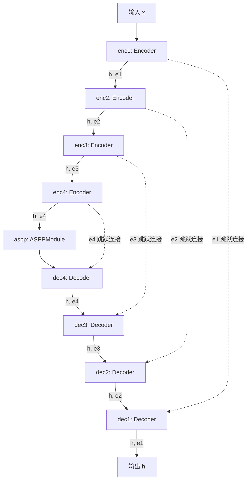
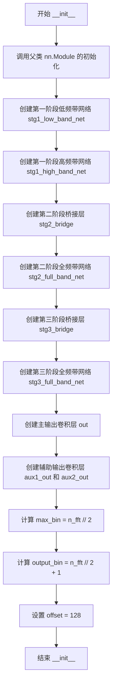
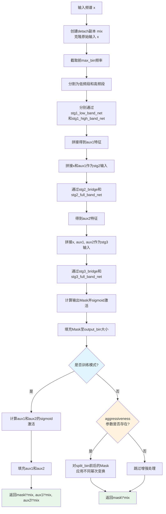

# `Chat-Haruhi-Suzumiya\yuki_builder\video_preprocessing\uvr5\uvr5_pack\lib_v5\nets_123812KB.py` 详细设计文档

这是一个用于音频频谱分离的神经网络模型，采用级联ASPP（Atrous Spatial Pyramid Pooling）结构，通过多阶段网络对音频频谱进行分阶段处理，实现高质量的音频分离或降噪。

## 整体流程

```mermaid
graph TD
    A[开始: forward(x, aggressiveness)] --> B[分离输入: mix = x.detach(), x = x.clone()]
    B --> C[截取频率: x = x[:, :, :self.max_bin]]
    C --> D[分段处理: 将x分为低频和高频两部分]
    D --> E[stg1_low_band_net处理低频, stg1_high_band_net处理高频]
    E --> F[拼接结果: aux1 = concat(low_out, high_out), dim=2]
    F --> G[第二阶段: h = concat(x, aux1), aux2 = stg2_full_band_net(stg2_bridge(h))]
    G --> H[第三阶段: h = concat(x, aux1, aux2), h = stg3_full_band_net(stg3_bridge(h))]
    H --> I[输出mask: mask = sigmoid(self.out(h))]
    I --> J[padding mask到output_bin大小]
    J --> K{是否训练模式?}
    K -- 是 --> L[计算aux1和aux2的sigmoid并padding, 返回mask*mix, aux1*mix, aux2*mix]
    K -- 否 --> M{是否有aggressiveness参数?}
    M -- 是 --> N[根据aggressiveness调整mask的幂指数]
    M -- 否 --> O[返回 mask * mix]
    L --> O
    N --> O
    O[结束]
```

## 类结构

```
nn.Module (PyTorch神经网络基类)
├── BaseASPPNet (基础ASPP网络，包含编码器、ASPP模块和解码器)
└── CascadedASPPNet (级联ASPP网络，用于音频频谱分离)
```

## 全局变量及字段


### `BaseASPPNet.enc1`
    
第一阶段编码器，将输入通道数从nin扩展到ch

类型：`Encoder`
    


### `BaseASPPNet.enc2`
    
第二阶段编码器，将通道数从ch扩展到ch*2

类型：`Encoder`
    


### `BaseASPPNet.enc3`
    
第三阶段编码器，将通道数从ch*2扩展到ch*4

类型：`Encoder`
    


### `BaseASPPNet.enc4`
    
第四阶段编码器，将通道数从ch*4扩展到ch*8

类型：`Encoder`
    


### `BaseASPPNet.aspp`
    
空洞空间金字塔池化模块，用于多尺度特征提取

类型：`ASPPModule`
    


### `BaseASPPNet.dec4`
    
第四阶段解码器，融合通道ch*(8+16)并输出ch*8

类型：`Decoder`
    


### `BaseASPPNet.dec3`
    
第三阶段解码器，融合通道ch*(4+8)并输出ch*4

类型：`Decoder`
    


### `BaseASPPNet.dec2`
    
第二阶段解码器，融合通道ch*(2+4)并输出ch*2

类型：`Decoder`
    


### `BaseASPPNet.dec1`
    
第一阶段解码器，融合通道ch*(1+2)并输出ch

类型：`Decoder`
    


### `CascadedASPPNet.stg1_low_band_net`
    
低频段第一阶段网络，处理低频部分音频特征

类型：`BaseASPPNet`
    


### `CascadedASPPNet.stg1_high_band_net`
    
高频段第一阶段网络，处理高频部分音频特征

类型：`BaseASPPNet`
    


### `CascadedASPPNet.stg2_bridge`
    
第二阶段桥接卷积层，将通道数从34降到16

类型：`Conv2DBNActiv`
    


### `CascadedASPPNet.stg2_full_band_net`
    
第二阶段全频段网络，处理融合后的特征

类型：`BaseASPPNet`
    


### `CascadedASPPNet.stg3_bridge`
    
第三阶段桥接卷积层，将通道数从66降到32

类型：`Conv2DBNActiv`
    


### `CascadedASPPNet.stg3_full_band_net`
    
第三阶段全频段网络，处理更高级特征

类型：`BaseASPPNet`
    


### `CascadedASPPNet.out`
    
输出卷积层，将通道64映射到2，生成最终mask

类型：`nn.Conv2d`
    


### `CascadedASPPNet.aux1_out`
    
辅助输出1卷积层，通道32映射到2，用于训练辅助损失

类型：`nn.Conv2d`
    


### `CascadedASPPNet.aux2_out`
    
辅助输出2卷积层，通道32映射到2，用于训练辅助损失

类型：`nn.Conv2d`
    


### `CascadedASPPNet.max_bin`
    
最大频率bin数，值为n_fft // 2

类型：`int`
    


### `CascadedASPPNet.output_bin`
    
输出频率bin数，值为n_fft // 2 + 1

类型：`int`
    


### `CascadedASPPNet.offset`
    
输出偏移量，值为128，用于裁剪输出

类型：`int`
    
    

## 全局函数及方法


### `BaseASPPNet.__init__`

初始化BaseASPPNet网络结构，包含4个编码器（Encoder）、1个ASPP模块和4个解码器（Decoder），构建一个用于音频处理的U-Net风格深度神经网络架构。

参数：

- `nin`：`int`，输入特征图的通道数（number of input channels）
- `ch`：`int`，基础通道数（base channels），用于确定网络各层的宽度
- `dilations`：`tuple`，ASPP模块中各空洞卷积层的膨胀系数，默认为(4, 8, 16)

返回值：`None`，该方法为构造函数，不返回任何值，仅初始化网络结构

#### 流程图

```mermaid
flowchart TD
    A[开始初始化] --> B[创建编码器1: Encoder<br/>nin → ch<br/>3x3卷积, 步长2]
    B --> C[创建编码器2: Encoder<br/>ch → ch*2<br/>3x3卷积, 步长2]
    C --> D[创建编码器3: Encoder<br/>ch*2 → ch*4<br/>3x3卷积, 步长2]
    D --> E[创建编码器4: Encoder<br/>ch*4 → ch*8<br/>3x3卷积, 步长2]
    E --> F[创建ASPP模块: ASPPModule<br/>ch*8 → ch*16<br/>dilations参数]
    F --> G[创建解码器4: Decoder<br/>ch*(8+16) → ch*8]
    G --> H[创建解码器3: Decoder<br/>ch*(4+8) → ch*4]
    H --> I[创建解码器2: Decoder<br/>ch*(2+4) → ch*2]
    I --> J[创建解码器1: Decoder<br/>ch*(1+2) → ch]
    J --> K[结束初始化]
    
    style A fill:#f9f,stroke:#333
    style K fill:#9f9,stroke:#333
```

#### 带注释源码

```python
def __init__(self, nin, ch, dilations=(4, 8, 16)):
    """
    初始化BaseASPPNet网络结构
    
    构建一个基于ASPP（Atrous Spatial Pyramid Pooling）的U-Net风格网络，
    用于音频频谱图的处理和增强。该网络包含：
    - 4个编码器（Encoder）：逐步下采样特征图
    - 1个ASPP模块：使用多尺度空洞卷积捕获上下文信息
    - 4个解码器（Decoder）：逐步上采样并融合编码器特征
    
    参数:
        nin (int): 输入特征图的通道数，决定网络的起始宽度
        ch (int): 基础通道数，用于计算各层通道数（ch, 2ch, 4ch, 8ch, 16ch）
        dilations (tuple): ASPP模块中空洞卷积的膨胀系数，默认为(4, 8, 16)
                          较大的膨胀系数可以扩大感受野，捕获更广的上下文信息
    
    返回:
        None: 构造函数不返回值，仅初始化网络层
    """
    # 调用父类nn.Module的初始化方法
    super(BaseASPPNet, self).__init__()
    
    # =====================================================
    # 编码器部分（Encoder）
    # 作用：逐步提取特征并降低空间分辨率
    # =====================================================
    
    # 编码器1：将输入nin通道转换为ch通道，空间尺寸下采样2倍
    # 输入: [B, nin, H, W] → 输出: [B, ch, H/2, W/2]
    self.enc1 = layers.Encoder(nin, ch, 3, 2, 1)
    
    # 编码器2：将ch通道转换为ch*2通道，空间尺寸下采样2倍
    # 输入: [B, ch, H/2, W/2] → 输出: [B, ch*2, H/4, W/4]
    self.enc2 = layers.Encoder(ch, ch * 2, 3, 2, 1)
    
    # 编码器3：将ch*2通道转换为ch*4通道，空间尺寸下采样2倍
    # 输入: [B, ch*2, H/4, W/4] → 输出: [B, ch*4, H/8, W/8]
    self.enc3 = layers.Encoder(ch * 2, ch * 4, 3, 2, 1)
    
    # 编码器4：将ch*4通道转换为ch*8通道，空间尺寸下采样2倍
    # 输入: [B, ch*4, H/8, W/8] → 输出: [B, ch*8, H/16, W/16]
    self.enc4 = layers.Encoder(ch * 4, ch * 8, 3, 2, 1)
    
    # =====================================================
    # ASPP模块（Atrous Spatial Pyramid Pooling）
    # 作用：使用多尺度空洞卷积捕获丰富的上下文信息
    # =====================================================
    
    # ASPP模块：接收ch*8通道特征，输出ch*16通道特征
    # 使用不同的膨胀系数(dilations)并行卷积，捕获多尺度信息
    # 输入: [B, ch*8, H/16, W/16] → 输出: [B, ch*16, H/16, W/16]
    self.aspp = layers.ASPPModule(ch * 8, ch * 16, dilations)
    
    # =====================================================
    # 解码器部分（Decoder）
    # 作用：逐步上采样并融合对应编码器的特征，实现精确定位
    # =====================================================
    
    # 解码器4：融合ASPP输出(ch*16)和编码器4特征(ch*8)
    # 通道数从ch*(8+16)降到ch*8，保持空间尺寸不变
    # 输入: [B, ch*16, H/16, W/16] + [B, ch*8, H/16, W/16]
    # → 输出: [B, ch*8, H/16, W/16]
    self.dec4 = layers.Decoder(ch * (8 + 16), ch * 8, 3, 1, 1)
    
    # 解码器3：融合解码器4输出(ch*8)和编码器3特征(ch*4)
    # 通道数从ch*(4+8)降到ch*4
    # 输入: [B, ch*8, H/16, W/16] + [B, ch*4, H/8, W/8]
    # → 输出: [B, ch*4, H/8, W/8]
    self.dec3 = layers.Decoder(ch * (4 + 8), ch * 4, 3, 1, 1)
    
    # 解码器2：融合解码器3输出(ch*4)和编码器2特征(ch*2)
    # 通道数从ch*(2+4)降到ch*2
    # 输入: [B, ch*4, H/8, W/8] + [B, ch*2, H/4, W/4]
    # → 输出: [B, ch*2, H/4, W/4]
    self.dec2 = layers.Decoder(ch * (2 + 4), ch * 2, 3, 1, 1)
    
    # 解码器1：融合解码器2输出(ch*2)和编码器1特征(ch)
    # 通道数从ch*(1+2)降到ch，得到最终输出
    # 输入: [B, ch*2, H/4, W/4] + [B, ch, H/2, W/2]
    # → 输出: [B, ch, H/2, W/2]
    self.dec1 = layers.Decoder(ch * (1 + 2), ch, 3, 1, 1)
```


### `BaseASPPNet.__call__(x)`

该方法实现了 BaseASPPNet 的前向传播逻辑，依次通过四个级联的编码器（Encoder）提取多尺度特征，经过 ASPPModule 进行空洞卷积处理以捕获多尺度上下文信息，再通过四个级联的解码器（Decoder）逐步融合编码器各层的跳跃连接特征，最终返回重构后的特征图。

参数：

- `x`：`torch.Tensor`，输入张量，形状通常为 `(batch_size, channels, height, width)`，代表原始输入特征图

返回值：`torch.Tensor`，经过编码器、ASPPModule和解码器处理后的输出特征图，形状与输入相同或略有变化（取决于网络的下采样和上采样配置）

#### 流程图



#### 带注释源码

```python
def __call__(self, x):
    """
    前向传播方法，实现从输入到输出的完整特征提取与重构过程
    
    参数:
        x: 输入张量，形状为 (batch_size, nin, H, W)，nin 为输入通道数
    
    返回:
        h: 输出张量，形状为 (batch_size, ch, H, W)，ch 为输出通道数
    """
    # 阶段1：编码器前向传播，同时保存各层跳跃连接特征 e1-e4
    # enc1: 第一次下采样，通道数从 nin -> ch
    h, e1 = self.enc1(x)
    
    # enc2: 第二次下采样，通道数从 ch -> ch*2
    h, e2 = self.enc2(h)
    
    # enc3: 第三次下采样，通道数从 ch*2 -> ch*4
    h, e3 = self.enc3(h)
    
    # enc4: 第四次下采样，通道数从 ch*4 -> ch*8
    h, e4 = self.enc4(h)

    # 阶段2：ASPP模块处理，进行空洞卷积以捕获多尺度上下文信息
    # 通道数从 ch*8 -> ch*16
    h = self.aspp(h)

    # 阶段3：解码器前向传播，逐步上采样并融合编码器跳跃连接特征
    # dec4: 第一次上采样，融合 e4，通道数从 ch*24 -> ch*8
    h = self.dec4(h, e4)
    
    # dec3: 第二次上采样，融合 e3，通道数从 ch*12 -> ch*4
    h = self.dec3(h, e3)
    
    # dec2: 第三次上采样，融合 e2，通道数从 ch*6 -> ch*2
    h = self.dec2(h, e2)
    
    # dec1: 第四次上采样，融合 e1，通道数从 ch*3 -> ch
    h = self.dec1(h, e1)

    # 返回最终的解码特征图
    return h
```


### `CascadedASPPNet.__init__`

该方法是 `CascadedASPPNet` 类的构造函数，用于初始化一个三级级联的 ASPP（Atrous Spatial Pyramid Pooling）网络结构。它根据传入的 `n_fft` 参数设置网络的频域相关参数（`max_bin`、`output_bin`），并创建三个阶段的子网络（低频带网络、高频带网络、桥接层、全频带网络）以及输出卷积层，用于音频源分离任务中的掩码预测。

参数：

- `n_fft`：`int`，傅里叶变换的窗口大小，用于计算频域维度的相关参数（如 `max_bin` 和 `output_bin`）

返回值：`None`，该方法为初始化方法，不返回任何值，仅初始化对象的属性

#### 流程图



#### 带注释源码

```python
def __init__(self, n_fft):
    """
    初始化 CascadedASPPNet 网络结构
    
    参数:
        n_fft: int, 傅里叶变换窗口大小，决定频域维度的分辨率
    """
    # 调用 PyTorch nn.Module 的基类构造函数
    super(CascadedASPPNet, self).__init__()
    
    # ====== 第一阶段：低频和高频分离网络 ======
    # 创建低频带网络，处理频谱的低频部分（输入通道2，输出通道32）
    self.stg1_low_band_net = BaseASPPNet(2, 32)
    # 创建高频带网络，处理频谱的高频部分（输入通道2，输出通道32）
    self.stg1_high_band_net = BaseASPPNet(2, 32)
    
    # ====== 第二阶段：桥接层和全频带网络 ======
    # 桥接层：将第一阶段输出(34通道)与原始输入(2通道)融合后降维到16通道
    # 输入通道数=原始输入2 + 低频输出32 + 高频输出32 = 34
    self.stg2_bridge = layers.Conv2DBNActiv(34, 16, 1, 1, 0)
    # 第二阶段全频带网络：将桥接层输出作为输入进行进一步处理
    self.stg2_full_band_net = BaseASPPNet(16, 32)
    
    # ====== 第三阶段：桥接层和全频带网络 ======
    # 桥接层：将第二阶段输出(66通道)与前面所有特征融合后降维到32通道
    # 输入通道数=原始输入2 + 第一阶段输出32 + 第二阶段输出32 = 66
    self.stg3_bridge = layers.Conv2DBNActiv(66, 32, 1, 1, 0)
    # 第三阶段全频带网络：最终的高维特征提取
    self.stg3_full_band_net = BaseASPPNet(32, 64)
    
    # ====== 输出层 ======
    # 主输出卷积层：将64通道特征映射为2通道的掩码（实部和虚部）
    self.out = nn.Conv2d(64, 2, 1, bias=False)
    # 辅助输出卷积层1：将第一阶段输出32通道映射为2通道
    self.aux1_out = nn.Conv2d(32, 2, 1, bias=False)
    # 辅助输出卷积层2：将第二阶段输出32通道映射为2通道
    self.aux2_out = nn.Conv2d(32, 2, 1, bias=False)
    
    # ====== 频域参数 ======
    # 最大频率箱数，等于 n_fft 的一半（对应正频率部分）
    self.max_bin = n_fft // 2
    # 输出频率箱数，等于 n_fft 的一半加1（包含DC和Nyquist频率）
    self.output_bin = n_fft // 2 + 1
    
    # 偏移量，用于预测时裁剪时序维度，默认为128
    self.offset = 128
```


### `CascadedASPPNet.forward`

该方法是CascadedASPPNet类的前向传播核心实现，采用三级级联结构处理音频频谱数据。通过分波段处理（低频/高频）、特征融合与增强Mask生成，实现音频分离或增强功能。在训练模式下返回主输出及两个辅助输出用于多任务学习，在推理模式下支持通过aggressiveness参数调整处理强度以适配不同音频场景。

参数：

- `x`：`torch.Tensor`，输入的音频频谱数据，形状通常为(batch, channels, freq, time)，其中freq对应频率 bins
- `aggressiveness`：`dict` 或 `None`，可选的推理增强参数字典，包含"split_bin"（分割频率点）和"value"（增强强度值），用于在推理时调整Mask的幂次变换

返回值：`torch.Tensor` 或 `tuple`，训练时返回三个张量元组（主Mask输出及两个辅助输出），推理时返回单个Mask张量，所有输出均与输入mix相乘得到最终增强后的频谱

#### 流程图



#### 带注释源码

```python
def forward(self, x, aggressiveness=None):
    """
    CascadedASPPNet的前向传播方法，处理输入音频频谱
    
    参数:
        x: torch.Tensor, 输入频谱张量 (batch, channels, freq_bins, time_frames)
        aggressiveness: dict, 可选的增强参数，包含'split_bin'和'value'
    
    返回:
        训练模式: tuple[torch.Tensor, torch.Tensor, torch.Tensor], (主输出, 辅助输出1, 辅助输出2)
        推理模式: torch.Tensor, 增强后的频谱掩码
    """
    # 步骤1: 保存输入的detach副本用于后续残差连接，克隆原始输入避免梯度回传污染
    mix = x.detach()
    x = x.clone()
    
    # 步骤2: 限制输入频率范围，仅处理前半部分频率bins（self.max_bin = n_fft // 2）
    x = x[:, :, : self.max_bin]
    
    # 步骤3: 计算频谱带宽，将频谱分为低频和高频两部分
    bandw = x.size()[2] // 2
    
    # 步骤4: 第一阶段 - 分波段处理
    # 将频谱分为低频和高频段，分别通过独立的BaseASPPNet处理
    # stg1_low_band_net处理低频部分，stg1_high_band_net处理高频部分
    # 然后在频率维度(dim=2)拼接两部分输出
    aux1 = torch.cat(
        [
            self.stg1_low_band_net(x[:, :, :bandw]),   # 低频段特征提取
            self.stg1_high_band_net(x[:, :, bandw:]), # 高频段特征提取
        ],
        dim=2,  # 在频率维度拼接
    )
    
    # 步骤5: 第二阶段 - 全频段特征融合
    # 将原始频谱x与第一阶段输出aux1在通道维度拼接
    h = torch.cat([x, aux1], dim=1)
    # 通过桥接层调整通道数，然后通过全频段网络处理
    aux2 = self.stg2_full_band_net(self.stg2_bridge(h))
    
    # 步骤6: 第三阶段 - 深度特征融合
    # 将原始频谱、第一阶段输出、第二阶段输出在通道维度拼接
    h = torch.cat([x, aux1, aux2], dim=1)
    # 通过桥接层和全频段网络进行最终特征提取
    h = self.stg3_full_band_net(self.stg3_bridge(h))
    
    # 步骤7: 计算输出Mask
    # 通过1x1卷积生成2通道Mask（可能对应实部和虚部或幅度和相位）
    mask = torch.sigmoid(self.out(h))
    
    # 步骤8: 填充Mask至目标频率bins数量
    # 处理输出频率bins与目标不匹配的情况，使用replicate填充
    mask = F.pad(
        input=mask,
        pad=(0, 0, 0, self.output_bin - mask.size()[2]),  # 只在频率维度填充
        mode="replicate",
    )
    
    # 步骤9: 根据训练/推理模式返回不同结果
    if self.training:
        # 训练模式：返回三个输出用于多任务学习
        # 计算辅助输出1的Mask并填充
        aux1 = torch.sigmoid(self.aux1_out(aux1))
        aux1 = F.pad(
            input=aux1,
            pad=(0, 0, 0, self.output_bin - aux1.size()[2]),
            mode="replicate",
        )
        
        # 计算辅助输出2的Mask并填充
        aux2 = torch.sigmoid(self.aux2_out(aux2))
        aux2 = F.pad(
            input=aux2,
            pad=(0, 0, 0, self.output_bin - aux2.size()[2]),
            mode="replicate",
        )
        
        # 返回三个Mask分别与输入相乘的结果
        return mask * mix, aux1 * mix, aux2 * mix
    else:
        # 推理模式：应用aggressiveness增强（如果提供）
        if aggressiveness:
            # 对低频部分应用较弱的幂次变换
            mask[:, :, : aggressiveness["split_bin"]] = torch.pow(
                mask[:, :, : aggressiveness["split_bin"]],
                1 + aggressiveness["value"] / 3,  # 较弱的增强
            )
            # 对高频部分应用较强的幂次变换
            mask[:, :, aggressiveness["split_bin"] :] = torch.pow(
                mask[:, :, aggressiveness["split_bin"] :],
                1 + aggressiveness["value"],  # 较强的增强
            )
        
        # 返回最终Mask与输入相乘的结果
        return mask * mix
```


### `CascadedASPPNet.predict`

这是 CascadedASPPNet 类的预测方法，调用 forward 方法进行前向传播，然后根据预先设置的 offset 对输出进行裁剪，返回最终的mask。

参数：

- `x_mag`：`torch.Tensor`，输入的幅度谱（magnitude spectrum），通常是从音频频谱中提取的
- `aggressiveness`：`Optional[dict]`，可选的侵略性参数，用于在推理时调整mask的强度，包含 `split_bin` 和 `value` 键

返回值：`torch.Tensor`，裁剪后的mask张量，形状为 (batch, 2, freq_bins, time_frames)

#### 流程图

```mermaid
flowchart TD
    A[开始 predict] --> B[调用 self.forward 方法]
    B --> C{hself.offset > 0?}
    C -->|是| D[裁剪输出: h = h[:, :, :, self.offset:-self.offset]]
    C -->|否| E[不裁剪]
    D --> F[返回裁剪后的 h]
    E --> F
```

#### 带注释源码

```python
def predict(self, x_mag, aggressiveness=None):
    """
    预测方法：执行前向传播并裁剪输出
    
    参数:
        x_mag: 输入的幅度谱张量
        aggressiveness: 可选的侵略性参数字典，用于调整mask
    
    返回:
        裁剪后的mask张量
    """
    # 步骤1: 调用 forward 方法进行前向传播，获取mask
    h = self.forward(x_mag, aggressiveness)

    # 步骤2: 检查是否需要裁剪（offset > 0）
    if self.offset > 0:
        # 步骤3: 根据offset对输出进行左右对称裁剪
        # 移除左右两侧的offset个时间帧
        h = h[:, :, :, self.offset : -self.offset]
        
        # 断言确保裁剪后仍有有效的宽度
        assert h.size()[3] > 0

    # 步骤4: 返回最终的mask
    return h
```

## 关键组件


### 张量索引与切片操作

在CascadedASPPNet的forward方法中，通过张量切片实现频带分割和特征提取。使用x[:, :, : self.max_bin]限制频率范围，x[:, :, :bandw]和x[:, :, bandw:]分别提取低频和高频带，以及h[:, :, :, self.offset : -self.offset]进行时域偏移裁剪，实现情性加载和特征对齐。

### 反量化支持

通过sigmoid激活函数和元素级乘法操作实现反量化。mask = torch.sigmoid(self.out(h))将输出映射到(0,1)区间，然后mask * mix实现与原始输入的乘积，恢复量化后的幅度谱。在训练模式下还对aux1和aux2进行相同的sigmoid处理。

### 级联多频带网络架构

CascadedASPPNet采用三级级联结构：stage1使用两个并行的BaseASPPNet分别处理低频和高频带，stage2通过stg2_bridge融合原始输入和stage1输出，stage3进一步融合形成完整特征。最后通过out卷积层输出最终mask，实现多粒度的频谱分析。

###  aggressiveness参数控制

在forward方法的推理模式下，通过aggressiveness字典参数动态调整mask的幂次。split_bin之前和之后的频带使用不同的幂次因子(1 + value/3和1 + value)，实现对不同频带的不同强度处理，增强语音分离的攻击性或平滑度。

### 辅助输出与多任务学习

在训练模式下返回三个输出：主输出mask * mix，以及两个辅助输出aux1 * mix和aux2 * mix。这些辅助输出来自中间层级，通过aux1_out和aux2_out卷积生成，实现多任务学习特征共享和梯度监督。

### 频谱填充与分辨率匹配

使用F.pad配合replicate模式对输出进行填充，确保输出频率bin数量匹配target_bin (n_fft//2 + 1)。通过mask.size()[2]和aux1.size()[2]与output_bin的比较，动态填充缺失的频率分辨率，保持输出尺寸一致性。


## 问题及建议


### 已知问题

- **Magic Numbers和硬编码值**：存在多个硬编码的魔法数字，如`offset = 128`、通道数倍数(32, 64)、以及`1 + aggressiveness["value"] / 3`中的除数3，缺乏配置化
- **forward方法职责过重**：同时处理训练/推理模式、辅助输出、aggressiveness参数和padding操作，违反单一职责原则
- **类型提示完全缺失**：所有参数、返回值均无类型注解，降低代码可维护性和IDE支持
- **重复代码模式**：多处出现相同的`sigmoid + F.pad`模式，代码冗余
- **使用已弃用的API**：使用`tensor.size()[2]`而非`tensor.shape[2]`或`tensor.size(2)`
- **可变状态与不必要的内存复制**：使用`x.detach()`和`x.clone()`创建mix副本，在推理时造成额外内存开销
- **命名不规范**：模块名`layers_123821KB`包含随机后缀，变量名如`h`、`e1`、`e2`、`bandw`缺乏描述性
- **API设计不一致**：`forward`和`predict`方法职责混淆，`predict`实际执行裁剪后处理
- **字典参数无约束**：`aggressiveness`参数使用dict传递，无类型和键名约束，易导致运行时错误
- **缺少模块级文档**：无docstring说明模块用途、输入输出格式
- **未使用模型配置类**：网络超参数（如通道数、层数）直接硬编码，难以复用和扩展

### 优化建议

- 提取魔法数字为配置类或初始化参数，如`self.offset`应由构造函数传入
- 将`forward`方法拆分为独立的`_forward_train`和`_forward_inference`方法，或使用`forward`+`inference`模式
- 为所有方法添加类型注解（PyTorch typing），包括`Tensor`类型
- 封装`apply_sigmoid_and_pad`辅助方法消除重复代码
- 统一使用`tensor.shape`或`tensor.size(dim)`API
- 考虑在推理时避免不必要的`clone()`，或使用`torch.no_grad()`上下文
- 重命名变量为描述性名称（如`encoder_output_1`替代`e1`）
- 定义`Aggressiveness` dataclass或TypedDict约束参数结构
- 为类和关键方法添加docstring文档
- 创建`ASPPNetConfig`配置类统一管理网络架构参数


## 其它


### 设计目标与约束

本代码实现了一个基于ASPP（Atrous Spatial Pyramid Pooling）架构的深度神经网络，用于音乐源分离（Music Source Separation）任务。核心目标是利用多尺度空洞卷积和级联结构，实现高效的频域音频分离。设计约束包括：1) 输入必须是复数频谱（2通道：实部和虚部）；2) 支持可配置的FFT大小（通过n_fft参数）；3) 模型在训练和推理阶段行为不同（训练时返回辅助输出）；4) 依赖PyTorch框架。

### 错误处理与异常设计

1. **输入维度检查**：代码未显式检查输入张量维度，若输入不是4D张量（batch, channel, freq, time），可能在底层运算时抛出错误。2. **边界条件处理**：在predict方法中，当offset大于0时，代码断言h.size()[3] > 0，但未对offset超过实际张量宽度的场景进行预判。3. **padding模式**：使用"replicate"模式进行padding，当mask尺寸小于output_bin时有效，但未处理负数情况。

### 数据流与状态机

数据流分为三个阶段：**Stage 1**将输入频谱按频率分为低频和高频两个band，分别通过stg1_low_band_net和stg1_high_band_net处理，输出拼接后得到aux1；**Stage 2**将原始输入与aux1拼接，通过stg2_bridge和stg2_full_band_net得到aux2；**Stage 3**将原始输入、aux1、aux2拼接，经stg3_bridge和stg3_full_band_net处理，最终通过sigmoid和padding生成mask。状态转换由self.training布尔值控制，训练时返回(mask, aux1, aux2)，推理时仅返回mask*mix。

### 外部依赖与接口契约

主要依赖包括：1) torch >= 1.0（张量运算和自动求导）；2) torch.nn（神经网络模块）；3) torch.nn.functional（功能性操作如F.pad、F.sigmoid）；4) 自定义模块layers_123821KB（需包含Encoder、Decoder、ASPPModule、Conv2DBNActiv等类）。输入契约：forward方法接受x（4D张量，shape=[B, 2, F, T]）和可选的aggressiveness字典。输出契约：训练时返回三个mask的逐元素乘积，推理时返回单个mask的乘积。

### 性能考虑与优化空间

1. **计算优化**：级联结构存在重复计算（x在每个stage都被拼接），可考虑特征复用；2. **内存优化**：训练时保存三个输出，推理时可释放中间结果；3. **padding开销**：每次forward调用都进行F.pad操作，可考虑在模型外部预处理；4. **GPU利用率**：建议检查batch size配置和CUDA同步情况；5. **空洞卷积**：ASPP模块使用大 dilation rate (4,8,16)，需确保特征图尺寸足够大以避免gridding artifact。

### 配置参数说明

| 参数名 | 类型 | 说明 |
|--------|------|------|
| n_fft | int | FFT窗口大小，决定频谱分辨率，max_bin = n_fft // 2 |
| nin | int | 输入通道数（本代码固定为2，代表实部和虚部） |
| ch | int | 基础通道数，用于各层通道计算 |
| dilations | tuple | ASPP模块的空洞率，默认为(4, 8, 16) |
| offset | int | 输出时去除的边缘帧数，默认为128 |
| aggressiveness | dict | 推理时的 aggressiveness 控制参数，包含split_bin和value |

### 使用示例

```python
# 初始化模型
n_fft = 2048
model = CascadedASPPNet(n_fft=n_fft)

# 推理模式
model.eval()
x = torch.randn(1, 2, 1025, 100)  # [batch, 2, freq, time]
mask = model(x)

# 训练模式
model.train()
mask, aux1, aux2 = model(x)

# 带aggressiveness的推理
aggressiveness = {"split_bin": 100, "value": 0.5}
mask = model(x, aggressiveness=aggressiveness)
```

### 训练/推理行为差异

模型存在显著的training/inference行为差异：1) forward方法在training模式下返回三个输出（主输出+两个辅助输出），在eval模式下仅返回主输出；2) 辅助输出（aux1, aux2）仅在training时计算并返回，增加了训练时的计算量；3) aggressiveness参数仅在eval模式（self.training=False）时生效，训练时忽略该参数；4) 这种设计可能导致导出ONNX或TorchScript时出现问题，需要特别处理。

### 模块间的通信方式

模块间通过张量拼接（torch.cat）进行信息传递：1) enc1-enc4按顺序级联，每层输出hidden state和encoder feature；2) dec4-dec1按顺序级联，每层接收hidden和对应的encoder feature；3) CascadedASPPNet中各stage通过torch.cat在channel维度拼接（dim=1），frequency维度拼接（dim=2）；4) Encoder特征通过skip connection传递给Decoder，形成U-Net风格的架构。

### 内存管理与资源释放

1. **中间张量**：每个stage的中间结果（aux1, aux2, h）会被后续操作引用，建议在不需要时手动释放；2. **detach使用**：代码中mix = x.detach()用于切断梯度链，减少显存占用；3. **clone操作**：x = x.clone()确保后续操作不影响原始输入；4. **大尺寸张量**：当n_fft较大时，频谱矩阵可能占用大量显存，需注意batch size的设置。

### 版本兼容性与环境要求

1. **Python版本**：建议Python 3.6+；2. **PyTorch版本**：建议1.0以上，测试时使用1.x版本；3. **自定义层**：layers_123821KB模块需与当前PyTorch版本兼容；4. **设备支持**：代码未显式指定device，需确保模型和数据在同一设备（CPU/GPU）上；5. **onnx导出**：由于training/inference行为差异，导出ONNX时需注意控制流处理。

### 潜在改进建议

1. **添加输入验证**：在forward方法开头添加输入维度、类型检查；2. **统一接口**：考虑将aggressiveness参数移至构造函数或使用配置类；3. **模块化**：将三个stage拆分为独立模块，提高可复用性；4. **动态图优化**：考虑使用torch.jit优化推理速度；5. **文档完善**：为Encoder、Decoder、ASPPModule等底层模块添加文档；6. **单元测试**：添加针对各模块的单元测试，特别是边界情况。


    