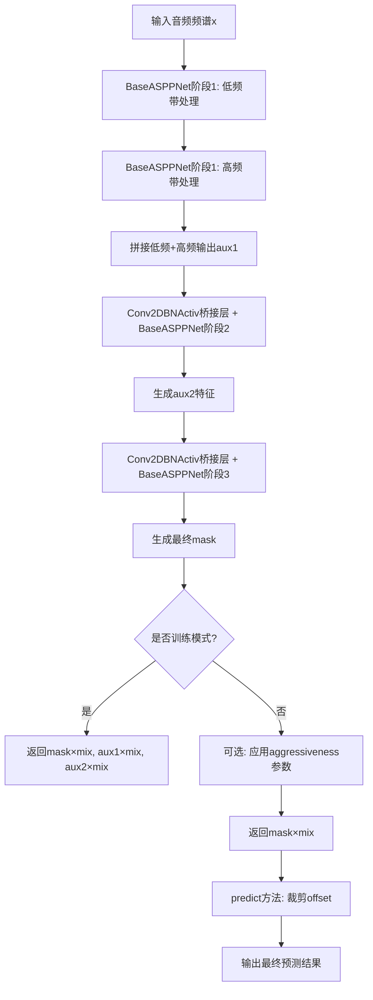
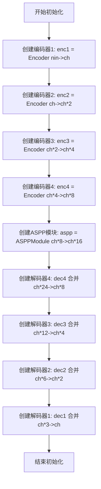
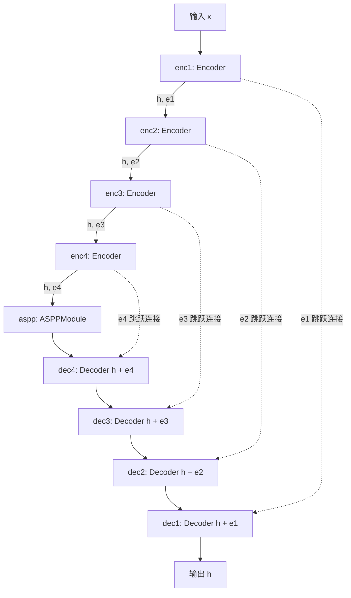
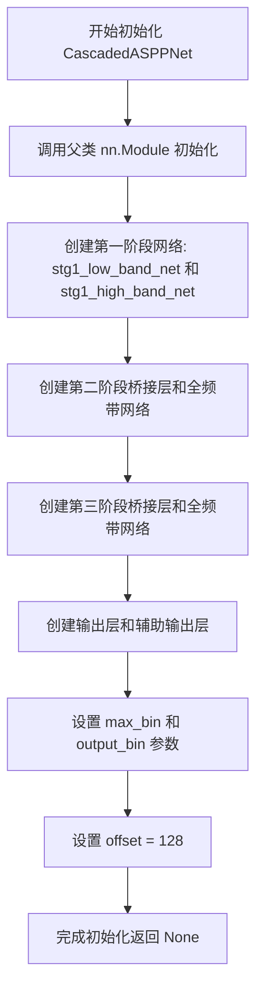
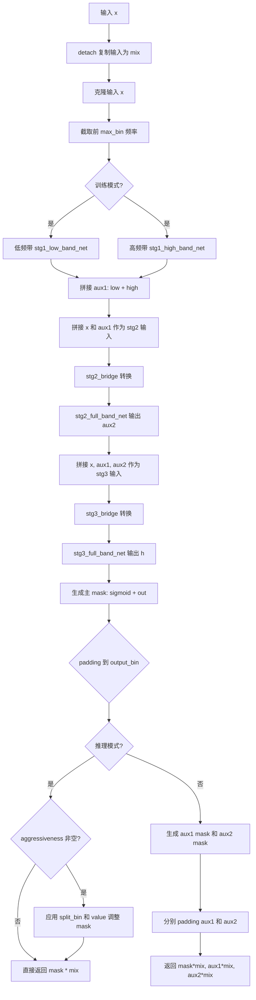
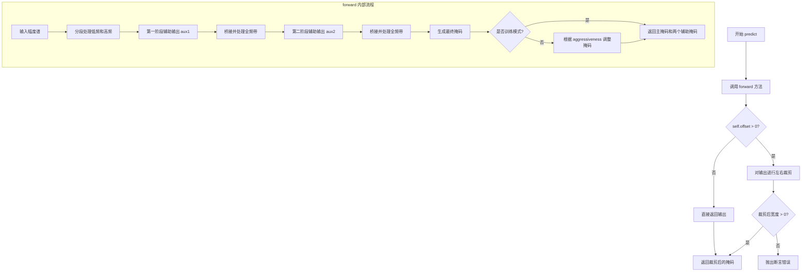

# `Chat-Haruhi-Suzumiya\yuki_builder\video_preprocessing\uvr5\uvr5_pack\lib_v5\nets_123821KB.py` 详细设计文档

这是一个基于ASPP(空洞空间金字塔池化)的深度神经网络，用于音频频谱分离和语音增强任务，采用三级级联结构分别处理低频、高频和全频带信号。

## 整体流程



## 类结构

```
nn.Module (PyTorch基类)
└── BaseASPPNet (基础ASPP网络)
    └── CascadedASPPNet (级联ASPP网络)
```

## 全局变量及字段


### `torch`
    
PyTorch深度学习框架主模块

类型：`module`
    


### `nn`
    
PyTorch神经网络模块

类型：`module`
    


### `F`
    
PyTorch函数式API模块

类型：`module`
    


### `layers`
    
自定义网络层模块layers_123821KB

类型：`module`
    


### `BaseASPPNet.enc1`
    
第一阶段编码器

类型：`Encoder`
    


### `BaseASPPNet.enc2`
    
第二阶段编码器

类型：`Encoder`
    


### `BaseASPPNet.enc3`
    
第三阶段编码器

类型：`Encoder`
    


### `BaseASPPNet.enc4`
    
第四阶段编码器

类型：`Encoder`
    


### `BaseASPPNet.aspp`
    
ASPP模块

类型：`ASPPModule`
    


### `BaseASPPNet.dec4`
    
第四阶段解码器

类型：`Decoder`
    


### `BaseASPPNet.dec3`
    
第三阶段解码器

类型：`Decoder`
    


### `BaseASPPNet.dec2`
    
第二阶段解码器

类型：`Decoder`
    


### `BaseASPPNet.dec1`
    
第一阶段解码器

类型：`Decoder`
    


### `CascadedASPPNet.stg1_low_band_net`
    
低频带处理网络

类型：`BaseASPPNet`
    


### `CascadedASPPNet.stg1_high_band_net`
    
高频带处理网络

类型：`BaseASPPNet`
    


### `CascadedASPPNet.stg2_bridge`
    
阶段2桥接层

类型：`Conv2DBNActiv`
    


### `CascadedASPPNet.stg2_full_band_net`
    
阶段2全频带网络

类型：`BaseASPPNet`
    


### `CascadedASPPNet.stg3_bridge`
    
阶段3桥接层

类型：`Conv2DBNActiv`
    


### `CascadedASPPNet.stg3_full_band_net`
    
阶段3全频带网络

类型：`BaseASPPNet`
    


### `CascadedASPPNet.out`
    
最终输出卷积层

类型：`nn.Conv2d`
    


### `CascadedASPPNet.aux1_out`
    
辅助输出1卷积层

类型：`nn.Conv2d`
    


### `CascadedASPPNet.aux2_out`
    
辅助输出2卷积层

类型：`nn.Conv2d`
    


### `CascadedASPPNet.max_bin`
    
最大频谱bin数

类型：`int`
    


### `CascadedASPPNet.output_bin`
    
输出频谱bin数

类型：`int`
    


### `CascadedASPPNet.offset`
    
输出裁剪偏移量

类型：`int`
    
    

## 全局函数及方法


### `BaseASPPNet.__init__`

初始化 BaseASPPNet 的编码器-解码器架构，包含4个编码器层、ASPP模块和4个解码器层，用于音频频谱处理。

参数：

- `nin`：`int`，输入通道数
- `ch`：`int`，基础通道数，用于计算各层通道数
- `dilations`：`tuple`，ASPP模块的膨胀卷积参数，默认为 (4, 8, 16)

返回值：`None`，构造函数无返回值

#### 流程图



#### 带注释源码

```python
def __init__(self, nin, ch, dilations=(4, 8, 16)):
    """
    初始化BaseASPPNet网络结构
    
    参数:
        nin: int, 输入通道数
        ch: int, 基础通道数
        dilations: tuple, ASPP模块膨胀卷积的 dilation rates
    """
    # 调用父类nn.Module的初始化方法
    super(BaseASPPNet, self).__init__()
    
    # === 编码器部分 (4个stage，逐级下采样) ===
    # enc1: 输入nin通道 -> 输出ch通道, 步长2进行下采样
    self.enc1 = layers.Encoder(nin, ch, 3, 2, 1)
    # enc2: 输入ch通道 -> 输出ch*2通道, 步长2进行下采样
    self.enc2 = layers.Encoder(ch, ch * 2, 3, 2, 1)
    # enc3: 输入ch*2通道 -> 输出ch*4通道, 步长2进行下采样
    self.enc3 = layers.Encoder(ch * 2, ch * 4, 3, 2, 1)
    # enc4: 输入ch*4通道 -> 输出ch*8通道, 步长2进行下采样
    self.enc4 = layers.Encoder(ch * 4, ch * 8, 3, 2, 1)
    
    # === ASPP模块 (空洞空间金字塔池化) ===
    # 接收enc4的输出(ch*8)，输出ch*16通道
    self.aspp = layers.ASPPModule(ch * 8, ch * 16, dilations)
    
    # === 解码器部分 (4个stage，逐级上采样，跳跃连接) ===
    # dec4: 合并ASPP输出(ch*16)和enc4特征图(ch*8) -> 输出ch*8
    self.dec4 = layers.Decoder(ch * (8 + 16), ch * 8, 3, 1, 1)
    # dec3: 合并dec4输出和enc3特征图 -> 输出ch*4
    self.dec3 = layers.Decoder(ch * (4 + 8), ch * 4, 3, 1, 1)
    # dec2: 合并dec3输出和enc2特征图 -> 输出ch*2
    self.dec2 = layers.Decoder(ch * (2 + 4), ch * 2, 3, 1, 1)
    # dec1: 合并dec2输出和enc1特征图 -> 输出ch(原始基础通道数)
    self.dec1 = layers.Decoder(ch * (1 + 2), ch, 3, 1, 1)
```


### `BaseASPPNet.__call__(x)`

该方法是 `BaseASPPNet` 类的前向传播入口，通过__call__方法实现自动调用，执行编码器(Encoder)→ASPP多尺度特征提取→解码器(Decoder)的U型网络结构，对输入频谱特征进行逐级编码、融合与解码，最终输出与输入分辨率相同的特征表示。

参数：

- `x`：`torch.Tensor`，输入的2D特征张量，通常为音频频谱数据，形状为 (batch, channels, freq, time)

返回值：`torch.Tensor`，解码后的特征张量，形状与输入x相同 (batch, channels, freq, time)

#### 流程图



#### 带注释源码

```python
def __call__(self, x):
    """
    前向传播函数，通过__call__方法实现，使实例可以像函数一样被调用
    
    参数:
        x: torch.Tensor, 输入张量，形状为 (batch, nin, freq, time)
           nin 为输入通道数，与初始化时的 nin 参数一致
    
    返回值:
        torch.Tensor, 输出张量，形状为 (batch, ch, freq, time)
           输出通道数 ch 与初始化时的通道数一致
    """
    
    # ===== 编码阶段 (Encoder) =====
    # 逐级提取特征，每次下采样将空间维度缩小为原来的一半
    
    # 编码器1: 将 nin 通道转换为 ch 通道，空间维度下采样2倍
    h, e1 = self.enc1(x)   # h: (batch, ch, freq/2, time/2), e1: 跳跃连接特征
    h, e2 = self.enc2(h)   # 编码器2: ch -> ch*2
    h, e3 = self.enc3(h)   # 编码器3: ch*2 -> ch*4
    h, e4 = self.enc4(h)   # 编码器4: ch*4 -> ch*8，下采样完成
    
    # ===== ASPP 多尺度特征提取 =====
    # ASPP (Atrous Spatial Pyramid Pooling) 模块
    # 使用多个不同膨胀率的空洞卷积捕获多尺度上下文信息
    # 输入: ch*8 通道，输出: ch*16 通道
    h = self.aspp(h)
    
    # ===== 解码阶段 (Decoder) =====
    # 逐级上采样恢复空间分辨率，并融合对应编码器的跳跃连接特征
    
    # 解码器4: 融合 aspp 输出与 enc4 的跳跃连接 e4
    h = self.dec4(h, e4)   # 上采样 + 特征融合
    h = self.dec3(h, e3)   # 解码器3
    h = self.dec2(h, e2)   # 解码器2
    h = self.dec1(h, e1)   # 解码器1，输出通道恢复为 ch
    
    return h  # 返回最终解码结果
```


### `CascadedASPPNet.__init__`

该方法是 CascadedASPPNet 类的构造函数，用于初始化一个三级级联的音频频谱处理网络架构。该网络包含三个阶段：第一阶段将输入频谱分为低频和高频两个子带分别处理；第二阶段通过桥接层融合输入和第一阶段输出，进行全频带处理；第三阶段进一步融合前两阶段结果进行最终处理。此外还初始化了输出卷积层、辅助输出卷积层以及与FFT大小相关的配置参数。

参数：

- `n_fft`：`int`，表示快速傅里叶变换（FFT）的点数，决定了频谱的分辨率

返回值：`None`，该方法为构造函数，不返回任何值

#### 流程图



#### 带注释源码

```
def __init__(self, n_fft):
    """
    初始化级联ASPP网络结构
    
    参数:
        n_fft: FFT点数,决定频谱分辨率
    """
    # 调用父类nn.Module的初始化方法,注册所有子模块
    super(CascadedASPPNet, self).__init__()
    
    # ==================== 第一阶段: 分频带处理 ====================
    # 创建低频带处理网络,输入2通道(可能是实部/虚部或幅值/相位),输出32通道
    self.stg1_low_band_net = BaseASPPNet(2, 32)
    # 创建高频带处理网络,结构与低频带网络相同
    self.stg1_high_band_net = BaseASPPNet(2, 32)
    
    # ==================== 第二阶段: 全频带处理 ====================
    # 桥接层: 将原始输入(2通道)与第一阶段输出(32通道)拼接为34通道
    # 卷积核1x1,步长1,填充0,输出16通道,包含BatchNorm和Activation
    self.stg2_bridge = layers.Conv2DBNActiv(34, 16, 1, 1, 0)
    # 第二阶段全频带网络,输入16通道,输出32通道
    self.stg2_full_band_net = BaseASPPNet(16, 32)
    
    # ==================== 第三阶段: 高级全频带处理 ====================
    # 桥接层: 拼接原始输入(2通道)、第一阶段输出(32通道)、第二阶段输出(32通道)
    # 共66通道 -> 32通道
    self.stg3_bridge = layers.Conv2DBNActiv(66, 32, 1, 1, 0)
    # 第三阶段全频带网络,输入32通道,输出64通道
    self.stg3_full_band_net = BaseASPPNet(32, 64)
    
    # ==================== 输出层 ====================
    # 主输出卷积: 64通道 -> 2通道,用于生成最终掩码
    self.out = nn.Conv2d(64, 2, 1, bias=False)
    # 辅助输出1: 32通道 -> 2通道,用于第一阶段输出
    self.aux1_out = nn.Conv2d(32, 2, 1, bias=False)
    # 辅助输出2: 32通道 -> 2通道,用于第二阶段输出
    self.aux2_out = nn.Conv2d(32, 2, 1, bias=False)
    
    # ==================== 频谱参数配置 ====================
    # 最大频率bin数,等于n_fft的一半(因为频谱对称)
    self.max_bin = n_fft // 2
    # 输出频率bin数,等于n_fft的一半加1(包含DC分量)
    self.output_bin = n_fft // 2 + 1
    
    # 偏移量参数,用于预测时裁剪输出
    self.offset = 128
```


### `CascadedASPPNet.forward(x, aggressiveness)`

该方法实现了 `CascadedASPPNet` 的核心前向传播逻辑，采用三阶段级联结构处理音频频谱输入。方法支持训练和推理两种模式：训练时输出主 mask 及两个辅助 mask 用于多任务学习，推理时根据可选的 aggressiveness 参数动态调整噪声抑制强度。

#### 参数

- `self`：`CascadedASPPNet` 实例本身，无需显式传递。
- `x`：`torch.Tensor`，输入的音频频谱张量，形状通常为 (batch, channels, freq_bins, time_frames)，channels 通常为 2（复数的实部和虚部）。
- `aggressiveness`：`Dict` 或 `None`，可选参数。包含以下键值对：
  - `split_bin`：`int`，频率分割点索引，用于区分低频和高频区域的处理强度。
  - `value`：`float`，强度因子，用于控制 mask 的非线性变换程度。

#### 返回值

- 训练模式（`self.training == True`）：返回三个 `torch.Tensor` 组成的元组 `(main_output, aux1_output, aux2_output)`，分别为主、去交织低频带和高频带的预测结果与输入的乘积。
- 推理模式（`self.training == False`）：返回单个 `torch.Tensor`，为最终预测 mask 与输入的乘积。

#### 流程图



#### 带注释源码

```python
def forward(self, x, aggressiveness=None):
    """
    CascadedASPPNet 的前向传播方法。

    参数:
        x (torch.Tensor): 输入张量，形状 (batch, channels, freq, time)。
        aggressiveness (dict, optional): 推理时的强度控制参数，包含 'split_bin' 和 'value'。

    返回值:
        torch.Tensor 或 tuple: 推理时返回 mask * mix；训练时返回 (mask * mix, aux1 * mix, aux2 * mix)。
    """
    # 步骤1：备份输入用于后续残差连接（训练时用作目标）
    mix = x.detach()
    # 克隆输入以避免修改原始张量
    x = x.clone()

    # 步骤2：截取有效频率范围（去除高频部分，因为 FFT 对称性，高频部分冗余）
    x = x[:, :, : self.max_bin]

    # 步骤3：计算频率带宽，并将频谱分为低频和高频两部分
    bandw = x.size()[2] // 2
    # 阶段1：分别处理低频和高频带
    aux1 = torch.cat(
        [
            # 处理低频部分 (0 到 bandw)
            self.stg1_low_band_net(x[:, :, :bandw]),
            # 处理高频部分 (bandw 到 max_bin)
            self.stg1_high_band_net(x[:, :, bandw:]),
        ],
        dim=2,  # 在频率维度拼接
    )

    # 步骤4：阶段2处理，将原始频谱与阶段1输出拼接作为输入
    h = torch.cat([x, aux1], dim=1)  # 通道维度拼接
    # 通过桥接层转换通道数，然后通过全频带网络
    aux2 = self.stg2_full_band_net(self.stg2_bridge(h))

    # 步骤5：阶段3处理，进一步拼接更多上下文信息
    h = torch.cat([x, aux1, aux2], dim=1)
    # 通过桥接层和全频带网络得到最终特征
    h = self.stg3_full_band_net(self.stg3_bridge(h))

    # 步骤6：生成主 mask 并应用 sigmoid 激活
    mask = torch.sigmoid(self.out(h))
    # 步骤7：padding 到目标频率 bins 数量（处理最后阶段的降采样导致的空间缩小）
    mask = F.pad(
        input=mask,
        pad=(0, 0, 0, self.output_bin - mask.size()[2]),  # 只在频率维度右侧填充
        mode="replicate",
    )

    # 步骤8：判断当前模式
    if self.training:
        # === 训练模式：返回多个输出用于多任务学习 ===
        # 生成辅助 mask 1
        aux1 = torch.sigmoid(self.aux1_out(aux1))
        aux1 = F.pad(
            input=aux1,
            pad=(0, 0, 0, self.output_bin - aux1.size()[2]),
            mode="replicate",
        )
        # 生成辅助 mask 2
        aux2 = torch.sigmoid(self.aux2_out(aux2))
        aux2 = F.pad(
            input=aux2,
            pad=(0, 0, 0, self.output_bin - aux2.size()[2]),
            mode="replicate",
        )
        # 返回主输出和两个辅助输出，分别与原始输入相乘
        return mask * mix, aux1 * mix, aux2 * mix
    else:
        # === 推理模式：应用 aggressiveness 参数（如果提供）===
        if aggressiveness:
            # 对低频部分应用较弱的非线性变换
            mask[:, :, : aggressiveness["split_bin"]] = torch.pow(
                mask[:, :, : aggressiveness["split_bin"]],
                1 + aggressiveness["value"] / 3,  # 较弱的影响
            )
            # 对高频部分应用较强的非线性变换
            mask[:, :, aggressiveness["split_bin"] :] = torch.pow(
                mask[:, :, aggressiveness["split_bin"] :],
                1 + aggressiveness["value"],  # 较强的影响
            )

        # 返回最终的 mask 与原始输入的乘积
        return mask * mix
```


### `CascadedASPPNet.predict`

该方法是 `CascadedASPPNet` 类的预测接口，通过调用内部 `forward` 方法获取掩码输出，并根据预设的 `offset` 值对输出进行左右对称裁剪，以适配不同的输出尺寸需求。

参数：

- `x_mag`：`torch.Tensor`，输入的幅度谱（magnitude spectrum），通常为 4D 张量，形状为 (batch, channels, freq, time)
- `ag aggressiveness`：`Optional[Dict]`，可选参数，用于控制掩码的 aggressiveness 强度，包含 `split_bin` 和 `value` 键值对，默认为 `None`

返回值：`torch.Tensor`，裁剪后的掩码张量，形状为 (batch, 2, freq, time - 2*offset)

#### 流程图



#### 带注释源码

```python
def predict(self, x_mag, aggressiveness=None):
    """
    预测方法，对 forward 的输出进行后处理（裁剪）后返回
    
    参数:
        x_mag: 输入的幅度谱张量
        aggressiveness: 可选的 aggressiveness 参数，用于调整掩码强度
    
    返回:
        裁剪后的掩码张量
    """
    # 调用 forward 方法进行前向传播，获取掩码输出
    h = self.forward(x_mag, aggressiveness)

    # 检查是否需要进行 offset 裁剪
    if self.offset > 0:
        # 对输出张量的时间维度（最后一个维度）进行左右对称裁剪
        # 裁剪宽度为 self.offset（默认为 128）
        h = h[:, :, :, self.offset : -self.offset]
        # 确保裁剪后输出宽度大于 0，避免空张量
        assert h.size()[3] > 0

    # 返回处理后的掩码
    return h
```

## 关键组件


### 1. 张量索引与频带分割

在`CascadedASPPNet.forward()`方法中，通过切片操作`x[:, :, : self.max_bin]`和`x[:, :, :bandw]`、`x[:, :, bandw:]`实现频谱张量的低频和高频带分割，将完整频谱划分为低频段和高频段分别进行处理。

### 2. 惰性加载与动态裁剪

通过`predict()`方法中的`self.offset`参数实现输出张量的动态裁剪：`h = h[:, :, :, self.offset : -self.offset]`，在推理时去除边缘部分，实现惰性加载效果，避免处理不需要的边界区域。

### 3. 反量化支持与掩码生成

代码支持两种模式：训练模式返回主掩码和两个辅助掩码（aux1, aux2），推理模式返回单一掩码。所有掩码通过`sigmoid`激活函数映射到(0,1)范围，与输入混合信号相乘实现频谱掩码应用。

### 4. 量化策略与攻击性参数

`aggressiveness`参数控制掩码的激进程度，通过幂函数变换`torch.pow(mask, 1 + aggressiveness["value"])`对不同频带应用不同强度的非线性增强，实现自适应量化策略。

### 5. 多阶段级联结构

采用三级级联架构：Stage 1进行低频/高频分别处理，Stage 2进行全频带融合，Stage 3进一步增强。各阶段通过桥接层`stg2_bridge`和`stg3_bridge`实现维度变换和特征传递。

### 6. 辅助输出与多任务学习

在训练模式下返回三个输出：主掩码和两个辅助掩码（分别来自Stage 1和Stage 2的输出），支持多任务学习策略，通过`aux1_out`和`aux2_out`卷积层生成。

### 7. 边界填充与尺寸对齐

使用`F.pad`配合`replicate`模式对输出掩码进行填充，确保输出频谱 bins 数量与目标`output_bin`一致，解决下采样导致的尺寸不匹配问题。

### 8. 特征通道聚合

解码器采用跳跃连接设计，如`Decoder(ch * (8 + 16), ch * 8, 3, 1, 1)`通过通道拼接实现编码器特征与解码器特征的聚合，恢复空间分辨率的同时保留多尺度信息。


## 问题及建议


### 已知问题

-   **非标准前向传播方法**：BaseASPPNet使用`__call__`而非标准的`forward`方法命名，与PyTorch惯例不符，可能导致与`torch.nn.Sequential`等组件集成时出现问题。
-   **硬编码的Magic Numbers**：通道数(如34, 16, 66, 32)、`offset=128`、`max_bin`、`output_bin`等关键参数被硬编码，缺乏灵活配置能力。
-   **重复的Padding代码**：多处使用相同的`F.pad` + `mode="replicate"`模式进行频率维度填充，代码重复未抽象。
-   **训练/推理逻辑耦合**：forward方法中通过`self.training`判断处理逻辑，导致训练和推理路径在同一个方法中，增加代码复杂性和潜在的推理开销。
-   **aggressiveness参数设计不清晰**：使用字典传递参数且包含magic key（如"split_bin", "value"），缺乏接口契约和类型约束。
-   **变量命名不具描述性**：使用`h`, `e1`, `e2`, `stg1`等缩写命名，影响代码可读性和可维护性。
-   **缺少类型注解**：无任何类型提示(Type Hints)，不利于静态分析和IDE支持。
-   **文档字符串缺失**：类和方法均无docstring说明功能、参数和返回值。
-   **forward与predict职责重叠**：两者功能相近但边界模糊，predict中的切片逻辑与offset耦合较深。
-   **潜在的维度假设**：代码假设输入至少有指定大小的频率bins，未进行运行时维度验证。

### 优化建议

-   将BaseASPPNet的`__call__`重命名为`forward`，遵循PyTorchnn.Module标准约定。
-   将硬编码的通道数、offset等参数提取为构造函数的可配置参数，或使用配置文件/YAML管理。
-   封装Padding操作为辅助方法或模块，如`pad_to_target_bins(tensor, target_bins)`。
-   考虑将训练时的辅助输出逻辑分离到独立的损失计算或训练步骤中，简化forward方法为纯推理逻辑。
-   定义`Aggressiveness` dataclass或NamedTuple替代字典，明确参数结构：包含`split_bin: int`和`value: float`字段。
-   为变量使用更具描述性的名称，如`encoded`替代`h`，`encoder_outputs`替代`e1`。
-   添加完整的类型注解和文档字符串，说明各参数含义、返回值及可能的异常。
-   重新设计forward和predict的职责，predict可作为封装方法，仅做后处理（如offset裁剪），核心逻辑保留在forward中。
-   在forward开始处添加输入维度验证，确保`x.size()[2] >= max_bin`等前置条件。
-   考虑使用`torch.jit.script`优化时，确保代码符合TorchScript兼容规范。


## 其它


### 设计目标与约束

本代码实现了一个基于ASPP（Atrous Spatial Pyramid Pooling）结构的深度神经网络，用于音频频谱分离任务。设计目标是处理音频频谱数据，通过多阶段级联网络分别处理低频和高频band，并生成mask来实现音频分离。约束条件包括：输入必须是二维频谱数据（通道数为2，代表实部和虚部或幅度和相位），输出与输入尺寸保持一致（除宽度方向可能因offset而减小），且网络结构固定，不支持动态调整深度或宽度。

### 错误处理与异常设计

代码中包含以下错误处理机制：
1. **尺寸检查**：在predict方法中，验证经过offset裁剪后输出宽度大于0，否则会触发assertion错误。
2. **输入裁剪**：forward方法中强制将输入x在频率维度裁剪到max_bin（n_fft//2），确保处理维度一致。
3. **可选参数处理**：aggressiveness参数为可选，当为None时在inference模式下不执行动态mask调整。
潜在改进空间：当前缺少对输入数据类型、维度不匹配、NaN/Inf值等异常情况的处理。

### 数据流与状态机

数据流遵循以下路径：
1. **输入阶段**：接收形状为(batch, channel, freq, time)的频谱张量，其中channel=2（实部/虚部或幅度/相位）
2. **第一阶段分离**：分别通过低频网络和高频网络处理，输出在频率维度拼接
3. **第二阶段融合**：将原始输入与第一阶段输出拼接，通过bridge网络和全频带网络
4. **第三阶段处理**：进一步融合前两阶段信息，通过最终的全频带网络
5. **Mask生成与应用**：输出sigmoid激活的mask，与原始输入相乘得到分离结果
状态转换：训练模式（返回三个输出：主输出+两个辅助输出）vs 推理模式（仅返回主输出）

### 外部依赖与接口契约

主要依赖包括：
1. **PyTorch (torch)**：张量运算和神经网络基础框架
2. **torch.nn**：神经网络模块
3. **torch.nn.functional**：函数式接口（如F.pad, F.relu等）
4. **layers_123821KB**：自定义层模块，必须包含Encoder、Decoder、ASPPModule、Conv2DBNActiv等类
接口契约：
- 输入张量形状：(batch, 2, freq_bins, time_frames)
- 输出张量形状：(batch, 2, freq_bins, time_frames)
- aggressiveness参数结构：字典，包含"split_bin"（整数）和"value"（浮点数）

### 性能考量与资源消耗

1. **计算复杂度**：网络包含多个卷积层和ASPP模块，ASPP使用多尺度空洞卷积，计算量较大
2. **内存占用**：中间特征图在decoder阶段需要保存encoder输出用于skip connection，峰值内存与特征图尺寸正相关
3. **参数量估算**：以n_fft=2048为例，ch=32，最终输出通道64，估算参数量在数百万级别
优化建议：可考虑模型剪枝、量化或知识蒸馏以降低资源消耗

### 配置与超参数

核心超参数包括：
1. **n_fft**：FFT窗口大小，决定频谱分辨率
2. **ch**：基础通道数，整个网络基于此缩放
3. **dilations**：ASPP模块的空洞卷积膨胀率元组，默认为(4, 8, 16)
4. **offset**：输出时左右裁剪的帧数，固定为128
5. **max_bin**：处理的频率bin数量，固定为n_fft//2
6. **output_bin**：输出频率bin数量，固定为n_fft//2 + 1

    