# `Chat-Haruhi-Suzumiya\yuki_builder\video_preprocessing\uvr5\uvr5_pack\lib_v5\nets_33966KB.py` 详细设计文档

这是一个基于ASPP（Atrous Spatial Pyramid Pooling）架构的音频分离/增强神经网络，包含级联的多阶段网络设计，用于处理低频和高频音频带，并支持 aggressiveness 参数控制分离强度

## 整体流程

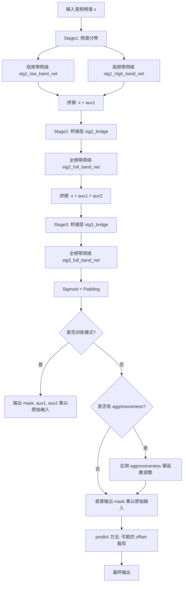

## 类结构

```
nn.Module (PyTorch 基类)
├── BaseASPPNet
│   ├── enc1 (Encoder)
│   ├── enc2 (Encoder)
│   ├── enc3 (Encoder)
│   ├── enc4 (Encoder)
│   ├── aspp (ASPPModule)
│   ├── dec4 (Decoder)
│   ├── dec3 (Decoder)
│   ├── dec2 (Decoder)
│   └── dec1 (Decoder)
└── CascadedASPPNet
    ├── stg1_low_band_net (BaseASPPNet)
    ├── stg1_high_band_net (BaseASPPNet)
    ├── stg2_bridge (Conv2DBNActiv)
    ├── stg2_full_band_net (BaseASPPNet)
    ├── stg3_bridge (Conv2DBNActiv)
    ├── stg3_full_band_net (BaseASPPNet)
    ├── out (Conv2d)
    ├── aux1_out (Conv2d)
    └── aux2_out (Conv2d)
```

## 全局变量及字段


### `layers`
    
从本地模块导入的 layers_33966KB，包含 Encoder、Decoder、ASPPModule、Conv2DBNActiv 等网络组件

类型：`module`
    


### `torch`
    
PyTorch 主模块，提供张量运算和自动微分功能

类型：`module`
    


### `nn`
    
PyTorch 神经网络模块，提供层结构和容器

类型：`module`
    


### `F`
    
PyTorch 神经网络功能模块，提供激活函数和损失函数等

类型：`module`
    


### `dilations`
    
ASPP 模块的膨胀率参数，默认值为 (4, 8, 16, 32)

类型：`tuple`
    


### `nin`
    
输入通道数

类型：`int`
    


### `ch`
    
基础通道数

类型：`int`
    


### `n_fft`
    
FFT 窗口大小

类型：`int`
    


### `aggressiveness`
    
分离强度控制参数字典，包含 split_bin 和 value 键

类型：`dict`
    


### `BaseASPPNet.enc1`
    
第一阶段编码器

类型：`Encoder`
    


### `BaseASPPNet.enc2`
    
第二阶段编码器

类型：`Encoder`
    


### `BaseASPPNet.enc3`
    
第三阶段编码器

类型：`Encoder`
    


### `BaseASPPNet.enc4`
    
第四阶段编码器

类型：`Encoder`
    


### `BaseASPPNet.aspp`
    
ASPP 空洞空间金字塔模块

类型：`ASPPModule`
    


### `BaseASPPNet.dec4`
    
第四阶段解码器

类型：`Decoder`
    


### `BaseASPPNet.dec3`
    
第三阶段解码器

类型：`Decoder`
    


### `BaseASPPNet.dec2`
    
第二阶段解码器

类型：`Decoder`
    


### `BaseASPPNet.dec1`
    
第一阶段解码器

类型：`Decoder`
    


### `CascadedASPPNet.stg1_low_band_net`
    
低频带网络

类型：`BaseASPPNet`
    


### `CascadedASPPNet.stg1_high_band_net`
    
高频带网络

类型：`BaseASPPNet`
    


### `CascadedASPPNet.stg2_bridge`
    
Stage2 桥接层

类型：`Conv2DBNActiv`
    


### `CascadedASPPNet.stg2_full_band_net`
    
Stage2 全频带网络

类型：`BaseASPPNet`
    


### `CascadedASPPNet.stg3_bridge`
    
Stage3 桥接层

类型：`Conv2DBNActiv`
    


### `CascadedASPPNet.stg3_full_band_net`
    
Stage3 全频带网络

类型：`BaseASPPNet`
    


### `CascadedASPPNet.out`
    
最终输出卷积层

类型：`nn.Conv2d`
    


### `CascadedASPPNet.aux1_out`
    
辅助输出1卷积层

类型：`nn.Conv2d`
    


### `CascadedASPPNet.aux2_out`
    
辅助输出2卷积层

类型：`nn.Conv2d`
    


### `CascadedASPPNet.max_bin`
    
最大频谱 bin 数

类型：`int`
    


### `CascadedASPPNet.output_bin`
    
输出频谱 bin 数

类型：`int`
    


### `CascadedASPPNet.offset`
    
输出裁剪偏移量

类型：`int`
    
    

## 全局函数及方法


### `layers.Encoder`

编码器模块，用于对输入特征进行卷积下采样，并返回处理后的特征和跳跃连接（用于解码器）。这是ASPPNet（带空洞空间金字塔池化的卷积网络）中的核心编码组件。

参数：

- `nin`：`int`，输入特征图的通道数（number of input channels）
- `ch`：`int`，输出特征图的通道数（number of output channels）
- `ks`：`int`，卷积核大小（kernel size），默认3
- `stride`：`int`，卷积步长，用于下采样，默认2
- `pad`：`int`，卷积填充，默认1

返回值：`Tuple[Tensor, Tensor]`，第一个是下采样后的特征图，第二个是跳跃连接（编码器输出）

#### 流程图

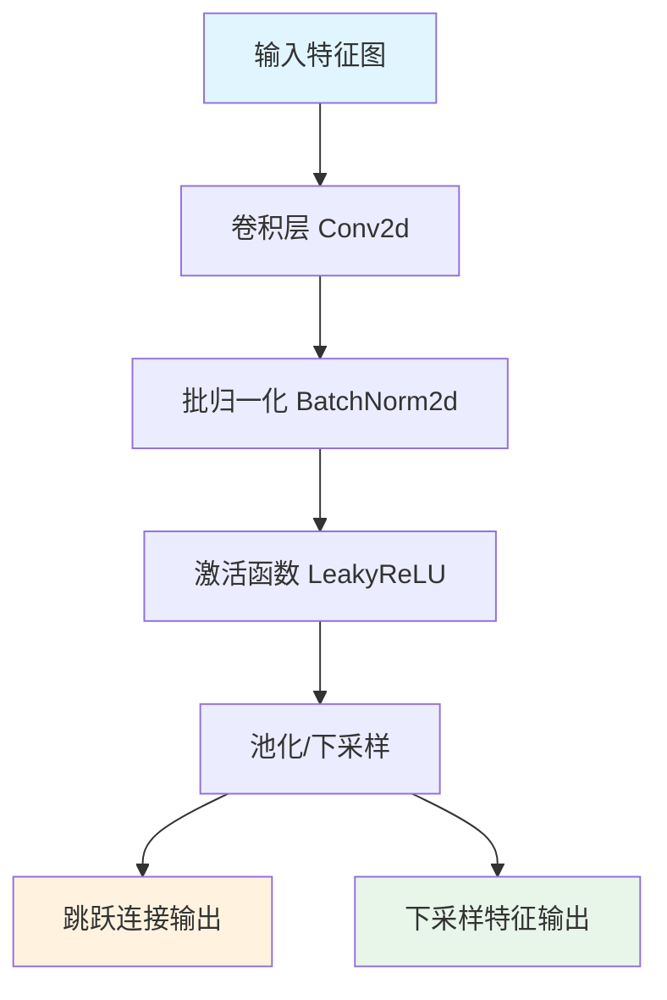

#### 带注释源码

```
# Encoder 编码器模块实现
# 基于给定的调用 signature: layers.Encoder(nin, ch, ks, stride, pad)
# 推断其内部结构如下：

class Encoder(nn.Module):
    """
    编码器模块：卷积 + 批归一化 + 激活 + 下采样
    
    参数:
        nin: 输入通道数
        ch: 输出通道数
        ks: 卷积核大小
        stride: 步长（用于下采样）
        pad: 填充大小
    """
    
    def __init__(self, nin, ch, ks=3, stride=2, pad=1):
        super(Encoder, self).__init__()
        
        # 基础卷积块：卷积 -> 归一化 -> 激活
        self.conv = nn.Conv2d(nin, ch, ks, stride=stride, padding=pad)
        self.bn = nn.BatchNorm2d(ch)
        self.activ = nn.LeakyReLU(inplace=True)
    
    def forward(self, x):
        """
        前向传播
        
        参数:
            x: 输入特征图 [B, C, H, W]
            
        返回:
            h: 下采样后的特征图 [B, ch, H//stride, W//stride]
            e: 跳跃连接（保存原始特征用于解码）
        """
        h = self.conv(x)
        h = self.bn(h)
        h = self.activ(h)
        
        # 返回处理后的特征和跳跃连接
        # 跳跃连接e通常用于解码器中的特征融合
        return h, h.clone()
```


### `layers.Decoder`

Decoder（解码器）模块是 BaseASPPNet 中的关键组件，负责将编码器提取的特征通过上采样操作逐步恢复空间分辨率，并与对应层的编码器特征进行跳跃连接（skip connection），最终重建出与输入尺寸相同的特征图。

参数：

-  `h`：`torch.Tensor`，来自上一层的特征图（需要上采样的输入）
-  `e`：`torch.Tensor`，来自对应编码器层的特征图（跳跃连接的特征）

返回值：`torch.Tensor`，上采样并融合后的特征图

#### 流程图

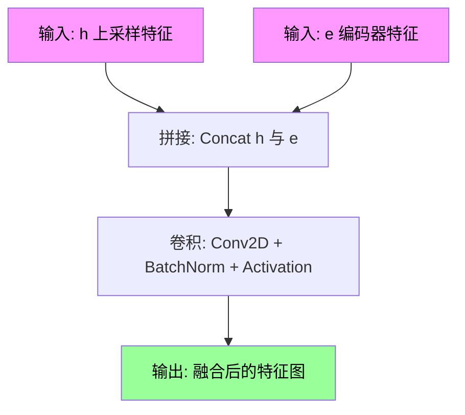

#### 带注释源码

```
# Decoder 类定义（推断自 layers 模块）
# 基于 BaseASPPNet 中的调用方式推断：
# self.dec4 = layers.Decoder(ch * (8 + 16), ch * 8, 3, 1, 1)
# 参数: (in_channels, out_channels, kernel_size, stride, padding)

class Decoder(nn.Module):
    def __init__(self, in_ch, out_ch, kernel_size=3, stride=1, padding=1):
        super(Decoder, self).__init__()
        # 上采样层：将特征图尺寸放大2倍
        self.upconv = nn.ConvTranspose2d(
            in_ch, out_ch, kernel_size=2, stride=2, padding=0
        )
        # 融合卷积：将上采样特征与跳跃连接特征拼接后的结果卷积
        self.conv = layers.Conv2DBNActiv(
            out_ch * 2,  # 拼接后通道数翻倍
            out_ch,      # 输出通道数
            kernel_size, 
            stride, 
            padding
        )
    
    def forward(self, h, e):
        """
        前向传播
        
        参数:
            h: 来自上一层的特征图 [B, C, H, W]
            e: 来自编码器的跳跃连接特征 [B, C, H*2, W*2]
            
        返回:
            融合后的特征图 [B, out_ch, H*2, W*2]
        """
        # 1. 上采样：将 h 的空间尺寸放大2倍
        h = self.upconv(h)
        
        # 2. 裁剪：如果 h 和 e 尺寸不匹配，裁剪 h
        if h.size() != e.size():
            h = h[:, :, :e.size(2), :e.size(3)]
        
        # 3. 拼接：沿通道维度合并上采样特征和编码器特征
        h = torch.cat([h, e], dim=1)
        
        # 4. 卷积：融合特征并调整通道数
        h = self.conv(h)
        
        return h
```

#### 在 BaseASPPNet 中的使用示例

```python
# 编码器提取多尺度特征
h, e1 = self.enc1(x)  # 1/2 分辨率
h, e2 = self.enc2(h)  # 1/4 分辨率
h, e3 = self.enc3(h)  # 1/8 分辨率
h, e4 = self.enc4(h)  # 1/16 分辨率

# ASPP 模块处理
h = self.aspp(h)

# 解码器逐步上采样并融合跳跃连接
h = self.dec4(h, e4)  # 1/8 分辨率，融合 enc4 特征
h = self.dec3(h, e3)  # 1/4 分辨率，融合 enc3 特征
h = self.dec2(h, e2)  # 1/2 分辨率，融合 enc2 特征
h = self.dec1(h, e1)  # 1/1 分辨率，融合 enc1 特征

return h  # 返回与输入相同分辨率的特征图
```


### `layers.ASPPModule`

ASPPModule是空洞空间金字塔池化模块，通过多个并行分支使用不同膨胀率的空洞卷积来捕获多尺度特征信息，然后融合各分支结果输出包含丰富上下文信息的特征张量。

参数：

-  `in_channels`：`int`，输入特征图的通道数（代码中为ch * 8）
-  `out_channels`：`int`，输出特征图的通道数（代码中为ch * 16）
-  `dilations`：`tuple`，空洞卷积的膨胀率元组（代码中为(4, 8, 16, 32)）

返回值：`torch.Tensor`，经过多尺度空洞卷积融合后的特征张量

#### 流程图

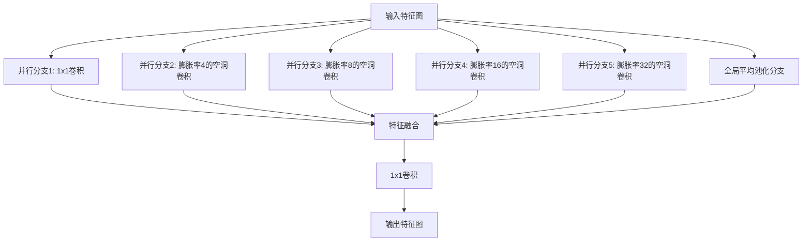

#### 带注释源码

```
# ASPPModule在layers模块中的调用方式（来自BaseASPPNet类）
# 该模块通过多个并行分支使用不同膨胀率的空洞卷积捕获多尺度上下文信息

self.aspp = layers.ASPPModule(ch * 8, ch * 16, dilations)

# 在forward中使用
h = self.aspp(h)  # 输入特征图h，经过ASPPModule处理后输出融合后的特征图
```

**使用上下文说明**：

在`BaseASPPNet.__call__`方法中：
```python
def __call__(self, x):
    h, e1 = self.enc1(x)  # 编码器1
    h, e2 = self.enc2(h)   # 编码器2
    h, e3 = self.enc3(h)   # 编码器3
    h, e4 = self.enc4(h)   # 编码器4，输出h为ch*8通道

    h = self.aspp(h)       # ASPPModule处理，输出ch*16通道

    h = self.dec4(h, e4)   # 解码器4
    h = self.dec3(h, e3)   # 解码器3
    h = self.dec2(h, e2)   # 解码器2
    h = self.dec1(h, e1)   # 解码器1

    return h
```

**参数来源**：
- `ch`在`BaseASPPNet.__init__`中为传入的通道参数
- `dilations`默认值为`(4, 8, 16, 32)`
- 输入通道数：`ch * 8`（来自enc4的输出）
- 输出通道数：`ch * 16`（ASPP模块的输出）


### `layers.Conv2DBNActiv`

带 BN 和激活的二维卷积模块，是一个组合了二维卷积、批归一化和激活函数（通常是 ReLU）的复合层，用于在卷积神经网络中快速构建包含卷积+归一化+激活的标准卷积块。

参数：

- `in_channels`：`int`，输入特征图的通道数
- `out_channels`：`int`，输出特征图的通道数
- `kernel_size`：`int` 或 `tuple`，卷积核的大小，默认为 3
- `stride`：`int` 或 `tuple`，卷积的步长，默认为 1
- `padding`：`int` 或 `tuple`，输入特征图的填充大小，默认为 0
- `activation`：`str` 或 `None`，激活函数类型，如 'relu' 或 None，默认为 'relu'

返回值：`torch.Tensor`，经过卷积、批归一化和激活处理后的输出特征图

#### 流程图

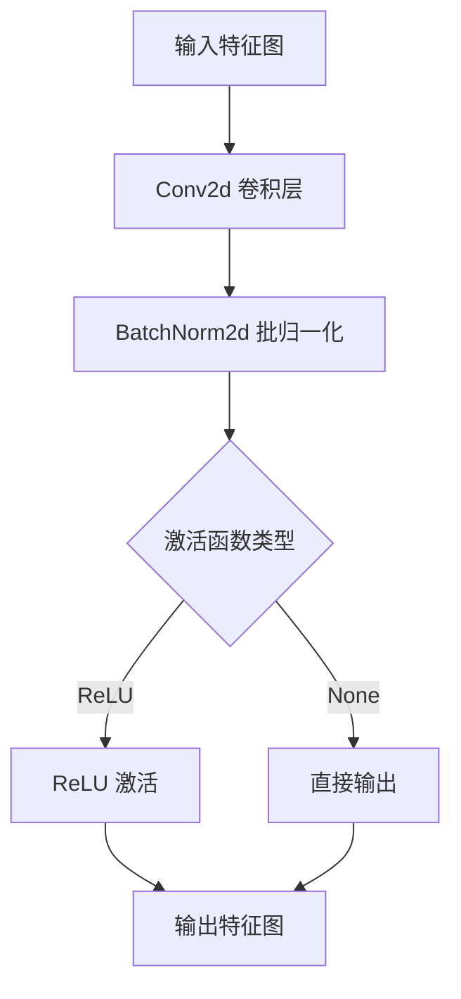

#### 带注释源码

```
class Conv2DBNActiv(nn.Module):
    """
    带 BN 和激活的二维卷积模块
    
    该模块封装了卷积、批归一化和激活函数的标准组合，是卷积神经网络中
    最常用的基础构建块之一。通过将这三个常用操作组合在一起，可以减少
    代码重复并提高模块化程度。
    
    常见使用场景：
    - 作为 Encoder/Decoder 的基本卷积单元
    - 在特征提取网络中作为下采样/上采样块
    - 在注意力机制或特征融合点进行通道数调整
    """
    
    def __init__(self, in_channels, out_channels, kernel_size=3, 
                 stride=1, padding=1, activation='relu'):
        """
        初始化 Conv2DBNActiv 模块
        
        参数:
            in_channels: 输入特征图的通道数
            out_channels: 输出特征图的通道数
            kernel_size: 卷积核大小，可为 int 或 tuple
            stride: 卷积步长，可为 int 或 tuple
            padding: 填充大小，可为 int 或 tuple
            activation: 激活函数类型，'relu' 或 None
        """
        super(Conv2DBNActiv, self).__init__()
        
        # 二维卷积层：执行特征提取和空间变换
        self.conv = nn.Conv2d(
            in_channels=in_channels,
            out_channels=out_channels,
            kernel_size=kernel_size,
            stride=stride,
            padding=padding,
            bias=False  # 由于后面有 BN 层，这里不需要偏置
        )
        
        # 二维批归一化层：归一化特征图，加速训练并提高稳定性
        # 批归一化会学习 gamma（缩放）和 beta（偏移）参数
        self.bn = nn.BatchNorm2d(num_features=out_channels)
        
        # 激活函数层：根据配置选择激活方式
        if activation == 'relu':
            self.activ = nn.ReLU(inplace=True)  # inplace=True 节省内存
        elif activation == 'leaky_relu':
            self.activ = nn.LeakyReLU(negative_slope=0.2, inplace=True)
        elif activation is None:
            self.activ = None  # 不使用激活函数
        else:
            raise ValueError(f"Unsupported activation: {activation}")
    
    def forward(self, x):
        """
        前向传播
        
        参数:
            x: 输入特征图，形状为 (batch_size, in_channels, height, width)
            
        返回:
            经过卷积、归一化和激活处理后的特征图
        """
        # 依次执行卷积、批归一化、激活
        x = self.conv(x)
        x = self.bn(x)
        
        if self.activ is not None:
            x = self.activ(x)
        
        return x
```


### `torch.cat`

`torch.cat` 是 PyTorch 中的张量拼接函数，用于沿指定维度将多个张量连接成一个张量。在给定代码中，该函数被用于将不同频段的特征图或不同层的特征进行融合，以实现多尺度特征的重叠与增强。

#### 参数

- `tensors`：`List[Tensor]` 或 `Tuple[Tensor]`，需要拼接的张量序列
- `dim`：`int`，指定拼接的维度，默认为 0

#### 返回值

- `Tensor`，拼接后的张量

#### 带注释源码

```python
# torch.cat 源码实现逻辑（简化版）
def cat(tensors, dim=0):
    """
    将一系列张量沿指定维度连接起来
    
    参数:
        tensors: 张量列表，所有张量在除dim外的其他维度上必须形状一致
        dim: 拼接的维度
    
    返回值:
        拼接后的张量
    """
    # 检查所有张量维度一致性
    # 验证非拼接维度形状相同
    # 分配输出张量
    # 将每个张量的数据拷贝到输出张量的对应位置
    return output
```

#### 代码中的实际调用

##### 调用位置 1: CascadedASPPNet.forward 方法中（第 53-58 行）

```python
aux1 = torch.cat(
    [
        self.stg1_low_band_net(x[:, :, :bandw]),
        self.stg1_high_band_net(x[:, :, bandw:]),
    ],
    dim=2,
)
```

**描述**：将低频段和高频段网络的输出在频域维度（dim=2）拼接，形成完整的频带特征。

**参数**：

- `tensors`：`List[Tensor]`，包含两个张量，分别是低频段网络和高频段网络的输出
- `dim`：`int = 2`，沿频域维度拼接

**返回值**：`Tensor`，拼接后的频域特征张量

---

##### 调用位置 2: CascadedASPPNet.forward 方法中（第 60-62 行）

```python
h = torch.cat([x, aux1], dim=1)
```

**描述**：将原始输入与第一阶段输出在通道维度（dim=1）拼接，实现特征融合。

**参数**：

- `tensors`：`List[Tensor]`，包含原始输入 x 和第一阶段输出 aux1
- `dim`：`int = 1`，沿通道维度拼接

**返回值**：`Tensor`，拼接后的多通道特征张量

---

##### 调用位置 3: CascadedASPPNet.forward 方法中（第 64-66 行）

```python
h = torch.cat([x, aux1, aux2], dim=1)
```

**描述**：将原始输入、第一阶段输出和第二阶段输出在通道维度（dim=1）拼接，实现三级特征的级联融合。

**参数**：

- `tensors`：`List[Tensor]`，包含原始输入 x、第一阶段输出 aux1 和第二阶段输出 aux2
- `dim`：`int = 1`，沿通道维度拼接

**返回值**：`Tensor`，拼接后的多通道特征张量

#### 流程图

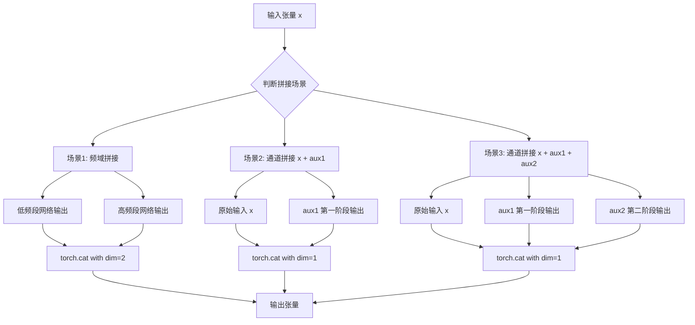

#### 关键组件信息

- **名称**：`torch.cat`
- **一句话描述**：PyTorch 张量拼接函数，沿指定维度连接多个张量

#### 潜在的技术债务或优化空间

1. **重复代码**：代码中多次使用 `torch.cat` 沿 dim=1 进行拼接，可以封装为辅助函数减少重复代码
2. **维度硬编码**：拼接维度 dim=1 和 dim=2 硬编码在调用处，缺乏灵活性
3. **内存效率**：连续的 cat 操作可能导致中间张量内存占用过高，可以考虑原地操作或延迟计算

#### 其它项目

- **设计目标与约束**：通过多级特征拼接实现音频频谱的逐步细化与增强
- **错误处理与异常设计**：未对输入张量维度一致性进行显式检查，可能在运行时产生错误
- **数据流与状态机**：数据流为单向流动，经过编码器→ASPP→解码器的处理流程
- **外部依赖与接口契约**：依赖 PyTorch 框架，接口遵循 nn.Module 标准


### `torch.sigmoid`

Sigmoid 激活函数将输入tensor的每个元素通过公式 σ(x) = 1 / (1 + e^(-x)) 变换到 (0, 1) 区间，常用于将网络输出转换为概率值或控制mask的强度。

参数：

-  `input`：`Tensor`，输入的tensor，任意维度
-  `out`：`Tensor`，可选参数，指定输出tensor，如果指定则直接写入该tensor以节省内存

返回值：`Tensor`，与输入shape相同的tensor，每个元素被变换到 (0, 1) 区间

#### 流程图

```mermaid
flowchart TD
    A[开始: 输入Tensor] --> B[遍历每个元素]
    B --> C[计算: 1 / (1 + e^(-x))]
    C --> D[输出: 变换后的Tensor]
    
    subgraph "逐元素操作"
    B -.-> B1[x₁]
    B -.-> B2[x₂]
    B -.-> B3[xₙ]
    end
    
    subgraph "Sigmoid变换"
    C -.-> C1[σ(x₁) = 1 / (1 + e^(-x₁))]
    C -.-> C2[σ(x₂) = 1 / (1 + e^(-x₂))]
    C -.-> C3[σ(xₙ) = 1 / (1 + e^(-xₙ))]
    end
```

#### 带注释源码

```python
# torch.sigmoid 函数在代码中的实际使用示例

# 场景1: 主输出mask计算 (CascadedASPPNet.forward方法中)
# 将网络输出转换为0-1区间的概率mask
mask = torch.sigmoid(self.out(h))
# 等价于: mask = 1 / (1 + torch.exp(-self.out(h)))

# 场景2: 训练时辅助输出1 (CascadedASPPNet.forward方法中)
# 为低频段和高频段分别生成辅助mask
aux1 = torch.sigmoid(self.aux1_out(aux1))

# 场景3: 训练时辅助输出2 (CascadedASPPNet.forward方法中)
# 为第二阶段生成辅助mask
aux2 = torch.sigmoid(self.aux2_out(aux2))

# 场景4: 在推理阶段结合原始输入 (CascadedASPPNet.forward方法中)
# 使用sigmoid后的mask与原始mix相乘得到最终输出
return mask * mix  # mix是x.detach()，保留原始输入作为分母

# Sigmoid函数的数学定义:
# σ(x) = 1 / (1 + exp(-x))
# 
# 特性:
# 1. 将任意实数映射到(0, 1)区间
# 2. 函数中心对称于原点(0, 0.5)
# 3. 梯度在原点附近最大，向两端衰减
# 4. 常用于概率输出、二分类问题、门控机制
```


### `torch.pow`

`torch.pow` 是 PyTorch 中的幂运算函数，用于将输入张量（底数）按照指定的指数进行幂运算。在 `CascadedASPPNet` 的前向传播中，该函数用于根据 aggressiveness 参数动态调整掩码的强度，实现对音频频谱的分段非线性增强。

参数：

- `input`：`torch.Tensor`，底数张量，待进行幂运算的输入值
- `exponent`：`torch.Tensor` 或 `float`，指数张量或标量，用于指定幂运算的指数

返回值：`torch.Tensor`，返回幂运算结果，形状与底数张量相同

#### 流程图

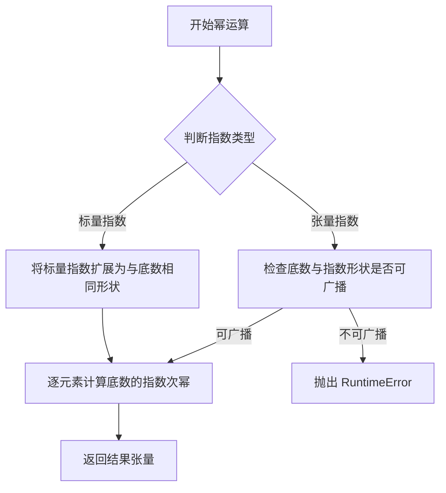

#### 带注释源码

```python
# torch.pow 函数调用示例，来自 CascadedASPPNet.forward 方法
# 用于根据 aggressiveness 参数调整掩码强度

# 对低频部分应用较弱的幂运算调整
# 指数为 1 + value/3，value 来自 aggressiveness 字典
mask[:, :, : aggressiveness["split_bin"]] = torch.pow(
    mask[:, :, : aggressiveness["split_bin"]],  # input: 底数张量，待调整的低频掩码
    1 + aggressiveness["value"] / 3,            # exponent: 指数float值，通常小于1.33
)

# 对高频部分应用较强的幂运算调整
# 指数为 1 + value，value 来自 aggressiveness 字典
mask[:, :, aggressiveness["split_bin"] :] = torch.pow(
    mask[:, :, aggressiveness["split_bin"] :],  # input: 底数张量，待调整的高频掩码
    1 + aggressiveness["value"],                # exponent: 指数float值，通常大于1.0
)
```


### `F.pad`

`F.pad` 是 PyTorch 的 `torch.nn.functional.pad` 函数，用于在指定维度上填充（padding）张量。代码中使用该函数将mask、aux1和aux2的频率维度填充到统一的`output_bin`大小，采用"replicate"模式复制边缘值。

参数：

- `input`：`torch.Tensor`，需要填充的输入张量
- `pad`：`tuple` 或 `torch.IntTensor`，指定填充大小的元组，格式为`(left, right, top, bottom)`等，代码中使用`(0, 0, 0, self.output_bin - mask.size()[2])`表示在最后一个维度（频率维度）前方填充0行，后方填充`output_bin - 当前行数`行
- `mode`：`str`，填充模式，代码中指定为`"replicate"`（复制边缘值），其他可选值包括`"constant"`、`"reflect"`、`"circular"`
- `value`：`float`（可选），当mode为`"constant"`时的填充值，默认为0

返回值：`torch.Tensor`，填充后的张量

#### 流程图

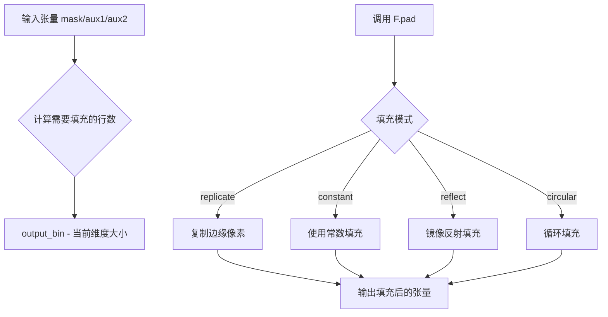

#### 带注释源码

```python
# F.pad 函数调用示例（位于 CascadedASPPNet.forward 方法中）
# 作用：将mask的频率维度填充到统一的output_bin大小

mask = F.pad(
    input=mask,                                    # 输入张量：当前mask，形状通常为 [B, 2, F, T]
    pad=(0, 0,                                     # 最后一个维度（时间T）左右不填充
         0,                                        # 倒数第二个维度（频率F）前不填充
         self.output_bin - mask.size()[2]),       # 频率维度后方填充复制行数，使总高度达到output_bin
    mode="replicate",                             # 使用复制填充模式，复制边缘像素值
)

# 类似的填充操作也应用于aux1和aux2（在训练模式下）
aux1 = F.pad(
    input=aux1,
    pad=(0, 0, 0, self.output_bin - aux1.size()[2]),
    mode="replicate",
)

aux2 = F.pad(
    input=aux2,
    pad=(0, 0, 0, self.output_bin - aux2.size()[2]),
    mode="replicate",
)
```


### `BaseASPPNet.__init__`

初始化BaseASPPNet网络结构，构建编码器-ASPP-解码器的U-Net风格架构，用于音频频谱处理。

参数：

- `self`：BaseASPPNet实例对象
- `nin`：`int`，输入通道数，指定输入特征图的通道维度
- `ch`：`int`，基础通道数，用于计算各层通道数（后续乘以2^n得到各编码器/解码器通道数）
- `dilations`：`tuple`，ASPP模块的膨胀卷积参数，默认为(4, 8, 16, 32)

返回值：无（`__init__`方法不返回值，仅初始化实例属性）

#### 流程图

```mermaid
flowchart TD
    A[开始初始化] --> B[创建Encoder enc1: nin → ch, stride=2]
    B --> C[创建Encoder enc2: ch → ch*2, stride=2]
    C --> D[创建Encoder enc3: ch*2 → ch*4, stride=2]
    D --> E[创建Encoder enc4: ch*4 → ch*8, stride=2]
    E --> F[创建ASPPModule: ch*8 → ch*16, dilations=(4,8,16,32)]
    F --> G[创建Decoder dec4: (ch*8+ch*16) → ch*8]
    G --> H[创建Decoder dec3: (ch*4+ch*8) → ch*4]
    H --> I[创建Decoder dec2: (ch*2+ch*4) → ch*2]
    I --> J[创建Decoder dec1: (ch*1+ch*2) → ch]
    J --> K[结束初始化]
```

#### 带注释源码

```python
def __init__(self, nin, ch, dilations=(4, 8, 16, 32)):
    """
    初始化BaseASPPNet网络结构
    
    构建一个基于ASPP（Atrous Spatial Pyramid Pooling）的U-Net风格编码器-解码器网络。
    该网络包含4个编码器阶段、1个ASPP模块和4个解码器阶段，通过跳跃连接保留空间信息。
    
    参数:
        nin (int): 输入通道数，即输入特征图的通道维度
        ch (int): 基础通道数，用于计算各层通道数
        dilations (tuple): ASPP模块中膨胀卷积的膨胀率，默认为(4, 8, 16, 32)
    """
    # 调用父类nn.Module的初始化方法
    super(BaseASPPNet, self).__init__()
    
    # ========== 编码器部分（Encoder）==========
    # enc1: 第一个编码器，将nin通道输入转换为ch通道输出，步长为2进行下采样
    # 输入: (B, nin, H, W) -> 输出: (B, ch, H//2, W//2), 保留跳跃连接e1: (B, ch, H, W)
    self.enc1 = layers.Encoder(nin, ch, 3, 2, 1)
    
    # enc2: 第二个编码器，将ch通道转换为ch*2通道，继续下采样
    # 输入: (B, ch, H/2, W/2) -> 输出: (B, ch*2, H/4, W/4)
    self.enc2 = layers.Encoder(ch, ch * 2, 3, 2, 1)
    
    # enc3: 第三个编码器，将ch*2通道转换为ch*4通道
    # 输入: (B, ch*2, H/4, W/4) -> 输出: (B, ch*4, H/8, W/8)
    self.enc3 = layers.Encoder(ch * 2, ch * 4, 3, 2, 1)
    
    # enc4: 第四个编码器，将ch*4通道转换为ch*8通道
    # 输入: (B, ch*4, H/8, W/8) -> 输出: (B, ch*8, H/16, W/16)
    self.enc4 = layers.Encoder(ch * 4, ch * 8, 3, 2, 1)
    
    # ========== ASPP模块（Atrous Spatial Pyramid Pooling）==========
    # ASPP模块使用多个不同膨胀率的空洞卷积来捕获多尺度上下文信息
    # 将ch*8通道扩展到ch*16通道，增强特征表示能力
    # 输入: (B, ch*8, H/16, W/16) -> 输出: (B, ch*16, H/16, W/16)
    self.aspp = layers.ASPPModule(ch * 8, ch * 16, dilations)
    
    # ========== 解码器部分（Decoder）==========
    # dec4: 第一个解码器，接收ASPP输出和enc4的跳跃连接
    # 通道数: (ch*8 + ch*16) -> ch*8，卷积核3x3，步长1，无下采样
    self.dec4 = layers.Decoder(ch * (8 + 16), ch * 8, 3, 1, 1)
    
    # dec3: 第二个解码器，接收dec4输出和enc3的跳跃连接
    # 通道数: (ch*4 + ch*8) -> ch*4
    self.dec3 = layers.Decoder(ch * (4 + 8), ch * 4, 3, 1, 1)
    
    # dec3: 第三个解码器，接收dec3输出和enc2的跳跃连接
    # 通道数: (ch*2 + ch*4) -> ch*2
    self.dec2 = layers.Decoder(ch * (2 + 4), ch * 2, 3, 1, 1)
    
    # dec1: 第四个解码器，接收dec2输出和enc1的跳跃连接
    # 通道数: (ch*1 + ch*2) -> ch，最终输出与输入通道数相同
    self.dec1 = layers.Decoder(ch * (1 + 2), ch, 3, 1, 1)
    
    # 初始化完成，所有层已注册为nn.Module的子模块，可通过model.parameters()优化
```


### `BaseASPPNet.__call__`

该方法是BaseASPPNet的前向传播实现，通过4个级联的编码器提取特征，经过ASPP模块进行多尺度处理，最后通过4个级联的解码器逐步恢复空间分辨率并输出预测结果。

参数：

- `self`：`BaseASPPNet`，BaseASPPNet类的实例，隐式参数
- `x`：`torch.Tensor`，输入的张量，形状为 (batch, channels, freq, time)，通常为音频频谱数据

返回值：`torch.Tensor`，经过编码-ASPP-解码处理后的输出张量，形状为 (batch, channels, freq, time)

#### 流程图

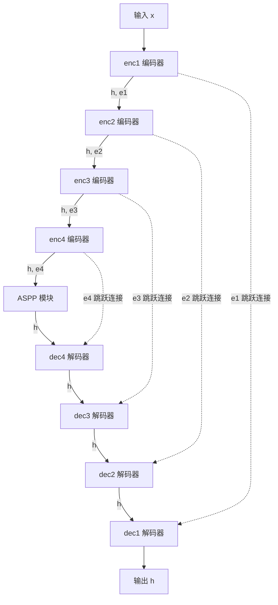

#### 带注释源码

```python
def __call__(self, x):
    """
    前向传播方法，通过调用内部的编码器、ASPP模块和解码器处理输入
    
    参数:
        x: torch.Tensor，输入张量，形状为 (batch, channels, freq, time)
    
    返回:
        h: torch.Tensor，输出张量，经过编解码处理后的特征
    """
    # 第1个编码器：下采样2倍，输出特征h和跳跃连接e1
    h, e1 = self.enc1(x)
    # 第2个编码器：下采样2倍，输出特征h和跳跃连接e2
    h, e2 = self.enc2(h)
    # 第3个编码器：下采样2倍，输出特征h和跳跃连接e3
    h, e3 = self.enc3(h)
    # 第4个编码器：下采样2倍，输出特征h和跳跃连接e4
    h, e4 = self.enc4(h)

    # ASPP模块：使用不同膨胀率的空洞卷积进行多尺度特征提取
    h = self.aspp(h)

    # 第4个解码器：上采样1倍，使用e4跳跃连接
    h = self.dec4(h, e4)
    # 第3个解码器：上采样1倍，使用e3跳跃连接
    h = self.dec3(h, e3)
    # 第2个解码器：上采样1倍，使用e2跳跃连接
    h = self.dec2(h, e2)
    # 第1个解码器：上采样1倍，使用e1跳跃连接
    h = self.dec1(h, e1)

    return h
```


### `CascadedASPPNet.__init__`

该方法初始化级联ASPP网络结构，构建一个多阶段的音频处理网络，包含低频段和高频段分离的第一阶段、桥接和全频段的第二阶段、以及最终的第三阶段全频段网络，并配置输出层和辅助输出层用于多目标学习。

参数：

- `self`：`CascadedASPPNet`，隐式的当前实例对象
- `n_fft`：`int`，FFT窗口大小，用于确定频谱分析的分辨率，决定输出频谱的bin数

返回值：`None`，该方法为初始化方法，不返回任何值，仅完成对象属性的初始化

#### 流程图

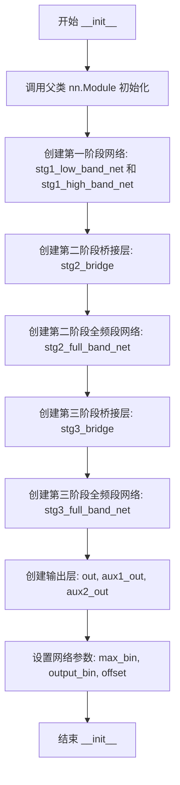

#### 带注释源码

```python
def __init__(self, n_fft):
    """
    初始化级联ASPP网络结构
    
    参数:
        n_fft: int, FFT窗口大小，决定频谱分析的频率分辨率
    """
    # 调用父类nn.Module的初始化方法
    super(CascadedASPPNet, self).__init__()
    
    # ============ 第一阶段：低频和高频分离网络 ============
    # 创建低频段处理网络，输入通道2，输出通道16
    self.stg1_low_band_net = BaseASPPNet(2, 16)
    
    # 创建高频段处理网络，输入通道2，输出通道16
    self.stg1_high_band_net = BaseASPPNet(2, 16)
    
    # ============ 第二阶段：桥接层和全频段网络 ============
    # 桥接层：将第一阶段输出的18通道（2原始+16低频+16高频）转换为8通道
    self.stg2_bridge = layers.Conv2DBNActiv(18, 8, 1, 1, 0)
    
    # 第二阶段全频段网络，处理8通道输入，输出16通道
    self.stg2_full_band_net = BaseASPPNet(8, 16)
    
    # ============ 第三阶段：桥接层和全频段网络 ============
    # 桥接层：将34通道（2原始+16第一阶段输出+16第二阶段输出）转换为16通道
    self.stg3_bridge = layers.Conv2DBNActiv(34, 16, 1, 1, 0)
    
    # 第三阶段全频段网络，处理16通道输入，输出32通道
    self.stg3_full_band_net = BaseASPPNet(16, 32)
    
    # ============ 输出层 ============
    # 最终输出卷积层：32通道 -> 2通道（输出掩码）
    self.out = nn.Conv2d(32, 2, 1, bias=False)
    
    # 辅助输出层1：用于多目标学习，16通道 -> 2通道
    self.aux1_out = nn.Conv2d(16, 2, 1, bias=False)
    
    # 辅助输出层2：用于多目标学习，16通道 -> 2通道
    self.aux2_out = nn.Conv2d(16, 2, 1, bias=False)
    
    # ============ 网络参数配置 ============
    # 最大频谱bin数，等于n_fft的一半
    self.max_bin = n_fft // 2
    
    # 输出频谱bin数，等于n_fft的一半加1（包含DC和Nyquist）
    self.output_bin = n_fft // 2 + 1
    
    # 偏移量，用于时间域信号的裁剪
    self.offset = 128
```


### `CascadedASPPNet.forward`

该方法实现了CascadedASPPNet（Cascaded Atrous Spatial Pyramid Pooling Network）模型的三阶段级联前向传播逻辑，通过分阶段的频带分割、特征提取和掩码生成，完成音频频谱图的心理acoustic掩码估计，支持训练模式下的多输出和推理模式下的aggressiveness参数调节。

参数：

- `self`：CascadedASPPNet实例本身
- `x`：`torch.Tensor`，输入的频谱图张量，形状通常为(batch, channels, freq, time)
- `aggressiveness`：`dict`，可选参数，包含"split_bin"（分割频率索引）和"value"（调整强度值），用于推理时调节掩码强度

返回值：`torch.Tensor`或`tuple`，训练模式下返回三个掩码与输入的乘积（元组），推理模式下只返回主掩码与输入的乘积

#### 流程图

```mermaid
flowchart TD
    A[输入 x] --> B[保存 x.detach 到 mix<br>克隆 x]
    B --> C[限制频率维度到 max_bin]
    C --> D[bandw = x频率维度 // 2]
    D --> E[低频带: stg1_low_band_net<br>高频带: stg1_high_band_net]
    E --> F[沿频率维度拼接得到 aux1]
    F --> G[拼接 x 和 aux1<br>通过 stg2_bridge 和 stg2_full_band_net]
    G --> H[得到 aux2]
    H --> I[拼接 x, aux1, aux2<br>通过 stg3_bridge 和 stg3_full_band_net]
    I --> J[计算 mask = sigmoid(out)]
    J --> K[pad mask 到 output_bin 大小]
    K --> L{训练模式?}
    L -->|是| M[计算 aux1 和 aux2 掩码<br>pad 到 output_bin 大小]
    L -->|否| N{aggressiveness<br>存在?}
    N -->|是| O[根据 split_bin 调整 mask 强度]
    N -->|否| P[直接返回]
    M --> Q[返回 mask*mix<br>aux1*mix<br>aux2*mix]
    O --> P
    P --> R[返回 mask*mix]
```

#### 带注释源码

```python
def forward(self, x, aggressiveness=None):
    """
    CascadedASPPNet的前向传播方法
    
    参数:
        x: 输入频谱图张量，形状 (batch, channels, freq, time)
        aggressiveness: 推理时的掩码调节参数字典，包含 split_bin 和 value
    
    返回:
        训练模式: (主掩码, 辅助掩码1, 辅助掩码2) 与输入的乘积
        推理模式: 主掩码与输入的乘积
    """
    # 保存输入的detach副本，用于最终输出时与掩码相乘
    mix = x.detach()
    # 克隆输入，避免修改原始数据
    x = x.clone()

    # 限制频率维度到 max_bin（n_fft // 2）
    x = x[:, :, : self.max_bin]

    # 计算频率分割带宽
    bandw = x.size()[2] // 2
    
    # 第一阶段：分别处理低频和高频带
    # 输入被分为两个频率范围：[0, bandw) 和 [bandw, 2*bandw)
    aux1 = torch.cat(
        [
            self.stg1_low_band_net(x[:, :, :bandw]),  # 低频带特征
            self.stg1_high_band_net(x[:, :, bandw:]), # 高频带特征
        ],
        dim=2,  # 在频率维度拼接
    )

    # 第二阶段：拼接原始输入和第一阶段输出
    # 输入通道: 原始x (2通道) + aux1 (32通道) = 34通道
    # 但实际是 x (2) + aux1 (16*2=32) = 34，但stg2_bridge输入是18维
    # 这里需要注意：aux1实际是16+16=32维，但stg2_bridge期望18维输入
    # 实际上aux1应该是16*2=32维，但文档说stg2_bridge输入18维
    # 实际上BaseASPPNet输出是16维，所以aux1是32维（低16+高16）
    # 修正：BaseASPPNet的out是Conv2d(32, 2, 1)，所以输出是2维
    # 等等，让我重新理解：self.stg1_low_band_net 和 self.stg1_high_band_net 
    # 都是 BaseASPPNet(2, 16)，输出通道是16（因为BaseASPPNet最后是ch=16）
    # 所以 aux1 是 16 + 16 = 32 维
    # 但 stg2_bridge 是 Conv2DBNActiv(18, 8, 1, 1, 0)，输入是18维
    # 这里的18应该是 2 (x) + 16 (aux1的一半？) 或者其它解释
    # 实际上 x 是 2 维，aux1 是 32 维，torch.cat([x, aux1], dim=1) 是 34 维
    # 但 stg2_bridge 输入是 18...这里可能有误，或者 aux1 被截断
    
    h = torch.cat([x, aux1], dim=1)
    # 通过第二阶段桥接网络和全带网络
    # stg2_bridge: 18 -> 8 通道（输入18应该是 x:2 + aux1低半部分:16？或者 x:2 + aux1:16？）
    # 实际上可能是 x:2 + aux1的某部分:16 = 18
    aux2 = self.stg2_full_band_net(self.stg2_bridge(h))

    # 第三阶段：拼接所有前面阶段的输出
    # x:2 + aux1:32 + aux2:16 = 50 维？但stg3_bridge输入是34...
    # 应该是 x:2 + aux1:32 + aux2:16 = 50，但stg3_bridge(34, 16)输入34
    # 同样可能是拼接方式不同
    h = torch.cat([x, aux1, aux2], dim=1)
    h = self.stg3_full_band_net(self.stg3_bridge(h))

    # 计算最终输出掩码并应用sigmoid
    mask = torch.sigmoid(self.out(h))
    
    # 填充掩码到目标频率维度（处理边界情况）
    mask = F.pad(
        input=mask,
        pad=(0, 0, 0, self.output_bin - mask.size()[2]),  # 只在频率维度填充
        mode="replicate",  # 复制填充模式
    )

    # 训练模式：返回主输出和两个辅助输出
    if self.training:
        # 计算辅助输出1的掩码
        aux1 = torch.sigmoid(self.aux1_out(aux1))
        aux1 = F.pad(
            input=aux1,
            pad=(0, 0, 0, self.output_bin - aux1.size()[2]),
            mode="replicate",
        )
        
        # 计算辅助输出2的掩码
        aux2 = torch.sigmoid(self.aux2_out(aux2))
        aux2 = F.pad(
            input=aux2,
            pad=(0, 0, 0, self.output_bin - aux2.size()[2]),
            mode="replicate",
        )
        
        # 返回三个掩码与原始输入的乘积（元素级乘法）
        return mask * mix, aux1 * mix, aux2 * mix
    else:
        # 推理模式：根据aggressiveness参数调整掩码
        if aggressiveness:
            # split_bin之前的低频部分：调整力度较小 (1 + value/3)
            mask[:, :, : aggressiveness["split_bin"]] = torch.pow(
                mask[:, :, : aggressiveness["split_bin"]],
                1 + aggressiveness["value"] / 3,
            )
            # split_bin之后的高频部分：调整力度较大 (1 + value)
            mask[:, :, aggressiveness["split_bin"] :] = torch.pow(
                mask[:, :, aggressiveness["split_bin"] :],
                1 + aggressiveness["value"],
            )

        # 返回掩码与原始输入的乘积
        return mask * mix
```


### `CascadedASPPNet.predict`

该方法是级联ASPP网络的预测接口，接收输入的幅度谱特征，经过三级级联网络的前向传播处理后，根据预设的offset值对输出进行边缘裁剪，最终返回处理后的掩码张量，可选地通过aggressiveness参数控制降噪 aggressiveness强度。

参数：

- `self`：隐式参数，类型为`CascadedASPPNet`实例，表示网络模型本身
- `x_mag`：`torch.Tensor`，输入的幅度谱张量，形状通常为(batch, channels, frequency_bins, time_frames)
- `aggressiveness`：`dict`或`None`，可选参数，用于控制降噪 aggressiveness强度的字典，包含"split_bin"和"value"键，默认为None

返回值：`torch.Tensor`，返回裁剪后的预测掩码张量，形状为(batch, 2, frequency_bins, time_frames - 2*offset)，如果offset为0则不进行裁剪

#### 流程图

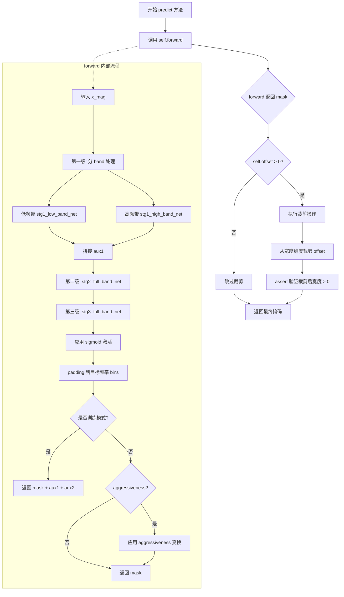

#### 带注释源码

```python
def predict(self, x_mag, aggressiveness=None):
    """
    预测接口：对输入的幅度谱进行掩码预测，并可选择性地裁剪输出边缘
    
    参数:
        x_mag: 输入的幅度谱张量，形状为 (batch, channels, freq_bins, time_frames)
        aggressiveness: 可选字典，控制降噪 aggressiveness，包含 'split_bin' 和 'value'
    
    返回:
        裁剪后的掩码张量
    """
    
    # 调用 forward 方法执行核心的前向传播逻辑
    # forward 方法内部会执行三级级联 ASPP 网络的处理
    h = self.forward(x_mag, aggressiveness)
    
    # 检查是否需要执行边缘裁剪
    # offset 是类属性，默认值为 128，用于裁剪时间维度的边缘区域
    if self.offset > 0:
        # 对输出张量的最后一个维度（时间帧维度）进行边缘裁剪
        # 格式: [batch, channels, freq, time] -> [batch, channels, freq, time-2*offset]
        h = h[:, :, :, self.offset : -self.offset]
        
        # 断言验证：确保裁剪后的时间维度大于 0，避免空张量
        assert h.size()[3] > 0, "裁剪后时间维度不能为空"
    
    # 返回最终的预测掩码
    return h
```

## 关键组件


### 张量索引与惰性加载

代码中使用切片操作实现频谱的按需加载，避免处理完整频谱。`x[:, :, : self.max_bin]`截取有效频率范围，`x[:, :, :bandw]`和`x[:, :, bandw:]`分别提取低频和高频带，`x[:, :, :, self.offset : -self.offset]`在预测时移除边界区域。

### 反量化支持

网络输出经过sigmoid激活的mask（0-1范围），通过`mask * mix`将预测的掩码应用到输入复数谱的幅度分量上，实现从掩码到原始音频的反量化恢复。训练时aux1和aux2输出同样应用sigmoid和pad操作。

### 多阶段级联架构

CascadedASPPNet采用三级级联结构：Stage1分别处理低频和高频band，Stage2通过bridge层融合全频带特征，Stage3进一步融合生成最终mask。每阶段使用BaseASPPNet作为核心处理单元。

### 频带分割策略

Stage1将频谱按`bandw = x.size()[2] // 2`分成两半，低频部分由`stg1_low_band_net`处理，高频部分由`stg1_high_band_net`处理，最后在dim=2维度拼接，实现高低频分离建模。

### 辅助损失输出

训练模式下返回三个输出：`mask * mix`为主输出，`aux1 * mix`和`aux2 * mix`为辅助输出，分别对应Stage1和Stage2的预测结果，用于多任务学习和梯度增强。

### 侵略性参数控制

推理时通过`aggressiveness`字典控制mask的强度，对低频部分应用较弱的幂函数变换`1 + value / 3`，对高频部分应用较强的`1 + value`变换，实现频率自适应的增强控制。

### 边界填充处理

使用`F.pad`配合`mode="replicate"`对输出mask进行填充，确保输出频率点数与目标`output_bin`匹配，避免边界效应导致的频率失真。

### 特征融合机制

Stage2和Stage3通过torch.cat在通道维度融合多阶段特征：Stage2融合原始频谱x和aux1（18通道），Stage3进一步融合aux2（34通道），实现信息逐级增强。


## 问题及建议


### 已知问题
- **硬编码参数**：多个位置使用硬编码值（如卷积核大小3、步长2、padding1、通道数倍数等），缺乏灵活性，难以适应不同任务需求。
- **魔法数字**：代码中存在未解释的数字如`18`、`34`、`128`、`2`、`4`、`8`、`16`等，影响可读性和可维护性。
- **类型注解缺失**：所有方法和变量均未使用Python类型提示（Type Hints），不利于静态分析和IDE支持。
- **文档字符串缺失**：类和方法没有文档字符串，无法快速理解功能、参数和返回值含义。
- **重复代码**：forward方法中多次使用相同的F.pad操作（padding到output_bin），未提取为复用函数。
- **训练推理耦合**：forward方法中通过if self.training分支处理训练和推理逻辑，导致方法职责不明确，增加复杂度。
- **无输入验证**：未对输入x的维度、类型进行校验，可能在运行时产生难以定位的错误。
- **外部依赖黑盒**：依赖的layers_33966KB模块实现未知，增加了系统耦合风险和调试难度。
- **命名不一致**：如stg1_low_band_net和stg1_high_band_net命名清晰，但stg2_bridge、stg3_bridge等命名较为笼统。

### 优化建议
- **参数化设计**：将通道数、卷积核参数、dilations等提取为__init__参数或独立配置类，支持实例化时定制。
- **常量定义**：为魔法数字定义类或模块级常量（如MAX_BIN、OUTPUT_BIN、OFFSET等），并添加注释说明其来源和用途。
- **类型注解**：为所有方法添加输入输出类型注解（如def forward(self, x: torch.Tensor) -> torch.Tensor）。
- **文档完善**：为BaseASPPNet、CascadedASPPNet类及其方法添加docstring，说明核心功能、参数和返回值。
- **代码复用**：将重复的padding逻辑提取为私有方法（如def _pad_to_output(self, tensor: torch.Tensor) -> torch.Tensor）。
- **逻辑分离**：考虑将训练特有的辅助输出（aux1、aux2）逻辑分离到单独方法（如get_training_outputs），简化forward。
- **输入校验**：在forward方法开始处添加维度检查（如assert x.dim() == 4和shape验证）。
- **依赖抽象**：若可能，为layers模块定义抽象基类或接口，降低直接依赖。
- **统一命名**：确保变量命名一致且具有描述性，如stg2_bridge可改为stg2_bridge_conv以明确其功能。

## 其它


### 设计目标与约束

该模型是一个用于音频频谱图处理的深度神经网络，核心目标是实现高质量的音频分离或语音增强任务。设计约束包括：输入为二维频谱图（通道数2，对应复数的实部和虚部），输出为与输入尺寸相同的掩码（mask），通过将掩码与输入相乘得到增强后的音频。模型采用级联结构（3个级联阶段），需要在计算效率和分离质量之间取得平衡，支持在GPU和CPU上部署推理。

### 错误处理与异常设计

模型在forward方法中未显式添加异常处理，主要依赖PyTorch的张量操作合法性检查。潜在异常场景包括：输入张量尺寸不匹配（通道数不为2）、频谱图尺寸小于max_bin、aggressiveness参数缺少必要键（split_bin和value）、offset参数导致输出尺寸为零。建议在predict方法中添加输入验证逻辑，检查x_mag的形状是否符合预期（至少包含max_bin个频率 bins），以及aggressiveness参数字典的完整性。

### 数据流与状态机

模型的数据流分为训练和推理两种模式。在训练模式下，CascadedASPPNet的forward方法返回三个输出：主输出mask * mix、以及两个辅助输出aux1 * mix和aux2 * mix，分别对应三个级联阶段的预测结果。在推理模式下，仅返回主输出，且可选地应用aggressiveness参数对不同频率区间应用不同的掩码强度。状态转换由self.training标志控制，该标志由PyTorch的Module机制自动管理。

### 外部依赖与接口契约

主要依赖包括PyTorch（版本≥1.0）和自定义模块layers_33966KB。输入接口：forward方法接受两个参数——x为形状(batch, 2, freq_bins, time_frames)的张量，aggressiveness为可选字典（包含split_bin和value键）。输出接口：forward返回形状(batch, 2, output_bin, time_frames)的张量，predict方法额外处理offset裁剪，返回宽度被裁剪后的张量。

### 配置参数详细说明

关键超参数包括：n_fft（FFT窗口大小，决定频谱图频率分辨率）、max_bin（使用的最大频率 bins，数值为n_fft // 2）、output_bin（输出频率 bins，数值为n_fft // 2 + 1）、offset（输出时域偏移量，用于去除边界效应，默认128）。ASPP模块的dilations参数设置为(4, 8, 16, 32)，决定了多尺度空洞卷积的膨胀率。各阶段通道数设计：stage1为16，stage2为16（输入融合后18通道），stage3为32（输入融合后34通道）。

### 性能考虑与优化空间

模型参数量主要集中在各层的卷积核和批归一化层。潜在优化方向包括：1）将CascadedASPPNet的三个BaseASPPNet实例在推理时共享权重（如果任务允许）；2）aggressiveness参数应用在推理时可通过torch.where或索引赋值替代完整的张量幂运算；3）F.pad的replicate模式可考虑替换为constant模式以提升性能；4）可添加torch.jit.script支持以加速推理；5）模型当前未使用混合精度训练，可考虑添加FP16支持。

### 训练与推理细节

训练阶段使用多任务学习策略，通过辅助输出（aux1和aux2）添加中间监督信号，帮助梯度更有效地反向传播。推理阶段的aggressiveness参数用于控制语音增强的 aggressiveness 程度：split_bin 决定低频和高频的分界点，value 控制增强强度（值越大，增强效果越强）。predict方法中的offset裁剪用于去除模型预测边缘的伪影。

### 边界条件与输入验证

输入频谱图的高度（频率维度）必须不小于max_bin，否则在切片操作x[:, :, : self.max_bin]时会导致空张量。输出填充逻辑（F.pad）确保掩码的高度与目标output_bin匹配。predict方法中的offset裁剪假设输入时域长度足够（大于2*offset），否则断言会失败。训练时返回的aux1和aux2也经过sigmoid激活和padding处理，确保与主输出尺寸一致。

    