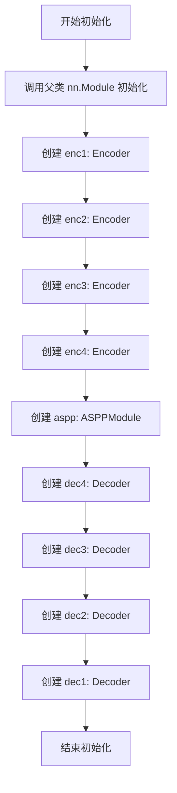
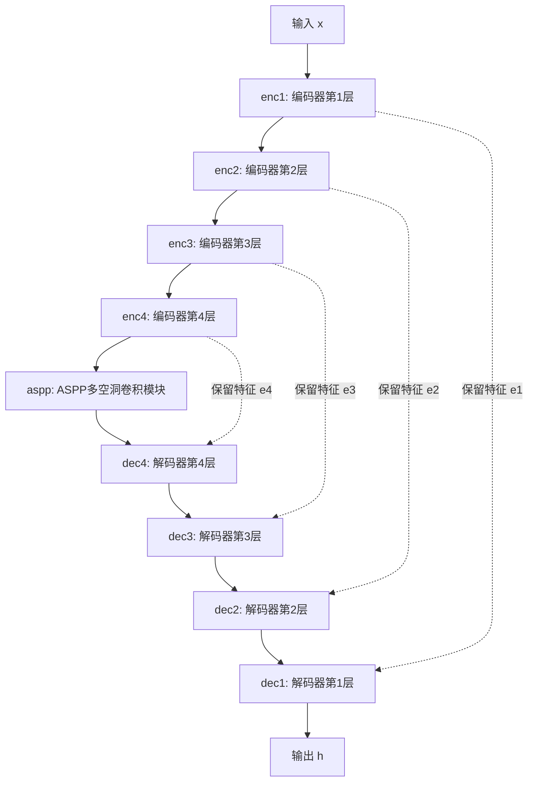
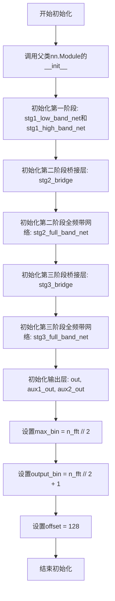

# `Chat-Haruhi-Suzumiya\yuki_builder\video_preprocessing\uvr5\uvr5_pack\lib_v5\nets_537227KB.py` 详细设计文档

该代码实现了一个基于级联ASPP（Cascaded Atrous Spatial Pyramid Pooling）结构的深度神经网络，用于音频频谱图的处理与掩码生成（常见于音频源分离或语音增强任务）。模型采用三阶段级联结构，先分别处理低频和高频区域，再逐步融合全频带特征进行最终掩码预测。

## 整体流程

```mermaid
graph TD
    Start[输入频谱图 x] --> Clone[克隆输入 x]
    Clone --> Split[频率切分: MaxBin]
    Split --> Stg1[Stage 1: 分离低频/高频]
    Stg1 --> Concat1[特征拼接: (原始, 低频, 高频)]
    Concat1 --> Stg2[Stage 2: 全频带处理]
    Stg2 --> Concat2[特征拼接: (原始, Stage1, Stage2)]
    Concat2 --> Stg3[Stage 3: 全频带深度处理]
    Stg3 --> MaskGen[生成掩码 & Sigmoid激活 & Padding]
    MaskGen --> IsTrain{是否训练模式?}
    IsTrain -- 是 --> AuxOut[输出主掩码 + 辅助掩码1,2]
    IsTrain -- 否 --> Aggro{是否有 aggressiveness 参数?}
    Aggro -- 是 --> Power[应用幂函数调整掩码]
    Aggro -- 否 --> FinalOut[输出主掩码]
    Power --> FinalOut
    AuxOut --> End[返回多输出]
    FinalOut --> End
```

## 类结构

```
torch.nn.Module (基类)
├── BaseASPPNet (基础编解码器结构)
│   └── 包含 4层Encoder, 1层ASPP, 4层Decoder
└── CascadedASPPNet (主模型类)
    └── 包含 3个Stage网络、桥接层、输出层
```

## 全局变量及字段


### `torch`
    
PyTorch深度学习框架

类型：`module`
    


### `np`
    
NumPy科学计算库

类型：`module`
    


### `nn`
    
PyTorch神经网络模块

类型：`module`
    


### `F`
    
PyTorch函数式API

类型：`module`
    


### `layers`
    
自定义层模块(layers_537238KB)

类型：`module`
    


### `BaseASPPNet.enc1`
    
第1级编码器

类型：`Encoder`
    


### `BaseASPPNet.enc2`
    
第2级编码器

类型：`Encoder`
    


### `BaseASPPNet.enc3`
    
第3级编码器

类型：`Encoder`
    


### `BaseASPPNet.enc4`
    
第4级编码器

类型：`Encoder`
    


### `BaseASPPNet.aspp`
    
空洞空间金字塔池化模块

类型：`ASPPModule`
    


### `BaseASPPNet.dec4`
    
第4级解码器

类型：`Decoder`
    


### `BaseASPPNet.dec3`
    
第3级解码器

类型：`Decoder`
    


### `BaseASPPNet.dec2`
    
第2级解码器

类型：`Decoder`
    


### `BaseASPPNet.dec1`
    
第1级解码器

类型：`Decoder`
    


### `CascadedASPPNet.stg1_low_band_net`
    
处理低频段的子网络

类型：`BaseASPPNet`
    


### `CascadedASPPNet.stg1_high_band_net`
    
处理高频段的子网络

类型：`BaseASPPNet`
    


### `CascadedASPPNet.stg2_bridge`
    
Stage 2的桥接卷积层

类型：`Conv2DBNActiv`
    


### `CascadedASPPNet.stg2_full_band_net`
    
Stage 2的全频带处理网络

类型：`BaseASPPNet`
    


### `CascadedASPPNet.stg3_bridge`
    
Stage 3的桥接卷积层

类型：`Conv2DBNActiv`
    


### `CascadedASPPNet.stg3_full_band_net`
    
Stage 3的全频带处理网络

类型：`BaseASPPNet`
    


### `CascadedASPPNet.out`
    
最终输出卷积层(生成2通道掩码)

类型：`Conv2d`
    


### `CascadedASPPNet.aux1_out`
    
辅助输出1卷积层

类型：`Conv2d`
    


### `CascadedASPPNet.aux2_out`
    
辅助输出2卷积层

类型：`Conv2d`
    


### `CascadedASPPNet.max_bin`
    
最大频率bins数

类型：`int`
    


### `CascadedASPPNet.output_bin`
    
输出频率bins数

类型：`int`
    


### `CascadedASPPNet.offset`
    
预测时的裁剪偏移量

类型：`int`
    
    

## 全局函数及方法


### `BaseASPPNet.__init__`

初始化 BaseASPPNet 网络结构，构建编码器-ASPP-解码器（Encoder-ASPP-Decoder）架构，用于音频频谱特征提取与重建。

参数：

- `nin`：`int`，输入特征图的通道数（number of input channels）
- `ch`：`int`，基础通道数，用于逐层扩展（base channel number for layer-wise expansion）
- `dilations`：`tuple`，ASPP 模块中空洞卷积的膨胀率，默认为 (4, 8, 16)

返回值：`None`，该方法仅初始化网络结构，不返回任何值

#### 流程图



#### 带注释源码

```
def __init__(self, nin, ch, dilations=(4, 8, 16)):
    """
    初始化 BaseASPPNet 网络结构
    
    参数:
        nin (int): 输入通道数
        ch (int): 基础通道数
        dilations (tuple): ASPP 模块的膨胀率，默认为 (4, 8, 16)
    """
    # 调用父类 nn.Module 的初始化方法，确保 PyTorch 模型正确初始化
    super(BaseASPPNet, self).__init__()
    
    # 编码器部分：逐步提取特征并下采样
    # enc1: 将 nin 通道扩展到 ch 通道，卷积核 3x3，步长 2，padding 1
    self.enc1 = layers.Encoder(nin, ch, 3, 2, 1)
    # enc2: 将 ch 通道扩展到 ch*2 通道
    self.enc2 = layers.Encoder(ch, ch * 2, 3, 2, 1)
    # enc3: 将 ch*2 通道扩展到 ch*4 通道
    self.enc3 = layers.Encoder(ch * 2, ch * 4, 3, 2, 1)
    # enc4: 将 ch*4 通道扩展到 ch*8 通道
    self.enc4 = layers.Encoder(ch * 4, ch * 8, 3, 2, 1)
    
    # ASPP 模块：空洞空间金字塔池化，用于多尺度特征融合
    # 输入通道 ch*8，输出通道 ch*16
    self.aspp = layers.ASPPModule(ch * 8, ch * 16, dilations)
    
    # 解码器部分：逐步恢复空间分辨率并融合编码器特征
    # dec4: 融合 e4 和 aspp 输出，输入 ch*(8+16)，输出 ch*8
    self.dec4 = layers.Decoder(ch * (8 + 16), ch * 8, 3, 1, 1)
    # dec3: 融合 e3 和 dec4 输出，输入 ch*(4+8)，输出 ch*4
    self.dec3 = layers.Decoder(ch * (4 + 8), ch * 4, 3, 1, 1)
    # dec2: 融合 e2 和 dec3 输出，输入 ch*(2+4)，输出 ch*2
    self.dec2 = layers.Decoder(ch * (2 + 4), ch * 2, 3, 1, 1)
    # dec1: 融合 e1 和 dec2 输出，输入 ch*(1+2)，输出 ch
    self.dec1 = layers.Decoder(ch * (1 + 2), ch, 3, 1, 1)
```


### `BaseASPPNet.__call__(x)`

该方法是 `BaseASPPNet` 类的前向传播入口，通过调用特殊方法 `__call__` 使实例可像函数一样被调用。它执行完整的编码器-ASPP-解码器（Encoder-ASPP-Decoder）流程：将输入依次经过4层编码器提取多尺度特征，经过ASPP模块进行多空洞率卷积以获取上下文信息，再经过4层解码器逐步恢复空间分辨率并融合编码器特征，最终输出处理后的特征张量。

参数：

- `x`：`torch.Tensor`，输入张量，通常为四维张量（batch_size, channels, height, width），代表原始输入数据

返回值：`torch.Tensor`，经过完整的编码-ASPP-解码流程处理后的输出张量，形状通常为（batch_size, output_channels, height, width）

#### 流程图



#### 带注释源码

```python
def __call__(self, x):
    """
    前向传播函数，执行编码-ASPP-解码流程
    
    参数:
        x: 输入张量，形状为 (batch_size, nin, H, W)
           nin 为输入通道数，在初始化时指定
    
    返回:
        h: 输出张量，形状为 (batch_size, ch, H', W')
           ch 为输出通道数，在初始化时指定
           H' 和 W' 为经过4次下采样和4次上采样后的尺寸
    """
    
    # ===== 编码阶段 (Encoder) =====
    # 逐层提取特征，每层包含下采样操作
    # 同时保存每个编码器的输出用于后续解码器的跳跃连接
    
    # 第1层编码器: 将输入 x 进行编码，得到特征 h 和编码器输出 e1
    # 编码器内部会进行下采样，尺寸减半
    h, e1 = self.enc1(x)
    
    # 第2层编码器: 继续对 h 进行编码，输出 e2
    h, e2 = self.enc2(h)
    
    # 第3层编码器: 继续对 h 进行编码，输出 e3
    h, e3 = self.enc3(h)
    
    # 第4层编码器: 继续对 h 进行编码，输出 e4
    h, e4 = self.enc4(h)
    
    # ===== ASPP 阶段 (Atrous Spatial Pyramid Pooling) =====
    # 使用多个不同空洞率的卷积核并行提取多尺度上下文信息
    # ASPP 模块不改变特征图的空间尺寸，仅改变通道数
    h = self.aspp(h)
    
    # ===== 解码阶段 (Decoder) =====
    # 逐层上采样恢复空间尺寸，同时通过跳跃连接融合对应编码器的特征
    
    # 第4层解码器: 融合 ASPP 输出 h 和第4层编码器特征 e4
    # 解码器进行上采样，恢复空间尺寸
    h = self.dec4(h, e4)
    
    # 第3层解码器: 融合上一步输出和第3层编码器特征 e3
    h = self.dec3(h, e3)
    
    # 第2层解码器: 融合上一步输出和第2层编码器特征 e2
    h = self.dec2(h, e2)
    
    # 第1层解码器: 融合上一步输出和第1层编码器特征 e1
    # 这是最后一层解码器，输出最终结果
    h = self.dec1(h, e1)
    
    # 返回解码后的最终特征张量
    return h
```


### `CascadedASPPNet.__init__(n_fft)`

该方法初始化一个用于音频频谱处理的三级级联ASPP网络结构，包含低频段网络、高频段网络、桥接层和输出层，并设置频率相关的参数。

参数：

- `n_fft`：`int`，傅里叶变换的点数，决定了频率分辨率和输出维度

返回值：`None`，该方法为构造函数，不返回任何值

#### 流程图



#### 带注释源码

```python
def __init__(self, n_fft):
    """
    初始化CascadedASPPNet网络结构
    
    参数:
        n_fft: 傅里叶变换的点数，用于确定频率维度
    """
    # 调用父类nn.Module的初始化方法
    super(CascadedASPPNet, self).__init__()
    
    # ============================================
    # 第一阶段：分离低频和高频处理网络
    # ============================================
    # 低频段处理网络，输入2通道，输出64通道
    self.stg1_low_band_net = BaseASPPNet(2, 64)
    # 高频段处理网络，输入2通道，输出64通道
    self.stg1_high_band_net = BaseASPPNet(2, 64)
    
    # ============================================
    # 第二阶段：桥接层和全频带处理网络
    # ============================================
    # 桥接层：输入66通道(原始2通道+辅助输出64通道)，输出32通道
    # 卷积核大小1x1，步长1，填充0
    self.stg2_bridge = layers.Conv2DBNActiv(66, 32, 1, 1, 0)
    # 第二阶段全频带网络：输入32通道，输出64通道
    self.stg2_full_band_net = BaseASPPNet(32, 64)
    
    # ============================================
    # 第三阶段：桥接层和全频带处理网络
    # ============================================
    # 桥接层：输入130通道(原始2+辅助1的64+辅助2的64)，输出64通道
    self.stg3_bridge = layers.Conv2DBNActiv(130, 64, 1, 1, 0)
    # 第三阶段全频带网络：输入64通道，输出128通道
    self.stg3_full_band_net = BaseASPPNet(64, 128)
    
    # ============================================
    # 输出层
    # ============================================
    # 最终输出卷积：128通道 -> 2通道，用于生成掩码
    self.out = nn.Conv2d(128, 2, 1, bias=False)
    # 辅助输出1：64通道 -> 2通道，用于训练时的辅助损失
    self.aux1_out = nn.Conv2d(64, 2, 1, bias=False)
    # 辅助输出2：64通道 -> 2通道，用于训练时的辅助损失
    self.aux2_out = nn.Conv2d(64, 2, 1, bias=False)
    
    # ============================================
    # 频率相关参数
    # ============================================
    # 最大频率bin数 = n_fft的一半
    self.max_bin = n_fft // 2
    # 输出频率bin数 = n_fft的一半加1
    self.output_bin = n_fft // 2 + 1
    
    # 偏移量，用于predict方法中裁剪输出
    self.offset = 128
```


### `CascadedASPPNet.forward(x, aggressiveness)`

该方法实现了 CascadedASPPNet（级联 ASPP 网络）的前向传播核心逻辑。它接收音频的幅度谱（Magnitude Spectrogram）作为输入，通过三个级联阶段（Stage 1 的高低频带分离处理，Stage 2 的全频带融合，Stage 3 的最终掩码生成）来预测频域掩码。此方法包含训练与推理两个分支：训练时返回主掩码及两个辅助输出用于深度监督；推理时根据 `aggressiveness` 参数调整掩码强度，并返回最终的增强音频（掩码与原始音频的乘积）。

参数：

- `x`：`torch.Tensor`，输入的张量，通常为音频混合信号的幅度谱（Magnitude Spectrogram），形状为 `[B, C, F, T]`。
- `aggressiveness`：`dict`（可选），仅在推理模式（`self.training == False`）下生效。包含 `split_bin`（分割频率_bin索引）和 `value`（强度值），用于在推理时动态调整降噪/增强的激进程度。

返回值：`torch.Tensor` 或 `Tuple[torch.Tensor, torch.Tensor, torch.Tensor]`。

- **训练模式**：返回一个包含三个元素的元组，分别对应主输出、辅助输出1、辅助输出2（均为掩码与原始输入 `mix` 的逐元素乘积）。
- **推理模式**：返回主输出（掩码与原始输入 `mix` 的逐元素乘积）。

#### 流程图

```mermaid
flowchart TD
    A[输入 x] --> B[数据预处理: 克隆mix, 截断x至max_bin]
    B --> C[计算分割点 bandw]
    C --> D1[Stage 1: 低频带处理<br>stg1_low_band_net]
    C --> D2[Stage 1: 高频带处理<br>stg1_high_band_net]
    D1 --> E[拼接 x_low & x_high]
    D2 --> E
    E --> F[Stage 1 输出 aux1]
    F --> G[拼接 x & aux1]
    G --> H[Stage 2: 桥接与全频带处理<br>stg2_bridge -> stg2_full_band_net]
    H --> I[Stage 2 输出 aux2]
    I --> J[拼接 x & aux1 & aux2]
    J --> K[Stage 3: 桥接与全频带处理<br>stg3_bridge -> stg3_full_band_net]
    K --> L[生成掩码 mask: Sigmoid + Out Conv]
    L --> M[Padding mask至output_bin]
    M --> N{self.training?}
    N -->|True (训练)| O[处理aux1: Sigmoid + aux1_out + Padding]
    N -->|False (推理)| P{aggressiveness?}
    O --> Q[处理aux2: Sigmoid + aux2_out + Padding]
    Q --> R[返回 tuple<br>mask\*mix, aux1\*mix, aux2\*mix]
    P -->|Yes| S[应用幂函数调整mask<br>基于split_bin和value]
    P -->|No| T[直接返回]
    S --> T
    T --> U[返回 mask\*mix]
```

#### 带注释源码

```python
def forward(self, x, aggressiveness=None):
    # 1. 预处理：分离用于残差连接的 'mix' (.detach()) 和待处理的 'x' (.clone())
    mix = x.detach()
    x = x.clone()

    # 2. 频谱裁剪：将输入限制在 max_bin 范围内（处理长FFT导致的padding问题）
    x = x[:, :, : self.max_bin]

    # 3. 计算频带分割点（低频与高频的边界）
    bandw = x.size()[2] // 2
    
    # 4. Stage 1: 频带分离处理
    # 将频谱分为低频和高频两部分，分别通过独立的 BaseASPPNet 进行特征提取
    # 结果在频率维度(dim=2)上拼接，得到 Stage 1 的输出 aux1
    aux1 = torch.cat(
        [
            self.stg1_low_band_net(x[:, :, :bandw]),   # 处理低频段
            self.stg1_high_band_net(x[:, :, bandw:]),  # 处理高频段
        ],
        dim=2,
    )

    # 5. Stage 2: 全频带融合
    # 将原始频谱 x 与 Stage 1 输出 aux1 拼接，通过桥接层 stg2_bridge 调整通道数
    # 再通过 stg2_full_band_net 提取更高级的特征，得到 aux2
    h = torch.cat([x, aux1], dim=1)
    aux2 = self.stg2_full_band_net(self.stg2_bridge(h))

    # 6. Stage 3: 最终特征融合与掩码生成
    # 将原始频谱、Stage1 输出、Stage2 输出全部拼接，通过最终的全频带网络
    h = torch.cat([x, aux1, aux2], dim=1)
    h = self.stg3_full_band_net(self.stg3_bridge(h))

    # 7. 生成掩码：通过 Sigmoid 激活函数将输出转换为 0~1 之间的掩码
    mask = torch.sigmoid(self.out(h))
    
    # 8. Padding：确保掩码的频率维度与目标 output_bin 匹配（处理不同 FFT 大小）
    mask = F.pad(
        input=mask,
        pad=(0, 0, 0, self.output_bin - mask.size()[2]),
        mode="replicate",
    )

    # 9. 训练/推理分支
    if self.training:
        # --- 训练分支：返回深监督辅助输出 ---
        # 处理 aux1: Sigmoid + 投影卷积 + Padding
        aux1 = torch.sigmoid(self.aux1_out(aux1))
        aux1 = F.pad(
            input=aux1,
            pad=(0, 0, 0, self.output_bin - aux1.size()[2]),
            mode="replicate",
        )
        # 处理 aux2
        aux2 = torch.sigmoid(self.aux2_out(aux2))
        aux2 = F.pad(
            input=aux2,
            pad=(0, 0, 0, self.output_bin - aux2.size()[2]),
            mode="replicate",
        )
        # 返回主掩码及两个辅助掩码，分别乘以原始输入 mix
        return mask * mix, aux1 * mix, aux2 * mix
    else:
        # --- 推理分支：可选的激进度调整 ---
        if aggressiveness:
            # 调整低频部分：基于 value 调整幂次
            mask[:, :, : aggressiveness["split_bin"]] = torch.pow(
                mask[:, :, : aggressiveness["split_bin"]],
                1 + aggressiveness["value"] / 3,
            )
            # 调整高频部分：基于 value 调整幂次（通常高频受激进度影响更大）
            mask[:, :, aggressiveness["split_bin"] :] = torch.pow(
                mask[:, :, aggressiveness["split_bin"] :],
                1 + aggressiveness["value"],
            )

        # 返回最终掩码乘积
        return mask * mix
```


### `CascadedASPPNet.predict`

这是 `CascadedASPPNet` 类的推理（Prediction）接口方法。它封装了 `forward` 方法的执行流程，用于生成最终的音频掩码（Mask）。该方法首先调用神经网络的前向传播来计算预测结果，随后根据模型初始化时设定的偏移量（`offset`）对输出的时间维度进行裁剪，以确保输出与输入的时序对齐。如果传入了 `aggressiveness` 参数，`forward` 内部会调整掩码的强度以实现不同级别的降噪。

参数：

- `x_mag`：`torch.Tensor`，输入的幅度谱（Magnitude Spectrogram），形状通常为 (Batch, Channel, Freq, Time)。
- `aggressiveness`：`Optional[Dict]`，可选参数。包含 `split_bin`（频率分割点）和 `value`（强度系数），用于控制推理时的降噪 aggressiveness。默认为 `None`。

返回值：`torch.Tensor`，返回裁剪后的预测掩码（或掩码后的频谱），形状通常为 (Batch, 2, Freq, Time - 2*offset)。

#### 流程图

```mermaid
graph TD
    Start(Start: predict) --> CallForward[Call self.forward<br/>(x_mag, aggressiveness)]
    CallForward --> CheckOffset{Is Offset > 0?}
    
    %% True branch
    CheckOffset -- Yes --> SliceTensor[Slice Tensor<br/>h = h[:, :, :, offset : -offset]]
    SliceTensor --> AssertSize{Assert width > 0?}
    AssertSize -- Pass --> Return[Return h]
    
    %% False branch
    CheckOffset -- No --> Return
    
    %% Error handling visualization (optional but good practice)
    AssertSize -- Fail --> Error[RuntimeError / AssertionError]
```

#### 带注释源码

```python
def predict(self, x_mag, aggressiveness=None):
    """
    推理接口，处理掩码生成和输出裁剪。
    
    参数:
        x_mag (torch.Tensor): 输入的幅度谱。
        aggressiveness (dict, optional): 降噪强度控制参数。
    """
    # 1. 调用 forward 方法执行核心推理逻辑
    #    forward 方法会根据 aggressiveness 参数调整掩码，并返回 mask * mix
    h = self.forward(x_mag, aggressiveness)

    # 2. 处理输出偏移量 (Offset)
    #    模型结构可能会产生比输入更宽的输出（例如由于卷积padding），此处进行裁剪
    if self.offset > 0:
        # 对张量的最后一个维度（时间步）进行切片，去除两侧的 padding
        # 格式: [Batch, Channel, Freq, Time]
        h = h[:, :, :, self.offset : -self.offset]
        
        # 3. 安全性断言
        #    确保裁剪后的时间维度长度大于0，防止输入过短导致异常
        assert h.size()[3] > 0

    return h
```

---

#### 类的详细信息

**类名**：`CascadedASPPNet`
**基类**：`nn.Module`

**类字段**：
- `stg1_low_band_net`, `stg1_high_band_net`：第一阶段的低频和高频子网络（BaseASPPNet）。
- `stg2_bridge`, `stg2_full_band_net`：第二阶段的桥接层和全波段网络。
- `stg3_bridge`, `stg3_full_band_net`：第三阶段的桥接层和全波段网络。
- `out`, `aux1_out`, `aux2_out`：输出卷积层。
- `max_bin`, `output_bin`：配置参数，用于控制频谱维度。
- `offset`：`int`，输出裁剪的偏移量，初始化为 128。

**关键方法**：
- `forward(x, aggressiveness)`：核心前向传播，包含多级级联 ASPP 结构和 aggressiveness 处理逻辑。
- `predict(x_mag, aggressiveness)`：推理封装接口，调用 forward 并处理 offset 裁剪。

---

#### 潜在的技术债务或优化空间

1.  **训练与推理模式耦合**：`predict` 方法直接调用 `forward`。如果模型处于 `training=True` 模式（未调用 `model.eval()`），`forward` 会返回三个输出（主输出和两个辅助输出），导致 `predict` 中的 `h = self.forward(...)` 语句尝试将三个张量赋值给一个变量，从而引发 `ValueError`。建议在 `predict` 内部显式处理或添加断言检查 `self.training` 状态。
2.  **硬编码的 Offset**：偏移量 `self.offset = 128` 是硬编码的。如果输入音频长度小于 `2 * offset`（如 256 帧），`assert h.size()[3] > 0` 会触发异常。缺乏对极端短输入的鲁棒性处理。
3.  **维度假设**：代码中大量使用 `x.size()[2]` 和 `x.size()[3]` 假设维度顺序为 (B, C, F, T)。如果输入维度顺序改变（例如 (B, F, T, C)），代码会崩溃。

#### 其它项目

**设计约束**：
- 输入 `x_mag` 必须是 4D 张量。
- `aggressiveness` 字典的键必须包含 `split_bin` 和 `value`，且 `split_bin` 必须小于输出频率维度。

**错误处理与异常设计**：
- 使用 Python 原生的 `assert` 进行维度检查，这在 Python 解释器运行优化模式（`python -O`）时会被跳过，可能导致越界错误。建议使用 `if` 抛出明确的 `ValueError`。

**接口契约**：
- **输入**：`x_mag` (Float Tensor, 4D), `aggressiveness` (Dict or None)。
- **输出**：预测的幅度谱 (Float Tensor, 4D)。

## 关键组件


### BaseASPPNet

基础ASPP网络类，包含4个编码器阶段、ASPP模块和4个解码器阶段，用于对输入特征进行多尺度特征提取和重建。

### CascadedASPPNet

级联ASPP网络主类，实现三阶段音频频谱处理流程，支持低频/高频带分离、辅助输出和 aggressiveness 控制。

### 编码器组 (enc1-enc2-enc3-enc4)

四个级联编码器，逐步提取特征并保存中间激活用于跳跃连接。

### ASPPModule

空洞空间金字塔池化模块，使用不同膨胀率的空洞卷积实现多尺度上下文聚合。

### 解码器组 (dec4-dec3-dec2-dec1)

四个级联解码器，通过跳跃连接融合编码器特征逐步恢复空间分辨率。

### 分带处理机制

在 forward 方法中通过切片实现低频带和高频带的分离处理，分别为 stg1_low_band_net 和 stg1_high_band_net。

### 辅助输出路径

aux1_out 和 aux2_out 卷积层，在训练模式下返回多尺度辅助掩码用于多任务学习。

### Aggressiveness 控制

aggressiveness 参数实现动态噪声抑制强度控制，通过幂函数变换调整不同频带的掩码值。

### Predict 方法

包含 offset 偏移量的预测方法，用于裁剪输出张量的时间维度。

### 张量索引与切片

通过 x[:, :, : self.max_bin] 和 bandw 切片实现频带的动态索引和懒加载。

### 掩码应用与反量化

通过 mask * mix 实现掩码应用，恢复原始幅度信息。


## 问题及建议


### 已知问题

-   **硬编码的超参数**：通道数(64, 128等)、offset=128等参数直接硬编码，缺乏配置化设计，难以适应不同场景
-   **魔法数字与隐式假设**：频带分割使用`x.size()[2] // 2`，假设输入固定分成两半；n_fft相关参数没有校验，输入维度合法性未验证
-   **forward方法职责过重**：训练逻辑和推理逻辑混在一起，aggressiveness参数仅用于推理分支，辅助输出(aux1/aux2)的处理逻辑复杂嵌套
-   **predict方法边界问题**：硬编码的offset切片可能产生负数维度，`assert h.size()[3] > 0`的断言在某些输入下会失败
-   **模块化不足**：大量逻辑直接写在forward方法中，频带分割、特征拼接、mask生成等操作未封装成独立函数
-   **变量命名可读性差**：变量名如`stg1_low_band_net`、`bandw`等语义不够清晰，影响代码可维护性
-   **类型注解完全缺失**：无任何类型提示，参数和返回值类型不明确
-   **梯度处理不当**：`x.detach()`和`x.clone()`的使用可能导致意外的梯度阻断，且`mask * mix`在训练时的梯度流需要验证
-   **边界填充模式**：`F.pad`使用"replicate"模式可能不适合音频频谱的物理特性
-   **代码重复**：BaseASPPNet被多次实例化，内部结构高度相似但未抽象复用
-   **缺乏错误处理**：无输入维度校验、无异常捕获，非法输入会导致隐式错误

### 优化建议

-   **配置化设计**：将通道数、offset、dilations等超参数提取为__init__的显式参数或配置文件
-   **输入验证**：在forward方法开始添加输入维度校验，确保x的形状符合预期
-   **职责分离**：将训练/推理分支拆分到独立方法，aggressiveness相关逻辑抽取为独立函数
-   **模块化封装**：将频带分割、特征拼接、padding等操作封装为独立函数或方法
-   **类型注解**：为所有方法添加完整的类型注解，提升代码可读性和可维护性
-   **边界处理优化**：将offset参数化，并使用更安全的切片方式或添加边界检查
-   **语义化命名**：将`bandw`改为`band_width`，`stg`改为`stage`等更清晰的命名
-   **梯度策略审查**：评估`detach()`和`clone()`的使用是否影响训练效果，必要时重构
-   **填充模式选择**：根据音频特性考虑使用"constant"或"reflect"填充模式
-   **文档注释**：为类和方法添加docstring，说明输入输出维度、用途和注意事项


## 其它


### 设计目标与约束

本模型旨在实现音频频谱分离（Audio Spectrum Separation），用于从混合音频中分离出目标信号。设计目标包括：1）支持多阶段级联处理，逐步精炼分离效果；2）在训练阶段提供辅助输出以加速收敛；3）在推理阶段通过aggressiveness参数灵活控制分离强度；4）支持不同时长的音频输入（通过n_fft参数配置）。约束条件包括：输入必须为复数频谱（实部和虚部），输出为分离后的幅度掩码。

### 错误处理与异常设计

模型在以下场景进行异常处理：1）当aggressiveness参数中的split_bin超出有效范围时，torch.pow操作可能导致数值不稳定；2）当output_bin小于当前mask宽度时，F.pad的replicate模式可能产生意外边界效应；3）predict方法中offset参数可能导致h的宽度变为非正数，此时通过assert h.size()[3] > 0捕获。建议在调用前验证输入张量维度是否符合预期（应为4D：batch, channel, freq, time）。

### 数据流与状态机

数据流遵循三级级联结构：Stage 1将输入频谱分为低频和高频两个子带，分别通过独立的BaseASPPNet处理后concat；Stage 2将原始输入与Stage 1输出concat，通过bridge卷积和BaseASPPNet；Stage 3进一步concat后通过最终网络。训练状态（self.training=True）时返回三个输出（主输出+两个辅助输出），推理状态只返回主输出。状态转换由PyTorch的self.training自动管理。

### 外部依赖与接口契约

主要依赖包括：1）PyTorch框架（nn.Module）；2）numpy（可能用于预处理）；3）自定义layers模块（layers_537238KB），需提供Encoder、Decoder、ASPPModule、Conv2DBNActiv四个组件。输入契约：forward方法接收x为4D张量（batch, 2, freq_bins, time_frames），其中2代表复数的实部和虚部；predict方法接收x_mag为幅度谱。输出契约：返回4D张量（batch, 2, freq_bins, time_frames），表示分离后的复数频谱或幅度掩码。

### 配置参数说明

关键配置参数包括：n_fft（FFT窗口大小，决定频谱分辨率），max_bin（最大有效频率 bins = n_fft//2），output_bin（输出频谱宽度 = n_fft//2 + 1），offset（时序裁剪偏移量，用于对齐输出）。dilations参数控制ASPP模块的膨胀率，默认为(4, 8, 16)。aggressiveness参数为字典，包含split_bin（分割频率点）和value（增强强度值）。

### 训练与推理差异

训练模式启用辅助输出（aux1, aux2），分别对应Stage 1和Stage 2的输出，用于多任务学习加速收敛。推理模式只返回最终掩码，且应用aggressiveness参数对不同频段进行非线性变换（通过torch.pow调整）。辅助输出同样应用sigmoid激活和padding以保持与主输出相同的频率维度。

### 输入输出格式

输入格式：forward接受(batch, 2, max_bin, time)的复数频谱张量，其中通道0为实部，通道1为虚部。predict接受(batch, 2, n_fft//2+1, time)的幅度谱。输出格式：返回(batch, 2, output_bin, time)的掩码张量，与混合音频相乘后得到分离音频。所有时间维度的padding使用replicate模式以保持边界连续性。

### 性能考虑与优化空间

当前实现的主要性能瓶颈：1）多次cat操作创建新张量，内存占用较高；2）F.pad使用replicate模式可能有额外开销；3）训练时返回三个输出增加显存消耗。优化建议：1）考虑使用in-place操作减少显存；2）将padding操作移至计算图外；3）可尝试将三个stage合并为单一前向计算图以提高并行度；4）aggressiveness参数在推理时每次都进行条件判断，可考虑使用differentiable的参数化方式。


    