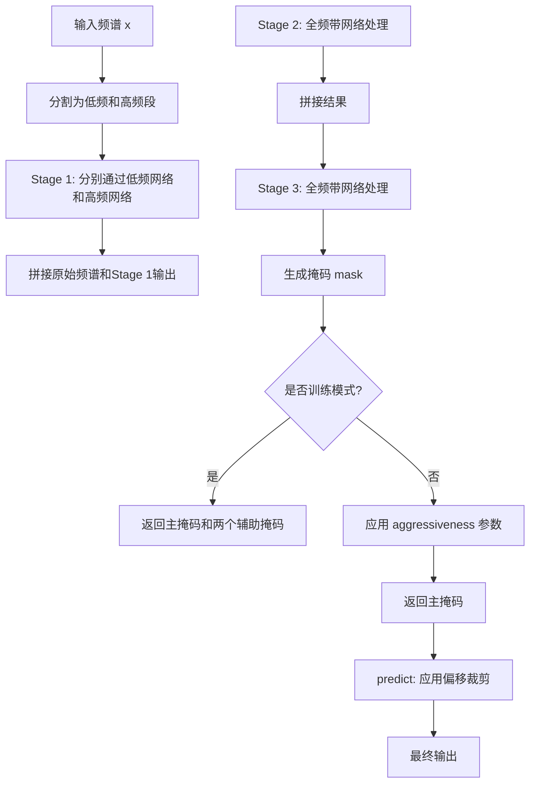
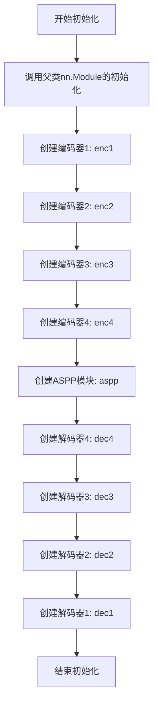
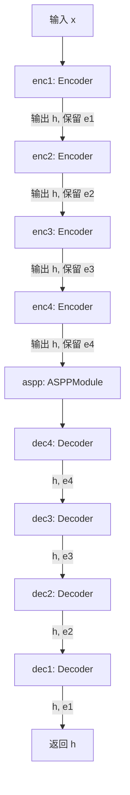
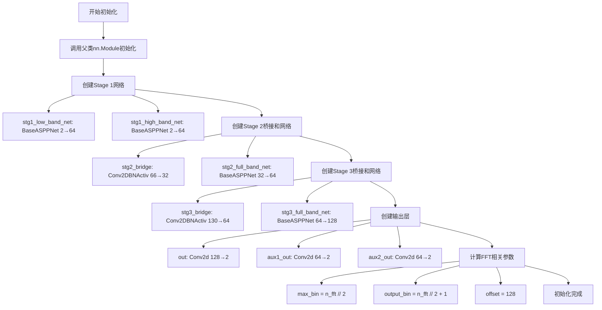

# `Chat-Haruhi-Suzumiya\yuki_builder\video_preprocessing\uvr5\uvr5_pack\lib_v5\nets_537238KB.py` 详细设计文档

这是一个用于音频源分离或语音增强的深度神经网络模型，采用级联ASPP（Cascaded Atrous Spatial Pyramid Pooling）架构，通过多阶段 Encoder-Decoder 结构对音频频谱进行多尺度特征提取和处理，支持训练和推理两种模式，推理时可配置 aggressiveness 参数控制分离强度。

## 整体流程



## 类结构

```
nn.Module (PyTorch基类)
├── BaseASPPNet (基础ASPP网络)
└── CascadedASPPNet (级联ASPP网络，主模型)
```

## 全局变量及字段


### `BaseASPPNet.enc1`
    
第一层编码器，将输入通道数从nin扩展到ch，进行2倍下采样

类型：`layers.Encoder`
    


### `BaseASPPNet.enc2`
    
第二层编码器，将通道数从ch扩展到ch*2，进行2倍下采样

类型：`layers.Encoder`
    


### `BaseASPPNet.enc3`
    
第三层编码器，将通道数从ch*2扩展到ch*4，进行2倍下采样

类型：`layers.Encoder`
    


### `BaseASPPNet.enc4`
    
第四层编码器，将通道数从ch*4扩展到ch*8，进行2倍下采样

类型：`layers.Encoder`
    


### `BaseASPPNet.aspp`
    
ASPP模块，使用不同膨胀率的空洞卷积捕获多尺度特征

类型：`layers.ASPPModule`
    


### `BaseASPPNet.dec4`
    
第四层解码器，融合enc4特征并恢复到ch*8通道

类型：`layers.Decoder`
    


### `BaseASPPNet.dec3`
    
第三层解码器，融合enc3特征并恢复到ch*4通道

类型：`layers.Decoder`
    


### `BaseASPPNet.dec2`
    
第二层解码器，融合enc2特征并恢复到ch*2通道

类型：`layers.Decoder`
    


### `BaseASPPNet.dec1`
    
第一层解码器，融合enc1特征并恢复到ch通道

类型：`layers.Decoder`
    


### `CascadedASPPNet.stg1_low_band_net`
    
Stage1低频网络，处理低频段频谱特征

类型：`BaseASPPNet`
    


### `CascadedASPPNet.stg1_high_band_net`
    
Stage1高频网络，处理高频段频谱特征

类型：`BaseASPPNet`
    


### `CascadedASPPNet.stg2_bridge`
    
Stage2桥接层，将级联特征从66通道压缩到32通道

类型：`layers.Conv2DBNActiv`
    


### `CascadedASPPNet.stg2_full_band_net`
    
Stage2全频带网络，处理合并后的完整频谱

类型：`BaseASPPNet`
    


### `CascadedASPPNet.stg3_bridge`
    
Stage3桥接层，将特征从130通道压缩到64通道

类型：`layers.Conv2DBNActiv`
    


### `CascadedASPPNet.stg3_full_band_net`
    
Stage3全频带网络，最终频谱特征处理

类型：`BaseASPPNet`
    


### `CascadedASPPNet.out`
    
主输出卷积层，将128通道特征映射为2通道掩码

类型：`nn.Conv2d`
    


### `CascadedASPPNet.aux1_out`
    
辅助输出1，输出Stage1的64通道掩码

类型：`nn.Conv2d`
    


### `CascadedASPPNet.aux2_out`
    
辅助输出2，输出Stage2的64通道掩码

类型：`nn.Conv2d`
    


### `CascadedASPPNet.max_bin`
    
最大频谱bin数，等于n_fft的一半

类型：`int`
    


### `CascadedASPPNet.output_bin`
    
输出频谱bin数，等于n_fft的一半加1

类型：`int`
    


### `CascadedASPPNet.offset`
    
输出偏移量，用于裁剪预测结果的边界

类型：`int`
    
    

## 全局函数及方法


### `BaseASPPNet.__init__`

初始化BaseASPPNet网络结构，构建编码器、ASPP模块和解码器的完整U型架构，用于音频频谱图的多尺度特征提取与重建。

参数：

- `self`：`BaseASPPNet`，BaseASPPNet类的实例本身
- `nin`：`int`，输入通道数，指定初始输入的特征维度（通常为2，表示实部和虚部或幅度和相位）
- `ch`：`int`，基础通道数，用于构建网络各层的通道数基数
- `dilations`：`tuple`，ASPP模块的膨胀系数，默认为(4, 8, 16)，用于控制多尺度空洞卷积的感受野

返回值：`None`，该方法为构造函数，不返回任何值，仅通过self属性初始化网络结构

#### 流程图



#### 带注释源码

```
def __init__(self, nin, ch, dilations=(4, 8, 16)):
    """
    初始化BaseASPPNet网络结构
    
    参数:
        nin: int, 输入通道数
        ch: int, 基础通道数
        dilations: tuple, ASPP模块的膨胀系数
    """
    # 调用父类nn.Module的初始化方法，注册所有子模块
    super(BaseASPPNet, self).__init__()
    
    # 编码器部分：4个级联的Encoder，逐步提取特征并降低分辨率
    # enc1: nin -> ch,  stride=2
    self.enc1 = layers.Encoder(nin, ch, 3, 2, 1)
    # enc2: ch -> ch*2, stride=2
    self.enc2 = layers.Encoder(ch, ch * 2, 3, 2, 1)
    # enc3: ch*2 -> ch*4, stride=2
    self.enc3 = layers.Encoder(ch * 2, ch * 4, 3, 2, 1)
    # enc4: ch*4 -> ch*8, stride=2
    self.enc4 = layers.Encoder(ch * 4, ch * 8, 3, 2, 1)
    
    # ASPP模块：使用空洞卷积进行多尺度特征提取
    # 输入通道ch*8，输出通道ch*16
    self.aspp = layers.ASPPModule(ch * 8, ch * 16, dilations)
    
    # 解码器部分：4个级联的Decoder，逐步恢复分辨率
    # dec4: 接收ASPP输出(ch*16)与enc4特征(ch*8)，输出ch*8
    self.dec4 = layers.Decoder(ch * (8 + 16), ch * 8, 3, 1, 1)
    # dec3: 接收dec4输出与enc3特征，输出ch*4
    self.dec3 = layers.Decoder(ch * (4 + 8), ch * 4, 3, 1, 1)
    # dec2: 接收dec3输出与enc2特征，输出ch*2
    self.dec2 = layers.Decoder(ch * (2 + 4), ch * 2, 3, 1, 1)
    # dec1: 接收dec2输出与enc1特征，输出原始通道数ch
    self.dec1 = layers.Decoder(ch * (1 + 2), ch, 3, 1, 1)
```

#### 关键组件信息

| 组件名称 | 一句话描述 |
|---------|-----------|
| `self.enc1` ~ `self.enc4` | 4个级联编码器，逐步提取特征并降低空间分辨率 |
| `self.aspp` | ASPP模块，使用多尺度空洞卷积捕获不同感受野的特征 |
| `self.dec1` ~ `self.dec4` | 4个级联解码器，逐步恢复空间分辨率并融合编码器特征 |

#### 潜在技术债务与优化空间

1. **硬编码的通道数倍数**：编码器和解码器的通道数倍数(ch*2, ch*4等)硬编码在构造函数中，缺乏灵活性
2. **缺少批量归一化位置说明**：依赖layers模块的内部实现，无法从外部确认归一化位置
3. **默认dilations值缺乏调优说明**：默认的(4,8,16)是经验值，未提供可配置的输入验证
4. **网络深度固定**：编码器和解码器均为4层，无法适应不同复杂度的任务需求


### `BaseASPPNet.__call__`

该方法是 `BaseASPPNet` 类的前向传播入口，通过四个编码器阶段逐步提取特征，随后通过 ASPP 模块进行多尺度空洞卷积融合，最后通过四个解码器阶段逐步恢复空间分辨率并输出最终特征图。

参数：

- `self`：`BaseASPPNet` 实例本身，无需显式传递
- `x`：`torch.Tensor`，输入张量，形状为 `(batch, channel, freq, time)`，代表频谱图或类似的二维特征表示

返回值：`torch.Tensor`，经过编码-ASPP-解码处理后的输出张量，形状与输入保持一致或略有变化（取决于网络下采样和上采样策略）

#### 流程图



#### 带注释源码

```python
def __call__(self, x):
    # 第一阶段编码器：输入 x 经过第一个编码器，输出特征 h 和跳跃连接 e1
    # 编码器会进行下采样（stride=2），减少空间维度同时增加通道数
    h, e1 = self.enc1(x)
    
    # 第二阶段编码器：接收上一阶段的特征 h，输出新特征 h 和跳跃连接 e2
    # 通道数从 ch 翻倍至 ch * 2
    h, e2 = self.enc2(h)
    
    # 第三阶段编码器：继续提取特征，通道数从 ch * 2 翻倍至 ch * 4
    h, e3 = self.enc3(h)
    
    # 第四阶段编码器：通道数从 ch * 4 翻倍至 ch * 8，完成编码路径
    h, e4 = self.enc4(h)

    # ASPP 模块：对高层特征进行多尺度空洞卷积，
    # 膨胀率分别为 (4, 8, 16)，用于捕获不同感受野的信息
    # 输出通道数从 ch * 8 扩展至 ch * 16
    h = self.aspp(h)

    # 第一阶段解码器：接收 ASPP 输出 h 和编码阶段保存的跳跃连接 e4
    # 通道数从 ch * (8 + 16) 恢复至 ch * 8
    h = self.dec4(h, e4)
    
    # 第二阶段解码器：使用跳跃连接 e3 进行特征融合
    # 通道数从 ch * (4 + 8) 恢复至 ch * 4
    h = self.dec3(h, e3)
    
    # 第三阶段解码器：使用跳跃连接 e2 进行特征融合
    # 通道数从 ch * (2 + 4) 恢复至 ch * 2
    h = self.dec2(h, e2)
    
    # 第四阶段解码器：使用跳跃连接 e1 进行特征融合
    # 通道数从 ch * (1 + 2) 恢复至 ch (即 nin 对应的通道数)
    h = self.dec1(h, e1)

    # 返回最终解码后的特征图，可用于后续分类或回归任务
    return h
```


### `CascadedASPPNet.__init__`

初始化级联ASPP网络（Cascaded ASPP Network），构建三阶段音频处理管道，包括低频/高频分离网络、桥接层和全频带网络，配置输出卷积和辅助输出层，设置FFT相关参数用于频谱处理。

参数：

- `self`：CascadedASPPNet 实例本身
- `n_fft`：`int`，FFT窗口大小，决定频谱的频率分辨率，用于计算 `max_bin` 和 `output_bin`

返回值：`None`，该方法为初始化方法，不返回任何值

#### 流程图



#### 带注释源码

```python
def __init__(self, n_fft):
    """
    初始化级联ASPP网络
    
    参数:
        n_fft: int, FFT窗口大小，决定频谱的频率分辨率
    """
    # 调用父类nn.Module的初始化方法
    super(CascadedASPPNet, self).__init__()
    
    # ===== Stage 1: 低频和高频分离网络 =====
    # 创建两个BaseASPPNet分别处理低频段和高频段
    # 输入通道2（可能是复数的实部和虚部，或幅值/相位），输出通道64
    self.stg1_low_band_net = BaseASPPNet(2, 64)    # 处理低频部分
    self.stg1_high_band_net = BaseASPPNet(2, 64)   # 处理高频部分
    
    # ===== Stage 2: 桥接层和全频带网络 =====
    # 桥接层: 将原始输入(2通道)与Stage1输出(64*2=128通道) concat后得到66通道
    # 通过1x1卷积降到32通道
    self.stg2_bridge = layers.Conv2DBNActiv(66, 32, 1, 1, 0)
    # Stage 2的全频带网络: 输入32通道，输出64通道
    self.stg2_full_band_net = BaseASPPNet(32, 64)
    
    # ===== Stage 3: 桥接层和全频带网络 =====
    # 桥接层: 将原始输入(2) + Stage1输出(128) + Stage2输出(64) = 194? 
    # 代码中是130: 原始x(2) + aux1(128?) = 130? 实际是 x(2) + aux1的低频部分?
    # 实际上: torch.cat([x, aux1, aux2], dim=1) -> x(2) + aux1(可能是128?) + aux2(64) = 194
    # 但这里bridge输入是130, 可能是x(2) + aux1(64?) + aux2(64) = 130
    self.stg3_bridge = layers.Conv2DBNActiv(130, 64, 1, 1, 0)
    # Stage 3的全频带网络: 输入64通道，输出128通道
    self.stg3_full_band_net = BaseASPPNet(64, 128)
    
    # ===== 输出层 =====
    # 最终输出卷积: 128通道 -> 2通道（复数音频的实部/虚部）
    self.out = nn.Conv2d(128, 2, 1, bias=False)
    # 辅助输出1: Stage1输出(64通道) -> 2通道，用于多任务学习
    self.aux1_out = nn.Conv2d(64, 2, 1, bias=False)
    # 辅助输出2: Stage2输出(64通道) -> 2通道，用于多任务学习
    self.aux2_out = nn.Conv2d(64, 2, 1, bias=False)
    
    # ===== FFT相关参数 =====
    # 最大频率bin数: n_fft的一半（因为对称）
    self.max_bin = n_fft // 2
    # 输出频率bin数: n_fft的一半加1（包含DC和Nyquist）
    self.output_bin = n_fft // 2 + 1
    
    # 偏移量: 用于predict方法中裁剪输出
    self.offset = 128
```


### `CascadedASPPNet.forward`

该方法实现了级联ASPP网络的前向传播逻辑，采用三阶段处理架构处理音频频谱图输入，通过低频带和高频带分离、特征融合、掩码生成等步骤完成音频源分离任务。在训练模式下返回主输出及两个辅助输出用于多任务学习，在推理模式下支持通过 aggressiveness 参数动态调整分离强度。

参数：

- `self`：CascadedASPPNet 实例本身
- `x`：`torch.Tensor`，输入的音频频谱图，形状通常为 (batch, channels, freq, time)
- `aggressiveness`：`dict` 或 `None`，可选参数，包含 `split_bin`（分割频率bin的索引）和 `value`（ aggressiveness 值），用于调整推理时掩码的强度

返回值：`torch.Tensor` 或 `tuple[torch.Tensor, torch.Tensor, torch.Tensor]`，训练时返回三个掩码分别与输入相乘的结果（主输出和两个辅助输出），推理时仅返回主掩码与输入相乘的结果

#### 流程图

```mermaid
flowchart TD
    A[输入 x] --> B[保存输入副本 mix = x.detach]
    B --> C[复制输入 x = x.clone]
    C --> D[裁剪频率维度 x = x[:, :, :max_bin]
    D --> E[计算bandw = x.size[2] // 2]
    E --> F[低频带: stg1_low_band_net(x[:, :, :bandw])
    E --> G[高频带: stg1_high_band_net(x[:, :, bandw:])
    F --> H[在dim=2拼接: aux1 = torch.cat([低频输出, 高频输出], dim=2)]
    G --> H
    H --> I[在dim=1拼接: h = torch.cat([x, aux1], dim=1)]
    I --> J[桥接层: stg2_bridge(h)
    J --> K[第二阶段全频带网络: aux2 = stg2_full_band_net(bridge_out)]
    K --> L[在dim=1拼接: h = torch.cat([x, aux1, aux2], dim=1)]
    L --> M[桥接层: stg3_bridge(h)
    M --> N[第三阶段全频带网络: h = stg3_full_band_net(bridge_out)]
    N --> O[输出卷积: mask = sigmoid(out(h))]
    O --> P[填充mask至output_bin长度]
    P --> Q{是否训练模式?}
    Q -->|是| R[aux1通过sigmoid和填充]
    Q -->|是| S[aux2通过sigmoid和填充]
    R --> T[返回 mask*mix, aux1*mix, aux2*mix]
    S --> T
    Q -->|否| U{aggressiveness是否存在?}
    U -->|是| V[对split_bin前mask应用1+value/3指数]
    U -->|是| W[对split_bin后mask应用1+value指数]
    V --> X[返回 mask * mix]
    W --> X
    U -->|否| X
```

#### 带注释源码

```python
def forward(self, x, aggressiveness=None):
    """
    CascadedASPPNet的前向传播方法
    
    参数:
        x: 输入张量，形状为(batch, channels, freq_bins, time_frames)
        aggressiveness: 可选字典，包含'split_bin'和'value'用于调整分离强度
    
    返回:
        训练模式: (主掩码, 辅助掩码1, 辅助掩码2) 与输入的乘积
        推理模式: 主掩码与输入的乘积
    """
    # 保存输入的副本用于后续与掩码相乘（分离操作）
    mix = x.detach()
    # 克隆输入以避免修改原始数据
    x = x.clone()

    # 裁剪到最大频率bin（去除高频部分）
    x = x[:, :, : self.max_bin]

    # 计算频带宽度（频率维度的一半）
    bandw = x.size()[2] // 2
    # 第一阶段：分别处理低频和高频带
    # 将频谱图在频率维度分成两部分，分别通过独立网络
    aux1 = torch.cat(
        [
            self.stg1_low_band_net(x[:, :, :bandw]),  # 低频带网络处理前半部分
            self.stg1_high_band_net(x[:, :, bandw:]), # 高频带网络处理后半部分
        ],
        dim=2,  # 在频率维度拼接
    )

    # 第二阶段：融合原始输入和第一阶段输出
    h = torch.cat([x, aux1], dim=1)  # 在通道维度拼接
    # 通过桥接层和全频带网络
    aux2 = self.stg2_full_band_net(self.stg2_bridge(h))

    # 第三阶段：融合所有前面阶段的特征
    h = torch.cat([x, aux1, aux2], dim=1)  # 再次在通道维度拼接
    h = self.stg3_full_band_net(self.stg3_bridge(h))

    # 生成最终的掩码
    mask = torch.sigmoid(self.out(h))
    # 填充掩码以匹配期望的输出频率bin数量
    mask = F.pad(
        input=mask,
        pad=(0, 0, 0, self.output_bin - mask.size()[2]),  # 只在最后维度填充
        mode="replicate",  # 复制边缘值进行填充
    )

    # 训练模式：返回多个输出用于多任务学习
    if self.training:
        # 对辅助输出也应用sigmoid和填充
        aux1 = torch.sigmoid(self.aux1_out(aux1))
        aux1 = F.pad(
            input=aux1,
            pad=(0, 0, 0, self.output_bin - aux1.size()[2]),
            mode="replicate",
        )
        aux2 = torch.sigmoid(self.aux2_out(aux2))
        aux2 = F.pad(
            input=aux2,
            pad=(0, 0, 0, self.output_bin - aux2.size()[2]),
            mode="replicate",
        )
        # 返回三个输出：主输出和两个辅助输出
        return mask * mix, aux1 * mix, aux2 * mix
    else:
        # 推理模式：根据aggressiveness参数调整掩码强度
        if aggressiveness:
            # 对低频部分应用较弱的指数调整
            mask[:, :, : aggressiveness["split_bin"]] = torch.pow(
                mask[:, :, : aggressiveness["split_bin"]],
                1 + aggressiveness["value"] / 3,
            )
            # 对高频部分应用较强的指数调整
            mask[:, :, aggressiveness["split_bin"] :] = torch.pow(
                mask[:, :, aggressiveness["split_bin"] :],
                1 + aggressiveness["value"],
            )

        # 返回主掩码与输入的乘积（即分离后的音频）
        return mask * mix
```


### `CascadedASPPNet.predict`

该方法是 `CascadedASPPNet` 类的预测接口，接收频谱幅度输入并调用前向传播方法进行处理，同时根据配置的偏移量（offset）对输出进行裁剪，以去除可能的边缘伪影。在训练模式下返回主输出及两个辅助输出，推理模式下仅返回主输出。

参数：

- `x_mag`：`torch.Tensor`，输入的频谱幅度张量，形状通常为 (batch, channels, frequency_bins, time_frames)
- `aggressiveness`：`dict` 或 `None`，可选的 aggressiveness 参数字典，包含 "split_bin" 和 "value" 键，用于控制推理时的掩码强度调整。默认为 None

返回值：`torch.Tensor`，处理后的掩码张量，形状为 (batch, 2, frequency_bins, time_frames)，已根据 offset 进行过裁剪

#### 流程图

```mermaid
flowchart TD
    A[开始 predict] --> B[调用 forward 方法]
    B --> C{self.offset > 0?}
    C -->|是| D[对输出 h 进行切片<br/>h = h[:, :, :, self.offset:-self.offset]]
    D --> E{断言 h.size[3] > 0}
    E -->|通过| F[返回 h]
    C -->|否| F
```

#### 带注释源码

```python
def predict(self, x_mag, aggressiveness=None):
    """
    预测方法：对输入的频谱幅度进行掩码预测
    
    参数:
        x_mag: 输入频谱幅度张量
        aggressiveness: 可选的侵略性参数字典，用于控制掩码强度
    
    返回:
        处理后的掩码张量，已根据 offset 进行裁剪
    """
    # 调用 forward 方法执行核心的前向传播逻辑
    # forward 方法内部会处理多阶段 ASPP 特征提取、桥接和掩码生成
    h = self.forward(x_mag, aggressiveness)

    # 检查是否需要应用偏移量裁剪
    # offset 在初始化时设置为 128，用于去除输出边缘的潜在伪影区域
    if self.offset > 0:
        # 对输出的时间维度（第四维）进行对称裁剪
        # 去掉左侧和右侧各 self.offset 个时间帧
        h = h[:, :, :, self.offset : -self.offset]
        # 断言确保裁剪后的输出宽度大于 0，防止无效输出
        assert h.size()[3] > 0

    # 返回处理后的掩码张量
    return h
```

## 关键组件


### BaseASPPNet（基础ASPP网络）

BaseASPPNet是一个包含编码器-ASPP-解码器结构的U-Net风格神经网络，用于处理音频频谱特征。编码器部分通过4个连续的Encoder模块逐步下采样提取多尺度特征，ASPP模块使用多空洞率卷积捕获多尺度上下文信息，Decoder部分通过4个Decoder模块逐步上采样并融合编码器特征。

### CascadedASPPNet（级联ASPP网络）

CascadedASPPNet是完整的多阶段音频处理网络，采用三级级联结构：第一阶段将输入频谱分为低频和高频两个band分别通过独立的BaseASPPNet处理；第二阶段将原始频谱与第一阶段输出拼接后通过桥接卷积和BaseASPPNet处理；第三阶段进一步融合多层级特征生成最终掩码。网络支持训练时的辅助输出和推理时的aggressiveness参数控制。

### 频带分割与低/高频独立处理

网络第一阶段将输入频谱在频率维度上按中间位置分割为低频带和高频带，分别通过stg1_low_band_net和stg1_high_band_net两个独立的BaseASPPNet处理。这种设计允许网络针对不同频率范围学习专门的特征表示，提高了对高低频区音频特性的建模能力。

### ASPPModule（空洞空间金字塔池化模块）

ASPPModule使用多个具有不同空洞率（dilations）的并行卷积分支捕获多尺度上下文信息。在BaseASPPNet中位于编码器和解码器之间，作为瓶颈层将特征维度从ch*8扩展到ch*16，增强特征的感受野和语义表达能力。

### Encoder/Decoder（编码器/解码器模块）

Encoder模块执行步长卷积实现下采样，包含卷积、批归一化和激活操作；Decoder模块执行上采样（转置卷积或上采样+卷积）并与对应层特征跳跃连接。两者均来自layers模块，共同构成U-Net架构实现多尺度特征融合。

### 桥接层（stg2_bridge、stg3_bridge）

桥接层是1x1卷积模块，用于调整通道维度后连接不同阶段。网络在第二阶段使用Conv2DBNActiv(66, 32, 1, 1, 0)将66通道特征压缩到32通道，在第三阶段使用Conv2DBNActiv(130, 64, 1, 1, 0)将130通道特征压缩到64通道，实现阶段间的维度适配。

### 辅助输出（aux1_out、aux2_out）

网络在训练模式下返回三个输出：主掩码mask和两个辅助掩码aux1、aux2。aux1来自第一阶段低频和高频网络输出的拼接，aux2来自第二阶段全频带网络的输出。这些辅助输出通过多任务学习机制帮助网络训练，推理时仅返回主掩码。

### 掩码生成与应用机制

网络输出经过Sigmoid激活生成0-1范围的掩码，然后与输入mix相乘得到最终增强后的频谱。掩码采用replicate模式padding到目标输出bin数，确保频谱维度一致性。推理时可使用aggressiveness参数调整掩码曲线，对不同频率区间应用不同的幂次变换增强攻击性。

### aggressiveness（攻击性参数）

aggressiveness是推理时的可选参数，用于控制掩码的强度曲线。包含split_bin分割点和value强度值两部分：split_bin之前的低频部分应用较弱的幂次变换(1+value/3)，split_bin之后的高频部分应用较强的幂次变换(1+value)，实现对不同频段差异化的增强控制。

### predict方法（预测裁剪）

predict方法在forward之后对输出进行时域方向的偏移裁剪操作。当self.offset大于0时，裁剪掉输出两侧各offset宽度的部分，用于去除边界效应或适配特定的输出要求。


## 问题及建议


### 已知问题

- **魔数与硬编码值**：代码中存在多个未解释的硬编码值，如 `self.offset = 128`、`ch * 8`、`ch * 16` 等通道数乘数、dilations=(4,8,16) 等，缺乏配置化设计
- **维度索引不够清晰**：使用 `x.size()[2]`、`x.size()[3]` 访问张量维度，可读性差，应使用命名维度或 `shape` 属性
- **训练/推理逻辑耦合**：在 `forward` 方法中通过 `self.training` 布尔标志区分训练和推理行为，导致部署时行为不一致，违反单一职责原则
- **重复代码模式**：多处重复的 `F.pad` + `mask.size()[2]` 计算逻辑未提取为公共方法，违反 DRY 原则
- **变量命名不规范**：`bandw` 应为 `band_width`，`nin` 应为 `num_in_channels`，影响可读性
- **类型注解缺失**：整个代码库无任何类型提示（type hints），不利于静态分析和 IDE 辅助
- **输入验证缺失**：`forward` 方法未对输入 `x` 的形状、维度进行合法性校验，可能产生难以追踪的运行时错误
- **资源清理暗示不足**：模型中无显式的 GPU/CPU 设备管理逻辑，多设备部署时可能出现问题
- **辅助损失权重不可配置**：`aux1_out` 和 `aux2_out` 的损失权重未暴露，训练调参不便

### 优化建议

- **提取配置类**：将通道数、dilations、offset 等超参数抽取为配置类或 `__init__` 参数，提高模型灵活性
- **重构前向方法**：将训练和推理逻辑分离至独立的 `train_forward` 和 `inference_forward` 方法，或使用 `torch.no_grad()` 上下文管理器替代 `self.training` 判断
- **封装 Padding 逻辑**：创建 `_apply_padding(tensor)` 辅助方法，消除重复代码
- **添加类型注解**：为所有方法参数和返回值添加 `torch.Tensor`、`List[int]` 等类型提示
- **增强输入校验**：在 `forward` 开头添加 `assert x.dim() == 4` 等维度校验，提供清晰的错误信息
- **规范化命名**：将 `bandw` 改为 `band_width`，`nin` 改为 `in_channels`，提升代码语义清晰度
- **暴露训练参数**：在 `__init__` 中接受辅助损失权重参数，或提供 `set_aux_weight()` 方法

## 其它


### 设计目标与约束

该代码实现了一个级联的ASPP（Atrous Spatial Pyramid Pooling）深度学习网络，主要用于音频增强或音源分离任务。设计目标是将输入的音频频谱图通过多级网络处理，生成频率掩码（mask）来增强目标音频。约束条件包括：输入必须为2通道的频谱表示（实部/虚部或幅度/相位），FFT大小（n_fft）决定了输入维度和输出维度，网络结构固定为三级级联模式。

### 错误处理与异常设计

代码中包含以下潜在错误处理：1）predict方法中对offset的验证：检查h.size()[3] > 0，确保裁剪后仍有有效输出；2）输入形状隐式假设：代码假设输入x的第三维（频率 bins）至少为max_bin，否则在切片x[:, :, :self.max_bin]时可能产生空张量；3）aggressiveness参数字段验证：split_bin和value字段需在调用前确保存在，否则可能导致KeyError；4）F.pad的replicate模式在padding尺寸超过原始大小时的行为需注意。

### 数据流与状态机

数据流遵循以下路径：输入频谱图x -> 克隆分离mix副本 -> 频带分割（低频/高频）-> 第一级双网络分别处理 -> 拼接aux1 -> 第二级桥接+全带处理 -> 拼接aux2 -> 第三级桥接+全带处理 -> 输出卷积生成mask -> padding对齐 -> mask与mix相乘得到最终输出。训练状态额外输出aux1和aux2的masked结果；推理状态可根据aggressiveness参数调整mask的幂次曲线。

### 外部依赖与接口契约

主要依赖包括：PyTorch（nn.Module, functional）、NumPy（数组操作）、自定义layers模块（Encoder, Decoder, ASPPModule, Conv2DBNActiv）。接口契约：forward(x, aggressiveness=None)接受形状为(batch, 2, freq_bins, time_frames)的4D张量，aggressiveness为可选字典包含split_bin和value字段；predict(x_mag, aggressiveness=None)额外处理offset裁剪；两方法均返回与输入形状相同或经padding调整后的4D张量。

### 配置参数与超参数

关键超参数包括：n_fft（FFT窗口大小，决定max_bin和output_bin），通道配置（64/128/256/512等），ASPP膨胀率dilations=(4,8,16)，offset=128（输出裁剪边界），各网络层的卷积核大小(3)和步长(2,1)。这些参数在初始化时固定，不支持运行时动态调整。

### 训练与推理行为差异

训练模式（self.training=True）返回三个输出：主输出mask * mix，以及两个辅助输出aux1 * mix和aux2 * mix，用于多任务学习和中间层监督。推理模式（self.training=False）忽略辅助输出，仅返回主masked结果，并可选地应用aggressiveness参数对mask进行非线性调整以控制增强强度。

### 内存占用与性能考量

网络参数量主要来自：4个Encoder+4个Decoder+3个ASPPModule+多个卷积层，通道数随级联递增（64->128->256->512），内存占用较高。计算量主要集中在ASPP模块的多分支空洞卷积。推理时可考虑使用torch.no_grad()或model.eval()以优化性能。

### 输入输出规格

输入规格：形状(batch_size, 2, n_fft//2+1, time_steps)，2通道通常为频谱的实部和虚部或幅度和相位，dtype为torch.float32。输出规格：形状(batch_size, 2, n_fft//2+1, time_steps)，与输入形状相同（或经offset裁剪），值为0-1之间的掩码，与原始mix相乘后得到增强音频的频谱表示。

### API使用模式

标准调用流程：1）实例化CascadedASPPNet(n_fft=2048)；2）前向传播model(x)或model.forward(x)；3）获取mask并与原始频谱相乘得到增强结果；4）可选使用predict方法进行带offset调整的预测。推理时可通过aggressiveness参数控制增强强度：split_bin决定分割点，value控制增强曲线的陡峭程度。

### 潜在改进方向

1）当前网络结构固定，可考虑引入可学习的参数化路径选择机制；2）aggressiveness参数硬编码，可设计为可学习的mask变换层；3）offset值固定为128，可根据实际信号长度动态调整；4）辅助输出仅在训练时使用，可探索测试时的知识蒸馏；5）可加入注意力机制（Attention）提升掩码生成质量；6）考虑支持动态batch size和可变长度输入。

    