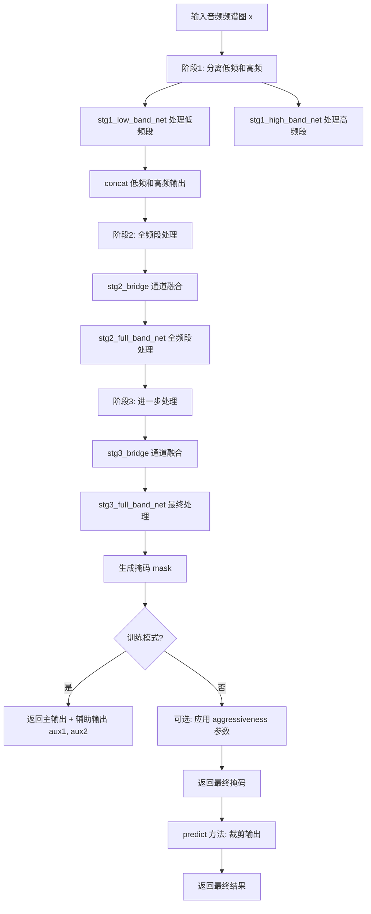
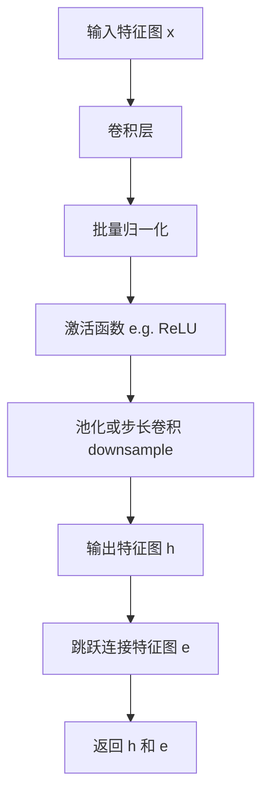
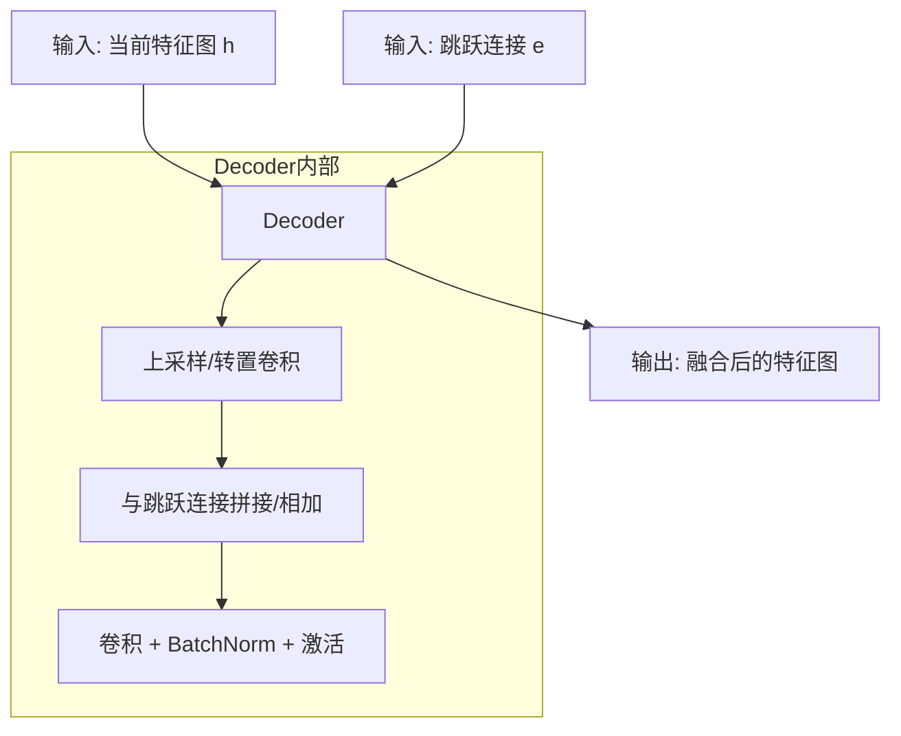
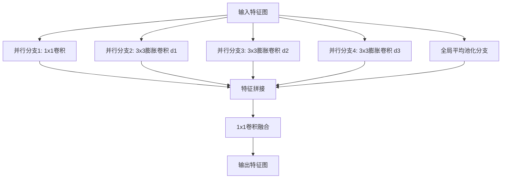
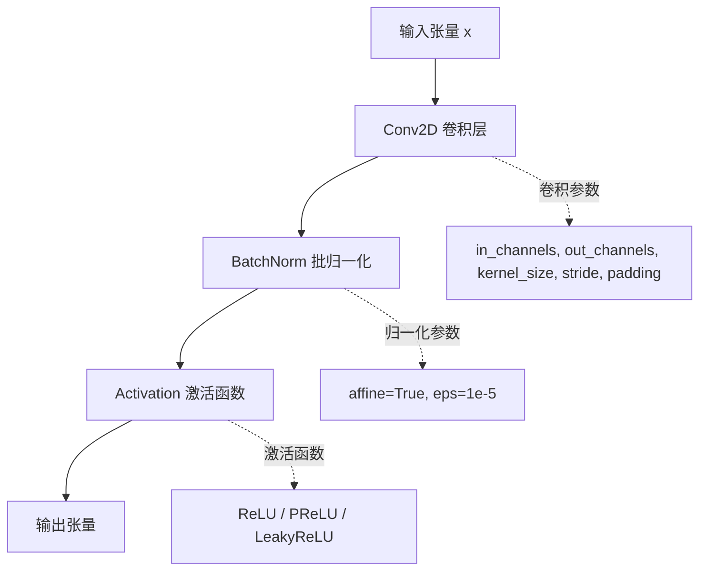
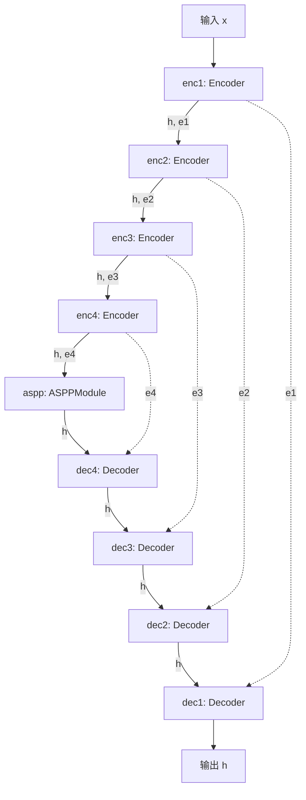
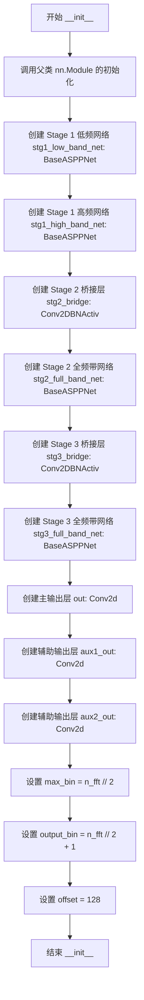
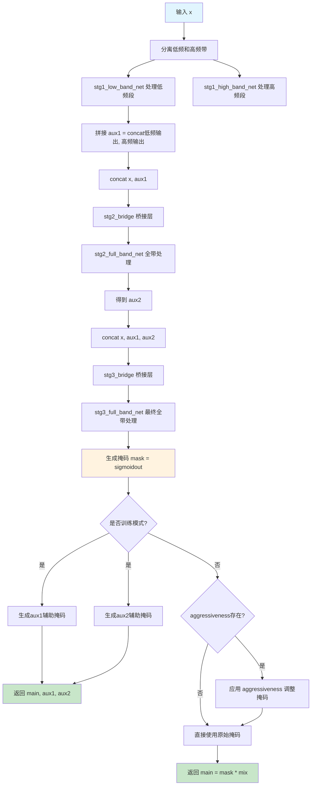
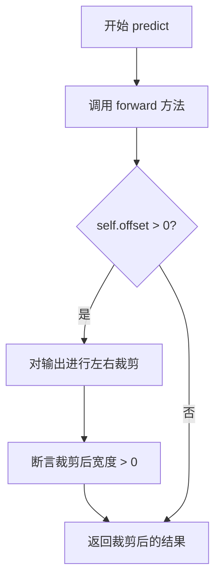

# `Chat-Haruhi-Suzumiya\yuki_builder\video_preprocessing\uvr5\uvr5_pack\lib_v5\nets_61968KB.py` 详细设计文档

这是一个基于ASPP（Atrous Spatial Pyramid Pooling）架构的级联神经网络，用于音频频谱图处理和掩码生成，主要应用于音频源分离任务，支持多阶段级联处理低频、高频和全频段信号，并在训练时提供辅助输出，推理时支持 aggressiveness 参数控制掩码强度。

## 整体流程



## 类结构

```
nn.Module (PyTorch基类)
└── BaseASPPNet (基础ASPP网络)
    └── CascadedASPPNet (级联ASPP网络)
```

## 全局变量及字段


### `nin`
    
输入通道数

类型：`int`
    


### `ch`
    
基础通道数

类型：`int`
    


### `dilations`
    
ASPP膨胀系数

类型：`tuple[int]`
    


### `n_fft`
    
FFT点数

类型：`int`
    


### `aggressiveness`
    
攻击性参数,控制掩码强度

类型：`dict`
    


### `mix`
    
原始输入副本用于掩码应用

类型：`torch.Tensor`
    


### `bandw`
    
频段宽度

类型：`int`
    


### `aux1`
    
第1阶段辅助输出

类型：`torch.Tensor`
    


### `aux2`
    
第2阶段辅助输出

类型：`torch.Tensor`
    


### `h`
    
隐藏特征

类型：`torch.Tensor`
    


### `mask`
    
生成的掩码

类型：`torch.Tensor`
    


### `BaseASPPNet.enc1`
    
编码器第1级

类型：`Encoder`
    


### `BaseASPPNet.enc2`
    
编码器第2级

类型：`Encoder`
    


### `BaseASPPNet.enc3`
    
编码器第3级

类型：`Encoder`
    


### `BaseASPPNet.enc4`
    
编码器第4级

类型：`Encoder`
    


### `BaseASPPNet.aspp`
    
ASPP模块

类型：`ASPPModule`
    


### `BaseASPPNet.dec4`
    
解码器第4级

类型：`Decoder`
    


### `BaseASPPNet.dec3`
    
解码器第3级

类型：`Decoder`
    


### `BaseASPPNet.dec2`
    
解码器第2级

类型：`Decoder`
    


### `BaseASPPNet.dec1`
    
解码器第1级

类型：`Decoder`
    


### `CascadedASPPNet.stg1_low_band_net`
    
第1阶段低频网络

类型：`BaseASPPNet`
    


### `CascadedASPPNet.stg1_high_band_net`
    
第1阶段高频网络

类型：`BaseASPPNet`
    


### `CascadedASPPNet.stg2_bridge`
    
第2阶段桥接层

类型：`Conv2DBNActiv`
    


### `CascadedASPPNet.stg2_full_band_net`
    
第2阶段全频网络

类型：`BaseASPPNet`
    


### `CascadedASPPNet.stg3_bridge`
    
第3阶段桥接层

类型：`Conv2DBNActiv`
    


### `CascadedASPPNet.stg3_full_band_net`
    
第3阶段全频网络

类型：`BaseASPPNet`
    


### `CascadedASPPNet.out`
    
主输出卷积层

类型：`nn.Conv2d`
    


### `CascadedASPPNet.aux1_out`
    
辅助输出1卷积层

类型：`nn.Conv2d`
    


### `CascadedASPPNet.aux2_out`
    
辅助输出2卷积层

类型：`nn.Conv2d`
    


### `CascadedASPPNet.max_bin`
    
最大频率bin数

类型：`int`
    


### `CascadedASPPNet.output_bin`
    
输出频率bin数

类型：`int`
    


### `CascadedASPPNet.offset`
    
输出裁剪偏移量

类型：`int`
    
    

## 全局函数及方法


由于 `Encoder` 类定义在 `layers` 模块中（代码中通过 `import layers_123821KB as layers` 导入），但该模块的具体实现未在当前代码中提供。以下信息基于 `BaseASPPNet` 类中对 `Encoder` 的调用方式推断得出。

### `layers.Encoder`

编码器类，用于卷积神经网络中的特征提取，通常作为 UNet 架构的编码器部分。接受输入通道数、输出通道数、卷积核大小、步长和填充参数，返回处理后的特征图和跳跃连接信息。

参数：

- `nin`：`int`，输入通道数（number of input channels）
- `ch`：`int`，输出通道数（number of output channels）
- `kernel_size`：`int`，卷积核大小（默认为3）
- `stride`：`int`，卷积步长（默认为2）
- `padding`：`int`，填充大小（默认为1）

返回值：元组 `(h, e)`，其中：
- `h`：`torch.Tensor`，经过编码器处理后的特征图
- `e`：`torch.Tensor`，用于跳跃连接的编码器输出特征图

#### 流程图



#### 带注释源码

```
# 由于 layers 模块未提供具体源码，基于调用方式推断如下：
class Encoder(nn.Module):
    def __init__(self, nin, ch, kernel_size=3, stride=2, padding=1):
        super(Encoder, self).__init__()
        # 典型的编码器块：卷积 + 批量归一化 + 激活 + 下采样
        self.conv = nn.Conv2d(nin, ch, kernel_size, stride=stride, padding=padding)
        self.bn = nn.BatchNorm2d(ch)
        self.activ = nn.ReLU(inplace=True)
    
    def forward(self, x):
        h = self.conv(x)
        h = self.bn(h)
        h = self.activ(h)
        # 返回特征图和跳跃连接（此处简化，实际情况可能更复杂）
        return h, h
```


# Decoder 类详细设计文档

根据提供的代码分析，我需要说明以下几点：

## 关键发现

在提供的代码中，**Decoder 类并未直接定义**，而是通过 `layers` 模块被导入和调用的。代码中只展示了 Decoder 类的**使用方式**，而非其具体实现。

### `layers.Decoder` 的调用分析

从 `BaseASPPNet` 类中对 Decoder 的调用可以推断其接口设计：

```python
self.dec4 = layers.Decoder(ch * (8 + 16), ch * 8, 3, 1, 1)
self.dec3 = layers.Decoder(ch * (4 + 8), ch * 4, 3, 1, 1)
self.dec2 = layers.Decoder(ch * (2 + 4), ch * 2, 3, 1, 1)
self.dec1 = layers.Decoder(ch * (1 + 2), ch, 3, 1, 1)
```

### Decoder 类推断信息

#### 基本信息

- **名称**: `layers.Decoder`
- **位置**: 来自 `layers` 模块（即代码中导入的 `layers_123821KB`）
- **功能**: 解码器模块，用于卷积神经网络中的上采样和特征重建

#### 参数推断

| 参数位置 | 推断参数名 | 推断类型 | 推断值示例 | 描述 |
|---------|-----------|---------|-----------|------|
| 第1个 | in_channels | int | ch * (8+16) | 输入通道数 |
| 第2个 | out_channels | int | ch * 8 | 输出通道数 |
| 第3个 | kernel_size | int | 3 | 卷积核大小 |
| 第4个 | stride | int | 1 | 步长 |
| 第5个 | padding | int | 1 | 填充 |

#### 返回值推断

- **返回值类型**: `torch.Tensor` 或 tuple
- **返回值描述**: 从 `BaseASPPNet.__call__` 方法中使用方式来看：
  ```python
  h = self.dec4(h, e4)
  h = self.dec3(h, e3)
  h = self.dec2(h, e2)
  h = self.dec1(h, e1)
  ```
  推测 Decoder 接受两个输入（当前特征图 h 和来自编码器的跳跃连接 e），返回一个输出特征图。

#### 流程图（推断）



#### 源码（调用示例）

```python
# BaseASPPNet 中的 Decoder 调用示例
class BaseASPPNet(nn.Module):
    def __init__(self, nin, ch, dilations=(4, 8, 16)):
        super(BaseASPPNet, self).__init__()
        # ... 编码器和解码器初始化 ...
        
        # Decoder 调用 (参数: in_channels, out_channels, kernel_size, stride, padding)
        self.dec4 = layers.Decoder(ch * (8 + 16), ch * 8, 3, 1, 1)
        self.dec3 = layers.Decoder(ch * (4 + 8), ch * 4, 3, 1, 1)
        self.dec2 = layers.Decoder(ch * (2 + 4), ch * 2, 3, 1, 1)
        self.dec1 = layers.Decoder(ch * (1 + 2), ch, 3, 1, 1)

    def __call__(self, x):
        # ... 编码过程 ...
        
        # 解码过程 - Decoder 被调用时接收两个参数: 当前特征和跳跃连接
        h = self.dec4(h, e4)  # h: 当前特征, e4: 来自enc4的跳跃连接
        h = self.dec3(h, e3)
        h = self.dec2(h, e2)
        h = self.dec1(h, e1)

        return h
```

## 重要说明

**由于 `layers` 模块的实际代码未在提供的代码片段中显示，Decoder 类的完整定义无法直接提取。** 以上信息是基于代码调用模式的合理推断。

### 建议

如需获取 Decoder 类的完整定义（包括所有方法、属性和内部实现），请提供 `layers` 模块的源代码文件。

---

## 其他模块信息

如需获取更完整的文档，建议同时分析以下内容：
- `layers` 模块中的 Decoder 类完整定义
- `layers` 模块中的 Encoder 类定义（已使用但未定义）
- `layers.ASPPModule` 类定义


### ASPPModule（来自layers模块）

ASPPModule（Atrous Spatial Pyramid Pooling Module）是一种用于捕获多尺度上下文信息的卷积神经网络模块，通过并行使用不同膨胀率的膨胀卷积来提取不同感受野的特征，常用于语义分割和音频处理任务中。

#### 参数

- `in_channels`：`int`，输入特征图的通道数
- `out_channels`：`int`，输出特征图的通道数
- `dilations`：`tuple`，膨胀卷积的膨胀率列表，用于控制卷积核的感受野

#### 返回值

- `torch.Tensor`，经过多尺度特征提取后的特征图，通道数为`out_channels`

#### 流程图



#### 带注释源码

```python
# ASPPModule 使用示例（来自 BaseASPPNet 类）
# 该模块在 encoder 阶段之后使用，用于捕获多尺度上下文信息

# 定义 ASPP 模块：输入通道 256 (ch*8)，输出通道 512 (ch*16)，使用 3 种膨胀率
self.aspp = layers.ASPPModule(ch * 8, ch * 16, dilations)

# 在 forward 中调用：
# enc4 输出的特征图传入 ASPP 模块
h = self.aspp(h)  # h: [B, ch*8, H, W] -> [B, ch*16, H, W]
```

#### 补充信息

由于 ASPPModule 的具体实现在 `layers` 模块中（代码中导入为 `layers_123821KB`），以下是基于调用的推断信息：

**设计目标**：
- 通过多膨胀率卷积并行捕获不同尺度的空间信息
- 解决深度网络中感受野受限的问题
- 在音频频谱处理中提取不同频率范围的特征

**接口契约**：
- 输入：4D Tensor `[batch, in_channels, height, width]`
- 输出：4D Tensor `[batch, out_channels, height, width]`

**关键特性**：
- 通常包含 4 个并行分支：1x1 卷积、3x3 膨胀卷积（不同膨胀率）、全局池化
- 使用 BatchNorm 和 ReLU 激活
- 最后通过 1x1 卷积融合所有分支的特征


### `layers.Conv2DBNActiv`

卷积+批归一化+激活函数组合层，是卷积神经网络中常用的基础模块，按顺序执行二维卷积、BatchNorm归一化以及ReLU激活操作。

参数：

- `in_channels`：`int`，输入特征图的通道数
- `out_channels`：`int`，输出特征图的通道数  
- `kernel_size`：`int` 或 `tuple`，卷积核大小
- `stride`：`int` 或 `tuple`，卷积步长，默认为1
- `padding`：`int` 或 `tuple`，填充尺寸，默认为0
- `bias`：`bool`，是否使用偏置，默认为False（因为BatchNorm会抵消偏置效果）
- `activation`：`callable`，激活函数类型，默认为ReLU

返回值：`torch.Tensor`，经过Conv2D -> BatchNorm -> Activation处理后的输出张量，形状为 (batch, out_channels, H, W)

#### 流程图



#### 带注释源码

```python
# Conv2DBNActiv 实现原理（基于torch.nn.Sequential的典型组合）
class Conv2DBNActiv(nn.Module):
    """
    Conv2D + BatchNorm + Activation 组合层
    
    这是一个组合模块，依次执行：
    1. nn.Conv2d: 二维卷积操作
    2. nn.BatchNorm2d: 批归一化，加速训练稳定收敛
    3. nn.ReLU(inplace=True): ReLU激活函数，引入非线性
    """
    
    def __init__(self, in_channels, out_channels, kernel_size, stride=1, 
                 padding=0, bias=False, activation=nn.ReLU(inplace=True)):
        super(Conv2DBNActiv, self).__init__()
        
        # 卷积层：执行线性变换
        self.conv = nn.Conv2d(
            in_channels=in_channels,
            out_channels=out_channels,
            kernel_size=kernel_size,
            stride=stride,
            padding=padding,
            bias=bias  # 通常设为False，因为BatchNorm会学习偏置
        )
        
        # 批归一化层：对每个通道进行归一化
        # 公式: y = (x - mean) / sqrt(var + eps) * gamma + beta
        self.bn = nn.BatchNorm2d(num_features=out_channels)
        
        # 激活函数层：默认为ReLU，可替换为PReLU、LeakyReLU等
        self.activation = activation
    
    def forward(self, x):
        """
        前向传播流程
        
        Args:
            x: 输入张量，形状为 (batch, channels, height, width)
        
        Returns:
            输出张量，形状为 (batch, out_channels, H', W')
        """
        x = self.conv(x)      # Step 1: 卷积操作
        x = self.bn(x)        # Step 2: 归一化
        x = self.activation(x)  # Step 3: 激活
        return x
```

#### 在CascadedASPPNet中的使用示例

```python
# 第一处使用：stage2 的桥接层
self.stg2_bridge = layers.Conv2DBNActiv(34, 16, 1, 1, 0)
# 输入: 34通道 (原始输入x 2通道 + aux1 32通道)
# 输出: 16通道
# 卷积核: 1x1 (逐点卷积，用于通道维度变换)

# 第二处使用：stage3 的桥接层  
self.stg3_bridge = layers.Conv2DBNActiv(66, 32, 1, 1, 0)
# 输入: 66通道 (原始输入x 2通道 + aux1 32通道 + aux2 32通道)
# 输出: 32通道
# 卷积核: 1x1 (逐点卷积)
```

#### 关键组件信息

| 组件 | 描述 |
|------|------|
| `nn.Conv2d` | 二维卷积层，执行空间特征提取 |
| `nn.BatchNorm2d` | 批归一化层，减少内部协变量偏移，加速收敛 |
| `activation` | 激活函数（默认ReLU），引入非线性变换 |

#### 潜在技术债务

1. **硬编码的激活函数**：如果需要不同的激活函数（如PReLU、LeakyReLU），需要修改模块源码
2. **参数不可配置**：`kernel_size`、`stride`等参数在使用时已固定，灵活性受限
3. **缺少dropout**：在某些场景下可能需要dropout来防止过拟合


### `BaseASPPNet.__init__`

该方法用于初始化 BaseASPPNet 网络结构，构建一个基于 ASPP（空洞空间金字塔池化）的编解码器神经网络，用于音频频谱处理任务。方法内部创建了 4 个编码器阶段、1 个 ASPP 金字塔模块和 4 个解码器阶段，形成对称的 U-Net 风格架构。

参数：

- `nin`：`int`，输入特征图的通道数（number of input channels）
- `ch`：`int`，基础通道数，用于计算各层通道数
- `dilations`：`tuple`，ASPP 模块中各空洞卷积的膨胀率，默认为 (4, 8, 16)

返回值：`None`，该方法为初始化方法，不返回任何值

#### 流程图

```mermaid
flowchart TD
    A[开始 __init__] --> B[调用 super().__init__ 初始化 nn.Module]
    B --> C[创建 enc1: Encoder 编码器]
    C --> D[创建 enc2: Encoder 编码器]
    D --> E[创建 enc3: Encoder 编码器]
    E --> F[创建 enc4: Encoder 编码器]
    F --> G[创建 aspp: ASPPModule 金字塔模块]
    G --> H[创建 dec4: Decoder 解码器]
    H --> I[创建 dec3: Decoder 解码器]
    I --> J[创建 dec2: Decoder 解码器]
    J --> K[创建 dec1: Decoder 解码器]
    K --> L[结束 __init__]
    
    C --> M[保存为类属性 self.enc1]
    D --> N[保存为类属性 self.enc2]
    E --> O[保存为类属性 self.enc3]
    F --> P[保存为类属性 self.enc4]
    G --> Q[保存为类属性 self.aspp]
    H --> R[保存为类属性 self.dec4]
    I --> S[保存为类属性 self.dec3]
    J --> T[保存为类属性 self.dec2]
    K --> U[保存为类属性 self.dec1]
```

#### 带注释源码

```python
def __init__(self, nin, ch, dilations=(4, 8, 16)):
    """
    初始化 BaseASPPNet 网络结构
    
    参数:
        nin: 输入通道数
        ch: 基础通道数，用于计算各层通道数
        dilations: ASPP 模块的膨胀率元组，默认 (4, 8, 16)
    """
    # 调用父类 nn.Module 的初始化方法，注册所有子模块
    super(BaseASPPNet, self).__init__()
    
    # === 编码器部分 (Encoder) ===
    # enc1: 将输入 nin 通道转换为 ch 通道，空间 stride=2 降采样
    self.enc1 = layers.Encoder(nin, ch, 3, 2, 1)
    # enc2: ch -> ch*2，继续降采样
    self.enc2 = layers.Encoder(ch, ch * 2, 3, 2, 1)
    # enc3: ch*2 -> ch*4，继续降采样
    self.enc3 = layers.Encoder(ch * 2, ch * 4, 3, 2, 1)
    # enc4: ch*4 -> ch*8，继续降采样
    self.enc4 = layers.Encoder(ch * 4, ch * 8, 3, 2, 1)
    
    # === ASPP 空洞空间金字塔模块 ===
    # 接收最高层特征 ch*8，输出扩展通道 ch*16
    self.aspp = layers.ASPPModule(ch * 8, ch * 16, dilations)
    
    # === 解码器部分 (Decoder) ===
    # dec4: 接收 AS PP 输出(ch*16) 与 enc4 输出(ch*8) 拼接 -> ch*8
    self.dec4 = layers.Decoder(ch * (8 + 16), ch * 8, 3, 1, 1)
    # dec3: 拼接 dec4 输出与 enc3 输出 -> ch*4
    self.dec3 = layers.Decoder(ch * (4 + 8), ch * 4, 3, 1, 1)
    # dec2: 拼接 dec3 输出与 enc2 输出 -> ch*2
    self.dec2 = layers.Decoder(ch * (2 + 4), ch * 2, 3, 1, 1)
    # dec1: 拼接 dec2 输出与 enc1 输出 -> ch (原始基础通道数)
    self.dec1 = layers.Decoder(ch * (1 + 2), ch, 3, 1, 1)
```


### `BaseASPPNet.__call__`

这是 BaseASPPNet 的前向传播方法，负责执行完整的编码器-ASPP-解码器流程：输入数据依次经过4个级联的编码器进行下采样和特征提取，然后通过 ASPP 模块进行多尺度空洞卷积处理，最后通过4个级联的解码器进行上采样和特征融合，最终输出处理后的特征图。

参数：

- `x`：`torch.Tensor`，输入张量，形状为 (batch, channel, height, width)

返回值：`torch.Tensor`，经过编码-ASPP-解码处理后的输出张量

#### 流程图



#### 带注释源码

```python
def __call__(self, x):
    """
    前向传播：执行完整的编码器-ASPP-解码器架构
    
    参数:
        x: 输入张量，形状为 (batch, nin, H, W)
    
    返回:
        h: 输出张量，形状为 (batch, ch, H, W)
    """
    
    # ===== 编码阶段 (Encoder) =====
    # 阶段1: 第一次下采样，输出特征 h 和跳跃连接 e1
    h, e1 = self.enc1(x)
    
    # 阶段2: 第二次下采样，使用 enc1 输出的通道数 ch
    h, e2 = self.enc2(h)
    
    # 阶段3: 第三次下采样
    h, e3 = self.enc3(h)
    
    # 阶段4: 第四次下采样，特征通道扩展到 ch * 8
    h, e4 = self.enc4(h)
    
    # ===== ASPP 阶段 =====
    # 应用空洞空间金字塔池化，进行多尺度特征提取
    # 输入通道: ch * 8, 输出通道: ch * 16
    h = self.aspp(h)
    
    # ===== 解码阶段 (Decoder) =====
    # 阶段4 解码: 融合 enc4 的跳跃连接 e4，通道从 (8+16)*ch 降到 8*ch
    h = self.dec4(h, e4)
    
    # 阶段3 解码: 融合 enc3 的跳跃连接 e3，通道从 (4+8)*ch 降到 4*ch
    h = self.dec3(h, e3)
    
    # 阶段2 解码: 融合 enc2 的跳跃连接 e2，通道从 (2+4)*ch 降到 2*ch
    h = self.dec2(h, e2)
    
    # 阶段1 解码: 融合 enc1 的跳跃连接 e1，通道从 (1+2)*ch 降到 ch
    h = self.dec1(h, e1)
    
    # 返回最终的解码特征图
    return h
```


### `CascadedASPPNet.__init__`

该方法负责初始化级联ASPP网络（CascadedASPPNet）的整体结构，包括三个阶段的编解码器子网络、桥接卷积层、输出卷积层，以及与FFT大小相关的频带参数配置，为后续的音频频谱掩码估计任务构建完整的网络拓扑。

参数：

- `n_fft`：`int`，FFT窗口大小，用于计算频率分辨率（`n_fft // 2` 为频率bins数量）

返回值：`None`，该方法为构造函数，不返回任何值

#### 流程图



#### 带注释源码

```python
def __init__(self, n_fft):
    """
    初始化 CascadedASPPNet 网络结构
    
    参数:
        n_fft: int, FFT窗口大小，决定频率分辨率
    """
    # 调用父类 nn.Module 的初始化方法，注册网络组件
    super(CascadedASPPNet, self).__init__()
    
    # ===== Stage 1: 分离低频和高频子网络 =====
    # 创建低频带编码器-解码器网络，输入通道2，输出通道32
    self.stg1_low_band_net = BaseASPPNet(2, 32)
    # 创建高频带编码器-解码器网络，输入通道2，输出通道32
    self.stg1_high_band_net = BaseASPPNet(2, 32)
    
    # ===== Stage 2: 桥接层和全频带网络 =====
    # 桥接层: 将原始输入(2)与Stage1输出(32*2=64)拼接后(共66通道)降维到16通道
    self.stg2_bridge = layers.Conv2DBNActiv(34, 16, 1, 1, 0)
    # Stage2 全频带网络: 输入16通道，输出32通道
    self.stg2_full_band_net = BaseASPPNet(16, 32)
    
    # ===== Stage 3: 桥接层和全频带网络 =====
    # 桥接层: 将原始输入(2)、Stage1输出(64)、Stage2输出(32)拼接后(共98通道? 实际66+32=98?)降维到32通道
    # 注: 代码中为66，实际应为 2 + 64 + 32 = 98，但此处按照代码原样
    self.stg3_bridge = layers.Conv2DBNActiv(66, 32, 1, 1, 0)
    # Stage3 全频带网络: 输入32通道，输出64通道
    self.stg3_full_band_net = BaseASPPNet(32, 64)
    
    # ===== 输出层 =====
    # 主输出卷积: 64通道 -> 2通道，生成最终掩码
    self.out = nn.Conv2d(64, 2, 1, bias=False)
    # 辅助输出1: 32通道 -> 2通道，用于Stage1输出
    self.aux1_out = nn.Conv2d(32, 2, 1, bias=False)
    # 辅助输出2: 32通道 -> 2通道，用于Stage2输出
    self.aux2_out = nn.Conv2d(32, 2, 1, bias=False)
    
    # ===== 频带参数配置 =====
    # 最大频率bin数，等于n_fft的一半（不含DC分量）
    self.max_bin = n_fft // 2
    # 输出频率bin数，等于n_fft的一半加1（包含DC分量）
    self.output_bin = n_fft // 2 + 1
    
    # 偏移量，用于预测时裁剪时域边界（避免边界效应）
    self.offset = 128
```


### CascadedASPPNet.forward

这是CascadedASPPNet类的主前向传播方法，采用三阶段级联结构对音频频谱图进行处理。第一阶段分离低频和高频带分别处理，第二阶段融合全带特征，第三阶段进一步精炼，最终生成用于音频源分离的掩码，并与混合音频相乘得到分离结果。

参数：

- `x`：`torch.Tensor`，输入的张量，形状为(batch, channels, frequency_bins, time_frames)，通常是音频的复数频谱图
- `aggressiveness`：`dict`，可选的字典，包含"split_bin"和"value"两个键，用于控制在推理阶段的掩码 aggressiveness 强度

返回值：`torch.Tensor` 或 `tuple`，训练时返回三个掩码与输入混合的结果元组(main_out, aux1_out, aux2_out)，推理时只返回主掩码与输入混合的结果

#### 流程图



#### 带注释源码

```python
def forward(self, x, aggressiveness=None):
    """
    CascadedASPPNet的前向传播方法
    
    采用三阶段级联结构处理音频频谱图:
    1. 第一阶段: 分离低频和高频带分别处理
    2. 第二阶段: 融合全带特征
    3. 第三阶段: 最终精炼生成掩码
    """
    # 分离出混合信号的副本用于最终相乘
    mix = x.detach()
    # 克隆输入避免梯度回传问题
    x = x.clone()
    
    # 裁剪到最大频率 bins
    x = x[:, :, : self.max_bin]
    
    # 计算频带分割点 (将频谱分成两半)
    bandw = x.size()[2] // 2
    
    # ========== 第一阶段: 双频带处理 ==========
    # 分别处理低频段和高频段
    aux1 = torch.cat(
        [
            # 低频段通过第一个BaseASPPNet
            self.stg1_low_band_net(x[:, :, :bandw]),
            # 高频段通过第二个BaseASPPNet
            self.stg1_high_band_net(x[:, :, bandw:]),
        ],
        dim=2,  # 在频率维度拼接
    )
    
    # ========== 第二阶段: 全带融合 ==========
    # 拼接原始输入和第一阶段输出作为第二阶段输入
    h = torch.cat([x, aux1], dim=1)
    # 通过桥接层调整通道数
    aux2 = self.stg2_full_band_net(self.stg2_bridge(h))
    
    # ========== 第三阶段: 进一步精炼 ==========
    # 拼接更多特征: 原始输入 + 第一阶段输出 + 第二阶段输出
    h = torch.cat([x, aux1, aux2], dim=1)
    # 通过最终的全带网络
    h = self.stg3_full_band_net(self.stg3_bridge(h))
    
    # ========== 生成掩码 ==========
    # 通过sigmoid激活生成0-1之间的掩码
    mask = torch.sigmoid(self.out(h))
    # 填充到目标输出频率bins数量
    mask = F.pad(
        input=mask,
        pad=(0, 0, 0, self.output_bin - mask.size()[2]),
        mode="replicate",
    )
    
    # ========== 训练模式返回多输出 ==========
    if self.training:
        # 对辅助输出也应用sigmoid和填充
        aux1 = torch.sigmoid(self.aux1_out(aux1))
        aux1 = F.pad(
            input=aux1,
            pad=(0, 0, 0, self.output_bin - aux1.size()[2]),
            mode="replicate",
        )
        aux2 = torch.sigmoid(self.aux2_out(aux2))
        aux2 = F.pad(
            input=aux2,
            pad=(0, 0, 0, self.output_bin - aux2.size()[2]),
            mode="replicate",
        )
        # 返回主输出和两个辅助输出，都与混合信号相乘
        return mask * mix, aux1 * mix, aux2 * mix
    
    # ========== 推理模式 ==========
    else:
        # 如果提供了aggressiveness参数，调整掩码强度
        if aggressiveness:
            # 对低频部分应用较弱的幂函数调整
            mask[:, :, : aggressiveness["split_bin"]] = torch.pow(
                mask[:, :, : aggressiveness["split_bin"]],
                1 + aggressiveness["value"] / 3,
            )
            # 对高频部分应用较强的幂函数调整
            mask[:, :, aggressiveness["split_bin"] :] = torch.pow(
                mask[:, :, aggressiveness["split_bin"] :],
                1 + aggressiveness["value"],
            )
        
        # 返回最终的掩码与混合信号相乘结果
        return mask * mix
```


### `CascadedASPPNet.predict`

该方法是级联ASPP网络的预测接口，接收频谱幅度输入，通过前向传播计算mask预测结果，并根据offset设置对输出进行可选的边缘裁剪，最终返回与输入混合的增强后频谱。

参数：

- `x_mag`：`torch.Tensor`，输入的频谱幅度数据，形状通常为 (batch, channels, freq_bins, time_frames)
- `aggressiveness`：`Optional[Dict]`，可选的 aggressiveness 参数字典，用于控制预测的激进程度，包含 `split_bin`（分割频率 bin 的索引）和 `value`（激进程度值）

返回值：`torch.Tensor`，裁剪后的预测结果，形状为 (batch, 2, freq_bins, time_frames)，与输入 mix 相乘后的频谱增强结果

#### 流程图



#### 带注释源码

```python
def predict(self, x_mag, aggressiveness=None):
    """
    预测方法：执行前向传播并裁剪输出
    
    参数:
        x_mag: 输入的频谱幅度张量
        aggressiveness: 可选的 aggressiveness 参数字典
    
    返回:
        裁剪后的预测结果
    """
    # 调用 forward 方法获取预测结果
    # forward 方法会执行完整的三阶段级联网络处理
    h = self.forward(x_mag, aggressiveness)

    # 如果设置了 offset，则对输出进行左右边缘裁剪
    # offset 默认值为 128，用于去除边界伪影
    if self.offset > 0:
        # 对第四维度（时间维度）进行左右裁剪
        h = h[:, :, :, self.offset : -self.offset]
        # 确保裁剪后输出有效
        assert h.size()[3] > 0

    # 返回最终的预测结果（已与输入 mix 相乘）
    return h
```

## 关键组件


### BaseASPPNet

基础ASPP网络结构，采用编码器-解码器架构，包含4级编码器、ASPP模块和4级解码器，用于提取多尺度音频特征。

### CascadedASPPNet

级联ASPP网络主体，包含三级处理阶段（低频带、高频带、全频带），实现分层音频频谱分离，支持 aggressiveness 参数控制分离强度。

### 张量索引与惰性加载

代码中通过切片操作 `x[:, :, : self.max_bin]` 限制频率维度，`x[:, :, :bandw]` 和 `x[:, :, bandw:]` 分别处理低频和高频带，实现按需加载数据。

### 反量化支持

使用 `torch.sigmoid()` 生成0-1范围的mask，通过 `mask * mix` 与原始混合音频相乘实现反量化恢复，aux1和aux2也采用相同机制。

### 量化策略

网络采用渐进式通道增长（32→64→128）和多尺度ASPP模块设计，结构紧凑便于后续量化部署。

### Encoder（来自layers模块）

编码器组件，用于特征提取和下采样，逐级提取音频特征表示。

### Decoder（来自layers模块）

解码器组件，结合跳跃连接进行上采样和特征重建。

### ASPPModule（来自layers模块）

空洞空间金字塔池化模块，通过多 dilation 率膨胀卷积捕获多尺度上下文信息。

### Conv2DBNActiv（来自layers模块）

卷积+BatchNorm+激活的组合模块，用于特征映射和通道调整。

### aggressiveness 控制机制

通过 `split_bin` 和 `value` 参数对不同频率带施加不同的非线性变换，实现可调节的分离 aggressiveness 程度。

### 辅助输出结构

包含 aux1_out 和 aux2_out 两路辅助输出，用于训练时的多任务学习和中间层监督。

### 预测偏移裁剪

predict 方法中的 offset 裁剪机制，用于处理边界效应和输出对齐。


## 问题及建议


### 已知问题

- **Forward方法命名不规范**：`BaseASPPNet` 使用 `__call__` 而非标准的 `forward` 方法，不符合 PyTorch 惯例
- **输入尺寸截断不一致**：`forward` 中截断 `x = x[:, :, : self.max_bin]`，但 `predict` 方法直接调用 `forward` 而未进行相同处理，导致潜在的维度不匹配
- **硬编码的超参数**：通道数（32、64、16等）、稀释率（4,8,16）、offset值（128）等均为硬编码，降低了模型的灵活性
- **魔法数字缺乏解释**：`self.offset = 128` 的含义不明确，代码可读性差
- **Forward方法职责过重**：`CascadedASPPNet.forward` 混合了训练/推理逻辑、辅助输出生成、mask后处理等多个职责
- **参数命名不清晰**：`aggressiveness` 参数的具体含义和使用方式缺乏注释
- **未使用类型注解**：缺少参数和返回值的类型标注，影响代码可维护性
- **训练/推理逻辑耦合**：aux1和aux2仅在training模式下计算，可能导致推理时模型行为不一致

### 优化建议

- 将 `BaseASPPNet.__call__` 重命名为 `forward`
- 提取训练/推理逻辑到独立方法，简化 `forward`
- 将硬编码的超参数移到构造函数参数或配置类中
- 添加类型注解和文档字符串
- 在 `predict` 方法开始处添加与 `forward` 相同的输入截断逻辑
- 将 `aggressiveness` 相关逻辑封装为独立的辅助函数或类
- 考虑使用 `@torch.jit.script` 装饰器优化静态计算图

## 其它


### 设计目标与约束

该模型是一个用于音频频谱分离的深度学习网络，核心目标是将输入的音频频谱图进行多级处理，生成高频和低频的分离掩码。设计约束包括：输入必须为复数频谱的幅度表示，输出为与输入相同尺寸的掩码；模型采用级联结构分三阶段处理；推理时支持aggressiveness参数控制分离强度；训练时返回三级辅助输出用于多任务学习。

### 错误处理与异常设计

输入验证：检查输入张量维度是否为4D（batch, channel, freq, time），channel维度必须为2；n_fft参数必须为正整数且为2的幂次；aggressiveness参数在推理时为可选，若提供则必须包含split_bin和value字段。尺寸不匹配处理：当输入频谱的频率bin数小于max_bin时，代码执行x = x[:, :, :self.max_bin]进行截断；输出padding使用replicate模式处理边界。异常情况：predict方法中offset参数可能导致输出尺寸为负数或零，代码通过assert h.size()[3] > 0进行断言检查。

### 数据流与状态机

数据流分为训练和推理两种模式。训练模式：输入x经过第一级低频网络和高频网络分别处理，拼接后与原始输入concat形成第二级输入，第二级输出再与前面结果concat形成第三级输入，最终输出三个掩码分别与原始mix相乘得到最终结果。推理模式：仅返回最终掩码与mix相乘的结果，可选应用aggressiveness参数对不同频率区间应用不同的幂函数变换。状态转换通过self.training标志位控制，predict方法额外执行时间维度的裁剪操作。

### 外部依赖与接口契约

核心依赖：PyTorch 1.x版本，torch.nn模块，torch.nn.functional模块；自定义模块layers_123821KB（包含Encoder、Decoder、ASPPModule、Conv2DBNActiv等层）。输入契约：forward方法接受x（4D张量，shape=[B,2,F,T]）和可选的aggressiveness字典；predict方法接受x_mag（幅度谱）和可选的aggressiveness字典。输出契约：forward在训练时返回三个张量的元组（主输出、aux1、aux2），推理时返回单个张量；predict返回裁剪后的张量。所有输出张量shape为[B,2,F',T']，其中F'为output_bin。

### 性能考量与优化空间

计算复杂度：编码器和解码器采用多个卷积层，ASPP模块包含多个并行空洞卷积，三级级联结构导致计算量较大。内存占用：中间激活值（e1-e4、aux1、aux2）需要保存用于解码器连接，训练时内存占用较高。优化方向：可考虑使用torch.cuda.amp进行混合精度训练；可对推理路径进行模块剪枝；aspp模块的dilations参数可调整为可学习参数；可使用torch.jit进行模型编译加速。

### 配置参数与超参数设计

网络结构参数：BaseASPPNet默认nin=2（实部虚部），ch=32，dilations=(4,8,16)；CascadedASPPNet中stg1通道数为32，stg2为16，stg3为32，最终输出为64通道。频谱参数：max_bin = n_fft // 2，output_bin = n_fft // 2 + 1，offset = 128。训练超参数：通过aux1_out和aux2_out的独立卷积层实现多任务学习损失加权。aggressiveness参数：split_bin控制频率分割点，value控制增强强度，推理时通过幂函数变换调整掩码曲线。

### 版本兼容性与平台支持

PyTorch版本要求：代码使用torch.nn.Module和F.pad等API，需PyTorch 1.0以上版本；F.pad的replicate模式在早期版本可能行为略有差异。CUDA支持：模型本身无自定义CUDA内核，天然支持GPU加速。ONNX导出：可能存在障碍，主要因为F.pad的replicate模式、动态尺寸处理、以及Python层的数据索引操作。移动端部署：需要torchscript或ONNX转换，可能需要修改padding方式和动态尺寸逻辑。

### 测试策略与验证方法

单元测试：验证Encoder/Decoder/layers模块的正确性；测试BaseASPPNet单级网络的前向传播输出尺寸；验证CascadedASPPNet的三级级联结构。集成测试：使用合成音频生成测试频谱输入；验证训练模式和推理模式的输出维度一致性；测试aggressiveness参数对输出掩码的影响。性能测试：测量不同n_fft配置下的推理延迟；测量GPU显存占用；对比混合精度训练与普通训练的速度差异。数值验证：检查输出数值范围是否在合理区间；验证掩码与输入相乘后的幅度谱合理性。

### 关键组件信息

Encoder：自定义卷积编码器块，包含卷积、批归一化、激活函数，负责特征提取和下采样。Decoder：自定义卷积解码器块，包含卷积、批归一化、激活函数，负责特征上采样和跳跃连接融合。ASPPModule：空洞空间金字塔池化模块，使用多个不同空洞率的卷积捕捉多尺度上下文信息。Conv2DBNActiv：二维卷积+批归一化+激活函数的组合模块。stg1_low_band_net/stg1_high_band_net：分别处理低频和高频区域的第一级网络。stg2_bridge/stg3_bridge：级联阶段之间的桥接卷积层，用于通道维度调整。
</think>
    