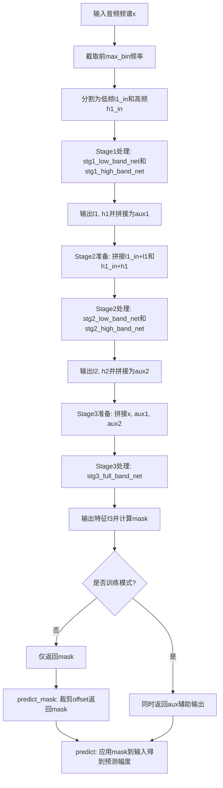
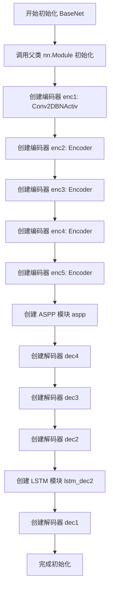
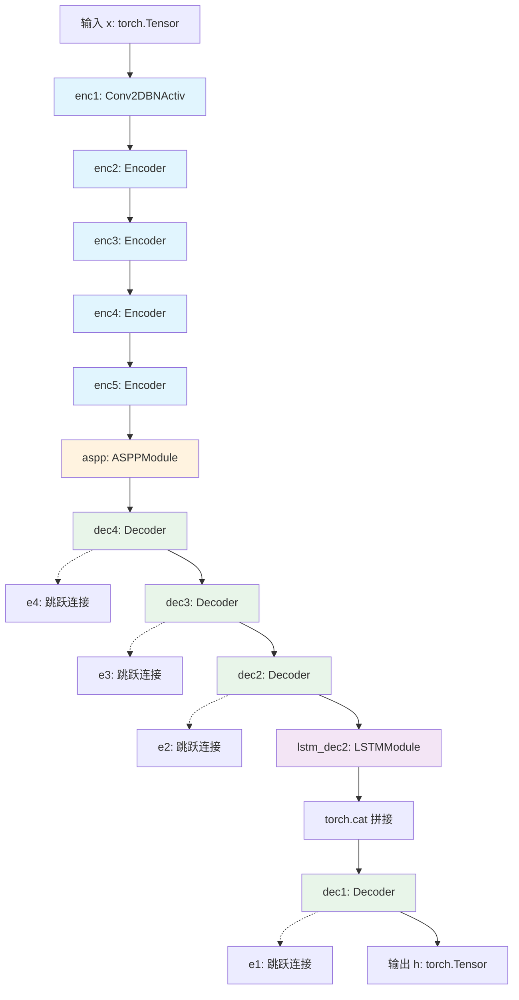
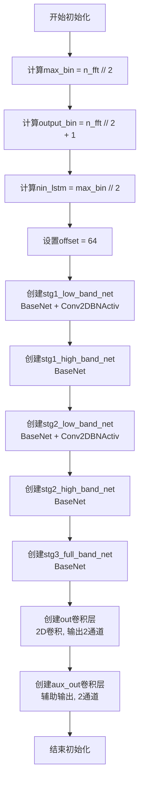
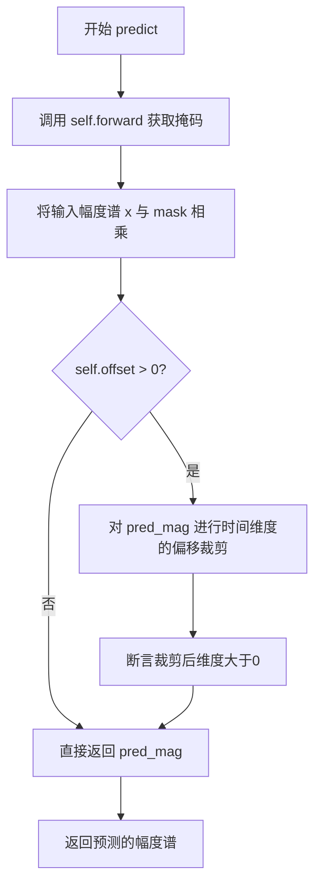

# `Chat-Haruhi-Suzumiya\yuki_builder\video_preprocessing\uvr5\uvr5_pack\lib_v5\nets_new.py` 详细设计文档

这是一个基于PyTorch的级联神经网络模型，用于音频频谱分离。该模型采用多阶段编码器-解码器架构，将输入音频分为低频和高频分别处理，通过三级级联网络逐步增强分离效果，最终输出音频掩码实现语音/音乐分离。

## 整体流程



## 类结构

```
nn.Module (PyTorch基类)
├── BaseNet (基础编码器-解码器网络)
│   ├── 编码器: enc1, enc2, enc3, enc4, enc5
│   ├── ASPP模块: aspp (空洞空间金字塔池化)
│   ├── 解码器: dec4, dec3, dec2, dec1
│   └── LSTM模块: lstm_dec2
└── CascadedNet (级联网络，主模型)
    ├── Stage1网络: stg1_low_band_net, stg1_high_band_net
    ├── Stage2网络: stg2_low_band_net, stg2_high_band_net
    ├── Stage3网络: stg3_full_band_net
    └── 输出层: out, aux_out
```

## 全局变量及字段


### `layers`
    
自定义层模块(layers_new)

类型：`module`
    


### `BaseNet.enc1`
    
第一层编码器

类型：`Conv2DBNActiv`
    


### `BaseNet.enc2`
    
第二层编码器

类型：`Encoder`
    


### `BaseNet.enc3`
    
第三层编码器

类型：`Encoder`
    


### `BaseNet.enc4`
    
第四层编码器

类型：`Encoder`
    


### `BaseNet.enc5`
    
第五层编码器

类型：`Encoder`
    


### `BaseNet.aspp`
    
空洞空间金字塔池化模块

类型：`ASPPModule`
    


### `BaseNet.dec4`
    
第四层解码器

类型：`Decoder`
    


### `BaseNet.dec3`
    
第三层解码器

类型：`Decoder`
    


### `BaseNet.dec2`
    
第二层解码器

类型：`Decoder`
    


### `BaseNet.lstm_dec2`
    
LSTM模块

类型：`LSTMModule`
    


### `BaseNet.dec1`
    
第一层解码器

类型：`Decoder`
    


### `CascadedNet.max_bin`
    
最大频率bin数

类型：`int`
    


### `CascadedNet.output_bin`
    
输出频率bin数

类型：`int`
    


### `CascadedNet.nin_lstm`
    
LSTM输入维度

类型：`int`
    


### `CascadedNet.offset`
    
边缘裁剪偏移量

类型：`int`
    


### `CascadedNet.stg1_low_band_net`
    
Stage1低频网络

类型：`nn.Sequential`
    


### `CascadedNet.stg1_high_band_net`
    
Stage1高频网络

类型：`BaseNet`
    


### `CascadedNet.stg2_low_band_net`
    
Stage2低频网络

类型：`nn.Sequential`
    


### `CascadedNet.stg2_high_band_net`
    
Stage2高频网络

类型：`BaseNet`
    


### `CascadedNet.stg3_full_band_net`
    
Stage3全频带网络

类型：`BaseNet`
    


### `CascadedNet.out`
    
主输出卷积层

类型：`nn.Conv2d`
    


### `CascadedNet.aux_out`
    
辅助输出卷积层

类型：`nn.Conv2d`
    
    

## 全局函数及方法


### `BaseNet.__init__`

初始化 BaseNet 网络结构，构建一个基于卷积编码器-ASPP-解码器架构的神经网络，包含5个编码器阶段、ASPP多尺度特征提取模块、4个解码器阶段以及一个LSTM模块，用于音频或信号处理任务。

参数：

- `nin`：`int`，输入通道数，定义输入数据的通道维度
- `nout`：`int`，基础输出通道数，用于网络各层的通道缩放基准
- `nin_lstm`：`int`，LSTM模块的输入维度，决定时序建模的输入特征维度
- `nout_lstm`：`int`，LSTM模块的输出维度，决定时序建模的输出特征维度
- `dilations`：`tuple`，ASPP模块的膨胀率配置，默认为 ((4, 2), (8, 4), (12, 6))，用于多尺度空洞卷积

返回值：`None`，该方法为初始化方法，不返回任何值，仅完成网络层结构的构建

#### 流程图



#### 带注释源码

```python
def __init__(
    self, nin, nout, nin_lstm, nout_lstm, dilations=((4, 2), (8, 4), (12, 6))
):
    """
    初始化 BaseNet 网络结构
    
    参数:
        nin: 输入通道数
        nout: 基础输出通道数
        nin_lstm: LSTM 输入维度
        nout_lstm: LSTM 输出维度
        dilations: ASPP 模块的膨胀率配置
    """
    # 调用父类 nn.Module 的初始化方法，注册所有子模块
    super(BaseNet, self).__init__()
    
    # ===== 编码器部分 =====
    # enc1: 初始卷积块，负责将输入转换为特征图
    # 输入 nin 通道 -> 输出 nout 通道，3x3 卷积，padding=1 保持尺寸
    self.enc1 = layers.Conv2DBNActiv(nin, nout, 3, 1, 1)
    
    # enc2-enc5: 连续的下采样编码器，每级将空间尺寸减半
    # enc2: nout -> nout*2，stride=2 实现下采样
    self.enc2 = layers.Encoder(nout, nout * 2, 3, 2, 1)
    # enc3: nout*2 -> nout*4
    self.enc3 = layers.Encoder(nout * 2, nout * 4, 3, 2, 1)
    # enc4: nout*4 -> nout*6
    self.enc4 = layers.Encoder(nout * 4, nout * 6, 3, 2, 1)
    # enc5: nout*6 -> nout*8
    self.enc5 = layers.Encoder(nout * 6, nout * 8, 3, 2, 1)
    
    # ===== ASPP 多尺度特征提取 =====
    # ASPP (Atrous Spatial Pyramid Pooling) 模块
    # 使用不同膨胀率的空洞卷积捕获多尺度上下文信息
    self.aspp = layers.ASPPModule(nout * 8, nout * 8, dilations, dropout=True)
    
    # ===== 解码器部分 =====
    # 解码器通过上采样逐步恢复空间尺寸，并融合对应编码器特征
    # dec4: 融合 nout*6 + nout*8 特征 -> 输出 nout*6
    self.dec4 = layers.Decoder(nout * (6 + 8), nout * 6, 3, 1, 1)
    # dec3: 融合 nout*4 + nout*6 特征 -> 输出 nout*4
    self.dec3 = layers.Decoder(nout * (4 + 6), nout * 4, 3, 1, 1)
    # dec2: 融合 nout*2 + nout*4 特征 -> 输出 nout*2
    self.dec2 = layers.Decoder(nout * (2 + 4), nout * 2, 3, 1, 1)
    
    # lstm_dec2: 时序建模模块，在解码过程中引入 LSTM 进行时序特征提取
    # 输入 nout*2 通道，转换为 nin_lstm 维度，再输出 nout_lstm 维度
    self.lstm_dec2 = layers.LSTMModule(nout * 2, nin_lstm, nout_lstm)
    
    # dec1: 最终解码器，融合 LSTM 输出和原始特征
    # 输入维度: nout*1 + nout*2 + 1 (1 为 LSTM 输出通道扩展)
    self.dec1 = layers.Decoder(nout * (1 + 2) + 1, nout * 1, 3, 1, 1)
```


### `BaseNet.__call__`

前向传播方法，执行编码-ASPP-解码流程，通过5层编码器提取特征，经过ASPP模块进行多尺度特征融合，再通过4层解码器逐步恢复空间分辨率并结合跳跃连接和LSTM模块，输出最终的预测特征图。

参数：

- `x`：`torch.Tensor`，输入张量，通常为2通道的音频频谱特征图，形状为 [batch, channels, freq, time]

返回值：`torch.Tensor`，解码后的输出张量，形状为 [batch, nout, freq, time]

#### 流程图



#### 带注释源码

```python
def __call__(self, x):
    """
    BaseNet 的前向传播方法，执行编码-ASPP-解码流程
    
    参数:
        x: torch.Tensor, 输入张量，形状为 [batch, nin, freq, time]
           nin 在 BaseNet 实例化时指定，通常为2通道
    
    返回值:
        h: torch.Tensor, 输出张量，形状为 [batch, nout, freq, time]
           nout 在 BaseNet 实例化时指定
    """
    # ===== 编码阶段 (Encoder) =====
    # 5层编码器逐步提取特征，特征图尺寸逐渐减小
    e1 = self.enc1(x)           # 第1层编码：基础特征提取
    e2 = self.enc2(e1)          # 第2层编码：2倍下采样
    e3 = self.enc3(e2)          # 第3层编码：2倍下采样
    e4 = self.enc4(e3)          # 第4层编码：2倍下采样
    e5 = self.enc5(e4)          # 第5层编码：2倍下采样
    
    # ===== ASPP 阶段 =====
    # 空洞空间金字塔池化，捕获多尺度上下文信息
    h = self.aspp(e5)           # 输入为最高层特征 e5，输出多尺度融合特征
    
    # ===== 解码阶段 (Decoder) =====
    # 4层解码器逐步恢复空间分辨率，结合跳跃连接
    h = self.dec4(h, e4)        # 第4层解码：上采样 + 跳跃连接 e4
    h = self.dec3(h, e3)        # 第3层解码：上采样 + 跳跃连接 e3
    h = self.dec2(h, e2)        # 第2层解码：上采样 + 跳跃连接 e2
    
    # ===== LSTM 处理 =====
    # LSTM 模块处理时间序列信息，并与解码特征拼接
    h = torch.cat([h, self.lstm_dec2(h)], dim=1)  # 沿通道维度拼接
    
    # ===== 最终解码 =====
    h = self.dec1(h, e1)        # 第1层解码：上采样 + 跳跃连接 e1
    
    return h  # 返回解码后的特征图
```


### `CascadedNet.__init__`

初始化级联网络结构，该网络包含三个阶段的频带处理（低频、高频和全频带），每个阶段由编码器、ASPP模块和解码器组成，用于音频频谱分离任务。

参数：

- `n_fft`：`int`，FFT窗口大小，决定频谱的频率分辨率
- `nout`：`int`，输出通道数，默认为32
- `nout_lstm`：`int`，LSTM模块的输出维度，默认为128

返回值：无（`__init__` 方法不返回值）

#### 流程图



#### 带注释源码

```python
def __init__(self, n_fft, nout=32, nout_lstm=128):
    """
    初始化级联网络结构
    
    参数:
        n_fft: int, FFT窗口大小, 决定频谱的频率分辨率
        nout: int, 输出通道数, 默认为32
        nout_lstm: int, LSTM模块的输出维度, 默认为128
    """
    # 调用父类nn.Module的初始化方法
    super(CascadedNet, self).__init__()

    # 计算最大频率bin数, 对应n_fft的一半(奈奎斯特频率)
    self.max_bin = n_fft // 2
    
    # 计算输出bin数, 对应FFT频谱的直流分量到奈奎斯特频率
    self.output_bin = n_fft // 2 + 1
    
    # 计算LSTM输入维度, 为max_bin的一半
    self.nin_lstm = self.max_bin // 2
    
    # 设置偏移量, 用于裁剪预测结果的边缘
    self.offset = 64

    # ============ 第一阶段: 低频带网络 ============
    # 包含BaseNet和额外的卷积层, 输入2通道(复数的实部和虚部)
    # 输出通道数为nout的一半再四分之一
    self.stg1_low_band_net = nn.Sequential(
        BaseNet(2, nout // 2, self.nin_lstm // 2, nout_lstm),
        layers.Conv2DBNActiv(nout // 2, nout // 4, 1, 1, 0),
    )

    # 第一阶段: 高频带网络, 仅使用BaseNet
    # 输入2通道, 输出通道数为nout的四分之一
    self.stg1_high_band_net = BaseNet(
        2, nout // 4, self.nin_lstm // 2, nout_lstm // 2
    )

    # ============ 第二阶段: 低频带网络 ============
    # 输入通道数增加(原始输入 + 第一阶段低频输出)
    self.stg2_low_band_net = nn.Sequential(
        BaseNet(nout // 4 + 2, nout, self.nin_lstm // 2, nout_lstm),
        layers.Conv2DBNActiv(nout, nout // 2, 1, 1, 0),
    )
    
    # 第二阶段: 高频带网络
    # 输入通道数增加(原始输入 + 第一阶段高频输出)
    self.stg2_high_band_net = BaseNet(
        nout // 4 + 2, nout // 2, self.nin_lstm // 2, nout_lstm // 2
    )

    # ============ 第三阶段: 全频带网络 ============
    # 融合原始输入、第一阶段辅助输出和第二阶段辅助输出
    # 输入通道数: 原始输入(2) + 第一阶段输出(nout//4 + nout//4) + 第二阶段输出(nout//2 + nout//2)
    # = 2 + nout//2 + nout = 3*nout//4 + 2
    self.stg3_full_band_net = BaseNet(
        3 * nout // 4 + 2, nout, self.nin_lstm, nout_lstm
    )

    # 最终输出卷积层: 将特征通道映射为2通道(掩码)
    self.out = nn.Conv2d(nout, 2, 1, bias=False)
    
    # 辅助输出卷积层: 用于训练阶段的辅助损失
    # 输入为第一和第二阶段的级联输出
    self.aux_out = nn.Conv2d(3 * nout // 4, 2, 1, bias=False)
```


### `CascadedNet.forward(x)`

三阶段级联处理的前向传播方法，将输入频谱分为低频和高频段，分别经过三级网络处理，最终输出用于信号分离的掩码。

参数：

- `x`：`torch.Tensor`，输入的频谱数据，形状通常为 (batch, channels, freq, time)

返回值：`torch.Tensor` 或 `(torch.Tensor, torch.Tensor)`，训练模式返回元组 (mask, aux)，推理模式返回 mask

#### 流程图

```mermaid
flowchart TD
    A[输入 x] --> B[截取前 max_bin 频率]
    B --> C[计算 bandw = x.size[2] // 2]
    C --> D[分割低频段 l1_in: x[:,:,:bandw]]
    C --> E[分割高频段 h1_in: x[:,:,bandw:]]
    
    D --> F[stg1_low_band_net(l1_in) -> l1]
    E --> G[stg1_high_band_net(h1_in) -> h1]
    F --> H[torch.cat([l1, h1], dim=2) -> aux1]
    G --> H
    
    H --> I[torch.cat([l1_in, l1], dim=1) -> l2_in]
    H --> J[torch.cat([h1_in, h1], dim=1) -> h2_in]
    
    I --> K[stg2_low_band_net(l2_in) -> l2]
    J --> L[stg2_high_band_net(h2_in) -> h2]
    K --> M[torch.cat([l2, h2], dim=2) -> aux2]
    L --> M
    
    M --> N[torch.cat([x, aux1, aux2], dim=1) -> f3_in]
    N --> O[stg3_full_band_net(f3_in) -> f3]
    
    O --> P[out(f3) -> conv -> sigmoid -> mask]
    P --> Q[pad mask 到 output_bin 大小]
    
    Q --> R{training mode?}
    R -->|Yes| S[cat aux1+aux2 -> aux_out -> sigmoid -> aux]
    R -->|No| T[return mask]
    S --> U[pad aux 到 output_bin 大小]
    U --> V[return (mask, aux)]
```

#### 带注释源码

```python
def forward(self, x):
    # 1. 截取前 max_bin 频率范围，去除超出范围的频率数据
    x = x[:, :, : self.max_bin]

    # 2. 计算频谱宽度的一半，用于分割低频和高频段
    bandw = x.size()[2] // 2
    
    # 3. 分割输入为低频段和高频段
    l1_in = x[:, :, :bandw]      # 低频部分
    h1_in = x[:, :, bandw:]      # 高频部分

    # 4. Stage 1: 分别处理低频和高频段
    l1 = self.stg1_low_band_net(l1_in)   # 低频网络输出
    h1 = self.stg1_high_band_net(h1_in)  # 高频网络输出
    
    # 5. 拼接 Stage 1 输出作为辅助输出 aux1
    aux1 = torch.cat([l1, h1], dim=2)

    # 6. Stage 2: 将 Stage 1 输出与原始输入拼接后分别处理
    l2_in = torch.cat([l1_in, l1], dim=1)   # 低频: 原始低频 + Stage1 低频输出
    h2_in = torch.cat([h1_in, h1], dim=1)   # 高频: 原始高频 + Stage1 高频输出
    
    l2 = self.stg2_low_band_net(l2_in)  # Stage2 低频输出
    h2 = self.stg2_high_band_net(h2_in) # Stage2 高频输出
    
    # 7. 拼接 Stage 2 输出作为辅助输出 aux2
    aux2 = torch.cat([l2, h2], dim=2)

    # 8. Stage 3: 全频段处理，融合所有中间结果
    f3_in = torch.cat([x, aux1, aux2], dim=1)  # 原始输入 + aux1 + aux2
    f3 = self.stg3_full_band_net(f3_in)        # 全频段网络输出

    # 9. 生成最终掩码并填充到目标输出大小
    mask = torch.sigmoid(self.out(f3))  # 卷积输出并通过 sigmoid 归一化
    mask = F.pad(
        input=mask,
        pad=(0, 0, 0, self.output_bin - mask.size()[2]),
        mode="replicate",  # 复制边缘填充
    )

    # 10. 训练模式返回辅助输出用于多任务学习
    if self.training:
        aux = torch.cat([aux1, aux2], dim=1)   # 合并两个阶段的辅助输出
        aux = torch.sigmoid(self.aux_out(aux)) # 生成辅助掩码
        aux = F.pad(
            input=aux,
            pad=(0, 0, 0, self.output_bin - aux.size()[2]),
            mode="replicate",
        )
        return mask, aux  # 返回主掩码和辅助掩码
    else:
        return mask  # 推理模式仅返回主掩码
```


### `CascadedNet.predict_mask`

该方法是 CascadedNet 类的预测掩码方法，调用 forward 方法获取掩码，并根据配置的偏移量裁剪掩码宽度后返回。

参数：
- `x`：`torch.Tensor`，输入的频谱图数据，形状通常为 (batch, channels, freq_bins, time_frames)

返回值：`torch.Tensor`，处理后的二值掩码，形状为 (batch, 2, freq_bins, time_frames')

#### 流程图

```mermaid
flowchart TD
    A[开始 predict_mask] --> B[调用 self.forward(x)]
    B --> C{self.offset > 0?}
    C -->|是| D[裁剪掩码: mask[:, :, :, self.offset:-self.offset]]
    D --> E{assert mask.size[3] > 0}
    C -->|否| F[直接返回 mask]
    E --> G[返回 mask]
    F --> G
```

#### 带注释源码

```
def predict_mask(self, x):
    """
    预测并返回掩码
    
    参数:
        x: 输入的频谱图张量
    
    返回:
        预测的掩码张量
    """
    # 第一步：调用 forward 方法获取掩码
    # forward 方法会执行完整的级联网络前向传播
    # 返回值在训练模式下为 (mask, aux)，在推理模式下为 mask
    mask = self.forward(x)

    # 第二步：检查是否需要应用偏移量裁剪
    # self.offset 在 __init__ 中被设置为 64
    if self.offset > 0:
        # 裁剪掩码的宽度维度（最后一个维度）
        # 移除左右两侧各 offset 宽度的内容
        mask = mask[:, :, :, self.offset : -self.offset]
        
        # 断言确保裁剪后掩码宽度大于 0
        assert mask.size()[3] > 0

    # 第三步：返回处理后的掩码
    return mask
```


### `CascadedNet.predict`

该函数是级联网络（CascadedNet）的预测方法，通过前向传播获取掩码并与输入幅度谱相乘，生成增强后的幅度谱，可选地应用偏移量裁剪以适配不同的输出需求。

参数：

- `self`：`CascadedNet` 实例，当前网络对象
- `x`：`torch.Tensor`，输入的幅度谱张量，形状通常为 (batch, channels, freq_bins, time_frames)
- `aggressiveness`：`float` 或 `None`， aggression参数（当前实现中未使用，保留接口兼容性）

返回值：`torch.Tensor`，预测增强后的幅度谱张量，形状与输入相似但可能经过偏移裁剪

#### 流程图



#### 带注释源码

```python
def predict(self, x, aggressiveness=None):
    """
    预测并返回增强后的幅度谱
    
    参数:
        x: 输入的幅度谱张量，形状为 (batch, channels, freq_bins, time_frames)
        aggressiveness:  aggressiveness参数，保留接口兼容性，当前未使用
    
    返回值:
        pred_mag: 增强后的幅度谱张量
    """
    
    # Step 1: 通过前向传播获取掩码
    # forward 方法会返回 mask（在训练模式可能返回 mask 和 aux）
    mask = self.forward(x)
    
    # Step 2: 将输入幅度谱与掩码相乘
    # 通过掩码增强/分离幅度谱
    pred_mag = x * mask
    
    # Step 3: 检查是否需要应用偏移裁剪
    # self.offset 默认值为64，用于调整输出时间范围
    if self.offset > 0:
        # 对时间维度（最后一个维度）进行偏移裁剪
        # 去除左右各 offset 大小的边界
        pred_mag = pred_mag[:, :, :, self.offset : -self.offset]
        
        # 断言确保裁剪后时间维度仍然有效
        assert pred_mag.size()[3] > 0
    
    # Step 4: 返回增强后的幅度谱
    return pred_mag
```


## 关键组件


### 张量索引与惰性加载

在 CascadedNet 的 forward 方法中，通过切片操作实现频带的分离：使用 `x = x[:, :, : self.max_bin]` 限制输入频率范围，然后通过 `bandw = x.size()[2] // 2` 计算带宽，进一步用 `l1_in = x[:, :, :bandw]` 和 `h1_in = x[:, :, bandw:]` 将频谱图分为低频和高频部分。这种索引方式实现了惰性加载，仅处理必要的频率区间。

### 反量化支持

代码中通过 `torch.sigmoid(self.out(f3))` 生成掩码（mask），该掩码与输入频谱幅值相乘 `pred_mag = x * mask` 实现信号重建。本质上是将频域信号反量化为时域幅值的过程，掩码作为权重调整频谱分量。

### 量化策略

模型采用多阶段级联结构实现渐进式量化处理：第一阶段（stg1）将输入分为低频和高频分别处理，输出维度逐层降低（nout//2 → nout//4）；第二阶段（stg2）融合第一阶段输出和原始频带特征；第三阶段（stg3）整合全频带信息。这种分阶段处理策略实现了特征量的逐级抽象和压缩。

### BaseNet 基础网络

BaseNet 是核心的 encoder-decoder 网络结构，包含 5 层卷积编码器提取多尺度特征，ASPP 模块捕获多空洞率空间信息，4 层解码器逐步恢复分辨率，以及 LSTM 模块建模时序依赖关系。

### ASPP 模块

 Atrous Spatial Pyramid Pooling 模块，通过多个并行空洞卷积在不同感受野下提取特征，增强网络对多尺度目标的建模能力。

### LSTM 模块

位于 dec2 和 dec1 之间（lstm_dec2），在解码过程中引入时序建模能力，处理频谱图的时间序列特性。

### 多频带处理架构

CascadedNet 采用低频带网络（low_band_net）和高频带网络（high_band_net）分离处理策略，分别针对不同频率特性进行特征提取，最后通过全频带网络（full_band_net）融合多尺度信息。

### 辅助输出机制

在训练模式下（self.training），网络额外输出 aux1 和 aux2 的融合结果，通过 aux_out 卷积层生成辅助掩码，用于多任务学习和中间层监督。

### 边界填充与对齐

使用 `F.pad` 和 `mode="replicate"` 对输出掩码进行边界填充，确保输出与目标频谱长度对齐，同时通过 offset 参数裁剪边缘区域处理边界效应。


## 问题及建议


### 已知问题

- **硬编码的超参数与Magic Numbers**：dilations、self.offset、通道数倍数等以硬编码方式写死，缺乏配置化，修改需要改源码且容易出错
- **类型注解完全缺失**：所有类方法、函数参数、返回值均无类型标注，不利于静态分析和IDE支持
- **代码重复**：F.pad 操作在 forward 和 predict_mask/predict 中重复出现，应抽取为独立方法
- **文档严重缺失**：无任何docstrings，无法从代码注释中理解参数含义、网络结构设计意图和输入输出规格
- **forward 方法职责不清晰**：混合了训练模式和推理模式的逻辑（if self.training 分支），违反了单一职责原则
- **assert 语句用于运行时检查**：在 predict_mask 和 predict 中使用 assert 检查维度，不符合生产环境代码规范
- **变量命名可读性差**：l1、l2、h1、h2、f3、stg1、stg2 等缩写命名过于简短，难以快速理解语义
- **模块间耦合度高**：直接依赖相对导入的 layers 模块，假设 Conv2DBNActiv、Encoder、Decoder、LSTMModule、ASPPModule 等已实现，单元测试难度大
- **维度处理缺乏灵活性**：x.size()[2] // 2 等假设输入为 2D 频谱（batch, channels, freq, time），缺乏对异常输入的预处理和验证

### 优化建议

- 将所有超参数（dilations、offset、通道数倍数等）抽取为配置类或 Config dataclass，支持 YAML/JSON 配置注入
- 为所有类和方法添加完整的类型注解（PEP 484），包括 __init__ 参数、__call__ / forward 输入输出类型
- 提取公共逻辑为独立方法，例如 `_pad_to_target_freq(self, tensor)` 方法处理 F.pad 逻辑
- 为所有公开方法添加 Google/NumPy 风格 docstrings，说明参数、返回值和异常
- 将训练/推理分支拆分为独立方法，如 `forward_training()` 和 `forward_inference()`，或在 forward 中使用策略模式
- 替换 assert 为明确的参数校验，抛出 ValueError 或 RuntimeError，并添加错误提示信息
- 重命名变量为描述性名称，如 stg1_low_band_net → first_stage_low_band_net，l1 → low_freq_output
- 引入依赖注入或工厂模式创建 layers 模块组件，便于单元测试和模块替换
- 在 forward 方法入口添加输入形状校验和日志，记录实际输入 shape 以便调试
- 考虑使用 @torch.jit.export 或 torch.jit.script 优化推理性能

## 其它


### 设计目标与约束

本代码实现了一个基于U-Net架构的音频频谱增强网络（CascadedNet），通过三级级联结构分别处理低频段、高频段和全频段，以实现高质量的音频频谱预测。设计目标包括：1）支持实时或近实时的音频处理；2）通过多级级联逐步细化预测结果；3）在训练阶段输出辅助预测结果（aux）用于多任务学习；4）支持不同FFT大小的配置。约束条件包括：输入必须是二维频谱数据（实部和虚部或幅度和相位），且需要预先指定FFT大小（n_fft）来确定网络结构。

### 错误处理与异常设计

代码中的错误处理主要通过assert语句实现。在predict_mask和predict方法中，有两处assert检查：1）确保偏移后的mask宽度大于0；2）确保预测后的频谱宽度大于0。这些检查用于捕获因参数配置不当导致的无效输出。潜在改进：可添加更详细的异常信息，捕获并处理torch.nan或torch.inf等数值异常，以及输入形状不匹配的情况。此外，建议在__init__方法中添加参数有效性检查（如n_fft必须为正整数，nout必须足够大以支持各阶段通道数计算）。

### 数据流与状态机

网络的数据流遵循编码器-编码器结构，且包含三级级联：

第一阶段（Stage 1）：输入频谱x被分割为低频段（l1_in）和高频段（h1_in），分别通过stg1_low_band_net和stg1_high_band_net处理，输出拼接为aux1。

第二阶段（Stage 2）：将第一阶段输入与输出拼接后（l2_in和h2_in），分别通过stg2_low_band_net和stg2_high_band_net处理，输出拼接为aux2。

第三阶段（Stage 3）：将原始输入x、aux1和aux2在通道维度拼接，通过stg3_full_band_net处理，生成最终特征f3。

状态机方面，网络支持两种状态：训练状态（self.training=True）和推理状态（self.training=False）。训练时forward方法返回(mask, aux)元组，推理时仅返回mask。predict_mask和predict方法在推理时使用，通过偏移量（self.offset）裁剪输出边缘。

### 外部依赖与接口契约

本代码依赖以下外部库和模块：1）PyTorch（torch）及其子模块nn、nn.functional；2）本地模块layers_new（相对导入自.layers）。layers_new模块应包含以下组件：Conv2DBNActiv（带批归一化和激活函数的2D卷积）、Encoder（编码器块）、Decoder（解码器块）、ASPPModule（空洞空间金字塔池化模块）、LSTMModule（LSTM模块）。

接口契约：1）CascadedNet的构造函数接受n_fft（FFT点数）、nout（输出通道数，默认为32）、nout_lstm（LSTM输出维度，默认为128）；2）forward方法接受形状为(batch, 2, channel, frequency)的输入张量x，其中2代表实部和虚部或幅度和相位；3）predict方法返回预测的幅度谱，形状与输入频率维度一致（经偏移裁剪后）；4）predict_mask方法返回预测的掩码（mask）。

### 配置与超参数说明

主要超参数包括：1）n_fft：FFT大小，决定输入频谱的频率分辨率，默认为未指定（需在实例化时传入）；2）nout：基础通道数，默认为32；3）nout_lstm：LSTM模块输出维度，默认为128；4）dilations：ASPP模块的空洞率，默认为((4, 2), (8, 4), (12, 6))；5）self.offset：输出裁剪偏移量，固定为64，用于去除边界效应。

内部计算的配置参数：1）self.max_bin = n_fft // 2：最大有效频率 bin；2）self.output_bin = n_fft // 2 + 1：输出频率维度大小；3）self.nin_lstm = self.max_bin // 2：LSTM输入维度。

### 性能考量与优化建议

性能考量：1）内存占用：网络参数量主要取决于nout和n_fft，较大的nout会导致显著的显存需求；2）计算复杂度：三级级联结构使计算量较大，但各阶段可并行处理；3）ASPP模块使用空洞卷积，可扩大感受野而不显著增加计算量。

优化建议：1）可使用torch.jit.script将网络编译为TorchScript以加速推理；2）可考虑将Auxiliary输出在推理时关闭以减少计算；3）可添加梯度检查点（gradient checkpointing）以节省显存；4）可使用混合精度训练（FP16）加速训练并减少显存占用；5）offset参数可考虑设为可配置而非硬编码。

### 安全性考虑

当前代码未包含输入验证机制，存在以下安全隐患：1）输入张量形状未检查，可能导致维度不匹配错误；2）输入值范围未验证，可能导致数值不稳定；3）模型文件未加密，可能被恶意篡改。建议添加：1）输入形状和类型检查；2）输入值范围验证（如非负、有限值）；3）模型完整性校验。

### 测试策略

建议测试覆盖：1）单元测试：测试BaseNet和CascadedNet各组件的前向传播，验证输出形状是否符合预期；2）集成测试：测试完整的数据流，验证三级级联的正确性；3）数值稳定性测试：使用各种输入（包括极端值）验证网络输出无NaN或Inf；4）模式切换测试：验证训练模式和推理模式的输出差异；5）边界条件测试：测试最小n_fft值、最大n_fft值、offset裁剪边界等情况。

### 部署相关说明

部署时需注意：1）模型需要与layers_new模块一起部署；2）推理时需设置model.eval()以切换到推理模式；3）可使用torch.onnx.export导出为ONNX格式以支持跨平台部署；4）输入输出需要预处理和后处理（STFT/ISTFT），这部分通常不在本网络实现中；5）部署环境需要PyTorch运行时支持。

### 资源消耗估算

显存消耗（推理，batch_size=1）：估算约数百MB，具体取决于n_fft和nout。计算量约数十GFLOPS。训练时显存消耗会更高，需要额外存储激活值和梯度。建议：1）根据目标硬件调整nout；2）使用梯度累积处理大batch；3）监控实际资源消耗并调优。


    