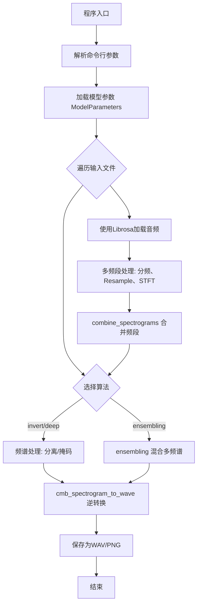
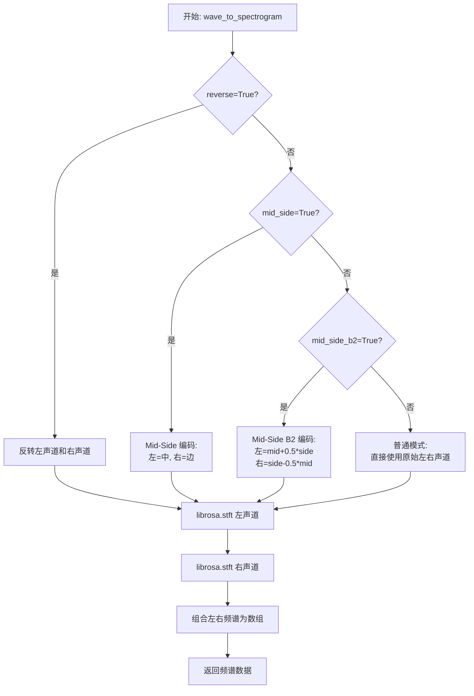
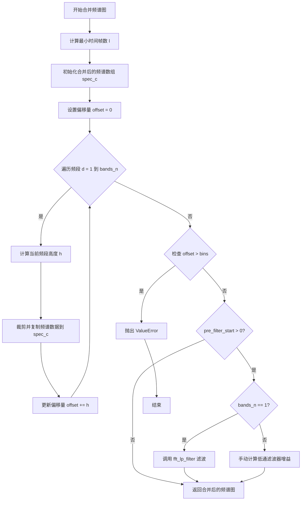
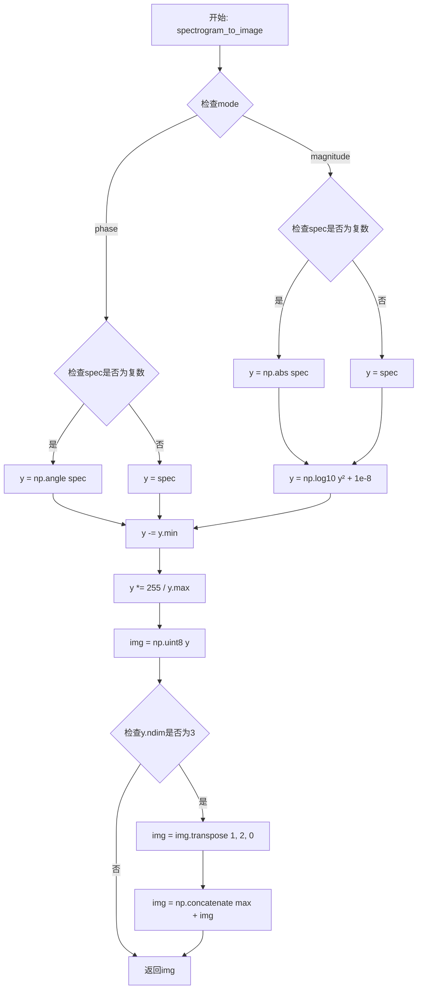
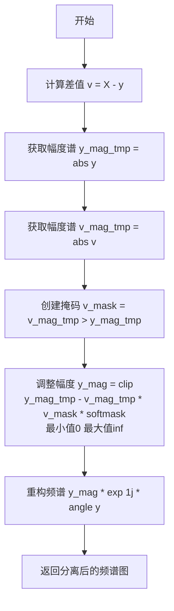
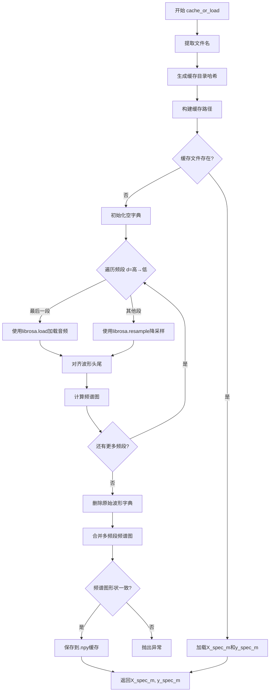
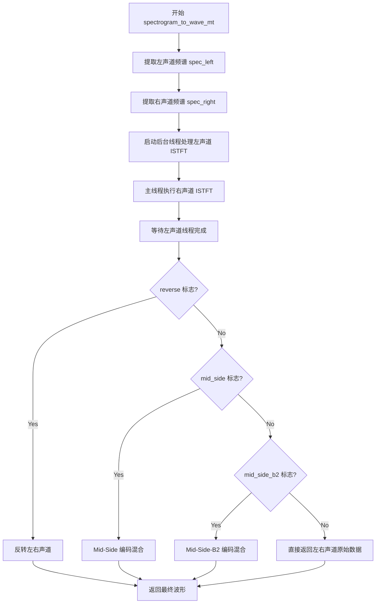
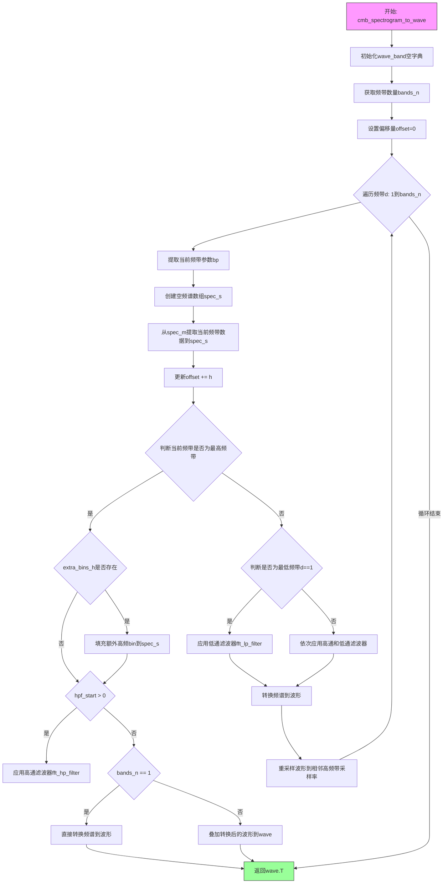
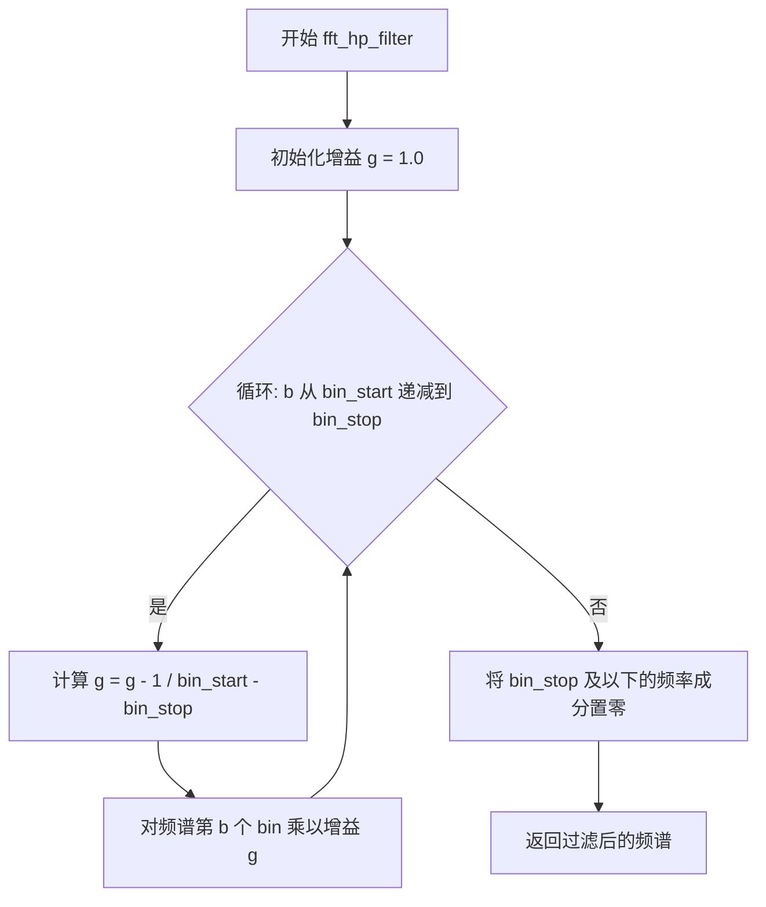
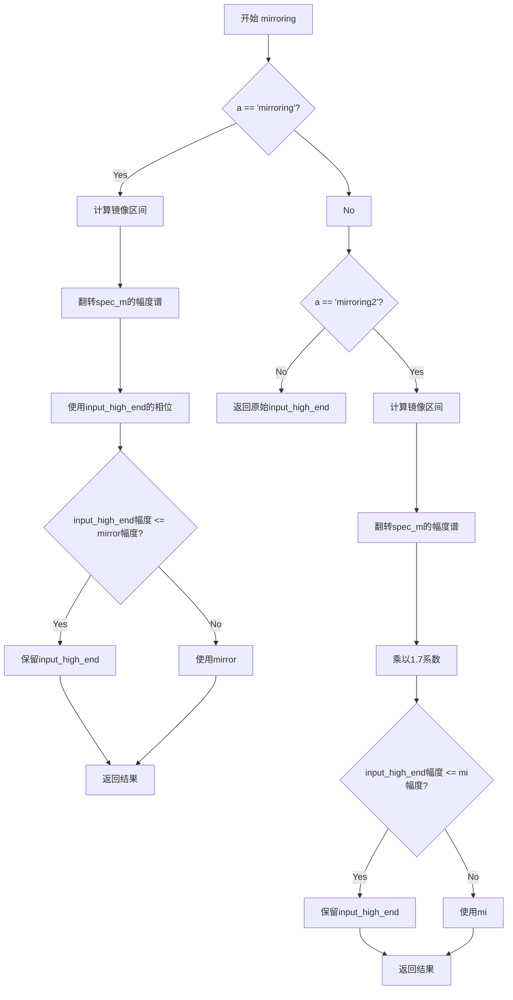

# `Chat-Haruhi-Suzumiya\yuki_builder\video_preprocessing\uvr5\uvr5_pack\lib_v5\spec_utils.py` 详细设计文档

这是一个用于音频源分离（Source Separation）和频谱图处理的核心脚本。它支持多频段（高、中、低频）音频处理，通过STFT/ISTFT在频域和时域之间转换，并实现了多种算法（如Inversion、Deep learning后处理、Min/Max Magnitude Ensembling）来分离人声与伴奏，同时包含缓存机制和可视化功能。

## 整体流程



## 类结构

```
Global Functions (模块级函数)
├── 音频转换: wave_to_spectrogram, stft, spectrogram_to_wave, istft
├── 频谱处理: combine_spectrograms, mask_silence, reduce_vocal_aggressively
├── 滤波与增强: fft_lp_filter, fft_hp_filter, mirroring
├── 工具函数: crop_center, align_wave_head_and_tail, cache_or_load, ensembling
└── Main Execution Block (主执行逻辑)
External Dependency
└── ModelParameters (来自 model_param_init, 用于管理配置参数)
```

## 全局变量及字段


### `args`
    
命令行参数对象，包含算法选择、模型参数路径、输出文件名等配置

类型：`argparse.Namespace`
    


### `mp`
    
模型参数实例，包含频段配置、采样率、FFT参数等音频处理参数

类型：`ModelParameters`
    


### `wave`
    
存储各频段音频波形的字典，键为频段索引，值为立体声音频数据

类型：`dict[int, np.ndarray]`
    


### `specs`
    
存储各输入文件频谱图数据的字典，键为文件索引，值为合并后的频谱数组

类型：`dict[int, np.ndarray]`
    


### `spec`
    
临时存储单个输入文件各频段频谱数据的字典，键为频段索引

类型：`dict[int, np.ndarray]`
    


### `X_spec_m`
    
混合音频的合并后频谱矩阵，形状为(2, bins+1, time_frames)，类型为复数

类型：`np.ndarray`
    


### `y_spec_m`
    
乐器/伴奏音频的合并后频谱矩阵，形状与X_spec_m相同，用于分离计算

类型：`np.ndarray`
    


### `mix_path`
    
混合音频文件的缓存或加载路径

类型：`str`
    


### `inst_path`
    
乐器/伴奏音频文件的缓存或加载路径

类型：`str`
    


### `cache_dir`
    
频谱缓存目录路径，基于模型参数哈希值生成

类型：`str`
    


### `start_time`
    
程序开始执行的时间戳，用于计算总运行时长

类型：`float`
    


    

## 全局函数及方法


### `crop_center`

该函数用于将两个PyTorch张量在时间维度（第四维）上进行中心对齐裁剪，使得输出张量与目标张量具有相同的宽度，通常用于音频频谱图处理中确保不同频段张量的时间轴对齐。

参数：

- `h1`：`torch.Tensor`，输入张量，需要被裁剪的张量，通常是较大的频谱图张量
- `h2`：`torch.Tensor`，目标张量，裁剪后需要对齐的张量，用于确定裁剪的宽度

返回值：`torch.Tensor`，裁剪后的张量，其时间维度（第四维）宽度与h2相同，中心对齐

#### 流程图

```mermaid
flowchart TD
    A[开始 crop_center] --> B[获取h1形状: h1_shape = h1.size]
    B --> C[获取h2形状: h2_shape = h2.size]
    C --> D{h1_shape[3] == h2_shape[3]?}
    D -->|是| E[直接返回h1]
    D -->|否| F{h1_shape[3] < h2_shape[3]?}
    F -->|是| G[抛出ValueError异常]
    F -->|否| H[计算裁剪起始点<br/>s_time = (h1_shape[3] - h2_shape[3]) // 2]
    H --> I[计算裁剪结束点<br/>e_time = s_time + h2_shape[3]]
    I --> J[执行中心裁剪<br/>h1 = h1[:, :, :, s_time:e_time]]
    J --> K[返回裁剪后的h1]
    E --> K
    G --> L[结束]
    K --> L
```

#### 带注释源码

```python
def crop_center(h1, h2):
    """
    裁剪tensor使其中心对齐
    
    该函数将h1在时间维度（第四维）上进行中心裁剪，使其宽度与h2相同。
    常用于音频频谱图处理中，确保不同频段的频谱图在时间轴上对齐。
    
    参数:
        h1 (torch.Tensor): 输入张量，需要被裁剪的张量，形状为 [B, C, F, T]
        h2 (torch.Tensor): 目标张量，用于确定裁剪后的宽度，形状为 [B, C, F, T']
    
    返回:
        torch.Tensor: 裁剪后的张量，形状为 [B, C, F, T']
    
    异常:
        ValueError: 当h1的时间维度宽度小于h2时抛出
    """
    # 获取两个张量的形状
    # 假设形状为 (batch, channel, freq, time)
    h1_shape = h1.size()    # h1_shape[3] 代表时间维度的宽度
    h2_shape = h2.size()    # h2_shape[3] 代表时间维度的宽度

    # 情况1：如果两者时间维度宽度相同，直接返回h1，无需裁剪
    if h1_shape[3] == h2_shape[3]:
        return h1
    # 情况2：如果h1比h2小，抛出异常（不符合裁剪条件）
    elif h1_shape[3] < h2_shape[3]:
        raise ValueError("h1_shape[3] must be greater than h2_shape[3]")

    # 注释掉的频率维度裁剪逻辑（保留用于未来扩展）
    # s_freq = (h2_shape[2] - h1_shape[2]) // 2
    # e_freq = s_freq + h1_shape[2]

    # 情况3：计算时间维度的中心裁剪范围
    # 计算起始位置：从h1的中心开始，向左右各取h2宽度的一半
    s_time = (h1_shape[3] - h2_shape[3]) // 2
    # 计算结束位置：起始位置加上h2的宽度
    e_time = s_time + h2_shape[3]
    
    # 执行中心裁剪，保留h1的前三维，只在第四维（时间维）进行切片
    # 切片格式：[batch, channel, freq, time_range]
    h1 = h1[:, :, :, s_time:e_time]

    return h1
```


### `wave_to_spectrogram`

该函数负责将立体声音波数据转换为频谱图（Short-Time Fourier Transform, STFT），支持多种声道处理模式（普通、Mid-Side、Mid-Side B2、Reverse），并返回左右声道的频谱数据。

参数：

- `wave`：`numpy.ndarray`，输入的波形数据，形状为 (2, n_samples)，包含左声道 [0] 和右声道 [1]
- `hop_length`：`int`，STFT 帧移长度，控制时间分辨率
- `n_fft`：`int`，FFT 窗口大小，控制频率分辨率
- `mid_side`：`bool`，是否使用 Mid-Side 立体声解码模式（默认 False）
- `mid_side_b2`：`bool`，是否使用 Mid-Side B2 变体模式（默认 False）
- `reverse`：`bool`，是否反转左右声道（默认 False）

返回值：`numpy.ndarray`，频谱图数据，形状为 (2, n_freq_bins, n_frames)，包含左声道频谱 [0] 和右声道频谱 [1]

#### 流程图



#### 带注释源码

```python
def wave_to_spectrogram(
    wave, hop_length, n_fft, mid_side=False, mid_side_b2=False, reverse=False
):
    """
    将波形数据转换为频谱图（支持多种立体声处理模式）
    
    参数:
        wave: 输入波形，形状为 (2, n_samples)，索引 [0] 为左声道，[1] 为右声道
        hop_length: STFT 帧移长度
        n_fft: FFT 窗口大小
        mid_side: 是否使用 Mid-Side 立体声解码
        mid_side_b2: 是否使用 Mid-Side B2 变体模式
        reverse: 是否反转左右声道
    
    返回:
        频谱图，形状为 (2, n_fft//2+1, n_frames)
    """
    # 根据模式处理左右声道数据
    if reverse:
        # Reverse 模式：反转左右声道
        # 用于处理已反转的音频数据恢复
        wave_left = np.flip(np.asfortranarray(wave[0]))
        wave_right = np.flip(np.asfortranarray(wave[1]))
    elif mid_side:
        # Mid-Side 模式：立体声到中-边编码
        # Mid = (L + R) / 2，Side = L - R
        # 常用于立体声宽度处理和相位校正
        wave_left = np.asfortranarray(np.add(wave[0], wave[1]) / 2)
        wave_right = np.asfortranarray(np.subtract(wave[0], wave[1]))
    elif mid_side_b2:
        # Mid-Side B2 变体模式
        # 另一种中-边编码的权重分配
        wave_left = np.asfortranarray(np.add(wave[1], wave[0] * 0.5))
        wave_right = np.asfortranarray(np.subtract(wave[0], wave[1] * 0.5))
    else:
        # 普通模式：直接使用原始左右声道
        wave_left = np.asfortranarray(wave[0])
        wave_right = np.asfortranarray(wave[1])

    # 使用 librosa 进行短时傅里叶变换 (STFT)
    # 将时域信号转换为频域表示
    spec_left = librosa.stft(wave_left, n_fft, hop_length=hop_length)
    spec_right = librosa.stft(wave_right, n_fft, hop_length=hop_length)

    # 组合左右声道的频谱为二维数组
    # axis=0: 分别存储左 [0] 和右 [1] 声道的频谱
    spec = np.asfortranarray([spec_left, spec_right])

    return spec
```


### `wave_to_spectrogram_mt`

多线程版本的波形转频谱图函数，通过并行计算左右声道的STFT变换来提升性能。

参数：

- `wave`：`numpy.ndarray`，输入的波形数据，形状为(2, samples)，包含左声道和右声道
- `hop_length`：`int`，STFT的帧移大小，用于控制时频分辨率
- `n_fft`：`int`，快速傅里叶变换的窗口大小，决定频率分辨率
- `mid_side`：`bool`，是否使用中-侧立体声编码方式处理输入波形，默认为False
- `mid_side_b2`：`bool`，是否使用中-侧立体声编码方式B2处理输入波形，默认为False
- `reverse`：`bool`，是否反转左右声道，默认为False

返回值：`numpy.ndarray`，形状为(2, freq_bins, time_frames)的复数类型频谱图数组，包含左声道和右声道的频谱数据

#### 流程图

```mermaid
flowchart TD
    A[开始 wave_to_spectrogram_mt] --> B{reverse?}
    B -->|True| C[翻转左右声道]
    B -->|False| D{mid_side?}
    D -->|True| E[计算中-侧编码: left=(L+R)/2, right=L-R]
    D -->|False| F{mid_side_b2?}
    F -->|True| G[计算中-侧编码B2]
    F -->|False| H[直接使用原始左右声道]
    C --> I[转换为Fortran数组]
    E --> I
    G --> I
    H --> I
    I --> J[启动线程计算spec_left]
    J --> K[主线程计算spec_right]
    K --> L[等待线程结束 thread.join]
    L --> M[合并为频谱图数组]
    M --> N[返回spec]
```

#### 带注释源码

```
def wave_to_spectrogram_mt(
    wave, hop_length, n_fft, mid_side=False, mid_side_b2=False, reverse=False
):
    """多线程版本的波形转频谱图函数
    
    参数:
        wave: 输入波形数组，形状为(2, samples)，第一维为声道(左/右)
        hop_length: STFT帧移
        n_fft: FFT窗口大小
        mid_side: 是否使用中-侧编码
        mid_side_b2: 是否使用中-侧编码B2
        reverse: 是否反转声道
    
    返回:
        复数类型的频谱图数组
    """
    import threading

    # 根据参数预处理波形数据
    if reverse:
        # 反转模式：翻转左右声道
        wave_left = np.flip(np.asfortranarray(wave[0]))
        wave_right = np.flip(np.asfortranarray(wave[1]))
    elif mid_side:
        # 中-侧编码模式：将立体声转换为中(Mid)和侧(Side)信号
        # left = (L + R) / 2, right = L - R
        wave_left = np.asfortranarray(np.add(wave[0], wave[1]) / 2)
        wave_right = np.asfortranarray(np.subtract(wave[0], wave[1]))
    elif mid_side_b2:
        # 中-侧编码B2模式：另一种混合方式
        wave_left = np.asfortranarray(np.add(wave[1], wave[0] * 0.5))
        wave_right = np.asfortranarray(np.subtract(wave[0], wave[1] * 0.5))
    else:
        # 默认模式：直接使用左右声道
        wave_left = np.asfortranarray(wave[0])
        wave_right = np.asfortranarray(wave[1])

    # 定义线程执行函数，计算左声道频谱
    def run_thread(**kwargs):
        global spec_left  # 使用全局变量存储结果
        spec_left = librosa.stft(**kwargs)

    # 创建线程并启动：并行计算左声道STFT
    thread = threading.Thread(
        target=run_thread,
        kwargs={"y": wave_left, "n_fft": n_fft, "hop_length": hop_length},
    )
    thread.start()
    
    # 主线程同时计算右声道STFT
    spec_right = librosa.stft(y=wave_right, n_fft=n_fft, hop_length=hop_length)
    
    # 等待线程完成
    thread.join()

    # 合并左右声道频谱为最终输出
    spec = np.asfortranarray([spec_left, spec_right])

    return spec
```


### `combine_spectrograms`

该函数用于将多个不同频段（低频、中频、高频）的频谱图合并为一个完整频段的频谱图，通过裁剪和拼接各频段数据，并可选地应用低通滤波器去除高频噪声，最终输出一个统一的复数频谱数组。

参数：

- `specs`：字典（键为整数类型，值为 `numpy.ndarray`），包含多个频段的频谱图，键通常代表不同的频段索引（如 1、2、3 等）
- `mp`：对象，包含模型参数配置，其中 `mp.param` 为字典，需包含 `bins`（总频段数）、`band`（各频段配置）、`pre_filter_start` 和 `pre_filter_stop`（低通滤波器参数）

返回值：`numpy.ndarray`，返回合并后的完整频谱图，形状为 (2, bins+1, 时间帧数)，数据类型为复数类型 `np.complex64`

#### 流程图



#### 带注释源码

```python
def combine_spectrograms(specs, mp):
    """
    将多个频段的频谱图合并为一个完整频段的频谱图
    
    参数:
        specs: 字典，包含多个频段的频谱图，键为频段索引（从1开始）
        mp: 模型参数对象，需包含以下关键参数:
            - mp.param['bins']: 总频率 bins 数量
            - mp.param['band']: 各频段的配置字典，包含 crop_start、crop_stop 等
            - mp.param['pre_filter_start']: 低通滤波器起始频率索引
            - mp.param['pre_filter_stop']: 低通滤波器结束频率索引
    
    返回值:
        合并后的频谱图，形状为 (2, bins+1, 时间帧数)，dtype=np.complex64
    """
    
    # 1. 获取所有频段中最小的时间帧数，确保输出长度一致
    l = min([specs[i].shape[2] for i in specs])
    
    # 2. 初始化合并后的频谱数组，形状为 (2, bins+1, l)，类型为复数
    # 2 表示左右声道，bins+1 因为包含 DC 分量
    spec_c = np.zeros(shape=(2, mp.param["bins"] + 1, l), dtype=np.complex64)
    
    # 3. 初始化偏移量，用于追踪当前已处理的频率高度
    offset = 0
    
    # 4. 获取频段总数
    bands_n = len(mp.param["band"])
    
    # 5. 遍历每个频段，将各频段数据拼接在一起
    for d in range(1, bands_n + 1):
        # 计算当前频段的高度（频率 bins 数量）
        h = mp.param["band"][d]["crop_stop"] - mp.param["band"][d]["crop_start"]
        
        # 将当前频段的频谱数据复制到合并数组的对应位置
        # specs[d] 是原始频段数据，需要根据 crop_start/crop_stop 进行裁剪
        # spec_c 是目标数组，从 offset 位置开始填充
        spec_c[:, offset : offset + h, :l] = specs[d][
            :, mp.param["band"][d]["crop_start"] : mp.param["band"][d]["crop_stop"], :l
        ]
        
        # 更新偏移量，为下一个频段腾出空间
        offset += h
    
    # 6. 检查合并后的总高度是否超过指定的 bins 数量
    if offset > mp.param["bins"]:
        raise ValueError("Too much bins")
    
    # 7. 应用低通滤波器（可选，取决于 pre_filter_start 参数）
    if mp.param["pre_filter_start"] > 0:
        # 如果只有一个频段，使用 FFT 低通滤波器函数
        if bands_n == 1:
            spec_c = fft_lp_filter(
                spec_c, mp.param["pre_filter_start"], mp.param["pre_filter_stop"]
            )
        else:
            # 手动计算低通滤波器增益曲线
            # 使用对数衰减方式平滑过渡
            gp = 1
            for b in range(
                mp.param["pre_filter_start"] + 1, mp.param["pre_filter_stop"]
            ):
                # 计算增益 g，频率越高增益越低
                g = math.pow(
                    10, -(b - mp.param["pre_filter_start"]) * (3.5 - gp) / 20.0
                )
                gp = g
                # 将增益应用到对应频率的频谱上
                spec_c[:, b, :] *= g
    
    # 8. 将结果转换为 Fortran 顺序（列优先），利于某些数值计算库
    return np.asfortranarray(spec_c)
```


### `spectrogram_to_image`

该函数将音频频谱图数据转换为可用于可视化或图像处理的图像格式，支持幅度模式和相位模式两种转换方式，通过对数变换、归一化和类型转换将频谱数据映射到0-255的灰度像素值范围，并针对立体声频谱（3维张量）进行特定的通道拼接处理以适应图像显示需求。

参数：

- `spec`：`numpy.ndarray`，输入的频谱图数据，可以是复数形式（包含幅度和相位信息）或实数形式（幅度谱）
- `mode`：`str`，转换模式，默认为"magnitude"（幅度模式），可选"phase"（相位模式）

返回值：`numpy.ndarray`，转换后的图像数据，类型为uint8，值为0-255的像素值

#### 流程图



#### 带注释源码

```python
def spectrogram_to_image(spec, mode="magnitude"):
    """
    将频谱图转换为图像用于可视化
    
    参数:
        spec: 输入的频谱图,可以是复数数组(包含幅度和相位)或实数数组(幅度谱)
        mode: 转换模式,"magnitude"表示幅度模式,"phase"表示相位模式
    
    返回:
        转换后的uint8类型图像数组
    """
    # 根据模式处理频谱数据
    if mode == "magnitude":
        # 幅度模式:将频谱转换为幅度并取对数
        if np.iscomplexobj(spec):
            # 如果输入是复数,提取幅度
            y = np.abs(spec)
        else:
            # 如果输入已是实数,直接使用
            y = spec
        # 取对数变换,1e-8防止log(0)
        y = np.log10(y**2 + 1e-8)
    elif mode == "phase":
        # 相位模式:提取相位信息
        if np.iscomplexobj(spec):
            # 提取复数的相位角(弧度)
            y = np.angle(spec)
        else:
            y = spec

    # 归一化处理:将数值映射到0-255范围
    # 减去最小值使范围从0开始
    y -= y.min()
    # 乘以255/最大值进行缩放
    y *= 255 / y.max()
    # 转换为uint8类型(图像标准格式)
    img = np.uint8(y)

    # 处理立体声音频的频谱(3维张量)
    if y.ndim == 3:
        # 转置维度从(通道,频率,时间)转换为(频率,时间,通道)
        img = img.transpose(1, 2, 0)
        # 将最大幅度通道与原通道拼接
        # 用于在可视化时同时显示幅度信息和各通道相位
        img = np.concatenate([np.max(img, axis=2, keepdims=True), img], axis=2)

    return img
```

#### 关键组件信息

- **numpy**：用于数值计算和数组操作
- **librosa**：音频信号处理库（虽然此函数未直接使用，但与整个模块的频谱处理流程相关）

#### 潜在的技术债务或优化空间

1. **缺少输入验证**：函数未对输入进行充分验证，如检查`spec`的类型是否为numpy数组、检查`mode`是否为有效值等
2. **硬编码的epsilon值**：`1e-8`作为对数防零值是硬编码的，可能需要根据实际数据特性调整为参数
3. **相位模式未完整处理**：相位模式只提取了角度，但未进行与幅度模式类似的归一化处理，可能导致相位图像对比度不足
4. **缺少文档字符串类型提示**：虽然有docstring，但缺少Python类型提示（type hints），不利于静态类型检查和IDE支持

#### 其它项目

- **设计目标**：将频谱数据转换为可视化图像，输出格式兼容OpenCV等图像处理库
- **错误处理**：当前无异常处理机制，当输入数据包含NaN或Inf值时可能导致异常或错误结果
- **外部依赖**：仅依赖NumPy，独立性较好
- **接口契约**：输入的频谱图应符合特定的形状约定（2D或3D numpy数组），输出为标准图像格式的numpy数组


### `reduce_vocal_aggressively`

激进的人声分离算法，通过计算混合音频与目标音频（人声或伴奏）的差值，并根据幅度差异和软掩码系数调整目标音频的幅度谱，最后结合原始相位信息重构频谱图，实现高效的音频分离。

参数：

- `X`：`numpy.ndarray`，混合音频的频谱图（复数形式，包含幅度和相位信息）
- `y`：`numpy.ndarray`，目标音频（人声或伴奏）的频谱图（复数形式）
- `softmask`：`float`，软掩码系数，用于控制分离的激进程度，值越大分离越激进

返回值：`numpy.ndarray`，分离后的音频频谱图（复数形式）

#### 流程图



#### 带注释源码

```python
def reduce_vocal_aggressively(X, y, softmask):
    """
    激进的人声分离算法
    
    参数:
        X: 混合音频的频谱图 (复数numpy数组)
        y: 目标音频（人声或伴奏）的频谱图 (复数numpy数组)
        softmask: 软掩码系数，控制分离激进程度
    
    返回:
        分离后的音频频谱图 (复数numpy数组)
    """
    # Step 1: 计算混合音频与目标音频的差值
    # v = X - y 得到剩余部分（如果是去人声，则v为人声；如果是提取伴奏，则v为伴奏）
    v = X - y
    
    # Step 2: 获取目标音频的幅度谱
    # 使用np.abs获取复数的幅度/绝对值
    y_mag_tmp = np.abs(y)
    
    # Step 3: 获取差值部分的幅度谱
    v_mag_tmp = np.abs(v)
    
    # Step 4: 创建掩码
    # 标记差值幅度大于目标幅度位置，这些位置需要更强地抑制目标
    v_mask = v_mag_tmp > y_mag_tmp
    
    # Step 5: 调整目标音频的幅度谱
    # 对于v_mask为True的位置（差值更大的地方），使用softmask系数进行抑制
    # clip确保结果始终非负
    y_mag = np.clip(y_mag_tmp - v_mag_tmp * v_mask * softmask, 0, np.inf)
    
    # Step 6: 重构频谱图
    # 使用调整后的幅度乘以原始目标音频的相位
    # np.exp(1j * np.angle(y)) 提取原始相位信息
    return y_mag * np.exp(1.0j * np.angle(y))
```


### `mask_silence`

该函数用于对频谱图（spectrogram）中的静音段进行加权掩码处理，通过识别参考频谱中能量低于阈值的帧区间，并对这些区间应用淡入淡出（fade-in/fade-out）加权掩码，以减少静音段对音频处理的影响。

参数：

- `mag`：`numpy.ndarray`，待处理的频谱图数据，形状为 (2, bins, frames)，通常为复数形式或幅度谱
- `ref`：`numpy.ndarray`，用于检测静音段的参考频谱图，形状与 mag 相同
- `thres`：`float`，静音检测阈值，默认值为 0.2，表示参考频谱均值低于此值时判定为静音
- `min_range`：`int`，最小静音区间长度（帧数），默认值为 64，用于过滤过短的静音段
- `fade_size`：`int`，淡入淡出窗口大小（帧数），默认值为 32，用于平滑过渡

返回值：`numpy.ndarray`，处理后的频谱图，与输入 mag 的形状和类型相同

#### 流程图

```mermaid
flowchart TD
    A[开始: mask_silence] --> B{参数校验<br/>min_range >= fade_size * 2?}
    B -->|否| C[抛出 ValueError]
    B -->|是| D[复制输入 mag 到工作变量]
    E[计算参考频谱均值<br/>ref.mean(axis=(0, 1))]
    D --> E
    F[查找静音帧索引<br/>where均值 < thres]
    E --> F
    G[计算静音区间起止点<br/>利用diff找断裂点]
    H{存在有效静音区间?<br/>长度 > min_range}
    F --> G
    G --> H
    H -->|否| I[返回原始mag]
    H -->|是| J[遍历每个静音区间]
    J --> K{区间前方有足够间距?}
    K -->|是| L[设置淡入权重 0→1]
    K -->|否| M[调整起点避免重叠]
    L --> N[应用淡入掩码]
    M --> N
    N --> O{区间后方有足够间距?}
    O -->|是| P[设置淡出权重 1→0]
    O -->|否| Q[调整终点避免重叠]
    P --> R[应用淡出掩码]
    Q --> R
    R --> S[填充中间区域<br/>直接叠加参考频谱]
    S --> T{还有更多区间?}
    T -->|是| J
    T -->|否| U[返回处理后的mag]
    I --> U
```

#### 带注释源码

```python
def mask_silence(mag, ref, thres=0.2, min_range=64, fade_size=32):
    """
    对静音段进行加权掩码处理
    
    Parameters:
        mag: 频谱图数组，形状 (2, bins, frames)
        ref: 参考频谱图，用于检测静音段
        thres: 静音检测阈值，低于此值认为该帧为静音
        min_range: 最小静音区间长度
        fade_size: 淡入淡出窗口大小
    
    Returns:
        处理后的频谱图
    """
    # 参数校验：确保最小区间长度足够容纳两个淡入淡出窗口
    if min_range < fade_size * 2:
        raise ValueError("min_range must be >= fade_area * 2")

    # 复制输入数据，避免修改原始数据
    mag = mag.copy()

    # 步骤1：计算参考频谱在频率和通道维度的均值，得到每帧的能量均值
    # ref.mean(axis=(0, 1)) 将 (2, bins, frames) 沿前两维求平均，得到 (frames,)
    ref_mean = ref.mean(axis=(0, 1))
    
    # 步骤2：找出所有静音帧的索引（均值小于阈值）
    idx = np.where(ref_mean < thres)[0]
    
    # 步骤3：根据索引断裂点计算静音区间的起始和结束帧
    # np.diff(idx) != 1 找出不连续的位置（即区间断裂点）
    # +1 是因为diff结果比原索引少1，需要偏移
    if len(idx) > 0:
        # 插入起始点：第一个区间从 idx[0] 开始
        starts = np.insert(idx[np.where(np.diff(idx) != 1)[0] + 1], 0, idx[0])
        # 追加结束点：最后一个区间以 idx[-1] 结束
        ends = np.append(idx[np.where(np.diff(idx) != 1)[0]], idx[-1])
    else:
        starts = np.array([])
        ends = np.array([])

    # 步骤4：筛选长度大于 min_range 的有效静音区间
    uninformative = np.where(ends - starts > min_range)[0]
    
    # 如果没有有效静音区间，直接返回原始频谱
    if len(uninformative) > 0:
        starts = starts[uninformative]
        ends = ends[uninformative]
        
        old_e = None  # 记录前一个区间的结束位置，用于处理区间重叠
        
        # 步骤5：遍历每个静音区间进行处理
        for s, e in zip(starts, ends):
            # 如果当前区间与前一区间间距小于 fade_size，则缩小当前区间起点
            # 避免淡入淡出窗口重叠导致过度处理
            if old_e is not None and s - old_e < fade_size:
                s = old_e - fade_size * 2

            # 处理区间前端的淡入（fade-in）
            if s != 0:
                # 创建从0到1的线性权重向量
                weight = np.linspace(0, 1, fade_size)
                # 在静音区间前端叠加加权后的参考频谱，实现淡入效果
                mag[:, :, s:s + fade_size] += weight * ref[:, :, s:s + fade_size]
            else:
                # 如果区间起点在0处，需要向左扩展一个 fade_size
                s -= fade_size

            # 处理区间后端的淡出（fade-out）
            if e != mag.shape[2]:
                # 创建从1到0的线性权重向量
                weight = np.linspace(1, 0, fade_size)
                # 在静音区间后端叠加加权后的参考频谱，实现淡出效果
                mag[:, :, e - fade_size:e] += weight * ref[:, :, e - fade_size:e]
            else:
                # 如果区间终点在末尾，需要向右扩展一个 fade_size
                e += fade_size

            # 步骤6：填充中间区域（去除淡入淡出部分后的核心静音区）
            # 直接叠加参考频谱，保持静音段的能量特征
            mag[:, :, s + fade_size:e - fade_size] += ref[:, :, s + fade_size:e - fade_size]
            
            old_e = e  # 更新上一区间结束位置

    return mag
```


### `align_wave_head_and_tail`

该函数用于将两个音频波形的头尾部分对齐，确保它们具有相同的长度。它通过计算两个音频波形长度的最小值，然后将该最小值作为裁剪窗口，分别对两个波形进行截取，最终返回长度一致的波形段。

参数：

- `a`：`numpy.ndarray`，第一个音频波形数组（通常为立体声，形状为 (2, n)）
- `b`：`numpy.ndarray`，第二个音频波形数组（通常为立体声，形状为 (2, n)）

返回值：`tuple`，包含两个裁剪后的音频波形数组，元组格式为 (裁剪后的a, 裁剪后的b)

#### 流程图

```mermaid
flowchart TD
    A[开始对齐波形头尾] --> B[计算两个波形的长度最小值]
    B --> C{l < a[0].size}
    C -->|是| D[使用最小长度l裁剪波形a]
    C -->|否| E[直接使用原波形a]
    D --> F[使用最小长度l裁剪波形b]
    E --> F
    F --> G[返回裁剪后的两个波形]
```

#### 带注释源码

```python
def align_wave_head_and_tail(a, b):
    """
    对齐两个音频波形的头尾长度，使它们具有相同的采样点数。
    
    参数:
        a: 第一个音频波形数组（通常为立体声，形状为 (2, n)）
        b: 第二个音频波形数组（通常为立体声，形状为 (2, n)）
    
    返回:
        tuple: (裁剪后的a, 裁剪后的b)，两个波形被裁剪到相同长度
    """
    # 计算两个波形通道中较短的长度
    # a[0].size 和 b[0].size 分别获取第一个波形和第二个波形的第一个通道的样本数
    l = min([a[0].size, b[0].size])

    # 使用最小长度 l 裁剪两个波形
    # 注意：这里假设输入是二维数组（立体声），索引 [ :l, :l] 分别对应时间维度和通道维度
    # 返回两个裁剪后的波形，形成元组
    return a[:l, :l], b[:l, :l]
```


### `cache_or_load`

该函数实现了一个缓存机制，用于处理音频文件的频谱图计算。它首先检查是否存在预计算的`.npy`缓存文件，如果存在则直接加载，否则读取音频文件、计算多频段频谱图、合并后保存到缓存目录，最后返回混合音轨和独立音轨的频谱图矩阵。

参数：

- `mix_path`：`str`，混合音轨（mix）的音频文件路径
- `inst_path`：`str`，独立音轨（instrumental）的音频文件路径
- `mp`：`ModelParameters`，模型参数对象，包含频段配置、采样率等参数

返回值：`tuple`，包含两个numpy数组 `(X_spec_m, y_spec_m)`，分别是混合音轨和独立音轨的合并频谱图，类型为`np.ndarray`，形状为`(2, bins+1, time_frames)`

#### 流程图



#### 带注释源码

```python
def cache_or_load(mix_path, inst_path, mp):
    """
    缓存机制：优先加载.npy缓存文件，否则计算并保存
    
    参数:
        mix_path: 混合音轨音频文件路径
        inst_path: 独立音轨音频文件路径  
        mp: ModelParameters对象，包含模型参数配置
    """
    # 提取文件名（不含扩展名）
    mix_basename = os.path.splitext(os.path.basename(mix_path))[0]
    inst_basename = os.path.splitext(os.path.basename(inst_path))[0]

    # 根据参数生成缓存目录名（使用SHA1哈希确保参数变化时重新计算）
    cache_dir = "mph{}".format(
        hashlib.sha1(json.dumps(mp.param, sort_keys=True).encode("utf-8")).hexdigest()
    )
    # 构建混合格和独立音轨的缓存目录
    mix_cache_dir = os.path.join("cache", cache_dir)
    inst_cache_dir = os.path.join("cache", cache_dir)

    # 确保缓存目录存在
    os.makedirs(mix_cache_dir, exist_ok=True)
    os.makedirs(inst_cache_dir, exist_ok=True)

    # 构建完整的缓存文件路径
    mix_cache_path = os.path.join(mix_cache_dir, mix_basename + ".npy")
    inst_cache_path = os.path.join(inst_cache_dir, inst_basename + ".npy")

    # 检查缓存是否存在：两个文件都存在才使用缓存
    if os.path.exists(mix_cache_path) and os.path.exists(inst_cache_path):
        # 直接从缓存加载频谱图
        X_spec_m = np.load(mix_cache_path)
        y_spec_m = np.load(inst_cache_path)
    else:
        # 缓存不存在，需要计算
        X_wave, y_wave, X_spec_s, y_spec_s = {}, {}, {}, {}

        # 从高到低遍历各个频段
        for d in range(len(mp.param["band"]), 0, -1):
            bp = mp.param["band"][d]  # 获取当前频段参数

            if d == len(mp.param["band"]):  # 最高频段：直接加载音频
                X_wave[d], _ = librosa.load(
                    mix_path, bp["sr"], False, dtype=np.float32, res_type=bp["res_type"]
                )
                y_wave[d], _ = librosa.load(
                    inst_path,
                    bp["sr"],
                    False,
                    dtype=np.float32,
                    res_type=bp["res_type"],
                )
            else:  # 较低频段：从上一频段降采样
                X_wave[d] = librosa.resample(
                    X_wave[d + 1],
                    mp.param["band"][d + 1]["sr"],
                    bp["sr"],
                    res_type=bp["res_type"],
                )
                y_wave[d] = librosa.resample(
                    y_wave[d + 1],
                    mp.param["band"][d + 1]["sr"],
                    bp["sr"],
                    res_type=bp["res_type"],
                )

            # 对齐两个音轨的波形头尾
            X_wave[d], y_wave[d] = align_wave_head_and_tail(X_wave[d], y_wave[d])

            # 将波形转换为频谱图
            X_spec_s[d] = wave_to_spectrogram(
                X_wave[d],
                bp["hl"],
                bp["n_fft"],
                mp.param["mid_side"],
                mp.param["mid_side_b2"],
                mp.param["reverse"],
            )
            y_spec_s[d] = wave_to_spectrogram(
                y_wave[d],
                bp["hl"],
                bp["n_fft"],
                mp.param["mid_side"],
                mp.param["mid_side_b2"],
                mp.param["reverse"],
            )

        # 释放原始波形内存
        del X_wave, y_wave

        # 合并多个频段的频谱图
        X_spec_m = combine_spectrograms(X_spec_s, mp)
        y_spec_m = combine_spectrograms(y_spec_s, mp)

        # 验证合并后的频谱图形状一致
        if X_spec_m.shape != y_spec_m.shape:
            raise ValueError("The combined spectrograms are different: " + mix_path)

        # 保存到缓存文件
        np.save(mix_cache_path, X_spec_m)
        np.save(inst_cache_path, y_spec_m)

    return X_spec_m, y_spec_m
```


### `spectrogram_to_wave`

该函数执行频谱图到波形的逆变换（Inverse Short-Time Fourier Transform, ISTFT），将复数频谱图数据转换回立体声音频波形，并根据转换时的声道编码设置（Mid-Side 或 Reverse）进行相应的解码还原。

参数：

- `spec`：`numpy.ndarray`，输入的复数频谱图，形状为 `(2, 频率bins, 时间帧)`，通常包含左右声道或Mid-Side声道信息。
- `hop_length`：`int`，短时傅里叶变换（STFT）的帧移参数（Hop Length），需与正变换时的参数保持一致。
- `mid_side`：`bool`，标志位，指示正变换时是否使用了 Mid-Side 编码。若为 `True`，则执行 Mid-Side 到 Left-Right 的解码。
- `mid_side_b2`：`bool`，标志位，指示正变换时是否使用了 Mid-Side B2 变体编码。
- `reverse`：`bool`，标志位，指示正变换前是否对波形进行了翻转。若为 `True`，则在逆变换后需将波形翻转回原始顺序。

返回值：`numpy.ndarray`，返回重构后的立体声波形数组，形状为 `(2, 样本数)`，数据类型通常为 float32，采用 Fortran 内存顺序。

#### 流程图

```mermaid
graph TD
    A([开始]) --> B[输入: spec, hop_length, mid_side, mid_side_b2, reverse]
    B --> C[提取频谱: spec_left = spec[0], spec_right = spec[1]]
    C --> D[ISTFT逆变换: wave_left = istft(spec_left), wave_right = istft(spec_right)]
    D --> E{reverse 标志?}
    E -- True --> F[翻转波形: wave_left = flip(wave_left), wave_right = flip(wave_right)]
    E -- False --> G{mid_side 标志?}
    F --> G
    G -- True --> H[Mid-Side 解码: L = M + S/2, R = M - S/2]
    G -- False --> I{mid_side_b2 标志?}
    H --> J[返回波形数组]
    I -- True --> K[Mid-Side B2 解码: 自定义权重混合]
    I -- False --> J
```

#### 带注释源码

```python
def spectrogram_to_wave(spec, hop_length, mid_side, mid_side_b2, reverse):
    # 1. 从输入的频谱图数组中分别提取左/中声道和右/侧声道的频谱数据
    # spec[0] 通常对应左声道(L)或中声道(M)，spec[1] 对应右声道(R)或侧声道(S)
    spec_left = np.asfortranarray(spec[0])
    spec_right = np.asfortranarray(spec[1])

    # 2. 使用 librosa.istft 执行逆短时傅里叶变换，将频域数据转换回时域波形
    wave_left = librosa.istft(spec_left, hop_length=hop_length)
    wave_right = librosa.istft(spec_right, hop_length=hop_length)

    # 3. 根据转换前的编码设置进行波形复原
    
    # 3.1 Reverse 模式：如果之前对波形进行了翻转，此时需要翻转回去
    if reverse:
        return np.asfortranarray([np.flip(wave_left), np.flip(wave_right)])
    
    # 3.2 Mid-Side 模式：将 Mid (M) 和 Side (S) 编码转换回 Left (L) 和 Right (R)
    # 变换公式: L = M + S/2, R = M - S/2
    # 这里的 wave_left 实际存储的是 M，wave_right 存储的是 S
    elif mid_side:
        return np.asfortranarray(
            [np.add(wave_left, wave_right / 2), np.subtract(wave_left, wave_right / 2)]
        )
    
    # 3.3 Mid-Side B2 模式：使用特定的系数进行解码
    elif mid_side_b2:
        return np.asfortranarray(
            [
                np.add(wave_right / 1.25, 0.4 * wave_left),
                np.subtract(wave_left / 1.25, 0.4 * wave_right),
            ]
        )
    
    # 3.4 普通立体声模式：直接返回逆变换后的左右声道
    else:
        return np.asfortranarray([wave_left, wave_right])
```


### `spectrogram_to_wave_mt`

该函数是 `spectrogram_to_wave` 的多线程版本，通过使用 threading 模块并行处理左右声道的 ISTFT（逆短时傅里叶变换），从而提升频谱图转换为波形音频的执行效率。

参数：

- `spec`：numpy.ndarray，输入的复数频谱图，形状为 (2, bins, frames)，包含左声道和右声道
- `hop_length`：int，STFT 帧移长度，用于 ISTFT 计算
- `mid_side`：bool，是否使用 Mid-Side 编码方式处理输出
- `reverse`：bool，是否反转输出波形的左右声道
- `mid_side_b2`：bool，是否使用 Mid-Side-B2 编码方式处理输出

返回值：`numpy.ndarray`，返回重构的波形数据，形状为 (2, samples)，即左声道和右声道的音频数据

#### 流程图



#### 带注释源码

```python
def spectrogram_to_wave_mt(spec, hop_length, mid_side, reverse, mid_side_b2):
    """
    多线程版本的频谱图转波形函数
    
    参数:
        spec: 输入的复数频谱图，形状为 (2, bins, frames)，包含左右声道
        hop_length: STFT 帧移长度
        mid_side: 是否使用 Mid-Side 编码
        reverse: 是否反转波形
        mid_side_b2: 是否使用 Mid-Side-B2 编码
    """
    import threading  # 导入线程模块

    # 提取左右声道的频谱数据，转换为 Fortran 连续数组以优化性能
    spec_left = np.asfortranarray(spec[0])   # 左声道频谱
    spec_right = np.asfortranarray(spec[1]) # 右声道频谱

    # 定义线程执行函数，使用全局变量存储左声道转换结果
    def run_thread(**kwargs):
        global wave_left  # 全局变量，用于在线程间共享数据
        wave_left = librosa.istft(**kwargs)  # 执行 ISTFT 逆变换

    # 创建并启动线程处理左声道
    thread = threading.Thread(
        target=run_thread,  # 线程目标函数
        kwargs={"stft_matrix": spec_left, "hop_length": hop_length}  # 传递给线程的参数
    )
    thread.start()  # 启动线程

    # 主线程同时处理右声道的 ISTFT
    wave_right = librosa.istft(spec_right, hop_length=hop_length)
    
    # 等待左声道线程完成
    thread.join()

    # 根据不同的编码模式处理输出波形
    if reverse:
        # 反转模式：左右声道都反转
        return np.asfortranarray([np.flip(wave_left), np.flip(wave_right)])
    elif mid_side:
        # Mid-Side 编码：左 = L+R/2, 右 = L-R/2
        return np.asfortranarray(
            [np.add(wave_left, wave_right / 2), np.subtract(wave_left, wave_right / 2)]
        )
    elif mid_side_b2:
        # Mid-Side-B2 编码：混合左右声道
        return np.asfortranarray(
            [
                np.add(wave_right / 1.25, 0.4 * wave_left),
                np.subtract(wave_left / 1.25, 0.4 * wave_right),
            ]
        )
    else:
        # 默认模式：直接返回原始左右声道
        return np.asfortranarray([wave_left, wave_right])
```


### `cmb_spectrogram_to_wave`

该函数实现从合并频谱图重建波形信号的核心功能，通过分频带处理机制依次处理各个频段，对高频段应用高通滤波并可能补充额外频谱数据，对低频段应用低通滤波后重采样至相邻频带采样率，最终将各频带波形叠加并输出重构的立体声音频波形。

参数：

- `spec_m`：`numpy.ndarray`，合并后的完整频谱图，形状为(2, bins+1, frames)，包含左右声道的复数频谱数据
- `mp`：模型参数对象，包含多频带配置信息（如各频带的采样率、FFT长度、窗长、滤波器截止频率等）
- `extra_bins_h`：`int`或`None`，可选参数，表示额外高频部分的频谱bin数量，用于高频重建
- `extra_bins`：`numpy.ndarray`或`None`，可选参数，表示额外的高频频谱数据，当`extra_bins_h`不为None时使用

返回值：`numpy.ndarray`，重构后的立体声音波数据，形状为(samples, 2)，已转置为（样本数，声道数）格式

#### 流程图



#### 带注释源码

```python
def cmb_spectrogram_to_wave(spec_m, mp, extra_bins_h=None, extra_bins=None):
    """
    从合并的多频带频谱图重建完整波形
    
    参数:
        spec_m: 合并后的频谱图, 形状为 (2, bins+1, frames)
        mp: 模型参数对象, 包含各频带配置
        extra_bins_h: 可选, 额外高频bin数量
        extra_bins: 可选, 额外高频频谱数据
    
    返回:
        重构的波形, 形状为 (samples, 2), 即 (样本数, 声道数)
    """
    # 用于存储各频带波形的字典
    wave_band = {}
    # 获取配置的频带总数
    bands_n = len(mp.param["band"])
    # 频谱数据在合并频谱中的起始偏移量
    offset = 0

    # 依次处理每个频带, 从低频到高频
    for d in range(1, bands_n + 1):
        # 获取当前处理频带的参数配置
        bp = mp.param["band"][d]
        
        # 创建当前频带的频谱数组, 形状为 (2, n_fft//2+1, frames)
        # 使用complex类型存储复数频谱
        spec_s = np.ndarray(
            shape=(2, bp["n_fft"] // 2 + 1, spec_m.shape[2]), dtype=complex
        )
        
        # 计算当前频带的高度(包含的bin数)
        h = bp["crop_stop"] - bp["crop_start"]
        
        # 从合并频谱图中提取当前频带的数据
        # 按照crop_start和crop_stop定义的区间进行切片
        spec_s[:, bp["crop_start"] : bp["crop_stop"], :] = spec_m[
            :, offset : offset + h, :
        ]

        # 更新偏移量, 指向下一个频带在合并频谱中的起始位置
        offset += h
        
        # 判断是否为最高频带(high-end band)
        if d == bands_n:  # higher
            # 如果提供了额外的高频处理参数
            if extra_bins_h:  # if --high_end_process bypass
                # 获取FFT最大值bin索引
                max_bin = bp["n_fft"] // 2
                # 将额外高频数据填充到频谱最高端
                spec_s[:, max_bin - extra_bins_h : max_bin, :] = extra_bins[
                    :, :extra_bins_h, :
                ]
            
            # 如果配置了高通滤波器起始频率, 则应用高通滤波
            if bp["hpf_start"] > 0:
                spec_s = fft_hp_filter(spec_s, bp["hpf_start"], bp["hpf_stop"] - 1)
            
            # 根据频带数量决定处理方式
            if bands_n == 1:
                # 只有一个频带时, 直接转换
                wave = spectrogram_to_wave(
                    spec_s,
                    bp["hl"],
                    mp.param["mid_side"],
                    mp.param["mid_side_b2"],
                    mp.param["reverse"],
                )
            else:
                # 多个频带时, 将转换后的波形叠加到主波形上
                wave = np.add(
                    wave,
                    spectrogram_to_wave(
                        spec_s,
                        bp["hl"],
                        mp.param["mid_side"],
                        mp.param["mid_side_b2"],
                        mp.param["reverse"],
                    ),
                )
        else:
            # 处理低频或中频带
            # 获取下一级频带的采样率
            sr = mp.param["band"][d + 1]["sr"]
            
            if d == 1:  # 最低频带
                # 最低频带需要先应用低通滤波
                spec_s = fft_lp_filter(spec_s, bp["lpf_start"], bp["lpf_stop"])
                # 频谱转波形后重采样到下一级采样率
                wave = librosa.resample(
                    y=spectrogram_to_wave(
                        spec_s,
                        bp["hl"],
                        mp.param["mid_side"],
                        mp.param["mid_side_b2"],
                        mp.param["reverse"],
                    ),
                    orig_sr=bp["sr"],
                    target_sr=sr,
                    res_type="sinc_fastest",
                )
            else:  # 中间频带
                # 依次应用高通和低通滤波, 保留指定频率范围
                spec_s = fft_hp_filter(spec_s, bp["hpf_start"], bp["hpf_stop"] - 1)
                spec_s = fft_lp_filter(spec_s, bp["lpf_start"], bp["lpf_stop"])
                
                # 转换并叠加波形
                wave2 = np.add(
                    wave,
                    spectrogram_to_wave(
                        spec_s,
                        bp["hl"],
                        mp.param["mid_side"],
                        mp.param["mid_side_b2"],
                        mp.param["reverse"],
                    ),
                )
                # 使用scipy进行高质量重采样
                wave = librosa.core.resample(y=wave2, orig_sr=bp["sr"], target_sr=sr, res_type="scipy")

    # 返回转置后的波形, 转换为(样本数, 声道数)格式
    return wave.T
```


### `fft_lp_filter`

这是一个频域低通滤波器函数，通过线性递减的增益系数对指定频率范围内的频谱数据进行衰减，并将截止频率之后的所有频率成分置零，常用于音频处理中的频率筛选和降噪。

参数：

- `spec`：`numpy.ndarray`，输入的复数频谱图，形状为 (2, bins, frames)，包含左右声道的频谱数据
- `bin_start`：`int`，低通滤波的起始频率bin索引（包含），从该位置开始进行增益衰减
- `bin_stop`：`int`，低通滤波的终止频率bin索引（不包含），该位置之后的所有频率将被完全滤除

返回值：`numpy.ndarray`，处理后的复数频谱图，形状与输入相同，已应用低通滤波效果

#### 流程图

```mermaid
flowchart TD
    A[开始 fft_lp_filter] --> B[初始化增益系数 g = 1.0]
    B --> C{遍历 bin_start 到 bin_stop}
    C -->|是| D[计算增益衰减: g -= 1 / (bin_stop - bin_start)]
    D --> E[对当前bin的左右声道频谱应用衰减: spec[:, b, :] = g * spec[:, b, :]]
    E --> C
    C -->|否| F[将 bin_stop 之后的所有频率置零: spec[:, bin_stop:, :] *= 0]
    F --> G[返回处理后的频谱图]
```

#### 带注释源码

```python
def fft_lp_filter(spec, bin_start, bin_stop):
    """
    频域低通滤波器，对指定频率范围内的频谱进行线性衰减，
    并将截止频率之后的所有频率成分置零。
    
    参数:
        spec: 输入的复数频谱图，形状为 (2, bins, frames)
        bin_start: 低通滤波的起始频率bin索引
        bin_stop: 低通滤波的终止频率bin索引
    返回:
        处理后的复数频谱图
    """
    # 初始化增益系数为1.0，表示不做衰减
    g = 1.0
    
    # 遍历从bin_start到bin_stop的频率范围
    for b in range(bin_start, bin_stop):
        # 计算线性衰减增益，增益从1.0逐渐减小到0
        # 衰减步长 = 1 / (bin_stop - bin_start)
        g -= 1 / (bin_stop - bin_start)
        
        # 对当前频率bin的左右声道频谱数据应用衰减系数
        # 使用乘法衰减而不是直接置零，实现平滑过渡
        spec[:, b, :] = g * spec[:, b, :]

    # 将bin_stop之后的所有频率成分完全置零
    # 实现理想低通滤波器的截止效果
    spec[:, bin_stop:, :] *= 0

    return spec
```


### `fft_hp_filter`

该函数实现频域高通滤波（High-Pass Filter），通过对指定频率 bins 范围内的频谱幅度进行线性斜坡衰减，并将截止频率以下的频率成分完全置零，从而实现高通滤波效果。

参数：

- `spec`：`numpy.ndarray`，频谱图，形状为 (2, frequency_bins, time_frames)，包含复数值
- `bin_start`：`int`，高通滤波起始频率 bin（较高的频率索引）
- `bin_stop`：`int`，高通滤波结束频率 bin（较低的频率索引）

返回值：`numpy.ndarray`，过滤后的频谱图，形状与输入相同

#### 流程图



#### 带注释源码

```python
def fft_hp_filter(spec, bin_start, bin_stop):
    """
    频域高通滤波器
    
    参数:
        spec: 频谱数组，形状为 (2, bins, frames)，包含复数值
        bin_start: 高通滤波起始频率 bin（高频端）
        bin_stop: 高通滤波结束频率 bin（低频端），通常 bin_start > bin_stop
    
    返回:
        过滤后的频谱数组
    """
    # 初始化增益系数 g，从 1.0 开始
    g = 1.0
    
    # 从高频向低频遍历（bin_start > bin_stop，所以步长为 -1）
    for b in range(bin_start, bin_stop, -1):
        # 线性斜坡衰减：增益从 1.0 逐渐减小到 0
        # 分母为 bin_start - bin_stop（正数），确保斜坡正确
        g -= 1 / (bin_start - bin_stop)
        
        # 对指定频率 bin 的所有时间帧应用增益衰减
        # spec[:, b, :] 表示所有通道、当前频率 bin、所有时间帧
        spec[:, b, :] = g * spec[:, b, :]

    # 将 bin_stop 及以下的低频成分完全置零
    # 包括 bin_stop 本身（+1 确保包含 bin_stop）
    spec[:, 0 : bin_stop + 1, :] *= 0

    return spec
```

#### 技术细节说明

| 项目 | 描述 |
|------|------|
| 滤波类型 | 高通滤波（High-Pass Filter） |
| 衰减方式 | 线性斜坡（Ramp） |
| 截止处理 | 硬截断（Hard cutoff，将低频置零） |
| 适用场景 | 音频频谱处理中的高频保留，通常用于分离低频噪声或进行多频带滤波 |
| 边界条件 | 假设 bin_start > bin_stop，函数不验证参数有效性 |


### `mirroring`

高频镜像延拓算法（Mirroring）是一种音频频谱扩展技术，通过对输入的高频部分进行镜像翻转来扩展频谱。该算法根据指定的模式（mirroring或mirroring2）对频谱进行对称复制，以填补高频区域的空白。

参数：

- `a`：`str`，镜像模式标识，值为"mirroring"或"mirroring2"
- `spec_m`：`numpy.ndarray`，混合音频的频谱矩阵，形状为(2, bins, time)
- `input_high_end`：`numpy.ndarray`，输入的高频端频谱数据
- `mp`：`ModelParameters`，模型参数对象，包含"pre_filter_start"等参数

返回值：`numpy.ndarray`，返回处理后的高频延拓频谱数据

#### 流程图



#### 带注释源码

```python
def mirroring(a, spec_m, input_high_end, mp):
    """
    高频镜像延拓算法
    
    根据a参数选择不同的镜像策略:
    - mirroring: 使用镜像幅度和输入相位
    - mirroring2: 使用镜像幅度乘以1.7系数
    
    参数:
        a: str, 模式标识 "mirroring" 或 "mirroring2"
        spec_m: numpy.ndarray, 混合频谱
        input_high_end: numpy.ndarray, 高频输入频谱
        mp: ModelParameters, 模型参数对象
    返回:
        numpy.ndarray: 处理后的高频频谱
    """
    # 模式1：标准镜像延拓
    if "mirroring" == a:
        # 计算镜像区间：从pre_filter_start向前取input_high_end宽度的区间
        # 使用spec_m的幅度谱进行翻转
        mirror = np.flip(
            np.abs(
                spec_m[
                    :,
                    # 切片：取高频端前一个频段作为镜像源
                    mp.param["pre_filter_start"]
                    - 10
                    - input_high_end.shape[1] : mp.param["pre_filter_start"]
                    - 10,
                    :,
                ]
            ),
            1,  # 沿频率轴翻转
        )
        # 将镜像幅度与输入高频的相位结合
        mirror = mirror * np.exp(1.0j * np.angle(input_high_end))

        # 幅度比较：选择幅度较小的值（保守处理）
        # 如果input_high_end幅度小于等于mirror幅度，保留原值；否则使用mirror
        return np.where(
            np.abs(input_high_end) <= np.abs(mirror), input_high_end, mirror
        )

    # 模式2：增强镜像延拓（系数1.7）
    if "mirroring2" == a:
        # 同样计算镜像区间
        mirror = np.flip(
            np.abs(
                spec_m[
                    :,
                    mp.param["pre_filter_start"]
                    - 10
                    - input_high_end.shape[1] : mp.param["pre_filter_start"]
                    - 10,
                    :,
                ]
            ),
            1,
        )
        # 乘以1.7系数增强镜像效果
        mi = np.multiply(mirror, input_high_end * 1.7)

        # 幅度比较选择
        return np.where(np.abs(input_high_end) <= np.abs(mi), input_high_end, mi)
```


### `ensembling`

多种频谱混合算法（min_mag/max_mag），用于将多个频谱图按指定的策略（取最小幅度或最大幅度）进行混合合并。

参数：

- `a`：`str`，混合算法标识，值为 `"min_mag"` 时取幅度最小值，值为 `"max_mag"` 时取幅度最大值
- `specs`：`list`，频谱图列表，包含多个 numpy 数组形式的频谱数据

返回值：`numpy.ndarray`，混合后的频谱图数组

#### 流程图

```mermaid
flowchart TD
    A[开始] --> B[遍历specs列表<br/>从索引1开始]
    B --> C{循环结束?}
    C -->|否| D[取specs[0]作为初始参考]
    D --> E[计算当前频谱与specs[i]的时间维度最小长度ln]
    E --> F[裁剪specs[0]和specs[i]至长度ln]
    F --> G{a == 'min_mag'?}
    G -->|是| H[取幅度较小者:<br/>np.where<br/>absspecs[i<br/><= absspec<br/>specs[i]<br/>spec]
    G -->|否| I{a == 'max_mag'?}
    I -->|是| J[取幅度较大者:<br/>np.where<br/>abs<br/>specs[i<br/>>= absspec<br/>specs[i]<br/>spec]
    I -->|否| K[跳过混合]
    H --> L[更新spec为混合结果]
    J --> L
    K --> L
    L --> B
    C -->|是| M[返回混合后的spec]
    M --> N[结束]
```

#### 带注释源码

```python
def ensembling(a, specs):
    """
    多种频谱混合算法（min_mag/max_mag），用于将多个频谱图按指定的策略进行混合合并
    
    参数:
        a: str, 混合策略标识符，'min_mag'取幅度最小值，'max_mag'取幅度最大值
        specs: list, 频谱图列表，每个元素为numpy.ndarray，形状为(2, bins+1, time_steps)
    
    返回:
        numpy.ndarray: 混合后的频谱图
    """
    # 从索引1开始遍历，因为索引0作为初始参考基准
    for i in range(1, len(specs)):
        # 第一次循环时，将第一个频谱图作为初始混合结果
        if i == 1:
            spec = specs[0]

        # 计算当前频谱图与待混合频谱图在时间维度上的最小公共长度
        ln = min([spec.shape[2], specs[i].shape[2]])
        
        # 裁剪频谱图至最小公共长度，确保维度一致
        spec = spec[:, :, :ln]
        specs[i] = specs[i][:, :, :ln]

        # min_mag策略：逐元素取幅度较小者
        if "min_mag" == a:
            # np.where(condition, x, y): 满足条件取x，否则取y
            # 比较specs[i]与spec的绝对值，取幅度较小的频谱
            spec = np.where(np.abs(specs[i]) <= np.abs(spec), specs[i], spec)
        
        # max_mag策略：逐元素取幅度较大者
        if "max_mag" == a:
            # 比较specs[i]与spec的绝对值，取幅度较大的频谱
            spec = np.where(np.abs(specs[i]) >= np.abs(spec), specs[i], spec)

    # 返回最终混合后的频谱图
    return spec
```


### `stft`

该函数是一个短时傅里叶变换（STFT）的封装器，用于将立体声音频波形转换为复数频谱图表示。它分别处理左声道和右声道音频，并返回组合的频谱图数组。

参数：

- `wave`：`numpy.ndarray`，立体声音频波形数组，通常为形状为 (2, n_samples) 的数组，其中索引 [0] 为左声道，[1] 为右声道
- `nfft`：`int`，FFT 窗口大小，决定频率分辨率
- `hl`：`int`，hop length（帧移），决定时间分辨率

返回值：`numpy.ndarray`，复数类型的频谱图数组，形状为 (2, n_freq_bins, n_frames)，其中 [0] 为左声道频谱，[1] 为右声道频谱

#### 流程图

```mermaid
flowchart TD
    A[开始 stft] --> B[提取左声道 wave[0]]
    A --> C[提取右声道 wave[1]]
    B --> D[转换为 Fortran 连续数组]
    C --> E[转换为 Fortran 连续数组]
    D --> F[librosa.stft 左声道]
    E --> G[librosa.stft 右声道]
    F --> H[组合频谱图为数组]
    G --> H
    H --> I[返回复数频谱图]
```

#### 带注释源码

```python
def stft(wave, nfft, hl):
    """
    短时傅里叶变换 wrapper
    
    参数:
        wave: 立体声音频波形, 形状为 (2, n_samples)
        nfft: FFT 窗口大小
        hl: hop length (帧移)
    
    返回:
        复数频谱图, 形状为 (2, n_fft//2+1, n_frames)
    """
    # 提取左声道并转换为 Fortran 连续数组（librosa 需要）
    wave_left = np.asfortranarray(wave[0])
    # 提取右声道并转换为 Fortran 连续数组
    wave_right = np.asfortranarray(wave[1])
    
    # 对左声道进行 STFT 变换
    spec_left = librosa.stft(wave_left, nfft, hop_length=hl)
    # 对右声道进行 STFT 变换
    spec_right = librosa.stft(wave_right, nfft, hop_length=hl)
    
    # 将左右声道频谱图组合为数组
    spec = np.asfortranarray([spec_left, spec_right])

    return spec
```


### `istft`

逆短时傅里叶变换 (ISTFT) 的简化封装函数，用于将立体声音频的频谱图（双声道）转换回时域波形。

参数：

- `spec`：numpy.ndarray，频谱图输入，形状为 (2, freq_bins, time_frames)，包含左声道和右声道的复数频谱数据
- `hl`：int，hop length（帧移），指定 STFT 变换时相邻帧之间的样本数

返回值：numpy.ndarray，返回立体声音波，形状为 (2, samples)，包含左声道和右声道的时域信号（注意：当前实现缺少 return 语句，存在技术债务）

#### 流程图

```mermaid
flowchart TD
    A[开始 istft] --> B[提取左声道频谱: spec[0]]
    B --> C[提取右声道频谱: spec[1]]
    C --> D[转换为Fortran数组: spec_left]
    D --> E[转换为Fortran数组: spec_right]
    E --> F[Librosa istft 左声道]
    G[Librosa istft 右声道]
    E --> F
    E --> G
    F --> H[组合为立体声数组]
    G --> H
    H --> I[返回 wave 数组]
    
    style A fill:#f9f,stroke:#333
    style I fill:#9f9,stroke:#333
```

#### 带注释源码

```python
def istft(spec, hl):
    """
    逆短时傅里叶变换 wrapper
    
    参数:
        spec: 频谱图数组，形状 (2, freq_bins, time_frames)，spec[0] 为左声道，spec[1] 为右声道
        hl: hop length，帧移大小
    
    返回:
        立体声音波数组，形状 (2, samples)
    """
    # 从输入的频谱图数组中提取左声道频谱数据
    # spec[0] 包含左声道的复数频谱信息
    spec_left = np.asfortranarray(spec[0])
    
    # 从输入的频谱图数组中提取右声道频谱数据
    # spec[1] 包含右声道的复数频谱信息
    spec_right = np.asfortranarray(spec[1])

    # 使用 librosa.istft 将左声道频谱逆变换为时域信号
    # hop_length=hl 指定帧移参数，需与 STFT 时使用的参数一致以保证完美重构
    wave_left = librosa.istft(spec_left, hop_length=hl)
    
    # 使用 librosa.istft 将右声道频谱逆变换为时域信号
    wave_right = librosa.istft(spec_right, hop_length=hl)
    
    # 将左右声道的结果组合为立体声音频数组
    # 使用 Fortran 数组顺序以提高计算效率
    wave = np.asfortranarray([wave_left, wave_right])
    
    # 【技术债务】缺少 return 语句，导致函数返回 None
    # 正确的实现应该在最后添加: return wave
```

## 关键组件


### 张量中心裁剪 (crop_center)

裁剪第一个张量的时间维度，使其与第二个张量中心对齐，用于确保不同频谱图的时间维度一致。

### 波形转频谱图 (wave_to_spectrogram)

将音频波形转换为复数频谱图，支持中侧(Mid-Side)编码和反转立体声模式，用于后续音频处理和分析。

### 多线程波形转频谱图 (wave_to_spectrogram_mt)

使用多线程方式将立体声音频波形转换为双通道频谱图，通过分离左右声道处理提高转换效率。

### 频谱图合并 (combine_spectrograms)

将多个不同频段的频谱图合并为单一频谱图，包含低通滤波和频段拼接逻辑，支持多频段音频处理流水线。

### 频谱图转图像 (spectrogram_to_image)

将复数频谱图转换为8位灰度图像，支持幅度和相位两种模式，用于可视化或作为神经网络输入。

### 激进人声消除 (reduce_vocal_aggressively)

通过软掩码技术从混合音频中分离人声，使用幅度比较和角度信息重构信号，实现更彻底的人声去除。

### 静音掩码处理 (mask_silence)

对频谱图应用平滑的静音区域掩码，通过淡入淡出权重减少无声区域的噪声，提高音频质量。

### 波形对齐 (align_wave_head_and_tail)

裁剪两个立体声音频至相同长度，确保混合音频和乐器音频在时间上对齐。

### 频谱图缓存机制 (cache_or_load)

实现基于参数哈希的频谱图缓存系统，支持多频段音频的自动加载和预处理，减少重复计算。

### 频谱图转波形 (spectrogram_to_wave)

将复数频谱图转换回音频波形，支持中侧编码反转，输出立体声音频数据。

### 多线程频谱图转波形 (spectrogram_to_wave_mt)

使用多线程并行方式将双通道频谱图转换为立体声波形，提升转换效率。

### 组合频谱图转波形 (cmb_spectrogram_to_wave)

将合并后的多频段频谱图分解为原始频段，分别进行逆变换后再通过重采样合成最终波形。

### 低通滤波 (fft_lp_filter)

对频谱图应用线性斜坡低通滤波，逐步衰减指定频率范围内的频谱能量。

### 高通滤波 (fft_hp_filter)

对频谱图应用线性斜坡高通滤波，逐步衰减指定频率范围内的低频能量。

### 频谱镜像 (mirroring)

通过镜像高频端频谱来增强高频细节，支持两种镜像策略，用于音频高频重建。

### 频谱集成 (ensembling)

对多个频谱图进行逐元素合并，支持最小/最大幅度策略，用于多模型结果融合。

### 短时傅里叶变换 (stft)

对立体声音频执行STFT变换，返回复数频谱图表示。

### 逆短时傅里叶变换 (istft)

将复数频谱图转换为立体声音波样本。

### 模型参数管理 (ModelParameters)

从JSON配置文件加载音频处理参数，包括采样率、FFT大小、频段配置等核心参数。


## 问题及建议


### 已知问题

-   **线程安全问题**：`wave_to_spectrogram_mt` 和 `spectrogram_to_wave_mt` 函数使用全局变量（`spec_left`、`wave_left`）进行线程间通信，存在竞态条件风险，且不符合线程安全最佳实践
-   **代码重复**：多个函数存在大量重复代码，如 `wave_to_spectrogram` 与 `wave_to_spectrogram_mt`、`spectrogram_to_wave` 与 `spectrogram_to_wave_mt` 几乎完全相同
-   **魔法数字**：代码中大量硬编码数值（如 `0.2`、`1.7`、`1.25`、`0.4`、`64`、`32`、`10` 等）散落各处，缺乏常量定义，削弱了可读性和可维护性
-   **函数返回值缺失**：`istft` 函数缺少 return 语句，永远返回 `None`，导致调用方可能获得意外结果
-   **参数验证缺失**：缺乏对输入文件路径、模型参数文件、参数值合法性的校验，可能导致运行时难以追踪的错误
-   **内存管理不当**：对于大型音频文件，整个文件被一次性加载到内存，未使用流式处理；且未显式管理大型 NumPy 数组的生命周期
-   **错误处理不足**：几乎所有文件 I/O 操作和库函数调用都缺少异常捕获与处理机制
-   **类型标注缺失**：整个代码库无任何类型注解（type hints），对 IDE 智能提示和静态分析支持较差
-   **文档缺失**：所有函数均无 docstring，难以理解函数意图、参数含义及返回值
-   **边界条件处理不当**：`align_wave_head_and_tail` 函数使用 `a[:l, :l]` 对 1D 数组进行切片，逻辑有误；`mask_silence` 中对空数组处理可能异常

### 优化建议

-   **重构多线程实现**：移除全局变量，改用 `concurrent.futures` 或队列机制传递线程结果；或考虑使用 `numba`/`joblib` 等更高级的并行化方案
-   **提取公共逻辑**：将 `wave_to_spectrogram` 和 `spectrogram_to_wave` 中的通道处理逻辑抽取为独立函数，减少重复代码
-   **常量定义**：创建配置类或常量模块，集中管理所有魔法数字，提供有意义的命名
-   **添加类型注解**：为所有函数参数和返回值添加类型提示，提升代码可读性和 IDE 支持
-   **完善错误处理**：为关键 I/O 操作添加 `try-except` 块，提供有意义的错误信息和回退策略
-   **添加 docstring**：为每个函数编写文档，说明功能、参数、返回值及可能的异常
-   **修复返回值**：确保 `istft` 函数正确返回结果；检查并修复 `align_wave_head_and_tail` 的切片逻辑
-   **引入参数校验**：使用 `pydantic` 或 `dataclasses` 验证模型参数结构与合法性
-   **考虑性能优化**：对多次遍历的数组操作考虑向量化或使用 `numba` JIT 编译；对于超大文件考虑分块处理

## 其它


### 设计目标与约束

本项目旨在实现音频源分离（Source Separation），将混合音频（包含人声和伴奏）分离为独立的音轨。核心约束包括：1）支持多种分离算法（invert、invert_p、min_mag、max_mag、deep、align）；2）支持多频段处理以提高分离质量；3）支持立体声和多种声道模式（mid-side、reverse等）；4）需要处理不同采样率和长度的音频文件；5）分离结果需要保持时域一致性。

### 错误处理与异常设计

代码中主要错误处理包括：1）crop_center函数中h1_shape[3] < h2_shape[3]时抛出ValueError；2）combine_spectrograms中当offset > bins时抛出ValueError；3）mask_silence中min_range < fade_size * 2时抛出ValueError；4）cache_or_load中合并后的频谱形状不匹配时抛出ValueError；5）命令行参数校验：invert类算法需要2个输入文件，其他算法至少需要2个输入文件。异常处理采用快速失败（fail-fast）策略，在数据预处理阶段尽早检测错误。

### 数据流与状态机

整体数据流为：输入音频 → 多频段下采样 → 时频变换（STFT）→ 频谱合并 → 分离算法处理 → 频谱反变换（ISTFT） → 多频段上采样合并 → 输出音频。主状态包括：1）加载状态：加载并校验输入文件；2）预处理状态：进行下采样和频谱计算；3）处理状态：根据指定算法进行分离；4）后处理状态：执行滤波、镜像等操作；5）输出状态：写入结果文件。状态转换由命令行参数args.algorithm驱动。

### 外部依赖与接口契约

主要外部依赖包括：1）librosa：音频加载、STFT/ISTFT变换、重采样；2）numpy：数值计算和数组操作；3）soundfile：音频文件读写；4）tqdm：进度条显示；5）json：参数配置解析；6）hashlib：缓存目录生成；7）cv2（仅main）：频谱图像输出。接口契约：1）输入支持wav、mp3等librosa可读取的音频格式；2）输出为44.1kHz/16bit PCM WAV文件；3）model_params为JSON配置文件，包含频段参数、滤波器参数等；4）缓存机制基于参数哈希值生成独立缓存目录。

### 配置管理与参数说明

核心配置通过ModelParameters类管理（model_param_init.py），JSON配置文件包含：1）band：多频段配置，每个频段包含sr（采样率）、hl（hop_length）、n_fft、crop_start/crop_stop（裁剪范围）、lpf_start/lpf_stop（低通滤波器）、hpf_start/hpf_stop（高通滤波器）、res_type（重采样方法）；2）mid_side：是否使用中侧声道模式；3）mid_side_b2：是否使用中侧声道模式变体；4）reverse：是否翻转声道；5）pre_filter_start/stop：预滤波器的起始和终止bin。命令行参数-a/--algorithm选择算法，-m/--model_params指定配置文件，-o/--output_name指定输出文件名，-v/--vocals_only仅输出人声。

### 性能考虑与优化空间

当前性能瓶颈：1）多次进行 librosa.load 和 resample 操作，I/O开销大；2）wave_to_spectrogram_mt 和 spectrogram_to_wave_mt 使用线程但Python GIL限制实际并行效果；3）缓存机制虽然存在但不够完善，缺少缓存失效策略；4）fft_lp_filter 和 fft_hp_filter 使用Python循环而非向量化操作。优化方向：1）使用多进程替代多线程以绕过GIL；2）将滤波操作改为numpy向量化实现；3）增加缓存大小限制和LRU淘汰机制；4）支持批量处理多个文件；5）GPU加速考虑（使用cupy替代numpy）。

### 使用场景与典型用例

典型用例1：分离人声和伴奏 - 使用invert算法，输入混合音频和纯伴奏（或人声），输出分离后的人声或伴奏。典型用例2：提取最强/最弱分量 - 使用max_mag或min_mag对多个频谱进行合并。典型用例3：深度分离 - 使用deep算法通过比较两个版本提取差异部分。典型用例4：音频对齐 - 使用align算法对两个音轨进行时间对齐。典型用例5：生成频谱图 - 在非vocals_only模式下输出三个频谱图像用于可视化分析。

### 关键技术细节说明

多频段处理策略：代码将音频分为多个频段（通常为3个：高中低频），每个频段使用不同的n_fft和hop_length参数，高频段使用最大n_fft以获得更好的频率分辨率，低频段使用较小n_fft以获得更好的时间分辨率，最终通过combine_spectrograms合并。Mid-Side变换：用于改善立体声分离效果，mid = (L+R)/2，side = L-R，可更好分离中心声道的人声和侧面的伴奏。镜像技术（mirroring）：用于高频外推，当高频信息不足时，通过镜像低频部分并结合相位信息来估算高频成分。静音屏蔽（mask_silence）：对静音或低能量区域进行加权处理，避免引入噪声。

    