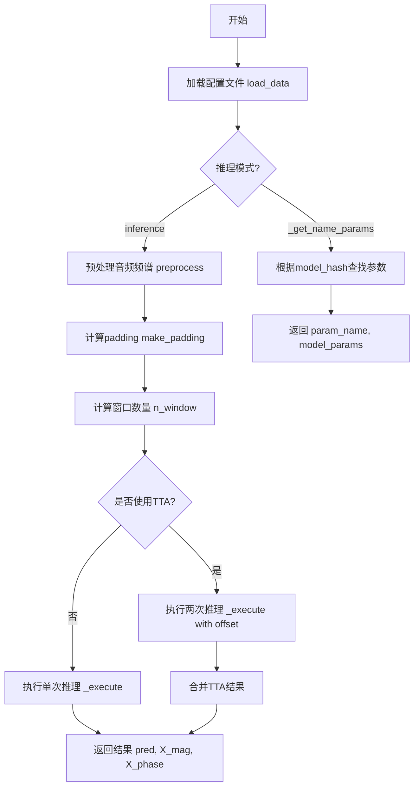
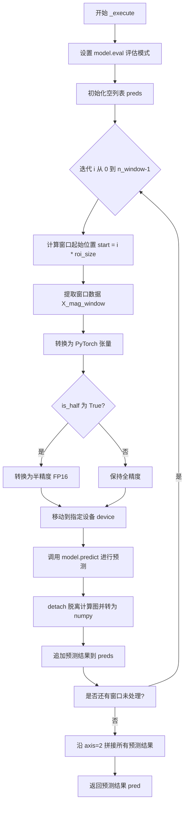
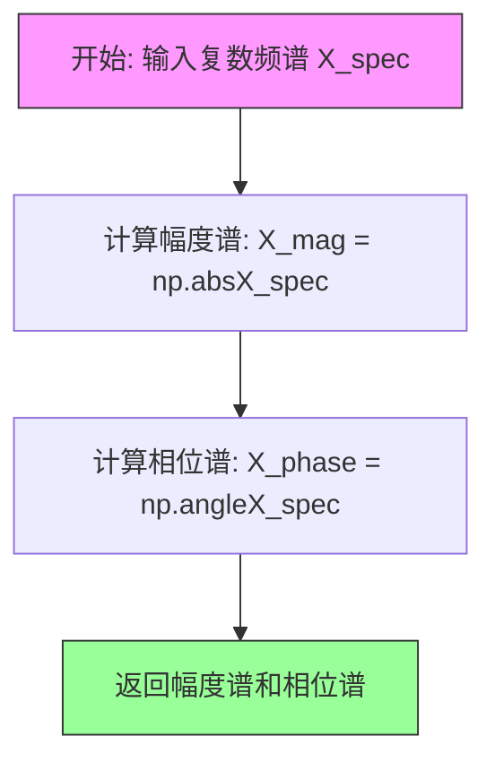
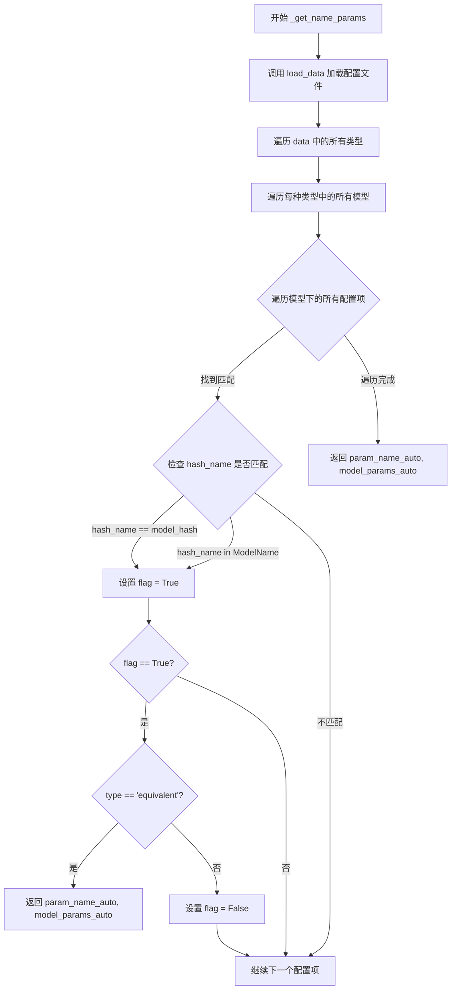

# `Chat-Haruhi-Suzumiya\yuki_builder\video_preprocessing\uvr5\uvr5_pack\utils.py` 详细设计文档

这是一个音频源分离（Audio Source Separation）的推理模块，通过加载预训练的深度学习模型对音频频谱进行处理，实现语音增强或音轨分离功能。核心流程包括：加载模型参数配置、计算音频帧padding、执行模型推理（支持TTA测试时增强）、最终输出分离后的音频频谱。

## 整体流程



## 类结构

```
该文件采用函数式编程风格，无显式类定义
主要包含4个全局函数和2个内部函数
Function Module
├── load_data (全局)
├── make_padding (全局)
├── inference (全局 - 主入口)
│   ├── _execute (内部函数)
│   └── preprocess (内部函数)
└── _get_name_params (全局)
```

## 全局变量及字段


### `file_name`
    
JSON配置文件的路径，用于加载模型参数

类型：`str`
    


### `data`
    
从JSON文件加载的模型参数字典

类型：`dict`
    


### `left`
    
频谱图左侧填充大小

类型：`int`
    


### `roi_size`
    
感兴趣区域的大小，用于滑动窗口

类型：`int`
    


### `right`
    
频谱图右侧填充大小

类型：`int`
    


### `X_spec`
    
输入的复数频谱图

类型：`np.ndarray`
    


### `device`
    
计算设备（CPU或CUDA）

类型：`torch.device`
    


### `model`
    
深度学习模型对象

类型：`object`
    


### `aggressiveness`
    
模型推理的激进程度参数

类型：`float or dict`
    


### `preds`
    
存储每个窗口的预测结果列表

类型：`list[np.ndarray]`
    


### `iterations`
    
迭代次数列表，用于进度条显示

类型：`list[int]`
    


### `total_iterations`
    
总迭代次数

类型：`int`
    


### `start`
    
当前滑动窗口的起始位置

类型：`int`
    


### `X_mag_window`
    
当前窗口的幅度谱张量

类型：`torch.Tensor`
    


### `pred`
    
模型预测结果

类型：`np.ndarray`
    


### `X_mag`
    
幅度谱（频谱图的绝对值）

类型：`np.ndarray`
    


### `X_phase`
    
相位谱（频谱图的角度）

类型：`np.ndarray`
    


### `coef`
    
幅度谱的最大值，用于归一化

类型：`float`
    


### `X_mag_pre`
    
归一化后的幅度谱

类型：`np.ndarray`
    


### `n_frame`
    
频谱图的帧数

类型：`int`
    


### `pad_l`
    
左侧填充大小

类型：`int`
    


### `pad_r`
    
右侧填充大小

类型：`int`
    


### `X_mag_pad`
    
填充后的幅度谱

类型：`np.ndarray`
    


### `is_half`
    
是否使用半精度（FP16）推理

类型：`bool`
    


### `n_window`
    
滑动窗口的总数量

类型：`int`
    


### `pred_tta`
    
测试时增强（TTA）的预测结果

类型：`np.ndarray`
    


### `model_path`
    
模型文件的路径

类型：`str`
    


### `model_hash`
    
模型的哈希值，用于匹配模型参数

类型：`str`
    


### `flag`
    
标志位，表示是否找到匹配的模型

类型：`bool`
    


### `ModelName`
    
模型名称

类型：`str`
    


### `model_params_auto`
    
自动检测的模型参数字典

类型：`dict`
    


### `param_name_auto`
    
自动检测的参数名称

类型：`str`
    


    

## 全局函数及方法


### `load_data`

该函数是一个简单的数据加载工具，用于从指定的JSON配置文件中读取模型参数配置数据。它以文件路径为输入，默认路径为项目自带的`name_params.json`，返回解析后的字典对象。

参数：

- `file_name`：`str`，可选参数，目标JSON文件的路径，默认为`"./uvr5_pack/name_params.json"`

返回值：`dict`，包含从JSON文件解析的配置数据字典

#### 流程图

```mermaid
flowchart TD
    A[开始] --> B[接收file_name参数]
    B --> C{使用open以只读模式打开文件}
    C --> D[使用json.load解析JSON数据]
    D --> E[返回解析后的字典数据}
    E --> F[结束]
    
    C -->|文件路径错误| G[抛出FileNotFoundError异常]
```

#### 带注释源码

```python
def load_data(file_name: str = "./uvr5_pack/name_params.json") -> dict:
    """
    从JSON文件加载模型参数配置数据
    
    参数:
        file_name: 配置文件路径，默认为项目内置的模型参数文件
        
    返回:
        包含模型配置信息的字典
    """
    # 使用上下文管理器打开文件，确保文件正确关闭
    with open(file_name, "r") as f:
        # 使用json模块将文件内容解析为Python字典
        data = json.load(f)

    # 返回解析后的配置数据
    return data
```

#### 设计说明

该函数采用了简洁的单职责设计，作为配置加载的统一入口点。默认参数的设计使得调用方无需显式指定路径即可加载内置配置，体现了"约定优于配置"的设计思想。函数返回字典类型，便于后续代码对配置数据的键值访问。


### `make_padding`

该函数用于计算音频频谱图在推理时的左右填充padding大小，以便将长序列分割成多个等大小的窗口进行处理。

参数：

- `width`：`int`，输入序列的总宽度（帧数）
- `cropsize`：`int`，裁剪窗口大小（即模型期望的输入窗口大小）
- `offset`：`int`，偏移量，用于控制窗口间的重叠

返回值：`tuple(int, int, int)`

- `left`：`int`，左侧填充大小
- `right`：`int`，右侧填充大小
- `roi_size`：`int`，感兴趣区域大小（每个窗口的有效处理长度）

#### 流程图

```mermaid
flowchart TD
    A[开始 make_padding] --> B[left = offset]
    B --> C[roi_size = cropsize - left * 2]
    C --> D{roi_size == 0?}
    D -->|是| E[roi_size = cropsize]
    D -->|否| F[right = roi_size - (width % roi_size) + left]
    E --> F
    F --> G[返回 left, right, roi_size]
    G --> H[结束]
```

#### 带注释源码

```python
def make_padding(width, cropsize, offset):
    """
    计算频谱图padding的左右填充大小
    
    参数:
        width: 输入频谱图的总宽度（帧数）
        cropsize: 模型期望的窗口大小
        offset: 偏移量，控制窗口重叠
    
    返回:
        (left, right, roi_size): 左填充、右填充、感兴趣区域大小
    """
    # 左侧填充大小等于偏移量
    left = offset
    
    # 计算感兴趣区域大小：窗口大小减去左右偏移
    roi_size = cropsize - left * 2
    
    # 如果ROI大小为0（即偏移量过大），则使用完整的窗口大小
    if roi_size == 0:
        roi_size = cropsize
    
    # 计算右侧填充：
    # 1. width % roi_size: 宽度除以ROI的余数（不足以构成完整窗口的部分）
    # 2. roi_size - 余数: 需要填充多少才能填满最后一个窗口
    # 3. 加上left保持左右对称性
    right = roi_size - (width % roi_size) + left

    return left, right, roi_size
```


# inference 函数详细设计文档

## 概述

`inference` 函数是一个音频频谱分离/处理的核心推理函数，通过加载模型对输入的频谱图进行分窗推理，支持TTA（Test-Time Augmentation）增强推理，并返回处理后的预测结果、幅度谱和相位谱。

## 全局函数信息

| 函数名 | 参数 | 返回值 | 描述 |
|--------|------|--------|------|
| `load_data` | `file_name: str` | `dict` | 从JSON文件加载模型配置参数 |
| `make_padding` | `width, cropsize, offset` | `tuple` | 计算音频帧的左右padding值和ROI大小 |
| `inference` | `X_spec, device, model, aggressiveness, data` | `tuple` | 主推理函数，处理频谱图并返回预测结果 |
| `_get_name_params` | `model_path, model_hash` | `tuple` | 根据模型路径和哈希获取模型参数 |

---

### `inference`

该函数是音频处理推理的核心入口，接收频谱图、计算设备、模型实例 aggressiveness 参数和配置数据，通过分窗处理、模型预测和TTA增强（如启用），返回处理后的预测结果、幅度谱和相位谱。

参数：

- `X_spec`：`numpy.ndarray`，输入的复数频谱图，形状通常为 (batch, freq, time)
- `device`：`torch.device`，计算设备（CPU或CUDA）
- `model`：`torch.nn.Module`，训练好的模型实例，需要具备 `predict` 方法和 `offset` 属性
- `aggressiveness`：`float` 或 `dict`，推理 aggressiveness 参数，控制分离强度
- `data`：`dict`，配置字典，需包含 `window_size`、`tta` 等配置项

返回值：`tuple`，包含三个元素：
- 第一个元素：`numpy.ndarray`，处理后的预测结果（复数形式）
- 第二个元素：`numpy.ndarray`，幅度谱
- 第三个元素：`numpy.ndarray`，相位谱（复数指数形式）

#### 流程图

```mermaid
flowchart TD
    A[接收 X_spec, device, model, aggressiveness, data] --> B[预处理: 计算幅度谱和相位谱]
    B --> C[归一化幅度谱: X_mag_pre = X_mag / coef]
    C --> D[计算padding: pad_l, pad_r, roi_size]
    D --> E[padding幅度谱]
    E --> F{检查模型权重类型}
    F -->|float16| G[is_half = True]
    F -->|float32| H[is_half = False]
    G --> I[执行推理 _execute]
    H --> I
    I --> J[截取原始帧长度]
    J --> K{检查 data['tta']}
    K -->|True| L[TTA增强推理]
    K -->|False| M[返回结果]
    L --> N[计算平均并乘以系数]
    N --> O[返回结果]
    M --> O
    
    subgraph _execute子流程
        I --> I1[model.eval]
        I1 --> I2[with torch.no_grad]
        I2 --> I3[遍历每个窗口]
        I3 --> I3a[提取窗口数据]
        I3a --> I3b[转换为tensor并移动到device]
        I3b --> I3c[model.predict]
        I3c --> I3d[收集预测结果]
        I3d --> I3e{还有更多窗口?}
        I3e -->|Yes| I3
        I3e -->|No| I3f[concatenate所有预测]
        I3f --> I4[返回pred]
    end
```

#### 带注释源码

```python
def inference(X_spec, device, model, aggressiveness, data):
    """
    音频频谱分离推理主函数
    
    参数:
        X_spec: 输入的复数频谱图 (batch, freq, time)
        device: torch计算设备
        model: 训练好的模型实例
        aggressiveness: 推理 aggressiveness 参数
        data: 配置字典，需包含 window_size, tta 等
    
    返回:
        tuple: (预测结果, 幅度谱, 相位谱)
    """
    # 定义内部执行函数，处理分窗推理
    def _execute(
        X_mag_pad, roi_size, n_window, device, model, aggressiveness, is_half=True
    ):
        """
        执行实际的模型推理
        
        参数:
            X_mag_pad: padding后的幅度谱
            roi_size: 感兴趣区域大小
            n_window: 窗口数量
            device: 计算设备
            model: 模型实例
            aggressiveness: 推理参数
            is_half: 是否使用半精度推理
        """
        model.eval()  # 设置模型为评估模式
        with torch.no_grad():  # 禁用梯度计算以提高推理效率
            preds = []

            iterations = [n_window]

            total_iterations = sum(iterations)
            # 遍历每个窗口进行推理
            for i in tqdm(range(n_window)):
                start = i * roi_size
                # 提取当前窗口的幅度谱
                X_mag_window = X_mag_pad[
                    None, :, :, start : start + data["window_size"]
                ]
                # 转换为PyTorch张量
                X_mag_window = torch.from_numpy(X_mag_window)
                # 根据is_half决定是否使用半精度
                if is_half:
                    X_mag_window = X_mag_window.half()
                # 移动到指定设备
                X_mag_window = X_mag_window.to(device)

                # 调用模型的predict方法进行预测
                pred = model.predict(X_mag_window, aggressiveness)

                # 将预测结果转移到CPU并转换为numpy数组
                pred = pred.detach().cpu().numpy()
                preds.append(pred[0])

            # 沿时间轴拼接所有窗口的预测结果
            pred = np.concatenate(preds, axis=2)
        return pred

    def preprocess(X_spec):
        """
        预处理：分离幅度谱和相位谱
        
        参数:
            X_spec: 复数频谱图
        
        返回:
            tuple: (幅度谱, 相位谱)
        """
        X_mag = np.abs(X_spec)  # 计算幅度谱
        X_phase = np.angle(X_spec)  # 计算相位谱

        return X_mag, X_phase

    # 步骤1: 预处理 - 分离幅度和相位
    X_mag, X_phase = preprocess(X_spec)

    # 步骤2: 归一化幅度谱，保存最大系数用于后续恢复
    coef = X_mag.max()
    X_mag_pre = X_mag / coef

    # 步骤3: 计算padding参数
    n_frame = X_mag_pre.shape[2]
    pad_l, pad_r, roi_size = make_padding(n_frame, data["window_size"], model.offset)
    n_window = int(np.ceil(n_frame / roi_size))

    # 步骤4: 对幅度谱进行padding
    X_mag_pad = np.pad(X_mag_pre, ((0, 0), (0, 0), (pad_l, pad_r)), mode="constant")

    # 步骤5: 检查模型权重数据类型决定是否使用半精度推理
    if list(model.state_dict().values())[0].dtype == torch.float16:
        is_half = True
    else:
        is_half = False
    
    # 步骤6: 执行第一次推理
    pred = _execute(
        X_mag_pad, roi_size, n_window, device, model, aggressiveness, is_half
    )
    # 截取到原始帧长度
    pred = pred[:, :, :n_frame]

    # 步骤7: 如果启用了TTA (Test-Time Augmentation)，执行增强推理
    if data["tta"]:
        # 调整padding进行TTA
        pad_l += roi_size // 2
        pad_r += roi_size // 2
        n_window += 1

        # 重新padding
        X_mag_pad = np.pad(X_mag_pre, ((0, 0), (0, 0), (pad_l, pad_r)), mode="constant")

        # 执行TTA推理
        pred_tta = _execute(
            X_mag_pad, roi_size, n_window, device, model, aggressiveness, is_half
        )
        # 调整TTA结果以对齐
        pred_tta = pred_tta[:, :, roi_size // 2 :]
        pred_tta = pred_tta[:, :, :n_frame]

        # 返回TTA平均结果并恢复幅度系数
        return (pred + pred_tta) * 0.5 * coef, X_mag, np.exp(1.0j * X_phase)
    else:
        # 返回原始结果并恢复幅度系数
        return pred * coef, X_mag, np.exp(1.0j * X_phase)
```

---

## 关键组件信息

| 组件名称 | 描述 |
|----------|------|
| `X_spec` | 输入的复数频谱图，承载音频的频域信息 |
| `model.predict` | 模型预测方法，接收频谱窗口和 aggressiveness 参数 |
| `model.offset` | 模型偏移量，用于分窗时的偏移计算 |
| `data["window_size"]` | 推理窗口大小，控制每次处理的时间帧数 |
| `data["tta"]` | 测试时增强开关，用于提高推理精度 |
| `_execute` 内部函数 | 执行实际的分窗推理逻辑 |

---

## 潜在技术债务与优化空间

1. **硬编码设备选择**：直接检查 `model.state_dict()` 的第一项来判断半精度，应通过更健壮的方式检测
2. **缺乏错误处理**：函数未对输入数据进行有效性验证（如 NaN、Inf 检查）
3. **TTA 实现效率**：TTA 分支重复计算了 padding 和部分逻辑，可考虑重构以减少代码重复
4. **进度条依赖**：`tqdm` 的使用在某些场景下可能不适合（如无控制台输出环境）
5. **内存占用**：所有窗口预测结果存储在 `preds` 列表中，大音频可能占用大量内存
6. **类型注解缺失**：内部函数 `_execute` 和 `preprocess` 缺少类型注解

---

## 其它项目

### 设计目标与约束
- **目标**：高效处理长音频频谱图，通过分窗和滑动方式降低内存占用
- **约束**：需要模型支持 `predict` 方法和 `offset` 属性，依赖 PyTorch 和 NumPy

### 错误处理与异常设计
- 当前未实现异常捕获，建议添加：
  - 输入类型检查（X_spec 应为 numpy 数组）
  - 模型方法存在性检查
  - 数据字典键值存在性检查

### 数据流与状态机
1. **归一化状态**：幅度谱被归一化到 [0,1]，最后通过系数 `coef` 恢复
2. **Padding 状态**：通过 `make_padding` 计算左右 padding，支持滑动窗口
3. **TTA 状态**：可选的测试时增强，通过偏移窗口实现

### 外部依赖与接口契约
- **依赖库**：`torch`, `numpy`, `tqdm`, `json`
- **模型接口要求**：
  - `model.predict(X_mag_window, aggressiveness)` 方法
  - `model.offset` 属性
  - `model.state_dict()` 可访问权重


### `_execute`

`_execute` 是一个内部函数，负责在填充后的幅度谱上执行实际的模型推理。它通过将频谱分割成多个窗口，对每个窗口分别进行模型预测，最后将所有窗口的预测结果拼接起来得到完整的输出谱。

参数：

- `X_mag_pad`：`numpy.ndarray`，填充后的幅度谱，形状为 (1, freq, time)
- `roi_size`：`int`，感兴趣区域大小，用于确定每个窗口的滑动步长
- `n_window`：`int`，需要处理的窗口总数
- `device`：`torch.device`，用于执行推理的计算设备
- `model`：模型对象，用于执行预测操作
- `aggressiveness`：`dict`，模型的 aggressiveness 参数，控制分离强度
- `is_half`：`bool`，标志位，指示是否使用半精度（FP16）推理

返回值：`numpy.ndarray`，模型预测的幅度谱，形状为 (1, freq, time)

#### 流程图



#### 带注释源码

```python
def _execute(
    X_mag_pad, roi_size, n_window, device, model, aggressiveness, is_half=True
):
    """
    在填充后的幅度谱上执行模型推理
    
    参数:
        X_mag_pad: 填充后的幅度谱 (batch, freq, time)
        roi_size: 感兴趣区域大小
        n_window: 窗口数量
        device: 计算设备
        model: 推理模型
        aggressiveness: 分离 aggressiveness 参数
        is_half: 是否使用半精度推理
    """
    # 设置模型为评估模式，禁用 dropout 和 batch normalization 的训练行为
    model.eval()
    
    # 使用 torch.no_grad() 上下文管理器，禁用梯度计算以节省内存
    with torch.no_grad():
        # 初始化预测结果列表
        preds = []

        # 迭代处理每个窗口
        iterations = [n_window]

        # 计算总迭代次数（用于进度条显示）
        total_iterations = sum(iterations)
        
        # 遍历每个窗口索引
        for i in tqdm(range(n_window)):
            # 计算当前窗口的起始位置
            start = i * roi_size
            
            # 提取当前窗口的幅度谱数据
            # 使用 None 添加 batch 维度
            # 形状: (1, freq, window_size)
            X_mag_window = X_mag_pad[
                None, :, :, start : start + data["window_size"]
            ]
            
            # 将 numpy 数组转换为 PyTorch 张量
            X_mag_window = torch.from_numpy(X_mag_window)
            
            # 如果使用半精度，将张量转换为 FP16
            if is_half:
                X_mag_window = X_mag_window.half()
            
            # 将张量移动到指定设备（CPU/CUDA）
            X_mag_window = X_mag_window.to(device)

            # 调用模型的 predict 方法进行预测
            # 传入幅度谱和 aggressiveness 参数
            pred = model.predict(X_mag_window, aggressiveness)

            # 将预测结果从计算图中分离，并转换为 numpy 数组
            pred = pred.detach().cpu().numpy()
            
            # 将第一个batch的预测结果添加到列表
            preds.append(pred[0])

        # 沿时间轴（axis=2）拼接所有窗口的预测结果
        pred = np.concatenate(preds, axis=2)
    
    # 返回拼接后的预测结果
    return pred
```


### `inference.preprocess`

该函数是`inference`函数内部的嵌套函数，用于将输入的频谱图分解为幅度谱和相位谱，为后续的模型推理做数据预处理。

参数：

- `X_spec`：`numpy.ndarray`，输入的复数频谱图

返回值：

- `X_mag`：`numpy.ndarray`，幅度谱（频谱图的绝对值）
- `X_phase`：`numpy.ndarray`，相位谱（频谱图的角度）

#### 流程图



#### 带注释源码

```python
def preprocess(X_spec):
    """
    将复数频谱图分解为幅度谱和相位谱
    
    参数:
        X_spec: 输入的复数频谱图（复数数组）
    
    返回:
        X_mag: 幅度谱（绝对值）
        X_phase: 相位谱（角度）
    """
    # 使用numpy的abs函数计算复数频谱的幅度（绝对值）
    X_mag = np.abs(X_spec)
    
    # 使用numpy的angle函数计算复数频谱的相位（角度，以弧度为单位）
    X_phase = np.angle(X_spec)
    
    # 返回幅度谱和相位谱，供后续推理流程使用
    return X_mag, X_phase
```


### `_get_name_params`

根据模型路径或哈希值从配置文件中获取对应的模型参数和参数名称。

参数：

- `model_path`：`str`，模型文件的路径
- `model_hash`：`str`，模型的哈希值，用于精确匹配模型

返回值：`tuple`，返回包含参数名称和模型参数的元组 `(param_name_auto, model_params_auto)`

#### 流程图



#### 带注释源码

```python
def _get_name_params(model_path, model_hash):
    """
    根据模型路径或哈希值获取对应的模型参数和参数名称
    
    参数:
        model_path: 模型文件的路径字符串
        model_hash: 模型的哈希值，用于精确匹配模型
    
    返回:
        tuple: (param_name_auto, model_params_auto) 模型参数名称和对应的参数值
    """
    # 加载配置文件 data = load_data()
    data = load_data()
    
    # 标记是否找到匹配
    flag = False
    
    # 将模型路径赋值给 ModelName 变量
    ModelName = model_path
    
    # 遍历配置数据中的所有类型（如: 'equivalent', 'model' 等）
    for type in list(data):
        # 遍历每种类型下的所有模型
        for model in list(data[type][0]):
            # 遍历该模型下的所有配置项
            for i in range(len(data[type][0][model])):
                # 检查配置的 hash_name 是否与 model_hash 精确匹配
                if str(data[type][0][model][i]["hash_name"]) == model_hash:
                    flag = True
                # 或者检查 hash_name 是否包含在 ModelName 路径中
                elif str(data[type][0][model][i]["hash_name"]) in ModelName:
                    flag = True

                # 如果找到匹配
                if flag:
                    # 提取对应的模型参数和参数名称
                    model_params_auto = data[type][0][model][i]["model_params"]
                    param_name_auto = data[type][0][model][i]["param_name"]
                    
                    # 如果类型是 'equivalent'，直接返回结果
                    if type == "equivalent":
                        return param_name_auto, model_params_auto
                    else:
                        # 否则重置标志，继续查找
                        flag = False
    
    # 返回最终找到的参数（可能是最后一个匹配的值）
    return param_name_auto, model_params_auto
```

## 关键组件


### 张量索引与滑动窗口处理

该代码通过滑动窗口方式将大型频谱图切分为多个小窗口进行推理。使用`X_mag_pad[None, :, :, start : start + data["window_size"]]`进行张量索引，每次提取一个窗口大小的数据进行处理，最后通过`np.concatenate(preds, axis=2)`将所有窗口的预测结果拼接起来。这种方式避免了内存溢出问题，同时保持了推理的连续性。

### 反量化支持

代码实现了完整的归一化与反归一化流程。在预处理阶段使用`coef = X_mag.max()`计算最大幅值作为归一化系数，将输入数据归一化到[0,1]范围。推理完成后，使用`pred * coef`将预测结果反量化回原始幅值范围，确保输出结果的物理意义正确。

### 量化策略与混合精度推理

代码通过检查模型权重精度`list(model.state_dict().values())[0].dtype == torch.float16`来判断是否使用半精度推理。当检测到FP16权重时，设置`is_half=True`标志，并在数据送入模型前调用`X_mag_window.half()`进行数据类型转换，以提升推理速度并降低显存占用。

### TTA测试时增强

代码实现了Test-Time Augmentation策略，当`data["tta"]`为True时，会进行两次推理：第一次使用原始padding，第二次使用偏移`roi_size // 2`的padding。第二次推理结果经过裁剪后与第一次结果取平均`return (pred + pred_tta) * 0.5 * coef`，通过时域偏移增强提升分离效果的稳定性。

### 频谱预处理与相位恢复

在`preprocess`函数中使用`np.abs(X_spec)`提取幅度谱，`np.angle(X_spec)`提取相位谱。推理完成后使用`np.exp(1.0j * X_phase)`将相位转换为复数形式，与幅度谱结合重建完整的频谱表示，保持音频的相位信息。

### 模型参数动态加载

`_get_name_params`函数通过模型哈希值或文件名在JSON配置文件中查找对应的模型参数。包括`model_params`和`param_name`两个关键参数，支持多种模型类型（equivalent等）的参数动态配置。


## 问题及建议


### 已知问题

- **错误处理缺失**：`load_data`未处理文件不存在或JSON解析错误的情况；`_get_name_params`在未找到匹配模型时可能返回未定义的变量`param_name_auto`和`model_params_auto`
- **类型注解不完整**：多个函数参数缺少类型注解（如`inference`中的`X_spec`、`device`、`model`、`aggressiveness`），`inference`函数也没有返回类型注解
- **内部函数重复创建**：`inference`函数内部定义的`_execute`和`preprocess`在每次调用`inference`时都会重新创建，造成不必要的开销
- **循环内Tensor创建**：`_execute`函数的主循环中每次迭代都执行`torch.from_numpy`、`half()`和`to(device)`操作，未进行批处理优化
- **模型属性假设未验证**：代码直接使用`model.offset`和`model.predict`方法，以及`model.state_dict()`，未验证这些属性和方法是否存在
- **数据字典键未验证**：`data["window_size"]`、`data["tta"]`等键直接访问，若缺失会导致KeyError
- **嵌套循环过深**：`_get_name_params`包含三层嵌套循环和复杂的flag状态管理，逻辑难以维护
- **魔法数字**：系数`0.5`和`1.0`等硬编码数值应提取为命名常量
- **变量命名不一致**：部分变量命名风格不统一，如`is_half`与`aggressiveness`
- **资源未显式释放**：文件操作未使用`with`上下文管理器（虽然函数内用了，但整体缺少finally清理机制）

### 优化建议

- 为`inference`和`_get_name_params`等函数添加完整的类型注解和详细的文档字符串
- 将内部函数`_execute`和`preprocess`提取到模块级别，避免重复创建
- 实现批量推理：将多个window合并为一个批次进行处理，减少GPU传输次数
- 添加数据验证层：使用`pydantic`或手动验证`data`字典的必要键和类型
- 重构`_get_name_params`：使用字典推导式或更清晰的数据结构简化查找逻辑，为未找到模型的情况返回默认值或抛出明确异常
- 将硬编码的数值（如`0.5`、`1.0`）提取为模块级常量
- 添加异常处理：捕获文件IO异常、模型加载异常和推理过程中的异常
- 考虑将`is_half`检查移至函数外部，避免每次推理都检查模型精度


## 其它


### 设计目标与约束

本模块作为音频源分离推理引擎的核心组件，主要目标是将音频频谱数据输入模型，输出分离后的音频成分。设计约束包括：1) 支持CPU和GPU推理，默认使用float16加速；2) 模型输入窗口大小固定，需通过分帧处理长音频；3) 支持TTA(Test-Time Augmentation)增强推理以提升质量；4) 配置通过JSON文件动态加载，支持多种模型hash匹配。

### 错误处理与异常设计

代码中主要存在以下异常场景及处理机制：1) JSON配置文件读取失败(FileNotFoundError, JSONDecodeError)会导致程序终止，需在load_data添加try-except并提供默认值或明确错误信息；2) 模型文件不存在或hash不匹配时_get_name_params可能返回未定义的param_name_auto，需添加默认值或抛出明确异常；3) 音频数据维度不匹配或为空时可能导致np.pad和后续推理失败，需添加输入验证；4) GPU内存不足时模型推理可能抛出RuntimeError，建议添加内存检查和分块处理。

### 数据流与状态机

数据流转过程如下：1) 加载JSON配置数据；2) 输入原始复数频谱X_spec；3) 预处理阶段：提取幅度谱X_mag和相位谱X_phase；4) 幅度归一化：X_mag_pre = X_mag / coef；5) 分帧padding计算：根据window_size和offset计算pad_l, pad_r；6) 填充后的幅度谱X_mag_pad；7) 分窗口推理：循环调用model.predict；8) 结果拼接和裁剪；9) 可选的TTA增强处理；10) 最终输出：(pred * coef, X_mag, np.exp(1.0j * X_phase))。

### 外部依赖与接口契约

本模块依赖以下外部组件：1) PyTorch框架 - 模型推理引擎，要求torch.no_grad()推理上下文；2) NumPy - 数值计算和数组操作；3) tqdm - 进度条显示；4) JSON配置文件 - 模型参数映射；5) 外部model对象 - 需实现predict方法，接收(X_mag_window, aggressiveness)参数，返回预测结果；6) 设备对象device - PyTorch设备(CPU/CUDA)。接口契约：inference函数接收(X_spec, device, model, aggressiveness, data)返回(pred, X_mag, X_phase)。

### 性能考虑与优化空间

当前实现存在以下性能瓶颈：1) 循环内频繁的torch.from_numpy和tensor.to(device)转换，建议批量处理；2) np.concatenate操作可能产生内存拷贝，对于长音频可考虑预分配数组；3) TTA模式重复计算，理论上可合并；4) 未使用JIT编译优化；5) 建议：对于超长音频可采用流式处理；可添加缓存机制避免重复计算pad和归一化系数；model.predict调用可考虑使用torch.jit.script加速。

### 配置参数说明

data字典应包含以下关键配置：1) window_size - 推理窗口大小，需与模型训练时一致；2) tta - 布尔值，是否启用TTA增强；3) model_params - 模型特定参数；4) param_name - 参数名称；5) equivalent - 是否为等效模型类型。model对象需具备：1) offset属性 - 分帧偏移量；2) state_dict()方法 - 用于判断数据类型；3) predict方法 - 执行实际推理。

### 使用示例与调用流程

典型调用流程：1) 准备复数频谱数据X_spec(shape: [2, freq, time])；2) 加载配置：data = load_data()；3) 获取模型参数：param_name, model_params = _get_name_params(model_path, model_hash)；4) 执行推理：result = inference(X_spec, device, model, aggressiveness, data)；5) result[0]为分离后的幅度谱，result[1]为原始幅度谱，result[2]为相位谱，可通过istft转换回时域信号。

    