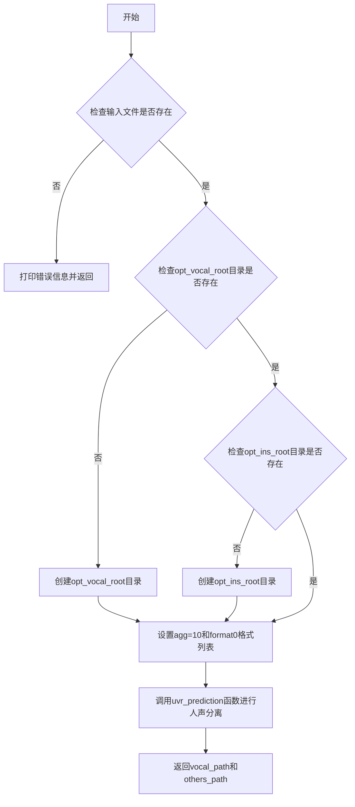
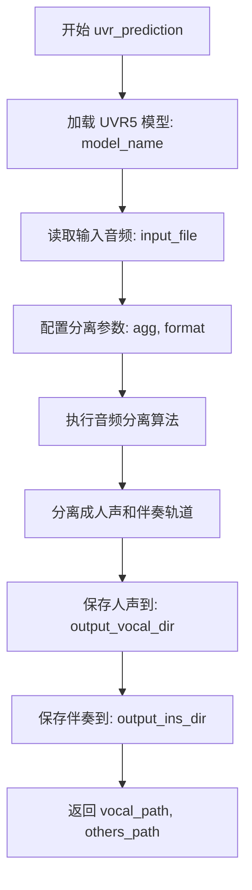

# `Chat-Haruhi-Suzumiya\yuki_builder\video_preprocessing\video_process.py` 详细设计文档

这是一个BGM（背景音乐）去除工具，通过调用UVR5模型将音频文件分离成人声和伴奏两部分，并支持多种音频格式（wav、flac、mp3、m4a）的处理。

## 整体流程



## 类结构

```
run_bgm_remover (主函数)
├── 参数检查模块
├── 目录创建模块
└── UVR5音频分离模块
```

## 全局变量及字段


### `agg`
    
人声提取激进程度，值为10

类型：`int`
    


### `format0`
    
支持的音频格式列表 ['wav', 'flac', 'mp3', 'm4a']

类型：`list`
    


### `vocal_path`
    
人声输出文件路径

类型：`str`
    


### `others_path`
    
伴奏输出文件路径

类型：`str`
    


    

## 全局函数及方法


### `run_bgm_remover`

该函数是BGM去除模块的主处理函数，接收命令行参数（Namespace），验证输入文件和输出目录的有效性，调用UVR5模型进行人声与伴奏分离，并返回分离后的人声路径和伴奏路径。

参数：

- `args`：`Namespace`，命令行参数对象，包含以下属性：
  - `input_file`：输入音频文件路径
  - `opt_vocal_root`：人声输出目录路径
  - `opt_ins_root`：乐器输出目录路径

返回值：`tuple`，返回包含两个路径的元组
- `vocal_path`：人声部分的输出文件路径
- `others_path`：伴奏/乐器部分的输出文件路径

#### 流程图

```mermaid
flowchart TD
    A([开始]) --> B{检查 input_file 是否存在}
    B -->|否| C[打印错误信息: input_file is not exist]
    C --> D[返回]
    B -->|是| E{检查 opt_vocal_root 是否为目录}
    E -->|否| F[删除并重建目录]
    F --> G{检查 opt_ins_root 是否为目录}
    E -->|是| G
    G -->|否| H[删除并重建目录]
    G -->|是| I[设置 agg=10]
    H --> I
    I --> J[设置 format0 = ['wav', 'flac', 'mp3', 'm4a']]
    J --> K[调用 uvr_prediction 函数]
    K --> L[返回 vocal_path, others_path]
    L --> M([结束])
```

#### 带注释源码

```python
def run_bgm_remover(args: Namespace):
    """
    BGM去除主处理函数
    接收命令行参数，执行人声与伴奏分离逻辑
    
    参数:
        args: Namespace对象，包含input_file, opt_vocal_root, opt_ins_root
    
    返回:
        tuple: (vocal_path, others_path) 人声和伴奏的输出路径
    """

    # ========== 输入验证阶段 ==========
    
    # 检查输入文件是否存在
    if not os.path.isfile(args.input_file):
        print('input_file is not exist')
        return  # 文件不存在则直接返回

    # 检查人声输出目录是否存在，不存在则创建
    if not os.path.isdir(args.opt_vocal_root):
        print('warning opt_vocal_root is not exist')
        # 先清理可能存在的同名文件/目录
        shutil.rmtree(args.opt_vocal_root, ignore_errors=True)
        # 创建目录
        os.makedirs(args.opt_vocal_root, exist_ok=True)
        print('create folder', args.opt_vocal_root)
    
    # 检查乐器输出目录是否存在，不存在则创建
    if not os.path.isdir(args.opt_ins_root):
        print('warning opt_ins_root is not exist')
        # 先清理可能存在的同名文件/目录
        shutil.rmtree(args.opt_ins_root, ignore_errors=True)
        # 创建目录
        os.makedirs(args.opt_ins_root, exist_ok=True)
        print('create folder', args.opt_ins_root)

    # ========== 参数设置阶段 ==========
    
    # 人声提取激进程度，数值越大分离越激进
    agg = 10
    
    # 支持的音频格式列表
    format0 = ["wav", "flac", "mp3", "m4a"]
    
    # ========== 核心处理阶段 ==========
    
    # 调用UVR5模型进行人声与伴奏分离
    # 参数说明:
    #   uvr5_names[5]: 使用的UVR5模型名称/索引
    #   args.input_file: 输入音频文件路径
    #   args.opt_vocal_root: 人声输出目录
    #   args.opt_ins_root: 乐器输出目录
    #   agg: 分离激进程度
    #   format0[0]: 输出格式为wav
    vocal_path, others_path = uvr_prediction(
        uvr5_names[5], 
        args.input_file,
        args.opt_vocal_root,
        args.opt_ins_root,
        agg,
        format0[0]
    )

    # ========== 返回结果 ==========
    
    return vocal_path, others_path
```


### `uvr_prediction`

这是来自 `.uvr5` 模块的音频分离核心函数，负责将输入音频文件分离为人声（ vocals）和伴奏/乐器（instrumental）两部分。

参数：

- `model_name`：`str`，模型名称或路径，对应 `uvr5_names` 中的第5个元素
- `input_file`：`str`，待分离的输入音频文件路径
- `output_vocal_dir`：`str`，人声部分的输出目录
- `output_ins_dir`：`str`，伴奏/乐器部分的输出目录
- `agg`：`int`，人声提取激进程度参数，数值越大分离越激进
- `format`：`str`，输出音频格式，如 "wav", "flac", "mp3", "m4a"

返回值：`(tuple)`，返回元组 `(vocal_path, others_path)`

- `vocal_path`：`str`，分离后人声文件的保存路径
- `others_path`：`str`，分离后伴奏/其他声音文件的保存路径

#### 流程图



#### 带注释源码

```python
# uvr_prediction 函数调用示例 (来自 run_bgm_remover 函数)
# 该函数定义在 .uvr5 模块中，此处展示调用方式

# 参数说明：
# uvr5_names[5]    - 选择第5个预训练模型（如 'HP2_all_vocals' 或类似模型名称）
# args.input_file  - 输入的音频文件路径（支持 wav, flac, mp3, m4a 格式）
# args.opt_vocal_root - 输出人声文件的根目录
# args.opt_ins_root   - 输出伴奏/乐器文件的根目录
# agg = 10          - 人声提取激进程度，数值范围通常为 0-100，值越大越激进
# format0[0] = 'wav' - 输出格式为 WAV

vocal_path, others_path = uvr_prediction(
    uvr5_names[5],           # str: 模型名称/路径
    args.input_file,         # str: 输入音频文件路径
    args.opt_vocal_root,    # str: 人声输出目录
    args.opt_ins_root,      # str: 伴奏输出目录
    agg,                     # int: 激进程度参数
    format0[0]               # str: 输出格式
)
```

> **注意**：由于 `uvr_prediction` 函数定义在 `.uvr5` 模块内部，以上参数类型和返回值信息是基于调用代码进行的合理推断。如需获取精确的函数签名，建议查看 `.uvr5` 模块的源代码。


### `uvr5_names`

`uvr5_names` 是从 `.uvr5` 模块导入的模型名称列表，用于人声与伴奏分离任务。在代码中通过索引（如 `uvr5_names[5]`）获取特定的模型名称，然后传递给 `uvr_prediction` 函数进行音频处理。

参数： 无（该对象为列表类型，非函数）

返回值： 当通过索引访问时，返回 `str`（字符串类型），表示对应的模型名称

#### 流程图

```mermaid
flowchart TD
    A[导入 uvr5_names] --> B[检查索引有效性]
    B --> C{索引是否在范围内}
    C -->|是| D[返回对应模型名称字符串]
    C -->|否| E[抛出索引异常]
    
    F[调用 uvr_prediction] --> G[使用 uvr5_names[index] 作为模型参数]
    G --> H[执行人声提取]
```

#### 带注释源码

```python
# 从 .uvr5 模块导入 uvr_prediction 函数和 uvr5_names 列表
from .uvr5 import uvr_prediction, uvr5_names

# ... 其他代码 ...

# 在 run_bgm_remover 函数中使用 uvr5_names
# uvr5_names 是一个列表，存储了多个模型名称
# 通过索引 [5] 获取第6个模型（索引从0开始）
vocal_path, others_path = uvr_prediction(
    uvr5_names[5],      # 模型名称字符串，通过索引访问列表获取
    args.input_file,   # 输入音频文件路径
    args.opt_vocal_root,  # 人声输出目录
    args.opt_ins_root,    # 伴奏输出目录
    agg,                # 激进程度参数
    format0[0]          # 输出格式
)
```

#### 补充说明

| 项目 | 说明 |
|------|------|
| **来源模块** | `.uvr5`（本地模块） |
| **数据类型** | `List[str]` - 字符串列表 |
| **使用方式** | 通过索引访问，如 `uvr5_names[5]` |
| **用途** | 为 `uvr_prediction` 函数提供模型选择参数 |
| **外部依赖** | 需要 `.uvr5` 模块正确定义该列表 |

#### 潜在的技术债务

1. **硬编码索引问题**：代码中使用 `uvr5_names[5]` 硬编码了索引值，如果模型列表顺序发生变化，会导致使用错误的模型
2. **缺乏默认值验证**：未检查索引是否越界，访问 `uvr5_names[5]` 时可能抛出 `IndexError`
3. **魔法数字**：数字 `5` 缺乏注释说明，可读性差
4. **模块依赖隐式**：虽然导入了 `uvr5_names`，但没有提供文档说明该列表的完整内容和使用方式

## 关键组件


### uvr_prediction

uvr5音频处理模块的核心预测函数，负责执行人声与伴奏的分离，返回处理后的音频文件路径。

### uvr5_names

预定义的uvr5模型名称列表，用于指定不同的人声提取模型和参数配置。

### run_bgm_remover

主处理函数，负责验证输入输出路径、调用uvr_prediction执行音频分离，并返回分离后的人声和伴奏文件路径。

### 文件路径校验与目录创建模块

负责检查输入文件是否存在、验证输出目录有效性，并在目录不存在时自动创建对应的人声和伴奏输出目录。

### 命令行参数解析器

使用argparse构建的参数解析模块，定义input_file、opt_vocal_root、opt_ins_root三个核心参数，用于接收用户指定的源文件路径和人声/伴奏输出目录。


## 问题及建议


### 已知问题

- **逻辑错误**：第14-19行存在冗余逻辑。当`opt_vocal_root`不存在时（`if not os.path.isdir`为True），无需先执行`shutil.rmtree`删除操作，直接`os.makedirs`即可。
- **硬编码参数**：`agg=10`和`format0`数组被硬编码在函数内部，降低了代码的灵活性和可测试性，应作为参数传入或使用配置文件。
- **缺少错误处理**：`uvr_prediction`函数调用没有异常捕获，若模型加载或推理失败，程序会直接崩溃。
- **参数校验不足**：没有校验输入文件的扩展名是否在支持格式列表中，也没有对输出路径做合法性检查（如路径字符是否合法、是否可写等）。
- **返回值未使用**：`run_bgm_remover`返回`vocal_path`和`others_path`，但在`__main__`入口处没有接收和处理这些返回值。
- **魔法数字**：`uvr5_names[5]`使用索引访问，没有明确说明该索引对应的模型名称，代码可读性差。
- **目录删除风险**：`shutil.rmtree`在目录不存在时虽被`ignore_errors=True`掩盖，但若路径存在且为非空目录则会递归删除，有潜在误删风险。

### 优化建议

- 移除第18行和第26行的`shutil.rmtree`调用，直接在目录不存在时创建。
- 将`agg`和`format`作为函数参数或配置项，提升可配置性。
- 添加`try-except`块捕获`uvr_prediction`的异常，并给出友好提示。
- 在处理前校验输入文件扩展名是否在`format0`列表中。
- 在`__main__`中接收并打印或保存函数返回值。
- 使用命名常量或枚举替代`uvr5_names[5]`的索引访问，如定义`MODEL_INDEX = 5`并加注释说明。
- 使用`logging`模块替代`print`语句，便于日志级别管理和输出控制。


## 其它


### 设计目标与约束

本项目旨在实现一个基于UVR5模型的音频人声与伴奏分离工具，能够将输入的音频文件分离为人声轨道和伴奏/乐器轨道。设计约束包括：支持主流音频格式（wav、flac、mp3、m4a）、输出结果保存至指定目录、使用预定义的UVR5模型进行分离处理。

### 错误处理与异常设计

代码中包含以下错误处理机制：输入文件不存在时打印错误信息并返回；输出目录不存在时自动创建目录。对于uvr_prediction函数的调用未进行异常捕获，假设其内部已处理相关异常。潜在改进：添加try-except块捕获文件读写异常、音频格式不支持异常、磁盘空间不足等情况的处理。

### 数据流与状态机

数据流如下：命令行参数输入 → 参数验证（文件/目录检查） → 目录创建（如需要） → uvr_prediction调用 → 返回人声路径和伴奏路径 → 流程结束。状态机包含三个状态：初始化状态（参数解析）、验证状态（检查输入输出路径）、处理状态（执行音频分离）。

### 外部依赖与接口契约

主要外部依赖包括：uvr5模块（uvr_prediction函数和uvr5_names列表）、os和shutil标准库（文件操作）、argparse模块（命令行参数处理）。uvr_prediction接口契约：输入参数为模型名称、输入文件路径、输出人声目录、输出伴奏目录、激进程度值、音频格式；返回值为人声路径和伴奏路径的元组。

### 配置参数说明

关键配置参数包括：agg（人声提取激进程度，值为10）、format0（支持的音频格式列表["wav", "flac", "mp3", "m4a"]）、模型选择（uvr5_names[5]）。这些参数目前为硬编码值，可考虑提取为配置文件或命令行可选参数以提高灵活性。

### 输入输出规格

输入：单个音频文件路径（--input_file参数）。输出：两个音频文件，分别代表人声轨道（保存在opt_vocal_root目录）和伴奏轨道（保存在opt_ins_root目录）。输出文件格式为wav格式。

### 性能考虑

当前实现为同步处理，未使用多线程或批量处理。对于大文件音频处理可能耗时较长，潜在优化方向：添加进度显示、考虑异步处理、添加批量处理能力以处理多个音频文件。

### 安全性考虑

代码在创建目录前使用shutil.rmtree清理可能存在的旧目录，存在误删风险。建议添加确认机制或使用更安全的目录创建方式。此外，未对输入路径进行路径遍历攻击防护，应对用户输入的路径进行安全验证。

### 兼容性说明

代码依赖uvr5模块，需要确保该模块已正确安装并与当前Python版本兼容。目标Python版本建议为3.7及以上，以支持类型注解的使用。

### 使用示例

```bash
python script_name.py --input_file /path/to/audio.mp3 --opt_vocal_root ./vocal_output --opt_ins_root ./instrument_output
```

该命令将音频文件分离为人声和伴奏两部分，分别保存到指定目录。


    