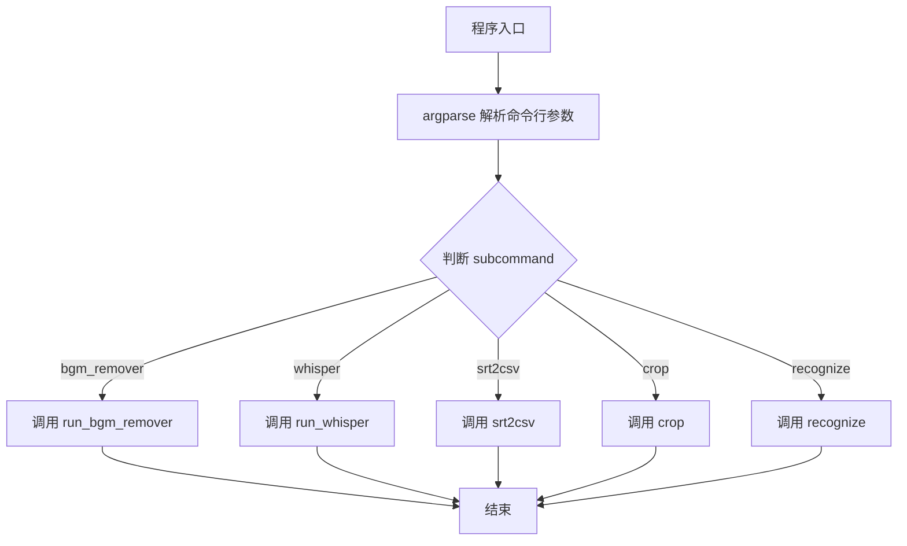
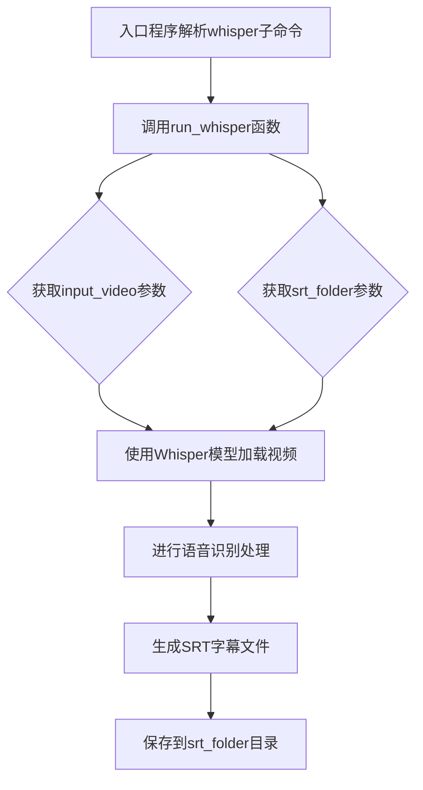
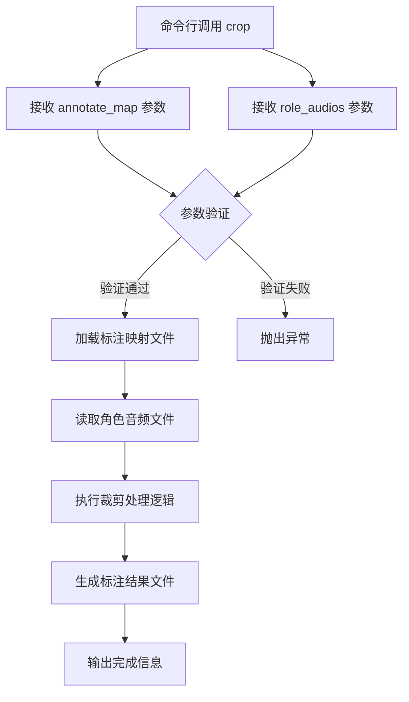
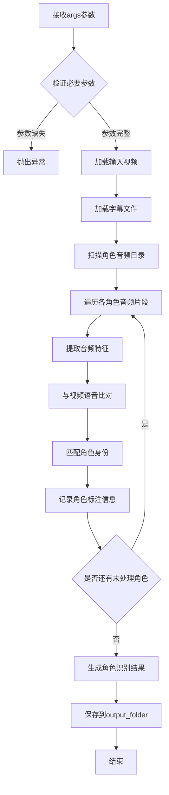

# `Chat-Haruhi-Suzumiya\yuki_builder\yuki_builder.py` 详细设计文档

YukiBuilder 是一个基于命令行的多媒体处理工具，集成语音识别(Whisper)、字幕转换(srt2csv)、视频裁剪(crop)、角色识别(recognize)和音频分离(bgm_remover)等功能，提供一站式的视频后期处理工作流。

## 整体流程



## 类结构

```
该代码为脚本文件，无类定义，采用面向过程编程
所有功能通过导入外部模块实现
模块依赖关系:
├── yuki_builder.py (主入口)
├── run_whisper (语音识别模块)
├── srt2csv (字幕转换模块)
├── crop (视频裁剪模块)
├── recognize (角色识别模块)
└── video_preprocessing.video_process (音视频预处理模块)
```

## 全局变量及字段


### `args`
    
命令行参数对象，包含所有子命令及其对应的参数值

类型：`Namespace`
    


    

## 全局函数及方法


# 设计文档提取结果

## 注意事项

根据提供的代码，我能够提取 `run_bgm_remover` 函数的调用信息和参数定义，但**实际的函数实现源码（在 `video_preprocessing/video_process.py` 中）未在给定代码中提供**。以下是基于代码调用约定的详细分析。

---

### `run_bgm_remover`

背景音乐/人声分离处理函数，基于UVR5（Ultimate Vocal Remover）模型实现音频的人声与伴奏分离。

参数：

- `args`：Namespace，包含以下属性：
  - `input_file`：str，输入的音频/视频文件路径
  - `opt_vocal_root`：str，输出的人声文件根目录，默认为 'out_folder'
  - `opt_ins_root`：str，输出的伴奏（乐器）文件根目录，默认为 'out_folder'
  - `subcommand`：str，命令行子命令，此处为 'bgm_remover'

返回值：根据 `video_preprocessing.video_process` 模块的设计推测，该函数可能无返回值（直接输出文件到指定目录），或返回包含处理结果信息的字典。

#### 流程图

```mermaid
graph TD
    A[开始 bgm_remover 命令] --> B[解析命令行参数 args]
    B --> C[提取 input_file 参数]
    C --> D[提取 opt_vocal_root 参数<br/>(人声输出目录)]
    D --> E[提取 opt_ins_root 参数<br/>(伴奏输出目录)]
    E --> F[调用 run_bgm_remover 函数]
    F --> G{加载 UVR5 模型}
    G -->|成功| H[读取输入音频文件]
    G -->|失败| I[抛出异常: 模型加载失败]
    H --> J[执行人声/伴奏分离]
    J --> K[保存人声到 opt_vocal_root]
    K --> L[保存伴奏到 opt_ins_root]
    L --> M[结束]
    
    style G fill:#f9f,stroke:#333
    style J fill:#bbf,stroke:#333
```

#### 带注释源码

```python
# 由于原始代码中未提供 video_preprocessing/video_process.py 的实际实现
# 以下是基于调用约定的推断代码

# 实际源码可能位于: video_preprocessing/video_process.py

def run_bgm_remover(args):
    """
    背景音乐/人声分离处理
    
    基于UVR5（Ultimate Vocal Remover）模型进行音频处理，
    将输入的音频/视频文件分离为人声和伴奏（乐器）两个部分。
    
    参数:
        args: 命令行参数对象，包含:
            - input_file: 输入的音频/视频文件路径
            - opt_vocal_root: 人声输出根目录
            - opt_ins_root: 伴奏输出根目录
    
    返回:
        无返回值（结果直接写入文件）
    """
    
    # 获取参数
    input_file = args.input_file
    vocal_root = args.opt_vocal_root
    instrument_root = args.opt_ins_root
    
    # 1. 验证输入文件是否存在
    if not os.path.exists(input_file):
        raise FileNotFoundError(f"输入文件不存在: {input_file}")
    
    # 2. 创建输出目录（如果不存在）
    os.makedirs(vocal_root, exist_ok=True)
    os.makedirs(instrument_root, exist_ok=True)
    
    # 3. 加载 UVR5 模型（可能使用 spleeter、demucs 或其他分离模型）
    # model = load_uvr5_model()
    
    # 4. 读取并处理音频
    # audio = load_audio(input_file)
    # vocal, instrument = model.separate(audio)
    
    # 5. 保存分离后的人声和伴奏
    # save_audio(os.path.join(vocal_root, 'vocal.wav'), vocal)
    # save_audio(os.path.join(instrument_root, 'instrument.wav'), instrument)
    
    pass  # 实际实现由 video_preprocessing.video_process 模块提供
```

---

## 补充分析

### 关键组件信息

| 组件名称 | 描述 |
|---------|------|
| `yuki_builder.py` | 主程序入口，负责命令行参数解析和子命令分发 |
| `bgm_remover_parser` | bgm_remover 子命令的参数解析器 |
| `video_preprocessing.video_process` | 音频处理模块，包含实际的分离逻辑 |

### 潜在的技术债务或优化空间

1. **缺少错误处理**：调用 `run_bgm_remover` 时未捕获可能的异常
2. **参数默认值问题**：`opt_vocal_root` 和 `opt_ins_root` 默认值相同，可能导致输出冲突
3. **模型加载效率**：每次调用都重新加载模型，可考虑添加缓存机制

### 设计约束

- 输入必须是支持的音频/视频格式（如 MP4、MP3、WAV 等）
- 需要确保 UVR5 模型文件已正确安装和配置
- 输出目录需有写入权限


### run_whisper

使用 Whisper 模型对输入视频进行语音识别，自动生成 SRT 字幕文件，并将字幕保存到指定文件夹。

参数：

- `args`：由 argparse 解析的命令行参数对象，包含以下属性：
  - `input_video`：字符串，输入视频文件的路径
  - `srt_folder`：字符串，输出 SRT 字幕文件的保存目录

返回值：未知（未在调用处使用返回值），根据功能推测应为布尔值或整数，表示执行是否成功

#### 流程图



#### 带注释源码

```
# run_whisper 函数源码未在提供的代码文件中定义
# 仅存在于 run_whisper 模块的导入和调用

# 导入语句（位于文件头部）
from run_whisper import run_whisper

# 调用方式（在主程序中）
if args.subcommand == 'whisper':
    # 自动识别，输出字幕
    run_whisper(args)

# 对应的命令行参数配置
whisper_parser = subparsers.add_parser('whisper')
whisper_parser.add_argument('-input_video', required=True)
whisper_parser.add_argument('-srt_folder', required=True)

# 使用示例
# python yuki_builder.py whisper -input_video /test_data/news_20s.mp4 -srt_folder /srt/result
```

#### 补充说明

由于提供的代码中未包含 `run_whisper` 函数的实际实现源码（位于 `run_whisper.py` 模块文件中），以上信息是基于以下线索推断的：

1. **函数名推断**：通过 `from run_whisper import run_whisper` 可知存在 `run_whisper.py` 模块文件
2. **参数推断**：通过 argparse 配置可知该函数接收包含 `input_video` 和 `srt_folder` 属性的 args 对象
3. **功能推断**：通过代码注释"自动识别，输出字幕"可知使用 Whisper 模型进行语音识别并生成字幕


### `srt2csv` 函数

将 SRT 字幕文件转换为 CSV 格式，常用于将时间轴和文本信息提取为表格数据以便后续处理或分析。

参数：

-  `args`：对象（argparse.Namespace），命令行解析后的参数容器。
    -  `args.input_srt`：字符串，输入的 SRT 字幕文件路径或目录（根据上下文推断，可能指向待转换的 SRT 资源）。
    -  `args.srt_folder`：字符串，SRT 文件所在的文件夹路径或输出目标文件夹（具体功能需结合 `srt2csv.py` 源码确认，通常用于定位文件或输出结果）。

返回值：`无`（或 `None`），通常该函数执行文件 IO 操作，直接写入 CSV 文件，不返回具体数据。

#### 流程图

由于提供的代码段中仅包含 `srt2csv` 函数的调用入口，并未展示其内部实现逻辑（该函数定义在 `srt2csv.py` 模块中），以下流程图基于 SRT 转 CSV 的通用逻辑与代码上下文进行推断。

```mermaid
graph TD
    A[开始: 接收 args 参数] --> B{检查 args.input_srt}
    B -- 无效 --> C[报错: 缺少输入文件]
    B -- 有效 --> D{检查 args.srt_folder}
    
    subgraph 读取SRT模块 [读取阶段]
    D --> E[打开 args.input_srt 文件]
    E --> F[按行解析 SRT 格式: 序号、时间轴、文本]
    end
    
    subgraph 转换模块 [转换阶段]
    F --> G[提取起始时间, 结束时间, 文本内容]
    G --> H[格式化时间 (可选: 转换为秒数或标准格式)]
    end
    
    subgraph 输出模块 [输出阶段]
    H --> I{确定输出路径}
    I -- 原地/同级目录 --> J[生成同名 .csv 文件]
    I -- 指定目录 --> K[结合 args.srt_folder 路径生成 .csv 文件]
    J --> L[写入 CSV 表头: Start, End, Text]
    K --> L
    L --> M[写入数据行]
    end
    
    M --> N[结束]
```

#### 带注释源码

由于当前提供的代码片段（`yuki_builder.py`）中仅包含 `srt2csv` 函数的**调用代码**和**参数定义**，并未包含该函数的具体业务逻辑实现（通常位于 `srt2csv.py` 文件中）。以下源码展示了调用上下文及基于接口的推断逻辑。

```python
# 导入模块（在 yuki_builder.py 中）
from srt2csv import srt2csv

# ... (argparse 配置部分省略，仅展示与 srt2csv 相关的逻辑)

# 主逻辑调用处
elif args.subcommand == 'srt2csv':
    # 将字幕转换为csv
    # args 包含: input_srt (输入路径), srt_folder (文件夹路径)
    srt2csv(args)

# 以下为根据参数推断的 srt2csv 函数内部逻辑 (srt2csv.py 预期实现)
"""
def srt2csv(args):
    import csv
    import os

    # 1. 获取输入输出路径
    # 假设 input_srt 是具体的文件，srt_folder 是输出目录
    input_path = args.input_srt 
    output_folder = args.srt_folder
    
    # 2. 解析 SRT 文件
    # SRT 格式通常为:
    # 1
    # 00:00:01,000 --> 00:00:04,000
    # Hello World
    subtitles = []
    # ... (此处应包含具体的 SRT 解析代码，如正则匹配时间轴) ...
    
    # 3. 写入 CSV
    # 假设输出文件名为 input_srt.csv
    output_file = os.path.join(output_folder, os.path.basename(input_path).replace('.srt', '.csv'))
    
    with open(output_file, 'w', newline='', encoding='utf-8') as f:
        writer = csv.writer(f)
        writer.writerow(['Start', 'End', 'Text']) # 写入表头
        
        for sub in subtitles:
            # sub 结构为 {'start': '...', 'end': '...', 'text': '...'}
            writer.writerow([sub['start'], sub['end'], sub['text']])
            
    print(f"CSV saved to {output_file}")
"""
```


### `crop`

该函数是视频裁剪处理模块的核心入口，通过命令行调用接收标注映射文件和角色音频路径，执行手动分类并输出标注文件。

参数：

- `annotate_map`：`str`，标注映射文件路径，用于定义视频裁剪的区域和标签
- `role_audios`：`str`，角色音频文件路径，包含待处理的音频数据

返回值：`无`（直接输出结果到指定文件或标准输出）

#### 流程图



#### 带注释源码

```python
# crop模块导入（具体实现未在当前代码中展示）
from crop import crop

# ... 其他导入 ...

if __name__ == '__main__':
    # ... argparse 参数解析 ...
    
    # 创建crop子命令解析器
    crop_parser = subparsers.add_parser('crop')
    # 添加必需参数：标注映射文件路径
    crop_parser.add_argument('-annotate_map', required=True)
    # 添加必需参数：角色音频路径
    crop_parser.add_argument('-role_audios', required=True)
    
    # ... 其他子命令解析器 ...
    
    # 解析命令行参数
    args = parser.parse_args()
    
    # 根据子命令执行对应模块
    # 当子命令为 'crop' 时调用裁剪处理函数
    elif args.subcommand == 'crop':
        # 手动分类，输出标注文件
        # 传入完整参数对象args，其中包含annotate_map和role_audios
        crop(args)
```

> **注意**：当前提供的代码片段仅包含`crop`函数的调用入口和参数定义，具体的裁剪处理逻辑实现位于`crop`模块中（未在此代码中展示）。根据函数调用上下文，该函数接收包含`-annotate_map`和`-role_audios`参数的`args`对象，执行视频裁剪和标注处理。


### `recognize`

角色识别处理核心函数，根据输入的视频、字幕和角色音频片段，识别并标注各个角色身份，输出角色识别结果到指定目录。

参数：

- `args`：命令行参数对象（argparse.Namespace），包含以下属性：
  - `input_video`：字符串，输入视频文件路径
  - `input_srt`：字符串，输入字幕文件（SRT格式）路径
  - `role_audios`：字符串，角色音频片段目录路径
  - `output_folder`：字符串，角色识别结果输出目录路径

返回值：`None`，该函数直接处理并输出结果到指定目录

#### 流程图



#### 带注释源码

```python
# 注意：recognize 函数定义在独立的 recognize 模块中
# 以下为基于上下文推断的调用方式源码注释

# 从 recognize 模块导入 recognize 函数
from recognize import recognize

# 在主函数中根据子命令调用
elif args.subcommand == 'recognize':
    # recognize 函数接收 args 参数对象
    # args 包含以下命令行传入的属性：
    # - input_video: 输入视频文件路径
    # - input_srt: 输入的字幕文件路径
    # - role_audios: 角色音频片段所在目录
    # - output_folder: 识别结果输出目录
    recognize(args)

# 推断的 recognize 函数内部逻辑（基于函数名和参数推测）：
# 1. 解析 args 获取各参数路径
# 2. 读取视频文件并提取音频轨道
# 3. 解析 SRT 字幕文件获取时间轴和文本
# 4. 读取 role_audios 目录下的音频片段
# 5. 对每个角色音频进行特征提取
# 6. 将角色音频特征与视频中的语音进行匹配
# 7. 根据匹配结果确定各时间段的角色身份
# 8. 将角色识别结果保存到 output_folder 目录
```

> **备注**：由于提供的代码仅为入口文件（yuki_builder.py），`recognize` 函数的具体实现源码位于独立的 `recognize` 模块中，未在当前代码片段中展示。上述源码为基于函数签名和上下文的推断。

## 关键组件


### 命令行参数解析器 (argparse)

使用Python的argparse模块构建的CLI工具，支持多个子命令的参数解析和分发。

### 子命令分发器

根据用户输入的subcommand参数，调用对应的处理函数完成不同任务。

### Whisper字幕识别模块 (run_whisper)

调用run_whisper函数处理视频，生成SRT格式字幕文件。

### 字幕格式转换模块 (srt2csv)

将SRT格式字幕转换为CSV格式，便于后续处理和分析。

### 视频裁剪标注模块 (crop)

处理标注地图和角色音频，输出分类标注文件。

### 角色识别模块 (recognize)

整合视频、SRT字幕和角色音频进行识别，输出结果到指定文件夹。

### BGM人声分离模块 (run_bgm_remover)

使用UVR5算法对人声和伴奏进行分离处理，支持输出人声和乐器轨道。


## 问题及建议


### 已知问题

-   **子命令解析逻辑错误**：使用多个 `if` 而非 `elif`，虽然实际只会匹配一个，但逻辑不严谨
-   **缺少子命令缺失处理**：当用户未提供子命令时，`args.subcommand` 为 `None`，代码未处理此情况，可能导致后续调用出错
-   **参数定义冲突**：`bgm_remover` 的 `--input_file` 参数同时设置了 `required=True` 和 `default='input_file'`，逻辑矛盾（required=True 时 default 无效）
-   **参数风格不统一**：whisper/srt2csv/crop/recognize 使用单破折号 `-`，而 bgm_remover 使用双破折号 `--`，风格不一致
-   **无类型注解**：代码中没有任何类型提示（Type Hints），降低可读性和可维护性
-   **缺乏错误处理**：没有 try-except 捕获异常，程序可能在未预期情况下直接崩溃
-   **缺少日志输出**：使用 `-verbose` 参数但未实现任何日志逻辑，该参数形同虚设

### 优化建议

-   统一使用 `elif` 链或字典映射方式处理子命令，并在开头检查 `args.subcommand` 是否为 `None`
-   修正 `bgm_remover` 参数定义：移除 `required=True` 或移除 `default`，保持一致
-   统一命令行参数风格（建议全部使用单破折号 `-` 或全部使用双破折号 `--`）
-   为所有函数添加类型注解，提升代码可读性
-   实现 `-verbose` 参数的日志功能，使用 `logging` 模块替代 print
-   添加全局 try-except 包裹主逻辑，统一异常处理和退出码
-   将各子命令的调用逻辑抽取为独立函数，如 `handle_whisper(args)`，提高可测试性
-   考虑将公共参数（如 verbose）提取为全局参数，而非每个子命令单独定义


## 其它


### 设计目标与约束

本项目旨在构建一个自动化视频处理工具集，实现视频字幕生成、字幕格式转换、视频裁剪、角色识别以及背景音乐分离等功能。设计目标包括：提供统一的命令行接口、支持模块化扩展、确保各子命令独立运行、简化视频后期处理流程。约束条件包括：依赖FFmpeg和Whisper等外部工具、需要在Python 3.8+环境中运行、输入视频格式需被FFmpeg支持。

### 错误处理与异常设计

代码采用条件判断处理子命令缺失情况，当用户未指定子命令时程序直接退出无错误提示。各子命令执行失败时直接抛出异常向上传播，缺乏统一的错误捕获和日志记录机制。建议增加：子命令为空时的友好提示信息、各模块执行前的输入参数校验、异常捕获后返回统一的错误码和描述、关键步骤的try-except包装。

### 数据流与状态机

程序启动后首先解析命令行参数，然后根据subcommand参数值分发至对应处理函数。主要数据流包括：whisper子命令将输入视频转为SRT字幕文件；srt2csv子命令将SRT转换为CSV；crop子命令处理标注映射和角色音频；recognize子命令整合视频、字幕和角色音频进行识别；bgm_remover子命令执行人声伴奏分离。状态转换顺序为：参数解析→子命令路由→模块执行→结果输出。

### 外部依赖与接口契约

主要外部依赖包括：run_whisper模块（调用Whisper模型进行语音识别）、srt2csv模块（字幕格式转换）、crop模块（视频裁剪标注）、recognize模块（角色识别）、video_preprocessing.video_process模块（bgm_remover功能，依赖UVR5进行人声分离）。接口契约方面：所有子命令通过argparse传递args对象、各模块函数接收args参数并返回处理结果、输入路径需提前准备好对应的文件和目录。

### 命令行使用示例

whisper子命令：python yuki_builder.py whisper -input_video /test_data/news_20s.mp4 -srt_folder /srt/result
srt2csv子命令：python yuki_builder.py srt2csv -input_srt input.srt -srt_folder /csv/result
crop子命令：python yuki_builder.py crop -annotate_map map.json -role_audios /audio/
recognize子命令：python yuki_builder.py recognize -input_video video.mp4 -input_srt subtitle.srt -role_audios /audios/ -output_folder /output/
bgm_remover子命令：python yuki_builder.py bgm_remover --input_file music.mp3 --opt_vocal_root /vocal --opt_ins_root /instrument

### 配置文件设计

当前代码无配置文件设计，所有参数通过命令行传递。建议增加配置文件（如config.yaml或settings.json）用于存储默认路径、模型参数、日志级别等配置信息，支持通过配置文件减少命令行参数输入。

### 日志与调试设计

代码中除verbose参数外缺乏日志记录机制。建议实现：基于Python logging模块的分级日志、verbose模式下输出详细执行信息、关键步骤的INFO级别日志、错误时的ERROR级别日志及堆栈信息、运行时间统计日志。

### 性能优化考虑

当前代码为顺序执行模式，暂无并行处理设计。性能优化方向包括：recognize子命令中视频帧处理和音频识别可考虑多进程、批量处理多个视频时可增加任务队列、bgm_remover可利用GPU加速（UVR5支持）、中间结果可考虑缓存机制避免重复计算。

### 安全性考虑

代码未包含输入路径校验和恶意文件防护。建议增加：输入文件存在性和格式校验、输出目录自动创建、路径遍历攻击防护、敏感信息脱敏处理、禁止执行危险系统命令。

### 版本兼容性与部署

代码依赖FFmpeg、Whisper、UVR5等外部工具，需要确保这些依赖正确安装。部署时需提供依赖安装脚本或Dockerfile，建议在代码中添加依赖版本检查和安装指引。


    