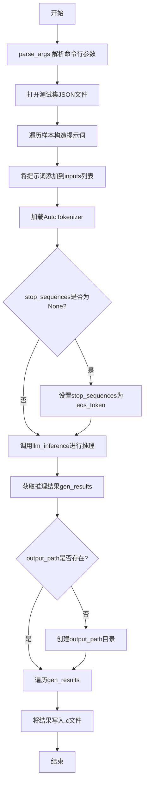
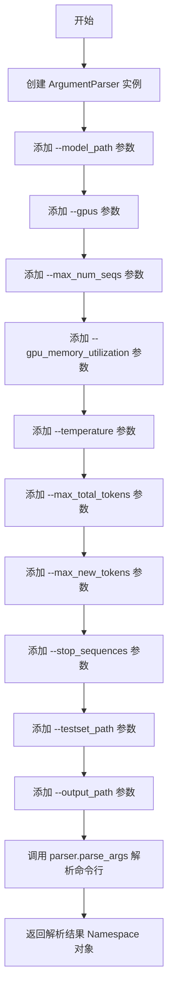

# `LLM4Decompile\decompile-bench\llm_server.py` 详细设计文档

该代码是一个基于vLLM的大语言模型推理脚本，主要功能是将汇编代码（Assembly）转换为C源代码。它读取包含汇编提示的测试集，构造输入提示词，调用预训练的LLM模型进行推理，并将生成的C代码结果保存为独立的.c文件。

## 整体流程



## 类结构

```
该脚本为扁平化结构，无面向对象类
主要由两个函数组成:
├── parse_args (命令行参数解析)
└── llm_inference (LLM推理核心逻辑)
```

## 全局变量及字段


### `inputs`
    
全局列表，存储构造好的提示词，用于后续的LLM推理

类型：`list[str]`
    


    

## 全局函数及方法


### `parse_args`

该函数用于解析命令行参数，创建一个 `ArgumentParser` 实例并定义一系列命令行选项（包括模型路径、GPU数量、内存利用率、温度等），最终返回包含所有解析后参数的命名空间对象。

参数： 无

返回值：`Namespace`，返回解析后的命令行参数对象，包含所有通过 `parser.add_argument()` 定义的参数属性

#### 流程图



#### 带注释源码

```python
def parse_args() -> ArgumentParser:
    """
    解析命令行参数并返回包含所有参数值的命名空间对象。
    
    返回:
        ArgumentParser: 返回解析后的命令行参数命名空间（实际类型为Namespace）
    """
    # 创建 ArgumentParser 实例，用于解析命令行参数
    parser = ArgumentParser()
    
    # 添加模型路径参数（必填）
    parser.add_argument("--model_path", type=str)
    
    # 添加 GPU 数量参数（默认值为 1）
    parser.add_argument("--gpus", type=int, default=1)
    
    # 添加最大序列数参数（默认值为 1）
    parser.add_argument("--max_num_seqs", type=int, default=1)
    
    # 添加 GPU 内存利用率参数（默认值为 0.95）
    parser.add_argument("--gpu_memory_utilization", type=float, default=0.95)
    
    # 添加温度参数（默认值为 0）
    parser.add_argument("--temperature", type=float, default=0)
    
    # 添加最大总 token 数参数（默认值为 8192）
    parser.add_argument("--max_total_tokens", type=int, default=8192)
    
    # 添加最大新生成 token 数参数（默认值为 512）
    parser.add_argument("--max_new_tokens", type=int, default=512)
    
    # 添加停止序列参数（默认值为 None）
    parser.add_argument("--stop_sequences", type=str, default=None)
    
    # 添加测试集路径参数（必填）
    parser.add_argument("--testset_path", type=str)
    
    # 添加输出路径参数（默认值为 None）
    parser.add_argument("--output_path", type=str, default=None)
    
    # 解析命令行参数并返回 Namespace 对象
    return parser.parse_args()
```


### `llm_inference`

该函数是 LLM 推理的核心入口函数，使用 vLLM 框架加载语言模型并执行推理，接收输入文本列表和模型配置参数，返回模型生成的文本结果列表。

参数：

- `inputs`：`List[str]`，输入的提示文本列表，每个元素是一个字符串prompt
- `model_path`：`str`，预训练模型的路径，用于加载模型权重
- `gpus`：`int`，并行计算的 GPU 数量，默认为 1，用于 tensor parallel
- `max_total_tokens`：`int`，模型支持的最大 token 长度，默认为 8192
- `gpu_memory_utilization`：`float`，GPU 内存占用比例，默认为 0.95
- `temperature`：`float`，生成时的温度参数，控制随机性，默认为 0（贪婪搜索）
- `max_new_tokens`：`int`，生成的最大新 token 数量，默认为 512
- `stop_sequences`：`Optional[List[str]]`，生成停止序列，默认为 None

返回值：`List[List[str]]`，二维列表，外层列表每个元素对应一个输入的生成结果，内层列表包含生成的文本字符串

#### 流程图

```mermaid
flowchart TD
    A[接收 inputs 和模型参数] --> B[创建 LLM 实例]
    B --> C[配置 SamplingParams 采样参数]
    C --> D[调用 llm.generate 执行推理]
    D --> E[遍历结果提取 output.outputs[0].text]
    E --> F[返回 gen_results 二维列表]
    
    B --> B1[model: model_path]
    B --> B2[tensor_parallel_size: gpus]
    B --> B3[max_model_len: max_total_tokens]
    B --> B4[gpu_memory_utilization: gpu_memory_utilization]
    
    C --> C1[temperature: temperature]
    C --> C2[max_tokens: max_new_tokens]
    C --> C3[stop: stop_sequences]
```

#### 带注释源码

```python
def llm_inference(inputs,
                  model_path,
                  gpus=1,
                  max_total_tokens=8192,
                  gpu_memory_utilization=0.95,
                  temperature=0,
                  max_new_tokens=512,
                  stop_sequences=None):
    """
    执行 LLM 推理的核心函数
    
    参数:
        inputs: 输入提示列表
        model_path: 模型路径
        gpus: GPU 并行数量
        max_total_tokens: 最大 token 长度
        gpu_memory_utilization: GPU 内存利用率
        temperature: 采样温度
        max_new_tokens: 最大生成 token 数
        stop_sequences: 停止序列
    
    返回:
        生成的文本结果列表
    """
    
    # 创建 LLM 实例，配置模型路径、并行策略和资源限制
    llm = LLM(
        model=model_path,
        tensor_parallel_size=gpus,      # 设置张量并行 GPU 数量
        max_model_len=max_total_tokens,  # 设置模型最大上下文长度
        gpu_memory_utilization=gpu_memory_utilization,  # GPU 显存占用比例
    )

    # 创建采样参数，控制生成行为
    sampling_params = SamplingParams(
        temperature=temperature,    # 温度控制随机性，0 为贪婪
        max_tokens=max_new_tokens,  # 生成的最大 token 数
        stop=stop_sequences,        # 停止序列，遇到则停止生成
    )

    # 调用 vLLM 的 generate 方法执行推理
    gen_results = llm.generate(inputs, sampling_params)
    
    # 解析结果，提取每个输出的文本内容
    # output.outputs[0].text 包含生成的文本
    gen_results = [[output.outputs[0].text] for output in gen_results]

    return gen_results
```

#### 关键组件信息

| 组件名称 | 一句话描述 |
|---------|-----------|
| `LLM` | vLLM 核心推理引擎类，负责模型加载和推理执行 |
| `SamplingParams` | 采样参数配置类，控制生成策略如温度、最大 token 数等 |
| `parse_args` | 命令行参数解析函数，提取用户输入的配置参数 |

#### 潜在技术债务与优化空间

1. **资源未释放**：LLM 实例创建后未显式释放资源，在大规模推理后可能导致显存泄漏
2. **异常处理缺失**：函数未对模型加载失败、推理超时、GPU 资源不足等异常情况进行处理
3. **批量处理效率**：当前逐个提取文本，可考虑使用向量化操作提升性能
4. **硬编码配置**：部分默认值（如 `max_total_tokens=8192`）可能不适配不同模型，应从模型配置中自动读取

#### 其他项目说明

- **设计目标**：封装 vLLM 推理接口，提供简洁的函数调用方式，支持自定义模型路径、GPU 数量和采样参数
- **错误处理**：当前无 try-except 保护，建议增加模型加载失败、推理异常、输入格式错误的捕获
- **外部依赖**：依赖 `vllm` 库进行推理，`transformers` 库用于 tokenizer，`argparse` 用于参数解析
- **接口契约**：输入需为字符串列表，返回值为嵌套列表，调用方需自行解析内层列表元素

## 关键组件


### 参数解析模块

负责解析命令行参数，包括模型路径、GPU数量、内存利用率、温度、生成token数等配置。

### LLM推理引擎

封装vLLM的LLM和SamplingParams配置，负责加载模型、执行推理并返回结果，是核心的模型调用组件。

### 数据加载与Prompt构建模块

从JSON测试集加载汇编代码样本，构建符合指定模板的prompt（包含汇编代码和指令说明）。

### 分词器配置模块

使用transformers的AutoTokenizer加载预训练模型的分词器，用于处理停止序列。

### 结果输出模块

将LLM生成的C代码逐个写入指定输出目录的.c文件中，每个样本对应一个文件。

### 配置文件与常量定义

包含环境变量设置（TOKENIZERS_PARALLELISM）、默认参数值（max_total_tokens=8192, max_new_tokens=512等）。


## 问题及建议


### 已知问题

- **全局变量状态管理**：使用全局变量`inputs`存储输入数据，这种方式容易导致状态污染，不利于函数复用和单元测试
- **路径拼接方式不安全**：使用字符串拼接方式`args.output_path + '/' + str(idx)`构建文件路径，应使用`os.path.join`以确保跨平台兼容性
- **错误处理缺失**：缺少对关键操作的异常捕获，如文件读取失败、模型加载失败、推理过程异常等
- **模型重复初始化**：每次调用`llm_inference`都会重新创建LLM实例，导致推理效率低下
- **Prompt模板硬编码**：推理用的prompt模板（before/after）直接写在代码中，缺乏灵活性
- **默认值重复定义**：参数默认值在`parse_args`和`llm_inference`函数两处定义，容易产生不一致
- **Tokenizer未复用**：虽然加载了tokenizer，但仅用于处理stop_sequences，未在推理流程中复用
- **批量处理风险**：一次性加载所有样本到内存并处理，可能导致内存溢出
- **输出路径验证不足**：未检查output_path是文件还是目录，也未检查目录是否已存在且为空
- **已注释代码未清理**：存在大段被注释掉的旧代码`llm_inference`函数，影响代码可读性

### 优化建议

- **重构为类或函数式设计**：将全局变量改为函数参数传递，或封装为配置类
- **统一使用os.path.join**：将路径拼接替换为`os.path.join(args.output_path, f'{idx}.c')`
- **添加完整的异常处理**：使用try-except捕获文件IO、模型加载、推理等环节的异常
- **模型单例模式**：将LLM实例化移到主流程，避免重复初始化
- **参数配置化**：创建配置类或 dataclass 统一管理参数，删除函数内部的重复默认值
- **支持批量推理和流式输出**：根据GPU内存情况分批处理样本，或使用生成器模式
- **添加日志记录**：使用logging模块记录推理进度、耗时等信息
- **清理注释代码**：删除已注释的旧代码块，保持代码仓库整洁
- **输入验证**：在处理前验证testset_path文件格式、output_path的有效性等
- **考虑使用Path对象**：使用`pathlib.Path`替代os.path操作，提升代码可读性


## 其它


### 设计目标与约束

**设计目标**：实现一个基于vLLM的汇编代码到C源代码转换工具，支持批量推理、多GPU并行和可配置的采样参数。

**约束条件**：
- 模型路径必须为有效的HuggingFace格式模型目录
- GPU数量受限于物理硬件和CUDA可见性
- 输出目录需要具有写权限
- 测试集JSON文件必须包含"input_asm_prompt"字段

### 错误处理与异常设计

代码当前缺少错误处理机制，存在以下风险点：
- 文件读取失败时程序直接崩溃
- 模型加载失败无优雅提示
- 输出目录创建失败未处理
- 推理过程中GPU内存不足无捕获

**建议改进**：
- 添加try-except捕获文件IO异常
- 检查模型路径有效性
- 验证输出目录权限
- 添加GPU内存溢出处理

### 数据流与状态机

**数据流**：
1. 读取JSON测试集 → 2. 构建Prompt模板 → 3. 加载Tokenizer → 4. 初始化LLM引擎 → 5. 执行推理 → 6. 解析输出结果 → 7. 写入文件

**状态转换**：
- 初始态 → 加载态 → 推理态 → 完成态
- 任意步骤失败进入错误态

### 外部依赖与接口契约

**核心依赖**：
- vllm>=0.2.0：模型推理引擎
- transformers>=4.30.0：Tokenizer加载
- torch>=2.0.0：深度学习后端

**接口契约**：
- 输入：JSON数组，每个元素包含input_asm_prompt字段
- 输出：.c文件，每个文件对应一条输入的推理结果

### 性能考虑与优化空间

- inputs列表全局累积，大数据集可能导致内存溢出
- 未使用批量加载和流式处理
- 可添加推理结果缓存机制
- 可实现异步文件写入

### 安全考虑与防护措施

- 无输入验证，可能导致Prompt注入
- 未对输出内容进行安全审查
- 模型路径未做路径遍历检查
- 建议添加输出内容过滤

### 测试策略与验证方法

- 单元测试：parse_args参数解析
- 集成测试：完整推理流程
- 性能测试：不同batch size的吞吐量
- 边界测试：空输入、单GPU、多GPU场景

### 配置管理与环境要求

**环境要求**：
- CUDA 11.8+
- Python 3.8+
- 至少16GB GPU显存（单卡）

**配置项**：
- tensor_parallel_size必须能被GPU数量整除
- max_total_tokens需匹配模型最大支持长度
- gpu_memory_utilization建议0.8-0.95

### 部署与运维指南

- 推荐使用Docker容器部署
- 需要预先下载模型到本地
- 日志输出可集成到ELK栈
- 监控指标：推理延迟、GPU利用率、内存使用
    