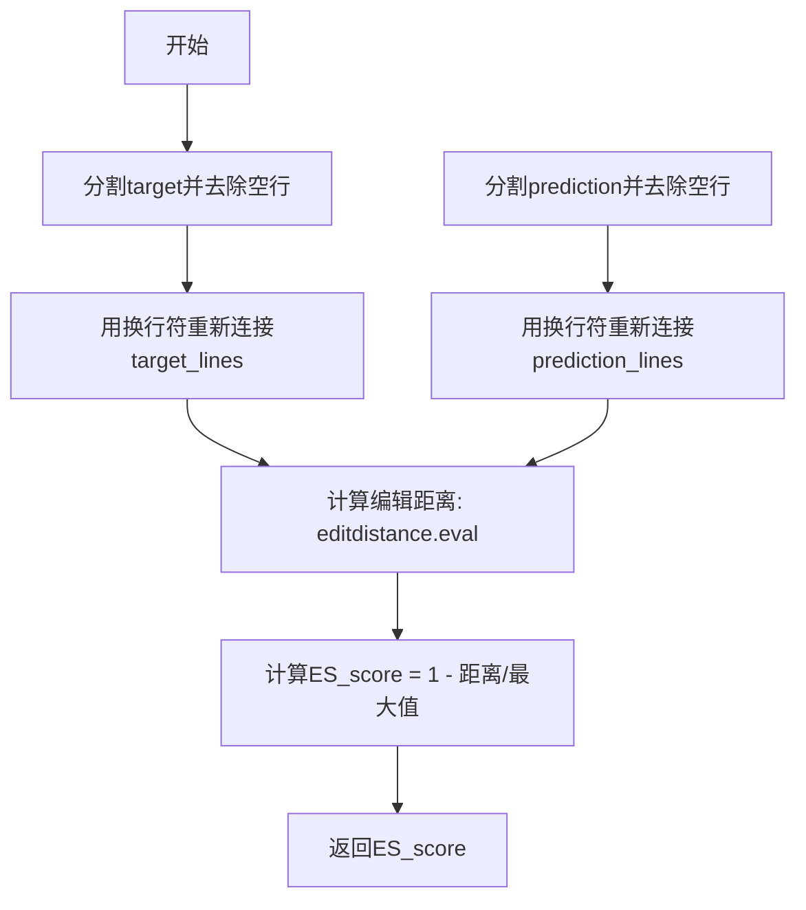

# `LLM4Decompile\decompile-bench\metrics\cal_edit_sim.py` 详细设计文档

该代码是一个反编译质量评估脚本，通过计算编辑距离（Edit Distance）来衡量原始源代码与反编译结果之间的相似度，支持HumanEval和MBPP两个数据集的评估，并输出平均ES得分。

## 整体流程

```mermaid
graph TD
    A[开始] --> B[遍历数据集: humaneval, mbpp]
    B --> C[读取原始JSON数据 {dataset_name}-decompile.json]
    C --> D[遍历数据目录查找.c和.cpp文件]
    D --> E[读取反编译源码文件]
    E --> F[从文件名提取索引号]
    F --> G[构建反编译结果字典 decompile_results]
    G --> H[遍历原始数据项]
    H --> I{遍历结束?}
    I -- 否 --> J[调用compute_ES计算相似度]
    J --> K[将得分加入es_all列表]
    K --> H
    I -- 是 --> L[计算平均ES得分]
    L --> M[打印结果]
    M --> B
    B --> N[结束]
```

## 类结构

```
无类定义
└── 模块级函数: compute_ES
    └── 主程序逻辑 (if __name__ == '__main__')
```

## 全局变量及字段


### `es_all`
    
存储所有样本的编辑距离得分（ES_score）的列表

类型：`list[float]`
    


### `decompile_results`
    
存储反编译结果的字典，键为索引，值为反编译的代码字符串

类型：`dict[int, str]`
    


### `target_lines`
    
目标代码按行分割并去除空白后的列表

类型：`list[str]`
    


### `prediction_lines`
    
预测代码按行分割并去除空白后的列表

类型：`list[str]`
    


### `target_str`
    
目标代码去除空白行后用换行符连接成的字符串

类型：`str`
    


### `prediction_str`
    
预测代码去除空白行后用换行符连接成的字符串

类型：`str`
    


### `ES_score`
    
编辑距离得分，值为1减去标准化后的编辑距离，范围0到1

类型：`float`
    


### `data`
    
从JSON文件加载的原始数据集，包含func和index字段

类型：`list[dict]`
    


### `dataset_name`
    
当前处理的数据集名称，取值为'humaneval'或'mbpp'

类型：`str`
    


### `full_path`
    
反编译源文件的完整路径

类型：`str`
    


### `prediction`
    
从文件中读取的反编译预测代码内容

类型：`str`
    


### `index`
    
从文件名中提取的样本索引编号

类型：`int`
    


### `item`
    
数据集中单个样本的条目，包含func和index字段

类型：`dict`
    


    

## 全局函数及方法


### `compute_ES`

该函数用于计算目标代码与预测代码之间的编辑距离相似度评分（ES Score），通过比较两个字符串的编辑距离与较长字符串长度的比值来衡量代码之间的相似程度，常用于评估代码反编译或代码生成任务的准确性。

参数：

- `target`：`str`，目标代码字符串，即标准或期望的代码
- `prediction`：`str`，预测或反编译的代码字符串，即实际输出的代码

返回值：`float`，ES评分，范围0到1之间，1表示完全匹配，0表示完全不匹配

#### 流程图



#### 带注释源码

```python
import editdistance  # 导入编辑距离计算库

def compute_ES(target, prediction):
    """
    计算目标代码与预测代码之间的编辑距离相似度评分
    
    参数:
        target: 目标代码字符串
        prediction: 预测/反编译的代码字符串
    
    返回:
        ES_score: 相似度评分 (0-1, 1表示完全匹配)
    """
    # 将目标代码按行分割，去除每行首尾空格，滤除空行
    target_lines = [line.strip() for line in target.splitlines() if line.strip()]
    # 将处理后的行用换行符重新连接成字符串
    target_str = '\n'.join(target_lines)
    
    # 对预测代码进行相同的处理
    prediction_lines = [line.strip() for line in prediction.splitlines() if line.strip()]
    prediction_str = '\n'.join(prediction_lines)
    
    # 计算编辑距离，并归一化到0-1范围
    # 编辑距离越小，两个字符串越相似
    # 除以较长字符串的长度，避免除零错误
    ES_score = 1 - (editdistance.eval(target_str, prediction_str) / max(len(target_str), len(prediction_str)))
    
    # 返回相似度评分
    return ES_score


if __name__ == '__main__':
    import json
    import os
    import numpy as np
    
    # 遍历数据集（humaneval和mbpp）
    for dataset_name in ['humaneval', 'mbpp']:
        # 加载原始数据（反编译前的代码）
        with open(f'./data/{dataset_name}-decompile.json', 'r') as f:
            data = json.load(f)
        
        # 初始化反编译结果字典
        decompile_results = {}
        
        # 遍历数据集目录，读取所有.c和.cpp文件
        for root, dirs, files in os.walk(f'./data/{dataset_name}'):
            for name in files:
                if name.endswith('.c') or name.endswith('.cpp'):
                    full_path = os.path.join(root, name)
                    with open(full_path, 'r') as f:
                        prediction = f.read().strip()
                        # 从文件名提取索引（如 "123_xxx.c" -> 123）
                        index = int(name.split('_')[0])
                    decompile_results[index] = prediction
        
        # 计算所有样本的ES评分
        es_all = []
        for item in data:
            # 调用compute_ES计算相似度
            es = compute_ES(item['func'], decompile_results[item['index']])
            es_all.append(es)
        
        # 输出数据集名称和平均ES评分
        print(dataset_name)
        print(np.average(es_all))
```


## 关键组件


### compute_ES 函数

计算编辑距离分数（Edit Distance Score），通过比较目标代码与反编译结果的编辑距离来评估反编译质量。

### 字符串预处理模块

对目标代码和预测结果进行行级别的预处理，去除空行和首尾空白，确保比较的是有效代码内容。

### 编辑距离计算模块

使用 editdistance 库计算两个字符串之间的 Levenshtein 距离，是评估字符串相似性的核心算法。

### 数据加载模块

从 JSON 文件加载原始函数代码，并从文件系统遍历读取反编译的 C/C++ 文件结果。

### 批量评估模块

遍历数据集中的每个样本，计算单个 ES 分数并汇总，最终输出数据集的平均反编译质量分数。

### ES 分数计算公式

ES = 1 - (编辑距离 / max(目标长度, 预测长度))，分数范围 0-1，越接近 1 表示反编译效果越好。

### 数据集遍历模块

支持对多个数据集（humaneval、mbpp）进行批量处理，通过文件名前缀提取索引进行结果匹配。


## 问题及建议


### 已知问题

- **除零错误风险**：当`target_str`或`prediction_str`为空字符串时，`max(len(target_str), len(prediction_str))`为0，会导致除零错误
- **缺少错误处理**：文件读取、JSON解析、字典键访问等操作均无异常捕获，程序可能在任意环节崩溃
- **KeyError风险**：如果`decompile_results`中不存在`item['index']`对应的键，程序会抛出KeyError异常
- **魔法数字和硬编码**：数据集路径`./data/`、文件后缀`.c`、`.cpp`均硬编码，扩展性差
- **类型注解缺失**：函数参数和返回值均无类型提示，降低代码可读性和可维护性
- **文档字符串缺失**：`compute_ES`函数没有任何文档说明，调用者无法了解其用途和返回值含义
- **变量命名不规范**：混用下划线命名（`target_lines`）和驼峰命名（`ES_score`），不符合PEP8规范
- **文件遍历效率低**：使用`os.walk`遍历目录但未过滤子目录，可能包含不必要的深层文件

### 优化建议

- **添加错误处理**：使用`try-except`包裹文件读写、JSON解析、字典访问等可能失败的代码，为不同异常提供有意义的错误信息
- **防御性编程**：在计算ES前检查字符串长度，为空字符串情况返回合理的默认值（如0或1）
- **类型注解**：为`compute_ES`函数添加类型提示，如`def compute_ES(target: str, prediction: str) -> float`
- **文档字符串**：为`compute_ES`函数添加docstring，说明参数、返回值和计算逻辑
- **配置外置**：将数据集路径、文件名模式等配置抽取为常量或配置文件
- **代码重构**：将数据加载逻辑（JSON读取、文件遍历）与评分计算逻辑分离，提高代码可测试性
- **日志记录**：使用`logging`模块替代`print`输出，便于生产环境调试

## 其它


### 设计目标与约束

**设计目标**：实现一个基于编辑距离的代码相似度评估系统，用于衡量反编译结果与原始源代码之间的相似程度，支持HumanEval和MBPP两个数据集的评估。

**约束条件**：
- 输入的target和prediction必须是非空字符串
- 编辑距离归一化处理时，分母为两者最大长度，避免除零错误
- 文件路径硬编码为相对路径"./data/"
- 仅支持.c和.cpp文件的处理

### 错误处理与异常设计

**异常处理场景**：
1. 文件不存在：使用`open()`函数时若文件不存在会抛出`FileNotFoundError`，需要捕获处理
2. JSON解析错误：`json.load()`可能抛出`JSONDecodeError`
3. 空字符串处理：当target_str或prediction_str为空时，`max(len(target_str), len(prediction_str))`返回0，导致除零错误
4. 索引越界：`decompile_results[item['index']]`可能不存在对应key

**当前实现缺陷**：代码未对上述异常情况进行捕获和处理，直接使用`item['index']`访问可能导致的KeyError会导致程序中断。

### 数据流与状态机

**数据流**：
1. 读取阶段：加载JSON源数据 → 遍历目录读取.c/.cpp文件
2. 预处理阶段：对每行代码进行strip()处理，去除空行
3. 计算阶段：调用compute_ES计算编辑距离分数
4. 输出阶段：计算平均值并打印

**状态机**：无复杂状态机，属于线性数据处理流程

### 外部依赖与接口契约

**外部依赖**：
- `editdistance`库：用于计算编辑距离
- `json`库：标准库，用于读取JSON数据
- `os`库：标准库，用于文件系统遍历
- `numpy`库：用于计算平均值

**接口契约**：
- `compute_ES(target, prediction)`函数接受两个字符串参数，返回0-1之间的浮点数分数
- 主程序读取`./data/{dataset_name}-decompile.json`文件
- 主程序遍历`./data/{dataset_name}/`目录下的.c和.cpp文件

### 性能考虑

**潜在性能瓶颈**：
1. 编辑距离计算时间复杂度为O(m×n)，对于大型代码文件可能较慢
2. `os.walk()`遍历目录效率较低
3. 逐个计算ES未使用并行化处理

**优化建议**：
- 对大文件可考虑采样或分块计算
- 可使用多进程/多线程并行处理不同文件
- 可添加缓存机制避免重复计算

### 安全性考虑

**安全风险**：
1. 路径遍历漏洞：dataset_name直接拼接到路径中，未做验证
2. 文件读取未限制大小：可能读取超大文件导致内存溢出
3. 无输入验证：未对JSON数据结构和字段进行校验

### 测试策略

**测试用例建议**：
1. 相同字符串测试：ES_score应为1.0
2. 完全不同字符串测试：ES_score应为0.0
3. 空字符串处理测试
4. 单行vs多行字符串测试
5. 包含特殊字符的字符串测试

### 部署/运行环境要求

**运行环境要求**：
- Python 3.x
- 安装依赖：editdistance、numpy
- 数据目录结构：./data/{dataset_name}-decompile.json 和 ./data/{dataset_name}/*.c或.cpp

**配置文件**：无配置文件，所有参数硬编码

    