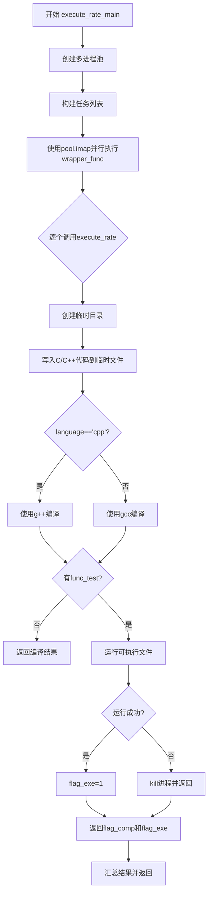
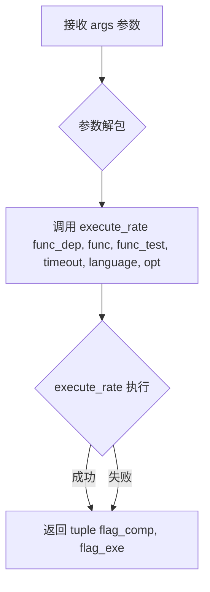

# `LLM4Decompile\decompile-bench\metrics\cal_execute_rate.py` 详细设计文档

该代码实现了一个C/C++代码的自动化编译和执行测试框架，支持多进程并行运行，通过临时文件方式编译C/C++代码并执行，统计编译成功和运行成功的数量，用于代码评估或测试场景。

## 整体流程



## 类结构

```
模块级
├── 全局函数
│   ├── execute_rate (核心编译执行函数)
│   ├── wrapper_func (多进程包装函数)
│   └── execute_rate_main (主控函数)
```

## 全局变量及字段


### `flag_exe`
    
执行成功标志，0或1，标识程序是否成功运行

类型：`int`
    


### `flag_comp`
    
编译成功标志，0或1，标识代码是否成功编译

类型：`int`
    


### `temp_dir`
    
临时目录路径，由tempfile.TemporaryDirectory()生成的临时工作目录

类型：`str`
    


### `pid`
    
进程ID，当前进程的进程标识符用于构建唯一文件名

类型：`int`
    


### `file_exe`
    
C源文件路径，生成的C源代码文件的完整路径

类型：`str`
    


### `binary_exe`
    
可执行文件路径，编译后生成的二进制可执行文件路径

类型：`str`
    


### `func_exe`
    
完整要编译的代码字符串，包含依赖、函数和测试代码的拼接字符串

类型：`str`
    


### `compile_command`
    
编译命令列表，用于执行gcc/g++编译的可变参数列表

类型：`list`
    


### `run_command`
    
运行命令列表，包含可执行文件路径的运行参数列表

类型：`list`
    


### `tasks`
    
任务参数列表，包含所有测试集执行所需的参数二维列表

类型：`list`
    


### `eval_results`
    
评估结果列表，包含每个测试用例的编译和执行状态结果

类型：`list`
    


### `comp`
    
编译成功数量元组，由所有测试的编译标志组成的元组

类型：`tuple`
    


### `exe`
    
运行成功数量元组，由所有测试的执行标志组成的元组

类型：`tuple`
    


    

## 全局函数及方法


### `execute_rate`

该函数是一个自动化代码编译与执行工具，它接收 C/C++ 代码片段（包含依赖、主函数及可选的测试函数），将其写入临时文件，调用 GCC/G++ 编译器进行编译，并根据是否提供测试代码决定是否运行生成的可执行文件，最终返回编译状态（是否成功）和执行状态（是否成功）的二元组。

参数：

- `func_dep`：`str`，代码依赖部分，通常包含头文件、全局变量或辅助函数。
- `func`：`str`，核心功能代码，即需要被编译执行的主体函数。
- `func_test`：`str | None`，可选参数。用于测试的代码，如果为 `None`，则仅进行编译而不执行。
- `timeout`：`int`，编译和执行的超时时间，单位为秒，默认为 10 秒。
- `language`：`str`，目标编程语言，默认为 `'cpp'`（C++），也支持 `'c'` 等。
- `opt`：`str`，编译器优化选项，默认为 `'-O0'`（不优化）。

返回值：`tuple[int, int]`，返回一个包含两个整数的元组。第一个元素 `flag_comp` 表示编译是否成功（1 成功，0 失败）；第二个元素 `flag_exe` 表示执行是否成功（1 成功，0 失败）。如果未执行（`func_test` 为 None），`flag_exe` 始终为 0。

#### 流程图

```mermaid
graph TD
    Start(Start) --> Init[Initialize: flag_exe=0, flag_comp=0]
    Init --> CheckTest{Is func_test provided?}
    
    CheckTest -- Yes --> MergeFull[Merge Source: func_dep + func + func_test]
    CheckTest -- No --> MergePart[Merge Source: func_dep + func]
    
    MergeFull --> Temp[Create Temp Directory & Write .c file]
    MergePart --> Temp
    
    Temp --> Build[Build Compile Command based on language]
    Build --> Compile[Execute g++/gcc via subprocess]
    
    Compile --> CompSucc{Compilation Success?}
    CompSucc -- No --> ReturnFail[Return (0, 0)]
    CompSucc -- Yes --> SetComp[Set flag_comp = 1]
    
    SetComp --> CheckRun{Is func_test provided?}
    CheckRun -- No --> ReturnCompOnly[Return (1, 0)]
    
    CheckRun -- Yes --> Execute[Run Compiled Binary]
    Execute --> ExeSucc{Execution Success?}
    
    ExeSucc -- No --> Kill[Kill Process if Timeout]
    Kill --> ReturnExeFail[Return (1, 0)]
    
    ExeSucc -- Yes --> SetExe[Set flag_exe = 1]
    SetExe --> ReturnFull[Return (1, 1)]
```

#### 带注释源码

```python
def execute_rate(func_dep, func, func_test=None, timeout=10, language='cpp', opt="-O0"):
    """
    编译并执行给定的 C/C++ 代码片段。

    参数:
        func_dep (str): 依赖代码（如头文件、辅助函数）。
        func (str): 主函数代码。
        func_test (str, optional): 测试代码。如果为 None，则仅编译不执行。
        timeout (int): 编译和运行的超时时间（秒）。
        language (str): 编程语言 ('cpp' 或 'c')。
        opt (str): 编译优化选项。

    返回:
        tuple: (flag_comp, flag_exe) 元组，分别表示编译和执行的成功标志 (1成功, 0失败)。
    """
    flag_exe = 0  # 初始化执行标志：失败
    flag_comp = 0  # 初始化编译标志：失败

    # 1. 组装源代码：根据是否有测试代码决定拼接方式
    if func_test != None:
        # 有测试代码：合并为完整程序用于编译和运行
        func_exe = func_dep + "\n" + func + "\n" + func_test
    else:
        # 无测试代码：仅合并依赖和主函数，用于检查语法/编译
        func_exe = func_dep + "\n" + func

    # 2. 创建临时目录以存放源文件和可执行文件
    with tempfile.TemporaryDirectory() as temp_dir:
        pid = os.getpid()  # 获取当前进程ID以区分临时文件
        # 源文件路径 (例如 /tmp/xxx/exe_1234.c)
        file_exe = os.path.join(temp_dir, f"exe_{pid}.c")
        # 二进制可执行文件路径
        binary_exe = os.path.join(temp_dir, f"exe_{pid}")
        
        # 将代码写入临时 .c 文件
        with open(file_exe, "w") as f:
            f.write(func_exe)

        # 3. 构建编译命令
        if language == 'cpp':
            if func_test != None:
                # C++ 且需要运行：生成可执行文件
                compile_command = ["g++", opt, '-std=c++17', file_exe, "-o", binary_exe, "-lm", "-lcrypto"]
            else:
                # C++ 且仅编译：生成汇编文件 (.s) 或目标文件，这里生成汇编用于检查语法
                compile_command = ["g++", opt, '-S', '-std=c++17', file_exe, "-o", binary_exe, "-lm", "-lcrypto"]
        else:
            # C 语言处理逻辑类似
            if func_test != None:
                compile_command = ["gcc", opt, file_exe, "-o", binary_exe, "-lm"]
            else:
                compile_command = ["gcc", opt, '-S', file_exe, "-o", binary_exe, "-lm"]

        # 4. 执行编译
        try:
            # check=True 会检查返回码，非0视为失败；timeout 防止编译卡死
            subprocess.run(compile_command, check=True, timeout=timeout)
            flag_comp = 1  # 编译成功
        except:
            # 编译失败（如语法错误），直接返回 (0, 0)
            return flag_comp, flag_exe
        
        # 5. 如果没有测试代码，编译成功后直接返回 (1, 0)
        if func_test == None:
            return flag_comp, flag_exe
        
        # 6. 执行编译后的程序（仅当提供了 func_test 时）
        run_command = [binary_exe]
        try:
            # 运行可执行文件，同样设置超时
            process = subprocess.run(run_command, timeout=timeout, check=True)
            flag_exe = 1  # 执行成功
        except:
            # 执行失败（可能是运行时错误、超时、或非零返回码）
            # 尝试清理子进程，防止僵尸进程
            if "process" in locals() and process:
                process.kill()
                process.wait()
            # 返回编译成功(1)，执行失败(0)
            return flag_comp, flag_exe
            
    # 7. 正常返回编译和执行皆成功 (1, 1)
    return flag_comp, flag_exe
```


### `wrapper_func`

这是一个多进程池的包装函数，用于将参数解包后调用 `execute_rate` 函数。该函数作为 `multiprocessing.Pool.imap` 的映射目标，接收一个包含多个参数的列表，将其解包后传递给 `execute_rate` 执行编译和运行测试。

参数：

- `args`：`list`，包含解包后的 `execute_rate` 函数参数列表，结构为 `[func_dep, func, func_test, timeout, language, opt]`，其中 `func_dep` 为依赖函数，`func` 为主函数，`func_test` 为测试函数，`timeout` 为超时时间，`language` 为编译语言（'cpp' 或 'c'），`opt` 为编译优化选项

返回值：`tuple`，返回 `execute_rate` 的执行结果 `(flag_comp, flag_exe)`，其中 `flag_comp` 表示编译是否成功（1成功/0失败），`flag_exe` 表示执行是否成功（1成功/0失败）

#### 流程图



#### 带注释源码

```python
def wrapper_func(args):
    """
    多进程池的包装函数，解包参数并调用 execute_rate
    
    该函数作为 multiprocessing.Pool.imap 的映射目标接收参数列表，
    将其解包后传递给 execute_rate 函数执行编译和运行测试
    
    参数:
        args: 包含 execute_rate 所需参数的列表 [func_dep, func, func_test, timeout, language, opt]
    
    返回:
        execute_rate 函数的返回结果 (flag_comp, flag_exe)
    """
    # Unpack arguments and call the original function
    # 将 args 列表解包为位置参数传递给 execute_rate
    return execute_rate(*args)
```


### `execute_rate_main`

该函数是并行执行多个测试用例的主入口函数，通过多进程池并发调用 `execute_rate` 执行每个测试，并将编译和执行结果汇总后返回。

参数：

- `testsets`：`list[dict]`，测试集列表，每个元素包含 `func_dep`、`test`、`language` 等字段
- `gen_results`：`list`，生成结果列表，与 testsets 一一对应
- `num_workers`：`int`，并行 worker 数量，默认为 10
- `timeout`：`int`，单个测试的超时时间（秒），默认为 10
- `opt`：`str`，编译器优化级别，默认为 "-O0"

返回值：`tuple`，返回三元组 `(eval_results, total_comp, total_exe)`，其中：
- `eval_results`：`list`，每个测试的 (编译标志, 执行标志) 结果列表
- `total_comp`：`int`，所有测试中编译成功的总次数
- `total_exe`：`int`，所有测试中执行成功的总次数

#### 流程图

```mermaid
flowchart TD
    A[开始 execute_rate_main] --> B[创建 multiprocessing.Pool]
    B --> C[构建任务列表 tasks]
    C --> D[使用 pool.imap 并行执行 wrapper_func]
    D --> E[使用 tqdm 显示进度条]
    E --> F[收集所有 eval_results]
    F --> G[解包结果: comp, exe = zip(*eval_results)]
    G --> H[计算 total_comp = sum(comp)]
    H --> I[计算 total_exe = sum(exe)]
    I --> J[返回 eval_results, total_comp, total_exe]
    
    subgraph 并行执行层
        D -.-> D1[Worker 1: execute_rate]
        D -.-> D2[Worker 2: execute_rate]
        D -.-> D3[Worker N: execute_rate]
    end
```

#### 带注释源码

```python
def execute_rate_main(testsets, gen_results, num_workers=10, timeout=10, opt="-O0"):
    """
    主函数：并行执行多个测试并汇总结果
    
    参数:
        testsets: 测试集列表，每个元素为包含 func_dep, test, language 等字段的字典
        gen_results: 生成结果列表，与 testsets 一一对应
        num_workers: 并行 worker 数量，默认为 10
        timeout: 单个测试的超时时间（秒），默认为 10
        opt: 编译器优化级别，默认为 "-O0"
    
    返回:
        tuple: (eval_results, total_comp, total_exe)
            - eval_results: 每个测试的 (编译成功标志, 执行成功标志) 列表
            - total_comp: 编译成功的总次数
            - total_exe: 执行成功的总次数
    """
    # 创建进程池，指定并行 worker 数量
    with multiprocessing.Pool(num_workers) as pool:
        # 构建任务列表：将 testsets 和 gen_results 打包为二维列表
        # 每个任务包含: [func_dep, gen_result, test, timeout, language, opt]
        tasks = [[testset["func_dep"], gen_result, testset["test"],\
                  timeout, testset["language"], opt]
            for testset, gen_result in zip(testsets, gen_results)
        ]
        # 使用 imap 并行执行任务，imap 保证按顺序返回结果
        # tqdm 用于显示进度条，total 指定总任务数
        eval_results = list(tqdm(pool.imap(wrapper_func, tasks), total=len(tasks)))
    
    # 解包结果：eval_results 是 [(comp1, exe1), (comp2, exe2), ...] 形式
    # 使用 zip 解包为两个元组 comp 和 exe
    comp, exe = zip(*eval_results)
    
    # 计算编译成功和执行成功的总数并返回
    return eval_results, sum(comp), sum(exe)
```

## 关键组件


### 临时文件与目录管理

使用Python的tempfile模块创建临时目录来存储C/C++源文件和编译后的可执行文件，确保资源使用后自动清理，避免磁盘空间泄漏。

### C/C++编译流程

根据传入的language参数（'cpp'或'gcc'）动态选择编译器，支持g++和gcc，支持自定义优化选项（如-O0、-O2等），并链接数学库和加密库。

### 进程执行与超时控制

使用subprocess.run()同步执行编译和运行命令，设置timeout参数防止程序长时间挂起，同时捕获TimeoutExpired和CalledProcessError异常。

### 多进程并行处理

利用multiprocessing.Pool创建worker进程池，通过imap函数将任务分发到多个worker并行执行，提高测试用例的评估效率。

### 进度条可视化

集成tqdm库实时显示任务执行进度，提供直观的已完成/总任务数展示，提升用户体验。

### 结果聚合与统计

汇总所有测试任务的编译和执行状态，计算编译成功数和执行成功数，为后续分析提供量化指标。

### 错误处理与异常捕获

使用try-except块捕获编译和运行时的异常，在进程异常时主动kill进程并等待退出，防止僵尸进程。

### 参数封装与解包

wrapper_func作为中间层封装函数，将参数列表解包后传递给execute_rate，适配multiprocessing的调用方式。


## 问题及建议


### 已知问题

- **变量未定义错误**：当 `func_test=None` 时，代码定义了 `func_comp` 但在后续写入文件时使用 `func_exe`（第20行），导致 `NameError` 或使用未定义变量。
- **编译与运行逻辑混乱**：当 `func_test=None` 时，编译命令使用 `-S` 参数生成汇编文件而非可执行文件，但后续代码尝试将汇编文件作为可执行文件运行（第48行），逻辑矛盾。
- **异常处理过于宽泛**：使用空的 `except:` 捕获所有异常，丢失了具体的错误信息（编译错误、运行错误、超时等），不利于调试和结果分析。
- **进程资源泄露风险**：在执行超时时 `process.kill()` 和 `process.wait()` 的调用依赖于特定条件，若异常发生在 `subprocess.run()` 内部，可能导致子进程未被正确终止。
- **临时文件竞争条件**：使用 `os.getpid()` 作为临时文件标识在同一进程内的多次调用中可能产生冲突，且多进程环境下 `pid` 可能重复。
- **返回值语义不明确**：`execute_rate` 返回 `(flag_comp, flag_exe)`，但未提供任何编译错误信息或执行输出，调用方无法获取失败原因。

### 优化建议

- **修复变量引用逻辑**：统一变量命名，确保 `func_test=None` 时写入正确的代码内容到临时文件，或明确区分编译和执行两种模式。
- **分离编译与执行流程**：当只需编译时，直接返回编译结果，避免尝试运行汇编文件；考虑使用 `-c` 参数生成目标文件而非 `-S`。
- **改进异常处理**：分具体异常类型捕获（如 `subprocess.CalledProcessError`, `subprocess.TimeoutExpired`, `OSError`），记录错误信息并通过返回值或异常向上传递详细错误原因。
- **增强资源管理**：使用 `with` 语句或 `finally` 块确保子进程被终止；或考虑使用 `subprocess.Popen` 配合上下文管理器。
- **优化临时文件策略**：使用 `tempfile.mkstemp()` 或 UUID 生成唯一文件名，避免文件覆盖；或使用内存文件系统（如 `tmpfs`）减少 I/O 开销。
- **丰富返回值信息**：返回包含编译状态、执行状态、错误信息、退出码、标准输出/错误内容的字典或对象，便于调用方进行详细分析。
- **解耦多进程逻辑**：将 `wrapper_func` 改为 lambda 或 `functools.partial`，减少模块级定义；或使用 `concurrent.futures.ProcessPoolExecutor` 获得更现代的 API。

## 其它


### 设计目标与约束

本工具旨在自动化测试代码片段的编译和执行成功率，支持C/C++语言，通过多进程并行提升测试效率，单个任务超时限制为10秒，编译优化级别可配置。

### 错误处理与异常设计

代码采用try-except捕获编译和执行阶段的异常，编译失败时直接返回(0,0)，执行超时或异常时强制kill进程并返回当前编译状态。异常信息未记录详细日志，仅通过返回值区分失败类型。

### 数据流与状态机

主流程：接收测试集列表→生成任务参数列表→多进程池分发任务→单任务内创建临时目录→写入源文件→执行编译→（如有测试代码）执行二进制→返回编译/执行状态标志→聚合结果并返回。

### 外部依赖与接口契约

依赖外部命令：g++/gcc编译器、操作系统进程管理。接口契约：execute_rate接受(func_dep, func, func_test, timeout, language, opt)六个参数，返回(comp_flag, exe_flag)二元组；execute_rate_main接受(testsets, gen_results, num_workers, timeout, opt)返回(eval_results, total_comp, total_exe)。

### 性能考虑

使用multiprocessing.Pool实现多进程并行，默认10个工作进程。临时文件使用 tempfile.TemporaryDirectory 自动管理生命周期。单个任务超时10秒防止无限等待。

### 安全性考虑

临时文件创建在系统临时目录中，文件名包含进程PID避免冲突。执行编译和运行命令时使用subprocess.run并设置check=True和timeout，防止命令注入风险（但命令参数本身为静态构建，存在一定局限）。

### 并发与同步

通过multiprocessing.Pool实现进程级并发，每个worker独立处理任务。线程安全方面：eval_results列表通过tqdm的imap顺序收集，无竞争；zip(*eval_results)解压结果时假设列表长度一致。

### 资源管理

临时目录在with语句结束后自动删除。进程执行异常时显式调用process.kill()和process.wait()清理僵尸进程。编译产物（目标文件/汇编文件）存放在临时目录中，随临时目录清理而释放。

### 配置与参数

language参数仅支持'cpp'或'gcc'（默认值需调用方指定）。opt参数控制编译优化级别，默认"-O0"。num_workers默认10，需根据CPU核心数调整。timeout默认10秒。

### 边界条件处理

func_test为None时仅执行编译不运行。编译命令根据language和是否有func_test动态构建。进程异常时检查locals()中是否存在process对象防止未定义引用。

### 日志与监控

代码中无日志记录功能，异常信息直接丢弃。进度通过tqdm显示当前完成数量/总任务数。返回的comp/exe总和可作为监控指标。

### 测试策略

当前代码无单元测试。建议添加：单元测试验证不同language/opt组合的编译命令生成；mock subprocess测试异常处理分支；压力测试验证大规模并发场景下的资源清理。


    