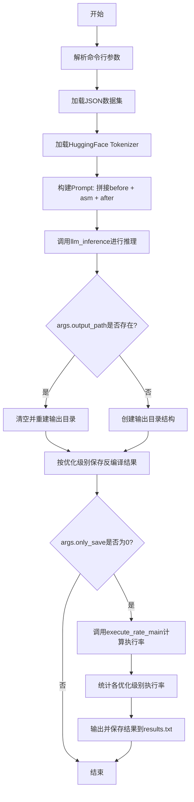
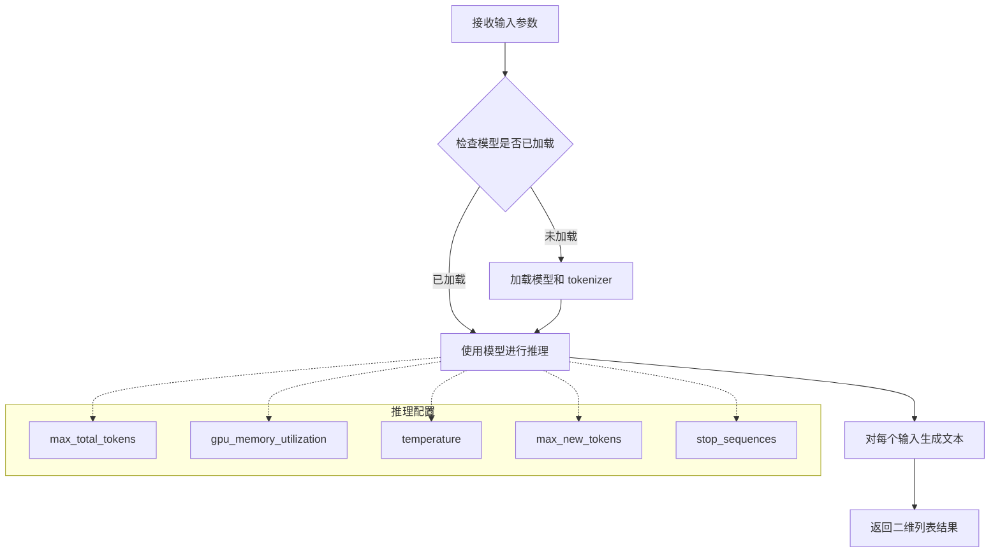
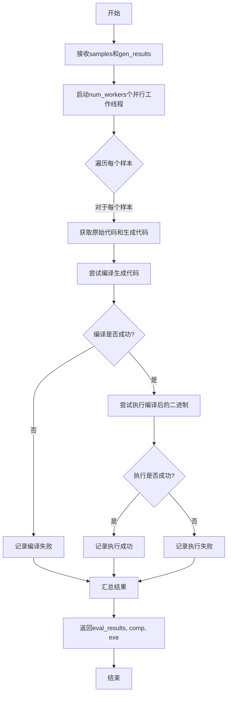
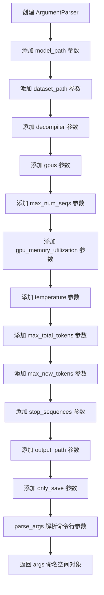
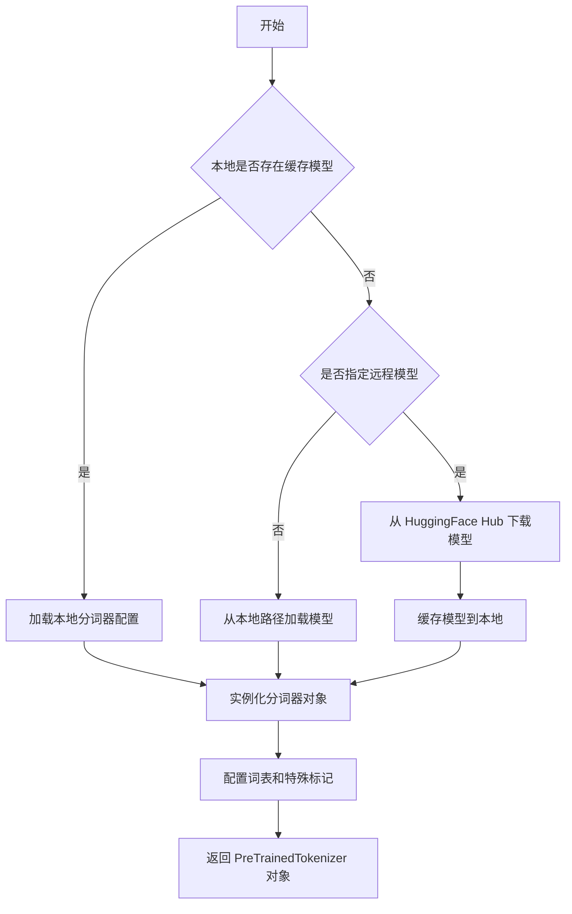

# `LLM4Decompile\decompile-bench\run_exe_rate.py` 详细设计文档

这是一个基于LLM的反编译推理脚本，用于将汇编代码（asm）通过大语言模型反编译为高级语言源代码，并可选地计算反编译结果的可执行率。脚本从JSON数据集读取汇编代码，调用llm_server模块进行推理，最后按优化级别（O0/O1/O2/O3）保存结果并评估执行率。

## 整体流程



## 类结构

```
该脚本为单文件执行脚本，无类定义
主要依赖外部模块:
├── llm_server.llm_inference (LLM推理函数)
└── metrics.cal_execute_rate.execute_rate_main (执行率计算函数)
```

## 全局变量及字段


### `opts`
    
编译器优化级别选项列表，包含['O0', 'O1', 'O2', 'O3']四个级别

类型：`list[str]`
    


### `before`
    
Prompt前缀模板，用于构建输入LLM的提示语开头

类型：`str`
    


### `after`
    
Prompt后缀模板，用于构建输入LLM的提示语结尾

类型：`str`
    


### `samples`
    
从JSON文件加载的样本数据，包含汇编代码和元信息

类型：`list[dict]`
    


### `tokenizer`
    
HuggingFace预训练模型的分词器对象，用于文本编码

类型：`AutoTokenizer`
    


### `results`
    
存储执行率评估结果，仅在only_save=0时使用

类型：`list`
    


### `inputs`
    
构建好的LLM输入prompt列表，包含assembly代码和问题模板

类型：`list[str]`
    


### `infos`
    
存储每个样本的元信息，包括优化级别(opt)和语言类型(language)

类型：`list[dict]`
    


### `gen_results`
    
LLM生成的原始反编译结果列表

类型：`list[str]`
    


### `gen_results_opt`
    
按优化级别分类的反编译结果字典，键为O0/O1/O2/O3

类型：`dict[str, list]`
    


    

## 全局函数及方法


### `llm_inference`

外部 LLM 推理函数，来自 `llm_server` 模块，用于根据输入的提示词列表和模型配置参数执行大语言模型推理，生成对应的文本输出。

参数：

- `inputs`：`List[str]`，输入的提示词列表，每个元素是一个包含 assembly 代码和提问的字符串
- `model_path`：`str`，预训练模型的路径或 Hugging Face 模型标识符
- `gpus`：`int`，用于推理的 GPU 数量
- `max_total_tokens`：`int`，推理时允许的最大 token 总数
- `gpu_memory_utilization`：`float`，GPU 显存利用率的阈值（0 到 1 之间）
- `temperature`：`float`，生成时的温度参数，控制随机性（0 表示确定性采样）
- `max_new_tokens`：`int`，生成时允许的最大新 token 数量
- `stop_sequences`：`List[str]`，生成过程中遇到该序列时停止的列表

返回值：`List[List[str]]`，二维列表，外层列表长度为输入样本数，内层列表每个元素为模型生成的文本结果（需要通过 `[0]` 索引取第一个结果）

#### 流程图



#### 带注释源码

```python
# 调用 llm_inference 函数进行 LLM 生成
# 参数说明：
#   inputs: 提示词列表，每个元素格式为 "# This is the assembly code:\n{asm_code}\n# What is the source code?\n"
#   args.model_path: 模型路径，如 "LLM4Binary/llm4decompile-1.3b-v1.6"
#   args.gpus: GPU 数量
#   args.max_total_tokens: 最大 token 数限制
#   args.gpu_memory_utilization: GPU 显存利用率
#   args.temperature: 采样温度（0 为贪婪解码）
#   args.max_new_tokens: 最大生成长度
#   args.stop_sequences: 停止序列列表
gen_results = llm_inference(inputs, args.model_path,
            args.gpus,
            args.max_total_tokens,
            args.gpu_memory_utilization,
            args.temperature,
            args.max_new_tokens,
            args.stop_sequences)

# llm_inference 返回的是二维列表，每个内层列表包含多个生成结果
# 这里只取第一个结果 [0]
gen_results = [gen_result[0] for gen_result in gen_results]
```


### `execute_rate_main`

该函数是来自 `metrics.cal_execute_rate` 模块的外部函数，用于计算 LLM 生成代码的可执行率（executable rate）。它接收原始样本数据和 LLM 生成的代码，通过并行编译和执行测试，评估生成代码的成功执行比例，并返回评估结果、编译状态和执行结果。

参数：

- `samples`：`list`，原始样本数据列表，包含待测试的代码样本（在该脚本中为从 JSON 文件加载的 `humaneval-decompile.json` 数据）
- `gen_results`：`list`，LLM 生成的代码结果列表，与 `samples` 一一对应
- `num_workers`：`int`（默认值=32），并行执行的工作线程数，用于加速编译和执行测试

返回值：返回三个值的元组 `(eval_results, comp, exe)`：

- `eval_results`：`list`，评估结果列表，每项包含样本索引和成功标志
- `comp`：`list`，编译结果列表
- `exe`：`list`，执行结果列表

#### 流程图



#### 带注释源码

```python
# 该源码为根据调用方式和函数名推测的实现逻辑
# 实际源码需要查看 metrics/cal_execute_rate 模块

def execute_rate_main(samples, gen_results, num_workers=32):
    """
    计算生成代码的可执行率
    
    参数:
        samples: 原始代码样本列表
        gen_results: LLM生成的代码列表
        num_workers: 并行工作线程数
    
    返回:
        eval_results: 评估结果列表
        comp: 编译结果列表
        exe: 执行结果列表
    """
    
    # 1. 准备测试用例
    # 将samples和gen_results配对，准备进行编译和执行测试
    
    # 2. 创建并行执行器，使用num_workers个线程
    # executor = ProcessPoolExecutor(max_workers=num_workers)
    
    # 3. 遍历所有样本进行编译和执行测试
    # for sample, gen_code in zip(samples, gen_results):
    #     # 尝试编译
    #     comp_result = compile(gen_code)
    #     # 如果编译成功，尝试执行
    #     if comp_result.success:
    #         exe_result = execute(comp_result.binary)
    #     else:
    #         exe_result = None
    
    # 4. 收集结果并返回
    # return eval_results, comp, exe
    
    pass  # 实际实现需要查看源码
```

> **注意**：由于提供的代码片段仅包含对此函数的调用（`from metrics.cal_execute_rate import execute_rate_main`），而未包含该模块的实际实现代码，因此上述流程图和源码是基于函数调用方式和常见实现模式的推测。如需获取精确的实现细节，请提供 `metrics/cal_execute_rate.py` 模块的完整源代码。


### `arg_parser`

该函数用于创建并配置一个 `argparse.ArgumentParser` 对象，用于解析命令行参数，参数包括模型路径、数据集路径、反编译器类型、GPU配置、生成参数等，解析后返回包含所有参数值的命名空间对象。

参数：

- 无（构造函数无参数，但通过 `add_argument` 方法添加了多个命令行参数）

返回值：`args`（`argparse.Namespace` 对象），包含以下属性：

- `model_path`：`str`，模型路径，默认为 `"LLM4Binary/llm4decompile-1.3b-v1.6"`
- `dataset_path`：`str`，数据集路径，默认为 `'./data/humaneval-decompile.json'`
- `decompiler`：`str`，反编译器类型，默认为 `'asm'`
- `gpus`：`int`，GPU数量，默认为 `1`
- `max_num_seqs`：`int`，最大序列数，默认为 `1`
- `gpu_memory_utilization`：`float`，GPU内存利用率，默认为 `0.95`
- `temperature`：`float`，温度参数，默认为 `0`
- `max_total_tokens`：`int`，最大总token数，默认为 `30000`
- `max_new_tokens`：`int`，最大新token数，默认为 `512`
- `stop_sequences`：`str`，停止序列，默认为 `None`
- `output_path`：`str`，输出路径，默认为 `'./data/humaneval'`
- `only_save`：`int`，是否仅保存结果，默认为 `0`

#### 流程图



#### 带注释源码

```python
# 创建 ArgumentParser 对象
arg_parser = argparse.ArgumentParser()

# 添加模型路径参数
arg_parser.add_argument("--model_path", type=str, default="LLM4Binary/llm4decompile-1.3b-v1.6")

# 添加数据集路径参数
arg_parser.add_argument("--dataset_path", type=str, default='./data/humaneval-decompile.json')

# 添加反编译器类型参数
arg_parser.add_argument("--decompiler", type=str, default='asm')

# 添加 GPU 数量参数
arg_parser.add_argument("--gpus", type=int, default=1)

# 添加最大序列数参数
arg_parser.add_argument("--max_num_seqs", type=int, default=1)

# 添加 GPU 内存利用率参数
arg_parser.add_argument("--gpu_memory_utilization", type=float, default=0.95)

# 添加温度参数
arg_parser.add_argument("--temperature", type=float, default=0)

# 添加最大总 token 数参数
arg_parser.add_argument("--max_total_tokens", type=int, default=30000)

# 添加最大新 token 数参数
arg_parser.add_argument("--max_new_tokens", type=int, default=512)

# 添加停止序列参数
arg_parser.add_argument("--stop_sequences", type=str, default=None)

# 添加输出路径参数
arg_parser.add_argument("--output_path", type=str, default='./data/humaneval')

# 添加是否仅保存参数
arg_parser.add_argument("--only_save", type=int, default=0)

# 解析命令行参数并返回命名空间对象
args = arg_parser.parse_args()
```


### `AutoTokenizer.from_pretrained`

该方法是 HuggingFace Transformers 库中 `AutoTokenizer` 类的类方法，用于从预训练模型路径或模型标识符加载对应的分词器（Tokenizer），支持自动适配不同模型架构的分词规则。在本代码中用于加载指定模型的分词器，为后续文本生成任务提供文本编码能力。

参数：

- `pretrained_model_name_or_path`：`str`，模型名称或本地模型路径。本代码中通过 `args.model_path` 传入，默认为 `"LLM4Binary/llm4decompile-1.3b-v1.6"`
- `cache_dir`（可选）：`str`，模型缓存目录
- `force_download`（可选）：`bool`，是否强制重新下载模型
- `resume_download`（可选）：`bool`，是否支持断点续传
- `proxies`（可选）：`dict`，网络代理配置
- `use_auth_token`（可选）：`str` 或 `bool`，用于访问私有模型的认证令牌
- `revision`（可选）：`str`，模型版本分支或提交 ID
- `local_files_only`（可选）：`bool`，是否仅使用本地文件
- `trust_remote_code`（可选）：`bool`，是否信任远程代码
- `torch_dtype`（可选）：`torch.dtype`，模型权重的数据类型
- `device_map`（可选）：`str` 或 `dict`，设备映射配置

返回值：`PreTrainedTokenizer` 或 `PreTrainedTokenizerFast`，返回对应的分词器对象，包含词表、特殊标记、编码/解码方法等，用于文本与 token ID 之间的相互转换。

#### 流程图



#### 带注释源码

```python
# 代码中使用方式示例
tokenizer = AutoTokenizer.from_pretrained(args.model_path)

# 详细参数调用形式（基于本代码逻辑）
tokenizer = AutoTokenizer.from_pretrained(
    pretrained_model_name_or_path=args.model_path,  # 模型路径或模型ID
    cache_dir=None,                                  # 默认缓存目录
    force_download=False,                            # 不强制下载
    resume_download=False,                           # 不支持断点续传
    proxies=None,                                    # 无代理
    use_auth_token=None,                             # 无认证令牌
    revision='main',                                 # 默认分支
    local_files_only=False,                          # 允许下载远程文件
    trust_remote_code=False,                         # 不信任远程代码
    torch_dtype=None,                                # 不指定数据类型
    device_map=None                                  # 不指定设备映射
)

# 使用分词器进行编码
if args.stop_sequences is None:
    args.stop_sequences = [tokenizer.eos_token]  # 使用 EOS 令牌作为默认停止序列

# tokenizer 对象的主要功能：
# - tokenizer.encode(text): 将文本转换为 token ID 列表
# - tokenizer.decode(token_ids): 将 token ID 列表转换回文本
# - tokenizer.eos_token: 句子结束标记
# - tokenizer.pad_token: 填充标记
# - tokenizer.bos_token: 句子开始标记
```

## 关键组件


### 参数解析模块

负责解析命令行参数，包括模型路径、数据集路径、GPU配置、推理参数（temperature、max_new_tokens等）和输出路径等配置。

### 提示词构建模块

将反编译任务构建为提示词，格式为"# This is the assembly code:\n{asm}\n# What is the source code?"，用于指导LLM进行反编译任务。

### LLM推理模块

调用llm_server.llm_inference函数，传入输入提示词、模型路径、GPU数量、内存利用率、温度、最大token数等参数，获取模型生成的源代码。

### 输出管理模块

根据样本的优化级别（opt）将生成的代码保存到对应目录（O0/O1/O2/O3），文件名格式为"{idx}_{opt}.{language}"。

### 执行率评估模块

调用metrics.cal_execute_rate.execute_rate_main函数，评估生成的代码能否成功编译和执行，返回编译结果和执行结果。

### 结果统计模块

按优化级别汇总执行率，计算O0-O3各组的成功执行百分比，并将结果打印和保存到文件。


## 问题及建议


### 已知问题

- **路径处理不跨平台**：使用 `split('/')` 解析路径（如 `args.output_path.split('/')[-1]`），在 Windows 系统上可能无法正确工作，应使用 `os.path.basename()`。
- **变量覆盖混淆**：`exe` 变量在第71行被赋值为 `execute_rate_main` 的返回值，在第78行的循环内又被重新赋值为计算出的执行率，导致变量语义不清晰。
- **缺少错误处理**：未检查 `model_path`、`dataset_path` 是否存在，也未处理 `llm_inference` 调用失败或文件读写异常的情况。
- **硬编码优化级别列表**：`opts = ["O0", "O1", "O2", "O3"]` 硬编码在全局，如果需要支持更多优化级别需要修改源码。
- **重复打开文件**：结果文件在循环中每次迭代都打开追加写入（第79-80行），效率较低。
- **参数类型不规范**：`--only_save` 使用 `int` 类型（0/1）而非 `bool`，语义不明确。
- **缺少类型注解和文档**：整个脚本没有类型提示和 docstring，影响可维护性。

### 优化建议

- 使用 `os.path.basename()` 替代字符串 split 进行路径解析，增强跨平台兼容性。
- 重命名变量避免覆盖，如将计算后的执行率结果命名为 `exe_rate` 或 `execution_rate`。
- 添加文件存在性检查和 try-except 异常处理，提升脚本健壮性。
- 将优化级别列表提取为配置参数或从数据集动态获取。
- 将结果写入逻辑改为先收集所有数据再批量写入，减少 I/O 操作次数。
- 将 `--only_save` 参数改为 `action='store_true'` 的布尔 flag。
- 为关键函数和参数添加类型注解及 docstring，提升代码可读性。

## 其它


### 设计目标与约束

本代码旨在实现基于大语言模型(LLM)的二进制代码反编译功能，将不同优化级别(O0-O3)的汇编代码转换为源代码。主要设计约束包括：支持单GPU和多GPU推理，默认使用1个GPU；最大支持30000个总token；输出结果按优化级别分类保存；通过可执行率评估反编译质量。

### 错误处理与异常设计

代码主要包含以下错误处理机制：文件读写使用with语句确保资源正确关闭；使用shutil.rmtree清理已存在目录前未做额外检查；JSON加载失败会导致程序终止；LLM推理失败未捕获异常。改进建议：添加文件存在性检查；捕获json.JSONDecodeError；为llm_inference调用添加异常处理和重试机制。

### 数据流与状态机

数据流主要分为三个阶段：输入阶段从JSON文件加载样本数据，构建prompt；推理阶段调用LLM模型生成源代码；输出阶段按优化级别保存结果并计算可执行率。状态转换通过samples列表索引同步inputs、infos和gen_results，确保数据一致性。推理结果使用列表推导式提取第一个候选结果。

### 外部依赖与接口契约

核心依赖包括：llm_server.llm_inference提供LLM推理接口；metrics.cal_execute_rate.execute_rate_main计算可执行率；transformers.AutoTokenizer加载分词器。接口契约：llm_inference接收(inputs, model_path, gpus, max_total_tokens, gpu_memory_utilization, temperature, max_new_tokens, stop_sequences)参数，返回二维列表；execute_rate_main接收(samples, gen_results, num_workers)参数，返回(eval_results, comp, exe)。

### 配置与参数设计

命令行参数分为四类：模型配置(model_path)、数据配置(dataset_path, decompiler)、推理配置(gpus, max_num_seqs, gpu_memory_utilization, temperature, max_total_tokens, max_new_tokens, stop_sequences)、输出配置(output_path, only_save)。参数默认值针对单GPU推理场景优化，temperature设为0表示贪婪解码，max_new_tokens限制单次生成最大长度。

### 性能考虑与资源管理

GPU内存利用率默认0.95以最大化利用；max_num_seqs未实际使用可能遗留；num_workers设为32用于并行计算可执行率。潜在优化点：支持批量推理以提高吞吐量；添加推理结果缓存机制；支持分布式推理扩展到多GPU。

### 安全与隐私

代码不涉及用户敏感数据处理。主要安全考虑：dataset_path和output_path未做路径遍历检查，建议添加路径验证；模型下载可能存在供应链风险，建议验证模型哈希。

### 测试策略

当前代码缺少单元测试。建议添加以下测试：JSON加载测试；prompt构建测试；输出目录创建测试；可执行率计算逻辑测试。可使用mock避免实际调用LLM推理和可执行率计算。

### 日志与监控

代码仅使用print输出结果日志。改进建议：引入logging模块分级记录；添加推理耗时统计；记录样本处理进度；生成结构化日志便于问题排查。

### 版本兼容性

依赖版本要求：transformers库需与模型架构兼容；llm_server和metrics为项目内部模块需同步更新。建议添加requirements.txt或pyproject.toml锁定依赖版本。


    