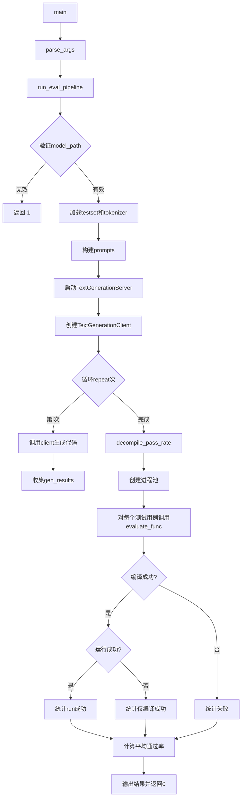
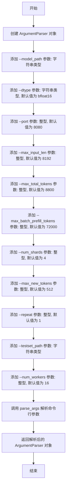
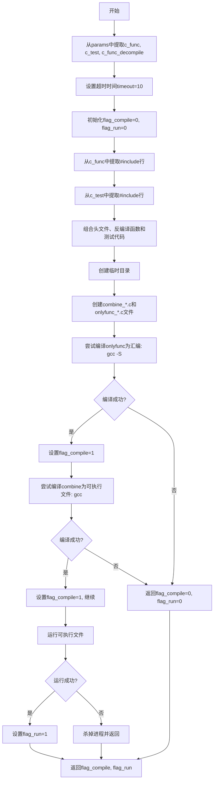
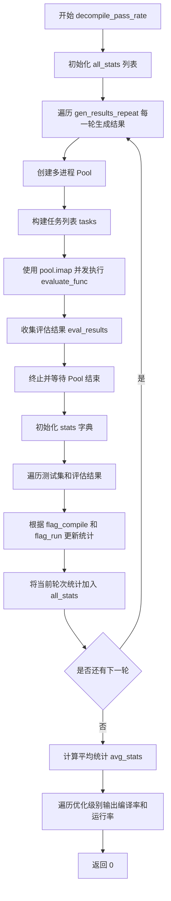
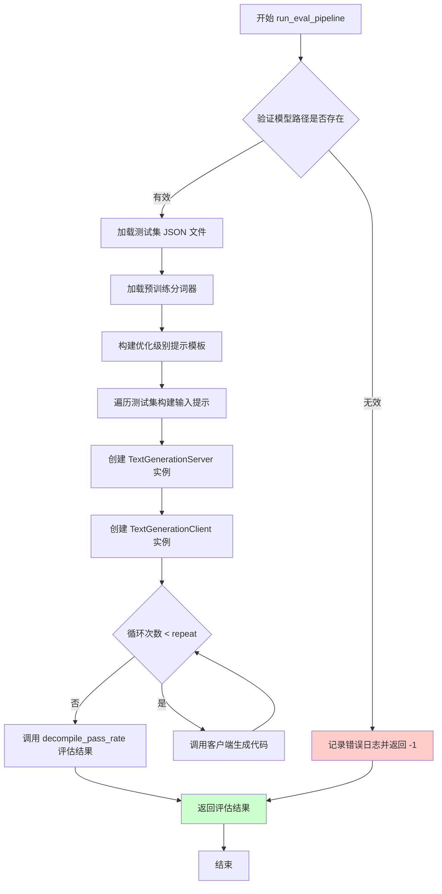
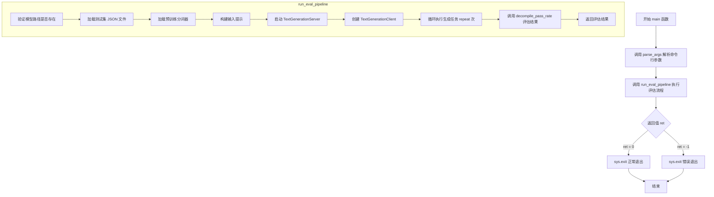

# `LLM4Decompile\evaluation\run_evaluation_llm4decompile.py` 详细设计文档

这是一个反编译评估框架，用于测试模型将汇编代码转换为C源代码的能力。它通过启动文本生成服务，将测试集中的汇编代码提示转换为C代码，然后编译并运行生成的代码，最后计算不同优化级别（O0-O3）下的编译通过率和运行通过率。

## 整体流程



## 类结构

```
该文件无类定义，全部采用函数式编程
主要模块: TextGenerationServer, TextGenerationClient (来自server.text_generation)
```

## 全局变量及字段


### `logger`
    
loguru日志记录器实例，用于记录程序运行过程中的各类日志信息

类型：`loguru.Logger`
    


    

## 全局函数及方法


### `parse_args`

该函数用于解析命令行参数，使用 Python 的 argparse 库定义了一系列配置参数，包括模型路径、数据类型、端口号、各类令牌限制、批处理参数、测试集路径和工作进程数等，并返回解析后的参数对象。

参数：

- 该函数无参数

返回值：`ArgumentParser`，返回解析后的命令行参数对象，包含了所有通过命令行传入的配置选项

#### 流程图



#### 带注释源码

```python
def parse_args() -> ArgumentParser:
    """
    解析命令行参数并返回解析后的参数对象
    
    Returns:
        ArgumentParser: 包含所有命令行参数解析结果的对象
    """
    # 创建 ArgumentParser 实例，用于处理命令行参数
    parser = ArgumentParser()
    
    # 添加模型路径参数 - 指定要使用的模型目录路径
    parser.add_argument("--model_path", type=str)
    
    # 添加数据类型参数 - 指定模型使用的数据类型，默认为 bfloat16
    parser.add_argument("--dtype", type=str, default="bfloat16")
    
    # 添加端口参数 - 指定服务器监听的端口号，默认为 8080
    parser.add_argument("--port", type=int, default=8080)
    
    # 添加最大输入长度参数 - 指定输入令牌的最大数量，默认为 8192
    parser.add_argument("--max_input_len", type=int, default=8192)
    
    # 添加最大总令牌数参数 - 指定输入+输出令牌总数的最大值，默认为 8800
    parser.add_argument("--max_total_tokens", type=int, default=8800)
    
    # 添加最大批处理预填充令牌数参数 - 指定批处理预填充阶段的最大令牌数，默认为 72000
    parser.add_argument("--max_batch_prefill_tokens", type=int, default=72000)
    
    # 添加分片数量参数 - 指定模型的分片数量，默认为 4
    parser.add_argument("--num_shards", type=int, default=4)
    
    # 添加最大新令牌数参数 - 指定单次生成的最大新令牌数量，默认为 512
    parser.add_argument("--max_new_tokens", type=int, default=512)
    
    # 添加重复次数参数 - 指定实验重复运行的次数，默认为 1
    parser.add_argument("--repeat", type=int, default=1)
    
    # 添加测试集路径参数 - 指定测试集 JSON 文件的路径
    parser.add_argument("--testset_path", type=str)
    
    # 添加工作进程数参数 - 指定并行工作进程的数量，默认为 16
    parser.add_argument("--num_workers", type=int, default=16)
    
    # 解析命令行参数并返回
    return parser.parse_args()
```


### `evaluate_func`

评估单个生成结果（编译并运行C代码）的核心函数。该函数接收包含C函数源码、反编译代码和测试代码的参数字典，提取头文件并组合代码，创建临时C源文件，尝试使用GCC编译器将代码编译为汇编和可执行文件，运行可执行文件并返回编译和执行状态的标志位。

参数：

- `params`：`Dict`，包含以下键值的参数字典：
  - `c_func`：`str`，原始C函数源码
  - `c_test`：`str`，C测试代码
  - `c_func_decompile`：`str`，反编译后的C函数代码

返回值：`Tuple[int, int]`，返回一个元组 `(flag_compile, flag_run)`：
- `flag_compile`：`int`，编译成功标志（1表示成功，0表示失败）
- `flag_run`：`int`，运行成功标志（1表示成功，0表示失败）

#### 流程图



#### 带注释源码

```python
def evaluate_func(params):
    """
    评估单个生成结果（编译并运行C代码）
    
    参数:
        params: 包含以下键的字典:
            - c_func: 原始C函数源码
            - c_test: C测试代码  
            - c_func_decompile: 反编译后的C函数代码
    
    返回:
        tuple: (flag_compile, flag_run) - 编译和运行状态标志
    """
    # 从参数字典中解包获取C函数、测试代码和反编译代码
    c_func, c_test, c_func_decompile = (
        params["c_func"],
        params["c_test"],
        params["c_func_decompile"],
    )

    # 设置编译和运行超时时间为10秒
    timeout = 10
    # 初始化编译和运行状态标志（0表示失败，1表示成功）
    flag_compile = 0
    flag_run = 0
    # 用于存储提取的头文件包含语句
    c_include = ""
    
    # 从c_func中提取所有#include行
    for line in c_func.split("\n"):
        if "#include" in line:
            c_include += line + "\n"
            # 从c_func中移除已提取的#include行，避免重复
            c_func = c_func.replace(line, "")
            
    # 从c_test中提取所有#include行
    for line in c_test.split("\n"):
        if "#include" in line:
            c_include += line + "\n"
            # 从c_test中移除已提取的#include行
            c_test = c_test.replace(line, "")
            
    # 组合完整代码：头文件 + 反编译函数 + 测试代码
    c_combine = c_include + "\n" + c_func_decompile + "\n" + c_test
    # 仅包含函数的代码：头文件 + 反编译函数（不含测试）
    c_onlyfunc = c_include + "\n" + c_func_decompile

    # 使用临时目录存储编译过程中的文件
    with tempfile.TemporaryDirectory() as temp_dir:
        # 获取当前进程ID用于创建唯一文件名
        pid = os.getpid()
        # 构建临时文件路径
        c_file = os.path.join(temp_dir, f"combine_{pid}.c")
        executable = os.path.join(temp_dir, f"combine_{pid}")
        c_file_onlyfunc = os.path.join(temp_dir, f"onlyfunc_{pid}.c")
        executable_onlyfunc = os.path.join(temp_dir, f"onlyfunc_{pid}")

        # 将组合代码写入临时C文件
        with open(c_file, "w") as f:
            f.write(c_combine)
        # 将仅函数代码写入临时C文件
        with open(c_file_onlyfunc, "w") as f:
            f.write(c_onlyfunc)

        # 步骤1: 编译C程序到汇编代码 (gcc -S)
        # 用于验证代码语法正确性
        compile_command = [
            "gcc",
            "-S",
            c_file_onlyfunc,
            "-o",
            executable_onlyfunc,
            "-lm",  # 链接数学库
        ]
        try:
            # 执行编译命令，超时则抛出异常
            subprocess.run(compile_command, check=True, timeout=timeout)
            flag_compile = 1  # 编译成功
        except:
            # 编译失败，返回编译失败状态
            return flag_compile, flag_run

        # 步骤2: 编译C程序到可执行文件
        compile_command = ["gcc", c_file, "-o", executable, "-lm"]
        try:
            subprocess.run(compile_command, check=True, timeout=timeout)
            flag_compile = 1  # 编译成功
        except:
            return flag_compile, flag_run

        # 步骤3: 运行编译后的可执行文件
        run_command = [executable]
        try:
            # 运行可执行文件，捕获输出和错误
            process = subprocess.run(
                run_command, capture_output=True, text=True, timeout=timeout, check=True
            )
            flag_run = 1  # 运行成功
        except:
            # 运行失败时，确保杀掉进程以释放资源
            if 'process' in locals() and process:
                process.kill()
                process.wait()
            return flag_compile, flag_run

    # 返回编译和运行状态标志
    return flag_compile, flag_run
```


### `decompile_pass_rate`

该函数是反编译通过率评估的核心逻辑，通过多进程并发执行来评估生成的反编译代码的编译和运行通过率，计算不同优化级别（O0-O3）下的平均通过率并输出结果。

参数：

- `testsets`：`list`，包含测试集信息的列表，每个元素包含 `c_func`（原始C代码）、`c_test`（测试代码）和 `type`（优化级别）
- `gen_results_repeat`：`list`，生成结果的重复列表，每一轮生成的结果集
- `opts`：`dict`，优化级别选项字典，键为优化级别（如 "O0", "O1", "O2", "O3"），值为对应的提示前缀
- `args`：`ArgumentParser`，命令行参数对象，包含 `num_workers` 等配置

返回值：`int`，返回 0 表示评估完成

#### 流程图



#### 带注释源码

```python
def decompile_pass_rate(testsets, gen_results_repeat, opts, args):
    """
    计算反编译通过率的主评估逻辑
    
    参数:
        testsets: 测试集列表，包含 c_func, c_test, type 等字段
        gen_results_repeat: 多轮生成的结果列表
        opts: 优化级别选项字典 {"O0": "...", "O1": "...", ...}
        args: 命令行参数，包含 num_workers 等配置
    返回:
        int: 评估完成返回 0
    """
    # 存储所有轮次的统计结果
    all_stats = []

    # 遍历每一轮生成的结果
    for gen_index, gen_results in enumerate(gen_results_repeat):
        # 创建多进程池，worker数量由 args.num_workers 指定
        with multiprocessing.Pool(args.num_workers) as pool:
            # 构建任务列表：每个任务包含原始C代码、测试代码和反编译结果
            tasks = [
                {
                    "c_func": testset["c_func"],
                    "c_test": testset["c_test"],
                    "c_func_decompile": output[0],  # 取第一个生成结果
                }
                for testset, output in zip(testsets, gen_results)
            ]

            # 使用 pool.imap 并发执行 evaluate_func，带进度条显示
            eval_results = list(tqdm(pool.imap(evaluate_func, tasks), total=len(tasks)))

        # 关闭并等待进程池结束
        pool.terminate()
        pool.join()
        
        # 初始化当前轮次的统计字典，按优化级别统计 compile/run/total
        stats = {opt: {"compile": 0, "run": 0, "total": 0} for opt in opts}
        
        # 遍历测试集、生成结果和评估结果，统计编译和运行通过情况
        for idx, (testset, output, flag) in enumerate(
            tqdm(
                zip(testsets, gen_results, eval_results),
                total=len(testsets),
                desc="Evaluating",
            )
        ):
            c_func_decompile = output[0]
            c_func = testset["c_func"]
            c_test = testset["c_test"]

            # 从评估结果中获取编译和运行标志
            flag_compile, flag_run = flag[0], flag[1]
            opt = testset["type"]  # 获取优化级别 (O0/O1/O2/O3)

            # 更新统计计数
            stats[opt]["total"] += 1
            if flag_compile:
                stats[opt]["compile"] += 1
            if flag_run:
                stats[opt]["run"] += 1

        # 将当前轮次的统计结果添加到总统计列表
        all_stats.append(stats)

    # 计算所有轮次的平均统计结果
    avg_stats = {opt: {"compile": 0, "run": 0, "total": 0} for opt in opts}
    for stats in all_stats:
        for opt in opts:
            # 累加所有轮次的编译和运行计数
            avg_stats[opt]["compile"] += stats[opt]["compile"]
            avg_stats[opt]["run"] += stats[opt]["run"]
            avg_stats[opt]["total"] += stats[opt]["total"]

    # 计算平均值（除以轮次数量）
    for opt in opts:
        avg_stats[opt]["compile"] /= len(gen_results_repeat)
        avg_stats[opt]["run"] /= len(gen_results_repeat)
        avg_stats[opt]["total"] /= len(gen_results_repeat)

    # 输出每种优化级别的编译率和运行率
    for opt, data in avg_stats.items():
        compile_rate = data["compile"] / data["total"] if data["total"] > 0 else 0
        run_rate = data["run"] / data["total"] if data["total"] > 0 else 0
        print(
            f"Optimization {opt}: Compile Rate: {compile_rate:.4f}, Run Rate: {run_rate:.4f}"
        )

    return 0
```


### `run_eval_pipeline`

该函数是评估流程的核心入口，负责加载模型和测试集，通过文本生成服务器生成代码，并调用评估函数计算反编译通过率。

参数：

- `args`：`ArgumentParser`，命令行参数对象，包含模型路径、端口、数据类型、测试集路径等所有配置信息

返回值：`int`，返回0表示执行成功，返回-1表示执行失败（模型路径无效或发生异常）

#### 流程图



#### 带注释源码

```python
def run_eval_pipeline(args: ArgumentParser) -> int:
    """
    运行评估流程的主函数
    
    流程：
    1. 验证模型路径有效性
    2. 加载测试集和分词器
    3. 构建输入提示
    4. 启动文本生成服务器和客户端
    5. 循环生成代码结果
    6. 调用评估函数计算通过率
    
    参数:
        args: 包含所有命令行参数的 ArgumentParser 对象
        
    返回:
        int: 0 表示成功, -1 表示失败
    """
    # 获取模型路径并验证其有效性
    model_path = Path(args.model_path)
    # 检查模型路径是否存在且为目录
    if not model_path.exists() or not model_path.is_dir():
        # 记录错误日志并返回失败状态码
        logger.error(f"Invalid model {model_path}")
        return -1

    try:
        # 从指定路径加载测试集 JSON 文件
        testsets = json.load(open(args.testset_path, "r"))
        logger.info(f"Loaded testset with {len(testsets)} cases")
        
        # 使用预训练模型初始化分词器，用于处理文本输入和获取结束符
        tokenizer = AutoTokenizer.from_pretrained(model_path)
        # 设置停止序列为分词器的结束符
        stop_sequences = [tokenizer.eos_token]

        # 定义不同优化级别的提示前缀
        # 用于告诉模型需要反编译哪个优化级别的汇编代码
        opts = {
            "O0": "# This is the assembly code with O0 optimization:\n",
            "O1": "# This is the assembly code with O1 optimization:\n",
            "O2": "# This is the assembly code with O2 optimization:\n",
            "O3": "# This is the assembly code with O3 optimization:\n",
        }

        # 定义反编译任务的后缀提示
        after = "\n# What is the source code?\n"

        # 存储所有构建好的输入提示
        inputs = []

        # 遍历测试集，为每个样本构建输入提示
        for testset in testsets:
            # 获取测试集中的汇编代码提示
            input_asm_prompt = testset["input_asm_prompt"]
            # 获取优化级别类型
            opt = testset["type"]
            # 组合完整提示：优化级别前缀 + 汇编代码 + 任务描述
            prompt = opts[opt] + input_asm_prompt + after
            inputs.append(prompt)

        # 创建文本生成服务器实例
        # 参数：模型路径、端口、数据类型、各类长度限制、分片数
        text_gen_server = TextGenerationServer(
            str(model_path),
            args.port,
            args.dtype,
            args.max_input_len,
            args.max_total_tokens,
            args.max_batch_prefill_tokens,
            args.num_shards,
        )

        # 创建文本生成客户端实例
        # 用于与服务器通信获取生成结果
        text_gen_client = TextGenerationClient(
            port=args.port, stop_sequences=stop_sequences
        )

        # 存储多次重复生成的结果
        gen_results_repeat = []
        logger.info(f"The exp will loop for {args.repeat} times....")
        
        # 循环执行生成任务多次
        for i in range(args.repeat):
            logger.info(f"The {i+1} loop...")
            # 获取或创建事件循环
            loop = asyncio.get_event_loop()
            asyncio.set_event_loop(loop)
            # 异步调用生成接口，获取代码生成结果
            gen_results = loop.run_until_complete(
                text_gen_client.generate_code_results(
                    inputs, args.max_new_tokens, num_outputs=1
                )
            )
            # 将本次生成结果添加到结果列表中
            gen_results_repeat.append(gen_results)

    except Exception as e:
        # 捕获所有异常，记录错误日志和堆栈信息
        logger.error(e)
        traceback.print_exc()
        return -1

    # 调用评估函数计算反编译通过率
    ret = decompile_pass_rate(testsets, gen_results_repeat, opts, args)
    return ret
```


### `main`

`main` 函数是整个评估流程的入口点，负责解析命令行参数、加载测试集、启动文本生成服务器、与服务器交互进行代码生成（即反汇编代码到C代码的转换）、评估生成结果的编译和运行通过率，并最终返回评估结果。

参数：

- 无

返回值：`int`，返回评估流程的执行结果状态码（0 表示成功，-1 表示失败）

#### 流程图



#### 带注释源码

```python
def main():
    """
    主函数入口。
    解析命令行参数，执行评估流程，并根据评估结果退出程序。
    """
    # 解析命令行参数，包括模型路径、数据类型、端口号、各种令牌长度限制、
    # 批次大小、测试集路径、工作进程数等配置
    args = parse_args()
    
    # 执行评估管道流程，获取评估结果（0 表示成功，-1 表示失败）
    ret = run_eval_pipeline(args)
    
    # 根据评估结果退出程序，返回相应的状态码
    sys.exit(ret)
```

## 关键组件


### 参数解析模块

负责解析命令行参数，包括模型路径、数据类型、端口号、批处理参数、重复次数和工作线程数等配置。

### 评估函数

接收包含原始C函数、反编译代码和测试用例的参数，临时创建C源文件并编译为可执行文件，分别测试编译成功率和运行成功率，使用进程超时机制防止长时间阻塞。

### 反编译通过率计算

使用multiprocessing.Pool并行处理评估任务，统计不同优化级别（O0/O1/O2/O3）的编译和运行通过率，计算平均值并输出详细报告。

### 评估管道

主流程控制模块，负责加载测试集、构建prompt模板、启动TextGenerationServer服务、调用TextGenerationClient生成反编译代码、处理异常并返回最终评估结果。

### 日志配置

使用loguru库配置全局日志输出，格式为时间戳+日志级别+消息内容，无颜色装饰。

### 关键组件信息

| 名称 | 一句话描述 |
|------|-----------|
| TextGenerationServer | 基于模型路径和参数启动的文本生成服务 |
| TextGenerationClient | 连接到服务端口并发送生成请求的客户端 |
| multiprocessing.Pool | 并行处理评估任务的工作进程池 |
| tempfile.TemporaryDirectory | 安全创建和自动清理临时C源文件目录 |

### 潜在技术债务或优化空间

1. **进程管理不完善**：pool.terminate()和pool.join()的位置在循环内部，应移至循环外部避免重复创建销毁进程池
2. **资源泄漏风险**：evaluate_func中异常处理时使用locals()判断进程存在性不够稳健
3. **错误处理不足**：文件写入、进程执行等操作缺乏详细的错误分类和上报
4. **重复代码**：编译命令有重复逻辑，可提取为独立函数
5. **同步阻塞**：run_eval_pipeline中使用loop.run_until_complete是同步调用，可考虑完全异步化

### 其它项目

**设计目标**：评估大语言模型将汇编代码反编译为C代码的能力，通过实际编译运行验证生成代码的正确性

**约束条件**：依赖gcc编译器、模型文件、测试数据集文件的存在性，运行时需要足够的临时目录权限

**错误处理**：使用try-except捕获编译和运行超时异常，返回状态标志而非直接抛出，避免单点失败导致整体评估中断

**数据流**：测试集JSON -> prompt构建 -> 模型推理 -> 生成代码 -> 编译验证 -> 运行验证 -> 统计结果

**外部依赖**：transformers(AutoTokenizer)、server.text_generation模块、subprocess(gcc)、tempfile、multiprocessing、loguru、tqdm


## 问题及建议


### 已知问题

-   **资源泄漏风险**：`multiprocessing.Pool`在循环内每次迭代都重新创建，虽然调用了`terminate()`和`join()`，但这种模式容易导致资源泄漏和性能问题
-   **过时的异步编程模式**：使用`asyncio.get_event_loop()`和`loop.run_until_complete()`是过时的做法，现代Python推荐使用`asyncio.run()`
-   **异常处理过于宽泛**：`evaluate_func`中使用裸`except:`捕获所有异常，无法区分不同类型的错误，且会捕获`SystemExit`和`KeyboardInterrupt`
-   **进程池生命周期管理混乱**：`pool.terminate()`和`pool.join()`位于循环外部，但在循环内创建Pool，逻辑不够清晰
-   **临时文件处理冗余**：在`tempfile.TemporaryDirectory()`上下文内创建文件后再编译，路径拼接使用`os.path.join`但在循环中重复构建相同路径
-   **字符串操作效率低下**：多次使用`c_func.replace()`和字符串拼接处理C代码片段，效率不高
-   **返回值类型不一致**：`parse_args()`返回`ArgumentParser`对象本身而非解析后的`Namespace`对象
-   **缺少进程超时处理**：`subprocess.run`虽然设置了timeout，但进程可能被挂起而无法及时终止
-   **日志配置简单**：使用固定的日志格式，缺少日志级别控制和文件输出
-   **变量作用域问题**：`evaluate_func`中`process`变量在`except`块中使用`locals()`检查，可能导致UnboundLocalError

### 优化建议

-   **重构进程池管理**：将`multiprocessing.Pool`提到循环外部复用，或使用`concurrent.futures.ProcessPoolExecutor`更好地管理生命周期
-   **更新异步代码**：使用`asyncio.run()`替代过时的`get_event_loop()`模式
-   **细化异常处理**：使用具体的异常类型替代裸`except:`，并为不同异常提供差异化处理
-   **优化字符串处理**：使用`io.StringIO`或正则表达式处理C代码片段，或考虑使用临时文件直接传递内容
-   **修复返回值**：修改`parse_args()`返回`parser.parse_args()`
-   **增强错误诊断**：在`subprocess.run`中添加`stderr`捕获，以便更好地诊断编译和运行错误
-   **改进日志系统**：支持通过命令行参数配置日志级别，添加文件日志输出
-   **添加类型注解**：为更多函数添加完整的类型提示，提高代码可维护性

## 其它


### 设计目标与约束

本项目旨在评估大语言模型将汇编代码反编译为C源代码的能力，通过编译和运行生成的代码来衡量反编译成功率。设计目标包括：支持多种GCC优化级别（O0-O3）的测试、支持批量测试集评估、支持重复实验以获取统计数据。约束条件包括：仅支持Linux环境（依赖gcc编译器）、需要Python 3.8+、需要足够的磁盘空间用于临时文件操作、模型推理需要GPU支持。

### 错误处理与异常设计

代码采用分层异常处理机制。在`run_eval_pipeline`函数中使用try-except捕获所有异常，记录错误日志并返回-1表示失败。`evaluate_func`函数中针对编译和运行阶段分别捕获subprocess.TimeoutExpired、subprocess.CalledProcessError等异常，使用局部变量flag_compile和flag_run标记编译和运行状态。临时文件操作使用tempfile.TemporaryDirectory()确保异常情况下资源自动释放。关键边界情况处理：模型路径不存在时记录错误并退出、测试集文件加载失败时捕获异常、进程超时时被kill处理。

### 数据流与状态机

主流程状态机包含以下状态：初始化（解析参数、加载模型和测试集）→推理（调用LLM生成反编译代码）→评估（编译并运行生成的代码）→统计（计算各优化级别的编译率和运行率）。数据流向：测试集JSON文件 → 输入提示词构建 → TextGenerationClient推理 → 反编译结果 → evaluate_func编译运行 → eval_results结果收集 → 统计平均结果输出。

### 外部依赖与接口契约

核心外部依赖包括：transformers库（AutoTokenizer用于tokenizer加载）、subprocess模块（gcc编译和执行）、multiprocessing模块（并行评估）、tempfile模块（临时文件管理）、loguru模块（日志记录）、tqdm模块（进度条显示）。接口契约：TextGenerationServer需要模型路径、端口、数据类型等参数；TextGenerationClient.generate_code_results接收输入列表、最大新token数、输出数量，返回生成结果列表；evaluate_func接收包含c_func、c_test、c_func_decompile的字典，返回(flag_compile, flag_run)元组。

### 性能考量与基准测试

性能瓶颈主要在于：LLM推理速度（受模型大小和GPU性能影响）、gcc编译大量临时C文件（I/O密集）、multiprocessing并行度（默认16个worker）。优化建议：使用对象存储（tmpfs）减少I/O开销、调整num_workers参数适应CPU核心数、批量推理时调整max_batch_prefill_tokens参数。基准测试指标包括：编译成功率（compile_rate）、运行成功率（run_rate）、单次评估耗时、内存占用峰值。

### 安全性考虑

代码存在以下安全风险：临时文件操作可能导致符号链接攻击（建议使用secure=True的mkstemp）、subprocess.run执行gcc编译器（需确保gcc来源可信）、模型加载阶段的代码注入风险（需验证模型文件完整性）。建议：添加模型文件校验和验证、限制临时文件权限、使用沙箱环境运行编译后的可执行文件。

### 配置与参数说明

主要命令行参数：--model_path（必需，模型目录路径）、--dtype（默认bfloat16，模型数据类型）、--port（默认8080，推理服务端口）、--max_input_len（默认8192，最大输入token数）、--max_total_tokens（默认8800，最大总token数）、--max_batch_prefill_tokens（默认72000，批处理预填充token数）、--num_shards（默认4，模型分片数）、--max_new_tokens（默认512，生成的最大token数）、--repeat（默认1，重复实验次数）、--testset_path（必需，测试集JSON文件路径）、--num_workers（默认16，并行评估工作进程数）。

### 使用示例与典型场景

典型使用场景：评估CodeGen、CodeLlama等模型在不同优化级别下的反编译能力。示例命令：python eval.py --model_path /path/to/model --testset_path testsets.json --repeat 3 --num_workers 32。测试集JSON格式需包含：input_asm_prompt（汇编代码提示词）、type（优化级别如O0/O1/O2/O3）、c_func（原始C函数代码）、c_test（测试用例代码）。

### 局限性与边界条件

代码局限性包括：仅支持单轮对话推理（无上下文累积）、仅支持gcc编译器（不支持clang或其他编译器）、临时文件存储在系统默认临时目录（可能受磁盘空间限制）、不支持分布式评估（仅支持单机多进程）。边界条件处理：空测试集时直接返回0、空生成结果时统计为失败、超时10秒强制终止进程。

### 部署与环境要求

部署要求：Linux操作系统（推荐Ubuntu 20.04+）、Python 3.8+、GCC编译器（需在PATH中）、CUDA 11.0+（如使用GPU推理）。依赖包安装：pip install transformers loguru tqdm。硬件建议：GPU显存至少16GB（取决于模型大小）、内存至少32GB、磁盘空间至少50GB（用于临时文件和模型存储）。
    