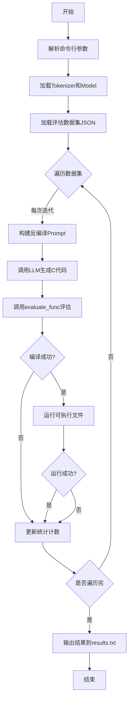
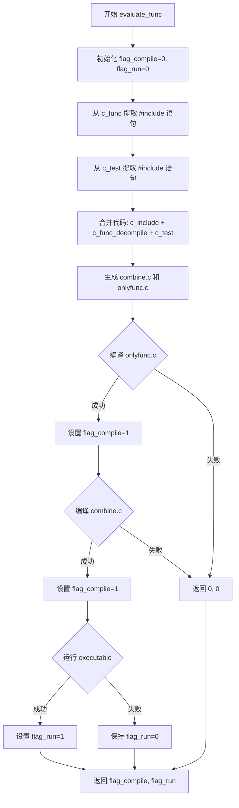
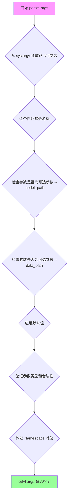
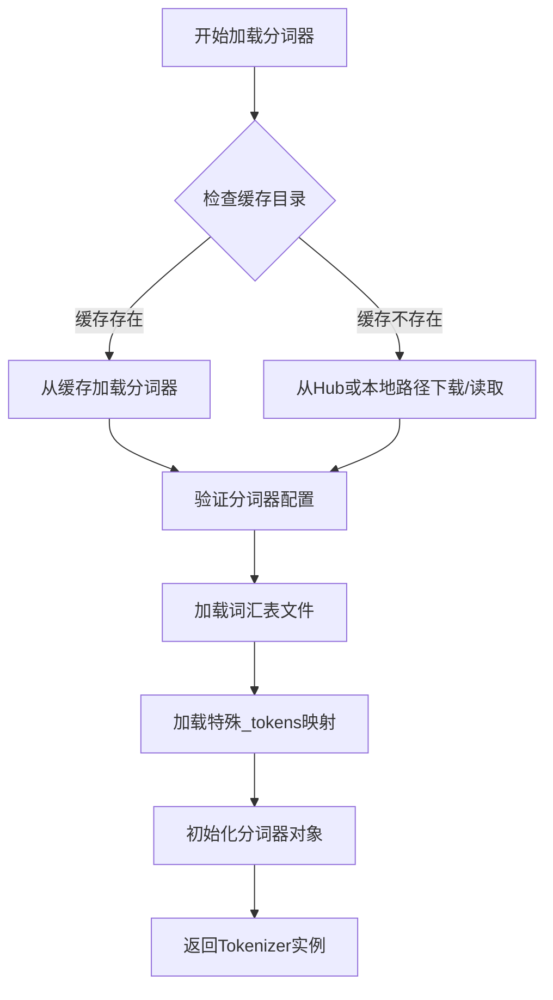
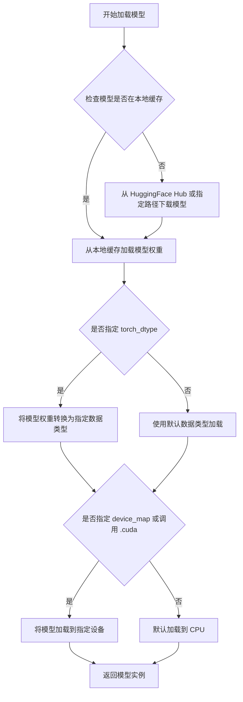
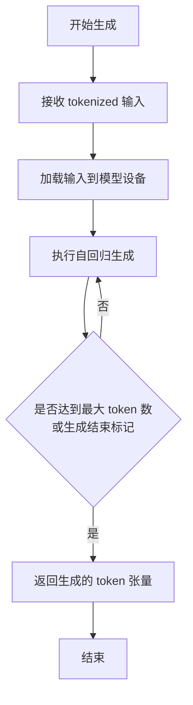

# `LLM4Decompile\evaluation\run_evaluation_llm4decompile_singleGPU.py` 详细设计文档

这是一个基于大语言模型的反编译评估框架，通过加载预训练的因果语言模型（如LLM4Decompile），将汇编代码反编译为C源代码，并评估反编译结果的可编译性和可运行性。

## 整体流程



## 类结构

```
Main Module (主程序脚本)
├── evaluate_func (评估函数)
├── Global Variables (全局变量)
│   ├── args (命令行参数)
│   ├── tokenizer (分词器)
│   ├── model (语言模型)
│   ├── OPT (优化级别列表)
│   ├── data_all (数据集)
│   ├── NUM (每级别样本数)
│   ├── num_compile (编译成功统计)
│   └── num_run (运行成功统计)
```

## 全局变量及字段


### `args`
    
存储命令行参数的对象，包含model_path和data_path两个属性

类型：`argparse.Namespace`
    


### `tokenizer`
    
HuggingFace AutoTokenizer实例，用于对输入的汇编提示进行分词处理

类型：`transformers.tokenization_utils_base.PreTrainedTokenizerBase`
    


### `model`
    
HuggingFace AutoModelForCausalLM实例，用于将汇编代码反编译为C源代码的因果语言模型

类型：`transformers.modeling_utils.PreTrainedModel`
    


### `OPT`
    
GCC编译器优化级别列表，包含O0、O1、O2、O3四种优化状态

类型：`List[str]`
    


### `data_all`
    
从JSON文件加载的评估数据集，包含汇编代码、C函数、测试用例和优化级别等信息

类型：`List[Dict[str, Any]]`
    


### `NUM`
    
每个优化级别的样本数量，通过总数据量除以4计算得出

类型：`int`
    


### `num_compile`
    
统计各优化级别编译成功次数的字典，键为优化级别字符串，值为编译成功次数

类型：`Dict[str, int]`
    


### `num_run`
    
统计各优化级别运行成功次数的字典，键为优化级别字符串，值为运行成功次数

类型：`Dict[str, int]`
    


    

## 全局函数及方法


### `evaluate_func`

该函数用于评估反编译结果的质量，接收原始C函数、测试代码和反编译后的代码，通过合并代码、编译并运行来验证反编译代码的正确性，最终返回编译和运行两个状态标志。

#### 参数

- `c_func`：`str`，原始C函数代码，包含待评估的函数实现
- `c_test`：`str`，测试代码，用于验证函数功能的正确性
- `c_func_decompile`：`str`，由反编译模型生成的反编译代码

#### 返回值

`tuple[int, int]`，包含两个整型状态标志：
- `flag_compile`：编译状态，1表示编译成功，0表示编译失败
- `flag_run`：运行状态，1表示运行成功，0表示运行失败

#### 流程图



#### 带注释源码

```python
def evaluate_func(c_func, c_test, c_func_decompile):
    """
    评估反编译结果的函数
    接收原始C函数、测试代码和反编译代码，编译并运行后返回编译和运行状态标志
    
    参数:
        c_func: 原始C函数代码
        c_test: 测试代码
        c_func_decompile: 反编译代码
    返回:
        flag_compile, flag_run: 编译和运行状态标志
    """
    # 初始化编译和运行状态标志为0（失败）
    flag_compile = 0
    flag_run = 0
    c_include = ''
    
    # 从原始函数中提取所有 #include 语句
    for line in c_func.split('\n'):
        if '#include' in line:
            c_include += line+'\n'
            c_include语句并从原代码中移除，避免重复
            c_func = c_func.replace(line, '')
    
    # 从测试代码中提取所有 #include 语句
    for line in c_test.split('\n'):
        if '#include' in line:
            c_include += line+'\n'
            c_test = c_test.replace(line, '')
    
    # 合并生成完整代码（包含函数和测试）
    c_combine = c_include + '\n' + c_func_decompile + '\n' + c_test
    # 仅包含函数的代码（用于编译测试）
    c_onlyfunc = c_include + '\n' + c_func_decompile

    # 定义C文件和可执行文件名称
    c_file = 'combine.c'
    executable = 'combine'
    
    # 清理已存在的可执行文件
    if os.path.exists(executable):
        os.remove(executable)

    c_file_onlyfunc = 'onlyfunc.c'
    executable_onlyfunc = 'onlyfunc'
    
    # 注意：此处存在bug，原代码为 os.remove(executable)，应为 executable_onlyfunc
    if os.path.exists(executable):
        os.remove(executable_onlyfunc)

    # 将合并代码写入文件
    with open(c_file,'w') as f:
        f.write(c_combine)
    with open(c_file_onlyfunc,'w') as f:
        f.write(c_onlyfunc)

    # 编译C程序生成汇编文件（仅函数）
    compile_command = f'gcc -S {c_file_onlyfunc} -o {executable_onlyfunc} -lm'
    try:
        subprocess.run(compile_command, shell=True, check=True)
        flag_compile = 1  # 编译成功
    except:
        return flag_compile, flag_run  # 编译失败直接返回

    # 编译C程序生成可执行文件（函数+测试）
    compile_command = f'gcc {c_file} -o {executable} -lm'
    try:
        subprocess.run(compile_command, shell=True, check=True)
        flag_compile = 1  # 编译成功
    except:
        return flag_compile, flag_run  # 编译失败直接返回

    # 运行编译后的可执行文件
    run_command = f'./{executable}'
    try:
        # 设置5秒超时，防止测试程序死循环
        process = subprocess.run(run_command, shell=True, check=True, capture_output=True, timeout=5)
        flag_run = 1  # 运行成功
    except subprocess.CalledProcessError as e:
        # 运行错误
        pass
    except Exception as e:
        # 超时或其他异常
        pass
    
    # 返回编译和运行状态
    return flag_compile, flag_run
```

### 文件整体运行流程

该脚本是一个基于LLM的反编译评估工具，主要流程如下：
1. 加载预训练的Causal LM模型（llm4decompile-6.7b-v1.5）
2. 读取包含汇编代码和C函数对的JSON数据集
3. 对每条数据使用模型将汇编代码反编译为C代码
4. 调用`evaluate_func`验证反编译结果的正确性
5. 统计不同优化级别（O0-O3）下的编译率和运行率
6. 将结果写入results.txt文件

### 全局变量和全局函数

| 名称 | 类型 | 描述 |
|------|------|------|
| `args` | `argparse.Namespace` | 命令行参数，包含model_path和data_path |
| `tokenizer` | `AutoTokenizer` | HuggingFace分词器，用于编码输入和解码输出 |
| `model` | `AutoModelForCausalLM` | 预训练的Causal LM模型（GPU加速） |
| `OPT` | `List[str]` | 优化级别列表["O0", "O1", "O2", "O3"] |
| `data_all` | `List[dict]` | 从JSON文件加载的完整数据集 |
| `NUM` | `int` | 每个优化级别的样本数量 |
| `num_compile` | `Dict[str, int]` | 各优化级别编译成功计数 |
| `num_run` | `Dict[str, int]` | 各优化级别运行成功计数 |

### 关键组件信息

| 组件名称 | 描述 |
|----------|------|
| `evaluate_func` | 核心评估函数，验证反编译代码的可编译性和可运行性 |
| `subprocess` | 用于执行gcc编译和运行可执行文件 |
| `transformers` | HuggingFace库，提供预训练模型和分词器 |
| `json` | 用于加载评估数据集 |

### 潜在的技术债务或优化空间

1. **文件清理Bug**：第43行 `if os.path.exists(executable):` 应检查 `executable_onlyfunc`，导致只清理了一个文件
2. **临时文件污染**：所有输出文件（combine.c, onlyfunc.c, combine, onlyfunc）都保存在当前目录，应使用临时目录或唯一文件名
3. **异常处理过于宽泛**：使用空的`except`块捕获所有异常，丢失了有价值的调试信息
4. **缺少资源清理**：编译生成的汇编文件（.s）未清理，且函数结束后未删除临时C文件
5. **超时设置硬编码**：运行超时时间5秒是硬编码的，应作为参数可配置
6. **缺乏日志记录**：编译/运行的错误信息被静默忽略，难以调试失败原因

### 其它项目

#### 设计目标与约束
- **目标**：评估大语言模型反编译二进制代码的质量
- **约束**：依赖gcc编译器，必须在Linux/Unix环境运行

#### 错误处理与异常设计
- 编译失败时立即返回，不继续执行
- 运行失败时仅捕获异常但不中断流程，继续统计
- 所有文件操作未检查写入权限

#### 数据流与状态机
```
输入数据(JSON) → 模型推理 → 反编译代码 → evaluate_func评估 → 统计结果 → 输出文件
```

#### 外部依赖与接口契约
- **模型依赖**：需要HuggingFace模型 `LLM4Binary/llm4decompile-6.7b-v1.5`
- **系统依赖**：需要安装gcc编译器
- **输入格式**：JSON文件需包含 `c_func`, `c_test`, `input_asm_prompt`, `type` 字段


### `parse_args()`

该函数是 `argparse.ArgumentParser` 类的隐式调用方法，用于解析命令行参数并返回一个包含所有参数值的命名空间对象。在本代码中，它解析 `--model_path` 和 `--data_path` 两个命令行参数。

参数：此函数没有显式参数，参数通过 `add_argument()` 方法在 `ArgumentParser` 配置阶段定义。

返回值：`Namespace`（命名空间对象），包含 `model_path` 和 `data_path` 属性，分别存储模型路径和数据集路径。

#### 流程图



#### 带注释源码

```python
# 创建 ArgumentParser 对象，用于管理命令行参数
parser = argparse.ArgumentParser()

# 添加 --model_path 参数：
# - type=str: 参数值为字符串类型
# - default='LLM4Binary/llm4decompile-6.7b-v1.5': 未提供时的默认值
# - required=False: 该参数为可选参数
parser.add_argument('--model_path', type=str, default='LLM4Binary/llm4decompile-6.7b-v1.5', required=False)

# 添加 --data_path 参数：
# - type=str: 参数值为字符串类型
# - default='../decompile-eval/decompile-eval-executable-gcc-obj.json': 未提供时的默认值
# - required=False: 该参数为可选参数
parser.add_argument('--data_path', type=str, default='../decompile-eval/decompile-eval-executable-gcc-obj.json', required=False)

# 调用 parse_args() 方法解析命令行参数
# 该方法会：
# 1. 从 sys.argv 获取命令行输入
# 2. 匹配参数名称与 add_argument 定义的可能值
# 3. 应用默认值（如果参数未提供）
# 4. 进行类型检查和验证
# 5. 返回包含所有参数值的 Namespace 对象
args = parser.parse_args()

# 访问解析后的参数值
# args.model_path: 模型路径字符串
# args.data_path: 数据集路径字符串
```


### `AutoTokenizer.from_pretrained()`

从预训练模型或HuggingFace Hub加载分词器（Tokenizer），支持从本地路径或远程模型仓库获取分词器配置和词汇表。

参数：

- `pretrained_model_name_or_path`：`str`，模型名称（如 "gpt2"、"bert-base-uncased"）或本地模型路径，用于指定要加载的分词器来源
- `*args`：`可变位置参数`，传递给底层分词器的额外参数
- `**kwargs`：`可变关键字参数`，可包含 `cache_dir`（缓存目录）、`force_download`（强制重新下载）、`token`（访问令牌）等

返回值：`PreTrainedTokenizer` 或 `PreTrainedTokenizerFast`，返回对应的分词器对象，包含词汇表、编码方法、解码方法等

#### 流程图



#### 带注释源码

```python
# 从HuggingFace Transformers库导入AutoTokenizer类
# AutoTokenizer是一个自动分词器工厂类,会根据模型类型自动选择合适的分词器

# 加载分词器的核心调用
tokenizer = AutoTokenizer.from_pretrained(args.model_path)

"""
from_pretrained() 方法内部执行流程:
1. 接收 pretrained_model_name_or_path 参数 (此处为 args.model_path)
2. 检查本地缓存目录 (~/.cache/huggingface/)
3. 若缓存不存在,从HuggingFace Hub下载模型文件
4. 读取 tokenizer_config.json 配置文件
5. 加载 vocab.json 或 tokenizer.json 词汇表文件
6. 加载 tokenizer.json 完整配置
7. 根据模型类型 (BERT/GPT/LLaMA等) 实例化对应的分词器类
8. 返回配置好的分词器对象

常见配置参数:
- cache_dir: 指定缓存目录
- use_fast: 是否使用快速分词器 (Rust实现)
- padding_side: padding方向 ('left' 或 'right')
- truncation: 是否截断
- max_length: 最大序列长度
"""
```


### `AutoModelForCausalLM.from_pretrained()`

这是 HuggingFace Transformers 库中的类方法，用于从预训练模型权重加载因果语言模型（Causal Language Model），支持指定模型路径、数据类型和设备等配置。

参数：

- `pretrained_model_name_or_path`：`str`，预训练模型的名称（如 "gpt-2"）或本地路径
- `torch_dtype`：`torch.dtype`（可选），指定模型权重的数据类型（如 `torch.bfloat16`）
- `device_map`：`str` 或 `dict`（可选），指定模型加载到哪个设备（如 "cuda"、"cpu"）
- `trust_remote_code`：`bool`（可选），是否信任远程代码
- 其他 HuggingFace 标准参数（如 `config`, `cache_dir`, `use_fast` 等）

返回值：`AutoModelForCausalLM`，返回加载好的因果语言模型实例

#### 流程图



#### 带注释源码

```python
# 从预训练模型加载因果语言模型的示例代码
# 位于主代码文件中的调用位置：

# 1. 使用 AutoModelForCausalLM.from_pretrained() 加载预训练模型
# 参数 args.model_path: 模型路径或模型名称 (str 类型)
# 参数 torch_dtype=torch.bfloat16: 指定模型权重使用 bfloat16 数据类型
model = AutoModelForCausalLM.from_pretrained(
    args.model_path,      # 预训练模型路径或名称
    torch_dtype=torch.bfloat16  # 使用 bfloat16 精度减少显存占用
).cuda()  # 将模型移动到 CUDA 设备（GPU）上运行

# 2. 设置填充 token（用于批处理）
tokenizer.pad_token = tokenizer.eos_token
tokenizer.pad_token_id = tokenizer.eos_token_id
model.config.pad_token_id = tokenizer.eos_token_id

# 后续使用示例：
# inputs = tokenizer(input_text, return_tensors="pt").to(model.device)
# outputs = model.generate(**inputs, max_new_tokens=512)
# generated_text = tokenizer.decode(outputs[0])
```

#### 技术细节说明

| 项目 | 说明 |
|------|------|
| **模型类型** | AutoModelForCausalLM 是用于因果语言建模的通用模型类 |
| **数据类型** | `bfloat16` 是 Brain Floating Point 格式，在 Ampere+ GPU 上可减少 50% 显存 |
| **设备迁移** | `.cuda()` 方法将模型从 CPU 移动到 GPU |
| **Tokenizer 配置** | 设置 pad_token 为 eos_token 以支持批处理生成 |


### `model.generate()`

这是 Hugging Face Transformers 库中 `AutoModelForCausalLM` 类的方法，用于根据输入的提示（这里是汇编代码）生成后续的文本（这里是反编译的 C 源代码）。在当前代码中，该方法接收经 tokenizer 处理后的输入张量，并指定最大生成 token 数为 512，用于实现从汇编代码到 C 源代码的反编译任务。

#### 参数

-  `**inputs`：`dict`，由 tokenizer 返回的字典，通常包含 `input_ids`（输入 token 的 ID 序列）和 `attention_mask`（注意力掩码，用于标识 padding 位置）。这些张量已被移动到模型所在的设备（GPU）上。
-  `max_new_tokens`：`int`，指定要生成的最大 token 数量，设置为 512。

#### 返回值

-  `outputs`：`torch.Tensor`，生成的 token 序列张量，形状为 `(batch_size, sequence_length)`。其中包含输入提示和生成的文本。

#### 流程图



#### 带注释源码

```python
# 在上下文中使用 torch.no_grad() 禁用梯度计算，节省显存和计算资源
with torch.no_grad():
    # 调用模型的 generate 方法进行自回归文本生成
    # **inputs: 解包 tokenizer 返回的字典，传递 input_ids 和 attention_mask
    # max_new_tokens=512: 限制最多生成 512 个新 token
    outputs = model.generate(**inputs, max_new_tokens=512)

# outputs 包含完整的序列（输入 + 生成内容）
# 使用 tokenizer.decode 将 token ID 解码为字符串
# [len(inputs[0]):] 切片操作去除输入部分，只保留生成的文本
# [:-1] 去除序列末尾的结束标记（如 </s> 或 eos_token）
c_func_decompile = tokenizer.decode(outputs[0][len(inputs[0]):-1])
```

#### 关键上下文信息

| 组件 | 描述 |
|------|------|
| `model` | `AutoModelForCausalLM` 实例，一个基于 Transformer 的因果语言模型，用于生成 C 源代码 |
| `inputs` | 经过 tokenization 的输入，包含汇编代码提示和任务描述 |
| `tokenizer` | `AutoTokenizer` 实例，用于文本与 token ID 之间的相互转换 |

#### 潜在的技术债务或优化空间

1. **生成策略单一**：当前仅使用 `max_new_tokens` 限制生成长度，未设置 `temperature`、`top_p`、`top_k` 等采样参数，可能导致生成文本多样性不足或质量不稳定。
2. **错误处理缺失**：`model.generate()` 调用未包含在 try-except 块中，若模型推理失败（如内存不足 OOM），程序会直接崩溃。
3. **资源管理**：未显式调用 `torch.cuda.empty_cache()` 清理缓存，且未对生成结果进行有效性检查（如检测是否包含语法错误的关键字）。
4. **批量推理**：当前逐条处理样本，未利用批量推理加速，可考虑累积一定批次后统一生成。


### tokenizer.encode / tokenizer.decode

描述：transformers库中的AutoTokenizer对象，用于将文本编码为模型输入张量（encode），以及将模型输出张量解码为文本（decode）。在当前代码中，使用tokenizer()方法（等价于encode）将输入提示编码为PyTorch张量，使用decode方法将模型生成的输出ID解码为可读文本。

参数：

-  `input_asm_prompt`：`str`，输入的汇编代码提示字符串，包含反编译任务的前缀和后缀提示
-  `return_tensors`：`str`，指定返回的张量类型，这里设置为"pt"表示PyTorch张量
-  `outputs[0]`：`torch.Tensor`，模型生成的输出token ID序列
-  `len(inputs[0])`：`int`，输入序列的长度，用于切片掉输入部分
-  `-1`：`int`，去掉最后一个token（通常是EOS token）

返回值：

-  `inputs`：`Dict[str, torch.Tensor]` 或 `BatchEncoding`，tokenizer编码后的字典，包含input_ids和attention_mask等
-  `c_func_decompile`：`str`，解码后的C语言源代码字符串

#### 流程图

```mermaid
flowchart TD
    A[开始] --> B[准备输入字符串 input_asm_prompt]
    B --> C[tokenizer 编码: tokenizer input_asm_prompt]
    C --> D[返回张量 inputs]
    D --> E[模型生成: model.generate inputs]
    E --> F[获得输出 token IDs]
    F --> G[切片输出: outputs[0][len(inputs[0]):-1]]
    G --> H[tokenizer 解码: tokenizer.decode]
    H --> I[返回源代码字符串 c_func_decompile]
    I --> J[结束]
    
    style A fill:#f9f,color:#000
    style J fill:#9f9,color:#000
```

#### 带注释源码

```python
# ============================================================
# tokenizer.encode / tokenizer.decode 使用示例
# ============================================================

# -------------------------
# 第一部分：tokenizer.encode (通过 tokenizer() 调用)
# -------------------------

# 构建输入提示，包含汇编代码和反编译请求
before = f"# This is the assembly code with {opt_state} optimization:\n"
after = "\n# What is the source code?\n"
input_asm_prompt = before + input_asm_prompt.strip() + after

# 使用 tokenizer 将字符串编码为模型输入张量
# 等价于 tokenizer.encode(input_asm_prompt)
# return_tensors="pt" 表示返回 PyTorch 张量
inputs = tokenizer(input_asm_prompt, return_tensors="pt").to(model.device)

# inputs 是一个 BatchEncoding 对象，包含:
# - input_ids: 输入token的ID序列
# - attention_mask: 注意力掩码
# inputs[0] 获取 input_ids 张量

# -------------------------
# 第二部分：模型生成
# -------------------------

# 禁用梯度计算以节省显存
with torch.no_grad():
    # 调用模型生成新的token
    # max_new_tokens=512 限制生成的最大token数
    outputs = model.generate(**inputs, max_new_tokens=512)

# outputs 形状: [batch_size, sequence_length]
# outputs[0] 获取第一个样本的所有token ID

# -------------------------
# 第三部分：tokenizer.decode
# -------------------------

# 切片获取生成的输出（去掉输入部分和最后的EOS token）
# len(inputs[0]) 是输入序列的长度
# -1 去掉最后一个token（通常是 EOS token）
generated_token_ids = outputs[0][len(inputs[0]):-1]

# 使用 tokenizer.decode 将 token IDs 解码为人类可读的字符串
# 这就是反编译得到的 C 语言源代码
c_func_decompile = tokenizer.decode(generated_token_ids)

# -------------------------
# 关键配置（确保pad和eos正确）
# -------------------------

# 设置 pad_token 与 eos_token 相同
tokenizer.pad_token = tokenizer.eos_token
tokenizer.pad_token_id = tokenizer.eos_token_id

# 同步更新模型的 pad_token_id 配置
model.config.pad_token_id = tokenizer.eos_token_id
```

#### 详细说明

| 项目 | 详情 |
|------|------|
| **对象类型** | `transformers.AutoTokenizer` |
| **模型路径** | `args.model_path` (默认: `LLM4Binary/llm4decompile-6.7b-v1.5`) |
| **encode 输入** | 字符串 (汇编代码提示) |
| **encode 输出** | `BatchEncoding` (包含 `input_ids`, `attention_mask`) |
| **decode 输入** | `torch.Tensor` (token IDs) |
| **decode 输出** | `str` (解码后的文本) |
| **eos_token_id** | 用于标识序列结束，解码时通常去掉 |


## 关键组件


### 预训练模型加载组件

负责加载用于反编译任务的因果语言模型（Causal LM），使用AutoTokenizer进行分词，AutoModelForCausalLM加载模型权重，并配置bf16量化以优化推理速度和显存占用。

### 分词器配置组件

配置分词器的pad_token为eos_token，确保模型在生成过程中正确处理变长序列，避免分词器并行警告。

### 评估函数组件

核心功能组件，接收原始C函数、测试函数和反编译结果，将#includes提取合并，使用gcc分别编译为只含函数版本和完整测试版本，执行编译和运行验证，返回编译和运行状态标志。

### 编译验证组件

调用subprocess.run执行gcc编译器，将C代码编译为可执行文件，设置编译超时和处理异常，返回编译是否成功的标志位。

### 运行验证组件

执行编译后的可执行文件，捕获输出和错误，设置5秒运行超时，判断程序是否能成功执行并返回运行状态标志。

### 推理生成组件

使用transformers模型的generate方法进行自回归生成，输入为包含汇编代码的prompt，指定max_new_tokens=512限制生成长度，使用torch.no_grad()禁用梯度计算以提升效率。

### Prompt构建组件

构建反编译任务的提示模板，将优化级别（O0/O1/O2/O3）嵌入提示，组合汇编代码前缀和反编译请求后缀，形成完整的模型输入。

### 数据加载与遍历组件

从JSON文件加载评估数据集，按优化级别分组计算样本总数，使用tqdm显示遍历进度，遍历所有数据条目进行处理。

### 统计与结果输出组件

按四种优化级别分别统计编译成功数和运行成功数，计算比率并将模型名称、优化级别和成功率追加写入results.txt文件。

### 命令行参数解析组件

使用argparse定义model_path和data_path两个可选参数，model_path默认为LLM4Binary/llm4decompile-6.7b-v1.5，data_path默认为相对路径的评估数据集。

### 优化级别常量组件

定义列表包含四种GCC优化级别O0、O1、O2、O3，用于遍历数据集时识别每个样本对应的编译优化状态。

### 环境变量配置组件

设置TOKENIZERS_PARALLELISM为false以禁用分词器多进程警告，避免潜在的死锁问题。


## 问题及建议


### 已知问题

- **资源泄漏与临时文件未清理**：代码创建的临时文件（`combine.c`、`onlyfunc.c`、`combine`、`onlyfunc`）在执行完成后未进行清理，随着循环执行会在磁盘上积累大量临时文件。
- **异常处理过于宽泛**：使用bare `except:`和`pass`捕获所有异常，导致真实的错误信息被隐藏，无法追踪编译或运行失败的具体原因。
- **变量使用逻辑错误**：`executable_onlyfunc`变量的删除逻辑中错误地使用了`os.path.exists(executable)`而非`executable_onlyfunc`，导致清理逻辑失效。
- **安全风险**：使用`shell=True`调用`subprocess.run()`存在命令注入风险，特别是在动态构建命令时。
- **代码重复与缺乏封装**：`#include`提取逻辑在循环中重复，且编译命令的构建方式存在重复代码，整体缺乏函数封装和模块化设计。
- **模型推理效率低**：未使用批量处理（batch inference），且每次推理都创建新的tokenizer输入，GPU利用率可能不足。
- **硬编码配置**：关键参数如`max_new_tokens=512`、`timeout=5`、优化级别列表`OPT`等硬编码在代码中，缺乏配置管理。
- **路径处理问题**：使用相对路径`../decompile-eval/`，且未检查文件是否存在即进行读取，可能导致`FileNotFoundError`。
- **缺乏日志记录**：没有适当的日志系统，仅使用`tqdm`显示进度，错误信息无法追踪和回溯。
- **Tokenizer并行警告**：虽然设置了`TOKENIZERS_PARALLELISM=false`，但未处理可能的其他transformers警告。

### 优化建议

- **实现上下文管理器或finally块**：使用`try-finally`或上下文管理器确保临时文件在任何情况下都能被清理。
- **细化异常处理**：根据具体异常类型（如`subprocess.CalledProcessError`、`subprocess.TimeoutExpired`、`FileNotFoundError`）分别捕获并记录详细错误信息。
- **修复变量逻辑错误**：将删除`executable_onlyfunc`的检查条件修正为`os.path.exists(executable_onlyfunc)`。
- **消除shell=True**：将命令拆分为列表形式传递，避免命令注入风险，例如`subprocess.run(['gcc', '-S', c_file_onlyfunc, '-o', executable_onlyfunc, '-lm'], check=True)`。
- **提取公共函数**：将编译、运行、文件清理等操作封装为独立函数，减少代码重复。
- **启用加速技术**：考虑使用`model.generate()`的`num_beams`、`use_cache`等参数优化推理速度；或使用`pipeline`结合批量推理。
- **外部化配置**：使用配置文件（如`.json`或`.yaml`）或命令行参数管理可配置项，或使用`dataclass`定义配置类。
- **增加输入验证**：在处理数据前检查文件路径有效性，对关键数据字段进行非空和类型校验。
- **引入日志框架**：使用`logging`模块替代print和直接输出，按级别记录INFO、WARNING、ERROR，便于调试和问题追踪。
- **添加重试机制**：对于临时性失败（如编译警告、运行时波动），可添加简单的重试逻辑提高鲁棒性。

## 其它


### 设计目标与约束

本项目旨在利用大语言模型将汇编代码反编译为C源代码，并通过编译和运行测试评估反编译质量。约束条件包括：模型仅支持Causal LM架构，输入汇编代码需符合特定格式要求，编译环境需安装gcc编译器，反编译结果必须通过编译和运行测试才算成功。

### 错误处理与异常设计

代码中实现了三层错误处理机制：文件操作层面的异常捕获（os.remove、open等），编译过程中的subprocess.run异常捕获（包含CalledProcessError和通用Exception），以及运行阶段的超时和执行错误处理。任何编译或运行失败都会返回flag_compile和flag_run状态码用于统计。但当前异常处理较为简单，错误信息未被记录或输出，调试困难。

### 数据流与状态机

数据流为：JSON输入数据→汇编提示词构建→Tokenizer编码→模型生成→解码反编译代码→C代码编译→可执行文件运行→结果统计。状态机包含四个优化级别（O0/O1/O2/O3）的数据分组，每个样本经历"待处理→生成中→编译中→运行中→已完成"的状态转换，统计编译成功和运行成功两种终态。

### 外部依赖与接口契约

主要依赖包括：transformers库（AutoTokenizer和AutoModelForCausalLM）、torch深度学习框架、Python标准库subprocess/os/json/re、gcc编译器。输入数据格式为JSON，需包含c_func（原始C函数）、c_test（测试用例）、input_asm_prompt（汇编代码）、type（优化级别）四个字段。输出结果写入results.txt文件，格式为模型名称、优化级别、编译率、运行率。

### 配置参数说明

本项目包含两个可配置参数：model_path指定预训练模型路径（默认LLM4Binary/llm4decompile-6.7b-v1.5），data_path指定输入数据JSON文件路径（默认../decompile-eval/decompile-eval-executable-gcc-obj.json）。还包含内部配置TOKENIZERS_PARALLELISM设为false以避免多进程冲突，模型采用bfloat16精度以降低显存占用，最大生成token数设为512。

### 安全性分析

代码存在安全风险：compile_command和run_command直接使用shell=True执行字符串命令，虽未使用用户输入构造命令但仍存在shell注入风险。临时文件combine.c和onlyfunc.c在当前目录创建，可能被恶意文件覆盖。编译和运行超时设置为5秒，但无内存限制保护。

### 性能优化空间

当前采用串行处理每个样本，GPU利用率可能不足。可改进方向包括：使用model.generate的batch_size参数进行批量推理，将evaluate_func中的文件IO操作合并减少磁盘访问，考虑使用线程池并行处理编译和运行阶段，添加GPU推理和CPU编译的流水线并行。

### 测试策略建议

应补充单元测试和集成测试：单元测试验证evaluate_func的各阶段逻辑（include提取、文件生成、编译状态判断），集成测试使用标准数据集评估模型准确率，还应包含性能基准测试（推理速度、编译成功率、运行成功率）。当前仅有端到端评估脚本。

### 运行环境要求

需要Linux/Unix系统环境（依赖gcc和shell命令），Python 3.8+，CUDA支持（模型需加载至GPU），建议显存16GB以上。临时文件将在当前工作目录生成，results.txt结果文件追加写入。

### 版本与变更历史

当前版本为初始实现，基于transformers 4.x系列设计。未包含版本管理、配置管理或变更日志机制，建议后续引入配置文件管理参数并添加版本标识。


    