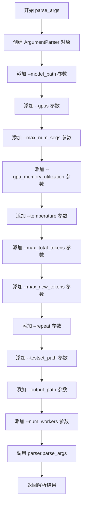
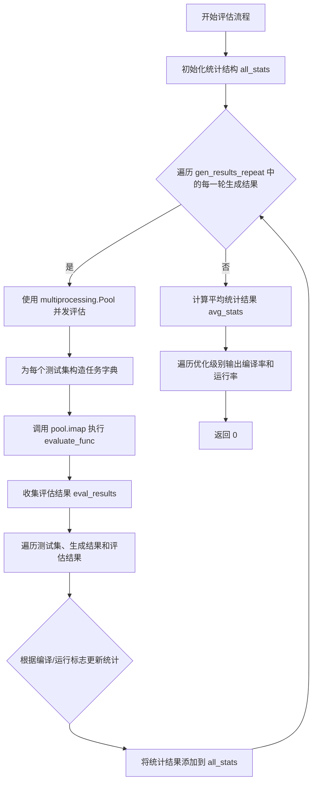
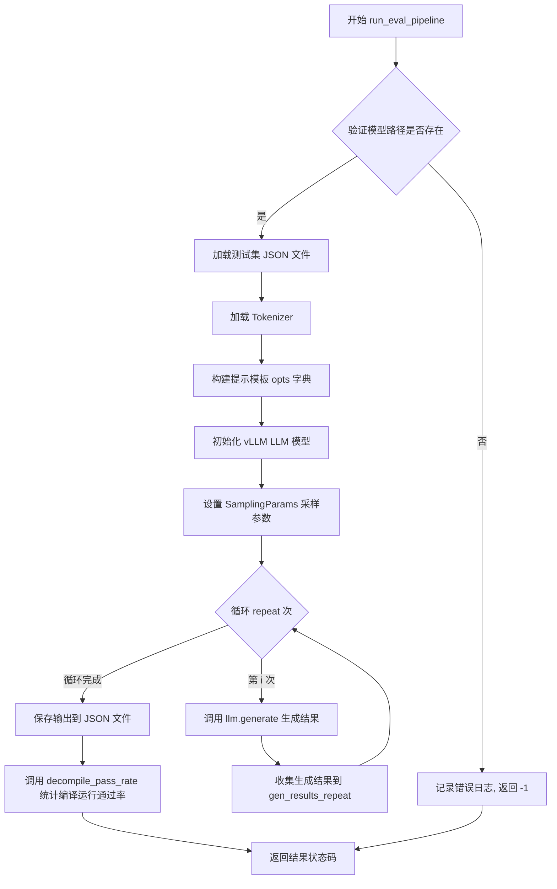
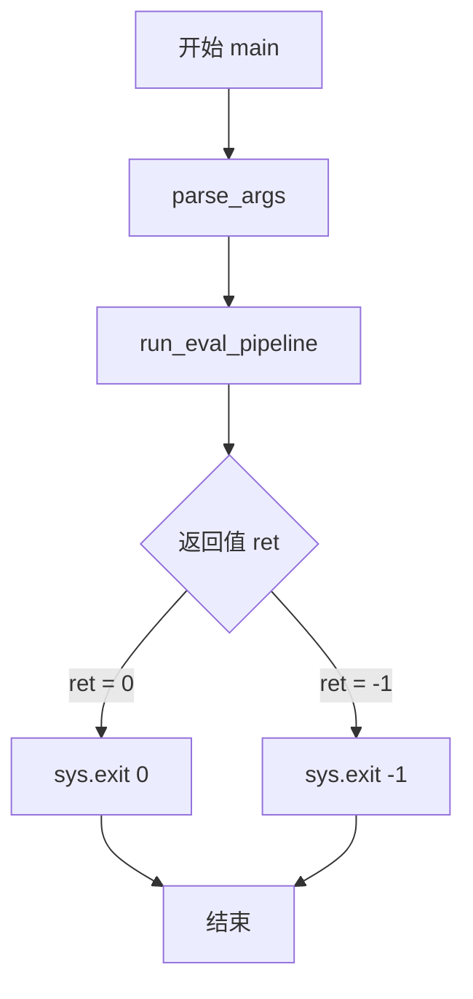

# `LLM4Decompile\evaluation\run_evaluation_llm4decompile_vllm.py` 详细设计文档

这是一个用于评估大型语言模型（LLM）在汇编代码反编译（Decompilation）任务上性能的评估框架。代码通过vLLM加载模型，将输入的汇编代码转换为C源码，然后使用GCC编译生成的C代码，并执行编译后的可执行文件，最后通过比较执行结果与测试集（Testset）来计算反编译任务的编译通过率和运行通过率。

## 整体流程

```mermaid
graph TD
    Start[程序入口 main] --> ParseArgs[parse_args: 解析命令行参数]
    ParseArgs --> RunPipeline[run_eval_pipeline: 执行评估流程]
    RunPipeline --> CheckModel[检查模型路径有效性]
    CheckModel --> LoadTestset[加载测试集 JSON]
    LoadTestset --> InitLLM[初始化 vLLM LLM 和 Tokenizer]
    InitLLM --> LoopRepeat[循环执行 args.repeat 次]
    LoopRepeat --> Generate[llm.generate: 调用模型生成 C 代码]
    Generate --> EvalPassRate[decompile_pass_rate: 计算通过率]
    EvalPassRate --> CreatePool[创建 multiprocessing.Pool]
    CreatePool --> TaskMap[pool.imap: 分发任务到 evaluate_func]
    subgraph evaluate_func [单任务执行 worker]
        TaskMap --> ExtractInc[提取 #include 头文件]
        ExtractInc --> WriteFiles[写入临时 C 文件]
        WriteFiles --> CompileAsm[subprocess: GCC 编译为汇编 (检查语法)]
        CompileAsm --> CompileExe[subprocess: GCC 编译为可执行文件]
        CompileExe --> RunExe[subprocess: 运行可执行文件]
        RunExe --> ReturnFlags[返回编译与运行标志位]
    end
    ReturnFlags --> AggregateStats[聚合统计数据]
    AggregateStats --> SaveOutput[保存结果到 JSON]
    SaveOutput --> PrintStats[打印编译与运行率]
    PrintStats --> End[结束]
```

## 类结构

```
Script Entry (无类结构，基于函数式流程)
├── parse_args (参数解析)
├── run_eval_pipeline (主逻辑控制器)
│   ├── Data Loader (JSON loading)
│   ├── LLM Inference (vllm)
│   └── Evaluation Logic
│       └── decompile_pass_rate (统计与多进程管理)
│           └── evaluate_func (单样本评测 Worker)
└── main (入口)
```

## 全局变量及字段


### `logger`
    
日志记录器实例，用于输出程序运行时的日志信息

类型：`loguru.logger`
    


### `os.environ`
    
系统环境变量字典，用于设置TOKENIZERS_PARALLELISM为true以启用tokenizer并行处理

类型：`dict`
    


    

## 全局函数及方法


### `parse_args`

该函数是命令行参数解析函数，使用 Python 的 `argparse` 库定义并添加所有必要的命令行参数，然后调用 `parse_args()` 方法解析命令行输入并返回 `Namespace` 对象（类型提示为 `ArgumentParser`）。

参数： 无（该函数不接受任何输入参数）

返回值：`ArgumentParser`，返回解析后的命令行参数对象（实际上返回的是 `argparse.Namespace` 类型，但类型提示声明为 `ArgumentParser`）

#### 流程图



#### 带注释源码

```python
def parse_args() -> ArgumentParser:
    """
    解析命令行参数并返回解析后的参数对象
    
    该函数使用 argparse 模块定义项目所需的所有命令行参数，
    包括模型路径、GPU 配置、推理参数、测试集路径等。
    返回的命名空间对象包含所有解析后的参数值。
    
    Returns:
        ArgumentParser: 解析后的命令行参数对象（实际为 Namespace 类型）
    """
    # 创建 ArgumentParser 实例，用于解析命令行参数
    parser = ArgumentParser()
    
    # 添加模型路径参数（必需）
    parser.add_argument("--model_path", type=str)
    
    # 添加 GPU 数量参数，默认值为 8
    parser.add_argument("--gpus", type=int, default=8)
    
    # 添加最大序列数参数，默认值为 8
    parser.add_argument("--max_num_seqs", type=int, default=8)
    
    # 添加 GPU 内存利用率参数，默认值为 0.82
    parser.add_argument("--gpu_memory_utilization", type=float, default=0.82)
    
    # 添加温度参数，用于采样控制，默认值为 0
    parser.add_argument("--temperature", type=float, default=0)
    
    # 添加最大总 token 数参数，默认值为 8192
    parser.add_argument("--max_total_tokens", type=int, default=8192)
    
    # 添加最大新生成 token 数参数，默认值为 512
    parser.add_argument("--max_new_tokens", type=int, default=512)
    
    # 添加重复实验次数参数，默认值为 1
    parser.add_argument("--repeat", type=int, default=1)
    
    # 添加测试集路径参数（必需）
    parser.add_argument("--testset_path", type=str)
    
    # 添加输出路径参数，默认为 None
    parser.add_argument("--output_path", type=str, default=None)
    
    # 添加工作进程数参数，默认值为 16
    parser.add_argument("--num_workers", type=int, default=16)
    
    # 解析命令行参数并返回
    return parser.parse_args()
```


### `evaluate_func`

该函数接收包含原始C函数代码、反编译C函数代码和测试代码的参数字典，通过提取头文件、组合代码、调用GCC编译为汇编和可执行文件，并执行程序以验证反编译结果的可编译性和可运行性，最终返回编译和运行的标志位。

参数：

- `params`：`dict`，包含以下键的参数字典：
  - `c_func`：原始C函数代码（字符串）
  - `c_test`：C测试代码（字符串）
  - `c_func_decompile`：反编译的C函数代码（字符串）

返回值：`tuple[int, int]`，返回(flag_compile, flag_run)元组，其中flag_compile表示编译是否成功(1成功/0失败)，flag_run表示运行是否成功(1成功/0失败)

#### 流程图

```mermaid
flowchart TD
    A[开始] --> B[从params提取c_func, c_test, c_func_decompile]
    B --> C[初始化timeout=10, flag_compile=0, flag_run=0]
    C --> D[遍历c_func提取#include语句]
    D --> E[遍历c_test提取#include语句]
    E --> F[组合代码: c_include + c_func_decompile + c_test]
    F --> G[创建只含函数的代码: c_include + c_func_decompile]
    G --> H[创建临时目录]
    H --> I[写入combine_{pid}.c和onlyfunc_{pid}.c文件]
    I --> J[编译为汇编: gcc -S onlyfunc_{pid}.c -o onlyfunc_{pid}]
    J --> K{编译成功?}
    K -->|是| L[flag_compile=1]
    K -->|否| M[返回0, 0]
    L --> N[编译为可执行: gcc combine_{pid}.c -o combine_{pid}]
    N --> O{编译成功?}
    O -->|是| P[flag_compile=1]
    O -->|否| M
    P --> Q[运行可执行文件]
    Q --> R{运行成功?}
    R -->|是| S[flag_run=1]
    R -->|否| T[杀死进程]
    T --> M
    S --> U[返回flag_compile, flag_run]
    M --> U
```

#### 带注释源码

```python
def evaluate_func(params):
    """
    评估反编译的C函数代码的可编译性和可运行性
    
    Args:
        params: 包含c_func, c_test, c_func_decompile的字典
        
    Returns:
        tuple: (flag_compile, flag_run) 编译和运行状态标志
    """
    # 从参数字典中提取三个C代码组件
    c_func, c_test, c_func_decompile = (
        params["c_func"],
        params["c_test"],
        params["c_func_decompile"],
    )

    timeout = 10  # 编译和运行超时时间(秒)
    flag_compile = 0  # 编译成功标志,0失败,1成功
    flag_run = 0  # 运行成功标志,0失败,1成功
    c_include = ""  # 存储提取的#include语句
    
    # 从c_func中提取所有#include语句
    for line in c_func.split("\n"):
        if "#include" in line:
            c_include += line + "\n"  # 保存include语句
            c_func = c_func.replace(line, "")  # 从原代码中移除
    
    # 从c_test中提取所有#include语句
    for line in c_test.split("\n"):
        if "#include" in line:
            c_include += line + "\n"
            c_test = c_test.replace(line, "")
    
    # 组合完整代码: include头文件 + 反编译函数 + 测试代码
    c_combine = c_include + "\n" + c_func_decompile + "\n" + c_test
    # 组合仅函数代码: include头文件 + 反编译函数(用于编译到汇编)
    c_onlyfunc = c_include + "\n" + c_func_decompile

    # 使用临时目录存储编译过程文件
    with tempfile.TemporaryDirectory() as temp_dir:
        pid = os.getpid()  # 获取当前进程ID用于区分文件名
        
        # 构建编译和可执行文件路径
        c_file = os.path.join(temp_dir, f"combine_{pid}.c")
        executable = os.path.join(temp_dir, f"combine_{pid}")
        c_file_onlyfunc = os.path.join(temp_dir, f"onlyfunc_{pid}.c")
        executable_onlyfunc = os.path.join(temp_dir, f"onlyfunc_{pid}")

        # 将组合代码写入C源文件
        with open(c_file, "w") as f:
            f.write(c_combine)
        with open(c_file_onlyfunc, "w") as f:
            f.write(c_onlyfunc)

        # 第一步: 编译C程序到汇编代码(-S选项)
        # 使用gcc -S生成汇编文件,验证代码语法正确性
        compile_command = [
            "gcc",
            "-S",
            c_file_onlyfunc,
            "-o",
            executable_onlyfunc,
            "-lm",  # 链接数学库
        ]
        try:
            subprocess.run(compile_command, check=True, timeout=timeout)
            flag_compile = 1  # 汇编编译成功
        except:
            # 编译失败直接返回,无需继续
            return flag_compile, flag_run

        # 第二步: 编译C程序到可执行文件
        compile_command = ["gcc", c_file, "-o", executable, "-lm"]
        try:
            subprocess.run(compile_command, check=True, timeout=timeout)
            flag_compile = 1  # 可执行文件编译成功
        except:
            return flag_compile, flag_run

        # 第三步: 运行编译后的可执行文件
        run_command = [executable]
        try:
            process = subprocess.run(
                run_command, capture_output=True, text=True, timeout=timeout, check=True
            )
            flag_run = 1  # 程序运行成功
        except:
            # 运行失败时确保终止进程
            if "process" in locals() and process:
                process.kill()
                process.wait()
            return flag_compile, flag_run

    # 返回编译和运行状态
    return flag_compile, flag_run
```


### `decompile_pass_rate`

该函数是反编译评估流程的核心，负责评估模型生成的反编译代码的成功率。它通过多进程并发编译和运行C代码，统计不同优化级别（如O0、O1、O2、O3）下的编译成功率和运行成功率，并计算多次运行结果的平均值，最终输出评估报告。

参数：

- `testsets`：列表，每个元素为字典，包含测试集的详细信息（如原始C代码、测试代码等）。
- `gen_results_repeat`：列表，多轮生成的结果列表，每一轮生成结果是一个列表，包含模型对每个测试集的输出。
- `opts`：字典，优化级别到提示前缀的映射，如 `{"O0": "...", "O1": "...", ...}`，用于区分不同的编译优化级别。
- `args`：ArgumentParser 对象，包含命令行参数，如 `num_workers`（并发 worker 数量）等配置。

返回值：`int`，返回0表示评估流程正常结束，非0表示异常（虽然当前实现总是返回0，但设计为支持错误码）。

#### 流程图



#### 带注释源码

```python
def decompile_pass_rate(testsets, gen_results_repeat, opts, args):
    """
    评估反编译结果的成功率，包括编译成功率和运行成功率。
    
    参数:
        testsets: 包含测试集信息的列表，每个测试集是一个字典。
        gen_results_repeat: 多轮模型生成的输出结果列表。
        opts: 优化级别（如 O0, O1, O2, O3）到提示前缀的映射。
        args: 命令行参数对象，包含 num_workers 等配置。
    
    返回:
        int: 返回 0 表示正常结束。
    """
    all_stats = []  # 用于存储每一轮评估的统计结果

    # 遍历每一轮生成的结果
    for gen_index, gen_results in enumerate(gen_results_repeat):
        # 创建多进程池，并发执行评估任务
        with multiprocessing.Pool(args.num_workers) as pool:
            # 构造任务列表，每个任务包含原始函数、测试代码和反编译结果
            tasks = [
                {
                    "c_func": testset["c_func"],
                    "c_test": testset["c_test"],
                    "c_func_decompile": output[0],
                }
                for testset, output in zip(testsets, gen_results)
            ]

            # 使用 tqdm 显示评估进度
            eval_results = list(tqdm(pool.imap(evaluate_func, tasks), total=len(tasks)))

        # 关闭并等待进程池结束
        pool.terminate()
        pool.join()

        # 初始化当前轮次的统计结构，按优化级别统计
        stats = {opt: {"compile": 0, "run": 0, "total": 0} for opt in opts}
        
        # 遍历测试集、生成结果和评估结果，进行统计
        for idx, (testset, output, flag) in enumerate(
            tqdm(
                zip(testsets, gen_results, eval_results),
                total=len(testsets),
                desc="Evaluating",
            )
        ):
            c_func_decompile = output[0]  # 反编译结果
            c_func = testset["c_func"]     # 原始函数代码
            c_test = testset["c_test"]     # 测试代码

            flag_compile, flag_run = flag[0], flag[1]  # 编译和运行标志
            opt = testset["type"]  # 优化级别（如 O0, O1 等）

            # 更新统计信息
            stats[opt]["total"] += 1
            if flag_compile:
                stats[opt]["compile"] += 1
            if flag_run:
                stats[opt]["run"] += 1

        # 将当前轮次的统计结果添加到 all_stats
        all_stats.append(stats)

    # 计算所有轮次的平均统计结果
    avg_stats = {opt: {"compile": 0, "run": 0, "total": 0} for opt in opts}
    for stats in all_stats:
        for opt in opts:
            avg_stats[opt]["compile"] += stats[opt]["compile"]
            avg_stats[opt]["run"] += stats[opt]["run"]
            avg_stats[opt]["total"] += stats[opt]["total"]

    # 计算平均值
    for opt in opts:
        avg_stats[opt]["compile"] /= len(gen_results_repeat)
        avg_stats[opt]["run"] /= len(gen_results_repeat)
        avg_stats[opt]["total"] /= len(gen_results_repeat)

    # 打印每个优化级别的编译率和运行率
    for opt, data in avg_stats.items():
        compile_rate = data["compile"] / data["total"] if data["total"] > 0 else 0
        run_rate = data["run"] / data["total"] if data["total"] > 0 else 0
        print(
            f"Optimization {opt}: Compile Rate: {compile_rate:.4f}, Run Rate: {run_rate:.4f}"
        )

    return 0
```


### `run_eval_pipeline`

该函数是整个评估流程的核心入口，负责加载测试集、使用vLLM加载LLM模型进行推理生成C代码、编译运行生成的代码以评估反编译质量，并计算编译通过率和运行通过率。

参数：

- `args`：`ArgumentParser`，命令行参数对象，包含模型路径、GPU数量、测试集路径等配置

返回值：`int`，返回执行状态码，0表示成功，-1表示失败

#### 流程图



#### 带注释源码

```python
def run_eval_pipeline(args: ArgumentParser) -> int:
    """
    评估管道主函数，负责加载模型、生成代码、评估反编译质量
    
    参数:
        args: 命令行参数解析器对象，包含以下关键属性:
            - model_path: 模型路径
            - testset_path: 测试集JSON文件路径
            - output_path: 输出文件路径
            - gpus: GPU数量
            - max_total_tokens: 最大token数
            - gpu_memory_utilization: GPU显存利用率
            - temperature: 采样温度
            - max_new_tokens: 最大生成token数
            - repeat: 重复生成次数
    
    返回:
        int: 0表示成功, -1表示失败
    """
    # 获取模型路径的Path对象
    model_path = Path(args.model_path)
    
    # 检查模型路径是否有效（存在且为目录）
    if not model_path.exists() or not model_path.is_dir():
        logger.error(f"Invalid model {model_path}")
        return -1

    try:
        # 加载测试集JSON文件
        testsets = json.load(open(args.testset_path, "r"))
        logger.info(f"Loaded testset with {len(testsets)} cases")
        
        # 从预训练模型加载Tokenizer
        tokenizer = AutoTokenizer.from_pretrained(model_path)
        
        # 设置停止序列为EOS token
        stop_sequences = [tokenizer.eos_token]

        # 定义不同优化级别的提示前缀
        # O0-O3 代表GCC的不同优化级别
        opts = {
            "O0": "# This is the assembly code:\n",
            "O1": "# This is the assembly code:\n",
            "O2": "# This is the assembly code:\n",
            "O3": "# This is the assembly code:\n",
        }

        # 反编译询问后缀
        after = "\n# What is the source code?\n"
        
        # 构建输入提示列表
        inputs = []
        for testset in testsets:
            input_asm_prompt = testset["input_asm_prompt"]  # 汇编代码提示
            opt = testset["type"]  # 优化级别 (O0/O1/O2/O3)
            # 组合完整提示: 优化级别前缀 + 汇编代码 + 询问后缀
            prompt = opts[opt] + input_asm_prompt + after
            inputs.append(prompt)

        # 使用vLLM初始化大型语言模型
        # tensor_parallel_size: 模型并行使用的GPU数量
        llm = LLM(
            model=args.model_path,
            tensor_parallel_size=args.gpus,
            max_model_len=args.max_total_tokens,
            gpu_memory_utilization=args.gpu_memory_utilization,
        )

        # 配置采样参数
        sampling_params = SamplingParams(
            temperature=args.temperature,
            max_tokens=args.max_new_tokens,
            stop=stop_sequences,
        )

        # 存储多次重复生成的结果
        gen_results_repeat = []
        logger.info(f"The exp will loop for {args.repeat} times....")
        
        # 循环生成（用于多次采样评估稳定性）
        for i in range(args.repeat):
            logger.info(f"The {i+1} loop...")
            # 调用LLM生成文本
            gen_results = llm.generate(inputs, sampling_params)
            # 提取生成文本（vLLM返回格式处理）
            gen_results = [[output.outputs[0].text] for output in gen_results]
            gen_results_repeat.append(gen_results)

    except Exception as e:
        # 捕获并记录任何异常
        logger.error(e)
        traceback.print_exc()
        return -1

    # 准备保存的数据
    save_data = []
    for testset, res in zip(testsets, gen_results_repeat[0]):
        testset["output"] = res[0]  # 添加生成结果到测试集
        save_data.append(testset)

    # 如果指定了输出路径，保存结果到JSON文件
    if args.output_path:
        with open(args.output_path, "w") as f:
            json.dump(save_data, f, indent=4, ensure_ascii=True)

    # 调用评估函数计算编译和运行通过率
    ret = decompile_pass_rate(testsets, gen_results_repeat, opts, args)
    return ret
```


# 详细设计文档

## 1. 代码核心功能概述

该代码实现了一个反编译模型评估框架，通过vLLM加载大型语言模型，将汇编代码反编译为C源代码，然后使用GCC编译生成的代码并执行测试用例，最终计算不同优化级别（O0-O3）下的编译通过率和运行通过率。

## 2. 文件整体运行流程

```
main()
    │
    ├─→ parse_args()              # 解析命令行参数
    │
    └─→ run_eval_pipeline(args)
            │
            ├─→ 加载测试集 (json)
            ├─→ 加载分词器 (AutoTokenizer)
            ├─→ 构建提示词 (opts + input_asm_prompt + after)
            │
            ├─→ 初始化 LLM (vLLM)
            │
            └─→ 循环评估 (repeat次)
                    │
                    └─→ llm.generate()  # 生成反编译结果
                            │
                            └─→ decompile_pass_rate()
                                    │
                                    ├─→ multiprocessing.Pool
                                    │       │
                                    │       └─→ evaluate_func()  # 编译+运行C代码
                                    │               │
                                    │               ├─→ 提取#include
                                    │               ├─→ 合并C代码
                                    │               ├─→ gcc -S (编译到汇编)
                                    │               └─→ gcc (编译可执行文件) + 运行
                                    │
                                    └─→ 统计编译/运行通过率
```

## 3. 全局变量和全局函数详细信息

### 3.1 全局函数

#### `parse_args()`

- **参数**: 无
- **返回**: `ArgumentParser`，命令行参数解析器对象
- **描述**: 使用argparse解析命令行参数，包括模型路径、GPU数量、采样参数等配置

#### `evaluate_func(params)`

- **参数**: 
  - `params`: `dict`，包含`c_func`（原始C函数）、`c_test`（测试代码）、`c_func_decompile`（反编译的C代码）
- **返回**: `tuple[int, int]`，`(flag_compile, flag_run)`编译和运行状态标志
- **描述**: 评估单个反编译结果，提取include语句，合并C代码，使用gcc编译并运行测试

#### `decompile_pass_rate(testsets, gen_results_repeat, opts, args)`

- **参数**:
  - `testsets`: `list`，测试集列表
  - `gen_results_repeat`: `list`，模型生成的重复结果
  - `opts`: `dict`，优化级别选项（O0-O3）
  - `args`: `ArgumentParser`，命令行参数
- **返回**: `int`，评估结果状态码
- **描述**: 使用多进程池评估所有测试用例，计算并打印各优化级别的编译通过率和运行通过率

#### `run_eval_pipeline(args)`

- **参数**:
  - `args`: `ArgumentParser`，命令行参数解析结果
- **返回**: `int`，执行状态码（0成功，-1失败）
- **描述**: 评估流程的主函数，加载模型和测试集，执行推理，调用decompile_pass_rate计算结果

#### `main()`

- **参数**: 无
- **返回**: 无返回值，通过`sys.exit(ret)`退出
- **描述**: 程序入口函数，解析参数并执行评估流程

## 4. 关键组件信息

| 组件名称 | 描述 |
|---------|------|
| `vLLM (LLM)` | 高效的大型语言模型推理引擎，支持张量并行 |
| `AutoTokenizer` | Hugging Face transformers库的分词器 |
| `multiprocessing.Pool` | 多进程并行处理评估任务 |
| `subprocess` | 执行gcc编译和运行C程序 |
| `tempfile` | 创建临时目录存储编译文件 |
| `tqdm` | 显示进度条 |
| `loguru` | 日志记录 |

## 5. 潜在的技术债务和优化空间

1. **错误处理不完善**: `evaluate_func`中使用空的`except`块捕获所有异常，隐藏了真实错误信息
2. **资源泄露风险**: `multiprocessing.Pool`在`decompile_pass_rate`中显式调用`terminate()`和`join()`，但如果中间出错可能未正确清理
3. **硬编码超时**: 编译和运行超时固定为10秒，对于复杂程序可能不够
4. **内存效率**: 加载所有测试集到内存，可能在大规模测试时内存占用过高
5. **并行度配置**: `num_workers`默认为16，但未根据CPU核心数动态调整
6. **重复代码**: 编译命令（gcc）有重复，可以抽象成函数
7. **临时文件清理**: 使用`tempfile.TemporaryDirectory()`，但在大规模并行时可能产生大量临时文件

## 6. 其他项目

### 6.1 设计目标与约束

- **目标**: 评估反编译模型在不同优化级别（O0-O3）下的编译和运行通过率
- **约束**: 
  - 需要GPU运行vLLM
  - 依赖gcc编译器
  - 测试用例必须是可执行的C代码

### 6.2 错误处理与异常设计

- 使用`try-except`捕获编译和运行错误
- 全局使用`loguru`记录错误信息
- `traceback.print_exc()`打印详细堆栈
- 返回`-1`表示失败，`0`表示成功

### 6.3 数据流与状态机

```
输入数据 (JSON测试集)
    ↓
构建提示词 (Assembly + Prompt)
    ↓
LLM推理 (生成C代码)
    ↓
多进程评估 (编译+运行)
    ↓
统计结果 (Compile Rate, Run Rate)
    ↓
输出 (JSON + Console输出)
```

### 6.4 外部依赖与接口契约

- **模型接口**: 需要Hugging Face格式的预训练模型路径
- **测试集格式**: JSON数组，每个元素包含`input_asm_prompt`、`c_func`、`c_test`、`type`
- **输出格式**: JSON文件，包含原始测试集+`output`字段

---

### `main`

程序入口点，解析命令行参数并启动评估流程。

参数：无

返回值：无返回值，通过`sys.exit(ret)`退出进程

#### 流程图



#### 带注释源码

```python
def main():
    """
    主函数，程序入口点。
    1. 解析命令行参数
    2. 运行评估流程
    3. 根据评估结果退出程序
    """
    # 步骤1: 解析命令行参数
    args = parse_args()
    
    # 步骤2: 运行完整的评估流程
    # 包括: 加载模型 → 生成反编译结果 → 编译运行测试 → 统计通过率
    ret = run_eval_pipeline(args)
    
    # 步骤3: 根据评估结果退出程序
    # ret=0 表示评估成功完成
    # ret=-1 表示评估过程中发生错误
    sys.exit(ret)
```

## 关键组件


### parse_args

解析命令行参数，包括模型路径、GPU数量、测试集路径等配置，返回 ArgumentParser 对象。

### evaluate_func

评估单个反编译结果，将反编译的C代码与测试代码合并，写入临时文件，使用gcc编译为可执行文件和汇编文件，运行可执行文件，捕获编译和运行错误，返回编译和运行标志（元组）。

### decompile_pass_rate

计算反编译通过率，使用多进程池并行评估所有测试集，对每个测试集调用evaluate_func，统计各个优化级别（O0, O1, O2, O3）的编译成功和运行成功次数，计算平均值并打印编译率和运行率。

### run_eval_pipeline

运行整个评估流程，加载模型和测试集，构造输入提示，使用vLLM生成反编译代码，调用decompile_pass_rate计算通过率，可选地将结果保存到JSON文件，返回状态码。

### main

主函数，解析命令行参数，调用run_eval_pipeline，根据返回值退出进程。

### 潜在技术债务

- evaluate_func中临时文件操作可能存在并发冲突，应使用更安全的文件命名或锁机制。
- 编译和运行超时时间硬编码为10秒，缺乏灵活性。
- 多进程池使用后虽调用了terminate和join，但未使用上下文管理器，可能导致资源泄漏。
- 错误处理过于宽泛，大多数异常仅打印堆栈，可能隐藏潜在问题。

### 设计目标与约束

- 设计目标：自动化评估大语言模型将汇编代码反编译为C语言代码的准确性和可靠性。
- 约束：依赖gcc编译器，模型需具备生成C代码的能力，测试集需包含input_asm_prompt和type字段。

### 错误处理

- 使用try-except捕获编译和运行异常，但部分异常未重新抛出，仅返回标志。
- 文件操作和进程调用均设置超时，防止无限等待。

### 数据流

- 输入：测试集JSON文件，包含汇编提示、C函数代码、测试代码。
- 处理：生成反编译代码 → 编译为可执行文件 → 运行并捕获输出 → 统计结果。
- 输出：反编译结果JSON文件（可选）、编译率和运行率统计。

### 外部依赖

- vllm：用于加载大模型并生成文本。
- transformers：加载分词器。
- subprocess：调用gcc编译和运行C代码。
- multiprocessing：并行评估。

## 问题及建议


### 已知问题

- **资源管理缺陷**：`evaluate_func` 中的临时文件操作和进程管理存在资源泄漏风险，`process` 变量在未定义时可能被引用；`subprocess.run` 的 `check=True` 在编译失败时会抛出异常但未正确处理
- **重复调用 multiprocessing.Pool**：`decompile_pass_rate` 函数在循环内部为每个 `gen_results` 重新创建 Pool，导致进程创建开销重复，且 `pool.terminate()` 和 `pool.join()` 调用是多余的（with 语句已自动清理）
- **内存效率低下**：`gen_results_repeat` 将所有重复实验的结果存储在内存中，对于大规模数据集会造成内存压力；`json.load` 未使用上下文管理器
- **异常处理不规范**：多处使用裸 `except:` 捕获所有异常，隐藏了真实错误信息；`evaluate_func` 中编译和运行失败时提前返回，未进行资源清理
- **代码重复**：编译命令列表 (`compile_command`) 构建逻辑重复；`opts` 字典中所有值相同但未提取为常量；`stats` 字典初始化逻辑重复
- **性能优化不足**：LLM 推理未使用批处理优化；`pool.imap` 可改为 `imap_unordered` 提升吞吐量；重复循环中每次都重新生成输入列表
- **并发安全隐患**：临时文件命名仅使用 `pid`，在多进程场景下可能产生文件名冲突；缺乏对并发写入输出文件的保护机制

### 优化建议

- **重构资源管理**：使用上下文管理器确保临时文件和进程资源正确释放；将 `process` 初始化为 `None` 并在 `except` 块中检查
- **池化复用**：将 `multiprocessing.Pool` 创建移到循环外部，避免重复创建开销；移除冗余的 `terminate()` 和 `join()` 调用
- **改进异常处理**：使用具体的异常类型替换裸 `except:`；为关键操作添加重试机制和详细的错误日志
- **代码解耦与复用**：提取重复的编译命令构建逻辑为独立函数；将 `# This is the assembly code:\n` 等常量提取为模块级变量
- **性能优化**：利用 vLLM 的批处理能力合并推理请求；使用 `imap_unordered` 替代 `imap` 提升并行效率；实现流式处理或分批保存结果以降低内存占用
- **增强安全性**：使用 `tempfile.mkstemp` 或 UUID 生成更安全的临时文件名；为输出文件写入添加锁机制或使用原子写入
- **配置外部化**：将超时时间、编译参数等硬编码值通过配置文件或命令行参数管理；添加输入验证逻辑

## 其它


### 设计目标与约束

该代码旨在构建一个自动化反编译评估管道，通过vLLM大模型将汇编代码反编译为C源代码，并使用GCC编译和执行来验证反编译结果的正确性。设计约束包括：1）使用vLLM进行高效的大模型推理，支持多GPU并行（tensor_parallel_size）；2）支持多种GCC优化级别（O0、O1、O2、O3）的评估；3）编译和执行超时设置为10秒；4）通过multiprocessing实现并行评估，默认16个工作进程。

### 错误处理与异常设计

代码采用分层错误处理机制：1）在`run_eval_pipeline`函数中使用try-except捕获整体异常，记录错误并返回-1；2）在`evaluate_func`函数中分别对编译和运行过程进行异常捕获，使用flag_compile和flag_run标记状态；3）对于运行超时和进程异常，及时kill进程避免资源泄露；4）通过traceback.print_exc()输出完整堆栈信息便于调试。超时控制使用subprocess.run的timeout参数实现。

### 数据流与状态机

数据流从输入到输出经过以下阶段：1）加载JSON格式的测试集，包含input_asm_prompt、c_func、c_test等字段；2）构建prompt模板，拼接优化级别前缀和反编译提示；3）调用vLLM进行推理生成反编译代码；4）将生成的代码与测试代码组合，使用GCC编译为可执行文件；5）执行可执行文件验证正确性；6）统计编译成功率和运行成功率；7）结果保存至JSON文件。状态机主要由评估循环控制，包括模型推理状态、编译状态、执行状态和统计状态。

### 外部依赖与接口契约

外部依赖包括：1）transformers库的AutoTokenizer用于处理token；2）vllm库的LLM和SamplingParams用于大模型推理；3）subprocess用于调用GCC编译C程序；4）multiprocessing用于并行评估；5）tempfile用于创建临时文件和目录；6）tqdm用于显示进度条；7）loguru用于日志记录。接口契约方面：测试集JSON需包含input_asm_prompt、c_func、c_test、type字段；输出JSON包含原始字段加上output字段；命令行参数包括model_path、gpus、max_total_tokens等关键配置。

### 性能考虑与优化空间

当前实现存在以下性能优化空间：1）模型推理和评估串行执行，可考虑流水线并行；2）每次循环都重新创建LLM实例，应在循环外初始化；3）multiprocessing.Pool在循环中重复创建销毁，应复用；4）tempfile使用后未显式清理依赖GC；5）未使用vLLM的max_num_seqs参数限制并发；6）eval_results使用list一次性加载，可改用迭代器减少内存占用；7）可添加批处理优化减少模型调用开销。

### 资源管理与生命周期

资源管理包括：1）tempfile.TemporaryDirectory自动管理临时文件生命周期；2）multiprocessing.Pool使用terminate和join确保进程池正确关闭；3）subprocess.run调用GCC编译可执行文件；4）vLLM的LLM对象在函数结束时自动释放GPU资源；5）对于运行失败的进程，显式调用process.kill()和process.wait()确保僵尸进程清理。GPU资源通过gpu_memory_utilization参数控制，默认使用82%显存。

### 测试策略与验证方法

验证方法采用端到端评估流程：1）使用GCC -S选项生成汇编代码作为模型输入；2）模型输出反编译的C源代码；3）将反编译代码与测试代码合并后编译；4）执行编译后的程序验证功能正确性；5）统计编译成功率和运行成功率作为评估指标。测试集按优化级别（O0-O3）分类统计，支持多次重复实验取平均值提高评估稳定性。

### 配置管理与参数说明

核心配置参数包括：1）model_path：模型路径；2）gpus：GPU数量；3）max_total_tokens：最大token数8192；4）max_new_tokens：生成最大token数512；5）temperature：采样温度默认为0；6）repeat：实验重复次数；7）num_workers：并行工作进程数默认16；8）gpu_memory_utilization：GPU显存利用率默认0.82；9）timeout：编译运行超时默认10秒。这些参数通过命令行ArgumentParser传递，具有合理的默认值。

    