# `LLM4Decompile\evaluation\server\text_generation.py` 详细设计文档

该代码实现了一个文本生成服务的客户端-服务器架构，通过subprocess启动文本生成服务器（text-generation-launcher），并提供异步客户端接口支持批量文本生成，支持采样参数配置和多个输出结果。

## 整体流程

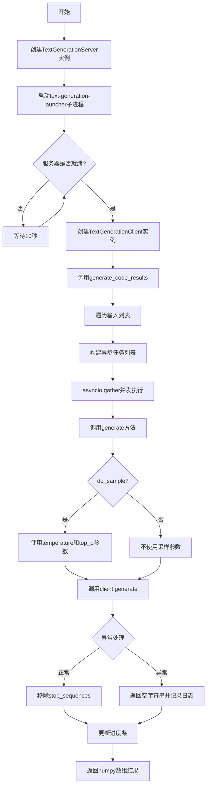

## 类结构

```
TextGenerationServer (服务器启动类)
└── __del__ (析构方法)
TextGenerationClient (异步客户端类)
├── generate (单文本生成方法)
└── generate_code_results (批量文本生成方法)
```

## 全局变量及字段


### `master_port`
    
随机生成的主端口号(10000-20000)

类型：`int`
    


### `args`
    
启动命令参数列表

类型：`List[str]`
    


### `webserver_ready`
    
检查服务器是否就绪的内部函数

类型：`Callable`
    


### `TextGenerationServer.launcher`
    
子进程对象，用于管理text-generation-launcher进程

类型：`subprocess.Popen`
    


### `TextGenerationClient.client`
    
text_generation库的异步HTTP客户端

类型：`AsyncClient`
    


### `TextGenerationClient.stop_sequences`
    
生成文本时需要移除的停止序列列表

类型：`List[str]`
    
    

## 全局函数及方法


### `asyncio.ensure_future`

在 `TextGenerationClient.generate_code_results` 方法中，`asyncio.ensure_future` 用于将 `self.generate` 协程调度为异步任务（Task），使其可以与其他任务并发执行，最后通过 `asyncio.gather` 收集所有并发任务的结果。

参数：

- `coro`：`Coroutine`，此处为 `self.generate(input, max_new_tokens, do_sample, pbar, **kwargs)` 调用的返回值，一个异步生成文本的协程对象

返回值：`asyncio.Task`，一个 Task 对象，用于在事件循环中管理协程的执行状态和结果

#### 流程图

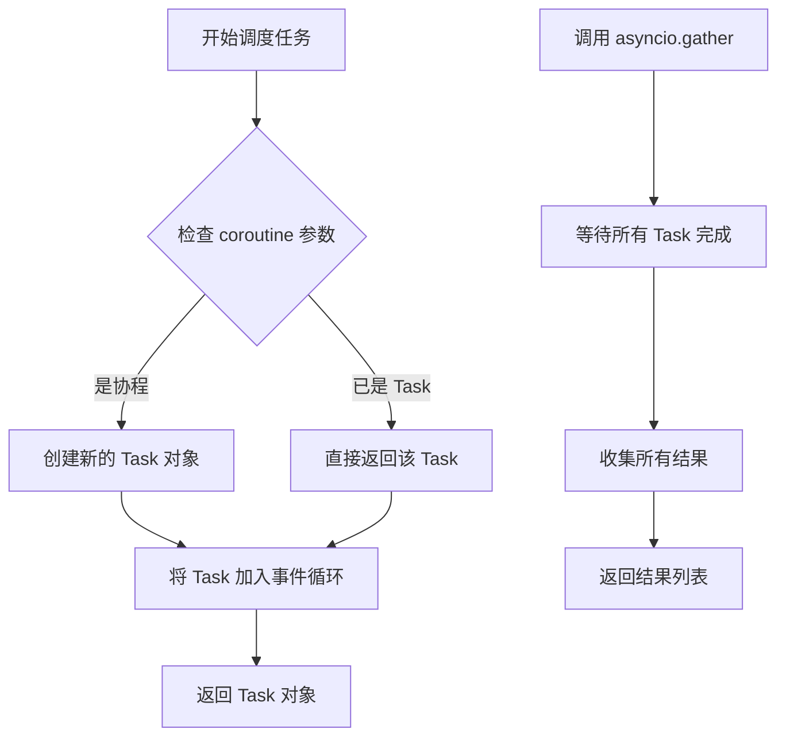

#### 带注释源码

```python
# 在 generate_code_results 方法中，遍历输入请求并为每个请求创建异步任务
for input in requests[i : i + task_size]:
    # 使用 asyncio.ensure_future 将 self.generate 协程调度为 Task
    # 参数：self.generate(input, max_new_tokens, do_sample, pbar, **kwargs)
    #   - input: str，输入文本
    #   - max_new_tokens: int，最大生成token数
    #   - do_sample: bool，是否进行采样
    #   - pbar: tqdm，进度条对象
    #   - **kwargs: dict，其他可选参数如 temperature, top_p 等
    # 返回值：asyncio.Task 对象，用于后续通过 asyncio.gather 并发等待结果
    task = asyncio.ensure_future(
        self.generate(input, max_new_tokens, do_sample, pbar, **kwargs)
    )
    tasks.append(task)

# 等待所有并发的 Task 完成，并收集所有结果
for result in await asyncio.gather(*tasks):
    results.append(result)
```

---
**补充说明**

该函数在 `TextGenerationClient.generate_code_results` 中承担了将串行生成请求转换为并发任务的关键角色。通过 `asyncio.ensure_future` + `asyncio.gather` 的组合，实现了批量文本生成请求的并发执行，有效提高了吞吐量。


### `asyncio.gather`

在 `TextGenerationClient.generate_code_results` 方法中，`asyncio.gather` 用于并发执行多个异步文本生成任务，收集所有任务的返回结果。

参数：

- `*tasks`：可变数量的 `asyncio.Task` 对象，每个 Task 代表一个异步文本生成任务（由 `asyncio.ensure_future()` 创建）

返回值：`List[str]`，返回一个包含所有异步任务执行结果的列表，结果顺序与输入的任务顺序一致

#### 流程图

```mermaid
flowchart TD
    A[开始] --> B[遍历请求列表<br/>每次处理 task_size 个]
    C[为每个输入创建异步任务] --> D[使用 asyncio.ensure_future<br/>包装 self.generate]
    D --> E[将任务添加到 tasks 列表]
    E --> F{所有任务创建完成?}
    F -->|否| --> C
    F -->|是| --> G[调用 asyncio.gather<br/>并发执行所有任务]
    G --> H[等待所有任务完成<br/>收集结果列表]
    H --> I[将结果添加到 results]
    I --> J[将 results 转换为<br/>NumPy 数组并 reshape]
    J --> K[返回最终结果]
```

#### 带注释源码

```python
# 在 TextGenerationClient.generate_code_results 方法中使用 asyncio.gather

# ... 前略 ...

# 遍历请求列表，每次处理 task_size 个请求
for i in range(0, len(requests), task_size):
    tasks = []  # 用于存储异步任务的列表
    
    # 为每个输入创建异步任务
    for input in requests[i : i + task_size]:
        # 使用 asyncio.ensure_future 创建异步任务
        # 确保 self.generate 方法作为协程被调度执行
        task = asyncio.ensure_future(
            self.generate(input, max_new_tokens, do_sample, pbar, **kwargs)
        )
        tasks.append(task)  # 将任务添加到列表
    
    # asyncio.gather: 并发执行所有异步任务
    # *tasks: 使用解包操作将任务列表展开为单独参数
    # await: 等待所有任务完成后返回结果
    # 返回值: List[str], 包含所有任务的返回结果
    for result in await asyncio.gather(*tasks):
        results.append(result)  # 将每个任务的结果添加到结果列表

# ... 后略 ...
```

---

### 关键技术说明

| 项目 | 说明 |
|------|------|
| **函数位置** | `TextGenerationClient.generate_code_results` 方法内部 |
| **使用场景** | 批量并发调用文本生成 API，提高吞吐量 |
| **并发控制** | 通过 `task_size` 参数控制单次并发任务数量，避免资源耗尽 |
| **错误处理** | `asyncio.gather` 会捕获每个任务中的异常，需要配合 `self.generate` 方法内的 try-except 块使用 |
| **返回值顺序** | 结果列表顺序与输入的任务顺序保持一致，便于后续 reshape 操作 |


### `socket.create_connection`

用于检查服务器端口是否可连接的函数，通过尝试创建到指定地址和端口的socket连接来验证服务是否就绪。

参数：

- `address`：`tuple`，目标地址元组，格式为`(host, port)`，此处使用`("127.0.0.1", 8080)`
- `timeout`：`float`，连接超时时间（秒），此处设置为`1`秒
- `source_address`：`tuple`，可选，源地址，代码中未使用

返回值：`socket.socket`，返回创建的socket对象，调用`.close()`方法关闭连接以释放资源

#### 流程图

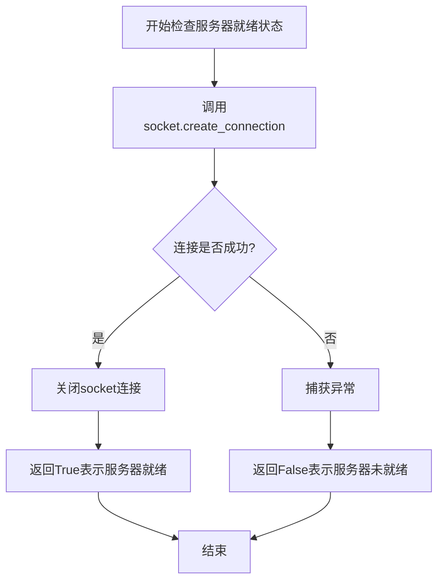

#### 带注释源码

```python
def webserver_ready():
    """
    检查文本生成服务器是否已启动并就绪
    通过尝试连接到服务器端口来验证服务可用性
    """
    try:
        # 尝试创建到本地8080端口的TCP连接，超时时间1秒
        # 如果服务器已启动并监听该端口，连接会成功建立
        # 返回的socket对象需要立即关闭以释放资源
        socket.create_connection(("127.0.0.1", 8080), timeout=1).close()
        # 连接成功，返回True表示服务器已就绪
        return True
    except (socket.timeout, ConnectionRefusedError):
        # 处理两种可能的异常情况：
        # 1. socket.timeout: 连接超时，说明服务器未响应
        # 2. ConnectionRefusedError: 端口拒绝连接，服务器未启动
        # 返回False表示服务器尚未就绪
        return False
```


### `time.sleep`

`time.sleep` 是 Python 标准库中的函数，用于将当前线程休眠（即暂停执行）指定的秒数。在该代码中，它用于在等待文本生成服务器启动时进行周期性检查，每隔 10 秒检查一次服务器是否就绪。

参数：

- `seconds`：`float` 或 `int`，休眠的秒数。在该代码中传入值为 `10`，表示每次检查间隔 10 秒。

返回值：`None`，该函数不返回任何值。

#### 流程图

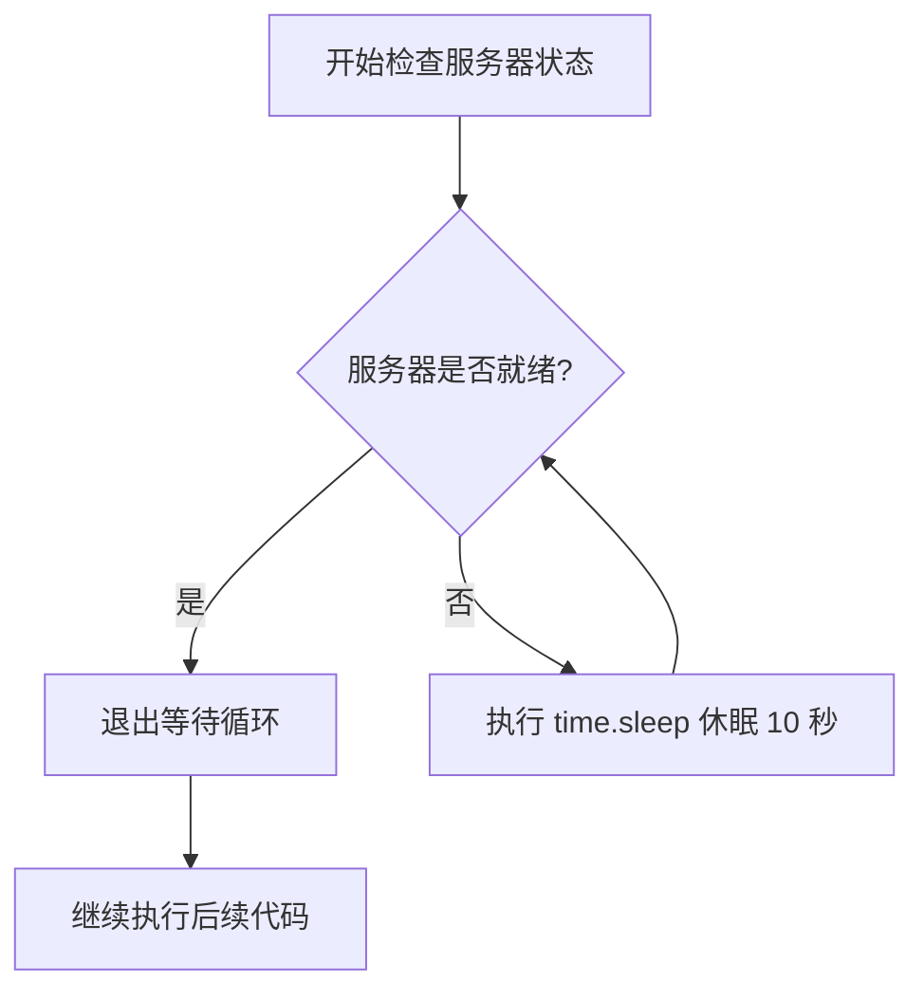

#### 带注释源码

```python
# time.sleep 的使用场景：在 TextGenerationServer 类的初始化方法中
# 用于等待文本生成服务器启动完成

# 定义一个函数用于检查 Web 服务器是否就绪
def webserver_ready():
    try:
        # 尝试连接到本地 8080 端口
        socket.create_connection(("127.0.0.1", 8080), timeout=1).close()
        # 连接成功，返回 True 表示服务器就绪
        return True
    except (socket.timeout, ConnectionRefusedError):
        # 连接失败（超时或拒绝），返回 False 表示服务器未就绪
        return False

# 循环检查服务器状态，直到服务器就绪为止
while not webserver_ready():
    # 服务器未就绪时，休眠 10 秒后再次检查
    # time.sleep 会阻塞当前线程指定的时间
    time.sleep(10)

# 服务器就绪后，记录日志并继续执行
logger.info("Text generation webserver ready")
```

#### 技术细节说明

| 项目 | 说明 |
|------|------|
| 函数位置 | Python 标准库 `time` 模块 |
| 线程影响 | 仅阻塞调用该函数的线程，不影响其他线程或进程 |
| 精度 | 实际休眠时间可能受到系统调度影响，通常精确到毫秒级 |
| 异常 | 如果传入负数或 0，会抛出 `ValueError` 异常 |
| 在代码中的作用 | 实现轮询机制，定期检查服务器启动状态，避免频繁 CPU 占用 |

#### 潜在优化建议

1. **使用指数退避策略**：当前每 10 秒检查一次，可以考虑初始间隔较短（如 1 秒），然后逐渐增加到 10 秒，以加快启动速度。
2. **添加最大等待时间限制**：避免无限等待，可以设置最大等待时间，超时后抛出异常或采取其他措施。
3. **考虑使用事件驱动**：利用 asyncio 或线程事件机制，在服务器就绪时主动通知，而不是轮询。


### `TextGenerationServer.__init__`

初始化文本生成服务器，启动子进程（text-generation-launcher）并等待服务器就绪，同时设置随机主端口用于内部通信。

参数：

- `model_id`：`str`，模型标识符，指定要加载的模型
- `port`：`int`，外部访问端口，客户端通过此端口连接服务
- `dtype`：`str`，数据类型（如 float16、float32 等），指定模型权重的数据类型
- `max_input_len`：`int`，最大输入长度，限制输入序列的最大 token 数
- `max_total_tokens`：`int`，最大总 token 数，限制输入+输出的最大 token 数量
- `max_batch_prefill_tokens`：`int`，批次预填充最大 token 数，控制预填充阶段的批处理大小
- `num_shards`：`int`，分片数量，指定模型使用的 GPU 数量

返回值：`None`，构造函数无返回值

#### 流程图

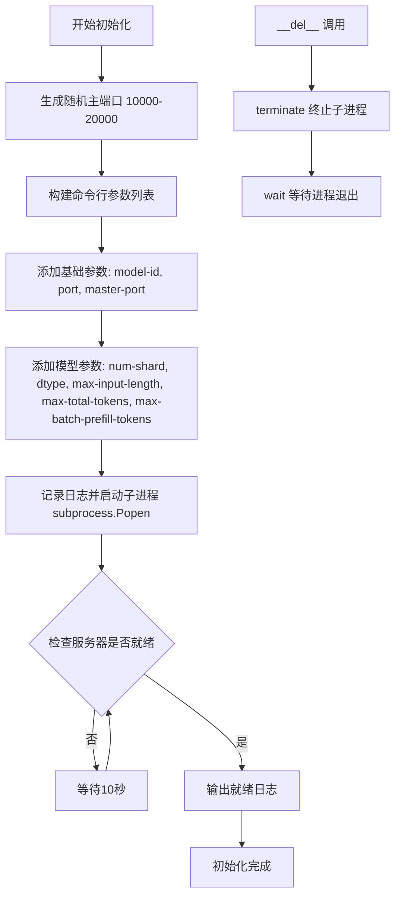

#### 带注释源码

```
class TextGenerationServer:
    def __init__(
        self,
        model_id: str,
        port: int,
        dtype: str,
        max_input_len: int,
        max_total_tokens: int,
        max_batch_prefill_tokens: int,
        num_shards: int,
    ):
        # 生成随机主端口（10000-20000），用于 launcher 内部通信
        master_port = random.randint(10_000, 20_000)
        
        # 构建 text-generation-launcher 命令行参数列表
        args = [
            "text-generation-launcher",  # 启动器可执行文件
            "--model-id", model_id,      # 模型标识符
            "--port", str(port),         # 对外服务端口
            "--master-port", str(master_port),  # 主进程通信端口
        ]

        # 添加分片数量参数
        args.extend(["--num-shard", str(num_shards)])
        # 添加数据类型参数
        args.extend(["--dtype", dtype])
        # 添加最大输入长度参数
        args.extend(["--max-input-length", str(max_input_len)])
        # 添加最大总 token 数参数
        args.extend(["--max-total-tokens", str(max_total_tokens)])
        # 添加最大批次预填充 token 数参数
        args.extend(["--max-batch-prefill-tokens", str(max_batch_prefill_tokens)])

        # 记录启动参数日志
        logger.info(" ".join(args))
        # 启动子进程运行 text-generation-launcher，stdout 重定向到 DEVNULL
        self.launcher = subprocess.Popen(args, stdout=subprocess.DEVNULL)
        logger.info("Waiting for text generation server to start...")

        # 定义检查服务器是否就绪的内部函数
        def webserver_ready():
            try:
                # 尝试连接本地 8080 端口，超时时间 1 秒
                socket.create_connection(("127.0.0.1", 8080), timeout=1).close()
                return True
            except (socket.timeout, ConnectionRefusedError):
                return False

        # 轮询检查服务器是否就绪，每 10 秒检查一次
        while not webserver_ready():
            time.sleep(10)
        logger.info("Text generation webserver ready")

    # 析构函数：清理子进程资源
    def __del__(self):
        self.launcher.terminate()  # 发送终止信号
        self.launcher.wait()       # 等待进程完全退出
```


### `TextGenerationServer.__del__`

析构函数，当 `TextGenerationServer` 对象被垃圾回收或程序结束时调用，用于终止通过 `subprocess.Popen` 启动的文本生成服务器进程。

参数：无（除隐式 `self` 参数外）

返回值：`None`，无返回值

#### 流程图

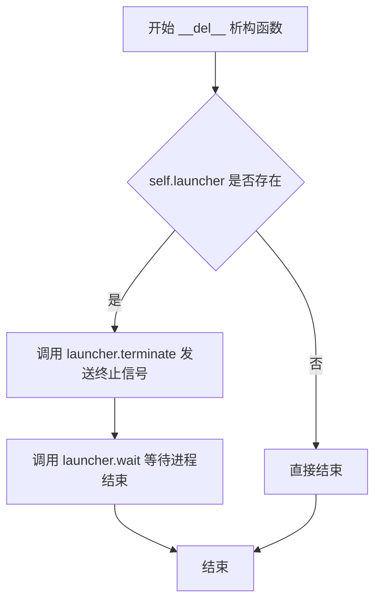

#### 带注释源码

```python
def __del__(self):
    """
    析构函数，当对象被销毁时自动调用
    用于清理启动的子进程资源
    """
    self.launcher.terminate()  # 向子进程发送 SIGTERM 信号，优雅地终止服务器
    self.launcher.wait()      # 阻塞等待子进程完全退出，确保资源释放
```


### `TextGenerationClient.generate`

异步生成单个文本，支持采样参数，根据 do_sample 决定是否使用 top_p 和 temperature 进行采样生成，并移除 stop sequences 后返回生成的文本。

参数：

- `input`：`str`，输入提示文本
- `max_new_tokens`：`int`，生成的最大新 token 数量
- `do_sample`：`bool`，是否使用采样模式，为 true 时使用 top_p 和 temperature 参数
- `pbar`：`tqdm`，进度条对象，用于跟踪生成任务进度
- `**kwargs`：可选参数，包含 `top_p`（采样核概率，默认为 0.95）和 `temperature`（采样温度，默认为 0.8）

返回值：`str`，处理后的生成文本（已移除 stop sequences），异常时返回空字符串

#### 流程图

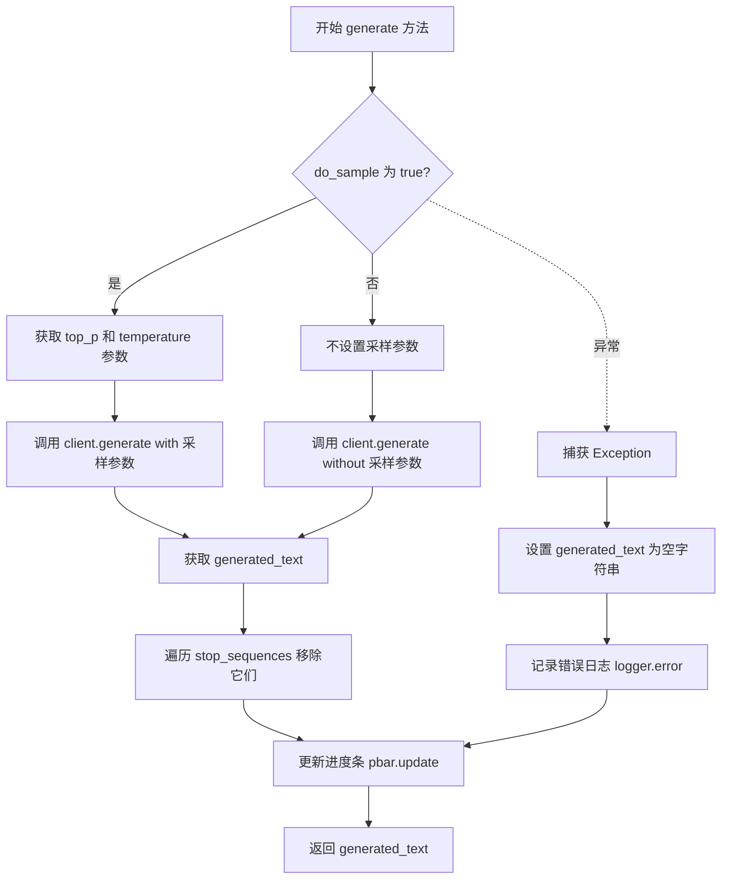

#### 带注释源码

```python
async def generate(
    self,
    input: str,
    max_new_tokens: int,
    do_sample: bool,
    pbar: tqdm,
    **kwargs,
) -> str:
    """
    异步生成单个文本，支持采样参数
    
    参数:
        input: 输入提示文本
        max_new_tokens: 生成的最大新 token 数量
        do_sample: 是否使用采样模式
        pbar: 进度条对象
        **kwargs: 可选参数，包含 top_p 和 temperature
    
    返回:
        处理后的生成文本，异常时返回空字符串
    """
    try:
        # 判断是否使用采样模式
        if do_sample:
            # 从 kwargs 中获取采样参数，默认为 top_p=0.95, temperature=0.8
            top_p = kwargs.get("top_p", 0.95)
            temperature = kwargs.get("temperature", 0.8)
            
            # 调用异步客户端生成文本，使用采样参数
            output = await self.client.generate(
                input,
                max_new_tokens=max_new_tokens,
                stop_sequences=self.stop_sequences,
                do_sample=do_sample,
                temperature=temperature,
                top_p=top_p,
            )
        else:
            # 非采样模式，不传递 temperature 和 top_p 参数
            output = await self.client.generate(
                input,
                max_new_tokens=max_new_tokens,
                stop_sequences=self.stop_sequences,
                do_sample=do_sample,
            )
        
        # 获取生成的文本
        generated_text = output.generated_text
        
        # 移除所有 stop sequences
        for stop_sequence in self.stop_sequences:
            generated_text = generated_text.replace(stop_sequence, "")

    except Exception as e:
        # 异常处理：返回空字符串并记录错误
        generated_text = ""
        logger.error(e)
    
    # 更新进度条
    pbar.update()
    return generated_text
```


### `TextGenerationClient.generate_code_results`

异步批量生成多个文本结果，根据输入列表和输出数量并发调用文本生成接口，最终将结果整理为二维numpy数组返回。

参数：

- `self`：`TextGenerationClient`，TextGenerationClient 实例本身
- `inputs`：`List[str]`，输入文本列表，每个元素将独立生成文本
- `max_new_tokens`：`int`，生成的最大新 token 数量，若<=0 则默认为 32
- `num_outputs`：`int`，每个输入需要生成的输出数量，用于决定是否启用采样
- `task_size`：`int = 50`，任务批处理大小，控制在一次异步调用中处理的任务数量
- `**kwargs`：其他关键字参数，会透传给 `generate` 方法（如 temperature、top_p 等采样参数）

返回值：`np.array`，形状为 `(len(inputs), num_outputs)` 的二维 numpy 数组，每行对应一个输入的多个生成结果

#### 流程图

```mermaid
flowchart TD
    A[开始 generate_code_results] --> B[创建 tqdm 进度条<br/>总数: len(inputs) * num_outputs]
    B --> C{检查 max_new_tokens}
    C -->|max_new_tokens <= 0| D[设置 max_new_tokens = 32]
    C -->|max_new_tokens > 0| E[保持原值]
    D --> F[计算 do_sample<br/>do_sample = num_outputs > 1]
    E --> F
    F --> G[展开输入列表<br/>requests = input 重复 num_outputs 次]
    G --> H[分批处理: i 从 0 到 len(requests), 步长 task_size]
    H --> I[创建当前批次异步任务列表]
    I --> J[为每个输入调用 self.generate]
    J --> K[asyncio.ensure_future 包装异步任务]
    K --> L[asyncio.gather 并发执行所有任务]
    L --> M[收集结果到 results 列表]
    M --> N{是否还有剩余批次?}
    N -->|是| H
    N -->|否| O[结果重塑为二维数组<br/>np.array(results).reshape(len(inputs), num_outputs)]
    O --> P[返回 numpy 数组]
```

#### 带注释源码

```python
async def generate_code_results(
    self,
    inputs: List[str],
    max_new_tokens: int,
    num_outputs: int,
    task_size: int = 50,
    **kwargs,
) -> np.array:
    """
    异步批量生成多个文本结果
    
    参数:
        inputs: 输入文本列表
        max_new_tokens: 最大新token数量
        num_outputs: 每个输入需要生成的输出数量
        task_size: 任务批处理大小，默认为50
        **kwargs: 其他关键字参数，透传给generate方法
    
    返回:
        形状为 (len(inputs), num_outputs) 的二维numpy数组
    """
    # 创建进度条，总数 = 输入数 × 每个输入的输出数
    with tqdm(
        total=len(inputs * num_outputs), desc="Fetching code generation results"
    ) as pbar:
        results = []
        # 确保 max_new_tokens 至少为 32
        max_new_tokens = max_new_tokens if max_new_tokens > 0 else 32
        # 只有当 num_outputs > 1 时才启用采样
        do_sample = num_outputs > 1
        # 将输入列表展开，每个输入重复 num_outputs 次
        requests = [input for input in inputs for _ in range(num_outputs)]
        # 分批处理请求，每批最多 task_size 个任务
        for i in range(0, len(requests), task_size):
            tasks = []
            # 为当前批次的每个输入创建异步任务
            for input in requests[i : i + task_size]:
                task = asyncio.ensure_future(
                    self.generate(input, max_new_tokens, do_sample, pbar, **kwargs)
                )
                tasks.append(task)
            # 并发执行当前批次的所有任务并收集结果
            for result in await asyncio.gather(*tasks):
                results.append(result)
        # 将结果重塑为二维数组：每行对应一个输入的多个输出
        results = np.array(results).reshape(len(inputs), num_outputs)
    return results
```

## 关键组件


### 一段话描述

该代码实现了一个文本生成服务的客户端-服务器架构，通过启动 `text-generation-launcher` 子进程管理文本生成服务器，并提供异步客户端接口支持单条和批量文本生成任务，同时包含进程生命周期管理和服务器就绪检测机制。

### 文件的整体运行流程

1. **服务启动阶段**：实例化 `TextGenerationServer` 时，构建命令行参数并启动 `text-generation-launcher` 子进程，然后循环检测 127.0.0.1:8080 端口直到服务就绪
2. **客户端初始化阶段**：创建 `TextGenerationClient` 对象，配置停止序列和 AsyncClient
3. **单次生成流程**：调用 `generate()` 方法时，根据 `do_sample` 参数选择是否使用采样参数，调用远程服务生成文本后移除停止序列
4. **批量生成流程**：调用 `generate_code_results()` 方法时，将输入复制 `num_outputs` 份后分批异步执行，收集结果后 reshape 为二维数组
5. **清理阶段**：程序结束时调用 `__del__` 方法终止子进程

### 类的详细信息

#### 类字段

| 字段名称 | 类型 | 描述 |
|---------|------|------|
| launcher | subprocess.Popen | 文本生成服务器的子进程对象 |

| 字段名称 | 类型 | 描述 |
|---------|------|------|
| client | AsyncClient | Hugging Face text-generation 库的异步客户端 |
| stop_sequences | List[str] | 生成时需要移除的停止序列列表 |

#### 类方法

##### TextGenerationServer.__init__

- **参数**：
  - `model_id`: str - Hugging Face 模型 ID
  - `port`: int - 服务端口号
  - `dtype`: str - 数据类型（如 float16）
  - `max_input_len`: int - 最大输入长度
  - `max_total_tokens`: int - 最大总 token 数
  - `max_batch_prefill_tokens`: int - 批处理预填充最大 token 数
  - `num_shards`: int - 分片数量
- **返回值**：无
- **描述**：构造命令行参数，启动 text-generation-launcher 子进程，并等待服务就绪
- **mermaid 流程图**：
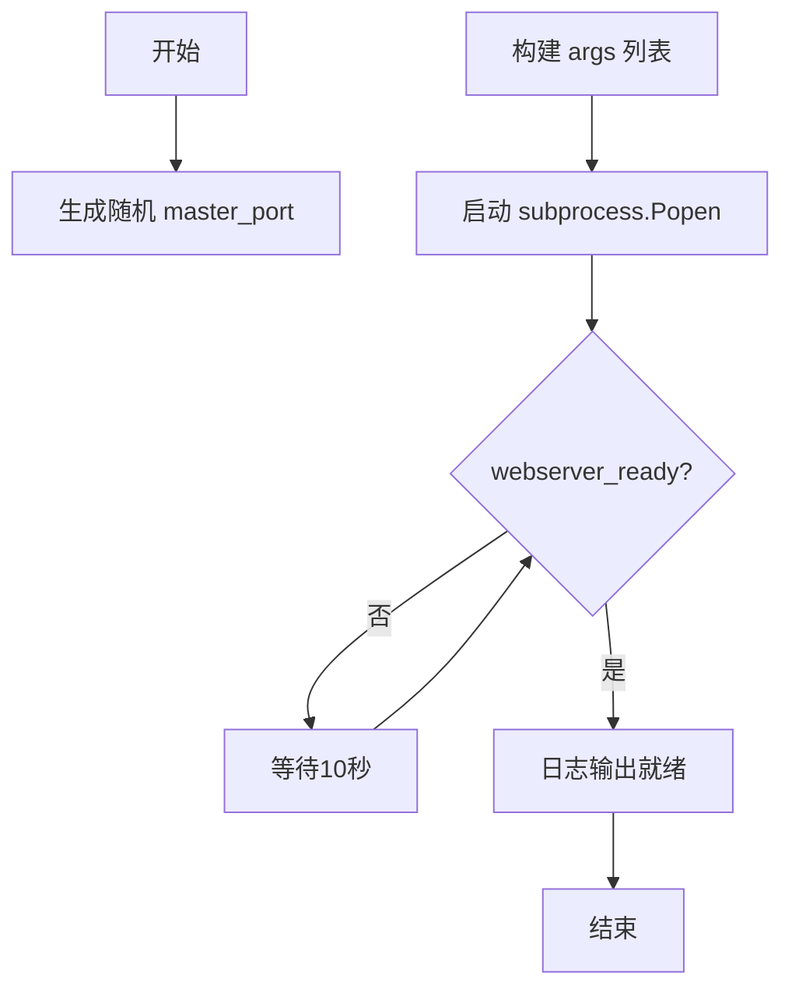
- **源码**：
```python
def __init__(
    self,
    model_id: str,
    port: int,
    dtype: str,
    max_input_len: int,
    max_total_tokens: int,
    max_batch_prefill_tokens: int,
    num_shards: int,
):
    # 生成随机端口避免冲突
    master_port = random.randint(10_000, 20_000)
    # 构建命令行参数列表
    args = [
        "text-generation-launcher",
        "--model-id", model_id,
        "--port", str(port),
        "--master-port", str(master_port),
    ]
    # 添加各配置参数
    args.extend(["--num-shard", str(num_shards)])
    args.extend(["--dtype", dtype])
    args.extend(["--max-input-length", str(max_input_len)])
    args.extend(["--max-total-tokens", str(max_total_tokens)])
    args.extend(["--max-batch-prefill-tokens", str(max_batch_prefill_tokens)])
    
    logger.info(" ".join(args))
    # 启动子进程，输出重定向到 DEVNULL
    self.launcher = subprocess.Popen(args, stdout=subprocess.DEVNULL)
    logger.info("Waiting for text generation server to start...")

    # 定义端口检测函数
    def webserver_ready():
        try:
            socket.create_connection(("127.0.0.1", 8080), timeout=1).close()
            return True
        except (socket.timeout, ConnectionRefusedError):
            return False

    # 轮询等待服务就绪
    while not webserver_ready():
        time.sleep(10)
    logger.info("Text generation webserver ready")
```

##### TextGenerationServer.__del__

- **参数**：无
- **返回值**：无
- **描述**：析构函数，终止子进程并等待其退出
- **mermaid 流程图**：
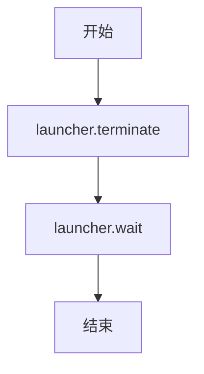
- **源码**：
```python
def __del__(self):
    self.launcher.terminate()
    self.launcher.wait()
```

##### TextGenerationClient.__init__

- **参数**：
  - `port`: int - 服务端口
  - `stop_sequences`: List[str] - 停止序列列表
- **返回值**：无
- **描述**：初始化 AsyncClient 和停止序列
- **源码**：
```python
def __init__(self, port, stop_sequences: List[str]):
    self.client = AsyncClient(f"http://127.0.0.1:{port}", timeout=9999)
    self.stop_sequences = stop_sequences
```

##### TextGenerationClient.generate

- **参数**：
  - `input`: str - 输入文本
  - `max_new_tokens`: int - 最大生成 token 数
  - `do_sample`: bool - 是否使用采样
  - `pbar`: tqdm - 进度条对象
  - `**kwargs`: dict - 其他参数（如 top_p, temperature）
- **返回值**：str - 生成的文本（移除停止序列后）
- **描述**：异步调用远程文本生成服务，处理生成结果
- **mermaid 流程图**：
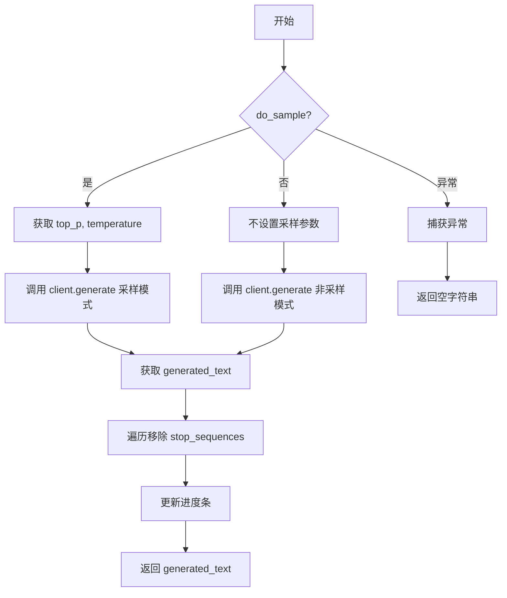
- **源码**：
```python
async def generate(
    self,
    input: str,
    max_new_tokens: int,
    do_sample: bool,
    pbar: tqdm,
    **kwargs,
) -> str:
    try:
        if do_sample:
            top_p = kwargs.get("top_p", 0.95)
            temperature = kwargs.get("temperature", 0.8)
            output = await self.client.generate(
                input,
                max_new_tokens=max_new_tokens,
                stop_sequences=self.stop_sequences,
                do_sample=do_sample,
                temperature=temperature,
                top_p=top_p,
            )
        else:
            output = await self.client.generate(
                input,
                max_new_tokens=max_new_tokens,
                stop_sequences=self.stop_sequences,
                do_sample=do_sample,
            )
        generated_text = output.generated_text
        # 移除所有停止序列
        for stop_sequence in self.stop_sequences:
            generated_text = generated_text.replace(stop_sequence, "")

    except Exception as e:
        generated_text = ""
        logger.error(e)
    pbar.update()
    return generated_text
```

##### TextGenerationClient.generate_code_results

- **参数**：
  - `inputs`: List[str] - 输入文本列表
  - `max_new_tokens`: int - 最大生成 token 数
  - `num_outputs`: int - 每个输入的输出数量
  - `task_size`: int - 批处理大小，默认 50
  - `**kwargs`: dict - 其他参数
- **返回值**：np.array - 二维数组，shape 为 (len(inputs), num_outputs)
- **描述**：批量异步生成文本，支持多输出和分批处理
- **mermaid 流程图**：
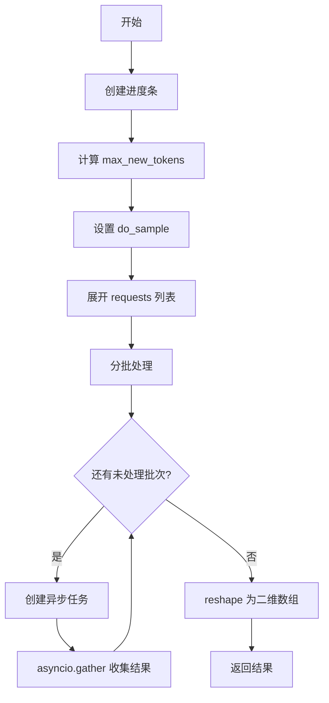
- **源码**：
```python
async def generate_code_results(
    self,
    inputs: List[str],
    max_new_tokens: int,
    num_outputs: int,
    task_size: int = 50,
    **kwargs,
) -> np.array:
    with tqdm(
        total=len(inputs * num_outputs), desc="Fetching code generation results"
    ) as pbar:
        results = []
        max_new_tokens = max_new_tokens if max_new_tokens > 0 else 32
        do_sample = num_outputs > 1
        # 将每个输入复制 num_outputs 份
        requests = [input for input in inputs for _ in range(num_outputs)]
        # 分批处理
        for i in range(0, len(requests), task_size):
            tasks = []
            for input in requests[i : i + task_size]:
                task = asyncio.ensure_future(
                    self.generate(input, max_new_tokens, do_sample, pbar, **kwargs)
                )
                tasks.append(task)
            # 等待所有任务完成
            for result in await asyncio.gather(*tasks):
                results.append(result)
        # reshape 为二维数组
        results = np.array(results).reshape(len(inputs), num_outputs)
    return results
```

### 全局变量和全局函数

代码中无全局变量和全局函数。

### 关键组件信息

### TextGenerationServer - 服务进程管理组件

负责启动和管理 text-generation-launcher 子进程，包含命令行参数构建、进程启动、服务就绪检测和生命周期管理。

### AsyncClient 封装组件

对 Hugging Face text-generation 库的 AsyncClient 进行封装，提供同步的进度条更新和停止序列后处理逻辑。

### 批量生成调度组件

实现分批异步任务调度，将大批量请求拆分为小批次并发执行，平衡并发量和内存使用。

### 进度追踪组件

集成 tqdm 进度条，在批量生成时显示整体进度和完成状态。

### 潜在的技术债务或优化空间

1. **硬编码端口问题**：服务就绪检测硬编码使用 127.0.0.1:8080，应使用动态传入的端口或从环境变量读取
2. **缺少重试机制**：网络请求失败时仅返回空字符串，缺乏重试逻辑和指数退避
3. **资源清理不完善**：`__del__` 方法中未处理进程可能已退出或正在退出的边界情况
4. **并发控制缺失**：批量生成时无最大并发数限制，可能导致资源耗尽
5. **配置分散**：多处使用魔数（如 9999 超时、10 秒等待间隔、50 默认批次大小），应提取为配置常量

### 其它项目

#### 设计目标与约束

- 支持单条和批量文本生成任务
- 通过采样控制实现多样本生成
- 异步架构提高并发吞吐量
- 服务进程独立管理，支持横向扩展

#### 错误处理与异常设计

- 网络异常捕获后返回空字符串并记录日志
- 依赖外部库的异常传播机制
- 进程终止时的超时等待防止僵尸进程

#### 数据流与状态机

- 输入文本 → 模型推理 → 输出文本 → 停止序列移除 → 返回
- 批量处理：输入列表 → 展开为请求列表 → 分批调度 → 结果聚合 → reshape 返回

#### 外部依赖与接口契约

- 依赖 `text-generation-launcher` 可执行文件（需预先安装）
- 依赖 `text_generation` 库的 AsyncClient
- 服务端点约定为 http://127.0.0.1:{port}
- 生成接口返回包含 `generated_text` 属性的响应对象

## 问题及建议


### 已知问题

-   **硬编码的服务检查地址**：在 `webserver_ready()` 函数中使用了硬编码的 `127.0.0.1:8080`，而实际启动的服务端口是动态分配的 `port` 参数，这可能导致检查逻辑失效
-   **低效的轮询机制**：使用固定 10 秒的 `time.sleep(10)` 进行服务就绪检查，没有使用指数退避或最大重试次数限制
-   **进度条更新逻辑缺陷**：`pbar.update()` 在 `generate` 方法内部调用，这意味着即使生成失败也会更新进度条，导致进度显示不准确
-   **过长的超时配置**：`AsyncClient` 的 timeout 设置为 9999 秒（约 2.8 小时），可能导致资源泄漏时长时间阻塞
-   **缺乏输入验证**：没有对 `model_id`、`port` 等参数进行有效性验证，可能导致启动失败时难以定位问题
-   **异常处理过于宽泛**：捕获所有 `Exception` 并将 `generated_text` 设为空字符串，丢失了错误上下文信息
-   **资源清理不完善**：`__del__` 方法仅调用 `terminate()`，没有处理 `kill` 作为后备方案，且没有显式的资源清理方法
-   **硬编码的任务批次大小**：`task_size=50` 硬编码在 `generate_code_results` 方法中，缺乏灵活性

### 优化建议

-   将服务检查地址改为使用构造函数传入的 `port` 参数，而非硬编码的 8080
-   实现带指数退避的等待机制，并设置最大重试次数或超时时间
-   将进度条更新移至 `generate_code_results` 方法中，基于任务完成结果更新，确保准确性
-   将 timeout 设置为合理的值（如 300 秒），或将其作为可配置参数
-   添加参数验证逻辑，如检查端口号范围、model_id 非空等
-   区分不同类型的异常处理，记录详细的错误信息并考虑重试机制
-   实现上下文管理器（`__enter__`/`__exit__`）或显式的 `close()` 方法，并添加超时处理的 kill 逻辑
-   将 `task_size` 作为可选参数，允许调用者根据实际需求调整
-   添加连接池管理和请求重试机制，提高大规模调用时的稳定性
-   考虑添加日志记录关键操作节点，便于调试和监控


## 其它


### 设计目标与约束

本项目旨在提供一个轻量级的文本生成服务客户端，能够在本地快速部署和调用大语言模型。设计约束包括：仅支持本地部署的text-generation-launcher服务，不支持远程推理；要求Python 3.8+环境；依赖异步IO模型以提高并发吞吐量；最大批处理受限于内存和任务大小参数。

### 错误处理与异常设计

异常处理采用分层策略：网络连接异常在webserver_ready()中通过socket.timeout和ConnectionRefusedError捕获；API调用异常在generate()方法中通过try-except捕获所有Exception并返回空字符串；子进程异常在__del__中通过terminate()和wait()处理。设计缺陷是异常信息仅记录日志而不向上传递，可能导致调用方无法感知具体错误原因。

### 数据流与状态机

TextGenerationServer的启动状态机：初始化 -> 构造命令行参数 -> 启动子进程 -> 循环检测8080端口 -> 就绪。TextGenerationClient的请求状态机：接收输入列表 -> 展开为num_outputs倍 -> 分批切片 -> 异步任务创建 -> gather聚合 -> reshape返回。数据流向：输入字符串列表 -> requests列表展开 -> 批量异步generate调用 -> 结果收集 -> numpy数组reshape。

### 外部依赖与接口契约

外部依赖包括：text-generation-launcher（必须本地运行）、text_generation包的AsyncClient、numpy、asyncio、loguru、tqdm。接口契约方面：TextGenerationServer构造后自动启动服务，调用方无需手动管理生命周期；TextGenerationClient.generate()返回字符串，失败时返回空字符串；TextGenerationClient.generate_code_results()返回numpy数组，形状为(len(inputs), num_outputs)。

### 并发模型与资源管理

generate_code_results()使用asyncio.gather()实现并发，task_size参数控制每批并发数量（默认50）。进度条通过tqdm实时更新，但未考虑线程安全性。资源管理由TextGenerationServer的__del__方法保证进程终止，但未处理kill信号场景。设计上应考虑使用context manager模式或async with协议。

### 配置参数与调优指南

关键配置参数：max_input_len决定单次输入上限；max_total_tokens限制输入+输出总长度；max_batch_prefill_tokens影响预填充效率；num_shards匹配GPU数量；task_size根据内存和延迟要求调整。调优建议：多GPU场景设置num_shards；高并发场景增大task_size但监控内存；生成质量敏感场景调整temperature和top_p。

### 安全性考量

当前实现存在安全风险：webserver_ready()硬编码检查127.0.0.1:8080，但master_port随机生成未验证；AsyncClient timeout设为9999秒可能导致长时间挂起；subprocess.Popen未限制环境变量可能继承父进程敏感信息。建议添加超时上限、明确环境变量隔离、端口冲突检测。

### 性能瓶颈与监控建议

性能瓶颈：webserver_ready()使用10秒sleep轮询，初始化时间长；generate_code_results()串行await gather结果，未利用asyncio的多路复用；每次generate都重新构造请求参数。监控建议：添加请求延迟日志、GPU利用率追踪、服务响应时间指标。

### 扩展性设计

当前架构扩展性受限：仅支持单模型单端口；stop_sequences在构造时固定；不支持流式输出。扩展方向：可增加模型池和负载均衡；支持动态stop_sequences；利用AsyncClient的stream接口支持流式生成。

    