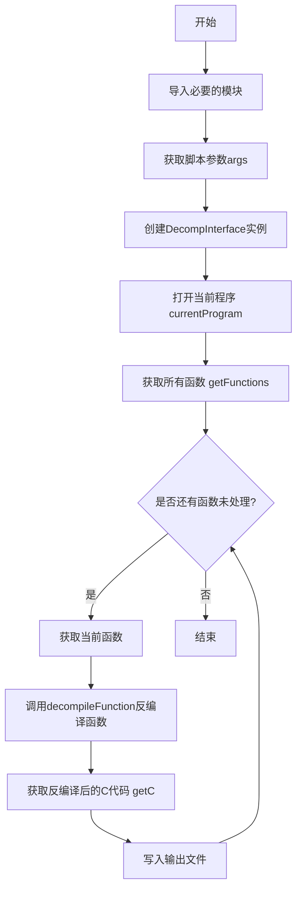
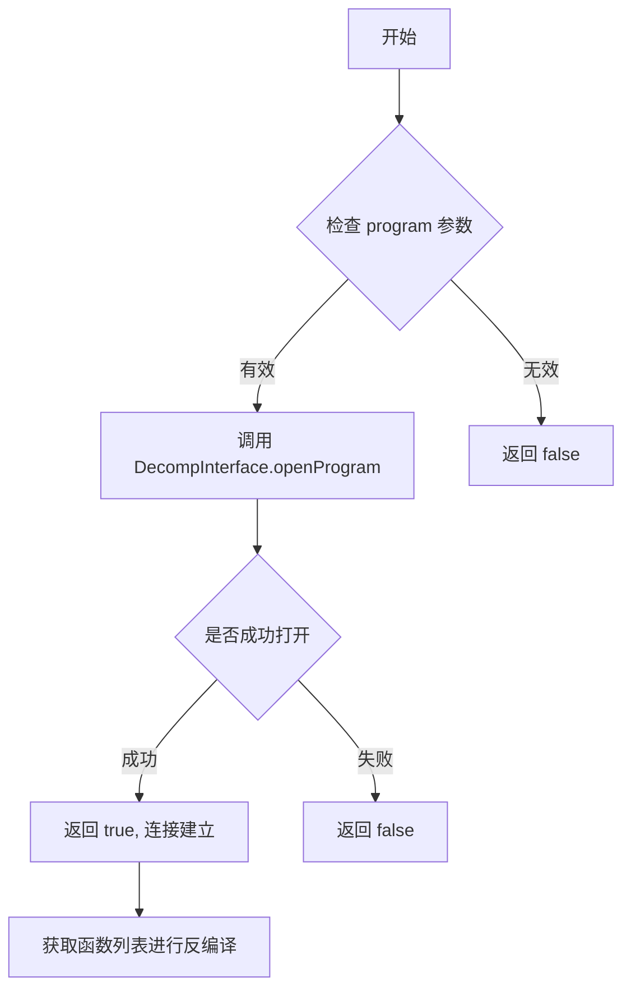
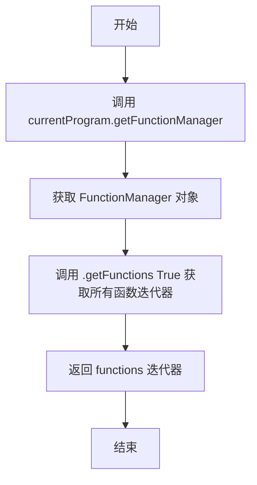
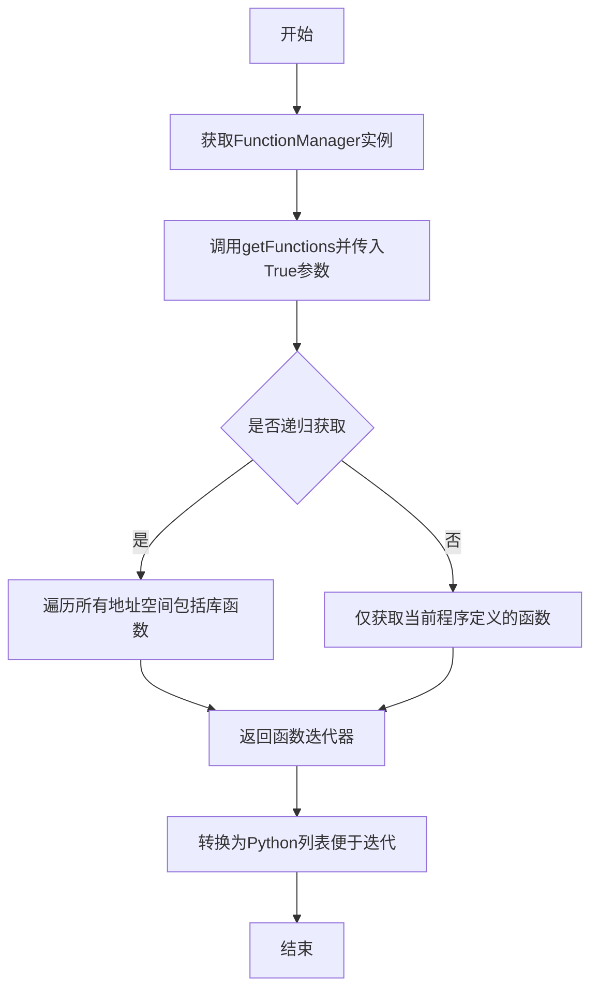
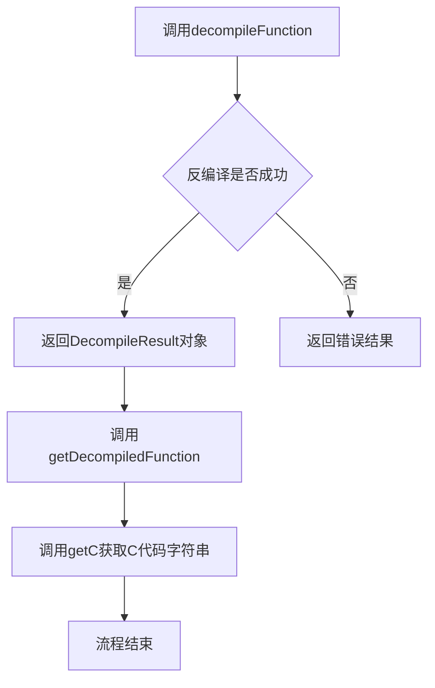
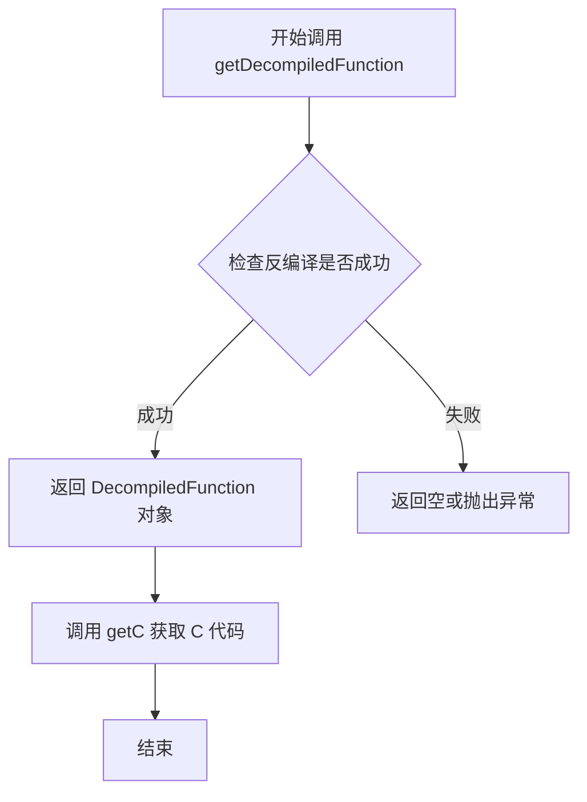
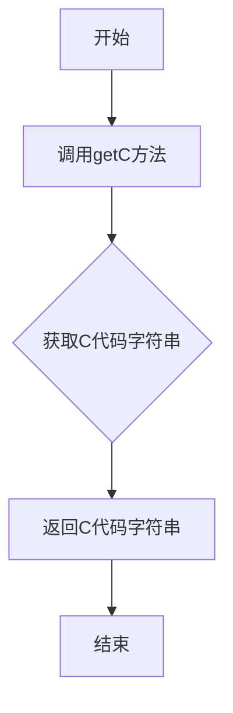
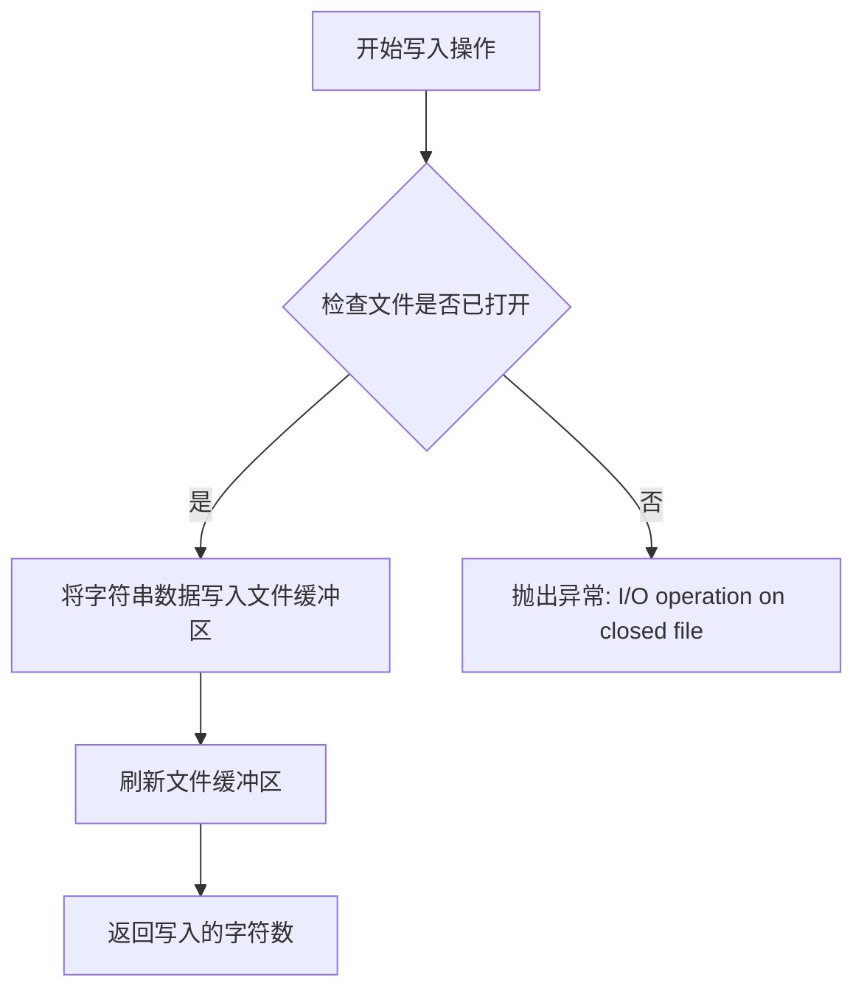

# `LLM4Decompile\ghidra\decompile.py` 详细设计文档

这是一个Ghidra Headless脚本，用于自动化反编译二进制文件中的所有函数，并将反编译后的伪C代码保存到指定的输出文件中。该脚本通过Ghidra的DecompInterface API与反编译器交互，获取当前程序的所有函数并逐个反编译。

## 整体流程



## 类结构

```
此脚本为过程式代码，无类定义
主要依赖Ghidra API的外部模块调用
```

## 全局变量及字段


### `decompinterface`
    
Ghidra反编译器接口实例，用于与Ghidra反编译器进行通信

类型：`DecompInterface`
    


### `functions`
    
当前程序的所有函数迭代器，用于遍历二进制文件中的所有函数

类型：`Iterator`
    


### `args`
    
脚本命令行参数列表，包含从Ghidra脚本环境传入的参数

类型：`list`
    


### `output_file`
    
输出文件对象，用于写入反编译后的C代码结果

类型：`file`
    


### `function`
    
当前遍历到的函数对象，代表二进制文件中的单个函数

类型：`Function`
    


### `decompiled_function`
    
反编译结果对象，包含函数的反编译C代码和相关信息

类型：`DecompiledFunction`
    


    

## 全局函数及方法


### `ghidra_app.getScriptArgs`

获取 Ghidra 脚本执行时传递的命令行参数列表，允许脚本根据用户提供的参数执行不同的操作。

参数：

- （无显式参数，Ghidra 内部方法自动接收脚本命令行参数）

返回值：`list`，返回传递给 Ghidra 脚本的命令行参数列表，通常第一个元素为输出文件名。

#### 流程图

```mermaid
flowchart TD
    A[脚本开始执行] --> B[调用 getScriptArgs 获取命令行参数]
    B --> C{参数是否有效?}
    C -->|是| D[将 args[0] 作为输出文件名]
    C -->|否| E[使用默认行为或报错]
    D --> F[继续后续脚本逻辑]
    E --> F
    
    style A fill:#f9f,color:#333
    style B fill:#bbf,color:#333
    style D fill:#bfb,color:#333
    style F fill:#dfd,color:#333
```

#### 带注释源码

```python
#!/usr/bin/env python2
# -*- coding:utf-8 -*-

"""
Python Script used to communicate with Ghidra's API.
It will decompiled all the functions of a defined binary and
save results into decompiled_output.c

The code is pretty straightforward, it includes comments and it is easy to understand.
This will help people that is starting with Automated Malware Analysis
using Headless scripts with Ghidra.

Modified from https://github.com/galoget/ghidra-headless-scripts
"""

import sys
# 导入 Ghidra 的反编译器接口
from ghidra.app.decompiler import DecompInterface
# 导入 Ghidra 的控制台任务监视器
from ghidra.util.task import ConsoleTaskMonitor
# 导入 __main__ 模块并重命名为 ghidra_app，以便调用其方法
import __main__ as ghidra_app

# 获取 Ghidra 脚本的命令行参数
# 这是 Ghidra 提供的内置方法，返回一个参数列表
# 在 headless 模式下运行脚本时，可以传递额外参数
# args[0] 通常用于指定输出文件名
args = ghidra_app.getScriptArgs()

# Communicates with Decompiler Interface
# 创建反编译器接口实例，用于与 Ghidra 反编译器交互
decompinterface = DecompInterface()

# Open Current Program
# 打开当前在 Ghidra 中加载的程序
decompinterface.openProgram(currentProgram);

# Get Binary Functions
# 获取当前程序中的所有函数（遍历模式）
functions = currentProgram.getFunctionManager().getFunctions(True)

# Prints Current Python version (2.7)
# 注意：这里使用了 Python 2 的语法
print "Current Python version: " + str(sys.version.decode())

# Iterates through all functions in the binary and decompiles them
# Then prints the Pseudo C Code
# 使用 getScriptArgs 获取的第一个参数作为输出文件名
# 打开文件准备写入反编译结果
with open(args[0], "w") as output_file:
    # 遍历程序中的所有函数
    for function in list(functions):
        # Add a comment with the name of the function
        # 在反编译代码前添加函数名注释
        # print "// Function: " + str(function)
        output_file.write("// Function: " + str(function))

        # Decompile each function
        # 使用反编译器接口对每个函数进行反编译
        # 参数：function-要反编译的函数, 0-超时时间(0表示无限), ConsoleTaskMonitor()-任务监视器
        decompiled_function = decompinterface.decompileFunction(function, 0, ConsoleTaskMonitor())
        
        # Print Decompiled Code
        # 将反编译后的 C 代码写入文件
        # print decompiled_function.getDecompiledFunction().getC()
        output_file.write(decompiled_function.getDecompiledFunction().getC())
```


### `DecompInterface.openProgram`

打开 Ghidra 中的程序，建立反编译器与目标程序的连接，以便后续对二进制文件中的函数进行反编译操作。

参数：

- `program`：`Object`（Ghidra Program 对象），在此代码中传入 `currentProgram`，表示 Ghidra 当前加载的二进制程序

返回值：`boolean`，如果成功打开程序返回 `true`，否则返回 `false`

#### 流程图



#### 带注释源码

```python
# 与反编译器接口通信
# 创建 DecompInterface 实例，用于调用反编译器功能
decompinterface = DecompInterface()

# 打开当前程序
# 这是关键步骤：建立反编译器与 Ghidra 中加载的二进制程序的连接
# currentProgram 是 Ghidra 提供的内置变量，代表当前在 Ghidra 中打开的程序
# openProgram 方法接收一个 Program 对象作为参数
decompinterface.openProgram(currentProgram);

# 获取二进制文件中的所有函数
# 在 openProgram 成功调用后才能正确获取函数列表
functions = currentProgram.getFunctionManager().getFunctions(True)
```


### `currentProgram.getFunctionManager`

获取 Ghidra 当前程序的函数管理器，用于访问二进制文件中所有函数的信息。

参数：

- 该方法无参数

返回值：`FunctionManager`，返回 Ghidra 程序的函数管理器对象，可用于遍历和分析二进制文件中的所有函数。

#### 流程图



#### 带注释源码

```python
# 获取当前程序的函数管理器
# FunctionManager 对象负责管理程序中的所有函数
function_manager = currentProgram.getFunctionManager()

# 使用函数管理器的 getFunctions 方法获取所有函数
# 参数 True 表示递归遍历所有函数（包括库函数）
# 返回值是一个迭代器，包含程序中所有的 Function 对象
functions = currentProgram.getFunctionManager().getFunctions(True)

# 完整调用链解析：
# 1. currentProgram - 获取当前加载的程序对象
# 2. .getFunctionManager() - 调用无参方法，获取 FunctionManager 实例
# 3. .getFunctions(True) - 调用 getFunctions 方法，参数 True 表示深度优先遍历
```


### `getFunctions(True)` - 获取所有函数

该方法通过Ghidra的FunctionManager获取当前加载二进制程序中的所有函数，参数True表示递归遍历所有地址空间（包括库函数），返回包含所有函数对象的迭代器，用于后续的反编译处理。

参数：

- `recursive`：`Boolean`，当设置为`True`时，会递归遍历所有地址空间（包括外部库函数）；设置为`False`则仅获取当前程序定义的函数

返回值：`Iterable<Function>`，返回函数对象的迭代器（实际上返回的是Java的Iterator），每个Function对象代表二进制中的一个函数，可用于后续的反编译操作

#### 流程图



#### 带注释源码

```python
# 获取二进制文件的所有函数
# 参数True表示递归获取，包括所有地址空间的函数（包括库函数）
functions = currentProgram.getFunctionManager().getFunctions(True)

# 转换为Python列表以便多次迭代和索引操作
# 这样可以避免在迭代过程中因迭代器耗尽导致的问题
for function in list(functions):
    # 输出函数名作为注释
    output_file.write("// Function: " + str(function))
    
    # 调用反编译接口对每个函数进行反编译
    # 参数0表示超时时间（0表示无超时限制）
    # ConsoleTaskMonitor()用于监控反编译任务进度
    decompiled_function = decompinterface.decompileFunction(function, 0, ConsoleTaskMonitor())
    
    # 获取反编译后的C代码并写入输出文件
    output_file.write(decompiled_function.getDecompiledFunction().getC())
```

#### 补充说明

| 属性 | 详情 |
|------|------|
| 所属类 | `FunctionManager` (Ghidra Java类) |
| 调用方式 | 通过`currentProgram.getFunctionManager()`获取管理器实例 |
| 实际返回类型 | `java.util.Iterator` (Java迭代器) |
| 函数对象类型 | `ghidra.program.model.listing.Function` |
| 潜在优化 | 建议在大型二进制文件上使用流式处理而非一次性转换为列表，以减少内存占用 |


# Ghidra 反编译脚本详细设计文档

## 一段话描述

该脚本是一个Ghidra Headless脚本，通过调用Ghidra的DecompInterface API迭代反编译目标二进制文件中的所有函数，并将反编译后的C代码输出到指定的文件中，主要用于自动化恶意软件分析场景。

---

## 文件的整体运行流程

```
开始
  ↓
获取脚本参数(args[0] - 输出文件路径)
  ↓
初始化DecompInterface
  ↓
打开当前Program
  ↓
获取所有函数(Iterator)
  ↓
打开输出文件
  ↓
遍历函数列表 ─────────────────────────────────────┐
  │                                                │
  ↓                                                │
写入函数名注释                                      │
  ↓                                                │
调用decompileFunction反编译                        │
  ↓                                                │
获取反编译结果并写入文件                            │
  ↓                                                │
遍历结束? ──是──→ 关闭文件 → 结束                   │
          ↓否                                     │
          └────────────────────────────────────────┘
```

---

## 类的详细信息

### 1. DecompInterface 类

**模块：** `ghidra.app.decompiler.DecompInterface`

**描述：** Ghidra反编译器接口类，提供与反编译器交互的核心功能。

#### 类字段

- 无公开类字段

#### 类方法

| 方法名 | 功能描述 |
|--------|----------|
| `openProgram(Program)` | 打开要反编译的程序 |
| `decompileFunction(Function, int, TaskMonitor)` | 反编译指定的函数 |

---

### 2. ConsoleTaskMonitor 类

**模块：** `ghidra.util.task.ConsoleTaskMonitor`

**描述：** 控制台任务监视器，用于监控长时间运行的任务进度。

#### 类字段

- 无公开类字段

#### 类方法

- 构造函数无需参数，用于创建监视器实例

---

### 3. 当前脚本模块

#### 全局变量

| 变量名 | 类型 | 描述 |
|--------|------|------|
| `sys` | `module` | Python标准库模块，用于版本信息 |
| `DecompInterface` | `class` | Ghidra反编译接口类 |
| `ConsoleTaskMonitor` | `class` | Ghidra任务监视器类 |
| `ghidra_app` | `module` | Ghidra脚本主模块，通过__main__导入 |
| `args` | `list` | 脚本命令行参数列表 |
| `decompinterface` | `DecompInterface` | 反编译器接口实例 |
| `currentProgram` | `Program` | Ghidra当前打开的程序对象 |
| `functions` | `Iterator<Function>` | 二进制文件中所有函数的迭代器 |
| `output_file` | `file` | 输出文件对象 |
| `function` | `Function` | 当前遍历到的函数对象 |
| `decompiled_function` | `DecompileResult` | 反编译结果对象 |

---

## 提取的函数/方法详情

### `decompileFunction`

#### 基本信息

- **名称：** `DecompInterface.decompileFunction`
- **所属类：** `DecompInterface`
- **描述：** 反编译指定的函数，返回该函数的伪C代码表示

#### 参数

- **`function`**：`Function`，要反编译的目标函数对象
- **`timeout`**：`int`，反编译超时时间（毫秒），此处传入`0`表示无超时限制
- **`monitor`**：`TaskMonitor`，任务监视器，用于监控反编译进度，此处传入`ConsoleTaskMonitor()`实例

#### 返回值

- **`DecompileResult`**，`DecompileResult`对象，包含反编译结果，通过`getDecompiledFunction().getC()`获取实际C代码

#### 流程图



#### 带注释源码

```python
# 反编译单个函数的调用示例
# 参数1: function - 从functions迭代器获取的Function对象
# 参数2: 0 - 超时时间，0表示无限等待
# 参数3: ConsoleTaskMonitor() - 任务监视器实例
decompiled_function = decompinterface.decompileFunction(function, 0, ConsoleTaskMonitor())

# 从DecompileResult对象中获取反编译后的函数对象
decompiled_func = decompiled_function.getDecompiledFunction()

# 获取C代码字符串
c_code = decompiled_func.getC()

# 写入输出文件
output_file.write(c_code)
```

---

## 关键组件信息

| 组件名称 | 描述 |
|----------|------|
| **DecompInterface** | Ghidra反编译器核心接口，负责与Ghidra内核通信执行反编译操作 |
| **currentProgram** | Ghidra当前加载的二进制程序对象，由Ghidra Headless环境自动提供 |
| **FunctionManager** | Ghidra函数管理器，负责枚举和分析二进制中的所有函数 |
| **ConsoleTaskMonitor** | 控制台任务监视器，用于在反编译过程中显示进度信息 |
| **getScriptArgs()** | Ghidra API方法，获取脚本执行时传入的命令行参数 |

---

## 潜在的技术债务或优化空间

### 1. Python版本兼容性问题
- **问题：** 使用Python 2.7语法（如`print`语句、`sys.version.decode()`）
- **建议：** 迁移到Python 3，使用`print()`函数和字符串处理方法

### 2. 缺乏错误处理机制
- **问题：** 脚本未对以下情况进行异常处理：
  - `args[0]`参数缺失
  - 反编译失败
  - 文件写入失败
  - Program未正确加载
- **建议：** 添加try-except块和详细的错误日志

### 3. 反编译结果未验证
- **问题：** 未检查`decompiled_function`的返回状态，直接获取C代码
- **建议：** 调用`decompiled_function.decompile()`的返回值或`getDecompiledFunction()`是否为null进行校验

### 4. 输出格式可以更丰富
- **问题：** 仅输出纯C代码，缺少函数地址、调用关系等元信息
- **建议：** 添加函数入口点地址、函数签名等辅助信息

### 5. 参数校验缺失
- **问题：** 未验证`args[0]`是否为有效路径
- **建议：** 添加参数个数检查和路径有效性验证

### 6. 资源未显式释放
- **问题：** 未显式调用`decompinterface.close()`释放资源
- **建议：** 使用try-finally确保资源释放

---

## 其它项目

### 设计目标与约束

- **目标：** 批量反编译二进制文件中的所有函数，输出为可读的伪C代码
- **运行环境：** Ghidra Headless模式（`analyzeHeadless`）
- **输入约束：** 必须在Ghidra中已打开目标二进制程序
- **输出约束：** 第一个命令行参数指定输出文件路径

### 错误处理与异常设计

- 当前版本**无异常处理机制**
- 建议添加的错误处理场景：
  - `IndexError`：args参数为空
  - `IOException`：文件写入失败
  - `CancelledException`：反编译被用户取消
  - `NotYetLoadedException`：程序未完全加载

### 数据流与状态机

```
[Program加载] → [DecompInterface初始化] → [Program打开] 
  → [函数枚举] → [逐个反编译] → [结果写入文件]
```

### 外部依赖与接口契约

- **依赖项：**
  - Ghidra框架（`ghidra.app.decompiler`、`ghidra.util.task`）
  - Python 2.7标准库
- **接口契约：**
  - 脚本必须作为Ghidra Headless脚本运行
  - 调用前必须确保`currentProgram`已加载
  - 命令行必须至少提供一个参数（输出文件路径）


### `DecompileResult.getDecompiledFunction`

获取反编译结果的方法，返回包含反编译代码的 DecompiledFunction 对象。

参数：

- 无（该方法为无参数方法）

返回值：`DecompiledFunction`，返回包含反编译代码结果的对象，可通过调用其 `getC()` 方法获取伪 C 代码字符串。

#### 流程图



#### 带注释源码

```python
# 该方法是 Ghidra DecompileResult 类的成员方法
# 在脚本中的调用方式如下：

# 1. 首先通过 DecompInterface 的 decompileFunction 方法获取反编译结果
decompiled_function = decompinterface.decompileFunction(function, 0, ConsoleTaskMonitor())

# 2. 调用 getDecompiledFunction() 方法获取 DecompiledFunction 对象
#    此方法解析反编译结果并构建可读的反编译代码表示
decompiled_result = decompiled_function.getDecompiledFunction()

# 3. 调用 getC() 方法获取伪 C 代码字符串
c_code = decompiled_result.getC()

# 完整调用链：
# decompinterface.decompileFunction(function, 0, ConsoleTaskMonitor())
#     ↓ 返回 DecompileResult 对象
# .getDecompiledFunction()
#     ↓ 返回 DecompiledFunction 对象
# .getC()
#     ↓ 返回字符串（伪 C 代码）
```


### `DecompiledFunction.getC`

该方法是Ghidra反编译接口的一部分，用于从反编译后的函数对象中提取生成的C代码字符串。在给定的脚本中，它被调用以获取每个函数的反编译C代码，并将其写入输出文件。

参数：无显式参数（方法调用隐式引用DecompiledFunction对象本身）

返回值：`String`（字符串），返回反编译后的C代码表示。

#### 流程图



#### 带注释源码

在给定的Python脚本中，getC方法的使用方式如下：

```python
# 解码每个函数并获取反编译函数对象
decompiled_function = decompinterface.decompileFunction(function, 0, ConsoleTaskMonitor())

# 调用getC方法获取反编译后的C代码字符串，并写入输出文件
output_file.write(decompiled_function.getDecompiledFunction().getC())
```

注释：
- `decompileFunction` 方法返回一个反编译结果对象，其中包含 `DecompiledFunction` 实例。
- `getDecompiledFunction()` 检索 `DecompiledFunction` 对象。
- `getC()` 是 `DecompiledFunction` 类的方法，不接受任何参数，返回反编译后的C代码作为字符串。
- 该字符串被直接写入到由 `args[0]` 指定的输出文件中。


### `output_file.write`

该函数是 Python 文件对象的内置方法，用于将字符串内容写入到已打开的文件中。在此脚本中，用于将反编译的函数信息写入到指定的输出文件中。

参数：

- `data`：`str`，要写入文件的内容，可以是字符串或任何可以转换为字符串的对象

返回值：`int`，返回写入的字符数

#### 流程图



#### 带注释源码

```python
# 第一次写入：写入函数名称注释
# "// Function: " + str(function) 将函数名转换为字符串并拼接注释前缀
output_file.write("// Function: " + str(function))

# 第二次写入：写入反编译后的函数C代码
# decompiled_function.getDecompiledFunction().getC() 获取反编译的C代码字符串
# 然后将其写入到输出文件中
output_file.write(decompiled_function.getDecompiledFunction().getC())
```

## 关键组件


### Ghidra DecompInterface 通信组件

负责与 Ghidra 反编译器接口建立通信，打开当前程序并提供反编译功能的核心组件。

### 函数获取组件

通过 currentProgram.getFunctionManager().getFunctions(True) 获取二进制文件中的所有函数，用于后续的反编译处理。

### 反编译执行组件

调用 DecompInterface.decompileFunction() 方法对每个函数进行反编译，并获取反编译后的 C 代码内容。

### 文件输出组件

将反编译结果写入由脚本参数 args[0] 指定的输出文件，包含函数名注释和反编译的 C 代码。

### 任务监控组件

使用 ConsoleTaskMonitor() 监控反编译任务的执行状态，确保反编译过程可追踪。


## 问题及建议


### 已知问题

-   **Python 2依赖**：代码声明使用`#!/usr/bin/env python2`，且使用Python 2的print语句语法，不兼容Python 3环境
-   **缺少参数验证**：直接使用`args[0]`而未检查args数组是否为空或长度是否足够，会导致索引越界异常
-   **资源未释放**：DecompInterface使用后未调用close方法释放资源，可能导致内存泄漏
-   **无异常处理**：整个反编译流程缺少try-except块，文件写入失败或反编译错误时程序会直接崩溃
-   **超时设置为零**：`decompileFunction`的第二个参数为0，表示无超时限制，可能导致脚本在处理大型二进制时永久挂起
-   **未使用的导入**：导入了`sys`模块但仅用于版本打印，核心功能实际未依赖该模块
-   **文件写入错误未处理**：写入文件时未检查write操作的返回值，无法感知磁盘空间不足或写入失败
-   **空函数列表处理**：当binary没有函数时，`functions`为空，代码虽能处理但缺乏明确的日志输出

### 优化建议

-   将代码迁移至Python 3语法（print函数、字符串处理等）
-   在脚本开头添加参数验证：`if len(args) < 1: print("Usage: ...") ; return`
-   使用try-finally确保DecompInterface正确关闭：`try: ... finally: decompinterface.close()`
-   为`decompileFunction`设置合理的超时时间（如300秒）
-   添加异常处理捕获可能的Ghidra API异常和IO异常
-   清理注释掉的调试代码和不必要的导入
-   考虑添加进度日志输出，帮助用户了解反编译进度
-   在输出文件前检查目标目录是否存在，必要时创建目录
-   使用更规范的变量命名（如`decomp_interface`而非`decompinterface`）
-   添加功能说明和使用示例注释，提高代码可维护性


## 其它


### 设计目标与约束

本脚本的设计目标是实现自动化批量反编译二进制文件中的所有函数，并将反编译结果保存为C代码格式。主要约束包括：仅支持Ghidra Headless模式运行，依赖Ghidra 9.0+版本和Python 2.7环境，输入必须是Ghidra已加载的分析程序，输出文件路径需通过命令行参数指定。

### 错误处理与异常设计

代码中缺乏显式的错误处理机制。潜在异常包括：args参数为空导致IndexError、文件写入失败导致IOError、DecompInterface未正确初始化、currentProgram未加载导致AttributeError、decompileFunction返回null导致空指针异常。建议增加参数校验、异常捕获、日志记录和失败函数跳过机制。

### 数据流与状态机

数据流为：获取脚本参数(输出文件路径) → 初始化DecompInterface → 打开当前程序 → 获取所有函数列表 → 遍历每个函数 → 调用反编译接口 → 获取反编译结果 → 写入输出文件。状态机相对简单，主要处于"初始化"→"遍历反编译"→"完成"三种状态。

### 外部依赖与接口契约

主要依赖包括：Ghidra的DecompInterface类用于反编译、ConsoleTaskMonitor类用于任务监控、currentProgram全局对象表示当前加载的程序、getScriptArgs()获取脚本参数。接口契约要求调用者必须先在Ghidra中加载二进制文件，args[0]必须为有效的文件路径且具有写权限。

### 性能考虑

当前实现为串行处理，性能主要瓶颈在于反编译过程本身。ConsoleTaskMonitor()参数设为0表示无超时限制，可能导致长时间挂起。建议考虑：增加进度显示、设置超时时间、并行反编译（需考虑Ghidra线程安全性）、增加内存管理机制。

### 安全性考虑

代码写入文件时未做路径安全校验，可能存在路径遍历风险。输出文件使用args[0]直接传入，未验证文件路径合法性。建议增加路径校验、写入前确认目录存在、处理特殊字符转义。

### 兼容性说明

代码明确标注为Python 2.7脚本（print语句无括号），仅在Ghidra Headless模式下运行。Python 3环境下需修改print语法。不支持Windows/Linux/macOS跨平台独立运行，必须在Ghidra架构内执行。

### 已知限制

无法处理大型二进制文件（内存限制）、反编译失败函数会抛出异常、无日志输出到文件、无法指定要反编译的函数范围（全部反编译）、输出格式为纯C代码无语法高亮、无法处理带复杂指针或混淆的函数。


    